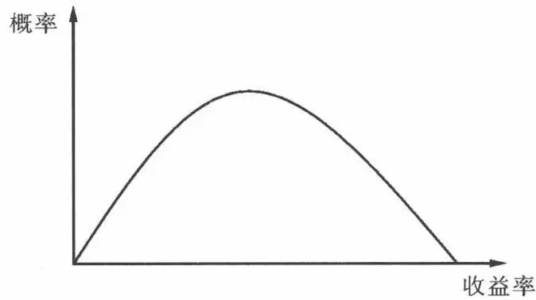

# [第1章](ch01.md) 投资的收益与风险

## 1.1 概述

投资者通过把剩余的钱投资于金融市场上,以使其未来的消费最大化。然而在投资于金融市场之前,我们要对收益与风险有一个很好的了解。收益与风险评估是投资者设计并应用投资组合时所必须考虑的。对收益与风险的论述、计算与评估将贯穿本章。在需要时,我们还将应用这些概念的特殊形式。但是,在开始分析各种各样的证券之前,我们有必要了解收益与风险的基础知识。因此,我们必须思考这些概念并学会如何分析与计算。已实现的收益,顾名思义,就是过去的收益,或是已经或本应取得的收益。由于已实现的收益已经发生,因此可以运用恰当的数据进行计算。反之,预期的收益则是指投资者预期将在未来的某个时期内从其资产中取得的收益。显然,预期收益具有不确定性,尽管我们经常用已实现的收益(历史收益)来预测预期收益,但是二者有着本质区别。

## 1.2 收益

投资者的目标是在一定的约束与风险条件下,最大化预期收益。对于投资者而言,取得投资收益至关重要,收益是投资活动的全部意义之所在。计算已实现的收益是投资者评价其投资好坏或是其委托的投资管理者投资好坏所必需的。并且，对历史收益的计算也会在评估预期收益中发挥很大的作用。

一般投资的收益由两个要素组成：

1. 收入。即在投资过程中,从投资中获得的定期的现金流。如债券的利息、股票的股利。收入的特点是发行人向资产持有人支付的现金。

2. 资本增值(损失)。另一个要素是资产价格的增值(或减值),也即价格变动。在长期情况下,它是资产的购买价与可能的或已实现的售价之间的差额;在短期情况下,它是销售价格与该短期收盘价格之间的差额。

记 TR 为总收益, I 为收入, 资本增值为 $\Delta P$ , 则

$$
T R = I + \Delta P\tag{1.1}
$$

其中 $I, \Delta P$ 均可正可负。


某投资者以 950 美元购买 10 年期的债券面值为 1000 美元的 IBM 债券, 其票面利率为 8%, 半年付息一次。3 个月后他收到一次利息, 且此时的债券价格为 1050 美元。


总收益为 $1000 \times 4\% + (1050 - 950) = 140$ 美元。



如果投资者从 t 到 $t+1$ 时刻持有一份资产,那么他所获得的简单收益率为: $R_{t}=\frac{P_{t+1}}{P_{t}}-1$

其中 $P_{t}$ 为该资产在 $t$ 时刻的价格。进一步地，投资者从1时刻开始，持有资产到 $t + 1$ 时刻所获得的总收益率为：

$$
\begin{array}{r l} R = \frac{P_{t + 1}}{P_{1}} - 1 & = \frac{P_{2}}{P_{1}} \times \frac{P_{3}}{P_{2}} \times \dots \times \frac{P_{t + 1}}{P_{t}} - 1 \\ & = (1 + R_{1}) \times (1 + R_{2}) \times \dots \times (1 + R_{t}) - 1 \end{array}
$$

### 1.2.1 算术平均值

对大多数人来说,最好的统计方法就是计算算术平均值。因此,在提及平均收益时,除非特别指明,通常应认为是指算术平均值。算术平均值通常用 $\overline{R}$ 表示,是一系列数据的平均值。计算如下:

$$
\overline{{{R}}} = \frac{\sum_{i = 1} ^{n} R_{i}}{n}\tag{1.2}
$$

某投资者投资金融市场5年。5年收益率分别为 $20\%, 15\%, -10\%, -5\%, 30\%$ ，则他在这5年的平均收益率为 $\overline{R} = \frac{0.2 + 0.15 - 0.1 - 0.05 + 0.3}{5}$ $= 10\%$ 。

### 1.2.2 几何平均值

算术平均收益是对特定时期内(如10年期的)收益数据分布的中心趋势的大致预测。然而,在一段时间内,收益以复合增长率变化,用算术平均值测算这些变化会产生误导。如某投资者投资某股票(假设无股利),买入时价格为10美元,一年后股票价格为20美元,再过一年后,股票价格为10美元。则收益率的算术平均值为 $[100\%+(-50\%)]/2=25\%$ 。显然这个不太合理,因为投资者最终一分钱没有赚,由开始的10美元变为最终的10美元,收益率为0,则平均收益率也为0。而几何平均值可以解决这个问题。

一组收益率的几何平均值由下式定义：

$$
G = \left[ \prod_{i = 1} ^{n} (1 + R_{i}) \right] ^{\frac{1}{n}} - 1\tag{1.3}
$$

其中 $R_{i}$ 为投资期间的每年收益率， $\prod_{i = 1}^{n}$ 为 $n$ 个数相乘。显然，上述的投资者的投资收益率的几何平均值为：

$$
G = \left[ (1 + 100\%) \times (1 - 50\%) \right]^{\frac{1}{2}} - 1 = 0
$$

几何收益率测算了一定时期内的复合增长率。

### 1.2.3 算术平均值与几何平均值的比较

一般而言,几何平均值都比算术平均值小,除非给定的值是相同的。两者的差异取决于给定区间的标准差;标准差越大,两者的差异就会越大。 $\left[(a+b)/2\geqslant\sqrt{a\times b}\right.$ ,当且仅当a,b相等时取等号]。

当我们需要描述金融资产的收益时,什么时候使用算术平均值,什么时候使用几何平均值具体应取决于投资者的目标:

\- 在计算单个期间的平均业绩时,算术平均值较好。在预测下一期间的预期收益时,它是最好的预测指标。

\- 在计算过去的总财富值变化时(多个期间), 几何平均值较为适用。它

是一个后向视角,计量过去特定期间财富增长的现金复合收益率。

### 1.2.4 通货膨胀调整收益

前面讨论的所有收益都是名义收益,或称之为货币收益。通常,我们日常生活中见到的收益率都是以名义利率表示的收益率,如金融机构支付的利率,固定收益证券利率等。但是我们需要考虑收益的实际购买力。为达到这一目标,我们必须分析实际收益,也就是考虑通货膨胀的作用。

名义收益与实际收益的关系为: $R \approx r + \pi^{e}$ ，其中 R 为名义收益率，r 为实际收益率， $\pi^{e}$ 为预期通货膨胀。

精确的表达式为：

$$
(1 + R) = (1 + r) (1 + \pi^{e})\tag{1.4}
$$

2004 年标准普尔 500 指数的总收益率为 10.8742%（假设每月的股息都用于再投资）。通胀率为 3.2556%。因此，在 2004 年用标准普尔 500 指数计量大盘股的实际总收益为：

$$
r = (1 + R) / (1 + \pi^{e}) - 1 = (1 + 10.8742\%) / (1 + 3.25565\%) - 1 = 7.378\%
$$

### 1.2.5 期望收益

期望收益显然是衡量未来收益的一个指标,是投资者结合自己现在所获得的信息对未来收益的一个估计。上面我们讨论了投资者投资于金融资产多年后可以获得的平均收益。已实现收益非常重要是因为投资者需要知道他们的投资组合表现如何。已实现收益还能为投资者建立对未来收益的预期做出一个非常准确的估计。

投资者的投资收益是未知的,我们必须进行估计。未来的收益是一种预期的收益,可能实现也可能不能实现。一个投资者可能预期某证券未来一年的收益为0.10,但是实际上这只是一个点估计。当投资者作出投资决策的时候,风险或者不利事件发生的可能性也就随之发生。投资者常对预期收益过度乐观。我们可以用“随机变量”这个词来描绘证券的预期收益,它是一个随机波动的不确定值。一般来说,随机变量服从一定的分布。投资者需要牢记尽管他们期望证券的收益为10%,但是这只是整个可能范围内的一个点估计。由于投资者面临的未来是不确定的,因此各种结果都有可能发生。考虑这些结果及其概率总的来说是一个收益的概率分布,包含可能发生的结果和这些结果发生的概率。概率分布中的概率总和必须等于1,因为它们必须完整地描述所有可能发生的结果。

概率分布可以是离散的,也可以是连续的。在离散的概率分布中,每个可能的结果都被指定一个概率。在连续的概率分布中,如图 1.1,存在无限多种可能性。因为概率用图 1.1 中曲线的面积来衡量。

图1.1

为了确定某个特定概率分布的一个可能性最大的结果,我们必须计算期望值,期望值是所有结果的加权平均,权重就是该种结果发生的概率。对于离散的随机变量,期望定义为

$$
E [ R ] = \sum_{i = 1} ^{m} R_{i} p_{i}
$$

其中 R 为随机变量, $R_{i}$ 为随机变量 R 在第 i 个可能性发生时的取值, $p_{i}$ 为第 i 个可能性发生时的概率。m 为出现所有结果可能性的个数。

### 1.2.6 资产组合的收益率

一个资产组合的简单收益率可以表示为它所包含的资产的简单收益率的加权平均,其中,权重就是每种资产在投资组合中所占有价值的比例。例如,对于投资组合 $X=(x_{1},x_{2},\cdots,x_{n})^{T}$ ,其中 $x_{i}$ 为资产i在投资组合总价值中所占有的比例。那么投资组合的总收益率为 $R_{t}=\sum_{i=1}^{n}x_{i}R_{it}$ 。

## 1.3 风险

对投资者而言,股票的平均收益仅仅说明了数据的中间值是多少,而并没有反映数据的离散程度。而这个数据的离散程度对于投资者来说,重要性不言而喻。这个可以用一个关于数学家的古老故事来说明。数学家认为平均值本身就可以完整地描述一个过程,结果他淹死于平均深度为2英寸的溪流中。

风险是度量投资的实际收益与预期收益之间差异的指标。风险越大,实际收益偏离预期收益的可能性越大,幅度也会越大。特别是,大多数投资者均不希望其实际收益小于预期收益。一般来说,只有当预期收益足以补偿其风险时,投资者才愿意购买该资产。但是投资者必须明白其对收益的预期可能不会实现,此时其实际收益将与预期收益有所出入。实际上,证券的实际收益会呈现出相当大的波动性,可能高于预期值,也可能低于预期值,甚至遭受无法承受的损失。

### 1.3.1 风险的来源

证券的风险来源大概可以分为两种:不可分散的风险(或者系统风险)和可分散风险(或者证券特有的风险)。

1. 不可分散风险。不可分散风险是直接与整个市场或经济的走势相关的证券总收益的波动。实际上所有证券(不论股票还是债券)都有某种程度的系统风险。它又可以具体地分为利率风险、市场风险、通胀风险、流动性风险、汇率风险、国家风险等。

1. 利率风险是由于利率水平的变化所导致的证券收益的波动。利率水平与收益呈负相关关系。虽然利率风险对债券的影响比对普通股更为直接，但其对两者的影响都是存在的，因而绝大多数投资者都应对其重点关注。

2. 市场风险是由于整个市场情况(整个股票市场)的变化所引起的收益波动而带来的风险。所有证券都面临市场风险,但其主要影响的还是普通股。

3. 通胀风险是影响所有证券的另一个因素。由于通胀的不确定性,即使名义收益是稳定的,实际收益也会存在风险。因为借款人需要提高利率来补

4. 流动性风险是投资者变现时的成本。流动性定义为投资者在不遭受损失的情况下迅速变现的能力。一般来说,市场上的活跃证券的存量越大,流动性越大。比如,国库券几乎没有流动性风险,而小型OTC股票由于存量小,显然面临着较大的流动性风险。而且,证券越简单,越容易被投资者了解,其流动性越高。那种定价特别复杂的证券,不可能期望其流动性很高,例如奇异期权。评价一项投资的流动性风险时,投资者必须考虑关于流动性的两个问题:①将该项投资转换为现金将需多长时间? ②所获得价格的确定性如何?

5. 汇率风险可定义为汇率波动所引起的证券收益的波动。汇率风险也被称为货币风险。例如美国投资者购买了以欧元计价的德国股票,由于是美国投资者,他必须将该股票的收益兑为美元。如果汇率向不利于投资者的方向变化,由汇率变化所导致的损失部分地或完全地抵消原来的收益。

6. 国家风险,也称为政治风险,是当今投资者所面临的一种重要风险。随着越来越多的投资者直接地或间接地从事国际投资,一国政治与经济的稳定和波动,必须成为重要的考虑因素。例如投资者认为美国的国家风险最低,然后将其作为衡量其他国家的标准,并因此确定其他国家的国家风险。

2. 可分散风险。上面考虑的都是系统性风险。而可分散的风险，则是随着更多的证券加入到投资组合中，该组合的风险逐渐降低，而这降低的风险就是可分散的风险。它是公司特定的风险，或者是与某个公司相关的特定风险。它包括商业风险、经营风险、财务风险等。

1. 商业风险是在某个特定行业和地区进行商业活动所遇到的风险。例如,美国电报电话公司是传统的家用电话供应商,随着通信业日新月异的变化,该公司面临着极大的挑战。

2. 经营风险是由企业经营性质引起的收入流的不确定性。该企业收入流的不确定性越强,其投资者收入流的不确定性就越强。例如,一家食品零售公司在投资期内一般会呈现非常稳定的销售和收益增长,并且与汽车行业中的一家企业相比应具有低的经营风险;而汽车行业中的企业销售和收益在经济周期中显著波动,这隐含着高的经营风险。

3. 财务风险与公司使用的债务融资相关。在其他条件相同时,债务融资购买资产比重越大,收益的波动性也会越大。

### 1.3.2 风险的衡量

风险与可能出现的离散程度相关。直觉上,衡量结果偏离均值的一个直接方法是考虑两者的差值,也就是计算 $R_{i}-\overline{R}$ 。对每一个结果计算出这一差值后,可以通过计算这些差值的平均值来得到一个整体性的衡量指标。尽管这些方法在直觉上是合理的,它仍有一个问题。这些差值中有些为正数,有些为负数,它们彼此会抵消。彼此抵消的结果是,一个极不稳定的离差平均值可能比稳定收益的离差平均值小。如:1,-1,1,-1用上述算法得出其离差平均值为0,而这显然不合理。

解决这一问题有两种方法。第一种是对均值的差值取绝对值，也即 $\frac{1}{n}\sum_{i=1}^{n}|R_i - \overline{R}|$ ，去掉负号对平均离差的影响。但是在数学上对绝对值不是很好处理（要分区间，且其可导性也不是很好），人们往往用第二种方法，即收益率的2阶矩来表示，也即离差平方和的均值 $\frac{1}{n}\sum_{i=1}^{n}(R_i - \overline{R})^2$ 。其也称为方差。对上面的公式可解释为资产收益率的每种收益率是等可能性的。如果不是等概率的，则要用到 $E(R_i - E(R_i))^2$ ，其中 $E$ 表示期望。

在有些情况下,应用另一种描述离散程度的指标——标准差是方便的。标准差是方差的平方根,它以 $\sigma$ 来表示。通常来说,由于标准差和期望收益是等量纲的,所以更常用。

描述离散程度还有一些其他方法。我们已经提到过一种，即离差绝对值的平均数。有一种方法只考虑均值以下数值的偏离。这一方法认为，高于均值的收益是理想的，而困扰投资者的收益是低于均值的收益。体现这一思路的值表示低于均值收益的离差平方和的均值。例如，在表1.1中，资产1唯一低于均值的收益是3。3与均值之差为6，其平方为36，其他两种收益均不低于均值，因而它们低于均值的离差为0。（0）+（0）+（36）的均值为12。这一指标为半方差(semivariance)。

半方差度量的是,相对于由期望收益决定的基准的下行风险。它是众多衡量下行风险的可能方法之一。更一般地讲,我们可以相对其他基准来考虑收益,这包括无风险收益基准和0收益基准。这些一般化的方法称为下偏矩(lower partial moment)。另一种衡量下行风险的方法即所谓的在险价值(VaR,value at risk),银行普遍使用这一方法来衡量不利条件下的风险暴露。

表 1.1 不同投资的收益

<table><tr><td rowspan="2">市场情况</td><td colspan="4">收 益</td></tr><tr><td>资产1</td><td>资产2</td><td>资产3</td><td>资产4</td></tr><tr><td>好</td><td>15</td><td>16</td><td>1</td><td>16</td></tr><tr><td>一般</td><td>9</td><td>10</td><td>10</td><td>10</td></tr><tr><td>差</td><td>3</td><td>4</td><td>19</td><td>4</td></tr><tr><td>收益均值</td><td>9</td><td>10</td><td>10</td><td>10</td></tr><tr><td>方差</td><td>24</td><td>24</td><td>54</td><td>24</td></tr><tr><td>标准差</td><td>4.9</td><td>4.9</td><td>7.35</td><td>4.9</td></tr></table>

1. 每种资产的不同收益被假定为等可能性发生。

从直觉意义上讲,这些下行风险的替代性衡量方法具有合理性,并且一些投资组合理论也应用这些方法获得了进展,但是,当我们从单个资产转移到投资组合时,这些方法应用起来就非常困难。如果收益分布是对称的,均值方差空间内的投资组合排序,与均值半方差空间的或其他已经讨论的下行风险空间内的投资组合排序是一致的。因此在绝大多数投资组合文献中,方差或标准差被用来衡量离散程度。

### 1.3.3 风险溢价

风险溢价是指投资者由于承担了更多的风险而期望或已经收到的额外收益。它用来衡量各种风险所获得的补偿。风险是由系统风险和非系统风险构成的，风险溢价也即对投资者承担风险的回报指的是对系统风险的回报。因为随着投资组合中证券数目的增多，非系统性风险被抵消了，所以非系统风险在金融经济学意义上是不能获得回报的。在开放条件下，投资组合的系统风险从国家范围内扩展到了世界范围，世界范围的系统风险显然低于国家范围的系统风险，因此风险溢价会低于不开放条件下的风险溢价。

[第2章](ch02.md)