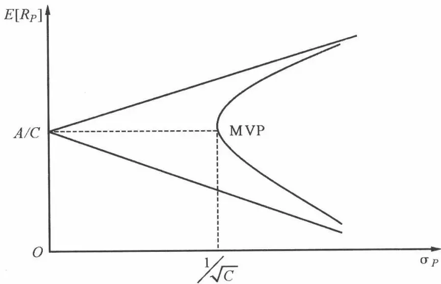
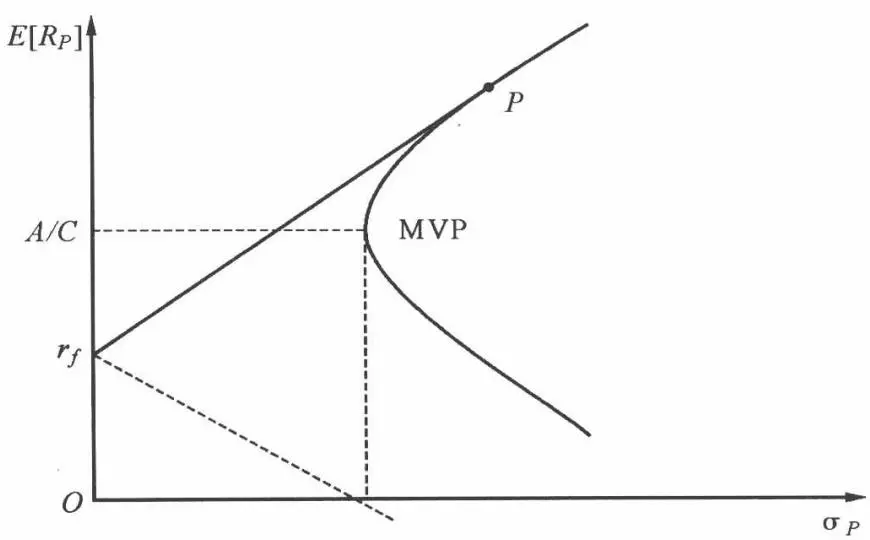
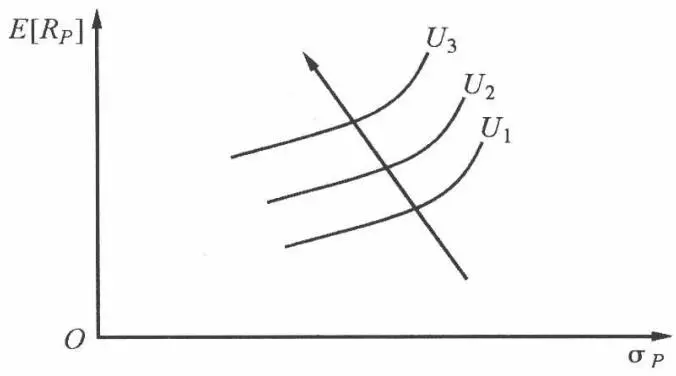
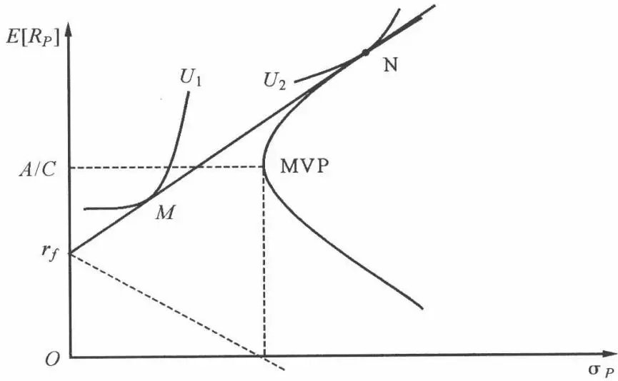

# [第2章](ch02.md) 资产配置与均值方差模型

上一章,我们考虑了历史的收益率和方差,它为我们理解现代投资组合理论(MPT)打下了基础。我们知道在投资决策之前,首先要做的就是我们应当把我们的资金在现有的市场资产类型中做出合理的配置。我们首先考虑持有投资者最熟悉的两种主要资产类别的情形:所有投资者都持有股票或债券或者两者相结合的投资组合。这是因为债券是两种资产中相对安全的一种,许多投资者至少有一部分资金配置在债券上。根据历史数据,债券的收益低于股票,但是风险也相对低得多。首先考虑一个投资者由于其风险承受能力,他只能持有一个债券投资组合。该投资者明白,如果仅持有债券组合,其收益率将低于持有股票组合,但是他也清楚其风险也相对较低,因此是投资者的风险承受能力决定了这样的决策。然而,考虑一个持有100%债券组合20年的投资者,该投资者的复合年收益率为11.05%,风险水平为11.15%。但是现在我们注意一个投资组合含有50%的股票和50%的债券,其标准差相对较低,只有10.85%,其年收益率更高为11.9%。显然,股票和债券的资产配置确实为投资者带来了好处。除非你预期未来将与过去截然不同,否则你不能说只持有债券是合理的。

上面的例子引出了一个问题,就是我们该把多少的资金投资于债券,而又把多少的资金投资于股票呢?在解答之前,我们先看一下,我们可以投资的资产类别有些什么。

## 2.1 一些主要的资产类别

1. 股票。股票是最重要的资产类别, 我们经常提到的投资通常就是指投

资于股票市场。

2. 国际投资。十多年前,个人投资者能够获得的投资工具只有在本国证券市场出售的股票和债券,而现在投资者可以投资于在世界范围内发行的各种证券。从历史来看,国际分散化可以提供一些风险降低的收益,因为各国之间资产收益的正相关性很低。许多研究表明,这种较低的相关性使得投资者更多地将国外投资作为一种资产类别。

3. 债券。作为可以加入投资组合的资产类别,债券是一个比较常见的选择。过去,资产分配就是指将投资组合的资金分配给股票、债券和国库券。

4. 房地产。房地产是风险分散化的另一个常用选择。房地产通常被称为与股票的相关性很小或为0的资产类别。投资者可以轻松地通过购买房地产投资信托(REITs)来持有房地产。

## 2.2 投资组合的一般特性

### 2.2.1 投资组合的期望收益率

投资组合的收益是组成资产收益的加权平均。每种收益的权重就是该资产在投资组合中的比重。如果 $E(R_{j})$ 代表投资组合的第 j 种资产的期望收益， $X_{j}$ 是投资者投资于第 j 种资产的比重，n 是资产种类，则有 $E(R_{P}) = \sum_{i=1}^{n} E(R_{j}) X_{j} (R_{j}$ 为随机变量，本章中无特别说明，均指随机变量）。


表 2.1 给出了资产组合收益率的计算过程。

表 2.1

<table><tr><td>收益与比重\类别</td><td>资产1</td><td>资产2</td><td>资产3</td></tr><tr><td>期望收益</td><td>10%</td><td>20%</td><td>30%</td></tr><tr><td>比重</td><td>30%</td><td>40%</td><td>30%</td></tr><tr><td colspan="4">资产组合期望收益率为 $30\% \times 10\% + 40\% \times 20\% + 30\% \times 30\% = 20\%$ </td></tr></table>


### 2.2.2 投资组合的方差

投资组合的方差的决定比投资组合的期望收益的决定要复杂一些。我们从两个资产构成的组合开始讨论。投资组合 P 的方差定义为 $\sigma_{P}^{2}$ ，它是投资组合收益与期望收益差平方的期望值，即 $\sigma_{P}^{2}=E(R_{P}-E(R_{P}))^{2}$ ，将投资组合的期望收益代入上式：

$$
\begin{array}{r l} \sigma_{P} ^{2} & = E (R_{P} - E (R_{P})) ^{2} \\ & = E [ X_{1} R_{1} + X_{2} R_{2} - (X_{1} E (R_{1}) + X_{2} E (R_{2})) ] ^{2} \\ & = E [ X_{1} (R_{1} - E (R_{1})) + X_{2} (R_{2} - E (R_{2})) ] ^{2} \\ & = E [ X_{1} ^{2} (R_{1} - E (R_{1})) ^{2} + X_{2} ^{2} (R_{2} - E (R_{2})) ^{2} + 2 X_{1} X_{2} (R_{1} - E (R_{1}) (R_{2} - E (R_{2})) ] \\ & = X_{1} ^{2} E (R_{1} - E (R_{1})) ^{2} + X_{2} ^{2} E (R_{2} - E (R_{2})) ^{2} + 2 X_{1} X_{2} E [ (R_{1} - E (R_{1}) (R_{2} - \\ & \quad E (R_{2}) ] \\ & = X_{1} ^{2} \sigma_{1} ^{2} + X_{2} ^{2} \sigma_{2} ^{2} + 2 X_{1} X_{2} E [ (R_{1} - E (R_{1}) (R_{2} - E (R_{2})) ] \end{array}
$$

(其中 $\sigma_{1}^{2}, \sigma_{2}^{2}$ 为相应资产的方差)

$E[(R_{1}-E(R_{1})(R_{2}-E(R_{2})]$ 有一个特别的名字，叫协方差，它被定义为 $\sigma_{12}$ 。用 $\sigma_{12}$ 代替 $E[(R_{1}-E(R_{1})(R_{2}-E(R_{2})]$ ，得 $\sigma_{P}^{2}=X_{1}^{2}\sigma_{1}^{2}+X_{2}^{2}\sigma_{2}^{2}+2X_{1}X_{2}\sigma_{12}$ 。

协方差是考察多种资产的收益如何共同变动的指标。当两种资产收益变化方向相同时，它们的协方差为正，则 $\sigma_{12}>0$ ；当两种资产收益变化方向相反时，则 $\sigma_{12}<0$ ，两资产负相关；当两者的收益变化方向没有任何规律可循时， $\sigma_{12}=0$ 。

由于协方差和期望值量纲不一致,所以往往将协方差标准化。将协方差除以两种资产各自的标准差的乘积,就得到具有协方差相同性质的变量,且该变量处于-1到1之间(查看任何一本概率统计的书可知)。这一指标称为相关系数。以 $\rho_{ij}$ 表示证券i和j的相关性,相关系数可定义为 $\rho_{ij}=\frac{\sigma_{ij}}{\sigma_{i}\sigma_{j}}$ (其中 $\sigma_{i}$ , $\sigma_{j}$ 分别为资产i,j的标准差)。


考虑股票 A 和 B 实现的总收益。两只股票的统计数据如表 2.2。

表2.2

<table><tr><td></td><td>股票 A</td><td>股票 B</td></tr><tr><td>期望值(%)</td><td>15.16</td><td>12.12</td></tr><tr><td>标准差(%)</td><td>25.97</td><td>21.58</td></tr><tr><td>相关系数</td><td colspan="2">0.29</td></tr></table>

假设我们投资于每只股票的资金相同,因此权重分别为 0.5,0.5。


$$
\begin{array}{r l} \sigma_{P} & = [ X_{1} ^{2} \sigma_{1} ^{2} + X_{2} ^{2} \sigma_{2} ^{2} + 2 X_{1} X_{2} \sigma_{12} ] ^{\frac{1}{2}} \\ & = [ (0. 5) ^{2} \times (21. 58) ^{2} + (0. 5) ^{2} \times (25. 97) ^{2} + 2 \times 0. 5 \times 0. 5 \times 0. 29 \times 21. 58 \times \\ & \quad 25. 97 ] ^{\frac{1}{2}} \\ & = 19. 14 \end{array}
$$



投资组合的方差受两只股票的相关性影响很大。在其他因素不变的情况下，投资组合风险随着相关系数从1.0的下降而降低。


假设我们有一些关于两个公司 A, B 的数据, 估计的期望收益率分别为 26.3% 和 11.6%, 标准差分别为 37.3% 和 23.3%。它们收益的相关系数为 0.15。为了显示相关系数变动的影响, 我们假设权重为 0.5, 即每个股票的投资额为 50%。本例中的数据总结为:

$$
\sigma_{A} = 0. 373, \sigma_{B} = 0. 233, X_{A} = X_{B} = 0. 5, \rho_{A B} = 0. 15
$$


使用这些数据，该投资组合的标准差或风险为 $\sigma_{P}$ ，即 $\sigma_{P} = [X_{A}^{2}\sigma_{A}^{2} + X_{B}^{2}\sigma_{B}^{2} + 2X_{A}X_{B}\sigma_{AB}]^{\frac{1}{2}} = 0.0435$ 。

投资组合的风险显然依赖于第三项的值,而第三项又取决于两只股票收益的相关系数。为了衡量相关性的潜在影响,考虑 $\rho_{AB}=1,0.5,0.15,0,-0.5,-1.0$ 。计算上述情况下投资组合的风险如下:

如果 $\rho_{AB}=1,\sigma_{P}=0.303$ ; 如果 $\rho_{AB}=0.5,\sigma_{P}=0.265$ ; 如果 $\rho_{AB}=0.15,\sigma_{P}=0.234$ 。

如果 $\rho_{AB}=0,\sigma_{P}=0.220$ ; 如果 $\rho_{AB}=-0.5,\sigma_{P}=0.160$ ; 如果 $\rho_{AB}=-1.0,\sigma_{P}=0.070$ 。



这些计算显示将相关性较低的证券组合在一起,投资组合的风险将会降低。相关性从1.0降到-1.0,投资组合的风险从0.303降到0.070。然而,当相关系数从1.0降到0的时候,投资组合的风险仅从0.303降低到0.22,而当相关系数降低到-0.5时,投资组合的风险仅减少了一半。

前面考虑的是两种资产组合的情形。这一公式可以扩展到 $n$ 种资产的情形。

$$
\sigma_{P} ^{2} = \sum_{j = 1} ^{n} (X_{j} ^{2} \sigma_{j} ^{2}) + \sum_{j = 1} ^{n} \sum_{k = 1, k \neq j} ^{n} (X_{j} X_{k} \sigma_{j k}),
$$

表示为矩阵的形式为

$\sigma_{P}^{2}=X^{T}VX$ ，其中 $X^{T}=(X_{1},X_{2},X_{3},\cdots,X_{n}),V=(\sigma_{ij})_{n\times n}$ 为协方差矩阵。

## 2.3 现代投资组合理论

投资者投资于金融市场上,最终的目的是使得投资末期的期望效用最大化。期望效用函数为冯·诺依曼—摩根斯坦(Von Neumann-Morgenstern)的预期效用函数 $H(P)=\sum_{z\in Z}p(z)u(z)$ ，其中 $p(z)$ 为未来收益的分布， $u(z)$ 为每个状态的效用函数，Z 为未来收益的状态空间。马科维茨通过使用预期收益率和方差两个参数来代替期望效用函数得到了非常好的结论。除此假设外，他还假设：

1. 投资者是永不满足的, 且规避风险的, 即在一定的风险下要求最大的收益率, 或者在一定的收益率下最小化风险。

2. 单一投资期间。即投资者初期有一禀赋 $W$ ，并将其分配在 $n$ 个风险资产上至期末投资结束，不存在投资策略随时间的调整。

3. 没有交易成本。

### 2.3.1 不存在无风险资产的情形

在具有相同期望收益率的资产组合中,具有最小方差的资产组合称为前沿边界的资产组合。一个资产组合 P 是一个前沿边界的资产组合,当且仅当 n 维资产组合权重向量 $X_{P}$ 是以下二次规划的解:

$$
\min_{\{w \}} \frac{1}{2} \boldsymbol{X} ^{T} \boldsymbol{V} \boldsymbol{X}\tag{2.1}
$$

给定

$$
\begin{array}{l} \boldsymbol{X} ^{T} \boldsymbol{e} = E [ R_{P} ] \\ \boldsymbol{X} ^{T} \mathbf{1} = 1 \end{array}\tag{2.2}
$$

(2.3)

其中，e 表示这 n 项资产的 n 维期望收益率向量， $E[R_{P}]$ 表示资产组合 P 的期望收益率，1 是 n 维单位向量，V 为 n 项资产的协方差矩阵。

上式的意思是在一定的期望收益率 $E[R_{P}]$ 下, 最小化投资组合的方差 $X^{T}VX$ , 由于 $\frac{1}{2}X^{T}VX$ 与 $X^{T}VX$ 取最小值时的资产组合 X 是相同的。注意卖空(即负的资产组合权重)是允许的。因此, 可行的资产组合的期望收益率的

范围是无界的。

解上述二次规划, 可得到 $\frac{\sigma^{2}(R_{P})}{\frac{1}{C}} - \frac{\left(E[R_{P}] - \frac{A}{C}\right)^{2}}{\frac{D}{C^{2}}} = 1$ (具体解答过程见附录 2-1), 其中 $A = 1^{T} V^{-1} e, B = e^{T} V^{-1} e, C = 1^{T} V^{-1} 1, D = BC - A^{2}$ , 这个在 $\sigma_{P} - E[R_{P}]$ 的空间中表现为双曲线, 如图 2.1。

图 2.1 在 $\sigma_{P}-E[R_{P}]$ 空间中的资产组合前沿

上图描述了在只存在 n 项风险资产时的资产组合前沿边界,且其中最小方差资产组合点为 MVP,其对应的期望收益率为 $\frac{A}{C}$ , 标准差为 $\frac{1}{\sqrt{C}}$ 。

显然投资者是风险厌恶型的,可以得到只有 MVP 点以上的资产组合前沿边界才是理性投资者选择的,被称为效率边界。因为在 MVP 以下的前沿边界的每一点,在同样的方差的情形下,MVP 上面的点的期望收益率高于 MVP 下面的点的期望收益率。

### 2.3.2 存在无风险资产的情形

令 P 是所有 $n+1$ 个资产的前沿边界组合, $X_{P}$ 表示风险资产在 P 中的资产组合向量, 则 $X_{P}$ 是下述规划的解:

$$
\min_{\left\{\boldsymbol{X} _{\boldsymbol{P}}, \lambda \right\}} \frac{1}{2} \boldsymbol{X} ^{T} \boldsymbol{V} \boldsymbol{X}
$$

$$
\mathrm{s.t} \boldsymbol{X} ^{T} \boldsymbol{e} + (1 - \boldsymbol{X} ^{T} \mathbf{1}) r_{f} = E [ R_{P} ]
$$

其中， $r_{f}$ 为无风险利率（在没有特别说明下，本书都用 $r_{f}$ 代替无风险资产收益率）。

解上述二次规划,我们可以得到(详细过程见附录2-2):

$$
\sigma_{P} = \left\{\begin{array}{l l} \frac{E [ R_{P} ] - r_{f}}{\sqrt{H}} & \text{当} E [ R_{P} ] \geqslant r_{f} \\ - \frac{E [ R_{P} ] - r_{f}}{\sqrt{H}} & \text{当} E [ R_{P} ] <   r_{f} \end{array} \right.
$$

这就是说,所有资产的资产组合前沿边界在 $\sigma_{P}-E[R_{P}]$ 平面上是由两条从点 $(0,r_{f})$ 发出的斜率为 $\sqrt{H}$ 和 $-\sqrt{H}$ 的半直线组成的。

$r_{f}$ 显然要小于最小方差资产组合点 MVP 的期望收益率, 因为投资者为风险厌恶型的, 在同样的方差的情形下, 他更喜欢期望收益率更大的资产组合, 在同样的期望收益率的情形下, 他更倾向于方差更小的资产组合。最小方差资产组合 MVP 的方差大于无风险资产的方差, 故其收益率要大于无风险资产组合, 否则, 没人会选择 MVP。

另外上面得到的新的前沿边界的上半支切于只有风险资产时的前沿边界。为验证这点,我们只需说明:

$$
\frac{E [ R_{P} ] - r_{f}}{\sigma_{P}} = \sqrt{H}
$$

其中 $H = (e - r_f\mathbf{1})\mathbf{V}^{-1}(e - r_f\mathbf{1}) = B - 2Ar_f + Cr_f^2$ ，此处我们取切点 $\pmb{p}$ 的期望收益率为 $E[R_P] = \frac{A}{C} -\frac{\frac{D}{C^2}}{r_f - \frac{A}{C}}$ （见附录2-3）。利用关系式 $\frac{\sigma^2(R_P)}{\frac{1}{C}} -$ $\frac{(E[R_P] - \frac{A}{C})^2}{\frac{D}{C^2}} = 1$ ，我们得到：

$$
\frac{E [ R_{P} ] - r_{f}}{\sigma_{P}} = (\frac{A}{C} - \frac{\frac{D}{C^{2}}}{r_{f} - \frac{A}{C}} - r_{f}) \frac{- C (r_{f} - \frac{A}{C})}{\sqrt{H}} = \sqrt{H}
$$

新的效率边界 在线段 $\overline{r_{f}P}$ 上的投资组合是资产组合P与无风险资产的一个凸组合,见图2.2。即投资者把一部分资金投资于资产组合P,剩下的部分投资于无风险资产上。任何在半直线 $r_{f} + \sqrt{H}\sigma_{P}$ 且不在 $\overline{r_{f}P}$ 上的资产组合为卖空无风险资产并将所得全部投资于资产组合 P 上。效率边界为高于 $r_{f}$ 点的直线。

图 2.2 有无风险资产时的资产组合前沿边界

注意:通过引入无风险资产后,马科维茨的效率边界被扩展了。

### 2.3.3 选择一个风险资产的最优投资组合

一旦我们使用马科维茨模型确定了效率边界,投资者必须在这一系列的投资组合中选择最适合他们的一个。马科维茨模型并没有制定某一个最优的投资组合,相反,它产生了一系列的有效投资组合,这些都是最优的投资组合。

无差异曲线 我们使用无差异曲线来确定适合个人投资者偏好的期望收益—风险组合。

图 2.3 是一个风险厌恶投资者的无差异曲线,代表了投资者对风险和收益的偏好。每一条无差异曲线对投资者来说都代表偏好相同的风险与期望收益的组合。

显然无差异曲线有以下几个特征。首先，无差异曲线不会相交，且投资者可以有无数条无差异曲线。其次，风险厌恶投资者的无差异曲线的斜率是向上的，因为投资者是风险厌恶型且是单调偏好的，这样让其承受更大的风险必须要有更大的回报作为补偿。另外，曲线的形状与投资者个人的偏好有关。位置更高的无差异曲线优于位置较低的曲线。无差异曲线的斜率越大，投资者的风险规避程度越高。最后，离横轴越远的点代表越大的效用。

图2.3 无差异曲线

选择最优的投资组合 风险规避投资者的最优投资组合是效率边界与投资者无差异曲线的切点。

图2.4 选择效率边界上的一个投资组合

在图 2.4 中,有两个风险投资者 A 和 B,其中 A 更厌恶风险,其无差异曲线为 $U_{1}$ (图中只画出相切的那一条),B 的无差异曲线为 $U_{2}$ 。M,N 点分别为无差异曲线 $U_{1},U_{2}$ 与效率边界的切点。因为在相切时才能既满足风险资产组合边界所达到的投资组合,又能使得投资者的效用最大。这样 A 在 M 点达到最大的效用,B 在 N 点达到最大的效用。M 点无风险资产的比例要高于 N 点的无风险资产的比例。这说明风险厌恶程度高的投资者在无风险资产上投资的比例要高些。

## 2.4 输入数据时的考虑

在这一部分,我们将讨论在投资组合问题中影响输入数据选择的一些考虑。几乎所有的资产配置分析都是始于利用历史数据对组合选择过程中的输入数据进行估算的。分析师通常对这些数据进行修正,以使得它们能更好地反映对未来的想法。在关于指数模型的[第3章](ch03.md),我们将讨论如何运用历史数据估计方差和相关系数,这比简单地采用历史值更精确。但在开展这一工作前,我们将讨论如何运用历史数据通常要考虑的问题。

### 2.4.1 优化问题中经通货膨胀调整的输入数据

有效边界技术被广泛地应用于确定长期资产配置的实践中,特别是养老资金配置。当投资期是以10年为单位衡量时,考虑货币购买力变化如何影响投资决策就非常重要。特别是,投资者可能更关注投资组合的未来实际购买力,即通过通货膨胀调整的价值,而非投资组合的未来名义价值。解决这一问题的一种可能方法是,在有效边界技术中应用通货膨胀调整后的收益。表2.3比较了美国股票、政府债券、国库券和通货膨胀的历史数据。注意,国库券的回报与通货膨胀是正相关的,当通胀较高时,国库券有较高收益,当通货膨胀较低时,国库券收益较低。这意味着,国库券可以部分地对通货膨胀套期保值。

表 2.3 没有通胀调整的收益率

<table><tr><td rowspan="2"></td><td rowspan="2">几何平均</td><td rowspan="2">标准差</td><td colspan="4">相关系数</td></tr><tr><td>S&amp;P</td><td>债券</td><td>国库券</td><td>通货膨胀</td></tr><tr><td>股票</td><td>10.03</td><td>15.67</td><td>1.00</td><td></td><td></td><td></td></tr><tr><td>债券</td><td>5.73</td><td>11.14</td><td>0.22</td><td>1.00</td><td></td><td></td></tr><tr><td>国库券</td><td>4.56</td><td>3.19</td><td>-0.65</td><td>-0.24</td><td>1.00</td><td></td></tr><tr><td>通胀率</td><td>4.24</td><td>3.65</td><td>-0.36</td><td>-0.20</td><td>0.38</td><td>1.00</td></tr></table>

表 2.4 给出了经通货膨胀调整后的股票、债券、国库券的收益数据。在创建经通货膨胀调整的有效边界时,读者可以利用这些数据作为起点。尽管如国库券之类的证券能提供针对通货膨胀的部分套期保值功能,在上面的例子中没有无风险资产——即使国库券也有一定程度暴露在通货膨胀风险之中。美国近期发展了一种新的证券，这种证券可以提供近似完美的通货膨胀套期保值，自1997年，美国发行了与通货膨胀挂钩的证券（TIP），其价值部分取决于消费物价指数(CPI)的变化。这些债券的收益随通货膨胀而变化，并使得债券有很好的通货膨胀套期保值功能。有时，美国年通货膨胀率高于 $10\%$ ，这意味着投资于与通货膨胀不挂钩的资产的购买力实际下降 $10\%$ 。因而，与通货膨胀挂钩的证券在通货膨胀时期有保护投资者免受严重侵蚀的功能。

表 2.4 经通货膨胀调整的收益率

<table><tr><td rowspan="2"></td><td rowspan="2">几何平均</td><td rowspan="2">标准差</td><td colspan="3">相关系数</td></tr><tr><td>S&amp;P</td><td>债券</td><td>国库券</td></tr><tr><td>S&amp;P</td><td>5.78</td><td>17.32</td><td>1.00</td><td></td><td></td></tr><tr><td>债 券</td><td>1.49</td><td>12.39</td><td>0.37</td><td>1.00</td><td></td></tr><tr><td>国库券</td><td>0.31</td><td>3.83</td><td>0.33</td><td>0.54</td><td>1.00</td></tr></table>

在进行投资分析时,分析师在考察名义收益率时,也一并考察经通货膨胀调整后的收益率,或用经通货膨胀调整后的收益率代替名义收益率。此外,与通货膨胀挂钩的证券越来越可能成为投资者组合优化中的一种重要资产。

### 2.4.2 输入数据估计值的不确定性

可靠地输入数据对在投资组合配置中合理应用均值一方差分析方法非常关键。常见的是,应用历史的风险、收益和相关系数作为起点来获取计算有效边界所需输入数据。

1. 如果收益特性不随时间改变,则有效数据的时期越长,均值的估计就越准确。设时间序列独立同分布,且每个独立的随机变量 $R_{i}$ 的方差为 $\sigma^{2}$ ,则样本均值 $\left(\frac{1}{N}\sum_{i=1}^{N}R_{i}\right)$ 的方差为: $\mathrm{COV}\left(\frac{1}{N}\sum_{i=1}^{N}R_{i},\frac{1}{N}\sum_{i=1}^{N}R_{i}\right)=\frac{1}{N}\sigma^{2}$ ,其中N为样本容量。对观察到的独立收益序列而言,N为历史数据观察时期数。因为在收益不相关的假设下,更多的历史数据能改进均值一方差模型中预期收益的估计,尽管改进作用是递减的。

为了展示这一问题对投资组合选择的重要性,假定投资者必须在两种投资间进行选择,这两种投资有相同的样本均值和方差。在其他条件相同的情况下,标准方法将两者视为等价。如果考虑到额外的信息,即第一个样本的均值是基于1年数据之上,而第二个样本均值是基于10年数据之上,则通常的感觉是,第二种方法比第一种方法风险更小。

在这里注意一下,前面两个都谈到了方差,但是它们有本质的区别。第一个是每项资产在观察年段的方差,第二个是在观察年段内,所有风险资产的均值的方差。由于第一个样本是基于1年的,从而得到的每项均值的误差可能性更大,基于这种均值的多项风险资产的方差肯定更不准确了。

我们还可以假定投资者主要关注下个月的收益率,其平均收益率是 $E[R]$ ,其收益率的方差为 $\sigma_{Pred}^{2}=\sigma^{2}+\frac{\sigma^{2}}{T}$ 。

式中：

$\sigma_{Pred}^{2}$ ——预测方差；

$\sigma^{2}$ ——月收益率方差；

T——时期数。

表达式的第一部分反映的是收益率的内在风险(n项风险资产之间的方差)。表达式的第二部分反映的是缺乏对真实收益率均值的了解而导致的不确定性(每项风险资产在观察期的对其本身均值的方差)。在贝叶斯分析中，这一方程右边两项表达式之和被称为收益预测分布的方差。注意，由于未来均值存在的不确定性，预测方差总是大于历史方差。

2. 证券收益特性总是随时间而改变。虽然使用长时间观察能改进估计,但是与此同时,证券特性会随时间而改变(如期望值会变),这给长时期观察带来潜在的不确定性。这样,投资分析师必须权衡观察时期数长短的利弊。由于这一冲突,多数投资分析师会修正历史数据,以反映他们关于目前情况与历史情况之间存在差异的看法。

## 2.5 对现代投资组合模型的评价

马科维茨模型的初衷就是为投资组合选择单个证券,然而该模型并不适用,如果投资组合包含很多证券的话,我们要估计的协方差的数目惊人。


如果一个分析师要考虑 100 个证券的投资组合,他就要估计 $(100 \times 99)/2 = 4\ 950$ 个不同的协方差。如果是 250 个证券,那么就会产生 $(250 \times 249)/2 = 31\ 125$ 个协方差。


做投资决策最重要的是要利用市场数据迅速找到套利的机会,在短时间估计出这么多协方差几乎是难以想象的难题,且投资分析师都是专注于几个行业的股票,不可能对每个行业都了如指掌。这样,马科维茨模型在实际中有极大的缺陷。后面章节中还会讲到这一问题。

马科维茨的理论假设也存在问题。该模型是建立在冯·诺依曼—摩根斯坦的预期效用函数上。投资者选择自己的投资策略(就是投资于每份资产上的收入份额)来使得自己的期望效用最大化。

个体的效用函数可以在期望财富附近泰勒展开：

$$
u (W) = u (E [ W ]) + u^{\prime} (E [ W ]) (W - E [ W ]) + \frac{1}{2} u^{\prime \prime} (E [ W ]) (W - E [ W ]) ^{2} + R_{3}
$$

其中 $R_{3} = \sum_{n=3}^{\infty} \frac{1}{n!} u^{(n)}(E[W])(W - E[W])^{n}$ , $W$ 为期末财富, 由于风险资产的收益率为随机变量, 故期末财富也为随机变量。

假设这个泰勒级数收敛,并且取期望和求和的过程可以互换,则个体期望效用可以表示为

$$
E [ u (W) ] = u (E [ W ]) + \frac{1}{2} u^{\prime \prime} (E [ W ]) \sigma^{2} (W) + E [ R_{3} ]
$$

其中 $E[R_3] = \sum_{n=3}^{\infty} \frac{1}{n!} u^{(n)}(E[W]) m^n(W)$ ，其中 $m^n(W)$ 表示 $W$ 的 $n$ 阶中心矩。

上述关系式指出对于一个对期望收益偏好而对方差厌恶的投资者,除了期望和方差外,还有更高阶矩的项,它说明对于任意的分布和偏好,期望效用不能仅仅由财富的期望值和方差来确定。

解决上述难题的可以从两个方面来下手:收益率分布和效用函数。

首先看收益率分布(或财富分布)。现代投资组合模型在风险资产收益率服从多元正态分布的假设下有效。因为正态分布完全由它的两个参数:期望和方差来确定。在正态分布下 $E[R_{3}]=\sum_{n=3}^{\infty}\frac{1}{n!}u^{(n)}(E[W])m^{n}(W)$ 所含的三阶和更高阶矩可以由前两阶的方程来表示。尽管对数正态分布收益也可以由其均值和方差完全确定,但是它不是可加的。这样在假设单个证券的收益率满足对数正态分布的情况下,资产组合却不是对数正态分布。

其次看效用函数。假设效用函数为二次效用函数 $u(W)=W-\frac{b}{2}W^{2}(b$ 为参数,是风险厌恶度的一种度量)。二次效用函数的3阶和更高阶导数为零,因此 $E[R_{3}]=0$ 。所以个体的期望效用函数被他的期末财富的前两阶矩决定。

这样表面上,马科维茨的假设不存在任何问题,只要收益率分布为正态分布或者效用函数为二次效用函数就行。但是这样不是很合理。收益率分布为正态分布,而正态分布的两端是无穷的,这与有限责任和经济理论不一致,后者认为负的消费是没有意义的。针对二次效用函数,由于其为递增的绝对风险厌恶函数(绝对风险厌恶指标 $R_A(W) = -\frac{u''(W)}{u'(W)}$ ),表明投资者随着初始财富的增加投资于风险资产上的资金越少,而这显然违背常识。而且在财富达到 $\frac{1}{b}$ 时,投资者的效用随着财富的增加而减少这个也不合理。解决的办法可以使得 $b$ 很小,乃至趋近于零,但是这又使得效用函数为 1 次了。

另外,冯·诺依曼—摩根斯坦的预期效用函数也并不是完美无瑕的,阿里亚斯悖论(Allais paradox)就推翻了预期效用函数建立的基础:替换公理或独立公理。

当然,任何一个模型不可能完美无缺。1990年诺贝尔经济学奖授给马科维茨,足以看出本模型的重要性。马科维茨把期望和方差引入资产组合管理,使得金融第一次脱离主观描述而变得精确起来,为现代的风险管理打下了坚实的基础。

概括起来,马科维茨对于现代金融理论的贡献在以下几个方面的命题上:

1. 金融经济学家传统上把预期收益的最大化看作投资组合的目标,实际上,分散投资行为常常与此目标相矛盾,但分散投资行为却与均值一方差的目标函数一致。

2. 均值一方差的目标函数与投资者追求预期效用最大化的目标一致。

3. 投资组合的方差是证券方差和协方差的函数。因此,单一证券对于投资组合风险的贡献取决于它与其他证券的相关性。

4. 投资者关心有效组合集——就是说, 在期望收益率给定的情况下, 选择方差最小的组合; 在方差给定的情况下, 选择期望收益率最大的组合。前者产生了最小方差集, 后者产生了有效集。

尽管马科维茨模型在资产组合的应用上有很大的限制。但是在考虑资产类别上还是有很大的用处。资产分配决定是将投资组合资产分配到广泛的资产市场上，换句话说，投资组合的资金有多少投资于股票，多少投资于债券、货币市场资产等。每个权重都可以赋予从0～1.0。

## 附录

附录 2.1: 不存在无风险资产的情形的解法详细过程由拉格朗日解法, $X_{P}$ 是下式的解:

$$
\min_{\{X, \lambda , \gamma \}} L = \frac{1}{2} \mathbf{X} ^{T} \mathbf{V} \mathbf{X} + \lambda (E [ R_{P} ] - \mathbf{X} ^{T} \mathbf{e}) + \gamma (1 - \mathbf{X} ^{T} \mathbf{1})\tag{2.4}
$$

其中， $\lambda, \gamma$ 是两个正的常数。一阶条件是

$$
\frac{\partial L}{\partial \mathbf{X}} = \mathbf{V} \mathbf{X} _{P} - \lambda e - \gamma \mathbf{1} = 0\tag{2.5}
$$

$$
\frac{\partial L}{\partial \lambda} = E [ R_{P} ] - X_{P} ^{T} e = 0\tag{2.6}
$$

$$
\frac{\partial L}{\partial \gamma} = 1 - \mathbf{X} _{P} ^{T} \mathbf{1} = 0\tag{2.7}
$$

其中，0 是 n 维零向量。由于 V 是正定矩阵（由方差恒大于等于 0 得到， $X^{T}VX \geqslant 0, \forall X \neq 0$ ），因此上述一阶条件也是全局最优的充要条件。

由(2.5)式知，

$$
X_{P} = \lambda (\mathbf{V} ^{- 1} \mathbf{e}) + \gamma (\mathbf{V} ^{- 1} \mathbf{1})\tag{2.8}
$$

将其代入到(2.6)和(2.7)知：

$$
E (R_{P}) = \lambda (\boldsymbol{e} ^{T} \mathbf{V} ^{- 1} \boldsymbol{e}) + \gamma (\boldsymbol{e} ^{T} \mathbf{V} ^{- 1} \mathbf{1})\tag{2.9}
$$

$$
1 = \lambda (\mathbf{1} ^{T} \mathbf{V} ^{- 1} \mathbf{e}) + \gamma (\mathbf{1} ^{T} \mathbf{V} ^{- 1} \mathbf{1})\tag{2.10}
$$

由上两式可解得

$$
\lambda = \frac{C E [ R_{P} ] - A}{D}, \gamma = \frac{B - A E [ R_{P} ]}{D}\tag{2.11}
$$

其中 $A = \mathbf{1}^T\mathbf{V}^{-1}\mathbf{e},B = e^T\mathbf{V}^{-1}\mathbf{e},C = \mathbf{1}^T\mathbf{V}^{-1}\mathbf{1},D = BC - A^2$

由于正定矩阵的逆矩阵仍然为正定的,所以 B>0,C>0。我们可以证明 D>0,因为:

$(Ae-B1)^{T}V^{-1}(Ae-B1)=B(BC-A^{2})$ ，而左边显然大于0，故D>0。将(2.11)代入到(2.8)得到

$$
X_{P} = g + h E [ R_{P} ]\tag{2.12}
$$

$$
\text{其中} g = \frac{1}{D} \big [ B (\mathbf{V} ^{- 1} \mathbf{1}) - A (\mathbf{V} ^{- 1} \mathbf{e}) \big ], h = \frac{1}{D} \big [ C (\mathbf{V} ^{- 1} \mathbf{e}) - A (\mathbf{V} ^{- 1} \mathbf{1}) \big ]
$$

由于(2.5)，(2.6)，(2.7)是 $X_{P}$ 成为前沿边界的充要条件，所以任何前沿边界组合都可由(2.12)得到。

$$
\frac{\sigma^{2} (R_{P})}{\frac{1}{C}} - \frac{(E [ R_{P} ] - \frac{A}{C}) ^{2}}{\frac{D}{C^{2}}} = 1
$$

此即正文中的表达式。

### 附录 2.2 存在无风险资产的情形的解法详细过程

用拉格朗日方法,我们知道 $X_{P}$ 是下面式子的解

$$
\min_{\{X_{P}, \lambda \}} \frac{1}{2} \mathbf{X} ^{T} \mathbf{V} \mathbf{X} + \lambda \{E [ R_{P} ] - \mathbf{X} ^{T} e - (1 - \mathbf{X} ^{T} \mathbf{1}) r_{f} \}
$$

$X_{P}$ 是解的一阶充分必要条件是：

$$
V X_{P} = \lambda (e - 1 r_{f}) \text{和} r_{f} + X_{P} ^{T} (e - 1 r_{f}) = E [ R_{P} ]
$$

求解 $X_{P}$ ，我们有

$$
X_{P} = V^{- 1} (e - r_{f} 1) \frac{E [ R_{P} ] - r_{f}}{H}
$$

其中 $H=(e-r_{f}1)V^{-1}(e-r_{f}1)=B-2Ar_{f}+Cr_{f}^{2},A,B,C$ 仍然沿用上述定义。可以容易地验证当 $A^{2}-BC<0$ 时，H>0 。资产组合 P 的方差为

$$
\sigma_{P} ^{2} = \mathbf{X} _{P} ^{T} \mathbf{V X} = \frac{(E [ R_{P} ] - r_{f}) ^{2}}{H}
$$

等价地,我们可以写成: $\sigma_{P}=\left\{\begin{aligned}\frac{E[R_{P}]-r_{f}}{\sqrt{H}}& 当 E[R_{P}]\geqslant r_{f}\\-\frac{E[R_{P}]-r_{f}}{\sqrt{H}}& 当 E[R_{P}]<r_{f}\end{aligned}\right.$

此即正文中出现的表达式。

附录 2.3

对于资产组合前沿边界的一个重要性质是,对于前沿边界上的任何资产组合 P,除了最小方差资产组合,存在唯一的前沿边界资产组合,用 $z_{c}(P)$ 表示,与 P 的协方差为 0。

给定关系式 $\sigma_{PQ} = X_P^T VX_Q = \frac{C}{D}\{E([R_P] - \frac{A}{C})\} \{E([R_q] - \frac{A}{C}) + \frac{1}{C}\}$ , 令资产

组合 $p$ 与 $zc(P)$ 之间的协方差等于0：

$$
\mathrm{COV} (R_{P}, R_{z z (P)}) = \frac{C}{D} \{(E [ R_{P} ] - A / C \} \{E [ R_{z z (P)} ] - A / C \} + D / C^{2}) = 0
$$

对 $z_{c}(P)$ 的期望收益率求解, 我们得到:

$E[R_{zc(P)}]=A/C-\frac{D/C^{2}}{E[R_{P}]-A/C}$ ，实际上上式定义了唯一的 $zc(P)$ 。从几何上， $zc(P)$ 的位置可以如下确定：在标准差—期望收益率空间中，经过与任何前沿边界资产组合（除了最小方差资产组合）相对应的点，与资产组合前沿边界相切的直线在期望收益率坐标轴上的截距是 $E[R_{zc(P)}]$ 。

为证明这点，对 $\frac{\sigma^2(R_P)}{\frac{1}{C}} -\frac{(E[R_P] - \frac{A}{C})^2}{\frac{D}{C^2}} = 1$ 关于 $\sigma_P,E[R_P]$ 求一阶全微分得到：

$$
\frac{\mathrm{d} E [ R_{P} ]}{\mathrm{d} \sigma_{P}} = \frac{D \sigma_{P}}{C E [ R_{P} ] - A}
$$

这是资产组合前沿边界在 $(\sigma_{P},E[R_{P}])$ 点处的斜率。切线在期望收益率坐标轴上的截距为：

$$
\begin{array}{r l} {E [ R_{P} ] - \frac{\mathrm{d} E [ R_{P} ]}{\mathrm{d} \sigma_{P}} \sigma_{P}} & {= E [ R_{P} ] - \frac{D \sigma_{P}}{C E [ R_{P} ] - A} \sigma_{P}} \\ & {= A / C - \frac{D / C^{2}}{E [ R_{P} ] - A / C}} \\ & {= E [ R_{z c (P)} ] (\text{由这个即可得正文里面的理论})} \end{array}
$$

[第3章](ch03.md)