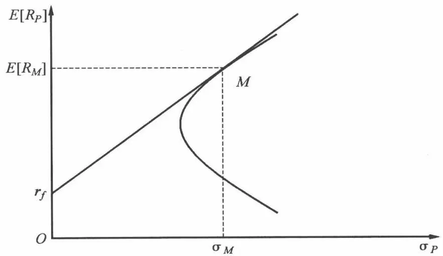
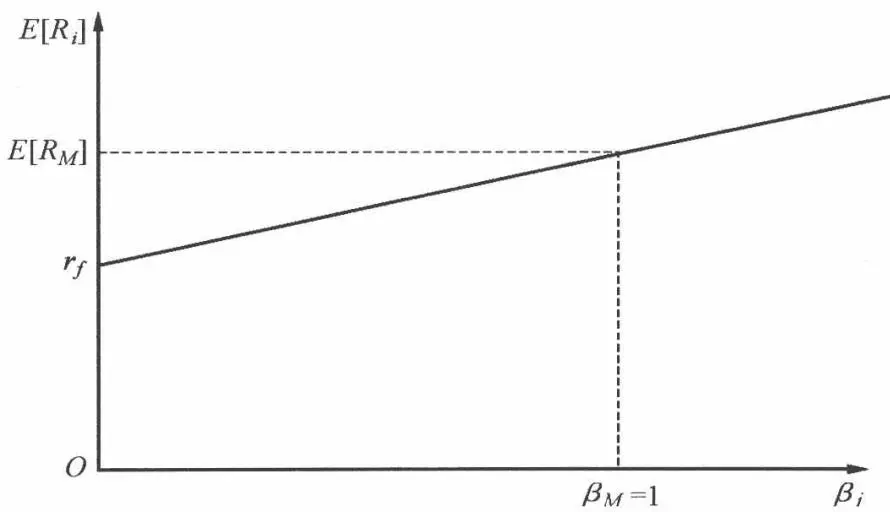
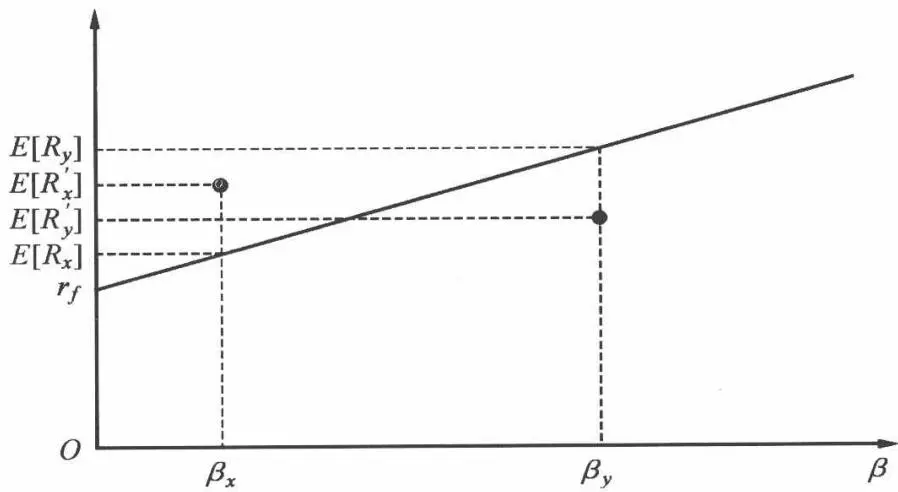
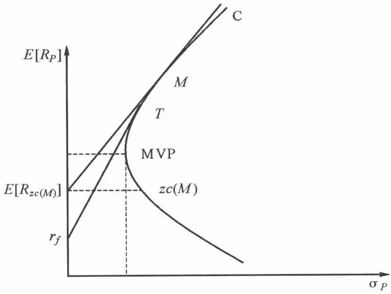
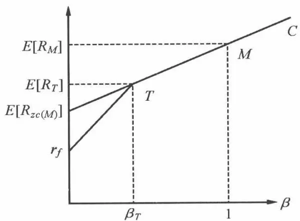
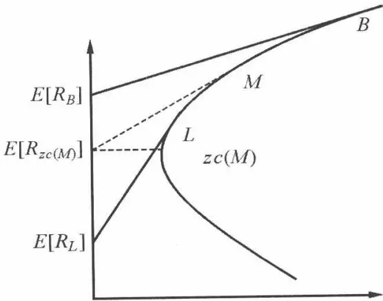
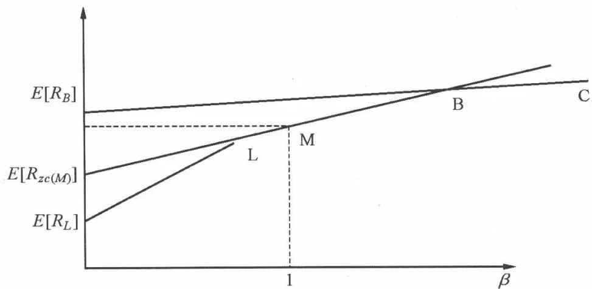
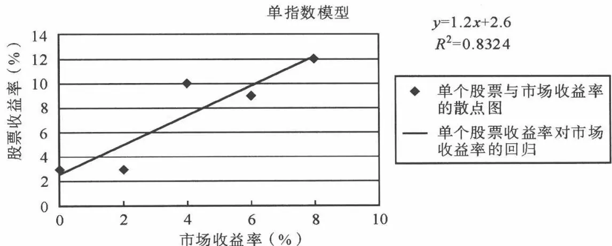
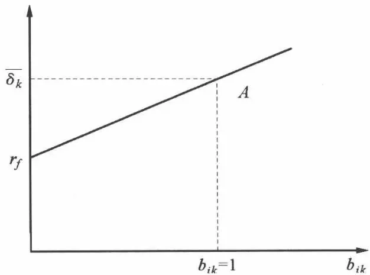

# [第3章](ch03.md) CAPM 和套利定价理论

前面两章,我们讲到了现代投资组合模型(MPT),它描述了投资者应如何选择风险证券的最优投资组合。这一章,我们首先来讨论资产定价模型。如果在理想条件下,所有投资者都利用马科维茨框架寻找风险证券的投资组合,将会如何?这将对证券的均衡价格和均衡收益有怎样的影响?换言之,最优多样化将如何影响证券的市场价格?在这些理想条件下,投资者将在风险和收益之间如何进行平衡?总的来说,我们想要一个能够解释证券的市场均衡价格的模型。这些就是资本资产定价模型,或称为风险资产的估价模型。

紧接着我们介绍一些关于 CAPM 经验检验的方法。由于经验检验与 CAPM 的理论阐述有较大的出入, 所以有针对这种出入的各种 CAPM 扩展模型。

最后,我们将介绍一种全新的解释资产定价的方法——套利定价模型。该方法的理论机制如下:指定证券收益的产生过程,然后从套利论证中推导资产价格。套利定价模型对均衡本质进行了有趣的考察。然而,该理论的应用绝不是简单的事。这一领域的实证研究尚处于初级阶段。此外,在理论的应用方面提出了其他的方法。在介绍这些不同的方法之后,我们考察一下支持套利定价模型的证据,与均衡模型的资本资产定价模型的标准型或其他型相比,它是否必然不一致。最后我们将讨论套利定价模型的实用性和优势。

## 3.1 CAPM 的推导

标准的资本资产定价模型是由夏普(1963,1964)和特里诺(Trenor,1961)分别独立建立的模型,后来莫辛(Mossin,1966)、林特纳(1965,1969)和布莱克(1972)又进一步发展了这个模型,故又称为夏普—莫辛—林特纳模型。该模型表明所有风险资产的均衡收益率是它们与市场投资组合协方差的函数。资本资产定价模型CAPM具有严格的假定条件:

1. 投资者是价格接受者, 并且对于具有联合正态分布的资产收益有完全相同的预期。

2. 投资者是使其期末最终财富的预期效用最大化的风险厌恶者。

3. 资产数量是固定的。所有资产都可以任意买卖并且可以完全分割。

4. 存在无风险的资产,投资者可以在无风险利率的条件下借入或贷出任何数量的资金。

5. 不存在任何的市场不完善性。例如,不存在税收、管制或卖空。

6. 资产市场是无摩擦的,信息无代价并适用于所有的投资者。

CAPM 的理论基础是马科维茨关于均值一方差选择理论。根据上一章,我们知道,如果存在市场均衡,那么必须对所有资产的价格调整直到资产为投资者持有,没有过剩需求。也就是说,资产价格要建立在总供给与总需求相等的基础上。在均衡状态下,市场投资组合是由所持有的全部可买卖的资产按其加权比重或比例组成的。每种资产在市场投资组合的均衡比例为:

$$
W_{i} = \frac{\mathrm{资产} i \mathrm{的市场价值}}{\mathrm{所有资产的市场价值}}\tag{3.1}
$$

需要指出的是,按照法马(1968)的定义,市场投资组合的概念是指包括市场中的每种证券(股票的)的总的结合,其中每种证券的组合权数,等于该种证券在市场上全部证券的总价值所占的比例。

设风险资产 i 和市场投资组合 M 分别以 x 和 $(1-x)$ 的比例形成组合 P，那么分别得到该组合的期望收益率 $E[R_{P}]$ 和标准差 $\sigma_{P}$ 为：

$$
E [ R_{P} ] = x E [ R_{i} ] + (1 - x) E [ R_{M} ]\tag{3.2}
$$

$$
\sigma_{P} = \left[ x^{2} \sigma_{i} ^{2} + (1 - x) ^{2} \sigma_{M} ^{2} + 2 x (1 - x) \sigma_{i M} \right] ^{\frac{1}{2}}\tag{3.3}
$$

需要解释一下,前沿边界就是由风险资产和市场投资组合的各种组合来组成的。那么,该组合期望收益率和标准差分别随 x 的变化情况,可求导如下:

$$
\begin{array}{l} \frac{\partial E [ R_{P} ]}{\partial x} = E [ R_{i} ] - E [ R_{M} ] \\ \frac{\partial \sigma_{P}}{\partial x} = [ x^{2} \sigma_{i} ^{2} + (1 - x) ^{2} \sigma_{M} ^{2} + 2 x (1 - x) \sigma_{i M} ] ^{- \frac{1}{2}} [ x \sigma_{i} ^{2} - (1 - x) \sigma_{M} ^{2} + (1 - 2 x) \sigma_{i M} ] \end{array}\tag{3.4}
$$

(3.5)

图 3.1 由风险资产 i 和市场投资组合 M 所组成的前沿边界组合

按照夏普和特里诺的看法:可以运用上面的事实来决定市场均衡状态价格。在均衡时,市场投资组合已经包括了风险价值权数,风险资产i的风险价值权数为 $W_{i}$ 。因此,上面方程中x衡量的个人对风险资产i的超额需求。按照均衡的条件,由于价格将调整到全部资产都被投资者持有的程度,对任何资产的超额需求都为零。

从而 x=0 时, 我们可以得到:

$$
\frac{\partial E [ R_{P} ]}{\partial x} \Bigg | _{x = 0} = E [ R_{i} ] - E [ R_{M} ]\tag{3.6}
$$

$$
\left. \frac{\partial \sigma_{P}}{\partial x} \right| _{x = 0} = (\sigma_{M} ^{2}) ^{- \frac{1}{2}} (- \sigma_{M} ^{2} + \sigma_{i M})\tag{3.7}
$$

在均衡时,前沿边界点 M 的切线斜率为:

$$
\frac{\partial E [ R_{P} ]}{\partial x} \Bigg / \frac{\partial \sigma_{P}}{\partial x} = \frac{E [ R_{i} ] - E [ R_{M} ]}{\sigma_{i M} - \sigma_{M} ^{2}} \sigma_{M}\tag{3.8}
$$

由前面论述知,连接 $r_{f}$ 和市场投资组合的直线切于由资产 i 和市场组合

M 组成的有效前沿边界(如图 3.1)。且把这条线叫做资本市场线(CML)。其斜率为 $\frac{E[R_{M}]-r_{f}}{\sigma_{M}}$ 。这样针对同样的市场组合 M 点有两条切线斜率, 这样二者必相等。

即：

$$
\frac{E [ R_{i} ] - E [ R_{M} ]}{\sigma_{i M} - \sigma_{M} ^{2}} \sigma_{M} = \frac{E [ R_{M} ] - r_{f}}{\sigma_{M}}
$$

化简上式得到：

$$
E [ R_{i} ] = r_{f} + [ E [ R_{M} ] - r_{f} ] \frac{\sigma_{i M}}{\sigma_{M} ^{2}}
$$

令 $\beta_{i} = \frac{\sigma_{iM}}{\sigma_{M}^{2}}$ ，则上式化为

$$
E [ R_{i} ] = r_{f} + [ E [ R_{M} ] - r_{f} ] \beta_{i}\tag{3.9}
$$

上式即为著名的资本资产定价模型——CAPM。

证券市场线(SML):资本市场线刻画了均衡的金融市场中风险和收益的比较关系。然而它只适用于有效投资组合,并且不能评估单个证券的均衡收益。由CAPM模型知道,所有投资者都持有市场投资组合,它是衡量其他一切投资组合的基础,单个证券对投资组合的风险有影响,这就决定了单个证券或者无效投资组合的均衡收益。证券市场线指风险资产的期望收益率与其 $\beta$ 值之间关系的一条直线。见图3.2。

图3.2 证券市场线

注意证券市场线和资本市场线的区别:资本市场线都是投资者最终选择投资的资产组合,是有效率的,而证券市场线并不是每点都是有效率的,只有 $\beta_{M}=1$ 的市场组合的点才是有效率的。在公式(3.9)中,任何资产所要求的收益率都等于无风险收益率加上风险溢价。所谓风险溢价就是风险价格与风险数量的乘积。风险价格为市场投资组合的预期收益率与无风险收益率之差。以图形表示则是证券市场线的斜率,风险的数量则是 $\beta$ 。

公式(3.9)通常为 CAPM 的事前形式。

由于无风险资产与市场投资组合的协方差为 0，所以无风险资产的 $\beta$ 为 0；市场投资组合与其本身的协方差等于市场投资组合的方差，因此，市场投资组合的 $\beta=1$ 。所以在现实证券市场上，相关系数多在 0～1 之间。

进一步推知:风险资产的期望收益率可以由两部分构成,即无风险收益率和因风险存在而增加的收益补偿;风险越大,风险溢价也越大,对该资产的期望收益率也越高。这就解释了前面提到的,风险越大,则人们要求的收益率也应越高。从几何意义上说,在均衡时,每种资产的定价恰好使其风险调整所要求的收益率落在证券市场线上,因为根据投资组合理论,投资者除了无法避免资产与市场投资组合的风险外,其余风险可通过增加证券投资的数目而分散掉。这样,资产的总风险可以分成两部分:系统风险和非系统性风险。而 $\beta$ 表示的系统风险的数量。由 CAPM 的形式可知,对风险的补偿只是对系统性风险进行补偿,而不是对其总风险进行补偿。即如果某证券的总风险很大,但是绝大部分只是由其特有的风险组成,而其系统性风险很小,则人们对其要求的收益率并不会高。

分离定理 由前面假设可知,每个投资者对风险资产的预期收益率、方差和协方差有相同的看法,这就意味着新的有效边界(一条直线)对所有投资者来说是相同的。这样对于每个投资者来说,只需要考虑把手中的财富在无风险资产和相同的市场资产组合M进行分配就可以。至于把多少资金投资于市场组合,这取决于投资者对风险的回避程度(见图3-1),风险回避程度高的投资者将贷出更多的无风险资产,风险回避程度低的投资者将借入更多的资金投资于市场组合M。关于投资与融资分离的决策理论被称为分离定理。

证券价值的高估与低估 证券市场线对证券价格有重要的内涵。在均衡状态下,每种证券都应该在 SML 上,因为它的预期收益率应该补偿投资者面临的系统风险。如果投资者决定让一种证券不在 SML 上,将会如何?他们必须运用一种独立的方法对该证券的预期收益进行评估。


如图 3.3 所示,两种证券被划分在 SML 的两边。证券 X 在 SML 的上方,通过分析,它有较高的预期收益率,而证券 Y 有较低的预期收益率,它在 SML 的下方。哪种证券被低估了?


在 SML 上方的证券 X 被低估了, 因为在既定的风险下, 它的预期收益比投资者要求的高。投资者要求的预期收益率的最小值为 $E[R_{x}]$ , 而通过基本原理分析, 证券 X 的预期收益率为 $E[R_{x}^{\prime}]$ 。如果投资者意识到这一点, 他们将会:

购买证券 X, 因为它提供高于必要的收益。随着越来越多的证券 X 被购买, 这种需求将会使证券 X 的价格上涨。收益将会因此而下降, 直到它达到 SML 的水平。

现在考虑证券 Y。根据 SML, 投资者对证券 Y 要求 $E[R_{y}]$ , 但 Y 只提供了 $E[R_{y}^{\prime}]$ 。当投资者意识到这一点, 他们将会卖出证券 Y (或卖空 Y)。这种供给将使 Y 的价格下降。由于现在以较低的价格支付股息, 也从较低的价格开始增值, 该股的收益将会上升。它的价格将会一直下降, 直到预期收益上升至 SML 为止, 于是该证券再次达到均衡。



图 3.3 SML 图解证券价值的高估与低估

## 3.2 对 CAPM 的经验检验

CAPM 的结论是完全符合逻辑的,收益和风险是一定相关的——高风险应该获得高收益。一种证券的相关风险是它相对投资组合风险的大小。或者说承受非市场风险不应有额外收益。由于资本市场理论的大部分假设都是不现实的，为了评估它和其他理论的有效性，我们必须采用经验检验。

一些早期的实证检验。大多数 CAPM 的早期实证检验都使用一个时间序列(首次)回归估计贝塔,然后使用一个横截面(二次)回归检验我们从 CAPM 模型中推出的假设。为了更具体,我们介绍一项早期由林特纳做出的 CAPM 的实证研究,道格拉斯(1968)重复了该研究。林特纳首先对他样本中的 301 只普通股票分别计算贝塔,方法是:用每只股票的年收益率对样本中所有股票的平均收益率进行回归,使用的数据是 1954—1963 年。首次回归的形式是

$$
R_{i t} = \alpha_{i} + b_{i} R_{M t} + \varepsilon_{i t}
$$

式中, $b_{i}$ (回归系数)是对股票i真实贝塔的估计。接着林特纳进行了二次横截面回归

$$
E [ R_{i} ] = a_{1} + a_{2} b_{i} + a_{3} S_{\epsilon i} ^{2} + \eta_{i}
$$

式中， $S_{ei}^{2}$ 是来自首次回归的残差，是股票的特有风险。这个模型中的每个参数都有一个理论值。根据所要检验的 CAPM 形式， $a_{3}=0$ （特有风险不应得到报酬）， $a_{1}=r_{f}$ 或者 $a_{1}=E[rc(M)]$ （见下一节的零贝塔模型）， $a_{2}=E[R_{M}]-r_{f}$ 或者 $a_{2}=E[R_{M}]-E[rc(M)]$ 。他得到的值是

$$
a_{1} = 0. 108, a_{2} = 0. 063, a_{3} = 0. 237
$$

这些结果看起来似乎违背了CAPM。代表残差风险的项在统计上显著，并且为正。截距 $a_1$ 看起来大于对 $r_f$ 或 $E[rc(M)]$ 任何合理的估计值， $a_2$ 虽然显著，但略低于我们的合理预期值。道格拉斯使用了类似的方法，得出了与林特纳相似的结果。

在这些文献中,大多数研究利用的是上市普通股票的月总收益(红利用于再投资)。经常使用的技术是依靠计算证券收益和通常等同于所有上市普通股票加权指数的市场指数间的协方差除以市场指数的方差来估计每种证券在5年持有期的 $\beta$ 值。然后将证券按 $\beta$ 排列,置于N个投资组合中(N为10,12或者20)。通过把所选证券置于大的投资组合中进行非系统风险的最大分散,有可能避免在估计单只股票 $\beta$ 时出现的大部分测量误差。投资组合的 $\beta$ 值和收益在下一个5年期和与CAPM经验市场线相似的回归计算中求得。

按照 CAPM 的事前形式:

$$
E [ R_{i} ] = r_{f} + [ E [ R_{M} ] - r_{f} ] \beta_{i}
$$

平均来看,资产实现的收益率等于预期收益率,按照收益正态分布可以计算出 CAPM 的事后形式:

$$
R_{j} - r_{f} = (R_{M} - r_{f}) \beta_{j} + \varepsilon_{j}
$$

这里所有变量都为事后值,并不为事前的随机变量。CAPM 的这一事后经验模型与事前理论模型的重要区别就是,前者可以有负斜率,而后者一定为正斜率。事实上,人们可能已经经历了市场收益率为负的自然状态。当这一状况发生时,经验证券市场线就会向下倾斜。而在理论上,CAPM 总是要求市场的事前预期收益率要高于无风险收益率。

当以经验检验 CAPM 时,通常以下列形式表示:

$$
R_{P t} ^{\prime} = \gamma_{0} + \gamma_{1} \beta_{P} + \varepsilon_{P t}
$$

其中 $\gamma_{1}=R_{Mt}-r_{ft}; R_{Pt}^{\prime}=R_{Pt}-r_{ft}$ ，投资组合 P 的超额收益。通常称上式为经验市场线形式。

当我们估计上式时, $\gamma_{0}$ 应该近似于平均无风险收益率, $\gamma_{1}$ 应该近似于研究时段的平均市场风险溢价。

关于资本市场理论特别是 CAPM 的延伸文献, 尽管有各种不同的证据,却没有令人信服的案例说明非系统性风险应获得风险溢价。换言之, 投资者仅仅因承担系统风险而获得收益。普遍认为 CAPM 的斜率 $\gamma_{1}$ 比理论中假定的平缓, 截距项 $\gamma_{0}$ 比 0 大。

证券市场线(SML)外观上是线性的,也就是说,预期(必需)收益和风险之间的相关关系是一条向上倾斜的直线。

检验资本市场理论的主要问题在于,它基于一个事先的基础被阐释,却只能依据事后来检测。我们永远不会明确地知道投资者的预期,因此,该模型的检验在某些时候产生相矛盾的结果以及检验结果与模型的假设相背离就不足为奇了。事实上,检验结果对基本的资本资产定价模型非常支持。基于多年来对数据的研究,我们发现,股票市场在系统风险和收益呈线性关系的基础上为有价证券定价,而非系统性风险在定价机制中几乎没有任何影响。

资本资产定价模型至今仍然没有被人证明,将来也不会。事实上,Roll指出,市场投资组合中因包含所有资产而难以预测,因此资本资产定价模型是不可检验的。实际上,Roll认为资本资产定价模型的检验本质上是对市场投资组合的平均偏差的效率的检验。尽管如此,资本资产定价模型仍然是考虑预期收益和风险的比较关系的一种逻辑方式,同时在金融领域中作为一种模型被广泛地应用。

## 3.3 修正的资本资产定价模型

如果前面设定的每个假设条件都成立,那么上面构建的 CAPM 模型就可以完全描述资本市场的行为。但是我们知道对 CAPM 的经验检验发现,CAPM 并不是那么完美。上节所表明的截距项 $\gamma_{0}$ 明显地不为 0,斜率 $\gamma_{1}$ 小于投资组合收益与无风险利率的差。这说明理论和经验检验有出入。而且多数个人和很多机构投资者持有的风险资产组合并不像理论中所阐述的那样,人人都持有市场组合与无风险资产的组合。

下面,在对以下各影响因素做出更现实的假设的条件下,我们来讨论一般均衡模型:不允许卖空;对无风险借贷的修正;个人税收;差别期望。

### 1. 不允许卖空

推导资本资产定价模型的假定是,投资者可以无限制卖空,并且卖空被定义为最为宽泛的形式,即投资者可以卖出任何证券(不论是否持有),而且用卖空所得购买其他任何证券。这是一个方便的假设,并且简化了推导,但它不是一个必然的假设。如果不允许卖空,也可以得到同样的结果。由于在均衡时没有投资者卖空任何证券,所以限制卖空并不会改变均衡。因此,无论是否允许卖空,推导出的CAPM的关系是一样的。

### 2. 无风险借贷的修正

CAPM 的另一个假设是投资者可以以无风险利率无限制的借贷。这样的假设显然与现实不符。更现实的假设是投资者可以以无风险利率贷出资金，但不能以无风险利率借入资金。

#### (1)不存在无风险借贷的情形

首先我们假设不存在无风险借贷的情形。令 P 是一个最小方差资产组合之外的前沿边界资产组合，Q 是任何资产组合，可以证明 $E[R_{Q}] = (1 - \beta_{PQ})E[R_{zC(P)}] + \beta_{PQ}E[R_{P}]$ ，其中 $\beta_{PQ} = \text{COV}(R_{Q}, R_{P}) / \sigma^{2}[R_{P}]$ 。由于市场组合在前沿边界组合上，且市场组合不是最小方差组合，故我们有 $E[R_{Q}] = (1 - \beta_{PM})E[R_{zC(M)}] + \beta_{PM}E[R_{M}]$ 。又由于对于任意一个风险资产来说，其本身就是可行的资产组合，所以有 $E[R_{j}] = (1 - \beta_{jM})E[R_{zC(M)}] + \beta_{jM}E[R_{M}]$ 。

这被称为零 $\beta$ 资本资产定价模型。

我们断言 $zc(M)$ 不可能是有效资产组合,或者说 $zc(M)$ 一定在MVP下面。下面我们证明这一点。

由于MVP在风险资产组合前沿边界上，而M和 $zc(M)$ 都在风险资产前沿边界上，且两者明显不重合，由[第2章](ch02.md)我们知道风险资产组合前沿边界上相异的两点的线性组合可以组成整个前沿边界。故可设MVP由市场组合M和对应的零贝塔资产组合 $zc(M)$ 的线性组合组成。 $R_{MVP} = \alpha R_M + (1 - \alpha)R_{zc(M)}$ ，这个组合的方差为： $\sigma_{\mathrm{MVP}}^2 = \alpha^2\sigma_M^2 +(1 - \alpha)^2\sigma_{zc(M)}^2$ ，由于M和 $zc(M)$ 的协方差为0（由零贝塔得到），故上式不含协方差项。为了找到最小方差的各组合所占比例，关于上式对 $\alpha$ 求导，并令其等于0，得到：

$$
\frac{\mathrm{d} \sigma_{\mathrm{MVP}} ^{2}}{\mathrm{d} \alpha} = 2 \alpha \sigma_{M} ^{2} - 2 \sigma_{M} ^{2} + 2 \alpha \sigma_{z c (M)} ^{2} = 0
$$

解 $\alpha$ ，得到 $\alpha = \frac{\sigma_M^2}{\sigma_M^2 + \sigma_{xc(M)}^2}$ ，由于 $\sigma_M^2$ 和 $\sigma_{xc(M)}^2$ 必然是正数，可能的最小方差组合包含的零贝塔组合和市场组合的权重必然是正数。由于 $E[R_{xc(M)}] < E[R_M]$ ，由M和 $zc(M)$ 构成的权重为正的期望收益必然高于 $E[R_{xc(M)}]$ ，所以 $zc(M)$ 在MVP之下，即零贝塔组合不可能是有效资产组合。

由于没有无风险借贷,每个人持有的资产组合都是高于 MVP 的风险资产前沿边界。而不是像简单的 CAPM 那样,仅仅持有市场组合和无风险资产的组合。类比前面,也有两基金分离定理:每个人可以持有市场组合基金和零贝塔组合基金,至于两个基金比例由每个投资者决定。

#### (2)存在无风险贷出但没有无风险借入的情形

如果我们允许无风险贷出,那么投资者的选择可以由图 3.4 表示,正如我们在[第 2 章](ch02.md)中所指出的,一个无风险资产和一个风险资产构成的所有组合都在连接该资产和组合的线上。最佳的组合位于经过无风险资产且与有效边界相切的直线上,即图中的 $r_{f}T$ 直线。

注意我们把 T 画在 M 的下面, 这不是巧合。由于位于 T 之下的风险资产组合不再会被投资者持有, 因为在那种情景下, 投资者会选择 T 组合和无风险资产的组合 ( $r_{f}T$ 高于 T 之下的风险资产组合的前沿边界)。这样, 投资者只会选择高于或等于 T 点的风险资产组合。对所有投资者进行加总, 就得到市场组合高于 T 点。由于 M 点的斜率小于 T 点的斜率 (因为有效前沿边界为凹的), 故 $E[R_{\alpha(M)}] > r_{f}$ 。这样我们解释了实证检验的第二条, 即截距项大于 0, 且由于零贝塔的斜率低于 $r_{f}T$ 的斜率, 我们也解释了实证检验的第三条 (从图中可以看出切于市场组合的那条直线缓于 $r_{f}T$ )。

新的有效边界为 $r_{f}TMC$ 。由于 T 点可由 M 和 $zc(M)$ 的线性组合来表示，这样 $r_{f}T$ 就可以由无风险利率 $r_{f}$ ，市场组合 M 和 $zc(M)$ 的线性组合来表示, 而位于高于 $T$ 点的纯粹风险资产组合, 由前面论述, 当然可以由 $M$ 和 $z c$ ( $M$ ) 的线性组合来表示。这样我们得到了三基金分离定理, 即投资者只需要在无风险基金、市场组合基金、零贝塔组合基金中分配比率就行。

图3.4 只有无风险贷出条件的情形的有效前沿边界

显然高于 $T$ 点的证券市场线满足零贝塔CAPM，故为直线。在图3.5中表示为 $TC$ 的直线。在 $T$ 点以下，由于新的前沿边界不再是风险资产前沿边界而是一条直线，故在图3.5中不可能和 $TC$ 线在一条直线上。而风险资产与无风险资产的组合在期望收益一贝塔空间中为一条直线，我们已经知道 $T$ 点、 $r_f$ 点，且已经证明了 $r_f$ 在 $E[R_{xz(M)}]$ 的下面，故新的证券市场线可以表示为图3.5。

图3.5 期望收益—贝塔空间中的证券市场线

3. 存在无风险贷出, 也存在无风险借入, 且借入利率高于贷出利率

现实生活中借入资金的成本往往高于贷出资金的收益。这样借入利率高于贷出利率。

如图 3.6, 借款利率为 $E[R_{B}]$ , 贷款利率为 $E[R_{L}]$ , 借款利率高于贷款利率。有效前沿边界为 $E[R_{L}]L$ 直线加上 LB 之间的弧线段以及 B 之后的直线段。市场组合处在 L 和 B 之间。因为低于 L 点的风险资产组合不会被投资者选择(在那种情况下, 投资者更愿意选择无风险资产和 L 的线性组合的资产组合)。同样高于 B 点的风险资产组合也不会被投资者选择。在 L 和 B 之间的风险资产组合的任意一点都可能被投资者选择。这样总的说来, 市场组合一定在 L 和 B 之间。

图3.6 借贷利率不同的前沿边界

四基金分离定理:风险资产组合的前沿边界均可以由市场组合及其零贝塔组合来表示。而 $E[R_{L}]L$ 直线可以由 L 和无风险资产生成,而 L 可由市场组合和其零贝塔组合来生成。这样上述直线就可以由无风险资产、市场组合、零贝塔组合生成。LB 之间的弧线段可以由市场组合及其零贝塔组合来表示。高于 B 点的直线为卖空无风险资产以及风险资产 B 组成,风险资产 B 由市场组合和其零贝塔组合来表示,这样它们也是由 3 个组合来表示。这样总的前沿边界就由贷款、市场组合、零贝塔组合、借款组成。

同存在无风险贷出但没有无风险借入的情形一样,我们也可以把上述思想表现在期望收益—贝塔空间中。

新的证券线为3段，低于 $L$ 点为线段 $E[R_L]L$ ；在 $L$ 和 $B$ 之间，为线段 $LMB$ ；高于 $B$ 点，为射线为 $BC$ 。见图3.7。

### 3. 个人税收

图 3.7 借贷利率不同的证券市场线

前面我们在讨论简单的 CAPM 模型时已经假设不存在税负, 这个假设隐含了这样的一些意思: 是以资本利得形式还是红利的形式得到收益, 投资者对此是不关心的, 并且所有投资者持有风险资产相同的投资组合。然而, 税负是现实生活中的事实, 它对于证券的定价是非常重要的。一般来说资本利得的税率要低于红利的税率。我们可以预料, 税负不同的投资者将持有风险资产不同的投资组合。哪怕这些投资组合的税前期望回报率相同。

布伦南(Brennan)第一个研究了考虑资本利得与红利税负不一样时的资本资产定价模型。在建立税负调整的CAPM模型时，布伦南不仅使用了推导简单的CAPM模型时的一些常用假设，还假设红利收入是确定性的，考虑到税负不同的条件，资产或投资组合的回报率由下面的税负调整后的资本资产定价模型给出：

$$
E [ R_{i} ] = r_{f} (1 - T) + \beta_{i} [ E [ R_{M} ] - r_{f} - T (D_{M} - r_{f}) ] + T D_{i}
$$

这里 $T = \frac{T_d - T_g}{1 - T_g}$

其中: $T_{d}$ 为红利的平均税率, $T_{g}$ 为资本利得的平均税率, $D_{M}$ 为市场组合的红利收益率, $D_{i}$ 为股票 $i$ 的红利收益率。

观察上式发现, 当 $T_{d} = T_{g}$ 时, 上式就变为简单的 CAPM。即简单的 CAPM 为上式中红利的税率与资本利得的税率相同时的特殊情形。现实中 $T_{d} > T_{g}$ , 这样 $T > 0$ , 从而 $D_{i}$ 的系数大于 0 , 即股票的红利收益率越高, $E[R_{i}]$ 越大, 或者说股票的税前的必要收益率越大。

假设红利收益率大于无风险收益率, 即 $D_{M}-r_{f}>0$ 和 $D_{i}>r_{f}$ , 则便得到:

$$
E [ R_{M} ] - r_{f} - T (D_{M} - r_{f}) <   E [ R_{M} ] - r_{f}, r_{f} (1 - T) + T D_{i} = r_{f} + T (D_{i} - r_{f}) >
$$

$r_{f}$ ，这样新的资本资产定价模型的截距项比简单的 CAPM 高，而斜率要低于简单的 CAPM，这个和经验检验吻合。

如果证券的定价服从税负调整模式,那么投资者就会根据他们所处的所得税等级,对投资组合中持有或抛出高红利收益率的部分做出权衡。这就是说,投资者仍将持有像市场组合那样的充分多样化的投资组合,只是要向有比较优势的股票倾斜。这样每个人并不像简单的CAPM所指出的那样都持有市场组合。处于较高个人所得税等级的投资者应在投资组合中持有比市场组合比例更小的高红利股票,反之他们应持有更多的低红利高资本利得的股票,以实现他们税后回报率最大化。相应地,处于所得税等级较低的投资者将考虑在投资组合中倾向于高红利股票,这是因为这些股票的税负不利影响对他们来说比一般的持股者要小。

这样一种收益倾斜(yield tilt)策略在提高税后回报率方面有一定潜力，但是这种策略会带来额外的非系统性风险的成本。就是说，较之各种红利收益率水平充分多样化的投资组合而言，倾斜的投资组合很可能具有更大的非系统性风险。例如，许多高收益股票都是受管制的公用事业的股票，在整个股票市场层次上，它们的价格变动趋向一致。同样地，低收益的“成长性”股票变动趋势也一致。投资者要在收益倾斜带来的收益以及为此带来更大的未分散风险的成本之间做出合适的选择。

然而,证券定价中的税负效应的重要程度,甚至是否存在这种效应都存在争论。某些机构投资者的特定税收地位及投资者可用的平衡税负策略都有助于抵消税负对投资者回报率的影响,这样就减小了证券定价中的税负效应。

这些平衡力是否强有力到足以消除税负效应,实质上是一个实证性问题。一些有才能的研究者提出,这种效应存在;然而另一些同样有才能的研究者指出,在资本资产定价中,税负没有明显的影响。进一步说,即使是对税负效应持支持观点的研究工作也表明,这种效应的重要性非常有限,大约每年30个基点。执行收益倾斜策略好像主要依赖于投资者个人确信税负因素存在的强度。

### 4. 差别期望

在投资者期望不同的情形下,一些研究人员考察了一般均衡模型中解的存在性和特性。虽然所有这些模型导出的均衡定价方程的形式和简单的CAPM有相似之处,但它们也存在重要区别。均衡仍然可以用期望收益率、协方差和方差表示,但这些收益率、协方差和方差是不同投资者预期的复杂的加权平均。由于它们涉及投资者的效用函数的权重相当复杂,特别是它们包含关于投资者在期望收益和方差之间的权衡信息(边际替代率)。但多数效用的权衡是一个对财富权衡的函数,因此是一个价格的函数。这意味着,价格会成为决定风险—收益权衡的因素,我们需要确定价格。因此一般来说,差别期望问题求出一个确定的解是不可能的。所以可以通过对投资者效用函数或者投资者面临的机会的特性加以额外的限制来简化这一问题。

## 3.4 单指数模型

上章我们讲到了马科维茨的投资组合理论,并分析了它的贡献以及不足。由于该模型需要估计的变量太多(主要是协方差的数目太多),人们对它进行了各种简化。对它进行简化的第二个重要原因是大多数公司按照传统的行业分类划分它们的分析师关注的领域。一个证券分析师只跟踪一个行业的股票,但是投资组合分析要求这些证券分析师不仅要估计某一个行业的某一只股票,还要估计另一个行业的另一只股票。这样,均值方差模型所需要的相关性估计就成了重大问题。

多数金融机构需要跟踪 150～250 只股票。为了应用投资组合分析，机构需要估计 150～250 个期望收益以及 150～250 个方差。而估计的相关系数则为 11175～31125 个，这一数量让人瞠目结舌。所以对它的简化有其必然性。

### 3.4.1 单指数模型概述

随意观察股票价格就可以发现,当股市上涨时,大多数股票价格都会上涨,当股市下跌时大多数股票价格也倾向于下跌。这意味着,证券收益彼此相关的可能原因是对市场变动的共同反应。通过将股票收益和股票市场指数的收益联系起来,可以得到衡量相关性的有用指标。因此股票的收益可以写为:

$$
R_{i} = a_{i} + \beta_{i} R_{M}\tag{3.10}
$$

其中： $a_{i}$ 是证券 i 收益的一个组成部分，是独立于市场表现的随机变量；

$R_{M}$ 为市场收益率,也是一个随机变量;

$\beta_{i}$ 为一个常数,衡量 $R_{M}$ 变化时 $R_{i}$ 的期望收益变化。

这一等式将股票的收益简单地划分为两个部分:一部分来自市场的部分,另一部分独立于市场。 $\beta_{i}$ 衡量 $R_{i}$ 对 $R_{M}$ 的敏感程度。

$a_{i}$ 代表证券 i 收益对市场不敏感的部分, 可以将其划分为两个部分: $\alpha_{i}$ 代

表 $a_{i}$ 的期望, $\varepsilon_{i}$ 代表其受干扰项干扰的部分,显然 $E[\varepsilon_{i}]=0$ 。

故现在(3.10)可以改写为：

$$
R_{i} = \alpha_{i} + \beta_{i} R_{M} + \varepsilon_{i}\tag{3.11}
$$

令 $R_{M}$ 和 $\varepsilon_{i}$ 的标准差分别为 $\sigma_{M}, \sigma_{\varepsilon_{i}}$ 。到目前为止，我们还没有做出简单化的假设。为方便起见，我们令 $R_{M}$ 和 $\varepsilon_{i}$ 不相关。即

$$
\mathrm{COV} (\varepsilon_{i}, R_{M}) = E [ (\varepsilon_{i} - 0) (R_{M} - E [ R_{M} ]) ] = 0
$$

上述假设意味着:证券收益的独特的风险因素 $(\varepsilon_{i})$ 独立于市场风险。 $\alpha_{i}$ ， $\beta_{i},\sigma_{\epsilon_{i}}$ 是通过时间序列回归分析而得。到目前为止的所有单指数模型的特征都是定义的。单指数模型的关键假设是:对于所有的i和j而言， $\varepsilon_{i}$ 和 $\varepsilon_{j}$ 独立，即 $E[\varepsilon_{i}\varepsilon_{j}]=0$ 。这意味着，两股票同时变动的唯一原因是市场变动，除此之外，不存在其他原因导致两股票价格同时变动。但是，不同于 $R_{M}$ 和 $\varepsilon_{i}$ 不相关，没有任何用来估计 $\alpha_{i},\beta_{i},\sigma_{\epsilon_{i}}$ 的回归方法能保证这一点。它只是简化现实的一个粗略假定。

在接下来的部分,我们推导在用单指数模型描述证券协同运动情况下的期望收益、标准差和协方差:

1. 收益均值为: $E[R_{i}]=\alpha_{i}+\beta_{i}E[R_{M}]$

2. 收益方差为: $\mathrm{VAR}[R_{i}]=E[\alpha_{i}+\beta_{i}R_{M}+\varepsilon_{i}-E[\alpha_{i}+\beta_{i}R_{M}+\varepsilon_{i}]]^{2}=\beta_{i}^{2}\sigma_{M}^{2}+\sigma_{\varepsilon_{i}}^{2}$

3. 证券 $i$ 和 $j$ 收益的协方差为 $\sigma_{ij} = \beta_i\beta_j\sigma_M^2$

注意: 推导上述公式要用到上述的两个假设: $R_{M}$ 和 $\varepsilon_{i}$ 不相关, 以及 $\varepsilon_{i}$ 和 $\varepsilon_{j}$ 独立, 再根据方差协方差的性质易得出上述结果。


已知某股票和市场收益的 5 个月份的数据如表 3.1 所示。

表3.1  
单位：%

<table><tr><td>月份</td><td>股票收益</td><td>市场收益</td><td> $\varepsilon_i$ </td></tr><tr><td>1</td><td>10</td><td>4</td><td>10-2.6-1.2×4=2.6</td></tr><tr><td>2</td><td>3</td><td>2</td><td>3-2.6-1.2×2=-2</td></tr><tr><td>3</td><td>12</td><td>8</td><td>12-2.6-1.2×8=-0.2</td></tr><tr><td>4</td><td>9</td><td>6</td><td>9-2.6-1.2×6=-0.8</td></tr><tr><td>5</td><td>3</td><td>0</td><td>3-2.6-1.2×0=0.4</td></tr><tr><td>总收益</td><td>37</td><td>20</td><td>10.4</td></tr><tr><td>平均收益</td><td>7.4</td><td>4</td><td>0</td></tr><tr><td>收益方差</td><td>17.3</td><td>10</td><td>2.7</td></tr></table>


由上述图表知， $R_{i}$ 的平均收益为 7.4%， $R_{M}$ 的平均收益为 4%，而 $E[R_{i}]=2.6+1.2E[R_{M}]$ ，用图表算出来的数据和用回归线得到的吻合，满足公式 $E[R_{i}]=\alpha_{i}+\beta_{i}E[R_{M}]$ 。 $\sigma_{\varepsilon_{i}}^{2}=2.7,\sigma_{M}^{2}=10,VAR[R_{i}]=17.3$ 。

经用上述数据检验 $\mathrm{VAR}[R_i] = \beta_i^2\sigma_M^2 +\sigma_\epsilon_i^2$ 成立。

对上述表,可以画图如图 3.8 所示。

图 3.8 单个股票与市场收益率的散点图: 单个股票收益率对市场收益率的回归

图3.8



在介绍完这一简单例子后,在单指数模型成立下,我们可以转向计算任何投资组合的期望收益和方差。投资组合的期望为:

$$
E [ R_{P} ] = \sum_{i = 1} ^{n} X_{i} E [ R_{i} ]
$$

对上式用 $E[R_{i}] = \alpha_{i} + \beta_{i}E[R_{M}]$ 替换 $E[R_{i}]$ ，化简可得：

$$
E [ R_{P} ] = \sum_{i = 1} ^{n} X_{i} \alpha_{i} + \sum_{i = 1} ^{n} X_{i} \beta_{i} E [ R_{M} ]\tag{3.12}
$$

由前面章节,我们知道投资组合的方差为:

$$
\sigma_{P} ^{2} = \sum_{i = 1} ^{n} X_{i} ^{2} \sigma_{i} ^{2} + \sum_{i = 1} ^{n} \sum_{j = 1, j \neq i} ^{n} X_{i} X_{j} \sigma_{i j}
$$

用前面的方差、协方差公式代入上式得到：

$$
\sigma_{P} ^{2} = \sum_{i = 1} ^{n} X_{i} ^{2} \beta_{i} ^{2} \sigma_{M} ^{2} + \sum_{i = 1} ^{n} \sum_{j = 1, j \neq i} ^{n} X_{i} X_{j} \beta_{i} \beta_{j} \sigma_{M} ^{2} + \sum_{i = 1} ^{n} X_{i} ^{2} \sigma_{\varepsilon_{i}} ^{2}\tag{3.13}
$$

从式(3.12)，(3.13)可知，如果我们能估计出每只股票的 $\alpha_{i}, \beta_{i}, \sigma_{\varepsilon_{i}}^{2}$ ，以及市场的期望收益率 $E[R_{M}]$ 和风险 $E[\sigma_{M}^{2}]$ ，则投资组合的期望收益和风险就清楚了。所以由上述，总共需要 $3n + 2$ 个估计。前面讲到，一般投资机构都要跟踪 $150 \sim 250$ 只股票，则用单指数模型需要 $452 \sim 752$ 个估计。而在没有简化之前，则需要 $11175 \sim 31125$ 个协方差的估计和 $11475 \sim 31625$ 个总的估计。而且每个分析师只需要观察自己行业的股票和大盘指数的关系即可，而不需要观察其他行业的股票与本行业股票的关系。

### 3.4.2 单指数模型的特点

定义投资组合的贝塔为 $\beta_{P}$ , 它是投资组合中每只股票的 $\beta_{i}$ 的加权平均, 权重为每只股票在投资组合中所占比重, 即:

$$
\beta_{P} = \sum_{i = 1} ^{n} \beta_{i} X_{i}
$$

同样可知 $\alpha_{P} = \sum_{i=1}^{n}\alpha_{i}X_{i}$ , 则对投资组合来说:

$$
E [ R_{P} ] = \alpha_{P} + \beta_{P} E [ R_{M} ]
$$

显然上式对市场组合也成立,代入市场组合 $E[R_{M}]$ , 可知 $\alpha_{P}=0, \beta_{P}=1$ 。这样推知市场组合的贝塔为 1。这条很重要。

一个特例:假设投资组合的每只股票的权重都相等,

$$
\begin{array}{r l} & {\sigma_{P} ^{2} =  \sum_{i = 1} ^{n} X_{i} ^{2} \beta_{i} ^{2} \sigma_{M} ^{2} +  \sum_{i = 1} ^{n}  \sum_{j = 1, j \neq i} ^{n} X_{i} X_{j} \beta_{i} \beta_{j} \sigma_{M} ^{2} +  \sum_{i = 1} ^{n} X_{i} ^{2} \sigma_{\varepsilon_{i}} ^{2} \alpha_{i}, \text{显然上式可以写成}:} \\ & {\quad \sigma_{P} ^{2} =  \sum_{i = 1} ^{n}  \sum_{j = 1} ^{n} X_{i} X_{j} \beta_{i} \beta_{j} \sigma_{M} ^{2} +  \sum_{i = 1} ^{n} X_{i} ^{2} \sigma_{\varepsilon_{i}} ^{2}} \end{array}
$$

重新整理可得：

$$
\sigma_{P} ^{2} = \big (\sum_{i = 1} ^{n} X_{i} \beta_{i} \big) \big (\sum_{j = 1} ^{n} X_{j} \beta_{j} \big) \sigma_{M} ^{2} + \sum_{i = 1} ^{n} X_{i} ^{2} \sigma_{\varepsilon_{i}} ^{2}
$$

因而,投资组合的风险可以表示为:

$$
\sigma_{P} ^{2} = \beta_{P} ^{2} \sigma_{M} ^{2} + \sum_{i = 1} ^{n} X_{i} ^{2} \sigma_{\varepsilon_{i}} ^{2} = \beta_{P} ^{2} \sigma_{M} ^{2} + \frac{1}{n} \left(\sum_{i = 1} ^{n} \frac{1}{n} \sigma_{\varepsilon_{i}} ^{2}\right)
$$

看最后一项,它表示 $\frac{1}{n}$ 乘以投资组合的平均残差。随着投资组合中股票数量的增加,平均残差的重要性剧烈下降。我们持有的越来越大的投资组合中没有被消除的风险涉及 $\beta_{P}$ 项。如果假定残余风险接近于 0，则组合风险接近于

$$
\sigma_{P} = \beta_{P} \sigma_{M} = \sigma_{M} \Big [ \sum_{i = 1} ^{n} X_{i} \beta_{i} \Big ]
$$

$\sigma_{M}$ 是相同的,则无论我们考察哪只股票,则该证券对大型投资组合风险的贡献为 $\beta_{i}$ 。

在这里我们可以看到前面叙述的观点。由于单个证券的风险为 $\beta_{i}^{2}\sigma_{M}^{2}+\sigma_{\varepsilon_{i}}^{2}$ ，由于在投资组合变大时， $\sigma_{\varepsilon_{i}}^{2}$ 对投资组合风险的影响趋于 0，通常将 $\sigma_{\varepsilon_{i}}^{2}$ 称为可分散风险。但是，当 $n$ 变大时， $\beta_{i}^{2}\sigma_{M}^{2}\alpha_{i}\beta_{i2}=0.343+0.677\beta_{i1}\sigma_{\varepsilon_{i}}^{2}$ 对投资组合的影响并不会消除。由于 $\sigma_{M}^{2}$ 对所有证券都是常数， $\beta_{i}$ 是衡量非分散化风险的指标。由于可分散风险可以通过持有大量证券而予以消除， $\beta_{i}$ 通常被用来衡量证券风险。

### 3.4.3 贝塔估计

应用单指数模型要求估计潜在包含在投资组合中的每只股票的贝塔。证券分析师被要求提供每只证券或投资组合的主观贝塔估计。另一方面，对未来贝塔的估计首先利用历史数据估计历史贝塔，尔后再利用历史贝塔估计未来贝塔。有证据表明，历史贝塔能为未来贝塔提供有用信息。此外一些有趣的预测技术已经发展起来，它们可以增加从历史数据中获得的信息。

#### 1. 估计历史贝塔

$R_{i}=\alpha_{i}+\beta_{i}R_{M}+\varepsilon_{i}$ 被认为在任何时点上都成立，尽管 $\alpha_{i},\beta_{i},\sigma_{\varepsilon_{i}}^{2}$ 的值可能随时间而改变。当观察历史数据时， $\alpha_{i},\beta_{i},\sigma_{\varepsilon_{i}}^{2}$ 的值是不能被直接观察到的。我们能观察到的是证券和市场的收益。如果 $\alpha_{i},\beta_{i},\sigma_{\varepsilon_{i}}^{2}$ 在时间范围内被假定是常数，则同一方程在时间上的每一点都成立。在这一情况下，就存在直接估计 $\alpha_{i},\beta_{i},\sigma_{\varepsilon_{i}}^{2}$ 的程序。通常我们用回归分析方法来估计直线的位置。

#### 2. 历史贝塔的精确度

从逻辑上讲,检查贝塔的第一步是,观察某一时期贝塔与相邻时期贝塔的关联。布鲁姆(Blume,1970)和莱维(Levy)都对不同时期贝塔的关联性做了大量实证研究。布鲁姆用月度时间序列数据回归了贝塔,回归期限是不交叉的7年。他分别估计出只含1只股票、2只股票、4只股票,直至50只股票的投资组合的贝塔。对每种规模的组合,它都考察了一个时期的贝塔和下一时期贝塔的相关性。表 3.2 显示了结果。

从表 3.2 中, 可以看到, 较大的投资组合的贝塔包含了较多的这一组的未来贝塔信息。单个证券贝塔关于未来贝塔的信息则要少得多。为什么一个时期观察的贝塔与下个时期观察的贝塔有差异呢? 其中一个原因可能是证券或组合的风险会改变; 另一个原因是, 每一时期的贝塔衡量有随机误差, 随机误差越大, 用一个时期的贝塔预测下一个时期的贝塔的能力就越弱。

证券贝塔的变化随证券不同而有所差异。有些会上升，有些会下降。这些变动在组合中倾向于相互抵消，因而我们发现，组合贝塔的变化要比单个证券的贝塔变化小。

而且,当证券被混合时,单个证券估计时的误差会相互抵消,因而,组合贝塔的误差要小一些。由于组合贝塔的误差要小一些,且组合贝塔的变化比单个证券贝塔的变化小一些,所以在预测未来贝塔的能力方面,组合的历史贝塔要比单个证券的历史贝塔强一些。

表 3.2 不同时期贝塔的关联

<table><tr><td>投资组合中的证券数量</td><td>相关系数</td><td>决定系数</td></tr><tr><td>1</td><td>0.60</td><td>0.36</td></tr><tr><td>2</td><td>0.73</td><td>0.53</td></tr><tr><td>4</td><td>0.84</td><td>0.71</td></tr><tr><td>7</td><td>0.88</td><td>0.77</td></tr><tr><td>10</td><td>0.92</td><td>0.85</td></tr><tr><td>20</td><td>0.97</td><td>0.95</td></tr><tr><td>35</td><td>0.97</td><td>0.95</td></tr><tr><td>50</td><td>0.98</td><td>0.96</td></tr></table>

#### 3. 调整历史估计

由上述可知,连续两期的贝塔存在相关性,但是不是完全相关,且大证券组合的相关性要高于小证券组合的相关性,这样,估计出历史贝塔必然要对其调整才行。我们发现对所有股票而言,用历史贝塔预测未来贝塔要逊色于用1来预测所有贝塔。现在假设不同的股票有不同的贝塔。我们估计的贝塔一部分是真实贝塔的函数,一部分是样本误差的函数。如果我们对一只股票计算出非常低的贝塔,则负样本误差的可能性在增大。如果这种情况是正确的,则我们应该发现,平均来看,贝塔在连续的时间里向1收敛。实际上,这正是布鲁姆(1975)和莱维(1971)的研究结果。

#### 4.布鲁姆技术

因为预测期的贝塔比根据历史数据得到的估计值更接近于1,下一步显然是通过修正过去贝塔来体现这一趋势。布鲁姆(1975)第一个提出了这样做的计划。他是通过直接度量这种向1的调整,并假定一个时期的调整是下一时期调整的良好估计,来修正历史贝塔。

#### 5. 瓦西切克(Vasicek)技术

前文已经说明,预测期的实际贝塔比根据历史数据得到的估计值更接近于平均贝塔。这样我们可以通过直接调整历史贝塔使其向平均贝塔靠拢。例如,取历史贝塔的一半加上平均贝塔的一半,能使历史贝塔向平均贝塔部分调整。

然而,并不是所有股票都以相同量向平均值调整,调整应按贝塔的不确定性(样本误差)的大小进行。样本误差越大,与平均值相差悬殊的可能性越大,出于抽样误差所需的调整就越大。瓦希切克(Vasicek,1973)提出了以下具有这样特性的调整计划:如果我们以 $\overline{\beta_{1}}$ 代表历史时期样本股票的平均贝塔,则瓦西切克就是想将 $\overline{\beta_{1}}$ 和证券i的历史贝塔进行加权平均。令 $\sigma_{\beta_{1}}^{2}$ 代表样本股票的历史估计贝塔分布的方差。令 $\sigma_{\beta_{i1}}^{2}$ 代表股票i历史估计贝塔分布的方差。

#### 6. 调整贝塔的准确性

我们可以来考察布鲁姆和瓦西切克调整技术用于预测的效果。克莱姆考斯基和马丁(Klemkosky and Mardin,1975)检验了这些技术在3个5年期里对包含1只股票和10只股票的投资组合的预测能力。如同所预想的，在所有例子中，布鲁姆和瓦西切克调整技术比未经调整的历史贝塔更准确。当采用一种调整技术后，预测贝塔的平均误差平方通常减少了一半。他们使用了一种有趣的方法来寻找预测误差的来源。具体而言，误差来源分为错误估计平均贝塔水平，对高贝塔高估和低贝塔低估的倾向，以及前两种影响都不能解释的部分。如同我们所预料的，当将布鲁姆和贝叶斯调整技术与未调整贝塔比较时，几乎所有的误差缩减都来源于降低对高贝塔高估和低贝塔低估。这并不令人奇怪，因为这就是两种技术设计的初衷。他们发现，瓦西切克技术要优于布鲁姆技术，但两者差异很小。

### 3.4.4 市场模型

尽管单指数模型是为了帮助资产管理而发展出来的,但一种限制更少的形式——市场模型在金融中的使用正在增加。除了没有假定 $\mathrm{COV}(\varepsilon_{i},\varepsilon_{j})=0$ , 市场模型与单指数模型是相同的。

由于它没有假定股价的协方差源于一个共同的对市场的协方差,所以并不能得出单指数模型那样的投资组合风险的简单表达式。

## 3.5 多指数模型

单指数模型背后的假设是,股票价格一起变动的唯一原因是随市场共同变动。一些研究者发现,除了市场之外,还有其他影响因素导致股票价格一起变动。多指数模型试图抓住引起协同运动的非市场因素。寻找非市场影响因素就是寻找一组经济因素,它们说明了市场指数没有说明的股票价格的共同变动。找到一套在任何时期内与非市场影响相联系的指数并不困难,但是,如同我们将看到的,找出能成功预测与市场无关的协方差就另当别论。

### 3.5.1 一般多指数模型

任何证券间协方差的额外来源都可以纳入风险与收益的方程,只需将这些额外影响因素加到一般收益方程中。让我们假设任何股票的收益都是市场收益、利率变动和一系列工业指数的函数。如果 $R_{i}$ 是股票 i 的收益,那么股票 i 的收益可以与其有影响的因素以下列方式联系:

$$
R_{i} = a_{i} ^{*} + b_{i 1} ^{*} I_{1} ^{*} + b_{i 2} ^{*} I_{2} ^{*} + \dots + b_{i L} ^{*} I_{L} ^{*} + c_{i}
$$

在这一方程中， $I_{j}^{*}$ 是指数 j 的实际水平， $b_{ij}^{*}$ 是度量股票 i 的收益对指数 j 的变动的反应指标。因而， $b_{ij}^{*}$ 的含义与单指数模型中的 $\beta_{i}$ 是相同的。如同单指数模型的情况，证券收益与指数不相关的部分可以分为两部分： $a_{i}^{*}, c_{i}$ 。 $a_{i}^{*}$ 是特有收益期望值，这与其在单指数模型中的含义相同。 $c_{i}$ 是特有收益的随机部分，其均值为 0，方差表示为 $\sigma_{c_{i}}^{2}$ 。

尽管本模型可以直接应用,但是如果指数是不相关的(正交),则模型有更多方便的特性。这能让我们简化风险的计算和优化投资组合的选择。幸运的是，由于任何一组相关指数都可以转化为一系列不相关的指数，这不会带来理论问题。用这一方法，方程可以被重写为：

$$
R_{i} = a_{i} + b_{i 1} I_{1} + b_{i 2} I_{2} + \dots + b_{i L} I_{L} + c_{i}
$$

其中 $I_{j}$ 彼此无关。新的指数仍然具有经济含义。假定 $I_{1}^{*}$ 是股票市场指数， $I_{2}^{*}$ 是利率指数。 $I_{2}$ 现在变为实际利率与给定股票收益率 $(I_{1})$ 时的利率的差。

令残差与每个指数不相关也是方便的。正式地讲,这意味着 $E[c_{i}(I_{j}-\overline{I_{j}})]=0$ 。这样构建的含义是,上式描述了任何证券收益的能力独立于假定指数的任意取值。

多指数模型的假定是 $E[c_{i}c_{j}]=0$ ，其中 $i=1,2,3,\cdots,n,j=1,2,3,\cdots,n$ 。这一假定意味着，股票一同变动的唯一原因是，与模型中指定的一套指数共同变动。在这些指数以外，没有任何原因能说明股票之间的协同变动。这是一种简化，它代表对现实的近似。模型的表现取决于近似的好坏，而这又取决于我们选择的代表协同运动的指数是否能真正捕捉到证券间的协同运动模式。

当使用多指数模型描述证券结构时,我们可以给出收益期望值、方差和证券间协方差的表达式(推导过程同单指数模型相同,要用到期望收益、方差和协方差的性质,以及 $E[c_{i}(I_{j}-\overline{I_{j}})]=0$ 和 $E[c_{i}c_{j}]=0$ ),它们等于:

1. 期望收益为: $E[R_{i}]=a_{i}+b_{i1}E[I_{1}]+b_{i2}E[I_{2}]+\cdots+b_{iL}E[I_{L}]$

2. 收益方差为: $\sigma_{i}^{2}=b_{i1}^{2}\sigma_{I1}^{2}+b_{i2}^{2}\sigma_{I2}^{2}+\cdots+b_{iL}^{2}\sigma_{IL}^{2}+\sigma_{c_{i}}^{2}$

3. 证券 i 和 j 的协方差为: $\sigma_{ij}=b_{i1}b_{j1}\sigma_{I1}^{2}+b_{i2}b_{j2}\sigma_{I2}^{2}+\cdots+b_{iL}b_{jL}\sigma_{IL}^{2}+\sigma_{c_{i}}^{2}$

从上面三式可知,如果已经估计出了每只股票的 $a_{i}$ , 以及关于每一因素的 $b_{ik}$ , 每只股票特有的 $\sigma_{c_i}^2$ 以及每个指数的均值 $E[I_j]$ 和方差 $\sigma_{Ij}^2$ , 则我们显然就能估计任何投资组合的期望收益和风险。这总共是 $2n + 2L + Ln$ 个估计。对应用 10 个指数跟踪 $150 \sim 250$ 只股票的机构而言, 这需要 $1820 \sim 3020$ 个输入数据。这大于单指数模型要求的输入数据数量, 但远远小于没有简化假设情况下的输入数据。注意, 证券分析师现在必须估计他们所跟踪的股票对几个行业的变化的反应程度。

还有一种多指数模型引起了广泛关注。这类模型将注意力限定在市场和行业影响。不同的行业模型源于它们对收益行为的假设不同，因而，它们在需要输入数据的类型和数量方面有所不同。我们现在考察这些模型。

### 3.5.2 行业指数模型

几位学者处理多指数模型时是从基本的单指数模型开始的,尔后加上捕捉行业影响的指数。

如果我们假定证券间的相关性取决于市场效应和行业效应,我们的一般多指数模型可以写为:

$$
R_{i} = a_{i} + b_{i M} I_{M} + b_{i 1} I_{1} + b_{i 2} I_{2} + \dots + b_{i L} I_{L} + c_{i}
$$

式中 $I_{M}$ ——市场指数；

$I_{j}$ ——行业指数,它与市场不相关,且彼此不相关。

这一模型背后的假定是,公司的收益受市场和几个行业的影响。对一些公司而言,这看起来时合适的,因为它们的业务跨越了几个传统行业。但是,有些公司的主要利润来源于一个行业,也许更重要的是,它们被投资者视为某一特定行业。在这一情况下,它们所不属于的行业的指数对公司收益影响就较小,而包含这些指数会带来更多的随机噪音,这多于它们提供的信息。这促使研究人员建议使用一种更简单形式的多指数模型:假设公司收益只受一个市场指数和一个行业指数的影响。此外,该模型还假定每个行业指数被构建为与市场无关,且与其他行业指数无关。对在行业j的公司i而言,收益方程可以写为:

$$
R_{i} = a_{i} + b_{i M} I_{M} + b_{i j} I_{j} + c_{i}
$$

如果公司处于同一行业,则证券 i 和证券 k 的协方差可以写为:

$$
b_{i M} b_{k M} \sigma_{M} ^{2} + b_{i j} b_{k j} \sigma_{I j} ^{2}
$$

对于不同行业的公司,则

$$
b_{i M} b_{k M} \sigma_{M} ^{2}
$$

可以看出来,投资组合选择所需的输入数据数量被消减至 $4n+2L+2$ 。

## 3.6 APT 的推导

APT 是对资产定价的一种新颖而不同以往的方法。该模型的基础是一价定律: 相同的两种物品不能以不同的价格出售。推导 CAPM 时, 对效用函数所做的强假设(递增的和严格凹的,即投资者贪得无厌和厌恶风险)不再是必要条件。事实上,与CAPM中只简单化地受到均值和方差影响这一假定相比,套利定价所描述的均衡更加一般化,但共同预期这一假设是必要的。证券收益产生过程的假设取代了假设投资者使用均值一方差的分析框架。

APT 要求任何股票的收益过程为:

$$
R_{i} = E [ R_{i} ] + b_{i 1} I_{1} + b_{i 2} I_{2} + \dots + b_{k} I_{k} + \varepsilon_{i}\tag{3.14}
$$

其中 $\varepsilon_{i}$ 为均值为 0，方差为 $\sigma_{\varepsilon_{i}}^{2}$ 的随机误差项。 $I_{j}$ 是均值为 0 的指数。为了使该模型完全地描述证券收益产生的过程，有：

$$
\mathrm{COV} (\varepsilon_{i}, \varepsilon_{j}) = 0, \forall i, \forall j, \text{且} i \neq j, \mathrm{COV} (I_{i}, \varepsilon_{i}) = 0, \forall i_{\circ}
$$

APT 的贡献就是描述了如何(以及在什么条件下)由多指数模型推导出均衡状态。APT 的一般假设条件是完全竞争的无摩擦的资本市场, 进一步地说, 个人被假定有相同的信念: 所考虑的资产集的随机收益由公式(3.14)给出。理论上要求所考虑资产数目 n 要比指数数目 k 更大。

APT 利用均衡中不存在套利机会而给出证券的定价。什么是无套利机会？通俗地说，就是如果一项投资成本为 0，且没有任何风险，则最终的收益也为 0。否则，假设最终的收益为正的，则大家都会发现，并去套利，结果最终使低估的证券价格上升，高估的价格证券价格下降，最终收益变为 0。

设初始 n 份资产的资产组合 P 的权重为 $X_{i}$ ，由于初始所花成本为 0，即

(3.15)

$$
\begin{array}{r l} R_{P} & = \sum_{i = 1} ^{n} X_{i} R_{i} \\ & = \sum_{i = 1} ^{n} X_{i} E [ R_{i} ] + I_{1} \sum_{i = 1} ^{n} X_{i} b_{i 1} + I_{2} \sum_{i = 1} ^{n} X_{i} b_{i 2} + \dots + I_{k} \sum_{i = 1} ^{n} X_{i} b_{i k} + \sum_{i = 1} ^{n} X_{i} \varepsilon_{i} \end{array}\tag{3.16}
$$

可以证明

$$
E [ R_{i} ] = \lambda_{0} + \lambda_{1} b_{i 1} + \dots + \lambda_{k} b_{i k}\tag{3.17)(见附录 3-1}
$$

$b_{ij}$ 是第i个证券的收益对于第j个指数的“敏感度”。如果有无风险收益率为 $r_{f}$ 的无风险资产，那么有 $r_{f}=\lambda_{0}+\lambda_{1}\times0+\cdots+\lambda_{k}\times0$ ，这样有 $r_{f}=\lambda_{0}$ 。

图 3.9 说明了公式(3.17)假定的只有单一随机要素 k 的套利定价关系。在均衡中, 所有的资产必须落在套利定价线上。

图 3.9 套利定价线

令 $\overline{\delta_{j}}$ 表示第j个指数敏感程度为1,其他指数敏感程度为0的资产的期望收益。

$\overline{\delta_j} = r_f + \lambda_j \times 1$ ，这样 $\lambda_j = \overline{\delta_j} - r_f$ ，即 $\lambda_j$ 代表上述资产的超额收益，或者说是第 $j$ 个指数的超额收益。

这样公式 $E[R_{i}]-r_{f}=\lambda_{1}b_{ij}+\cdots+\lambda_{k}b_{ik}$ 可以表示为：

$$
E [ R_{i} ] - r_{f} = (\overline{{{\delta_{1}}}} - r_{f}) b_{i 1} + (\overline{{{\delta_{2}}}} - r_{f}) b_{i 2} + \dots + (\overline{{{\delta_{k}}}} - r_{f}) b_{i k}\tag{3.18}
$$

如果(3.18)被解释为线性回归方程(假设收益的向量有联合正态分布,而且指数已经被线性变换,以至于被变换后的指数是正交的),那么系数 $b_{ij}$ 可如同CAPM的 $\beta$ 一样的方式定义为:

$$
b_{i j} = \frac{\mathrm{COV} (R_{i} , \delta_{j})}{\mathrm{VAR} (\delta_{j})}
$$

式中， $\mathrm{COV}(R_i, \delta_j)$ 为第 $i$ 个资产收益和第 $j$ 个指数的协方差， $\mathrm{VAR}(\delta_j)$ 为第 $j$ 个指数的方差。

因此, CAPM 被看作 APT 的特例(资产收益被假定为联合正态)。APT 是 CAPM 的拓展, 这是因为:

1. APT 没有对资产收益的经验分布做任何假设。

2. APT 没有对个人效用函数做任何假设(至少没有比贪婪和风险厌恶更强的假设)。

3. APT 允许资产收益取决于许多要素,而非只是一个要素。

4. APT 对任何资产子集的相对定价进行了说明, 因此, 不必为了检验理论而在整个资产范围进行计量。

5. 在 APT 中, 市场投资组合没有什么特殊地位, 而 CAPM 要求市场投资组合必须有效。

6. APT 很容易扩展到多种因素框架。

由此可见，APT 是比 CAPM 更具有一般性，更容易为人所接受的资本市场均衡理论。

我们需要强调一下,使用罗尔和罗斯的程序并找到显著不为零的 $\lambda_{j}$ 不止一个,并不能充分地拒绝资本资产定价模型。下面以双指数模型来说明:

$$
R_{i} = a_{i} + b_{i 1} I_{1} + b_{i 2} I_{2} + \varepsilon_{i}
$$

在存在无风险资产的条件下,基于上述双因素收益产生过程的套利定价模型的均衡模型为:

$$
E [ R_{i} ] = r_{f} + b_{i 1} \lambda_{1} + b_{i 2} \lambda_{2} + \varepsilon_{i}
$$

回忆一下,如果资本资产定价模型是均衡模型,它适用于所有的证券,同样也适用于所有的证券组合。假设指数可以通过证券组合加以表示。事实上,我们已经看到 $\lambda_{j}$ 是组合的超额收益,该组合的一个指数的 $b_{ij}$ 为 1 而其他指数的 $b_{ij}$ 为 0。如果资本资产定价模型成立,则对每一个均衡收益可由资本资产定价模型给定如下式

$$
\begin{array}{r l} & \lambda_{1} = \beta_{\lambda 1} (E [ R_{M} ] - r_{f}) \\ & \lambda_{2} = \beta_{\lambda 2} (E [ R_{M} ] - r_{f}) \end{array}
$$

把上面两式子代入 $E[R_{i}]=r_{f}+b_{i1}\lambda_{1}+b_{i2}\lambda_{2}+\varepsilon_{i}$ 得到：

$$
\begin{array}{r l} & E [ R_{i} ] = r_{f} + b_{i 1} \beta_{\lambda 1} (E [ R_{M} ] - r_{f}) + b_{i 2} \beta_{\lambda 2} (E [ R_{M} ] - r_{f}) \\ & \quad = r_{f} + (b_{i 1} \beta_{\lambda 1} + b_{i 2} \beta_{\lambda 2}) (E [ R_{M} ] - r_{f}) \end{array}
$$

定义 $\beta_{i}$ 为 $(b_{i1}\beta_{\lambda 1} + b_{i2}\beta_{\lambda 2})$ ，这样 $E[R_i] = r_f + \beta_i(E[R_M] - r_f)$ <!-- validate-skip -->

所以如果 $\lambda_{j}$ 并不显著的不同于 $\beta_{\lambda j}(E[R_{M}]-r_{f})$ ，这一实证结果可以与资本资产定价模型的 CAPM 形式完全一致。即完全有可能出现这种情况，有不止一个指数可以解释证券收益间的协方差，但资本资产定价模型仍然成立。

## 3.7 多指数模型和套利定价模型的应用

在选择证券、管理和评估组合这些领域中,多指数模型和多指数均衡模型(套利定价模型)的使用迅速增加。许多公司、金融机构和金融咨询公司开发出自己的多指数模型,用以辅助投资过程。这些模型越来越受欢迎,因为这些模型使得风险控制更加严格,使得投资者避开自身敏感的具体风险或者对某些风险下具体的赌注。

在这一小节中,我们将讨论套利定价模型和多指数模型在辅助消极管理和积极管理中的应用。在此之前,我们首先简单地回顾一下多指数模型和套利定价模型,给出一个简单的套利定价模型的例子,在本节讨论中将用该模型说明一些现象。

我们在本章前面部分介绍的收益产生过程为：

$$
R_{i} = E [ R_{i} ] + b_{i 1} I_{1} + b_{i 2} I_{2} + \dots + b_{i k} I_{k} + \varepsilon_{i}\tag{3.19}
$$

其中 $\varepsilon_{i}$ 为均值为 0，方差为 $\sigma_{\varepsilon_{i}}^{2}$ 的随机误差项。 $I_{j}$ 是均值为 0 的指数。我们可以看到可由上式得出期望收益表达式：

$$
E [ R_{i} ] = r_{f} + \lambda_{1} b_{i 1} + \lambda_{2} b_{i 2} + \dots + \lambda_{k} b_{i k}\tag{3.20}
$$

将(3.19)代入到(3.20)得到:

$$
R_{i} = r_{f} + \lambda_{1} b_{i 1} + \lambda_{2} b_{i 2} + \dots + \lambda_{k} b_{i k} + b_{i 1} I_{1} + b_{i 2} I_{2} + \dots + b_{i k} I_{k} + \varepsilon_{i}\tag{3.21}
$$

有若干种方法确定式(3.21)中的 $I_{j}, b_{ij}$ 和 $\lambda_{j}$ , 但我们只以其中一个简单方法为例来说明这种模型的使用。

我们假设识别了收益产生过程(3.19)中的4种影响如下：

$I_{1}$ ——通货膨胀率的非预期变化；

$I_{2}$ ——总销售额的非预期变化；

$I_{3}$ ——石油价格的非预期变化；

$I_{4}$ ——排除上述3种影响以后的标准普尔指数的收益。

进一步,假设石油价格没有被定价 $(\lambda_{3}=0)$ 。式(3.20)变为:

$$
E [ R_{i} ] = r_{f} + \lambda_{1} b_{i 1} + \lambda_{2} b_{i 2} + \lambda_{4} b_{i 4}
$$

同时(3.21)变为：

$$
R_{i} = r_{f} + \lambda_{1} b_{i 1} + \lambda_{2} b_{i 2} + \lambda_{4} b_{i 4} + b_{i 1} I_{1} + b_{i 2} I_{2} + b_{i 3} I_{3} + b_{i 4} I_{4} + \varepsilon_{i}
$$

将模型参数化,可以使我们清晰地看到任何因素在决定其对标准普尔指数的超额期望收益时的重要性。为将模型参数化,只需简单地将与该因素相关的 b 乘以相应的风险价格( $\lambda$ )。

表 3.3 说明了标准普尔超额期望收益为 8.09%。销售增长对标准普尔

超额期望收益的贡献为 2.54%。

表3.3

<table><tr><td>因素</td><td>b</td><td> $\lambda (\%)$ </td><td>对标准普尔超额收益的贡献(%)</td></tr><tr><td>通胀</td><td>-0.37</td><td>-4.32</td><td>1.59</td></tr><tr><td>经济增长</td><td>1.71</td><td>1.49</td><td>2.54</td></tr><tr><td>石油价格</td><td>0.00</td><td>0.00</td><td>0.00</td></tr><tr><td>市场</td><td>1.00</td><td>3.96</td><td>3.96</td></tr><tr><td colspan="3">标准普尔指数股票组合的超额期望收益</td><td>8.09</td></tr></table>

这种类型的分析可用于考察风险来源对于任何证券或组合的超额期望收益的重要性。例如： $b, \lambda$ 和对增长型股票组合超额期望收益的贡献率，如表3.4所示。

表3.4

<table><tr><td>因素</td><td>b</td><td>λ(%)</td><td>对增长型超额收益的贡献(%)</td></tr><tr><td>通胀</td><td>-0.50</td><td>-4.32</td><td>2.16</td></tr><tr><td>经济增长</td><td>2.75</td><td>1.49</td><td>4.10</td></tr><tr><td>石油价格</td><td>-1.00</td><td>0.00</td><td>0.00</td></tr><tr><td>市场</td><td>1.30</td><td>3.96</td><td>5.15</td></tr><tr><td colspan="4">增长型股票组合的超额期望收益 11.41</td></tr></table>

注意,增长型股票组合的超额期望收益(11.41%)高于对标准普尔指数的(8.09%)。这并不奇怪,因为增长型股票组合与标准普尔组合相比,对每一个指数都具有更高的风险。对于增长型股票组合和标准普尔指数而言,单个影响(指数)对超额期望收益的绝对和相对贡献是不相同的。例如,销售增长对超额期望收益的贡献为4.10%。销售增长的贡献占到增长型股票超额期望收益的35.9%。但增长型股票对所有重要指标都非常敏感,而且一般来说是这样的,所以这才更加令人感到惊讶,虽然对销售增长的敏感度对超额期望收益的作用最大,但是所有影响的变化导致了更大的超额收益。

现在,我们转向讨论这一模型在投资和组合管理方面的应用。组合经理人可分为消极经理人和积极经理人。消极经理人认为不能识别出错误定价的证券,因而他试图持有并模仿某种股票组合。最常见的消极管理的方法就是,选定某一个指数,并持有一个锁定该指数的组合。积极管理则是根据对一个或多个证券错误定价的判断来设计组合,并在这些证券或组合上进行投机。

### 3.7.1 消极管理

多指数模型对优化消极管理有重要作用,它可用于追踪一个指数或者设计适合特定客户的消极组合。

多指数模型的最简单应用就是紧密追踪一个指数以创造一个股票组合。也许大家会说，构建一个指数基金有什么难的，只需要按照其指数比例所持有相同比例的股票就行了，为什么还需要多指数模型？话虽如此，但是事实上，由于各种原因（下面会介绍），许多指数基金并没有简单地根据指数中的比例来持有指数中的全部股票，而只是持有少量股票来复制出指数。一个指数包含的股票越多，公司在指数中所占的比例就越小，该指数中股票的流动性就越小，以指数比例购买股票就越来越接近该指数。显然，一旦涉及追踪某一代表市场相当大部分的指数，使用完全相等的比例就越来越不合适。可以使用单指数模型创造指数基金，只需找到能够使所需指数的贝塔为1，规模给定的组合的残差风险最小的组合。

不采用单指数模型,而采用多指数模型,可以创造出更加匹配目标指数的一个指数基金。由于多指数模型找到了导致收益波动的更多的原因,所以构建一个良好的多指数模型能更好地匹配指数。而单指数模型只是匹配市场收益风险。另外,仅仅与市场风险保持匹配,可能仍会有这样的情况:组合和指数在除去市场收益后关于影响二者的其他共同因素有不同的敏感性( $b_{ij}$ )。例如,它们关于通货膨胀的敏感度不同。

一般而言,一个组合包含的股票越少,它与目标指数匹配程度就越低,而使用多因素组合相对于单指数组合的优势就更加突出。之所以会如此,是因为当关于这些缺失指数的敏感性不能保持不变时,缺失指数的非预期变化对未来时期的残差风险的影响是不同的。

构建的组合常常是包含少量股票的组合的原因有：

1. 公司常构建组合作为套利组合,用于指数期权或期货交易。而这时,公司需要建立一个小篮子(25 或 30 只)股票,以便在公司期权或期货头寸变化时进行积极的交易。篮内股票数量少的原因是因为它们经常被买卖。在这种情况下,多指数模型的使用就显得极其关键。

2. 消极管理中经常遇到的另一问题是,因为种种原因某些股票被禁止纳入投资组合,而投资者还是需要构建投资组合匹配目标指数。例如,在过去的10年中,养老基金宣布将不会持有烟草公司股票或者投机股票。很有可能某一市场板块如烟草股关于通货膨胀的敏感度不同于平均股票。如果使用单指数模型来构建一个排除烟草股的指数基金,那么该基金关于市场收益的敏感度能做到匹配,但是关于其他重要因素的敏感度很可能不能匹配。

3. 同样,投资者可能需要建立一个必须包含某种股票的投资组合。例如在日本,这种情况很常见,股票持有的原因是因为公司之间的业务关系,在美国,投资者持有或增加某个组合可能出于业务原因,或者是投资者出于税收考虑或报告考虑而不希望实现那些累积的尚未实现的资本损失或利得。现在,问题就变为,找到一个全面组合,其中包含一组已定义的股票而且能十分接近匹配指数。而这些股票可能对所要匹配的指数之外的一些重要影响因素具有相当的敏感度,所以应该在每个关键风险因素上都达到明确的匹配。

### 3.7.2 积极管理

积极管理中的多指数模型的使用与消极管理中的使用相似。按照与前面讨论的顺序相反的顺序展开讨论会更加简便。多指数模型弥补了单指数模型不能实现的功能是，允许投资者对某些因素进行投机。如果你相信非预期通货膨胀以高于市场预期的速率加速 $(I_{1}>0)$ ，那么你就可以增大对通货膨胀的暴露度(b)而投机。可以持有关于通货膨胀的敏感度比标准普尔指数大的组合实现。

例如所罗门兄弟公司(1989)近来发展的收益产生过程模型,通过它,投资者可以就每种因素进行投机。它所包含的因素有:

1. 经济增长。作为对经济增长趋势的一个代理,它适用总工业产出的年变化。这一系列衡量了经济的总体福利。

2. 商业周期。他们认为, 经济的短商业周期行为可以用投资级公司债券的债券收益与美国国库券的利差来捕捉。他们使用的是 20 年到期期限。他们认为, 两种工具的利差能抓住违约风险。

3. 长期利率。他们认为,长期利率反映了金融资产相对吸引力的变化,这应引起投资组合的变化。该模型用10年政府债券收益率的变动作为无风险债券吸引力的显示指标。

4. 短期利率。类似的道理,短期利率的变动会改变较长期投资工具的供 给,如股票和债券。该模型使用1个月期国库券收益率的变动作为收益率短期变化的显示指标。

5. 通货膨胀。消费价格指数被用来衡量通货膨胀。股票因素是以实际通货膨胀和预期通货膨胀的差异来衡量的。

6. 美元汇率。货币汇率波动对股票市场的影响以15个国家的贸易加权货币篮子的变化来衡量。所罗门兄弟公司发现,股票收益和货币波动存在统计意义上的稳定关系。

7. 市场指数中与前面不相关的部分。

返回到我们正在讨论的简单模型上来,假设标准普尔指数是合适的基准,且分析师相信销售的增长将比市场预期的高出1%。分析师可能会将关于销售的b值,从由标准普尔指数得到的1.71提高到2.21。根据套利定价模型,确认关于销售的 $\lambda=1.49\%$ ,销售敏感度增加了0.5(2.21-1.71=0.5),将导致期望收益增加 $0.5\times1.49\%=0.745\%$ ,这些作为投资者额外风险的补偿已经足够了。但是如果销售实际增长了1%,那么组合收益将额外增加2.21%(由上述知实际的 $R_{i}$ 将增加 $b_{2}\Delta I_{2}$ ,而 $\Delta I_{2}=1\%,b_{2}=2.21$ )。在这2.21%的增长中,包含了0.745%是由于销售敏感度的增加,而2.21%-0.745%=1.465%,则是因为b值保持在标准普尔指数的水平。增加的0.745%被称为超额风险调整收益,来自比市场更好的对因素的预测能力。

与单指数模型和资本资产定价模型一样,多指数模型和套利定价模型也可用来对基于单个证券表现的估计来建立最优组合。其中证券间的协方差是由多指数模型产生的,而期望收益和方差则是分析师的预测和历史数据相结合得出的。

套利定价模型的另一个应用就是确定被高估或低估价值的股票。在这一程序中，分析师给出股票收益的预测值。然后套利定价模型与因素的敏感度的估计值一起使用，以计算出一个理论上的股票必要收益率。如果股票实际回报率高于上述理论上必要收益率，就买入；如果股票实际回报率低于上述理论上必要收益率，就卖出。

这是资本资产定价模型而不是套利定价模型作为均衡模型时的分析的扩展。回忆前面的内容，资本资产定价模型在期望收益—贝塔空间中是一条直线，如果一个公司的股票在证券市场线上面，则其所给出的收益高于同样风险下的必要收益率，应该买入该公司的股票；如果一个公司的股票在证券市场线下面，则其所给出的收益低于同样风险下的必要收益率，应该卖出该公司的股票。使用套利定价模型进行分析可得出相同的逻辑。考虑二因素套利模型。

类似于 CAPM, 我们也可以以几何图形来反映 APT。这样均衡收益率是三维空间中的一个平面, 这个三维空间的坐标分别为两个因素的敏感度和期望收益。仿照上面, 如果一个公司的股票在上述平面的上面, 则其所给出的收益高于同样风险下的必要收益率, 应该买入该公司的股票; 如果一个公司的股票在上述平面的下面, 则其所给出的收益低于同样风险下的必要收益率, 应该卖出该公司的股票。

套利定价模型最广泛的应用是建立一个股票组合,该组合紧密追踪指数的同时还产生对该指数的超额收益。执行这一程序的方法之一就是,简单使用本章前面内容的指标匹配程序,但只能从分析中已经确定为表现出色的一组股票中进行选择。其他方法要么使用股票的离散数字式排序,要么使用股票的期望收益,在使用多指数模型来尽可能精确追踪指数的同时尝试产生股票对某一指数的超额收益。这种方法设计出的组合被称之为研究指数基金(research titled index fund)。虽然引入了一些额外的风险(当从严格限定的股票组合中进行选择时,不能严密地追踪指数),使用这项技术的投资者会发现追踪指数能力方面轻微的损失却可以得到额外的收益。多指数模型相对于单指数模型的优势在于,目标指数可以被紧紧地追踪,因为多指数模型明确地引入了风险的不同来源。

如果投资者具有超强能力可以识别股票,其收益超过或低于基于套利定价风险调整基础的平均收益,那么使用套利定价模型就可以建立可提供超额收益且对任何因素都是敏感程度为0的组合。设 $\alpha_{i}$ 为超额收益,则式(3.21)可以写为:

$$
R_{i} = r_{f} + \alpha_{i} + \lambda_{1} b_{i 1} + \lambda_{2} b_{i 2} + \dots + b_{i 1} I_{1} + b_{i 2} I_{2} + \dots + \varepsilon_{i}
$$

考虑一下这两个组合: 组合 L 是多头头寸的组合, 组合 S 是一个具有空头头寸的组合。且两组合组成的风险敏感程度都为 0, 即 $\forall j, b_{Lj} + b_{Sj} = 0$ 。那么结合上面的方程可知, 我们得到风险中性的组合 N, 其期望收益为: $R_{N} = r_{f} + \alpha_{L} + \alpha_{S}$ , 而风险为: $\varepsilon_{L} + \varepsilon_{S}$ 。

波麦斯特, 罗尔和罗斯(1994)根据 1991 年 4 月至 1992 年 3 月的时期数据建立了上述模型, 对收益进行了考察, 假设 $\alpha$ 可以被正确识别。结果发现, 在这一时期, 标准普尔指数的年收益率为 $11.57\%$ , 标准差为 $18.08\%$ 。他们的风险组合年收益为 $30.04\%$ , 标准差为 $6.26\%$ 。虽然这些都是乐观数据, 因为他们假设预见性很准确, 但它们确实可以降低风险, 并且如果存在预测能力的话, 收益也会增加。

尽管也可以使用单因素模型进行同样的分析,但组合的总体风险会增大,而且投资者会发现他是在对因素(通货膨胀、利率等)进行投机,而不是对纯证券进行投机。因为他们只看到了市场贝塔,全然不管其他因素。

当然,多指数模型和套利定价模型的应用领域的最后一个考察是组合绩效的评估,为了使本书结构更加合理,我们将在后面章节中进行讨论。

## 附录

### 附录 3.1

为了得到无风险的套利投资组合,把可分散的风险( $\varepsilon_{i}$ )和不可分散的风险( $I_{j}$ )风险去掉。必须有:

$$
\begin{array}{l} {\sum_{i = 1} ^{n} X_{i} b_{i j} = 0, \forall j = 1, 2, \dots , k} \\ {\sum_{i = 1} ^{n} X_{i} \varepsilon_{i} = 0} \end{array}\tag{3.22}
$$

(3.23)

将(3.22)，(3.23)代入(3.16)得到 $R_{P} = \sum_{i = 1}^{n}X_{i}E[R_{i}]$

因为 $\varepsilon_{i}$ 是独立的，大数定律保证随着证券数目 $n$ 越来越大， $\sum_{i=1}^{n} X_{i} \varepsilon_{i}$ 将趋近于 0。

由于 $R_{P}$ 为无风险，且初始投入为0，故 $R_{P} = 0$ ，这样 $\sum_{i = 1}^{n}X_{i}E[R_{i}] = 0$ 。

这样由 $\sum_{i=1}^{n}X_{i}=0$ ，与 $\sum_{i=1}^{n}X_{i}b_{ij}=0,\forall j=1,2,\cdots,k$ ，便可以推出 $\sum_{i=1}^{n}X_{i}E[R_{i}]=0$ 。

$$
\text{令} \mathbf{X} = (X_{1}, X_{2}, \dots , X_{n}) ^{T}, \boldsymbol{b} _{j} = (b_{1 j}, b_{2 j}, \dots , b_{n j}) ^{T}, \boldsymbol{E} [ \boldsymbol{R} ] = (E [ R_{1} ], E [ R_{2} ], \dots , E [ R_{n} ]) ^{T}
$$

$$
\boldsymbol{e} = (1, 1, \dots , 1) ^{T}
$$

这样上面所述可以变为：

已知 $X^{T}e=0$ ，以及 $X^{T}b_{j}=0, j=1,2,\cdots,k$ 可以推出 $X^{T}E[R]=0$ 。

即 X 与 $e, b_{j} (j=1,2,\cdots,k)$ 正交，则 X 与 E[R] 正交。由线性代数上理论可知 E[R] 可由 $e, b_{j} (j=1,2,\cdots,k)$ 线性表示，即存在不全为 0 的实数 $\lambda_{0}, \lambda_{1}, \cdots, \lambda_{k}$ 满足：

$$
\boldsymbol{E} [ \boldsymbol{R} ] = \lambda_{0} \boldsymbol{e} + \lambda_{1} \boldsymbol{b} _{1} + \dots + \lambda_{k} \boldsymbol{b} _{k}
$$

表示成分量即为：

$$
E [ R_{i} ] = \lambda_{0} + \lambda_{1} b_{i 1} + \dots + \lambda_{k} b_{i k}\tag{3.24}
$$

$$
E [ R_{i} ] - r_{f} = \lambda_{1} b_{i_{1}} + \dots + \lambda_{k} b_{i k}
$$

此即正文中出现的表达式。

(3.25)

因此 $E[R_{i}]=\lambda_{0}+\lambda_{1}b_{i1}+\cdots+\lambda_{k}b_{ik}$ 可以由超额收益的形式重新写为：

[第4章](ch04.md)