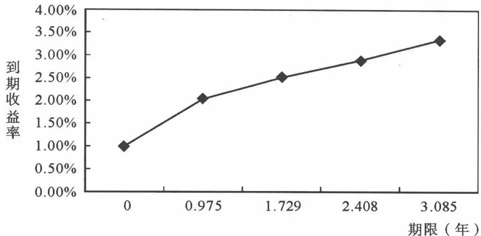
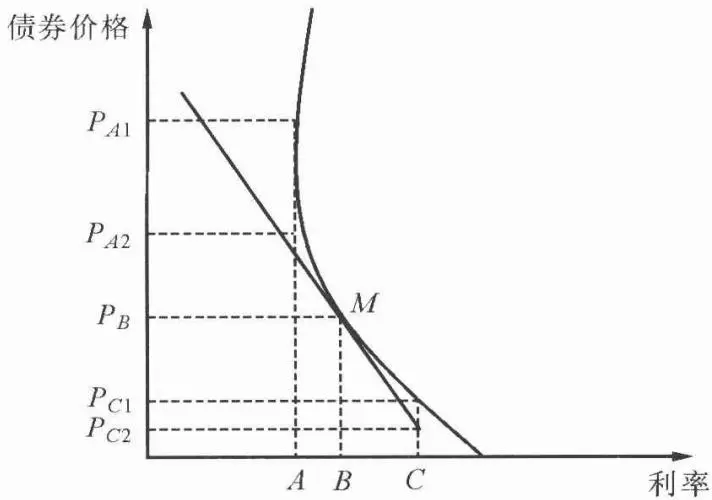

# [第4章](ch04.md) 金融计算基础及对债券的估值

## 4.1 金融计算基础

由于货币具有在一定利率水平下进行投资的机会,因此货币是有时间价值的。时间价值是分析任何金融工具都要用到的基础概念之一,时间价值的概念在进行投资决策和衡量投资收益的过程中都有着广泛的运用。

### 4.1.1 终值的计算

资金的终值(FV)是当投资者按一定利率投资直至到期,并以复利计算到期时的价值。任意数量货币的终值可以用下面的公式来计算:

$$
F V = P V (1 + r) ^{N}
$$

式中， $FV$ 为终值； $PV$ 为期初本金或者现值； $N$ 为期限数，与利息支付周期有关，一般为1年； $r$ 为每期的利率。

例如:某投资者期初用1000元投资于某种8年期债券,年率为4%,利息按年支付,并以4%的利率进行再投资,这笔投资到期时的终值将是 $FV=1000\times(1+4\%)^{8}=1368.6$ 元。

当然一般情况下,付息频率为一年,当付息频率不为一年时,上式中的 N 和 r 都要调整如下:

$$
N = \mathrm{期限数} \times \mathrm{付息频率}
$$

$$
r = \mathrm{年利率} / \mathrm{付息频率}
$$

从而更一般的终值计算公式修改为：

$$
F V = P V (1 + r / n) ^{N \times n}
$$

显然,在其他条件相同时,n越大,也即付息频率越大时,投资的终值越大,这是因为付息频率越大,将所获利息进行投资的机会将更大。下面考虑一种极限情况,即 $n\to\infty$ 时的终值:

$$
\lim_{n \rightarrow \infty} P V (1 + r / n) ^{N \times n}
$$

由高等数学的知识,我们知道上述极限为 $PVe^{N \times r}$ ,通常把这种情况称为连续复利。

上面介绍了最简单的终值计算方法,下面介绍一种比较复杂的终值计算方法。当投资者不是一次将所有资金全部进行投资,而是分期进行等额投资时,就称为年金,从第一期期末进行第一笔投资时称为普通年金,普通年金是最常见的年金。普通年金的计算公式为:

$$
F V_{O} = A (1 + r) ^{N - 1} + A (1 + r) ^{N - 2} + \dots + A = A \sum_{t = 0} ^{N - 1} (1 + r) ^{t}
$$

式中 A 为年金额,由中学的等比数列的知识,我们可以得到这一公式的简化形式:

$$
F V_{o} = A \frac{(1 + r) ^{N} - 1}{r}
$$

如果年金的投资周期每年不止一次,则对 N 和 r 也要进行相应调整,调整方法同一般的终值计算完全相同。


有一种 20 年期的债券, 面值为 1000 元, 年利率为 8%, 每半年付息一次, 所得利息按 12% 的年利率进行再投资, 则期末可以获得的利息总额是多少呢? 每次的利息支付都是期末发生的, 而且金额相同, 因此可以看作是一种普通年金, 年金金额为: $1000 \times 8\% / 2 = 40$ , 代入上面的公式, 可以得到期末获得的利息总额 (不包括本金) 为:


$$
40 \times \frac{(1 + 4\%) ^{40} - 1}{4 \%} = 3801 (\mathrm{元})
$$

需要注意的,这里的再投资期限为40期,而不是20期。



除了普通年金外,当每次的现金流都是在期初发生时,这种年金被称为预付年金,预付年金的终值计算方法可以通过普通年金的变形得到:

$$
F V_{D} = F V_{O} \times (1 + r)
$$

这是因为预付年金和普通年金的唯一区别就是每次现金流的发生都比普通年金早一期,因而每期年金的再投资期限也多一期,因此只要在计算普通年金时多乘1次 $(1+r)$ 就可以得到预付年金的终值。

### 4.1.2 现值的计算

现值的计算和终值的计算相反,现值是为了在投资末期得到一定金额的货币量而在期初投入的货币量。

现值的计算公式为：

$$
P V = \frac{F V}{(1 + r / n) ^{N \times n}}
$$

式中，PV 为现值；FV 为终值；r 为贴现率（一般是年利率）；N 为期限数（一般是年数）；n 为每个贴现率周期内发生的现金流次数。

计算现值的过程也叫贴现,其中最重要的是确定贴现率。贴现率有时同证券的利率是相同的,但证券发行后,随着市场的变化,更多的时候贴现率同证券的利率并不相同。

上面所说的是一种存续期间不发生现金流的证券,金融市场上还存在着很多证券,在它们的存续期间,现金流并不是一次发生的,而是按期分次发生的,在这种情况下,证券的现值就等于各期现金流现值之和:

$$
P V = \sum_{t = 1} ^{N \times n} \frac{C_{t}}{(1 + r / n) ^{t}}
$$

式中 $C_{t}$ 为每期发生的现金流；r 为贴现率（一般是年利率）；n 为每个贴现率周期内发生的现金流次数；N 为期限数。


一种 10 年期国债, 面值为 1000 元, 票面利率为 4%, 每年年底付息一次, 到期还本, 这段时间市场贴现率为 5%, 则此债券整个存续期间所有现金流的现值如下:


$$
\sum_{t = 1} ^{10} \frac{40}{(1 + 5\%) ^{t}} + \frac{1000}{(1 + 5\%) ^{10}} = 922. 78 (\text{元})
$$



特别地,由于年金有着比较特别的现金流,因此在计算年金现值的时候,也可以使用下面的简化公式。

普通年金为：

$$
P V_{O} = \sum_{t = 1} ^{N \times n} \frac{A}{(1 + r / n) ^{t}} = A \left[ \frac{1 - \frac{1}{(1 + r / n) ^{N \times n}}}{r / n} \right]
$$

根据前面所说的普通年金和预付年金的关系,可以得到预付年金现值的计算公式为 $PV_{D}=PV_{O}(1+r/N)$ , 因为预付年金为期初付, 所以它比普通年金少贴现一次。

下面介绍一种特殊的年金: 永续年金, 即这种年金没有到期日, 即 $N \rightarrow \infty$ , 这样由上述公式可得:

$$
P V_{P} = \frac{A}{r / n}
$$

### 4.1.3 贴现率的确定

上面都是把贴现率作为已知量给出,但是现实中,贴现率是一个需要确定的变量。一般来说贴现率是一个反映货币时间价值的指标。但在不同的领域中,贴现率有着丰富的具体含义。在证券投资中,贴现率可以看作投资者的机会成本,即投资者投资于某证券而损失的其他投资机会所获得的最高收益率,因此,投资者投资于某一证券的条件就是该证券的收益率至少不低于其他投资对象。基于这种考虑,我们通常用要求的回报率来作为它的贴现率。要求的回报率指在考虑了证券的风险后投资者所要求的最低收益率,另一方面,对公司来说,投资者要求的回报率就是他们的股权成本。在分析债券价值时,我们通常用可类比的债券收益率作为要求的回报率,这里可类比债券的意思是指具有相同信用等级且到期日相同的不可赎回债券。此外,还可以通过构建收益率曲线等方法来比较精确地计算要求的回报率,这将在后面的内容中进行详细的介绍。本部分内容主要介绍分析股票价值时贴现率的确定方法。

股票价值的分析方法大都是建立在现金流贴现基础(DCF)之上的,因此,贴现率的确定在分析股票价值时是至关重要的。一般来讲,确定股票贴现率或要求回报率的方法有三种:通过资产定价模型来计算,债券收益加上风险溢价及风险加成法。下面将对每一种方法进行详细介绍。

1. 用前面章节的资产定价模型来确定贴现率。资产定价模型主要是资本资产定价模型和套利定价模型。这些模型都认为资产的收益率等于无风险收益加上该资产相对于某一(或某些)要素的风险溢价。其中,CAPM 的形式如下:

$$
E [ R_{i} ] = r_{f} + \beta_{i} (E [ R_{M} ] - r_{f})
$$

使用 DCF 法分析股票价值时, 我们通常使用这里的 $E[R_{i}]$ 作为贴现率, 即 $E[R_{i}]=r$ 。


假设某公司股票的贝塔值为 0.8，同期市场风险溢价为 6%，无风险收益率为 5%，那么该公司要求的回报率为 $5\% + 0.8 \times 6\% = 9.8\%$ .


通过观察公式可以看出,在使用公式 $E[R_{i}]=r_{f}+\beta_{i}(E[R_{M}]-r_{f})$ 计算某一证券的预期收益率时,关键是要确定无风险收益率 $r_{f}$ 和市场风险溢价 $E[R_{M}]-r_{f}$ 。一般来讲,我们可以用短期政府债券或长期国债的收益率来作为无风险收益率。其中可交易的长期国债收益率更加常用,因为股票是不偿还的,因此也可以看作是久期(后面将会讲到)很长的债券,因此根据久期匹配的原则,长期国债的收益率更适合作为计算股票收益率时的无风险收益率,我们一般使用20年期或10年期可流通国债的收益率作为无风险收益率。因此,在计算贴现率时,上述公式可以重新定义为:

#### 贴现率 $=$ 长期国债收益率 $+$ 该股票 $\beta \times$ 预计股票市场对长期国债的溢价

因此接下来就只剩下市场风险溢价一项了。通常计算市场风险溢价的方法有两种。第一种是使用股票市场对国债市场风险溢价的历史平均数，另一种方法则是基于对公司的预测数据。在使用历史平均法时，既可以使用算术平均也可以使用几何平均来计算过去市场风险溢价的平均数。但是，这种用历史数据平均得出的溢价很可能是不准确的，因为股票市场经常会有业绩不佳的股票退市，使得使用历史平均法算出的市场风险溢价很可能是被高估的，因此有必要对这个数值进行必要的调整。

用预测法来计算市场风险溢价是戈登模型(Gordon model)(这将在下一章股票价值模型中详细介绍)的一个应用,计算方法如下:

$$
\begin{array}{r l} & {\text{股票市场风险溢价} = \text{预期明年的市场平均股利收益率(股利 / 股票价格)} + \text{公认的上市公司长期盈利增长率} - \text{当期长期国债收益率}} \end{array}
$$

如果某股票市场预计明年的股利收益率为 2%，且市场一致认为整个市场上的上市公司未来 5 年平均长期盈利增长率为 4.8%，20 年期国债的当前收益率为 3%，那么该市场的风险溢价为： $2\% + 4.8\% - 3\% = 3.8\%$ 。

预测数据有着较大的主观性,因此一般不建议使用预测法来计算市场风险溢价,除非市场刚刚建立,历史数据太少。预测法主要适用于那些新兴市场。

除了 CAPM 模型外,我们还可以使用 APT 模型来计算股票的要求回报率。由于两者使用方法非常相似,因此此处就不再详述。

很明显使用资产定价模型来计算贴现率存在着三个明显的不确定性: 模型的不确定性(模型不一定正确)、输入数据的不确定性(比如 CAPM 计算中的市场风险溢价)和敏感度 $\beta$ 的不确定性。

2. 用债券收益率加风险溢价来计算股票贴现率。对于有发行可交易长期债券的公司,我们还可以使用债券收益率加风险溢价的方法来计算股票贴现率。

$$
\text{股权成本(贴现率)} = \text{公司发行的长期债券的到期收益率} + \text{风险溢价}
$$

风险溢价的确定没有一个确定的计算方法,而更多地是一个经验估算。在美国市场上,这一溢价一般为 3%\~4%。由于中国企业很少发行企业债,因此这一方法在中国并不适用。

3. 风险加成法。对于非上市公司来说,它们的公开数据很少,我们无法计算它们的 $\beta$ 或因素敏感系数,也就无法用 CAPM 或 APT 模型来计算它的贴现率。此时,我们可以用风险加成法来确定它们的贴现率。

$$
\text{股权成本(贴现率)} = \text{无风险收益率} + \text{风险溢价}
$$

与 CAPM 和 APT 不同的是, 这里的风险溢价是一个主观的估计数字, 因此使用这种方法一般要求分析者有丰富的投资经验。

## 4.2 债券价值分析

在第一节我们介绍了金融领域的一些比较基础的计算,下面我们就要将这些计算方法运用到实际的证券投资分析中去。本节主要介绍关于债券投资的一些基本分析方法。

### 4.2.1 收入资本化法与债券价值分析

根据收入资本化法,任何资产的内在价值都等于投资者对持有该资产预期的未来现金流的现值。根据资产的内在价值与市场价格是否一致,可以判断该资产是否被低估或高估,从而帮助投资者进行正确的投资决策。所以,如何决定债券的内在价值成为债券价值分析的核心。下面将对不同的债券种类分别使用收入资本化法进行价值分析。

### (1) 贴现债券

贴现债券,又称零息票债券(zero-coupon bond),或贴现债券,是一种以低于面值的贴现方式发行,不支付利息,到期按债券面值偿还的债券。债券发行价格与面值之间的差额就是投资者的利息收入。由于面值是投资者未来唯一的现金流,所以贴现债券的内在价值由以下公式决定:

$$
P = \frac{F}{(1 + r) ^{T}}\tag{4.1}
$$

其中，P 代表贴现债券的内在价值，F 代表面值，r 是市场利率，T 是债券到期时间。

假定某种贴现债券的面值为 1000 元, 期限为 20 年, 利率为 8%, 那么它的内在价值应该是:

$$
P = \frac{1000}{1 . 08^{20}} = 214. 55 (\text{元})
$$

### (2) 息票债券

息票债券,是一种按照票面金额计算利息,票面上可附有作为定期支付利息凭证的息票,也可不附息票的债券。投资者不仅可以在债券期满时收回本金,而且还可定期获得固定的利息收入。所以,投资者未来的现金流包括了两部分:本金与利息。息票债券的内在价值为:

$$
P = \frac{C}{1 + r} + \frac{C}{(1 + r) ^{2}} + \dots + \frac{C}{(1 + r) ^{T}} + \frac{F}{(1 + r) ^{T}}\tag{4.2}
$$

其中，C 是债券每期支付的利息，其他变量与贴现债券的公式相同。

当债券清算日距离下次付息日不满一年时,我们就应该对公式(4.2)进行一些改动

$$
P = \sum_{t = 1} ^{n} {\frac{C}{(1 + r) ^{d} (1 + r) ^{t - 1}}} + {\frac{F}{(1 + r) ^{d} (1 + r_{n}) ^{n}}}
$$

其中，d 为清算日距离下次付息日的天数/365。

下面介绍一个小技巧。

当息票利率高于实际利率时,债券价格高于面值;

当息票利率等于实际利率时,债券价格等于面值;

当息票利率低于实际利率时,债券价格低于面值。

### (3) 统一债券

统一债券是一种没有到期日的特殊的定息债券,它和上面讲述的永续年金相同。最典型的统一公债是英格兰银行在18世纪发行的英国统一公债,英格兰银行保证对该公债的投资者永久地支付固定的利息。直至如今,在伦敦的证券市场仍然可以买卖这种公债。历史上美国政府为巴拿马运河融资时也曾发行类似的统一公债。但是,由于美国政府在该种债券发行时还附有赎回条款,所以美国的统一公债已经退出了流通。在现代企业中,优先股的股东可以无限期地获得固定的股息,所以优先股实际上也是一种统一公债。统一公债的内在价值的计算公式如下:

$$
P = \frac{C}{1 + r} + \frac{C}{(1 + r) ^{2}} + \dots = \frac{C}{r}\tag{4.3}
$$

例如,某种统一公债每年的固定利息是60美元,假定市场利率水平为12%,那么,该债券的内在价值为500美元,即:

$$
P = \frac{60}{12\%} = 500 (\mathrm{美元})
$$

### 4.2.2 收益率曲线

#### (1) 收益率曲线及其构建。前面我们介绍了单一贴现率下债券收益率和价格的计算,前面所有的计算都是基于这样的一个假设的前提上的,那就是假设所有的再投资利率都与到期收益率相同。但是现实中,不同期限投资其收益率往往是不同的,比如一年期国债的年收益率一般低于二年期或更长期限的国债,而对在不同时间产生的现金流,也应该用相应期限的收益率来对其进行贴现,如对第一年年底发放的利息用一年期的收益率进行贴现,对第二年的利息则用二年期的即期利率(即期利率是只对投资者支付一次现金流的贷款或债券的到期收益率)来进行贴现……因此,当放开收益率不变的假设之后,我们就需要按照现实情况对计算方法进行相应的改进。此时债券的价格公式为

$$
P = \sum_{t = 1} ^{n} \frac{C}{(1 + r_{t}) ^{t}} + \frac{F}{(1 + r_{n}) ^{n}}\tag{4.4}
$$

利用这种方法计算债券价格最重要的就是要知道任何期限投资的收益率,比如如果一种债券离到期日还剩下5年零1天,下一次利息支付发生在一天后,每年支付一次利息,那我们就需要知道1天期,1年零1天……直到5年零1天的收益率,而市场上并不一定会存在有相同剩余期限的同类债券,因此就需要一种方法来估算任何期限的收益率。

我们通过构建收益率曲线来估算任何期限的收益率。收益率曲线是反映即期利率同剩余到期时间函数关系的曲线(即期利率关于时间的函数)。我们假定即期利率和期限存在着某种函数关系,然后通过市场现有债券的数据来推导出两者之间的函数关系。当然市场不可能有每个时间点上的利率,这样我们只能通过一些离散点来拟合出一条光滑的曲线。当然本节讲述的推导出的收益率曲线只是比较简单的拟合,用两个点之间的直线来代替真实的收益率曲线,且不考虑连接两条直线之间点的光滑性(用到一阶导数)。

下面我们通过构建 2005 年 3 月 21 日中国国债市场(见表 4.1)的理论收益率曲线来具体说明这种构建方法。下面主要用的是拉格朗日插值法的线性插值法。首先要选择不同期限的国债,由于市场未清偿债券的剩余期限一般不会正好是整年,因此我们要尽量选择剩余期限接近整年的债券,而且每种剩余年份的债券尽量都要有。

表 4.12005 年 3 月 24 日部分国债的相关资料

<table><tr><td>国债名称</td><td>剩余期限(年)</td><td>全价(元)</td><td>票面利率(%)</td><td>还本付息方式</td></tr><tr><td>05 国债 02</td><td>0.975</td><td>98.040</td><td>NA</td><td>贴现式</td></tr><tr><td>04 国债 11</td><td>1.729</td><td>101.561</td><td>2.98</td><td>年</td></tr><tr><td>99 国债 5</td><td>2.408</td><td>102.854</td><td>3.28</td><td>年</td></tr><tr><td>21 国债 3</td><td>3.085</td><td>102.87</td><td>3.27</td><td>年</td></tr><tr><td>97 国债 4</td><td>2.449</td><td>122.35</td><td>9.78</td><td>年</td></tr></table>

此外,央行一天超额准备金利率为 0.99%,由于期限只有 1 天,我们将这一利率近似作为期限为 0 的国债收益率。

这样收益率曲线的计算过程可以描述如下：

1. 0.975年期的年收益率为：

$$
r_{0.975} = \left(\frac{100}{98.04}\right)^{\frac{1}{0.975}} - 1 = 2.05\%
$$

设 0.975 年以下的收益率曲线符合抛物线方程：

$r=a\sqrt{t}+0.99\%$ , 因为期限为 0 的国债收益率为 0.99%, 这样上述曲线的截距就为 0.99%。

将点 $(0.975,2.05\%)$ 代入上面式子，得到a=0.0107。

这样抛物线方程为：

$$
r = 0.0107\sqrt{t} +0.99\% \qquad t\in (0,0.975]\tag{4.5}
$$

2. 计算 1.729 年期的收益率, $r_{1.729}$ 满足如下条件:

$$
\frac{2 . 98}{(1 + r_{0 . 729}) ^{0 . 729}} + \frac{102 . 98}{(1 + r_{1 . 729}) ^{1 . 729}} = 101. 561
$$

将 t=0.729 代入上述抛物线方程得到 $r_{0.729}=1.90\%$ ，将这一数据代入到上面的条件解得 $r_{1.729}=2.53\%$ 。由于是直线拟合，故只需要两点，前面已经知道 $r_{0.975}$ ，加上现在的 $r_{1.729}$ ，我们用这两点可以得到这两点之间的线段的方程为：

$$
0. 0048 t - 0. 754 r + 0. 010777 = 0 \quad t \in (0. 975, 1. 729 ]\tag{4.6}
$$

3. 计算 2.408 年期的收益率, $r_{2.408}$ 满足如下等式:

$$
\frac{3 . 28}{(1 + r_{0 . 408}) ^{0 . 408}} + \frac{3 . 28}{(1 + r_{1 . 408}) ^{1 . 408}} + \frac{103 . 28}{(1 + r_{2 . 408}) ^{2 . 408}} = 102. 854
$$

$r_{0.408}$ 可由(4.5)得出为1.67%，而 $r_{1.408}$ 可由(4.6)得出为2.33%，将这两个数据代入到上式可以得到 $r_{2.408}=2.90\%$ 。由上面的 $r_{1.729}$ 和这次的 $r_{2.408}$ 可得到两点之间的直线方程为

$$
0. 0037 t - 0. 679 r + 0. 0107814 = 0 \quad t \in (1. 729, 2. 408 ]\tag{4.7}
$$

4. 计算 3.085 年期的收益率。由于其满足以下方程：

$$
\frac{3 . 27}{(1 + r_{0 . 085}) ^{0 . 085}} + \frac{3 . 27}{(1 + r_{1 . 085}) ^{1 . 085}} + \frac{3 . 27}{(1 + r_{2 . 085}) ^{2 . 085}} + \frac{103 . 27}{(1 + r_{3 . 085}) ^{3 . 085}} = 102. 87
$$

通过(4.5)，(4.6)，(4.7)，可以分别求得 $r_{0.085}, r_{1.085}, r_{2.085}$ ，这样把上述三个数据代入到上式中可以得到直线方程：

$$
0. 0044 t - 0. 677 r + 0. 0090378 = 0 \quad t \in (2. 408, 3. 085 ]\tag{4.8}
$$

5. 计算 97 国债 4 的理论价格：

利用前面几个方程可以计算得到 $r_{0.449}=1.72\%$ , $r_{1.449}=2.38\%$ , $r_{2.449}=2.93\%$ .

这样国债价格为 $\frac{9.78}{(1 + r_{0.449})^{0.085}} +\frac{9.78}{(1 + r_{1.449})^{1.085}} +\frac{9.78}{(1 + r_{2.449})^{2.085}} = 121.44$ （元）

而该债券市场价格为 122.35 元,误差并不很大。

6. 这样根据①～④的计算,可以得到2005年3月24日中国国债市场的即期利率曲线,如图4.1所示。

图 4.12005 年 3 月 24 日中国国债市场收益率曲线

上面说的是即期收益率的估算,下面介绍一种新的利率:远期利率。远期利率是承诺日和资金贷放日不同情况下的债券利率。对于两年期的情形,假设第一年的即期利率为 $i_{01}$ ,一年后的一年期的远期合约的远期利率在现在的价格为 $i_{12}$ ,且现在两年期的即期利率为 $i_{02}$ 。则远期利率必满足 $(1+i_{01})(1+i_{12})=(1+i_{02})^{2}$ 。针对一般形式有:现在时刻为0时刻,n年期的即期利率为 $i_{0n}$ ,m年期的即期利率为 $i_{0m}$ ,不妨假设n<m。则0时刻的n年后的m-n年期的远期利率为 $i_{nm}$ ,则远期利率必满足 $(1+i_{nm})^{m-n}(1+i_{0n})^{n}=(1+i_{0m})^{m}$ 。

### 4.2.3 利率的期限结构理论

即期利率曲线有各种形状,有向上倾斜的、向下倾斜的、水平的等等。为什么会有各种形状,且大部分都是向上倾斜的呢?而且收益率曲线一般会整体移动,即当短期利率上升时,长期利率也会上升。针对上述现象,债券的期限结构理论有四种解释,下面逐一介绍。

### (1) 纯预期理论 (pure expectation theory)

它假定投资者对于风险无特定偏好(或者风险中性), 只要给予高的期望收益即可。或者对于期望收益相同的不同证券，投资者没有觉得它们有什么不同。

下面以两年期为例。假设第一年的即期利率为 $i_{01}$ ，预期一年后的即期利率为 $i_{12}^{e}$ ，则由预期理论可以知道，二年期的即期利率 $i_{02}$ 必满足下式：

$$
(1 + i_{01}) (1 + i_{12} ^{e}) = (1 + i_{02}) ^{2}
$$

因为投资者风险中性,这样对于他们来说投资一年后再投资一年和现在投资两年,只要收益率完全一样,他们就会觉得无差异。这样只有满足上式的即期利率才能是均衡利率。如果不满足的话,就会有套利出现。比如 $(1+i_{01})(1+i_{12}^{e})>(1+i_{02})^{2}$ ,则投资者必然选择卖空两年期的贴现债券,这样买一个一年期的贴现债券后到期时再买一个一年期的贴现债券进行套利。套利的结果就使得两年期的贴现债券价格上升,一年期的贴现债券价格下降。最终两年期的即期利率上升到等式成立(一年期的即期利率也下降)。另一种情况可类似分析。

如果预期利率上升, 即 $i_{12}^{e} > i_{01}$ , 则由上述等式可得 $i_{02} > i_{01}$ , 这样收益率曲线就向上倾斜。

如果预期利率下降, 即 $i_{12}^{e}<i_{01}$ , 则由上述等式可得 $i_{02}<i_{01}$ , 这样收益率曲线就向下倾斜。

如果预期利率不变, 即 $i_{12}^{e}=i_{01}$ , 则由上述等式可得 $i_{02}=i_{01}$ , 这样收益率曲线就为水平线。

必须注意的是,一年后的预期即期利率 $i_{12}^{e}$ 和现在时刻一年后的远期利率 $i_{12}$ 在概念上是两种不同的利率:一个是人们现在预期的一年后的即期利率,一个是市场上远期协议的利率。预期理论认为两者必然相等。

这样我们就解释了收益率曲线的三种形状。且它解释了收益率曲线的整体移动。因为假设现在的短期利率上升，则由上述等式可知，在其他条件不变的情况下，两年期的即期利率也会上升。

尽管上面以两年期为例,但是完全可以推广到多年期的情形。

纯预期理论很好地解释了收益率曲线,但是它并没有解释为什么收益率曲线一般向上倾斜。

### (2) 流动性贴水理论 (liquidity premium theory)

该理论基本上承认期限结构的纯预期理论,但是对它有一个重大的修正。流动性贴水理论认为,长期债券比短期债券的流动性差,必须要给予投资者更高的期望收益,才能使得他们愿意持有长期债券。因为长期债券比短期债券担负着更大的市场风险——价格波动和难以变现的风险。这种由于增加的市场风险而产生的长期债券额外的报酬称为流动性贴水。当然，对于债券发行者而言，由于金融市场上长期投资者少而短期投资者多，因此，长期资本的筹集所付出的成本较高。

例如,一年期即期利率 $i_{01}$ 为 $10\%$ , 预计下一年即期利率 $i_{12}^{e}$ 为 $16\%$ , 则由纯预期理论,两年期的贴现债券的到期收益率为 $13\%$ , 但在流动性贴水理论中认为,两年期的到期收益率要高于 $13\%$ , 才能使得那些原来持有一年期债券的人愿意持有两年期的债券,也就是说,除了 $13\%$ 的收益外,尚需再加上一个流动性贴水。

流动性贴水理论认为,不论对未来的预期是多少,流动性贴水理论预测的长期收益将高于纯预期理论。当预期利率不变时(在纯预期理论中为水平的收益曲线),流动性贴水理论的收益曲线则为一条稍微向上倾斜的曲线;当预期利率上升时(在纯预期理论中为向上的收益曲线),流动性贴水理论的收益曲线的斜率更大,曲线更陡;当预期利率下降时(在纯预期理论中为向下倾斜的收益曲线),流动性贴水理论的收益曲线则为稍微向下倾斜的曲线或几乎是一条平坦的或稍微向上倾斜的曲线。

流动性贴水理论还认为,贴水随着债券到期期限的延长而变大,例如,三年期债券利率贴水要大于两年期债券利率贴水。

这样流动性贴水理论更能说明向上倾斜的收益曲线存在的原因。

### (3) 市场分割理论(market segmentation theory)

该理论认为一些投资者和债券发行人对债券的某一期限有特殊偏好,而对不同期限债券不感兴趣,换句话说,高利率也不能吸引他们。

首先考虑一种较长期限的债务。从保险公司的角度来考察期限选择问题。人寿保险公司提供的保单，可能长期都不会要求任何支付。例如，一份出售给一位25岁个人的保单，保险公司预期第一笔支付可能发生在25年甚至更久之后。保费的多少部分由预期的利率决定。如果保险公司投资于长期债券，债券的利息已知，而且如果利息超出保险合同承诺的水平，这就会大大降低保险公司的风险。但仍然存在某些风险，因为获得的利息需要被再投资，而再投资利率是未知的。但是，本金的投资利率始终是已知的，这大大降低了风险。或者保险公司为了满足长期债务，可以购买一系列1年期债券。但这样一来，1年以后的所得都是不确定的。如果利率下降至低于保险合同的预期水平，公司可能难以满足其债务。不仅债券票面利息的再投资回报率不确定，本金的回报率也不确定。因此，很多保险公司投资于长期债券，即使短期利率

明显高于长期利率。

我们再从长期债券的发行者的角度来考虑期限选择的问题。建设一个厂房或仓库或其他设备需要公司支出一大笔资金。这些都属于长期资产。公司一般希望对它们的支付也在较长的一段时间内进行。公司可以通过发行长期债券来实现这种现金流模式，或者通过发行短期债券并在较长时间内不断重复发行。如果公司发行的是长期债券，公司的成本事前就已经确定，不存在再投资的利率风险。这就说明，公司通常会发行长期债券来满足这类债务。

同理可推知短期债券的情况。公司都有很多需要定期支付的短期债务，税收和工资是其中的两个例子。公司通常备有一定的现金来满足这些支付要求。如果公司购买贴现债券，债券的到期日恰好是支付日，公司将来的可用资金数额的风险为0（不考虑违约风险）。如果公司购买长期债券，财务上就会面临未来利率上升、债券价格下降，未来可用资金数额小于支付的风险。商业银行持有大量的短期证券。商业银行从事短期贷款以使资产和债务在期限上匹配。

市场分割理论认为投资者是风险厌恶的(这个和前面两种理论有明显的区别), 只在他们所希望的期限区间内经营。收益率差异不能导致他们改变期限。所以, 决定长期利率的只是长期资金的供给和需求。同样, 短期利率也只由短期资金的供求决定。相信市场分割理论的人研究这些市场的资金流入流出情况, 以预测收益率曲线的变化。

根据该理论,如果当前企业和政府主要发行长期债券,那么长期利率将高于短期利率,此时收益率曲线向上倾斜;如果当前企业和政府主要发行短期债券,那么短期利率将高于长期利率,此时收益曲线向下倾斜。

同预期理论一样,它不能解释收益率曲线往往向上倾斜,且不能解释同步变动。

### (4) 期限偏好理论(term preference theory)

期限偏好理论是前面几种理论的折中。该理论认为投资者对特定期限都有很强的偏好，因而收益曲线不会严格地服从纯预期理论和流动性贴水理论的预测。投资者之所以如此，是因为在债券投资过程中，投资者的资产周期和负债周期正确匹配会使其处于最低风险状态。例如银行和货币市场共同基金一般购买短期债券，而人寿保险公司则偏好于购买长期债券。但是，如果不符合投资者偏好的期限的预期额外收益变大时，实际上投资者将修正原来偏好的期限。或者说只要给投资者足够的利益补偿，投资者也会考虑改变以前投资的品种。比如，当长期债券的预期收益远远超过短期债券的收益时，银行和货币市场共同基金将增加该期限的资产,也就是说,他们将购买长期债券。如果购买短期债券的预期收益变大,人寿保险公司将暂时取消只投资长期债券的规定,并在他们的资产组合中加入适当的短期债券。换句话说,如果投资者已经使自己处于某种期限偏好状态,则要使其离开原偏好状态,就必须提供额外贴水 P 作为增加风险的补偿。

例如，在纯预期理论中，对两年期债券来说，有：

$$
(1 + i_{01}) (1 + i_{12} ^{e}) = (1 + i_{02}) ^{2}
$$

在期限偏好理论中,则应是:

$$
(1 + i_{01}) (1 + i_{12} ^{e} + P) = (1 + i_{02}) ^{2}
$$

从上式中,我们可以看出,若短期资金供给较多,则投资者偏好于购买短期债券,要使其购买长期债券,必须提供风险贴水,也就是说,P>0;相反,若长期资金供给较多,则投资者偏好于购买长期债券,要使其购买短期债券,必须提供风险贴水,也就是说,P≤0。

期限偏好理论以实际的观念为基础,即投资者为预期的额外收益而承担额外的风险。在接受市场分割理论和纯预期理论部分观点的同时,也剔除了二者极端的观点。该理论能较近似地解释现实世界的现象。

## 4.3 债券属性与价值分析

债券的价值与债券以下六方面的属性密切相关。这些属性分别是:到期时间(期限)长短、息票率、可赎回条款、税收待遇、流通性以及违约风险。其中任何一种属性的变化都会改变债券的到期收益率水平,从而影响债券的价格。下面将采用局部静态均衡的方法,即在假定其他属性不变的条件下,分析某一种属性的变化对债券价格的影响。

### 4.3.1 到期时间

从第2节可以发现:当市场利率 r 和债券的到期收益率 $r^{*}$ 上升时,债券的市场价格和内在价值都将下降。当其他条件完全一致时,债券的到期时间越长,市场利率变化引起的债券价格波动幅度越大。后面久期可以用来解释这一原因,因为到期时间越长,久期会越大,这样市场利率变化引起的债券价格波动幅度越大。但是当到期时间变化时，市场利率变化引起的债券的边际价格变动率递减。


假定存在 4 种期限分别为 1 年、10 年、20 年和 30 年的债券, 它们的息票率都是 5%, 面值均为 100 元, 其他属性也完全一样。如果期初的市场利率为 5%, 根据内在价值的计算公式可知这 4 种债券的内在价值都是 100 元。如果相应的市场利率上升或下降, 这 4 种债券的内在价值的变化如表 4.2 所示。

表 4.2 内在价值与期限之间的关系

<table><tr><td rowspan="2">期限</td><td colspan="3">相应的市场利率下的内在价值(元)</td><td colspan="2">内在价值变化率(%)</td></tr><tr><td>3%</td><td>5%</td><td>7%</td><td>5%→3%</td><td>5%→7%</td></tr><tr><td>1</td><td>101.94</td><td>100</td><td>98.13</td><td>1.94</td><td>-1.87</td></tr><tr><td>10</td><td>117.06</td><td>100</td><td>85.95</td><td>17.06</td><td>-14.05</td></tr><tr><td>20</td><td>129.75</td><td>100</td><td>78.81</td><td>29.75</td><td>-21.19</td></tr><tr><td>30</td><td>139.20</td><td>100</td><td>75.18</td><td>39.20</td><td>-24.82</td></tr></table>


表 4.2 反映了当市场利率由现在的 5% 下降到 3%, 4 种期限债券的内在价值分别上升 1.94%, 17.06%, 29.75%, 39.20%(由于利率为 5% 时的内在价值为 100 元); 而当市场利率由 5% 上升到 7%, 4 种期限的债券的内在价值分别下降 1.87%, 14.05%, 21.19%, 24.82%。

可以看出当市场利率变动到 3% 时, 期限由 1 到 10 年时债券价格变动 15.12 元, 而由 10 年到 20 年时债券价格变动 12.69 元, 20 年变动到 30 年时债券价格变动 9.45 元。当然利率上升也会有这种规律: 市场利率变化引起的债券的边际价格变动率递减。

大家还可以发现市场利率上升导致债券价格的波动幅度不如同样幅度利率下降导致债券价格的波动幅度。这个涉及债券的凸度，后面将解释这种情况的原因。



### 4.3.2 息票率

债券的到期时间决定了债券的投资者取得未来现金流的时间,而息票率决定了未来现金流的大小。在其他属性不变的条件下,债券的息票率越低,市场利率变化引起的债券价格的波动幅度越大。后面将用久期来解释这种情形,下面只举例来说明这种现象。


设有 4 种债券, 期限相同均为 10 年, 面值均为 100 元。它们之间唯一的区别在于息票率, 且它们的息票率分别为 $3\%$ , $5\%$ , $6\%$ , $7\%$ 。假设初始的市场利率水平为 $5\%$ , 那么可以利用第二节的公式分别计算出它们的初始内在价值。如果市场利率发生了变化 (上升到 $6\%$ , 或下降到 $4\%$ ), 相应地可以计算出这 4 种债券的新的内在价值, 具体结果见表 4.3。

表 4.3 内在价值变化与息票率之间的关系

<table><tr><td rowspan="2">息票率</td><td colspan="3">相应的市场利率下的内在价值</td><td colspan="2">内在价值变化率(%)</td></tr><tr><td>4%</td><td>5%</td><td>6%</td><td>5%→4%</td><td>5%→6%</td></tr><tr><td>3%</td><td>91.89</td><td>84.56</td><td>77.92</td><td>8.67</td><td>-7.85</td></tr><tr><td>5%</td><td>108.11</td><td>100</td><td>92.64</td><td>8.11</td><td>-7.36</td></tr><tr><td>6%</td><td>116.22</td><td>107.72</td><td>100</td><td>7.89</td><td>-7.17</td></tr><tr><td>7%</td><td>124.33</td><td>115.44</td><td>107.36</td><td>7.70</td><td>-7.00</td></tr></table>


从表 4.3 中可以发现,面对同样的市场利率变动,无论是市场利率上升还是下降,4 种债券中息票率最低的债券的内在价值波动幅度最大,而随着息票率的提高,4 种债券的内在价值的变化幅度逐渐降低。所以,债券的息票率越低,市场利率变化引起的债券价格的波动幅度越大。



### 4.3.3 可赎回条款

许多债券在发行时含有可赎回条款,即在一定时间内发行人有权赎回债券。这是有利于发行人的条款,因为,当市场利率下降并低于债券的息票率时,债券的发行人能够以更低的成本筹到资金。所以,发行人可以行使赎回权,将债券从投资者手中收回。尽管债券的赎回价格高于面值,但是,赎回价格的存在制约了债券市场价格的上升空间,并且增加了投资者的交易成本,因此降低了投资者的收益率。为此,可赎回债券往往规定了赎回保护期是发行后的5至10年。


假设一种 10 年期债券, 息票率为 10%, 面值为 1000 元, 赎回价格为 1110 元, 且赎回保护期为 5 年, 假设必要报酬率为 9%, 则未行使赎回权时, 债券的内在价值为:

$$
P = \frac{100}{1 + 8\%} + \frac{100}{(1 + 8\%) ^{2}} + \dots + \frac{100}{(1 + 8\%) ^{10}} + \frac{1000}{(1 + 8\%) ^{10}} = 1134. 2016 (\mathrm{元})
$$

当发行者行使赎回权时,债券的内在价值为:

$$
P = \frac{100}{1 + 8\%} + \frac{100}{(1 + 8\%) ^{2}} + \dots + \frac{100}{(1 + 8\%) ^{5}} + \frac{1050}{(1 + 8\%) ^{5}} = 1113. 8834 (\mathrm{元})
$$


我们可以看到当公司行使赎回权时,债券的内在价值降低了。可见,可赎回权的存在,降低了该类债券的内在价值,并且降低了投资者的实际收益率。(可以想象得到,可赎回债券相当于投资者卖出了一个关于公司的看涨期权,从其名字就可以看出: callable bond,这样,可赎回债券的价值要低于相同条件下普通债券的价值)一般而言,息票率越高,发行人行使赎回权的概率越大,即投资债券的实际收益率与债券承诺的收益率之间的差额越大。



### 4.3.4 税收待遇

在不同的国家之间,由于实行的法律不同,不仅不同种类的债券可能享受不同的税收待遇,而且同种债券在不同的国家也可能享受不同的税收待遇。债券的税收待遇的关键,在于债券的利息收入是否需要纳税。由于利息收入纳税与否直接影响着投资的实际收益率,所以,税收待遇成为影响债券的市场价格和收益率的一个重要因素。例如,美国法律规定,地方政府债券的利息收入可以免交联邦收入所得税,所以地方政府债券的名义到期收益率往往比类似的但没有免税待遇的债券要低20%至40%。此外,税收待遇对债券价格和收益率的影响还表现在贴现债券的价值分析中。贴现债券一般具有延缓利息税收支付的优势,但对于美国地方政府债券的投资者来说,由于贴现的地方政府债券可以免交联邦收入所得税,使得贴现债券的税收优势不复存在,所以,在美国地方政府债券市场上,贴现债券品种并不流行,对于(息票率低的)贴现债券的内在价值而言,由于具有延缓利息税收支付的待遇,它们的税前收益率水平往往低于类似的但没有免税待遇的(息票率高的)其他债券,所以,享受免税待遇的债券的内在价值一般略高于没有免税待遇的债券。

### 4.3.5 流通性

债券的流通性或者流动性,是指债券投资者将手中的债券变现的能力。如果变现的速度很快,并且没有遭受变现所可能带来的损失,那么这种债券的流通性就比较高;反之,如果变现速度很慢,或者为了迅速变现必须承担额外的损失,那么,这些债券的流动性就比较低。

通常用债券的买卖差价的大小反映债券的流动性大小。买卖差价较小的债券的流动性比较高；反之，流动性较低。这是因为绝大多数的债券的交易发生在债券的经纪人市场，对于经纪人来说，买卖流动性高的债券的风险低于买卖流动性低的债券，故前者的买卖差价小于后者。所以，在其他条件不变的情况下，债券的流动性与债券的名义到期收益率之间呈反比关系，即流动性高的债券的到期收益率比较低，反之亦然。相应地，债券的流动性与债券的内在价值呈正比关系。

### 4.3.6 违约风险

债券的违约风险是指债券发行人未按照契约的规定支付债券的本金和利息，给债券投资者带来损失的可能性。债券评级是反映债券违约风险的重要指标。美国是目前世界上债券市场最发达的国家，所拥有的债券评级机构也最多，其中最著名的两家是标准普尔公司(Standard & Poor's, S&P)和穆迪投资者服务公司(Moody's Investors Services)。尽管这两家公司的债券评级分类有所不同，但是基本上都将债券分成两类：投资级和投机级，投资级的债券被评定为最高的四个级别。例如：标准普尔公司和穆迪投资者服务公司分别将AAA、AA、A、BBB和Aaa、Aa、A、Baa四个级别的债券定义为投资级债券，将BB级以下(包括BB级)和Ba级以下(包括Ba级)的债券定义为投机级债券。有时人们将投机级债券称为垃圾债券(junk bonds)，将由发行时的投资级转变为投机级的债券形象地称为“堕落天使”(fallen angels)。标准普尔公司的债券评级标准详见表4.4。在政府债券和公司债券之间，包括AAA级在内的公司债券的违约风险高于政府债券；在政府债券内部，中央政府债券的违约风险低于地方政府的债券；在公司债券内部，AAA级的债券的违约风险最小，并随着评级的降低，违约风险不断上升。

表 4.4 标准普尔公司的债券评级标准

<table><tr><td>级别</td><td>评级标准</td></tr><tr><td>AAA</td><td>是标准普尔公司评定的债券的最高级别,说明支付利息和偿还本金的能力最高</td></tr><tr><td>AA</td><td>说明支付利息和偿还本金的能力很强,与最高级别相比稍逊一点</td></tr><tr><td>A</td><td>尽管A说明环境变更和经济条件变更比上述两种级别更易引起负面影响,但其支付利息和偿还本金的能力依然相当强</td></tr><tr><td>BBB</td><td>被定义为BBB级的债券被认为有足够的能力支付利息和偿还本金。尽管在通常情况下其能得到足够的保护,但与前几级相比,变化的环境更可能削弱该级债券的还本付息能力</td></tr><tr><td>BB~C</td><td>定级为BB、B、CCC、CC和C的债券被认为还本付息有明显的投机特征。BB表示最低程度的投资性,而C则表示最高程度的投机性。尽管这种债券很可能质量尚可,并且有某些保护性条款,但是其不确定性和可能受不利条件影响的程度则更为严重</td></tr><tr><td>CI</td><td>是为没有利息收入的收入债券(income bonds)准备的</td></tr><tr><td>D</td><td>被定为D级的债券现在已经处于违约状态</td></tr></table>

那么,债券的违约风险与债券的收益率之间存在什么关系呢?既然债券存在着违约风险,投资者必然要求获得相应的风险补偿,即较高的投资收益率。所以,违约风险越高,投资收益率也应该越高。在美国债券市场上,联邦政府债券的违约风险最低,地方政府债券的违约风险次低,AAA级的公司债券的违约风险较高,D级的公司债券的违约风险最高。相应地,上述债券的收益率从低到高排列。但是,由于地方政府债券的利息收入可以免缴联邦政府收入所得税,所以,美国地方政府债券的投资收益率低于联邦政府债券的收益率,而联邦政府债券的投资收益率又低于AAA级的公司债券的收益率。在公司债券中,投资级债券的投资收益率低于投机级债券的收益率。

表 4.5 是对本节内容的总结, 综合了上述六方面的债券属性与债券价值分析之间的关系。

表 4.5 债券属性与债券收益率(价格)

<table><tr><td>债券属性</td><td>与债券收益率(价格)的关系</td></tr><tr><td>期限</td><td>当市场利率调整时,期限越长,债券的价格波动幅度越大,但是,当期限延长时,单位期限的债券价格的波动幅度递减</td></tr><tr><td>息票率</td><td>当市场利率调整时,息票率越低,债券价格波动幅度越大</td></tr><tr><td>可赎回条款</td><td>当债券被赎回时,投资收益率降低。所以,作为补偿,易被赎回的债券的名义收益率比较高,不易被赎回的债券的名义收益率比较低</td></tr><tr><td>税收待遇</td><td>享受税收优惠待遇的债券的收益率比较低,无税收优惠待遇的债券的收益率比较高</td></tr><tr><td>流动性</td><td>流动性高的债券的收益率比较低,流动性低的债券的收益率比较高</td></tr><tr><td>违约风险</td><td>违约风险高的债券的收益率比较高,违约风险低的债券的收益率比较低</td></tr></table>

## 4.4 债券组合管理

我们在前面几节讲述了影响债券收益和价值的债券性质,在本节,我们将讨论债券的组合管理。现代组合理论对债券管理的影响要远远小于对普通股管理的影响,而且债券管理中使用的一些组合管理技术只适用于债券领域,也并不源于现代组合理论。本节我们要介绍债券领域特有的技术及一般组合理论在债券领域中的应用。

本节分为四部分,第一部分讨论债券管理者面临的主要风险来源——收益率曲线的变动,以及测度债券对风险来源敏感性的指标。第二部分,我们将讨论构建一个与上述风险隔绝的债券组合的方法。这通常被称为消极的组合策略,但我们也将看到,它们也包括积极的组合调整。第三部分是积极的债券管理,既包括积极债券管理的特有技术,也包括现代组合中的债券管理技术,即首先估计期望收益率,然后估计方差、协方差。最后一部分是关于债券和利率互换。

债券收益包括两个部分:利息收入和价格变动导致的资本损益。价格发生变动可能是由于时间的推移或收益率曲线的移动。在下面的分析中,为方便起见,我们假设利息是每年支付一次。而且,我们还假定收益率曲线是平的,即所有的即期利率都等于r。

### 4.4.1 价格因时间推移而发生变动

首先考虑价格因时间推移而发生变动的情况。假定收益率曲线是平的，利率为 $8\%$ 。现在，我们看一个距离到期日还有4年的贴现债券。到期日支付100元，3年期贴现债券的价格为：

$$
P_{4} = \frac{100}{(1 + 8\%) ^{4}} = 73. 50 (\mathrm{元})
$$

假定即期利率在第一年保持不变。因为在一年后，该债券一定与一个二年期债券的收益率相等，所以它的价格变为：

$$
P_{3} = \frac{100}{(1 + 8\%) ^{3}} = 79. 38 (\mathrm{元})
$$

这一价格的变化发生在第一年,等于 $P_{3}-P_{4}=5.88$ 元,所以第一年的收益率为:

$$
\frac{P_{3} - P_{4}}{P_{4}} = \frac{5 . 88}{73 . 50} = 8
$$

时间推移对债券价格变动的影响对于贴现债券不难理解。因为贴现债券不支付利息,所有的收益都源于价格变化。息票债券的价格也可能因时间推移而发生预期变化。大量的债券除了票面利率不同外,在其他方面都是可比的。这些债券必须为投资者提供相同的收益率。所以,这些债券会有预期价格变化。例如,一个票面利率为 $4\%$ 的债券将折价出售,如果一个类似债券的当期利率是 $10\%$ ,预期价格会上升。大多数债券将预期价格变动作为收益的一部分。

### 4.4.2 非预期价格变化

价格变动的另一个原因是对未来利率的预期发生变化(非预期的收益率曲线变化)。假定收益曲线移动,所有期限的新利率是14%,再假定移动是瞬间发生的。在这种情况下,4年期贴现债券的价格变为:

$$
P_{4} ^{\prime} = \frac{100}{(1 + 14\%) ^{4}} = 59. 21 (\mathrm{元})
$$

导致的价格变化为 $P_{4}^{\prime} - P_{4} = -14.29$ 元。

如果一段时间内收益率曲线保持不变或预期不变,因时间推移引起的价格变动容易计算,但因非预期的收益率曲线变化导致的价格变动就不一样了。

如果我们知道对于未来利率的预期是如何随时间变化的,而其他人不知道,那么我们可以计算出每一债券的价格变化,并将所有的资金投入到收益最高的债券中去。但是,这是不可能的,我们最多只能计算出每一债券对收益率曲线移动的敏感性。

### 4.4.3 对收益率曲线移动的敏感性

在前面的章节中,我们用贝塔来测度一个普通股对某个指数的敏感性。债券也有一个类似的指标,称为久期(duration)。久期测度债券价格对利率

变动的敏感性。用符号表示如下：

$$
D = \sum_{i = 1} ^{n} \frac{i C}{P (1 + r) ^{i}} + n \frac{F}{P (1 + r) ^{n}}
$$

D 表示久期, P 为债券价格。由上式可知, D 为债券现金流量产生时刻的加权时间, 权重为现金流的现值与债券价格的比值。由于所有现金流的现值之和为债券价格, 故权重之和为 1。

$$
P = \sum_{i = 1} ^{n} \frac{C}{(1 + r) ^{i}} + \frac{F}{(1 + r) ^{n}}
$$

对上式关于 $r$ 求导得到：

$$
\frac{\partial P}{\partial r} = \sum_{i = 1} ^{n} \frac{C (- i)}{(1 + r) ^{i + 1}} + \frac{F (- n)}{(1 + r) ^{n + 1}} = \frac{1}{1 + r} (- D) P
$$

其中第二个等号要用到久期的定义。

对上式变形可得：

$$
\frac{\partial P}{P} = \frac{1}{1 + r} (- D) \partial r
$$

上式说明了一个债券的久期越大,同样的利率变动导致的债券价格变动的幅度越大,且利率变动方向与价格变动方向相反。

由于贴现债券只有到期时才有现金流,故现金流产生时刻的加权时间为它的期限。因此,如果假设收益率曲线是平的,一个贴现债券对收益率曲线变化的敏感性就直接与它的期限成比例。

由于 $D = \sum_{i=1}^{n} \frac{iC}{P(1+r)^{i}} + n \frac{F}{P(1+r)^{n}} < \sum_{i=1}^{n} \frac{nC}{P(1+r)^{i}} + n \frac{F}{P(1+r)^{n}} = n$ ，所以贴现债券的久期小于它的期限。到此为止，我们都是假设收益率曲线是平的，而且发生了移动。

表 4.6 给出了不同期限和不同票面利率的债券的久期。要注意,债券的久期要远远小于它的期限,尤其是那些期限很长的债券。

表 4.6 不同期限和票面利率的债券的久期
单位: 年

<table><tr><td rowspan="2">票面利率(%)</td><td colspan="3">距离到期日的年数</td></tr><tr><td>3</td><td>5</td><td>10</td></tr><tr><td>4</td><td>2.88</td><td>4.57</td><td>7.95</td></tr><tr><td>6</td><td>2.82</td><td>4.41</td><td>7.42</td></tr><tr><td>8</td><td>2.78</td><td>4.28</td><td>7.04</td></tr><tr><td>10</td><td>2.74</td><td>4.17</td><td>6.76</td></tr><tr><td>12</td><td>2.70</td><td>4.07</td><td>6.54</td></tr><tr><td>14</td><td>2.66</td><td>3.99</td><td>6.36</td></tr></table>

仔细观察表 4.6 我们可以发现以下规律：

1. 票面利率越高,久期越小。原因不难理解,随着票面利率提高,前期现金流的现值相对于最终现金流的现值增加。这样就提高了前期现金流的权重,从而减小了久期。而这正好解释了上节的问题:票面利率越高,债券价格受利率波动的影响越小。

2. 一般来说,期限越长,久期也越大。这个也解释了上节的疑问。

### 4.4.4 凸性(convexity)

近年来,人们越来越认识到在收益率曲线出现微小变化时,久期可以很好地解释价格的变化,但如果收益率曲线变换幅度很大,其解释就差强人意了。下面予以解释。

$$
P = \sum_{i = 1} ^{n} \frac{C}{(1 + r) ^{i}} + \frac{F}{(1 + r) ^{n}}
$$

当 $r$ 变为 $r + \Delta r$ 时，则新的价格：

$$
P^{\prime} = \sum_{i = 1} ^{n} \frac{C}{(1 + r + \Delta r) ^{i}} + \frac{F}{(1 + r + \Delta r) ^{n}}
$$

对上式在 $r$ 处展开得到：

$$
P^{\prime} = \sum_{i = 1} ^{n} \left(\frac{C}{(1 + r) ^{i}} + \frac{- i}{1 + r} \frac{C}{(1 + r) ^{i}} \Delta r + \frac{1}{2} \frac{i (i + 1)}{(1 + r) ^{2}} \frac{C}{(1 + r) ^{i}} (\Delta r) ^{2} + \dots + \right.
$$

$$
\begin{array}{l} \frac{1}{n !} \frac{(- 1) ^{n} i (i + 1) \cdots (i + n - 1)}{(1 + r) ^{n}} \frac{C}{(1 + r) ^{i}} (\Delta r) ^{n} + \dots \Big) + \\ \left(\frac{F}{(1 + r) ^{n}} + \frac{- n}{1 + r} \frac{F}{(1 + r) ^{n}} \Delta r + \frac{1}{2} \frac{n (n + 1)}{(1 + r) ^{2}} \frac{F}{(1 + r) ^{n}} (\Delta r) ^{2} + \dots + \right. \\ \frac{1}{n !} \frac{(- 1) ^{n} n (n + 1) \cdots (n + n - 1)}{(1 + r) ^{n}} \frac{F}{(1 + r) ^{n}} (\Delta r) ^{n} + \dots \Big) \end{array}
$$

括号里面只取前两项并化简有：

$$
P^{\prime} \approx P + \frac{- D P}{(1 + r)} \Delta r + \frac{C}{(1 + r) ^{2}} P (\Delta r) ^{2}
$$

$$
C = \frac{1}{2} \left[ \sum_{i = 1} ^{n} \left(i (i + 1) \frac{C}{(1 + r) ^{i} P}\right) + n (n + 1) \frac{F}{(1 + r) ^{n} P} \right]
$$

可以将上式进一步变形得到：

$$
\frac{P^{\prime} - P}{P} = \frac{- D}{(1 + r)} \Delta r + \frac{C}{(1 + r) ^{2}} (\Delta r) ^{2}
$$

这样可以看出,久期只是一阶泰勒展开而已,新定义的 C 我们称之为凸度。

为了说明凸性的应用,我们来看一个例子。5年期的息票债券,面值为1000元,息票利率为10%。假设利率变化由10%变为12%。当利率为10%时,5年期息票债券的价格是1000元。当利率为12%时,债券价格为927.90元。

利率由 10% 上升至 12% 时, 价格变化比率为:

$$
\frac{P_{12} - P_{10}}{P_{10}} = - 7. 21
$$

用 Excel 计算债券的久期为 4.135482。

这样用 $\frac{\partial P}{P} = \frac{1}{1 + r} (-D)\partial r:$

我们得到：

$$
\frac{P_{12} - P_{10}}{P_{10}} = \frac{1}{1 + 10\%} \times (- 4. 135482) \times 2\% = -7. 5191\%
$$

同样可以计算凸度是 10.09003, 这样把上述数据代入上面公式可得

$$
\frac{P_{12} - P_{10}}{P_{10}} = - 7.5191\% + \frac{10.09003}{(1.10)^2} \times (2\%)^2 = - 7.1578\%
$$

这样显然可以看出加入凸度之后,结果更精确了。

### 4.4.5 债券凸性与久期之间关系

现在,我们讨论债券的凸性与久期的关系。从上面的分析可以发现它们都涉及债券收益率变动与债券价格变动之间的联系。

图 4.2 中的曲线是真实的债券价格与利率之间的关系。假设市场利率为 B，则债券的价格为 PB。作为久期计算债券价格与利率之间的关系，就是过曲线中 M（坐标为 $(B, P_{B})$ ）点作一条切于上述曲线的直线。现在假设市场利率上升至 C，则真实的债券价格为 $P_{C1}$ ，而由久期算出的价格为 $P_{C2}$ 。而 PC1 < $P_{C2}$ 。当市场利率下降到 A 时，真实的债券价格为 $P_{A1}$ ，而由久期算出的价格为 $P_{A2}$ 。而 $P_{A1} > P_{A2}$ 。而凸度可以更接近于真实的债券价格。即含凸度的表达式可以更近似地接近那条曲线。大家可以看到凸性是个好东西。因为当利率上升时，它使得债券的价格下降得比只用久期表示的更少；而当利率下降时，它使得债券的价格上升得比只用久期表示的更多。

图 4.2 债券的久期与凸度

### 4.4.6 防范期限结构变动

大多数管理者将利率期限结构的变动视为债券组合的主要风险来源。就像市场移动对所有股价都产生系统性影响一样，期限结构的变动也影响所有债券的价格。

有两种技术用来将组合与期限结构的变动隔绝，即精确匹配和免疫化。

### (1) 精确匹配

精确匹配就是找到成本最低的投资组合,该组合的现金流能精确匹配由该组合予以资金支持的现金流出。见表 4.7 中的例子。在这个例子中,我们假设必须在未来 3 年满足现金流出 100 美元、1000 美元和 2000 美元。这些现金流可能是为了支付养老金。债券组合是被用来满足这些债务的投资。一个精确匹配的计划是确定一个由 1 年期、2 年期和 3 年期债券组成的组合,使支付的利息和本金正好与 3 笔现金流匹配。

表 4.7 中的组合 A 就是现金流匹配的组合。大多数投资机构还考虑前期有多余现金流可以用于满足后期现金流需求的组合,也达到现金流匹配的效果。表 4.7 中的组合 B 说明了这一点。在这个例子中,第 1 期流入的 195 美元中的 100 美元用于满足第一期的债务 100 美元,多出的 95 美元进行投资直到第 2 期,用于弥补第二期缺少的 100 美元。只要第一期的剩余资金投资可获得 5 美元的利息,组合就可以保证现金流匹配。

表 4.7 现金流匹配的组合

<table><tr><td rowspan="2"></td><td colspan="3">时期</td></tr><tr><td>1</td><td>2</td><td>3</td></tr><tr><td>债务</td><td>100</td><td>1000</td><td>2000</td></tr><tr><td>组合A</td><td>100</td><td>1000</td><td>2000</td></tr><tr><td>组合B</td><td>195</td><td>900</td><td>2000</td></tr></table>

精确匹配计划有两个风险。第一，由于债券违约或被赎回，现金流可能不能实现。第二，如果计划含有现金结转（表4.7中的组合B），就会存在结转资金收益率不足的风险。但是，即使收益率曲线发生移动，管理者还是在相当程度上保证了满足债务需求。

### (2)免疫化

第二种防范利率移动的技术是免疫化计划。前面我们已经介绍了久期，它用于测度一个债券或一个债券组合对利率移动的敏感性。免疫化利率通过匹配资产和负债的久期，来消除组合对期限结构移动的敏感性。因此，如果久期确实是一个测度对利率移动敏感性的指标，那么期限结构的移动对资产和负债现值的影响是相同的，使得组合满足债务的能力保持不变。如果利率上升，资产和负债的现值等量下降。同理，如果利率下降，资产和负债的现值等量增加。也许用贝塔来做类比有助于理解。如果一个债务的贝塔值是1.5，那么购入一个贝塔是1.5的资产就构成了零贝塔组合。因为债务是现金流出，所以贝塔是-1.5.由于-1.5贝塔的债务和 $+1.5$ 贝塔的资产构成的零贝塔组合对市场变动无敏感性。

为了进一步说明,考虑一个5年后支付100美元的债务。投资计划的目标是满足这一债务。如果购入一个5年期债券,投资者可以确定到期时的债务价值,但不能确定支付的利息再投资的回报率。如果利率上升,债务得到超额满足,因为支付的利息再投资的回报率高于预期。但是,如果利率下降,债务将得不到满足,因为支付的利息再投资的回报率低于预期。如果投资者购入期限长于5年的债券,投资者将不能确定第5年时债券的价值。假定利率上升,到期时支付的利息的总价值将高于预期,因为支付的利息再投资回报率上升。但是,债券到期日的价值因为利率的上升而降低。这两种影响相反。如果恰当地选择债务,这两种影响正好平衡。同理,如果利率下降,支付的利息的再投资回报率低于预期,到期时支付的利息的总价值将下降,但下降的利率使得债券价格上升。同样地,或许可以找到某种期限的债券使得这两种影响正好相互抵消。

这里讨论的原因能够说明为什么免疫化可以奏效。在等于资产久期的时点，再投资收入的变化正好与债券价值的变化相匹配。表4.8说明了这一点。假定所有期限的利率现在为 $11\%$ ，再假定债券每年支付一次利息，利率为 $13.52\%$ ，期限为5年。表4.8的第2列列出了这些现金流。这一债券的久期是4年。如果利率保持在 $11\%$ ，到第4期末债券的价值是165.946美元（这里前期现金流也要拿来投资，这里的价值不同于市场上债券的价格，我们可以把它等价于一个期限为4年的贴现债券，且终期支付165.946美元）。

表 4.8 不同利率条件下的债券价值

<table><tr><td rowspan="2">时期</td><td rowspan="2">现金流</td><td colspan="3">第4期末的价值</td></tr><tr><td>11%</td><td>10%</td><td>12%</td></tr><tr><td>1</td><td>13.52</td><td> $13.52 \times (1.11)^{3}$ </td><td> $13.52 \times (1.10)^{3}$ </td><td> $13.52 \times (1.12)^{3}$ </td></tr><tr><td>2</td><td>13.52</td><td> $13.52 \times (1.11)^{2}$ </td><td> $13.52 \times (1.10)^{2}$ </td><td> $13.52 \times (1.12)^{2}$ </td></tr><tr><td>3</td><td>13.52</td><td> $13.52 \times (1.11)$ </td><td> $13.52 \times (1.10)$ </td><td> $13.52 \times (1.12)$ </td></tr><tr><td>4</td><td>13.52</td><td>13.52</td><td>13.52</td><td>13.52</td></tr><tr><td rowspan="2">5</td><td rowspan="2">113.52</td><td> $113.52 \times (1.11^{-1})$ </td><td> $113.52 \times (1.10^{-1})$ </td><td> $113.52 \times (1.12^{-1})$ </td></tr><tr><td>165.946</td><td>165.946</td><td>165.974</td></tr></table>

如果利率下降到 10%, 到第 4 期末债券价值是 165.946 美元。债券价值不变, 原因在于支付的利息减少了 0.930 美元, 第 5 期支付的 113.52 美元在第 4 期末的价值增加了 0.930 美元, 两者正好抵消。如果利率上升到 12%, 到第 4 期末支付的利息增加, 而第 5 期支付的 113.52 美元在第 4 期末的价值减少。尽管两者没有完全抵消, 但非常接近。这个例子说明了免疫化的思想。如果我们在第 4 期有一个债务, 我们可以购买足够多的债券来满足这一债务。例如, 一个 995 美元的债务可以用 $6(995/165.946 \approx 6)$ 个债券来匹配。无论利率是升还是降, 债务都可以得到满足。

为什么表 4.8 中的债券具备这些性质呢？选择表 4.8 中的债券是因为久期是 4 年。贴现债券的久期等于其期限。一个 4 年期的贴现债券（终值为 165.946 美元）的久期也是 4 年。我们已经说明久期是测度对利率敏感性的指标。在利率为 11% 时，第 4 年末的息票债券的价值等于这个贴现债券。当利率变动时，第 4 年末贴现债券的价值仍然为 165.946 美元。由于它们对利率敏感性相同，所以即使利率变动，息票债券在第 4 年末的价值仍然等于贴现债券的到期价值，这样，就解释了在第 4 年末，息票债券的价值永远在 165.946 美元附近。

上面我们讨论增加凸性后可以提高价格变化估计值与实际值的近似程度。很多采用免疫化策略的管理者在凸性和久期上都进行匹配。他们担心债务和资产的凸性相差太大，单独使用久期来近似可能导致比较大的误差。添加凸性的效果是两面的。一方面，添加后能够对期限结构的移动进行更好的防范。但是另一方面，在久期和凸性两方面都能匹配的组合很少。因此，在两个指标上都进行匹配可能导致组合的成本比较高。

免疫化策略的使用非常广泛,其目的就是减轻利率变动的影响。对于如何设计免疫化组合已经进行了大量的研究。现在,我们讨论的是这些研究的一些含义。一个债券组合的久期是构成组合的各资产的久期的加权平均。用 $X_{i}$ 表示债券i在组合中的比例, $D_{i}$ 表示资产i的久期, $D_{P}$ 是由N个债券构成的组合的久期。

则 $D_{P} = \sum_{i = 1}^{N}X_{i}D_{i}$

下面对上面进行解释：

因为 $\frac{\partial P}{P} = \frac{1}{1 + r} (-D)\partial r$ ，设总资产的价值为 $P$ ，则资产 $i$ 的价值 $P_{i}$ 为 $X_{i}P$ ，由于 $\frac{\partial P_i}{P_i} = \frac{1}{1 + r} (-D_i)\partial r$ ，其中 $D_{i}$ 为第 $i$ 项资产的久期。而 $\partial P =$

$$
\sum_{i = 1} ^{N} X_{i} \partial P_{i}, P = \sum_{i = 1} ^{N} X_{i} P_{i}.
$$

这样 $\partial P = P\frac{1}{1 + r}\partial r\sum_{i = 1}^{N}X_{i}D_{i}$ 。所以 $D_P = \sum_{i = 1}^{N}X_iD_i$ 。

显然,要构造一个具有一定久期的组合有多种方式。例如,假定一个债券组合的久期为10年。再假定有3个债券,久期分别为10,12,8,6年。只有久期为10年的债券显然可以满足条件。或者可以将1/6的资金投资于久期为6年的债券,1/4的资金投资于久期为8年的债券,剩余的7/12投资于久期为12年的债券。这样可以使组合的久期为10年,因为: $\left(\frac{1}{6}\right)\times6+\left(\frac{1}{4}\right)\times8+\left(\frac{7}{12}\right)\times12=10$ ,且 $\left(\frac{1}{6}\right)+\left(\frac{1}{4}\right)+\left(\frac{7}{12}\right)=1$ 。

我们可以采用两种方法来实施免疫策略,它们是杠铃策略和集中型策略。集中型策略是找到一组债券,每一债券的久期都与债务的久期接近。例如,如果债务是10年,那么债券的久期可以在9\~11年之间。债券组合久期集中在债务久期附近。杠铃策略选用的债券的久期差异很大,例如,5年和15年。要满足久期为10年的要求,可以是一半久期为5年的债券和一半久期为15年的债券。杠铃策略是不必为满足每一个债务构建单独的债券组合。因为针对每一个债务都只需要这些债券,而集中型策略必须针对不同久期的债务选在这个久期附近的债券。

这两种策略中的哪一种可以更好地使资产和债务对利率变动的敏感性相等？这一问题的实证研究对集中型策略有所支持。这正所谓有利必有弊。理由如下：所有久期指标都是对利率形态实际移动的影响的近似。当单个资产和债务的久期类似时，这些误差也是类似的。但当组合中的单个资产的久期与债务不同时，即使组合的久期与债务相同，误差的模式也会有很大的不同。这正是杠杆策略的误差形式。因此久期估计不准确部分解释了为什么实证倾向于集中型策略。

最后,免疫化策略还有一方面值得讨论。免疫化策略经常被看作消极策略——购买一组债券持有至到期日。这种印象是不正确的。久期是针对某一收益率曲线计算的。随着收益率曲线的移动,久期发生变化,资产和债务的久期可能不相等。如果两者的差异足够大,就要进行重组了。此外,即使收益率曲线保持不变,资产和负债的久期也会出现差异,除非资产和债务的现金流模式相同。这时也要进行重组。所以,免疫化是一种积极策略。

免疫化策略有哪些风险？主要的风险是选择了错误的久期指标。每种久期指标都是基于对收益率曲线移动模式的不同假定。组合免疫化通常只使用一种指标。例如，用来准确衡量收益率曲线平行移动对价格影响的指标，无法准确衡量收益率曲线变陡（长期利率升高幅度大于短期利率）对价格的影响。

为了避免读者过于担心,我们有必要再次指出即使是本章讨论的最简单的指标,其效果也很好。免疫化策略的第二个风险是当组合没有做到免疫时收益率曲线发生移动。如前所述,时间推移或收益率曲线的微小变化都会使组合不免疫。组合产生的现金流被用于购买债券,以重新平衡组合,使资产的久期和债务的久期相近。债券的买卖(重新平衡)也可以用来对组合进行精确的免疫化。但是债券的互换需要支付成本,所以管理者允许资产的久期偏离债务的久期,而不是在所有时点都做到免疫化。风险在于管理者进行债券互换,以调整久期使组合免疫之前,利率可能发生剧烈的变化。

现金流匹配(也就是精确匹配)的组合当然是免疫化的。由于它的免疫化来自现金流匹配,而不是某一指标的准确性,所以它的风险通常较小。因此,机构要采用免疫化,就要求免疫化组合的成本低于现金流匹配的组合成本。通常采用部分组合是现金流匹配,其余的采用免疫化。

在这一小节,我们介绍了防范利率移动的各种技术。接下来,我们将讨论构建组合的技术,假定评价的是每年的业绩表现。

### 4.4.7 债券组合的年收益率管理

上面我们讨论了如何设计出对收益率曲线不敏感的债券组合。这些组合的收益率各期都有可能发生很大的波动，因为其主要是为满足将来的债务，而不是最大化每期的收益率。有的管理者感兴趣的不是将来的债务能否得到满足，而是组合的各年收益率。债券基金和很多养老金的管理者关心的是每年收益率的变动。

本小节分成两部分,第一部分讨论指数化。指数化是对每年收益率感兴趣的管理者所使用的消极策略。第二部分讨论积极的债券管理技术。

### (1) 指数化

债券管理者青睐的另一种消极策略是复制指数。债券中复制指数的主要原因是业绩。积极管理的基金中的极少数可以超越主要债券指数的业绩。鉴于这种情况，很多养老基金管理者将他们的资产指数化。债券的指数化操作与普通股不同。资本市场上有大量的公司债券，其中很多是不活跃的。因此，按指数的比例持有债券是不可行的。指数化一般是通过单元匹配来实现。一个债券的主要特性包括类型(政府、公司、公用事业等)、久期、票面利率和债券等级,然后对所有的特性确定组合中符合某种特性的比例。例如,组合中,级别为 Baa 级、久期在 4～5 年之间、票面利率为 8%～9% 的公司债券的比例是多少? 对债券特性的所有可能组合都要计算出这些比例,然后构建一个债券组合,每一单元的比例与债券近似。这种复制指数在匹配指数的业绩方面非常成功。

### (2)积极的债券管理

债券领域有四种积极投资策略,即总利率预测、板块选择、板块轮换以及债券价格错位。

总利率预测 对一个管理者来说,每年收益率变动的主要原因是收益率曲线的非预期移动。在大多数年份里,非预期收益率的绝对值远远高于预期收益率。例如,尽管中期和长期债券的期望收益率几乎是一样的,但1993年长期债券的收益率是16.38%,中期债券的收益率是7.91%。同样地,在20世纪80年代,长期债券收益率在-3%\~42%之间变化,而期望收益率的变化要小得多。从对久期的讨论中我们知道利率上升是预期之外的,久期短的债券的损失要小于久期长的债券;如果利率非预期性下降,久期短的债券要比久期长的债券盈利小。

因此,管理人遵循的一种投资策略是,当他们预期利率上升幅度高于市场预期时(由收益率曲线反映),就会缩短久期。当预期利率下降幅度大于市场预期时,就会延长久期。债券管理者要为这种时机把握有所付出。大多数债券并不像普通股流动性那么强。那么市场规模大而且可以在短期内进行交易的债券主要是某些期限的政府债券。如果只限于购买这些债券就会导致期望收益率低于购买高期望收益的公司债券,或者低于购买价格错位的债券。此外,一些实证指出,用于时机选择的债券由于其市场流动性小,它们的收益率比政府债券低。最后,为了时机选择集中于一些政府债券会使得组合的分散化程度相对较低。

没有人能准确预测所有的时机。对未来利率的预测必须是准确、与市场共识不同的，才能产生效果，因为市场共识已经反映在现有的利率中了。如果一个预测者准确预测利率方向的几率为60%，对市场的预测就是极为出色的。市场时机选择涉及每期对未来利率的估计。因为即使是优秀的预测者也会经常犯错，所以一个具备时机选择能力的管理者在有可能取得高收益前将会经历长期磨炼。

南开大学金融学本科教材系列一算法交易与套利交易

有些管理者在进行免疫化的同时也进行市场时机选择。对这些管理者来说，一般的策略是使资产和债务的久期相等。如果他们预期利率上升的幅度高出市场预期，资产的久期就会小于债务的久期；如果他们预期利率下降的幅度大于市场预期，资产的久期就会大于债务的久期。采用组合免疫化策略的管理者在运用市场时机选择上也会非常谨慎。

板块选择 管理者之所以进行板块选择是因为他们相信某些板块在长期会有更好的表现。板块选择最常见的形式是降低组合的平均信用等级。例如，一个管理者可能认为垃圾债券提供的风险溢价高于任何风险差异所能解释的水平，而且这一溢价将会长期存在，垃圾债券的表现会超出其他类型的债券，这个管理者就会总是投资垃圾债券。

板块轮换 板块轮换可以运用前面讨论的任何债券性质来进行。板块轮换与板块选择相关。板块轮换需要加重某一板块的比重，因为管理者相信板块在下一期的表现相对出色。例如，平价出售的 AAA 级公司债券的到期收益率要高于平价出售的同样期限的政府债券。这一差异部分是违约溢价，部分是风险溢价。如果投资者相信违约风险会增加，这一价差将会扩大。如果一个管理者相信市场会对预期的风险增加反应溢价过度，他就会转向于 AAA 级债券。如果管理者的判断是正确的，他就可以在那一期获得超出正常水平的风险溢价，如果在很多投资者意识到反应过度后违约溢价随之减少，管理者还可以获得额外的收益。例如，假定政府债券和公司债券的正常违约溢价为 0.125%，而违约溢价扩大到 0.25%。如果价差还原到 0.125%，那么 AAA 级公司债券的收益率相对于政府债券来说下降，而其价格会相对上升。

如前所述,板块轮换可以根据影响债券价格的任意因素来进行。我们再来看第二个例子,假定市场低估了利率的波动性。利率波动性越大,利率可能发生变化的幅度就越大。利率变动幅度越大,就越可能出现极低的利率水平,公司就越应该赎回债券。于是,投资者如果认为市场低估了利率波动性,就会认为可赎回债券的吸引力相对较低,从而会将可赎回债券板块从组合中转出。

债券价格错位 债券选择程序通常有两种。一种是认为债券分类是准确的(如 AAA 或 AA)，并试图在某一给定的类别中找到最有吸引力的债券。例如，一个公司可能将所有 8～10 年 AA 级不可赎回的债券归为风险等同的一类，然后公司可以考察所有的满足这一标准的债券，从中选择最有吸引力的。提供债券服务的公司如 Barra 或 Gifford Fong 用实际价格和理论价格的差异来衡量吸引力。理论价格是将未来的现金流以估计的即期利率折现，并经过期权价值调整之后的结果。

公司进行债券选择的另一种程序是寻找分类错误的债券。这在级别低的债券中尤其普遍。债券评级中隐含着违约的可能性及违约发生时的期望损失。使用这种方法的公司考察发行债券公司的特性，并找出违约可能性或期望损失不同于债券级别所隐含的水平的债券。那些具有更强的吸引力特性的债券将被选中。

下面我们将讨论类似于在股票市场中使用的用于选择债券的技术。

### 4.4.8 运用现代组合理论积极选择债券

现代组合理论可以用于债券和股票管理。这里,我们将讨论这是如何进行的。

### (1)估计期望收益

我们先考虑最简单的一类债券:美国联邦政府发行的不可赎回债券,接着我们再探讨非政府债券的期望收益问题,以及可赎回性和税收因素的影响。

虽然可以使用任何一种利率期限结构理论来估计债券的期望收益,我们开始还是选择最简单的理论——纯预期理论来说明方法。根据纯预期理论,所有债券某一期限的收益率必须相等。因此,下一期的期望收益率就是1期的即期利率。

如果我们认识到债券价格错位,这一结论就要经过修正。如果存在价格错位,那么期望收益率就是价格错位和1期即期利率的函数。为了理解这一点对期望收益的影响,我们有必要对市场需要经过多长时间才能修正价格作出假设。我们假定价格在1个时期内(一年内)调整为均衡水平。这一假设是大多数商业服务公司的隐含假设,看起来与实证也是一致的。为计算一个债券的期望收益率,我们需要计算1年后的期望均衡价值。然后,根据这一期内预期支付的利息和资本利得,我们可以计算期望收益率。

为了计算 1 期以后债券的价格,我们需要对未来时点的即期利率或远期利率进行预期。在前面,我们学习了如何根据即期利率得出远期利率。如果预期理论成立,预计远期利率不会随着时间而改变。表 4.9 是一组假设的利率。根据这些假设的利率,我们来考察一个 5 年以后到期的债券的收益率,该债券每期支付利息 8 美元。该债券本金为 100 美元,当前价格为 82 美元。

表 4.9 一组假设利率

<table><tr><td>时期</td><td>当前1期的远期利率(%)</td><td>一年后的期望远期利率(%)</td></tr><tr><td>1</td><td>10</td><td></td></tr><tr><td>2</td><td>11</td><td>11</td></tr><tr><td>3</td><td>12</td><td>12</td></tr><tr><td>4</td><td>13</td><td>13</td></tr><tr><td>5</td><td>14</td><td>14</td></tr></table>

如果在期初该债券价格是均衡水平,它的价格为

$$
\begin{array}{r l} P_{0} & = \frac{8}{1 . 10} + \frac{8}{1 . 10 \times 1 . 11} + \frac{8}{1 . 10 \times 1 . 11 \times 1 . 12} + \frac{8}{1 . 10 \times 1 . 11 \times 1 . 12 \times 1 . 13} + \\ & \quad \frac{108}{1 . 10 \times 1 . 11 \times 1 . 12 \times 1 . 13 \times 1 . 14} \\ & = 86. 16 \text{美元} \end{array}
$$

1 期后的期望价格为：

$$
\begin{array}{r l} P_{1} & = \frac{8}{1 . 11} + \frac{8}{1 . 11 \times 1 . 12} + \frac{8}{1 . 11 \times 1 . 12 \times 1 . 13} + \frac{108}{1 . 11 \times 1 . 12 \times 1 . 13 \times 1 . 14} \\ & = 86. 77 \text{美元} \end{array}
$$

要注意如果债券价格在时点0是均衡价格，1期的现金流就是8美元的利息加上61美分的资本利得，总收益率为8.61/86.16，即 $10\%$ 。当然， $10\%$ 就是第一期的即期利率。如果债券可以以82美元的价格买入，总收益就等于8美元的利息加上4.77美元的资本利得，收益率为 $15.57\%$ 。这一收益率可以分为3部分：来自利息的 $9.76\% (8 / 82)$ 、来自债券均衡价值变化的 $0.74\% ((86.77 - 86.16) / 82)$ 以及来自价格错位的 $5.07\% ((86.16 - 82) / 82)$ 。

如果另一种期限结构理论可以更好地贴近现实,期望收益率还有另外的影响因素。但即便是这样,同样的技术也适用。以流动性溢价理论为例。根据流动性溢价理论,期望收益率是1期的即期利率加上使债券价格均衡的各种调整,再加上流动性溢价。同使用预期理论一样,可以采用同样的程序对债券进行估价,但是必须纳入流动性溢价变动的效应。见表4.10中的例子。

表 4.10 假定的远期利率
单位： $\%$

<table><tr><td rowspan="2">时期1</td><td colspan="3">当期</td><td colspan="3">下一期</td></tr><tr><td>远期利率</td><td>流动性溢价</td><td>远期利率(不含流动性溢价)</td><td>远期利率(不含流动性溢价)</td><td>流动性溢价</td><td>远期利率</td></tr><tr><td>1</td><td>10</td><td></td><td>10</td><td></td><td></td><td></td></tr><tr><td>2</td><td>11</td><td>0.1</td><td>10.9</td><td>10.9</td><td></td><td>10.9</td></tr><tr><td>3</td><td>12</td><td>0.2</td><td>11.8</td><td>11.8</td><td>0.1</td><td>11.9</td></tr><tr><td>4</td><td>13</td><td>0.3</td><td>12.7</td><td>12.7</td><td>0.2</td><td>12.9</td></tr><tr><td>5</td><td>14</td><td>0.4</td><td>13.6</td><td>13.6</td><td>0.3</td><td>13.9</td></tr></table>

表 4.10 分为两个部分:与当期相关的计算和与未来 1 期相关的计算。表中给出了当期的远期利率。这些 1 期利率可以用上一节讨论的技术根据即期利率求得。第 2 列是一组假定的流动性溢价,等于远期利率减去第 4 列不含流动性溢价的远期利率。假定这些利率不变。所以,第 5 列与第 4 列相等。有变化的一列是流动性溢价。流动性不变,但每一溢价移向未来 1 期。所以,期初 2 年期流动性溢价 0.1% 出现在第 3 期,而不是出现在第 2 期,因为在第 1、2 期以后是第 3 期。

假定还是前面讨论的那种债券:票面利率 8%,本金支付 100 美元。再假定它以均衡价格出售。表 4.10 中截止到当期的远期利率与表 4.9 中的相同,所以均衡价格不变,即

$$
P_{0} = 86. 16 \mathrm{美元}
$$

根据表 4.10 中的利率, 1 期以后的均衡价格为

$$
\begin{array}{r l} P_{1} & = \frac{8}{1 . 109} + \frac{8}{1 . 109 \times 1 . 119} + \frac{8}{1 . 109 \times 1 . 119 \times 1 . 129} + \\ & \frac{108}{1 . 109 \times 1 . 119 \times 1 . 129 \times 1 . 139} \\ & = 87. 05 \text{美元} \end{array}
$$

如果不假设流动性，1期以后的均衡价格是86.77美元。87.05美元与86.77美元之间的差异就是承担期限风险额外获得的资本利得。总期望现金流是利息收入8美元、没有流动性溢价的期初资本利得86.77美元—86.16美元即61美分，以及作用于不同现金流的流动性溢价的效应为87.05美元—86.77 美元即 28 美分。总收益率就是 $(8 + 0.61 + 0.28)$ 除以 86.77，等于 10.32%。多出的 0.32% 就是流动性溢价效应。对于可能的价格错位可以用前面讨论预期理论时的方法处理。

### (2) 指数模型

在前面章节中,我们讨论了如何计算普通股收益的方差—协方差矩阵。普通股适用的一般原则同样也适用于债券。但是,债券具有特殊性质,所以有必要进行某些修正以及重新加以说明。

单指数模型 这一部分我们将讨论在债券组合管理中如何运用单指数模型。首先考虑应用于不可赎回的、没有特殊税收效应的政府债券。政府债券的收益率可以分为两个部分：预期收益率和非预期收益率，非预期收益率源于收益率结构变化和相对于收益率结构的债券定价变化的共同作用或单一作用。如前所述，如果预期理论是正确的，且债券定价是公平的，那么所有债券在第一期的期望收益率是相等的。如果其他理论是正确的或者存在价格错位，那么债券可能具有不同的收益率，收益率取决于债券的期限。我们将在假定预期理论成立的前提下推导单指数模型。

非预期收益有两个来源:收益率曲线的变化或相对于收益率曲线的债券价格的变化。在本章已经指出收益率曲线移动导致债券价格变动等于负的久期与一个利率变动指标的乘积。我们还强调久期指标是基于对收益率曲线非预期移动的一个非常简单化的假设。假定在久期推导中假设以外的影响是随机的,再假定相对于收益率曲线的债券收益率的变动是随机的,在这样的假设情况下,对收益率的这两种影响是随机的,以 $e_{i}$ 表示, $e_{i}$ 的期望值是0,方差为 $\sigma_{e_{i}}^{2}$ 。

将这些加总起来,表示如下:

总收益率 $=$ 期望收益率 $+$ 源于收益率曲线移动的收益率 $+$ 对收益率的随机作用 $R_{i} = E[R_{i}] - D_{i}\Delta +e_{i}$

式中： $R_{i}$ 为债券 i 的收益率；

$E[R_{i}]$ 为债券i的期望收益率；

$D_{i}$ 为债券 i 的久期；

$\Delta$ 为利率变动除以1与利率之和；

$e_{i}$ 为随机作用,期望值为 0,方差为 $\sigma_{e_{i}}^{2}$ 。

在前面章节中,我们用一个股票指数表示单指数模型。同样我们也可以用一个债券指数来表示债券的收益率。令 $X_{i}$ 表示债券 i 占债券指数的比例。指数的收益率 $R_{M}$ 就等于 $R_{M} = \sum_{i} X_{i} R_{i} = \sum_{i} X_{i} E[R_{i}] - \sum_{i} X_{i} D_{i} \Delta + \sum_{i} X_{i} e_{i}$

如果一个债券指数含有大量的债券， $\sum_{i} X_{i} e_{i}$ 应近似等于 0。这是因为假定 $e_{i}$ 之间相互独立。将 $\sum_{i} X_{i} D_{i}$ 定义为 $D_{M}$ ，即债券指数的久期。替换后，得到

$$
R_{M} = E [ R_{M} ] - D_{M} \Delta
$$

求解上式中的 $\Delta$ 并代入式 $R_{i}=E[R_{i}]-D_{i}\Delta+e_{i}$ 得到：

$$
R_{i} = E [ R_{i} ] + \frac{D_{i}}{D_{M}} (R_{M} - E [ R_{M} ]) + e_{i}
$$

将 $\frac{D_i}{D_M}$ 定义为 $\beta_{i}$ 。因为假定 $e_i$ 与债券指数独立， $\beta_{i}$ 与前面章节中的含义相同，即 $\beta_{i}$ 是 $R_{i}$ 与 $R_{M}$ 的协方差除以 $R_{M}$ 的方差。但是没有理由要用历史数据或修正后的历史数据来估计 $\beta_{i}$ ，而是可以直接以久期的比率来度量。

上式与普通股的单指数模型类似。如果对单指数模型做出假设: 对 $i \neq j$ , $E(e_{i}e_{j}) = 0$ , 那么我们会得出:

$$
\mathrm{COV} (R_{i}, R_{j}) = \frac{D_{i} D_{j}}{D_{M} ^{2}} \sigma_{M} ^{2}
$$

$$
\mathrm{VAR} (R_{i}) = \frac{D_{i} ^{2}}{D_{M} ^{2}} \sigma_{M} ^{2}
$$

这并不令人惊讶,因为我们已经说明 $\beta_{i} = \frac{D_{i}}{D_{M}}$ 。单指数模型在股票选择中使用非常普遍,但在债券管理中对于其使用的经验却很少,直到20世纪80年代才将单指数模型商业化应用于债券。同样,对于单指数模型在债券管理上的适用性的学术研究也非常少。这与在普通股领域开展的广泛研究形成鲜明对比。

多指数模型 多指数模型比单指数模型更重要有很多原因(在前面的内容中有些已经讨论过):

1. 可更准确地测度利率变动的效应。

2. 可反映某一风险级别债券与政府债券之间的收益率价差变化引起的变动性。

3. 可反映不同板块——政府、金融机构和公司之间的债券收益率价差变化引起的变动性。

4. 可反映可赎回价值变化引起的变动性。

5. 可反映税收重要性变化引起的变动性。

上面这些因素中的任何一种都可能是非常重要的,使得多指数模型比单

指数模型能更好地反映协方差结构。

很多研究都表明为捕捉期限结构变化必须有两个因素。例如,研究人员曾使用的两个因素是长期利率的变动,以及长期与短期利率之差的变动。举例来说,看下面的两因素模型

$$
R_{i t} = E [ R_{i} ] + \beta_{i 1} F_{1 t} + \beta_{i 2} F_{2 t} + e_{i t}
$$

式中： $R_{it}$ 为债券 i 在第 t 期的收益率；

$E[R_{i}]$ 为债券i的期望收益率；

$\beta_{ij}$ 为债券 i 对 j 因素的敏感性；

$F_{jt}$ 为因素 j 在第 t 期的值；

$e_{it}$ 为随机误差项。

使用两个因素看起来显著提高了这类收益产生过程的解释力。为了更具体地说明这些因素,我们来看一个例子。第 $t$ 期的因素1就是10年期政府债券的利率从第 $t$ 期到第 $t + 1$ 期的变动。利率的变动度量了期限结构的上下移动。可以认为 $\beta_{i_1}$ 是负数,这样,当利率上升时,债券价格将下跌,因收益率曲线向上移动导致非预期收益率也将是负数。有些研究人员把短期利率的变动作为因素2,有的则使用长期和短期利率之差的变动作为因素2。例如,利差可以是10年期与1年期利率的差。从第 $t$ 期到第 $t + 1$ 期这个利差的变动就是第二个因素的值。如果长期利率保持不变,长短期利差扩大意味着短期利率的下降。这会导致短期债券有一个正的收益率,所以 $\beta_{i2}$ 应该是一个正数。

估计债券收益产生过程中的敏感性比普通股要难得多。对普通股而言，收益率对因素的时间序列回归往往是估计过程的起点。债券的期限随着时间推移而逐步缩短。一般认为敏感性与期限相关。例如，在单因素模型中，当敏感性与久期相关时，随着期限缩短，久期也缩短，因此敏感性发生变化。要使时间序列回归是估计敏感性的合适方式，敏感性必须是不随时间而改变的。所以用时间序列回归估计敏感性对单个债券来说可能是不合适的。

可以应用的对象是期限固定的纯贴现债券。因为息票债券可以被看作纯贴现债券的组合，而且一个组合的敏感性等于构成该组合的债券的敏感性的加权平均，所以可以用来估计一个债券的敏感性。例如，计算出各因素的每月收益率，以及10年期纯贴现债券的每月收益率。当然，10年期纯贴现债券每月收益率都发生变化。将10年期纯贴现债券的收益率对两个因素进行回归。任何一个息票债券都可以看作贴现债券的一个组合。一个组合的敏感性等于组合元素的敏感性的加权平均，权重是各元素占整体的比例。例如，定义

1. $b_{t1}$ 、 $b_{t2}$ 分别是 t 期贴现债券对因素 1 和因素 2 的敏感性。

2. $PV(Cf_{ti})$ 是债券i在第t期现金流的现值。

3. $P_{i}$ 是债券 $i$ 的价格。

债券 $i$ 的敏感性是纯贴现债券敏感性的加权平均，即

$$
\beta_{i 1} = \sum_{t} \frac{P V (C f_{t i})}{P_{i}} b_{t 1}
$$

$$
\beta_{i 2} = \sum_{t} \frac{P V (C f_{t i})}{P_{i}} b_{t 2}
$$

还有其他的方法用来估计敏感性。对单因素模型来说,我们可以用久期推导出敏感性的一个理论值。还有双参数久期模型,其对敏感性的推导类似于双因素模型。最后,还有研究人员将久期作为第一个因素,将凸性作为第二个因素。这两个因素都可以直接计算可得。

### 4.4.9 互换

近年来,互换日益成为债券管理的一个重要组成部分。债券管理者可以进行债券互换,或者进行利率互换。

### (1)债券互换

替代互换 替代互换是交换性质相同但价格不同的两个债券。假定有两个10年期政府债券；两个债券的票面利率都是 $8\%$ ，但其中一个的价格低于另一个。替代互换就是卖出价格较高的债券，并买入价格较低的债券。如果存在替代互换的机会，那么肯定是一价定律被违背。将一个债券替换为另一个债券，替代互换获利的情况是非常少见的。获利更可能发生在涉及大量债券的复杂组合的情况下。

收益率提升互换 收益率提升互换是将一个到期收益率较低的债券换为具有同样风险和期限,但到期收益率较高的债券。正如我们在前面讲到的组合的收益率并不等于构成组合的债券的到期收益率的加权平均。所以,将一个债券换为收益率较高的债券实际上可能降低组合的收益率。此外,如果价格的决定是以即期利率来折现现金流,到期收益率较高的债券可能定价过高,而到期收益率较低的债券可能是公平定价的。因此,尽管收益率提升互换经常被提及,但其逻辑性并不强。

税收互换 在包括美国在内的很多国家,个人要为实现的资本利得或损失缴税。税收互换就是造成一个资本损失,或是为了抵消资本利得,或是在一定程度上降低一般收入。假定一个投资者持有一个债券，其卖出价格低于当初的买入价格，但投资者希望持有一个与该债券性质相同的债券。这个投资者可以卖出价格下跌的债券，造成资本损失，并购买另一个具有相同性质的债券。这一买卖行为称为税收互换。

在美国,国税局是不允许个人在买卖同一证券(虚假抛售)的情况下申报资本损失的。但对债券来说,通常很容易找到利息、期限和风险方面都与第一个债券相似的另一个债券。税收互换对市政债券特别有利。假定投资者持有市政债券,而且利率上升了,投资者的债券价值下跌。因为政府债券的利息是免税的(至少在联邦政府层面),卖出价格已下跌的市政债券,并买入一个平价的类似的新市政债券,就造成资本损失,而购入的债券没有纳税义务。

### (2)利率互换

固定收益管理中使用的一个重要投资工具是利率互换。利率互换是交换利息而不交换证券。利率互换的最基本类型是固定利率与浮动利率的互换。在这类互换中，一方向另一方支付一个固定的利息，以换取一个可变的利息。例如，A方可能同意在未来5年每半年向B方支付 $6\%$ 的利息，作为交换，A方得到一个浮动利率，等于每6个月期初时的6月期国库券利率。双方不仅在利率上达成一致，对于利率使用的本金也要达成一致，称为名义本金。如果名义本金是1000万美元，其现金流见表4.11。

表 4.11 名义本金为 1000 万美元的固定对浮动利率互换的现金流
单位:美元

<table><tr><td>时期(以半年计)</td><td>6月期国库券利率(年利率)</td><td>B向A支付</td><td>A向B支付</td></tr><tr><td>1</td><td>6%</td><td>300000</td><td>300000</td></tr><tr><td>2</td><td>4%</td><td>200000</td><td>300000</td></tr><tr><td>3</td><td>7%</td><td>350000</td><td>300000</td></tr><tr><td>4</td><td>6%</td><td>300000</td><td>300000</td></tr><tr><td>5</td><td>5%</td><td>250000</td><td>300000</td></tr><tr><td>6</td><td>7%</td><td>350000</td><td>300000</td></tr></table>

所有主要的经纪公司都安排利率互换。进行互换的双方可能知道对方，也可能不知道对方。互换是直接卖出的一个替代方式。投资者有兴趣将一个长期债券交换成一系列6月期国库券，他可以卖出长期债券，再买进一系列6月期国库券。尽管交换并不涉及实际出售，但可以达到同样的目的。为什么采用互换呢？

第一,互换相对比较便宜。互换利率可能比卖出长期债券并买入短期债券更便宜。第二,一方或多方可能不愿意出售资产。例如,储蓄贷款机构的资产多是它们社区内的长期抵押贷款。它们主要的债务是短期储蓄。为了防范利率期限结构移动,它们希望资产和负债的久期匹配。储蓄贷款机构可能觉得为维持长期的地方形象,它们需要持有长期抵押贷款。固定对浮动的互换可以使久期匹配,而不需要实际出售资产。运用互换的第三个原因是比较优势。一般认为信用等级低的公司发行固定利率债券时必须支付的风险溢价要高于它们发行可变利率债券时的水平。此外,由于利率互换不涉及本金,只是利息流,一方破产对另一方造成的损失只是没有进行更好的利率互换的机会成本。因此,我们认为高信用等级和低信用等级的公司可以互换受益:一个高信用等级的公司希望以浮动利率借入资金,该公司可以以固定利率借入资金,然后通过与希望以固定利率借入资金的低信用等级公司进行固定对浮动的互换来实现。

