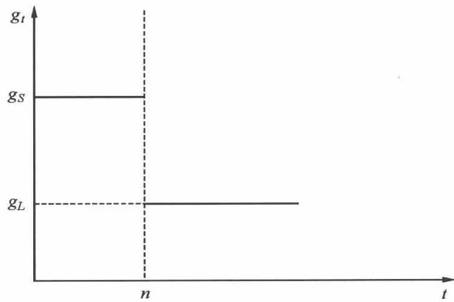
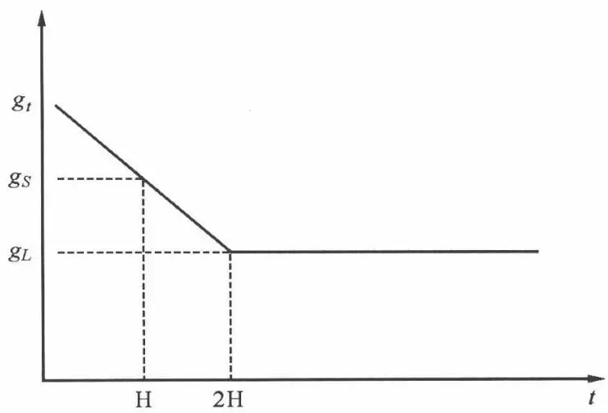
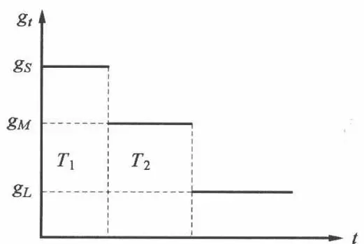
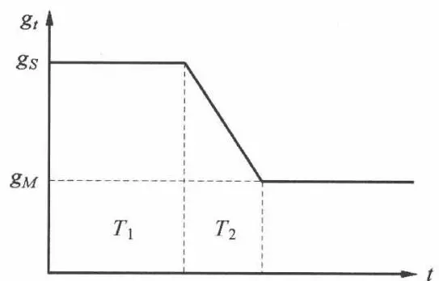

# [第5章](ch05.md) 股票基础分析

## 5.1 基础分析方法概述

证券投资基础分析法是分析影响证券未来收益的基本经济要素的相互关系和发展趋势,据此预测证券的收益和风险,并最终判断证券内在价值的一种分析方法。基础分析方法的产生可以追溯到20世纪30年代,其标志是1934年本杰明·格雷厄姆和大卫·多德的《证券分析》一书的出版。

本章我们先讲述基础分析的第一个层次:宏观经济分析和行业分析;然后我们讲股票基础分析的第二个层次:公司价值分析。股票价值分析模型主要有绝对价值模型和相对估值模型两类。绝对价值模型是确定资产内在价值的模型。这种模型可以提供价值的估计,且可与股票市场价格比较,以确定股价是否存在低估或高估。同债券价值模型一样,股票的绝对价值模型也是基于现金流贴现思想之上的。绝对价值模型都认为股票的内在价值等于预期未来现金流的现值。尽管绝对价值模型都是预期现金流的贴现,但是对现金流的不同理解,就会有不同的现金流定义,也就有着不同的绝对价值模型。因此,绝对价值模型可以分为股利贴现模型(Discounted Dividend Model;DDM)、自由现金流模型(Free Cash Flow to Firm;FCFF 或 Free Cash Flow to Equity;FCFE)。这些内容都在本章进行详细介绍。相对估值模型描述了一种股票相对于另一种股票的价值。相对估值模型的思想基础是一价定律,即类似的股票应该以类似的价格出售。本章主要介绍市盈率模型。

## 5.2 宏观政治经济和行业分析

### 5.2.1 政治因素分析

政治不但是经济的集中表现,而且还深刻影响着经济。一国的政局是否稳定对证券市场有着直接影响。一般而言,政局稳定则证券市场稳定运行;相反,政局不稳则常常引起证券市场价格下跌。政治因素对证券价格带来的影响往往具有突破性,它们来得突然,变化迅速,很难预测。政治因素包括的内容十分广泛,诸如政府更迭、国内战争、民族冲突、国内罢工、政治丑闻、重要政府官员的更换等。

### 5.2.2 经济因素分析

宏观经济因素对证券市场的影响具有根本性、全局性和长期性。所以，要成功地进行证券投资，首先必须认真研究宏观经济状况及其走向。影响证券市场的宏观经济因素主要有利率、通货膨胀率和汇率等。

### (1) 利率

利率是货币资金的价格,反映了市场上资金的供求状况,因此证券价格对利率波动十分敏感。在宏观经济因素中,利率对证券市场的作用最为直接,影响也最大。当利率升高时,公司借款成本增加,利润率下降,股票价格自然下跌,同时利率上升使债券和股票投资的机会成本增加,吸引部分资金从证券市场特别是股票市场转向银行储蓄,导致证券需求下降,证券价格下跌。特别重要的是,市场基础利率水平决定股票“内在价值”,二者呈反比关系。

影响利率变动的因素有很多,对宏观经济的分析可以为预测利率提供基础,从而为判断证券市场的价格走势提供依据。

### (2)通货膨胀率

通货膨胀对股票价格走势的影响比较复杂,既有刺激股票价格上涨的作用,也有抑制股票价格的作用。由于股票代表对企业的所有权,企业中的实物资产会随着通货膨胀而升值;另外,企业还可以通过提高产品的售价来弥补原材料的价格上升造成的损失,这样企业的利润就不会受到通货膨胀的影响。所以,一般来说,在适度通货膨胀的情况下,股票具有一定的保值功能。适度的通货膨胀还可以造成有效需求增加,从而刺激生产的发展和证券投资的活跃。但是,通货膨胀达到一定限度就会损害经济的发展,严重的通货膨胀会导致货币加速贬值,人们将资金用于囤积商品保值,这时人们对经济发展的前景不会乐观,对政府提高利率以抑制通货膨胀的预期增强,许多证券投资者可能退出证券市场,这样就导致证券市价下跌。同时,企业成本上升,盈利水平下降,企业破产数量增多,经济形势进一步恶化,导致社会恐慌心理加重,从而加深了证券市场不景气的状况。

### (3) 汇率

由于世界经济一体化趋势逐步增强,包括证券市场在内的各国金融市场的相互影响日益加深,一国汇率的波动也会影响其证券市场价格。一方面,汇率上升,本币贬值,将导致资本流出本国,于是本国证券市场需求减少,价格下跌。另一方面,汇率上升,本币贬值,本国产品的竞争力增强,出口型企业将受益,因而此类公司的证券价格就会上扬;相反,进口型企业将因成本增加而受损,此类公司的证券价格就会下跌。但是,这种影响对国际性程度较低的证券市场来说比较小。

### 5.2.3 经济周期分析

宏观经济周期一般经历四个阶段,即复苏、繁荣、衰退、萧条。证券市场综合了人们对于经济形势的预期,这种预期较全面地反映了有关经济发展过程中表现出来的有关信息,特别是经济中人的切身感受,这种预期又必然反映到投资者的投资行为中,从而影响证券市场的价格。从证券市场的情况来看,证券价格的变动大体和经济周期一致。一般来说,经济繁荣,证券价格上涨;经济衰退,证券价格下跌。但是,不同行业受经济周期影响的程度会有差异,有些行业(如钢铁、能源、耐用消费品)受经济周期影响比较明显,而有些行业(如公用事业、生活必需品行业等)受经济周期影响较小。

### 5.2.4 经济政策分析

政府对经济的干预主要是通过货币政策和财政政策来实现的。不同性质、不同类型的政策手段对证券市场价格变动有着不同的影响。

### (1)财政政策分析

财政政策是指政府的支出和税收行为,它是需求管理的一部分。财政政策可能是刺激或缓减经济增长的最直接方式。财政政策分为短期、中期、长期财政政策,并各有目标,其中短期目标是促进经济稳定增长,而中长期目标是实现资源的合理分配,并实现收入的公平分配和社会和谐发展。

在财政政策的几种手段中,财政预算、税收和国债是最主要的,这三方面的相关动向在分析时必须密切注意。财政政策对宏观经济的影响有“相机抉择”和“自动均衡”两个方面,而在进行正常分析时主要关注前者。从总体来看,不管是扩大支出、减税、减发国债,宽松的财政政策主要会通过增加社会需求来刺激证券价格上涨。例如,减税会增加居民的可支配收入和企业的投资积极性,供需提高使企业的股票和债券的价格上扬;减发国债首先会通过降低债券市场供给来提高债券价格,并通过货币供给效应和证券联动效应来刺激证券价格。反之,紧缩的财政政策会使证券价格下跌。

### (2)货币政策分析

货币政策是指政府为实现一定的宏观经济目标所制定的关于货币供应和货币流通组织管理的基本方针和基本准则，一般由一国的货币当局实施。

中央银行主要通过三大货币政策工具来实现对宏观经济的调控,即存款准备金率、再贴现率和公开市场操作。货币政策对证券市场的影响是通过投资者和上市公司两方面因素来实现的。对于投资者来说,当增加货币供应量时,一方面证券市场的资金增多,另一方面通货膨胀也使人们为了保值而购买证券,从而推动证券价格上扬;反之,当减少货币供应量时,证券市场的资金减少,价格的回落又使人们对购买证券保值的欲望降低,从而使证券市场价格呈回落的趋势。对上市公司来说,宽松的货币政策一方面为企业发展提供了充足的资金,另一方面扩大了社会总需求,刺激了生产发展,提高了上市公司的业绩,证券市场价格上升;反之,紧缩的货币政策使上市公司的运营成本上升,社会总需求不足,上市公司业绩下降,证券市场价格也随之下跌。从具体的政策手段来看,中央银行对再贴现率的调整将直接影响市场基准利率,对证券市场的影响最为显著。

### 5.2.5 行业分析

就如宏观分析和公司分析一样,行业分析的目的也在于寻找更好的投资机会,或者说是寻找更好的收益—风险组合来满足投资人的需要。正如在糟糕的宏观经济环境下各行业难以取得较好的业绩一样,在一个不景气行业中的公司的收益状况也往往令人担忧。寻找有潜力的行业与选择具有较高成长性的公司同样重要。而行业分析的重要任务之一就是要挖掘最具投资潜力的行业，进而在此基础上选出最有投资价值的公司。

上面虽然提到了行业分析的重要性,但其有效性却往往受人质疑。要明确行业分析的重要意义,还必须弄清楚以下四个问题。首先是必须明确在特定的时期内不同行业间的收益率是否有明显差距。其次,行业分析的有效性是以不同时期行业业绩的相关性为前提的。再次,要分析各行业内公司的收益是否有一致性。最后,还必须对行业的风险有明确的认识。

### (1)行业生命周期分析

一个行业的发展过程可以被划分为起步、增长等几个时期, 这也就是行业生命周期。一般可以由以下五个方面来判断行业所处的实际生命周期的阶段。①行业规模变化趋势, 行业的市场容量和行业资产规模总会经历一个“小——大——小”的阶段。②产出增长率, 该指标在产业成长期高而在成熟期和衰退期较低, 经验数据一般以 $15\%$ 为界。③利润水平, 该指标是一个行业兴衰过程的综合反映, 在整个生命周期中, 行业的利润水平会经历一个“低——高——稳定——低——亏损”的过程。④技术进步率、技术熟练程度和开工率, 随着行业的兴衰, 行业的创新能力有一个从高增长到逐步衰弱的过程, 技术成熟程度有一个“低——高——老化”的过程, 而开工率的高低与行业发展景气程度正相关。⑤资本进退, 行业生命周期中的每个阶段都会有企业的进退发生。在成熟期以前, 进入行业的企业数量及资本量要大于退出量; 而进入成熟期以后, 进入量和退出量有一个均衡的过程; 在衰退期, 退出量明显超过进入量, 整个行业开始萎缩、转产, 倒闭多有发生。

### (2)行业竞争性分析

竞争决定了一个行业的利润率。竞争规律体现为五种竞争的作用力:新的竞争对手入侵,替代品的威胁,客户的议价能力,以及现存竞争对手之间的竞争。这五种竞争作用力综合起来决定了某行业中的企业获取超额收益率的能力。这五种作用力的作用随行业的不同而不同,随着行业的变化而变化,所以不同行业的内在盈利能力并不一致。

### (3)影响行业发展的其他非经济因素

行业生命周期勾画了一个行业发展的基本轨迹,这也是行业发展的内在规律,但是一个行业的发展很大程度上也取决于其所处的环境。通常所指的行业环境,不仅包括经济环境,还有社会环境、技术环境和政策环境。理解这些因素对行业发展的影响将有助于我们对行业进行更全面的分析,并得出更可靠的结论。行业分析中经常用到的 PETS 分析方法, 就是通过对行业以上四种环境的分析, 来预测行业的发展趋势的。

技术进步是影响行业发展的最主要因素,它一方面推动现有行业的技术升级,甚至可以使处于衰退期的行业焕发出新的生命力,另一方面,技术更新也决定了新行业的兴起和旧行业的衰亡。技术进步不仅仅使企业生产出新的产品和提供新服务,也使企业的生产流程得到改善。

对行业发展产生影响的社会环境变化主要来自人口结构的变化和社会习惯的改变。各年龄层次人口的比例情况称为人口结构，处于不同年龄层次的人有不同的消费需求、储蓄习惯甚至是业余爱好。社会习惯对国民经济构成中的消费、储蓄、投资、贸易等方面都有较大的影响，这自然也影响到行业的发展和行业结构的演进。

行业所处的政策环境指的是行业所受到的政府干预情况和行业政策影响。就政府干预经济的效果，不同经济学家有不同的看法，但是从经济发展的历史来看，无论是奉行自由主义还是强调政府干预的国家，都对经济有着不同程度的干预。政府对不同行业的干预主要是通过补贴、税收、关税、信贷和价格等手段实现的，除此之外的手段还有市场准入、企业规模限制、环保标准限制，甚至是政府直接干预。

## 5.3 股利贴现模型

股利贴现模型(DDM)认为未来现金流应该是股票未来所发放的全部股利,因为股利是投资者可以从股票投资中获得的唯一的现金收入。

股利贴现模型是最早出现的,也是最简单的股票价值分析模型,但并不影响其成为一个重要的股票价值分析工具。根据对外来股利发放情况的预测不同,DDM可以分为不变增长DDM和可变增长DDM,而其中可变增长DDM又可以按增长方式的不同分为两阶段模型、H阶段和三阶段模型。本节首先介绍DDM最一般的形式,然后再对DDM的各种具体的形式进行详细介绍。

### 5.3.1 股利贴现模型的一般形式

同其他基于现金流贴现思想的价值模型一样,股利贴现模型认为股票的价值等于股票所有未来股利的现值,用公式表达如下:

$$
P_{0} = \frac{D_{1}}{1 + r} + \frac{D_{2}}{(1 + r) ^{2}} + \dots + \frac{D_{n}}{(1 + r) ^{n}} + \dots
$$

式中， $P_{0}$ 为股票第 0 期的价值（当前价值）， $D_{n}$ 为股票第 n 期的股利，r 为股票要求的回报率。

如果计算得出的股票当前价值 $P_{0}$ 与股票的当前价格不同,那么说明当前股票价格被高估或低估了,这时,投资者可以通过做空或做多来获得超额回报。

### 5.3.2 不变增长股利贴现模型

### (1)零增长模型

显然,上述公式在实际中根本无法应用。因为这要求对以后每一期股利都做出预测,但要精确地预测十几年后的公司盈利和股利发放情况几乎是不可能的。因此,要将DDM模型运用在投资实践中,就要对未来股利的增长方式进行一定的假设。假如用 $g_{t}$ 来代表每期的股利增长率的话,那么 $g_{t}$ 的数学表达式为:

$$
g_{t} = \frac{D_{t} - D_{t - 1}}{D_{t - 1}}
$$

由于这是戈登(Gordon)首次提出的,因此也被称为戈登增长模型。显然,在所有的股利增长方式中,最简单的当然就是假设未来公司的股利以一个固定的比例增长。

我们先来看戈登模型的一个特例。那就是 $g_{t}=0$ ，即零增长模型，根据等比数列求和公式，零增长模型可以化简为

$$
P_{0} = \frac{D_{0}}{r}
$$

很明显,零增长模型大大简化了DDM。但对于股利零增长的假设却很不合理。因为一个公司的股利发放通常是同公司的盈利相关的,若股利一直不增长,就说明公司的业绩一直停滞不前,在竞争如此激烈的社会,一公司如果长期不发展就很可能遭到淘汰。

### (2)戈登模型

如果在戈登模型中假设股票今后的股利增长率是一个保持不变的常数 $g$ ，那么未来任意一期的股利 $D_{t}$ 就可以表示为 $D_{t} = D_{0}(1 + g)^{t}$ 。

从而戈登模型在数学上就可以表示如下：

$$
P_{0} = \frac{D_{0} (1 + g)}{1 + r} + \frac{D_{0} (1 + g) ^{2}}{(1 + r) ^{2}} + \dots = \frac{D_{0} (1 + g)}{r - g}
$$

值得注意的是上述后面的形式只有在 $r > g$ 时才成立，因为上式其实是一个无穷等比数列的求和过程。如果 $r = g$ 或 $r < g$ ，那么就会使 $P_{0}$ 无穷大，而这两种情况是没有意义的。

由于股利发放额等于公司的净利润同股利发放率的乘积,因此当公司的股利发放率保持不变时,预期的股利增长率就等于公司的预期利润增长率。这样,戈登模型就将股票价值的估计同公司经营状况很好地结合在了一起。

戈登模型是最常用的简化价值分析模型之一。但在使用戈登模型的过程中,有几个问题是需要注意的。首先,既然戈登模型通过股利发放率将公司盈利和股票价值联系到了一起,那么根据戈登模型的形式,要使用其来进行价值分析的话,就要求公司的净利润也是以一个固定的比例增长的。显然,并不是所有的公司的盈利都是以这种方式增长的。对于那些新兴行业的公司来说,它们的盈利增长率开始可能会很高,然后慢慢下降,最后才保持一个比较稳定的增长率。因此,戈登模型主要适用于那些成熟公司或者公用事业公司。我们一般认为一个公司的盈利增长率大大高于名义GDP增长率的公司,戈登模型是不适用的,而应该使用后面将要介绍的多阶段模型。在使用戈登模型时还有一个要注意的问题,那就是模型计算的结果对要求的回报率和股利增长率都非常敏感。

此外，戈登模型与股票的市盈率之间也有着紧密的联系。市盈率指的是股票市场价格同公司的每股净利润的比值，这是一个非常重要的相对指标，在股票价值分析中也有着非常重要的作用，在本章后面将要讲述的相对估值模型中，我们将对市盈率模型进行详细的介绍。在这里，我们就可以通过戈登模型计算市盈率：

$$
\frac{P_{0}}{E_{0}} = \frac{D_{0} (1 + g)}{E_{0} (r - g)} = \frac{b (1 + g)}{r - g}
$$

式中， $E_{0}$ 为当期每股净利润， $b=\frac{D_{0}}{E_{0}}$ 为股利发放率，1-b 为收益留存率。

市盈率也可以用来判断股票的市场价格是否合理,因此只要估计出合理的市盈率,就能判断股票价格是否存在高估和低估。上述公式正好给出了一个估计合理市盈率的方法。

### 5.3.3 两阶段模型

戈登模型虽然是最常用的股利贴现模型,但是前面已经提到过,戈登模型只适用于增长比较稳定的成熟型企业,但对于那些还处于上升阶段的公司,假设股利只以一个不变的速度增长是不合理的。

对于大部分企业来说,它们都要经历增长期、过渡期和成熟期三个阶段。在增长期,公司主要的特点是每股盈利超常增长,但由于迅速的发展需要大量的资金,因此在这个阶段公司的股利发放率很低;在过渡期,公司盈利增长有所减缓,但仍然高于平均水平,而且由于投资机会的减少,公司的股利发放率也有所提高;公司最后进入成熟阶段之后,盈利的增长率和股利发放率都相对稳定在一个长期水平上,戈登模型就是主要适用于处在这一阶段的公司。

多阶段股利贴现模型假定了股利增长模式会随着时间的推移而发生改变,从而在分析股票价值时更符合那些尚未进入成熟期公司的现实。根据对股利增长模式的不同假设,多阶段股利贴现模型又可以分为两阶段模型、H模型、三阶段模型等。本部分内容首先对两阶段模型进行详细的介绍。

两阶段模型假设公司的股利增长经历了两个阶段,在第一阶段,股利每年以一个较高(或较低)的速度增长,一段时间后,股利增长稳定在了一个较低(较高)的水平上。这里假设第一阶段股利增长率高于第二阶段,那么这个过程就可以用图 5.1 来形象地表示。

图 5.1 两阶段股利增长模型

两阶段模型的数学表达式为

$$
P_{0} = \sum_{t = 1} ^{n} \frac{D_{t}}{(1 + r) ^{t}} + \frac{P_{n}}{(1 + r) ^{n}}
$$

在上述公式中， $n$ 为第一阶段的年数， $P_{n}$ 被称为终值，它是股票在第一阶段结束时的价值。由于第二阶段本身可以看成是一个从第 $n$ 年开始的不变增长的阶段，那么 $P_{n}$ 就可以用戈登模型来计算，即

$$
P_{n} = \frac{D_{n + 1}}{r - g} = \frac{D_{0} (1 + g_{S}) ^{n} (1 + g_{L})}{r - g}
$$

此时,两阶段模型的具体形式为

$$
P_{0} = \sum_{t = 1} ^{n} \frac{D_{0} (1 + g_{S}) ^{t}}{r - g} + \frac{D_{0} (1 + g_{S}) ^{n} (1 + g_{L})}{(1 + r) ^{n} (r - g)}
$$

式中， $g_{S}$ 为快速增长阶段的股利增长率， $g_{L}$ 为低速增长阶段的股利增长率。

对于戈登模型来说,由于其假设股利增长模式经历了一个阶段,那么当股票现在没有发放股利时,戈登模型就无法用来估计股票价值。但是,两阶段模型却可以很好地解决这个问题。我们可以将不发放股利的阶段看成是两阶段模型中的第一阶段,开始发放股利后就进入第二阶段。

### 5.3.4 H 模型

通过观察图 5.1, 可以看到从第 n 年开始, 股利突然从 $g_{s}$ 下降到了 $g_{L}$ , 但在现实中, 这种情况是很罕见的, 因为股利如此大幅度变动很可能对公司的股价造成剧烈的影响, 这是公司董事会不愿意见到的情况。因此股利更多的可能是连续慢慢下降的。

因此,就出现了模型假设第一阶段的股利增长率是变化的。这就是Full-er和Hsia 1984年提出的H模型。H模型也假设股利增长经历了两个阶段,但同两阶段模型不同,股利增长率在第一阶段是呈线性下降的,不是不变的。如图5.2所示。这里假设起始股利增长率大于最终的增长率,H模型的计算公式如下:

$$
P_{0} = \sum_{t = 1} ^{n} \frac{D_{0} \prod_{i = 1} ^{t} g_{i}}{(1 + r) ^{t}} + \frac{D_{0} \prod_{t = 1} ^{n} g_{t} (1 + g_{L})}{(1 + r) ^{n} (r - g_{L})}
$$

图5.2 H模型

有时 H 模型也许能更好地贴近现实,但是这个模型计算起来却非常复杂,因为在股利增长率下降到 $g_{L}$ 以前,每年的 g 都是变化的,如果第一阶段持续的时间较长,那计算就会变得非常复杂,因此有必要对其进行一定的简化计算。H 模型的近似计算公式为

$$
P_{0} = \frac{D_{0} (1 + g_{L})}{r - g_{L}} + \frac{D_{0} H (g_{S} - g_{L})}{r - g_{L}} \text{或} P_{0} = D_{0} \frac{(1 + g_{L}) + H (g_{S} - g_{L})}{(r - g_{L})}
$$

式中, $g_{S}$ 为初始的股利增长率, $g_{L}$ 为最终的股利增长率,H为第一阶段期限的一半。


某公司去年每股股利为 1 元, 预计今年股利增长率为 15%, 在今后 16 年里, 这个增长率按线性方式递减, 16 年后, 股利增长率稳定在 8%。市场无风险利率为 5%, 市场风险溢价为 6%, 该公司股票对于市场的贝塔值为 1.25, 该公司股票现在的价值为多少?


首先,由 CAPM 计算该股票的要求回报率为 $5\% + 1.25 \times 6\% = 12.5\%$ .

将上述数据代入到上述近似公式可以算出

$$
P_{0} = 1 \times \frac{(1 + 15\%)+ 8 \times (15\%- 8\%)}{12.5\%- 5\%}= 22.6(\text{元})
$$



公式虽然是一个近似公式,但大部分时候它的计算和用精确公式计算出来的结果是很接近的。但是当第一阶段时间特别长或者 $g_{S}$ 和 $g_{L}$ 相差很大时,这个公式就会变得误差很大,此时就要用精确的计算公式来计算,也就是计算出第一阶段每一年的股利增长率,并进而计算出这期间每一年的股利,再进行贴现。这个过程更多地要借助计算机程序来完成。

### 5.3.5 三阶段模型

为了进一步贴近现实,股票分析师们可能会将股利的增长模式设计得更复杂,这就产生了三阶段模型。

三阶段模型有两种主要形式。第一种形式同两阶段模型类似，股利增长经历了三个独立的不变增长阶段，见图5.3中左图；第二种形式同H模型比较相似，只是在三阶段模型的第一阶段还有一个股利增长率不变的时期，见图5.3中右图。

对于第一种形式,由于股利增长率在每个阶段是不变的,因此价值计算的方法可以同两阶段增长模型一样,只要对每阶段分别进行计算就可以了。虽然如此,但由于多了一个阶段,计算公式仍然很复杂:

$$
\begin{array}{r l} P_{0} & = \sum_{t = 1} ^{T_{1}} \frac{D_{0} (1 + g_{S}) ^{t}}{(1 + r) ^{t} (r - g_{L})} + \sum_{t = 1} ^{T_{2} - T_{1}} \frac{D_{0} (1 + g_{S}) ^{T_{1}} (1 + g_{M}) ^{t}}{(1 + r) ^{T + t_{1}}} + \\ & \frac{D_{0} (1 + g_{S}) ^{T_{1}} (1 + g_{M}) ^{T_{2} - T_{1}} (1 + g_{L})}{(1 + r) ^{T_{1} + T_{2}} (r - g_{L})} \end{array}
$$

图5.3 两种形式的三阶段增长模型

### 5.3.6 多元增长模型

虽然股利贴现模型拓展三阶段模型已经变得非常复杂,但是有时候分析师们为了分析得更加精确,可能会对公司未来的股利增长情况进行更复杂的假设,如假设公司成长经历了初期、平稳期、转折期、稳定期和衰退期等很多阶段,并对每个阶段的股利增长率分别进行预测,对于这种模型,我们只能通过表格工具或者建立计算机程序来分析了。

## 5.4 自由现金流模型

在本章的导言中已经介绍过，在使用现金流贴现模型分析该股票价值的时候，对于“现金流”的不同看法会产生不同模型。股利贴现模型将股票的股利看作全部的“现金流”。可以说，这是一种就股票论股票的分析方法，当投资者只是希望通过投资股票获利时，用DDM进行分析当然不错，但是如果投资者购买股票的目的是为了控制公司或者实现股东价值最大化呢？此时投资者更关注的恐怕是整个公司的价值而非股票的价值。此外，当公司不发放股利时，股利贴现模型也就无法用来分析股票价值了。为了解决这些问题，我们就要求寻找新的“现金流”来对公司的价值进行分析。在本节中我们先介绍自由现金流模型。

### 5.4.1 自由现金流的计算和自由现金流模型

### (1) 自由现金流的计算

自由现金流,顾名思义,当然是指公司能自由分配的现金。自由现金流可以分为公司层面和股东权益层面两个层次,两者分别被称为公司自由现金流(FCFF)和股权自由现金流(FCFE)。FCFF是指在不影响公司资本投资时可以自由向债权人和股东(即所有的资金供给者)提供的资金;FCFE则是指在不影响公司资本投资时可以自由分配给股东的资金,它等于FCFF减去所有对债权人的支付,FCFE可以用来衡量公司支付股利的能力。

自由现金流并不是在公司财务报表中直接披露的,我们只能通过财务报表的各种数据计算出自由现金流。在财务学中,衡量公司盈利的指标主要有净利润(net income; NI)、经营活动的净现金流(cash flow from operations; CFO)、息税前收益(earnings before interest and tax; EBIT),以及息税折旧摊销前收益(earnings before interest, tax, depreciation and amortization; EBITDA)。由于自由现金流也可以看成是一种盈利指标,因此,我们主要用上面这些盈利指标来计算自由现金流。计算现金流的方法很多,主要有用净利润、现金流量表、息税前收益和息税折旧摊销前收益等来计算自由现金流,由于计算自由现金流属于财务分析的内容,超出了本书的范围,为了帮助读者理解,我们在这里简单介绍了如何用净利润计算自由现金流,对计算现金流感兴趣的读者可以参阅财务分析方面的书籍来学习其他计算方法。

净利润是公司在权责发生制下的净收入,而自由现金流则考察的是现金的流量,同时净利润中已经扣除了利息支出,而公司自由现金流则还要考虑对债权人的自由现金流,此外,净利润并不反映公司的投资情况,而自由现金流则要扣除公司固定资产和资本的投资。综合来说,要用净利润计算公司自由现金流,要对净利润做出如下调整:

净利润+净非现金支出+利息支出×(1-税率)-本期固定资产投资-本期营运资本投资=公司自由现金流

用公式表达即为

$$
F C F F = N I + N C C + I n t (1 - t) - F I - W I
$$

式中，NI 为净利润，t 为所得税税率，NCC 为净非现金支出，FI 为固定资产投资，Int 为利息支出，WI 为营运资本投资。

下面对上述公式中的每个项目进行说明。净利润是公司扣除折旧、摊销、利息支出、所得税及优先股股利等支出之后的收入。但在这些扣除的项目中，有一些并不是以现金支出的。因此为了保证最后得到的是现金流量，就要在净利润中加上非现金支出的增加，减去非现金支出的减少，两者合并就成了净非现金支出。最常见的非现金支出是折旧，这是因为固定资产的折旧仅仅是减少固定资产的金额，并不发生公司现金的变动。同样，长期成本和其他长期资产的摊销也属于非现金支出。

由于公司自由现金流是可以自由向所有资金供给者提供的现金流,因此要将净利润所扣除的利息支出加回去。但是,这个利息支出并不是公司利润分配表上所反映的利息支出的额,而是税后的利息额。学过公司财务的读者应该知道,债务的利息是有税盾效应的,这是因为利息支出是税前列支的,而利息支出可以减少税前利润从而减少所得税。综合利息支出和税收支出的减少,加回的就是税后利息支出。同样,优先股股利支出也是可以向资金供给者提供的资金,但在计算净利润时这一项也是被扣除的,因此在计算公司自由现金流时也要把这一项加上。与利息支出不同的是优先股股利是税后列支的,因此调整时不用考虑税收的因素。

公司为了维持经营,必须进行各种固定资产的更新和购买,因此进行这些投资支出的现金并不是可以自由分配的,应该把它从净利润中扣除。固定资产投资主要包括机器、设备和厂房投资、无形资产购买以及对其他公司的现金收购。但是,有时公司在进行固定资产投资的同时,也会对一些已有的固定资产进行处理,此时处理固定资产所得到的现金要和固定资产的投资支出进行抵扣,也就是说,在净利润中扣除的固定资产投资是一个净值。还有一点要说明的是,有时候公司可能并不会用现金来进行投资,而是用债务或股票来交换所要购买的资产,这样虽然不会影响当前的自由现金流量,但债务在将来是要偿还的,这种情况在预测未来的 FCFF 时是一定要考虑的。

最后一个调整项目是营运资本的净投资。通常来说,营运资本是指流动资产和流动负债的差额。但在计算 FCFF 时,营运资本中不包括现金和短期债务。不考虑现金和现金等价物是因为它们正是我们要得到的项目,而去除短期债务是因为这些一年内到期的长期债务实际上属于融资活动,而不是经营活动。

由于 FCFF 是公司层面的自由现金流,它所对应的是公司的价值,而我们在做证券投资分析时更注重的是股票的价值,而在自由现金流模型中,股票价值是由 FCFE 决定的。因此,在得到 FCFF 以后我们还要计算 FCFE。根据本节开始的时候所给出的定义,FCFF 是可以自由向债权人和股东分配的资金,而 FCFE 则是可以自由向股东分配的资金,可见两者的差别就在于必须向债权人支付的资金,这主要是利息支出;此外,向债权人借得的资金由于不需要立即偿还,因此这部分资金是可以分配给股东的,但同时公司也会用现金偿还以前的借款,因此借款和还款相互抵消之后的净额(借款净额,NB)就是新增的 FCFE。因此,只要在 FCFF 的基础上减掉税后利息支出再加上借款净额,就可以得到 FCFE。

$$
F C F E = F C F F - I n t (1 - t) + N B
$$

### (2) 自由现金流价值模型

在计算出 FCFF 和 FCFE 之后,我们就可以用自由现金流模型来分析公司和股票的价值了。但在分析公司价值的时候,所用的贴现率并不是股票的要求回报率,而是公司的加权平均资本成本(weighed average capital cost; WACC)。公司价值等于未来所有的 FCFF 的贴现值,即

$$
V_{f} = \sum_{t = 1} ^{\infty} \frac{F C F F_{t}}{(1 + W A C C_{t}) ^{t}}\tag{5.1}
$$

式中， $V_{f}$ 为公司价值。

同时,由于衡量股权价值时不需要考虑债务的成本,因此自由现金流股权公式的贴现率同股利贴现模型一样是股票的要求回报率。

$$
V_{e} = \sum_{t = 1} ^{\infty} \frac{F C F E_{t}}{(1 + r_{E}) ^{t}}\tag{5.2}
$$

式中， $V_{e}$ 为公司的股权的总价值。

与前文有所不同，在自由现金流模型和下一节的剩余收益模型中，我们都将用 $r_{E}$ 来表示股票的要求回报率，以此明确区分股权成本和债务成本。公式(5.1)中的WACC是计算公司价值时一个关键要素，在公司价值模型中有着广泛的应用，WACC等于公司所有股权资本成本和债务资本成本的加权平均值。

$$
W A C C = \frac{M V_{d}}{M V_{d} + M V_{e}} r_{d} (1 - t) + \frac{M V_{e}}{M V_{d} + M V_{e}} r_{E}\tag{5.3}
$$

式中， $MV_{d}$ 为当前所有债务资本的市场价值， $MV_{e}$ 为当前所有股权资本的市场价值， $r_{d}$ 为债务资本的加权平均成本，t 为所得税税率， $r_{E}$ 为股权成本。

值得注意的是,虽然在用 FCFF 分析公司内在价值时要用 WACC 来作为贴现率,但在用 FCFE 分析股票价值时,我们仍然使用股票的要求回报率 $r_{E}$ 来作为贴现率。

同第一节介绍的股利贴现模型一样,按照对未来自由现金流的不同预期,自由现金流价值模型也可以分为不变增长模型、两阶段模型和三阶段模型。

### (1) 不变增长自由现金流模型

不变增长模型假设公司未来的现金流以不变的速度增长,因此它的数学表达式同戈登模型几乎完全一样,只是公式中的一些变量发生了变化。不变增长公司价值模型的公式如下:

$$
V_{f} = \frac{F C F F_{0} (1 + g)}{W A C C - g}
$$

式中，g 为预期未来公司自由现金流增长率。

同样,公司股权的总价值可用如下公式计算:

$$
V_{e} = \frac{F C F E_{0} (1 + g)}{r_{E} - g}
$$

### (2)多阶段自由现金流模型

由于自由现金流模型的原理同股利贴现模型一样,既然股利贴现模型有两阶段、H 模型和三阶段模型,那么自由现金流模型自然也不例外。我们只要将股利贴现模型中相应的公式稍作修改,就可以得到自由现金流的两阶段公司价值模型和股权价值模型:

$$
V_{f} = \sum_{t = 1} ^{n} \frac{F C F F_{0} (1 + g_{S}) ^{t}}{(1 + W A C C) ^{t}} + \frac{F C F F_{0} (1 + g_{S}) ^{n} (1 + g_{L})}{(1 + W A C C) ^{n} (W A C C - g_{L})}
$$

$$
V_{e} = \sum_{t = 1} ^{n} \frac{F C F E_{0} (1 + g_{S}) ^{t}}{(1 + r_{E}) ^{t}} + \frac{F C F E_{0} (1 + g_{S}) ^{n} (1 + g_{L})}{(1 + r_{E}) ^{n} (r_{E} - g_{L})}
$$

这些模型的应用方法同 DDM 模型完全一样, 因此这里就不再举例说明了。

### 5.4.2 股利贴现模型、自由现金流模型二者的比较

股利贴现模型、自由现金流模型是两种最常见的现金流贴现模型，但二者由于对现金流的定义不同，因此最终得出的结果也往往不同。此时分析师们就面临着这样的选择：对于某种股票来说，到底用哪个模型才能更准确地分析它的价值呢？下面我们对这两个模型做一个简单的比较，并列出它们各自适用的情况。

股利贴现模型是最简单、最基本的价值模型,但这并不意味着它不如其他两个模型。事实上,股利的发放一般都比较稳定,不会受到短期因素的影响。而自由现金流是从公司盈利演化而来的,公司盈利很容易受到短期因素的影响而产生剧烈波动,根据非正常状态下的盈利计算和预测出来的自由现金流很可能会使分析结果变得不可信。因此分析师通常认为用DDM计算出来的价值更能反映股票的长期内在价值。但是股利贴现模型也有着比较明显的缺陷,比如在公司不发放股利,或者投资者投资股票的目的是控制公司时,DDM显然不能作为合适的工具进行价值分析。当公司同时满足以下条件时,用DDM来分析股票价值是比较适合的:

1. 公司是发放股利的；

2. 公司的股利发放同公司盈利情况有稳定的关系；

3. 投资者投资股票的目的仅仅是为了获利。

自由现金流模型既可以分析公司价值,也可以分析股票价值,因此这是近来一个比较受欢迎的模型。特别是当公司没有发放股利或者发放的股利与公司盈利情况不协调时,我们一般就会用自由现金流模型来代替DDM;此外,当投资者希望控制公司时,他们也更多地用自由现金流模型来分析公司的价值。但是自由现金流模型同样存在着一些问题,比如公司自由现金流长期为负值时,自由现金流模型就无法用来分析公司和股票价值了。一般来讲自由现金流模型适合在下列情况下使用:

1. 公司不发放股利；

2. 公司发放的股利同自由现金流偏差太大；

3. 预期未来公司的 FCFE 同盈利情况保持一致；

4. 投资者购买股票的目的是希望控制公司。

总而言之,两个模型各有长短,我们在具体分析中,只有根据它们各自的特点来选择最合适的模型,才能准确地分析出股票的内在价值。

## 5.5 相对估值模型

### 5.5.1 市盈率的计算

在所有的价格倍数中,市盈率(price/earning ratio; P/E)是最常见的股票价格指标之一,而市盈率模型也是最常用的相对估值模型。

从市盈率的英文缩写 P/E 可以看出, 市盈率是公司股票价格和每股盈利的比值, 其中 P/E 的分子 P 是股票的价格, 显然, 这是很容易确定的; 然而分母中的每股盈利却因对市盈率的不同定义有不同的取值。一般来讲, 市盈率可以分为当前市盈率和远期市盈率。当前市盈率是指当前股价同最近四个季度每股盈利总和的比值; 远期市盈率是指当前股价同下一年度每股盈利的比值。要进行比较, 就必须设立比较的标准, 因此我们在计算 P/E 前首先要把每股盈利“标准化”。在公司财务报表公布的利润中, 往往会包含一些短期的或者非重复性的项目, 这些会使公司的盈利偏离正常的情况; 采用的会计处理方法的不同也会弱化比较的基础; 商业周期对公司的盈利也会产生短期的影响从而使公司盈利偏离正常状况。此外, 当公司存在未到期的期权或可转换权的时候, 普通股总数就变得不再确定了。针对这些情况, 我们在计算每股盈利时要对净利润进行相应的调整, 从而使不同时期或不同公司间的市盈率有充分的可比性。

### 5.5.2 市盈率模型的应用

用市盈率来分析股票价值的过程一般是:首先确定一个合理市盈率,即股价不存在高估和低估时的市盈率,然后再用根据当前股价计算的市盈率同这个合理市盈率比较,如果高于合理市盈率则说明股价被高估了,反之则说明股价被低估了。这个过程中最关键的就是合理市盈率的确定。一般来讲,确定合理市盈率方法有两种:一种是根据绝对价值模型计算股票的内在价值,将用这个内在价值计算的市盈率作为合理市盈率。第二种方法则是选择一种与被考察公司的市盈率可类比的市盈率作为合理市盈率。实际上,所有相对估值模型的分析过程都与此相同,只是所选择的分析指标不同而已。本部分将对上述的两种方法进行说明。

第一种方法可以说是结合绝对价值模型和相对估值模型。前面所介绍的股利贴现模型、自由现金流模型和剩余收益模型都可以用来计算市盈率中的合理股价。下面我们用戈登模型来具体说明这种方法的具体使用。我们知道：

$$
\frac{P_{0}}{E_{0}} = \frac{D_{0} (1 + g)}{E_{0} (r - g)} = \frac{b (1 + g)}{r - g}
$$

我们也可以用同样的方法对远期市盈率进行类似的分解：

$$
\frac{P_{0}}{E_{0}} = \frac{D_{1}}{E_{1} (r - g)} = \frac{b}{r - g}
$$

根据上述公式,我们可以看到合理市盈率同稳定的股利发放率成正比,而同股票的要求回报率成反比。我们不需要预测未来的股利金额,而只要预测股利增长率、股利发放率和要求回报率等变量就可以得到当前和远期的合理市盈率。

当然,戈登模型是所有绝对价值模型中最简单的一个,如果对未来现金流预测的结果不允许我们使用戈登模型,那么我们就无法得到上述公式的简单关系式了,这时我们只能老老实实地先根据预测计算出股票的内在价值,然后再计算市盈率了。

另一种方法是类比法。类比法的关键是寻找可以“类比”的基准。对于这个基准,一般我们可以有以下五种选择:

1. 与被考察股票各方面都相似的个股的市盈率。

2. 被考察公司所处行业内所有公司市盈率的平均值或中值。

3. 同一子行业的市盈率的平均值或中值。

4. 有代表性的股票指数的市盈率。

5. 被考察股票历史平均的市盈率。

由于选择个股的市盈率来进行分析往往会出现偏差,而一组股票的平均市盈率可以使这些偏差相互抵消,因此,我们通常选择后面四种基准市盈率来作价值分析的基础。

### 5.5.3 市盈率模型的优缺点

与股利贴现模型等绝对价值模型相比,市盈率模型的历史更为悠久。在运用当中,市盈率模型具有以下几方面的优点:

1. 由于市盈率是股票价格与每股收益的比率,即单位收益的价格,所以,市盈率模型可以直接应用于不同收益水平的股票的价格之间的比较;

2. 对于那些不能使用绝对价值模型的股票,比如在某段时期内不发放股利或自由现金流为负值的股票,市盈率模型仍然适用。

3. 虽然市盈率模型同样需要对有关变量进行预测,但是所涉及的变量预测比绝对价值模型要简单。

市盈率模型也有缺点：

1. 市盈率模型的理论基础较为薄弱,而绝对价值模型的逻辑性较为严密;

2. 在进行股票之间的比较时,市盈率模型只能决定股票市盈率的相对大小,却不能决定股票绝对的市盈率水平;

3. 公司的每股盈利同样可能为负值,此时市盈率就没有意义了;

4. 在计算每股盈利时要对净利润进行一系列调整,有时候对于非重复性项目的调整是很复杂的;

5. 在用类比法进行价值分析时,都隐含假定了所选择的行业平均市盈率、大盘市盈率都是合理的,但这是不一定的,整个行业或者市场的股价被高估或低估的情况经常发生。

6. 如果公司报表上的盈利并不真实,也会使市盈率模型分析的结果不正确。

