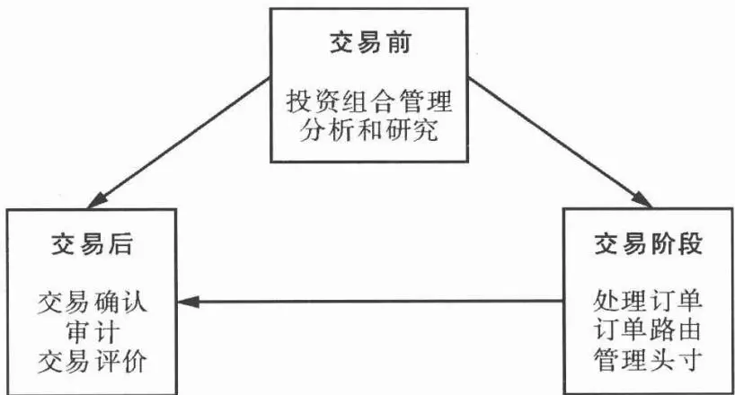
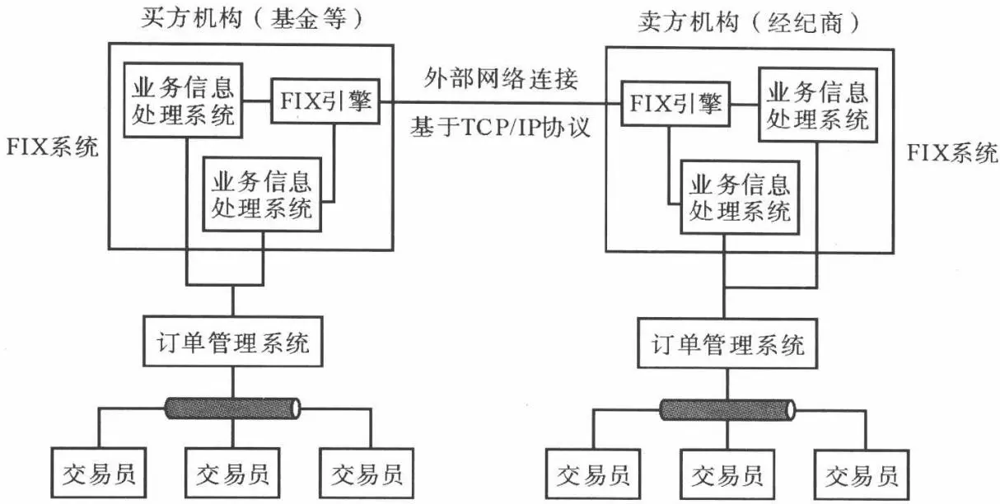

# [第7章](ch07.md) 算法交易系统的结构

## 7.1 交易流程简介

随着市场的不断发展,金融行业已经很大程度地实现了交易流程的自动化。通过网络连接,人们可以实时地获得大量的交易和价格信息。计算机系统可以帮助投资者对市场进行大量复杂的分析工作,使投资行为更加地科学和有效。投资者还可以利用实时的网络连接进行下单、交易,这极大地提高了交易活动的速度和效率。每一个人能够同样地利用互联网访问市场,也提高了交易市场上的公平性。此外,海量的历史和实时交易数据也为投资和交易的评价工作提供了基础,使评价过程更加公平和有理有据。

在过去,当一个交易员进行交易操作时,必须有其他一系列相关的工作来保证交易双方之间的证券和资金的有效支付。前台和后台部门必须进行紧密地合作,这样才能防止交易过程中出现意外的差错。其中,前台部门负责投资管理、公司的投融资服务,以及销售,而后台部门则负责公司内部的运营。前台和后台责任的分离可以尽可能地减少欺诈行为,比如欺骗、贪污,以及违反规则的行为。交易流程中各个部分(例如处理、确认、交割)的独立能够实现操作的完整性。后台部门只负责几个最重要的部分:记录和确认完成的交易,提供内部控制机制来实现责任分离等等。后台部门能够保证金融机构内部操作的完整性,并减少操作、交割和法律的风险。前台和后台的联系可以是完全手工操作的,也可以是完全计算机化的。

交易过程需要达成一个协议,以便于在前台开始交易后进行交易数据的确认。交易契约的副本用于交割和账目记录。一旦交易由前台部门执行以后，交易过程剩余的部分就留给了后台。后台部门负责各种证券、商品和书面合约的支付、发送和接收，以及确认合约所确定的支付对象和数量。

在一个交易协议达成以后,交易双方需要向对手方发送一个确认信息。后台部门跟着就需要提交确认信息,并跟踪和管理对手方的确认信息。严格的过程控制能够有效地防止欺诈性交易。例如,交易员可能进行虚假的交易,或者在达成一份合约并发送原始确认信息后毁掉副本。这些可能使交易员建立一个基金经理所不知情的交易头寸。在平仓的时候,交易员可以为之前毁掉的合约补一份记录,然后和抵消的合约一起上交,这样头寸就被抵消掉。如果由一个独立的部门来进行确认信息的接受和审核,就能够马上发现这种欺诈行为。

在一个买进或卖出交易完成以后,交易必须通过后台部门和一个清算代理机构的沟通进行清算。在结算日,买卖双方的资金和金融产品互相进行交换,并更新交易账簿条目。当买方或买方代理收到或者发送证券,以及卖方履行支付后,交易结算完成。经纪商会为这些任务指定一个专门的机构,比如清算中心,但是,经纪商仍然有责任保证为客户正确地处理交易。如果对手方没有进行支付,交易一方可能就会产生损失。有些情况下,清算代理人和经纪商对完成交易中的任何问题都需要负责。所以,应该通过一个信用部门对资金和债券流动进行持续监控,进而控制结算过程中的风险。

后台部门应该及时地进行对账，以确保机构的交易流程和规定保持一致。负责对账的人员应该和负责输入交易数据的人员保持互相独立。对账中，应该确认前台部门持有的头寸，以及提供审计跟踪报告，需要审核的报告包括：交易员的头寸、监管报告、收支报表。

交易系统和流程的自动化,或者进行外包,可以有效地减少后台部门当中的人工操作。这样能够为金融机构减少人力的成本,而且能够更加有效地对交易流程进行监控。人工操作的减少不但能够提高后台的运行效率,还可以减少人工操作带来的一些错误,并进一步地减低交易流程中的风险。

一般来讲,现在的机构投资者的交易流程大致可以分为三个阶段:交易前、交易和交易后三部分:

\- 交易前部分负责投资组合的管理、投资的分析研究等等。引进 IT 技术对交易前分析有很大帮助，通过提供大量的数据资源和强大的计算能力，基金经理和交易员的分析工作变得更加的方便、简单和高效。

\- 交易部门负责订单的管理,下达交易指令,以及交易头寸的实时动态管理等等。简单地说,交易部门就是负责交易的操作,尽可能减少交易操作当中可能产生的成本和意外的风险。

\- 交易后部门则负责交易的确认、审计、运营工作，以及交易评价。交易后部门负责确保交易的完成，并对交易表现做出恰当的评价。

如图 7.1 所示,交易前后的分析和交易的操作形成了一个交易的周期。


图 7.1 交易流程图示

交易前分析通过对投资策略的研究,可以使交易员充分了解当前所持有的投资组合的风险和交易模式等等特征。交易前分析还需要提供交易相关的许多信息,其中包括新的市场信息、流动性的特征和预测、过去一段时间的市场环境情况、交易当天的市场条件预测等等。这些信息对交易操作来说十分重要,它们可以使交易员充分地了解市场、交易目标、持有头寸等各方面的特征。通过交易前分析,交易员能够更好地贯彻基金经理的投资意图,也能够更好地进行交易操作,充分降低交易成本和风险,进而改善整体的投资表现。

交易操作过程中主要的目标就是降低交易操作给投资带来的成本,其关键主要包括三点:一是尽可能降低交易中的延迟,减少数据传输过程中的风险;其次是尽可能获得最优的买卖交易报价;第三,通过订单分割,尽可能减少交易当中的市场冲击和价格移动带来的意外风险。算法交易在这三个方面都做出了改善。通过计算机系统的整合,投资的分析活动和交易活动能够在一个系统中完成,不但有利于交易与投资目标的一致,而且能够减少不同部门之间信息传递的延迟,降低决策延迟为交易带来的风险。直接入场技术(DMA)能够帮助交易员直接访问到市场的交易系统,减少网络传输和交易环节上的延迟。而订单智能路由(smart routing)技术能够实时地监控不同市场上的交易报价和流动性情况,可以帮助交易员获得最优的交易价格。订单分割策略也可以通过算法交易来实现。利用一些优化技术，计算机系统通过分割订单可以有效地平衡交易当中的市场冲击和时间风险，有效地改善交易操作的表现。

交易后分析用于确保交易完成的可靠性,另一方面还需要分析交易成本产生和大小,以及对交易操作做出合理的评价。分析交易成本是进行交易操作时决策的基础。只有了解交易成本产生的原因和大小,才能够做出正确的交易决策。此外,通过交易评价,基金经理可以更清楚地了解每个交易员和交易策略的表现和特点。这有助于在以后的交易当中选择适合的交易员和交易策略进行特定的交易。因此可以说,交易后分析是改善交易操作质量的第一步。

交易活动的三个阶段是互相联系和促进的一个整体,它们共同构成了一个交易活动的周期。交易操作的改善是一个长期的、反复的、循环的过程,而通过计算机系统的整合,整个交易流程变得更加协调、紧密和一致。此外,强大的计算机和数据库系统可以储存和处理大量的历史和实时交易数据,也成为交易分析和决策的有效工具。

## 7.2 直通式处理和算法交易

交易后台部门活动的自动化的发展,以及使用计算机记录和分析交易历史促进了交易前分析的发展。市场信息的数量在不断地增加,而 Bloomberg、道琼斯等就是金融信息服务这一领域的先驱。它们整合了市场数据、证券信息和交易分析,并使自己成为金融信息服务业的著名企业。同时,这些发展也使得前台和后台之间能够通过计算机技术进行联系和管理。从此,金融业的公司开始设计方法对两个原先不同的部门的数据流进行整合,产生了直通式处理(straight-through processing, STP)。

### 7.2.1 直通式处理

直通式处理使得资本市场的整个交易流程能够通过电子方式进行,而不需要人工干预。直通式处理的优点包括减少运营成本,缩短整个交易的周期,减少结算风险等。此外,通过直通式处理,交易流程全部在计算机系统中进行,也更便于进行监管部门和投资机构内部的管理。

直通式处理的一大进步就是为交易过程建立一个标准化的协议。通过标准化的协议，不同的机构和部门之间的交易管理系统可以轻松地实现连接和沟通。这有助于整合整个的交易流程，改善信息流处理和传递的速度，并缩短了交易结算时间。其次，电子交易数据的一致性通过手工操作很难达到，而直通式处理很方便地就能够实现这一点。另外，通过交易前工作的自动化，市场参与者可以进行交易前策略模型的构建、分析和头寸管理。

现在,交易员既可以通过电子系统,也可以通过电话沟通来完成交易。由于交易环境的变化非常快,信息有时会被错误地输入、传播或解释。因为交易信息通常不是在交易的同时输入,所以数据有时会出现丢失,或错误地录入或读取。电子交易可以解决其中的很多问题。如果使用集成化较高的系统,数据从创建一开始就能在交易流程当中保持一致性。

如果可以实现全面的直通式处理,那么投资管理机构、经纪商、客户、监管机构和其他金融业服务机构将会实现很大的便利。一些业界分析者认为,百分之百的直通式处理,也就是全面的自动化,是很难实现的。相对而言,金融机构在内部实现直通式交易可以鼓励不同部门之间的协作,改善交易操作和信息处理的质量。另外,进行交易的双方之间的直通式交易也将成为业界的主流。

### 7.2.2 算法交易

电子交易和直通式处理引发的一个关键性的技术进步就是算法交易。从出现以来,算法交易在华尔街就成为投资机构和经纪商用于降低交易成本的主要手段之一。算法交易系统通常分为四部分:数据管理、策略开发和实施、订单管理系统(order management system, OMS),以及订单路由。

### 1. 数据管理

毫无疑问,现代的金融业是一个依靠信息和技术优势进行竞争的行业,尤其在算法交易兴起后,历史和实时数据成为十分重要的竞争优势。在收集和传播大量市场数据的基础上,交易员才能够通过计算机系统执行交易。处理市场数据的速度可能会意味着交易是否成功。1毫秒的差距可能使一个公司丧失获利的机会。根据Securities Industry Automation Corp(SIAC)的统计,市场数据流信息增长很快。下面是2004—2006年这3年中11月份信息量最高的1分钟内每秒的消息数:

- 2004 年 11 月:56000 条每秒

- 2005 年 11 月: 121000 条每秒

- 2006 年 11 月:200000 条每秒

自动化的交易模型每天可以执行数千次交易，并成为买方和卖方交易员普遍的交易手段。电子化的交易依赖于市场实时数据分析。每个使用算法交易的公司都在寻求减少信息传输延迟或零延迟的方法。数据供应商不断地为更高效的数据流工作。大量金融信息服务公司的涌现使得金融机构积极改进它们的数据设备。金融机构需要通过跟踪能力、延迟、执行质量等许多指标来评估它们的交易环境，以便于改进交易流程。精确评估一个公司的运作能够帮助它们提供更好的服务，更低的成本，以及减少交易活动当中的摩擦。许多买方公司已经应用实时的系统对算法交易进行评估和监控，持续地依据交易目标评估算法的表现，同时还关注后台的交易流程，包括订单发送比率，执行和完成订单的情况。当产生问题时，比如没有完成订单、丢失订单、模型的表现变差，就可以马上对交易算法和策略进行调整。

### 2. 策略开发和实施

客户利用数据库和策略分析工具分析大量市场数据,以便于开发交易算法用于交易操作。这些平台用于交易前和交易后的实时或历史数据分析,通过分析历史数据能够帮助交易决策,例如:管理订单流、大宗交易和净交易计算、流动性特征、低价值附加操作,以及交易成本分析等等。其中,交易分析是算法交易系统的核心部分之一。

当交易员进行交易时,他们需要决定向哪个交易市场发送订单,同时还需要考虑交易股票的流动性、供需状况等等因素。交易员发送订单时需要进行一些分析,他们通常会利用经纪商对交易的分析和观点。经纪商在交易环境、观点和操作策略上的研究一般都是有利用价值的。经纪商一般会提供关于交易成本及操作的详细建议。相对来说,大的基金经理更加重视经纪商的研究报告。在订单输入以后,交易员需要对订单交易方式进行选择:是进行大宗交易,还是和同类型以及相同操作指令的订单一起进行结算?订单发送以后,交易员的工作就是要增加交易的价值,通过分析来确定证券是否能够在当时市场条件下以最优的方式执行。在价差较大时、流动性较低时、订单交易量较大时,交易员更能够发挥个人的业务特长,使交易分析带来更多的附加价值。

随着算法交易成为主流,很多的交易分析和策略都能够通过计算机系统实现,下面给出几个例子:

\- 相关性和波动性分析

\- 识别交易机会

\- 确定最优的交易时机和数量

- 根据交易的基准评价交易操作

通过策略开发和实施的平台,投资者可以很容易地利用数据发现交易机会,实现和修改交易的目标和策略,进而减少交易的成本,改善交易表现,以获取更高的回报。

### 3. 订单管理系统

订单管理系统是负责下达、修改和处理订单的计算机系统。随着市场的发展，交易员为管理交易工作流程需要更好的工具，因此订单管理系统也在不断改进。在实际交易流程中，订单管理系统从各个基金经理那里收集订单和指令，把订单集中在一起形成大订单，同时收集信息，对数据库进行更新，并形成报告。

#### (1) 特性和功能

订单管理系统一般有如下几个特性和功能：

\- 交易记录 交易记录作为中心,能够让交易员管理订单,应用各种基准进行评价,跟踪当前的头寸、交易数据和实时损益状况。

\- 实施算法交易策略 交易员进行交易操作的时候,通常需要选择进行交易中的算法和参数等等。然后,订单管理系统会自动利用算法对订单进行分割、交易等操作。算法需要保证一定的灵活性,以方便交易员根据需求进行修改和定制。

\- 交易前和交易后分析 交易前分析提供市场条件的分析,例如交易量、波动性等等。它能帮助交易员决定最适合特定情况的算法,并估计给定交易的成本。交易后分析则负责依据一定的基准和其他参数估计以往交易的表现。

\- 交易市场的连接 通信连接是算法交易系统的生命线。它使得买方交易员和经纪商能够进行电子通信。这样，订单管理系统才能够实时地通过算法做出交易决策。

\- 处理多种资产 算法交易系统应该不止支持股票的交易,而应该支持更多的金融产品,例如固定收益、衍生品、外汇等等。

\- 提供合规报告 类似于单独的股票和大宗交易,订单管理系统必须能够不断地根据证券业管理部门的监管环境进行定制和修改,通过基于规则的触发器和灵活的报告能力进行管理。

#### (2) 举例

下面是一个通过订单管理系统进行交易的例子：

1. 基金经理决定买进300000股IBM的股票。

2. 交易员接到交易指令,然后决定往哪个市场发送订单。

3. 当交易员发现他们需要买进 300000 股 IBM 的股票时,通过 ECN 聚集器观察多个 ECN 和交易所的报价。

4. 买方交易员决定往哪儿发送对 IBM 的交易,选择包括:

\- 通过经纪商进行大宗交易；

\- 使用算法交易,比如利用 VWAP,并让算法识别交易模式,通过智能路由的功能,系统将会发现每次下单时最好的价格。

5. 交易执行的平台会把交易信息反馈给交易员,然后订单管理系统会将交易数据提交给数据系统,用以评价交易质量。

### 4. 订单路由

在美国股票市场上,除了较大的纽约证券交易所(NYSE)和NASDAQ交易所之外,还有许多的地区性股票交易所,以及另类交易系统(alternative execution venue)。一些公司的股票同时在几个市场上市,或者同时在不同的市场进行交易。由于不同市场上的流动性差异,以及报价信息延迟等等因素,一只股票在不同的市场上可能会存在着不同的买卖报价和流动性条件。例如,流动性差的市场上股票就可能会产生较大的买卖价差。这种情况下,交易员就希望能够在这些市场上获得最优的交易价格。订单智能路由技术就用于解决这一问题。订单路由一般通过直接入场技术(direct market access, DMA)实现。交易系统需要持续地监控不同的电子交易市场上的报价和流动性条件。当交易员发起交易时,交易系统识别订单的类型,并在满足预先设定交易参数的情况下进行交易。由于计算机系统可以同时获得不同市场的价格,通过比较不同的报价,系统自动会把订单发送到给出最优报价的市场,以实现最优交易。此外,交易系统也可以比较不同市场的流动性,选择流动性比较好的市场进行交易,这样可以尽可能地减少交易产生的市场冲击。例如瑞士信贷的游击队算法就是基于这个思路所开发的。总的来说,订单路由技术有利于改进市场上的价格发现机制,使投资者能够获取最优的交易价格、降低交易成本,同时也有利于改进股票市场的公平和效率。

## 7.3 FIX 协议

FIX 的全称是金融信息交换协议(Financial Information Exchange Protocol)，是国际上统一的一种电子通信协议，用于证券市场和交易信息的实时交换和通信。在最初的 1992 年，FIX 是作为富达投资(Fidelity Investment)

和所罗门兄弟(Salomon Brothers)之间股票交易的通信框架被创建的。多年以后，FIX在事实上已经成为全球股票市场上交易前和交易过程中通信的标准协议，而且现在还在快速地向交易后系统领域扩张，并能够支持直通式处理过程。基于这些基础，FIX已经获得了强大的推动力，在向外汇交易、固定收益和衍生品交易市场扩张。

FIX 协议是一系列用于金融交易的电子通信消息包的规格说明。它是在全世界众多的银行、证券经纪商、交易所、机构投资者、其他金融业的部门协会，以及一些信息技术公司的合作下制定的。在日常事务当中，这些市场参与者都希望金融产品的自动化交易拥有一个统一的语言。因此，可以说是他们共同创造了 FIX 协议。

FIX 是由金融业发起的用于应对全球金融服务业变化的通信标准协议。公司可以使用 FIX 协议进行透明化的、低成本和延迟的电子化交易。FIX 是开源和免费的，但是它不是一种软件，而是一系列通信数据的规格标准。软件开发商可以基于 FIX 协议来开发自己的商业化或者开源软件。作为领先的交易通信协议，FIX 已经被用于很多的订单管理和交易系统当中。因此，用户不需要了解 FIX 协议的细节，就可以从中受益。可以说，FIX 协议是金融机构间对话的“语言”。

图 7.2 中显示了一个用 FIX 链接的交易系统的结构。交易双方的交易员通过订单管理系统进行订单的下达、修改和撤销等操作。在交易指令下达以后，订单管理系统将交易指令发送到基于 FIX 协议的交易系统当中。在这个系统，交易指令将以 FIX 协议的形式进行表示，集中负责处理交易信息和其他的业务信息，例如市场行情、利好/利空消息等等。然后，双方的交易系统通过 TCP/IP 网络实现交易的连接。整个流程中，交易员和订单管理系统，以及系统中各个模块之间都是基于 FIX 协议进行通信的。

2007 年, Tower Group 在美国发起的一项关于 FIX 的调查发现, 全球金融服务领域中已经大量地使用了 FIX 协议。在被调查的对象中, 75% 的买方公司和 80% 的卖方公司在电子交易中使用了 FIX 协议, 而且他们都表示要继续增加对 FIX 的使用, 并使得 FIX 能够支持更多的资产类别。这项调查也显示, FIX 在交易后的系统中成为重要的一部分。此外, FIX 也受到了交易所的关注, 超过 3/4 的交易所支持 FIX 的接口, 大部分交易所通过 FIX 协议处理的交易量都超过了 25%。在美国, 几乎所有主要的股票交易所、投资银行、最大的共同基金, 以及很多小的投资公司都使用 FIX 来进行电子化交易。许多期货交易所都提供 FIX 的链接, 主要的债券经纪商也使用或正在部署 FIX。


图7.2 FIX通信的构架

## 7.4 我国金融业的通信标准

在我国证券市场快速发展的环境下,市场对业务和技术创新的需求不断提高,急需建立一个统一高效的交易技术体系。然而在以前,沪深证券交易所、主要的期货交易所、券商和其他机构间都采用各自设计的非标准化的接口。数据信息交换模式、编码方式、接口、业务数据流程等都不统一,存在着对业务创新的适应性较差、适应成本高,不同市场间难以有效交换信息等问题。

2005 年,我国证券业期待多年的标准化工作取得了进展,公布了证券交易技术的八大标准。标准的制订和应用是我国证券市场高效、规范发展不可缺少的基础设施工作之一,会对我国证券行业产生广泛和深远的影响。其中,《证券交易数据交换协议》(Securities Trading Exchange Protocol,简称STEP)是我国金融行业的通信标准。STEP 协议以 FIX 协议为基础进行开发,是我国证券交易技术的一大创新。它的实施和应用将提升两大交易所和所有证券市场参与者的技术和业务水平,促进我国证券行业标准化、国际化,为提升我国在国际证券市场的竞争力打下坚实基础。

STEP 协议主要应用于证券交易所和券商间的数据连接,规定了证券交易所交易系统与市场参与者系统之间进行证券交易所需的数据交换规范。该协议不依赖任何物理网络，也不依赖特定的底层通信协议。因此，STEP协议完全可以支持目前国内的地面网络（如DDN）和卫星网络。作为证券交易技术标准，该协议规定了应用环境、会话机制、消息格式、安全与加密、数据完整性、扩展方式、消息定义、数据字典等内容。

STEP 的推出,适应了我国证券市场信息技术发展的迫切需求,迈出了走向统一证券技术体系的重要一步,为国内证券交易标准化接口提供了统一的规范,将积极促进市场参与者面对多个交易所、多通道、多协议接口问题的解决。国内证券市场的繁荣发展带来了业务技术的多样性和复杂性,市场参与者的技术投资越来越大,技术风险越来越得到重视,统一的接口标准会降低技术风险,从而减少整个行业的运行风险。各证券交易所和其他市场参与服务机构采用该标准后,将会给行业带来巨大的效益,对于广大市场参与者来说,采用符合标准的接口系统,除降低技术风险之外,也将会降低系统开发和维护成本。

随着 QFII 的实施,与国际业务交往日益增加,我国市场参与者将面临国际合作与竞争。FIX 协议是国际上普遍采用的接口标准,STEP 正是以 FIX 协议为基础,结合中国实际情况而制定的。在制定过程中,与 FIX 国际组织进行了充分的交流,确保 STEP 与 FIX 的兼容性,同时,也对 FIX 的完善和发展产生了积极影响,满足了我国证券业国际化的需求。简而言之,STEP 的推出对于降低行业交易成本、减少运行风险、提高市场效率具有重要意义。

## 7.5 电子通信网络

### 7.5.1 另类交易系统

另类交易系统(alternative trading systems, ATS)是美国证券交易协会(SEC)通过300号规则所确定的非交易所的证券交易市场。它们对公众在交易所以外获得交易流动性起到了重要的作用。SEC在300号规则中将另类交易系统定义为符合下列条件的任何组织、协会、个人、团体和系统：

\- 将买家和卖家聚集到一起，并组建、提供或维持一个市场，或者像规则所规定的股票交易所一样运行。

\- 同时做到不出现以下行为：

1. 设定规则限制会员在该组织、协会、个人、团体和系统上的交易以外的行为。

2. 惩罚会员的方式不超过禁止交易。

典型的另类交易系统包括 ECN、交叉网络等等。它们不但为投资者提供了额外的交易场所和流动性，而且使投资者可以在交易所收盘之后的时间进行股票的交易活动。另类交易系统的出现为证券交易市场之间带来了竞争。证券交易所和 ECN 等市场开始更多地改进网络连接方式和服务质量，以及降低交易成本。

2000 年 5 月,美国证券交易委员会废除了 390 号规则。该规则禁止 1979 年 4 月以前在纽约证交所上市公司股票在全国性的证券交易所以外的市场进行交易。390 号规则的废除进一步促进了另类交易系统的发展,以及 DMA、订单路由等算法交易技术的发展。

另类交易系统在欧美的股票市场上获得了很大的成功,极大地改变了美国股票市场的结构。但是另类交易系统没有能够渗透到亚洲市场,一方面是亚洲市场没有充分的经验来实施另类交易系统,另一方面是亚洲大部分国家都只有单一的垄断性的股票交易所。不过,在 Aite Group 公司 2009 年的一份报告中显示,近几年亚洲市场的另类交易系统正在出现增长,他们预计在 2012 年会占有 20% 的市场份额。

### 7.5.2 电子通信网络

电子通信网络(electronic communication network, 简称 ECN)是指金融交易所、股票经纪商和它们的客户之间构建的电子化交易平台, 用于在交易所外的金融产品交易。ECN 主要支持的金融产品包括股票和外汇。1998 年, 美国证券交易委员会(SEC)批准建立了 ECN, 它用于增加交易公司之间的竞争, 以达到降低交易成本, 使客户充分地访问订单簿, 以及提供传统交易时间以外的撮合交易等目的。

ECN 能够使市场参与者更好地发现流动性，并帮助买方交易员更好地实现自动化。ECN 能够进行实时的价格发现，使买家和卖家在最少的中介的情况下相对便宜地进行交易。SEC 将电子通信网络定义为：“在特定价位，自动地撮合买卖订单的电子交易系统。”ECN 是现代证券市场的一个发展。ECN 的自动交流和匹配系统为金融市场带来了更低的交易成本。

美国市场上早期主要的 ECN 包括: Instinet (INET), Bloomberg (Trade-Book), Archipelago (ArcaEx), SunGard (Brut) 和 NASDAQ 的 SuperMontage。这些 ECN 都能够为市场提供流动性, 并拥有自己的订单簿。在早期, 在一个 ECN 将交易订单转发到其他 ECN 之前, 会先在其内部寻找流动性。这意味着, 虽然其他 ECN 可能会有更有利的成交机会, 但是投资者不一定能够利用这样的机会, 因为订单要先在 ECN 内部进行交易的撮合。这导致了美国股票市场之间的分化, 不同交易市场之间的交流很少。为了抑制这种分化, 金融业的公司和技术供应商开发了聚集流动性的工具、订单路由, 以及 DMA 技术。

传统上, 经纪商是证券交易市场的看门人, 投资者需要一个经纪商作为他们在交易所进行交易的渠道或中介。交易所并不限制 ECN 的访问, 而 ECN 能够为广泛的投资者提供交易服务。ECN 能够直接匹配买卖双方, 从而省略了人工中介, 减少了经纪商的利润。ECN 能够比现有的市场交易平台提供更高效的操作。ECN 可以让投资者看到限价订单簿, 为投资者带来了更加清晰和完整的价格信息。尽管电子交易系统有其独特优势, 但是很多交易员仍不欢迎 ECN。有些交易员认为, 在 ECN 上不能有效地交易大订单, 通过 ECN 交易不够直接和迅速, 而且不方便在预期市场大变动的时候做出反应。但是事实上, ECN 能够像经纪商和做市商一样通过分割策略有效地完成大订单, 同时还能实现隐蔽性。很显然, 买方和卖方交易员都希望订单在市场上能够匿名操作。在传统的交易中, 公司的身份、规模和交易活动都被买方所选中的中介所知, 而 ECN 是以匿名交易而著称的。ECN 能够只显示订单大小和价格, 为交易员和投资者提供匿名和隐蔽性。当一个 ECN 能够发现一个内部的买卖匹配, 就能立即发生交易。如果不能发现内部匹配, ECN 能够为提交订单者提供选择: 是撤销限价单还是路由到其他市场。通常, ECN 提供的信息包括:

\- 证券的标识(ID)

\- 交易方向, 即买单还是卖单

\- 交易价格

\- 交易日期

\- 订单指令(比如,市价、限价还是交叉订单)

\- 机构的类别

\- 经纪商身份

总的来说,ECN 的优点包括以下几点:

\- 自动化。当提交一个订单之后，交易在不存在人工干预的情况下根据价格和时间的优先级进行操作，而不像传统的市场一样，由做市商持有。

\- 匿名操作。交易者的身份不公开，这对于一些交易者来说很重要。

\- 较低的交易成本。ECN 对于市场上的订单收取大约每股 3 美分的费用, 同时 ECN 还为提供流动性的订单支付一些费用。

\- 交易速度很快,操作和确认都通过电子化进行,可以在数秒内完成。

\- 通过 ECN, 交易者可以实施程序化的复杂交易策略。例如, 某只股票和指数价格发生特定变化时, 进行交易。

### 7.5.3 交叉网络

交叉网络(crossing networks)是一种另类交易系统。在将交易订单发送到交易所或其他公开的市场(例如 ECN)之前,先在交叉网络内部进行撮合交易。由于交叉网络只公布交易价格,而不公布交易双方的身份和交易量,因此这使得机构投资者能够更有效地进行大宗交易,而产生较小的市场冲击。但是,由于交叉网络在进行交易的时候不向市场公开信息,所以它必须在市场上以最优买卖价格的中间价成交。一些知名的交叉网络包括:Liquidnet,Pipeline,ITG 的 Posit,以及高盛的 Sigma X。

交叉网络有三种不同的撮合交易的模型：

第一种模型是时间表交叉模型(scheduled crossing model)。Posit、Instinet Crossing 和 NASDAQ Open and Close 使用时间表交叉模型。在时间表交叉模型中，系统中订单对于市场参与者是匿名的，未进行匹配的订单可以取消，等待下次匹配，或者转发到其他实时的交易市场进行匹配。

第二种模型叫连续交叉模型(continuous crossing model)，全天候地提供流动性，以及进行交易协商。连续交叉模型向公众提供了更多信息，也更容易产生信息泄露。

第三种模型称为暗盒模型(Dark Box Model)，是连续交叉模型和时间表交叉模型的一种混合，公司在内部系统隐藏一些流动性，可以在不公开任何信息的情况下为交易双方提供价格的改进。最近几年，交叉网络不断地向市场渗透，市场份额不断上升。这些变化凸显了买方交易员对交易信息隐蔽性的需求的增加。这一类交易系统也被称为流动性暗池(dark pools of liquidity)。

### 7.5.4 直接入场技术

随着通信能力和技术的提高,交易订单能够通过网络直接到达市场,交易流程发生了极大的改变,这就是直接入场技术(DMA)。它不但使交易员能够通过低的交易成本进行市场操作,还淘汰了交易室里表现不好的交易员。随着 DMA 使用的增加,另类交易系统成为更好的交易选择。

订单智能路由的概念,是由客户基于各自的交易参数所确定的,例如价格、流动性、成本和速度。电子通信网络(ECN)使订单智能路由系统变得透明,并使他们能够执行订单路由,更多地利用网络进行交易操作。从ECN出现以后,直接入场技术在美国就成为交易技术中重要的一部分。通过高速的聚集工具,公司可以更快地得到更完整的市场交易信息。聚集技术为投资者创造了一个能在多个市场间交易的便利。聚集工具的发展产生了订单智能路由技术。订单智能路由技术能够分析订单和市场价格数据,然后为交易寻找最高效的市场,从而改进交易。随着更多的投资者和机构利用ECN,聚集技术的优势也在逐渐增加。

DMA 为投资者提供了一个通过互联网访问电子交易所的直接和高效的方式。个人能够自主地制定交易策略，通过特定的目标市场进行交易（比如做市商、交易所和 ECN）。还有一些交易会继续依赖于人工的联系，但是可以通过即时通信技术或者选择可信赖的对手方来改善交易操作。

总的来说, DMA 技术的优点大致包括:

\- 为投资者提供在第三方经纪商情况下得不到的交易速度和更好的价格。

\- 尽可能改善流动性。

\- 提供多种下单选择,使大宗交易更加隐蔽。

\- 访问多种产品和多个市场。

## 7.6 复杂事件处理

现代的事件处理技术从20世纪90年代开始发展，加州理工学院的Mani Chandy，剑桥大学的John Bates和斯坦福大学的David Luckham分别开始了独立的学术研究。这些研究的目标是开发一种处理事件流数据的新手段，用于识别复杂的事件序列，其中可能包括一些时间或范围的限制，然后根据这些

复杂的事件模式的结果做出响应。

事件是一个很广泛的概念,例如一次交易的完成,一架飞机的降落,或一个参数的输入等等。计算机系统内的事件被定义为状态的改变,例如当一个货物销售出去之后,状态从“待售”变为“已售出”。

简单事件指的是那些不是对其他事件抽象而成的事件。相对应的，复杂事件(或组合事件)就是对两个或更多事件抽象而得到的事件。那些被抽象的事件则被称为成员事件。事件之间存在着相互的联系，例如时间关系、因果关系、组合关系等等。这些关系将事件联系在一起形成了复杂事件，例如，1987年美国股市的大崩盘是由成千上万的简单事件抽象和联系而成，其中包括每个股票的交易情况、每个交易员的抛售等等。

随着越来越多的自动化交易系统的出现,复杂事件处理(complex event process)技术逐渐在算法交易领域取得了很大的成功。通过复杂事件处理技术,投资者可以很容易和清楚地将自己所制定的复杂的交易策略编写到计算机系统当中。计算机系统可以根据投资者的需求,通过分析一系列事件的集合,按照预先设定的规则做出交易决策。另外,金融机构可以将监管的规则以复杂事件的形式编制进入计算机系统,有效地防止违规和欺诈行为。

例如,算法交易中很重要的一个方面就是确定交易的时间和数量,这就需要交易系统不断地观察变化中的市场条件,发现交易机会。下面就是一个价差套利的例子:

```text
IF
  MSFT price moves outside 2% of MSFT-15-minute-VWAP FOLLOWED-BY(
    S&P500 moving by 0.5%
    AND(
      IBM's price moves up by 5%
      OR
      MSFT's Price moves down by 2%
    )
    ALL WITHIN
    Any 2 minute time period
  )
THEN
  BUY MSFT
  SELL IBM
```

例子中,交易系统对 IBM 和微软(代码:MSFT)股票进行价差套利。我们可以很容易地理解这段规则:如果在两分钟内微软股票价格高于或低于 15 分钟内 VWAP 价格的 2%,然后标准普尔指数移动了 0.5%,同时,IBM 的价格上涨 5% 或者微软股票的价格下降了 2%,那么就买进微软股票,卖出 IBM 的股票。

复杂事件处理技术可以为机构投资者在算法交易系统的开发上带来许多的优势和便利。通过复杂事件处理技术，投资者可以很方便和容易地开发算法交易策略。它使交易策略更容易理解，从而提高算法开发的效率，而且方便修改和重新利用。

在金融市场上,监管机构可能会不断地提出新的监管要求,利用复杂事件处理系统会使算法交易系统更方便和灵活地适应变化的环境。利用复杂事件处理技术,算法交易系统的开发者可以更多地关注交易策略的层面,而不是计算机系统本身的开发。这样,不但可以减少系统开发中的错误和风险,而且能够为投资者节省人力,更多地关注能够带来附加值的业务。
