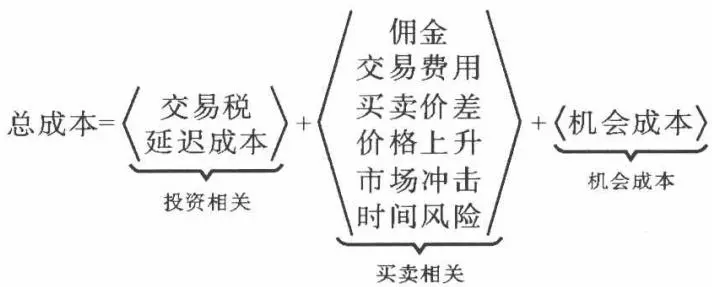
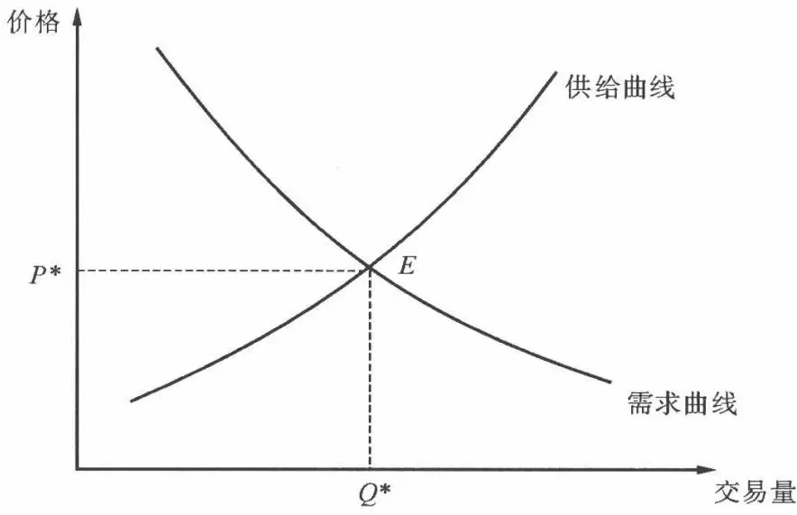
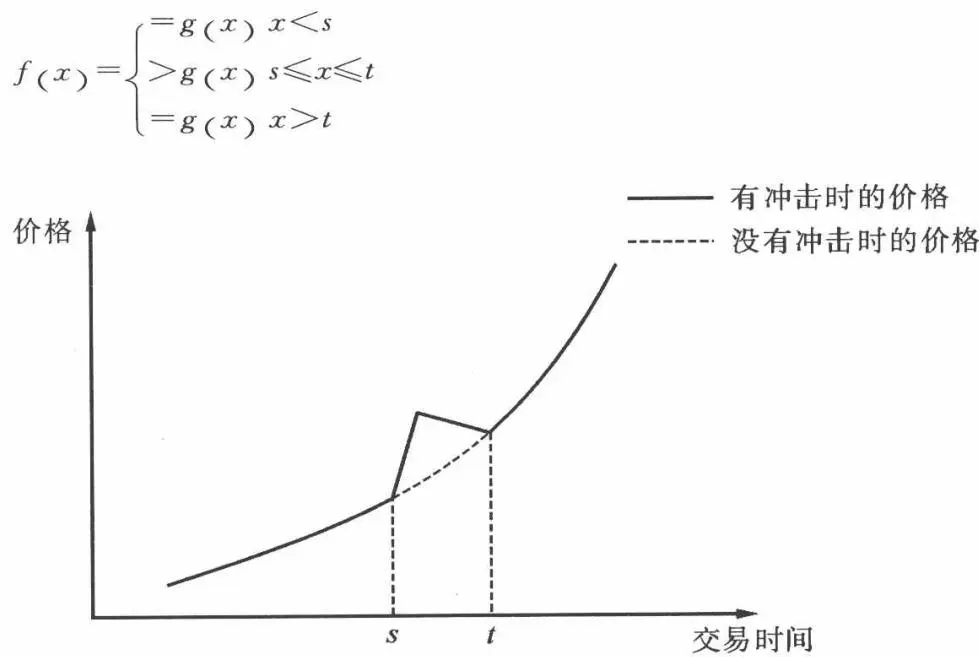
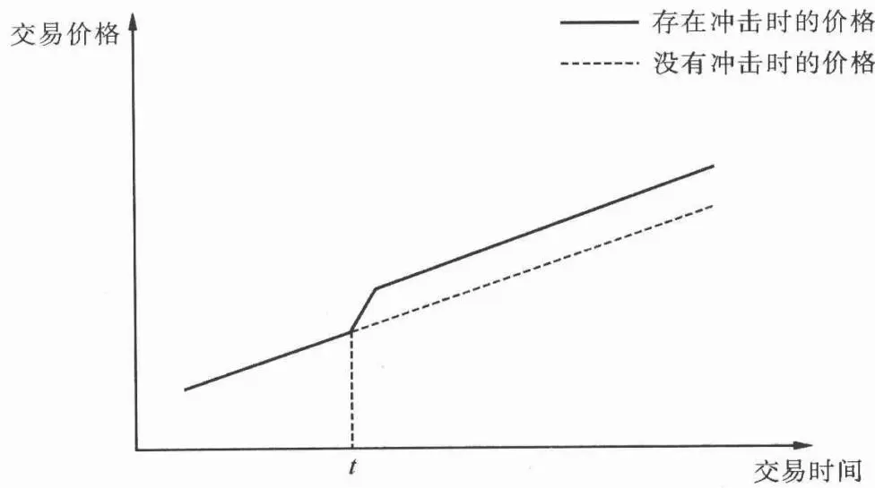

# [第8章](ch08.md) 交易成本分析

## 8.1 交易成本简介

传统的投资组合理论为我们在构建最优投资组合方面给出了很好的指导,但是实际交易操作中的交易成本却没有被考虑在内。一些研究表明,在美国,积极型的股票型基金的年收益率平均低于标准普尔500指数1\~2个百分点,导致这一问题的一个主要原因被认为是交易成本。

当投资者构建投资组合或调整的时候,必然需要买进和卖出的交易操作,而这不可避免地会带来交易成本。哈佛大学的 Perold 在研究中发现,在 1965 年到 1986 年之间,通过股票价值排序可以构建一个能够每年击败市场大约 20% 的账面投资组合。但是在实际中,这个投资组合只能够超过市场收益率大约 2.5%,这之间的差异很大程度上就来自交易成本。实际操作中,人们低估了控制交易操作成本的重要性,尤其是当机构投资者经常进行大额交易的时候,会导致相当大的执行落差。当市场收益率不足以弥补交易成本的时候,一个计划中可以盈利的投资组合甚至有可能产生负的收益。由此,不难看出交易成本控制在整个投资过程中的重要性。

以往,机构投资者都有专门的交易员负责交易操作的活动。但是近几年,算法交易实现了迅猛的发展。在欧美市场,算法交易已经成为主要的交易手段之一。算法交易的目标就是通过自动化的交易操作,以最优化的交易策略尽可能地减少交易当中的成本。因此,要了解算法交易,我们首先应该充分地了解交易成本的组成和原因。

### 8.1.1 什么是交易成本

### 1. 传统的交易成本

交易成本(transaction costs)，又称交易费用，是在一定的社会关系中，人们自愿交往、彼此合作达成交易所需要支付的成本。交易成本是人与人之间关系产生的成本，与一般的生产成本有所不同。从本质上说，只要有人类交往互换活动，就会有交易成本，它是人类社会的交易活动中一个不可分割的组成部分。

交易成本理论是由诺贝尔经济学奖得主科斯(R. H. Coase)所提出,他在《企业的性质》一文中认为,交易成本是“通过价格机制组织生产的、最明显的成本,就是所有发现相对价格的成本”、“市场上发生的每一笔交易的谈判和签约的费用”及利用价格机制存在的其他方面的成本。

科斯提出,为了确定商品或服务的市场公平价格,人们需要了解所有围绕交易的相关问题:市场动态、供求关系、竞争市场上的价格,当然还包括交易成本。没有这些方面的信息,我们很难确定市场上的公允价格。

诺贝尔奖获得者威廉姆森(Oliver Williamson)在其研究中将交易成本简单地分为以下几项：

\- 搜寻成本:搜集商品信息和交易对象的过程中产生的成本。

\- 信息成本:取得交易对象信息与和交易对象进行信息交换所需的成本。

\- 议价成本: 针对契约、价格、品质进行讨价还价的成本。

\- 决策成本: 进行相关决策所需的内部成本。

\- 监督成本:监督交易对象是否依照契约内容进行交易的成本,例如追踪产品、监督、验货等。

\- 违约成本: 违约时所需付出的事后成本。

威廉姆森还指出，在人性因素与交易环境因素交互影响下，有时会产生市场失灵现象，会造成交易困难和交易成本，这些因素大致包括：

\- 有限理性: 指参与交易的人由于身心、智能、情绪等限制, 在追求效益极大化时所产生的限制约束。

\- 投机主义: 指参与交易的各方为寻求自我利益最大化而采取的欺诈手法, 同时会增加彼此不信任与怀疑, 进而导致交易过程监督成本的增加。

\- 不确定性与复杂性:由于环境因素中充满不可预期性和各种变化,交易双方均将未来的不确定性及复杂性纳入契约中,使得交易过程增加不少制定

契约的议价成本，并使交易难度增加。

\- 少数交易:某些交易过程有专属性,或因为异质性信息与资源无法流通,使得交易对象减少,并造成市场被少数人把持,使得市场运作失灵。

\- 信息不对称: 因为环境的不确定性和自利行为产生的机会主义, 交易双方往往握有不同程度的信息, 使得市场的先占者拥有较多的有利信息而获益。

\- 气氛:指交易双方若互不信任,而且又处于对立立场,无法营造一个令人满意的交易关系,将导致交易过程过于重视形式,增加不必要的交易难度和成本。

上述交易成本的发生原因,进一步追根究底可发现源自交易本身的三项特征。这三项特征影响着交易成本的高低:

\- 交易商品或资产的专属性: 如果交易的一方投资的资产本身不具有市场流通性, 或者契约一旦终止, 投资于资产上的成本难以回收或转换使用用途, 称之为资产的专属性。

\- 交易不确定性:指的是交易过程中各种风险的发生几率。由于人类有限理性的限制使得面对未来的情况时,人们无法完全事先预测。同时,在交易过程中,买卖双方经常发生交易信息不对称的情形下,交易双方会通过契约来保障自身的利益。交易不确定性的升高会伴随着监督成本、议价成本的提升,使交易成本增加。

\- 交易的频率:交易的频率越高,相对的管理成本与议价成本也会升高。在交易频率提高的情况下,企业可以将该交易内部化,以节省企业的交易成本。

### 2. 金融市场的交易成本

在金融市场上,交易成本表示在执行一个投资决策的过程中产生的成本。它包括为了促使交易进行所需要的成本,其中包括佣金、交易税、流动性成本和机会成本等等。例如,佣金是按交易份额支付给经纪商的费用;而流动性成本产生于投资者执行交易的时候,流动性的短缺会导致高于买单决策价格的价格升水,或者低于卖单决策价格的价格贴水。

交易成本出现在执行投资决策的过程中,它一方面使得投资的成本更高,另一方面还降低了投资组合的利润。交易成本使得基金经理和分析员在发现投资机会的过程中所做的许多努力被浪费掉,成为投资组合利润的损耗。许多基金的业绩低于市场水平的原因也来自交易成本的影响。因此,对交易成本进行全面和细致的分析,进而减少交易成本,对于提高投资回报以及改善市场效率的意义不言而喻。

### 8.1.2 交易成本的组成

交易成本产生于交易决策的执行过程之中。在经济学术语中，交易成本被定义为：由买方支付，但没有被卖方收到，或者是由卖方支付，但没有被买方收到的费用。在金融市场中，交易成本代表比决策价格差的那部分费用。

### 1. 简单分类

我们先对金融市场上的交易成本进行一些简单的分类,这有助于全面地理解和认识交易成本。交易成本可以分为可见(直接)部分和隐藏(间接)部分:

\- 可见(透明)成本是由那些费用结构预先知道的,或可以很容易地通过实际市场数据获得的部分,可见成本只占交易成本的很小一部分。可见成本按要素划分为交易税、佣金等等。

\- 隐性成本是费用结构中的那些不容易知道的,或者不容易从实际市场数据观察的部分。例如,市场冲击产生的成本不容易从市场数据观察到,因为市场冲击带来的价格变化只能通过对比下单和不下单的两种情况来得到,但是不可能同时得到这两种状态下的价格。因此,市场冲击成本很难进行估计。投资者必须利用统计推断或其他技术来估计交易成本结构和参数。隐性成本占总交易成本的很大一部分。但是,通过选择交易策略,我们可以改善交易操作的质量,进而提高投资价值。

另外,交易成本还可以分为固定部分和可变部分:

\- 固定成本是交易成本中那些固定需要支付的部分。它是不依赖市场价格和交易策略的部分，不能通过调整实施策略来控制。固定成本只占交易成本的很小一部分。

\- 可变成本是交易成本中那些由实际市场价格和交易策略所决定的部分。它们随着交易策略实际实施的不同而变化，投资者可以通过执行策略来有效控制可变成本。可变成本占总交易成本的相当大一部分。交易员可以通过控制可变成本来增加投资的价值。

### 2. 交易成本的详细划分

交易成本的划分不是一个新的概念,有很多学者进行过这一方面的研究。在表 8.1 中,我们把交易成本的九个组成部分按照固定成本和可变成本,以及可见成本和隐性成本进行划分。如表中所示,大部分交易成本是隐性成本和可变成本。这对投资者来说也有好的一面。由于交易成本大部分是可变的,那么在执行过程中可以对它们进行控制,从而能够降低交易成本,得到更高的回报。负责交易成本管理的交易员在这一过程能够增加投资的价值。但同时,成本结构是未知的,因此投资者需要一些技术来估计这些成本,以便于更好地进行交易操作。

表8.1

<table><tr><td></td><td>固定成本</td><td>可变成本</td></tr><tr><td>可见成本</td><td>佣金、交易费用</td><td>买卖价差、交易税</td></tr><tr><td>隐性成本</td><td></td><td>延迟成本、价格增长、市场冲击、时间风险、机会成本</td></tr></table>

#### (1) 佣金

佣金是经纪商为投资者代理买卖证券时按成交金额计算向其收取的费用。在国际上，一般是由证券管理部门或证券交易所确定一个统一的佣金比率，或是上下浮动界限。有时，佣金也会因为交易难度的不同而不同，容易进行的交易佣金比率低，而困难的交易佣金比率高。佣金是一种固定的、可见的交易成本要素。我国证券市场上A股交易的佣金规定不超过0.3%。

#### (2) 交易费用

交易费用是在执行过程中收取的,包括由交易所收取的经手费、清算结算费用、证券交易委员会所收取的会员费、监管费等等。和佣金不同,交易费用是由证券监管部门或证券交易所收取。但是通常情况下,投资者会将这部分费用归入交易经纪商收取的佣金。这些费用是固定的、可见的交易成本要素。

#### (3) 交易税

交易税是对已实现利润或交易操作收取的税,例如资本利得、长期收益、分红、短期利润等等,按不同的税率征收。交易税是可见的和可变的交易成本要素,可见是因为税率是事前知道的,可变是因为执行价格影响交易成本。我国证券交易印花税从普通的印花税发展而来,是税务部门对证券市场上买卖、继承、赠与所书立的转让书据根据市场价格收取的,税率为双边0.1%。

#### (4) 买卖价差

买卖价差是证券交易中最低买入报价和最高卖出报价的差额。买卖价差用以补偿经纪商为撮合交易而承担的风险。买卖价差是可见的、可变的交易成本要素。可见是因为它们可以在每个时间点上测量，可变是因为买卖价差在一天中是变化的，而且还能在很大程度上被执行策略所影响。

#### (5) 延迟成本

延迟成本表示经理做出投资决策时的价格和交易员下单时市场价格之间的差异。由于经理经常在价格上涨时买入股票，在价格下降时卖出股票，也就是“追涨杀跌”。因此，指令延迟会产生不利的成交价格，导致较高的成本。延迟成本常常产生于交易员下单时的犹豫。延迟成本是一种可变成本组成要素，因为它依赖于投资策略。立即下单的指令将产生相对较小的延迟成本，而由于投资者的犹豫产生的延迟成本会相当的高。通过互联网下单导致的网络延迟可以通过改善硬件设施进行改善。Plexus集团估计每个决策的平均延迟成本是62个基点。昨日收盘价和今日开盘价的价差也会产生延迟成本。在这种情况下，延迟成本是不能被投资者控制的，这是一种不连续交易现象。如果不进行交易成本管理，这些成本会拖累业绩。


一个基金经理发现一个价值被低估的股票,这只股票的当前市场价格为\$50,要求交易员买进250000股。交易员收到指令后,开始寻找最适合进行交易的经纪商,然而,在交易员挑选经纪商和提交订单的过程中,股价上升到每股\$50.25。在这种情况下,交易员的犹豫让这只基金每股支付了\$0.25或50个基点的交易成本。


#### (6) 价格增长

这里所提到的价格增长指的是股价的内在运动趋势。它指的是股价去除不确定因素后的市场表现。它所产生的交易成本表现为在上涨(下跌)的市场中买入股票的成本(盈余)，或在下跌(上涨)市场卖出股票的成本(盈余)。价格增长带来的交易成本依赖于对股票走势的预期和执行策略。价格增长是一种不可见和可变的交易成本要素。


一个经理决定买入 250000 股股票,当前市场价为每股 \$50,期望今年上涨 20%。因此,该股票可能每股上涨 \$0.04 或 8 个基点。如果交易员在接下来的 5 天中每天买入 50000 股,那么他的期望买入的平均价格是每股 \$50.08。价格增长带来的交易成本是每股 \$0.08 或 16 个基点。


#### (7) 市场冲击

市场冲击指的是由交易引起的股价变动。市场冲击是最高的交易成本之一，而且经常引起不利的价格运动，从而会拖累投资业绩。市场冲击成本来自投资者的流动性需求和股票价格交易信息的泄漏。市场冲击使投资者需要支付升水来实现买单，或提供贴水来实现卖单。市场冲击成本依赖于交易的规模、股票的波动性、交易的方向、市场行情以及执行策略。市场冲击是不可见的和可变的交易成本要素。


一个交易员接到了一个买入 10000 股 ABC 股票的指令。然而,市场报价显示给出最低报价的只有 1000 股, $50.25$ 的价位有 2000 股, $50.50$ 有 3000 股、 $50.75$ 有 4000 股。交易员只能在 $50$ 成交 1000 股,而其他 9000 股则需要以更高的价格成交,平均成交价为每股 $50.50$ 。


为了吸引更多的流动性进入市场,交易员需要支付价格升水,因而导致了市场冲击成本。这个成本是由于交易员的流动性需求改变了市场原有的供给和需求条件。

一个交易员接到一个 250000 股 XYZ 股票的买单。当这样一个大订单进入了市场，会给市场带来该股票价格被低估的信号。持有股票的投资者将不再愿意按当前的市场价格出售，同时其他投资者会希望买进该股票。这将会导致该股票价格永久的上升。交易信息泄漏引起的市场调整会产生持久的市场冲击。

#### (8) 时间风险

时间风险成本是指交易成本的不确定性。它是由股价波动、市场行情和交易量的不确定等因素造成的。时间风险通常认为是股票价格的波动，这种定义是不完整的。执行成本的不确定性也依赖于实际市场交易量等因素。时间风险导致同样的交易对象和交易策略会产生不同的交易成本。时间风险是一种不可见的和可变的交易成本要素。


股票的时间风险使得股价的运动具有不可预料性。如果一只股票当前交易价格为 \$50,我们可以有理由相信在接下来的几个小时里股票会在 \$49.50 和 \$50.50 之间进行交易。然而,两天后的股价将不一定在 \$49.50 和 \$50.50 之间,更可能的价格区间是 \$48.00 到 \$52.00。当投资者在依次执行交易指令时,股价可能会升高或下降。假设一个交易员接到一个买进 100000 股 ABC 股票的指令,并且决定消极地将订单在未来几天内执行。如果价格的运动对交易员有利,他将得到一个比预期更好的价格,反之将得到一个更差的价格。


#### (9) 机会成本

机会成本是指交易决策不能够执行所损失的利润。它表示为不能完成订单产生的成本。导致机会成本的原因通常是市场流动性的不足，或价格变化太快。因为基金经理通常要买入上涨的股票或卖出下跌的股票，所以不能按时完成交易将有可能失去获利的机会。这对于投资来说是一种潜在的成本，进而会降低投资的回报。机会成本是一种不可见的和可变的交易成本要素。


一个基金经理发现了一只被低估的股票,当前交易价格为每股\$50,他要求交易员在当天买入250000股该股票。为了减少市场冲击,交易员采用分割的方法执行这一订单,但是这导致在当天交易结束时只买入了200000股。收盘时,股票价格为每股\$51,且此时股票已经到达了公平价格,基金经理取消了剩下的交易。没有在较低价位完成剩下50000股的交易导致了机会成本。


### 3. 交易成本的另一种划分

下面,我们从另外一个角度将交易成本分为如下三类:投资相关成本、买卖相关的成本、机会成本。

投资相关成本包括在投资决策阶段中可以管理的成本:交易税、延迟成本。交易税依赖于实际执行中的价格和策略,所以是可变的。交易税率是事前知道的,因而交易税又是可见的。但是如果将交易税合并到投资决策过程,会是一个很复杂的问题。延迟成本是不可见的、变化的交易成本。它不仅仅是一种对交易中犹豫不定和等待的惩罚,还包括网络延迟等客观因素。交易员和基金经理在实施某个交易决策的问题上花费的时间越长,价格运动使投资决策的成本更高的可能性就越大。交易员产生犹豫的一个原因是常常没有一个合适的分析法来决定恰当的交易策略,或者无法快速评价适合执行投资决策的经纪商。因此,交易员经常在如何执行、如何选择经纪商或交易地点上花费过多的时间。降低延迟成本最容易的方法是基金经理和交易员之间更多地互相交流,这样交易员可以更好地理解基金经理真正的投资目标。另外,交易员应该配备合适的交易决策执行工具和交易成本度量系统,以便于快速估计成本和决定交易策略。

交易成本的第二类是买卖相关的成本。买卖相关的成本包括了交易成本的大部分因素。这些成本是在执行投资决策的过程中产生的成本，它们可以通过合适的操作方法进行有效的管理。尽管这些成本无法消除，但是我们也可以通过恰当的交易策略大幅度来降低。这些成本中既包含固定成本，也包含可变成本；既包含可见成本，也包含不可见成本。其中的一些，例如佣金、交易费用和买卖价差,可以被进一步归为交易服务的成本。它们是用来补偿经纪人撮合交易和清算结算成本的。不可见的、可变的交易成本组成要素包括价格增长、市场冲击和时间风险。交易员能够通过实际的交易策略来改善交易操作中的成本和风险。例如,价格增长和时间风险可以通过积极的执行策略来降低,但是积极的执行策略将产生较高的市场冲击成本,而消极的执行策略则产生较低的市场冲击成本。因此,交易员应当在这些要素之间进行权衡和取舍,从而提高投资的回报率。买卖相关的成本依赖于交易清单的安排、订单大小、股票的流动性、波动性、当天的市场环境、价格走势,以及交易执行策略等等许多方面因素。

交易成本的第三类是机会成本。机会成本的原因是交易员不愿在当前的市场价格上交易，或是由于市场流动性较差。降低机会成本的最佳方法是基金经理和交易员一起来决定市场是否容易在基金经理给出的价格区间内吸收订单，而这需要适当的交易前分析和对交易清单的成本估计。如果基金经理断定市场无法吸收足够的股票，他就可以改进交易清单，以便于更好地完成交易，进而降低了机会成本，提高投资回报。

最后,结合以上对于交易成本的划分,我们可以将交易成本表示为:

这个公式对交易成本进行了细分,是度量和估计交易成本的基础。

### 8.1.3 交易成本产生的原因

### 1. 供求法则

隐性交易成本通常是由未来的买家或卖家施加给市场的买卖压力所造成的，这些成本在总交易成本中占的比例最高。如果不能进行正确的量化和控制，它们将会使一个好的交易计划变得无利可图。

隐性交易成本的作用可以由供求法则来进行解释。在经济学中，当需求方需要更多的商品或服务时，就需要抬高价格，在购买价上支付了一个升水来吸引更多的商品或劳务的供给进入市场。当供给方提供更多的商品或劳务时，供给过剩就使得供给方需要折价在市场上出售，以吸引更多的买者。

供求法则在短期内确定证券的市场价格的机制上起到了决定性的作用。当投资者需要买进更多股票的时候,他们就需要支付较高的价格,以吸引足够的卖方。商品或服务的均衡价格是由供给等于需求时的价格决定的(见图8.1)。图中,供给和需求在 $E$ 点达到均衡。在均衡点,需求量和供给量等于 $Q^{*}$ 。当市场参与者希望卖出大量的股票,他们必须打折以吸引更多的买者进入市场,即 $P < P^{*}$ 。当市场的参与者想买入大量的股票,他们必须支付较高的价格以吸引更多的卖者进入市场,即 $P > P^{*}$ 。这就产生了交易成本。

图8.1 市场的供给和需求

### 2. 流动性需求者

流动性需求者是积极执行投资决策的投资者,往往是交易的发起者。需求指的是投资者进行交易操作的需求:用现金交换股票,或用股票交换现金。流动性需求者需要新的交易对手方进入市场,这样他们才能够完成交易。在大多数情况下,买方投资者是流动性需求者,因为他们需要执行一个投资决策。但是,流动性需求者的角色并不只限于买方投资者,卖方有时也会扮演流动性需求者的角色来平衡自身所持有的投资组合。例如,一个经纪商在一天内做空了某股票,使自身面临着大量的市场风险和潜在不利价格运动造成的风险敞口。为了扭转这种局面,券商需要买入该股票来抵消空头的风险,平衡投资组合。这样的操作可能使券商需要支付一定的升水。相反,如果券商做多的量太大,他们将需要卖出股票,以平衡投资组合,这样就需要提供价格贴水。在上面的两种情况下,券商都是积极地执行投资决策,并充当着流动性需求者。

### 3. 流动性提供者

流动性提供者、专营经纪商、做市商、券商和很多对冲基金作为市场的参与者希望以他们指定的价格或更优的价格在市场上进行交易。与流动性需求者有所不同的是，他们不需要制定特别的投资目标，而是通过对市场提供的流动性来收取升水，并获取交易利润，而且只在他们指定的目标价格或更优的价格进行交易。流动性提供者的角色并不局限在卖方，买方投资者也能扮演流动性提供者的角色，但是有着很大的风险。例如，一个有现金流入的投资者，他需要将这些现金投入到一些指定的指数基金。这个投资者只有当价格落在指定的范围内时他才会执行订单。那么在一段时期内，他很有可能扮演的就是流动性提供者的角色。市场价格也可能在这个时期内没有落在指定的价格范围内，那么该投资者可能迫不得已在不利的价格上进行交易。同时，尽管可能会观察不到，流动性提供者也会给市场带来的冲击。

### 8.1.4 投资周期中的交易成本

交易成本产生于投资决策的各个阶段,并影响着投资目标的实现。实行交易成本控制是基金经理和交易员的职责,并有助于防止投资组合的收益受到损失。较差的交易成本管理将会导致错误资产配置、低效率的股票和投资组合选择、不恰当的执行策略等等,进而产生较高的成本。为了进一步地了解交易成本,下面我们在投资过程的不同阶段来分析交易成本。

### 1. 资产分配

资产分配是将资金在众多的投资类别中进行分配,有助于分散风险和确定目标回报水平。传统的资产类别主要包括现金、债券和股票。而现在,投资于大宗商品、期货和衍生产品、不动产、私募股权投资基金和对冲基金等也很常见。但是除了资产选择,交易成本在投资组合的收益中起着重要的作用。不同类型的资产和交易方式产生的交易成本也是不同的。如果没有在制订资产分配的计划过程中考虑到交易成本,那么将会影响投资组合的回报和投资目标的实现。

### 2. 投资组合的建立

投资组合的建立阶段主要包括在每个投资类别中选择需要买卖的投资工具，并制定交易清单。在投资组合的建立过程中，基金经理经常需要在不同类别的股票之间选择，例如不同的市值、不同的板块，或是选择成长型股票和价值型股票。股票的选择基于它们不同的期望回报和相应的风险。如果投资决策中没有考虑到交易成本,那么,由于股票回报估计的偏差将会降低投资组合的效率。交易成本在实现股票的投资回报的过程中起着非常重要的作用,所以应该在投资组合的建立阶段给以重视。例如,选择消极的大盘股策略和高换手率的小盘股策略为投资组合带来的交易成本是不同的。

### 3. 交易执行

选定具体的证券之后,投资者需要进行买进和卖出的交易操作,其中包括了做出关于如何、在何时、在何地买入和/或卖出股票的决策。交易员需要评估所有潜在交易选择,并决定交易执行的最佳方法。他们需要选择合适的交易策略、合适的交易方式(委托或代理)、合适的交易地点(传统的经纪人、电子通信网络或交叉盘系统)、执行交易的经纪商。因为这一阶段包含了订单的实际交易,而证券的买进和卖出过程中必然会产生交易成本,所以交易操作必然会对投资回报产生一定的影响。有时,交易成本的因素会使得一些看起来能够获取高回报的投资组合的表现低于预期。

### 4. 投资组合的归因分析

投资组合的归因分析包括衡量基金业绩表现,以及找出偏离(高于或低于)目标回报的具体原因。这有助于区分回报是由投资组合选择带来的还是纯凭运气。而对于交易操作的阶段来说,归因分析指的是度量交易成本和对交易员的表现的评估,区分交易员的出色表现和运气。对于交易表现的谨慎和准确的评估,有助于发现交易过程中的表现,进而改善交易执行的质量,提高整个投资过程的回报。

### 8.1.5 衡量交易成本的价格基准

计算交易成本通常需要确定一个基准价格,通过将交易价格和基准价格进行对比,才能够评价交易成本的高低。最常见的价格基准是加权的平均价格,以及交易前后的报价。下面是常用的三类基准价格:

\- 交易开始前的某个价格,其中包括前一日收盘价,当天开盘价,交易前最后一个成交价,交易开始时的决策中间价等等。

\- 交易当天的加权平均价格,例如 VWAP 和 TWAP。

\- 交易完成后的某个价格,例如当天的收盘价。

其中，VWAP(volume weighted averaged price)是指交易量加权的平均价格。VWAP的计算方法是将交易时段内成交的总的交易量 $\sum P_{j}v_{j}$ 除以总的交易股票数目 $\sum v_{j}$ 。由于 VWAP 代表着市场上平均的交易价格, 所以是应用最广泛的价格基准之一, 是算法交易中使用的主要价格基准。如果一个买单价格低于 VWAP, 那么交易被认为是好的; 如果价格较高, 交易就被认为是差的。VWAP 的计算公式如下:

$$
\mathrm{VWAP} = \frac{\sum v_{j} P_{j}}{\sum_{j} v_{j}}
$$

TWAP(time weighted averaged price)是时间加权的平均价格,是在不同交易时间点上交易价格的平均:

$$
\mathrm{TWAP} = \frac{1}{n} \sum P_{j}
$$

## 8.2 交易成本分析

### 8.2.1 执行落差

哈佛大学教授 Perold 的执行落差法是一个普遍使用的度量交易成本的方法。执行落差 (implementation shortfall) 指的是账面资产组合和实际操作中的收益的差别。在账面资产组合中，投资者关注的是决策价格，而实际的收益来自实际操作当中获得的交易价格。执行落差衡量交易前的决策价格和实际中最终交易价格之间的差距，也就是以决策价格为基准来衡量交易成本。其中，决策价格是指投资者决定用于买进和卖出某只股票的价格。最常见的决策价格例如前一日的收盘价、订单的到达价格 (arrival price) 等等。

作为投资的目标,保持资产价值需要使用投资决策时的价格 $P_{d}$ 作为交易的基准价格。因为这个价格是制定投资策略时所选择的价格,也就是说决策价格更加符合投资的目标。 $P_{d}$ 代表基金经理的投资模型(例如投资组合最优化、基础或技术分析系统等等)中所用的价格。使交易成本基准价格与用来做投资决策的价格保持一致是非常重要的,否则,将会导致交易价格和投资的决策理念不匹配。如果要尽可能地保持资产的价值,利用投资决策时的市场价格作为交易价格基准是绝对必要的。

账面组合代表投资决策中投资组合的理想状态。所有证券都以基准价格交易。交易成本、佣金、买卖价差、流动性影响、机会成本、市场趋势和价格偏差都不存在。

实际组合反映现实,所有证券在现实市场中交易得到的投资组合。交易成本、佣金、买卖价差、流动性影响、机会成本、市场趋势和价格偏差都需要考虑在内。

许多机构投资者在交易中非常关注于减少执行落差。下面,我们把这些不可见成本分为投资相关成本、买卖相关成本和机会成本:

$$
T C = \underbrace{X (P_{d} - P_{0})} _{\text{投资相关}} + \underbrace{\sum x_{j} P_{j} - \sum x_{j} P_{0}} _{\text{买卖相关}} + \underbrace{(X - \sum x_{j}) (P_{n} - P_{0})} _{\text{机会成本}} + V C
$$

其中，X 表示需要交易股票的总数量，X > 0 表示买入，X < 0 表示卖出；

$x_{j}$ 表示在第 j 个交易期中交易的股票数量；

$\sum x_{j}$ 表示交易股票的总数量；

$P_{d}$ 表示决策价格；

$P_{0}$ 表示到达价格, 即订单投放到市场时的价格;

$P_{j}$ 表示第 j 个交易期时的股票价格；

$P_{n}$ 表示交易结束时的股票价格；

VC 表示可见成本。

其中,我们将 $P_{d}, P_{0}$ 和 $P_{n}$ 取为在相应时间段中买卖价差的中间值。因此,买卖价差包含在买卖相关成本之中。交易价格 $P_{j}$ 代表实际的交易值。前面对执行落差形式的详细说明有助于我们区分可见成本和隐性成本。这种分类方法是理解和估计交易成本的基础。

投资相关成本是从基金经理做出投资决策到交易员开始交易这段时间资产价值的变化。它是需要交易的股票总数与相应价格变化的乘积，即 $X \cdot (P_d - P_0)$ 。在大多数情况下，基金经理在上涨时买入，或者在下跌时卖出。因此，与之相关的延迟就会成为基金的成本。延迟产生的成本是相当大的。有研究估计延迟成本会占到每次交易价值的30到50个基点。然而，如果交易员能够采取正确的交易方式，决策时刻 $t_d$ 与订单投放时刻 $t_0$ 的间隔会变小，那么延迟成本会更接近零，即当 $t_d - t_0 \to 0$ 时， $P_d - P_0 \to 0$ 。

买卖相关成本是交易的总金额与订单投放时的价格 $P_{0}$ 产生的价值的差，即 $\sum x_{j}P_{j} - \sum x_{j}P_{0}$ 。由于订单投放价格 $P_{0}$ 被估计为买卖价差的中间值,买卖价差已包含到买卖相关成本的计算中,因而无需再单独列出。买卖相关成本占交易成本的很大一部分,但是如果交易成本管理得当的话,它可以被有效地降低。

机会成本是指由于无法完全实施投资决策所造成的利润损失,表现为未执行的股票数乘以交易结束时的价格 $P_{n}$ 与订单投放时的市场价格 $P_{0}$ 的差。这种度量方法指出了基金无法享受到的资产价值变化带来的收益。在整个交易执行的时间范围内(从 $t_{d}$ 到 $t_{0}$ ),由未执行产生的交易成本分解如下:

$$
\begin{array}{r l} {O C = \left(X - \sum x_{i}\right) (P_{n} - P_{d})} \\ & {= \underbrace{\left(X - \sum x_{i}\right) (P_{d} - P_{0})} _{\text{投资过程中产生}} + \underbrace{\left(X - \sum x_{i}\right) (P_{n} - P_{0})} _{\text{交易中产生}}} \end{array}
$$

因此,基金经理将机会成本分为投资决策中产生的成本和交易过程中产生的成本。通过正确的交易成本管理技术将机会成本有效地降低为零也是有可能的。这要求投资者做出决策与订单投放市场的间隔充分的小。交易当中产生的机会成本是因为流动性条件不足,或者是价格向不利的方向大幅的移动。但是,如果基金经理能够和交易员进行充分的沟通,他们就可以较好地评价流动性条件,并且估计执行成本,从而制订出适当的订单规模,以便于能够容易地被市场所吸收。在基金经理给出的价格范围内,未执行的股票数将有效地下降至零,即当 $X-\sum x_{j}\rightarrow0$ 时, $OC\rightarrow0$ 。

可见成本包括佣金、买卖价差、交易税和其他所有对投资者收取的费用（例如入场费、清算结算费用）。很多时候，经纪商将这些固定费用捆绑在一起作为由经纪商收取的佣金，投资者看不到这些成本。一般说来，这些可见成本只占交易总成本的最小的一部分，而且无法通过适当的交易成本管理方法进行控制。

在对交易成本根据执行落差分解之后,我们再转向隐性成本的几个组成部分:价格增长、时间风险和市场冲击。通过对这些成本的进一步分析,将有利于我们得出最优的交易执行策略。

### 8.2.2 价格增长

价格增长是指股票价格的自然变动。它表明在没有不确定性、意外的事情和噪音的情况下，市场中的价格如何变动。价格增长通常也被认为是价格变动趋势，有时也指股票价格自然的上涨。

交易成本依赖于价格变动、交易方式、交易环境、订单种类以及实际执行策略等等因素。如果一只股票的价格有上涨的趋势,那么交易员分多次买进股票会产生较高的成本,因为每次交易会在更高的价格上完成;而分多次卖出可以在较高的价格成交,从而降低成本或节省本金。因此,在这种情况下,买方需要使用积极的交易策略,而卖方则应该采用消极的交易策略。但是,由价格增长而产生的成本只是交易成本的一个组成部分,交易员还需要考虑市场冲击和时间风险的作用。买方大量买入的交易策略会带来很高的市场冲击成本,过度消极的交易策略会使卖方承受很大的时间风险,因为市场仍然可能会产生不利的价格移动。熟练的交易员可以通过交易策略显著地增加交易过程的价值。这些交易策略需要同时考虑价格增长、市场冲击和时间风险三方面的因素。

### 1. 自然增长

一些研究表明,美国股票市场存在着7%到8%的长期增长率,这可以被视为是股票价格自然的增长。股票自然增长的原因可以认为是经济增长的反映,或是企业的自身盈利的增长。通过一些计算,我们可以得到不同期限内股票自然增长的收益率。

如果持有某种资产 t 个时期,那么这 t 个时期内的收益率为:

$$
1 + R_{t} = \frac{P_{t + 1}}{P_{1}} = \frac{P_{t + 1}}{P_{t}} \times \frac{P_{t}}{P_{t - 1}} \dots \times \frac{P_{2}}{P_{1}} = \prod_{i = 1} ^{t} (1 + R_{i})
$$

通过对数化,可以将乘法转换为加法进行运算:

$$
R_{t} = \exp [ \sum_{i = 1} ^{t} \ln (1 + R_{i}) ] - 1
$$

按一年 250 个交易日计算, 若年增长率为 7%, 则每个交易日内股票价格的自然增长率为 0.027%。

通过泰勒展开,我们可以得到上面式子的一个近似的计算:

$$
R_{t} = \sum_{i = 1} ^{t} R_{i}
$$

以这个方式计算,单个交易日内的自然增长率为0.028%。

### 2. 基本面分析

除了股票价格的自然增长,交易员也可以通过其他方式来预测交易期限内股票价格的走势,进而更加有效地进行交易成本管理。常见的预测方法包

括基本面分析和技术分析。

基本面分析利用财务分析和经济学上的研究来评估企业价值或预测证券价值的走势。这些被分析的基本资料可以包含一家公司的财务报表和非财务上的信息，如商品需求成长性的预测、企业比较、宏观经济环境的变化。

支撑基本面分析的理论认为,以长期投资来赚钱,一个投资者必须专注于公司本身,而不只关注其股价。基本面分析相信一家公司的真实价值终会因市场力量而反映在股票价格上。但事实上,不论这市场是多么的有效,一些股票短期亦会有高估或低估其价格的现象。

基本面分析通常以三个步骤来分析：

\- 总体经济的分析:通常包括国际和国内各经济指标,如 GDP 增长率、通货膨胀、利率、汇率、能源价格等等。

· 产业分析: 包括整体产业的发展预期、销售量、价格标准、产品、国内外参与竞争的公司数量等等。

· 公司的财务分析: 包括其销售量、价格、新产品、盈利预期等。

尽管基本面分析主要关注长期价格预测,但是当股票价格被高估或者低估时,也可以为短期价格的自然变动提供一个好的指标。

### 3. 技术分析

技术分析是指只利用历史交易数据(例如价格和交易量)来进行价格增长预测的方法。技术分析师不考虑公司的财务状况,他们相信所有相关信息都体现在这些数据中,并且未来的情况可以从过去中推断出来。技术分析非常依赖直方图、移动平均线、供求不平衡状况,以及一些指标(例如相对强弱指标等)来预测未来,主要是发掘出没有被发现的短期价格趋势。当然,很多技术分析也可用来预测长期价格趋势。

在技术分析所使用的各种方法和工具之中,价格图表是最主要的一种。技术分析师会特别去寻找某些特征的图形,例如著名的头肩反转形态,以及研究此类型的指标,如价格、成交量与价格的移动平均等。另外,许多的技术分析师会根据投资者心理的指标来操作。技术分析有许多个学派,例如 K 线、道氏理论和艾略特波浪理论。许多交易者会同时使用一个学派以上的理论来做分析。技术分析师使用经由经验所得到的判断依据来决定特定股票在一定时间内所显示的图样,以及图样的解释。

技术分析经常会和基本面分析相冲突。技术分析表示,价格在投资者认知到它们之前就已经反映了所有的影响因素,因此只需研究价格本身的作用。有些交易者只使用技术分析或只使用基本面分析,而有些人则同时使用这两者来决定如何交易。技术分析相信市场存在所谓的价格趋势。技术分析常常预测市场会“上涨”、“下跌”或“盘整”。

技术分析相信,投资者会集体地重复他们之前的投资者的行为。对技术分析来说,市场上的情绪也许是不够理性的,但它们确实存在。因为投资者通常会重复他们的行为,所以技术分析相信可以找到一些可预测的价格图形,并绘制出一个图表来。技术分析有时也不一定局限在图表中,也不仅是只关心价格的趋势而已。例如,许多的技术分析师会监看投资者心理的报告。这些报告会估测出市场参与者的态度,尤其是看空或看多。

### 8.2.3 时间风险

时间风险是指对于一个特定的交易策略来说,对交易成本估计预测的不确定性,其中包括价格波动和市场交易量等因素的变动。这些不确定性导致对同一只股票的一样的交易会得到不同的价格。

首先，在执行交易清单的过程中，由于市场自身波动、经济层面的变化、新闻公告、价格模式变动、随机噪音等等因素的影响，价格通常会有一定的波动。因此，当前价格常常高于或者低于预期价格，这就是所谓的价格波动或者交易指令的价格风险。其次是市场交易量和当日交易模式的不确定性。市场活动常常高于或者低于预期水平，当投资者在交易量较大的情况下进行交易时，交易指令就会引起较小程度的供需不平衡，从而引起较低的市场冲击。当投资者在交易量较小的条件下交易时，交易指令就会引起很大程度的供需不平衡，从而引起较高的市场冲击。由于市场容量未知引起交易中的不确定性被称为交易指令的流动性风险。最后，来自其他市场参与者的未预料到的买入和卖出压力也会影响交易成本。不过，这种价格变动很大程度会包含在价格波动里，没有必要把它作为时间风险的独立组成部分进行考虑。

股票收益的波动性是股票价格行为的一个重要特征。预测波动率的三个主要目的就是用于风险管理、资产配置，以及针对波动性进行交易。对于交易成本管理来说，预测股票价格的波动同样重要。价格冲击使交易员将大的订单分割，更加缓慢地进行交易，而未来价格的不确定性促使交易员更加积极和快速地进行交易。下面我们介绍一下如何计算一个交易策略的价格波动的风险。

### 1. 单只股票交易中的价格波动

计算一个交易策略的价格风险就等于计算一个股票头寸从本期到下一期价格变动的风险。如果 h 表示头寸中包含的股票数量, $\sigma^{2}$ 表示股票价格方差,单位是美元/股。头寸 n 期总风险以美元计的 $\sigma(x)$ 的计算如下:

$$
\sigma^{2} (n \text{期}) = \underbrace{h^{2} \sigma^{2} + h^{2} \sigma^{2} + \cdots + h^{2} \sigma^{2}} _{n \text{期}} = n h^{2} \sigma^{2}
$$

所以，

$$
\sigma (h) = \sqrt{n} \cdot h \sigma
$$

n 是交易时期数目,从上式可以看出随时间变化的波动幅度。现在假设资产组合中股票数量 $h_{j}$ 因为追加投资或者股票赎回随时间的变化而变化。如果 $h_{j}$ 表示资产组合中第 j 期所持有某股票的数量,则以美元计资产组合 n 期的总风险如下计算:

$$
\sigma^{2} (h) = h_{1} ^{2} \sigma^{2} + h_{2} ^{2} \sigma^{2} + \dots + h_{n} ^{2} \sigma^{2} = \sum_{j = 1} ^{n} h_{j} ^{2} \sigma^{2}\tag{8.1}
$$

所以一只股票价格变动的风险为：

$$
\sigma (h) = \sqrt{\sum_{j = 1} ^{n} h_{j} ^{2} \sigma^{2}}
$$

### 2. 单只股票交易策略的价格风险

我们可以将交易安排看成随时间变化的头寸变化。第 j 期的头寸 $h_{j}$ 可以看作是在本期期初未被执行的股票数量， $x_{j}$ 表示第 j 期交易的股票数量。

$$
h_{j} = \sum_{k = j} ^{n} x_{k}
$$

如果 $\sigma^{2}$ 表示每期的方差, 单位为美元/股, 则交易策略的价格风险可以根据(8.1)式计算, 如下:

$$
\begin{array}{l} \sigma^{2} (h) = h_{1} ^{2} \sigma^{2} + h_{2} ^{2} \sigma^{2} + \dots + h_{n} ^{2} \sigma^{2} = \sum_{j = 1} ^{n} h_{j} ^{2} \sigma^{2} \\ \sigma (h) = \sqrt{\sum_{j = 1} ^{n} h_{j} ^{2} \sigma^{2}} \end{array}
$$

### 3. 多只股票交易的价格风险

以上所述的计算方法在股票组合中同样适用。例如, 如果 h 是代表股票头寸的列向量, 其中 $h_{j}$ 是第 i 只股票的数量, C 是每期价格风险协方差矩阵, 单位为美元/股, 那么资产组合的总风险 $\sigma_{P}(h)$ 计算如下:

$$
\sigma_{P} (\boldsymbol{h}) = \sqrt{\boldsymbol{h} ^{T} \boldsymbol{C h}}
$$

$n$ 期内资产组合的风险是：

$$
\begin{array}{r l} & {\sigma_{P} ^{2} (\pmb{h}) = \underbrace{\pmb{h} ^{T} \pmb{C h} + \pmb{h} ^{T} \pmb{C h} + \cdots + \pmb{h} ^{T} \pmb{C h}} _{n \text{期}} = n \cdot \pmb{h} ^{T} \pmb{C h}} \\ & {\sigma_{P} (\pmb{h}) = \sqrt{n \cdot \pmb{h} ^{T} \pmb{C h}}} \end{array}
$$

现在假设每只股票的数量随时间变化而变化。令 $h_{k}$ 表示列向量，从而 $h_{ik}$ 表示第 k 期第 i 只股票的数量，也就是：

$$
\boldsymbol{h} _{k} = \left( \begin{array}{c} h_{1 k} \\ h_{2 k} \\ \vdots \\ h_{m k} \end{array} \right)
$$

则 n 期内, 这个交易中的资产组合的总标准差 $\sigma_{P}(\boldsymbol{h})$ 可以从下面式子得到:

$$
\sigma_{\mathrm{P}} ^{2} (\boldsymbol{h}) = \boldsymbol{h} _{1} ^{T} \boldsymbol{C h} _{1} + \boldsymbol{h} _{2} ^{T} \boldsymbol{C h} _{2} + \dots + \boldsymbol{h} _{n} ^{T} \boldsymbol{C h} _{n} = \sum_{j = 1} ^{n} \boldsymbol{h} _{j} ^{T} \boldsymbol{C h} _{j}
$$

### 4. 交易策略的价格风险

一组股票的交易清单的价格风险可以模仿资产组合交易的价格风险求出。假定一个交易者按照一个特定交易策略执行投资决策。 $x_{k}$ 是一个列向量，其中 $x_{ik}$ 表示时刻 k 交易的第 i 只股票的数量。也就是：

$$
\boldsymbol{x} _{k} = \left( \begin{array}{c} x_{1 k} \\ x_{2 k} \\ \vdots \\ x_{m k} \end{array} \right)
$$

这样,交易策略的价格风险可以通过股票交易列表中剩余股票数量求出。

令 $h_{k}$ 是剩余待交易股票数量的列向量, 其中 $h_{ik}$ 表示第 k 期第 i 只股票中未交易的股票数。

$$
h_{i k} = \sum_{j = k} ^{n} x_{i j}
$$

那么，与特定交易策略 $x_{k}$ 相关的总价格风险 $\sigma (x_k)$ 可以如下计算：

$$
\sigma^{2} (x_{k}) = \boldsymbol{h} _{1} ^{\mathrm{T}} \boldsymbol{C h} _{1} + \boldsymbol{h} _{2} ^{\mathrm{T}} \boldsymbol{C h} _{2} + \dots + \boldsymbol{h} _{n} ^{\mathrm{T}} \boldsymbol{C h} _{n} = \sum_{j = 1} ^{n} \boldsymbol{h} _{j} ^{\mathrm{T}} \boldsymbol{C h} _{j}
$$

$$
\sigma \left(\boldsymbol{x} _{k}\right) = \sqrt{\sum_{j = 1} ^{n} \boldsymbol{h} _{j} ^{T} \boldsymbol{C h} _{j}}
$$

一个交易策略 $x_{k}$ 的价格风险是：

$$
R_{(x_{k})} = \sqrt{\boldsymbol{h} _{j} ^{T} \boldsymbol{C h} _{j}}
$$

### 8.2.4 市场冲击

市场冲击是指由于某一特定交易指令所引起的股票价格变化。它是指有交易指令时的价格和没有交易指令下达市场时的价格之间产生的差异。市场冲击是一个难以估计的事后指标，因为它要求同时关注两种不能同时存在的情形。人们不可能记录下有指令时的价格变动，并记录下没有指令时的价格变动。如果这可能的话，一个指令的市场冲击就可以简单地通过两种情形下的价格差异求出。由于不能同时测量这两种情形，市场冲击就被比作金融的海森堡不可测理论。

市场冲击仍然是一个模糊的概念,通常的做法就是只考虑能引起市场冲击的因素。首先,市场冲击与交易指令的规模呈正向相关,因为大的订单更容易引起市场供需的不平衡。交易指令的规模越大,它所引起的不平衡就越大,从而交易成本就越高。其次,市场冲击和价格的波动性有关。股价波动越大的股票就具有越高的价格弹性和越高的交易成本。再次,市场冲击和交易的速度有关,交易的速度越快则交易的成本越大,反之则交易成本越小。最后,市场冲击成本还取决于交易期内所具有的市场条件。例如,市场流动性越高则交易成本越低,市场流动性越低则交易成本越高。市场冲击可以由下式决定:

$K = f$ （订单大小，波动性，交易速率，市场条件）

市场冲击通常给投资者带来成本,创造不利的交易环境。为了完成交易指令,买方需要支付额外的费用,而卖方则会损失一部分收益。市场冲击可以被认为是为了得到额外的市场流动性,以使交易指令可以在合适的时候完成而提供的激励措施。没有这种激励措施,投资者就必须等其他指令的自然出现。然而,新的流动性的到来很可能会在更不利的价格上,或是危险的头寸上。所以,这种“附加优惠条件”可以看成是投资者为了激励其他市场参与者在某个时期某个价格交易提供的让步,否则,他们是不会在这个时期和价格上交易的。

### 1. 引起市场冲击的因素

市场冲击成本来自两个主要的原因:流动性需求和信息泄露。流动性需求使得市场在原有均衡价格上供求条件不再平衡。这就要求投资者为了完成指令需要支付一个溢价来吸引额外的流动性。信息泄露是将投资计划或者投资者的交易动机泄露到市场上，导致市场价格更高。

#### (1) 供需条件不平衡

在某种程度上有效市场假说是成立的,或者是基本成立的。市场不断地调整价格以促使买方需求等于卖方需求。因此,如果市场处于均衡状态,任何其他指令的出现都会引起在供求平衡状态下的不平衡。如果他们试图卖出股票,则必须提供一个较低价格去吸引市场上的其他买方。买卖指令伴随着股票价格的增长和下降。这两种情况都会给投资者带来较高的成本。这个成本依赖于交易指令的规模或者不平衡程度、股票价格弹性,以及交易方向(买入指令和卖出指令会产生的成本可能是不同的)。供需不平衡带来的市场冲击成本可以通过传统的需求供给曲线来描述。每次投资者带着指令进入市场总是想从市场得到股票或卖出股票。投资者的交易企图就是流动性需求的实现。也就是说,投资者要么是把现金换成股票,要么是把股票兑换成现金。两种情形下,他们都需要对手方为了相反的交易方进入市场。这也是股票市场价格产生的过程。

#### (2) 订单簿

市场冲击成本也可以从投资者的即时交易需求方面解释。投资者的交易指令规模经常会大于市场最佳报价上可提供的数量。因而，为了尽快完成交易，他们经常要跨过限价订单簿的市场价格，使得交易一次比一次昂贵。例如，一个投资者现在有2000股的买入指令，这时最佳买入报价和卖出报价分别是49.90美元和50.10美元。然而，在最佳的报价上只有500股股票。即时交易的需要将可能使投资者在下一个更高的价格上交易，可能是每股50.10美元买入500股股票，每股50.20美元买入1000股股票。由于市场价格被定义为买卖的中间价，所以在最优买卖价交易的股票成本等于买卖价差的一半。只要交易指令的规模小于最优报价上交易数量，那么买卖价差的1/2可以被认为是冲击成本。然而在很多情况下，指令规模比累计指令簿中最优报价上股票数要多，因而，如果投资者要立即完成交易指令，就需要支付更高的价格。

#### (3) 信息泄露

每当交易指令下达到市场的时候,就相当于传达了关于某些股票价格的信息,从而导致交易变得更加昂贵。人们会相信某些投资者利用私人信息做出买卖交易决策,但是这些信息在市场上是不可得的。具有代表性的是股票价格低估或者高估的信息。但是，一旦市场得知这些信息并且知道股票被错误估值，股价就会迅速做出调整来更准确地反映股票的市场价值。高明的投资者能够很好地掩饰自己的交易意图，从而降低市场冲击成本。然而，投资者通常并不是基于私人信息做出投资决策，或者他们不是真正认为市场定价错误。那些流动性需求者，例如指数投资者，通常会增持特定数量的特定股票。这些投资者没有向市场传达任何投资信息。但是有时候市场很难分辨流动性交易者和信息交易者。因此，所有交易指令都至少部分被认为是基于信息做出的交易决策，从而引起市场调整股票价格，从而使交易更加昂贵。

另外,关于投资者交易意图的信息泄露也会提高交易成本。一些投资者可以通过研究来估计其他投资者交易序列中的股票种类,利用这些结果来模仿他人的买卖行为,从而成为其他投资者研究成果的搭便车者。他们可以买入或卖出被低估或被高估的股票,而不用花费自己任何的投资研究的资源。这就会制造出更大的买入或者卖出压力,引起股价更快变动,这会降低所发现的好的投资机会的价值。

交易指令还会向市场传达关于投资者交易规模和迫切程度的信息。因而，本来在当前价格上愿意交易的参与者如果相信投资者必须完成这个交易，他们就会要求流动性需求者支付一个溢价来完成本次交易。另外，那些本来可能对这些股票没有兴趣的参与者会很快积累这只股票的头寸，期望日后高价抛出股票卖给该投资者。

### 2. 暂时冲击和永久冲击

每当交易指令在市场上披露,通常会包含一些信息。大多数情况下,这些信息只涉及交易的即时性和投资者的流动性需求。然而,有些信息会导致对股票内在价值的观点变化。如果传达到市场上的信息只涉及交易的即时性和投资者流动性需求,那么市场冲击带来的价格变动只会在短期内存在。但是,如果交易信息涉及股票未来价值或者宏观经济环境的变化,那么这种偏离会持续很长时间,甚至可能是永远的。这两种价格偏离分别产生了暂时的和永久的市场冲击。就像其名字所蕴含的意义一样,暂时市场冲击是证券价格轨道的短期偏离,长久市场冲击则是股票价格轨道长期,甚至永久的偏离。

#### (1) 暂时市场冲击

每当交易指令在市场上披露,如果没有改变市场长期观点,或者当前价值的基本面信息时,产生的市场冲击就是暂时的。暂时市场冲击通常是短期的。

即时性要求和流动性需求引起短暂的市场冲击效应。在这种情况下，买入指令引起价格的短暂上升，卖出指令引起价格的短暂下降。接着，价格会向初始的价格轨道回归。问题是偏离的时间在微观层面上很难确定，并可能会随着对投资者交易指令规模的认识而变化。

对短暂市场冲击最常见的描述是市场冲击泡沫。投资者的指令引发股票价格上升，使得投资者在更高的价格买入。交易执行后，股票价格将会下跌。投资者在最高价格上，即泡沫的顶端买入股票。

用数学语言描述,短暂市场冲击是指令披露到市场上时价格的短期偏离,紧接着价格会回归到最初的期望价格轨道。令整个偏离过程持续时间 t,准确的时间主要受到所泄露信息的影响。市场上的投资者会推测指令的期望规模和投资者的交易需求。因此,对于买入指令,有交易指令时的价格轨道 $f(x)$ (图 8.2 中实线部分)将会高于没有交易指令时的价格轨道 $g(x)$ (虚线部分)。一段时间 t 后,两个价格轨道将趋于相同:

图8.2 暂时冲击

图 8.2 当中描述了短暂市场冲击的效用。该图说明了买入指令是如何在一个短暂时期内引起价格轨道偏离它的正常轨道达到更高状态的。注意到价格轨道会向正常情况下的预期轨道回归,但是偏离的时间是未知的。价格轨道回归到它原本期望轨道所用的时间被描述成市场冲击的半衰期。它依赖于和交易相关信息的内容,并且随着不同的投资者和市场环境而不同。

例如,一个交易员用一天时间执行一个大的交易指令,相对于一个偏爱即时交易并在一个很短的时间里大量交易的积极型交易员来说,会产生较长时间的暂时市场冲击。即使他们以同样的方式执行相同的指令,也会出现这种情况。市场可能认为消极的基金经理人可能想要购买某种股票,而且他们的意图还没有披露到市场中。所以,一些潜在的卖家都不愿意在当前价格上交易,他们期望消极基金经理人会在更高的价格上交易。匿名交易则可以在很大程度上减小短暂市场冲击成本。

另外,最近很多研究检验了单个交易的市场冲击。其中,研究者发现市场冲击是交易订单规模的凹函数。这也就是说,对于小额的交易来说,冲击成本随着交易规模的变大增加较快;而对于大额交易来说,冲击成本随着交易规模增加较慢。具体的函数形式随市场的不同和时间的不同而不同。Lillo等人在研究纽约证券交易所的1000只股票的交易和报价数据后,认为市场冲击函数服从指数定律,即如下公式:

$$
E (T I) = \frac{\varepsilon v^{\varphi}}{\lambda}
$$

其中,对于小规模交易,参数 $\varphi$ 大约为 0.5,而对于大规模交易大约为 0.2。Farmer 认为其中的原因可能是投资者自身根据市场条件的选择。当市场条件不好的时候,投资者会将大订单进行分割,以减少市场冲击;而市场条件好的时候,投资者才有可能交易大的订单。因此,市场冲击随订单规模增长的速度是递减的,也就是上面所提到的凹函数的形式。

#### (2) 永久市场冲击

永久市场冲击是由交易指令引起的长期价格变化。如果交易指令使得市场相信股票的未来价格和最初期望价格不同，或者股票的内在价值发生了变化，就会引起永久冲击。这使得股价迅速做出调整，使得价格快速上升或者快速下降。当指令包含的信息使市场对公司的长期增长潜力认识发生改变时，这种情况就会发生。这就表明股票被错误定价，并且存在套利机会。因此，市场参与者迅速把股票价格调整到新的公平价格。这些自然会影响股票价格的预测，并发现新的价格增长路径。

假设一个交易员开始积累或者卖出一个股票头寸，并多次达到预期效果，并获得巨大的利润。当市场注意到这个交易员买卖股票的行为时，市场就会重新评估股票价值。其他本来对这只股票不感兴趣的参与者就会开始和这个交易员一样建立头寸，并期望获得一部分利润。本来打算在当前价格迅速交易的投资者就会发现市场价格没有合适地反映股票内在价值，他们就会要求更高的卖出价或更低的买入价。这就会形成一个与股价的自然增长路径相偏离的价格路径，引起一个永久性的价格偏离。换句话说，就是股票价格路径的一个偏离，使价格不会再向原有的路径回归，产生永久性的市场冲击。

如果股票的相对表现,或者作为一种投资工具相比其他可选择的投资机会(例如大宗商品和债券)的吸引力发生变化时,永久市场冲击也可能发生。因而,投资者即使不进行交易也可能面临永久市场冲击。

用数学语言描述,永久市场冲击可以被定义为指令披露时刻 t 之后股票价格类似于图 8.3 的偏离,有指令时的价格轨道 $f(x)$ (实线部分)通常高于没有指令时期望价格轨道 $g(x)$ (虚线部分)。冲击产生后,股票价格不会再回归到起初的自然轨道上来。也就是:

对于所有的 $x > t, f(x) > g(x)$ 。

图8.3 永久市场冲击

图 8.3 中说明永久市场冲击对证券价格轨道的作用。指令披露到市场后价格轨道就偏离了起初的期望轨道,然后价格就沿着新的路径变动,从而达到一个新的长期价格。图中所示的价格轨道和起初的路径平行,这并不是普遍的情形,新的轨道可以和起初的不同。例如,可能以更快的速度增长。

对于单个交易订单来说,如果将永久性冲击成本表示为交易规模的函数,那么对于函数形式的选择,Huberman 和 Stanzl 的研究证明,只有线性的永久冲击函数才能排除操纵价格的套利行为,所以永久性市场冲击通常选用线性函数的形式。

### 8.2.5 机会成本

机会成本是指由于没有能够完全执行一项投资决定而损失或未能实现的利润。市场流动性的不足导致了机会成本的存在，这种流动性的不足使交易指令不能够顺利完成，或使股价波动超出了目标交易的范围。机会成本等于交易期内股价的变动和未执行(残留)交易股票数量的乘积。机会成本可以通过执行落差法来衡量的，包括与投资相关的机会成本和与交易相关的机会成本两部分，其构成如下：

$$
\begin{array}{r l} {O C (R) = \underbrace{(X - \sum X_{j})} _{\text{未执行股票数}} \underbrace{(P_{n} - P_{d})} _{\text{股价变动}}} \\ {= \underbrace{(X - \sum X_{j}) (P_{0} - P_{d})} _{\text{投资过程中产生}} + \underbrace{(X - \sum X_{j}) (P_{n} - P_{0})} _{\text{交易当中产生}}} \end{array}
$$

其中，OC 为机会成本

$$
P_{d} = \mathrm{作出投资决定时的股价}
$$

$$
P_{0} = \mathrm{交易开始时的股价}
$$

$$
P_{n} = \mathrm{交易结束时的股价}
$$

投资过程中产生的机会成本是由于交易延迟所造成的。当基金经理向交易员发出指令时犹豫不决，或者交易员未及时向市场下单时，便会产生这类机会成本。通过减少延迟时间和进行适当的交易成本管理，可以很容易地减少这项成本。但是，由于收盘到开盘时产生的价格跳跃所导致的机会成本和延迟成本是无法避免的，这是非连续交易带来的结果。交易当中产生的机会成本是指未能够及时执行交易指令而产生的实际发生的成本。因此，我们将与交易相关的机会成本定义为所有未交易股票数量与价格变动的乘积：

$$
(X - \sum X_{j}) (P_{n} - P_{0})
$$

机会成本既可以是成本也可以是收益。首先,我们必须知道每一笔交易都会对市场造成永久的和暂时的冲击。永久的市场冲击所产生的成本会在交易后长期存在。这会导致接下来的交易期内的买价更高,卖价更低。其次,在某种意义上来说,交易者在购买价格上升中的股票,或者卖出价格下降中的股票的过程中会使自己最终的成交价格更加不利。我们知道,机会成本在某种程度上是由于价格的反向变动和投资者试图对不利交易价格的规避带来的结果。因此，如果买入价格过高或者卖出价格过低，投资者会取消对未交易股票所发出的指令。那么，这就会导致不能够完成交易。当股价更具吸引力的时候交易者很少会取消交易指令，因此，取消交易指令更多的情况下带来的是交易成本，而不是收益。

交易成本管理(TCM)的目的是尽可能地减少与交易相关的机会成本。我们通过对交易成本的估计来决定在一定市场条件下,以及在一定价格范围内指令执行的可能性。交易前的分析工作会提醒交易经理们市场流动性不足的情况,以及与之相对应的指令执行难度。交易成本的估计可以帮助我们预测交易成本和风险,不论指令是否能在一定价格范围内执行。在交易前拥有这些信息可以使公司的经理和交易员之间进行有效的交流,使得一些无法完全执行的指令能及时被修正,并投资于下个更具吸引力的机会中。最后,通过对实时市场信息(以及交易进程)的监控,我们也可以预期到不利的交易条件。

如果一个交易者接到一个购买 100000 股 ABC 公司股票的交易指令,但是在交易时间结束时只能完成 80000 股的交易指令。如果公司经理的决策价格是 $P_{d} = \$20$ ,交易员在 $P_{0} = \$20.50$ 的价格上开始交易,当天的收盘价是 $P_{n} = \$21.50$ 。我们可以将机会成本分解为与投资相关的机会成本和与交易相关的机会成本两部分:

$$
\begin{array}{r l} O C (\text{与投资有关的}) & = (100000 - 80000) \times (20. 50 - 20. 00) \\ & = 20000 \times 0. 50 \\ & = 10000 \end{array}
$$

$$
\begin{array}{r l} O C (\text{与交易有关的}) & = (100000 - 80000) \times (21. 50 - 20. 50) \\ & = 20000 \times 1. 00 \\ & = 20000 \end{array}
$$

如果一个基金经理发现了两只被低估的股票。第一只股票是 ABC 公司，交易价格是 $25$ ，并预期它会涨 8%，达到 $27$ 。第二只股票是 XYZ 公司，交易价格是 $50$ ，并预期它会涨 7%，达到 $53$ 。这个经理决定投资 $1\,000\,000$ 来买 40000 股的 ABC。但是在交易前，交易员通过对这个交易清单的分析之后认为，只有 70% 的可能性能以优于 $27$ 的价格执行这一指令，并且提醒了基金经理。基金经理就将前面的交易指令修改为购买 20000 股的 ABC 和 10000 股的 XYZ，以便使交易能够以 95% 的可能性在既定价格范围内执行每个指令。这个例子显示了，通过用低收益的股票置换高收益的股票可以提高指令执行完成的可能性，从而提高整个投资组合的实际回报率。

## 8.3 交易成本管理

### 8.3.1 最优交易操作

在执行交易清单的过程中,交易员需要在互相冲突的目标之间取得平衡。如果交易员执行得太过积极,也就是交易速率过快,将会带来很高的市场冲击成本。相反,如果交易员执行交易过于消极,会将交易指令暴露在很大时间风险中,未来可能出现的不利的价格运动将导致更高的交易成本。交易员应当在风险和成本之间权衡取舍,并决定一个与基金经理投资目标一致的最优点。这种目标的冲突被称为是“交易员的困境”。

最优交易操作对不同的人有着不同的意义。但是，它可以根据价格、时间、规模等不同因素进行归类。例如，价值型和消极的投资者关心价格的运动和资产的保值，成长型和动量型的投资者要求立刻得到回报，而大宗交易员和大型的共同基金则更加需要流动性或扩大规模等等。

最优交易操作是指在投资周期的各个阶段管理交易成本，以保证投资组合实现最高回报的过程。在执行过程中，需要估计成本和评价策略来确定交易策略。然后，它还需要交易员和经纪商不断地根据变化中的市场条件调整交易策略，从而保证使资产保值的可能性最大。

最优执行是在一定的风险水平或价格水平下, 尽可能地降低交易成本, 以及改进交易价格。指望交易员总是在最佳的市场价格上进行交易, 或把所有订单指令执行完成也是不切实际的。即使最优的执行策略也可能会在不利的价格上进行交易, 或者在交易结束后还有没执行完的股票。然而, 一个最优执行策略和合适的交易方式将确保在大多数情况下能够以恰当的方式进行交易。通常, 前面所说的最优交易策略能够保证在公平的市场价格上完成交易, 更重要的是确保交易在基金经理指定的成本和价格限度内执行。只有当一个交易策略能以最大的机会实现投资目标, 才可以被认为是最优执行策略。

### 8.3.2 交易执行的目标

人们通常认为投资研究工作的目标是找到能够以最大的可能性实现最大回报率的资产。然而，对于决策的执行却有着不同的观点。一些市场参与者认为交易执行的目标是实现交易量加权平均价格（VWAP），因为它代表着市场平均的价格；而另一些人则认为执行的目标是实现收盘价，因为它是一些基金制定投资策略的决策价格；还有一些人认为执行目标是实现开盘价或其他的价格基准。这些不同的观点在于选择了不同的价格基准，因而会产生不同的执行策略。但是，所有观点都认为增加资产的价值是非常重要的，也就是说，我们希望新的投资组合的价值和投资组合的固有价值尽可能地接近。

因此我们可以说执行的目标是使平均执行价格 $P_{avg}$ 和做出决策时的决策价格 $P_{d}$ 的差最小。用数学公式表示如下：

$$
\min \varphi = | P_{a v g} - P_{d} |
$$

或者用更为常见的离差平方的形式：

$$
\min \varphi = (P_{a v g} - P_{d}) ^{2}
$$

其中 $P_{avg}$ 代表平均的成交价格。

但是, $\varphi$ 的值不能描述成一个成本估计值。因为它是随机市场价格 $P_{t}$ 的函数, 所以它自己也是随机变量。因此, 最好把 $\varphi$ 描述成一个有期望成本和风险分布的随机变量。但是, 期望成本和风险是往往此消彼长的。当其中一项减少时, 另一项就会增加。为了更好地保持资产价值, 或实现执行目标, 在制订执行策略时分布的期望和方差都要考虑在内。由此, 我们可以确定如下几个包括成本和风险项的交易决策标准, 可以用来制定合适的执行策略。

## 目标 1: 成本最小化

第一个标准是在可接受的风险水平上使成本最小化。风险水平可能由公司指定,例如最大允许风险敞口,或者与来自投资模型的风险水平一致。数学上这个目标表示为:

$$
\begin{array}{l} \text{min Cost} \\ \text{s.t. Risk} \leqslant R^{*} \end{array}
$$

其中 $R^{*}$ 是由公司给定的最大允许风险敞口。

目标 2: 平衡成本与风险

第二个标准是平衡成本与风险。对真实的风险敞口的最高水平不确定但更偏好降低成本所带来的风险的投资者通常更偏爱这个标准。这个目标用公式表示如下：

$$
\min: \text{Cost} + \lambda \cdot \text{Risk}
$$

其中 $\lambda$ 是代表投资者对成本与风险偏好的风险厌恶因子。例如， $\lambda=1$ ，一般表示投资者对成本和风险偏好程度相同。

目标 3: 改进价格

改进价格的目标是指尽可能地提高交易清单的成本小于指定成本的概率。寻找短期回报率最大化的市场参与者，或是寻找使执行优于报价的机会最大化的投资者通常会选择这个标准。它用公式表示如下：

$$
\max: \text{Probability} (C o s t \leqslant C *)
$$

其中 $C^*$ 是可接受的最大交易成本, 即订单平均交易成本的上界。

### 8.3.3 交易成本和换手率

换手率（turnover ratio）是一定时期内交易的股票总的金额与投资者拥有的资本的比率。它用于说明投资者股票交易的频繁程度。由于股票交易当中有固定成本，所以我们不难看出，换手率对于投资者总的交易成本会产生影响。假定每次交易产生固定比例的交易成本，那么频繁的交易将会导致总交易成本同比例地上升，而经典的买入持有策略将会明显地降低交易的固定成本。

每次交易的成本和换手率是决定总交易成本的两个方面。为了减少交易成本，提高投资的总的回报，需要在制定投资策略的时候将换手率也考虑在内。如果投资者采用的是短期的交易策略，那么交易频率相对较高。这就要求投资策略必须能够产生较高的账面收益率，才能够补偿较高交易成本带来的损失。相反，如果投资策略所确定的持有期限较长，则就不需要投资策略必须产生非常高的账面收益。

通常认为投资风格会影响投资者的换手率,进而影响交易成本。积极型的投资者通常喜欢对股票价格变化做出主动的判断,更多地做出交易决策,导致更高的换手率。相对而言,消极型的投资者则较少做出交易决策,他们更倾向于长期持有指数产品,则会有较低的换手率和交易成本。另外,对于机构投资者而言,较大的交易量可能使他们从经纪商那里得到交易佣金的折扣,在一定程度上可以弥补高换手率所产生的交易成本的损失。

### 8.3.4 交易成本的管理过程

交易成本管理是实现最优执行的过程。它包括为了制定合适的执行策略所进行的交易成本估计，这是一个需要在投资决策执行前、执行中、执行后实施的三步过程。

## 第一步:投资决策

交易成本管理应该从投资决策开始。这使得资产分配更加合理，也使基金经理在投资组合阶段能够筛选出低成本高回报的股票。确定投资目标、投资策略和风格的时候应该充分考虑不同资产的交易成本特性，换手率对于交易成本的影响等等因素，以便于交易操作能够更好地达到预期的投资目标。

## 第二步:交易执行——估计成本和评价策略

基金经理和交易员应该在执行过程中密切合作,更好地确定交易清单和不同执行策略的成本和风险估计。

交易前分析能够了解交易清单的特征,例如筛选流动性、波动性、价格趋势和动量,以及按板块、股本、市场进行总结。股票精确的成本和风险估计能够提醒基金经理注意那些不太可能以他们的目标价格被市场吸收的订单。这使得基金经理可以在交易开始之前修改订单的规模,从而降低或消除机会成本。基金经理和交易员通过更好的沟通和协调,共同确定最优交易决策,这样能够更好地实现基金总体的投资目标。

另外,交易前分析为交易员提供了必要的数据和信息。结合第三步,基金经理将得到一份关于他们经纪人过去在类似交易清单中的表现的详细报告。这使得基金经理和交易员可以快速地选择最适合执行特定交易清单的经纪商,进而降低延迟成本。

最后,一个正常的交易成本管理过程会在一天当中连续监视市场情况和成本,交易员可以通过实时调整交易策略来应对变化的市场。交易员为了利用潜在的流动性将积极地交易,或为了避免遭受更多的市场冲击而消极地进行交易。基金经理可以增加订单规模以利用较好的市场价格,或在出现不利的市场价格时减小订单规模。

## 第三步: 进行交易后评价

交易后分析评价投资决策的执行质量。大多数典型的交易后分析包括度量实际的交易成本和评价交易员的表现。此外，还需要评价基金经理的执行决策，以确保他最好地代表了投资者的利益。交易后分析需要评价成本是什么时间和哪个阶段产生的。这可以让我们了解估计模型的可信度，确保将来有更好的成本估计，并且能够用到投资决策和执行阶段，进而改善交易操作水平。我们需要进行交易后分析，这样基金经理可以评价交易员执行交易的效率。它们测定交易员是否让基金遭受了不必要的成本或风险，是将交易员的技能与风险分离的一种手段，即评估交易员是否真正增加了投资的价值。最后，交易后分析也给出了那个交易员更适合处理什么类型的订单。不断地评价交易员的表现将给基金经理提供充分的信息，从而能在将来的交易中根据股票、列表、板块、市场、股本、市场条件等等更有效地选取合适的交易员。
