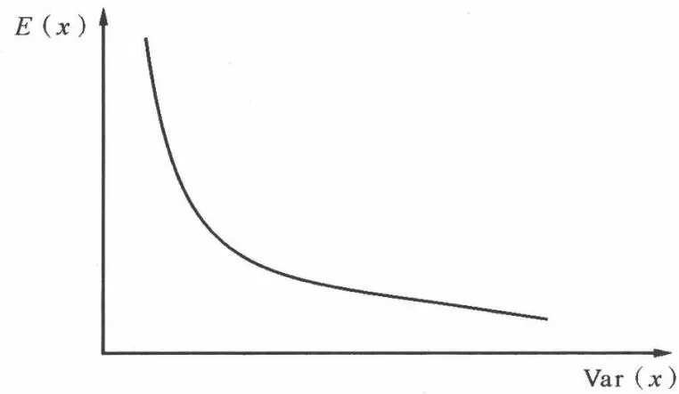
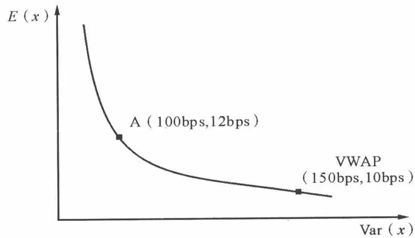

# [第9章](ch09.md) 算法交易策略介绍

## 9.1 最优交易问题

### 9.1.1 最优投资组合问题

风险和收益之间的权衡是金融学的核心问题之一。在马科维茨所确立的传统投资组合理论中,我们可以利用投资组合的收益和方差来得到最优投资组合。投资者可以根据历史数据计算投资组合的历史收益和波动性,并用历史数据作为参考依据,计算最优的投资组合。最优投资组合理论被广泛地应用于金融投资领域,是投资决策的重要理论之一。

最优投资组合理论的问题可以描述为如下两个问题：

1. 在给定的最大风险条件下, 求出具有最高收益率的投资组合, 其数学描述为:

$$
\begin{array}{l} \max: E (R) \\ \text{s.t.} \operatorname{Var} (R) \leqslant \sigma^{2} \end{array}
$$

其中 R 表示投资组合的收益, $\sigma^{2}$ 为收益率的方差。

2. 在给定的最小收益条件下, 求出具有最小风险的投资组合, 其数学描述为:

$$
\begin{array}{l} \min: \operatorname{Var} (R) \\ \text{s .   t   .} E (R) \geqslant \mu \end{array}
$$

在不同风险条件下,我们得到具有最大收益的投资组合也不同。根据不同的最优投资组合的收益和风险特性,我们能够得到一个最优投资组合所组成的曲线,被称为有效市场前沿。进一步地,如果我们定义一个风险厌恶系数 $\lambda$ ,那么可以将投资组合优化问题写为:

$$
\max: E (R) - \lambda \cdot \operatorname{Var} (R)
$$

有效市场前沿上不同的最优投资组合对应于投资者不同的风险厌恶度。较大的 $\lambda$ 意味着投资者对风险的厌恶度较高，在优化问题中对方差的惩罚度也比较高。较小的 $\lambda$ 意味着风险厌恶度比较低。

### 9.1.2 最优交易问题描述

在前面的章节,我们对投资过程中的交易成本进行了一系列的分析。交易成本包括可见成本和隐性成本,具体被归纳为佣金、交易费用、买卖价差、交易税、延迟成本、价格增长、市场冲击、时间风险、机会成本九个方面。最优交易问题的目的在于尽可能地减少交易成本,获得最优的交易执行策略,改善投资策略的表现。

对于交易操作来说,由于市场流动性的短缺,大额的交易订单通常会带来较大的市场冲击成本。为了减少市场冲击,交易员需要将订单分割成较小的部分,分步、逐渐地进行交易操作。但是,这样会使得交易清单面临着价格增长的成本,股票价格和市场环境波动的时间风险,以及订单不能够完成带来的机会成本。快速的交易操作可以减少这些成本,但是会带来较高的市场冲击成本。这两方面的矛盾给交易员带来了两难的选择。最优交易问题致力于平衡两方面成本因素的大小,以获得更好的交易策略。

另外,由于股票价格的波动、市场交易量的变化等等因素为交易操作带来的风险,使得相似的交易清单和策略有可能产生不同的交易成本和交易表现。因此,交易成本应该被认为是一个随机变量。不同的交易清单和交易策略会有着不同的交易成本和风险的统计分布,最优交易策略的研究通过这些因素的优化,有助于改进交易操作。

本章中,我们将利用均值方差的分析框架来解决最优交易问题,那么,最优交易问题可以写成:

$$
\begin{array}{l} \min: E (\mathrm{TC}) \\ \text{s .   t   .} \operatorname{Var} (\mathrm{TC}) \leqslant k \end{array}
$$

其中 TC 表示交易成本。

类似地,如果我们定义一个风险厌恶系数 $\lambda$ ,那么可以将交易优化问题写为:

$$
\min: E (\mathrm{TC}) + \lambda \cdot \operatorname{Var} (\mathrm{TC})
$$

风险厌恶系数 $\lambda=1$ ，表示投资者认为风险等于成本的大小。风险厌恶系数 $\lambda\geqslant1$ ，表示投资者认为风险比成本更值得注意，那么他更倾向于进行积极的交易策略。风险厌恶系数 $\lambda\leqslant1$ ，表示投资者认为成本比风险更值得注意，那么他更倾向于选择消极的交易策略。从经济学意义上讲， $\lambda$ 表示交易成本和风险之间的替代率。

类似于最优投资组合理论中的有效市场前沿,我们将得到一个有效交易前沿(efficient trading frontier, ETF)。交易员可以根据不同的风险厌恶度在有效交易前沿上选择不同的最优交易策略,在交易成本的期望和方差之间作选择,从而改进交易表现。

### 9.1.3 交易成本对夏普比率的影响

如果交易员需要交易一个大的订单,通常会将订单分割为许多小的订单,那么在不同交易时间将得到不同的交易价格。根据执行落差法,交易成本可以表示为不同时段内交易平均价格和订单到达价格之差与订单大小的乘积的加总,用数学表示为:

$$
\mathrm{TC} = \sum x_{i} (\tilde{p} _{i} - p_{0})
$$

其中，TC 表示交易成本， $x_{i}$ 为在时段 $i$ 内交易订单的规模， $p_{i}$ 表示时段 $i$ 内交易的平均价格， $p_{0}$ 为交易开始时的市场价格，即到达价格。这里假定交易完全执行，不存在机会成本。另外，对于买进交易， $x_{i}$ 为正，如果交易价格高于到达价格，则交易成本为正，反之，则交易成本为负。对于卖出交易， $x_{i}$ 为负，如果交易价格低于到达价格，则交易成本为正，反之，则交易成本为负。通常情况下，买进交易造成的市场冲击，会使股票价格上涨；卖出交易产生的市场冲击则会导致股票价格下降，产生正的交易成本。但是，如果市场面临和市场冲击相反的价格移动，交易成本也有可能为负值。

在实际投资过程中,交易成本经常被忽略,这将会使投资者很难完成预期的投资目标。下面我们通过夏普比率进行说明,夏普比率是常见的衡量投资

表现的指标之一,其具体的定义为:

$$
\mathrm{SharpeRatio} = \frac{R_{P} - R_{f}}{\sigma_{P}}
$$

其中, $R_{P}$ 表示投资组合的收益率, $\sigma_{P}$ 表示投资组合收益的标准差, $R_{f}$ 表示无风险利率。

我们用 $h_{t}$ 表示投资组合中持有的资产数量向量, $p_{t}$ 表示一段时间内的资产价格向量, 其中下标表示时间。在时间 $(0, T)$ 内, 投资组合包含交易成本的夏普比率可以表示为:

$$
\text{Sharpe Ratio} = \frac{E (\boldsymbol{h} _{T} ^{\prime} (\boldsymbol{p} _{T} - \boldsymbol{p} _{0})) - E (T C) - r_{f}}{\sqrt{T} \cdot \sqrt{\operatorname{Var} (\boldsymbol{h} _{T} ^{\prime} (\boldsymbol{p} _{T} - \boldsymbol{p} _{0}) - T C)}}
$$

我们可以明显地看到,分子项包含了交易成本导致预期收益减少,而分母中的方差项中多了交易成本的因素将有可能增加收益的风险,这两方面都将会降低投资的夏普比率。夏普比率是衡量投资表现的重要指标,因此我们可以看到交易成本对投资表现的影响。

## 9.2 一个最优交易模型

关于最优交易策略有过许多研究。通常的做法是尽可能地减少执行落差，根据到达价格制定最优交易策略。执行落差主要衡量了包括价格增长、时间风险和市场冲击等隐性交易成本。通过对执行落差的优化，我们可以得出最优交易策略。比较著名的研究包括 Bertimas 和 Andrew Lo（1998），Almgren 和 Chriss（2000），Obizhaeva 和 Wang（2005）等等。本章所介绍的模型来自 Almgren 和 Chriss 的研究。

### 9.2.1 模型设定

首先,我们定义一下交易策略。假定在一段时间 $(0,T)$ 内,需要交易股票的数量为X,将时间T分为n个区间,那么每个区间长度为 $\tau=T/n$ 。然后,我们可以将交易列表定义为 $x_{1},x_{2},\cdots,x_{n}$ ,即在每个时间段内交易股票的数量。通过确定交易列表,我们就得到一个交易策略x。进一步的,定义每个交易时间内未交易的股票数量为 $h_{t}$ ,那么:

$$
\sum_{t = 1} ^{n} x_{t} = X - h_{t}\tag{9.1}
$$

另外，定义交易速率为 $v_{t} = \frac{x_{t}}{\tau}$ ，表示在一个交易时段内交易的股票数量。

### 1. 价格运动

要评估一段时间内交易操作带来的成本,需要对价格运动做出一些假设。我们假设股票价格的变化服从算术布朗运动:

$$
p_{t} = p_{t - 1} + \mu \tau + \sigma \tau^{\frac{1}{2}} \varepsilon_{t}\tag{9.2}
$$

右边第二项表示股票价格的增长, $\mu$ 表示其增长率。第三项则表示价格的自然波动,其中 $\sigma$ 为波动项的标准差, $\varepsilon_{t}$ 表示一个服从标准正态分布的随机变量。在这个假设下,股票价格围绕一个增长的趋势 $\mu\tau$ 进行随机游走。其中既包含了价格增长的趋势,也包含了股票价格波动带来的时间风险。另外,价格增长率 $\mu$ 既可以是根据历史数据计算的股票价格的自然增长趋势,也可以是交易员根据基本面分析或者技术分析得出的股票价格增长的预测。

很多研究当中假设股票价格服从几何布朗运动。不过,对于最优交易问题来说,交易期限往往只有一天或几天,在这么短的交易期限内算术布朗运动可以作为一个良好的近似。

### 2. 市场冲击

市场冲击是指由于某一特定交易指令所引起的股票价格变化。它是指有交易指令时的价格轨道和没有交易指令下达市场时的价格轨道之间的差异。市场冲击成本来自两个主要的原因:流动性需求和信息泄露。流动性需求使得市场在原有均衡价格上供求条件不再平衡。这就要求投资者为了完成指令需要支付一个溢价来吸引额外的流动性。信息泄露是将投资计划或者投资者的交易动机泄露到市场上,使市场价格更高。两者分别导致了永久冲击和暂时冲击。

这里,我们将市场冲击设定为交易速率的线性函数,如下:

$$
M I (v) = \gamma v
$$

其中, $MI(v)$ 表示市场冲击,其中包含了暂时冲击和永久冲击的影响。 $\gamma$ 是市场冲击的参数。其中,交易速率v的单位包括时间,不符合交易成本的设定。因此,在一个交易时段 $\tau$ 内产生的市场冲击为:

$$
\tau \cdot M I (v) = \gamma x\tag{9.3}
$$

### 3. 暂时冲击

当交易指令披露到市场上,如果没有改变市场长期观点,或者当前价值的基本面上的新闻或信息时,产生的市场冲击就是暂时的。暂时市场冲击的产生往往是由于短期内流动性的短缺,并在较短时间内会逐渐消除。

我们这里将暂时冲击 $TI(v)$ 定义为一个交易时段后股票价格的下降, 这里, 我们假设暂时冲击效应表现为 $t - 1$ 时期的交易价格会在 $t$ 时期内有一定的下降:

$$
\tilde{p} _{t} = p_{t - 1} - T I\tag{9.4}
$$

为了计算的简化,我们将暂时冲击设定为线性函数,也就是说暂时冲击随交易速率呈线性增长:

$$
T I (v) = c + \eta v
$$

其中， $c$ 和 $\eta$ 是暂时冲击函数中的参数。暂时冲击分为一个固定部分和一个线性部分， $c$ 可以认为是买卖的半价差。那么交易 $x$ 份股票产生的总的暂时冲击为：

$$
x \cdot T I (v) = c \cdot x + \eta \cdot \tau v^{2}\tag{9.5}
$$

在(9.4)式中， $p_{t-1}$ 是前 t-1 时期价格运动和永久冲击的累积，那么，我们可以进一步计算 t 时期内的交易平均价格为：

$$
\begin{array}{r l} \tilde{p} _{t} & = p_{t - 1} - T I \\ & = p_{0} + \mu (t - 1) + \sigma \sum_{i = 1} ^{t - 1} \tau^{1 / 2} \varepsilon_{i} - \gamma \cdot \sum_{i = 1} ^{t - 1} x_{t} - c - \eta v_{t} \end{array}
$$

结合上面的分析,交易策略 x 产生的交易总投入(对于卖出交易为总收入)可以通过交易期限内的交易数量和成交价格来进行计算。那么,整个交易策略的总投入为:

$$
\begin{array}{r l} X \cdot \overline{{p}} & = \sum_{t = 1} ^{n} x_{t} \widetilde{p} _{t} \\ & = X p_{0} + \mu \sum_{t = 1} ^{n} \tau h_{t} + \sigma \sum_{t = 1} ^{n} \tau^{1 / 2} h_{t} \varepsilon_{t} - \gamma \sum_{t = 1} ^{n} \tau h_{t} v_{t} - c X - \eta \sum_{t = 1} ^{n} \tau v_{t} ^{2} \end{array}\tag{9.6}
$$

上面的式子中， $Xp_{0}$ 表示股票在交易开始时的账面价值。 $\mu\sum_{t=1}^{n}\tau h_{t}+$ $\sigma\sum_{t=1}^{n}\tau^{1/2}h_{t}\varepsilon_{t}$ 表示股票价格的运动，其中包括一个固定漂移项 $\mu\sum_{t=1}^{n}\tau h_{t}$ 和一个随机波动项 $\sigma \sum_{t=1}^{n} \tau^{1/2} h_t \varepsilon_t$ 。 $\gamma \sum_{t=1}^{n} \tau h_t v_t$ 表示市场冲击的效应，而 $cX + \eta \sum_{t=1}^{n} \tau v_t^2$ 则表示由于暂时冲击的消除，每个交易时期内股票价格的下降。其中，对于市场冲击项我们可以做如下变化：

$$
\begin{array}{r l} \sum_{t = 1} ^{n} \tau h_{t} v_{t} & = \sum_{t = 1} ^{n} h_{t} x_{t} = \sum_{t = 1} ^{n} h_{t} (h_{t - 1} - h_{t}) \\ & = \frac{1}{2} \sum_{t = 1} ^{n} [ h_{t - 1} ^{2} - h_{t} ^{2} - (h_{t - 1} - h_{t}) ^{2} ] = \frac{1}{2} X^{2} - \frac{1}{2} \sum_{t = 1} ^{n} \tau^{2} v_{t} ^{2} \end{array}
$$

代入到(9.6)式当中,我们得到交易策略的总投入为:

$$
X \cdot \overline{{p}} = X p_{0} + \mu \sum_{t = 1} ^{n} \tau h_{t} + \sigma \sum_{t = 1} ^{n} \tau^{1 / 2} h_{t} \varepsilon_{t} - \frac{1}{2} \gamma X^{2} - c X - (\eta - \frac{1}{2} \gamma \tau) \sum_{t = 1} ^{n} \tau v_{t} ^{2}
$$

### 9.2.2 最优交易策略

### 1. 执行落差

我们将交易成本定义为执行落差。执行落差是账面资产组合和实际交易中实现的投资组合之间的差异，即 $X \cdot p_{0} - X \cdot \overline{p}$ 。根据前面章节的介绍，我们知道执行落差是一个随机变量，它可能在相似的交易条件和策略下得到不同的结果。那么，按照我们前面的分析和设定，对于交易策略 x，即交易列表 $x_{1}, x_{2}, \cdots, x_{n}$ ，执行落差为：

$$
X p_{0} - X \cdot \overline{{p}} = - \mu \sum_{t = 1} ^{n} \tau h_{t} - \sigma \sum_{t = 1} ^{n} \tau^{1 / 2} h_{t} \varepsilon_{t} + \frac{1}{2} \gamma X^{2} + c X + (\eta - \frac{1}{2} \gamma \tau) \sum_{t = 1} ^{n} \tau v_{t} ^{2}\tag{9.7}
$$

执行落差的期望和方差如下：

$$
\begin{array}{l} E (x) = - \mu \sum_{t = 1} ^{n} \tau h_{t} + \frac{1}{2} \gamma X^{2} + c X + (\eta - \frac{1}{2} \gamma \tau) \sum_{t = 1} ^{n} \tau v_{t} ^{2} \\ V (x) = \sigma^{2} \sum_{t = 1} ^{n} \tau h_{t} ^{2} \end{array}\tag{9.8}
$$

由(9.7)可知,如果 $\varepsilon_{t}$ 服从标准正态分布,那么交易策略 x 的执行落差服从正态分布。那么,根据交易策略的执行落差的期望和方差,我们就可以确定一个交易策略的成本的分布。

### 2. 有效交易前沿

从前面的分析我们知道,在确定一个交易策略之后,我们可以得到这个交易策略的成本的分布情况。一般情况下,两者之间是此消彼长的。也就是说,降低交易成本的方差会提高交易成本的期望,反之亦然。例如,如果交易员选择较为积极的交易方式,以较快的速率进行交易,那么交易成本的风险就会降低,同时,市场冲击就会使得交易成本的期望上升。相反,如果交易员选择相对消极的交易方式,进行缓慢的交易,交易成本的期望会随着市场冲击的降低而降低,但是时间风险会导致交易成本的风险增加。

因此,为了得到最优交易策略,我们将引进均值方差的分析框架。对于交易员来说,总是希望在特定的风险条件下尽可能地减少交易成本,所以我们可以将最优交易策略定义为:在给定的风险条件下,交易成本最小的交易策略。用数学描述为:

$$
\begin{array}{l} \min E (x) \\ \text{s .   t   .} \operatorname{Var} (x) \leqslant k \end{array}\tag{9.9}
$$

也就是说，在给定的风险条件 $k$ 下，我们要找到一个交易成本最低的交易策略 $x$ 。在我们前面描述的模型当中，交易成本的均值和方差函数都是二次函数，所以最优解是唯一的。那么对于每一个风险限制 $k$ ，我们都能够得到一个最优交易策略 $x^{*}$ 。那么，根据不同的风险限制，我们能够得到一组最优交易策略。我们把这个叫做最优交易前沿，如图9.1所示。

图9.1 有效交易前沿

为了求解(9.9)式的最优交易问题,我们可以引入拉格朗日乘数 $\lambda$ ,那么最优交易问题变为:

$$
\min E (\mathbf{x}) + \lambda \cdot \operatorname{Var} (x)\tag{9.10}
$$

$\lambda$ 可以解释为风险厌恶系数。对于给定不同的 $\lambda$ ，我们可以得到不同的最优交易策略。较大的 $\lambda$ 表示投资者更加重视风险，会更倾向于选择积极的交易策略。较小的 $\lambda$ 表示投资者相对来说更重视投资的期望收益，因此会更倾向于选择消极的交易策略。

对于(9.8)中描述的交易成本的均值和方差,目标函数 $U=E(x)+\lambda \cdot \text{Var}(x)$ 是一个二次函数,所以我们可以通过 U 对 $h_{t}$ 的偏导数求 U 的最小值:

$$
\frac{\partial U}{\partial h_{t}} = 2 \eta \tau \left[ - \frac{\mu}{2 \eta} + \frac{\lambda \sigma^{2}}{\eta} h_{t} - (1 - \frac{\gamma \tau}{2 \eta}) \frac{h_{t - 1} - 2 h_{t} + h_{t + 1}}{\tau^{2}} \right]
$$

令 $\frac{\partial U}{\partial h_t} = 0$ ，那么我们得到如下的差分方程：

$$
\frac{1}{\tau^{2}} (h_{t - 1} - 2 h_{t} + h_{t + 1}) = \widetilde{\kappa} ^{2} (h_{t} - \overline{{{{h}}}})\tag{9.11}
$$

其中 $\tilde{\kappa}^2 = \frac{\lambda\sigma^2}{\eta\left(1 - \frac{\gamma\tau}{2\eta}\right)},\overline{h} = \frac{\mu}{2\lambda\sigma^2}$ ，利用边界条件 $h_0 = X$ 和 $h_n = 0$ ，我们可以求得差分方程(9.11)的显式解：

$$
h_{t} = \overline{{{{h}}}} + \frac{\sinh [ \kappa (T - t) ]}{\sinh (\kappa T)} (X - \overline{{{{h}}}}) - \frac{\sinh (\kappa t)}{\sinh (\kappa T)} \overline{{{{h}}}}\tag{9.12}
$$

其中 $\kappa$ 是方程 $\frac{2}{\tau^2} [\cosh (\kappa \tau) - 1] = \widetilde{\kappa}^2$ 的解， $\sinh ()$ 和 $\cosh ()$ 分别为双曲正弦和双曲余弦函数：

$$
\sinh (x) = \frac{\mathrm{e} ^{x} - \mathrm{e} ^{- x}}{2}, \cosh (x) = \frac{\mathrm{e} ^{x} + \mathrm{e} ^{- x}}{2}
$$

通过(9.12)式,我们可以确定不同时间段持有股票数量的序列 $h_{t}$ 。进而,我们可以得到交易策略 x 。

这里,我们利用执行落差的方法建立了一个最优交易的模型,进而得到了具体的交易成本估计和交易策略。由于我们的交易目标是尽可能地减少执行落差,所以,在算法交易当中这一类交易策略被称为 IS (implementation shortfall) 策略。在确定交易序列后,交易策略可以由计算机系统自动进行操作,这就是算法交易中所指的 IS 算法。前面介绍的模型相对有些过于简化,通过将不同的市场冲击设定、考虑收益率的自相关、交易量的变化等等更多因素纳入模型可以对交易算法进行改进。由此也可以看出,IS 算法可以有许多不同的版本。不同的交易系统可以使用不同的交易策略。此外,由于该交易策略使用的执行落差以交易的到达价格为基准进行度量,所以得出的交易策略也可以被称为到达价格(arrival price)策略。

### 3. 交易成本的 VaR

VaR(value at risk, 风险价值)用于描述一个投资组合在一段时间内价值变化的置信区间。它实际上是要回答在概率给定情况下，投资组合价值在下一阶段最多可能损失多少。例如，一个投资组合在未来一年内有 $95\%$ 的概率损失低于多少美元等等。VaR完全是基于统计分析基础上的风险度量技术，它有助于投资者对未来投资的风险控制。

风险价值的概念也可以引入到交易操作中来。对于一个交易策略 $x$ ，我们定义 $\mathrm{VaR}_P(x)$ 为交易的风险价值，用于表示交易策略 $x$ 所引起的交易成本在 $p$ 概率下不超过某一具体数值。前面的分析中，我们指出特定交易策略的交易成本可以被认为是服从正态分布，那么，根据对交易成本的均值和方差的估计，我们可以计算交易成本分布的置信区间。那么，交易策略 $x$ 的风险价值可以表示为： <!-- validate-skip -->

$$
\mathrm{VaR} _{P} (x) = \alpha_{P} \cdot \sqrt{\operatorname{Var} (x)} + E (x)
$$

其中, $\alpha_{P}$ 表示在概率 p 下交易成本偏离均值的标准差个数, 可以通过标准正态分布表获得。用执行落差表达风险价值就是, 交易策略的执行落差在 p 的概率下不超过 $\mathrm{VaR}_{P}(x)$ 。

### 4. 多只股票组合的交易策略

如果交易员要交易 m 只股票, 那么在 t 时刻所持有的头寸向量为 $h_{t}(h_{1t}, h_{2t}, \cdots, h_{mt})^{T}$ , 其中, 如果 $h_{it} < 0$ , 则代表持有股票 i 的空头。交易开始时的头寸为 $\boldsymbol{X} = (X_{1}, X_{2}, \cdots, X_{m})^{T}$ , t 时刻的交易速率为 $v_{t} = \frac{h_{t-1} - h_{t}}{\tau}$ , 如果交易速率 $v_{it} < 0$ , 则代表在 t-1 到 t 时刻之间卖出股票 i。

假定股票价格向量 $P_{t}$ 服从算术布朗运动：

$$
\boldsymbol{P} _{t} = \boldsymbol{P} _{t - 1} + \mu \tau + \sigma \varepsilon_{t} \tau^{\frac{1}{2}}
$$

其中 $\boldsymbol{\mu}=(\mu_{1},\mu_{2},\cdots,\mu_{n})^{T}$ 表示预期价格增长率向量。 $\boldsymbol{\varepsilon}_{t}=(\varepsilon_{1t},\varepsilon_{2t},\cdots,\varepsilon_{n})^{T}$ 表示 r 个独立的布朗运动增量的向量，其中 $r\leqslant m,\sigma$ 是一个 $m\times r$ 的波动率矩阵， $C=\sigma\sigma^{T}$ 是 $m\times m$ 维对称正定的方差协方差矩阵。

市场冲击和暂时冲击也需要用向量来进行表示,我们还是用线性模型:

市场冲击: $MI(v)=\Gamma v$

暂时冲击: $TI(v)=c+Hv$

其中 $\Gamma$ 和 H 是 $m \times m$ 维矩阵, c 是 $m \times 1$ 维的列向量。 $\Gamma$ 和 H 当中的第 ij 个元素表示每单位股票 j 的交易对股票 i 带来的价格冲击。

这样,类似于单只股票的情形,我们可以得到投资组合交易当中产生的交易成本的均值和方差:

$$
\begin{array}{l} E (x) = - \sum_{t = 1} ^{n} \pmb{\tau} \pmb{\mu} ^{T} \pmb{h} _{t} + \frac{1}{2} \pmb{X} ^{T} \pmb{\Gamma} _{s} \pmb{X} + \pmb{c} ^{T} \pmb{X} + \sum_{t = 1} ^{n} \tau \pmb{v} _{t} ^{T} (\pmb{H} _{s} - \frac{1}{2} \tau \pmb{\Gamma} _{s}) \pmb{v} _{t} + \sum_{t = 1} ^{n} \tau \pmb{h} _{t} ^{T} \pmb{\Gamma} _{s} \pmb{v} _{t} \\ V (x) = \sum_{t = 1} ^{n} \tau \pmb{h} _{t} ^{T} \pmb{C h} _{t} \end{array}
$$

在得到交易成本的均值和方差以后,通过优化技术我们可以得到最优的交易策略。但是,由于问题的复杂性,求解往往需要对假设做出进一步的简化。例如,可以假定股票价格移动只存在一种相关性,即将 $\Gamma$ 和 H 当作一个矩阵,这样可以减少计算的复杂性。

组合的交易策略对于交易操作中的风险控制有着明显的优点。交易过程中的风险控制一般是指尽可能地降低交易清单中未执行部分的风险。如果整体风险能够降低，那么交易员就可以拉长交易的时间，进而可以更好地降低市场冲击成本，以及获取流动性。

类似于市场中性的投资策略,交易员在组合交易过程中也可以在交易清单中同时包含买进和卖出交易,以降低交易的风险。如果两种股票相关度比较高,那么两个方向的头寸就可以互相对冲,买进的一边的价格移动可以被卖出一边的价格移动所抵消。这样就可以降低交易清单总的风险。这种情况下,交易员就有更充分的时间进行交易,而不用顾忌股票价格的变化和波动,可以更好地进行交易,降低市场冲击。

例如,如果一个交易员的交易清单上卖出的指令有 1000 万美元,买进的指令有 500 万美元,而且买进和卖出的股票的收益相关度很高。那么交易员就可以先交易卖出的指令,使买卖两个方向的头寸逐渐平衡,这样就能够降低交易订单的总风险。

即使是单个方向的交易,也可以利用这个方法。如果股票之间的相关性比较强,交易策略就需要尽可能地减少不同股票或板块之间交易头寸的不平衡,以免一只股票交易产生的冲击引起其他股票价格的变化带来交易成本。

## 9.3 VWAP 交易策略

VWAP 交易策略是指投资者在进行交易时,使交易的平均成交价格尽可能地接近 VWAP 的交易策略。VWAP 策略在消极型投资者当中很流行。

VWAP指的是成交量的加权的平均价格。它是对于在一段时间市场上所有的交易活动的平均价格的衡量。很多投资者相信 VWAP 是市场上“平均的”和“公平的”价格。它是一个评估交易员表现好坏的常用手段，代表着投资者的交易表现是否优于市场平均水平。交易员可以通过 VWAP 策略来执行交易清单，这样能够减少市场冲击。但是，这要以时间风险的增加和价格增长的成本为代价。下面，我们将介绍如何得到一个 VWAP 策略。

VWAP 与其他基准价格有所不同, 因为它是一个通过计算得到的值, 并不是像开盘价、收盘价、最高/最低价等一样的特定时间的市场价格。具体地说, VWAP 等于一段时间里的股票的总的交易额 $\sum P_{j} v_{j}$ 除以在这段时间里总的成交量 $\sum v_{j}$ , 所以 VWAP 被认为是市场的平均和公平的价格。

$$
\mathrm{VWAP} = \frac{\sum v_{j} P_{j}}{\sum_{j} v_{j}}\tag{9.13}
$$

### 9.3.1 如何实现 VWAP

理论上,如果要在 VWAP 价格上执行交易,交易员需要在每个交易区间内最小化市场冲击,常见的方法是按平均交易量的固定比例进行交易。


假定 3 个小时内市场的预期平均成交量如下：

第1小时 300000股

第2小时 400000股

第3小时 300000股

如果一个交易员要交易 100000 股股票,由于 100000 股股票占市场总成交量的 10%,那么他可以按如下方式进行交易:

第1小时 30000股

第2小时 40000股

第3小时 30000股

也就是说在每个小时内交易的股票数量都占总交易量的 10%。这种情况下每小时内产生的供需不平衡程度是一样的，产生的市场冲击最小。


但是这样的策略有一个问题。市场成交量的变化比较大,交易员通常无法预测交易期限内的市场成交量有多少。VWAP 交易需要找到一个合适的分割策略,以使得交易员在无法提前知道当天的总交易量的情况下进行交易。另外一个替代方案是按某一时段内占日交易量的比例进行交易。交易员可以把一天分割成不同的时间段或者交易间隔,并在每个期间计算日交易量的平均百分比组成。许多研究表明,单日内交易量的曲线呈现“U形”,也就是说交易量变化的模式相对稳定,因此这种 VWAP 策略相对更容易实现。为了得到较好的估计,投资者可以使用最近的观察数据。


假定 3 个小时内市场的预期平均成交量占总成交量的百分比如下：

第 1 小时 30%

第2小时 $40\%$

第3小时 $30\%$

这种情况下交易员可以按照交易量变化的相同模式进行交易,也就是在3个小时内分别执行交易清单的 30%、40% 和 30%。


交易员经常会想要得到一个接近 VWAP 基准的平均执行价格。由于市场上没有人能够保证交易的成交价格，交易员经常会选择实现 VWAP 价格可能性最大的策略来执行交易。在这种情况下，最好的执行策略（这个策略提供了最高可能性获得 VWAP 基准价格）可以表示为：

等式(9.13)可以改写如下：

$$
\mathrm{VWAP} = \frac{\sum v_{j} p_{j}}{\sum v_{j}} = \sum [ (\frac{v_{j}}{\sum v_{j}}) \cdot \overline{{p_{j}}} ] = \sum u_{j} \overline{{p_{j}}}\tag{9.14}
$$

其中 $u_{j}$ 是第 j 个交易期间的日交易量的百分比， $\overline{p_{j}}$ 是第 j 个交易期间的平均价格。

如果 y 是一个订单的分割策略,那么订单的平均交易价格可以表示为 $\sum y_{j} \overline{p_{j}}$ 。如果交易员在每个交易期间能够按照平均价格完成交易,则这个策略提供获得 VWAP 的可能性最大。它找到一个使得 VWAP 基准价格和平均执行价格的差异最小的交易策略 y 。在数学上,交易目标是使得 VWAP 基准价格和平均执行价格的差异的均方差最小,即:

$$
\min: \delta = \left(\sum u_{j} \overline{{p_{j}}} - \sum y_{j} \overline{{p_{j}}}\right) ^{2}
$$

写成向量形式为：

$$
\min: \delta = (\boldsymbol{u} ^{\prime} \boldsymbol{p} - \boldsymbol{y} ^{\prime} \boldsymbol{p}) ^{2}
$$

其中 u, y, p 为 $n \times 1$ 列向量, $u'$ , $y'$ , $p'$ 为这些向量的转置。

目标函数是一个平方的形式,因此 $\delta \geqslant 0$ 。我们可以看到一个直观的解为$(y - u)^t = 0$ ，即 $y = u$ 。因此，如果交易员想要达到 VWAP，一个近似的分割策略是交易订单的分割要和这个期间的交易量保持一致。进一步地，这个在任何交易期限内都成立。最后，分割策略 $y = u$ 也是期望价格和 VWAP 之间差异最小的交易策略。

VWAP 策略并不能够保证投资者避免大的价格波动和高成本的风险。例如, 投资者用 VWAP 策略在一天时间内执行一个交易, 那么肯定会在收盘前执行一部分交易。因此, 如果收盘之前价格出现大幅上升, 买单将会遭受更高的成本, 而卖单就会得到更低的成本。VWAP 并不是成本最小化的策略, 而仅仅是最小化暂时市场冲击的策略。

### 9.3.2 交易量特征的估计

前面我们提到,使期望平均价格和 VWAP 基准价格之间差异最小的策略是 $y_{j}=u_{j}$ 。但是,这里的 $u_{j}$ 怎样估计出来呢? 我们可以通过前 30 天内的移动平均交易量来估计 $u_{j}$ ,选择数据的时间尺度要看交易量曲线的稳定性。例如高流动性的股票需要 20 天的数据,因为这样的股票交易量曲线更稳定;而缺乏流动性的股票,则需要大约 30 天的数据。不过,在任何情况下使用数据越多估计就会越精确。

下面我们对股票的交易量特征进行估计,假设 $V_{i}$ 是 j 天以前总的交易量, $v_{ij}$ 是第 j 个期间 i 天以前的交易量,那么

$$
u_{j} = \frac{1}{n} \sum_{i = 1} ^{n} \frac{v_{i j}}{V_{i}} = \frac{1}{n} \sum_{i = 1} ^{n} u_{i j}
$$

在这里, 向量 $\boldsymbol{u}^{\mathrm{T}} = (u_{1}, u_{2}, \cdots, u_{n})$ 包含了在每个期间内预期的日交易百分比, 其中 $u_{j}$ 为第 j 个期间的日交易百分比。很明显, $\sum u_{j} = 1$ 。为了用 VWAP 策略进行交易, 交易员根据交易量特征 u 来分割他们的订单 X 。在任何一段给定的交易期间内, 需要交易的股份数量为 $x_{j} = u_{j} \cdot X$ 。

用超过 30 天的交易数据来估计股票的交易量曲线并不一定能够改进估计精度。在大多数情况下,交易量模式是稳定的,而总交易量的波动性则很大,甚至会在两天之间产生很大的变化,日交易量的比例的持续性则相对较好。但是,流动性低的股票出现大额交易的情况是一个例外。

此外,数据的滞后并不像我们想的那样对交易量曲线的估计有很大的损害。交易量曲线的模式是非常稳定的,也许是股票交易中最稳定的一个特征。

用一个月前的数据和用当月的数据并没有太大的不同。因此，分析员可以从以前的数据得到和使用最近的交易数据相接近的估计精度。但是，一般情况下我们建议用最近的数据。因为最近的数据能够更好地反映市场结构的变化。从某种程度上来说，交易员在今天的投资行为与他上个月，或者去年的表现是接近的，所以我们可以认为市场结构是稳定的。

关于交易量曲线的一个有趣的问题是:我们应该对单个股票做出特定的估计(每个股票一个交易量曲线),还是用一些相对一般化的曲线,例如资本市场或者某个行业的曲线?一些研究发现,一般化的交易量曲线和特定的股票的交易量曲线相比总的来说是一致的。然而,为了得到最好的置信区间和误差区间的估计,特定的股票曲线当然更好。

### 9.3.3 为什么交易员会选择 VWAP 交易策略?

交易员选择用 VWAP 交易策略来执行委托有两个主要原因: 首先, VWAP 策略是一种最小化市场冲击成本的交易策略。用 VWAP 策略执行的交易员喜欢根据市场交易量进行交易, 这使得在每个交易期中尽可能地保持供需平衡, 而导致最小的损失。

其次,对于许多交易员来说,他们的执行业绩经常用 VWAP 作为基准来进行衡量。一个交易员的平均执行价格和 VWAP 相比越好,就表示他的操作业绩越好;相反,如果交易员的平均交易价格和 VWAP 相比差很多,那说明他的操作业绩很差。但是这些并不能保证 VWAP 策略总能够带来好的结果,有时也可能导致基金遭受更高的交易成本。

VWAP 策略确实是一个最小化市场冲击成本的策略。但是,它并不是一个最小化总交易成本的策略。市场冲击成本只是总交易成本的一部分。在执行交易的时候,交易员也面临着价格增长和时间风险的威胁。VWAP 策略最小化了市场冲击成本,但是并不能够避免价格上升带来的影响。例如,交易员用 VWAP 策略买入一只价格上升中的股票,由于 VWAP 策略过于消极,他将会遭受更高的交易成本。类似的,交易员用 VWAP 策略在一个下降的市场上卖出股票,他同样也会招致许多不必要的成本。VWAP 策略并不能使投资者免受价格上升所带来的交易成本。由于 VWAP 并不是实现最小成本的交易策略,所以交易员可以找到在相同风险下的更低成本的策略,或者在相同成本下更低风险的策略。投资者在价格上升时选择 VWAP 策略来执行委托,既不是一个最优的交易方式,有时甚至不是一个合理的交易决定。

如果没有预期的价格上升, VWAP 策略是一个最低的交易成本策略, 因为只剩下市场冲击这一主要的交易成本。因此, 在这些情形下, VWAP 策略是一个最优的交易策略。然而, 即使在这种情形下, VWAP 策略也并没有使投资者避免时间风险。通过和有效交易边界上其他交易策略的对比, 我们发现 VWAP 策略是所有最优策略中风险最大的一个。尽管它可能是最低成本的策略, 但是它相对较大的方差使得投资者面临着交易成本很大的不确定性, 可能出现的价格波动将使投资者面临较大的交易成本, 而这是投资者所希望极力避免的。

图 9.2 中, VWAP 是所有最优策略中成本最低的。期望成本为 10 个基点, 但是其风险相对较大, 为 150 个基点。具有较小的风险厌恶水平的交易员可能会决定选择 VWAP 作为最优交易策略。但是如果交易员风险厌恶度较高, 则会选择图形上的策略 A。因为 A 可以带来更小的交易风险, 它的期望成本为 12 个基点, 风险为 100 个基点。交易员牺牲 2 个基点期望成本就可以使得交易价格的风险下降 50 个基点。我们可以将策略 A 称为 VWAP 对冲策略, 也就是说, 一个和 VWAP 非常相似的低成本策略。但是相对来说, 它却有着较低的交易风险。VWAP 对冲策略是一个按照股票交易量曲线执行委托的策略, 但是没有必要整天都执行交易。小的订单可以较快地执行, 而大的订单则要在整天执行。最优化的规则是由交易量情况决定的, 什么样的订单就用什么样的交易期限来执行。例如, 为了保证最小化市场冲击成本, 执行 150000 股股票的订单需要在整天执行。但是, 在一个更短的时间段来执行则可以更好地控制交易风险。

图9.2 一个有效交易前沿

从前面的分析我们知道,获得 VWAP 价格的交易目标和最优交易操作的目标并不一致。交易员需要在成本和风险上保持平衡,并且需要意识到价格上涨的趋势,才能实现最优的交易操作。然而,VWAP 策略仍然是很多交易员愿意执行的策略。因为许多金融机构经常会用 VWAP 来评价交易员的业绩,而这往往是不恰当的交易方式。

此外，VWAP策略有许多优点。例如 VWAP 策略最小化市场冲击成本，而且在没有任何关于价格增长的成本的期望的情况下，它还是最低成本的最优化策略。VWAP 策略也经常使得交易员隐藏其委托量大小和他们的交易意图，而这一点很受投资者的重视。在每个时期都以一个和市场交易量相同比例的订单进行交易，这使得市场很难知道他们到底想干什么。因此，许多人声称 VWAP 策略的交易速度刚刚好，既不太快也不太慢。

## 9.4 算法交易策略简介

### 9.4.1 价格基准和交易策略

算法交易的目的是通过计算机系统自动地完成交易的执行过程,并尽可能地减少交易成本和风险。计算交易成本通常需要确定一个基准价格,通过将交易价格和基准价格进行对比,才能够评价交易成本的高低。最常见的价格基准是加权的平均价格,以及交易前后的报价。下面是常用的三类基准价格:

\- 交易开始前的某个价格,其中包括前一日收盘价、当天开盘价、交易前最后一个成交价、交易开始时的决策中间价等等。

\- 交易当天的加权平均价格,例如 VWAP 和 TWAP。

\- 交易完成后的某个价格,例如当天的收盘价。

常见的交易算法常常就是通过交易目标的基准价格所命名的,例如最常用的 VWAP 算法、TWAP 算法,以及 Arrival Price 等等。这些算法的目标就是实现接近于基准价格或优于基准价格的平均成交价格。另外,Implementation Shortfall 算法表明这类算法是以执行落差为决策标准的,其交易目标就是尽可能地针对某一特定的基准价格的执行落差,使得交易的平均成交价格尽可能地接近基准价格。因此对于算法交易来说,交易算法常常是和特定的价格基准联系在一起的。不过,不同的金融机构在内部开发的算法会各不相同。例如,即便同样是 Implementation Shortfall,不同机构提供的算法的具体操作过程也会有所区别,因为他们开发的技术细节是会存在差异的。这也导致不同的金融机构的交易算法之间的目标会有一些细微的差异,有时候不同策略的性能也会有一定的差别。

### 9.4.2 一些交易算法的介绍

### 1. VWAP

常见的 VWAP 策略的操作方法是按平均交易量的固定比例进行交易。但是,由于市场成交量波动性比较大,交易员无法预测交易期限内的市场成交量有多少。另外一种实现 VWAP 的策略是按某一时段内占日交易量的比例进行交易。交易员可以把一天分割成不同的时间段或者交易间隔,并在每个期间计算日交易量的平均百分比组成,例如如果一天的某一时间内的交易量占当天 5%,那么交易员就在这个时段交易自己交易清单的 5%。

使用 VWAP 的理由在于:

\- VWAP是最为常见的评估交易员操作表现的价格基准。

\- VWAP 产生的市场冲击最小。

\- 当交易员没有很强烈的交易意图的时候,会选择 VWAP。因为 VWAP 至少代表着市场平均的价格水平。

\- VWAP 的订单分割方式更有利于隐藏交易意图。

同时 VWAP 策略也存在着一些缺陷：

\- VWAP 策略和最优交易操作的目标并不一致,没有将交易当中的价格增长和时间风险考虑在内,使得交易更多地面临着价格波动和增长带来的风险。

\- VWAP 对于小额交易来说交易速度过于缓慢。小额交易产生的市场冲击较小,没必要设定过长的交易时间,完全可以直接进行交易而不进行分割。这种情况下 VWAP 策略使交易面临的风险较大。

\- 由于 VWAP 等于全天内交易成交价格的加权平均,所以里面包含了未来的市场价格。因此,即使交易员造成的市场冲击使市场价格升高,仍有可能实现 VWAP。很明显,如果交易员所执行的交易比例接近于该股票的全部交易量时,无论如何操作都能够实现 VWAP。

### 2. Implementation Shortfall (IS)

Implementation Shortfall 算法是以执行落差为决策基础的交易策略。交易的目标是尽可能减少交易当中的执行落差。Implementation Shortfall 算法的思想可以应用于各种价格基准,如到达价格、开盘价格、前一日收盘价等等。因此一些诸如 Arrival Price、Opening、Closing 等算法实际上也可以执行落差为基础来制定。例如,Arrival Price 的决策目标可以描述为:

$$
\min: \sum x_{i} (\overline{{p}} _{i} - p_{0})
$$

利用执行落差的方法可以针对这个目标优化,以得到一个具体的 Arrival Price 算法。

Implementation Shortfall 算法的优点在于:

\- 执行落差的方法较为全面地分析了交易成本的各个部分,在市场冲击成本和时间风险,以及价格增长等因素之间取得了更好的平衡,更加符合最优交易操作的目标。

Implementation Shortfall 算法根据一些决策价格进行交易过程的优化，更符合投资决策的过程。例如一些投资策略以市价为信号进行交易，那么 Arrival Price 则是一个很自然的选择。

Implementation Shortfall 的组合交易算法能够利用交易清单上股票之间的相关性更好地控制风险。

### 3. Participate

Participate 算法类似于 VWAP 算法,以市场平均交易量的百分比为决策基础。但是与 VWAP 有所不同的是,Participate 算法以一个固定比例进行交易,这个比例就是所谓的参与率(participation rate)。例如,如果交易员认为可以忍受市场交易量 10% 的订单带来的市场冲击,那么就可以一直以 10% 的参与率进行交易。因此,对于小订单来说,Participate 算法表现出了比 VWAP 更有利的一面。小订单可能在前两个交易期限就已经完成,使得交易清单更少地面临价格增长和波动带来的风险。

另外,和 Implementation Shortfall 算法一样,Participate 算法也可以和特定的决策价格基准相结合。例如,如果利用开盘价格为价格基准,可以在开盘后的一段时间内以一定的参与率进行交易;如果使用收盘价格为价格基准,可以在收盘前的一段时间内以一定的参与率进行交易。

### 4. TWAP

TWAP(time weighted averaged price)是时间加权的平均价格,是在不同交易时间点上交易价格的平均,计算方式如下:

$$
\mathrm{TWAP} = \frac{1}{n} \sum P_{j}
$$

如果要实现 TWAP, 可以在整个交易期限内使用 Implementation Shortfall 算法或者 Participate 算法的思想。这样就能够使交易的平均成交价格尽可能地接近 TWAP。

### 5. 一些其他算法

算法交易出现以后,大量的金融机构都在开发自己的交易算法。市场上出现了大量不同的算法。有时算法交易的策略会被冠以很奇怪的名字。这里,我们对几种简单的算法进行一些介绍。

Simple Time Slicing, 这种算法就是简单地将订单分割为小的部分, 在一定的时间间隔内以市价单的形式发送到市场。

有一种交易策略被称为冰山一角(iceberging)。这个策略的目的就是通过订单分割的方式,可以隐藏或部分隐藏交易的动机,来达到降低成本和发现流动性的目的。策略的名字“冰山一角”形象地表达了其操作方式和目的,就像冰山一样,被发现的永远只是水面上的一小部分。其具体做法就是由基金经理设定交易期限内最大的交易数量,或者每个更短的期限内的具体交易数量,形成一个具体的交易序列,然后交给计算机系统进行交易操作。

游击队(guerrilla)是由瑞士信贷开发的一个交易算法,它实时地不断接收不同交易市场上的公开报价,并进行判断。其目标是发现能够进行交易,而且造成价格移动的可能性较小的报价,以避免影响所交易股票的交易模式。这种算法适合希望尽可能避免市场价格的基金经理。

一些交易所和交叉网络会提供一些隐藏的流动性,并不在传统的公开平台上交易,而只在大的机构投资者和经纪商之间交易。这些流动性通常被称为流动性暗池(dark pools of liquidity)。瑞士信贷开发的一种交易算法叫狙击手(sniper),就专门用来发现这类隐藏的流动性。在流动性暗池中的交易只公布股票的价格,而不公布交易的投资者和交易量信息,所以能够降低市场冲击。

另外,还有一类交易算法叫做窃听器(sniffer),专门用来发现其他投资者是否使用算法进行交易操作,以及所用的具体算法,以希望能够利用这类信息获得额外的收益。

这里我们仅仅介绍了一些比较简单的和相对知名的算法。通过进一步的修正和改进,这些算法可以变化出很多的版本,以适应不同的投资者在不同市场环境下的需要。在算法交易领域里,可以说每天都在诞生着新的交易算法。因为市场条件不断在变化,投资者也在不断地进行创新和研究,算法交易也在不断地发展之中。