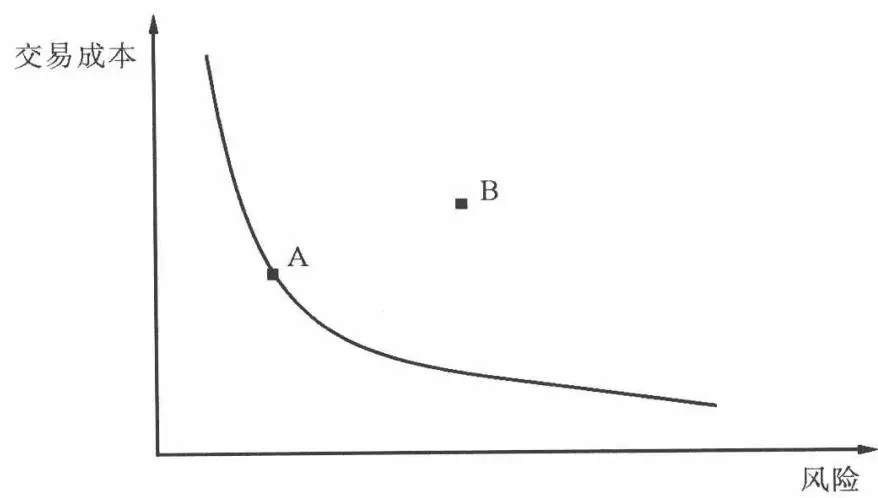
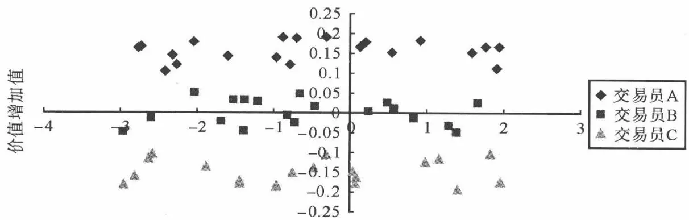
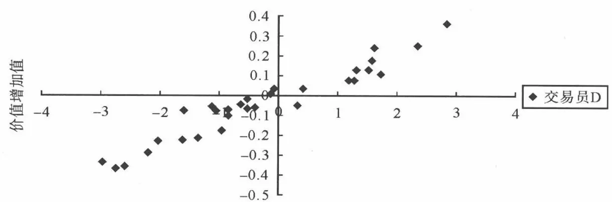

# [第10章](ch10.md) 交易后分析和算法的选择

## 10.1 交易后分析

交易后分析是对交易员的表现进行评估的过程。交易后分析需要估计交易执行产生的成本，辨别交易员的表现是靠运气还是技能，以及通过评估投资决策的实施情况来判断是否完成了最优决策。交易后分析不像传统投资组合的绩效分析那样根据一定的时间间隔（例如每年、半年或季度）进行，而是在每次交易完成后进行。

交易后分析由两部分组成:交易成本测量和交易表现评估。交易成本测量用以判断交易成本的大小,以及成本在哪里产生。通过评估,基金经理可以加深对市场结构变化的理解,进而改进资产配置和股票选择的过程。交易表现评估目的是检验所产生的交易成本是否合理。我们判断成本是由交易活动本身和不可避免的价格变动,还是由低质量的交易决策所导致的。这一信息对基金经理的投资决策十分重要,可以帮助他们将更多资源投入能够带来附加值的部分,而将更少资源投入到难以带来改进的地方。

### 10.1.1 测量交易成本

交易后分析基础就是测量交易成本,把成本看成期望成本和风险的分布来进行估计,进而评估交易员的表现。测量交易成本代表着评价过去的交易表现,而估计交易成本则是对未来交易的预测,其中包括着不确定性。交易表现的评估是衡量在实际的市场环境中产生的成本是否合理,或者说,交易决策质量的好坏。如果基金经理和交易员不了解这些测量的方法,就容易造成不合理的投资和交易决策。

为什么要测量交易成本？原因很简单。如果基金经理想要降低交易成本，进而改进投资决策，那么首先需要能够测量交易成本。

交易成本是从事经营的成本,需要在决策过程中加以考虑。对于基金经理来说,深入了解经营过程中的成本非常重要。交易成本就是平均执行价格与投资决策的价格之间的差。不过,二者产生差异的原因有很多。

金融行业经常将交易成本定义为执行价格与基准价格(如 VWAP)的差。然而,从基金的投资目标来看,这是没有道理的。即使投资者能够提前知道交易价格会优于或差于 VWAP 5 个基点,有些时候对投资决策也是没有意义的,因为投资者依然不知道他们实际交易的价格。成本测量的应该是执行价格与决策价格的差。


一个基金经理需要在两种股票 A 和 B 中选择,两只股票的市价都是 50 美元,期望年收益率均为 10%。因此,一年后两只股票的期望价格均为 55 美元。那么,基金经理应该把哪只股票加入投资组合当中?

为了能够选择合适的股票,基金经理需要知道成本是多少。如果 A 的成本为 100 个基点,而 B 的成本为 50 个基点,那么我们可以计算一年后的回报率:

$$
\mathrm{平均交易价格} = \mathrm{市价} \cdot (1 + \mathrm{成本比率})
$$

$$
\mathrm{实际回报} = \frac{\mathrm{未来价格}}{\mathrm{平均交易价格}} - 1
$$

A 以 50.50 美元(50 美元加上 100 个基点, 即 1%)买进, 则实际回报率为:

55/50.50-1=8.91%

B 以 50.25 美元(50 美元加上 50 个基点, 即 0.5%)买进, 则实际回报率为:

55/50.25-1=9.45%

因此,基金经理显然会选择 B,因为它的实际回报率更高。但是,如果没有确切的交易成本信息,经理无法做出最优的交易决定。因此,基金经理需要知道市价和成本才能做出正确的投资决策。



和上面问题相同的情况,但基金经理不再具有确切的成本信息,而是有每只股票的平均执行价格和 VWAP 价格的历史记录。如果从历史数据看,A 的平均执行价格差于 VWAP 5 个基点,B 的平均执行价格差于 VWAP 20 个基点。那么,基金经理如何利用这一信息决定买入哪只股票?

如果只知道历史信息,经理是不能够做出正确决定的。知道交易差于VWAP的比例不能提供任何交易成本和交易价格的信息。因为,虽然和各自的VWAP相比A表现较好,但是事实上A的VWAP可能要高于B很多。那么在这种情况下,B则是成本更低的股票,也更值得投资。即使基金经理假设两只股票的VWAP价格相等,A比B的成本更低,也仍然无法做出合理决策。交易指令大小和执行策略会对比较执行价格和VWAP产生很大影响。当交易指令的规模越来越大的时候,执行价格就会与VWAP越来越接近。当交易指令的规模占成交量的100%的时候,执行价格就是VWAP。另外,如果以前每只股票的执行目标均不相同,那么与VWAP的对比也会有很大不同。因此,如果在历史交易当中A的交易量比B大,则A比B更容易接近于VWAP。


#### 1. 执行落差

最常用的交易成本评价方法是 Perold 提出的执行落差法。执行落差是指实际组合回报与账面回报的差异。这一方法考虑了除管理费用以外的所有投资组合交易成本。这一测量方法的目的是测量执行投资决策的能力，已成为交易成本的测量标准。

执行落差将成本分成两部分:执行成本部分和机会成本部分。执行成本由实际市场交易成本构成,如佣金、交易税和价格冲击。在这种情况下,Perold 把价格冲击定义为投资决策时的股票价格与实际执行价格的差。正如他所指出的,价格冲击是由很多因素导致的:信息泄露、流动性需求、反向价格运动、市场波动等等。Perold 对价格冲击的定义包含了我们的市场冲击、价格上涨、时间风险和延迟成本,而不只把价格变动归咎于交易。因此,这里价格冲击与我们的市场冲击定义不同,市场冲击是特定交易引起的股票价格变动。Perold 定义的价格冲击正是我们所定义的交易相关和投资相关成本。执行落差中的机会成本指的是因为交易不能完成而损失的利润。产生机会成本的主要原因是市场缺乏流动性,以及不利的价格变动。

n 阶段的账面组合收益定义为 n 时刻投资组合价值减去投资决策时的价值。账面组合的基本假设是在市价条件下可以无限地交易股票，而不产生价格移动。另外，账面组合没有佣金、买卖价差、交易费用和税收的成本。

账面组合所使用的市价定义为买卖报价的中间值。值得注意的是，账面回报的定义要求在买卖价差中间值执行所有的交易指令，否则投资组合会产生平均为买卖价差一半的成本。假设投资者同时买进和卖出一只股票。如果账面组合以买入报价买入，以卖出报价卖出，那么投资者因为买卖价差而会造成损失。但是,Perold 的执行落差法认为账面组合不存在交易成本。另一方面,n 阶段投资组合的实际回报定义为 n 时期组合的价值与执行时的组合价值(去除佣金、税和费用与机会成本)的差。计算如下:

$$
\begin{array}{r l} & {X_{i} = \text{要执行的股票} i \text{的股数}} \\ & {x_{i j} = \text{时期} j \text{执行的股票} i \text{的股数}} \\ & {X_{i}, x_{i j} > 0 \text{表示买}; X_{i}, x_{i j} <   0 \text{表示卖}} \\ & {P_{i d} = \text{投资决策时股票} i \text{的价格}} \\ & {P_{i j} = \text{第} j \text{次交易时股票} i \text{的执行价格}} \\ & {P_{i n} = \text{交易结束时股票} i \text{的价格}} \end{array}
$$

$$
\begin{array}{r l} & {\text{账面回报} = \sum_{i} X_{i} P_{i n} - \sum_{i} X_{i} P_{i d}} \\ & {\text{实际回报} = \sum_{i} X_{i} P_{i n} - \sum_{i} \sum_{j} x_{i j} P_{i j} + \text{可见成本}} \end{array}
$$

然后,我们计算执行落差成本如下:

1. 情况 1

首先,我们考虑 $t_{n}$ 时刻交易完全执行的情况:

$$
\begin{array}{r l} I S & = \text{账面回报} - \text{实际回报} \\ & = (\sum_{i} X_{i} P_{i n} - \sum_{i} X_{i} P_{i d}) - (\sum_{i} X_{i} P_{i n} - \sum_{i} \sum_{j} x_{i j} p_{i j}) + \text{可见成本} \\ & = \underbrace{\sum_{i} \sum_{j} x_{i j} p_{i j}} _{\text{执行价格}} - \underbrace{\sum_{i} X_{i} P_{i d}} _{\text{决策价格}} + \text{可见成本} \end{array}
$$

2. 情况 2

考虑在交易结束时有没能执行的交易的情况。与情况 1 相同,执行落差是账面回报与实际回报的差,即使每个组合执行的股数不同也是如此。这直接引出 Perold 的机会成本定义。

$y_{i}=$ 未执行的股票 i 的股数

$$
\begin{array}{r l} & {\sum_{j} x_{j} = \text{股票} i \text{的执行股数}} \\ & {\qquad I S = \text{账面回报一实际回报}} \\ & {\qquad = (\sum_{i} X_{i} P_{i n} - \sum_{i} X_{i} P_{i d}) - (\sum_{i} (\sum_{j} x_{i j}) P_{i n} - \sum_{i} \sum_{j} x_{i j} p_{i j}) + \text{可见}} \\ & {\qquad \text{成本}} \end{array}
$$

因为交易列表中有 $y_{i}$ 股未被执行,那么:

$$
y_{i} = X_{i} - \left(\sum_{j} x_{i j}\right)
$$

$$
\begin{array}{r l} & {\sum_{i} X_{i} P_{i n} = \sum_{j} \big (\sum_{j} (x_{i j}) + y_{i} \big) P_{i n} = \sum_{i} \sum_{j} x_{i j} P_{i n} + \sum_{i} y_{i} P_{i n}} \\ & {\sum_{i} X_{i} P_{i d} = \sum_{j} \big (\sum_{j} (x_{i j}) + y_{i} \big) P_{i d} = \sum_{i} \sum_{j} x_{i j} P_{i d} + \sum_{i} y_{i} P_{i d}} \end{array}
$$

经过代换有

$$
\begin{array}{r l} {I S = [ (\sum_{i} \sum_{j} x_{i j} P_{i n} + \sum_{i} y_{i} P_{i n}) - (\sum_{i} \sum_{j} x_{i j} P_{i d} + \sum_{i} y_{i} P_{i d}) ] -} & \\ & {(\sum_{i} \sum_{j} x_{i j} P_{i n} - \sum_{i} \sum_{j} x_{i j} p_{i j}) + \text{可见成本}} \\ & {= \sum_{i} \sum_{j} x_{i j} P_{i j} - \sum_{i} \sum_{j} x_{i j} P_{i d} + \sum_{i} y_{i} P_{i n} - \sum_{i} y_{i} P_{i d} + \text{可见成本}} \\ & {= (\sum_{i} \sum_{j} x_{i j} P_{i j} - \sum_{i} \sum_{j} x_{i j} P_{i d}) +} \\ & {\big [ \sum_{i} (X_{i} - \sum_{j} x_{i j}) P_{i n} - \sum_{i} (X_{i} - \sum_{j} x_{i j}) \big ] P_{i d} + \text{可见成本}} \\ & {= \underbrace{(\sum_{i} \sum_{j} x_{i j} p_{i j} - \sum_{i} \sum_{j} x_{i j} P_{i d})} _{\text{执行成本}} + \underbrace{\sum_{i} (X_{i} - \sum_{j} x_{i j}) (P_{i n} - P_{i d})} _{\text{机会成本}} +} \\ & {\text{可见成本}} \end{array}
$$

因此,执行落差被划分为执行成本、机会成本和可见成本。值得注意的是,只要用于分析的时间区间等于或长于交易期限,分析的期限对于结果就没有影响。

#### (3) 情况 3

考虑基金经理确定每只股票交易的规模而不采用股票数量,是货币值 $D_{i}$ 。 $D_{i}>0$ 表示买进, $D_{i}<0$ 表示卖出,这样隐含地确定了经理打算买的股数 $X_{i}$ :

$$
X_{i} = \frac{D_{i}}{P_{i d}}
$$

这样,计算执行落差的方法可以参考第1种情况。

#### 2. 扩展执行落差方法

Perold 的执行落差法正是基金经理所需要的测量执行成本的方法。然而,对于交易的归因分析,执行落差法却不是那么的有效。Wagner 的研究指出,指令的交易成本可以分成延迟部分和交易部分。延迟成本是从经理做出决定到交易员执行交易之间因延迟而损失的利润。交易成本代表交易活动本身的成本。拥有这些信息可以使基金经理区分成本是基金管理成本,还是交易本身的成本。重要的是,通过合理的交易成本管理可以减少大量的延迟成本,进而改进组合表现。将 Wagner 的方法扩展到执行落差法当中,我们可以得到进一步分辨交易成本出处的公式:

$t_{0}=$ 指令到达市场的时间

$t_{d}=$ 交易开始的时间

$t_{n}=$ 交易结束的时间。其中， $t_{d}<t_{0}<t_{n}$

$P_{i0}=$ 股票 i 的交易指令下达时的价格

我们有：

$$
\begin{array}{r l} & t_{n} - t_{d} = (t_{n} - t_{0}) + (t_{0} - t_{d}) \\ & P_{i n} - P_{i d} = (P_{i n} - P_{i 0}) + (P_{i 0} - P_{i d}) \end{array}
$$

于是我们计算执行成本和机会成本如下：

$$
\begin{array}{r l} {\text{执行成本}} & {= \sum_{i} \sum_{j} x_{i j} P_{i j} - \sum_{i} \sum_{j} x_{i j} P_{i d}} \\ & {= (\sum_{i} \sum_{j} x_{i j} P_{i j} - \sum_{i} \sum_{j} x_{i j} P_{i 0}) + (\sum_{i} \sum_{j} x_{i j} P_{i 0} -} \\ & {\quad \sum_{i} \sum_{j} x_{i j} P_{i d})} \\ {\text{机会成本}} & {= \sum_{i} (X_{i} - \sum_{j} x_{i j}) (P_{i n} - P_{i d})} \\ & {= \sum_{i} (X_{i} - \sum_{j} x_{i j}) (P_{i n} - P_{i 0}) + \sum_{i} (X_{i} - \sum_{j} x_{i j}) (P_{i 0} - P_{i d})} \end{array}
$$

最后,展开机会成本项并带入(10.1)的IS式:

$$
\begin{array}{r l} {I S = \underbrace{\sum_{i} \sum_{j} x_{i j} (P_{i 0} - P_{i d})} _{\text{投资成本}} + \underbrace{\big (\sum_{i} \sum_{j} x_{i j} P_{i j} - \sum_{i} \sum_{j} x_{i j} P_{i 0} \big)} _{\text{执行成本}} +} & \\ {\underbrace{\sum_{i} \big (X_{i} - \sum_{j} x_{i j} \big) (P_{i n} - P_{i d})} _{\text{机会成本}} + \text{可见成本}} & {(1)} \\ {O C = \underbrace{\sum_{i} \big (X_{i} - \sum_{j} x_{i j} \big) (P_{i n} - P_{i d})} _{\text{投资过程产生}} + \underbrace{\sum_{i} \big (X_{i} - \sum_{j} x_{i j} \big) (P_{i n} - P_{i 0})} _{\text{交易当中产生}}} & \end{array}\tag{10.2}
$$

IS 的扩展公式使得基金经理能更好地辨别成本在何时何地发生。通过合理的交易成本管理，交易员和基金经理能更好地合作，以减少延迟成本和机会成本。另外，通过应用恰当的交易策略，基金经理和交易员能够更多地减少成本。我们的扩展公式也能区分隐性成本（延迟、价格上涨、市场冲击、时间风险和机会成本）和可见成本（佣金、交易税、交易费用和买卖价差）。

于是,交易引起的成本为:

$$
\varphi = \underbrace{\sum_{i} \sum_{j} x_{i j} P_{i j} - \sum_{i} \sum_{j} x_{i j} P_{i 0}} _{\text{执行成本}} + \underbrace{\sum_{i} \left(X_{i} - \sum_{j} x_{i j}\right) (P_{i n} - P_{i 0})} _{\text{机会成本}}
$$

虽然 IS 的扩展公式能辨别成本何处产生,但是仍有一些限制。这是由订单管理和交易系统的缺陷造成的。例如,这种方法需要基金经理和交易员每次交易都要记录投资决策时的市场价格、指令进入时间和实际执行时间。

当经理获得决策价格,交易员获得每次交易的价格时,以及在指令进入市场时,这个价格已经存在延迟了。在这些时候,相关价格(如开盘价)经常被用来作为代替,使得投资和交易相关的成本精度下降,但它不影响总体成本的精度。此外,为了考虑长时期的损失,这种方法需要基金经理管理两只组合(一只名义组合、一只实际组合),那么就需要更高的管理水平。

从方程(10.2)中可以很容易看出,基金经理和交易员能通过相互合作对交易成本进行控制,以减少延迟和机会成本。

第一,延迟成本的产生往往是由于交易员需要检查交易清单,以了解其特征。然后,交易员需要选择经纪商和最好的交易市场。这经常需要交易员在得到交易单后进行研究。因此,应该持续地监控交易执行情况,并提前了解每个经纪商最适合执行哪一类指令操作,这样能够减少延迟时间。另一个导致延迟成本的原因是交易员常常没有理解基金经理的交易意图,因此,交易员需要更多的时间研究交易清单。例如,如果基金经理在刚开盘时将交易单交给交易员,潜在成本会变得很大。然而,基金经理与交易员更好的交流能够使交易员可以在得到交易单时就开始执行。

第二,如果经理与交易员相互合作,就可以避免机会成本。机会成本代表错失投资机会而损失的利润。然而,交易指令不能完全执行是因为缺乏流动性,或者是反向价格运动。如果交易员和基金经理合作,则很可能在交易前预测到交易指令潜在的困难,以便基金经理将资金投入到下一个更有吸引力的投资机会。这种情况下,用组合的账面回报去评估机会成本是不合适的。因为基金经理交易的已经不是相同的股票。最好的解决方案是采用经济学对机会成本的定义,就是错过最有吸引力的投资机会的成本。利用这种思想,很有可能将经济机会成本引入执行缺陷测度,如下:

$$
I S = \underbrace{\sum_{i} \sum_{j} x_{i j} (P_{i 0} - P_{i d})} _{\text{延迟成本}} + \underbrace{\sum_{i} \sum_{j} x_{i j} P_{i j} - \sum_{i} \sum_{j} x_{i j} P_{i 0}} _{\text{执行成本}} + \underbrace{\sum_{k} \alpha_{k} (\sum_{i} X_{i} P_{i d}) R_{k} ^{*}} _{\text{经济机会成本}} + \text{可见成本}
$$

其中， $R_{k}^{*}$ 代表下一个最有吸引力的投资的实际回报， $\alpha_{k}$ 是投资到每个投资方向 k 的初始资金比例， $\sum\alpha_{k}=1$ 。

#### 3. 评估交易表现

表现评估的主要目的是评价交易员的能力和表现。前面我们介绍了如何测量交易成本，以及辨别交易成本是在何处发生。可是，它不能够判断成本是否合理。合理的表现评估可以判断交易员是在交易过程中降低了成本还是增加了成本。另外，表现评估可以区分交易员是靠能力还是运气。不管产生多少成本，靠运气的交易员从长期看对基金是有害的，因为运气不可能总伴随一个人。

一个最常见的,但不正确的表现评估方法是利用基准进行比较。这种情况下,常常把平均执行价格与基准价格(如开盘价、VWAP、收盘价)进行比较。如果执行价格比基准价格更有利,则认为表现好,反之则认为是表现差。但事实上,基准分析的效果有限。它很难比较不同交易日和不同股票的交易之间的表现。此外,它不能真正地评价表现的好坏。例如,仅因为平均执行价格差于基准就认为交易表现差是不合理的。如果交易员在下跌的市场买入股票,收盘价可能是当日最低价。这种情况下,所有的交易价格都差于收盘价,但差异的产生是因为市场价格的移动,而不是因为交易员做错了什么。传统的基准比较方法会导致不恰当的结论,因为它没考虑市场条件、价格趋势和执行策略。一个更好的评估表现的方法是相对表现测量法(RPM),它给出执行的百分比等级。这是一个更直观的方法,它能比较不同股票和不同交易时间的表现。同时,它考虑了市场条件、价格趋势和特定的执行策略。后面我们将对其展开讨论。

交易后分析的表现评估阶段判断交易员在执行交易时是否表现出色。我们想找到测量参与投资决策执行的各个部门的表现的方法，以确定成本是否合理，以及产生这些结果的原因。差的执行能力也完全有可能出现低成本交易的情况，反之亦然。

#### 4. 基准比较

常用的评价交易表现的方法是比较实际执行的头寸与基准之间价值的差异。对一只股票来说是：

$$
\mathrm{表现} _{i} = \sum_{j} x_{i j} P_{i j} - X_{i} P_{b}
$$

对于一个交易清单来说：

$$
\mathrm{表现} = \sum_{i} \sum_{j} x_{i j} P_{i j} - \sum_{i} X_{i} P_{b}
$$

其中， $x_{ij}>0$ 表示买进， $x_{ij}<0$ 表示卖出， $P_{b}$ 是基准价格。

这里,因为表现度量的实际上是交易成本,所以正值表示交易执行差于基准

交易后分析所使用的价格基准可以根据时间分为交易前、日内基准和交易后基准。交易前基准包括前一日的收盘价、当天开盘价、决策价格和指令的到达价格。它们用作测量交易成本的参照。日内基准包括 VWAP，以及开盘价、收盘价、最高价和最低价四个的平均价格(OHLC)。它们用于比较执行价格与日内平均价格。交易后的基准包括当天收盘价和未来某时的收盘价（例如 1 天或 5 天后的收盘价）。

交易前基准 交易前的基准衡量的是交易成本,而不是表现。例如,基金经理经常在收盘后做投资决定,因此决策价格往往是收盘价。交易单是交易员在第二天早上开始执行的。因此,这些基准可以提供延迟成本和执行成本,而不是表现。即使在决策价格和指令进入价格已知的情况下,他们也只能更好地衡量成本,而不是表现。前一日收盘价和当天开盘价只是分别代表决策价和市场进入价。交易前基准可被用来计算延迟和执行成本,但不能计算机会成本,除非与交易后价格结合起来。因此,交易前基准不能衡量表现。

日内基准 日内基准与表现测量最为一致。VWAP 是交易当天市场公平价格的一个代表,而 OHLC 是对平均价格的一个很好的估计。在没有时间和交易量信息的时候,OHLC 是一个很好的测度,而 VWAP 很难进行计算。在美国,普遍应用的是 VWAP,而在世界上一些其他的市场 OHLC 依然流行。因为有时时间和交易信息很难获得。对于日内基准,普遍认为如果执行价格好于基准,就表现出色。但是,它不能用于所有的交易策略。例如,如果执行的目标是最小化风险敞口,与 VWAP 的比较就是毫无意义的。因为 VWAP 测度的目标是成本期望值的最小化,而没有充分考虑风险。

交易后基准 交易后基准用来测量交易指令产生的市场冲击。通过将执行价格与未来价格比较,我们可以发现是否发生均值反转现象。如果发生均值反转现象,说明交易指令容易产生市场冲击。然而我们知道,交易订单会产生市场冲击,价格会被永久和暂时市场冲击所影响,所以这一测量方法只是证明了我们已知的结论。有人认为,这种比较可以提供价格反转的大小,但是仍然不能区分均值反转是合理的还是由差的执行能力引起的。市场价格的变化受很多因素影响。可是，即使价格的波动仅受指令影响，交易后比较也只能衡量暂时冲击，而不能测量全部的市场冲击，因为永久市场冲击与未来价格有关。另外，当基金经理在价格上升时买入，以及在下跌时卖出的时候，交易后分析看起来会很好。事实上，Perold强调了这一缺点。单独使用时，交易后分析不能够提供任何成本的计算。然而，交易后分析能够用于衡量指数基金与某个基准指数的跟踪误差，但低估了交易的真实成本。

混合基准 许多从业者坚持采用混合基准,例如 30-40-30 基准,即开盘价的 30%、OHLC 的 40% 加上收盘价的 30%。但是,这只是采用不同权重的 OHLC: 开盘价的 40%,最高价的 10%,最低价的 10% 和收盘价的 40%。因此,混合策略只有在表现出比传统基准更好的时候才会被采用。

#### 5. 基准比较的局限

基准比较存在一些不足。它不能与具体的执行策略结合，不能用于不同股票的表现，有时还会被交易员所影响。即使表现用每股成本或基点表示，也仍是这样。

第一,如果基金经理和交易员采用委托监督,他们总会采用最优策略执行交易。但是,没有一个基准能够判断策略是否是最优的。有时,一个最优策略可能会得到较低的基准分数。同时,交易员会制定最小化成本、平衡成本与风险、改进价格的策略。VWAP测度可以很好地估计公平市场价格,可用于成本最小化策略。基准评价不适用于通常会比单纯VWAP策略更有效的VWAP对冲策略。此外,没有基准能很好地估计价格改进和风险厌恶策略的公平价格。尽管这些策略为各自的目标提供了最好的选择,但平均执行价格和基准之间差异的变化非常大,它们无法评估操作表现的好坏。

第二,基准比较不能够进行不同股票比较,以及同一只股票的不同时期比较。例如,如果与 VWAP 基准比较,A 差于 VWAP30 个基点,而 B 是差 50 个基点。表面上看 A 的表现比 B 好,因为它有更低的差异数字。但这可能是由于指令规模大小、波动率不同,交易模式不稳定等等。此外,考虑 A 和基准的差异昨天是 30 个基点,而今天是 50 个基点。即使订单的大小一样,仍不能对其进行比较,因为它们都依赖于实际市场条件、交易模式和价格范围。例如,非常可能昨天的价格波动范围小于 50 个基点,那么 30 个基点成本的指令很可能是以当天最差的价格执行的;而如果今天 A 的价格波动范围是 5%,和基准 50 个基点的差异相比应该算是表现更好。不幸的是,这些单纯通过基准进行比较是不能发现的。

第三,交易的基准可能会被交易员所影响。例如,如果交易员知道开盘或收盘价是评估的基准,他们会集中在这些时间交易。这可能会使基金产生不必要的高市场冲击成本。这些情况下,交易员看起来表现很好,但基金的投资表现会很差。如果交易订单很大,并需要分散到多天来进行交易,交易员可以根据自己的表现加速或减速交易,以获得更好的基准分数。例如,如果交易员与某一基准比较,而下午的市场价格可能会使整个交易表现变差,交易员可能会停止当天的交易,而在第二天继续交易,因而增加了时间风险。相反,如果当天价格使交易员的表现更好,他们就会增加当日交易,而造成更高的市场冲击成本。最后,对于大订单和 VWAP 基准,交易员只要在当天交易占市场交易量较大比例的指令,就可以使他们的表现趋于 VWAP。因为随着订单规模的增大,执行价格就会接近于 VWAP。

### 10.1.2 相对表现测量

相对表现测量(RPM)的目标是计算价格差于某次交易的平均价格的交易数量。与 VWAP 相同的是,它能与实际市场的价格变动和交易活动相结合。但是它相比于 VWAP 有一些优点,因为它可以针对不同交易时间和股票进行比较。RPM 采用了学校测验学生成绩的百分比排名模型,并做了一些有意义的改善。

例如,考虑一个学生在一个测验中得 52 分,另一个学生在另一个测验中得 117 分。在没有其他信息的时候,很难说只凭借考试分数来评价学生成绩的好坏。但如果我们知道第一个学生的成绩处在所有学生的前 5%,第二个学生处于最后的 10%,我们就可以说第一个学生的成绩是非常好的,而第二个学生成绩很差。我们不需要其他信息来做比较。

RPM 的计算过程为把平均执行价格与交易期内所有市场活动相比较, 计算差于平均执行价格的市场活动的百分比。例如, 对于买入, RPM 计算高于执行价格的交易的百分比; 而对于卖出, 计算低于执行价格的交易的百分比。在计算 RPM 时要同时根据市场成交量和交易次数两个指标, 以避免由于极端价格时大单交易造成的潜在偏差。具体计算如下:

$$
\begin{array}{r l} & {R P M_{(} \text{成交量}) = \frac{\text{价格差于执行价格的总成交量}}{\text{总市场成交量}}} \\ & {R P M_{(} \text{交易数量}) = \frac{\text{比执行价格差的交易数}}{\text{总交易数}}} \end{array}
$$

更具体的,如果 $P^{*}$ 是指令的平均执行价格,则买入的 RPM 的计算是:

$$
\begin{array}{r l} & R P M_{(成 交 量)} = \frac{\mathrm{sum(成交量)for} P_{i} \geqslant P^{*}}{\mathrm{sum(成交量)}} \\ & R P M_{(交 易 数 量)} = \frac{\mathrm{sum(交易数量)for} P_{i} \geqslant P^{*}}{\mathrm{sum(交易数量)}} \end{array}
$$

卖出的计算与之相同,除了我们评估的是 $P_{i} \leqslant P^{*}$ 的活动。因此,平均 RPM 是:

$$
R P M = \frac{1}{2} (R P M (\mathrm{交易数量}) + R P M (\mathrm{成交量}))
$$

RPM 比基准分析要好,因为它可以进行不同时间和不同股票的交易之间的比较。百分比可以用于横截面的比较,而基准不能。这使得 RPM 成为一种更有效的表现评估方法。如果交易员的表现用基准来比较,A、B 两只股票的交易分别差于基准 30 个和 50 个基点。在没有其他信息的情况下,我们不能说两个交易员的表现是好还是差。然而,如果股票 A 的 RPM 是 10%,而 B 的 RPM 是 95%,我们可以说 A 表现差,而 B 表现好。这表示交易员在交易 B 时比交易 A 时的表现好。我们只需要计算 RPM 就可以了。

#### 1. 计划交易策略的 RPM

经理经常给交易员具体的交易指令。在这种情况下，用 RPM 来衡量交易员的表现是不公平的，因为经理的指令确定了交易员执行大多数交易的方式和时间。例如，积极的策略会在市场下跌时买进，而产生低的 RPM，在市场上涨时卖出，而产生高的 RPM。消极的策略则正好相反。因此，为了区分交易员的表现和基金经理的指令，必须计算基于具体交易策略的 RPM：

$$
R P M_{i} ^{*} (\mathrm{策略}) = \sum_{j} \frac{x_{i j} ^{*}}{X_{i}} R P M_{j}
$$

$RPM_{j}$ 是 j 时期的测度, $x_{ij}^{*}$ 代表实际执行策略。加权 RPM 提供了交易员在被基金经理要求交易时表现的分析。

#### 2. 实际交易策略的 RPM

假设投资者给交易员下达了买入指令,要求在中午之前完成交易。结果交易员偏离了交易策略,在整个交易日完成了交易。虽然交易员最小化了市场冲击成本,决策依然增加了基金的交易成本,因为他在收盘前以较高价格买入了一些股票。这样交易员的 RPM 很可能在 50% 附近,但是却没有揭示出交易员偏离策略指令而引发的高成本。

为了考虑这一点,并将交易员的决策能力量化,我们定义一个新的 RPM 来确定产生价值增加的交易数量:

$$
\mathrm{价值增加} = \frac{R P M (x_{i} ^{*}) - R P M (x_{i})}{R P M (x_{i} ^{*})} = \frac{\sum_{j = 1} ^{n} (x_{i j} ^{*} - x_{i j}) R P M_{i j}}{R P M (x_{i} ^{*})}
$$

价值增加测量了 RPM 中由于偏离决策而引起的价值增加百分比。如果交易员偏离了策略，并得到较好的价格，他们能提高表现，增加的价值大于零。但是，如果偏离策略导致了更差表现，增加的价值则小于零。容易看出，如果交易员服从策略，增加的价值为 0，因为 $x_{ij}^{*} - x_{ij} = 0$ 。在 $x_{ij} = 0$ 时，我们假设交易员在每一期都获得平均价格，并计算各期的 $RPM_{ij}$ 。对于 15 分钟、30 分钟的交易时间间隔来说，这一假设是合理的。这一测量方法可以判断交易员的执行决策是否增加了价值。

很多人会说,当可以获得更好的价格时,为什么要以平均价格成交呢?当然,每个人都想获得好于平均的表现,但是这样会增加额外的风险。数量化的RPM测度可以很容易辨别交易员是否在承担不必要的风险。那些获得高测量值和低测量值一样多的交易员就在赌博,而能够一直都有好的表现的交易员就是好的交易员。

#### 3. 定性分析

到目前为止,我们的表现分析都是基于数量的测度。但是,很可能两个数量相近的测量值的表现的性质差别不大。例如,RPM为72%和77%的两个交易的实际表现可能非常接近,甚至72%和67%的也如此。由于市场噪音,这些比较并不精确。为了简化,我们可以将RPM的测量值概括为几个大类(例如好、一般、差)。这样,通过计算成交量的RPM和交易数量的RPM的平均值,我们可以将定量RPM转换为定性RPM。

具体步骤如下：

第一步: 计算 RPM 的平均值

$$
R P M = \frac{R P M (\mathrm{成交量}) + R P M (\mathrm{交易数量})}{2}
$$

第二步:转换为定性指标。

$$
\text{定性指标} = \left\{\begin{array}{ll}\text{极好} & 80\% <   RPM \leqslant 100\% \\ \text{好} & 60\% <   RPM \leqslant 80\% \\ \text{一般} & 40\% \leqslant RPM \leqslant 60\% \\ \text{差} & 20\% \leqslant RPM <   40\% \\ \text{最差} & 0\% \leqslant RPM <   20\% \end{array} \right\}
$$

这样,基金经理就可以很容易地评价交易员的表现了。

#### 4. RPM 与 VWAP 的比较

在前面所有评价交易表现的方法中，VWAP 与 RPM 最接近。它们都利用一个交易员的平均执行价格与其他所有市场活动相比较。VWAP 的平均值是 RPM 的 50% 分位数。

VWAP 与 RPM 也有着相同的缺陷。首先, 当交易量占日总交易量的比例很高的时候, 交易的平均价格就会接近于 VWAP, 而 RPM 会接近于 $50\%$ 。因此, 从这些数据里很难得到有用信息。然而, 如果我们能够将 RPM 与成本的期望相结合, 就可以比较精确地判断交易表现。其次, 如果订单交易在很短的时间内完成了, 那么与整个交易日活动相关的测量方法都可能包含了交易期限之外的价格移动, 而这些价格移动与交易操作质量无关。

RPM 相比于 VWAP 也存在着一些优点。首先, 正如前面提到的, VWAP 测量的是交易价格和 VWAP 的差异, 但是它没有提供任何其他有关的信息。它很难比较不同股票和不同时间的交易表现。有时, 它甚至很难比较同一只股票在同一天的交易表现。例如, 考虑一个高于 VWAP 价格 10 个基点的交易操作和一个高于 VWAP 价格 15 个基点的操作相比, 我们知道第一个好些, 但好多少? 由于市场波动, 10 个基点的交易很可能是比 15 个基点好一点。但是, 10 个基点在今天是好的表现并不意味着在明天也是好的表现。RPM 对于不同股票和交易期是一致的。我们知道 $65\%$ 的 RPM 是好的表现, 这一点不会因为不同交易日而改变。

另一个 RPM 优于 VWAP 的地方是, VWAP 的分布是不对称的。如果 VWAP 是对称的, 则 50% 的交易价格和成交量高于 VWAP, 而 50% 低于 VWAP。但是一般情况下, 大部分交易处在 VWAP 的一边。因此, 差于 VWAP 基准并不一定意味着表现不好。有时, 虽然交易员差于 VWAP, 但仍好于大多数其他交易员, 而 VWAP 无法对此区分。

考虑以下情况。一只股票以相对小的数量在三个价格增量交易。但是在收盘时，一个大单以更高价格进行交易，结果，除了那笔大额交易，所有市场价格都低于 VWAP。最终导致 75% 的交易处在 VWAP 一边，而 25% 的交易处在 VWAP 的另一边，分布很不对称。如果一个交易员以平均执行价格高于市场 75% 完成了买入交易，但仍低于 VWAP。很差的表现却优于基准，利用 RPM 则不会出现这种情况。

### 10.1.3 交易后分析过程

交易后分析过程不仅仅是应用基准进行交易评价。首先,必须理解经理和交易员的目标,然后我们可以测量成本和评价执行。合理和良好的交易后分析有助于投资者在未来交易改善交易质量,提高投资回报。具体地说,可以通过如下七步进行:

#### 第一步: 评估执行决策

交易后分析的第一步是判断执行决策是否是最优的,这里我们要回答两个问题:

\- 策略是否在有效交易边界上？

\- 策略是否满足我们可接受的执行目标？

要判断策略是否最优,我们只需要判断它是否在一定的风险条件下成本最小,或者是在一定成本期望下风险最小,即是否处于 ETF 上。因为经理和交易员不知道市场条件未来是什么样子的,他们需要利用他们的期望来做出最好的判断。

如果 $E(\Omega)$ 是交易时段内的期望市场条件（包括日交易量期望、买卖压力、交易模式、价格趋势等等）， $\theta_{k}=(\hat{\varphi}_{k},\hat{\Re}_{k})$ 是策略 $x_{k}$ 的期望成本和风险的估计。于是，我们需要判断 $\theta_{k}=(\hat{\varphi}_{k},\hat{\Re}_{k})$ 是否满足两个条件：

\- 是否 $\hat{\varphi}_k = \min \varphi (x_k|E(\Omega),\Re (x_k) = \hat{\Re}_k)$

\- 是否 $\hat{\mathfrak{R}}_k = \min \mathfrak{R}(x_k|E(\Omega),\varphi (x_k) = \hat{\varphi}_k)$

这一分析可以用图 10.1 表示, 使用决策时的期望市场条件得到 ETF。图 10.1 中我们绘出了 ETF 和两种策略 A 和 B。A 是最优策略, 而 B 不是。投资者选择策略 B, 不管执行结果如何, 都不是最优执行策略。

很多时候,负责交易后分析的分析师不知道基金经理的具体意图。但是,只需要知道策略 $x_{k}$ 是否是最优,并在 ETF 上就够了。Almgren 和 Chriss 的有效交易边界不但可以作为制定最优交易策略的工具,也可以作为交易后分析的重要工具。

#### 第二步: 使用扩展 IS 方法测量成本

交易后分析的下一步需要测量实际交易成本,并辨别成本从何而来。这里可以通过扩展的执行落差法来进行计算:

图10.1 有效交易前沿

$$
\begin{array}{r l} I S & = \sum_{i} \sum_{j} x_{i j} (P_{i 0} - P_{i d}) + \sum_{i} \sum_{j} x_{i j} P_{i j} - \sum_{i} \sum_{j} x_{i j} P_{i 0} + \\ & \sum_{i} (X_{i} - \sum_{j} x_{i j}) (P_{i n} - P_{i d}) + \text{可见成本} \end{array}
$$

以及，

$$
\varphi = \underbrace{\sum_{i} \sum_{j} x_{i j} P_{i j} - \sum_{i} \sum_{j} x_{i j} P_{i 0}} _{\text{执行成本}} + \underbrace{\sum_{i} \left(X_{i} - \sum_{j} x_{i j}\right) (P_{i n} - P_{i d})} _{\text{机会成本}}
$$

#### 第三步: 执行后成本评估

在制定执行策略的时候,投资者并不知道市场条件将会如何变化,所以他们用预期中最可能出现的情形。但是,我们知道实际条件会和预期产生差异。因此,具体的策略在实际市场条件和期望市场条件下的成本就会不同。所以在实际评估执行表现时,我们需要比较实际市场条件下的交易成本与之前估计的成本,否则无法做出公正的评价。例如,考虑最优执行策略的预期的成本为5个基点,交易员服从了基金经理的指示。可是,因为实际市场条件缺乏流动性,实际成本为25个基点。用实际成本和正常交易量下的预期成本比较,并认为成本高出20个基点是不公平的,因为预期中的成本是不可实现的。只有在实际市场条件下计算成本才是公平的。这一过程不再需要最优化,只需要计算成本和风险。我们把这一成本估计视为执行后成本估计。这一估计如下:

$$
E [ \theta^{*} (x_{k}) | \Omega^{*} ] = (\varphi^{*}, \Re^{*})
$$

这里 $\Omega^{*}$ 是交易期内的实际市场价格。

第四步: 实际交易成本与执行后估计成本的比较

在给定市场条件下,我们可以比较实际交易成本与预期的交易成本。令

$\varphi$ 为实际的执行成本和机会成本,交易后测量的交易成本为:

$$
E [ \theta^{*} (x_{k}) | \Omega^{*} ] = (\varphi^{*}, \Re^{*})
$$

于是,实际与期望的差别为:

$$
\Delta \varphi = \mathrm{实际成本} - \mathrm{预期成本}
$$

即

$$
\Delta \varphi = \varphi - \varphi^{*}
$$

在上面的几个方程中,负值表明成本低于估计值,说明交易中节省了成本。因为成本和风险的估计值随股票变动很大,很难比较不同股票间的差异。因此,可以根据期望成本和风险的参数将成本正规化:

$$
\delta_{i} = \frac{\varphi_{i} - \varphi_{i} ^{*}}{\mathfrak{R} _{i} ^{*}}
$$

这样,就得到了正规化的差异。为简洁起见,我们假设该参数服从标准正态分布。然而在这一步我们仍然不能确定表现是由于价格波动,还是来自交易员的能力。

#### 第五步: 使用 RPM 测量执行表现

接下来是评估交易员的表现。正如我们前面提到的，基准比较方法是不足以满足我们的需要的，因为它不是一个一致的方法。一个10个基点的测量值对于一只股票可能是好的表现，对于另一只股票则是差的表现。出于这些原因，RPM比基准比较更为有效。例如，如果RPM大于 $80\%$ ，我们可以确定交易员表现非常好。如果RPM小于 $20\%$ ，我们可以确定交易员表现差。这里没有什么值得辩论的。我们需要确定交易员是否获得市场的公平价格，是增加还是减少了基金价值。这个目标可以用加权的RPM完成。

$$
R P M_{i} (\mathrm{策略}) = \sum_{j} \frac{x_{i j} ^{*}}{X_{i}} R P M_{j}
$$

其中 $x_{ij}^{*}$ 表示实际执行策略。

基金经理可以确定,当交易员的 RPM 值为 40%\~60% 时,他们获得了公平市场价格,高于 60% 的可以认为获得了好于市场的价格,低于 40% 的获得差于市场的价格。

$$
\mathrm{价值增加} = \frac{\sum_{j = 1} ^{n} (x_{i j} ^{*} - x_{i j}) R P M_{i j}}{R P M (x_{i} ^{*})}
$$

其中 $x_{ij}^{*}$ 表示实际执行策略, $x_{ij}$ 表示具体执行策略。

价值增加的测度衡量了交易员的实际决策能力。基金经理给交易员制定具体的策略进行交易。当交易员偏离原有交易策略的时候,可能是因为他们觉得当前市场价格更好。因此,通过比较与策略的偏离,我们可以评估交易员的决策能力所带来的价值增加。正的价值增加值表示好的决策能力,负的价值增加值表示差的决策能力。需要注意的是,分析交易员的决策能力时,需要充足的观察数据,这样才能过滤掉匆忙决定所产生的结果的影响。如果交易员没有偏离策略,也就是说,他们的偏离策略的价值增加值为0。这显示了他们既没有增加成本,也没有减少成本。

第六步: 比较价值增值的成本差异

只要画出正规化的交易成本和交易员的价值增加值的图(如图10.2)，投资者就能精确评估由交易员的交易决策导致的成本。在图10.2中，上半边的点是交易员增加交易价值的点，下半边的点是交易员减少交易价值的点。右半边的点表示成本低于预期,左半边的点表示成本高于预期。这使投资者很容易辨别交易超过或低于预期成本的原因。也就是说,它是由执行能力造成的,还是价格变动造成的。有高增加值的点是由于好的执行能力,低增加值的点是由于差的执行能力。

图10.2 交易成本归因分析

图 10.2 中我们给出两个例子。第一张图描绘了三个交易员的价值增加值。A 偏离了指定决策并做了正确决定，表现很出色。B 偏离了指定决策，但做了错误决策，因此表现很差。C 遵守指定决策，因此得到了平均表现。第二张图展示了 D 的交易执行结果。这个交易员做出的有降低成本的好决策，也有增加成本的差决策。但是这并不代表他得到了平均的表现，因为如果不能够改进交易成本，那么我们更希望交易员能够按照指定交易策略执行交易。所以，为了更好地分析结果，不仅应该分析增加值的平均值，还要分析标准差。

第七步: 记录交易员的表现

保存交易员的实际交易成本和表现的历史数据是很重要的。这样，基金经理和交易员就能够得到真实、精确的交易成本和表现信息。同时，这些信息能够被投资者用来减少延迟成本，改进交易操作，进而提高投资组合的回报。

## 10.2 如何选择和应用算法交易

### 10.2.1 Kissell 的决策框架

在算法交易出现以后,各式各样的算法不断地涌现出来。因此,当投资者选择使用算法交易的时候,往往会面临着很多的选择。那么,如何选择合适的交易算法呢? Kissell 和 Malamut(2005)给出了一个分为 3 步的决策方法:

\- 选择一个合适的价格基准；

\- 确定交易风格；

\- 确定如何根据市场条件的变化进行调整。

选择交易算法的第一步是选择一个适合的价格基准。选择基准的目标应该和投资策略结合起来。例如，如果投资者是一个消极型的投资者，那么他对于决策价格敏感度就比较低，这样投资者往往会选择 VWAP 作为交易的基准，因为 VWAP 代表着市场上平均的交易价格。如果投资者做投资研究时用的决策价格是每日收盘价，那么交易的价格基准则会是前一日收盘价或当天收盘价。

选定价格基准之后,投资者可以根据所选的基准得到有效交易前沿。最优交易策略是给定风险下成本最低的交易策略,或者给定成本条件下风险最小的交易策略。有效交易前沿就是最优交易策略的交易成本和风险的组合。很显然,不同的基准价格意味着所度量出来的交易成本和风险特征将会不同。因此,对于不同的基准价格,我们将会得到不同的有效交易前沿。例如,如果将开盘价和前一日收盘价相比较,开盘价包含着隔夜风险,所以用开盘价衡量的交易成本将会比用前一日收盘价衡量的成本有着更低的风险。

通过确定价格基准,投资者可以确定有效交易前沿,而有效交易前沿代表着最优交易策略的组合。接下来,投资者要从有效交易前沿上选择适合自身交易目标的策略,那么他就需要确定风险厌恶度,或者叫交易紧迫度、交易风格。如果投资者不急于完成交易,那么他就会选择较为消极的交易策略。这样通常会拉长交易的时间,减少市场冲击成本,但是要承担更多的价格增长和波动的风险。相反,如果投资者急于完成交易,那么他就会选择相对积极的交易策略,进而减少时间风险,但是增加了市场冲击成本。我们知道,最优交易策略的目标函数为:

$$
\min: \mathrm{E(TC)} + \lambda \cdot \mathrm{Var(TC)}
$$

其中的 $\lambda$ 就是对交易成本风险的惩罚因子, 表示风险厌恶度, TC 即交易成本。较大的 $\lambda$ 代表着较高的风险厌恶度, 进而产生较为消极的交易策略。在算法交易中, 投资者可以通过选择自己的风险厌恶度来确定合适的交易风格。

交易算法决策的第三步是确定根据市场条件如何进行调整。在交易之前,人们不可能预见到市场环境所有的变化,例如不利的价格移动、流动性的高低、交易对象的公司的新闻等等。因此,投资者应该确定根据市场变化的调整方式,以便更好地适应新的市场条件。例如,如果市场流动性很高,那么投资者可以选择更为积极的交易方式,从而可以降低时间风险。相反,如果市场流动性很差,投资者则可以选择更为消极的交易方式,减少市场冲击。此外,投资者也可以根据价格变化进行调整。Kissell 给出了两种比较典型的方式: AIM(aggressive in money)和 PIM(passive in money)。AIM 的做法是在市场出现有利的价格移动的时候加快交易速度,在出现不利的价格移动时则减缓交易速度。这样的做法可以理解为在价格有利时注重把握交易机会,而在价格不利时选择等待。PIM 则与 AIM 完全相反,在市场出现有利的价格移动的时候减缓交易速度,而在出现不利的价格移动时,则加快交易速度。这样做的目的是在价格不利时限制交易损失,在价格有利时则等待价格能够继续向有利的方向变动。这两种方式本身不存在优劣之分,交易员可以根据自身的喜好进行选择。

### 10.2.2 针对不同类型的股票进行操作

算法交易可以理解为通过计算机实现特定的交易策略,或者说是订单分割策略。通过算法交易进行操作的时候,计算机系统会按照预先设定的方式向市场下单。但是,当市场流动性不好的时候,算法交易未必能够降低交易成本。因为在某些情况下,即使是小的订单,如果不能被市场所消化,仍会产生相当大的市场冲击,所以等待流动性出现比分割订单更有利于减小市场冲击。

通常情况下,一个交易员的买进交易会在如下几种方式中进行选择:

\- 下单；

\- 等待对手方的叫价；

\- 不急于下单,等待更小的买卖价差或者流动性机会。

很显然,后两种选择相比第一种会增加交易的风险。同时,承受这些风险的好处是降低交易的成交价差和冲击成本。在这里,我们需要考虑的变量是电子竞价系统的买卖价差、波动性、流动性。这里,我们将股票的交易行为根据两个简单的比率做出划分。它们就是最小价格增量(tick size)对波动性的比率,以及买卖价差和波动性的比。我们利用这两个比率将股票分为三类,见表10.1。

表 10.1 股票交易模式的一个分类

<table><tr><td>最小价格增量/波动性</td><td>买卖价差/波动性</td></tr><tr><td>高</td><td>高</td></tr><tr><td>低</td><td>高</td></tr><tr><td>低</td><td>低</td></tr></table>

对于第一类股票,最小价格增量对波动性的比率高,而且买卖价差和波动性的比也比较高。因此在短时间范围内,波动性对交易成本的影响相对并不明显。这种股票的特点是在流动性好的交易日里,大量的报价都处在最好的买进价和卖出价附近。对于这种股票来说,最好的交易策略就是耐心地等待系统更好的报价出现。有时候为了减小买卖价差需要等待几个小时。算法交易对这类股票的交易可以带来很高的附加价值,因为计算机能够持续地监视订单簿上的流动性状况,用供给和需求之间的相对关系来判断未来的价格走向。如果算法交易判断价格会有一个反向的移动,那么就应该马上下单,否则就应该等待更好的报价。而对于订单分割策略,小的分割对这种股票并不适合,因为订单在订单簿上排队的时间一般较长。交易员应该等待机会,并做出正确判断,尽快下单。由于大量的交易在最优的买进价和卖出价附近成交,所以加入更多的流动性不会影响到供需之间的不平衡,订单不会产生很大的市场冲击。

第二类股票一般是中盘股,缺乏流动性,同时有着较大的买卖价差。很多人建议不要用算法引擎来交易这类的股票,因为很难达到好的表现。而另外一种观点则认为,对于这种股票来说,内部消息泄露会对交易产生很大的影响,而使用电子化交易至少能够保证交易的隐蔽性。对于这种股票,正确的策略是投机性操作,在极短时间内把握住小买卖价差和高流动性的机会。如果这类股票有着较小的买卖价差和较好的流动性,就说明该股票处于公平价格。因此,对于这种股票,等待更好的报价所承受的风险并不会得到充分的回报。随着时间的流逝,如果保持一定的交易速率,价差会逐渐变大。发现交易机会的时候可以加快交易速率,但是必须注意内部消息泄露会导致供需的失衡,从而导致价格的反向移动。

最后一类股票流动性更高,低报价最小增幅与波动率比和低成交价差与波动率比的股票一般是蓝筹股,定价比较有效。这类股票很容易通过人工和算法进行交易,可以被称作是“低接触交易”或商品化的股票。这类订单需要很好的分割策略,以防止较高的风险。因为把握成交价差所得到的回报相对较小,不足以抵消等待价格波动所带来的风险,所以订单在订单簿上等待的时间往往比较短。对这类股票进行算法交易能够增加交易的价值,因为它能够节省人力,使交易员有更多精力关注难度更高的交易。

## 10.3 算法交易的影响

### 10.3.1 算法交易能够节省成本吗?

由于算法交易属于各个金融机构私营的业务,所以公开的数据很少。2005年,ITG公司的Domowitz和Yegerman对算法交易的交易成本进行了研究。他们利用 2004 年超过 40 家机构的 250 多万个交易订单进行了分析，样本中的交易总量达到了约 100 亿股。其中，相当大一部分交易使用的是 VWAP 算法，达到了订单总数的 40%。

在考虑了交易难度、不同市场、交易方向和市场波动等因素之后，他们认为，以执行落差为交易成本的衡量标准的话，算法交易比其他交易方式的成本要低。但是，算法交易的优势只存在于平均日交易量 $10\%$ 以下的交易。这也说明了算法交易在大额交易的情况下并不优越。另外，VWAP算法的表现也相当地好，和基准的平均差异只有2个基点。

相比于 VWAP, Implementation Shortfall 的表现随订单规模的增长下降得更快。这一方面是由于 VWAP 算法随着订单规模的增长更容易接近基准,另一方面,对于大订单,Implementation Shortfall 算法也难以避免市场冲击对交易成本的影响。

Domowitz 和 Yegerman 还认为,要表现出充分的优势,交易员必须坚持使用算法进行交易。他们从数据中发现,算法交易产生的交易成本的分布是对称和发散的,表现出了肥尾的特性。这说明算法交易的表现并不稳定,而且好的结果和差的结果基本一样多。因此,他们认为依靠小样本交易数据对特定算法进行判断很容易出现错误,交易员要依靠大数定律来实现算法交易的优势。

针对于不同的供应商, Domowitz 和 Yegerman 发现对于小规模的交易来说, 他们之间的差异并不大。但是, 随着订单规模的增加, 不同供应商间会出现一些差异。差异表现在交易成本的标准差, 也就是稳定性上。

### 10.3.2 算法交易的问题和影响

随着市场电子交易能力的提高,利用算法交易和其他电子下单的方式在不断地增加。市场参与者认识到这种变化并不是来自市场结构本身,而是为了市场竞争的需要。不同的市场主体都需要使用更多电子化的交易技术方式来隐藏和寻找流动性,以及减少交易成本等。自动化的交易系统当中的下单、修改和订单撤销的操作都会比人工方式要多得多,因此订单流会导致网络当中的通信量猛增。随着算法交易的迅猛发展,这会对电子化交易的网络以及股票交易市场的处理能力带来很大的负担。有数据显示,近几年美国股票市场的数据量呈现了指数增长。Aite Group 预计到 2011 年美国股票市场每天的通信消息数量会达到每天 12 亿条。此外,投资者通过算法交易可以任意选择经纪商和交易市场进行交易。通过订单的分割和对交易市场、经纪商的选择和分配，投资者很容易隐藏自己的交易意图，而 ECN 和交叉网络当中都是进行匿名交易。这样的匿名性和交易隐蔽性给证券交易的监管也带来了严峻的挑战。

算法交易的发展过程中,经纪商开发交易算法的能力逐渐会成为其竞争的主要手段之一。为了赢得更多的客户,经纪商不得不投资于算法交易系统的开发当中去。此外,各种 OMS、技术、硬件和数据供应商也会参与到竞争当中,这些使得算法交易市场的竞争愈演愈烈。机构投资者也会开发一些私有的交易算法,以适应特殊的需要或者获得更高的投资回报。为了竞争的需要,算法交易开发商也需要逐渐地适应投资者的各种需求,使算法变得越来越灵活和具备定制化。但是,各个金融机构在投资于算法交易的软硬件的同时也需要考虑投入和收益,应该量力而行,选择合适的解决方案。

可以预见,算法交易在未来几年会逐渐地进入中国。它不但有利于投资者更好地进行投资交易,改善证券市场的效率,同时也是我国证券市场跟国际先进的证券市场接轨的需要。国内的券商之间会在算法交易领域进行激烈的竞争,以获得更多的经纪业务的市场份额。算法交易会成为我国证券市场的新亮点。

