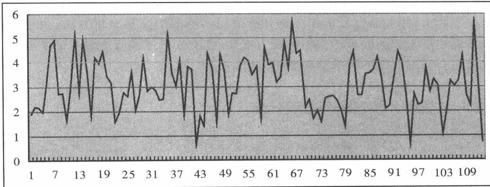
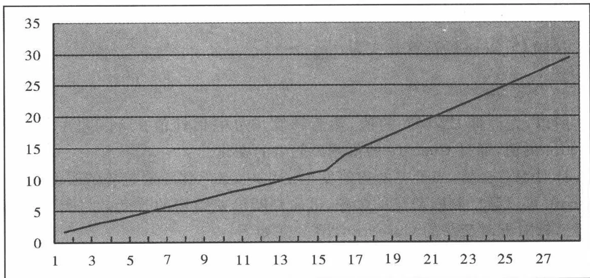
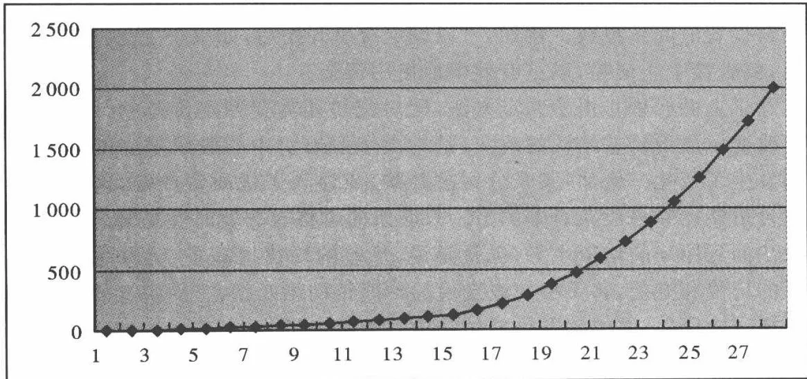

# [第11章](ch11.md) 配对交易

## 11.1 历史

配对交易起源于20世纪80年代中期。摩根斯坦利的宽客(quant)Nun-zio Tartaglia召集了一批物理学家、数学家和计算机科学家，利用数量方法去发现股票市场的套利机会。他们采用复杂的统计方法建立了自动化交易系统，以数量化指标代替交易员的经验判断，发展了一系列的数量化交易方法，其中之一就是配对交易。1987年，他们利用配对交易为摩根斯坦利创造了5000万美元的利润。但不幸的是，在经历了两年损失之后，该团队最终解散了，但配对交易的方法却在华尔街流传开来。实际上，根据Thorp(2003)的记载，摩根斯坦利的Garry Bamberger才是配对交易的真正发现者。但由于感觉公司没有给予相应的报酬，他于1985年离开了摩根斯坦利，加入了Thorp的公司。

## 11.2 数学基础

### 11.2.1 基本统计知识

平均值是一组数据的平均状态,分为算数平均值和几何平均值。算数平均值是用数据的和除以数据的个数。计算公式如下,后面有关的数学描述均

以 $x_{t}$ 表示 $t$ 时刻数据的值：

$$
\overline{{{X}}} = \frac{\sum x}{n} = \frac{x_{1} + x_{2} + \cdots + x_{n}}{n}
$$

几何平均值是数据乘积的数据个数次方,计算公式如下:

$$
\overline{{{X}}} = \sqrt [ n ]{x_{1} \cdot x_{2} \cdot \dots \cdot x_{n}}
$$

方差是用来衡量数据离散程度的数据,计算公式如下:

$$
s^{2} = \frac{\sum (x - \overline{{{{x}}}}) ^{2}}{n - 1}
$$

标准差是方差的平方根,计算公式如下:

$$
s = \sqrt{\frac{\sum (x - \overline{{{x}}}) ^{2}}{n - 1}}
$$

正态分布是所有分布中最常见、使用最广泛的分布。在工业和商业中，许多变量都服从正态分布。由机器生产的绝大多数产品也服从正态分布。误差正态曲线的发现，通常归功于数学家高斯，他认为对物体反复测量的误差通常呈正态分布。因此，正态分布有时也称作高斯分布或误差正态曲线。正态分布具有以下性质：

1. 它是一种连续型概率分布。

2. 它关于均值对称。

3. 它以横轴为渐近线。

4. 它为单峰分布。

5. 它是一簇曲线。

6. 曲线下的面积为 1。

正态分布是对称的。以均值为中心，左右两边相互对称。由于对称性，两侧的概率值相等。有时正态曲线也被称作钟形曲线。它是单峰曲线，因为所有的值只在曲线中心聚集。正态分布实际上是一簇曲线。每组不同的均值和标准差对应着一条不同的正态曲线。而且任一正态曲线下的总面积都为1。曲线下的面积表示概率，所以一个正态分布所有概率和等于1。此外，由于正态分布是对称的，所以均值每一侧的面积都等于0.5。

正态分布可由两个参数予以描述:均值和标准差。每组均值和标准差确定了一个正态分布。正态分布的概率密度函数为：

$$
f (x) = \frac{1}{\sigma \sqrt{2 \pi}} \mathrm{e} ^{- \frac{(x - \overline{{{x}}}) ^{2}}{2 \sigma^{2}}}
$$

对于正态分布,偏离均值小于一个标准差的概率为 68%,偏离均值小于两个标准差的概率为 95%,偏离均值小于三个标准差的概率为 99.7%。

### 11.2.2 平滑技术

利用一些技术可以对平稳的或不包含明显趋势、周期性或季节性的时间序列数据进行预测。这些技术被称为平滑技术，原因在于这些技术得到预测值的基本原理是将时间序列数据中的不规则波动效应“平滑”掉。这包括平均模型和指数平滑模型。

1. 平均模型。平均模型由简到繁分为三种: 简单平均、移动平均和加权移动平均。

1. 简单平均。最基本的平均模型是简单平均模型。在这个模型中,第 $t$ 期的预测值等于给定的前若干期数值的平均值,公式如下:

$$
F_{t} = \frac{x_{t - 1} + x_{t - 2} + \cdots + x_{t - n}}{n}
$$

2. 移动平均(MA)。移动平均数是一个对每一个所考察的新时期都进行更新或重新计算的平均数。每个移动平均数都利用了最新的信息。公式与简单平均相同,只是数据是更新后的数据。但移动平均有以下缺点:①难以选择计算移动平均数的最优步长。②移动平均数并不总是能够根据诸如趋势、周期或季节性等时间序列效应做出调整。为了确定计算移动平均数的最优步长,需要根据几种不同的步长进行预测,然后比较相应的误差。

3. 加权移动平均(WMA)。预测者可能希望对某些时期的数据赋予比其他数值更高的权数。如果某些时期得到的权数不同于其他时期的权数,则移动平均称为加权移动平均。计算公式如下:

$$
F_{t} = \frac{w_{t - 1} x_{t - 1} + w_{t - 2} x_{t - 2} + \cdots + w_{t - n} x_{t - n}}{\sum_{i = t - n} ^{i = t - 1} w_{i}}
$$

其中 $w_{i}$ 为赋予该时期数值的权重。

2. 指数平滑模型(EWMA)。采用指数平滑方法进行预测时,对以前时期数据的加权方法是重要性依指数形式递减。指数平滑方法是:将当前时期的实际值 $x_{t}$ 乘以一个介于 0\~1 之间的数值,该数值称为 $\alpha$ ,将当前时期的预测值 $F_{t}$ 乘以 $(1 - \alpha)$ ，然后把两个乘积相加。计算公式如下：

$$
F_{t + 1} = \alpha X_{t} + (1 - \alpha) F_{t}
$$

$\alpha$ 的数值由预测者自己确定。这个程序的实质在于新的预测值是当前预测值和当前实际值的组合。如果选择的 $\alpha$ 小于0.5，则对实际值赋予的权重小于对预测值的权重。如果选择的 $\alpha$ 大于0.5，则对实际值赋予的权重大于对预测值的权重。

### 11.2.3 平稳时间序列

平稳过程:对于随机过程 $\{x_{t}:t=1,2,\cdots\}$ ，如果对于每一个时间指标集1 $\leqslant t_{1}<t_{2}<\cdots<t_{m}$ 和任意 $h\geqslant1$ 的整数， $(x_{t_{1}},x_{t_{2}},\cdots,x_{t_{m}})$ 的联合分布都与 $(x_{t_{1}+h},x_{t_{2}+h},\cdots,x_{t_{m}+h})$ 的联合分布相同，那么这个随机过程就是平稳的。

协整理论: 如果 $\{y_{t}: t=0,1,\cdots\}$ 和 $\{x_{t}: t=0,1,\cdots\}$ 是两个 I(1) 过程, 则一般来说, 对于任意 $\beta, y_{t}-\beta x_{t}$ 都是 I(1) 过程。但在某些情况下, 存在不为 0 的 $\beta$ , 使得 $y_{t}-\beta x_{t}$ 有可能为 I(0)。也就是说, 这一差值有固定均值、固定方差和仅取决于序列中任意两个变量之间时间间隔的自相关。如果存在该 $\beta$ 值, 则称 $y_{t}$ 和 $x_{t}$ 是协整的。在实际使用时, $\beta$ 往往不能提前知道。所以先采用回归方法对 $\beta$ 进行估计。回归采用式:

$$
y_{t} = \hat{\alpha} + \hat{\beta} x_{t}
$$

$\hat{\beta}$ 是 $\beta$ 的估计。进行上述回归后，可得到残差 $\hat{u}_t = y_t - \hat{\alpha} - \hat{\beta} x_t$ 。对残差进行DF和增广DF检验，如果能够拒绝存在单位根的假设，就可以支持I(0)的假设，只是这时的检验要考虑到 $\beta$ 是估计值。如果得到支持I(0)的假设，就可认为 $y_{t}$ 和 $x_{t}$ 是协整的。

## 11.3 配对交易方法

### 11.3.1 基本概念

在存在做空机制的情况下,投资股票市场从本质上讲,就是买入低估的股票,卖出高估的股票。但在无法准确估计股票价值的时候,很难分清哪只股票是低估的,哪只股票是高估的。配对交易选择规避这一问题,这种交易方法采用相对估值的方法。具体说来,选择两只类似的股票,则两只股票的价差应维持一个稳定数值。当价差偏离稳定值较远时,价差倾向于回归到稳定值。对于这一思想背后的理论基础存在两种观点:一是遵从 APT 理论。根据 APT 理论,当两只股票有几乎相同的风险因素时,则这两支股票的预期回报应该大致相同,所以由噪音或个别事件引起的回报偏差最终会消失;另一种观点认为,这一现象是基于资金的轮动。这一观点认为,资金在相似的股票间是轮动的,当一只股票相对于一只相似的股票价格上涨过大,则资金持有者会认为上涨的股票相对被高估,因此会抛售上涨的股票并购买相对价格较低的相似股票,使得价差回归稳定数值。

利用这一思想, 就可以在价差偏离稳定数值较远时, 卖出价格相对高的股票, 买入价格相对低的股票, 以在价差回复到稳定数值时平仓获利。下面的部分将详细讲解配对交易的整个操作过程。概括说来, 配对交易大致需要三个步骤:

1. 选择合适的股票对。这一步骤可以采用两种方法:一是股票的基本面分析,或者采用纯粹的统计分析方法。多数情况下是两种方法综合使用。

2. 在选择了合适的股票对之后,采用后面将要介绍的不同的统计方法,分析历史数据,得到不同方法需要的参数。

3. 得到所需参数后决定交易的起始和中止点、止损位置和交易时间。

后面的章节将按这一顺序逐一介绍每一步骤的详细内容。

### 11.3.2 基本术语

做空:指借入股票并在市场中将其卖出,平仓时从市场中买回相同数量的该股票,并将其归还借出者。做空与做多完全相反,它是在所做空股票的下跌过程中获利的。例如,股票 A 现价 30 元,甲借入该只股票 100 股,并将其在市场中卖出,获得资金 3000 元。一段时间后,A 下跌到 25 元,甲平仓,从市场中以 25 元买入股票 A 100 股归还给 A 的借出者,花费 2500 元。这样,甲从市场下跌中获利 3000-2500=500 元。同样,如果平仓前 A 涨到 35 元,则甲需要花费 3500 元买回 A 归还借出者,因此甲在股票上涨时亏损 3500-3000=500 元。借出股票往往有时间或流动性的限制,所以做空往往不能像做多那样长期持有,并且常常有保证金的限制。因此做空与做多并不完全对等。

价差:是指配对的两只股票同一时刻的价格差值,其值可正可负。

市值:一个公司所有股票的市场价值。也就是用该公司股价乘以该公司在外发行的股票数目。

流动性:流动性是指交易活动的水平,它决定了买卖的容易程度和市场冲击成本的大小。具有流动性的证券,交易活动很活跃,执行交易的买卖价差很低。而非流动性的证券,交易活动很少,买卖价差很高,市场冲击成本较大。

市净率:用一个公司的证券市场市值除以其账面价值所得到的比率。也可以用每股市值除以每股账面价值而得到。该指标是一个测量证券价格便宜度和证券价值评估的比率。低市净率的股票一般认为是便宜的、有价值的股票。

市盈率:用公司的证券市场市值除以公司的利润得到的比率。

无风险利率:指一个无风险资产带来的收益率,一般指国债的利率。它是一个所有投资者都期望可以得到的基本收益率。根据现代资产组合理论和资本资产定价模型,超过无风险利率的收益率只能通过承担市场风险来获得。

有效市场理论:认为证券市场已经将所有的信息置于价格之中,因此对公开所得的信息进行分析,不能产生额外的收益。

随机游走:金融理论的经典假设,认为股票的收益率之间彼此独立,并符合正态分布。也是有效市场理论的必然结果。

### 11.3.3 股票对的选择

单纯采用统计分析方法很难确定所需的股票对,这并不是因为统计方法没有效果,主要是因为所要分析的股票对太多,计算量过大,难以全部采用统计分析进行覆盖。举例来说,假设股市中有1500只股票,则采用纯统计分析方法,需要分析的股票对将有1124250个,这样将耗费大量的时间。所以,股票对的选择一般先采用基本面的分析。

经验地看,处于同一板块的股票,往往有较大的相关性。所以,在选择股票对时,优先选择同一板块的股票。在此基础上,在板块股票之间进行统计分析,这样可以大大减少所要分析的股票对数。

统计分析的主要方法包括相关系数的计算或协整分析。相关系数的计算前面的数学基础部分已经介绍过了,这里不做赘述。对所选择的板块内的股票,每两只股票计算其相关系数。设定一个门槛值,相关系数高于此门槛值时,将此股票对加入进一步分析的范围。协整分析前面也已介绍过,这里谈一下针对股票对的使用方法。

理论上,股票价格的收益率符合随机游走。这一假定已被广泛用于期权定价理论。但随机游走是非稳序列,所以,我们的目的是要找到一对合适的股票对,如果这对股票价格的对数序列是协整的,那么它们的价差就是平稳序列,就可以进一步采用配对交易的策略。因此,对于同一板块的股票,可以对每一对股票价格的对数采用协整分析,如果价差通过平稳性检验,则将此股票对加入进一步分析的范围。

实际上,相关系数分析和协整分析适用于不同的交易分析方法。相关系数分析适用于较为简单的交易分析方法1,协整分析适用于交易分析方法2。后面将会详细介绍不同的交易分析方法。

### 11.3.4 交易分析方法和参数计算

目前,配对交易大致存在两种主要的交易分析方法。按数学工具的从易到难列述如下:

#### 1. 简单交易法

简单交易法只需很少的数学工具。简单交易法认为，一对匹配较好的股票对的每日价差符合正态分布。选择股票对时只计算相关系数，不需协整检验。判断可用股票对时经验的作用大于数学工具的使用。一些完整的操作例子可参见 Whistler(2004)。简单交易法的思路很简单，既然假设股票对的每日价差符合正态分布，那么就可以通过历史数据计算该股票对的均值和方差。有了均值和方差，就可以用来设计交易了。如图 11.1 所示，这是一个平稳序列，序列中的每一点都符合均值为 3，标准差为 1 的正态分布。图中明显标出了一个标准差和两个标准差的位置。从图中可以看出，如果在高于均值两个标准差的位置采用价差卖出的方法，则当价差回归均值时，可以获得两个标准差的利润。同样，在低于均值两个标准差的位置采用价差买入的方法，当价差回归均值时，同样可以获得两个标准差的利润。

一个合理的问题是:为什么采用两个标准差?原因在于事件发生的概率。根据正态分布的理论,偏离均值小于一个标准差的概率为68%,偏离均值小于两个标准差的概率为95%。也就是说,偏离均值超过两个标准差的事件发生的概率只有5%。这样,存在两个好处:一是在建立头寸后,发生亏损的概率只有5%,有效地控制了风险;另一个好处是保证了交易的频度,如果把交易的门槛定得高于两个标准差,虽然亏损的概率更小,但交易的次数也会大大下降,这样做的结果就是,大多数时间没有交易,不足以弥补资金的机会成本。

当然两个标准差只是一个经验的数值,没有较好的理论证明其是最好的交易门槛。更优的交易门槛的选择会用到更为复杂的方法。对于简单交易法,往往采用两个标准差加上交易员的经验判断,经验往往占主要地位。

简单概括简单交易法的交易思想就是: 当价差偏离均值达到两个标准差时买入或卖出价差(依偏离方向而定), 当价差回归均值时平仓。

图11.1 符合正态分布的平稳序列

#### 2. 基于协整的交易法

正如前面所述,协整交易法基于随机游走的假设。这符合有效市场理论(EMH),认为股票价格的收益率符合布朗运动。如果能够找到协整的股票对则它们的对数价差是一个平稳序列,基于此,就可以设计交易方法。

假设有两只股票 A、B，其价格为 $P_{A}$ 、 $P_{B}$ ，价格对数为 $\ln P_{A}$ 、 $\ln P_{B}$ ，则其协整回归（cointegrating regression）为：

$$
\ln (P_{t} ^{A}) - \gamma \ln (P_{t} ^{B}) = \mu + \varepsilon_{t}
$$

其中 $\gamma$ 为协整系数, $\mu$ 类似于价差均值, $\varepsilon_{t}$ 为残差, 是通过平稳性检验的平稳序列。这样, 股票 A 和 B 就可以采用基于协整的交易方法。其思路是: 如果 A 和 B 是协整的, 那么买入一股 A 同时卖出 $\gamma$ 股 B, 在 $t_{1}$ 和 $t_{2}$ 时的情况为:

$$
\begin{array}{l} \ln (P_{t_{1}} ^{A}) - \gamma \ln (P_{t_{1}} ^{B}) = \mu + \varepsilon_{t_{1}} \\ \ln (P_{t_{2}} ^{A}) - \gamma \ln (P_{t_{2}} ^{B}) = \mu + \varepsilon_{t_{2}} \end{array}
$$

两式相减得：

$$
\ln \left(\frac{P_{t_{2}} ^{A}}{P_{t_{1}} ^{A}}\right) - \gamma \ln \left(\frac{P_{t_{2}} ^{B}}{P_{t_{1}} ^{B}}\right) = \varepsilon_{t_{2}} - \varepsilon_{t_{1}}
$$

由上式可以看出, 左面恰为头寸在 $t_1$ 和 $t_2$ 间的获利或亏损情况, 右边为两个残差的差值。因为作为交易规则, 残差值 $\varepsilon_{t_1}$ 和 $\varepsilon_{t_2}$ 的值是由投资者选择的, 所以通过选择适当的门槛残差值, 可以使得收益不为 0 (如果收益为负, 就采用反向头寸, 即卖出一手 A, 买入 $\gamma$ 手 B)。这样类似于简单交易法, 价差偏离均值超过门槛时, 进行价差买入或卖出 (与偏离方向有关), 当价差回归均值或达到其他门槛值时平仓。之所以可以采用这样的交易方法是因为, 通过协整检验的股票对 A 和 B, 其按照上面方法建立的头寸是平稳序列, 拥有均值回归的性质。其值在均值附近的一个区间内震动, 所以存在着从门槛值向均值的回归。所以关键是获得 $\gamma$ 和 $\mu$ 并确定门槛。

实际操作时,采用股票 A 和 B 的历史数据进行回归,即可得出 $\gamma$ 和 $\mu$ 数值。因此,该方法的难点在于确定门槛值。一般认为平稳序列 $\varepsilon_{t}$ 符合正态分布,所以门槛往往采用偏离均值一倍或两倍标准差。方差可以通过 $\varepsilon_{t}$ 的历史数据计算。当然,也不一定采用整倍方差,也可对历史数据进行检测。采用不同的门槛,根据历史数据计算不同的总利润值,然后比较不同门槛所获利润的大小,得到能获得利润最大的门槛值。可采用此门槛值进行交易。但这样使得交易过于依赖历史数据,如果现实数据和历史数据的性质有较大差别,则这样选择的门槛值可能大大影响交易系统的获利能力。

### 11.3.5 具体交易细节的设计

不论采用哪种交易分析方法,交易细节的设计都是类似的。首先,对于选择好的股票对,根据历史数据计算出价差的均值和方差(简单交易法),或通过回归计算 $\gamma$ 和 $\mu$ (基于协整的交易法)。然后确定交易门槛值,相关的方法已经介绍过了。确定了门槛值之后,根据门槛值决定何时开始交易。但对于何时结束交易,观点不一。大致分为三种观点:

1. 在门槛值处开始交易，在回归均值处停止交易。

2. 在门槛值处开始交易, 当达到反向的门槛值时停止交易。同时开始另一次交易。

3. 在门槛值处开始交易, 当回归均值时停止交易。同时开始另一次交易, 在价差达到门槛值时停止交易, 并开始新的交易。

三种方式很难说哪一种更好,这必须在交易频率和单笔获利之间做出权衡。从单笔获利上看,第二种方法的单笔获利最高,第一和第三种方法相同。但第二种方法开始交易后,停止交易的时间明显长于另外两种方法,因为必须先回归均值,才有可能达到反向的门槛。但这样就增加了资金使用的机会成本,其总盈利能力未必胜过其余两种方法。第三种方法的交易频率高于第一种方法,其是一种连续交易的方法。但该种方法亦存在机会成本问题。因为达到门槛的频率不能过高,否则门槛会被设置得过小。这样一方面会使单笔获利过小,未必能弥补交易费用;另一方面也使得价差向不利于头寸的方向移动的可能性增加,增加了交易的风险。因此设置的门槛值一般需要经历较长时间才能达到,而根据第三种方法,这段时间资金被用于配对交易,获利未必会弥补资金的机会成本。

除了上面三种结束交易的方法,配对交易还必须有止损条件。这是因为:第一,无法保证交易结束的目标一定会达到,即无法保证价差会回归均值或达到反向门槛值。比如两只汽车制造公司的股票,某天其中一家公司的股票价格大幅下跌,使得价差偏离均值达到门槛值,根据交易方法的设定,交易开始。但最终股价下跌的公司被破产摘牌,这样价差将永远无法回复到均值,交易会面临巨大损失。

第二,即使价差最终会回到均值,如果回到均值前,价差变动方向不利于交易头寸程度过深,交易也会被迫中止。例如,公司A股价为10元,公司B股价为5元,价差均值为3元,标准差为1元。这样,价差偏离均值2元,达到两倍标准差,交易被触发,卖出一股A,并买入一股B。但如果一段时间后,A由于被收购,股价涨到20元,B的股价保持不变,则A股的损失将达100%,会被追加保证金。如果交易者没有足够的资金追加保证金,A股的头寸将被迫平仓。这样即使最终价差回归均值,交易还是会有很大损失。实际上,后面[第十五章](ch15.md)将要提到的长期资本管理公司就是因为不利头寸损失过大,无力追加保证金才面临危机的,最终,没有撑到头寸获利。

第三,交易的时间长度也是必须要考虑的。即使没有发生前面说的头寸不利情况,但如果交易开始时间过长而没有盈利,资金的使用成本压力增大,也会迫使交易决策者被迫中止交易。

所以,基于上面三个原因,在上面提及的三种交易判定方法之外,必须设定止损条件。止损条件一般分为不利方向止损和交易时间止损。由于各种投资者或交易员的资金成本和抗压能力不同,并没有最优的止损方法。这里只是提出止损的思想。

首先是不利方向止损,由于前面提到的原因,价差向不利方向移动导致损失是非常可能的,所以要根据投资者能够承受资金损失的能力,设定不利方向的止损线。例如,以一倍标准差为门槛,以两倍标准差为止损线。这样,当价差偏离均值一倍标准差时触发交易,但当价差偏离均值达到两倍标准差时触发止损线,不管将来价差是否会回归均值,交易都立刻被终止。

然后是时间止损。这取决于投资者的资金使用成本和投资机会。如果投资者的其他投资机会较少且资本使用成本较低，配对交易的单次持续时间就可以长些，反之则持续时间较短。因此，根据投资者的资金使用时间限制对配对交易设置时间止损线。例如，可以设定交易开始后，如果一个星期交易未被中止，就直接中止交易，以更有效率地使用资金。

除了上面两种止损的判定方法,配对交易还需要判定价差的结构是否发生了改变。所谓价差结构的改变,是指由于股票对中的股票对应的公司的基本面发生了变化。例如,某个公司被并购,或注入了优质资产等,这样该公司的股价可能比原来股票对中的另一只股票的价格有非暂时性提升。价差将可能无法回到原来的均值水平,也就是说,价差的均值提高了。因此,应用原来计算的均值和方差,将无法与改变后的价差结构相匹配,交易模型的模型风险大大提升。所以,需要判断价差的结构是否发生了改变。

这里采用 Cuscore 方法来帮助判定结构的改变。Cuscore 计算以下指标：

$$
Q = \sum (y_{t} - \beta t) t
$$

其中 $y_{t}$ 是 t 时刻的观测值, t 代表时间, $\beta$ 是斜率系数。为了说明 Cuscore 的应用, 我们举下面的例子。有一条由两条斜率不同的直线组成的折线, 一条斜率为 0.7, 另一条为 1.3, 如图 11.2 所示。从图中可以看出, 虽然斜率从 0.7变到 1.3, 增加近 50%, 但直接观测却并不明显。不容易辨别趋势的改变。图 11.3 是同样数据的 Cuscore 的图, 从图中可以看出, 在趋势变化时, Cuscore 的变化比数据本身的变化明显得多。因此, 可以用 Cuscore 来帮助检验趋势的变化, 以对变化作出更快的反应。

图11.2 斜率的改变

图11.3 Cuscore图

实际应用中,由于斜率系数 $\beta$ 并不已知,需要使用历史数据进行估计。由于股票价格数据的连续性比较差,经常使用股票价格的 EWMA 数值估算斜率系数 $\beta$ 。EWMA 的算法前面已经提及,这里不再赘述。 $\beta$ 的常用估计式为:

$$
\hat{\beta} = 0. 25 (E W M A_{t} - E W M A_{t - 4})
$$

这样 Cuscore 的计算式变为：

$$
Q = \sum (y_{t} - \hat{\beta} _{t} t) t
$$

所以,先计算 EWMA 的值,然后计算出 $\beta$ 的估计值 $\hat{\beta}$ ,利用上式计算出 Cuscore 的值,通过 Cuscore 的值判断趋势的变化。

针对配对交易,当价差的均值发生变化时,必然伴随着趋势的改变。利用Cuscore可以帮助判断趋势的改变,进而判断价差结构的改变,以便设计止损位置。针对配对交易的Cuscore计算公式如下:

$$
Q = \sum (\mathrm{spread} _{t} - \hat{\beta} _{t} t) t
$$

最后,为了保证参数符合数据的变化,采用历史数据计算的均值、方差、 $\gamma$ 和 $\mu$ 等需要定期或随时根据新的数据进行调整。例如,参数是通过近两个月的历史数据计算得出的,则可以把最新的数据加入其中,将最早的数据剔除,这样使数据随时间向前滚动。这在价差结构发生变化时尤其重要,因为结构变化了,意味着均值、方差等参数发生了较大变化,历史数据无法表征这一变化,新的数据就显得格外重要。

为避免混乱,这里将这些细节总结如下:

1. 交易开始和结束的条件设计, 包括三种方式。

2. 不利方向止损和交易时间止损。

3. 利用 Cuscore 来判断价差结构的变化。

4. 数据滚动计算参数。

## 11.4 思路的扩展

上面只是配对交易最基础的方法和思路,实际上,配对交易可以进行多方面的扩展。本节介绍一些思路上的扩展。

### 11.4.1 交易内容的扩展

上面介绍的都是针对股票交易的配对交易,其实,配对交易并不局限于股票交易。商品期货、外汇、指数都可进行配对交易。只要两个交易对象存在较好的相关性或符合协整条件,都可进行配对交易。实际上,期货和外汇市场的做空较股票市场更加容易,更便于进行配对交易。例如,在外汇市场上,澳大利亚元兑美元的汇率和新西兰元兑美元的汇率的相关性就非常高。同时澳大利亚元兑美元的汇率和黄金期货的价格的相关系数高达0.8,这些都可能是配对交易的目标交易对。

### 11.4.2 交易数量的扩展

配对交易也不限于只交易两只股票。实际上，从本质上讲，配对交易就是相信，相对于被卖出的股票，买入的股票表现要相对地好一些，体现的是相对价值的思想。因此，只要是存在相对价值的强弱差别，都可以采用配对交易的方法。Whistler(2004)就描述了三只股票的配对交易，卖出两只相对弱势的股票，买入一只相对强势的股票，当然，三只股票有很好的相关性。更深一步讲,配对交易只是市场中性策略的一个特例。市场中性策略涉及买入投资者认为相对强势的股票,卖出相对弱势的股票。这样,相较于只是采用买入策略的开放基金,市场中性策略利用相对价值的概念,可能可以降低组合的风险。实际上对冲基金最早出现时,就是采用市场中性策略的,这远早于配对交易的产生。所不同的是,配对交易更容易数量化,从而使交易更加系统化,而较少依赖于交易员的经验判断。股指期货出现后,市场中性策略又有了新的发展。投资者可以买入自己认为相对于股指更加强势的股票组合,同时卖出相应的股指期货;或者卖出自己认为相对于股指更加弱势的股票组合,同时买入相应的股指期货。关于股指期货的详细讨论见[第十四章](ch14.md)。

### 11.4.3 分析技术的发展

配对交易方法从发现到现在,经历了从简单到复杂的一系列技术上的发展。从简单的相关系数的计算,到协整的应用,再到随机过程,再到更复杂的神经网络、遗传算法、小波分析等。由于篇幅所限,这里不能详细探讨这些更新的技术,希望可以在后续的书中进行探讨。这里只想谈谈配对交易的改进方向。

1. 更有效地选择股票对。前面只是提到了选择股票对的最简单的方法。选择股票对是配对交易的前提,更有效地选择股票对可以大大提高交易效率。当面对全球市场时,庞大的股票数量使得对每只股票做基本分析变得极为困难。因此如何利用先进的算法更有效地选择股票对,是十分重要的问题。

2. 配对比例。协整方法比简单交易法改进的地方在于, 协整方法能够算出配对的比例 $\gamma$ , 而简单交易法往往采用一比一的比例。更高级的技术可以发现更好的配对比例, 以使配对后的结果更加便于操作。

3. 门槛值的选择。门槛值对于交易的盈利至关重要。门槛值过低,可能无法弥补交易成本;过高则减少交易次数,增加资金使用成本。这一点协整方法并没有好的解决方案。对于价差更加细致的建模包括 ARMA、GARCH、随机过程等等。

最后,复杂的数学技术不能保证一定可以改进交易结果。在设计交易系统时不能盲目相信复杂的数学工具用得越多,盈利能力就越强。正如摩根斯坦利研究部创始人巴顿·比格斯所说:“如果在华尔街有人告诉你,他发现了一个复杂的数学模型可以赚到大钱,最好离他远一点。”

[第十二章](ch12.md)

