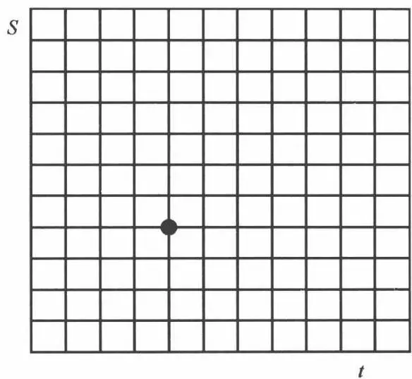

# [第12章](ch12.md) 可转换债券套利

## 12.1 可转换债券特征

所谓可转换债券,就是这样一种债券,其息票支付和归还本金的设计与一般债券一样,但它赋予债券购买人在一定时期,按一定比例,以一定价格将债券转换为股票的权利。有些可转换债券为了保证发行公司的利益,赋予发行公司在一定时间,以一定的价格赎回债券的权利。同时,也有些可转换债券为了保证购买人的利益,赋予债券购买人在一定时间,以一定价格将债券回售给该债券发行公司的权利。

最早的可转换债券出现于19世纪，是美国铁路公司为了吸引投资者而发行的。在那之后，可转换债券经历了一段空白的岁月，直至20世纪初，同样是由铁路公司重新开始发行。例如1901年，巴尔的摩到俄亥俄的铁路发行了1500万美元的可转换债券。同时，一些非铁路公司也开始发行可转换债券，例如，1906年AT&T发行了1.5亿美元的可转换债券。现代可转换债券市场形成于20世纪50年代的美国。那时，很多航空公司采用可转换债券来改善资本结构。因为可转换债券可以支付较少的利息，同时又避免了股权的稀释。到20世纪60年代，很多中小型企业开始发行可转换债券。这导致了人们普遍认为，可转换债券的评级不高。直到1984年，IBM发行了AAA级的可转换债券，才改变了人们的这一观念。在20世纪80年代末至90年代初，银行业由于监管需求的原因，开始发行可转换债券募集资本。到了90年代，高科技企业开始采用可转换债券。

最早量化可转换债券的并非 Black、Scholes 或 Merton，而是数学家 Thorp 和经济学家 Kassouf。在他们 1967 年的书籍《击败市场》(Beat the Market) 中，Thorp 和 Kassouf 第一次采用数学的观点分析可转换债券（当时还没有 Black-Scholes 公式）。两位作者首次将可转换债券分拆成债券和权证（当时尚没有期权），然后分别分析债券部分和权证部分，以辨别是否有套利机会。这奠定了现代可转换债券的复杂数学定价和套利方法的基础（不知为何没给两人诺贝尔奖）。同时，两人创立的权证和可转换债券基金收益也很好。

## 12.2 基本术语

可转换债券有一些较为复杂的条款,为了后面的叙述方便,这里将一些术语简单进行介绍。

到期日:到期日是可转换债券的发行者以票面值向债券购买者支付的时间。债券的到期日的范围很广,最长可达20年。最近,5到10年期的可转换债券逐渐开始流行。

息票:息票是可转换债券的利息,通常是固定利率和按固定日期支付的。该利率一般低于发行公司发行不可转换债券的利率。这主要是因为,可转换债券赋予了债券购买者将债券转换为标的股票的权利,这实际上是卖给了债券购买者一份看涨期权(通常为美式)。这样,债券购买者就需要减少获得的利息,以抵补期权费用。

转换比率: 转换比率是一张可转换债券转换为标的股票的数目。

转换价值:转换价值是任何时候,可转换债券可以转换成的股票的市场价值。它代表了可转换债券的最低价值,可转换债券的市场价格不能低于转换价值。否则,套利者就可以以低于转换价值的价格买入可转换债券,将其转换为标的股票,然后卖出股票获得转换价值。实际上仍有一些可转换债券的价格低于转换价值。这是因为,在购买可转换债券到转换为标的股票并卖出之间存在时滞。也就是说,在一些市场,买入可转换债券进行转换后,不能立刻获得标的股票,从而在市场上卖出。这样,从买入可转换债券到卖出标的股票之间,股票价格可能发生变化,使得股票价值可能低于买入时的转换价值,套利存在风险。因此,在这些市场,可能可转换债券的价格相对转换价值存在一个折价,以弥补套利者的持有风险。标的股票的波动率越大,折价就越高。在一些新兴市场,这一折价可能达到10%\~30%。

溢价: 溢价是可转换债券的市场价格高于转换价值部分, 以相对于转换价值的百分比衡量。投资者愿意支付一个高于转换价值的溢价, 主要是因为可转换债券为投资者提供了下跌风险的保护, 并且一般可以获得高于股利的利息收入。

债券下限(bond floor): 债券下限是指, 将可转换债券看成普通的公司债券, 按照折现的方法, 将息票和本金按照 LIBOR 加信用风险利差折成现值所得的值。这一价值代表了可转换债券的最低价值, 它衡量了没有其他特征的债券部分的价值。要获得债券下限, 需要知道利率和发行公司的信用利差。信用利差是指发行公司发行普通债券要支付的利率与无风险利率的差值。利差越大, 公司的违约风险越高。

回购条款: 回购条款是指发行人有权利在可转换债券到期日前按照约定的赎回价格在约定的赎回期将可转换债券提前赎回。由于, 提前赎回权利的存在, 约定的赎回价格一般要高于可转换债券的票面价值。

回售条款: 回售条款是指投资人有权利在可转换债券到期日前按照约定的价格在约定的回售期将可转换债券提前卖回给发行人。约定的回售价格一般等于或略低于可转换债券的票面价值。

## 12.3 可转债定价

可转换债券作为一种复杂的衍生品,其定价根据发行条款的不同,会有着不同的复杂程度。最简单的可转换债券,可以看成一份看涨期权加一份普通的债券。而复杂的情况时,则无法给出解析的解,只能通过数值解法,有时甚至数值解法都很难得到有效的价格。本节先简单介绍一般期权定价的基础Black-Scholes公式,然后由易到难介绍可转换债券的一些定价方法。由于不是单纯讲可转换债券的书,所以我们在此没有考虑更复杂的信用风险,所介绍的方法也不是最前沿、最复杂的方法,因为那样将涉及很复杂的衍生品定价知识,导致偏离主题。

### 12.3.1 Black-Scholes 公式

由于本书主要探讨套利方法,所以不打算详细介绍 Black-Scholes 公式。为了后面可转换债券公式的推导,这里只给出 Black-Scholes 的简单推导。

考虑一个期权与标的股票的组合, 设其价值为 $\Pi$ , 期权价格为 $V(S, t)$ , 标的股票价格为 $S$ , 时间为 $t$ 。组合构成为买入一手期权, 卖出 $\Delta$ 手标的股票, 组合的总价值为:

$$
\prod = V (S, t) - \Delta S
$$

假设股票价格服从对数正态随机游走：

$$
\mathrm{d} S = \mu S \mathrm{d} t + \sigma S \mathrm{d} X
$$

则经过 dt 的时间, 组合价值改变:

$$
\mathrm{d} \prod = \mathrm{d} V - \Delta \mathrm{d} S
$$

根据伊藤引理，

$$
\mathrm{d} V = \frac{\partial V}{\partial t} \mathrm{d} t + \frac{\partial V}{\partial S} \mathrm{d} S + \frac{1}{2} \sigma^{2} S^{2} \frac{\partial^{2} V}{\partial S^{2}} \mathrm{d} t
$$

带入组合价值改变的公式得：

$$
\mathrm{d} \prod = \frac{\partial V}{\partial t} \mathrm{d} t + \frac{\partial V}{\partial S} \mathrm{d} S + \frac{1}{2} \sigma^{2} S^{2} \frac{\partial^{2} V}{\partial S^{2}} \mathrm{d} t - \Delta \mathrm{d} S
$$

如果令 $\Delta = \frac{\partial V}{\partial S}$ ，则上式变为：

$$
\mathrm{d} \prod = \frac{\partial V}{\partial t} \mathrm{d} t + \frac{1}{2} \sigma^{2} S^{2} \frac{\partial^{2} V}{\partial S^{2}} \mathrm{d} t
$$

由上式可见, $d \prod$ 中不存在随机项,根据无套利假设,此时组合价值的改变只能按照无风险利率变化,即 $d \prod = r \prod dt$ ,其中r为无风险利率。代入上式并整理得:

$$
\frac{\partial V}{\partial t} + \frac{1}{2} \sigma^{2} S^{2} \frac{\partial^{2} V}{\partial S^{2}} + r S \frac{\partial V}{\partial S} - r V = 0
$$

此为 Black-Scholes 方程。根据不同的边界条件,可以计算不同种类期权的值。

为了方便后面讨论,简单介绍一下希腊字母(Greeks)。希腊字母是一系列的微分,包括 delta、gamma、vega、theta 等。本节只简单介绍前两个希腊字母 delta 和 gamma。

Delta 是期权或可转换债券的价值对标的股票价格的微分,衡量的是期权

或可转换债券的价格对标的股票价格变化的敏感性。

$$
\Delta = \frac{\partial V}{\partial S}
$$

Delta 不仅仅是一个微分, 而是有着非常实际的意义。从前面的 Black-Scholes 公式的推导可以看出, delta 的选择使得整个组合没有风险。换句话说, 通过卖空 delta 手标的股票, 在所考虑的极短的时期, 整个组合等价于无风险资产。实际中, 交易员卖出一手期权后, 往往会买入 delta 手标的股票来对冲风险, 使得整个组合头寸没有风险。这通常也叫作 delta 中性策略。当然, 要想完全消除组合的风险, 按照 Black-Scholes 公式的要求, 交易员就需要连续地进行对冲, 也就是根据 delta 的不断变化, 不停地买卖标的股票。但实际中这是不可能做到的, 买卖不可能连续。如果考虑到交易成本, 连续的买卖造成的交易成本几乎是无限大的。所以, 实际中交易员是间断对冲的。

Gamma 是期权或可转换债券的价格对标的股票价格的二阶微分,衡量的是 delta 对标的股票价格变化的敏感性。

$$
\Gamma = \frac{\partial^{2} V}{\partial S^{2}}
$$

Gamma 决定的是, 当标的股票价格发生改变时, 为了维持 delta 中性, 需要买入或卖出的标的股票的数量。由于实际中无法连续对冲, gamma 的大小影响对冲的频率。如果 gamma 较大, 那随着标的股票价格的变化, delta 的变化就很大, 就需要频繁买卖标的股票。如果 gamma 很小, 甚至接近于 0, 那么 delta 就几乎和标的股票价格的变化无关, 这样就不需要频繁地买卖标的股票。实际中也有采用买卖其他类型的期权以达到使组合的 gamma 为 0 的策略, 称为 gamma 中性策略。

### 12.3.2 利率期限结构

由于可转换债券的存续时间一般较长,所以相关的无风险利率一般不能视为常量。因此往往将利率也认为是随机的。一般的,设利率服从:

$$
\mathrm{d} r = u (r, t) \mathrm{d} t + w (r, t) \mathrm{d} X
$$

设想有两种到期日不同的债券,价格为 $V_{1}$ 和 $V_{2}$ 。组合为买入一手债券 1,同时卖空 $\Delta$ 手债券 2,于是组合的价值为:

$$
\prod = V_{1} - \Delta V_{2}
$$

则组合的变化量为：

$$
\mathrm{d} \prod = \frac{\partial V_{1}}{\partial t} \mathrm{d} t + \frac{\partial V_{1}}{\partial r} \mathrm{d} r + \frac{1}{2} w^{2} \frac{\partial^{2} V_{1}}{\partial r^{2}} \mathrm{d} t - \Delta \left(\frac{\partial V_{2}}{\partial t} \mathrm{d} t + \frac{\partial V_{2}}{\partial r} \mathrm{d} r + \frac{1}{2} w^{2} \frac{\partial^{2} V_{2}}{\partial r^{2}} \mathrm{d} t\right)
$$

为消除随机项,取

$$
\Delta = \frac{\partial V_{1}}{\partial r} / \frac{\partial V_{2}}{\partial r}
$$

于是,组合的价值应按无风险利率变化,即:

$$
\begin{array}{r l} r \prod \mathrm{d} t & = r \left(V_{1} - \left(\frac{\partial V_{1}}{\partial r} / \frac{\partial V_{2}}{\partial r}\right) V_{2}\right) \mathrm{d} t \\ & = \left[ \frac{\partial V_{1}}{\partial t} + \frac{1}{2} w^{2} \frac{\partial^{2} V_{1}}{\partial r^{2}} - \left(\frac{\partial V_{1}}{\partial r} / \frac{\partial V_{2}}{\partial r}\right) \left(\frac{\partial V_{2}}{\partial t} + \frac{1}{2} w^{2} \frac{\partial^{2} V_{2}}{\partial r^{2}}\right) \right] \mathrm{d} t \end{array}
$$

将 $V_{1}$ 和 $V_{2}$ 的项放到等号的两边, 可得:

$$
\frac{\frac{\partial V_{1}}{\partial t} + \frac{1}{2} w^{2} \frac{\partial^{2} V_{1}}{\partial r^{2}} - r V_{1}}{\frac{\partial V_{1}}{\partial r}} = \frac{\frac{\partial V_{2}}{\partial t} + \frac{1}{2} w^{2} \frac{\partial^{2} V_{2}}{\partial r^{2}} - r V_{2}}{\frac{\partial V_{2}}{\partial r}}
$$

由上式可以看到,等式左边只与债券1有关,等式右边只与债券2有关,所以,等式的两边一定都是等于一个与债券到期日无关的函数,于是:

$$
\frac{\frac{\partial V}{\partial t} + \frac{1}{2} w^{2} \frac{\partial^{2} V}{\partial r^{2}} - r V}{\frac{\partial V}{\partial r}} = a (r, t)
$$

为方便起见，设 $a(r,t) = w(r,t)\lambda (r,t) - u(r,t)$ ，则方程变为：

$$
\frac{\partial V}{\partial t} + \frac{1}{2} w^{2} \frac{\partial^{2} V}{\partial r^{2}} + (u - \lambda w) \frac{\partial V}{\partial r} - r V = 0
$$

则债券的价格可由 u 和 w 的具体函数形式确定。

下面解释一下 $\lambda$ 的含义。单一债券的变化量为

$$
\mathrm{d} V = w \frac{\partial V}{\partial r} \mathrm{d} X + \left(\frac{\partial V}{\partial t} + \frac{1}{2} w^{2} \frac{\partial^{2} V}{\partial r^{2}} + u \frac{\partial V}{\partial r}\right) \mathrm{d} t
$$

由债券定价方程得：

$$
\mathrm{d} V = w \frac{\partial V}{\partial r} \mathrm{d} X + \left(w \lambda \frac{\partial V}{\partial r} + r V\right) \mathrm{d} t
$$

整理可得：

$$
\mathrm{d} V - r V \mathrm{d} t = w \frac{\partial V}{\partial r} (\mathrm{d} X + \lambda \mathrm{d} t)
$$

由上式可见,债券不是无风险资产,否则右面应该为零。由此可见,承担了 dX 的风险,应该获得 $\lambda dt$ 的额外收益,所以 $\lambda$ 被称为风险价格。

根据上面的介绍,采用不同的 $u(r, t)$ 和 $w(r, t)$ , 可以得到不同的期限结构, 常用的假设包括:

Vasicek 假设: $\mathrm{d}r=k(\theta-r)\mathrm{d}t+\sigma\mathrm{d}X$

Dothan 假设: $dr = ardt + \sigma rdX$

CIR 假设: $\mathrm{d}r=k(\theta-r)\mathrm{d}t+\sigma\sqrt{r}\mathrm{d}w$

### 12.3.3 可转换债券定价

可转换债券根据时间长短,分为两种形式。对于短期的可转换债券,可以视无风险利率为固定的。对于长期的可转换债券,则要考虑随机的期限结构。首先介绍短期可转换债券定价。

#### 1. 短期可转换债券定价

设无风险利率 r 为常量, 可转换债券的价格为 $V(S, t)$ 。与前面一样, 考虑一个组合, 包括买入一手可转换债券, 卖出 $\Delta$ 手标的股票, 则组合价值的变化量为:

$$
\mathrm{d} \prod = \frac{\partial V}{\partial t} \mathrm{d} t + \frac{\partial V}{\partial S} \mathrm{d} S + \frac{1}{2} \sigma^{2} S^{2} \frac{\partial^{2} V}{\partial S^{2}} \mathrm{d} t - \Delta \mathrm{d} S
$$

取 $\Delta = \frac{\partial V}{\partial S}$ , 则可得方程为:

$$
\frac{\partial V}{\partial t} + \frac{1}{2} \sigma^{2} S^{2} \frac{\partial^{2} V}{\partial S^{2}} + r S \frac{\partial V}{\partial S} - r V = 0
$$

#### 2. 长期可转换债券定价

计算长期可转换债券价格时,无风险利率不能视为常量,而应符合随机期限结构。同样设可转换债券价格为 $V(S, r, t)$ , 注意此时可转换债券的价格也是无风险利率的函数。标的股票价格服从对数正态模型:

$$
\mathrm{d} S = \mu S \mathrm{d} t + \sigma S \mathrm{d} X_{1}
$$

无风险利率服从前面利率期限结构的假设,即:

$$
\mathrm{d} r = u (r, t) \mathrm{d} t + w (r, t) \mathrm{d} X_{2}
$$

两个随机过程项的相关系数为 $\rho(r,S,t)$ ，即：

$$
E [ \mathrm{d} X_{1} \mathrm{d} X_{2} ] = \rho \mathrm{d} t
$$

其中 $-1 \leqslant \rho(r, S, t) \leqslant 1$ 。

根据伊藤引理, $\mathrm{d}V$ 为:

$$
\mathrm{d} V = \frac{\partial V}{\partial t} \mathrm{d} t + \frac{\partial V}{\partial S} \mathrm{d} S + \frac{\partial V}{\partial r} \mathrm{d} r + \frac{1}{2} \left(\sigma^{2} S^{2} \frac{\partial^{2} V}{\partial S^{2}} + 2 \rho \sigma S w \frac{\partial^{2} V}{\partial S \partial r} + w^{2} \frac{\partial^{2} V}{\partial r^{2}}\right) \mathrm{d} t
$$

考虑一个组合,包括买入一手可转换债券,卖空 $\Delta_{2}$ 手债券,卖空 $\Delta_{1}$ 手标的股票。所以组合价值为:

$$
\prod = V - \Delta_{2} Z - \Delta_{1} S
$$

计算和上面一样,取

$$
\Delta_{2} = \frac{\partial V}{\partial r} \bigg / \frac{\partial Z}{\partial r}
$$

$$
\Delta_{1} = \frac{\partial V}{\partial S}
$$

消去风险项得方程为：

$$
\frac{\partial V}{\partial t} + \frac{1}{2} \sigma^{2} S^{2} \frac{\partial^{2} V}{\partial S^{2}} + \rho \sigma S w \frac{\partial^{2} V}{\partial S \partial r} + \frac{1}{2} w^{2} \frac{\partial^{2} V}{\partial r^{2}} + r S \frac{\partial V}{\partial S} + (u - \lambda w) \frac{\partial V}{\partial r} - r V = 0
$$

得到了方程之后,根据可转换债券的条款,加上相应的边界条件,就得到了可转换债券的定价框架。

### 12.3.4 数量算法

除了最简单的情况,通常可转换债券的价格没有解析的形式,所以只能采用数值算法来计算。通常使用的数值算法有两种,分别是差分法和 Monte Carlo 算法。差分法的优势在于计算的效率较高,并且对希腊字母的计算较为方便,计算速度较快。缺点在于编程较之 Monte Carlo 方法复杂,而且只能应对变量较少的情况(一般只能计算 3\~4 个变量),对于条款较为复杂的可转换债券的计算能力差。Monte Carlo 算法的优势在于编程较为方便,同时能够应对多变量情况,便于计算条款复杂的可转换债券。缺点在于计算效率较之于差分算法要慢,并且计算希腊字母的效率较低。下面分别介绍这两种方法。

#### 1. 差分法

差分法的基本思想是, 将变量分成等距的点。如对于期权定价来说, 将时间和股价分成等距的点, 间距为 $\delta S$ 和 $\delta t$ 。则第 $i$ 时的股票价格为 $S = i\delta S$ , 第 $k$ 时的时间为 $t = k\delta t$ , 为了计算方便, 往往将第 $k$ 时的时间计算为 $t = T - k\delta t$ , 其中 $T$ 为期权的到期日。从图12.1可以看出, 这一思想实际上是将时间和股价平面分成等距的格子。格子上的每一个点代表一个股价和时间的组合 $(i\delta S, T - k\delta t)$ 。对于期权定价, 时间为0到 $T$ , 所以 $k$ 取 $0 \leqslant k \leqslant K, k = K$ 时, $t$ 为0。为了计算, 需要给股价 $S$ 一个上限, 一个较大的股票值 $S_{m}$ , 则 $i$ 取 $0 \leqslant i \leqslant I, i = I$ 时, $S = S_{m}$ 。


图12.1 差分法

在每一个格点,期权值为 $V_{i}^{k}=V(i\delta S,T-k\delta t)$ 。在此基础上,我们介绍 Black-Scholes 方程的差分解法。

首先,微分的定义是

$$
\frac{\partial V}{\partial t} = \lim_{h \to 0} \frac{V (S , t + h) - V (S , t)}{h}
$$

差分的方法是用较小的间距 h 来近似代替 h 趋于 0 的情况, 即:

$$
\frac{\partial V}{\partial t} = \frac{V_{i} ^{k} - V_{i} ^{k + 1}}{\delta t}
$$

于是对于 S 的微分, 可以近似为:

$$
\frac{\partial V}{\partial S} = \frac{V_{i + 1} ^{k} - V_{i} ^{k}}{\delta S}
$$

从上式可以看出,右侧差分是采用 $i+1$ 时的值减去 i 时的值,该式称为向前差分。还存在两种差分方式,即向后差分和中间差分:

$$
\frac{\partial V}{\partial S} = \frac{V_{i} ^{k} - V_{i - 1} ^{k}}{\delta S}, \frac{\partial V}{\partial S} = \frac{V_{i + 1} ^{k} - V_{i - 1} ^{k}}{2 \delta S}
$$

二阶微分采用类似的方式近似,采用下式:

$$
\frac{\partial^{2} V}{\partial S^{2}} = \frac{V_{i + 1} ^{k} - 2 V_{i} ^{k} + V_{i - 1} ^{k}}{\delta S^{2}}
$$

由此可得 Black-Scholes 方程的差分形式为：

$$
\frac{V_{i} ^{k} - V_{i} ^{k + 1}}{\delta t} + \frac{1}{2} \sigma^{2} (i \delta S) ^{2} \frac{V_{i + 1} ^{k} - 2 V_{i} ^{k} + V_{i - 1} ^{k}}{\delta S^{2}} + r i \delta S \frac{V_{i + 1} ^{k} - V_{i - 1} ^{k}}{2 \delta S} - r V_{i} ^{k} = 0
$$

这里采用了中间差分法,因为中间差分法的精度更高。具体的推导和精度分析,这里不做详细分析。读者可参考相关的书籍。

从上式可以看出,对于时间,仅有 k 和 $k+1$ 的项,因此如果已知第 k 项的所有 i、i-1、 $i+1$ 的位置的值,即可算出第 $k+1$ 处的值。而第 k 项的所有 i、i-1、 $i+1$ 的位置的值就要看初始条件和边界条件了。对于期权定价,初始条件实际上是到期时的期权价值,因为我们假设 k=0 时 t=T。由于期权规定了到期日的支付情况,所以在 k=0 时的所有 i 的值都是已知的。另外,期权定价还会存在所谓边界条件。边界条件的情况多种多样,在这里就不一一列举了。对于看涨期权,当股价为 0 时,期权价格显然为 0。对于可转换债券,边界条件就是相应的条款。利用初始条件和边值条件就可逐层递进,先采用 0 时刻的值计算 1 时刻的值,以此类推,当通过计算得到 k 时刻的值后,利用 k 时刻的值计算 $k+1$ 时刻的值。

当然,这里只是采用了差分方法的显式方法。所谓显式,就是 $k+1$ 时的值可以由k时的值直接计算出。该方法的优点在于,计算和编程都非常方便。但缺点在于,显式方法的收敛速度较慢,需要采用较小的步长,计算次数较多。而隐式方法的收敛速度较快,可以放大步长,减少计算次数。但缺点在于,该方法需要矩阵运算,编程较之显式方法要难。一个隐式方法的例子是:

$$
\frac{V_{i} ^{k} - V_{i} ^{k + 1}}{\delta t} + \frac{1}{2} \sigma^{2} (i \delta S) ^{2} \frac{V_{i + 1} ^{k + 1} - 2 V_{i} ^{k + 1} + V_{i - 1} ^{k + 1}}{\delta S^{2}} + r i \delta S \frac{V_{i + 1} ^{k + 1} - V_{i - 1} ^{k + 1}}{2 \delta S} - r V_{i} ^{k + 1} = 0
$$

从该例可以看到,无法从 k 时的值直接计算 $k+1$ 时的值,这就需要进行矩阵运算来求解。由于本书不是讲解数值计算方法的书,详细的求解方法,就不在这里赘述了。

通过差分法,可以得出相应于各种初始标的股票价格的可转换债券的价格。这样,按照定价时的标的股票价格即可查得相应的可转换债券的价格。Delta 的计算也很方便,根据

$$
\frac{\partial V}{\partial S} = \frac{V_{i + 1} ^{k} - V_{i} ^{k}}{\delta S}
$$

只要把初始时的可转换债券价格和其临近的一个价格带入上式,就可得到 delta。

#### 2. Monte Carlo 方法

Monte Carlo 方法源自物理,最早是为了计算核裂变而产生的。该方法最大的优点就是简单,能够应对非常复杂的情况。目前对于那些条款复杂的金融产品,往往只能采用 Monte Carlo 方法。特别是现在 CPU 计算速度的提高,正在弥补 Monte Carlo 计算效率低的缺点。

Monte Carlo 方法的思想很简单。因为衍生产品定价的基本思想是，计算衍生产品在到期时的期望值，再将这一期望值折成现值。按照这一思想，Monte Carlo 方法模拟标的资产的路径，按照这一路径计算相关衍生品的到期价值。按此方法计算很多条不同的路径，然后计算这些路径对应的衍生产品的价值。将所得到的这些衍生产品的价值求平均值，以此来近似期望值，再将此值折现成现值。可以证明，当模拟次数逐渐增大时，该方法计算出的值将趋近理论值。

具体说来,对于标的资产为股票的衍生品,采用 Monte Carlo 法模拟股票的轨迹。因为假设股票服从对数正态,则可将股票价格写成下式:

$$
\delta S = r S \delta t + \sigma S \sqrt{\delta t} \varphi
$$

其中， $\varphi$ 是标准正态随机数， $r$ 为无风险利率， $\sigma$ 为波动率， $S$ 为股价， $\delta t$ 为时间的步长， $\delta S$ 为股价增量。操作时先生成一个标准正态的随机数，然后代入上式得到股价的增量，在原估价上加上增量，得到下一步的股价。如果波动率 $\sigma$ 为常量，可以得到 $S$ 的表达式为：

$$
S_{(t + \delta t)} = S_{(t)} \exp \left[ \left(r - \frac{1}{2} \sigma^{2}\right) \delta t + \sigma \sqrt{\delta t} \varphi \right]
$$

也可由上式得到股票价格轨迹。

对于长期可转换债券,需要考虑股价和利率两个随机数值,且两个随机数有一定的相关性。这时就需要采用 Cholesky 方法。

Cholesky 方法的目的是产生符合某种相关性的随机数。假设要产生的

正态分布的随机数列向量为 $\varphi$ ，随机数之间符合相关系数矩阵 $P$ ，即：

$$
E [ \boldsymbol{\varphi} \boldsymbol{\varphi} ^{T} ] = \boldsymbol{P}
$$

则Cholesky方法是，先产生同样数量的一列独立的正态分布的随机数，列向量为 $\varphi$ ，则所要得到的随机数列向量 $\varphi$ 为：

$$
\varphi = M \varphi
$$

其中 M 是一特殊矩阵, 它服从:

$$
\boldsymbol{M} \boldsymbol{M} ^{T} = \boldsymbol{P}
$$

所以,先由相关系数矩阵求得 M, 然后产生随机数列向量 $\varphi$ , 再由公式计算出要求得的随机数列向量 $\varphi$ 。

以长期可转换债券为例,需要考虑股价和无风险利率的变动,股价服从前面公式,而利率服从

$$
\delta r = [ u (r, t) - \lambda (r, t) w (r, t) ] \delta t + w (r, t) \sqrt{\delta t} x
$$

其中 $x$ 也是标准正态分布的随机数。 $\varphi$ 和 $x$ 的相关系数为 $\rho$ ，即：

$$
E [ \varphi x ] = \rho
$$

则可得相关系数矩阵为

$$
\left( \begin{array}{c c} 1 & \rho \\ \rho & 1 \end{array} \right)
$$

由此可计算出矩阵 $M$

$$
\left( \begin{array}{c c} \sqrt{1 - \rho^{2}} & \rho \\ 0 & 1 \end{array} \right)
$$

从而产生两个独立的标准正态分布随机数: $\varepsilon_{1}$ 、 $\varepsilon_{2}$ ，则

$$
\binom{\varphi} {x} = \left( \begin{array}{c c} \sqrt{1 - \rho^{2}} & \rho \\ 0 & 1 \end{array} \right) \binom{\varepsilon_{1}} {\varepsilon_{2}}
$$

再利用所得到的 $\varphi$ 和 x，计算股价和利率的变动。

得到了标的股票和期限结构的轨迹后,可以利用其计算可转换债券的价格,并以得到的期限结构折现回初始时刻。然后多次重复这一过程,得到多个可转换债券的值,求平均得到理论价格。

利用 Monte Carlo 法计算 delta 较为麻烦。采用的方法是将初始的标的

股票价格改变一个很小的数值,重新计算可转换债券的理论价格,再根据

$$
\frac{\partial V}{\partial S} = \frac{V_{i + 1} ^{k} - V_{i} ^{k}}{\delta S}
$$

计算出 delta。其中 $\delta S$ 是初始股价改变的数值。

最后谈标准正态随机数的生成。很多软件都自带均匀 0-1 分布随机数，这一随机数的生成不在本书讨论范畴。以下介绍两种通过 0-1 分布随机数计算标准正态分布随机数的方法。第一种方法较为简单。假设 $\varphi_{i}$ 为服从 0-1 分布的随机数，则利用下式可得标准正态的随机数：

$$
(\sum_{i = 1} ^{12} \varphi_{i}) - 6
$$

实际上就是 12 个 0-1 分布的随机数的和减去 6

另一种是 Box-Muller 方法。该方法首先生成两个独立的 0-1 分布随机数 $x_{1}, x_{2}$ ，按照下式生成 $y_{1}$ 和 $y_{2}$ ，这两个数都是标准正态分布。

$$
y_{1} = \sqrt{- 2 \ln x_{1}} \cos (2 \pi x_{2}), y_{2} = \sqrt{- 2 \ln x_{1}} \sin (2 \pi x_{2})
$$

附录中给出了 Monte Carlo 法和差分法的可转换债券的定价程序。

## 12.4 可转换债券套利

### 12.4.1 套利技术

可转换债券的套利技术有很多种,但多数需要复杂的衍生产品才能实现,如股票互换、CDS等。由于这些衍生产品在我国短期内不太可能出现,本书不倾向于介绍这些复杂的套利方法。这里只介绍较为简单但使用较多的 delta 套利,也是较早被使用的套利技术。考虑到融券业务正开始试点,这一套利技术将更有实际意义。

简单的可转换债券套利往往涉及买入可转换债券,卖空标的股票。Delta 套利正是如此。对于 delta 套利来说,可转换债券的定价模型至关重要。回顾前面可转换债券定价方程的推导可以发现,如果该理论模型是准确的,那么,买入可转换债券,同时卖空 delta 手标的股票,可以使得组合短期等同于无风险资产,从而获得无风险利率的收入。如果可转换债券价格被低估,也就是可转换债券的价格低于其理论价格,那么如果投资者采用同样的方法,即买入一手可转换债券,卖空 delta 手标的股票,投资者就以比理论低的成本获得了无风险组合。这样,理论上看,短期投资者获得了无风险利率,但成本却低于理论的无风险组合的成本,所以,投资者的实际收益将高于无风险利率。也就是说,投资者持有无风险资产,获得了超过无风险利率的收益,套利由此产生。这也就是 delta 套利的基本思想。

由这一思想可以看出,准确的理论值对套利十分重要。如果理论模型较差,就无法准确分辨可转换债券是否被低估,同时也无法计算准确的 delta 值,套利就很难达成。但实际操作时,很难确定可转换债券的定价模型的准确性,涉及条款复杂的可转换债券,就更难确定准确的价值。所以本章并未介绍更为复杂的定价模型,因为很难确定这些新的模型是否能使套利者获利更多。对于可转换债券的定价,至今仍没有公认的最优模型,所以,本章只是假设获得了一个投资者自己认为较好的理论值,进而探讨套利中的一些问题。至于理论值如何得到,就由投资者自己决定了。

其实,可转换债券的套利与一般期权或权证的套利类似,所涉及的方法也非常相像,所不同的是,可转换债券可以获得利息,而且这一利率一般高于标的股票的股利支付率,而这一特征使得可转换债券的套利较一般期权或权证的套利更具吸引力。

当投资者根据理论模型发现被低估的可转换债券时, 投资者可以建立初始头寸, 即, 买入一手可转换债券, 卖空 delta(由理论模型确定) 手标的股票。但交易并不由此结束。因为从理论模型可以看出, 该组合只在很短的时间可视为无风险组合 (应该是无限短的时间), 而且 delta 的值随时在发生变动。按照 Black-Scholes 模型的假定, 只有连续地根据 delta 的改变而改变所持有的标的股票的头寸, 才能维持组合是无风险的。但实际中这是根本不可能做到的。这时就存在着跟踪误差和交易成本的平衡问题。如果投资者根据 delta 的改变较为频繁地调整标的股票的头寸, 则组合可以更好地跟踪无风险组合, 交易的风险就越小, 但这样会产生很高的交易成本, 使得套利利润下降, 甚至可能造成亏损。如果投资者较少更改标的股票的头寸, 则交易成本很低, 但对于无风险资产的跟踪效果就可能会很差, 导致组合的风险提高。对于跟踪误差和交易成本的平衡, 有一些研究文章, 但依然没有定论。同时, 这一平衡还与投资者的风险承受能力和所承担的交易成本有关, 由于涉及的文献较多, 观点各异, 这里就不介绍了, 有兴趣的读者可以参看相关的参考文献。按照delta 的改变和投资者自己的偏好, 投资者在建立初始头寸之后, 逐渐调整标的股票的头寸, 直到: (1) 可转换债券的价格达到其理论值; (2) 可转换债券到期; (3) 获利达到投资者的预期标准。这时或通过转换平仓, 或通过卖出可转换债券, 同时买进标的股票平仓。

### 12.4.2 相关风险

可转换债券套利的相关风险有以下几种：

1. 股票市场风险。如果对冲并非市场中性的,套利交易就会有股票市场波动的风险。

2. 利率风险。可转换债券的价格和普通债券一样，与利率的变动方向相反。可转换债券越接近其债券下限，其对利率的变动就越敏感。不过，因为股票的价格往往会与利率呈一定的负相关的关系，所以卖空的标的股票头寸的盈利与利率存在一定的正相关关系。这样，标的股票的卖空头寸对可转换债券的利率风险起到了一定的保护作用。如果在欧美那样衍生品发达的市场，可以采用利率互换来分散利率风险。

3. 信用风险。因为可转换债券的债券性质,使得其对于发行公司的信用等级非常敏感。如果公司债券与国债的信用利差扩大,债券的价值就会下降。不过,如果信用利差扩大,也有可能引起股票价格的下跌。这使得标的股票的卖空头寸又对可转换债券的信用风险提供了一定的保护。

4. 杠杆风险。由于套利的利差往往比较小, 投资者常会采用杠杆来扩大收益。但这在扩大利润的同时, 扩大了投资者承担的风险。过高的杠杆, 可能会使得对投资者不利的变动所造成的损失超过投资者的资本, 直接导致投资者陷入财务困境。后面详细分析的长期资本管理公司, 就是因为采用过量的杠杆才引来破产之祸的。

5. 股利支付风险。由于套利者持有空头标的股票头寸, 如果在套利期间, 公司支付股利, 则套利者必须向股票借出者支付股利。这减少了套利的收益。

6. 流动性风险。如果可转换债券的流动性差,那么买卖价差就会很大。而且如果标的股票的流动性差,则套利者很难借入股票进行卖空,也就无法建立套利组合头寸。这类风险对于信用等级较低公司发行的可转换债券尤其重要。

7. 逼空风险。因为套利组合需要卖空标的股票,该组合就可能面临逼空风险。所谓逼空,源于卖空的机制。因为卖空需要先借入股票,但最终要归还借入的股票。如果在投资者打算平仓时，市场的流动性下降，则投资者可能面临无法买回借入股票的风险。这时投资者就需要出更高的价钱。如果有逼空者事先买入大量该股票，然后抬升股价，卖空者就会遭受非常大的损失。这就是逼空风险。

8. 汇率风险。如果可转换债券涉及两种或以上的货币, 套利者就可能面对货币之间的汇率风险。该风险可以通过汇率远期来规避。

除了使用相关的衍生品,为了减少以上这些风险,就需要采用投资组合的方法,即分散投资多个可转债套利,每个套利头寸只占全部资金的一小部分。

## 附录

1. 长期可转换债券的 Monte Carlo 定价程序, 5 年期, 一年支付一次利息, 欧式。C 语言程序。

```c
#include<stdio.h>
#include<stdlib.h>
#include<math.h>
#define PI 3.1415926
long in;
double random()
{float xn;
    long m=2147483647,q=127773,r=2836,a=16807;

    if((a*(in%q)-r*(in/q))>=0)
    in=a*(in%q)-r*(in/q);
    else
    in=a*(in%q)-r*(in/q)+m;

    xn=((float)in)/((float)m);
    return(xn);}

double normrand(double u, double v)
```

```txt
{double x;
    x=sqrt(-2*log(u))*sin(2*PI*v);
    return x;}

void corand(double a, double b, double*c, double*d, double cor)
{*c=sqrt(1-cor*cor)*a+cor*b;
    *d=b;}

double convertible (double s0, double strikeprice, double vol, double rate, double k, double theta, double vegar, double correlation, double coupon)
{double intert, rv, s1, maxs=0, optionp, sumop=0, randa, randb, r[501], r1, r2, r3, r4, sumr;
    int i,j;
    intert=5/500;
    rv=rate-vol*vol/2;
    r[0]=rate;
    for(i=0;i<1000;i++)
    {sumr=0;
    s1=s0;
    maxs=s0;
    optionp=0;
    for(j=0;j<500;j++)
    {sumr+=r[j];
    corand(normrand(random(), random()), normrand(random(), random()), &randa, &randb, correlation);
    s1=s1*exp(rv*intert+vol*sqrt(intert)*randa);
    r[j+1]=k*(theta-r[j])*intert+vegar*sqrt(intert)*randb}}
```

```c
+ r[j];
rv=r[j+1]-vol * vol/2;
if(j==99)
    r1=sumr/100;
if(j==199)
    r2=sumr/200;
if(j==299)
    r3=sumr/300;
if(j==399)
    r4=sumr/400;}
if(100/strikeprice * s1<100+100 * coupon)
optionp=100+100 * coupon;
else
optionp=100/strikeprice * s1;
sumr=sumr/500;
optionp=optionp * exp(-sumr * 5);
r1=100 * coupon * exp(-r1 * 1);
r2=100 * coupon * exp(-r2 * 2);
r3=100 * coupon * exp(-r3 * 3);
r4=100 * coupon * exp(-r4 * 4);
optionp+=r1+r2+r3+r4;
sumop+=optionp;
rv=rate-vol * vol/2;
r[0]=rate;}
sumop=sumop/1000;
return sumop;}
void main()
{double
vol, rate, s0, strikeprice, delta, vega, optionp, k, theta, vegar, coupon, co
```

```c
tion;
    in=rand();
    printf("please input the volatility\n");
    scanf("%lf", &vol);
    while(vol<0)
    {printf("the volatility is less than zero, please input again\n");
    scanf("%lf", &vol);}
    printf("please input the interest rate\n");
    scanf("%lf", &rate);
    while(rate<0)
    {printf("the interest rate is less than zero, please input again\n");
    scanf("%lf", &rate);}
    printf("please input the stock price\n");
    scanf("%lf", &s0);
    while(s0<0)
    {printf("the stock price is less than zero, please input again\n");
    scanf("%lf", &s0);}
    printf("please input the strike price\n");
    scanf("%lf", &strikeprice);
    while(strikeprice<0)
    {printf("the strike price is less than zero, please input again\n");
    scanf("%lf", &strikeprice);}
    printf("please input the k of interest rate\n");
    scanf("%lf", &k);
    while(k<0)
```

```c
南开大学金融学本科教材系列一算法交易与套利交易
{printf("the k of interest rate is less than zero, please input again\n");
    scanf("%lf", &k);}
printf("please input the theta of the interest rate\n");
scanf("%lf", &theta);
while(theta < 0)
{printf("the theta of interest rate is less than zero, please input again\n");
    scanf("%lf", &theta);}
printf("please input the vega of interest rate\n");
scanf("%lf", &vegar);
while(vegar < 0)
{printf("the vega of interest rate is less than zero, please input again\n");
    scanf("%lf", &vegar);}
printf("please input the coupon\n");
scanf("%lf", &coupon);
while(coupon < 0)
{printf("the coupon is less than zero, please input again\n");
    scanf("%lf", &coupon);}
printf("please input the correlation\n");
scanf("%lf", &correlation);
while(correlation < 0)
{printf("the correlation is less than zero, please input again\n");
```

```matlab
scanf("%lf",&correlation);}
optionp=convertible(s0,strikeprice,vol,rate,k,theta,vegar,correlation,coupon);
printf("the price of convertible is %lf\n",optionp);
delta=(convertible(1.01*s0,strikeprice,vol,rate,k,theta,vegar,correlation,coupon)-optionp)/0.01;
printf("the delta of this option is %lf\n",delta);
vega=(convertible(s0,strikeprice,1.01*vol,rate,k,theta,vegar,correlation,coupon)-optionp)/0.01;
printf("the vega of this option is %lf\n",vega);}

长期可转换债券的 Monte Carlo 定价程序,5 年期,一年支付一次利息,欧式。Matlab 程序:
normrand.m 文件:
function x=normrand()
x=sqrt(-2*log(rand(1))) * sin(2 * 3.14 * rand(1));

corand.m 文件:
function [c,d]=corand(a,b,cor)
c=sqrt(1-cor * cor) * a+cor * b;
d=b;

convertible.m 文件:
function optionp=convertible(s0,strikeprice,vol,rate,k,theta,vegar,correlation,coupon)
maxs=0;
sumop=0;
intert=5/500;
rv=rate-vol * vol/2;
r(1)=rate;
for i=1:1000
```

```matlab
sumr=0;
s1=s0;
maxs=s0;
optionp=0;
for j=1:500
    sumr=sumr+r(j);
    [c,d]=corand(normrand(),normrand(),correlation);
    s1=s1*exp(rv*intert+vol*sqrt(intert)*c);
    r(j+1)=k*(theta-r(j))*intert+vegar*sqrt(intert)*d+r(j);
    rv=r(j+1)-vol*vol/2;
    if j==100
    r1=sumr/100;
    end
    if j==200
    r2=sumr/200;
    end
    if j==300
    r3=sumr/300;
    end
    if j==400
    r4=sumr/400;
    end
end
if 100/strikeprice * s1<100+100 * coupon
    optionp=100+100 * coupon;
else
    optionp=100/strikeprice * s1;
end
sumr=sumr/500;
optionp=optionp * exp(-sumr * 5);
r1=100 * coupon * exp(-r1 * 1);
r2=100 * coupon * exp(-r2 * 2);
r3=100 * coupon * exp(-r3 * 3);
```

```matlab
r4=100 * coupon * exp(-r4 * 4);
optionp=optionp+r1+r2+r3+r4;
sumop=sumop+optionp;
rv=rate-vol * vol/2;
r(1)=rate;
end
sumop=sumop/1000;
optionp=sumop;

主函数 main.m 文件：
vol=input('please input the volatility, vol=');
while vol<0
    vol=input('the volatility is less than zero, please input again, vol=');
end
rate=input('please input the interest rate, rate=');
while rate<0
    rate=input('the interest rate is less than zero, please input again, rate=');
end
s0=input('please input the stock price, stock=');
while s0<0
    s0=input('the stock price is less than zero, please input again, stock=');
end
strikeprice=input('please input the strike price, strikeprice=');
while strikeprice<0
    strikeprice=input('the strike price is less than zero, please input again, strikeprice=');
end
k=input('please input the k of interest rate, k=');
while k<0
    k=input('the k of interest rate is less than zero, please input again, k=');
end
```

```matlab
theta=input('please input the theta of interest rate,theta=');
while theta<0
    theta=input('the theta of interest rate is less than zero,please input again,theta=');
end
vegar=input('please input the vega of interest rate,vega=');
while vegar<0
vegar=input('the vega of interest rate is less than zero,please input again,vega=');
end
coupon=input('please input the coupon,coupon=');
while coupon<0
coupon=input('the coupon is less than zero,please input again, coupon=');
end
correlation=input('please input the correlation,correlation=');
while correlation<0
correlation=input('the correlation is less than zero,please input again, correlation=');
end
optionp=convertible(s0,strikeprice,vol,rate,k,theta,vegar,correlation,coupon);
optionp

2.短期可转换债券定价差分法。一年期，美式。C语言程序。
#include<stdio.h>
#include<math.h>
void main()
{double ds,dt,vol,rate,s0,coupon,V[100][500],pal,delta,gamma,strikeprice;
int i,j,intert;
printf("please input the volatility\n");
```

```c
scanf("%lf",&vol);
while(vol<0)
{printf("the volatility is less than zero,please input again\n");
    scanf("%lf",&vol);}
printf("please input the interest rate\n");
scanf("%lf",&rate);
while(rate<0)
{printf("the interest rate is less than zero,please input again\n");
    scanf("%lf",&rate);}
printf("please input the stock price\n");
scanf("%lf",&s0);
while(s0<0)
{printf("the stock price is less than zero,please input again\n");
    scanf("%lf",&s0);}
printf("please input the strike price\n");
scanf("%lf",&strikeprice);
while(strikeprice<0)
{printf("the strike price is less than zero,please input again\n");
    scanf("%lf",&strikeprice);}
printf("please input the coupon\n");
scanf("%lf",&coupon);
while(coupon<0)
{printf("the coupon is less than zero,please input again\n");
    scanf("%lf",&coupon);
```

```c
ds=2 * strikeprice/40.0;
dt=0.9/(vol * vol)/(40.0 * 40.0);
intert=(int)(1/dt)+1;
dt=1/intert;
pal=100+100 * coupon;
for(j=0;j<40;j++)
{if(100/strikeprice * j * ds>pal)
    V[0][j]=100/strikeprice * j * ds;
    else
    V[0][j]=pal;}
for(j=0;j<intert;j++)
    V[j][0]=pal * exp(-rate * dt * j);
for(i=1;i<intert;i++)
{for(j=1;j<39;j++)
    {delta=rate * j/2 * (V[i-1][j+1]-V[i-1][j-1]);
gamma=vol * vol * (j * ds) * (j * ds)/2/ds/ds * (V[i-1][j+1]-2 * V[i-1][j]+V[i-1][j-1]);
    V[i][j]=V[i-1][j]+(delta+gamma+rate * V[i-1][j]) * dt;}
    V[i][39]=2 * V[i][38]-V[i][37];
    for(j=0;j<40;j++)
    {if(100/strikeprice * j * ds>V[i][j])
    V[i][j]=100/strikeprice * j * ds;}}
printf("%lf\n",V[intert-1][(int)(s0/ds)]);}
```

```matlab
3. 短期可转换债券定价差分法。一年期，美式。Matlab 程序。
V=zeros(300);
vol=input('please input the volatility, vol=');
while vol<0
    vol=input('the volatility is less than zero, please input again, vol=');
end
rate=input('please input the interest rate, rate=');
while rate<0
    rate=input('the interest rate is less than zero, please input again, rate=');
end
s0=input('please input the stock price, stock=');
while s0<0
    s0=input('the stock price is less than zero, please input again, stock=');
end
strikeprice=input('please input the strikeprice, strikeprice=');
while strikeprice<0
    strikeprice=input('the strike price is less than zero, please input again, strikeprice=');
end
coupon=input('please input the coupon, coupon=');
while coupon<0
    coupon=input('the coupon is less than zero, please input again, coupon=');
end
ds=2 * strikeprice/40.0
dt=0.9/(vol * vol)/(40.0 * 40.0);
intert=fix(1/dt)+1;
dt=1/intert;
pal=100+100 * coupon;
for j=1:40
    if 100/strikeprice * j * ds>pal
    V(1,j)=100/strikeprice * j * ds;
```

```c
else
    V(1,j)=pal;
end
end
for j=1:intert
    V(j,1)=pal * exp(-rate * dt * j);
end
for i=2:intert
    for j=2:39
    delta=rate * j/2 * (V(i-1,j+1)-V(i-1,j-1));
gamma=vol * vol * (j * ds) * (j * ds)/2/ds/ds * (V(i-1,j+1)-2 * V(i-1,j)+V(i-1,j-1));
    V(i,j)=V(i-1,j)+(delta+gamma+rate * V(i-1,j)) * dt;
end
    V(i,40)=2 * V(i,39)-V(i,38);
    for j=1:40
    if 100/strikeprice * j * ds>V(i,j)
    V(i,j)=100/strikeprice * j * ds;
    end
    end
end
intert
fix(s0/ds)
V(intert,fix(s0/ds))

4. 短期可转换债券定价的 Monte Carlo 程序。欧式，1 年期。C 语言程序。
#include<stdio.h>
#include<stdlib.h>
#include<math.h>
#define PI 3.1415926
long in;
double random()
{```

```lisp
float xn;
long m=2147483647,q=127773,r=2836,a=16807;

if((a*(in%q)-r*(in/q))>=0)
    in=a*(in%q)-r*(in/q);
    else
    in=a*(in%q)-r*(in/q)+m;

xn=((float)in)/((float)m);
    return(xn);}

double normrand(double u, double v)
{double x;
    x=sqrt(-2*log(u))*sin(2*PI*v);
    return x;}

double convertible (double s0, double strikeprice, double vol
rate, double coupon)
{double intert, rv, s1, maxs=0, optionp, sumop=0;
    int i,j;
    intert=1/100;
    rv=rate-vol*vol/2;
    for(i=0;i<1000;i++)
    {s1=s0;
    maxs=s0;
    optionp=0;
    for(j=0;j<100;j++)
    {```

```c
s1=s1 * exp(rv * intert+vol * sqrt(intert) * normrand(random(), random())));}
    if(100/strikeprice * s1>=100 * (1+coupon))
    optionp=100/strikeprice * s1;
    else
    optionp=100 * (1+coupon);
    sumop+=optionp;}
    sumop=sumop/1000;
    optionp=sumop * exp(-rate * 1);
    return optionp;}
void main()
{double vol, rate, s0, strikeprice, delta, vega, optionp, coupon;
    in=rand();
    printf("please input the volatility\n");
    scanf("%lf", &vol);
    while(vol<0)
    {printf("the volatility is less than zero, please input again\n");
    scanf("%lf", &vol);}
    printf("please input the interest rate\n");
    scanf("%lf", &rate);
    while(rate<0)
    {printf("the interest rate is less than zero, please input again\n");
    scanf("%lf", &rate);}
    printf("please input the stock price\n");
    scanf("%lf", &s0);
```

```txt
while(s0<0)
{printf("the stock price is less than zero,please input again\n");
    scanf("%lf",&s0);}

printf("please input the strike price\n");
scanf("%lf",&strikeprice);
while(strikeprice<0)
{printf("the strike price is less than zero,please input again\n");
    scanf("%lf",&strikeprice);}

printf("please input the coupon\n");
scanf("%lf",&coupon);
while(coupon<0)
{printf("the coupon is less than zero,please input again\n");
    scanf("%lf",&coupon);}

optionp=convertible(s0,strikeprice,vol,rate,coupon);
printf("the price of coupon is %lf\n",optionp);
delta=(convertible(1.01*s0,strikeprice,vol,rate,coupon)-optionp)/0.01;
printf("the delta of this option is %lf\n",delta);
vega=(convertible(s0,strikeprice,1.01*vol,rate,coupon)-optionp)/0.01;
printf("the vega of this option is %lf\n",vega);}

5.短期可转换债券定价的Monte Carlo程序。欧式，1年期。Matlab程序。
normrand.m文件：
function x=normrand()
x=sqrt(-2*log(rand(1))) * sin(2*pi * rand(1));
```

```matlab
convertible.m 文件：
function optionp=convertible1(s0,strikeprice,vol,rate,coupon)
maxs=0;
sumop=0;
intert=1/100;
rv=rate-vol * vol/2;
for i=0:999
    s1=s0;
    maxs=s0;
    optionp=0;
    for j=0:99
    s1=s1 * exp(rv * intert+vol * sqrt(intert) * normrand());
    end
    if 100/strikeprice * s1>=100 * (1+coupon)
    optionp=100/strikeprice * s1;
    else
    optionp=100 * (1+coupon);
    end
    sumop=sumop+optionp;
end
sumop=sumop/1000;
optionp=sumop * exp(-rate * 1);

main.m 文件：
vol=input('please input the volatility,vol=');
while vol<0
    vol=input('the volatility is less than zero,please input again,vol=');
end
rate=input('please input the interest rate,rate=');
while rate<0
    rate=input('the interest rate is less than zero,please input again,rate=');
end
```

```matlab
s0=input('please input the stock price,stock=');
while s0<0
    s0=input('the stock price is less than zero,please input again,stock=');
end
strikeprice=input('please input the strike price,strikeprice=');
while strikeprice<0
    strikeprice=input('the strike price is less than zero,please input again,strikeprice=');
end
coupon=input('please input the coupon,coupon=');
while coupon<0
    coupon=input('the coupon is less than zero,please input again, coupon=');
end
optionp=convertible1(s0,strikeprice,vol,rate,coupon)
```

[第十三章](ch13.md)

