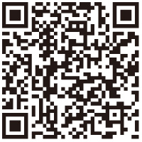

# 译者附记

1995年，尼尔·唐纳德·沃尔什出版了他的处女作，也就是《与神对话》。这本书迅速风靡全美，在《纽约时报》畅销书排行榜上停留了137周之久。沃尔什先生再接再厉，继续撰写了三十余部作品，这些作品统称为《与神对话》系列图书。我认为这些图书堪称新时代思潮的核心经典，尤其是前五部，能够帮助读者过上更美好的生活。有鉴于此，我在2008年翻译《与神对话·第1卷》后，又陆续向中文读者介绍了《与神对话·第2卷》《与神对话·第3卷》和《与神为友》。

过去十年来，这四部作品在中国产生了巨大的影响，数以百万计的读者从中了解到沃尔什先生提出的一些重要理念，比如：

> 1.我们所有人是一体；
>
> 2.一切皆已足够；
>
> 3.没有我们非做不可的事情；
>
> 4.我们的道路不是更好的道路，只是另外一条路而已。

这些极具智慧的理念，以及书中其他观点，给许多读者带来了灵感和启发，甚至改变了他们的生活------当然是向好的方向改变。大概正是因为如此，我在网上常看到读者自发推荐这些书，而且这些读者不分性别、年龄和行业；有男的，也有女的；有七十几岁的，也有十几岁的；有学生、白领、商人，也有教授、作家、明星。自从2012年《与神为友》出版以后，还经常有读者来信垂询，亟想知道《与神合一》何时才能和他们见面。其实我的心和他们一样焦急，但由于种种原因，这本薄薄的小书隔了六年才付梓，在这里恳请各位热爱这套书的读者原谅。

正如你们已经看到的，《与神合一》篇幅不长，但在整个《与神对话》系列中却占有重要的位置，因为它是对前面四部作品的总结，最为完整地传达了沃尔什先生的思想。而在我看来，即便先前没有看过《与神对话·全三卷》和《与神为友》，这本小书依然是趣味盎然和引人入胜的，因为它是我见过最好的《金刚经》辅助读物。沃尔什先生对人类十大幻觉的详细剖析，以及对如何利用这些幻觉的建议，极为清楚地诠释了"凡所有相，皆是虚妄；若见诸相非相，即见如来"这一佛教核心理念。

如果将来没有特殊情况发生，我对《与神对话》系列的译介应该就到这本书为止了。特别感谢尼尔·唐纳德·沃尔什先生，他帮助我在过去十年里，每一天都变成一个自己更满意的人。感谢相关经纪公司、出版机构、印刷发行的工作人员，没有他们的付出，这五本重要作品不可能和中文读者见面。

当然还要感谢你，亲爱的读者，谢谢你怀着和我相同的梦想，因为如果不是想让世界变得更美好，你不会看完这本书，看到这段文字。最后，但愿从现在起，你能够明白，也能够促使更多的人明白，尘世间一切烦恼、苦难、挫败和愤恨都是假象，我们所有人一直生活在欢乐、真相和爱里面。

李继宏\
lijihong@hotmail.com\
2018年5月13日

{style="height:8em;"}

你加过神为好友吗

这里有和神的聊天记录

**与神合一**

+--------------------+---------------+
| 产品经理 \| 杨颖婷 |               |
+--------------------+---------------+
| 技术编辑 \| 顾逸飞 |               |
+--------------------+---------------+
| Kindle电子书制作 \| 李元沛         |
+--------------------+---------------+
| 出品人 \| 吴畏     |               |
+--------------------+---------------+