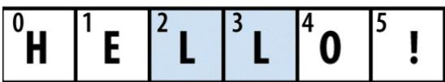

# 第3章 内建数据结构与函数

## 3.1 数据结构和序列

Python的数据结构简单而强大。通晓它们才能成为熟练的Python程序员。

元组

元组是一个固定长度，不可改变的Python序列对象。创建元组的最简单方式，是用逗号分隔一列值：

```txt
In [1]: tup = 4, 5, 6
In [2]: tup
Out[2]: (4, 5, 6)
```

当用复杂的表达式定义元组，最好将值放到圆括号内，如下所示：

```python
In [3]: nested_tup = (4, 5, 6), (7, 8)
In [4]: nested_tup
Out[4]: ((4, 5, 6), (7, 8))
```

用 <sub>tuple</sub> 可以将任意序列或迭代器转换成元组：

```python
In [5]: tuple([4, 0, 2])
Out[5]: (4, 0, 2)

In [6]: tup = tuple('string')

In [7]: tup
Out[7]: ('s', 't', 'r', 'i', 'n', 'g')
```

可以用方括号访问元组中的元素。和C、C++、JAVA等语言一样，序列是从0开始的：

```txt
In [8]: tup[0]
Out[8]: 's'
```

元组中存储的对象可能是可变对象。一旦创建了元组，元组中的对象就不能修改了：

```txt
In [9]: tup = tuple(['foo', [1, 2], True])
In [10]: tup[2] = False
TypeError Traceback (most recent call last)
<ipython-input-10-c7308343b841> in <module>()
----> 1 tup[2] = False
TypeError: 'tuple' object does not support item assignment
```

如果元组中的某个对象是可变的，比如列表，可以在原位进行修改：

```txt
In [11]: tup[1].append(3)
In [12]: tup
Out[12]: ('foo', [1, 2, 3], True)
```

可以用加号运算符将元组串联起来：

```javascript
In [13]: (4, None, 'foo') + (6, 0) + ('bar',)
Out[13]: (4, None, 'foo', 6, 0, 'bar')
```

元组乘以一个整数，像列表一样，会将几个元组的复制串联起来：

```txt
In [14]: ('foo', 'bar') * 4
Out[14]: ('foo', 'bar', 'foo', 'bar', 'foo', 'bar', 'foo', 'bar')
```

对象本身并没有被复制，只是引用了它。

## 拆分元组

如果你想将元组赋值给类似元组的变量，Python会试图拆分等号右边的值：

```txt
In [15]: tup = (4, 5, 6)
In [16]: a, b, c = tup
In [17]: b
Out[17]: 5
```

即使含有元组的元组也会被拆分：

```txt
In [18]: tup = 4, 5, (6, 7)
```

```txt
In [19]: a, b, (c, d) = tup
In [20]: d
Out[20]: 7
```

使用这个功能，你可以很容易地替换变量的名字，其它语言可能是这样：

```txt
tmp = a
a = b
b = tmp
```

但是在Python中，替换可以这样做：

```txt
In [21]: a, b = 1, 2
In [22]: a
Out[22]: 1
In [23]: b
Out[23]: 2
In [24]: b, a = a, b
In [25]: a
Out[25]: 2
In [26]: b
Out[26]: 1
```

变量拆分常用来迭代元组或列表序列：

```python
In [27]: seq = [(1, 2, 3), (4, 5, 6), (7, 8, 9)]
In [28]: for a, b, c in seq:
    ....:    print('a={0}, b={1}, c={2}'.format(a, b, c))
a=1, b=2, c=3
a=4, b=5, c=6
a=7, b=8, c=9
```

另一个常见用法是从函数返回多个值。后面会详解。

Python最近新增了更多高级的元组拆分功能，允许从元组的开头“摘取”几个元素。它使用了特殊的语法 <sub>\*rest</sub> ，这也用在函数签名中以抓取任意长度列表的位置参数：

```txt
In [29]: values = 1, 2, 3, 4, 5
```

```txt
In [30]: a, b, *rest = values
In [31]: a, b
Out[31]: (1, 2)
In [32]: rest
Out[32]: [3, 4, 5]
```

<sub>rest</sub> 的部分是想要舍弃的部分，rest的名字不重要。作为惯用写法，许多Python程序员会将不需要的变量使用下划线：

```txt
In [33]: a, b, *_ = values
```

## tuple方法

因为元组的大小和内容不能修改，它的实例方法都很轻量。其中一个很有用的就是 <sub>count</sub> （也适用于列表），它可以统计某个值得出现频率：

```javascript
In [34]: a = (1, 2, 2, 2, 3, 4, 2)
In [35]: a.count(2)
Out[35]: 4
```

## 列表

与元组对比，列表的长度可变、内容可以被修改。你可以用方括号定义，或用 <sub>list</sub> 函数：

```python
In [36]: a_list = [2, 3, 7, None]
In [37]: tup = ('foo', 'bar', 'baz')
In [38]: b_list = list(tup)
In [39]: b_list
Out[39]: ['foo', 'bar', 'baz']
In [40]: b_list[1] = 'peekaboo'
In [41]: b_list
Out[41]: ['foo', 'peekaboo', 'baz']
```

列表和元组的语义接近，在许多函数中可以交叉使用。

<sub>list</sub> 函数常用来在数据处理中实体化迭代器或生成器：

```txt
In [42]: gen = range(10)
In [43]: gen
Out[43]: range(0, 10)
In [44]: list(gen)
Out[44]: [0, 1, 2, 3, 4, 5, 6, 7, 8, 9]
```

## 添加和删除元素

可以用 <sub>append</sub> 在列表末尾添加元素：

```javascript
In [45]: b_list.append('dwarf')
In [46]: b_list
Out[46]: ['foo', 'peekaboo', 'baz', 'dwarf']
```

<sub>insert</sub> 可以在特定的位置插入元素：

```javascript
In [47]: b_list.insert(1, 'red')
In [48]: b_list
Out[48]: ['foo', 'red', 'peekaboo', 'baz', 'dwarf']
```

插入的序号必须在0和列表长度之间。

```txt
警告：与 append 相比，insert 耗费的计算量大，因为对后续元素的引用必须在内部迁移，以便为新元素提供空间。如果要在序列的头部和尾部插入元素，你可能需要使用 collections.deque，一个双尾部队列。
```

insert的逆运算是pop，它移除并返回指定位置的元素：

```txt
In [49]: b_list.pop(2)
Out[49]: 'peekaboo'
In [50]: b_list
Out[50]: ['foo', 'red', 'baz', 'dwarf']
```

可以用 <sub>remove</sub> 去除某个值， <sub>remove</sub> 会先寻找第一个值并除去：

```javascript
In [51]: b_list.append('foo')
```

```python
In [52]: b_list
Out[52]: ['foo', 'red', 'baz', 'dwarf', 'foo']

In [53]: b_list.remove('foo')

In [54]: b_list
Out[54]: ['red', 'baz', 'dwarf', 'foo']
```

如果不考虑性能，使用 <sub>append</sub> 和 <sub>remove</sub> ，可以把Python的列表当做完美的“多重集”数据结构。

用 <sub>in</sub> 可以检查列表是否包含某个值：

```txt
In [55]: 'dwarf' in b_list
Out[55]: True
```

否定 <sub>in</sub> 可以再加一个not：

```txt
In [56]: 'dwarf' not in b_list
Out[56]: False
```

在列表中检查是否存在某个值远比字典和集合速度慢，因为Python是线性搜索列表中的值，但在字典和集合中，在同样的时间内还可以检查其它项（基于哈希表）。

## 串联和组合列表

与元组类似，可以用加号将两个列表串联起来：

```javascript
In [57]: [4, None, 'foo'] + [7, 8, (2, 3)]
Out[57]: [4, None, 'foo', 7, 8, (2, 3)]
```

如果已经定义了一个列表，用 <sub>extend</sub> 方法可以追加多个元素：

```txt
In [58]: x = [4, None, 'foo']
```

```javascript
In [60]: x
Out[60]: [4, None, 'foo', 7, 8, (2, 3)]
```

通过加法将列表串联的计算量较大，因为要新建一个列表，并且要复制对象。用 <sub>extend</sub> 追加元素，尤其是到一个大列表中，更为可取。因此：

```txt
everything = []
for chunk in list_of_lists:
```

```txt
everything.extend(chunk)
```

要比串联方法快：

```python
everything = []
for chunk in list_of_lists:
    everything = everything + chunk
```

## 排序

你可以用 <sub>sort</sub> 函数将一个列表原地排序（不创建新的对象）：

```python
In [61]: a = [7, 2, 5, 1, 3]
In [62]: a.sort()
In [63]: a
Out[63]: [1, 2, 3, 5, 7]
```

<sub>sort</sub> 有一些选项，有时会很好用。其中之一是二级排序key，可以用这个key进行排序。例如，我们可以按长度对字符串进行排序：

```txt
In [64]: b = ['saw', 'small', 'He', 'foxes', 'six']
In [65]: b.sort(key=len)
In [66]: b
Out[66]: ['He', 'saw', 'six', 'small', 'foxes']
```

稍后，我们会学习 <sub>sorted</sub> 函数，它可以产生一个排好序的序列副本。

## 二分搜索和维护已排序的列表

<sub>bisect</sub> 模块支持二分查找，和向已排序的列表插入值。 <sub>bisect.bisect</sub> 可以找到插入值后仍保证排序的位置， <sub>bisect.insort</sub> 是向这个位置插入值：

```txt
In [67]: import bisect
```

```txt
In [69]: bisect.bisect(c, 2)
Out[69]: 4
```

```txt
In [75]: seq[3:4] = [6, 3]
In [76]: seq
Out[76]: [7, 2, 3, 6, 3, 5, 6, 0, 1]
```

```python
In [70]: bisect.bisect(c, 5)
Out[70]: 6
In [71]: bisect.insert(c, 6)
In [72]: c
Out[72]: [1, 2, 2, 2, 3, 4, 6, 7]
```

注意： <sub>bisect</sub> 模块不会检查列表是否已排好序，进行检查的话会耗费大量计算。因此，对未排序的列表使用 <sub>bisect</sub> 不会产生错误，但结果不一定正确。

## 切片

用切边可以选取大多数序列类型的一部分，切片的基本形式是在方括号中使用 <sub>start:stop</sub> ：

```python
In [73]: seq = [7, 2, 3, 7, 5, 6, 0, 1]
In [74]: seq[1:5]
Out[74]: [2, 3, 7, 5]
```

切片也可以被序列赋值：

切片的起始元素是包括的，不包含结束元素。因此，结果中包含的元素个数是 <sub>stop - start</sub> 。

<sub>start</sub> 或 <sub>stop</sub> 都可以被省略，省略之后，分别默认序列的开头和结尾：

```txt
In [77]: seq[:5]
Out[77]: [7, 2, 3, 6, 3]
In [78]: seq[3:]
Out[78]: [6, 3, 5, 6, 0, 1]
```

负数表明从后向前切片：

```txt
In [79]: seq[-4:]
Out[79]: [5, 6, 0, 1]
```

```txt
In [80]: seq[-6:-2]
Out[80]: [6, 3, 5, 6]
```

需要一段时间来熟悉使用切片，尤其是当你之前学的是R或MATLAB。图3-1展示了正整数和负整数的切片。在图中，指数标示在边缘以表明切片是在哪里开始哪里结束的。

<table><tr><td>0H</td><td>1E</td><td>2L</td><td>3L</td><td>4O</td><td>5!</td></tr></table>

0123456 -6 -5 -4 -3 -2 -1




```txt
string[2:4]
```

string[-5:-2]

在第二个冒号后面使用 <sub>step</sub> ，可以隔一个取一个元素：

```rust
In [81]: seq[::2]
Out[81]: [7, 3, 3, 6, 1]
```

一个聪明的方法是使用 <sub>-1</sub> ，它可以将列表或元组颠倒过来：

```txt
In [82]: seq[::-1]
Out[82]: [1, 0, 6, 5, 3, 6, 3, 2, 7]
```

## 序列函数

Python有一些有用的序列函数。

## enumerate函数

迭代一个序列时，你可能想跟踪当前项的序号。手动的方法可能是下面这样：

```python
i = 0
for value in collection:
    # do something with value
    i += 1
```

因为这么做很常见，Python内建了一个 <sub>enumerate</sub> 函数，可以返回 <sub>(i,</sub> <sub>value)</sub> 元组序列：

```python
for i, value in enumerate(collection):
    # do something with value
```

当你索引数据时，使用 <sub>enumerate</sub> 的一个好方法是计算序列（唯一的） <sub>dict</sub> 映射到位置的值：

```python
In [83]: some_list = ['foo', 'bar', 'baz']
In [84]: mapping = {}
In [85]: for i, v in enumerate(some_list):
    ....:    mapping[v] = i
In [86]: mapping
Out[86]: {'bar': 1, 'baz': 2, 'foo': 0}
```

## sorted函数

<sub>sorted</sub> 函数可以从任意序列的元素返回一个新的排好序的列表：

```txt
In [87]: sorted([7, 1, 2, 6, 0, 3, 2])
Out[87]: [0, 1, 2, 2, 3, 6, 7]
In [88]: sorted('horse race')
Out[88]: [' ', 'a', 'c', 'e', 'e', 'h', 'o', 'r', 'r', 's']
```

<sub>sorted</sub> 函数可以接受和 <sub>sort</sub> 相同的参数。

## zip函数

<sub>zip</sub> 可以将多个列表、元组或其它序列成对组合成一个元组列表：

```python
In [89]: seq1 = ['foo', 'bar', 'baz']
In [90]: seq2 = ['one', 'two', 'three']
In [91]: zipped = zip(seq1, seq2)
In [92]: list(zipped)
Out[92]: [('foo', 'one'), ('bar', 'two'), ('baz', 'three')]
```

<sub>zip</sub> 可以处理任意多的序列，元素的个数取决于最短的序列：

```python
In [93]: seq3 = [False, True]
In [94]: list(zip(seq1, seq2, seq3))
Out[94]: [('foo', 'one', False), ('bar', 'two', True)]
```

<sub>zip</sub> 的常见用法之一是同时迭代多个序列，可能结合 <sub>enumerate</sub> 使用：

```python
In [95]: for i, (a, b) in enumerate(zip(seq1, seq2)):
    ....:    print('[0]: {1}, {2}'.format(i, a, b))
    ....:
0: foo, one
1: bar, two
2: baz, three
```

给出一个“被压缩的”序列， <sub>zip</sub> 可以被用来解压序列。也可以当作把行的列表转换为列的列表。这个方法看起来有点神奇：

```python
In [96]: pitchers = [('Nolan', 'Ryan'), ('Roger', 'Clemens'),
    .....:    ('Schilling', 'Curt'])

In [97]: first_names, last_names = zip(*pitchers)

In [98]: first_names
Out[98]: ('Nolan', 'Roger', 'Schilling')

In [99]: last_names
Out[99]: ('Ryan', 'Clemens', 'Curt')
```

## reversed函数

<sub>reversed</sub> 可以从后向前迭代一个序列：

```txt
In [100]: list(reversed(range(10)))
Out[100]: [9, 8, 7, 6, 5, 4, 3, 2, 1, 0]
```

要记住 <sub>reversed</sub> 是一个生成器（后面详细介绍），只有实体化（即列表或for循环）之后才能创建翻转的序列。

## 字典

字典可能是Python最为重要的数据结构。它更为常见的名字是哈希映射或关联数组。它是键值对的大小可变集合，键和值都是Python对象。创建字典的方法之一是使用尖括号，用冒号分隔键和值：

```python
In [101]: empty_dict = {}
In [102]: d1 = {'a': 'some value', 'b': [1, 2, 3, 4]}
In [103]: d1
```

```python
Out[103]: {'a': 'some value', 'b': [1, 2, 3, 4]}
```

你可以像访问列表或元组中的元素一样，访问、插入或设定字典中的元素：

```javascript
In [104]: d1[7] = 'an integer'
In [105]: d1
Out[105]: {'a': 'some value', 'b': [1, 2, 3, 4], 7: 'an integer'}
In [106]: d1['b']
Out[106]: [1, 2, 3, 4]
```

你可以用检查列表和元组是否包含某个值的方法，检查字典中是否包含某个键：

```txt
In [107]: 'b' in d1
Out[107]: True
```

可以用 <sub>del</sub> 关键字或 <sub>pop</sub> 方法（返回值的同时删除键）删除值：

```python
In [108]: d1[5] = 'some value'
In [109]: d1
Out[109]:
{'a': 'some value',
'b': [1, 2, 3, 4],
7: 'an integer',
5: 'some value'}
In [110]: d1['dummy'] = 'another value'
In [111]: d1
Out[111]:
{'a': 'some value',
'b': [1, 2, 3, 4],
7: 'an integer',
5: 'some value',
'dummy': 'another value'}
In [112]: del d1[5]
In [113]: d1
Out[113]:
{'a': 'some value',
'b': [1, 2, 3, 4],
7: 'an integer',
'dummy': 'another value'}
```

```txt
In [121]: mapping = dict(zip(range(5), reversed(range(5))))
In [122]: mapping
Out[122]: {0: 4, 1: 3, 2: 2, 3: 1, 4: 0}
```

```txt
In [114]: ret = d1.pop('dummy')
In [115]: ret
Out[115]: 'another value'
In [116]: d1
Out[116]: {'a': 'some value', 'b': [1, 2, 3, 4], 7: 'an integer'}
```

<sub>keys</sub> 和 <sub>values</sub> 是字典的键和值的迭代器方法。虽然键值对没有顺序，这两个方法可以用相同的顺序输出键和值：

```python
In [117]: list(d1.keys())
Out[117]: ['a', 'b', 7]
In [118]: list(d1.values())
Out[118]: ['some value', [1, 2, 3, 4], 'an integer']
```

用 <sub>update</sub> 方法可以将一个字典与另一个融合：

```txt
In [119]: d1.update({'b': 'foo', 'c': 12})  
In [120]: d1  
Out[120]: {'a': 'some value', 'b': 'foo', 7: 'an integer', 'c': 12}
```

<sub>update</sub> 方法是原地改变字典，因此任何传递给 <sub>update</sub> 的键的旧的值都会被舍弃。

## 用序列创建字典

常常，你可能想将两个序列配对组合成字典。下面是一种写法：

```python
mapping = {}
for key, value in zip(key_list, value_list):
    mapping[key] = value
```

因为字典本质上是2元元组的集合，dict可以接受2元元组的列表：

后面会谈到 <sub>dict comprehensions</sub> ，另一种构建字典的优雅方式。

## 默认值

下面的逻辑很常见：

```python
if key in some_dict:
    value = some_dict[key]
else:
    value = default_value
```

因此，dict的方法get和pop可以取默认值进行返回，上面的if-else语句可以简写成下面：

```python
value = some_dict.get(key, default_value)
```

get默认会返回None，如果不存在键，pop会抛出一个例外。关于设定值，常见的情况是在字典的值是属于其它集合，如列表。例如，你可以通过首字母，将一个列表中的单词分类：

```python
In [123]: words = ['apple', 'bat', 'bar', 'atom', 'book']

In [124]: by_letter = {}

In [125]: for word in words:
    .....:    letter = word[0]
    .....:    if letter not in by_letter:
    .....:    by_letter[letter] = [word]
    .....:    else:
    .....:    by_letter[letter].append(word)
    ..:

In [126]: by_letter
Out[126]: {'a': ['apple', 'atom'], 'b': ['bat', 'bar', 'book']}
```

<sub>setdefault</sub> 方法就正是干这个的。前面的for循环可以改写为：

```python
for word in words:
    letter = word[0]
    by_letter.setdefault(letter, []).append(word)
```

<sub>collections</sub> 模块有一个很有用的类， <sub>defaultdict</sub> ，它可以进一步简化上面。传递类型或函数以生成每个位置的默认值：

```python
from collections import defaultdict
by_letter = defaultdict(list)
for word in words:
    by_letter[word[0]].append(word)
```

## 有效的键类型

字典的值可以是任意Python对象，而键通常是不可变的标量类型（整数、浮点型、字符串）或元组（元组中的对象必须是不可变的）。这被称为“可哈希性”。可以用 <sub>hash</sub> 函数检测一个对象是否是可哈希的（可被用作字典的键）：

```txt
In [127]: hash('string')
Out[127]: 5023931463650008331

In [128]: hash((1, 2, (2, 3)))
Out[128]: 1097636502276347782

In [129]: hash((1, 2, [2, 3])) # fails because lists are mutable
----
TypeError    Traceback (most recent call last)
<ipython-input-129-800cd14ba8be> in <module>()
----> 1 hash((1, 2, [2, 3])) # fails because lists are mutable
TypeError: unhashable type: 'list'
```

要用列表当做键，一种方法是将列表转化为元组，只要内部元素可以被哈希，它也就可以被哈希：

```javascript
In [130]: d = {}
In [131]: d[tuple([1, 2, 3])] = 5
In [132]: d
Out[132]: {(1, 2, 3): 5}
```

## 集合

集合是无序的不可重复的元素的集合。你可以把它当做字典，但是只有键没有值。可以用两种方式创建集合：通过set函数或使用尖括号set语句：

```txt
In [133]: set([2, 2, 2, 1, 3, 3])
Out[133]: {1, 2, 3}
In [134]: {2, 2, 2, 1, 3, 3}
Out[134]: {1, 2, 3}
```

集合支持合并、交集、差分和对称差等数学集合运算。考虑两个示例集合：

```autohotkey
In [135]: a = {1, 2, 3, 4, 5}
In [136]: b = {3, 4, 5, 6, 7, 8}
```

合并是取两个集合中不重复的元素。可以用 <sub>union</sub> 方法，或者 <sub>|</sub> 运算符：

```javascript
In [137]: a.union(b)
Out[137]: {1, 2, 3, 4, 5, 6, 7, 8}
```

```txt
In [138]: a | b
Out[138]: {1, 2, 3, 4, 5, 6, 7, 8}
```

交集的元素包含在两个集合中。可以用 <sub>intersection</sub> 或 <sub>&</sub> 运算符：

```txt
In [139]: a.intersection(b)
Out[139]: {3, 4, 5}
```

```txt
In [140]: a & b
Out[140]: {3, 4, 5}
```

表3-1列出了常用的集合方法。

<table><tr><td>函数</td><td>替代语法</td><td>说明</td></tr><tr><td>a.add(x)</td><td>N/A</td><td>将元素x添加到集合a</td></tr><tr><td>a.clear()</td><td>N/A</td><td>将集合清空</td></tr><tr><td>a.remove(x)</td><td>N/A</td><td>将元素x从集合a除去</td></tr><tr><td>a.pop()</td><td>N/A</td><td>从集合a去除任意元素,如果集合为空,则抛出KeyError错误</td></tr><tr><td>a.union(b)</td><td>a|b</td><td>集合a和b中的所有不重复元素</td></tr><tr><td>a.update(b)</td><td>a|=b</td><td>设定集合a中的元素为a与b的合并</td></tr><tr><td>a.intersection(b)</td><td>a&amp;b</td><td>a和b中交叉的元素</td></tr><tr><td>a.intersection_update(b)</td><td>a&amp;=b</td><td>设定集合a中的元素为a与b的交叉</td></tr><tr><td>a.difference(b)</td><td>a-b</td><td>存在于a但不存在于b的元素</td></tr><tr><td>a.difference_update(b)</td><td>a-=b</td><td>设定集合a中的元素为a与b的差</td></tr><tr><td>a.symmetric_difference(b)</td><td>a^b</td><td>只在a或只在b的元素</td></tr><tr><td>a.symmetric_difference_update(b)</td><td>a^=b</td><td>集合a中的元素为只在a或只在b的元素</td></tr><tr><td>a.issubset(b)</td><td>N/A</td><td>如果a中的元素全部属于b,则为True</td></tr><tr><td>a.issuperset(b)</td><td>N/A</td><td>如果b中的元素全部属于a,则为True</td></tr><tr><td>a.isdisjoint(b)</td><td>N/A</td><td>如果a和b无共同元素,则为True</td></tr></table>

所有逻辑集合操作都有另外的原地实现方法，可以直接用结果替代集合的内容。对于大的集合，这么做效率更高：

```txt
In [141]: c = a.copy()
```

```txt
In [142]: c |= b
```

```txt
In [143]: c
```

```javascript
Out[143]: {1, 2, 3, 4, 5, 6, 7, 8}
```

```txt
In [144]: d = a.copy()
```

```txt
In [145]: d &= b
```

```txt
In [146]: d
Out[146]: {3, 4, 5}
```

与字典类似，集合元素通常都是不可变的。要获得类似列表的元素，必须转换成元组：

```txt
In [147]: my_data = [1, 2, 3, 4]
```

```python
In [148]: my_set = {tuple(my_data)}
```

```txt
In [149]: my_set
Out[149]: {(1, 2, 3, 4)}
```

你还可以检测一个集合是否是另一个集合的子集或父集：

```txt
In [150]: a_set = {1, 2, 3, 4, 5}
```

```python
In [151]: {1, 2, 3}.issubset(a_set)
Out[151]: True
```

```txt
In [152]: a_set.issuperset({1, 2, 3})
Out[152]: True
```

集合的内容相同时，集合才对等：

```txt
In [153]: {1, 2, 3} == {3, 2, 1}
Out[153]: True
```

## 列表、集合和字典推导式

列表推导式是Python最受喜爱的特性之一。它允许用户方便的从一个集合过滤元素，形成列表，在传递参数的过程中还可以修改元素。形式如下：

```txt
[expr for val in collection if condition]
```

它等同于下面的for循环;

```txt
result = []
for val in collection:
```

```python
if condition:
    result.append(expr)
```

filter条件可以被忽略，只留下表达式就行。例如，给定一个字符串列表，我们可以过滤出长度在2及以下的字符串，并将其转换成大写：

```python
In [154]: strings = ['a', 'as', 'bat', 'car', 'dove', 'python']
```

```txt
In [155]: [x.upper() for x in strings if len(x) > 2]
Out[155]: ['BAT', 'CAR', 'DOVE', 'PYTHON']
```

用相似的方法，还可以推导集合和字典。字典的推导式如下所示：

```txt
dict_comp = {key-expr : value-expr for value in collection if condition}
```

集合的推导式与列表很像，只不过用的是尖括号：

```txt
set_comp = {expr for value in collection if condition}
```

与列表推导式类似，集合与字典的推导也很方便，而且使代码的读写都很容易。来看前面的字符串列表。假如我们只想要字符串的长度，用集合推导式的方法非常方便：

```txt
In [156]: unique_lengths = {len(x) for x in strings}
```

```txt
In [157]: unique_lengths
Out[157]: {1, 2, 3, 4, 6}
```

<sub>map</sub> 函数可以进一步简化：

```txt
In [158]: set(map(len, strings))
Out[158]: {1, 2, 3, 4, 6}
```

作为一个字典推导式的例子，我们可以创建一个字符串的查找映射表以确定它在列表中的位置：

```python
In [159]: loc_mapping = {val : index for index, val in enumerate(strings)}
In [160]: loc_mapping
Out[160]: {'a': 0, 'as': 1, 'bat': 2, 'car': 3, 'dove': 4, 'python': 5}
```

## 嵌套列表推导式

假设我们有一个包含列表的列表，包含了一些英文名和西班牙名：

```python
In [161]: all_data = [['John', 'Emily', 'Michael', 'Mary', 'Steven'], .....: ['Maria', 'Juan', 'Javier', 'Natalia', 'Pilar']]
```

你可能是从一些文件得到的这些名字，然后想按照语言进行分类。现在假设我们想用一个列表包含所有的名字，这些名字中包含两个或更多的e。可以用for循环来做：

```python
names_of_interest = []
for names in all_data:
    enough_es = [name for name in names if name.count('e') >= 2]
    names_of_interest.extend( enough_es )
```

可以用嵌套列表推导式的方法，将这些写在一起，如下所示：

```python
In [162]: result = [name for names in all_data for name in names
......:    if name.count('e') >= 2]

In [163]: result
Out[163]: ['Steven']
```

嵌套列表推导式看起来有些复杂。列表推导式的for部分是根据嵌套的顺序，过滤条件还是放在最后。下面是另一个例子，我们将一个整数元组的列表扁平化成了一个整数列表：

```txt
In [164]: some_tuples = [(1, 2, 3), (4, 5, 6), (7, 8, 9)]
In [165]: flattened = [x for tup in some_tuples for x in tup]
In [166]: flattened
Out[166]: [1, 2, 3, 4, 5, 6, 7, 8, 9]
```

记住，for表达式的顺序是与嵌套for循环的顺序一样（而不是列表推导式的顺序）：

```python
flattened = []
for tup in some_tuples:
    for x in tup:
    flattened.append(x)
```

你可以有任意多级别的嵌套，但是如果你有两三个以上的嵌套，你就应该考虑下代码可读性的问题了。分辨列表推导式的列表推导式中的语法也是很重要的：

```txt
In [167]: [[x for x in tup] for tup in some_tuples]
Out[167]: [[1, 2, 3], [4, 5, 6], [7, 8, 9]]
```

这段代码产生了一个列表的列表，而不是扁平化的只包含元素的列表。

## 3.2 函数

函数是Python中最主要也是最重要的代码组织和复用手段。作为最重要的原则，如果你要重复使用相同或非常类似的代码，就需要写一个函数。通过给函数起一个名字，还可以提高代码的可读性。

函数使用 <sub>def</sub> 关键字声明，用 <sub>return</sub> 关键字返回值：

```python
def my_function(x, y, z=1.5):
    if z > 1:
    return z * (x + y)
    else:
    return z / (x + y)
```

同时拥有多条return语句也是可以的。如果到达函数末尾时没有遇到任何一条return语句，则返回None。

函数可以有一些位置参数（positional）和一些关键字参数（keyword）。关键字参数通常用于指定默认值或可选参数。在上面的函数中，x和y是位置参数，而z则是关键字参数。也就是说，该函数可以下面这两种方式进行调用：

```txt
my_function(5, 6, z=0.7)
my_function(3.14, 7, 3.5)
my_function(10, 20)
```

函数参数的主要限制在于：关键字参数必须位于位置参数（如果有的话）之后。你可以任何顺序指定关键字参数。也就是说，你不用死记硬背函数参数的顺序，只要记得它们的名字就可以了。

笔记：也可以用关键字传递位置参数。前面的例子，也可以写为：

```txt
my_function(x=5, y=6, z=7)
my_function(y=6, x=5, z=7)
```

这种写法可以提高可读性。

## 命名空间、作用域，和局部函数

函数可以访问两种不同作用域中的变量：全局（global）和局部（local）。Python有一种更科学的用于描述变量作用域的名称，即命名空间（namespace）。任何在函数中赋值的变量默认都是被分配到局部命名空间（local namespace）中的。局部命名空间是在函数被调用时创建的，函数参数会立即填入该命名空间。在函数执行完毕之后，局部命名空间就会被销毁（会有一些例外的情况，具体请参见后面介绍闭包的那一节）。看看下面这个函数：

```python
def func():
    a = []
    for i in range(5):
    a.append(i)
```

调用func()之后，首先会创建出空列表a，然后添加5个元素，最后a会在该函数退出的时候被销毁。假如我们像下面这样定义a：

```python
a = []
def func():
    for i in range(5):
    a.append(i)
```

虽然可以在函数中对全局变量进行赋值操作，但是那些变量必须用global关键字声明成全局的才行：

```python
In [168]: a = None
In [169]: def bind_a_variable():
    .....: global a
    .....: a = []
    .....: bind_a_variable()
    .....:
In [170]: print(a)
[]
```

注意：我常常建议人们不要频繁使用global关键字。因为全局变量一般是用于存放系统的某些状态的。如果你发现自己用了很多，那可能就说明得要来点儿面向对象编程了（即使用类）。

## 返回多个值

在我第一次用Python编程时（之前已经习惯了Java和C++），最喜欢的一个功能是：函数可以返回多个值。下面是一个简单的例子：

```python
def f():
    a = 5
    b = 6
    c = 7
    return a, b, c
```

```txt
a, b, c = f()
```

在数据分析和其他科学计算应用中，你会发现自己常常这么干。该函数其实只返回了一个对象，也就是一个元组，最后该元组会被拆包到各个结果变量中。在上面的例子中，我们还可以这样写：

```lua
return_value = f()
```

这里的return\_value将会是一个含有3个返回值的三元元组。此外，还有一种非常具有吸引力的多值返回方式——返回字典：

```python
def f():
    a = 5
    b = 6
    c = 7
    return {'a': a, 'b': b, 'c': c}
```

取决于工作内容，第二种方法可能很有用。

## 函数也是对象

由于Python函数都是对象，因此，在其他语言中较难表达的一些设计思想在Python中就要简单很多了。假设我们有下面这样一个字符串数组，希望对其进行一些数据清理工作并执行一堆转换：

```python
In [171]: states = ['Alabama', 'Georgia!', 'Georgia', 'georgia', 'FlOrIda', .....: 'south carolina##', 'West virginia?']
```

不管是谁，只要处理过由用户提交的调查数据，就能明白这种乱七八糟的数据是怎么一回事。为了得到一组能用于分析工作的格式统一的字符串，需要做很多事情：去除空白符、删除各种标点符号、正确的大写格式等。做法之一是使用内建的字符串方法和正则表达式 <sub>re</sub> 模块：

```python
import re

def clean_strings(strings):
    result = []
    for value in strings:
    value = value.strip()
    value = re.sub('[!#?]', '', value)
    value = value.title()
    result.append(value)
    return result
```

结果如下所示：

```txt
In [173]: clean_strings(states)
Out[173]:
['Alabama',
'Georgia',
'Georgia',
'Georgia',
'Florida',
'South Carolina',
'West Virginia']
```

其实还有另外一种不错的办法：将需要在一组给定字符串上执行的所有运算做成一个列表：

```python
def remove_punctuation(value):
    return re.sub('[!#?]', '', value)

clean_ops = [str.strip, remove_punctuation, str.title]

def clean_strings(strings, ops):
    result = []
    for value in strings:
    for function in ops:
    value = function(value)
    result.append(value)
    return result
```

然后我们就有了：

```python
In [175]: clean_strings(states, clean_ops)
Out[175]:
['Alabama',
'Georgia',
'Georgia',
'Georgia',
'Florida',
'South Carolina',
'West Virginia']
```

这种多函数模式使你能在很高的层次上轻松修改字符串的转换方式。此时的clean\_strings也更具可复用性！

还可以将函数用作其他函数的参数，比如内置的map函数，它用于在一组数据上应用一个函数：

```txt
In [176]: for x in map(remove_punctuation, states):
    .....:    print(x)
Alabama
Georgia
```

```txt
Georgia
georgia
Fl0rIda
south carolina
West virginia
```

## 匿名（lambda）函数

Python支持一种被称为匿名的、或lambda函数。它仅由单条语句组成，该语句的结果就是返回值。它是通过lambda关键字定义的，这个关键字没有别的含义，仅仅是说“我们正在声明的是一个匿名函数”。

```python
def short_function(x):
    return x * 2
equiv_anon = lambda x: x * 2
```

本书其余部分一般将其称为lambda函数。它们在数据分析工作中非常方便，因为你会发现很多数据转换函数都以函数作为参数的。直接传入lambda函数比编写完整函数声明要少输入很多字（也更清晰），甚至比将lambda函数赋值给一个变量还要少输入很多字。看看下面这个简单得有些傻的例子：

```python
def apply_to_list(some_list, f):
    return [f(x) for x in some_list]
ints = [4, 0, 1, 5, 6]
apply_to_list(ints, lambda x: x * 2)
```

虽然你可以直接编写[x \*2for x in ints]，但是这里我们可以非常轻松地传入一个自定义运算给apply\_to\_list函数。

再来看另外一个例子。假设有一组字符串，你想要根据各字符串不同字母的数量对其进行排序：

```python
In [177]: strings = ['foo', 'card', 'bar', 'aaaa', 'abab']
```

这里，我们可以传入一个lambda函数到列表的sort方法：

```python
In [178]: strings.sort(key=lambda x: len(set(list(x))))
In [179]: strings
Out[179]: ['aaaa', 'foo', 'abab', 'bar', 'card']
```

笔记：lambda函数之所以会被称为匿名函数，与def声明的函数不同，原因之一就是这种函数对象本身是没有提供名称name属性。

## 柯里化：部分参数应用

柯里化（currying）是一个有趣的计算机科学术语，它指的是通过“部分参数应用”（partialargument application）从现有函数派生出新函数的技术。例如，假设我们有一个执行两数相加的简单函数：

```python
def add_numbers(x, y):
    return x + y
```

通过这个函数，我们可以派生出一个新的只有一个参数的函数——add\_five，它用于对其参数加5：

```python
add_five = lambda y: add_numbers(5, y)
```

add\_numbers的第二个参数称为“柯里化的”（curried）。这里没什么特别花哨的东西，因为我们其实就只是定义了一个可以调用现有函数的新函数而已。内置的functools模块可以用partial函数将此过程简化：

```python
from functools import partial
add_five = partial(add_numbers, 5)
```

## 生成器

能以一种一致的方式对序列进行迭代（比如列表中的对象或文件中的行）是Python的一个重要特点。这是通过一种叫做迭代器协议（iterator protocol，它是一种使对象可迭代的通用方式）的方式实现的，一个原生的使对象可迭代的方法。比如说，对字典进行迭代可以得到其所有的键：

```python
In [180]: some_dict = {'a': 1, 'b': 2, 'c': 3}
In [181]: for key in some_dict:
    .....:    print(key)
a
b
c
```

当你编写for key in some\_dict时，Python解释器首先会尝试从some\_dict创建一个迭代器：

```python
In [182]: dict_iterator = iter(some_dict)
```

```txt
In [183]: dict_iterator
Out[183]: <dict_keyiterator at 0x7fbbd5a9f908>
```

迭代器是一种特殊对象，它可以在诸如for循环之类的上下文中向Python解释器输送对象。大部分能接受列表之类的对象的方法也都可以接受任何可迭代对象。比如min、max、sum等内置方法以及list、tuple等类型构造器：

```txt
In [184]: list(dict_iterator)
Out[184]: ['a', 'b', 'c']
```

生成器（generator）是构造新的可迭代对象的一种简单方式。一般的函数执行之后只会返回单个值，而生成器则是以延迟的方式返回一个值序列，即每返回一个值之后暂停，直到下一个值被请求时再继续。要创建一个生成器，只需将函数中的return替换为yeild即可：

```python
def squares(n=10):
    print('Generating squares from 1 to {0}'.format(n ** 2))
    for i in range(1, n + 1):
    yield i ** 2
```

调用该生成器时，没有任何代码会被立即执行：

```txt
In [186]: gen = squares()
In [187]: gen
Out[187]: <generator object squares at 0x7fbbd5ab4570>
```

直到你从该生成器中请求元素时，它才会开始执行其代码：

```txt
In [188]: for x in gen:
    .....:    print(x, end=' ') 
Generating squares from 1 to 100149162536496481100
```

## 生成器表达式

另一种更简洁的构造生成器的方法是使用生成器表达式（generator expression）。这是一种类似于列表、字典、集合推导式的生成器。其创建方式为，把列表推导式两端的方括号改成圆括号：

```txt
In [189]: gen = (x ** 2 for x in range(100))
In [190]: gen
Out[190]: <generator object <genexpr> at 0x7fbbd5ab29e8>
```

它跟下面这个冗长得多的生成器是完全等价的：

```python
def_make_gen():
    for x in range(100):
    yield x ** 2
gen = _make_gen()
```

生成器表达式也可以取代列表推导式，作为函数参数：

```txt
In [191]: sum(x ** 2 for x in range(100))
Out[191]: 328350
In [192]: dict((i, i **2) for i in range(5))
Out[192]: {0: 0, 1: 1, 2: 4, 3: 9, 4: 16}
```

## itertools模块

标准库itertools模块中有一组用于许多常见数据算法的生成器。例如，groupby可以接受任何序列和一个函数。它根据函数的返回值对序列中的连续元素进行分组。下面是一个例子：

```python
In [193]: import itertools
In [194]: first_letter = lambda x: x[0]
In [195]: names = ['Alan', 'Adam', 'Wes', 'Will', 'Albert', 'Steven']
In [196]: for letter, names in itertools.groupby(names, first_letter):
    .....:    print(letter, list(names)) # names is a generator
A ['Alan', 'Adam']
W ['Wes', 'Will']
A ['Albert']
S ['Steven']
```

表3-2中列出了一些我经常用到的itertools函数。建议参阅Python官方文档，进一步学习。

<table><tr><td>函数</td><td>说明</td></tr><tr><td>combinations(iterable, k)</td><td>生成一个由 iterable 中所有可能的 k 元元组组成的序列,不考虑顺序(参阅另一个函数 combinations_with_replacement)</td></tr><tr><td>permutations(iterable, k)</td><td>生成一个由 iterable 中所有可能的 k 元元组组成的序列,考虑顺序</td></tr><tr><td>groupby(iterable[, keyfunc])</td><td>为每个唯一键生成一个(key, sub-iterator)</td></tr><tr><td>product(*iterables, repeat=1)</td><td>生成输入的 iterables 的笛卡尔积,结果为元组,类似于嵌套 for 循环</td></tr></table>

## 错误和异常处理

优雅地处理Python的错误和异常是构建健壮程序的重要部分。在数据分析中，许多函数函数只用于部分输入。例如，Python的float函数可以将字符串转换成浮点数，但输入有误时，有 <sub>ValueError</sub> 错误：

```txt
In [197]: float('1.2345')
Out[197]: 1.2345

In [198]: float('something')

ValueError Traceback (most recent call last)
<ipython-input-198-439904410854> in <module>()
----> 1 float('something')
ValueError: could not convert string to float: 'something'
```

假如想优雅地处理float的错误，让它返回输入值。我们可以写一个函数，在try/except中调用float：

```python
def attempt_float(x):
    try:
    return float(x)
    except:
    return x
```

当float(x)抛出异常时，才会执行except的部分：

```python
In [200]: attempt_float('1.2345')
Out[200]: 1.2345
In [201]: attempt_float('something')
Out[201]: 'something'
```

你可能注意到float抛出的异常不仅是ValueError：

```txt
In [202]: float((1, 2))
----
TypeError Traceback (most recent call last)
<ipython-input-202-842079ebb635> in <module>()
----> 1 float((1, 2))
TypeError: float() argument must be a string or a number, not 'tuple'
```

你可能只想处理ValueError，TypeError错误（输入不是字符串或数值）可能是合理的bug。可以写一个异常类型：

```python
def attempt_float(x):
    try:
    return float(x)
except ValueError:
    return x
```

## 然后有：

```python
In [204]: attempt_float((1, 2))

TypeError Traceback (most recent call last)
<ipython-input-204-9bdfd730cead> in <module>()
----> 1 attempt_float((1, 2))
<ipython-input-203-3e06b8379b6b> in attempt_float(x)
    1 def attempt_float(x):
    2 try:
----> 3 return float(x)
    4 except ValueError:
    5 return x

TypeError: float() argument must be a string or a number, not 'tuple'
```

可以用元组包含多个异常：

```python
def attempt_float(x):
    try:
    return float(x)
except (TypeError, ValueError):
    return x
```

某些情况下，你可能不想抑制异常，你想无论try部分的代码是否成功，都执行一段代码。可以使用finally：

```python
f = open(path, 'w')
```

```python
try:
    write_to_file(f)
finally:
    f.close()
```

这里，文件处理f总会被关闭。相似的，你可以用else让只在try部分成功的情况下，才执行代码：

```python
f = open(path, 'w')
try:
    write_to_file(f)
except:
    print('Failed')
else:
    print('Succeeded')
finally:
    f.close()
```

## IPython的异常

如果是在%run一个脚本或一条语句时抛出异常，IPython默认会打印完整的调用栈（traceback），在栈的每个点都会有几行上下文：

```diff
In [10]: %run examples/ipython_bug.py
AssertionError Traceback (most recent call last)
/home/wesm/code/pydata-book/examples/ipython_bug.py in <module>()
13 throws_an_exception()
14
---> 15 calling_things()

/home/wesm/code/pydata-book/examples/ipython_bug.py in calling_things()
11 def calling_things():
12 works_fine()
---> 13 throws_an_exception()
1415 calling_things()

/home/wesm/code/pydata-book/examples/ipython_bug.py in throws_an_exception()
7 a = 58 b = 6
----> 9 assert(a + b == 10)
1011 def calling_things():
```

```txt
AssertionError:
```

自身就带有文本是相对于Python标准解释器的极大优点。你可以用魔术命令 <sub>%xmode</sub> ，从Plain（与Python标准解释器相同）到Verbose（带有函数的参数值）控制文本显示的数量。后面可以看到，发生错误之后，（用%debug或%pdb magics）可以进入stack进行事后调试。

## 3.3 文件和操作系统

本书的代码示例大多使用诸如pandas.read\_csv之类的高级工具将磁盘上的数据文件读入Python数据结构。但我们还是需要了解一些有关Python文件处理方面的基础知识。好在它本来就很简单，这也是Python在文本和文件处理方面的如此流行的原因之一。

为了打开一个文件以便读写，可以使用内置的open函数以及一个相对或绝对的文件路径：

```txt
In [207]: path = 'examples/segismundo.txt'
In [208]: f = open(path)
```

默认情况下，文件是以只读模式（'r'）打开的。然后，我们就可以像处理列表那样来处理这个文件句柄f了，比如对行进行迭代：

```python
for line in f:
    pass
```

从文件中取出的行都带有完整的行结束符（EOL），因此你常常会看到下面这样的代码（得到一组没有EOL的行）：

```python
In [209]: lines = [x.rstrip() for x in open(path)]
In [210]: lines
Out[210]:
['Sueña el rico en su riqueza,',
'que más cuidados le ofrece;',
'', 
'sueña el pobre que padece',
'su miseria y su pobreza;',
'', 
'sueña el que a medrar empieza,',
'sueña el que afana y pretende,',
'sueña el que agravia y ofende,',
'', 
'y en el mundo, en conclusión,',
'todos sueñan lo que son,',
'aunque ninguno lo entiende.',
```

如果使用open创建文件对象，一定要用close关闭它。关闭文件可以返回操作系统资源：

```txt
In [211]: f.close()
```

用with语句可以可以更容易地清理打开的文件：

```txt
In [212]: with open(path) as f:
.....: lines = [x.rstrip() for x in f]
```

这样可以在退出代码块时，自动关闭文件。

如果输入f =open(path,'w')，就会有一个新文件被创建在examples/segismundo.txt，并覆盖掉该位置原来的任何数据。另外有一个x文件模式，它可以创建可写的文件，但是如果文件路径存在，就无法创建。表3-3列出了所有的读/写模式。

<table><tr><td>模式</td><td>说明</td></tr><tr><td>r</td><td>只读模式</td></tr><tr><td>w</td><td>只写模式。创建新文件(删除同名的任何文件 $^{译注12}$ )</td></tr><tr><td>a</td><td>附加到现有文件(如果文件不存在则创建一个)</td></tr><tr><td>r+</td><td>读写模式</td></tr><tr><td>b</td><td>附加说明某模式用于二进制文件,即&#x27;rb&#x27;或&#x27;wb&#x27;</td></tr><tr><td>U</td><td>通用换行模式。单独使用&#x27;U&#x27;或附加到其他读模式(如&#x27;rU&#x27;)</td></tr></table>

对于可读文件，一些常用的方法是read、seek和tell。read会从文件返回字符。字符的内容是由文件的编码决定的（如UTF-8），如果是二进制模式打开的就是原始字节：

```txt
In [213]: f = open(path)
In [214]: f.read(10)
Out[214]: 'Sueña el r'
In [215]: f2 = open(path, 'rb') # Binary mode
In [216]: f2.read(10)
Out[216]: b'Sue\xc3\xb1a el '
```

read模式会将文件句柄的位置提前，提前的数量是读取的字节数。tell可以给出当前的位置：

```txt
In [217]: f.tell()
Out[217]: 11
```

```txt
In [218]: f2.tell()
Out[218]: 10
```

尽管我们从文件读取了10个字符，位置却是11，这是因为用默认的编码用了这么多字节才解码了这10个字符。你可以用sys模块检查默认的编码：

```python
In [219]: import sys
In [220]: sys.getdefaultencoding()
Out[220]: 'utf-8'
```

seek将文件位置更改为文件中的指定字节：

```txt
In [221]: f.seek(3)
Out[221]: 3
In [222]: f.read(1)
Out[222]: 'ñ'
```

最后，关闭文件：

```txt
In [223]: f.close()
In [224]: f2.close()
```

向文件写入，可以使用文件的write或writelines方法。例如，我们可以创建一个无空行版的prof\_mod.py：

```txt
In [225]: with open('tmp.txt', 'w') as handle:
    .....:    handle.writelines(x for x in open(path) if len(x) > 1)

In [226]: with open('tmp.txt') as f:
    .....:    lines = f.readlines()

In [227]: lines
Out[227]:
['Sueña el rico en su riqueza,\n',
'que más cuidados le ofrece;\n',
'sueña el pobre que padece\n',
'su miseria y su pobreza;\n',
'sueña el que a medrar empieza,\n',
'sueña el que afana y pretende,\n',
'sueña el que agravia y ofende,\n',
'y en el mundo, en conclusión,\n',
'todos sueñan lo que son,\n',
```

```txt
'aunque ninguno lo entiende.\n']
```

表3-4列出了一些最常用的文件方法。  
```txt
方法 说明
read([size]) 以字符串形式返回文件数据，可选的size参数用于说明读取的字节数
readlines([size]) 将文件返回为行列表，可选参数size
write(str) 将字符串写入文件
close() 关闭句柄
flush() 清空内部I/O缓存区，并将数据强行写回磁盘
seek(pos) 移动到指定的文件位置（整数）
tell() 以整数形式返回当前文件位置
closed 如果文件已关闭，则为True
```

## 文件的字节和Unicode

Python文件的默认操作是“文本模式”，也就是说，你需要处理Python的字符串（即Unicode）。它与“二进制模式”相对，文件模式加一个b。我们来看上一节的文件（UTF-8编码、包含非ASCII字符）：

```python
In [230]: with open(path) as f:
......: chars = f.read(10)
In [231]: chars
Out[231]: 'Sueña el r'
```

UTF-8是长度可变的Unicode编码，所以当我从文件请求一定数量的字符时，Python会从文件读取足够多（可能少至10或多至40字节）的字节进行解码。如果以“rb”模式打开文件，则读取确切的请求字节数：

```javascript
In [232]: with open(path, 'rb') as f:
......: data = f.read(10)
In [233]: data
Out[233]: b'Sue\xc3\xb1a el '
```

取决于文本的编码，你可以将字节解码为str对象，但只有当每个编码的Unicode字符都完全成形时才能这么做：

```txt
In [234]: data.decode('utf8')
Out[234]: 'Sueña el'
```

```txt
In [235]: data[:4].decode('utf8')
UnicodeDecodeError Traceback (most recent call last)
<ipython-input-235-300e0af10bb7> in <module>()
----> 1 data[:4].decode('utf8')
UnicodeDecodeError: 'utf-8' codec can't decode byte 0xc3 in position 3: unexpected end of data
```

文本模式结合了open的编码选项，提供了一种更方便的方法将Unicode转换为另一种编码：

```python
In [236]: sink_path = 'sink.txt'

In [237]: with open(path) as source:
    .....:    with open(sink_path, 'xt', encoding='iso-8859-1') as sink:
    .....:    sink.write(source.read())

In [238]: with open(sink_path, encoding='iso-8859-1') as f:
    .....:    print(f.read(10))

Sueña el r
```

注意，不要在二进制模式中使用seek。如果文件位置位于定义Unicode字符的字节的中间位置，读取后面会产生错误：

```txt
UnicodeDecodeError Traceback (most recent call last)
<ipython-input-243-7841103e33f5> in <module>()
----> 1 f.read(1)
/miniconda/envs/book-env/lib/python3.6/codecs.py in decode(self, input, final)
    319 # decode input (taking the buffer into account)
    320 data = self.buffer + input
--> 321 (result, consumed) = self._buffer_decode(data, self.errors, final)
    322 # keep undecoded input until the next call
    323 self.buffer = data[consumed:]
UnicodeDecodeError: 'utf-8' codec can't decode byte 0xb1 in position 0: invalid start byte
```

如果你经常要对非ASCII字符文本进行数据分析，通晓Python的Unicode功能是非常重要的。更多内容，参阅Python官方文档。

## 3.4 结论

我们已经学过了Python的基础、环境和语法，接下来学习NumPy和Python的面向数组计算。

NumPy（Numerical Python的简称）是Python数值计算最重要的基础包。大多数提供科学计算的包都是用NumPy的数组作为构建基础。

NumPy的部分功能如下：

ndarray，一个具有矢量算术运算和复杂广播能力的快速且节省空间的多维数组。

用于对整组数据进行快速运算的标准数学函数（无需编写循环）。

用于读写磁盘数据的工具以及用于操作内存映射文件的工具。

线性代数、随机数生成以及傅里叶变换功能。

用于集成由C、C++、Fortran等语言编写的代码的A C API。

由于NumPy提供了一个简单易用的C API，因此很容易将数据传递给由低级语言编写的外部库，外部库也能以NumPy数组的形式将数据返回给Python。这个功能使Python成为一种包装C/C++/Fortran历史代码库的选择，并使被包装库拥有一个动态的、易用的接口。

NumPy本身并没有提供多么高级的数据分析功能，理解NumPy数组以及面向数组的计算将有助于你更加高效地使用诸如pandas之类的工具。因为NumPy是一个很大的题目，我会在附录A中介绍更多NumPy高级功能，比如广播。

对于大部分数据分析应用而言，我最关注的功能主要集中在：

用于数据整理和清理、子集构造和过滤、转换等快速的矢量化数组运算。

常用的数组算法，如排序、唯一化、集合运算等。

高效的描述统计和数据聚合/摘要运算。

用于异构数据集的合并/连接运算的数据对齐和关系型数据运算。

将条件逻辑表述为数组表达式（而不是带有if-elif-else分支的循环）。

数据的分组运算（聚合、转换、函数应用等）。。

虽然NumPy提供了通用的数值数据处理的计算基础，但大多数读者可能还是想将pandas作为统计和分析工作的基础，尤其是处理表格数据时。pandas还提供了一些NumPy所没有的领域特定的功能，如时间序列处理等。

笔记：Python的面向数组计算可以追溯到1995年，Jim Hugunin创建了Numeric库。接下来的10年，许多科学编程社区纷纷开始使用Python的数组编程，但是进入21世纪，库的生态系统变得碎片化了。2005年，Travis Oliphant从Numeric和Numarray项目整了出了NumPy项目，进而所有社区都集合到了这个框架下。

NumPy之于数值计算特别重要的原因之一，是因为它可以高效处理大数组的数据。这是因为：

NumPy是在一个连续的内存块中存储数据，独立于其他Python内置对象。NumPy的C语言编写的算法库可以操作内存，而不必进行类型检查或其它前期工作。比起Python的内置序列，NumPy数组使用的内存更少。

NumPy可以在整个数组上执行复杂的计算，而不需要Python的for循环。

要搞明白具体的性能差距，考察一个包含一百万整数的数组，和一个等价的Python列表：

```python
In [8]: my_arr = np.arange(1000000)
In [9]: my_list = list(range(1000000))
```

各个序列分别乘以2：

```txt
In [10]: %time for_ in range(10): my_arr2 = my_arr * 2
CPU times: user 20 ms, sys: 50 ms, total: 70 ms
Wall time: 72.4 ms

In [11]: %time for_ in range(10): my_list2 = [x * 2 for x in my_list]
CPU times: user 760 ms, sys: 290 ms, total: 1.05 s
Wall time: 1.05 s
```

基于NumPy的算法要比纯Python快10到100倍（甚至更快），并且使用的内存更少。

