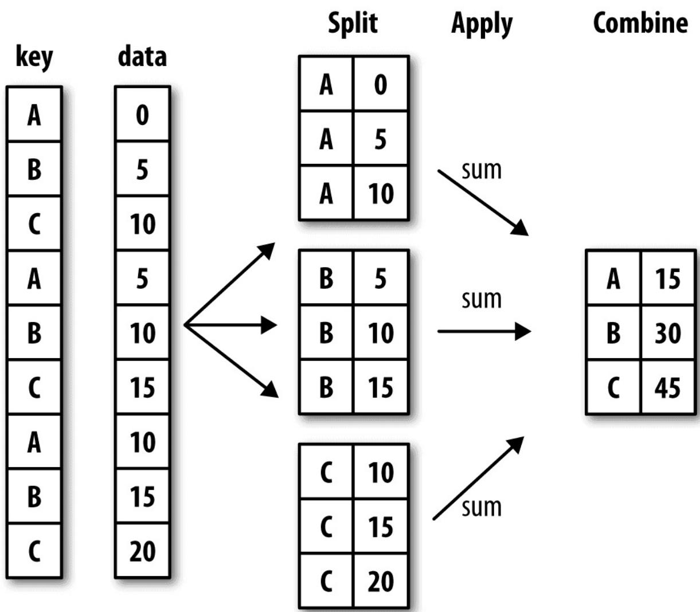
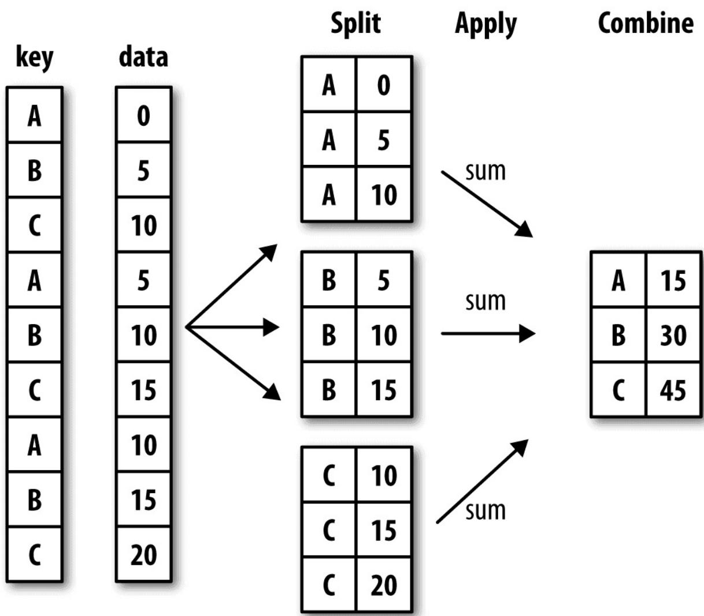

# 第10章 数据聚合与分组

## 10.1 GroupBy机制

Hadley Wickham（许多热门R语言包的作者）创造了一个用于表示分组运算的术语"split-apply-combine"（拆分－应用－合并）。第一个阶段，pandas对象（无论是Series、DataFrame还是其他的）中的数据会根据你所提供的一个或多个键被拆分（split）为多组。拆分操作是在对象的特定轴上执行的。例如，DataFrame可以在其行（axis=0）或列（axis=1）上进行分组。然后，将一个函数应用（apply）到各个分组并产生一个新值。最后，所有这些函数的执行结果会被合并（combine）到最终的结果对象中。结果对象的形式一般取决于数据上所执行的操作。图10-1大致说明了一个简单的分组聚合过程。



分组键可以有多种形式，且类型不必相同：

列表或数组，其长度与待分组的轴一样。

表示DataFrame某个列名的值。

字典或Series，给出待分组轴上的值与分组名之间的对应关系。

函数，用于处理轴索引或索引中的各个标签。

注意，后三种都只是快捷方式而已，其最终目的仍然是产生一组用于拆分对象的值。如果觉得这些东西看起来很抽象，不用担心，我将在本章中给出大量有关于此的示例。首先来看看下面这个非常简单的表格型数据集（以DataFrame的形式）：

```python
In [10]: df = pd.DataFrame({'key1': ['a', 'a', 'b', 'b', 'a'],
    ....:    'key2': ['one', 'two', 'one', 'two', 'one'],
    ....:    'data1': np.random.randn(5),
    ....:    'data2': np.random.randn(5)}

In [11]: df
Out[11]:
    data1 data2 key1 key20 -0.2047081.393406 a one
```

```txt
10.4789430.092908 a two
2 -0.5194390.281746 b one
3 -0.5557300.769023 b two
41.9657811.246435 a one
```

假设你想要按key1进行分组，并计算data1列的平均值。实现该功能的方式有很多，而我们这里要用的是：访问data1，并根据key1调用groupby：

```txt
In [12]: grouped = df['data1'].groupby(df['key1'])

In [13]: grouped
Out[13]: <pandas.core.groupby.SeriesGroupBy object at 0x7faa31537390>
```

变量grouped是一个GroupBy对象。它实际上还没有进行任何计算，只是含有一些有关分组键df['key1']的中间数据而已。换句话说，该对象已经有了接下来对各分组执行运算所需的一切信息。例如，我们可以调用GroupBy的mean方法来计算分组平均值：

```txt
In [14]: grouped.mean()
Out[14]:
key1
a 0.746672
b -0.537585
Name: data1, dtype: float64
```

稍后我将详细讲解.mean()的调用过程。这里最重要的是，数据（Series）根据分组键进行了聚合，产生了一个新的Series，其索引为key1列中的唯一值。之所以结果中索引的名称为key1，是因为原始DataFrame的列df['key1']就叫这个名字。

如果我们一次传入多个数组的列表，就会得到不同的结果：

```txt
In [15]: means = df['data1'].groupby([df['key1'], df['key2']]).mean()
In [16]: means
Out[16]:
key1 key2
a one 0.880536
two 0.478943
b one -0.519439
two -0.555730
Name: data1, dtype: float64
```

这里，我通过两个键对数据进行了分组，得到的 具有一个层次化索引（由唯一的键对组成）：

```txt
In [17]: means.unstack()
```

```txt
Out[17]:
key2 one two
key1
a 0.8805360.478943
b -0.519439 -0.555730
```

在这个例子中，分组键均为Series。实际上，分组键可以是任何长度适当的数组：

```python
In [18]: states = np.array(['Ohio', 'California', 'California', 'Ohio', 'Ohio'])
In [19]: years = np.array([2005, 2005, 2006, 2005, 2006])
In [20]: df['data1'].groupby([states, years]).mean()
Out[20]:
California 20050.4789432006 -0.519439
Ohio 2005 -0.38021920061.965781
Name: data1, dtype: float64
```

通常，分组信息就位于相同的要处理DataFrame中。这里，你还可以将列名（可以是字符串、数字或其他Python对象）用作分组键：

```csv
In [21]: df.groupby('key1').mean()
Out[21]:
data1 data2
key1
a 0.7466720.910916
b -0.5375850.525384
In [22]: df.groupby(['key1', 'key2']).mean()
Out[22]:
data1 data2
key1 key2
a one 0.8805361.319920
two 0.4789430.092908
b one -0.5194390.281746
two -0.5557300.769023
```

你可能已经注意到了，第一个例子在执行df.groupby('key1').mean()时，结果中没有key2列。这是因为df['key2']不是数值数据（俗称“麻烦列”），所以被从结果中排除了。默认情况下，所有数值列都会被聚合，虽然有时可能会被过滤为一个子集，稍后就会碰到。

无论你准备拿groupby做什么，都有可能会用到GroupBy的size方法，它可以返回一个含有分组大小的Series：

```txt
In [23]: df.groupby(['key1', 'key2']).size()
Out[23]:
key1 key2
a one 2
two 1
b one 1
two 1
dtype: int64
```

注意，任何分组关键词中的缺失值，都会被从结果中除去。

## 对分组进行迭代

GroupBy对象支持迭代，可以产生一组二元元组（由分组名和数据块组成）。看下面的例子：

```txt
In [24]: for name, group in df.groupby('key1'):
    ....:    print(name)
    ....:    print(group)
    ....:
a
data1 data2 key1 key20 -0.2047081.393406 a one
10.4789430.092908 a two
41.9657811.246435 a one
b
data1 data2 key1 key22 -0.5194390.281746 b one
3 -0.5557300.769023 b two
```

对于多重键的情况，元组的第一个元素将会是由键值组成的元组：

```txt
In [25]: for (k1, k2), group in df.groupby(['key1', 'key2]):
    ....:    print((k1, k2))
    ....:    print(group)
    ....:
('a', 'one')
data1 data2 key1 key20 -0.2047081.393406 a one
41.9657811.246435 a one
('a', 'two')
data1 data2 key1 key210.4789430.092908 a two
('b', 'one')
data1 data2 key1 key22 -0.5194390.281746 b one
```

```txt
('b', 'two')
data1 data2 key1 key23 -0.555730.769023 b two
```

当然，你可以对这些数据片段做任何操作。有一个你可能会觉得有用的运算：将这些数据片段做成一个字典：

```txt
In [26]: pieces = dict(list(df.groupby('key1'

In [27]: pieces['b']
Out[27]:
data1 data2 key1 key22 -0.5194390.281746 b one
3 -0.5557300.769023 b two
```

groupby默认是在axis=0上进行分组的，通过设置也可以在其他任何轴上进行分组。拿上面例子中的df来说，我们可以根据dtype对列进行分组：

```txt
In [28]: df.dtypes
Out[28]:
data1 float64
data2 float64
key1 object
key2 object
dtype: object
In [29]: grouped = df.groupby(df.dtypes, axis=1)
```

可以如下打印分组：

```txt
In [30]: for dtype, group in grouped:
....:    print(dtype)
....:    print(group)
....:
float64
data1 data20 -0.2047081.39340610.4789430.0929082 -0.5194390.2817463 -0.5557300.76902341.9657811.246435
object
key1 key20 a one
1 a two
2 b one
```

```txt
In [32]: s_grouped = df.groupby(['key1', 'key2'])['data2']

In [33]: s_grouped
Out[33]: <pandas.core.groupby.SeriesGroupBy object at 0x7faa30c78da0>

In [34]: s_grouped.mean()
Out[34]:
key1 key2
a one 1.319920
two 0.092908
b one 0.281746
two 0.769023
Name: data2, dtype: float64
```

<table><tr><td>3</td><td>b</td><td>two</td></tr><tr><td>4</td><td>a</td><td>one</td></tr></table>

## 选取一列或列的子集

对于由DataFrame产生的GroupBy对象，如果用一个（单个字符串）或一组（字符串数组）列名对其进行索引，就能实现选取部分列进行聚合的目的。也就是说：

```txt
df.groupby('key1')['data1']
df.groupby('key1')['data2']]
```

是以下代码的语法糖：

```txt
df['data1'].groupby(df['key1'])
df[['data2']].groupby(df['key1'])
```

尤其对于大数据集，很可能只需要对部分列进行聚合。例如，在前面那个数据集中，如果只需计算data2列的平均值并以DataFrame形式得到结果，可以这样写：

```csv
In [31]: df.groupby(['key1', 'key2'])[['data2']].mean()
Out[31]:
data2
key1 key2
a one 1.319920
two 0.092908
b one 0.281746
two 0.769023
```

这种索引操作所返回的对象是一个已分组的DataFrame（如果传入的是列表或数组）或已分组的Series（如果传入的是标量形式的单个列名）：

## 通过字典或Series进行分组

除数组以外，分组信息还可以其他形式存在。来看另一个示例DataFrame：

```python
In [35]: people = pd.DataFrame(np.random.randn(5, 5),
    .....:    columns=['a', 'b', 'c', 'd', 'e'],
    .....:    index=['Joe', 'Steve', 'Wes', 'Jim', 'Travis'])

In [36]: people.iloc[2:3, [1, 2]] = np.nan # Add a few NA values

In [37]: people
Out[37]:
    a    b    c    d    e
Joe    1.007189 -1.2962210.2749920.2289131.352917
Steve    0.886429 -2.001637 -0.3718431.669025 -0.438570
Wes    -0.539741    NaN    NaN -1.021228 -0.577087
Jim    0.1241210.3026140.5237720.0009401.343810
Travis   -0.713544 -0.831154 -2.370232 -1.860761 -0.860757
```

现在，假设已知列的分组关系，并希望根据分组计算列的和：

```txt
In [38]: mapping = {'a': 'red', 'b': 'red', 'c': 'blue', .....: 'd': 'blue', 'e': 'red', 'f': 'orange'}
```

现在，你可以将这个字典传给groupby，来构造数组，但我们可以直接传递字典（我包含了键“f”来强调，存在未使用的分组键是可以的）：

```python
In [39]: by_column = people.groupby(mapping, axis=1)
In [40]: by_column.sum()
Out[40]:
    blue    red
Joe    0.5039051.063885
Steve    1.297183  -1.553778
Wes    -1.021228  -1.116829
Jim    0.5247121.770545
Travis   -4.230992  -2.405455
```

Series也有同样的功能，它可以被看做一个固定大小的映射：

```python
In [41]: map_series = pd.Series(mapping)
In [42]: map_series
Out[42]:
```

```txt
a red  
b red  
c blue  
d blue  
e red  
f orange  
dtype: object
```

```javascript
In [43]: people.groupby(map_series, axis=1).count()
Out[43]:
```

<table><tr><td></td><td>blue</td><td>red</td></tr><tr><td>Joe</td><td>2</td><td>3</td></tr><tr><td>Steve</td><td>2</td><td>3</td></tr><tr><td>Wes</td><td>1</td><td>2</td></tr><tr><td>Jim</td><td>2</td><td>3</td></tr><tr><td>Travis</td><td>2</td><td>3</td></tr></table>

## 通过函数进行分组

比起使用字典或 ，使用 函数是一种更原生的方法定义分组映射。任何被当做分组键的函数都会在各个索引值上被调用一次，其返回值就会被用作分组名称。具体点说，以上一小节的示例DataFrame为例，其索引值为人的名字。你可以计算一个字符串长度的数组，更简单的方法是传入len函数：

```csv
In [44]: people.groupby(len).sum()
Out[44]:
a b c d e
30.591569 -0.9936080.798764 -0.7913742.11963950.886429 -2.001637 -0.3718431.669025 -0.4385706 -0.713544 -0.831154 -2.370232 -1.860761 -0.860757
```

将函数跟数组、列表、字典、 混合使用也不是问题，因为任何东西在内部都会被转换为数组：

```python
In [45]: key_list = ['one', 'one', 'one', 'two', 'two']
```

```python
In [46]: people.groupby([len, key_list]).min()
Out[46]:
```

<table><tr><td></td><td>a</td><td>b</td><td>c</td><td>d</td><td>e</td></tr><tr><td>3 one</td><td>-0.539741</td><td>-1.296221</td><td>0.274992</td><td>-1.021228</td><td>-0.577087</td></tr><tr><td>two</td><td>0.124121</td><td>0.302614</td><td>0.523772</td><td>0.000940</td><td>1.343810</td></tr><tr><td>5 one</td><td>0.886429</td><td>-2.001637</td><td>-0.371843</td><td>1.669025</td><td>-0.438570</td></tr><tr><td>6 two</td><td>-0.713544</td><td>-0.831154</td><td>-2.370232</td><td>-1.860761</td><td>-0.860757</td></tr></table>

## 根据索引级别分组

层次化索引数据集最方便的地方就在于它能够根据轴索引的一个级别进行聚合：

```python
In [47]: columns = pd.MultiIndex.from_arrays([['US', 'US', 'US', 'JP', 'JP'], ....:    [1, 3, 5, 1, 3]], ....:    names=['cty', 'tenor'])

In [48]: hier_df = pd.DataFrame(np.random.randn(4, 5), columns=columns)

In [49]: hier_df

Out[49]:
cty US JP
tenor 1351300.560145 -1.2659340.119827 -1.0635120.3328831 -2.359419 -0.199543 -1.541996 -0.970736 -1.30703020.2863500.377984 -0.7538870.3312861.34974230.0698770.246674 -0.0118621.0048121.327195
```

要根据级别分组，使用level关键字传递级别序号或名字：

```txt
In [50]: hier_df.groupby(level='cty', axis=1).count()
Out[50]:
cty JP US
023123223323
```

## 10.2 数据聚合

聚合指的是任何能够从数组产生标量值的数据转换过程。之前的例子已经用过一些，比如mean、count、min以及sum等。你可能想知道在GroupBy对象上调用mean()时究竟发生了什么。许多常见的聚合运算（如表10-1所示）都有进行优化。然而，除了这些方法，你还可以使用其它的。

```txt
函数名 说明
count 分组中非NA值的数量
sum 非NA值的和
mean 非NA值的平均值
median 非NA值的算术中位数
std、var 无偏（分母为n-1）标准差和方差
min、max 非NA值的最小值和最大值
prod 非NA值的积
first、last 第一个和最后一个非NA值
```

你可以使用自己发明的聚合运算，还可以调用分组对象上已经定义好的任何方法。例如，quantile可以计算Series或DataFrame列的样本分位数。

虽然quantile并没有明确地实现于GroupBy，但它是一个Series方法，所以这里是能用的。实际上，GroupBy会高效地对Series进行切片，然后对各片调用piece.quantile(0.9)，最后将这些结果组装成最终结果：

```txt
In [51]: df
Out[51]:
data1 data2 key1 key20 -0.2047081.393406 a one
10.4789430.092908 a two
2 -0.5194390.281746 b one
3 -0.5557300.769023 b two
41.9657811.246435 a one

In [52]: grouped = df.groupby('key1')

In [53]: grouped['data1'].quantile(0.9)
Out[53]:
key1
a 1.668413
b -0.523068
Name: data1, dtype: float64
```

如果要使用你自己的聚合函数，只需将其传入aggregate或agg方法即可：

```python
In [54]: def peak_to_peak(arr):
    ....: return arr.max() - arr.min()
In [55]: grouped.agg(peak_to_peak)
Out[55]:
    data1 data2
key1
a 2.1704881.300498
b 0.0362920.487276
```

你可能注意到注意，有些方法（如describe）也是可以用在这里的，即使严格来讲，它们并非聚合运算：

```csv
In [56]: grouped.describe()
Out[56]:
data1
count mean std min 25% 50% 75%
key1
a 3.00.7466721.109736 -0.2047080.1371180.4789431.222362
b 2.0 -0.5375850.025662 -0.555730 -0.546657 -0.537585 -0.528512
data2
max count mean std min 25% 50%
key1
a 1.9657813.00.9109160.7122170.0929080.6696711.246435
b -0.5194392.00.5253840.3445560.2817460.4035650.52538475% max
key1
a 1.3199201.393406
b 0.6472030.769023
```

在后面的10.3节，我将详细说明这到底是怎么回事。

笔记：自定义聚合函数要比表 中那些经过优化的函数慢得多。这是因为在构造中间分组数据块时存在非常大的开销（函数调用、数据重排等）。

## 面向列的多函数应用

回到前面小费的例子。使用read\_csv导入数据之后，我们添加了一个小费百分比的列tip\_pct：

```python
In [57]: tips = pd.read_csv('examples/tips.csv')

# Add tip percentage of total bill
In [58]: tips['tip_pct'] = tips['tip'] / tips['total_bill']

In [59]: tips[:6]
Out[59]:
    total_bill tip smoker day time size tip_pct
016.991.01 No Sun Dinner 20.059447110.341.66 No Sun Dinner 30.160542221.013.50 No Sun Dinner 30.166587323.683.31 No Sun Dinner 20.139780424.593.61 No Sun Dinner 40.146808525.294.71 No Sun Dinner 40.186240
```

你已经看到，对Series或DataFrame列的聚合运算其实就是使用aggregate（使用自定义函数）或调用诸如mean、std之类的方法。然而，你可能希望对不同的列使用不同的聚合函数，或一次应用多个函数。其实这也好办，我将通过一些示例来进行讲解。首先，我根据天和smoker对tips进行分组：

```txt
In [60]: grouped = tips.groupby(['day', 'smoker'])
```

注意，对于表10-1中的那些描述统计，可以将函数名以字符串的形式传入：

```txt
In [61]: grouped_pct = grouped['tip_pct']
In [62]: grouped_pct.agg('mean')
Out[62]:
day smoker
Fri No 0.151650
Yes 0.174783
Sat No 0.158048
Yes 0.147906
Sun No 0.160113
Yes 0.187250
Thur No 0.160298
Yes 0.163863
Name: tip_pct, dtype: float64
```

如果传入一组函数或函数名，得到的DataFrame的列就会以相应的函数命名：

```csv
In [63]: grouped_pct.agg(['mean', 'std', peak_to_peak])
Out[63]:
    mean    std    peak_to_peak
day smoker
Fri No 0.1516500.0281230.067349
Yes 0.1747830.0512930.159925
Sat No 0.1580480.0397670.235193
Yes 0.1479060.0613750.290095
Sun No 0.1601130.0423470.193226
Yes 0.1872500.1541340.644685
Thur No 0.1602980.0387740.193350
Yes 0.1638630.0393890.151240
```

这里，我们传递了一组聚合函数进行聚合，独立对数据分组进行评估。

你并非一定要接受GroupBy自动给出的那些列名，特别是lambda函数，它们的名称是''，这样的辨识度就很低了（通过函数的name属性看看就知道了）。因此，如果传入的是一个由(name,function)元组组成的列表，则各元组的第一个元素就会被用作DataFrame的列名（可以将这种二元元组列表看做一个有序映射）：

```txt
In [64]: grouped_pct.agg([('foo', 'mean'), ('bar', np.std)])
Out[64]:
    foo    bar
day smoker
Fri No 0.1516500.028123
Yes 0.1747830.051293
Sat No 0.1580480.039767
Yes 0.1479060.061375
Sun No 0.1601130.042347
Yes 0.1872500.154134
Thur No 0.1602980.038774
Yes 0.1638630.039389
```

<table><tr><td colspan="5">In [68]: result[&#x27;tip_pct&#x27;]</td></tr><tr><td colspan="5">Out[68]:</td></tr><tr><td></td><td></td><td>count</td><td>mean</td><td>max</td></tr><tr><td>day</td><td>smoker</td><td></td><td></td><td></td></tr><tr><td rowspan="2">Fri</td><td>No</td><td>4</td><td>0.151650</td><td>0.187735</td></tr><tr><td>Yes</td><td>15</td><td>0.174783</td><td>0.263480</td></tr><tr><td rowspan="2">Sat</td><td>No</td><td>45</td><td>0.158048</td><td>0.291990</td></tr><tr><td>Yes</td><td>42</td><td>0.147906</td><td>0.325733</td></tr><tr><td>Sun</td><td>No</td><td>57</td><td>0.160113</td><td>0.252672</td></tr></table>

对于DataFrame，你还有更多选择，你可以定义一组应用于全部列的一组函数，或不同的列应用不同的函数。假设我们想要对tip\_pct和total\_bill列计算三个统计信息：

```python
In [65]: functions = ['count', 'mean', 'max']
In [66]: result = grouped['tip_pct', 'total_bill'].agg(functions)
```

```txt
In [67]: result
Out[67]:
```

<table><tr><td rowspan="2" colspan="2"></td><td rowspan="2">tip_pct</td><td colspan="5">total_bill</td></tr><tr><td>mean</td><td>max</td><td>count</td><td>mean</td><td>max</td></tr><tr><td>day</td><td>smoker</td><td></td><td></td><td></td><td></td><td></td><td></td></tr><tr><td rowspan="2">Fri</td><td>No</td><td>4</td><td>0.151650</td><td>0.187735</td><td>4</td><td>18.420000</td><td>22.75</td></tr><tr><td>Yes</td><td>15</td><td>0.174783</td><td>0.263480</td><td>15</td><td>16.813333</td><td>40.17</td></tr><tr><td rowspan="2">Sat</td><td>No</td><td>45</td><td>0.158048</td><td>0.291990</td><td>45</td><td>19.661778</td><td>48.33</td></tr><tr><td>Yes</td><td>42</td><td>0.147906</td><td>0.325733</td><td>42</td><td>21.276667</td><td>50.81</td></tr><tr><td rowspan="2">Sun</td><td>No</td><td>57</td><td>0.160113</td><td>0.252672</td><td>57</td><td>20.506667</td><td>48.17</td></tr><tr><td>Yes</td><td>19</td><td>0.187250</td><td>0.710345</td><td>19</td><td>24.120000</td><td>45.35</td></tr><tr><td rowspan="2">Thur</td><td>No</td><td>45</td><td>0.160298</td><td>0.266312</td><td>45</td><td>17.113111</td><td>41.19</td></tr><tr><td>Yes</td><td>17</td><td>0.163863</td><td>0.241255</td><td>17</td><td>19.190588</td><td>43.11</td></tr></table>

如你所见，结果DataFrame拥有层次化的列，这相当于分别对各列进行聚合，然后用concat将结果组装到一起，使用列名用作keys参数：

```csv
In [69]: ftuples = [('Durchschnitt', 'mean'), ('Abweichung', np.var)]
In [70]: grouped['tip_pct', 'total_bill'].agg(ftuples)
Out[70]:
    tip_pct total_bill
    Durchschnitt Abweichung Durchschnitt Abweichung
day smoker
Fri No 0.1516500.00079118.42000025.596333
Yes 0.1747830.00263116.81333382.562438
Sat No 0.1580480.00158119.66177879.908965
Yes 0.1479060.00376721.276667101.387535
Sun No 0.1601130.00179320.50666766.099980
Yes 0.1872500.02375724.120000109.046044
Thur No 0.1602980.00150317.11311159.625081
Yes 0.1638630.00155119.19058869.808518
```

```txt
Yes 190.1872500.710345  
Thur No 450.1602980.266312  
Yes 170.1638630.241255
```

跟前面一样，这里也可以传入带有自定义名称的一组元组：

现在，假设你想要对一个列或不同的列应用不同的函数。具体的办法是向agg传入一个从列名映射到函数的字典：

```txt
In [71]: grouped.agg({'tip' : np.max, 'size' : 'sum'})  
Out[71]: tip size  
day smoker  
Fri No 3.509  
Yes 4.7331  
Sat No 9.00115  
Yes 10.00104  
Sun No 6.00167  
Yes 6.5049  
Thur No 6.70112  
Yes 5.0040  
In [72]: grouped.agg({'tip_pct' : ['min', 'max', 'mean', 'std'], 'size' : 'sum'})  
Out[72]: tip_pct min max mean std sum  
day smoker  
Fri No 0.1203850.1877350.1516500.0281239  
Yes 0.1035550.2634800.1747830.05129331  
Sat No 0.0567970.2919900.1580480.039767115
```

<table><tr><td></td><td>Yes</td><td>0.035638</td><td>0.325733</td><td>0.147906</td><td>0.061375</td><td>104</td></tr><tr><td rowspan="2">Sun</td><td>No</td><td>0.059447</td><td>0.252672</td><td>0.160113</td><td>0.042347</td><td>167</td></tr><tr><td>Yes</td><td>0.065660</td><td>0.710345</td><td>0.187250</td><td>0.154134</td><td>49</td></tr><tr><td rowspan="2">Thur</td><td>No</td><td>0.072961</td><td>0.266312</td><td>0.160298</td><td>0.038774</td><td>112</td></tr><tr><td>Yes</td><td>0.090014</td><td>0.241255</td><td>0.163863</td><td>0.039389</td><td>40</td></tr></table>

只有将多个函数应用到至少一列时，DataFrame才会拥有层次化的列。

## 以“没有行索引”的形式返回聚合数据

到目前为止，所有示例中的聚合数据都有由唯一的分组键组成的索引（可能还是层次化的）。由于并不总是需要如此，所以你可以向groupby传入as\_index=False以禁用该功能：

```txt
In [73]: tips.groupby(['day', 'smoker'], as_index=False).mean()
Out[73]:
    day smoker total_bill tip size tip_pct
0 Fri No 18.4200002.8125002.2500000.1516501 Fri Yes 16.8133332.7140002.0666670.1747832 Sat No 19.6617783.1028892.5555560.1580483 Sat Yes 21.2766672.8754762.4761900.1479064 Sun No 20.5066673.1678952.9298250.1601135 Sun Yes 24.1200003.5168422.5789470.1872506 Thur No 17.1131112.6737782.4888890.1602987 Thur Yes 19.1905883.0300002.3529410.163863
```

当然，对结果调用reset\_index也能得到这种形式的结果。使用as\_index=False方法可以避免一些不必要的计算。

## 10.3 apply：一般性的“拆分－应用－合并”

最通用的GroupBy方法是apply，本节剩余部分将重点讲解它。如图10-2所示，apply会将待处理的对象拆分成多个片段，然后对各片段调用传入的函数，最后尝试将各片段组合到一起。



回到之前那个小费数据集，假设你想要根据分组选出最高的5个tip\_pct值。首先，编写一个选取指定列具有最大值的行的函数：

```txt
In [74]: def top(df, n=5, column='tip_pct'):
    ....:    return df.sort_values(by=column)[-n:] 
In [75]: top(tips, n=6)
Out[75]:
total_bill tip smoker day time size tip_pct
10914.314.00 Yes Sat Dinner 20.27952518323.176.50 Yes Sun Dinner 40.28053523211.613.39 No Sat Dinner 20.291990673.071.00 Yes Sat Dinner 10.3257331789.604.00 Yes Sun Dinner 20.4166671727.255.15 Yes Sun Dinner 20.710345
```

现在，如果对smoker分组并用该函数调用apply，就会得到：

```javascript
In [76]: tips.groupby('smoker').apply(top)
```

<table><tr><td colspan="9">Out[76]:</td></tr><tr><td></td><td></td><td>total_bill</td><td colspan="2">tip smoker</td><td>day</td><td>time</td><td>size</td><td>tip_pct</td></tr><tr><td colspan="9">smoker</td></tr><tr><td rowspan="5">No</td><td>88</td><td>24.71</td><td>5.85</td><td>No</td><td>Thur</td><td>Lunch</td><td>2</td><td>0.236746</td></tr><tr><td>185</td><td>20.69</td><td>5.00</td><td>No</td><td>Sun</td><td>Dinner</td><td>5</td><td>0.241663</td></tr><tr><td>51</td><td>10.29</td><td>2.60</td><td>No</td><td>Sun</td><td>Dinner</td><td>2</td><td>0.252672</td></tr><tr><td>149</td><td>7.51</td><td>2.00</td><td>No</td><td>Thur</td><td>Lunch</td><td>2</td><td>0.266312</td></tr><tr><td>232</td><td>11.61</td><td>3.39</td><td>No</td><td>Sat</td><td>Dinner</td><td>2</td><td>0.291990</td></tr><tr><td rowspan="5">Yes</td><td>109</td><td>14.31</td><td>4.00</td><td>Yes</td><td>Sat</td><td>Dinner</td><td>2</td><td>0.279525</td></tr><tr><td>183</td><td>23.17</td><td>6.50</td><td>Yes</td><td>Sun</td><td>Dinner</td><td>4</td><td>0.280535</td></tr><tr><td>67</td><td>3.07</td><td>1.00</td><td>Yes</td><td>Sat</td><td>Dinner</td><td>1</td><td>0.325733</td></tr><tr><td>178</td><td>9.60</td><td>4.00</td><td>Yes</td><td>Sun</td><td>Dinner</td><td>2</td><td>0.416667</td></tr><tr><td>172</td><td>7.25</td><td>5.15</td><td>Yes</td><td>Sun</td><td>Dinner</td><td>2</td><td>0.710345</td></tr></table>

这里发生了什么？top函数在DataFrame的各个片段上调用，然后结果由pandas.concat组装到一起，并以分组名称进行了标记。于是，最终结果就有了一个层次化索引，其内层索引值来自原DataFrame。

如果传给apply的函数能够接受其他参数或关键字，则可以将这些内容放在函数名后面一并传入：

```txt
In [77]: tips.groupby(['smoker', 'day']).apply(top, n=1, column='total_bill')
Out[77]:
    total_bill tip smoker day time size tip_pct
smoker day
No Fri 9422.753.25 No Fri Dinner 20.142857
Sat 21248.339.00 No Sat Dinner 40.186220
Sun 15648.175.00 No Sun Dinner 60.103799
Thur 14241.195.00 No Thur Lunch 50.121389
Yes Fri 9540.174.73 Yes Fri Dinner 40.117750
Sat 17050.8110.00 Yes Sat Dinner 30.196812
Sun 18245.353.50 Yes Sun Dinner 30.077178
Thur 19743.115.00 Yes Thur Lunch 40.115982
```

笔记：除这些基本用法之外，能否充分发挥apply的威力很大程度上取决于你的创造力。传入的那个函数能做什么全由你说了算，它只需返回一个pandas对象或标量值即可。本章后续部分的示例主要用于讲解如何利用groupby解决各种各样的问题。

可能你已经想起来了，之前我在GroupBy对象上调用过describe：

```python
In [78]: result = tips.groupby('smoker')['tip_pct'].describe()
In [79]: result
Out[79]:
    count    mean    std    min    25%    50%    75% \
smoker
No    151.00.1593280.0399100.0567970.1369060.1556250.185014
Yes    93.00.1631960.0851190.0356380.1067710.1538460.195059
```

```csv
max
smoker
No 0.291990
Yes 0.710345
In [80]: result.unstack('smoker')
Out[80]:
smoker
count No 151.000000
Yes 93.000000
mean No 0.159328
Yes 0.163196
std No 0.039910
Yes 0.085119
min No 0.056797
Yes 0.03563825% No 0.136906
Yes 0.10677150% No 0.155625
Yes 0.15384675% No 0.185014
Yes 0.195059
max No 0.291990
Yes 0.710345
dtype: float64
```

在GroupBy中，当你调用诸如describe之类的方法时，实际上只是应用了下面两条代码的快捷方式而已：

```txt
f = lambda x: x.describe()
grouped.apply(f)
```

## 禁止分组键

从上面的例子中可以看出，分组键会跟原始对象的索引共同构成结果对象中的层次化索引。将group\_keys=False传入groupby即可禁止该效果：

```csv
In [81]: tips.groupby('smoker', group_keys=False).apply(top)
Out[81]:
total_bill tip smoker day time size tip_pct
8824.715.85 No Thur Lunch 20.23674618520.695.00 No Sun Dinner 50.2416635110.292.60 No Sun Dinner 20.2526721497.512.00 No Thur Lunch 20.26631223211.613.39 No Sat Dinner 20.291990
```

<table><tr><td>109</td><td>14.31</td><td>4.00</td><td>Yes</td><td>Sat</td><td>Dinner</td><td>2</td><td>0.279525</td></tr><tr><td>183</td><td>23.17</td><td>6.50</td><td>Yes</td><td>Sun</td><td>Dinner</td><td>4</td><td>0.280535</td></tr><tr><td>67</td><td>3.07</td><td>1.00</td><td>Yes</td><td>Sat</td><td>Dinner</td><td>1</td><td>0.325733</td></tr><tr><td>178</td><td>9.60</td><td>4.00</td><td>Yes</td><td>Sun</td><td>Dinner</td><td>2</td><td>0.416667</td></tr><tr><td>172</td><td>7.25</td><td>5.15</td><td>Yes</td><td>Sun</td><td>Dinner</td><td>2</td><td>0.710345</td></tr></table>

## 分位数和桶分析

我曾在第8章中讲过，pandas有一些能根据指定面元或样本分位数将数据拆分成多块的工具（比如cut和qcut）。将这些函数跟groupby结合起来，就能非常轻松地实现对数据集的桶（bucket）或分位数（quantile）分析了。以下面这个简单的随机数据集为例，我们利用cut将其装入长度相等的桶中：

```txt
In [82]: frame = pd.DataFrame({'data1': np.random.randn(1000), ....: 'data2': np.random.randn(1000)})

In [83]: quartiles = pd.cut(frame.data1, 4)

In [84]: quartiles[:10]

Out[84]:
0 (-1.23, 0.489]
1 (-2.956, -1.23]
2 (-1.23, 0.489]
3 (0.489, 2.208]
4 (-1.23, 0.489]
5 (0.489, 2.208]
6 (-1.23, 0.489]
7 (-1.23, 0.489]
8 (0.489, 2.208]
9 (0.489, 2.208]

Name: data1, dtype: category

Categories (4, interval[float64]): [(-2.956, -1.23] < (-1.23, 0.489] < (0.489, 2.208] < (2.208, 3.928]]
```

由cut返回的Categorical对象可直接传递到groupby。因此，我们可以像下面这样对data2列做一些统计计算：

```python
In [85]: def get_stats(group):
    ....: return {'min': group.min(), 'max': group.max(),
    ....: 'count': group.count(), 'mean': group.mean()}

In [86]: grouped = frame.data2.groupby(quartiles)

In [87]: grouped.apply(get_stats).unstack()
Out[87]:
```

```python
# Return quantile numbers
In [88]: grouping = pd.qcut(frame.data1, 10, labels=False)
In [89]: grouped = frame.data2.groupby(grouping)
In [90]: grouped.apply(get_stats).unstack()
Out[90]:
    count    max    mean    min
data10100.01.670835  -0.049902  -3.3993121100.02.6284410.030989  -1.9500982100.02.527939  -0.067179  -2.9251133100.03.2603830.065713  -2.3155554100.02.074345  -0.111653  -2.0479395100.02.1848100.052130  -2.9897416100.02.458842  -0.021489  -2.2235067100.02.954439  -0.026459  -3.0569908100.02.7355270.103406  -3.7453569100.02.3770200.220122  -2.064111
```

<table><tr><td></td><td>count</td><td>max</td><td>mean</td><td>min</td></tr><tr><td colspan="5">data1</td></tr><tr><td>(-2.956, -1.23]</td><td>95.0</td><td>1.670835</td><td>-0.039521</td><td>-3.399312</td></tr><tr><td>(-1.23, 0.489]</td><td>598.0</td><td>3.260383</td><td>-0.002051</td><td>-2.989741</td></tr><tr><td>(0.489, 2.208]</td><td>297.0</td><td>2.954439</td><td>0.081822</td><td>-3.745356</td></tr><tr><td>(2.208, 3.928]</td><td>10.0</td><td>1.765640</td><td>0.024750</td><td>-1.929776</td></tr></table>

这些都是长度相等的桶。要根据样本分位数得到大小相等的桶，使用qcut即可。传入labels=False即可只获取分位数的编号：

我们会在第12章详细讲解pandas的Categorical类型。

## 示例：用特定于分组的值填充缺失值

对于缺失数据的清理工作，有时你会用dropna将其替换掉，而有时则可能会希望用一个固定值或由数据集本身所衍生出来的值去填充NA值。这时就得使用fillna这个工具了。在下面这个例子中，我用平均值去填充NA值：

```python
In [91]: s = pd.Series(np.random.randn(6))
In [92]: s[::2] = np.nan
In [93]: s
Out[93]:
0    NaN
1    -0.125921
```

```yaml
2 NaN
3 -0.8844754 NaN
50.227290
dtype: float64

In [94]: s.fillna(s.mean())
Out[94]:
0 -0.2610351 -0.1259212 -0.2610353 -0.8844754 -0.26103550.227290
dtype: float64
```

假设你需要对不同的分组填充不同的值。一种方法是将数据分组，并使用apply和一个能够对各数据块调用fillna的函数即可。下面是一些有关美国几个州的示例数据，这些州又被分为东部和西部：

```txt
In [95]: states = ['Ohio', 'New York', 'Vermont', 'Florida', ....: 'Oregon', 'Nevada', 'California', 'Idaho']

In [96]: group_key = ['East'] * 4 + ['West'] * 4

In [97]: data = pd.Series(np.random.randn(8), index=states)

In [98]: data
Out[98]:
Ohio 0.922264
New York -2.153545
Vermont -0.365757
Florida -0.375842
Oregon 0.329939
Nevada 0.981994
California 1.105913
Idaho -1.613716
dtype: float64
```

['East'] \* 4产生了一个列表，包括了['East']中元素的四个拷贝。将这些列表串联起来。

将一些值设为缺失：

```txt
In [99]: data[['Vermont', 'Nevada', 'Idaho']] = np.nan
In [100]: data
Out[100]:
```

```txt
Ohio 0.922264
New York -2.153545
Vermont NaN
Florida -0.375842
Oregon 0.329939
Nevada NaN
California 1.105913
Idaho NaN
dtype: float64

In [101]: data.groupby(group_key).mean()
Out[101]:
East -0.535707
West 0.717926
dtype: float64
```

我们可以用分组平均值去填充NA值:

```txt
In [102]: fill_mean = lambda g: g.fillna(g.mean())
In [103]: data.groupby(group_key).apply(fill_mean)
Out[103]:
Ohio 0.922264
New York -2.153545
Vermont -0.535707
Florida -0.375842
Oregon 0.329939
Nevada 0.717926
California 1.105913
Idaho 0.717926
dtype: float64
```

另外，也可以在代码中预定义各组的填充值。由于分组具有一个name属性，所以我们可以拿来用一下：

```python
In [104]: fill_values = {'East': 0.5, 'West': -1}
In [105]: fill_func = lambda g: g.fillna(fill_values[g.name])
In [106]: data.groupby(group_key).apply(fill_func)
Out[106]:
Ohio    0.922264
New York   -2.153545
Vermont    0.500000
Florida    -0.375842
Oregon    0.329939
Nevada    -1.000000
```

```txt
California 1.105913
Idaho -1.000000
dtype: float64
```

## 示例：随机采样和排列

假设你想要从一个大数据集中随机抽取（进行替换或不替换）样本以进行蒙特卡罗模拟（MonteCarlo simulation）或其他分析工作。“抽取”的方式有很多，这里使用的方法是对Series使用sample方法：

```python
# Hearts, Spades, Clubs, Diamonds
suits = ['H', 'S', 'C', 'D']
card_val = (list(range(1, 11)) + [10] * 3) * 4
base_names = ['A'] + list(range(2, 11)) + ['J', 'K', 'Q']
cards = []
for suit in ['H', 'S', 'C', 'D']:
    cards.extend(str(num) + suit for num in base_names)
deck = pd.Series(card_val, index=cards)
```

现在我有了一个长度为52的Series，其索引包括牌名，值则是21点或其他游戏中用于计分的点数（为了简单起见，我当A的点数为1）：

```asm
In [108]: deck[:13]
Out[108]:
AH 12H 23H 34H 45H 56H 67H 78H 89H 910H 10
JH 10
KH 10
QH 10
dtype: int64
```

现在，根据我上面所讲的，从整副牌中抽出 张，代码如下：

```python
In [109]: def draw(deck, n=5):
......: return deck.sample(n)
```

```asm
In [110]: draw(deck)
Out[110]:
AD 18C 85H 5
KC 102C 2
dtype: int64
```

假设你想要从每种花色中随机抽取两张牌。由于花色是牌名的最后一个字符，所以我们可以据此进行分组，并使用apply：

```asm
In [111]: get_suit = lambda card: card[-1] # last letter is suit
In [112]: deck.groupby(get_suit).apply(draw, n=2)
Out[112]:
C 2C 23C 3
D KD 108D 8
H KH 103H 3
S 2S 24S 4
dtype: int64
```

或者，也可以这样写：

```asm
In [113]: deck.groupby(get_suit, group_keys=False).apply(draw, n=2)
Out[113]:
KC 10
JC 10
AD 15D 55H 56H 67S 7
KS 10
dtype: int64
```

## 示例：分组加权平均数和相关系数

根据groupby的“拆分－应用－合并”范式，可以进行DataFrame的列与列之间或两个Series之间的运算（比如分组加权平均）。以下面这个数据集为例，它含有分组键、值以及一些权重值：

```python
In [114]: df = pd.DataFrame({'category': ['a', 'a', 'a', 'a', 'b', 'b', 'b', 'b'], 'data': np.random.randn(8), 'weights': np.random.randn(8)})

In [115]: df
Out[115]:
category data weights
0 a 1.5615870.9575151 a 1.2199840.3472672 a -0.4822390.5813623 a 0.3156670.2170914 b -0.0478520.8944065 b -0.4541450.9185646 b -0.5567740.2778257 b 0.2533210.955905
```

然后可以利用category计算分组加权平均数：

```python
In [116]: grouped = df.groupby('category')
In [117]: get_wavg = lambda g: np.average(g['data'], weights=g['weights'])
In [118]: grouped.apply(get_wavg)
Out[118]:
category
a 0.811643
b -0.122262
dtype: float64
```

另一个例子，考虑一个来自Yahoo!Finance的数据集，其中含有几只股票和标准普尔500指数（符号SPX）的收盘价：

```txt
In [119]: close_px = pd.read_csv('examples/stock_px_2.csv', parse_dates=True, .....: index_col=0)
In [120]: close_px.info()
<class 'pandas.core.frame.DataFrame'>
DatetimeIndex: 2214 entries, 2003-01-02 to 2011-10-14
Data columns (total 4 columns):
AAPL 2214 non-null float64
MSFT 2214 non-null float64
XOM 2214 non-null float64
SPX 2214 non-null float64
dtypes: float64(4)
memory usage: 86.5 KB
```

```txt
In [121]: close_px[-4:]
Out[121]:
```

<table><tr><td></td><td>AAPL</td><td>MSFT</td><td>XOM</td><td>SPX</td></tr><tr><td>2011-10-11</td><td>400.29</td><td>27.00</td><td>76.27</td><td>1195.54</td></tr><tr><td>2011-10-12</td><td>402.19</td><td>26.96</td><td>77.16</td><td>1207.25</td></tr><tr><td>2011-10-13</td><td>408.43</td><td>27.18</td><td>76.37</td><td>1203.66</td></tr><tr><td>2011-10-14</td><td>422.00</td><td>27.27</td><td>78.11</td><td>1224.58</td></tr></table>

来做一个比较有趣的任务：计算一个由日收益率（通过百分数变化计算）与SPX之间的年度相关系数组成的DataFrame。下面是一个实现办法，我们先创建一个函数，用它计算每列和SPX列的成对相关系数：

```txt
In [122]: spx_corr = lambda x: x.corrwith(x['SPX'])
```

接下来，我们使用pct\_change计算close\_px的百分比变化：

```python
In [123]: rets = close_px.pct_change().dropna()
```

最后，我们用年对百分比变化进行分组，可以用一个一行的函数，从每行的标签返回每个datetime标签的year属性：

```txt
In [124]: get_year = lambda x: x.year
```

```python
In [125]: by_year = rets.groupby(get_year)
```

```txt
In [126]: by_year.apply(spx_corr)
Out[126]:
```

<table><tr><td></td><td>AAPL</td><td>MSFT</td><td>XOM</td><td>SPX</td></tr><tr><td>2003</td><td>0.541124</td><td>0.745174</td><td>0.661265</td><td>1.0</td></tr><tr><td>2004</td><td>0.374283</td><td>0.588531</td><td>0.557742</td><td>1.0</td></tr><tr><td>2005</td><td>0.467540</td><td>0.562374</td><td>0.631010</td><td>1.0</td></tr><tr><td>2006</td><td>0.428267</td><td>0.406126</td><td>0.518514</td><td>1.0</td></tr><tr><td>2007</td><td>0.508118</td><td>0.658770</td><td>0.786264</td><td>1.0</td></tr><tr><td>2008</td><td>0.681434</td><td>0.804626</td><td>0.828303</td><td>1.0</td></tr><tr><td>2009</td><td>0.707103</td><td>0.654902</td><td>0.797921</td><td>1.0</td></tr><tr><td>2010</td><td>0.710105</td><td>0.730118</td><td>0.839057</td><td>1.0</td></tr><tr><td>2011</td><td>0.691931</td><td>0.800996</td><td>0.859975</td><td>1.0</td></tr></table>

当然，你还可以计算列与列之间的相关系数。这里，我们计算Apple和Microsoft的年相关系数：

```python
In [127]: by_year.apply(lambda g: g['AAPL'].corr(g['MSFT']))  
Out[127]:  
20030.48086820040.259024
```

```txt
20050.30009320060.16173520070.41773820080.61190120090.43273820100.57194620110.581987
dtype: float64
```

## 示例：组级别的线性回归

顺着上一个例子继续，你可以用groupby执行更为复杂的分组统计分析，只要函数返回的是pandas对象或标量值即可。例如，我可以定义下面这个regress函数（利用statsmodels计量经济学库）对各数据块执行普通最小二乘法（Ordinary Least Squares，OLS）回归：

```python
import statsmodels.api as sm
def regress(data, yvar, xvars):
    Y = data[yvar]
    X = data[xvars]
    X['intercept'] = 1.
    result = sm.OLS(Y, X).fit()
    return result.params
```

现在，为了按年计算AAPL对SPX收益率的线性回归，执行：

```csv
In [129]: by_year.apply(regress, 'AAPL', ['SPX'])
Out[129]:
SPX intercept
20031.1954060.00071020041.3634630.00420120051.7664150.00324620061.6454960.00008020071.1987610.00343820080.968016 -0.00111020090.8791030.00295420101.0526080.00126120110.8066050.001514
```

## 10.4 透视表和交叉表

透视表（pivot table）是各种电子表格程序和其他数据分析软件中一种常见的数据汇总工具。它根据一个或多个键对数据进行聚合，并根据行和列上的分组键将数据分配到各个矩形区域中。在Python和pandas中，可以通过本章所介绍的groupby功能以及（能够利用层次化索引的）重塑运算制作透视表。DataFrame有一个pivot\_table方法，此外还有一个顶级的pandas.pivot\_table函数。除能为groupby提供便利之外，pivot\_table还可以添加分项小计，也叫做margins。

回到小费数据集，假设我想要根据day和smoker计算分组平均数（pivot\_table的默认聚合类型），并将day和smoker放到行上：

```python
In [130]: tips.pivot_table(index=['day', 'smoker'])
Out[130]:
    size tip tip_pct total_bill
day smoker
Fri No 2.2500002.8125000.15165018.420000
Yes 2.0666672.7140000.17478316.813333
Sat No 2.5555563.1028890.15804819.661778
Yes 2.4761902.8754760.14790621.276667
Sun No 2.9298253.1678950.16011320.506667
Yes 2.5789473.5168420.18725024.120000
Thur No 2.4888892.6737780.16029817.113111
Yes 2.3529413.0300000.16386319.190588
```

可以用groupby直接来做。现在，假设我们只想聚合tip\_pct和size，而且想根据time进行分组。我将smoker放到列上，把day放到行上：

```txt
In [131]: tips.pivot_table(['tip_pct', 'size'], index=['time', 'day'], .....:    columns='smoker')

Out[131]:
    size    tip_pct
smoker    No    Yes    No    Yes
time day
Dinner Fri 2.0000002.2222220.1396220.165347
Sat 2.5555562.4761900.1580480.147906
Sun 2.9298252.5789470.1601130.187250
Thur 2.000000 NaN 0.159744 NaN
Lunch Fri 3.0000001.8333330.1877350.188937
Thur 2.5000002.3529410.1603110.163863
```

还可以对这个表作进一步的处理，传入margins=True添加分项小计。这将会添加标签为All的行和列，其值对应于单个等级中所有数据的分组统计：

```python
In [132]: tips.pivot_table(['tip_pct', 'size'], index=['time', 'day'], .....: columns='smoker', margins=True)
Out[132]:
    size
    No Yes All No Yes All
smoker time day
Dinner Fri 2.0000002.2222222.1666670.1396220.1653470.158916
Sat 2.5555562.4761902.5172410.1580480.1479060.153152
```

```txt
Sun 2.9298252.5789472.8421050.1601130.1872500.166897
Thur 2.000000 NaN 2.0000000.159744 NaN 0.159744
Lunch Fri 3.0000001.8333332.0000000.1877350.1889370.188765
Thur 2.5000002.3529412.4590160.1603110.1638630.161301
All 2.6688742.4086022.5696720.1593280.1631960.160803
```

这里，All值为平均数：不单独考虑烟民与非烟民（All列），不单独考虑行分组两个级别中的任何单项（All行）。

要使用其他的聚合函数，将其传给aggfunc即可。例如，使用count或len可以得到有关分组大小的交叉表（计数或频率）：

```python
In [133]: tips.pivot_table('tip_pct', index=['time', 'smoker'], columns='day', .....: aggfunc=len, margins=True)
Out[133]:
day    Fri    Sat    Sun    Thur    All
time smoker
Dinner No 3.045.057.01.0106.0
Yes 9.042.019.0 NaN 70.0
Lunch No 1.0 NaN NaN 44.045.0
Yes 6.0 NaN NaN 17.023.0
All 19.087.076.062.0244.0
```

如果存在空的组合（也就是NA），你可能会希望设置一个fill\_value：

```python
In [134]: tips.pivot_table('tip_pct', index=['time', 'size', 'smoker'], .....: columns='day', aggfunc='mean', fill_value=0)
```

<table><tr><td>4</td><td>No</td><td>0.000000</td><td>0.000000</td><td>0.000000</td><td>0.138919</td></tr><tr><td></td><td>Yes</td><td>0.000000</td><td>0.000000</td><td>0.000000</td><td>0.155410</td></tr><tr><td>5</td><td>No</td><td>0.000000</td><td>0.000000</td><td>0.000000</td><td>0.121389</td></tr><tr><td>6</td><td>No</td><td>0.000000</td><td>0.000000</td><td>0.000000</td><td>0.173706</td></tr><tr><td colspan="6">[21 rows x 4 columns]</td></tr></table>

pivot\_table的参数说明请参见表10-2。

<table><tr><td>函数名</td><td>说明</td></tr><tr><td>values</td><td>待聚合的列的名称。默认聚合所有数值列</td></tr><tr><td>index</td><td>用于分组的列名或其他分组键,出现在结果透视表的行</td></tr><tr><td>columns</td><td>用于分组的列名或其他分组键,出现在结果透视表的列</td></tr><tr><td>aggfunc</td><td>聚合函数或函数列表,默认为 mean。可以是任何对 groupby 有效的函数</td></tr><tr><td>fill_value</td><td>用于替换结果表中的缺失值</td></tr><tr><td>dropna</td><td>如果为 True,不添加条目都为 NA 的列</td></tr><tr><td>margins</td><td>添加行/列小计和总计,默认为 False</td></tr></table>

## 交叉表：crosstab

交叉表（cross-tabulation，简称crosstab）是一种用于计算分组频率的特殊透视表。看下面的例子：

```txt
In [138]: data
Out[138]:
Sample Nationality Handedness
01 USA Right-handed
12 Japan Left-handed
23 USA Right-handed
34 Japan Right-handed
45 Japan Left-handed
56 Japan Right-handed
67 USA Right-handed
78 USA Left-handed
89 Japan Right-handed
910 USA Right-handed
```

作为调查分析的一部分，我们可能想要根据国籍和用手习惯对这段数据进行统计汇总。虽然可以用pivot\_table实现该功能，但是pandas.crosstab函数会更方便：

```txt
In [139]: pd.crosstab(data.Nationality, data.Handedness, margins=True)
Out[139]:
Handedness Left-handed Right-handed All
Nationality
Japan 235
```

<table><tr><td>USA</td><td>1</td><td>4</td><td>5</td></tr><tr><td>All</td><td>3</td><td>7</td><td>10</td></tr></table>

crosstab的前两个参数可以是数组或Series，或是数组列表。就像小费数据：

```txt
In [140]: pd.crosstab([tips.time, tips.day], tips.smoker, margins=True)
Out[140]:
smoker    No Yes All
time day
Dinner Fri 3912
Sat 454287
Sun 571976
Thur 101
Lunch Fri 167
Thur 441761
All 15193244
```

## 10.5 总结

掌握pandas数据分组工具既有助于数据清理，也有助于建模或统计分析工作。在第14章，我们会看几个例子，对真实数据使用groupby。

在下一章，我们将关注时间序列数据。

时间序列（time series）数据是一种重要的结构化数据形式，应用于多个领域，包括金融学、经济学、生态学、神经科学、物理学等。在多个时间点观察或测量到的任何事物都可以形成一段时间序列。很多时间序列是固定频率的，也就是说，数据点是根据某种规律定期出现的（比如每15秒、每5分钟、每月出现一次）。时间序列也可以是不定期的，没有固定的时间单位或单位之间的偏移量。时间序列数据的意义取决于具体的应用场景，主要有以下几种：

时间戳（timestamp），特定的时刻。

固定时期（period），如2007年1月或2010年全年。

时间间隔（interval），由起始和结束时间戳表示。时期（period）可以被看做间隔（interval）的特例。

实验或过程时间，每个时间点都是相对于特定起始时间的一个度量。例如，从放入烤箱时起，每秒钟饼干的直径。

本章主要讲解前 种时间序列。许多技术都可用于处理实验型时间序列，其索引可能是一个整数或浮点数（表示从实验开始算起已经过去的时间）。最简单也最常见的时间序列都是用时间戳进行索引的。

提示：pandas也支持基于timedeltas的指数，它可以有效代表实验或经过的时间。这本书不涉及timedelta指数，但你可以学习pandas的文档（http://pandas.pydata.org/）。

pandas提供了许多内置的时间序列处理工具和数据算法。因此，你可以高效处理非常大的时间序列，轻松地进行切片/切块、聚合、对定期/不定期的时间序列进行重采样等。有些工具特别适合金融和经济应用，你当然也可以用它们来分析服务器日志数据。

