# 第14章 数据分析案例

## 14.1 来自Bitly的USA.gov数据

2011年，URL缩短服务Bitly跟美国政府网站USA.gov合作，提供了一份从生成.gov或.mil短链接的用户那里收集来的匿名数据。在2011年，除实时数据之外，还可以下载文本文件形式的每小时快照。写作此书时（2017年），这项服务已经关闭，但我们保存一份数据用于本书的案例。

以每小时快照为例，文件中各行的格式为JSON（即JavaScript Object Notation，这是一种常用的Web数据格式）。例如，如果我们只读取某个文件中的第一行，那么所看到的结果应该是下面这样：

```javascript
In [5]: path = 'datasets/bitly_usagov/example.txt'
In [6]: open(path).readline()
Out[6]: '{"a": "Mozilla\/5.0 (Windows NT 6.1; WOW64) AppleWebKit\/535.11 (KHTML, like Gecko) Chrome\/17.0.963.78 Safari\/535.11", "c": "US", "nk": 1, "tz": "America\/New_York", "gr": "MA", "g": "A6q0VH", "h": "wfLQtf", "l": "orofrog", "al": "en-US,en;q=0.8", "hh": "1.usa.gov", "r": "http://www.facebook.com\/l\/7AQEFzjSi\/1.usa.gov\/wfLQtf", "u": "http://www.ncbi.nlm.nih.gov\/pubmed\/22415991", "t": 1331923247, "hc": 1331822918, "cy": "Danvers", "ll": [ 42.576698, -70.954903 ]}\n'
```

Python有内置或第三方模块可以将JSON字符串转换成Python字典对象。这里，我将使用json模块及其loads函数逐行加载已经下载好的数据文件：

```python
import json
path = 'datasets/bitly_usagov/example.txt'
records = [json.loads(line) for line in open(path)]
```

现在，records对象就成为一组Python字典了：

```txt
In [18]: records[0]
Out[18]:
{'a': 'Mozilla/5.0 (Windows NT 6.1; WOW64) AppleWebKit/535.11 (KHTML, like Gecko)
Chrome/17.0.963.78 Safari/535.11',
'al': 'en-US,en;q=0.8',
'c': 'US',
'cy': 'Danvers',
'g': 'A6q0VH',
'gr': 'MA',
```

```javascript
'h': 'wfLQtf',
'hc': 1331822918,
'hh': '1.usa.gov',
'l': 'orofrog',
'll': [42.576698, -70.954903],
'nk': 1,
'r': 'http://www.facebook.com/l/7AQEFzjSi/1.usa.gov/wfLQtf',
't': 1331923247,
'tz': 'America/New_York',
'u': 'http://www.ncbi.nlm.nih.gov/pubmed/22415991'}
```

## 用纯Python代码对时区进行计数

假设我们想要知道该数据集中最常出现的是哪个时区（即tz字段），得到答案的办法有很多。首先，我们用列表推导式取出一组时区：

```diff
In [12]: time_zones = [rec['tz'] for rec in records]
---->
KeyError Traceback (most recent call last)
<ipython-input-12-db4fbd348da9> in <module>()
----> 1 time_zones = [rec['tz'] for rec in records]
<ipython-input-12-db4fbd348da9> in <listcomp>(.0)
----> 1 time_zones = [rec['tz'] for rec in records]
KeyError: 'tz'
```

晕！原来并不是所有记录都有时区字段。这个好办，只需在列表推导式末尾加上一个if 'tz'in rec判断即可：

```python
In [13]: time_zones = [rec['tz'] for rec in records if 'tz' in rec]

In [14]: time_zones[:10]

Out[14]:
['America/New_York',
    'America/Denver',
    'America/New_York',
    'America/Sao_Paulo',
    'America/New_York',
    'America/New_York',
    'Europe/Warsaw',
    '',
    '',
    '']
```

```python
In [17]: counts = get_counts(time_zones)
In [18]: counts['America/New_York']
Out[18]: 1251
In [19]: len(time_zones)
Out[19]: 3440
```

只看前10个时区，我们发现有些是未知的（即空的）。虽然可以将它们过滤掉，但现在暂时先留着。接下来，为了对时区进行计数，这里介绍两个办法：一个较难（只使用标准Python库），另一个较简单（使用pandas）。计数的办法之一是在遍历时区的过程中将计数值保存在字典中：

```python
def get_counts(sequence):
    counts = {}
    for x in sequence:
    if x in counts:
    counts[x] += 1
    else:
    counts[x] = 1
    return counts
```

如果使用Python标准库的更高级工具，那么你可能会将代码写得更简洁一些：

```python
from collections import defaultdict

def get_counts2(sequence):
    counts = defaultdict(int)  # values will initialize to 0
    for x in sequence:
    counts[x] += 1
    return counts
```

我将逻辑写到函数中是为了获得更高的复用性。要用它对时区进行处理，只需将time\_zones传入即可：

如果想要得到前10位的时区及其计数值，我们需要用到一些有关字典的处理技巧：

```python
def top_counts(count_dict, n=10):
    value_key_pairs = [(count, tz) for tz, count in count_dict.items()]
    value_key_pairs.sort()
    return value_key_pairs[-n:]
```

然后有：

```txt
In [21]: top_counts(counts)
Out[21]:
```

```javascript
[(33, 'America/Sao_Paulo'),
(35, 'Europe/Madrid'),
(36, 'Pacific/Honolulu'),
(37, 'Asia/Tokyo'),
(74, 'Europe/London'),
(191, 'America/Denver'),
(382, 'America/Los_Angeles'),
(400, 'America/Chicago'),
(521, ''),
(1251, 'America/New_York')]
```

如果你搜索Python的标准库，你能找到collections.Counter类，它可以使这项工作更简单：

```python
In [22]: from collections import Counter
In [23]: counts = Counter(time_zones)
In [24]: counts.most_common(10)
Out[24]:
[('America/New_York', 1251),
 ('', 521),
 ('America/Chicago', 400),
 ('America/Los_Angeles', 382),
 ('America/Denver', 191),
 ('Europe/London', 74),
 ('Asia/Tokyo', 37),
 ('Pacific/Honolulu', 36),
 ('Europe/Madrid', 35),
 ('America/Sao_Paulo', 33)]
```

## 用pandas对时区进行计数

从原始记录的集合创建DateFrame，与将记录列表传递到pandas.DataFrame一样简单：

```txt
In [25]: import pandas as pd
In [26]: frame = pd.DataFrame(records)
In [27]: frame.info()
<class 'pandas.core.frame.DataFrame'>
RangeIndex: 3560 entries, 0 to 3559
Data columns (total 18 columns):
_heartbeat_ 120 non-null float64
a 3440 non-null object
al 3094 non-null object
c 2919 non-null object
```

```txt
cy 2919 non-null object
g 3440 non-null object
gr 2919 non-null object
h 3440 non-null object
hc 3440 non-null float64
hh 3440 non-null object
kw 93 non-null object
l 3440 non-null object
ll 2919 non-null object
nk 3440 non-null float64
r 3440 non-null object
t 3440 non-null float64
tz 3440 non-null object
u 3440 non-null object

dtypes: float64(4), object(14)
memory usage: 500.7+ KB

In [28]: frame['tz'][:10]
Out[28]:
0 America/New_York
1 America/Denver
2 America/New_York
3 America/Sao_Paulo
4 America/New_York
5 America/New_York
6 Europe/Warsaw
789
Name: tz, dtype: object
```

这里frame的输出形式是摘要视图（summary view），主要用于较大的DataFrame对象。我们然后可以对Series使用value\_counts方法：

```txt
In [29]: tz_counts = frame['tz'].value_counts()
In [30]: tz_counts[:10]
Out[30]:
America/New_York 1251521
America/Chicago 400
America/Los_Angeles 382
America/Denver 191
Europe/London 74
Asia/Tokyo 37
Pacific/Honolulu 36
Europe/Madrid 35
America/Sao_Paulo 33
```

```yaml
Name: tz, dtype: int64
```

我们可以用matplotlib可视化这个数据。为此，我们先给记录中未知或缺失的时区填上一个替代值。fillna函数可以替换缺失值（NA），而未知值（空字符串）则可以通过布尔型数组索引加以替换：

```python
In [31]: clean_tz = frame['tz'].fillna('Missing')
In [32]: clean_tz[clean_tz == ''] = 'Unknown'
In [33]: tz_counts = clean_tz.value_counts()
In [34]: tz_counts[:10]
Out[34]:
America/New_York 1251
Unknown 521
America/Chicago 400
America/Los_Angeles 382
America/Denver 191
Missing 120
Europe/London 74
Asia/Tokyo 37
Pacific/Honolulu 36
Europe/Madrid 35
Name: tz, dtype: int64
```

此时，我们可以用seaborn包创建水平柱状图（结果见图14-1）：

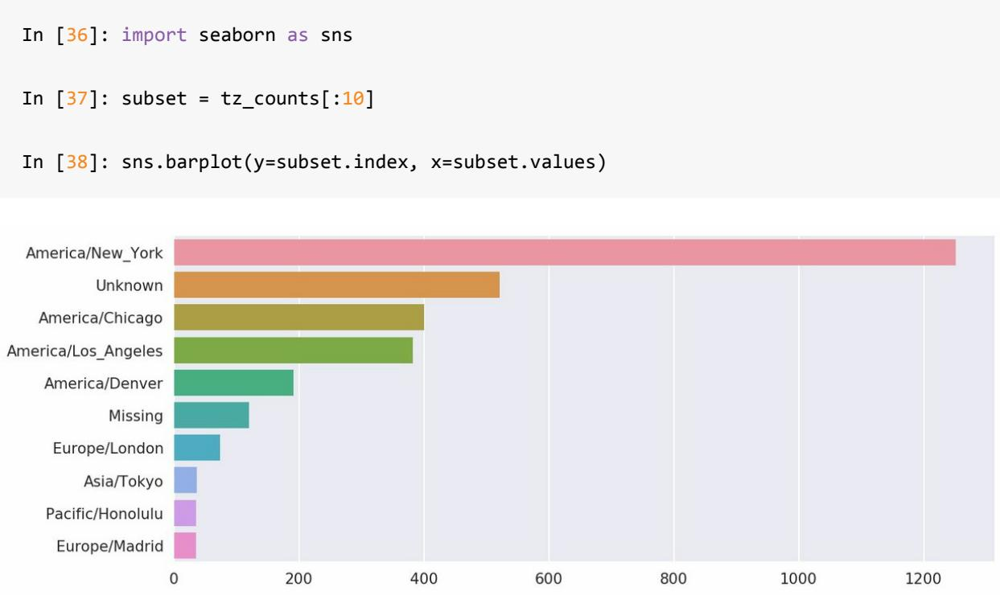

a字段含有执行URL短缩操作的浏览器、设备、应用程序的相关信息：

```markdown
In [39]: frame['a'][1]
Out[39]: 'GoogleMaps/RochesterNY'

In [40]: frame['a'][50]
Out[40]: 'Mozilla/5.0 (Windows NT 5.1; rv:10.0.2)
Gecko/20100101 Firefox/10.0.2'

In [41]: frame['a'][51][:50] # long line
Out[41]: 'Mozilla/5.0 (Linux; U; Android 2.2.2; en-us; LG-P9'
```

将这些"agent"字符串中的所有信息都解析出来是一件挺郁闷的工作。一种策略是将这种字符串的第一节（与浏览器大致对应）分离出来并得到另外一份用户行为摘要：

```txt
In [42]: results = pd.Series([x.split()[0] for x in frame.a.dropna()])

In [43]: results[:5]
Out[43]:
0 Mozilla/5.01 GoogleMaps/RochesterNY
2 Mozilla/4.03 Mozilla/5.04 Mozilla/5.0
dtype: object

In [44]: results.value_counts()[:8]
Out[44]:
Mozilla/5.02594
Mozilla/4.0601
GoogleMaps/RochesterNY 121
Opera/9.8034
TEST_INTERNET_AGENT 24
GoogleProducer 21
Mozilla/6.05
BlackBerry8520/5.0.0.6814
dtype: int64
```

现在，假设你想按Windows和非Windows用户对时区统计信息进行分解。为了简单起见，我们假定只要agent字符串中含有"Windows"就认为该用户为Windows用户。由于有的agent缺失，所以首先将它们从数据中移除：

```txt
In [45]: cframe = frame[frame.a.notnull()]
```

然后计算出各行是否含有Windows的值：

```python
In [47]: cframe['os'] = np.where(cframe['a'].str.contains('Windows'), ....: 'Windows', 'Not Windows')

In [48]: cframe['os'][:5]
Out[48]:
0    Windows
1    Not Windows
2    Windows
3    Not Windows
4    Windows
Name: os, dtype: object
```

接下来就可以根据时区和新得到的操作系统列表对数据进行分组了：

```python
In [49]: by_tz_os = cframe.groupby(['tz', 'os'])
```

分组计数，类似于value\_counts函数，可以用size来计算。并利用unstack对计数结果进行重塑：

```txt
In [50]: agg_counts = by_tz_os.size().unstack().fillna(0)
In [51]: agg_counts[:10]
Out[51]:
os    Not Windows   Windows
tz    245.0276.0
Africa/Cairo    0.03.0
Africa/Casablanca    0.01.0
Africa/Ceuta    0.02.0
Africa/Johannesburg    0.01.0
Africa/Lusaka    0.01.0
America/Anchorage    4.01.0
America/Argentina/Buenos_Aires    1.00.0
America/Argentina/Cordoba    0.01.0
America/Argentina/Mendoza    0.01.0
```

最后，我们来选取最常出现的时区。为了达到这个目的，我根据agg\_counts中的行数构造了一个间接索引数组：

```python
# Use to sort in ascending order
In [52]: indexer = agg_counts.sum(1).argsort()
In [53]: indexer[:10]
Out[53]:
tz
24
Africa/Cairo 20
```

```txt
Africa/Casablanca 21
Africa/Ceuta 92
Africa/Johannesburg 87
Africa/Lusaka 53
America/Anchorage 54
America/Argentina/Buenos_Aires 57
America/Argentina/Cordoba 26
America/Argentina/Mendoza 55
dtype: int64
```

然后我通过take按照这个顺序截取了最后10行最大值：

```txt
In [54]: count_subset = agg_counts.take(indexer[-10:])
In [55]: count_subset
Out[55]:
os Not Windows Windows
tz
America/Sao_Paulo 13.020.0
Europe/Madrid 16.019.0
Pacific/Honolulu 0.036.0
Asia/Tokyo 2.035.0
Europe/London 43.031.0
America/Denver 132.059.0
America/Los_Angeles 130.0252.0
America/Chicago 115.0285.0245.0276.0
America/New_York 339.0912.0
```

pandas有一个简便方法nlargest，可以做同样的工作：

```txt
In [56]: agg_counts.sum(1).nlargest(10)
Out[56]:
tz
America/New_York 1251.0521.0
America/Chicago 400.0
America/Los_Angeles 382.0
America/Denver 191.0
Europe/London 74.0
Asia/Tokyo 37.0
Pacific/Honolulu 36.0
Europe/Madrid 35.0
America/Sao_Paulo 33.0
dtype: float64
```

然后，如这段代码所示，可以用柱状图表示。我传递一个额外参数到seaborn的barpolt函数，来画一个堆积条形图（见图14-2）：

```python
# Rearrange the data for plotting
In [58]: count_subset = count_subset.stack()

In [59]: count_subset.name = 'total'

In [60]: count_subset = count_subset.reset_index()

In [61]: count_subset[:10]
Out[61]:
    tz    os    total
0 America/Sao_Paulo  Not Windows  13.01 America/Sao_Paulo    Windows  20.02 Europe/Madrid  Not Windows  16.03 Europe/Madrid    Windows  19.04 Pacific/Honolulu  Not Windows  0.05 Pacific/Honolulu    Windows  36.06 Asia/Tokyo  Not Windows  2.07 Asia/Tokyo    Windows  35.08 Europe/London  Not Windows  43.09 Europe/London    Windows  31.0

In [62]: sns.barplot(x='total', y='tz', hue='os', data=count_subset)
```

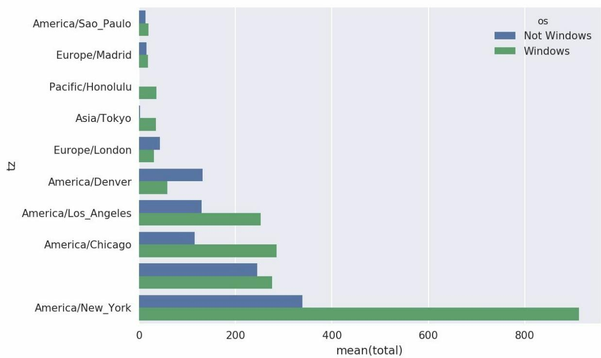  
这张图不容易看出Windows用户在小分组中的相对比例，因此标准化分组百分比之和为1：

```python
def norm_total(group):
    group['normed_total'] = group.total / group.total.sum()
    return group
results = count_subset.groupby('tz').apply(norm_total)
```

再次画图，见图14-3：

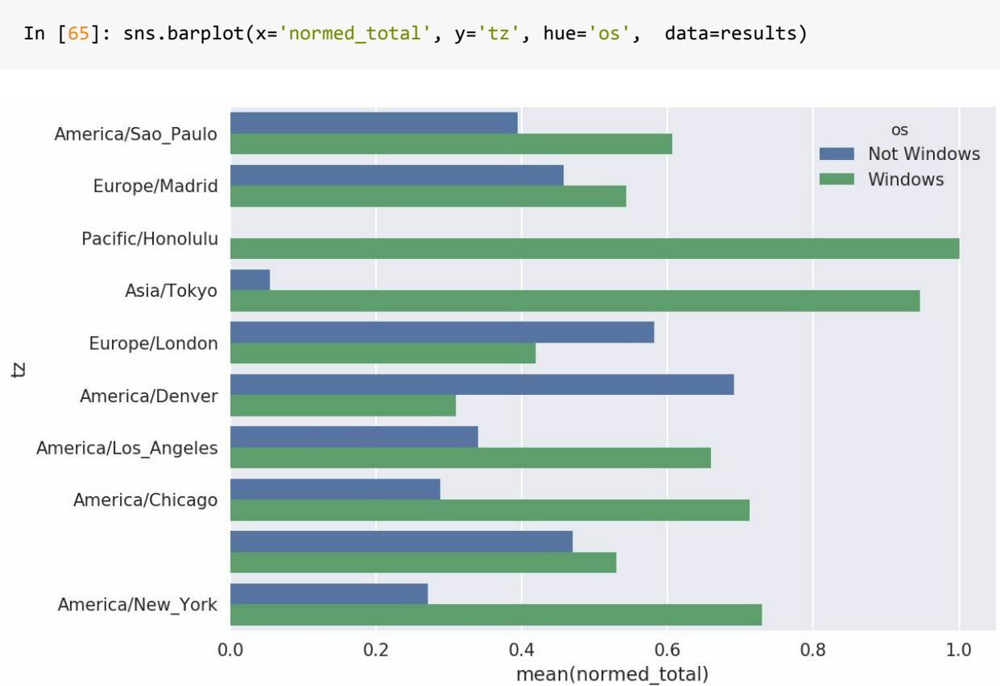

我们还可以用groupby的transform方法，更高效的计算标准化的和：

```python
In [66]: g = count_subset.groupby('tz')
In [67]: results2 = count_subset.total / g.total.transform('sum')
```

## 14.2 MovieLens 1M数据集

GroupLens Research（http://www.grouplens.org/node/73）采集了一组从20世纪90年末到21世纪初由MovieLens用户提供的电影评分数据。这些数据中包括电影评分、电影元数据（风格类型和年代）以及关于用户的人口统计学数据（年龄、邮编、性别和职业等）。基于机器学习算法的推荐系统一般都会对此类数据感兴趣。虽然我不会在本书中详细介绍机器学习技术，但我会告诉你如何对这种数据进行切片切块以满足实际需求。

MovieLens 1M数据集含有来自6000名用户对4000部电影的100万条评分数据。它分为三个表：评分、用户信息和电影信息。将该数据从zip文件中解压出来之后，可以通过pandas.read\_table将各个表分别读到一个pandas DataFrame对象中：

```python
import pandas as pd

# Make display smaller
pd.options.display.max_rows = 10

unames = ['user_id', 'gender', 'age', 'occupation', 'zip']
users = pd.read_table('datasets/movielens/users.dat', sep='::', header=None, names=unames)

rnames = ['user_id', 'movie_id', 'rating', 'timestamp']
ratings = pd.read_table('datasets/movielens/ratings.dat', sep='::', header=None, names=rnames)

mnames = ['movie_id', 'title', 'genres']
movies = pd.read_table('datasets/movielens/movies.dat', sep='::', header=None, names=mnames)
```

利用Python的切片语法，通过查看每个DataFrame的前几行即可验证数据加载工作是否一切顺利：

```txt
In [69]: users[:5]
Out[69]:
user_id gender age occupation zip
01 F 1104806712 M 56167007223 M 25155511734 M 4570246045 M 252055455

In [70]: ratings[:5]
Out[70]:
user_id movie_id rating timestamp
011193597830076011661397830210921914397830196831340849783002754123555978824291

In [71]: movies[:5]
Out[71]:
movie_id title genres
01 Toy Story (1995) Animation|Children's|Comedy
12 Jumanji (1995) Adventure|Children's|Fantasy
23 Grumpier Old Men (1995) Comedy|Romance
```

```txt
34 Waiting to Exhale (1995) Comedy|Drama
45 Father of the Bride Part II (1995) Comedy

In [72]: ratings
Out[72]:
user_id movie_id rating timestamp
011193597830076011661397830210921914397830196831340849783002754123555978824291
... ... ... ...
1000204604010911956716541100020560401094595670488710002066040562595670474610002076040109649567156481000208604010974956715569
[1000209 rows x 4 columns]
```

注意，其中的年龄和职业是以编码形式给出的，它们的具体含义请参考该数据集的README文件。分析散布在三个表中的数据可不是一件轻松的事情。假设我们想要根据性别和年龄计算某部电影的平均得分，如果将所有数据都合并到一个表中的话问题就简单多了。我们先用pandas的merge函数将ratings跟users合并到一起，然后再将movies也合并进去。pandas会根据列名的重叠情况推断出哪些列是合并（或连接）键：

```txt
In [73]: data = pd.merge(pd.merge(ratings, users), movies)

In [74]: data
Out[74]:
user_id movie_id rating timestamp gender age occupation zip \
0111935978300760 F 110480671211935978298413 M 56167007221211934978220179 M 25123279331511934978199279 M 2572290341711935978158471 M 50195350
... ... ... ... ... ... ... ...
1000204594921985958846401 M 1817479011000205567527033976029116 M 3514300301000206578028451958153068 M 1817928861000207585136075957756608 F 1820554101000208593829094957273353 M 25135401

title genres
0 One Flew Over the Cuckoo's Nest (1975) Drama
1 One Flew Over the Cuckoo's Nest (1975) Drama
2 One Flew Over the Cuckoo's Nest (1975) Drama
3 One Flew Over the Cuckoo's Nest (1975) Drama
4 One Flew Over the Cuckoo's Nest (1975) Drama
```

```txt
...
1000204 Modulations (1998) Documentary
1000205 Broken Vessels (1998) Drama
1000206 White Boys (1999) Drama
1000207 One Little Indian (1973) Comedy|Drama|Western
1000208 Five Wives, Three Secretaries and Me (1998) Documentary
[1000209 rows x 10 columns]
```

```asm
In [75]: data.iloc[0]
Out[75]:
user_id 1
movie_id 1193
rating 5
timestamp 978300760
gender F
age 1
occupation 10
zip 48067
title One Flew Over the Cuckoo's Nest (1975)
genres Drama
Name: 0, dtype: object
```

为了按性别计算每部电影的平均得分，我们可以使用pivot\_table方法：

```csv
In [76]: mean_ratings = data.pivot_table('rating', index='title',
    ....:    columns='gender', aggfunc='mean')
In [77]: mean_ratings[:5]
Out[77]:
gender    F    M
title
$1,000,000 Duck (1971)  3.3750002.761905
'Night Mother (1986)  3.3888893.352941
'Til There Was You (1997)  2.6756762.733333
'burbs, The (1989)  2.7934782.962085
...And Justice for All (1979)  3.8285713.689024
```

该操作产生了另一个DataFrame，其内容为电影平均得分，行标为电影名称（索引），列标为性别。现在，我打算过滤掉评分数据不够250条的电影（随便选的一个数字）。为了达到这个目的，我先对title进行分组，然后利用size()得到一个含有各电影分组大小的Series对象：

```txt
In [78]: ratings_by_title = data.groupby('title').size()
In [79]: ratings_by_title[:10]
Out[79]:
title
$1,000,000 Duck (1971) 37
```

```python
'Night Mother (1986) 70
'Til There Was You (1997) 52
'burbs, The (1989) 303
...And Justice for All (1979) 1991-900 (1994) 210 Things I Hate About You (1999) 700101 Dalmatians (1961) 565101 Dalmatians (1996) 36412 Angry Men (1957) 616
dtype: int64

In [80]: active_titles = ratings_by_title.index[ratings_by_title >= 250]

In [81]: active_titles
Out[81]:
Index([' 'burbs, The (1989)', '10 Things I Hate About You (1999)',
    '101 Dalmatians (1961)', '101 Dalmatians (1996)', '12 Angry Men (1957)',
    '13th Warrior, The (1999)', '2 Days in the Valley (1996)',
    '20,000 Leagues Under the Sea (1954)', '2001: A Space Odyssey (1968)',
    '2010 (1984)',
    ...
'X-Men (2000)', 'Year of Living Dangerously (1982)',
    'Yellow Submarine (1968)', 'You've Got Mail (1998)',
    'Young Frankenstein (1974)', 'Young Guns (1988)',
    'Young Guns II (1990)', 'Young Sherlock Holmes (1985)',
    'Zero Effect (1998)', 'eXistenZ (1999)*],
    dtype='object', name='title', length=1216)
```

标题索引中含有评分数据大于250条的电影名称，然后我们就可以据此从前面的mean\_ratings中选取所需的行了：

```python
# Select rows on the index
In [82]: mean_ratings = mean_ratings.loc[active_titles]

In [83]: mean_ratings
Out[83]:
gender    F    M
title
'burbs, The (1989) 2.7934782.96208510 Things I Hate About You (1999) 3.6465523.311966101 Dalmatians (1961) 3.7914443.500000101 Dalmatians (1996) 3.2400002.91121512 Angry Men (1957) 4.1843974.328421
...    ...    ...
Young Guns (1988) 3.3717953.425620
Young Guns II (1990) 2.9347832.904025
Young Sherlock Holmes (1985) 3.5147063.363344
Zero Effect (1998) 3.8644073.723140
```

```txt
eXistenZ (1999)
[1216 rows x 2 columns]
```

为了了解女性观众最喜欢的电影，我们可以对F列降序排列：

```python
In [85]: top_female_ratings = mean_ratings.sort_values(by='F', ascending=False)
```

```txt
In [86]: top_female_ratings[:10]
Out[86]:
gender    F    M
title
Close Shave, A (1995) 4.6444444.473795
Wrong Trousers, The (1993) 4.5882354.478261
Sunset Blvd. (a.k.a. Sunset Boulevard) (1950) 4.5726504.464589
Wallace & Gromit: The Best of Aardman Animation... 4.5631074.385075
Schindler's List (1993) 4.5626024.491415
Shawshank Redemption, The (1994) 4.5390754.560625
Grand Day Out, A (1992) 4.5378794.293255
To Kill a Mockingbird (1962) 4.5366674.372611
Creature Comforts (1990) 4.5138894.272277
Usual Suspects, The (1995) 4.5133174.518248
```

## 计算评分分歧

假设我们想要找出男性和女性观众分歧最大的电影。一个办法是给mean\_ratings加上一个用于存放平均得分之差的列，并对其进行排序：

```python
In [87]: mean_ratings['diff'] = mean_ratings['M'] - mean_ratings['F']
```

按"diff"排序即可得到分歧最大且女性观众更喜欢的电影：

```txt
In [88]: sorted_by_diff = mean_ratings.sort_values(by='diff')

In [89]: sorted_by_diff[:10]

Out[89]:
gender    F    M    diff
title
Dirty Dancing (1987) 3.7903782.959596 -0.830782
Jumpin' Jack Flash (1986) 3.2547172.578358 -0.676359
Grease (1978) 3.9752653.367041 -0.608224
Little Women (1994) 3.8705883.321739 -0.548849
Steel Magnolias (1989) 3.9017343.365957 -0.535777
Anastasia (1997) 3.8000003.281609 -0.518391
Rocky Horror Picture Show, The (1975) 3.6730163.160131 -0.512885
Color Purple, The (1985) 4.1581923.659341 -0.498851
```

```txt
Age of Innocence, The (1993) 3.8270683.339506 -0.487561
Free Willy (1993) 2.9213482.438776 -0.482573
```

对排序结果反序并取出前10行，得到的则是男性观众更喜欢的电影：

```txt
# Reverse order of rows, take first 10 rows
In [90]: sorted_by_diff[::-1][:10]
Out[90]:
gender    F    M    diff
title
Good, The Bad and The Ugly, The (1966) 3.4949494.2213000.726351
Kentucky Fried Movie, The (1977) 2.8787883.5551470.676359
Dumb & Dumber (1994) 2.6979873.3365950.638608
Longest Day, The (1962) 3.4117654.0314470.619682
Cable Guy, The (1996) 2.2500002.8637870.613787
Evil Dead II (Dead By Dawn) (1987) 3.2972973.9092830.611985
Hidden, The (1987) 3.1379313.7450980.607167
Rocky III (1982) 2.3617022.9435030.581801
Caddyshack (1980) 3.3961353.9697370.573602
For a Few Dollars More (1965) 3.4090913.9537950.544704
```

如果只是想要找出分歧最大的电影（不考虑性别因素），则可以计算得分数据的方差或标准差：

```python
# Standard deviation of rating grouped by title
In [91]: rating_std_by_title = data.groupby('title')['rating'].std()

# Filter down to active_titles
In [92]: rating_std_by_title = rating_std_by_title.loc[active_titles]

# Order Series by value in descending order
In [93]: rating_std_by_title.sort_values(ascending=False)[:10]
Out[93]:
title
Dumb & Dumber (1994) 1.321333
Blair Witch Project, The (1999) 1.316368
Natural Born Killers (1994) 1.307198
Tank Girl (1995) 1.277695
Rocky Horror Picture Show, The (1975) 1.260177
Eyes Wide Shut (1999) 1.259624
Evita (1996) 1.253631
Billy Madison (1995) 1.249970
Fear and Loathing in Las Vegas (1998) 1.246408
Bicentennial Man (1999) 1.245533
Name: rating, dtype: float64
```

可能你已经注意到了，电影分类是以竖线（|）分隔的字符串形式给出的。如果想对电影分类进行分析的话，就需要先将其转换成更有用的形式才行。

## 14.31880-2010年间全美婴儿姓名

美国社会保障总署（SSA）提供了一份从1880年到现在的婴儿名字频率数据。HadleyWickham（许多流行R包的作者）经常用这份数据来演示R的数据处理功能。

我们要做一些数据规整才能加载这个数据集，这么做就会产生一个如下的DataFrame：

```txt
In [4]: names.head(10)
Out[4]:
    name sex births year
0    Mary F 706518801    Anna F 260418802    Emma F 200318803 Elizabeth F 193918804 Minnie F 174618805 Margaret F 157818806 Ida F 147218807 Alice F 141418808 Bertha F 132018809 Sarah F 12881880
```

你可以用这个数据集做很多事，例如：

计算指定名字（可以是你自己的，也可以是别人的）的年度比例。

计算某个名字的相对排名。

计算各年度最流行的名字，以及增长或减少最快的名字。

分析名字趋势：元音、辅音、长度、总体多样性、拼写变化、首尾字母等。

分析外源性趋势：圣经中的名字、名人、人口结构变化等。

利用前面介绍过的那些工具，这些分析工作都能很轻松地完成，我会讲解其中的一些。

到编写本书时为止，美国社会保障总署将该数据库按年度制成了多个数据文件，其中给出了每个性别/名字组合的出生总数。这些文件的原始档案可以在这里获取：http://www.ssa.gov/oact/babynames/limits.html。

如果你在阅读本书的时候这个页面已经不见了，也可以用搜索引擎找找。

下载"National data"文件names.zip，解压后的目录中含有一组文件（如yob1880.txt）。我用UNIX的head命令查看了其中一个文件的前10行（在Windows上，你可以用more命令，或直接在文本编辑器中打开）：

```txt
In [94]: !head -n 10 datasets/babynames/yob1880.txt
Mary, F, 7065
```

```csv
Anna, F, 2604
Emma, F, 2003
Elizabeth, F, 1939
Minnie, F, 1746
Margaret, F, 1578
Ida, F, 1472
Alice, F, 1414
Bertha, F, 1320
Sarah, F, 1288
```

由于这是一个非常标准的以逗号隔开的格式，所以可以用pandas.read\_csv将其加载到DataFrame中：

```python
In [95]: import pandas as pd

In [96]: names1880 =
pd.read_csv('datasets/babynames/yob1880.txt',
    ....:    names=['name', 'sex', 'births'])

In [97]: names1880
Out[97]:
    name sex births
0    Mary F 70651    Anna F 26042    Emma F 20033    Elizabeth F 19394    Minnie F 1746
...    ... .. ...
1995    Woodie M 51996    Worthy M 51997    Wright M 51998    York M 51999 Zachariah M 5
[2000 rows x 3 columns]
```

这些文件中仅含有当年出现超过5次的名字。为了简单起见，我们可以用births列的sex分组小计表示该年度的births总计：

```txt
In [98]: names1880.groupby('sex').births.sum()
Out[98]:
sex
F 90993
M 110493
Name: births, dtype: int64
```

由于该数据集按年度被分隔成了多个文件，所以第一件事情就是要将所有数据都组装到一个DataFrame里面，并加上一个year字段。使用pandas.concat即可达到这个目的：

```python
years = range(1880, 2011)

pieces = []
columns = ['name', 'sex', 'births']

for year in years:
    path = 'datasets/babynames/yob%d.txt' % year
    frame = pd.read_csv(path, names=columns)

    frame['year'] = year
    pieces.append(frame)

# Concatenate everything into a single DataFrame
names = pd.concat(pieces, ignore_index=True)
```

这里需要注意几件事情。第一，concat默认是按行将多个DataFrame组合到一起的；第二，必须指定ignore\_index=True，因为我们不希望保留read\_csv所返回的原始行号。现在我们得到了一个非常大的DataFrame，它含有全部的名字数据：

```txt
In [100]: names
Out[100]:
name sex births year
0 Mary F 706518801 Anna F 260418802 Emma F 200318803 Elizabeth F 193918804 Minnie F 17461880
... ... ... ...
1690779 Zymaire M 520101690780 Zyonne M 520101690781 Zyquarius M 520101690782 Zyran M 520101690783 Zzyzx M 52010
[1690784 rows x 4 columns]
```

有了这些数据之后，我们就可以利用groupby或pivot\_table在year和sex级别上对其进行聚合了，如图14-4所示：

```python
In [101]: total_births = names.pivot_table('births', index='year', .....: columns='sex', aggfunc=sum)
In [102]: total_births.tail()
Out[102]:
```

<table><tr><td>sex</td><td>F</td><td>M</td></tr><tr><td>year</td><td></td><td></td></tr><tr><td>2006</td><td>1896468</td><td>2050234</td></tr><tr><td>2007</td><td>1916888</td><td>2069242</td></tr><tr><td>2008</td><td>1883645</td><td>2032310</td></tr><tr><td>2009</td><td>1827643</td><td>1973359</td></tr><tr><td>2010</td><td>1759010</td><td>1898382</td></tr></table>

Total births by sex and year  
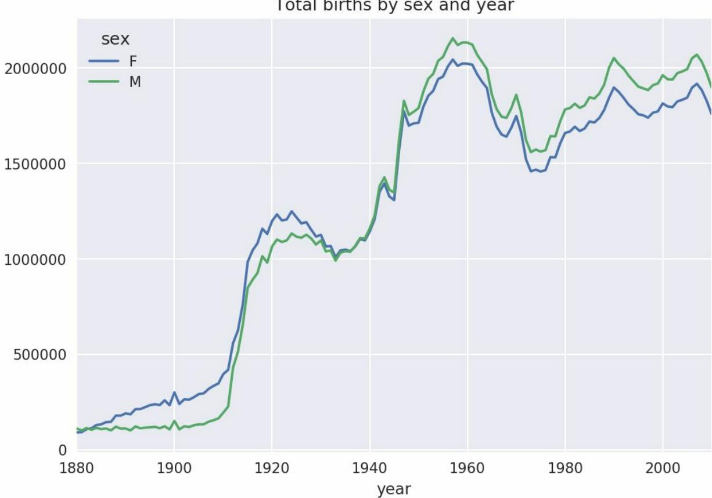

下面我们来插入一个prop列，用于存放指定名字的婴儿数相对于总出生数的比例。prop值为0.02表示每100名婴儿中有2名取了当前这个名字。因此，我们先按year和sex分组，然后再将新列加到各个分组上：

```python
def add_prop(group):
    group['prop'] = group.births / group.births.sum()
    return group
names = names.groupby(['year', 'sex']).apply(add_prop)
```

现在，完整的数据集就有了下面这些列：

```txt
In [105]: names
Out[105]:
```

```txt
name sex births year prop
0 Mary F 706518800.0776431 Anna F 260418800.0286182 Emma F 200318800.0220133 Elizabeth F 193918800.0213094 Minnie F 174618800.019188
... ... ... ... ...
1690779 Zymaire M 520100.0000031690780 Zyonne M 520100.0000031690781 Zyquarius M 520100.0000031690782 Zyran M 520100.0000031690783 Zzyzx M 520100.000003
[1690784 rows x 5 columns]
```

在执行这样的分组处理时，一般都应该做一些有效性检查，比如验证所有分组的prop的总和是否为1：

```python
In [106]: names.groupby(['year', 'sex']).prop.sum()
Out[106]:
year sex
1880 F 1.0
M 1.01881 F 1.0
M 1.01882 F 1.0
...
2008 M 1.02009 F 1.0
M 1.02010 F 1.0
M 1.0
Name: prop, Length: 262, dtype: float64
```

工作完成。为了便于实现更进一步的分析，我需要取出该数据的一个子集：每对sex/year组合的前1000个名字。这又是一个分组操作：

```python
def get_top1000(group):
    return group.sort_values(by='births', ascending=False)[:1000]
grouped = names.groupby(['year', 'sex'])
top1000 = grouped.apply(get_top1000)
# Drop the group index, not needed
top1000.reset_index(inplace=True, drop=True)
```

如果你喜欢DIY的话，也可以这样：

```hcl
pieces = []
```

```python
for year, group in names.groupby(['year', 'sexABC]):
    pieces.append(group.sort_values(by='births', ascending=False)[:1000])
top1000 = pd.concat(pieces, ignore_index=True)
```

现在的结果数据集就小多了：

```txt
In [108]: top1000
Out[108]:
name sex births year prop
0 Mary F 706518800.0776431 Anna F 260418800.0286182 Emma F 200318800.0220133 Elizabeth F 193918800.0213094 Minnie F 174618800.019188
... ... ... ...
261872 Camilo M 19420100.000102261873 Destin M 19420100.000102261874 Jaquan M 19420100.000102261875 Jaydan M 19420100.000102261876 Maxton M 19320100.000102
[261877 rows x 5 columns]
```

接下来的数据分析工作就针对这个top1000数据集了。

## 分析命名趋势

有了完整的数据集和刚才生成的top1000数据集，我们就可以开始分析各种命名趋势了。首先将前1000个名字分为男女两个部分：

```txt
In [109]: boys = top1000[top1000.sex == 'M']
```

```txt
In [110]: girls = top1000[top1000.sex == 'F']
```

这是两个简单的时间序列，只需稍作整理即可绘制出相应的图表（比如每年叫做John和Mary的婴儿数）。我们先生成一张按year和name统计的总出生数透视表：

```python
In [111]: total_births = top1000.pivot_table('births', index='year', .....: columns='name', .....: aggfunc=sum)
```

现在，我们用DataFrame的plot方法绘制几个名字的曲线图（见图14-5）：

```txt
In [112]: total_births.info()
<class 'pandas.core.frame.DataFrame'>
```

```txt
Int64Index: 131 entries, 1880 to 2010
Columns: 6868 entries, Aaden to Zuri
dtypes: float64(6868)
memory usage: 6.9 MB

In [113]: subset = total_births[['John', 'Harry', 'Mary', 'Marilyn']]
In [114]: subset.plot(subplots=True, figsize=(12, 10), grid=False,
......:    title="Number of births per year")
```

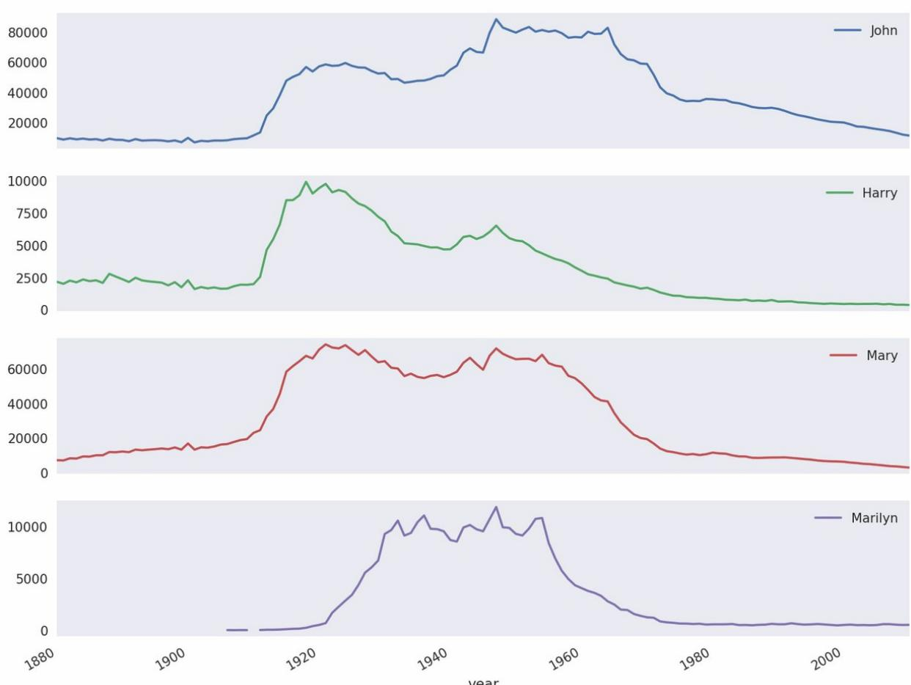

从图中可以看出，这几个名字在美国人民的心目中已经风光不再了。但事实并非如此简单，我们在下一节中就能知道是怎么一回事了。

## 评估命名多样性的增长

一种解释是父母愿意给小孩起常见的名字越来越少。这个假设可以从数据中得到验证。一个办法是计算最流行的1000个名字所占的比例，我按year和sex进行聚合并绘图（见图14-6）：

```txt
......: columns='sex', aggfunc=sum)
In [117]: table.plot(title='Sum of table1000.prop by year and sex',
......: yticks=np.linspace(0, 1.2, 13), xticks=range(1880, 2020, 10)
)
```

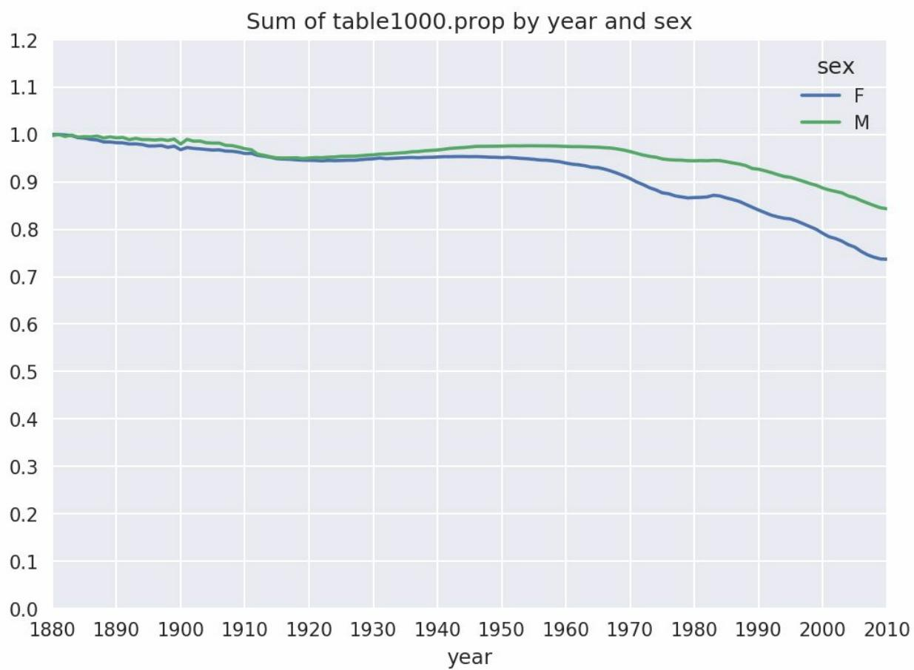

从图中可以看出，名字的多样性确实出现了增长（前1000项的比例降低）。另一个办法是计算占总出生人数前50%的不同名字的数量，这个数字不太好计算。我们只考虑2010年男孩的名字：

<table><tr><td colspan="6">In [118]: df = boys[boys.year == 2010]</td></tr><tr><td colspan="6">In [119]: df</td></tr><tr><td colspan="6">Out[119]:</td></tr><tr><td></td><td>name</td><td>sex</td><td>births</td><td>year</td><td>prop</td></tr><tr><td>260877</td><td>Jacob</td><td>M</td><td>21875</td><td>2010</td><td>0.011523</td></tr><tr><td>260878</td><td>Ethan</td><td>M</td><td>17866</td><td>2010</td><td>0.009411</td></tr><tr><td>260879</td><td>Michael</td><td>M</td><td>17133</td><td>2010</td><td>0.009025</td></tr><tr><td>260880</td><td>Jayden</td><td>M</td><td>17030</td><td>2010</td><td>0.008971</td></tr><tr><td>260881</td><td>William</td><td>M</td><td>16870</td><td>2010</td><td>0.008887</td></tr><tr><td>...</td><td>...</td><td>...</td><td>...</td><td>...</td><td>...</td></tr><tr><td>261872</td><td>Camilo</td><td>M</td><td>194</td><td>2010</td><td>0.000102</td></tr><tr><td>261873</td><td>Destin</td><td>M</td><td>194</td><td>2010</td><td>0.000102</td></tr><tr><td>261874</td><td>Jaquan</td><td>M</td><td>194</td><td>2010</td><td>0.000102</td></tr><tr><td>261875</td><td>Jaydan</td><td>M</td><td>194</td><td>2010</td><td>0.000102</td></tr></table>

```txt
261876 Maxton M 19320100.000102
[1000 rows x 5 columns]
```

在对prop降序排列之后，我们想知道前面多少个名字的人数加起来才够50%。虽然编写一个for循环确实也能达到目的，但NumPy有一种更聪明的矢量方式。先计算prop的累计和cumsum，然后再通过searchsorted方法找出0.5应该被插入在哪个位置才能保证不破坏顺序：

```python
In [120]: prop_cumsum = df.sort_values(by='prop', ascending=False).prop.cumsum()

In [121]: prop_cumsum[:10]

Out[121]:
2608770.0115232608780.0209342608790.0299592608800.0389302608810.0478172608820.0565792608830.0651552608840.0734142608850.0815282608860.089621

Name: prop, dtype: float64

In [122]: prop_cumsum.values.searchsorted(0.5)
Out[122]: 116
```

由于数组索引是从0开始的，因此我们要给这个结果加1，即最终结果为117。拿1900年的数据来做个比较，这个数字要小得多：

```python
In [123]: df = boys[boys.year == 1900]
In [124]: in1900 = df.sort_values(by='prop', ascending=False).prop.cumsum()
In [125]: in1900.values.searchsorted(0.5) + 1
Out[125]: 25
```

现在就可以对所有year/sex组合执行这个计算了。按这两个字段进行groupby处理，然后用一个函数计算各分组的这个值：

```python
def get_quantile_count(group, q=0.5):
    group = group.sort_values(by='prop', ascending=False)
    return group.prop.cumsum().values.searchsorted(q) + 1

diversity = top1000.groupby(['year', 'sex']).apply(get_quantile_count)
diversity = diversity.unstack('sex')
```

In [129]: diversity.plot(title="Number of popular names in top 50%")

现在，diversity这个DataFrame拥有两个时间序列（每个性别各一个，按年度索引）。通过IPython，你可以查看其内容，还可以像之前那样绘制图表（如图14-7所示）：

<table><tr><td colspan="3">In [128]: diversity.head()</td></tr><tr><td colspan="3">Out[128]:</td></tr><tr><td>sex</td><td>F</td><td>M</td></tr><tr><td>year</td><td></td><td></td></tr><tr><td>1880</td><td>38</td><td>14</td></tr><tr><td>1881</td><td>38</td><td>14</td></tr><tr><td>1882</td><td>38</td><td>15</td></tr><tr><td>1883</td><td>39</td><td>15</td></tr><tr><td>1884</td><td>39</td><td>16</td></tr></table>

Number of popular names in top50%  
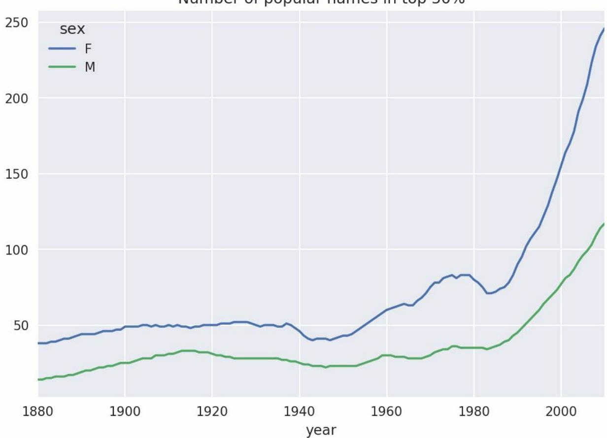  
从图中可以看出，女孩名字的多样性总是比男孩的高，而且还在变得越来越高。读者们可以自己分析一下具体是什么在驱动这个多样性（比如拼写形式的变化）。

## “最后一个字母”的变革

```txt
In [133]: subtable.sum()
Out[133]:
sex year
F 1910396416.019602022062.020101759010.0
M 1910194198.019602132588.020101898382.0
dtype: float64

In [134]: letter_prop = subtable / subtable.sum()
In [135]: letter_prop
Out[135]:
sex F M
```

2007年，一名婴儿姓名研究人员Laura Wattenberg在她自己的网站上指出

（http://www.babynamewizard.com）：近百年来，男孩名字在最后一个字母上的分布发生了显著的变化。为了了解具体的情况，我首先将全部出生数据在年度、性别以及末字母上进行了聚合：

```python
# extract last letter from name column
get_last_letter = lambda x: x[-1]
last_letters = names.name.map(get_last_letter)
last_letters.name = 'last_letter'
table = names.pivot_table('births', index=last_letters,
    columns=['sex', 'year'], aggfunc=sum)
```

然后，我选出具有一定代表性的三年，并输出前面几行：

```python
In [131]: subtable = table.reindex(columns=[1910, 1960, 2010], level='year')
In [132]: subtable.head()
Out[132]:
sex    F    M
year    191019602010191019602010
last_letter
a    108376.0691247.0670605.0977.05204.028438.0
b    NaN    694.0450.0411.03912.038859.0
c    5.049.0946.0482.015476.023125.0
d    6750.03729.02607.022111.0262112.044398.0
e    133569.0435013.0313833.028655.0178823.0129012.0
```

接下来我们需要按总出生数对该表进行规范化处理，以便计算出各性别各末字母占总出生人数的比例：

<table><tr><td>year</td><td>1910</td><td>1960</td><td>2010</td><td>1910</td><td>1960</td><td>2010</td></tr><tr><td colspan="7">last_letter</td></tr><tr><td>a</td><td>0.273390</td><td>0.341853</td><td>0.381240</td><td>0.005031</td><td>0.002440</td><td>0.014980</td></tr><tr><td>b</td><td>NaN</td><td>0.000343</td><td>0.000256</td><td>0.002116</td><td>0.001834</td><td>0.020470</td></tr><tr><td>c</td><td>0.000013</td><td>0.000024</td><td>0.000538</td><td>0.002482</td><td>0.007257</td><td>0.012181</td></tr><tr><td>d</td><td>0.017028</td><td>0.001844</td><td>0.001482</td><td>0.113858</td><td>0.122908</td><td>0.023387</td></tr><tr><td>e</td><td>0.336941</td><td>0.215133</td><td>0.178415</td><td>0.147556</td><td>0.083853</td><td>0.067959</td></tr><tr><td>...</td><td>...</td><td>...</td><td>...</td><td>...</td><td>...</td><td>...</td></tr><tr><td>v</td><td>NaN</td><td>0.000060</td><td>0.000117</td><td>0.000113</td><td></td><td></td></tr><tr><td>0.000037</td><td>0.001434</td><td></td><td></td><td></td><td></td><td></td></tr><tr><td>w</td><td>0.000020</td><td>0.000031</td><td>0.001182</td><td>0.006329</td><td>0.007711</td><td>0.016148</td></tr><tr><td>x</td><td>0.000015</td><td>0.000037</td><td>0.000727</td><td>0.003965</td><td>0.001851</td><td>0.008614</td></tr><tr><td>y</td><td>0.110972</td><td>0.152569</td><td>0.116828</td><td>0.077349</td><td>0.160987</td><td>0.058168</td></tr><tr><td>z</td><td>0.002439</td><td>0.000659</td><td>0.000704</td><td>0.000170</td><td>0.000184</td><td>0.001831</td></tr><tr><td colspan="7">[26 rows x 6 columns]</td></tr></table>

有了这个字母比例数据之后，就可以生成一张各年度各性别的条形图了，如图14-8所示：

```python
import matplotlib.pyplot as plt

fig, axes = plt.subplots(2, 1, figsize=(10, 8))
letter_prop['M'].plot(kind='bar', rot=0, ax=axes[0], title='Male')
letter_prop['F'].plot(kind='bar', rot=0, ax=axes[1], title='Female', legend=False)
```

```python
In [138]: letter_prop = table / table.sum()
In [139]: dny_ts = letter_prop.loc[['d', 'n', 'y'], 'M'].T
In [140]: dny_ts.head()
Out[140]:
last_letter    d    n    y
year
18800.0830550.1532130.07576018810.0832470.1532140.07745118820.0853400.1495600.07753718830.0840660.1516460.07914418840.0861200.1499150.080405
```

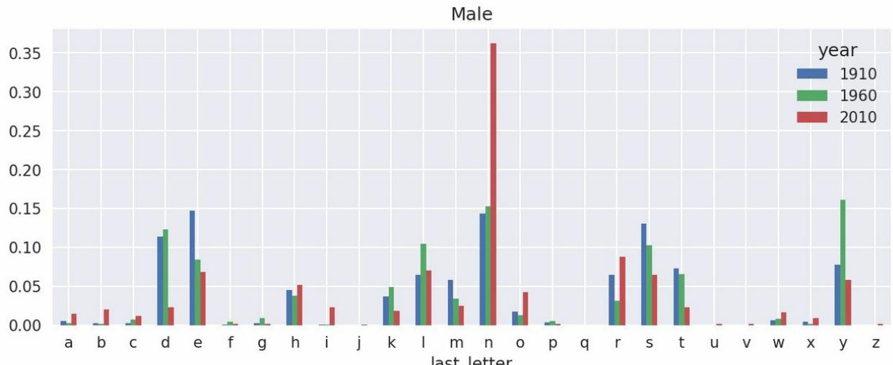

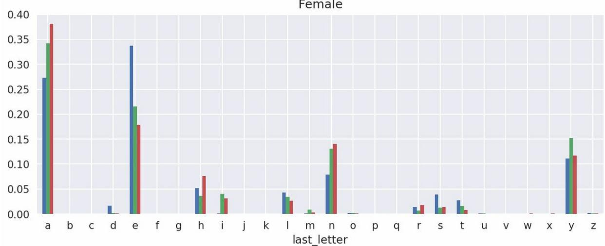

可以看出，从20世纪60年代开始，以字母"n"结尾的男孩名字出现了显著的增长。回到之前创建的那个完整表，按年度和性别对其进行规范化处理，并在男孩名字中选取几个字母，最后进行转置以便将各个列做成一个时间序列：

有了这个时间序列的DataFrame之后，就可以通过其plot方法绘制出一张趋势图了（如图14-9所示）：

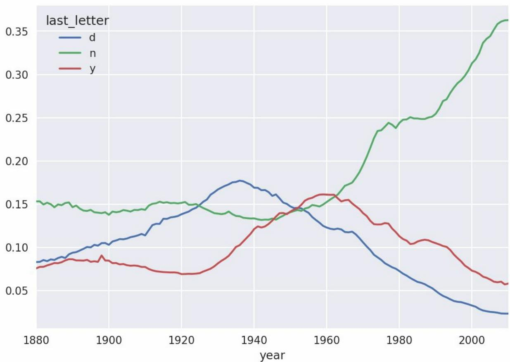

## 变成女孩名字的男孩名字（以及相反的情况）

另一个有趣的趋势是，早年流行于男孩的名字近年来“变性了”，例如Lesley或Leslie。回到top1000数据集，找出其中以"lesl"开头的一组名字：

```python
In [144]: all_names = pd.Series(top1000.name.unique())
In [145]: lesley_like = all_names[all_names.str.lower().str.contains('lesl')]
In [146]: lesley_like
Out[146]:
632 Leslie
2294 Lesley
4262 Leslee
4728 Lesli
6103 Lesly
dtype: object
```  
然后利用这个结果过滤其他的名字，并按名字分组计算出生数以查看相对频率：

```python
In [147]: filtered = top1000[top1000.name.isin(lesley_like)]
In [148]: filtered.groupby('name').births.sum()
Out[148]:
name
Leslee 1082
Lesley 35022
Lesli 929
Leslie 370429
Lesly 10067
Name: births, dtype: int64
```

接下来，我们按性别和年度进行聚合，并按年度进行规范化处理：

```python
In [149]: table = filtered.pivot_table('births', index='year',
    .....:    columns='sex', aggfunc='sum')
In [150]: table = table.div(table.sum(1), axis=0)
In [151]: table.tail()
Out[151]:
sex    F    M
year
20061.0 NaN
20071.0 NaN
20081.0 NaN
20091.0 NaN
20101.0 NaN
```

最后，就可以轻松绘制一张分性别的年度曲线图了（如图2-10所示）：

```javascript
In [153]: table.plot(style={'M': 'k-', 'F': 'k--'})
```

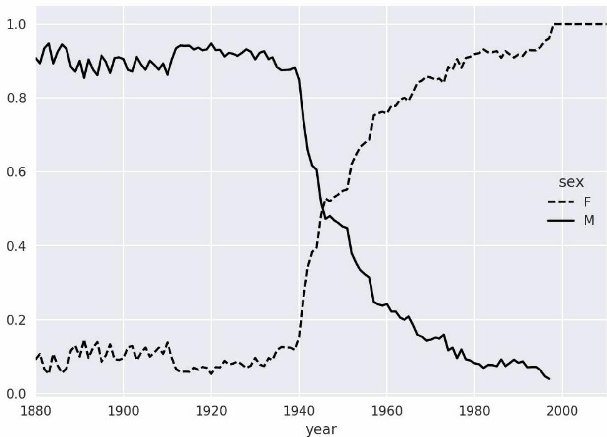

## 14.4 USDA食品数据库

美国农业部（USDA）制作了一份有关食物营养信息的数据库。Ashley Williams制作了该数据的JSON版（http://ashleyw.co.uk/project/food-nutrient-database）。其中的记录如下所示：

```json
{"id": 21441,
    "description": "KENTUCKY FRIED CHICKEN, Fried Chicken, EXTRA CRISPY, Wing, meat and skin with breading",
    "tags": ["KFC"],
    "manufacturer": "Kentucky Fried Chicken",
    "group": "Fast Foods",
    "portions": [
    {"amount": 1,
    "unit": "wing, with skin",
    "grams": 68.0},
    ...
    ],
    "nutrients": [
    {```

```txt
In [159]: nutrients = pd.DataFrame(db[0]['nutrients'])
```

```jsonl
"value": 20.8,
"units": "g",
"description": "Protein",
"group": "Composition"},
...
]
```

每种食物都带有若干标识性属性以及两个有关营养成分和分量的列表。这种形式的数据不是很适合分析工作，因此我们需要做一些规整化以使其具有更好用的形式。

从上面列举的那个网址下载并解压数据之后，你可以用任何喜欢的JSON库将其加载到Python中。我用的是Python内置的json模块：

```txt
In [154]: import json
In [155]: db = json.load(open('datasets/usda_food/database.json'))
In [156]: len(db)
Out[156]: 6636
```

db中的每个条目都是一个含有某种食物全部数据的字典。nutrients字段是一个字典列表，其中的每个字典对应一种营养成分：

```python
In [157]: db[0].keys()
Out[157]: dict_keys(['id', 'description', 'tags', 'manufacturer', 'group', 'portions', 'nutrients'])

In [158]: db[0]['nutrients'][0]
Out[158]:
{'description': 'Protein',
    'group': 'Composition',
    'units': 'g',
    'value': 25.18}
```

```txt
description group units value
0 Protein Composition g 25.181 Total lipid (fat) Composition g 29.202 Carbohydrate, by difference Composition g 3.063 Ash Other g 3.284 Energy Energy kcal 376.00
```

<table><tr><td>5</td><td>Water</td><td>Composition</td><td>g</td><td>39.28</td></tr><tr><td>6</td><td>Energy</td><td>Energy</td><td>kJ</td><td>1573.00</td></tr></table>

在将字典列表转换为DataFrame时，可以只抽取其中的一部分字段。这里，我们将取出食物的名称、分类、编号以及制造商等信息：

```python
In [161]: info_keys = ['description', 'group', 'id', 'manufacturer']

In [162]: info = pd.DataFrame(db, columns=info_keys)

In [163]: info[:5]

Out[163]:
description group id \
0 Cheese, caraway Dairy and Egg Products 10081 Cheese, cheddar Dairy and Egg Products 10092 Cheese, edam Dairy and Egg Products 10183 Cheese, feta Dairy and Egg Products 10194 Cheese, mozzarella, part skim milk Dairy and Egg Products 1028
manufacturer
01234

In [164]: info.info()
<class 'pandas.core.frame.DataFrame'>
RangeIndex: 6636 entries, 0 to 6635
Data columns (total 4 columns):
description 6636 non-null object
group 6636 non-null object
id 6636 non-null int64
manufacturer 5195 non-null object
dtypes: int64(1), object(3)
memory usage: 207.5+ KB
```

通过value\_counts，你可以查看食物类别的分布情况：

```txt
In [165]: pd.value_counts(info.group)[:10]
Out[165]:
Vegetables and Vegetable Products 812
Beef Products 618
Baked Products 496
Breakfast Cereals 403
Fast Foods 365
Legumes and Legume Products 365
Lamb, Veal, and Game Products 345
```

```txt
Sweets 341
Pork Products 328
Fruits and Fruit Juices 328
Name: group, dtype: int64
```

现在，为了对全部营养数据做一些分析，最简单的办法是将所有食物的营养成分整合到一个大表中。我们分几个步骤来实现该目的。首先，将各食物的营养成分列表转换为一个DataFrame，并添加一个表示编号的列，然后将该DataFrame添加到一个列表中。最后通过concat将这些东西连接起来就可以了：

顺利的话，nutrients的结果是：

```txt
In [167]: nutrients
Out[167]:
description group units value id
0 Protein Composition g 25.18010081 Total lipid (fat) Composition g 29.20010082 Carbohydrate, by difference Composition g 3.06010083 Ash Other g 3.28010084 Energy Energy kcal 376.0001008
... ... ...
... ... ...
389350 Vitamin B-12, added Vitamins mcg 0.00043546389351 Cholesterol Other mg 0.00043546389352 Fatty acids, total saturated Other g 0.07243546389353 Fatty acids, total monounsaturated Other g 0.02843546389354 Fatty acids, total polyunsaturated Other g 0.04143546
[389355 rows x 5 columns]
```

我发现这个DataFrame中无论如何都会有一些重复项，所以直接丢弃就可以了：

```txt
In [168]: nutrients.duplicated().sum()  # number of duplicates
Out[168]: 14179

In [169]: nutrients = nutrients.drop_duplicates()
```

由于两个DataFrame对象中都有"group"和"description"，所以为了明确到底谁是谁，我们需要对它们进行重命名：

```python
In [170]: col_mapping = {'description': 'food', .....: 'group': 'fgroup'}
In [171]: info = info.rename(columns=col_mapping, copy=False)
In [172]: info.info()
<class 'pandas.core.frame.DataFrame'>
```

```txt
RangeIndex: 6636 entries, 0 to 6635
Data columns (total 4 columns):
food    6636 non-null object
fgroup    6636 non-null object
id    6636 non-null int64
manufacturer    5195 non-null object
dtypes: int64(1), object(3)
memory usage: 207.5+ KB

In [173]: col_mapping = {'description': 'nutrient',
......:    'group': 'nutgroup'}
In [174]: nutrients = nutrients.rename(columns=col_mapping, copy=False)

In [175]: nutrients
Out[175]:
    nutrient    nutgroup units value id
0    Protein Composition g 25.18010081    Total lipid (fat) Composition g 29.20010082    Carbohydrate, by difference Composition g 3.06010083    Ash    Other g 3.28010084    Energy    Energy kcal 376.0001008
...    ...    ...    ...    ...
389350    Vitamin B-12, added   Vitamins mcg 0.00043546389351    Cholesterol   Other mg 0.00043546389352    Fatty acids, total saturated   Other g 0.07243546389353    Fatty acids, total monounsaturated   Other g 0.02843546389354    Fatty acids, total polyunsaturated   Other g 0.04143546
[375176 rows x 5 columns]
```

做完这些，就可以将info跟nutrients合并起来：

```txt
In [176]: ndata = pd.merge(nutrients, info, on='id', how='outer')
In [177]: ndata.info()
<class 'pandas.core.frame.DataFrame'>
Int64Index: 375176 entries, 0 to 375175
Data columns (total 8 columns):
nutrient 375176 non-null object
nutgroup 375176 non-null object
units 375176 non-null object
value 375176 non-null float64
id 375176 non-null int64
food 375176 non-null object
fgroup 375176 non-null object
manufacturer 293054 non-null object
dtypes: float64(1), int64(1), object(6)
memory usage: 25.8+ MB
```

```txt
In [178]: ndata.iloc[30000]
Out[178]:
nutrient Glycine
nutgroup Amino Acids
units g
value 0.04
id 6158
food Soup, tomato bisque, canned, condensed
fgroup Soups, Sauces, and Gravies
manufacturer
Name: 30000, dtype: object
```

我们现在可以根据食物分类和营养类型画出一张中位值图（如图14-11所示）：

```python
In [180]: result = ndata.groupby(['nutrient', 'fgroup'])['value'].quantile(0.5)
In [181]: result['Zinc, Zn'].sort_values().plot(kind='barh')
```

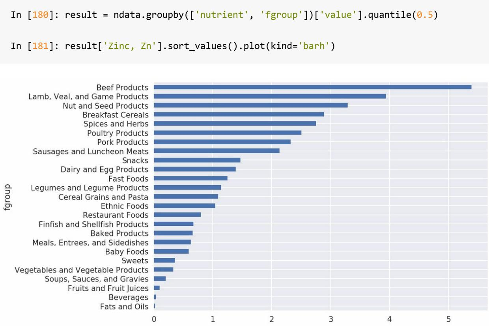

只要稍微动一动脑子，就可以发现各营养成分最为丰富的食物是什么了：

```python
by_nutrient = ndata.groupby(['nutgroup', 'nutrient'])

get_maximum = lambda x: x.loc[x.value.idxmax()]

get_minimum = lambda x: x.loc[x.value.idxmin()]

max_foods = by_nutrient.apply(get_maximum)[['value', 'food]]

# make the food a little smaller
max_foods.food = max_foods.food.str[:50]
```

```asm
In [184]: fec = pd.read_csv('datasets/fec/P00000001-ALL.csv')

In [185]: fec.info()

<class 'pandas.core.frame.DataFrame'>
RangeIndex: 1001731 entries, 0 to 1001730
Data columns (total 16 columns):
cmte_id    1001731 non-null object
cand_id    1001731 non-null object
cand_nm    1001731 non-null object
contbr_nm    1001731 non-null object
contbr_city    1001712 non-null object
contbr_st    1001727 non-null object
contbr_zip    1001620 non-null object
contbr_employer    988002 non-null object
contbr_occupation    993301 non-null object
contb_receipt_amt    1001731 non-null float64
contb_receipt_dt    1001731 non-null object
receipt_desc    14166 non-null object
memo_cd    92482 non-null object
memo_text    97770 non-null object
```

由于得到的DataFrame很大，所以不方便在书里面全部打印出来。这里只给出"Amino Acids"营养分组：

```txt
In [183]: max_foods.loc['Amino Acids']['food']
Out[183]:
nutrient
Alanine    Gelatins, dry powder, unsweetened
Arginine    Seeds, sesame flour, low-fat
Aspartic acid    Soy protein isolate
Cystine    Seeds, cottonseed flour, low fat (glandless)
Glutamic acid    Soy protein isolate
...
Serine    Soy protein isolate, PROTEIN TECHNOLOGIES INTE...
Threonine    Soy protein isolate, PROTEIN TECHNOLOGIES INTE...
Tryptophan    Sea lion, Steller, meat with fat (Alaska Native)
Tyrosine    Soy protein isolate, PROTEIN TECHNOLOGIES INTE...
Valine    Soy protein isolate, PROTEIN TECHNOLOGIES INTE...
Name: food, Length: 19, dtype: object
```

## 14.52012联邦选举委员会数据库

美国联邦选举委员会发布了有关政治竞选赞助方面的数据。其中包括赞助者的姓名、职业、雇主、地址以及出资额等信息。我们对 年美国总统大选的数据集比较感兴趣

（http://www.fec.gov/disclosurep/PDownload.do）。我在2012年6月下载的数据集是一个150MB的CSV文件（P00000001-ALL.csv），我们先用pandas.read\_csv将其加载进来：

```txt
form_tp 1001731 non-null object
file_num 1001731 non-null int64
dtypes: float64(1), int64(1), object(14)
memory usage: 122.3+ MB
```

该DataFrame中的记录如下所示：

```asm
In [186]: fec.iloc[123456]
Out[186]:
cmte_id C00431445
cand_id P80003338
cand_nm Obama, Barack
contbr_nm ELLMAN, IRA
contbr_city TEMPE
...
receipt_desc NaN
memo_cd NaN
memo_text NaN
form_tp SA17A
file_num 772372
Name: 123456, Length: 16, dtype: object
```

你可能已经想出了许多办法从这些竞选赞助数据中抽取有关赞助人和赞助模式的统计信息。我将在接下来的内容中介绍几种不同的分析工作（运用到目前为止已经学到的方法）。

不难看出，该数据中没有党派信息，因此最好把它加进去。通过unique，你可以获取全部的候选人名单：

```python
In [187]: unique_cands = fec.cand_nm.unique()

In [188]: unique_cands
Out[188]:
array(['Bachmann, Michelle', 'Romney, Mitt', 'Obama, Barack', "Roemer, Charles E. 'Buddy' III", 'Pawlenty, Timothy', 'Johnson, Gary Earl', 'Paul, Ron', 'Santorum, Rick', 'Cain, Herman', 'Gingrich, Newt', 'McCotter, Thaddeus G', 'Huntsman, Jon', 'Perry, Rick'], dtype=object)

In [189]: unique_cands[2]
Out[189]: 'Obama, Barack'
```

指明党派信息的方法之一是使用字典：

```python
parties = {'Bachmann, Michelle': 'Republican',
    'Cain, Herman': 'Republican',
    'Gingrich, Newt': 'Republican',
```

```javascript
'Huntsman, Jon': 'Republican',
'Johnson, Gary Earl': 'Republican',
'McCotter, Thaddeus G': 'Republican',
'Obama, Barack': 'Democrat',
'Paul, Ron': 'Republican',
'Pawlenty, Timothy': 'Republican',
'Perry, Rick': 'Republican',
"Roemer, Charles E. 'Buddy' III": 'Republican',
'Romney, Mitt': 'Republican',
'Santorum, Rick': 'Republican'}
```

现在，通过这个映射以及Series对象的map方法，你可以根据候选人姓名得到一组党派信息：

```txt
In [191]: fec.cand_nm[123456:123461]
Out[191]:
123456 Obama, Barack
123457 Obama, Barack
123458 Obama, Barack
123459 Obama, Barack
123460 Obama, Barack
Name: cand_nm, dtype: object

In [192]: fec.cand_nm[123456:123461].map(parties)
Out[192]:
123456 Democrat
123457 Democrat
123458 Democrat
123459 Democrat
123460 Democrat
Name: cand_nm, dtype: object

# Add it as a column
In [193]: fec['party'] = fec.cand_nm.map(parties)

In [194]: fec['party'].value_counts()
Out[194]:
Democrat 593746
Republican 407985
Name: party, dtype: int64
```

这里有两个需要注意的地方。第一，该数据既包括赞助也包括退款（负的出资额）：

```txt
In [195]: (fec.contb_receipt_amt > 0).value_counts()
Out[195]:
True    991475
False    10256
Name: contb_receipt_amt, dtype: int64
```

为了简化分析过程，我限定该数据集只能有正的出资额：

```txt
In [196]: fec = fec[fec.contb_receipt_amt > 0]
```

由于Barack Obama和Mitt Romney是最主要的两名候选人，所以我还专门准备了一个子集，只包含针对他们两人的竞选活动的赞助信息：

```python
In [197]: fec_mrbo = fec[fec.cand_nm.isin(['Obama, Barack', 'Romney, Mitt'])]
```

## 根据职业和雇主统计赞助信息

基于职业的赞助信息统计是另一种经常被研究的统计任务。例如，律师们更倾向于资助民主党，而企业主则更倾向于资助共和党。你可以不相信我，自己看那些数据就知道了。首先，根据职业计算出资总额，这很简单：

```txt
In [198]: fec.contbr_occupation.value_counts()[:10]
Out[198]:
RETIRED 233990
INFORMATION REQUESTED 35107
ATTORNEY 34286
HOMEMAKER 29931
PHYSICIAN 23432
INFORMATION REQUESTED PER BEST EFFORTS 21138
ENGINEER 14334
TEACHER 13990
CONSULTANT 13273
PROFESSOR 12555
Name: contbr_occupation, dtype: int64
```

不难看出，许多职业都涉及相同的基本工作类型，或者同一样东西有多种变体。下面的代码片段可以清理一些这样的数据（将一个职业信息映射到另一个）。注意，这里巧妙地利用了dict.get，它允许没有映射关系的职业也能“通过”：

```python
occ_mapping = {'INFORMATION REQUESTED PER BEST EFFORTS': 'NOT PROVIDED',
    'INFORMATION REQUESTED': 'NOT PROVIDED',
    'INFORMATION REQUESTED (BEST EFFORTS)'': 'NOT PROVIDED',
    'C.E.O.': 'CEO'}
# If no mapping provided, return x
f = lambda x: occ_mapping.get(x, x)
fec.contbr_occupation = fec.contbr_occupation.map(f)
```

我对雇主信息也进行了同样的处理：

```python
emp_mapping = {'INFORMATION REQUESTED PER BEST EFFORTS': 'NOT PROVIDED',
    'INFORMATION REQUESTED': 'NOT PROVIDED',
    'SELF': 'SELF-EMPLOYED',
    'SELF EMPLOYED': 'SELF-EMPLOYED',}
# If no mapping provided, return x
f = lambda x: emp_mapping.get(x, x)
fec.contbr_employer = fec.contbr_employer.map(f)
```

现在，你可以通过pivot\_table根据党派和职业对数据进行聚合，然后过滤掉总出资额不足200万美元的数据：

```txt
In [201]: by_occupation = fec.pivot_table('contb_receipt_amt',
......: index='contbr_occupation',
......: columns='party', aggfunc='sum')

In [202]: over_2mm = by_occupation[by_occupation.sum(1) > 2000000]

In [203]: over_2mm
Out[203]:
party Democrat Republican
contbr_occupation
ATTORNEY 11141982.977.477194e+06
CEO 2074974.794.211041e+06
CONSULTANT 2459912.712.544725e+06
ENGINEER 951525.551.818374e+06
EXECUTIVE 1355161.054.138850e+06
... ... ...
PRESIDENT 1878509.954.720924e+06
PROFESSOR 2165071.082.967027e+05
REAL ESTATE 528902.091.625902e+06
RETIRED 25305116.382.356124e+07
SELF-EMPLOYED 672393.401.640253e+06
[17 rows x 2 columns]
```

把这些数据做成柱状图看起来会更加清楚（'barh'表示水平柱状图，如图14-12所示）：

```javascript
In [205]: over_2mm.plot(kind='barh')
```

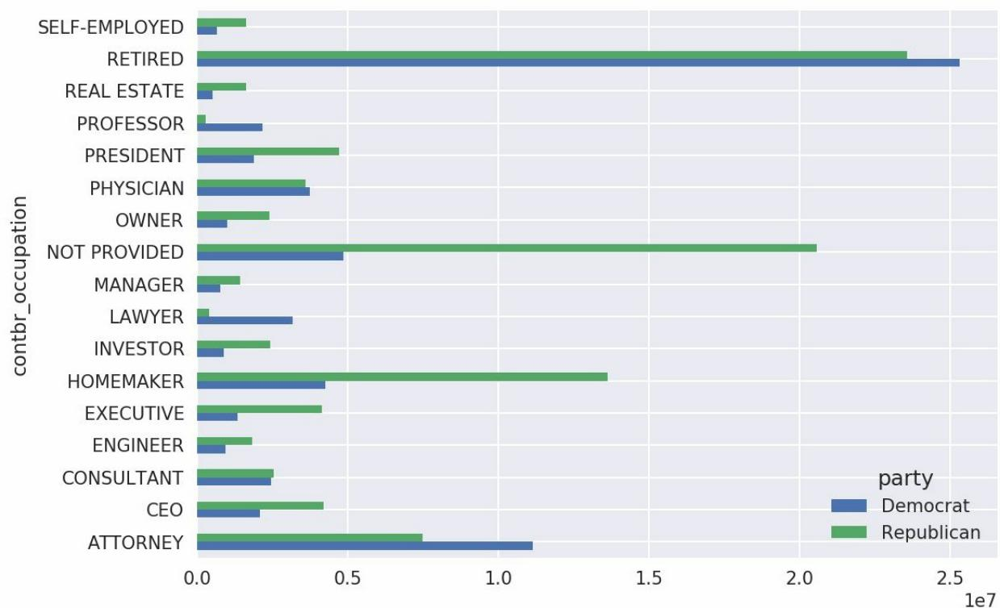

你可能还想了解一下对Obama和Romney总出资额最高的职业和企业。为此，我们先对候选人进行分组，然后使用本章前面介绍的类似top的方法：

```python
def get_top_amounts(group, key, n=5):
    totals = group.groupby(key)['contb_receipt_amt'].sum()
    return totals.nlargest(n)
```

然后根据职业和雇主进行聚合：

```txt
In [207]: grouped = fec_mrbo.groupby('cand_nm')

In [208]: grouped.apply(get_top_amounts, 'contbr_occupation', n=7)
Out[208]:
cand_nm contbr_occupation
Obama, Barack RETIRED 25305116.38
ATTORNEY 11141982.97
INFORMATION REQUESTED 4866973.96
HOMEMAKER 4248875.80
PHYSICIAN 3735124.94
...
Romney, Mitt HOMEMAKER 8147446.22
ATTORNEY 5364718.82
PRESIDENT 2491244.89
EXECUTIVE 2300947.03
C.E.O. 1968386.11
Name: contb_receipt_amt, Length: 14, dtype: float64
```

```txt
In [209]: grouped.apply(get_top_amounts, 'contbr_employer', n=10)
Out[209]:
cand_nm contbr_employer
Obama, Barack RETIRED 22694358.85
SELF-EMPLOYED 17080985.96
NOT EMPLOYED 8586308.70
INFORMATION REQUESTED 5053480.37
HOMEMAKER 2605408.54
...
Romney, Mitt CREDIT SUISSE 281150.00
MORGAN STANLEY 267266.00
GOLDMAN SACH & CO. 238250.00
BARCLAYS CAPITAL 162750.00
H.I.G. CAPITAL 139500.00
Name: contb_receipt_amt, Length: 20, dtype: float64
```

## 对出资额分组

还可以对该数据做另一种非常实用的分析：利用cut函数根据出资额的大小将数据离散化到多个面元中：

```python
In [210]: bins = np.array([0, 1, 10, 100, 1000, 10000,
......:    100000, 1000000, 10000000])

In [211]: labels = pd.cut(fec_mrbo.contb_receipt_amt, bins)

In [212]: labels
Out[212]:
411    (10, 100]
412    (100, 1000]
413    (100, 1000]
414    (10, 100]
415    (10, 100]
...
701381    (10, 100]
701382    (100, 1000]
701383    (1, 10]
701384    (10, 100]
701385    (100, 1000]

Name: contb_receipt_amt, Length: 694282, dtype: category
Categories (8, interval[int64]): [(0, 1] < (1, 10] < (10, 100] < (100, 1000] < (1000, 10000] <
(10000, 100000] < (100000, 1000000] < (1000000,
1000000)]
```

现在可以根据候选人姓名以及面元标签对奥巴马和罗姆尼数据进行分组，以得到一个柱状图：

从这个数据中可以看出，在小额赞助方面，Obama获得的数量比Romney多得多。你还可以对出资额求和并在面元内规格化，以便图形化显示两位候选人各种赞助额度的比例（见图14-13）：

```python
In [216]: bucket_sums = grouped.contb_receipt_amt.sum().unstack(0)
In [217]: normed_sums = bucket_sums.div(bucket_sums.sum(axis=1), axis=0)
In [218]: normed_sums
Out[218]:
cand_nm Obama, Barack Romney, Mitt
contb_receipt_amt
(0, 1] 0.8051820.194818
(1, 10] 0.9187670.081233
(10, 100] 0.9107690.089231
(100, 1000] 0.7101760.289824
(1000, 10000] 0.4473260.552674
(10000, 100000] 0.8231200.176880
(100000, 1000000] 1.000000 NaN
(1000000, 10000000] 1.000000 NaN

In [219]: normed_sums[:-2].plot(kind='barh')
```

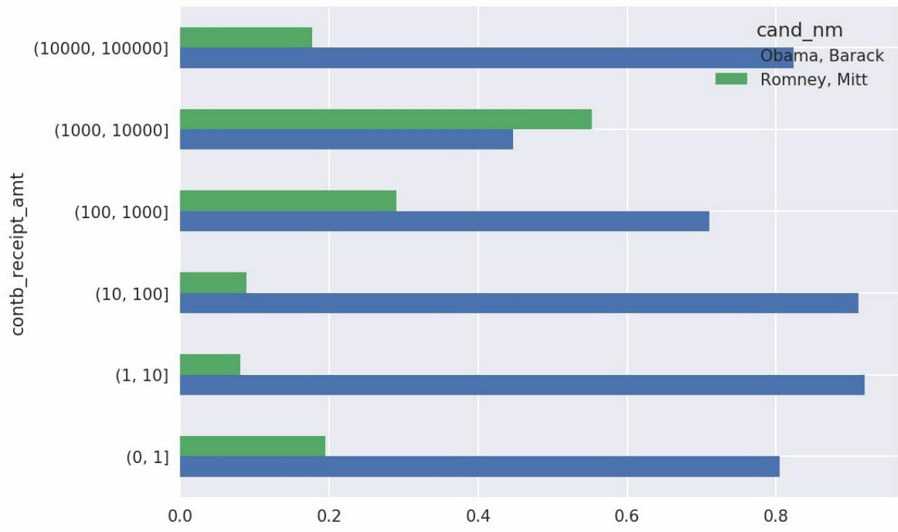  
我排除了两个最大的面元，因为这些不是由个人捐赠的。

还可以对该分析过程做许多的提炼和改进。比如说，可以根据赞助人的姓名和邮编对数据进行聚合，以便找出哪些人进行了多次小额捐款，哪些人又进行了一次或多次大额捐款。我强烈建议你下载这些数据并自己摸索一下。

## 根据州统计赞助信息

根据候选人和州对数据进行聚合是常规操作：

```txt
In [220]: grouped = fec_mrbo.groupby(['cand_nm', 'contbr_st'])
In [221]: totals = grouped.contb_receipt_amt.sum().unstack(0).fillna(0)
In [222]: totals = totals[totals.sum(1) > 100000]
In [223]: totals[:10]
Out[223]:
cand_nm Obama, Barack Romney, Mitt
contbr_st
AK 281840.1586204.24
AL 543123.48527303.51
AR 359247.28105556.00
AZ 1506476.981888436.23
CA 23824984.2411237636.60
CO 2132429.491506714.12
CT 2068291.263499475.45
DC 4373538.801025137.50
```

<table><tr><td>DE</td><td>336669.14</td><td>82712.00</td></tr><tr><td>FL</td><td>7318178.58</td><td>8338458.81</td></tr></table>

如果对各行除以总赞助额，就会得到各候选人在各州的总赞助额比例：

```txt
In [224]: percent = totals.div(totals.sum(1), axis=0)
In [225]: percent[:10]
Out[225]:
cand_nm Obama, Barack Romney, Mitt
contbr_st
AK 0.7657780.234222
AL 0.5073900.492610
AR 0.7729020.227098
AZ 0.4437450.556255
CA 0.6794980.320502
CO 0.5859700.414030
CT 0.3714760.628524
DC 0.8101130.189887
DE 0.8027760.197224
FL 0.4674170.532583
```

## 14.6 总结

我们已经完成了正文的最后一章。附录中有一些额外的内容，可能对你有用。

本书第一版出版已经有5年了，Python已经成为了一个流行的、广泛使用的数据分析语言。你从本书中学到的方法，在相当长的一段时间都是可用的。我希望本书介绍的工具和库对你的工作有用。

在这篇附录中，我会深入NumPy库的数组计算。这会包括ndarray更内部的细节，和更高级的数组操作和算法。

本章包括了一些杂乱的章节，不需要仔细研究。

## A.1 ndarray对象的内部机理

NumPy的ndarray提供了一种将同质数据块（可以是连续或跨越）解释为多维数组对象的方式。正如你之前所看到的那样，数据类型（dtype）决定了数据的解释方式，比如浮点数、整数、布尔值等。

ndarray如此强大的部分原因是所有数组对象都是数据块的一个跨度视图（strided view）。你可能想知道数组视图arr[::2,::-1]不复制任何数据的原因是什么。简单地说，ndarray不只是一块内存和一个dtype，它还有跨度信息，这使得数组能以各种步幅（step size）在内存中移动。更准确地讲，ndarray内部由以下内容组成：

一个指向数据（内存或内存映射文件中的一块数据）的指针。

数据类型或dtype，描述在数组中的固定大小值的格子。

一个表示数组形状（shape）的元组。

一个跨度元组（stride），其中的整数指的是为了前进到当前维度下一个元素需要“跨过”的字节数。

图A-1简单地说明了ndarray的内部结构。  


例如，一个10×5的数组，其形状为(10,5)：

```txt
In [10]: np.ones((10, 5)).shape
Out[10]: (10, 5)
```

一个典型的（C顺序，稍后将详细讲解）3×4×5的float64（8个字节）数组，其跨度为(160,40,8)—— 知道跨度是非常有用的，通常，跨度在一个轴上越大，沿这个轴进行计算的开销就越大：

```txt
In [11]: np.ones((3, 4, 5), dtype=np.float64).strides
Out[11]: (160, 40, 8)
```

虽然NumPy用户很少会对数组的跨度信息感兴趣，但它们却是构建非复制式数组视图的重要因素。跨度甚至可以是负数，这样会使数组在内存中后向移动，比如在切片obj[::-1]或obj[:,::-1]中就是这样的。

## NumPy数据类型体系

你可能偶尔需要检查数组中所包含的是否是整数、浮点数、字符串或Python对象。因为浮点数的种类很多（从float16到float128），判断dtype是否属于某个大类的工作非常繁琐。幸运的是，dtype都有一个超类（比如np.integer和np.floating），它们可以跟np.issubdtype函数结合使用：

```python
In [12]: ints = np.ones(10, dtype=np.uint16)
In [13]: floats = np.ones(10, dtype=np.float32)
In [14]: np.issubdtype(ints.dtype, np.integer)
Out[14]: True
In [15]: np.issubdtype(floats.dtype, np.floating)
Out[15]: True
```

调用dtype的mro方法即可查看其所有的父类：

```txt
In [16]: np.float64.mro()
Out[16]:
[numpy.float64,
numpy.floating,
numpy.inexact,
numpy.number,
numpy.generic,
float,
object]
```

然后得到：

```txt
In [17]: np.issubdtype(ints.dtype, np.number)
Out[17]: True
```

大部分NumPy用户完全不需要了解这些知识，但是这些知识偶尔还是能派上用场的。图A-2说明了dtype体系以及父子类关系。

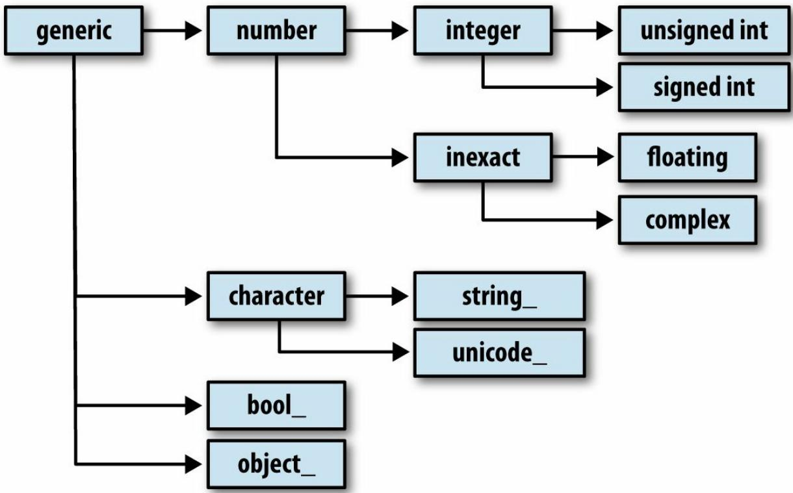

## A.2 高级数组操作

除花式索引、切片、布尔条件取子集等操作之外，数组的操作方式还有很多。虽然pandas中的高级函数可以处理数据分析工作中的许多重型任务，但有时你还是需要编写一些在现有库中找不到的数据算法。

## 数组重塑

多数情况下，你可以无需复制任何数据，就将数组从一个形状转换为另一个形状。只需向数组的实例方法reshape传入一个表示新形状的元组即可实现该目的。例如，假设有一个一维数组，我们希望将其重新排列为一个矩阵（结果见图A-3）：

```python
In [18]: arr = np.arange(8)
In [19]: arr
Out[19]: array([0, 1, 2, 3, 4, 5, 6, 7])
In [20]: arr.reshape((4, 2))
Out[20]:
array([[0, 1],
    [2, 3],
    [4, 5],
    [6, 7]])
```

<table><tr><td>0</td><td>1</td><td>2</td><td>3</td><td>4</td><td>5</td><td>6</td><td>7</td><td>8</td><td>9</td><td>10</td><td>11</td></tr></table>

```txt
arr.reshape((4, 3), order=?))
```

```txt
C order (row major)
```

<table><tr><td>0</td><td>1</td><td>2</td></tr><tr><td>3</td><td>4</td><td>5</td></tr><tr><td>6</td><td>7</td><td>8</td></tr><tr><td>9</td><td>10</td><td>11</td></tr></table>

```txt
order='C'
```

Fortran order (column major

<table><tr><td>0</td><td>4</td><td>8</td></tr><tr><td>1</td><td>5</td><td>9</td></tr><tr><td>2</td><td>6</td><td>10</td></tr><tr><td>3</td><td>7</td><td>11</td></tr></table>

```txt
order='F'
```

多维数组也能被重塑：

```python
In [21]: arr.reshape((4, 2)).reshape((2, 4))
Out[21]:
array([[0, 1, 2, 3],
    [4, 5, 6, 7]])
```

作为参数的形状的其中一维可以是－1，它表示该维度的大小由数据本身推断而来：

```python
In [22]: arr = np.arange(15)
In [23]: arr.reshape((5, -1))
Out[23]:
array([[0, 1, 2],
    [3, 4, 5],
    [6, 7, 8],
    [9, 10, 11],
    [12, 13, 14]])
```

与reshape将一维数组转换为多维数组的运算过程相反的运算通常称为扁平化（flattening）或散开（raveling）：

```txt
In [27]: arr = np.arange(15).reshape((5, 3))
```

```txt
In [28]: arr
```

```python
Out[28]:
array([[0, 1, 2],
    [3, 4, 5],
    [6, 7, 8],
    [9, 10, 11],
    [12, 13, 14]])
In [29]: arr.ravel()
Out[29]: array([0, 1, 2, 3, 4, 5, 6, 7, 8, 9, 10, 11, 12, 13, 14])
```

如果结果中的值与原始数组相同，ravel不会产生源数据的副本。flatten方法的行为类似于ravel，只不过它总是返回数据的副本：

```txt
In [30]: arr.flatten()
Out[30]: array([0, 1, 2, 3, 4, 5, 6, 7, 8, 9, 10, 11, 12, 13, 14])
```

数组可以被重塑或散开为别的顺序。这对NumPy新手来说是一个比较微妙的问题，所以在下一小节中我们将专门讲解这个问题。

## C和Fortran顺序

NumPy允许你更为灵活地控制数据在内存中的布局。默认情况下，NumPy数组是按行优先顺序创建的。在空间方面，这就意味着，对于一个二维数组，每行中的数据项是被存放在相邻内存位置上的。另一种顺序是列优先顺序，它意味着每列中的数据项是被存放在相邻内存位置上的。

由于一些历史原因，行和列优先顺序又分别称为C和Fortran顺序。在FORTRAN 77中，矩阵全都是列优先的。

像reshape和reval这样的函数，都可以接受一个表示数组数据存放顺序的order参数。一般可以是'C'或'F'（还有'A'和'K'等不常用的选项，具体请参考NumPy的文档）。图A-3对此进行了说明：

```python
In [31]: arr = np.arange(12).reshape((3, 4))

In [32]: arr
Out[32]:
array([[0, 1, 2, 3],
    [4, 5, 6, 7],
    [8, 9, 10, 11]])

In [33]: arr.ravel()
Out[33]: array([0, 1, 2, 3, 4, 5, 6, 7, 8, 9, 10, 11])

In [34]: arr.ravel('F')
Out[34]: array([0, 4, 8, 1, 5, 9, 2, 6, 10, 3, 7, 11])
```

<table><tr><td>0</td><td>1</td><td>2</td><td>3</td><td>4</td><td>5</td><td>6</td><td>7</td><td>8</td><td>9</td><td>10</td><td>11</td></tr></table>

arr.reshape((4, 3), order=?)

<table><tr><td>0</td><td>1</td><td>2</td></tr><tr><td>3</td><td>4</td><td>5</td></tr><tr><td>6</td><td>7</td><td>8</td></tr><tr><td>9</td><td>10</td><td>11</td></tr></table>

```txt
order='C'
```

Fortran order (column major

<table><tr><td>0</td><td>4</td><td>8</td></tr><tr><td>1</td><td>5</td><td>9</td></tr><tr><td>2</td><td>6</td><td>10</td></tr><tr><td>3</td><td>7</td><td>11</td></tr></table>

```txt
order='F'
```

二维或更高维数组的重塑过程比较令人费解（见图A-3）。C和Fortran顺序的关键区别就是维度的行进顺序：

C/行优先顺序：先经过更高的维度（例如，轴1会先于轴0被处理）。

Fortran/列优先顺序：后经过更高的维度（例如，轴0会先于轴1被处理）。

## 数组的合并和拆分

numpy.concatenate可以按指定轴将一个由数组组成的序列（如元组、列表等）连接到一起：

```python
In [35]: arr1 = np.array([[1, 2, 3], [4, 5, 6]])
In [36]: arr2 = np.array([[7, 8, 9], [10, 11, 12]])
In [37]: np.concatenate([arr1, arr2], axis=0)
Out[37]:
array([[1, 2, 3],
    [4, 5, 6],
    [7, 8, 9],
    [10, 11, 12]])
In [38]: np.concatenate([arr1, arr2], axis=1)
Out[38]:
array([[1, 2, 3, 7, 8, 9],
    [4, 5, 6, 10, 11, 12]])
```

对于常见的连接操作，NumPy提供了一些比较方便的方法（如vstack和hstack）。因此，上面的运算还可以表达为：

```python
In [39]: np.vstack((arr1, arr2))
Out[39]:
array([[ 1, 2, 3],
    [ 4, 5, 6],
    [ 7, 8, 9],
    [10, 11, 12]])
In [40]: np.hstack((arr1, arr2))
Out[40]:
array([[ 1, 2, 3, 7, 8, 9],
    [ 4, 5, 6, 10, 11, 12]])
```

与此相反，split用于将一个数组沿指定轴拆分为多个数组：

```python
In [41]: arr = np.random.randn(5, 2)

In [42]: arr
Out[42]:
array([[ -0.2047, 0.4789],
    [-0.5194, -0.5557],
    [1.9658, 1.3934],
    [0.0929, 0.2817],
    [0.769, 1.2464]])

In [43]: first, second, third = np.split(arr, [1]

In [44]: first
Out[44]: array([[ -0.2047, 0.4789]])

In [45]: second
Out[45]:
array([[ -0.5194, -0.5557],
    [1.9658, 1.3934]])
In [46]: third
Out[46]:
array([[0.0929, 0.2817],
    [0.769, 1.2464]])
```

传入到np.split的值[1,3]指示在哪个索引处分割数组。

表A-1中列出了所有关于数组连接和拆分的函数，其中有些是专门为了方便常见的连接运算而提供的。

```txt
函数 说明
concatenate 最一般化的连接，沿一条轴连接一组数组
vstack、row_stack 以面向行的方式对数组进行堆叠（沿轴0）
hstack 以面向列的方式对数组进行堆叠（沿轴1）
column_stack 类似于hstack，但是会先将一维数组转换为二维列向量
dstack 以面向“深度”的方式对数组进行堆叠（沿轴2）
split 沿指定轴在指定的位置拆分数组
hsplit、vsplit、dsplit split的便捷化函数，分别沿轴0、轴1、轴2进行拆分
```

## 堆叠辅助类：r和c

NumPy命名空间中有两个特殊的对象——r和c，它们可以使数组的堆叠操作更为简洁：

```python
In [47]: arr = np.arange(6)

In [48]: arr1 = arr.reshape((3, 2))

In [49]: arr2 = np.random.randn(3, 2)

In [50]: np.r_[arr1, arr2]

Out[50]:
array([[0., 1.],
    [2., 3.],
    [4., 5.],
    [1.0072, -1.2962],
    [0.275, 0.2289],
    [1.3529, 0.8864]])

In [51]: np.c_[np.r_[arr1, arr2], arr]

Out[51]:
array([[0., 1., 0.],
    [2., 3., 1.],
    [4., 5., 2.],
    [1.0072, -1.2962, 3.],
    [0.275, 0.2289, 4.],
    [1.3529, 0.8864, 5.]])
```

它还可以将切片转换成数组：

```txt
In [52]: np.c_[1:6, -10:-5]
Out[52]:
array([[ 1, -10],
    [ 2, -9],
```

```txt
[ 3, -8],
[ 4, -7],
[ 5, -6]])
```

r和c的具体功能请参考其文档。

## 元素的重复操作：tile和repeat

对数组进行重复以产生更大数组的工具主要是repeat和tile这两个函数。repeat会将数组中的各个元素重复一定次数，从而产生一个更大的数组：

```python
In [53]: arr = np.arange(3)
In [54]: arr
Out[54]: array([0, 1, 2])
In [55]: arr.repeat(3)
Out[55]: array([0, 0, 0, 1, 1, 1, 2, 2, 2])
```

笔记：跟其他流行的数组编程语言（如MATLAB）不同，NumPy中很少需要对数组进行重复（replicate）。这主要是因为广播（broadcasting，我们将在下一节中讲解该技术）能更好地满足该需求。

默认情况下，如果传入的是一个整数，则各元素就都会重复那么多次。如果传入的是一组整数，则各元素就可以重复不同的次数：

```txt
In [56]: arr.repeat([2, 3, 4])
Out[56]: array([0, 0, 1, 1, 1, 2, 2, 2, 2])
```

对于多维数组，还可以让它们的元素沿指定轴重复：

```python
In [57]: arr = np.random.randn(2, 2)

In [58]: arr
Out[58]:
array([[-2.0016, -0.3718],
    [1.669, -0.4386]])

In [59]: arr.repeat(2, axis=0)
Out[59]:
array([[-2.0016, -0.3718],
    [-2.0016, -0.3718],
    [1.669, -0.4386],
    [1.669, -0.4386]])
```

注意，如果没有设置轴向，则数组会被扁平化，这可能不会是你想要的结果。同样，在对多维进行重复时，也可以传入一组整数，这样就会使各切片重复不同的次数：

```python
In [60]: arr.repeat([2, 3], axis=0)
Out[60]:
array([[-2.0016, -0.3718],
    [-2.0016, -0.3718],
    [1.669, -0.4386],
    [1.669, -0.4386],
    [1.669, -0.4386]])
In [61]: arr.repeat([2, 3], axis=1)
Out[61]:
array([[-2.0016, -2.0016, -0.3718, -0.3718, -0.3718],
    [1.669, 1.669, -0.4386, -0.4386, -0.4386]])
```

tile的功能是沿指定轴向堆叠数组的副本。你可以形象地将其想象成“铺瓷砖”：

```python
In [62]: arr
Out[62]:
array([[-2.0016, -0.3718],
    [ 1.669 , -0.4386]])
In [63]: np.tile(arr, 2)
Out[63]:
array([[-2.0016, -0.3718, -2.0016, -0.3718],
    [ 1.669 , -0.4386, 1.669 , -0.4386]])
```

第二个参数是瓷砖的数量。对于标量，瓷砖是水平铺设的，而不是垂直铺设。它可以是一个表示“铺设”布局的元组：

```python
In [64]: arr
Out[64]:
array([[-2.0016, -0.3718],
    [ 1.669 , -0.4386]])
In [65]: np.tile(arr, (2, 1))
Out[65]:
array([[-2.0016, -0.3718],
    [ 1.669 , -0.4386],
    [-2.0016, -0.3718],
    [ 1.669 , -0.4386]])
In [66]: np.tile(arr, (3, 2))
Out[66]:
array([[-2.0016, -0.3718, -2.0016, -0.3718],
```

```json
[1.669, -0.4386, 1.669, -0.4386],
[-2.0016, -0.3718, -2.0016, -0.3718],
[1.669, -0.4386, 1.669, -0.4386],
[-2.0016, -0.3718, -2.0016, -0.3718],
[1.669, -0.4386, 1.669, -0.4386]])
```

## 花式索引的等价函数：take和put

在第4章中我们讲过，获取和设置数组子集的一个办法是通过整数数组使用花式索引：

```python
In [67]: arr = np.arange(10) * 100
In [68]: inds = [7, 1, 2, 6]
In [69]: arr[inds]
Out[69]: array([700, 100, 200, 600])
```

ndarray还有其它方法用于获取单个轴向上的选区：

```python
In [70]: arr.take(inds)
Out[70]: array([700, 100, 200, 600])

In [71]: arr.put(inds, 42)

In [72]: arr
Out[72]: array([0, 42, 42, 300, 400, 500, 42, 42,800, 900])

In [73]: arr.put(inds, [40, 41, 42, 43])

In [74]: arr
Out[74]: array([0, 41, 42, 300, 400, 500, 43, 40, 800, 900])
```

要在其它轴上使用take，只需传入axis关键字即可：

```python
In [75]: inds = [2, 0, 2, 1]
In [76]: arr = np.random.randn(2, 4)
In [77]: arr
Out[77]:
array([[-0.5397, 0.477, 3.2489, -1.0212], [-0.5771, 0.1241, 0.3026, 0.5238]])
In [78]: arr.take(inds, axis=1)
Out[78]:
```

```txt
array([[3.2489, -0.5397, 3.2489, 0.477], [0.3026, -0.5771, 0.3026, 0.1241]])
```

put不接受axis参数，它只会在数组的扁平化版本（一维，C顺序）上进行索引。因此，在需要用其他轴向的索引设置元素时，最好还是使用花式索引。

## A.3 广播

广播（broadcasting）指的是不同形状的数组之间的算术运算的执行方式。它是一种非常强大的功能，但也容易令人误解，即使是经验丰富的老手也是如此。将标量值跟数组合并时就会发生最简单的广播：

```python
In [79]: arr = np.arange(5)
In [80]: arr
Out[80]: array([0, 1, 2, 3, 4])
In [81]: arr * 4
Out[81]: array([0, 4, 8, 12, 16])
```

这里我们说：在这个乘法运算中，标量值4被广播到了其他所有的元素上。

看一个例子，我们可以通过减去列平均值的方式对数组的每一列进行距平化处理。这个问题解决起来非常简单：

```python
In [82]: arr = np.random.randn(4, 3)

In [83]: arr.mean(0)
Out[83]: array([-0.3928, -0.3824, -0.8768])

In [84]: demeaned = arr - arr.mean(0)

In [85]: demeaned
Out[85]:
array([[0.3937, 1.7263, 0.1633],
    [-0.4384, -1.9878, -0.9839],
    [-0.468, 0.9426, -0.3891],
    [0.5126, -0.6811, 1.2097]])

In [86]: demeaned.mean(0)
Out[86]: array([-0., 0., -0.])
```

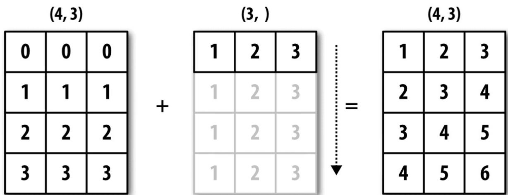

图A-4形象地展示了该过程。用广播的方式对行进行距平化处理会稍微麻烦一些。幸运的是，只要遵循一定的规则，低维度的值是可以被广播到数组的任意维度的（比如对二维数组各列减去行平均值）。

(4,3)

(3, )

(4,3)

<table><tr><td>1</td><td>2</td><td>3</td></tr><tr><td>2</td><td>3</td><td>4</td></tr><tr><td>3</td><td>4</td><td>5</td></tr><tr><td>4</td><td>5</td><td>6</td></tr></table>

于是就得到了：

## 广播的原则

如果两个数组的后缘维度(trailingdimension，即从末尾开始算起的维度)的轴长度相符或其中一方的长度为1，则认为它们是广播兼容的。广播会在缺失和(或)长度为1的维度上进行

虽然我是一名经验丰富的NumPy老手，但经常还是得停下来画张图并想想广播的原则。再来看一下最后那个例子，假设你希望对各行减去那个平均值。由于arr.mean(0)的长度为3，所以它可以在0轴向上进行广播：因为arr的后缘维度是3，所以它们是兼容的。根据该原则，要在1轴向上做减法（即各行减去行平均值），较小的那个数组的形状必须是(4,1)：

```python
In [87]: arr
Out[87]:
array([[0.0009, 1.3438, -0.7135],
    [-0.8312, -2.3702, -1.8608],
    [-0.8608, 0.5601, -1.2659],
    [0.1198, -1.0635, 0.3329]])

In [88]: row_means = arr.mean(1)

In [89]: row_means.shape
Out[89]: (4,)
In [90]: row_means.reshape((4, 1))
Out[90]:
array([[0.2104],
    [-1.6874],
    [-0.5222],
```

```javascript
In [92]: demeaned.mean(1)
Out[92]: array([0., -0., 0., 0.])
```

```json
[-0.2036]])
```

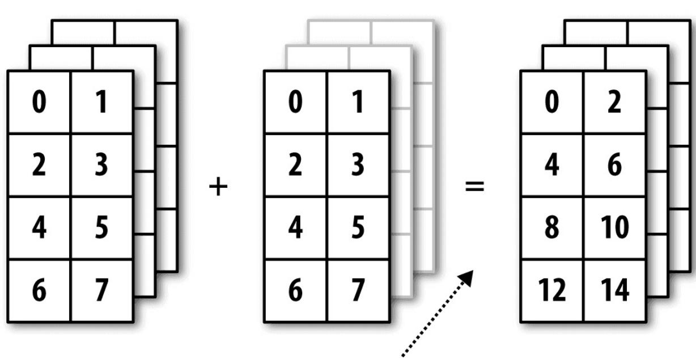

```python
In [91]: demeaned = arr - row_means.reshape((4, 1))
```

图A-5说明了该运算的过程。

(4,3)

<table><tr><td>0</td><td>0</td><td>0</td></tr><tr><td>1</td><td>1</td><td>1</td></tr><tr><td>2</td><td>2</td><td>2</td></tr><tr><td>3</td><td>3</td><td>3</td></tr></table>

(4, 1)

$$
\begin{array}{c c c} \hline 1 & 1 & 1 \\ \hline 2 & 2 & 2 \\ \hline 3 & 3 & 3 \\ \hline 4 & 4 & 4 \\ \hline \end{array} \tag{4,1}
$$

(4, 3)

$$
\begin{array}{c c c} \hline 1 & 1 & 1 \\ \hline 3 & 3 & 3 \\ \hline 5 & 5 & 5 \\ \hline 7 & 7 & 7 \\ \hline \end{array}
$$

图A-6展示了另外一种情况，这次是在一个三维数组上沿0轴向加上一个二维数组。

(3,4, 2)

(4, 2)

(3, 4, 2)

沿其它轴向广播

高维度数组的广播似乎更难以理解，而实际上它也是遵循广播原则的。如果不然，你就会得到下面这样一个错误：

```txt
In [93]: arr - arr.mean(1)
-------- ValueError Traceback (most recent call last)
<ipython-input-93-7b87b85a20b2> in <module>() ----> 1 arr - arr.mean(1)
ValueError: operands could not be broadcast together with shapes (4,3) (4,)
```

人们经常需要通过算术运算过程将较低维度的数组在除0轴以外的其他轴向上广播。根据广播的原则，较小数组的“广播维”必须为1。在上面那个行距平化的例子中，这就意味着要将行平均值的形状变成(4,1)而不是(4,)：

```python
In [94]: arr - arr.mean(1).reshape((4, 1))
Out[94]:
array([[-0.2095, 1.1334, -0.9239],
    [0.8562, -0.6828, -0.1734],
    [-0.3386, 1.0823, -0.7438],
    [0.3234, -0.8599, 0.5365]])
```

对于三维的情况，在三维中的任何一维上广播其实也就是将数据重塑为兼容的形状而已。图A-7说明了要在三维数组各维度上广播的形状需求。

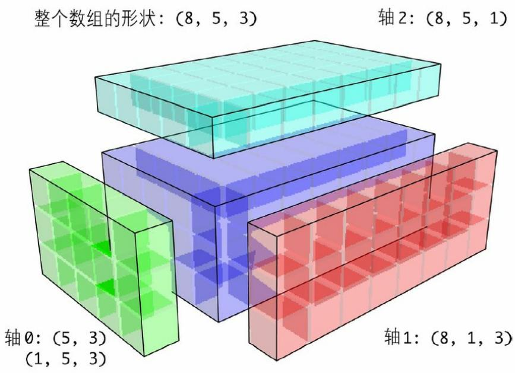

于是就有了一个非常普遍的问题（尤其是在通用算法中），即专门为了广播而添加一个长度为 的新轴。虽然reshape是一个办法，但插入轴需要构造一个表示新形状的元组。这是一个很郁闷的过程。因此，NumPy数组提供了一种通过索引机制插入轴的特殊语法。下面这段代码通过特殊的np.newaxis属性以及“全”切片来插入新轴：

```python
In [95]: arr = np.zeros((4, 4))
```

```python
In [96]: arr_3d = arr[:, np.newaxis, :]
In [97]: arr_3d.shape
Out[97]: (4, 1, 4)

In [98]: arr_1d = np.random.normal(size=3)

In [99]: arr_1d[:, np.newaxis]
Out[99]:
array([[ -2.3594],
    [-0.1995],
    [-1.542 ]])

In [100]: arr_1d[np.newaxis, :]
Out[100]: array([[ -2.3594, -0.1995, -1.542 ]])
```

因此，如果我们有一个三维数组，并希望对轴2进行距平化，那么只需要编写下面这样的代码就可以了：

```python
In [101]: arr = np.random.randn(3, 4, 5)

In [102]: depth_means = arr.mean(2)

In [103]: depth_means
Out[103]:
array([[-0.4735, 0.3971, -0.0228, 0.2001],
    [-0.3521, -0.281, -0.071, -0.1586],
    [0.6245, 0.6047, 0.4396, -0.2846]])
In [104]: depth_means.shape
Out[104]: (3, 4)

In [105]: demeaned = arr - depth_means[:, :, np.newaxis]

In [106]: demeaned.mean(2)
Out[106]:
array([[0., 0., -0., -0.],
    [0., 0., -0., 0.],
    [0., 0., -0., -0.]])
```

有些读者可能会想，在对指定轴进行距平化时，有没有一种既通用又不牺牲性能的方法呢？实际上是有的，但需要一些索引方面的技巧：

```python
def demean_axis(arr, axis=0):
    means = arr.mean(axis)
# This generalizes things like [:, :, np.newaxis] to N dimensions
```

```txt
indexer = [slice(None)] * arr.ndim
indexer[axis] = np.newaxis
return arr - means[indexer]
```

## 通过广播设置数组的值

算术运算所遵循的广播原则同样也适用于通过索引机制设置数组值的操作。对于最简单的情况，我们可以这样做：

```python
In [107]: arr = np.zeros((4, 3))
In [108]: arr[:] = 5
In [109]: arr
Out[109]:
array([[5., 5., 5.],
    [5., 5., 5.],
    [5., 5., 5.],
    [5., 5., 5.]])
```

但是，假设我们想要用一个一维数组来设置目标数组的各列，只要保证形状兼容就可以了：

```python
In [110]: col = np.array([1.28, -0.42, 0.44, 1.6])
In [111]: arr[:] = col[:, np.newaxis]

In [112]: arr
Out[112]:
array([[1.28, 1.28, 1.28],
    [-0.42, -0.42, -0.42],
    [0.44, 0.44, 0.44],
    [1.6, 1.6, 1.6]])
In [113]: arr[:2] = [[-1.37], [0.509]]

In [114]: arr
Out[114]:
array([[[-1.37, -1.37, -1.37],
    [0.509, 0.509, 0.509],
    [0.44, 0.44, 0.44],
    [1.6, 1.6, 1.6]])
```

## A.4 ufunc高级应用

虽然许多NumPy用户只会用到通用函数所提供的快速的元素级运算，但通用函数实际上还有一些高级用法能使我们丢开循环而编写出更为简洁的代码。

## ufunc实例方法

NumPy的各个二元ufunc都有一些用于执行特定矢量化运算的特殊方法。表A-2汇总了这些方法，下面我将通过几个具体的例子对它们进行说明。

reduce接受一个数组参数，并通过一系列的二元运算对其值进行聚合（可指明轴向）。例如，我们可以用np.add.reduce对数组中各个元素进行求和：

```txt
In [115]: arr = np.arange(10)
In [116]: np.add.reduce(arr)
Out[116]: 45
In [117]: arr.sum()
Out[117]: 45
```

起始值取决于ufunc（对于add的情况，就是0）。如果设置了轴号，约简运算就会沿该轴向执行。这就使你能用一种比较简洁的方式得到某些问题的答案。在下面这个例子中，我们用np.logical\_and检查数组各行中的值是否是有序的：

```python
In [118]: np.random.seed(12346) # for reproducibility

In [119]: arr = np.random.randn(5, 5)

In [120]: arr[::2].sort(1) # sort a few rows

In [121]: arr[:, :-1] < arr[:, 1:]
Out[121]:
array([[ True, True, True, True],
    [False, True, False, False],
    [ True, True, True, True],
    [ True, False, True, True],
    [ True, True, True, True]], dtype=bool)

In [122]: np.logical_and.reduce(arr[:, :-1] < arr[:, 1:], axis=1)
Out[122]: array([ True, False, True, False, True], dtype=bool)
```

注意，logical\_and.reduce跟all方法是等价的。

ccumulate跟reduce的关系就像cumsum跟sum的关系那样。它产生一个跟原数组大小相同的中间“累计”值数组：

```python
In [123]: arr = np.arange(15).reshape((3, 5))
In [124]: np.add.accumulate(arr, axis=1)
Out[124]:
array([[0, 1, 3, 6, 10],
    [5, 11, 18, 26, 35],
    [10, 21, 33, 46, 60]])
```

outer用于计算两个数组的叉积：

```python
In [125]: arr = np.arange(3).repeat([1, 2, 2])

In [126]: arr
Out[126]: array([0, 1, 1, 2, 2])

In [127]: np.multiply.outer(arr, np.arange(5))
Out[127]:
array([[0, 0, 0, 0, 0],
    [0, 1, 2, 3, 4],
    [0, 1, 2, 3, 4],
    [0, 2, 4, 6, 8],
    [0, 2, 4, 6, 8]])
```

outer输出结果的维度是两个输入数据的维度之和：

```javascript
In [128]: x, y = np.random.randn(3, 4), np.random.randn(5)
In [129]: result = np.subtract.outer(x, y)
In [130]: result.shape
Out[130]: (3, 4, 5)
```

最后一个方法reduceat用于计算“局部约简”，其实就是一个对数据各切片进行聚合的groupby运算。它接受一组用于指示如何对值进行拆分和聚合的“面元边界”：

```txt
In [131]: arr = np.arange(10)
In [132]: np.add.reduceat(arr, [0, 5, 8])
Out[132]: array([10, 18, 17])
```

最终结果是在arr[0:5]、arr[5:8]以及arr[8:]上执行的约简。跟其他方法一样，这里也可以传入一个axis参数：

```python
In [133]: arr = np.multiply.outer(np.arange(4), np.arange(5))
```

```python
In [134]: arr
Out[134]:
array([[0, 0, 0, 0, 0],
    [0, 1, 2, 3, 4],
    [0, 2, 4, 6, 8],
    [0, 3, 6, 9, 12]])
In [135]: np.add.reduceat(arr, [0, 2, 4], axis=1)
Out[135]:
array([[0, 0, 0],
    [1, 5, 4],
    [2, 10, 8],
    [3, 15, 12]])
```

表A-2总结了部分的ufunc方法。

```txt
方法 说明
reduce(x) 通过连续执行原始运算的方式对值进行聚合
accumulate(x) 聚合值，保留所有局部聚合结果
reduceat(x, bins) “局部”约简（也就是groupby）。约简数据的各个切片以产生聚合型数组
outer(x, y) 对x和y中的每对元素应用原始运算。结果数组的形状为x.shape + y.shape
```

## 编写新的ufunc

有多种方法可以让你编写自己的NumPy ufuncs。最常见的是使用NumPy C API，但它超越了本书的范围。在本节，我们讲纯粹的Python ufunc。

numpy.frompyfunc接受一个Python函数以及两个分别表示输入输出参数数量的参数。例如，下面是一个能够实现元素级加法的简单函数：

```python
In [136]: def add_elements(x, y):
    .....: return x + y

In [137]: add_them = np.frompyfunc(add_elements, 2, 1)

In [138]: add_them(np.arange(8), np.arange(8))
Out[138]: array([0, 2, 4, 6, 8, 10, 12, 14], dtype=object)
```

用frompyfunc创建的函数总是返回Python对象数组，这一点很不方便。幸运的是，还有另一个办法，即numpy.vectorize。虽然没有frompyfunc那么强大，但可以让你指定输出类型：

```python
In [139]: add_them = np.vectorize(add_elements, otypes=[np.float64])
In [140]: add_them(np.arange(8), np.arange(8))
Out[140]: array([0., 2., 4., 6., 8., 10., 12., 14.])
```

虽然这两个函数提供了一种创建ufunc型函数的手段，但它们非常慢，因为它们在计算每个元素时都要执行一次Python函数调用，这就会比NumPy自带的基于C的ufunc慢很多：

```txt
In [141]: arr = np.random.randn(10000)
In [142]: %timeit add_them(arr, arr)
4.12 ms +- 182 us per loop (mean +- std. dev. of 7 runs, 100 loops each)
In [143]: %timeit np.add(arr, arr)
6.89 us +- 504 ns per loop (mean +- std. dev. of 7 runs, 100000 loops each)
```

本章的后面，我会介绍使用Numba（http://numba.pydata.org/），创建快速Python ufuncs。

## A.5 结构化和记录式数组

你可能已经注意到了，到目前为止我们所讨论的ndarray都是一种同质数据容器，也就是说，在它所表示的内存块中，各元素占用的字节数相同（具体根据dtype而定）。从表面上看，它似乎不能用于表示异质或表格型的数据。结构化数组是一种特殊的ndarray，其中的各个元素可以被看做C语言中的结构体（struct，这就是“结构化”的由来）或SQL表中带有多个命名字段的行：

```python
In [144]: dtype = [('x', np.float64), ('y', np.int32)]
In [145]: sarr = np.array([(1.5, 6), (np.pi, -2)], dtype=dtype)
In [146]: sarr
Out[146]:
array([(1.5, 6), (3.1416, -2)],
    dtype=[('x', '<f8'), ('y', '<i4')])
```

定义结构化dtype（请参考NumPy的在线文档）的方式有很多。最典型的办法是元组列表，各元组的格式为(field\_name,field\_data\_type)。这样，数组的元素就成了元组式的对象，该对象中各个元素可以像字典那样进行访问：

```txt
In [147]: sarr[0]
Out[147]: (1.5, 6)
In [148]: sarr[0]['y']
Out[148]: 6
```

字段名保存在dtype.names属性中。在访问结构化数组的某个字段时，返回的是该数据的视图，所以不会发生数据复制：

```txt
In [149]: sarr['x']
Out[149]: array([1.5, 3.1416])
```

## 嵌套dtype和多维字段

在定义结构化dtype时，你可以再设置一个形状（可以是一个整数，也可以是一个元组）：

```python
In [150]: dtype = [('x', np.int64, 3), ('y', np.int32)]
In [151]: arr = np.zeros(4, dtype=dtype)
In [152]: arr
Out[152]:
array([([0, 0, 0], 0), ([0, 0, 0], 0), ([0, 0, 0], 0), ([0, 0, 0], 0)], dtype=[('x', '<i8', (3,)), ('y', '<i4'])
```

在这种情况下，各个记录的x字段所表示的是一个长度为3的数组：

```txt
In [153]: arr[0]['x']
Out[153]: array([0, 0, 0])
```

这样，访问arr['x']即可得到一个二维数组，而不是前面那个例子中的一维数组：

```python
In [154]: arr['x']
Out[154]:
array([[0, 0, 0],
    [0, 0, 0],
    [0, 0, 0],
    [0, 0, 0]])
```

这就使你能用单个数组的内存块存放复杂的嵌套结构。你还可以嵌套dtype，作出更复杂的结构。下面是一个简单的例子：

```python
In [155]: dtype = [('x', [('a', 'f8'), ('b', 'f4')]), ('y', np.int32)]
In [156]: data = np.array([((1, 2), 5), ((3, 4), 6)], dtype=dtype)
In [157]: data['x']
Out[157]:
array([(1., 2.), (3., 4.)],
    dtype=[('a', '<f8'), ('b', '<f4')])
```

```python
In [158]: data['y']
Out[158]: array([5, 6], dtype=int32)
In [159]: data['x']['a']
Out[159]: array([1., 3.])
```

pandas的DataFrame并不直接支持该功能，但它的分层索引机制跟这个差不多。

## 为什么要用结构化数组

跟pandas的DataFrame相比，NumPy的结构化数组是一种相对较低级的工具。它可以将单个内存块解释为带有任意复杂嵌套列的表格型结构。由于数组中的每个元素在内存中都被表示为固定的字节数，所以结构化数组能够提供非常快速高效的磁盘数据读写（包括内存映像）、网络传输等功能。

结构化数组的另一个常见用法是，将数据文件写成定长记录字节流，这是C和C++代码中常见的数据序列化手段（业界许多历史系统中都能找得到）。只要知道文件的格式（记录的大小、元素的顺序、字节数以及数据类型等），就可以用np.fromfile将数据读入内存。这种用法超出了本书的范围，知道这点就可以了。

## A.6 更多有关排序的话题

跟Python内置的列表一样，ndarray的sort实例方法也是就地排序。也就是说，数组内容的重新排列是不会产生新数组的：

```txt
In [160]: arr = np.random.randn(6)
In [161]: arr.sort()
In [162]: arr
Out[162]: array([-1.082, 0.3759, 0.8014, 1.1397, 1.2888, 1.8413])
```

在对数组进行就地排序时要注意一点，如果目标数组只是一个视图，则原始数组将会被修改：

```python
In [163]: arr = np.random.randn(3, 5)

In [164]: arr
Out[164]:
array([[-0.3318, -1.4711, 0.8705, -0.0847, -1.1329],
    [-1.0111, -0.3436, 2.1714, 0.1234, -0.0189],
    [0.1773, 0.7424, 0.8548, 1.038, -0.329]]))

In [165]: arr[:, 0].sort() # Sort first column values in-place
```

```python
In [166]: arr
Out[166]:
array([[-1.0111, -1.4711, 0.8705, -0.0847, -1.1329],
    [-0.3318, -0.3436, 2.1714, 0.1234, -0.0189],
    [0.1773, 0.7424, 0.8548, 1.038, -0.329]])
```

相反，numpy.sort会为原数组创建一个已排序副本。另外，它所接受的参数（比如kind）跟ndarray.sort一样：

```python
In [167]: arr = np.random.randn(5)
In [168]: arr
Out[168]: array([-1.1181, -0.2415, -2.0051, 0.7379, -1.0614])
In [169]: np.sort(arr)
Out[169]: array([-2.0051, -1.1181, -1.0614, -0.2415, 0.7379])
In [170]: arr
Out[170]: array([-1.1181, -0.2415, -2.0051, 0.7379, -1.0614])
```

这两个排序方法都可以接受一个axis参数，以便沿指定轴向对各块数据进行单独排序：

```python
In [171]: arr = np.random.randn(3, 5)

In [172]: arr
Out[172]:
array([[0.5955, -0.2682, 1.3389, -0.1872, 0.9111], [-0.3215, 1.0054, -0.5168, 1.1925, -0.1989], [0.3969, -1.7638, 0.6071, -0.2222, -0.2171]])
In [173]: arr.sort(axis=1)

In [174]: arr
Out[174]:
array([[0.2682, -0.1872, 0.5955, 0.9111, 1.3389], [-0.5168, -0.3215, -0.1989, 1.0054, 1.1925], [-1.7638, -0.2222, -0.2171, 0.3969, 0.6071]])
```

你可能注意到了，这两个排序方法都不可以被设置为降序。其实这也无所谓，因为数组切片会产生视图（也就是说，不会产生副本，也不需要任何其他的计算工作）。许多Python用户都很熟悉一个有关列表的小技巧：values[::-1]可以返回一个反序的列表。对ndarray也是如此：

```txt
In [175]: arr[:, :-1]
Out[175]:
array([[ 1.3389, 0.9111, 0.5955, -0.1872, -0.2682],
```

```json
[1.1925, 1.0054, -0.1989, -0.3215, -0.5168],
[0.6071, 0.3969, -0.2171, -0.2222, -1.7638]])
```

## 间接排序：argsort和lexsort

在数据分析工作中，常常需要根据一个或多个键对数据集进行排序。例如，一个有关学生信息的数据表可能需要以姓和名进行排序（先姓后名）。这就是间接排序的一个例子，如果你阅读过有关pandas的章节，那就已经见过不少高级例子了。给定一个或多个键，你就可以得到一个由整数组成的索引数组（我亲切地称之为索引器），其中的索引值说明了数据在新顺序下的位置。argsort和numpy.lexsort就是实现该功能的两个主要方法。下面是一个简单的例子：

```txt
In [176]: values = np.array([5, 0, 1, 3, 2])
In [177]: indexer = values.argsort()
In [178]: indexer
Out[178]: array([1, 2, 4, 3, 0])
In [179]: values[indexer]
Out[179]: array([0, 1, 2, 3, 5])
```

一个更复杂的例子，下面这段代码根据数组的第一行对其进行排序：

```python
In [180]: arr = np.random.randn(3, 5)

In [181]: arr[0] = values

In [182]: arr
Out[182]:
array([[5., 0., 1., 3., 2.], [-0.3636, -0.1378, 2.1777, -0.4728, 0.8356], [-0.2089, 0.2316, 0.728, -1.3918, 1.9956]])

In [183]: arr[:, arr[0].argsort()]

Out[183]:
array([[0., 1., 2., 3., 5.], [-0.1378, 2.1777, 0.8356, -0.4728, -0.3636], [0.2316, 0.728, 1.9956, -1.3918, -0.2089]])
```

lexsort跟argsort差不多，只不过它可以一次性对多个键数组执行间接排序（字典序）。假设我们想对一些以姓和名标识的数据进行排序：

```python
In [184]: first_name = np.array(['Bob', 'Jane', 'Steve', 'Bill', 'Barbara'])
In [185]: last_name = np.array(['Jones', 'Arnold', 'Arnold', 'Jones', 'Walters'])
```

```txt
In [186]: sorter = np.lexsort((first_name, last_name))  
In [187]: sorter  
Out[187]: array([1, 2, 3, 0, 4])  
In [188]: zip(last_name[sorter], first_name[sorter])  
Out[188]: <zip at 0x7fa203eda1c8>
```

刚开始使用lexsort的时候可能会比较容易头晕，这是因为键的应用顺序是从最后一个传入的算起的。不难看出，last\_name是先于first\_name被应用的。

笔记：Series和DataFrame的sort\_index以及Series的order方法就是通过这些函数的变体（它们还必须考虑缺失值）实现的。

## 其他排序算法

稳定的（stable）排序算法会保持等价元素的相对位置。对于相对位置具有实际意义的那些间接排序而言，这一点非常重要：

```python
In [189]: values = np.array(['2:first', '2:second', '1:first', '1:second', .....: '1:third'])
In [190]: key = np.array([2, 2, 1, 1, 1])
In [191]: indexer = key.argsort(kind='mergesort')
In [192]: indexer
Out[192]: array([2, 3, 4, 0, 1])
In [193]: values.take(indexer)
Out[193]:
array(['1:first', '1:second', '1:third', '2:first', '2:second'], dtype='<U8')
```

mergesort（合并排序）是唯一的稳定排序，它保证有O(n log n)的性能（空间复杂度），但是其平均性能比默认的quicksort（快速排序）要差。表A-3列出了可用的排序算法及其相关的性能指标。大部分用户完全不需要知道这些东西，但了解一下总是好的。

<table><tr><td>kind</td><td>速度</td><td>稳定性</td><td>工作空间</td><td>最坏的情况</td></tr><tr><td>&#x27;quicksort&#x27;</td><td>1</td><td>否</td><td>0</td><td> $O(n^{2})$ </td></tr><tr><td>&#x27;mergesort&#x27;</td><td>2</td><td>是</td><td>n/2</td><td>O(n log n)</td></tr><tr><td>&#x27;heapsort&#x27;</td><td>3</td><td>否</td><td>0</td><td>O(n log n)</td></tr></table>

## 部分排序数组

排序的目的之一可能是确定数组中最大或最小的元素。NumPy有两个优化方法，numpy.partition和np.argpartition，可以在第k个最小元素划分的数组：

```txt
In [194]: np.random.seed(12345)
In [195]: arr = np.random.randn(20)
In [196]: arr
Out[196]:
array([-0.2047, 0.4789, -0.5194, -0.5557, 1.9658, 1.3934, 0.0929, 0.2817, 0.769, 1.2464, 1.0072, -1.2962, 0.275, 0.2289, 1.3529, 0.8864, -2.0016, -0.3718, 1.669, -0.4386])
In [197]: np.partition(arr, 3)
Out[197]:
array([-2.0016, -1.2962, -0.5557, -0.5194, -0.3718, -0.4386, -0.2047, 0.2817, 0.769, 0.4789, 1.0072, 0.0929, 0.275, 0.2289, 1.3529, 0.8864, 1.3934, 1.9658, 1.669, 1.2464])
```

当你调用partition(arr, 3)，结果中的头三个元素是最小的三个，没有特定的顺序。numpy.argpartition与numpy.argsort相似，会返回索引，重排数据为等价的顺序：

```python
In [198]: indices = np.argpartition(arr, 3)

In [199]: indices
Out[199]:
array([16, 11, 3, 2, 17, 19, 0, 7, 8, 1, 10, 6, 12, 13, 14, 15, 5, 4, 18, 9])

In [200]: arr.take(indices)
Out[200]:
array([-2.0016, -1.2962, -0.5557, -0.5194, -0.3718, -0.4386, -0.2047, 0.2817, 0.769, 0.4789, 1.0072, 0.0929, 0.275, 0.2289, 1.3529, 0.8864, 1.3934, 1.9658, 1.669, 1.2464])
```

## numpy.searchsorted：在有序数组中查找元素

searchsorted是一个在有序数组上执行二分查找的数组方法，只要将值插入到它返回的那个位置就能维持数组的有序性：

```python
In [201]: arr = np.array([0, 1, 7, 12, 15])
In [202]: arr.searchsorted(9)
```

```javascript
Out[202]: 3
```

你可以传入一组值就能得到一组索引：

```txt
In [203]: arr.searchsorted([0, 8, 11, 16])
Out[203]: array([0, 3, 3, 5])
```

从上面的结果中可以看出，对于元素0，searchsorted会返回0。这是因为其默认行为是返回相等值组的左侧索引：

```python
In [204]: arr = np.array([0, 0, 0, 1, 1, 1, 1])
In [205]: arr.searchsorted([0, 1])
Out[205]: array([0, 3])
In [206]: arr.searchsorted([0, 1], side='right')
Out[206]: array([3, 7])
```

再来看searchsorted的另一个用法，假设我们有一个数据数组（其中的值在0到10000之间），还有一个表示“面元边界”的数组，我们希望用它将数据数组拆分开：

```python
In [207]: data = np.floor(np.random.uniform(0, 10000, size=50))
In [208]: bins = np.array([0, 100, 1000, 5000, 10000])
In [209]: data
Out[209]:
array([9940., 6768., 7908., 1709., 268., 8003., 9037., 246.,
4917., 5262., 5963., 519., 8950., 7282., 8183., 5002.,
8101., 959., 2189., 2587., 4681., 4593., 7095., 1780.,
5314., 1677., 7688., 9281., 6094., 1501., 4896., 3773.,
8486., 9110., 3838., 3154., 5683., 1878., 1258., 6875.,
7996., 5735., 9732., 6340., 8884., 4954., 3516., 7142.,
5039., 2256.])
```

然后，为了得到各数据点所属区间的编号（其中1表示面元[0,100)），我们可以直接使用searchsorted：

```python
In [210]: labels = bins.searchsorted(data)
In [211]: labels
Out[211]:
array([4, 4, 4, 3, 2, 4, 4, 2, 3, 4, 4, 2, 4, 4, 4, 4, 2, 3, 3, 3, 3, 3, 4,
    3, 4, 3, 4, 4, 4, 3, 3, 3, 4, 4, 3, 3, 4, 3, 3, 4, 4, 4, 4, 4, 4, 3,
    3, 4, 4, 3])
```

通过pandas的groupby使用该结果即可非常轻松地对原数据集进行拆分：

```yaml
In [212]: pd.Series(data).groupby(labels).mean()
Out[212]:
2498.00000033064.27777847389.035714
dtype: float64
```

## A.7 用Numba编写快速NumPy函数

Numba是一个开源项目，它可以利用CPUs、GPUs或其它硬件为类似NumPy的数据创建快速函数。它使用了LLVM项目（http://llvm.org/），将Python代码转换为机器代码。

为了介绍Numba，来考虑一个纯粹的Python函数，它使用for循环计算表达式(x - y).mean()：

```python
import numpy as np

def mean_distance(x, y):
    nx = len(x)
    result = 0.0
    count = 0
    for i in range(nx):
    result += x[i] - y[i]
    count += 1
    return result / count
```

## 这个函数很慢：

```txt
In [209]: x = np.random.randn(10000000)
In [210]: y = np.random.randn(10000000)
In [211]: %timeit mean_distance(x, y)
1 loop, best of 3: 2 s per loop
In [212]: %timeit (x - y).mean()
100 loops, best of 3: 14.7 ms per loop
```

NumPy的版本要比它快过100倍。我们可以转换这个函数为编译的Numba函数，使用numba.jit函数：

```txt
In [213]: import numba as nb
```

```python
In [214]: numba_mean_distance = nb.jit(mean_distance)
```

也可以写成装饰器：

```python
@nb.jit
def mean_distance(x, y):
    nx = len(x)
    result = 0.0
    count = 0
    for i in range(nx):
    result += x[i] - y[i]
    count += 1
    return result / count
```

它要比矢量化的NumPy快：

```txt
In [215]: %timeit numba_mean_distance(x, y)
100 loops, best of 3: 10.3 ms per loop
```

Numba不能编译Python代码，但它支持纯Python写的一个部分，可以编写数值算法。

Numba是一个深厚的库，支持多种硬件、编译模式和用户插件。它还可以编译NumPy Python API的一部分，而不用for循环。Numba也可以识别可以便以为机器编码的结构体，但是若调用CPython API，它就不知道如何编译。Numba的jit函数有一个选项，nopython=True，它限制了可以被转换为Python代码的代码，这些代码可以编译为LLVM，但没有任何Python C API调用。jit(nopython=True)有一个简短的别名numba.njit。

前面的例子，我们还可以这样写：

```python
from numba import float64, njit
@njit(float64(float64[:], float64[:]))
def mean_distance(x, y):
    return (x - y).mean()
```

我建议你学习Numba的线上文档（http://numba.pydata.org/）。下一节介绍一个创建自定义Numpy ufunc对象的例子。

## 用Numba创建自定义numpy.ufunc对象

numba.vectorize创建了一个编译的NumPy ufunc，它与内置的ufunc很像。考虑一个numpy.add的Python例子：

```python
from numba import vectorize
```

```txt
@vectorize
def nb_add(x, y):
    return x + y
```

## 现在有：

```python
In [13]: x = np.arange(10)
In [14]: nb_add(x, x)
Out[14]: array([ 0., 2., 4., 6., 8., 10., 12., 14., 16., 18.])
In [15]: nb_addaccumulate(x, 0)
Out[15]: array([ 0., 1., 3., 6., 10., 15., 21., 28., 36., 45.])
```

## A.8 高级数组输入输出

我在第4章中讲过，np.save和np.load可用于读写磁盘上以二进制格式存储的数组。其实还有一些工具可用于更为复杂的场景。尤其是内存映像（memory map），它使你能处理在内存中放不下的数据集。

## 内存映像文件

内存映像文件是一种将磁盘上的非常大的二进制数据文件当做内存中的数组进行处理的方式。

NumPy实现了一个类似于ndarray的memmap对象，它允许将大文件分成小段进行读写，而不是一次性将整个数组读入内存。另外，memmap也拥有跟普通数组一样的方法，因此，基本上只要是能用于ndarray的算法就也能用于memmap。

要创建一个内存映像，可以使用函数np.memmap并传入一个文件路径、数据类型、形状以及文件模式：

```txt
In [214]: mmap = np.memmap('mymmap', dtype='float64', mode='w+', ....: shape=(10000, 10000))

In [215]: mmap
Out[215]:
memmap([[ 0., 0., 0., ..., 0., 0., 0.],
    [ 0., 0., 0., ..., 0., 0., 0.],
    [ 0., 0., 0., ..., 0., 0., 0.],
    ..., 
    [ 0., 0., 0., ..., 0., 0., 0.],
    [ 0., 0., 0., ..., 0., 0., 0.],
    [ 0., 0., 0., ..., 0., 0., 0.]])
```

对memmap切片将会返回磁盘上的数据的视图：

```asm
In [216]: section = mmap[:5]
```

如果将数据赋值给这些视图：数据会先被缓存在内存中（就像是Python的文件对象），调用flush即可将其写入磁盘：

```txt
In [217]: section[:] = np.random.randn(5, 10000)

In [218]: mmap.flush()

In [219]: mmap

Out[219]:
memmap([[ 0.7584, -0.6605, 0.8626, ..., 0.6046, -0.6212, 2.0542], [-1.2113, -1.0375, 0.7093, ..., -1.4117, -0.1719, -0.8957], [-0.1419, -0.3375, 0.4329, ..., 1.2914, -0.752, -0.44], ..., [ 0., 0., 0., ..., 0., 0., 0. ], [ 0., 0., 0., ..., 0., 0., 0. ], [ 0., 0., 0., ..., 0., 0., 0.]])
```

```txt
In [220]: del mmap
```

只要某个内存映像超出了作用域，它就会被垃圾回收器回收，之前对其所做的任何修改都会被写入磁盘。当打开一个已经存在的内存映像时，仍然需要指明数据类型和形状，因为磁盘上的那个文件只是一块二进制数据而已，没有任何元数据：

```python
In [221]: mmap = np.memmap('mymmap', dtype='float64', shape=(10000, 10000))
In [222]: mmap
Out[222]:
memmap([[ 0.7584, -0.6605, 0.8626, ..., 0.6046, -0.6212, 2.0542],
    [-1.2113, -1.0375, 0.7093, ..., -1.4117, -0.1719, -0.8957],
    [-0.1419, -0.3375, 0.4329, ..., 1.2914, -0.752, -0.44],
    ...,,
    [ 0., 0., 0., ..., 0., 0., 0. ],
    [ 0., 0., 0., ..., 0., 0., 0. ],
    [ 0., 0., 0., ..., 0., 0., 0.]])
```

内存映像可以使用前面介绍的结构化或嵌套dtype。

## HDF5及其他数组存储方式

PyTables和h5py这两个Python项目可以将NumPy的数组数据存储为高效且可压缩的HDF5格式（HDF意思是“层次化数据格式”）。你可以安全地将好几百GB甚至TB的数据存储为HDF5格式。要学习Python使用HDF5，请参考pandas线上文档。

## A.9 性能建议

使用NumPy的代码的性能一般都很不错，因为数组运算一般都比纯Python循环快得多。下面大致列出了一些需要注意的事项：

将Python循环和条件逻辑转换为数组运算和布尔数组运算。

尽量使用广播。

避免复制数据，尽量使用数组视图（即切片）。

利用ufunc及其各种方法。

如果单用NumPy无论如何都达不到所需的性能指标，就可以考虑一下用C、Fortran或Cython（等下会稍微介绍一下）来编写代码。我自己在工作中经常会用到Cython（http://cython.org），因为它不用花费我太多精力就能得到C语言那样的性能。

## 连续内存的重要性

虽然这个话题有点超出本书的范围，但还是要提一下，因为在某些应用场景中，数组的内存布局可以对计算速度造成极大的影响。这是因为性能差别在一定程度上跟CPU的高速缓存（cache）体系有关。运算过程中访问连续内存块（例如，对以C顺序存储的数组的行求和）一般是最快的，因为内存子系统会将适当的内存块缓存到超高速的L1或L2CPU Cache中。此外，NumPy的C语言基础代码（某些）对连续存储的情况进行了优化处理，这样就能避免一些跨越式的内存访问。

一个数组的内存布局是连续的，就是说元素是以它们在数组中出现的顺序（即Fortran型（列优先）或C型（行优先））存储在内存中的。默认情况下，NumPy数组是以C型连续的方式创建的。列优先的数组（比如C型连续数组的转置）也被称为Fortran型连续。通过ndarray的flags属性即可查看这些信息：

```python
In [225]: arr_c = np.ones((1000, 1000), order='C')
In [226]: arr_f = np.ones((1000, 1000), order='F')
In [227]: arr_c.flags
Out[227]:
    C_CONTIGUOUS : True
    F_CONTIGUOUS : False
    OWNDATA : True
    WRITEABLE : True
    ALIGNED : True
    UPDATEIFCOPY : False
```

```python
In [228]: arr_f.flags
Out[228]:
C_CONTIGUOUS : False
F_CONTIGUOUS : True
OWNDATA : True
WRITEABLE : True
ALIGNED : True
UPDATEIFCOPY : False

In [229]: arr_f.flags.f_contiguous
Out[229]: True
```

在这个例子中，对两个数组的行进行求和计算，理论上说，arr\_c会比arr\_f快，因为arr\_c的行在内存中是连续的。我们可以在IPython中用%timeit来确认一下：

```txt
In [230]: %timeit arr_c.sum(1)
784 us +- 10.4 us per loop (mean +- std. dev. of 7 runs, 1000 loops each)
In [231]: %timeit arr_f.sum(1)
934 us +- 29 us per loop (mean +- std. dev. of 7 runs, 1000 loops each)
```

如果想从NumPy中提升性能，这里就应该是下手的地方。如果数组的内存顺序不符合你的要求，使用copy并传入'C'或'F'即可解决该问题：

```txt
In [232]: arr_f.copy('C').flags
Out[232]:
C_CONTIGUOUS : True
F_CONTIGUOUS : False
OWNDATA : True
WRITEABLE : True
ALIGNED : True
UPDATEIFCOPY : False
```

注意，在构造数组的视图时，其结果不一定是连续的：

```asm
In [233]: arr_c[:50].flags.contiguous
Out[233]: True

In [234]: arr_c[:, :50].flags
Out[234]:
C_CONTIGUOUS : False
F_CONTIGUOUS : False
OWNDATA : False
WRITEABLE : True
ALIGNED : True
UPDATEIFCOPY : False
```

第2章中，我们学习了IPython shell和Jupyter notebook的基础。本章中，我们会探索IPython更深层次的功能，可以从控制台或在jupyter使用。

## B.1 使用命令历史

Ipython维护了一个位于磁盘的小型数据库，用于保存执行的每条指令。它的用途有：

只用最少的输入，就能搜索、补全和执行先前运行过的指令；

在不同session间保存命令历史；

将日志输入/输出历史到一个文件

这些功能在shell中，要比notebook更为有用，因为notebook从设计上是将输入和输出的代码放到每个代码格子中。

## 搜索和重复使用命令历史

Ipython可以让你搜索和执行之前的代码或其他命令。这个功能非常有用，因为你可能需要重复执行同样的命令，例如%run命令，或其它代码。假设你必须要执行：

```txt
In[7]: %run first/second/third/data_script.py
```

运行成功，然后检查结果，发现计算有错。解决完问题，然后修改了data\_script.py，你就可以输入一些%run命令，然后按Ctrl+P或上箭头。这样就可以搜索历史命令，匹配输入字符的命令。多次按Ctrl+P或上箭头，会继续搜索命令。如果你要执行你想要执行的命令，不要害怕。你可以按下Ctrl-N或下箭头，向前移动历史命令。这样做了几次后，你可以不假思索地按下这些键！

Ctrl-R可以带来如同Unix风格shell（比如bash shell）的readline的部分增量搜索功能。在Windows上，readline功能是被IPython模仿的。要使用这个功能，先按Ctrl-R，然后输入一些包含于输入行的想要搜索的字符：

```txt
In [1]: a_command = foo(x, y, z)
```

```python
(reverse-i-search)`com': a_command = foo(x, y, z)
```

Ctrl-R会循环历史，找到匹配字符的每一行。

## 输入和输出变量

忘记将函数调用的结果分配给变量是非常烦人的。IPython的一个session会在一个特殊变量，存储输入和输出Python对象的引用。前面两个输出会分别存储在 （一个下划线）和 \_（两个下划线）变量：

```txt
In [24]: 2 ** 27
```

```txt
Out[24]: 134217728
In [25]: _
Out[25]: 134217728
```

输入变量是存储在名字类似\_iX的变量中，X是输入行的编号。对于每个输入变量，都有一个对应的输出变量\_X。因此在输入第27行之后，会有两个新变量\_27 （输出）和\_i27（输入）:

```txt
In [26]: foo = 'bar'
In [27]: foo
Out[27]: 'bar'
In [28]: _i27
Out[28]: u'foo'
In [29]: _27
Out[29]: 'bar'
```

因为输入变量是字符串，它们可以用Python的exec关键字再次执行：

```txt
In [30]: exec(_i27)
```

这里，\_i27是在In [27]输入的代码。

有几个魔术函数可以让你利用输入和输出历史。%hist可以打印所有或部分的输入历史，加上或不加上编号。%reset可以清理交互命名空间，或输入和输出缓存。%xdel魔术函数可以去除IPython中对一个特别对象的所有引用。对于关于这些魔术方法的更多内容，请查看文档。

警告：当处理非常大的数据集时，要记住IPython的输入和输出的历史会造成被引用的对象不被垃圾回收（释放内存），即使你使用del关键字从交互命名空间删除变量。在这种情况下，小心使用xdel %和%reset可以帮助你避免陷入内存问题。

## B.2 与操作系统交互

IPython的另一个功能是无缝连接文件系统和操作系统。这意味着，在同时做其它事时，无需退出IPython，就可以像Windows或Unix使用命令行操作，包括shell命令、更改目录、用Python对象（列表或字符串）存储结果。它还有简单的命令别名和目录书签功能。

表B-1总结了调用shell命令的魔术函数和语法。我会在下面几节介绍这些功能。

<table><tr><td>命令</td><td>说明</td></tr><tr><td>!cmd</td><td>在系统 shell 执行 cmd</td></tr><tr><td>output = !cmd args</td><td>运行 run,在 output 存储 stdout</td></tr><tr><td>%alias alias_name cmd</td><td>为一个系统命令定义别名</td></tr><tr><td>%bookmark</td><td>使用 IPython 的目录书签系统</td></tr><tr><td>%cd directory</td><td>改变系统的工作目录到传入的目录</td></tr><tr><td>%pwd</td><td>返回当前的系统工作目录</td></tr><tr><td>%pushd directory</td><td>将当前目录放在堆栈上,并将其更改为目标目录</td></tr><tr><td>%popd</td><td>切换到从堆栈顶部弹出的目录</td></tr><tr><td>%dirs</td><td>返回包含当前目录堆栈的列表</td></tr><tr><td>%dhist</td><td>打印访问过的目录</td></tr><tr><td>%env</td><td>返回系统的环境变量的字典</td></tr><tr><td>%matplotlib</td><td>配置 matplotlib 的选项</td></tr></table>

## Shell命令和别名

用叹号开始一行，是告诉IPython执行叹号后面的所有内容。这意味着你可以删除文件（取决于操作系统，用rm或del）、改变目录或执行任何其他命令。

通过给变量加上叹号，你可以在一个变量中存储命令的控制台输出。例如，在我联网的基于Linux的主机上，我可以获得IP地址为Python变量：

```txt
In [1]: ip_info = !ifconfig wlan0 | grep "inet"
In [2]: ip_info[0].strip()
Out[2]: 'inet addr:10.0.0.11 Bcast:10.0.0.255 Mask:255.255.255.0'
```

返回的Python对象ip\_info实际上是一个自定义的列表类型，它包含着多种版本的控制台输出。

当使用！，IPython还可以替换定义在当前环境的Python值。要这么做，可以在变量名前面加上\$符号：

```txt
In [3]: foo = 'test*'  
In [4]: !ls $foo  
test4.py test.py test.xml
```

%alias魔术函数可以自定义shell命令的快捷方式。看一个简单的例子：

```txt
In [1]: %alias ll ls -l
```

```txt
In [2]: 11 /usr
total 332
```

```txt
drwxr-xr-x 2 root root 696322012-01-2920:36 bin/
drwxr-xr-x 2 root root 40962010-08-2312:05 games/
drwxr-xr-x 123 root root 204802011-12-2618:08 include/
drwxr-xr-x 265 root root 1269762012-01-2920:36 lib/
drwxr-xr-x 44 root root 696322011-12-2618:08 lib32/
lrwxrwxrwx 1 root root 32010-08-2316:02 lib64 -> lib/
drwxr-xr-x 15 root root 40962011-10-1319:03 local/
drwxr-xr-x 2 root root 122882012-01-1209:32 sbin/
drwxr-xr-x 387 root root 122882011-11-0422:53 share/
drwxrwsr-x 24 root src 40962011-07-1718:38 src/
```

你可以执行多个命令，就像在命令行中一样，只需用分号隔开：

```txt
In [558]: %alias test_alias (cd examples; ls; cd ..)
In [559]: test_alias
macrodata.csv spx.csv tips.csv
```

当session结束，你定义的别名就会失效。要创建恒久的别名，需要使用配置。

## 目录书签系统

IPython有一个简单的目录书签系统，可以让你保存常用目录的别名，这样在跳来跳去的时候会非常方便。例如，假设你想创建一个书签，指向本书的补充内容：

```txt
In [6]: %bookmark py4da /home/wesm/code/pydata-book
```

这么做之后，当使用%cd魔术命令，就可以使用定义的书签：

```txt
In [7]: cd py4da
(bookmark:py4da) -> /home/wesm/code/pydata-book
/home/wesm/code/pydata-book
```

如果书签的名字，与当前工作目录的一个目录重名，你可以使用-b标志来覆写，使用书签的位置。使用%bookmark的-l选项，可以列出所有的书签：

```txt
In [8]: %bookmark -1
Current bookmarks:
py4da -> /home/wesm/code/pydata-book-source
```

书签，和别名不同，在session之间是保持的。

## B.3 软件开发工具

除了作为优秀的交互式计算和数据探索环境，IPython也是有效的Python软件开发工具。在数据分析中，最重要的是要有正确的代码。幸运的是，IPython紧密集成了和加强了Python内置的pdb调试器。第二，需要快速的代码。对于这点，IPython有易于使用的代码计时和分析工具。我会详细介绍这些工具。

## 交互调试器

IPython的调试器用tab补全、语法增强、逐行异常追踪增强了pdb。调试代码的最佳时间就是刚刚发生错误。异常发生之后就输入%debug，就启动了调试器，进入抛出异常的堆栈框架：

```diff
In [2]: run examples/ipython_bug.py
AssertionError Traceback (most recent call last)
/home/wesm/code/pydata-book/examples/ipython_bug.py in <module>()
13 throws_an_exception()
14
---> 15 calling_things()

/home/wesm/code/pydata-book/examples/ipython_bug.py in calling_things()
11 def calling_things():
12 works_fine()
---> 13 throws_an_exception()
1415 calling_things()

/home/wesm/code/pydata-book/examples/ipython_bug.py in throws_an_exception()
7 a = 58 b = 6
----> 9 assert(a + b == 10)
1011 def calling_things():

AssertionError:
In [3]: %debug
> /home/wesm/code/pydata-book/examples/ipython_bug.py(9)throws_an_exception()
8 b = 6
----> 9 assert(a + b == 10)
10
ipdb>
```

一旦进入调试器，你就可以执行任意的Python代码，在每个堆栈框架中检查所有的对象和数据（解释器会保持它们活跃）。默认是从错误发生的最低级开始。通过u（up）和d（down），你可以在不同等级的堆栈踪迹切换：

```erlang
ipdb> u
> /home/wesm/code/pydata-book/examples/ipython_bug.py(13)calling_things()
    12 works_fine()
--> 13 throws_an_exception()
    14
```

执行%pdb命令，可以在发生任何异常时让IPython自动启动调试器，许多用户会发现这个功能非常好用。

用调试器帮助开发代码也很容易，特别是当你希望设置断点或在函数和脚本间移动，以检查每个阶段的状态。有多种方法可以实现。第一种是使用%run和-d，它会在执行传入脚本的任何代码之前调用调试器。你必须马上按s（step）以进入脚本：

```python
In [5]: run -d examples/ipython_bug.py
Breakpoint 1 at /home/wesm/code/pydata-book/examples/ipython_bug.py:1
NOTE: Enter 'c' at the ipdb> prompt to start your script.
> <string>(1)<module>()
ipdb> s
--Call--
> /home/wesm/code/pydata-book/examples/ipython_bug.py(1)<module>()
1----> 1 def works_fine():
    2    a = 53    b = 6
```

然后，你就可以决定如何工作。例如，在前面的异常，我们可以设置一个断点，就在调用works\_fine之前，然后运行脚本，在遇到断点时按c（continue）：

```python
ipdb> b 12
ipdb> c
> /home/wesm/code/pydata-book/examples/ipython_bug.py(12)calling_things()
    11 def calling_things():
2--> 12 works_fine()
    13 throws_an_exception()
```

这时，你可以step进入works\_fine()，或通过按n（next）执行works\_fine()，进入下一行：

```txt
ipdb> n
> /home/wesm/code/pydata-book/examples/ipython_bug.py(13)calling_things()
212 works_fine()
---> 13 throws_an_exception()
14
```

然后，我们可以进入throws\_an\_exception，到达发生错误的一行，查看变量。注意，调试器的命令是在变量名之前，在变量名前面加叹号！可以查看内容：

```diff
ipdb> s
--Call--
> /home/wesm/code/pydata-book/examples/ipython_bug.py(6)throws_an_exception()
    5
----> 6 def throws_an_exception():
    7    a = 5

ipdb> n
> /home/wesm/code/pydata-book/examples/ipython_bug.py(7)throws_an_exception()
    6 def throws_an_exception():
----> 7    a = 58    b = 6

ipdb> n
> /home/wesm/code/pydata-book/examples/ipython_bug.py(8)throws_an_exception()
    7    a = 5
----> 8    b = 69    assert(a + b == 10)

ipdb> n
> /home/wesm/code/pydata-book/examples/ipython_bug.py(9)throws_an_exception()
    8    b = 6
----> 9    assert(a + b == 10)
    10

ipdb> !a
5
ipdb> !b
6
```

提高使用交互式调试器的熟练度需要练习和经验。表B-2，列出了所有调试器命令。如果你习惯了IDE，你可能觉得终端的调试器在一开始会不顺手，但会觉得越来越好用。一些Python的IDEs有很好的GUI调试器，选择顺手的就好。

<table><tr><td>命令</td><td>动作</td></tr><tr><td>h(elp)</td><td>展示命令列表</td></tr><tr><td>help command</td><td>展示 command 的文档</td></tr><tr><td>c(ontinue)</td><td>继续执行程序</td></tr><tr><td>q(uit)</td><td>退出调试器,不执行更多代码</td></tr><tr><td>b(reak) number</td><td>在当前文件的第 number 行设置断点</td></tr><tr><td>bpath/to/file.py:number</td><td>在指定文件的第 number 行设置断点</td></tr><tr><td>s(tep)</td><td>进入函数调用</td></tr><tr><td>n(ext)</td><td>执行当前行,并前进到同级的下一行</td></tr><tr><td>u(p)/d(won)</td><td>在函数调用栈向上或向下</td></tr><tr><td>a(rgs)</td><td>展示当前函数的参数</td></tr><tr><td>debug statement</td><td>在新的(递归)调试器执行命令 statement</td></tr><tr><td>l(ist) statement</td><td>在当前栈的级别,展示当前位置和上下文</td></tr><tr><td>w(here)</td><td>打印完整的栈踪迹和当前位置的上下文</td></tr></table>

## 使用调试器的其它方式

还有一些其它工作可以用到调试器。第一个是使用特殊的set\_trace函数（根据pdb.set\_trace命名的），这是一个简装的断点。还有两种方法是你可能想用的（像我一样，将其添加到IPython的配置）：

```python
from IPython.core.debugger import Pdb

def set_trace():
    Pdb(color_scheme='Linux').set_trace(sys._getframe().f_back)

def debug(f, *args, **kwargs):
    pdb = Pdb(color_scheme='Linux')
    return pdb.runcall(f, *args, **kwargs)
```

第一个函数set\_trace非常简单。如果你想暂时停下来进行仔细检查（比如发生异常之前），可以在代码的任何位置使用set\_trace：

```erlang
In [7]: run examples/ipython_bug.py
> /home/wesm/code/pydata-book/examples/ipython_bug.py(16) calling_things()
    15    set_trace()
--> 16    throws_an_exception()
    17
```

按c（continue）可以让代码继续正常行进。

我们刚看的debug函数，可以让你方便的在调用任何函数时使用调试器。假设我们写了一个下面的函数，想逐步分析它的逻辑：

```python
def f(x, y, z=1):
    tmp = x + y
    return tmp / z
```

普通地使用f，就会像f(1, 2, z=3)。而要想进入f，将f作为第一个参数传递给debug，再将位置和关键词参数传递给f：

```txt
In [6]: debug(f, 1, 2, z=3)
> <ipython-input>(2)f()
    1 def f(x, y, z):
----> 2 tmp = x + y
    3 return tmp / z
ipdb>
```

这两个简单方法节省了我平时的大量时间。

最后，调试器可以和%run一起使用。脚本通过运行%run -d，就可以直接进入调试器，随意设置断点并启动脚本：

```txt
In [1]: %run -d examples/ipython_bug.py
Breakpoint 1 at /home/wesm/code/pydata-book/examples/ipython_bug.py:1
NOTE: Enter 'c' at the ipdb> prompt to start your script.
> <string>(1)<module>()
ipdb>
```

加上-b和行号，可以预设一个断点：

```txt
In [2]: %run -d -b2 examples/ipython_bug.py
Breakpoint 1 at /home/wesm/code/pydata-book/examples/ipython_bug.py:2
NOTE: Enter 'c' at the ipdb> prompt to start your script.
> <string>(1)<module>()
ipdb> c
> /home/wesm/code/pydata-book/examples/ipython_bug.py(2)works_fine()
    1 def works_fine():
1----> 2    a = 53    b = 6
ipdb>
```

## 代码计时：%time 和 %timeit

对于大型和长时间运行的数据分析应用，你可能希望测量不同组件或单独函数调用语句的执行时间。你可能想知道哪个函数占用的时间最长。幸运的是，IPython可以让你开发和测试代码时，很容易地获得这些信息。

手动用time模块和它的函数time.clock和time.time给代码计时，既单调又重复，因为必须要写一些无趣的模板化代码：

```python
import time
start = time.time()
for i in range(iterations):
    # some code to run here
elapsed_per = (time.time() - start) / iterations
```

因为这是一个很普通的操作，IPython有两个魔术函数，%time和%timeit，可以自动化这个过程。

%time会运行一次语句，报告总共的执行时间。假设我们有一个大的字符串列表，我们想比较不同的可以挑选出特定开头字符串的方法。这里有一个含有600000字符串的列表，和两个方法，用以选出foo开头的字符串：

```python
# a very large list of strings
strings = ['foo', 'foobar', 'baz', 'qux', 'python', 'Guido Van Rossum'] * 100000
method1 = [x for x in strings if x.startswith('foo')]
method2 = [x for x in strings if x[:3] == 'foo']
```

看起来它们的性能应该是同级别的，但事实呢？用%time进行一下测量：

```txt
In [561]: %time method1 = [x for x in strings if x.startswith('foo')]
CPU times: user 0.19 s, sys: 0.00 s, total: 0.19 s
Wall time: 0.19 s

In [562]: %time method2 = [x for x in strings if x[:3] == 'foo']
CPU times: user 0.09 s, sys: 0.00 s, total: 0.09 s
Wall time: 0.09 s
```

Wall time（wall-clock time的简写）是主要关注的。第一个方法是第二个方法的两倍多，但是这种测量方法并不准确。如果用%time多次测量，你就会发现结果是变化的。要想更准确，可以使用%timeit魔术函数。给出任意一条语句，它能多次运行这条语句以得到一个更为准确的时间：

```txt
In [563]: %timeit [x for x in strings if x.startswith('foo')] 10 loops, best of 3: 159 ms per loop
```

```txt
In [564]: %timeit [x for x in strings if x[:3] == 'foo']
10 loops, best of 3: 59.3 ms per loop
```

这个例子说明了解Python标准库、NumPy、pandas和其它库的性能是很有价值的。在大型数据分析中，这些毫秒的时间就会累积起来！

%timeit特别适合分析执行时间短的语句和函数，即使是微秒或纳秒。这些时间可能看起来毫不重要，但是一个20微秒的函数执行1百万次就比一个5微秒的函数长15秒。在上一个例子中，我们可以直接比较两个字符串操作，以了解它们的性能特点：

```txt
In [565]: x = 'foobar'
In [566]: y = 'foo'
In [567]: %timeit x.startswith(y)
1000000 loops, best of 3: 267 ns per loop
In [568]: %timeit x[:3] == y
10000000 loops, best of 3: 147 ns per loop
```

## 基础分析：%prun和%run -p

分析代码与代码计时关系很紧密，除了它关注的是“时间花在了哪里”。Python主要的分析工具是cProfile模块，它并不局限于IPython。cProfile会执行一个程序或任意的代码块，并会跟踪每个函数执行的时间。

使用cProfile的通常方式是在命令行中运行一整段程序，输出每个函数的累积时间。假设我们有一个简单的在循环中进行线型代数运算的脚本（计算一系列的100×100矩阵的最大绝对特征值）：

```python
import numpy as np
from numpy.linalg import eigvals

def run_experiment(niter=100):
    K = 100
    results = []
    for_ in xrange(niter):
    mat = np.random.randn(K, K)
    max_eigenvalue = np.abs(eigvals(mat)).max()
    results.append(max_eigenvalue)
    return results
some_results = run_experiment()
print 'Largest one we saw: %s' % np.max(some_results)
```

你可以用cProfile运行这个脚本，使用下面的命令行：

```batch
python -m cProfile cprof_example.py
```

运行之后，你会发现输出是按函数名排序的。这样要看出谁耗费的时间多有点困难，最好用-s指定排序：

```txt
$ python -m cProfile -s cumulative cprof_example.py
Largest one we saw: 11.92320442215116 function calls (14927 primitive calls) in 0.720 seconds
Ordered by: cumulative time
ncalls tottime percall cumtime percall filename:lineno(function)
10.0010.0010.7210.721 cprof_example.py:1(<module>)
1000.0030.0000.5860.006 linalg.py:702(eigvals)
2000.5720.0030.5720.003 {numpy.linalg.lapack_lite.dgeev}
10.0020.0020.0750.075__init__.py:106(<module>)
1000.0590.0010.0590.001 {method 'randn')
10.0000.0000.0440.044 add_newdocs.py:9(<module>)
20.0010.0010.0370.019__init__.py:1(<module>)
20.0030.0020.0300.015__init__.py:2(<module>)
10.0000.0000.0300.030 type_check.py:3(<module>)
10.0010.0010.0210.021__init__.py:15(<module>)
10.0130.0130.0130.013 numeric.py:1(<module>)
10.0000.0000.0090.009__init__.py:6(<module>)
10.0010.0010.0080.008__init__.py:45(<module>)
2620.0050.0000.0070.000 function_base.py:3178(add_newdoc)
1000.0030.0000.0050.000 linalg.py:162(_assertFinite)
```

只显示出前15行。扫描cumtime列，可以容易地看出每个函数用了多少时间。如果一个函数调用了其它函数，计时并不会停止。cProfile会记录每个函数的起始和结束时间，使用它们进行计时。

除了在命令行中使用，cProfile也可以在程序中使用，分析任意代码块，而不必运行新进程。Ipython的%prun和%run -p，有便捷的接口实现这个功能。%prun使用类似cProfile的命令行选项，但是可以分析任意Python语句，而不用整个py文件：

```txt
In [4]: %prun -l 7 -s cumulative run_experiment()
    4203 function calls in 0.643 seconds
Ordered by: cumulative time
List reduced from 32 to 7 due to restriction <7>
ncalls tottime percall cumtime percall filename:lineno(function)
10.0000.0000.6430.643 <string>:1(<module>)
10.0010.0010.6430.643 cprof_example.py:4(run_experiment)
1000.0030.0000.5830.006 linalg.py:702(eigvals)
2000.5690.0030.5690.003 {numpy.linalg.lapack_lite.dgeev}
1000.0580.0010.0580.001 {method 'randn'}
```

```txt
1000.0030.0000.0050.000 linalg.py:162(_assertFinite)
2000.0020.0000.0020.000 {method 'all' of 'numpy.ndarray'}
```

相似的，调用 <sub>%run</sub> <sub>-p</sub> <sub>-s</sub> <sub>cumulative</sub> <sub>cprof\_example.py</sub> 有和命令行相似的作用，只是你不用离开Ipython。

在Jupyter notebook中，你可以使用%%prun魔术方法（两个%）来分析一整段代码。这会弹出一个带有分析输出的独立窗口。便于快速回答一些问题，比如“为什么这段代码用了这么长时间”？

使用IPython或Jupyter，还有一些其它工具可以让分析工作更便于理解。其中之一是SnakeViz（https://github.com/jiffyclub/snakeviz/），它会使用d3.js产生一个分析结果的交互可视化界面。

## 逐行分析函数

有些情况下，用%prun（或其它基于cProfile的分析方法）得到的信息，不能获得函数执行时间的整个过程，或者结果过于复杂，加上函数名，很难进行解读。对于这种情况，有一个小库叫做line\_profiler（可以通过PyPI或包管理工具获得）。它包含IPython插件，可以启用一个新的魔术函数%lprun，可以对一个函数或多个函数进行逐行分析。你可以通过修改IPython配置（查看IPython文档或本章后面的配置小节）加入下面这行，启用这个插件：

```txt
# A list of dotted module names of IPython extensions to load.
c.TerminalIPythonApp.extensions = ['line_profiler']
```

你还可以运行命令：

```txt
%load_ext line_profiler
```

line\_profiler也可以在程序中使用（查看完整文档），但是在IPython中使用是最为强大的。假设你有一个带有下面代码的模块prof\_mod，做一些NumPy数组操作：

```python
from numpy.random import randn
def add_and_sum(x, y):
    added = x + y
    summed = added.sum(axis=1)
    return summed
def call_function():
    x = randn(1000, 1000)
    y = randn(1000, 1000)
    return add_and_sum(x, y)
```

如果想了解add\_and\_sum函数的性能，%prun可以给出下面内容：

```txt
In [569]: %run prof_mod

In [570]: x = randn(3000, 3000)

In [571]: y = randn(3000, 3000)

In [572]: %prun add_and_sum(x, y)
4 function calls in 0.049 seconds
Ordered by: internal time
ncalls tottime percall cumtime percall filename:lineno(function)
10.0360.0360.0460.046 prof_mod.py:3(add_and_sum)
10.0090.0090.0090.009 {method 'sum' of 'numpy.ndarray'}
10.0030.0030.0490.049 <string>:1(<module>)
```

上面的做法启发性不大。激活了IPython插件line\_profiler，新的命令%lprun就能用了。使用中的不同点是，我们必须告诉%lprun要分析的函数是哪个。语法是：

```batch
%1prun -f func1 -f func2 statement_to_profile
```

我们想分析add\_and\_sum，运行：

```txt
In [573]: %lprun -f add_and_sum add_and_sum(x, y)
Timer unit: 1e-06 s
File: prof_mod.py
Function: add_and_sum at line 3
Total time: 0.045936 s
Line #    Hits    Time    Per Hit    % Time    Line Contents
====================
3                    def add_and_sum(x, y):
413651036510.079.5    added = x + y
5194259425.020.5    summed = added.sum(axis=1)
6111.00.0    return summed
```

这样就容易诠释了。我们分析了和代码语句中一样的函数。看之前的模块代码，我们可以调用call\_function并对它和add\_and\_sum进行分析，得到一个完整的代码性能概括：

```txt
In [574]: %lprun -f add_and_sum -f call_function call_function()
Timer unit: 1e-06 s
File: prof_mod.py
Function: add_and_sum at line 3
Total time: 0.005526 s
Line #    Hits    Time    Per Hit    % Time    Line Contents
====================----
3                    def add_and_sum(x, y):
4143754375.079.2    added = x + y
```

```python
5111491149.020.8 summed = added.sum(axis=1)
6122.00.0 return summed
File: prof_mod.py
Function: call_function at line 8
Total time: 0.121016 s
Line # Hits Time Per Hit % Time Line Contents
def call_function():
    def call_function():
    x = randn(1000, 1000)
    y = randn(1000, 1000)
    return add_and_sum(x, y)
```

我的经验是用%prun (cProfile)进行宏观分析，%lprun (line\_profiler)做微观分析。最好对这两个工具都了解清楚。

笔记：使用%lprun必须要指明函数名的原因是追踪每行的执行时间的损耗过多。追踪无用的函数会显著地改变结果。

## B.4 使用IPython高效开发的技巧

方便快捷地写代码、调试和使用是每个人的目标。除了代码风格，流程细节（比如代码重载）也需要一些调整。

因此，这一节的内容更像是门艺术而不是科学，还需要你不断的试验，以达成高效。最终，你要能结构优化代码，并且能省时省力地检查程序或函数的结果。我发现用IPython设计的软件比起命令行，要更适合工作。尤其是当发生错误时，你需要检查自己或别人写的数月或数年前写的代码的错误。

## 重载模块依赖

在Python中，当你输入import some\_lib，some\_lib中的代码就会被执行，所有的变量、函数和定义的引入，就会被存入到新创建的some\_lib模块命名空间。当下一次输入some\_lib，就会得到一个已存在的模块命名空间的引用。潜在的问题是当你%run一个脚本，它依赖于另一个模块，而这个模块做过修改，就会产生问题。假设我在test\_script.py中有如下代码：

```python
import some_lib
x = 5
y = [1, 2, 3, 4]
result = some_lib.get_answer(x, y)
```

如果你运行过了%run test\_script.py，然后修改了some\_lib.py，下一次再执行%run

test\_script.py，还会得到旧版本的some\_lib.py，这是因为Python模块系统的“一次加载”机制。这一点区分了Python和其它数据分析环境，比如MATLAB，它会自动传播代码修改。解决这个问题，

有多种方法。第一种是在标准库importlib模块中使用reload函数：

```python
import some_lib
import importlib
importlib.reload(some_lib)
```

这可以保证每次运行test\_script.py时可以加载最新的some\_lib.py。很明显，如果依赖更深，在各处都使用reload是非常麻烦的。对于这个问题，IPython有一个特殊的dreload函数（它不是魔术函数）重载深层的模块。如果我运行过some\_lib.py，然后输入dreload(some\_lib)，就会尝试重载some\_lib和它的依赖。不过，这个方法不适用于所有场景，但比重启IPython强多了。

## 代码设计技巧

对于这单，没有简单的对策，但是有一些原则，是我在工作中发现很好用的。

## 保持相关对象和数据活跃

为命令行写一个下面示例中的程序是很少见的：

```python
from my_functions import g
def f(x, y):
    return g(x + y)
def main():
    x = 6
    y = 7.5
    result = x + y
if__name__ == '__main__':
    main()
```

在IPython中运行这个程序会发生问题，你发现是什么了吗？运行之后，任何定义在main函数中的结果和对象都不能在IPython中被访问到。更好的方法是将main中的代码直接在模块的命名空间中执行（或者在 <sub>\_\_name\_\_ == '\_\_main\_\_':</sub> 中，如果你想让这个模块可以被引用）。这样，当你%rundiamante，就可以查看所有定义在main中的变量。这等价于在Jupyter notebook的代码格中定义一个顶级变量。

## 扁平优于嵌套

深层嵌套的代码总让我联想到洋葱皮。当测试或调试一个函数时，你需要剥多少层洋葱皮才能到达目标代码呢？“扁平优于嵌套”是Python之禅的一部分，它也适用于交互式代码开发。尽量将函数和类去耦合和模块化，有利于测试（如果你是在写单元测试）、调试和交互式使用。

## 克服对大文件的恐惧

如果你之前是写JAVA（或者其它类似的语言），你可能被告知要让文件简短。在多数语言中，这都是合理的建议：太长会让人感觉是坏代码，意味着重构和重组是必要的。但是，在用IPython开发时，运行10个相关联的小文件（小于100行），比起两个或三个长文件，会让你更头疼。更少的文件意味着重载更少的模块和更少的编辑时在文件中跳转。我发现维护大模块，每个模块都是紧密组织的，会更实用和Pythonic。经过方案迭代，有时会将大文件分解成小文件。

我不建议极端化这条建议，那样会形成一个单独的超大文件。找到一个合理和直观的大型代码模块库和封装结构往往需要一点工作，但这在团队工作中非常重要。每个模块都应该结构紧密，并且应该能直观地找到负责每个功能领域功能和类。

## B.5 IPython高级功能

要全面地使用IPython系统需要用另一种稍微不同的方式写代码，或深入IPython的配置。

## 让类是对IPython友好的

IPython会尽可能地在控制台美化展示每个字符串。对于许多对象，比如字典、列表和元组，内置的pprint模块可以用来美化格式。但是，在用户定义的类中，你必自己生成字符串。假设有一个下面的简单的类：

```python
class Message:
    def__init__(self, msg):
    self.msg = msg
```

如果这么写，就会发现默认的输出不够美观：

```txt
In [576]: x = Message('I have a secret')  
In [577]: x  
Out[577]: <__main__.Message instance at 0x60ebbd8>
```

IPython会接收repr魔术方法返回的字符串（通过output = repr(obj)），并在控制台打印出来。因此，我们可以添加一个简单的repr方法到前面的类中，以得到一个更有用的输出：

```python
class Message:
    def__init__(self, msg):
```

```python
self.msg = msg
def__repr__(self):
    return 'Message: %s' % self.msg
In [579]: x = Message('I have a secret')
In [580]: x
Out[580]: Message: I have a secret
```

## 文件和配置

通过扩展配置系统，大多数IPython和Jupyter notebook的外观（颜色、提示符、行间距等等）和动作都是可以配置的。通过配置，你可以做到：

改变颜色主题

改变输入和输出提示符，或删除输出之后、输入之前的空行

执行任意Python语句（例如，引入总是要使用的代码或者每次加载IPython都要运行的内容）

启用IPython总是要运行的插件，比如line\_profiler中的%lprun魔术函数

启用Jupyter插件

定义自己的魔术函数或系统别名

IPython的配置存储在特殊的ipython\_config.py文件中，它通常是在用户home目录的.ipython/文件夹中。配置是通过一个特殊文件。当你启动IPython，就会默认加载这个存储在profile\_default文件夹中的默认文件。因此，在我的Linux系统，完整的IPython配置文件路径是：

```txt
/home/wesm/.ipython/profile_default/ipython_config.py
```

要启动这个文件，运行下面的命令：

```txt
ipython profile create
```

这个文件中的内容留给读者自己探索。这个文件有注释，解释了每个配置选项的作用。另一点，可以有多个配置文件。假设你想要另一个IPython配置文件，专门是为另一个应用或项目的。创建一个新的配置文件很简单，如下所示：

```txt
ipython profile create secret_project
```

做完之后，在新创建的profile\_secret\_project目录便捷配置文件，然后如下启动IPython：

```txt
$ ipython --profile=secret_project
Python 3.5.1 | packaged by conda-forge | (default, May 202016, 05:22:56)
Type "copyright", "credits" or "license" for more information.
```

```erlang
IPython 5.1.0 -- An enhanced Interactive Python.
? -> Introduction and overview of IPython's features.
%quickref -> Quick reference.
help -> Python's own help system.
object? -> Details about 'object', use 'object??' for extra details.
IPython profile: secret_project
```

和之前一样，IPython的文档是一个极好的学习配置文件的资源。

配置Jupyter有些不同，因为你可以使用除了Python的其它语言。要创建一个类似的Jupyter配置文件，运行：

```txt
jupyter notebook --generate-config
```

这样会在home目录的.jupyter/jupyter\_notebook\_config.py创建配置文件。编辑完之后，可以将它重命名：

```txt
$ mv ~/.jupyter/jupyter_notebook_config.py ~/.jupyter/my_custom_config.py
```

打开Jupyter之后，你可以添加--config参数：

```txt
jupyter notebook --config=~/.jupyter/my_custom_config.py
```

## B.6 总结

学习过本书中的代码案例，你的Python技能得到了一定的提升，我建议你持续学习IPython和Jupyter。因为这两个项目的设计初衷就是提高生产率的，你可能还会发现一些工具，可以让你更便捷地使用Python和计算库。

你可以在nbviewer（https://nbviewer.jupyter.org/）上找到更多有趣的Jupyter notebooks。