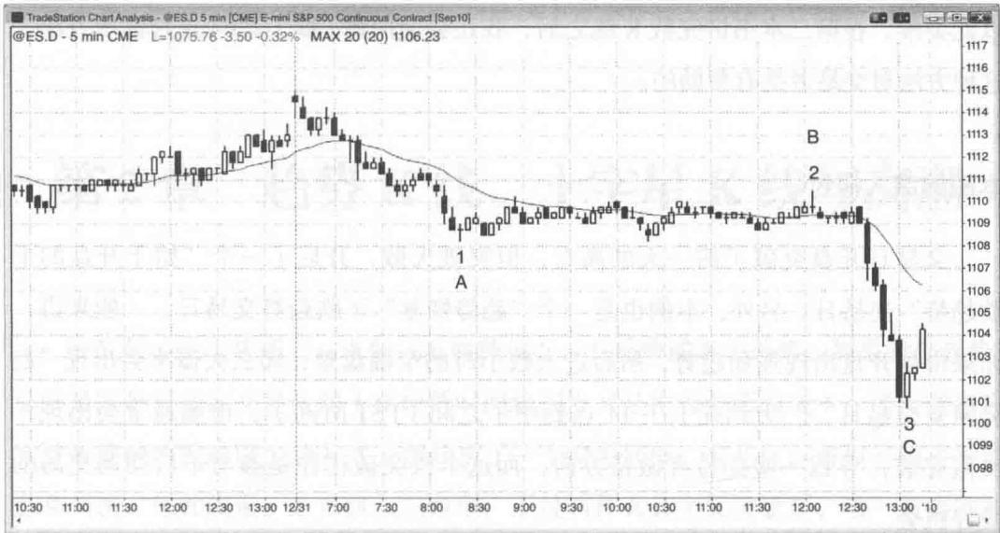

# 第1章 价格行为的谱系：从极端趋势到极端交易区间

任何一张走势图上我们都可以看到两种状态，某些区域市场以一定斜率运行，而另一些区域则是横向运行、价格变动范围较小。市场可以表现出从极端趋势到极端交易区间的价格行为谱系，前者几乎每一个最小报价单位的变动都要比前一个更高或更低，而后者每1\~2个单位变动都紧跟着1\~2个单位的反向运动。市场很少处于这两种极端状态，即便有也非常短暂，常见的情况是，市场持续处于稳定的趋势，中间只出现非常小的回撤，或是在一个窄幅区间上下震荡数小时之久。趋势会制造出一种确定性和迫切感，相反，交易区间则让交易者对市场走向感到困惑。所有趋势都包含较小的交易区间，所有交易区间都包含较小的趋势。大部分趋势都是更高时间级别上交易区间的一部分，大部分交易区间都是更高时间级别上趋势的一部分。即便美国股市1987年和2009年的崩盘，从月线级别来看也只是回调，刚好回调到月线图上的上升趋势线。后面章节的内容安排主要按照从最强趋势到最窄交易区间的谱系展开，接着讲回调（从趋势向交易区间的过渡）和突破（从交易区间向趋势的过渡）。

我们必须牢记一点，市场经常会表现出惰性，即倾向于重复当前的状态。如果处于趋势之中，大部分的反转尝试都会失败；如果处于交易区间，大部分的突破尝试都会失败。

图 1.1 有两段极端趋势和一个极端交易区间。这个交易日始于一段强劲下跌趋势，一直持续到 K 线 1，然后进入一段异常窄的交易区间，直到 K 线 2 出现 1 个最小报价单位的向上假突破，然后反转向下突破并进入一段超强跌势，一直持续到 K 线 3。

市场的两段式运动十分常见，不过传统的描述方法并不理想。当一波趋势出现两段式回调，大家一般都将其称之为 ABC 运动。然而如果这两段行情是一轮新趋势

Created with TradeStation

图 1.1 极端交易区间和极端趋势的头两波，波浪理论技术分析师会将其标示为1浪和3浪，二者之间的回撤为2浪。另外，如果第二段走势的幅度与第一段相当，那些遵循等距理论的交易者会预期行情向上反转。他们把这种形态称之为AB=CD运动。第一段下跌从A点开始，到B点结束（图1.1中也就是K线1之前的下跌，亦即ABC运动中的A），第二段下跌从C点开始，到D点结束（图1.1中也就是从K线2到K线3的下跌，亦即ABC运动中的C）。

有些调整会进一步出现第三段甚至第四段，所以我宁愿用一种新的标示体系来进行描述（将在本套书后面的内容详细讨论）。我的方法简单来说就是数回调的段数。比如说，如果在一轮升势或交易区间中出现一波下跌，接下来出现一根K线的高点高于前一根K线的高点，那么这个突破就是一个高1。如果市场接着出现第二波下跌，然后又出现一根K线高点高于前一根K线的高点，那么这根突破K线就是一个高2。第三次和第四次发生就是高3和高4。相反，在下跌趋势或交易区间中，如果市场在出现一波反弹后转跌，这个入场点就是一个低1；如果在第二波反弹后转跌，这就是一个低2卖点，其前一根K线称之为低2建仓形态或信号K线。

虽然等距理论对交易很有帮助，但 AB=CD 这种表述很容易与更常用的 ABC 表述方法搞混，所以应该放弃 AB=CD 这一术语。我更倾向于数段数的方法，所以喜欢用数字来表述，把每一波行情称为“段”，比如段 1（或第一次推动）、段 2，以此类推。在第二本书讲完数 K 线之后，我还会使用高 / 低 1/2/3/4 这种标示方法。这种方法对交易者是有帮助的。

# 本图的深入探讨

交易日开盘突破了前一天的高点，但突破失败，开启了一个“始于开盘的下跌趋势”交易日。另外，本例也是一个“趋势恢复”下跌趋势交易日。一般来讲，如果市场开盘出现强劲趋势，然后进入数小时的窄幅盘整，那么大概率会出现“趋势恢复交易日”。大约在上午11点到中午之间（PST时间），市场通常会出现一次假突破，导致一些交易者做错方向，而这个假突破往往是参与午后摆动交易的极好机会。