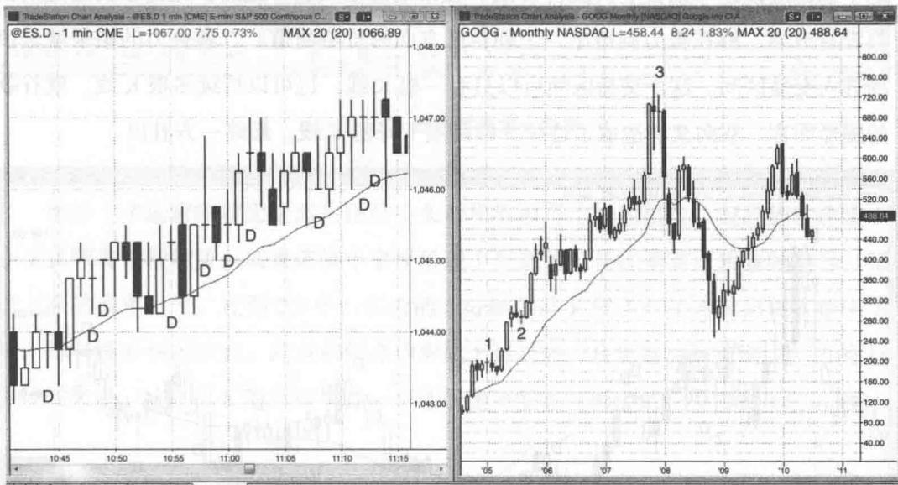
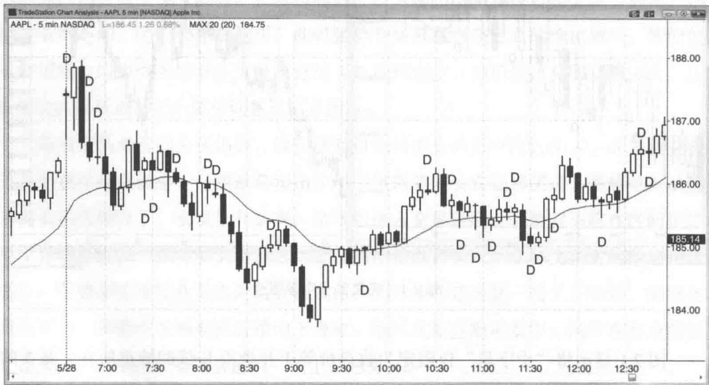
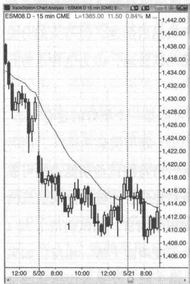
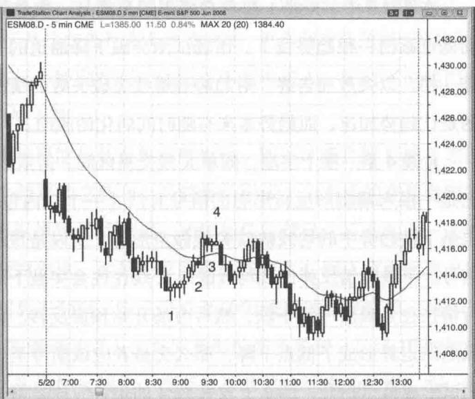
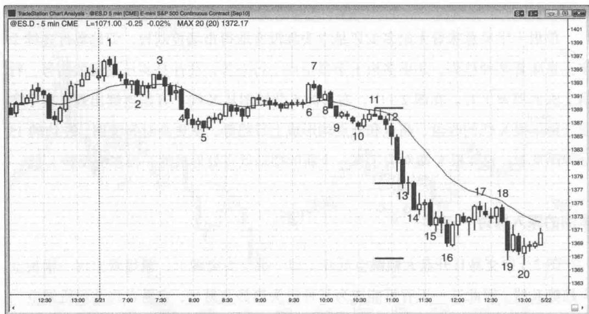
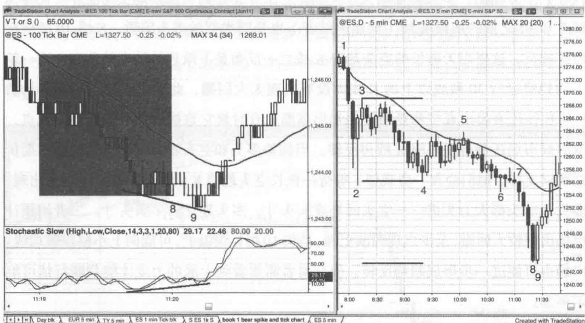
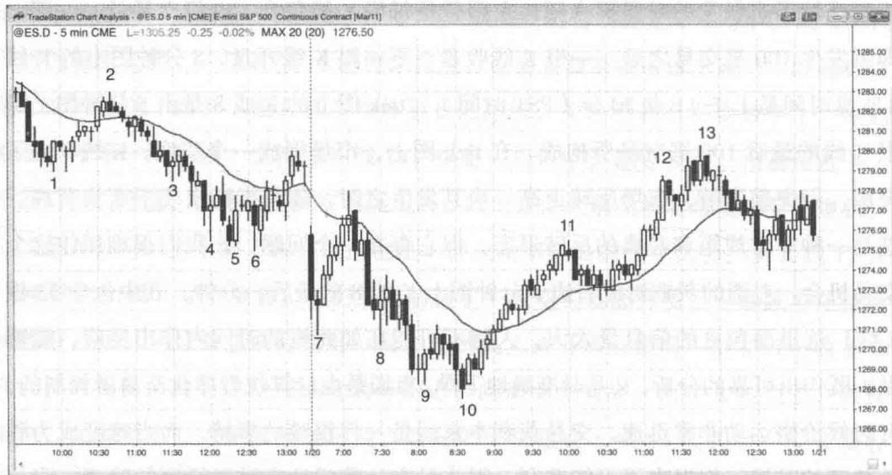

# 第2章 趋势K线、十字星K线与高潮

任何一张走势图上，市场只有两种状态，有趋势或者无趋势。如果没有趋势，那就是某种形式的交易区间（在较低时间级别上又是由趋势所组成）。当市场出现大致重叠的两根或以上的K线，就构成了一个交易区间。交易区间可以有很多种形态和叫法，比如旗形、三角旗、三角形。不过叫什么其实无关紧要，唯一重要的就是我们知道此时多空处于某种均衡状态，通常某一方略微占优。在单根K线级别上同样如此，这根K线要么是一根趋势K线，要么是一根交易区间K线。单根K线交易区间同样意味着在这根K线运行过程中多空均无控制权、大致势均力敌。

交易有两个最重要的理念，一是一切背后都有数学基础，二是任何时候当你对市场方向坚信不疑，总存在与你同样聪明的人持相反的观点。凡事都不要太确定，市场永远存在与你的观点背道而驰的可能性。市场有时候处于非均衡状态、可以强劲地上涨或下跌多根 K 线，但大部分时候是相对均衡的，只不过新手刚开始可能领会不到这一点。

市场每一个微小波动都有交易在发生，也就是说，有人认为这里是很好的买点，同时有人认为这里是很好的卖点。既然市场由机构所控制，而机构是很聪明的，所以这里的买方和卖方都是聪明而且理性的交易者，都有一套经过测试被验证为可以获利的交易策略。交易者要学会锻炼一项重要本领，那就是判断一根趋势K线到底是一波行情的开始还是结束。如果简单地把强多头趋势K线（即大阳线）视为看涨、强空头趋势K线（即大阴线）视为看跌，你就把另一半市场玩家给忽略了。在每一根多头趋势K线的最高点，有逢高买进的多头，也有等待回调后打算在低点附近买进的多头，千万不要忘记，此时还有一批多头认为行情到头，因此正在逢高卖出和锁定利润。同时，无论这根多头趋势K线多么强劲，总有空头认为它是强弩之末而选择在高点附近做空。还有一些空头在等待出现一根更强的多头趋势K线，准备等行情超涨之后再行做空。其他空头将会在这根K线低点下方做空，因为他们认为市场跌破其低点将是一个弱势信号、可能引发可交易的反转行情。同样的道理，对于每一根空头趋势 K 线，无论它看起来多么利空，总有空头在其低点附近获利回补、多头在这里买进，也存在准备在 K 线高点附近做空的空头和准备在高点上方买进的多头。

交易者应该习惯这种思维方式——所有 K 线要么是趋势 K 线要么是无趋势（交易区间）K 线。不过“无趋势 K 线”这个术语有点抽象，而且大部分无趋势 K 线都类似十字星，简单起见，我们把所有无趋势 K 线都称为十字星。如果 K 线实体很小或没有实体，就是十字星，属于单根 K 线交易区间，此时多空势均力敌。在 Emini 的 5 分钟图上，一根十字星要么没有实体，要么实体只有 1\~2 个最小报价单位（视乎 K 线的总长度）。然而在谷歌股票的日线或周线图上，即便实体长度达到或超过 100 个单位（1 美元），仍具有与完美十字星相当的内涵，仍可将其称为十字星。判断标准是相对的和主观的，不同的市场、不同的时间级别，标准也不同。在交易中，我们只追求近似，不求完美。如果市场出现与某种标准形态近似的形态，那么其后续展开可能与那个标准形态是一样的。

将实体较小的 K 线细分成上吊线、锤子线或孕育线之类意义不大。对于交易者而言，真正重要的根本性问题是某根 K 线或市场是否在试图形成趋势（大部分情况下都处于中间状态）。比起为某根 K 线想一个确切的名字，判断一段趋势的强度要重要得多。你是靠下单交易赚钱，而不是靠这些五花八门、毫无意义的名字。

如果 K 线有实体，即收盘趋势性远离开盘，那它就是一根趋势 K 线。很显然，如果某根 K 线很长而实体很小，说明趋势力量不足。另外，在这根 K 线内部（从更小时间级别来看）可能有几波大致横向的运动。不过这不重要，因为你只需要关注一张图。相反，较长的实体通常意味着较强的动能，不过，当行情持续很长时间之后，或发生突破的情况下，出现实体过长的 K 线可能是行情达到高潮、趋势动能耗尽的征兆。此时不应参与交易，应该等待价格行为的进一步展开。市场连续走出多根强趋势 K 线是趋势健康的表现，通常行情会进一步延续，即便眼下出现回撤。每一根趋势 K 线都同时是（1）急速运动（2）突破（3）缺口（我们将在第二本书中谈到，所有突破在作用上都等同于缺口，所有趋势 K 线也是如此）（4）真空或高潮的一部分或全部（一波高潮行情往往是在一根或连续多根趋势 K 线之后由一根停止 K 线或反转 K 线所结束）。对于具体某一根趋势 K 线，占主导的可能是上述一种或一种以上的特征，而任何一种特征都意味着交易机会。当趋势 K 线属于高潮走势且标志着反转的开始，这根K线的形成往往是由于真空效应。举例来说，如果市场出现一波买入高潮然后反转，那么价格急速拉升很可能是因为强势空头选择在场外观望、同时强势多头暂缓获利平仓，直到市场来到他们都等着卖出的区域。反之，如果急升后并未反转，而是迎来进一步买盘，那说明之前的上涨并非由于真空效应，而是强势多头在买入、强势空头也认为市场可能继续走高。交易者需要根据整体市况来判断哪种情况概率更高，进行评估之后再做出买入、卖出或等待的决定。很显然，所有导致反转的急速行情都是真空效应的表现，不过我主要用“真空效应”一词专指价格急速运动之后在明显的支撑位或阻力位反转的情形（将在第二本书讨论）。顺便提一下，崩盘也是真空效应的例子。美国股市1987年和2009年的崩盘都只是刚好跌破月线上升趋势线，在这里，强势多头重新现身、强势空头获利回补，导致市场急剧反转走高。在上升趋势中，股票交易者往往把短暂的急速下跌行情视为逢低买入的机会。尽管交易者买入前一般希望看到较强的价格行为，但也经常会在一波暴跌行情底部买入原本看好的股票，尤其是在上升趋势线附近的区域，即便此时价格尚未反转。他们认为可能是消息导致股票暂时被错误定价，但这种低估状态不可能持续太久。他们并不在意股价再跌一点，因为抄到回调走势的最低点是不可能的。在他们看来，既然市场很快就会纠错、股价将立即走高，在暴跌过程中入场就没什么问题。

回调走势（将在第二本书细讲）很容易出现大阴和大阳，让交易者怀疑趋势是否已经逆转。比如说，在一轮上升行情中，市场可能出现1\~2根长空头趋势K线跌破均线，可能还略微跌破一个交易区间。于是交易者开始怀疑市场趋势是否正在由升转跌。现在他们只需要看到延续性的抛盘来证明这一点，可能只需要再出现一根空头趋势K线就够了。所以大家都会紧盯着下一根K线。如果是一根长空头趋势K线，大部分交易者将会认为反转已经得到确认，开始以市价或在回撤后做空。相反，如果收出一根多头趋势K线，他们便会怀疑反转尝试已经失败，前面的急速下跌只是短暂的打压，因此反而是买入机会。新手往往只看到一根大阴线，而忽略了它背后的强劲上升趋势。新手会在这根空头趋势K线收盘之后卖空，或在这根K线低点下方，或是随后几根K线小幅反弹之后，以及任何低1和低2卖点下方。此时老练的多头正成为他们交易的对手方。市场总是在试图反转，但80%的反转尝试均以失败而告终，形成牛旗。当反转尝试发生之时，2\~3根空头趋势K线很容易让交易者误以为行情反转，但如果缺乏后续抛盘，多头将会把短暂的抛售高潮视为逢低买入的好机会。实际上，经验老到的多头和空头会等着这些强趋势K线的出现，有时候会先在场外观望，直到大阴线出现之后，他们才断定回调进入高潮性尾声，从而入市买进——空头回补空头头寸，多头建立多头头寸。有时候这种情况也发生在趋势末端，交易者都在等待一根强趋势K线出现。举例来说，当一轮强劲跌势来到支撑区域附近，可能会以一根极长的空头趋势K线向下突破。在这根K线出现之前，多头和空头都不愿买入，而现在双方都把这一波抛售高潮视为买入机会。空头认为这是锁定空头头寸利润的好价位，多头也认为这一极低价位是不可多得的好买点。

有时候这种大阴线急跌走势可以收在 K 线的最低点，然后反转走高。交易新手往往感到难以理解。一根大阴线收在最低点，然后出现一根内包小阳线，市场怎么就反转并且创出日内新高了呢？他们没有认识到一点，在较小时间级别上，这根大阴线可能具有明确的反转形态，比如“三连推”形态。然而即便他们盯着小级别图形交易也会亏钱，因为形态的形成速度太快，交易者根本没有时间做出准确的分析。记住，所有形态都是计算机算法所造成的，而电脑拥有巨大的速度优势。与一个占据巨大优势而且出错率极低的对手竞争，注定是一场错误。当速度成为关键因素，电脑就占据极大先机，交易者不应与它们对抗。因此交易者应该选择一个有足够时间仔细处理信息的时间级别来进行交易，比如 5 分钟图。

一根趋势 K 线是高潮的关键组成部分，而高潮又是反转的关键组成部分。交易者往往错误地使用“高潮”一词，将其视为反转的同义语。任何趋势 K 线都是高潮或高潮的一部分，而高潮结束于第一根停止 K 线。比如说，如果市场连续出现 3 根多头趋势 K 线，下一根 K 线是上影线很长的小阳线、内包 K 线、十字星或空头趋势 K 线，那么高潮就是在这 3 根多头趋势 K 线结束的。这个连续 3 根 K 线的买入高潮意味着市场走得过远过快，交易者的买入热情迅速下降，导致升势转为多空均衡的双向市场。此时部分多头选择锁定利润、打算等价格回调之后再买，而部分空头开始做空。如果接下来多头战胜空头，市场将恢复上涨；但如果空头胜出，市场将会以一根空头趋势 K 线反转。这根 K 线将起到空头突破的作用，这个反转形态则是一个高潮反转顶部。买入高潮是上涨，高潮反转顶部是上涨之后转跌，二者是有区别的。多头趋势 K 线的主要角色是制造高潮，空头趋势 K 线主要是作为一次突破，二者联合制造了一个高潮反转顶部或者说一次买入高潮与反转。

所有强多头趋势都包含强多头趋势 K 线或连续多根多头趋势 K 线，每一根都是一次买入高潮，但大部分不会成为高潮反转的前奏。反转的发生需要一波买入高潮和随之而来的空头突破（即一根强空头趋势 K 线）。多头和空头趋势 K 线不一定非得紧挨着，往往会被多根K线所隔开，但必须兼有二者才能称其为一次高潮反转。事实上，在一波上升行情顶部所发生的所有反转都是高潮反转，虽然有时候从图上看起来不太像。如果上升行情被5分钟图上一根强空头反转K线所逆转，它依然是一次高潮反转，只不过是发生在较小时间级别上。尽管我们没必要每次都从更小的时间级别上去找出那段完美的急涨急跌走势，但它一定是存在的。而且，无论何时，只要出现多根K线所构成的一个高潮顶部，在某个更高时间级别上它往往对应一根单独的反转K线。同样，我们也没必要去找到那个完美的时间级别和那根完美的反转K线。记住，所有交易者都在试图发掘先机，在这个电脑时代，几乎所有行情软件都可以让交易者即刻看到任何时间级别的图形，而且不同交易者所关注的图形也五花八门，只要你能想到的都有，除了根据时间编制的走势图，还有基于最小报价单位数量、成交合约数量及各种结合体的走势图。总有人看到了那根完美的反转K线，也有人看到了那波急涨随后急跌的走势，但如果你读懂了眼前走势图的K线语言，不用亲眼看到也知道是怎么回事。与前面所说的情况相反的就是高潮底部，即一波下跌高潮伴随着向上反转。我们将在本书第五章和第六章讲信号K线的时候进一步讨论高潮反转，第三本书中也将涉及。

理想的趋势 K 线是一根具有中等长度实体的 K 线，意味着从 K 线开盘到收盘市场出现了一段趋势性运动。就多头趋势 K 线而言，最低要求是收盘高于开盘，亦即 K 线为阳线（本书中以白色蜡烛表示）。多头为了展现对市场更强的控制力，可以让实体长度达到或超过此前 5\~10 根 K 线实体的平均长度。其他关于 K 线强度的信号我们将在另一章讨论，这些信号包括开盘处于或接近最低点、收盘处于或接近最高点、收盘处于或高于此前数根 K 线的收盘和高点、高点高于此前一根或多根 K 线的高点，以及影线很短，等等。如果 K 线过长，尤其是当其处于趋势之中时，可能代表动能枯竭或是单 K 线假突破，将追高的多头套住并往往在随后的 2\~3 根 K 线中反转向下。空头趋势 K 线的情形则与前面相反。

所有趋势 K 线都是市场想要突破以开启一段趋势的尝试，而这种尝试大部分都会失败（下一章我们将会讨论这个话题）。另外，所有趋势都是从一根趋势 K 线开始的，这根 K 线的实体可能只是比最近几根 K 线的实体略长；有时候这根 K 线很长而且紧接着出现数根同方向的趋势 K 线，说明趋势较为强劲，更有可能出现延续性行情。

当市场处于交易区间或下跌趋势,开始出现多根多头趋势K线,这是买压的信号,说明多头试图夺回市场控制权、将趋势逆转。交易者在多头趋势K线后的小幅回调中买进，因为他们认为市场将会立即走高、可能不会出现较大的回撤让他们进场。他们甚至会在 K 线收盘前最后几秒买进，唯恐下一根 K 线开在最低点，然后一路走高。他们有一种非买不可的迫切感，不愿等待回调，因为回调也许要等市场大幅上涨之后才会来临。他们会在前一根 K 线低点下方和摆动低点下方买进，导致市场逐渐转入上升波段或趋势。此时空头也不再大规模地在新低做空，而是开始获利回补，同时越来越多的多头将新低视为极佳的买入机会。

相反，在交易区间或上升趋势中，当空头趋势K线开始聚集，这是卖压信号，说明空头有可能很快制造一轮下跌趋势。比如说，市场处于上升趋势，发生几次包含长空头趋势K线的回调，现在进入一个交易区间，几次摆动均出现较长的空头趋势K线，说明卖压在集聚，空头可能很快就会将市场扭转成一波下跌行情或下跌趋势。卖压是累积性的，空头K线数量越多、实体越长，那么卖压达到临界点、战胜多头和扭转市场方向的可能性就越高。买压也是如此。在一个交易区间或一段空头趋势中，如果多头趋势K线数量越来越多、实体越来越长，说明买压在聚集，市场上涨的概率上升。

强势多头制造买压，强势空头制造卖压。强多与强空都是机构交易者，这些强势交易者行为的累积效应决定着市场的方向。比如说，在下跌趋势中的买压信号包括K线的下影线、在向下摆动走势的底部出现双K线反转或多头反转K线，以及大阳线的数量越来越多等。这是强势多头在每一个新低买入，在每一根K线底部买入并使其收盘远离低点。这种情况之所以能够发生，必然是因为强势空头也觉得在如此低的位置做空不太划算。如果市场进一步下挫，弱势多头可能会认亏割肉，强势多头则不同，他们会越跌越买。此时强势空头只愿意在更高的价位做空。我们怎么知道呢？因为如果足够多空头愿意在K线底部做空，他们应该能够击败多头，让K线收在最低点，而不是中间甚至高点附近。

每当交易者看到买压出现，他们就知道强势多头在低点附近买入，而强势空头不再愿意在低点做空、只想逢高卖出。那么当强势多头在底部买进、强势空头只想逢高卖出的情况下，会发生什么呢？市场将进入交易区间。强势空头将在区间顶部而不是底部卖出，强势多头将在区间底部而不是顶部买入。弱势交易者的做法往往相反。弱势多头继续在低点附近止损卖出；同时担心错过新一轮上升趋势，继续在高点买入。弱势空头则期待行情向下突破，继续在低点附近卖空；同时在高点附近止损买入，也是担心市场会进入一轮上升趋势。

一切都是相对的，需要我们持续进行重估，甚至有时候需要彻底转变对市场运行方向的看法。记住，对市场方向有 60% 确定性的情况是很少见的，可能会迅速降为 50% 甚至是朝另一个方向的 60%。

没错，所有K线要么是趋势K线要么是十字星K线。十字星意味着多空势均力敌。在十字星形成过程中，如果你去看足够小时间级别的走势图，会看到两种情况，要么市场先下跌然后上涨、形成一个卖出高潮，或者先上涨然后下跌、形成一个买入高潮。我们在第三本书讲高潮反转的时候将会谈到，高潮并不意味着市场即将反转，只是说明市场朝一个方向运行过快过远，现在正尝试另一种运行方式。此时多头继续买进、试图让升势延续，而空头继续做空、试图让行情转跌，二者合力的结果往往是市场横向震荡。这种横向走势短则可能只有一根K线，长则可持续数根K线，但它代表一种双向交易，因此属于交易区间。既然所有十字星都包含双向交易，而且往往至少短暂地伴随进一步的双向交易，那么十字星就应该被视为单K线交易区间。

不过有时候一系列十字星也可以表示趋势依然成立。比如说，如果连续出现多根十字星，每根K线的收盘都高于前一根K线的收盘，大部分K线的高点和低点都高于前一根K线的高点和低点，即市场出现趋势性收盘、高点和低点，因此趋势依然有效。

Day Options ES 2 min bar ES 5 min
Created with TradeStation

图2.1 完美的十字星很少图 2.1 显示将 “十字星” 仅限定为收盘价等于开盘价 K 线的缺点所在。基本的价格行为分析适用于所有时间级别，将某一术语限定为一种完美形态是不合理的。

左图为Emini的1分钟图，虽然价格处于上升趋势，图上有10个完美的十字星，右图为谷歌（股票代码GOOG）的月线图，图上没有一个严格意义上的十字星。尽管右图有几根K线看起来像十字星，但即便实体最短的K线3，其收盘价也高于开盘47美分。无论左图还是右图，使用经典定义对交易都没什么帮助。在谷歌的图上，K线3完全符合十字星的特征，交易时应该把它当成十字星来对待。还是那句话，在交易中近似足矣，过分追求完美只会造成亏损。

# 本图的深入探讨

当一轮上升趋势出现一根极长的多头趋势 K 线，比如图 2.1 中谷歌的走势图，它可能意味着最后的恐慌性买盘，要么是空头在回补亏损的空头头寸，要么是最后一波多头入场造成上升动能井喷。它是一个买入高潮，当其形成之后，往往市场上已经没有等待买入的多头，空头夺回市场控制权。随后出现的长空头趋势 K 线构成反转走势的第二根 K 线。

在某个更高时间级别，这可能是一次完美的双 K 线反转。如果时间级别再往上，这个顶部应该是一根长空头反转 K 线。在市场急上又急下之后，无论多头还是空头都没有放弃，都在努力制造出一个朝自己方向的价格通道。二者合力的结果就是市场进入交易区间。这个交易区间可以只有一根 K 线，也可以持续多根 K 线。就谷歌的图形而言，双向交易造成了连续 3 根高点下降的 K 线。最终一方胜出。

图2.2 日内十字星
Created with TradeStation

从交易角度来讲，我们可以把所有 K 线分成两类，要么是趋势 K 线，要么是十字星（无趋势 K 线）。图 2.1 和 2.2 中用 “D” 来表示十字星，使用的是非常宽松的定义。实体很短的 K 线在某些价格行为区域可以看成十字星，在另一些区域则可视为一根小的趋势 K 线。我们作此区分的唯一目的是帮助你快速判断是某一方控制着这根 K 线还是多空处于僵持状态。图 2.2 中有几根 K 线比较模糊，说它是趋势 K 线还是十字星似乎都可以。

Created with TradeStation

图 2.3 趋势性连续十字星单根十字星意味着无论多头还是空头都没有取得市场控制权，但趋势性连续十字星意味着某种趋势。如果多根十字星呈现上行态势，往往是买压集聚的信号，行情上涨的概率上升。在图2.3中，右边的5分钟图从K线1开始连续出现4根十字星，每一根K线的收盘、高点和低点均形成上行趋势。从更高时间级别、左边的15分钟图来看，这4根K线对应于在一个新的摆动低点处形成的一根多头反转K线。

# 本图的深入探讨

图 2.3 中交易日开盘大幅跳空低开（即一次空头突破），紧接着出现一根长空头趋势 K 线。因此这一天有可能成为某种空头趋势交易日，交易者将会伺机做空。右边 5 分钟图上当天开盘后第 4 根 K 线是一根多头趋势 K 线，说明多头试图扭转跌势，但最后还是无功而返，造成多头被套、空头踏空下跌行情。从开盘跳空造成的空头突破角度而言，这是一次“失败的突破”，从而带来在多头趋势K线低点下方进行一次突破回调做空交易的机会。K线4是强劲下跌趋势中的均线（20EMA）跳空K线，是一个很好的做空机会，可以预期行情将测试当日低点。但由于测试通常导致强劲回撤甚至反转，交易者将会寻求在行情创出新低和随后测试当日低点时买进。

在图 2.3 中，K 线 1 在左右两张图上都是一次趋势通道线过靶（连接前两个摆动低点画出一根趋势线）。市场试图突破下降通道的下轨然后加速，但与大部分突破一样，以失败而告终。对趋势通道线突破失败的情况尤其普遍，因为这种走势目的是让趋势加速，而趋势本来有随时间弱化的倾向。

K线4是一根十字星，即单K线交易区间，但依然可以是一个很好的建仓形态。它是一根末端旗形反转形态的信号K线（一个双内包（ii）旗形突破失败），同时也是下跌趋势中的均线缺口K线做空形态，所以是预示行情将测试前期低点的可靠信号。下跌行情反弹出现均线缺口K线往往会突破下降趋势线，而随后测试前低的行情往往是最后一波下跌，然后市场开始预谋反转。就图中而言，测试前低K线1低点的走势形成了低点下降，那么交易者应该期待至少出现两波上涨。相反，如果测试形成低点抬升，那么上攻K线4的走势应该是第一波上涨，交易者应该预期至少还有一波升势。

图2.4 无趋势的趋势K线
Created with TradeStation

就像十字星并不总是意味着市场没有趋势，趋势K线也并不总是意味着市场处于趋势之中。在图2.4中，K线6是一根强多头趋势K线，突破了一长排十字星。然而没有买盘跟进，下一根K线的高点高出这根趋势K线一个最小报价单位，然后收在低点附近。这一看就是一次失败的多头突破，多头会在这根空头停止K线下方1单位处出场，空头也在这里做空。除非有进一步的看涨价格行为，没有人有兴趣买入，从而造成市场进一步下跌。多头试图捍卫多头突破K线的低点，在这里形成了一根小多头趋势K线（K线8是一个突破回调做多形态，但始终没有被触发），但市场还是跌破了这个低点，于是这些先行多头再次离场、更多新空头进场。到这时，多头两次进攻失败，除非价格行为特别有利，他们将不愿再买入，此时不论他们还是空头，都预计市场至少有两波下跌。

趋势 K 线所发出的真实信号可能与其表象截然相反。新手可能会把 K 线 3 之前的那根强趋势 K 线看成对下跌趋势的突破和上升趋势的形成，而老练的交易者则需要看到后续第二根或第三根多头趋势 K 线出现，才能相信行情已经反转向上。老练的交易者可能在这根 K 线收盘时卖出、在其上方卖出，或者在 K 线 3 收盘时卖出以及在其下方卖出。多头锁定刮头皮利润，空头开立新的短线摆动交易空单。图中 K 线 7 和 17 之前的那根 K 线（熊旗终结者）也是同类型的多头陷阱。K 线 19 的情况刚好相反，这根当天最长的空头趋势 K 线之一反而是下跌趋势结束的前奏。当一轮下跌趋势运行 30 根或以上的 K 线而没有出现太大回撤，此时出现一根长空头趋势 K 线往往代表卖出真空和耗竭性的卖出高潮。有时候它直接就是一轮跌势的低点，有时候市场还会再跌几根 K 线再反转。当强势多头和空头看到一个支撑位并预期价格测试支撑，他们会在一旁观望、等待一根长空头趋势 K 线形成。一旦大阴线出现，多头和空头都大力买进——空头回补空头头寸、多头建立新多头头寸。二者均预计市场出现较大回撤，至少出现两波上涨，持续 10 根 K 线以上，可能向上小幅探破均线。市场也可能进一步形成趋势反转，但交易者需要看到上涨的力度才能判断行情可能走多远。

# 本图的深入探讨

图 2.4 显示当天开盘后突破了前一天的高点，但突破失败，行情反转走跌，形成“始于开盘的下跌趋势”。全天基本上是一个“下跌趋势恢复交易日”，虽然前几个小时的行情属于“交易区间”。当天最重要的行情是上午11点（PST时间）开始的崩溃走势。一旦K线12的突破发生，交易者就需要考虑出现“下跌趋势恢复”的可能性。当下一根K线为实体更长的阴线，交易者就有必要做空了。他们甚至会再等一根K线，也就是K线13，也是一根强空头趋势K线。市场经过一个平静阶段后崩溃，这种行情做空难度很高，因为在此之前交易者都变得安于现状，以为全天都会一直平静下去。但这也是一种成功率极高的做空机会。从K线12到13都是大阴线，互不重叠。它们共同制造了一波空头动能井喷，后续跌势还持续了数根K线。从这波急跌行情第一根K线的高点或开盘到最后一根K线的收盘或低点，市场再出现与之相当幅度的等距走势的概率非常高。由于K线很长、跌速很快，交易者担心大幅反转的风险。最好的办法是在K线13或其前一根K线收盘时做空，保护性止损设在那根信号K线高点上方。如果你心里没底，可以用很小的仓位，只是确保自己参与到行情当中。一旦市场再出现一根强空头趋势K线，比如K线14，你可以将止损收紧到盈亏平衡或这根K线高点上方，一直保持到这根K线收盘。

Created with TradeStation

图 2.5 一根长空头趋势 K 线可以终结一段空头趋势图 2.5 右图为 Emini 的 5 分钟图，市场处于强劲下跌趋势，但在大阴线 K 线 8 之后 V 型反转。K 线 9 在从 K 线 3 到 K 线 4 跌幅的等距位置出现双 K 线反转（等距运动将在第二本书讨论）。交易者能否通过关注更小时间级别的图形，在一个小型反转形态触发的时候买入呢？左图就是每根K线包含100笔交易的tick图，即每发生100笔交易之后，一根K线收盘、下一根K线开盘。5分钟图上的K线8收盘时间是上午11点20分（PST时间），tick图上的K线8是由5分钟图上那根K线的最后100笔交易所构成。在tick图上，市场形成一个双底，K线9向下突破，但突破失败，市场反转走高。当其发生之时，随机指标出现了多头背离。这是一种非常规矩和经典的反转形态，但它存在一个问题，让我们很难抓住这个交易机会。左图的灰框对应右边5分钟图上K线8的最后一分钟，其中包含33根K线！这里面包含的信息量太大，人脑不可能在如此短的时间内作出反应，能够做到既作出可靠的分析，又及时准确地下单。市场是由计算机程序化交易所控制的，有时候价格运动非常迅速。交易获利本来就是一件很难的事情，而当速度成为胜负关键的时候，你根本不可能获利，因为只有计算机才有微秒级别的速度。当你的竞争对手占据明显的优势，你就不要指望能够赚钱。老练的交易者有多种方法根据5分钟图来买入，包括在K线8收盘之后以市价买入，或者在K线9上方买入（这些内容我们将在第三本书讨论）。

那么从K线7到K线9的跳水行情发生了什么？每根阴线实体都在逐步变长，这是空头力量增长的信号，另一方面也是潜在的卖出高潮信号，事实证明的确如此。正如前面所言，当一轮跌势持续时间达到或超过30根K线，而且处于支撑位，多头和空头都会采取观望态度、等待一根大阴线出现，然后强力买入。市场到K线9的低点为止出现了一段等距运动，事实上，当趋势反转的时候市场往往处于多个支撑位，只不过其中大部分对于初学交易者而言并不是那么一目了然。由于强势多头和空头都在等待出现一根超级强势的空头趋势K线之后才准备买入，市场在接近支撑之际缺乏买盘，于是产生一个卖出真空并形成一根长空头趋势K线。这根K线形成之后，空头立即买入回补、锁定利润，多头开仓买入。双方对市场此时发生的情况都了然于胸，都预计出现大幅反弹甚至反转，所以在市场至少出现数波拉升、运行10根K线以上或至少站上均线之前空头不会寻求做空、多头不会获利了结。最终的结果往往是市场急剧拉升，而那根超强空头趋势K线就是其前奏。

——价格行为交易系统之趋势分析

Created with TradeStation

图 2.6 趋势转化为交易区间在下跌趋势中，当空头开始把新低视为锁定利润的好价位，而非加空捕捉新一轮下跌的机会，多头将其视为开始做多的好时机，那么市场将从一轮强劲趋势演变成某种双向交易市场。如图2.6所示，在从K线2开始的下跌趋势中，每次市场跌至最新的摆动低点，就会在1\~2根K线的时间内出现一根阳线或带长下影线的K线。这是买压的信号。买压是累积性的，当它集聚到一定程度，多头就能接管市场，发动一波强劲的反弹甚至是反转。

在 K 线 13 所处的顶部，阴线开始累积。这是卖压信号，说明市场可能很快进入回调。