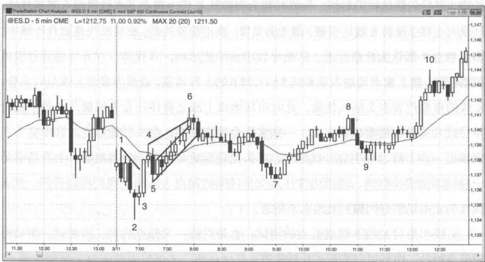

# 第 3 章 突破、交易区间、测试与反转

像 K 线可以分成趋势 K 线和交易区间 K 线，图形上任何一部分价格走势都可以分成趋势性行情（多头或空头一方占据主导）和双向行情（多头和空头轮流取得相对控制权）。当市场突破进入趋势，通常会出现一根趋势 K 线，这根 K 线可长可短，继之以多根作趋势性运动的 K 线，带领价格急速远离交易区间。交易者需要锻炼的最重要本领之一就是能够有效区分一次成功的突破与一次失败的突破（即反转）。突破将会让市场朝突破的方向运行还是相反的方向运行？这个问题我们将在第二本书详细讨论。在交易不够活跃的市场，突破可以是以缺口形式而非趋势 K 线发生的。这也是为什么趋势 K 线应该被视为某种缺口（将在第二本书细讲）。到某个时点，市场开始有回调，趋势斜率降低，越来越接近于价格通道，可以画出趋势线和趋势通道线。随着趋势延续，我们需要调整趋势线和趋势通道线的位置，将价格行为的变化包含在内。通常情况下斜率会越来越低，通道越来越宽。

在所有市场中，这种“急速与通道”的价格行为每天都在以某种形式发生。通道的起点往往成为一个初始交易区间的开始。举例来说，如果市场急速向上突破，持续数根K线，然后进入回调。回调结束之后，行情恢复上涨，但这次上涨斜率不再是近乎垂直，而是以上升通道的形式，通常会出现较多重叠的K线、更多小幅回撤、更多带影线的K线，以及一些空头趋势K线。趋势进入通道阶段之后，下轨往往会在一两天内遭到测试。一旦回测走势开始、市场朝通道起点的方向运动，交易者将会怀疑一个交易区间正在形成，而他们是对的。价格行为交易者在急速拉升行情结束、通道开始之后就预期市场可能进入交易区间，少部分空头在急速拉升结束后第一波回调走势就开始分批布空。由于确信市场将很快测试通道低点，随着市场继续上涨，他们将会在其他回调走势中以及此前数根K线的高点上方继续加空。到通道的末端，更多空头将会在阳线上方加空。一旦市场转跌，进入更深的回调并测试通道底部，他们将会退出所有空头头寸，后入场的一批头寸实现获利，最初入场的头寸不赔不赚。由于许多交易者将会在通道底部回补空头，加上那些早期买入（在突破后第一次回调的低点买入）的多头继续加仓，市场将会再次走高，交易区间将会扩大。这次反弹之后，“急速与通道”的形态已经走完，交易者将会寻求其他形态。

由于通道往往最终都会被回撤，我们不妨将所有上升通道都看成熊旗、所有下降通道都看成牛旗。不过，如果趋势非常强劲，突破之后市场可能横向运行，然后出现进一步的趋势性运动。在极少数情况下，突破会发生在趋势的方向，然后趋势急剧加速。比如说，如果市场大幅飙升之后形成一个上升通道，接下来市场向上突破趋势通道线、趋势加速的情况是很罕见的。就算有，往往也会在大约5根K线以内失败，然后市场反转向下。

尽管大部分交易区间在更高时间级别上都是旗形，而且大部分都会朝趋势方向突破，但几乎所有反转也是从交易区间开始的（这一内容将在第三本书关于反转的章节详细讨论）。

所谓 “测试” 是指市场回到一个支撑或阻力区域，比如趋势线、趋势通道线、等距运动目标位、前期摆动高点或低点、一根多头入场 K 线的低点或一根空头入场 K 线的高点、一根多头信号 K 线的高点或一根空头信号 K 线的低点，或前一天的高点、低点、收盘或开盘。交易者通常会根据测试时的市场价格表现来下单交易。比如说，如果市场出现一个高点和一波回调，然后恢复上涨测试那个高点，多头希望看到市场强势突破。如果真的有突破迹象，他们可能会在前期高点上方 1 个最小报价单位处买入，也可能等待突破后的回踩，然后在前一根 K 线高点上方 1 单位处买入，希望市场恢复突破走势。相反，空头则期待行情反转。如果对前期高点的测试缺乏动能、市场在前高区域形成一根反转 K 线，他们将会在这根反转 K 线下方做空。他们并不在乎测试是形成高点抬升、双顶还是高点下降，只是希望看到市场在这个价格区域表现出强阻力，验证他们关于市场已经过度上涨的观点。

“反转”是指市场从一种类型的行为模式转向相反类型的行为模式，不过大家通常用这个术语来描述市场从上升趋势转为下跌趋势，或者从下跌趋势转为上升趋势。然而，交易区间也可以说是与趋势性行情相反的一种行为模式，因此当市场从趋势转入交易区间，其行为模式同样发生了反转。当交易区间转换为趋势，也是反转，只不过这种变化一般被称之为突破。虽然没有人会把突破称为反转，但从本质上来讲，市场的确是从双向交易模式反转为单向交易模式。

尽管大部分交易者都把反转理解成上升趋势转为下跌趋势或下跌趋势转为上升趋势，事实上大部分反转都未能导致相反的趋势，而只是从上升或下跌趋势转入交易区间的一个暂时性过渡。市场是有惰性的，非常抗拒改变。当市场处于强劲上升趋势，它会抗拒改变，几乎所有反转尝试最终都会沦为牛旗，然后行情恢复走高。后一个牛旗往往会比前一个更宽，因为随着行情不断创出新高，多头更倾向于锁定利润而非继续强力买入，而空头也开始变得越来越激进。到某个时点，空头将会战胜多头，交易区间向下突破，然后一轮下跌趋势开始。然而在此之前往往有多次失败的反转尝试，形成不断扩大的牛旗，多头最终战胜空头，下跌趋势迟迟未能兑现。话又说回来，虽然大部分反转最终只是进入交易区间，其幅度往往足以带来波段交易机会，即行情足够产生可观的利润。即便相反趋势最终确立，交易者也会在第一个合理的目标位至少锁定部分利润，以防万一反转只是进入交易区间（这是高概率事件）。

反转有多种形态，不同周期的图形所看到的也不一样。比如说，如果你在月线图上看到一根长空头反转K线，它在周线图上可能是一个双K线反转，在日线图上可能是先出现3根K线快速拉升（即买入高潮），然后进入一个10天的交易区间，最终以2根空头K线向下突破。它们都是反转形态，只要你能够识别它们，看什么周期的图形并不重要。

图 3.1 突破、交易区间与测试
Created with TradeStation

图 3.1 是 Emini 的 5 分钟图，展示了突破、交易区间和测试的例子。每一次摆动行情都是某种测试，只不过大部分交易者看不出在测试什么位置。许多测试都与其他时间级别上的价格行为或其他类型的走势图有关，还包括测试各种均线、斐波那契回撤位、关键转折点位，诸如此类。

图 3.1 中市场开盘后测试了前一天的低点，但突破失败，形成低点下降之后迅速反转，连续拉升至 K 线 4。每一次突破，无论成功与失败，最终都会进入交易区间，图中也是如此。突破至新低的走势出现失败，意味着多头和空头都认为价格已经过低，空头将会锁定利润，而不是在如此低的位置继续大举做空，多头将会继续大力买入，直到双方都认为市场已经来到一个新的均衡区域（即交易区间）。

K 线 1 是开盘下跌行情的信号 K 线，如果空头依然掌握控制权，市场不应该有能力超越其高点。

K 线 4 是对 K 线 1 高点的测试，并形成高点抬升。由于上升动能如此之强，市场可能要至少再测试一次这个高点，多头才会罢休。第一次测试所形成的双顶（K 线 1 和 4 的高点）只造成了 1 根 K 线的回调，然后价格就成功突破了 K 线 1 的高点。注意，双顶和双底很少刚好在同一价位。

K 线 5 测试了 K 线 2 信号 K 线的高点，并形成低点抬升。

我们应该把每一波快速行情和每一次强力反转都视为类似突破的走势。对于从K线2开始的快速拉升行情，你将其视为突破从K线1高点下来的微型下降趋势线，还是对K线2反转K线的突破，都无关紧要。真正重要的是，在这波快速拉升行情中，多头和空头都认为价格过低，从而导致市场快速运动，寻找多空双方均感到舒服的价格区域。接下来市场进入从K线5到K线6的上升通道，通道内多根K线前后重叠。K线的重叠代表多头陷入犹豫，此时市场继续上涨之前往往会先回撤几个最小报价单位或几分钟。随着市场上攻，一些多头会锁定利润，空头开始做空。许多空头在市场进一步上涨过程中会分批加空，多头也锁定更多利润、分批出场。上升通道是一种转弱的多头行情，通道也往往是交易区间的起点。从图上我们可以看到，到K线7为止市场刚好回撤到通道起点附近。

K 线 7 是对 K 线 5 摆动低点的测试，也是对前一天低点的第二次测试。测试形成低点抬升，市场以双底形式反转走高。

K 线 8 是对 K 线 6 高点和前一天收盘的测试，测试形成高点下降并以双顶形式回落而未能突破。它同时还测试了 K 线 6 之后那根内包阴线的高点。这根阴线是随后那波回调走势的信号 K 线。

持续到 K 线 9 的跌势测试了均线，同时也是尝试突破之后一次简单的回撤。这次回撤之后市场终于成功向上突破，创出日内新高。K线9还测试了K线7之后那根阳线高点上方的多头入场点，差1个最小报价单位就打到多头的盈亏平衡止损。多头有能力保护盈亏平衡止损，使其不被扫掉，说明多方很强，后面通常会出现新高。

# 本图的深入探讨

如果对一张走势图的讨论持续好几页，读者可以从出版社 John Wiley & Sons 的网站 www.wiley.com/go/tradingtrends 找到对应的图，对照书上的内容看或者把它打印出来看，这样阅读的时候就不用不停地翻到前面去看图。

在图 3.1 中，K 线 3 是一根长多头趋势 K 线，也是一轮多头行情的起点，我们可以将其理解成突破或突破缺口。

当天开盘市场向下突破了前一天收盘前的一个上升通道。正如我们前面所说，上升通道可以看成熊旗。市场突破之后出现延续性下探，不过其中包含阳线和重叠K线，说明多头依然很活跃。然后市场突破了前一天的摆动低点，但突破失败并成为当天最低点。如果你没有在K线2对前一天低点的反转过程中买进，那么当K线3强多头趋势K线出来的时候，你就知道市场“始终入场”的方向已经转多，应该以市价或者在K线5高点上方买入。我们将在第三本书详细讨论“始终入场”的概念，简单来讲就是，如果你必须一直都有仓位，无论多还是空，那么你现在的头寸就是“始终入场头寸”。这是一个非常重要的概念，大部分交易者应该只交易“始终入场”方向。K线7的双底回撤是另一个做多机会，可以期待行情展开第二波上涨并持续到收盘。

图 3.1 的形态属于 “急速与通道” 上升趋势。这一术语在这里的用处在于，它向我们描述了市场从单向交易（强趋势）向双向交易（交易区间）的转换。单独把 K 线 3 还是从 K 线 2 到 K 线 4 的过程看成突破，都无关紧要。市场回撤到 K 线 5，然后以不那么急切的方式继续走高。由于大部分 K 线都互相重叠，我们可以用两根平行通道线将价格完美涵括。你也可以连接高点画一根趋势通道线，以突出这是一个楔形通道（后面将会讨论）。部分交易者可能已经在 K 线 4 低点下方做空，然后随着市场走高在其他回调走势中加空。其他交易者可能在等待一个楔形顶部，准备在这里锁定多头利润或开空。一旦市场突破之后回调到 K 线 5，继而开始进入通道类型的价格模式，交易者将会把这个上升通道视为潜在的熊旗，并预期通道低点将会遭到测试。像图中这种小形态，测试往往会在当天出现，但在较大的形态中，测试可能要一两天之后。

市场的确像交易者预期的那样，出现两段式回调，从楔形顶部跌到通道底部。空头会在通道底部全部平仓，先入场的头寸可能只是大致盈亏平衡，但后来加空的头寸将是盈利的。同时，多头将会再次在K线5低点附近买入。早先他们已经在这里部分建仓，且正是他们的买入造成第一波回调在这里结束并成为通道的起点。多头买入和空头回补通常会引发市场反弹。反弹可以是从一个双底牛旗（K线5和7）展开的上涨，也可以是小幅上涨之后进入漫长的交易区间甚至下跌趋势。

另外值得注意的是，K线2的低点是第三波向下推动，因此也属于楔形反转。

K 线 6 是一个双顶熊旗（第一个顶是前一天的最后一根 K 线），K 线 5 和 7 制造了一个双底牛旗。后面的 K 线 9 是一次双底回撤。你也可以将 K 线 5 到 9 之间的价格行为看成可以朝任何一个方向突破的三角形，但这样一来你就忽略了市场明确显示出的看涨动能。

K 线 7 是一个楔形牛旗，因为它是 K 线 6 高点以来的第三波向下推动。

K 线 8 是在前面出现一个 6 根 K 线牛旗之后的末端旗形反转。