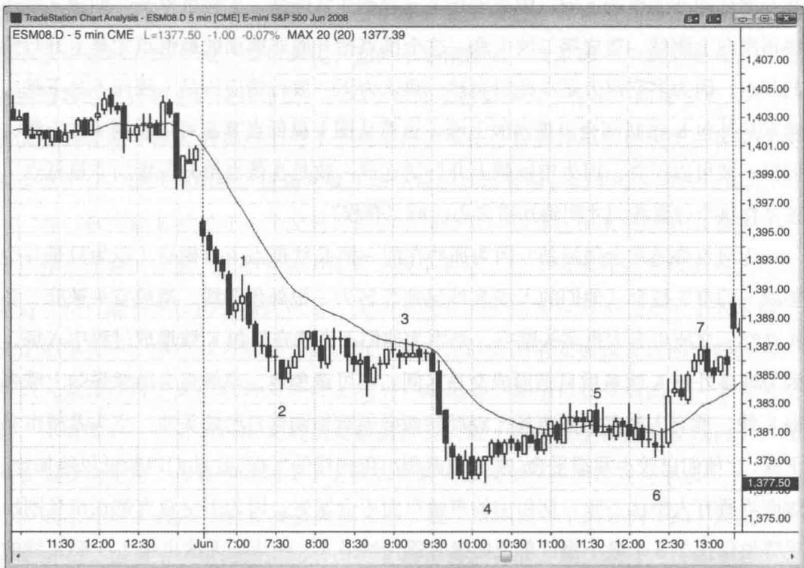
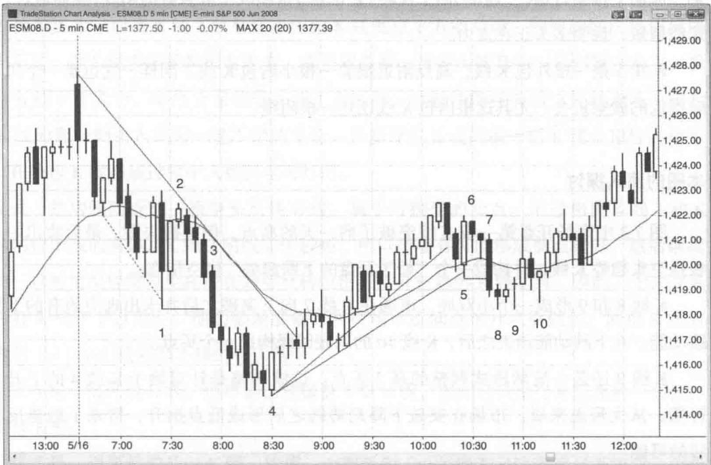
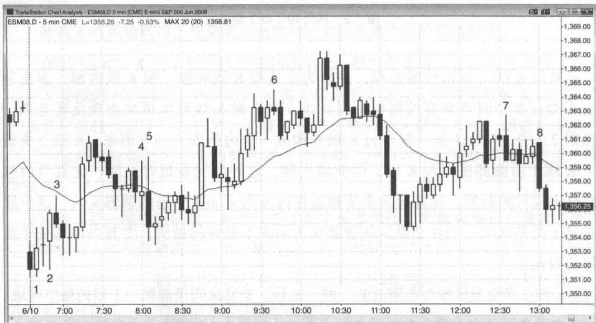
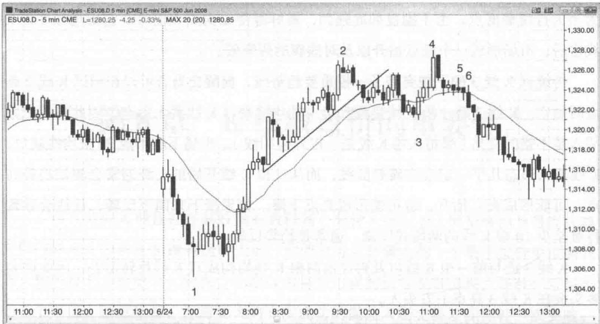

# 第7章 外包K线

包 K 线是指当前 K 线的高点高于前一根 K 线的高点，且低点低于前一根 K 线的低点。外包 K 线解读起来非常复杂，因为在这根 K 线或前一根 K 线内部，多头和空头均在某个时点掌握控制权，要分析清楚须剖析其诸多微妙之处。K 线长度增加意味着多头和空头都有发力迹象，但如果收盘接近振幅中位，那就基本属于单 K 线交易区间。事实上，从定义来讲，既然外包 K 线完全包含前一根 K 线，所有外包 K 线都是一个交易区间（两根或以上 K 线大致重叠）的一部分。在其他时候，它们可以表现出反转 K 线或趋势 K 线的特征。所以交易者必须注意它们所发生的背景。

传统的技术分析告诉我们，外包K线意味着接下来市场可以朝任何一个方向突破，你应该在在其上方和下方同时挂单。一旦某个方向的挂单成交，未成交的挂单则变成止损单。此时可将止损单的手数加倍，让它成为一个反手挂单。但实际上，在突破一根5分钟外包K线时入场一定是不明智的做法，尤其在外包K线很长的情况下，因为止损距离太远意味着风险很大。有时候它们发生在你正在寻找重大反转机会之时，而且你确信市场将出现重大强势反转。在这种情况下，合理的做法是在这根外包K线超越前一根K线某一端时立即入场。如果你不太确定，可以等到这根外包K线收盘之后，在突破这根K线时入场。如果你选择在市场突破外包K线时入场，而且保护性止损比较大，可以考虑采用金额止损法（比如Emini的2个点），或者降低交易手数。由于外包K线是单K线交易区间，而在交易区间中我们最好不要在其顶部买入或在其底部卖出，所以通常情况下都不建议在突破外包K线时入场。

如果前一根 K 线是不错的信号 K 线，外包 K 线也可以成为可靠的入场 K 线。比如说，如果你打算在一波下跌行情之后抄底，此时市场形成了一根强多头反转 K 线，但下一根 K 线跌破了这根反转 K 线。那么你应该将买入挂单维持在反转 K 线上方，能不能成交就交给市场了。如果这根 K 线突然向上反转，并站上做多信号 K 线，那么挂单将会被触发，当前 K 线将成为一根外包 K 线和入场 K 线。一般来讲，除非前一根 K 线是非常不错的信号 K 线，交易者不应该在一根外包 K 线入场时做反转交易。

有时候你不得不在一根外包 K 线形成过程中入场（不是突破它之后），因为你知道有交易者被套住。尤其在一轮强劲行情之后更是如此。如果市场突破趋势线或者对趋势通道线过靶之后强势反转，而外包 K 线属于二次入场点，那么它可以是一根非常不错的入场 K 线。举例来说，如果市场刚刚第二次跌破一个摆动低点，对趋势通道线造成过靶之后反转走高，此时你可能会打算买入，你将不断移动买入挂单，将其保持在前一根 K 线高点上方 1 个最小报价单位，直到挂单获得成交。有时候成交会发生在一根外包阳线。这通常属于很不错的反转交易，说明强势多头正在发力。

当一根外包 K 线处于一个交易区间的中间位置，那么这根 K 线没什么意义，不应该作为交易的依据。除非它后面跟着一根小 K 线，位于这根外包 K 线高点或低点附近，则可能带来反向交易的机会。交易区间中的外包 K 线只不过重申了大家都已知道的事实——多空双方势均力敌、双方都会在区间顶部卖出以及区间底部买入，所以大家预计接下来价格将向外包 K 线另一端运动。如果市场反而向另一个方向突破，不要管它，看看对外包 K 线的突破是否会失败（通常发生在数根 K 线内），找机会做反向交易，或者等待回调（失败的突破失败就是突破回踩建仓形态）。

如果外包 K 线后一根 K 线是内包 K 线，那么就构成一个内外内（ioi）形态（内包－外包－内包），可以朝市场对内包 K 线突破的方向入场。不过，这种交易的前提是你有理由相信行情幅度足以达到你的利润目标位。举例来说，如果这个内外内（ioi）形态处于摆动新高，第二根内包 K 线是收于低点附近的阴线，那么向下突破可以是不错的卖点，因为它可能是一个二次入场点（第一个入场点可能发生在外包 K 线跌破其前一根 K 线低点之时）。反之，如果该形态出现在铁丝网（窄幅交易区间）之中，尤其在内包 K 线很长、接近外包 K 线中位的情况下，最好采取观望态度，等待更强的建仓形态出现。

当一根顺势外包 K 线发生在一轮趋势反转行情的第一波，而且前期趋势非常强劲，那么它在功能上等同于一根强趋势 K 线，而非交易区间特征的 K 线。举例来说，在一轮下跌趋势中，如果出现强势反转，交易者将会期待涨幅继续扩大。许多交易者将会寻求在低点抬升 K 线的高点上方买入，越来越少交易者在前一根 K 线低点下方卖空。如果多头更激进的话，他们将会在前一根 K 线低点下方买入，而非等待价格站上其高点，而且在接下来几分钟时间里他们还会持续不断地买入，因为越来越多交易者感到多头已经控制了市场。这种持续买盘将会使 K 线超越前一根 K 线的高点。一旦站上，它就变成了一根外包K线，而那些刚刚在前一根K线低点下方做空的空头可能被迫回补，而且至少在数根K线内不再有兴趣做空。空头几近绝迹、多头势头正盛，市场处于单向模式，可能继续上涨至少1\~2根K线。突然之间所有人都开始认同新的市场方向，因此市场上升动能非常强劲、大幅度攀升，回调之后还将再次向上测试，造成第二波上涨。这个低点抬升而非前面的最低点才是上升行情的起点，因为多空双方是在此时突然一致认为下一波行情应该是上涨而不是下跌。通常从外包K线底部会出现两波上涨。虽然从图上最低点算起可以看到3波上涨，但第一波可以不算，因为市场就上升行情达成一致是在低点抬升位置而非最低点。正是在这个位置我们才明确知道多头已经“夺权”。

为何走势通常会很强劲？因为那些在前一根K线低点下方做空（以为只是一个熊旗）的空头被套。他们的入场K线迅速反转为一根外包阳线，造成空头被套、多头踏空。之所以有大批多头踏空，是因为他们不喜欢在外包K线形成过程中入场，因为许多外包K线最后只是形成交易区间。不可避免地，市场将会继续强劲上涨多根K线，所有人都意识到市场已经反转而必须重新调整自己的头寸。空头希望市场下探，让他们以较小亏损平仓；多头也希望出现同样的下探，让他们以较低风险加仓。然而当所有人想法一致，期望中的事情反而不会发生，因为多空双方都在市场刚出现哪怕仅仅2\~3个最小报价单位回撤时就开始买入，使市场无法出现2\~3根K线的回调，直到趋势运行过头。聪明的价格行为交易者从一开始就意识到这种可能性，如果预期市场出现两段式持续上涨，他们将会密切关注市场向下突破那个熊旗，知道突破很可能失败。他们会在前一根K线高点上方挂买单，哪怕这意味着将在一根外包阳线入场（甚至这根K线可能还是空头的入场K线）。

如果你用机构的思维方式来想问题，你会希望那个熊旗卖点被触发，从而造成多头踏空，被迫在后面的上涨中追高，同时新入场的空头被套，在向下突破失败后被迫买入回补。对于看涨的机构来讲，这是最理想的状态。那么作为一个机构，你会做些什么来造成这种形势呢？首先，在空头陷阱出现之前不要强力买入。事实上，你会在空头入场点被触发之前卖出，从而制造这个空头陷阱，然后当空头在前一根K线低点下方做空、多头在这里止损之后，你转而开始大力买入。也就是说，你充当了他们交易的对手方，在前一根K线低点下方大力吸筹！一旦把他们全部推入陷阱之后（空头被套、多头踏空），你就可以在上涨过程中一路买进，而他们在发现空头陷阱之后也会掉头追高。这将推动市场持续走高，因为所有人都同意市场正处于上升态势。

对于外包 K 线必须记住的一点是，一旦你不确定该怎么操作，最好的策略就是按兵不动，等待价格行为进一步展开。

Created with TradeStation

图 7.1 外包 K 线非常微妙外包 K 线风险较高，交易者必须密切注意它形成之前的价格行为。

在图 7.1 中，K 线 1 是强劲下跌趋势中的一根外包阳线，所以交易者应该只关注向下突破的入场机会。你可以在 K 线 1 低点下方做空，或者等突破 K 线收盘之后看看它是什么样子。在这里，突破 K 线是一根强空头趋势 K 线，被套的多头可能会在这根如此强劲的空头趋势 K 线下方止损，所以在这根阴线下方做空是合乎逻辑的。

K 线 5 是一根外包阴线，但市场基本处于横盘状态，大量 K 线相互重叠，所以它并非突破入场的可靠形态。下一根内包 K 线 [共同构成内外内（ioi）形态] 太长，无法用作突破信号，因为你可能卖在一个交易区间的底部或买在一个交易区间的顶部，而交易区间正确的操作方法是低买高卖。

# 本图的深入探讨

图 7.1 中市场开盘跌破了前一天的低点, 第一根 K 线为空头趋势 K 线, 并成为 “始于开盘的下跌趋势” 的第一根 K 线。K 线 1 与前一根 K 线构成首次回调, 而首次回调往往至少是一个刮头皮的做空机会。K 线 3 市场出现一波回踩均线的两段式横盘调整, 也是一个 “20 根均线缺口 K 线” 做空形态。

Created with TradeStation

图 7.2 内外内（ioi）形态外包 K 线之所以较难处理，是因为在这根 K 线和前一根 K 线内部，多头和空头均在某个时点享有控制权，因此接下来几根 K 线可能再次出现反转走势。在图 7.2 中，K 线 1 是一根外包 K 线并构成一个内外内（ioi）形态。K 线 2 突破了 K 线 1 后面那根内包 K 线，但突破失败。这种情况是很常见的，尤其当内包 K 线比较长的时候。这是因为多头被迫在内外内（ioi）形态的顶部买入，这个形态属于交易区间，而在交易区间顶部买入向来不是好的做法，尤其当市场处于跌势的时候。

K 线 2 是交易区间顶部附近的一根小 K 线。交易区间顶部属于不错的做空区域。由于交易者预计多头将会在 K 线 2 低点下方止损平仓（K 线 2 是多头的入场 K 线），所以他们在 K 线 2 下方 1 个最小报价单位处做空。这是交易区间顶部一次失败的内外内（ioi）突破所带来的做空机会。由于这个内外内（ioi）形态的 K 线都很长，K 线 2 下方有足够的空间可以至少做一笔刮头皮空头交易。

K线4几乎是一根外包阳线，而在交易当中，如果某个形态接近于一个可靠形态，那么它就可能产生可靠的结果。K线4是过去5根K线中的第三根阳线，因此是从第三波向下推动行情(三连推)向上反转。它也是3根阳线中最强势的阳线，实体最长、影线最短，说明多头正在发力。

K 线 5 是一根外包 K 线，高点附近跟着一根小内包 K 线。同样，这也是一个风险很低的做空机会，尤其这根内包 K 线还是一根阴线。

# 本图的深入探讨

图 7.2 中市场开盘第一根 K 线突破了前一天的高点，但突破失败。最后收出一根强空头趋势 K 线，并构成一个“始于开盘的下跌趋势”做空形态。

K 线 8 和 9 形成一个小双底，市场在 K 线 7 向下突破之后并未出现应该有的下跌动能。在下跌动能消失之后，K 线 10 的双底回踩构成一个买点。

K 线 9 还是一波两段式调整的高 2 买点。这波调整是针对始于 K 线 4 的上升行情。从大形态来看，市场在突破下降趋势线之后形成低点抬升，带来了趋势反转的可能。

图 7.3 外包 K 线要看整体背景
Created with TradeStation

外包K线必须放到整体背景下去考量。在图7.3中，K线1后面那根内包十字星并不是一根好的做空信号K线，因为市场已经走出3根横盘K线，而且K线1刚刚反转了前面那根阴线。在开盘反转之后市场很可能出现至少1\~2根K线的横盘或上涨，尤其是在均线基本走平的情况下。从当前位置到均线的距离可以做一笔刮头皮多头交易，最好在阳线上方买入。那根内包K线属于横盘休整，构成市场向上反转之后的某种回调，因此在其上方或者K线1高点上方买入都是合理的。交易者可以在K线1高点上方1个最小报价单位处挂单买入，而当K线2跌至那根内包K线低点下方的时候，明智的做法是保持原有止损不变。因为做多的逻辑没有改变，而且现在有一批空头被套——他们错误地在一根弱信号K线下方卖出，必然会在信号K线上方回补。这就使得在K线2反转走高、成为外包K线的那一刻买入成为一笔不错的交易。只要外包K线的前一根K线是很好的信号K线，在外包K线形成过程中入场就是可行的。

K线3是均线附近的一根空头反转K线，属于可接受的卖点。不过相比K线1和K线2这两根阳线的实体，K线3阴线实体较短，所以市场有可能形成低点抬升，然后继续上涨——这种情况经常发生在潜在趋势反转位出现强外包趋势K线之时。因此，无论交易者是否在K线3下方做空，他们必须准备好在市场形成低点抬升之后做多，两根K线后的双内包（ii）小阳线就是不错的买入信号。

K 线 4 是一根外包 K 线，但市场已经横盘 5 根 K 线，因此它只是交易区间的一部分，而非信号 K 线。

K线5是一根更长的外包K线，构成一个双外包（oo）形态。这通常只是构成一个更大的交易区间。在这里，K线5有很长的阴线实体，并收于K线4低点下方。那些错误地在K线4外包K线下方做空的交易者被套。一般情况下，当交易区间内多根K线振幅较大并有很长的影线，在突破区间时做空是不可取的，因为突破失败的概率很高。K线5后面那根十字星小阳线是不错的做多信号K线，属于反转失败带来的交易机会。

K 线 6 突破一根外包阳线高点后构成一个做空形态。

K 线 7 突破至摆动新高然后反转向下，形成一根外包 K 线并收于最低点。这种情况造成多头被套，同时属于上涨行情之后的强势空头反转。不过当天为交易区间交易日，在这种市况中，任何一波行情只要持续 5 根 K 线以上，交易者就会寻找反转机会（在交易区间交易日正确的交易方法是“低买高卖”）。虽然在 K 线 7 跌破前面那根小阴线低点时做空并非不可，更好的做空点是在 K 线 7 低点下方，毕竟在一根强空头反转 K 线下方做空更安全一些。

# 本图的深入探讨

在图 7.3 中，市场开盘以大幅跳空和一根空头趋势 K 线向下突破，但并未延续下跌动能并形成“始于开盘的下跌趋势”，相反，向下突破走势归于失败，市场向上反转，进入“始于开盘的上升趋势”。

K 线 2 是一根外包阳线，可能意味着当天低点已经出现，因为市场正在逐渐收复巨型跳空缺口。换句话说，正是从 K 线 2 开始市场才决定趋势转为上涨，因此它应该被视为上涨行情的起点。尽管 K 线 3 是一个低 2 卖点，市场却只把它看成低 1，因为如果上涨从 K 线 2 算起的话，它是第一次回撤，有可能仅仅形成一个低点抬升。交易者都预期它是一个失败的卖点，实际上无论你把后面的上涨看成失败的低 2 也好、失败的低 1 也好，在潜在的多头趋势中它们都是不错的买入形态。

K线5突破了一个铁丝网形态，而大部分对铁丝网的突破都会失败，因此交易者应该寻找逆势交易机会。铁丝网属于不确定性极强和充满双向交易的区域，多头在低点附近大力买入而在高点附近罢手，空头在高点附近大力卖出而在低点附近罢手。此时活跃的是大规模程序化交易，这从每根K线对应的较高成交量就可以看出来。多头和空头都感到这里适合交易，如果一方暂时压倒另一方并造成突破，该形态的磁力效应往往会把市场拉回来。比如说，如果市场向下突破，那些原本愿意在交易区间中以较高价位买入的多头此时更乐意在较低价位买入。同时，那些在交易区间顶部卖出的空头如果看到市场突破之后并未立即延续下跌，将会快速回补空头头寸。在这两个因素的作用下，很可能造成突破失败、市场被拉回铁丝网，本例正是如此。有时候市场接下来会朝另一个方向突破，有时候则继续维持震荡。最终这个形态将会被突破。

通常一天行情的第一根或前几根 K 线对后几个小时乃至于整个交易日的行情都会有所预示。图中开盘后首先形成一个双 K 线反转，然后是一根十字星（即本 K 线内部发生一次反转），再接下来是一个外包阳线反转。然后出现一根空头反转 K 线，以及数根带长影线（意味着不确定性）的小 K 线。多次反转、长影线、不确定性——这些都是交易区间交易日的特征。事实证明当天的确是震荡行情。早早地有了这种猜疑，交易者更愿意参与双向交易，而且以刮头皮为主，持仓倾向较低。

图中上午 11 点 25 分出现一根外包阳线并构成双 K 线反转，因此形成一个买入建仓形态。该形态还与前面那根十字星构成一个微型双底。

Created with TradeStation

图 7.4 外包 K 线作为入场 K 线有时候外包 K 线可以是合理的入场 K 线。在图 7.4 中，K 线 3 是一根外包阳线，也是一根可接受的入场 K 线，因为它反转了市场一轮强劲上升趋势之后的两段式回调，而且前面第二根 K 线为多头趋势 K 线，显示出多头力量。交易者可以在这根 K 线站上前一根 K 线高点之后立即买入，不过更安全的入场点是再等待几个最小报价单位，待其站上两根 K 线前的多头趋势 K 线高点之后。在阳线上方买入通常更有可能实现获利。最后，交易者也可以等待这根外包阳线收盘，看它是否收在高点附近，以及在前一根 K 线高点上方（最终答案都是肯定的）。当我们看到这种强势之后，就可以在外包 K 线高点上方买入。

K 线 6 是一根外包阴线，前面 6 根 K 线有 5 根均为阴线。它收于最低点，激进交易者在看到如此强的下跌动能之后可能在其下方做空，尤其是它的上探过程让多头误以为市场将恢复原有上升趋势从而造成多头被套。

# 本图的深入探讨

图 7.4 中市场开盘跌破了前一天最后一个小时的交易区间。第一根 K 线是多头趋势 K 线，但上影线很长，说明多头没有能力让它收在最高点。你可以在这根 K 线高点上方买入，也可以观望。第二根 K 线构成 “始于开盘的下跌趋势交易日” 的一个突破回踩做空形态。持续到 K 线 1 的下跌是一个抛物线卖出高潮，因此有可能成为当天行情最低点。由于抛盘如此强劲，最好等待二次买入信号。它出现在8根K线之后，市场形成一个低点抬升以及对熊旗的假突破。

持续到 K 线 3 的下跌突破了一根重要趋势线，提醒交易者可以在测试 K 线 2 高点时做空。K 线 3 前一根 K 线是强趋势中的均线缺口 K 线买入形态，因此在其上方买入是不错的交易（哪怕入场 K 线是一根外包阳线）。市场下跌形成 20 根均线缺口，K 线建仓形态几乎一定会突破趋势线，而从这根 K 线开始的上涨通常会测试趋势高点，可能形成高点抬升，也可能形成高点下降。如果接下来向下反转，往往会导致持续至少 10 根 K 线的两段式回调，通常是趋势反转。

K 线 3 还与前一根 K 线以及再往前两根 K 线均构成双 K 线反转形态，因此许多多头会在 K 线 3 高点上方买入。

K 线 4 是一根长多头趋势 K 线（代表买入高潮）并形成高点抬升，后面那根强空头内包 K 线是做空信号。面对如此强的做空形态，交易者预计市场将会出现两波下跌。因此聪明的交易者将会密切关注高 1 和随后高 2 的形成，准备在这些做多形态失效并造成多头被套之后进一步加空。

K线5是一个失败的高1做空形态，K线6是一个极佳的多头陷阱。它是一个失败的高2，做多入场K线反转成一根外包阴线，造成多头被套、空头踏空。这根外包K线表现得像一根空头趋势K线，而不仅仅是一根外包K线。由于它是一根外包K线，入场K线的确立及其失败发生在一两分钟之内，让交易者没有足够的时间处理这么多信息。直到一两根K线之后，他们才意识到市场实际上已经进入下跌趋势。这时多头希望市场能够出现2\~3根K线的反弹，让他们以较小的亏损出场，而空头也希望出现这样的反弹，让他们以较小的风险入场做空。结果是每当市场刚出现2\~3个最小报价单位的回撤，多空双方都开始卖出，于是2\~3根K线的反弹一直没有来临，直到下跌行情已经走了很远。

请注意，这里的高2买点是一个非常糟糕的做多形态，因为前面6根K线中有5根都是阴线，另一根是十字星。单独的高2并不是一个建仓形态，必须前面已经表现出强势，其形式通常是一波高1反弹突破趋势线，或者至少前面有一根强多头趋势K线。