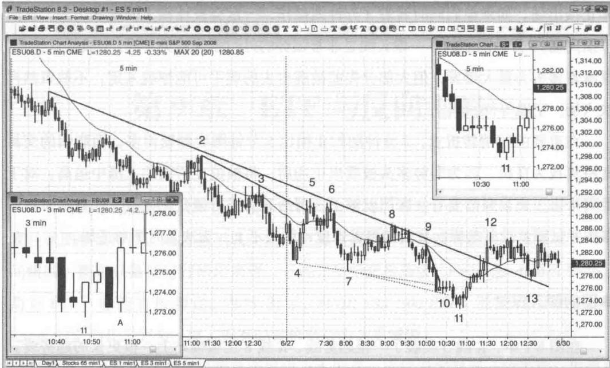

# 第8章 K线收盘价的重要性

一根 5 分钟 K 线往往在其收盘前数秒到一分钟（或以上）即呈现出与最终外观类似的样子。如果在 K 线收盘前入场，你偶尔可以多赚大约 1 个最小报价单位的利润。然而每天总有那么一两次，你原以为将要出现的信号没有出现，导致你亏损大约 8 个单位。这意味着，你需要大约 8 次成功的提前入场交易才能弥补一次失败，显然这是不可能做到的。在强趋势中做顺势交易，提前入场一般不会造成什么麻烦。但话又说回来，既然趋势强劲、你对入场信号信心十足，那么等待信号 K 线收盘然后在其一端挂单入场也不会有什么坏处。你不可能对每根 K 线都去判断一下提前入场是否合适，因为你还有很多其他重要决定要做。如果把这个也加入考虑之列，你每天可能会错失大量好的交易，而从提前入场交易偶尔成功获得的收益远远不能弥补失去的机会。

这一点对于所有时间级别都是如此。比如说，看一张日线图，你会发现很多K线开在最低点，但收在区间中位。所有这些K线都是强多头趋势K线，在盘中某个时候最后价格处在最高点。如果你想当然认为K线将会收在最高点，可能会在高点附近买入。到最后发现它收在振幅中位，你才后悔不迭。实际上，如果耐心等到收盘，你可能根本就不会入场，现在只有抱着它过夜了。

在 5 分钟图上，有两个常见问题。代价最高的问题发生在当你试图在强劲下跌趋势中抄底的时候。市场突破下降趋势线之后通常会出现一个下降低点，此时交易者希望看到一根强势反转 K 线，尤其在同时还发生下降趋势通道线过靶的情况下。不出所料，市场果然出现一根大阳线，到第 3 分钟左右，依然是一根强势多头反转 K 线。价格在这根 K 线高点附近停留数分钟，吸引越来越多希望提早建仓以降低风险（他们的止损在这根 K 线下方）的逆势交易者入场，然而就在这根 K 线收盘前 1\~5 秒钟，价格突然崩溃，K 线收在最低点。不消说，这些本来想将风险降低 1\~2 个最小报价单位的先行多头，结果反而亏损 2 个点甚至更多。这些多头陷入一笔糟糕的交易。类似的情况是屡见不鲜的，一根潜在信号K线可能直到其收盘前看上去都非常完美。再举一个例子，比如你打算在一根空头反转K线下方做空，这根K线距离收盘还有几秒钟，目前价格位于K线底部。就在这根K线收盘前不到1秒钟，价格突然窜升2\~3个单位，收于低点之上。市场所发出的信息是，现在做空信号已经变弱，你不应该再根据仅3秒钟前的预期和希望来做出决策，免得让自己陷入一笔糟糕的交易。

另一个常见的问题是被震出一笔好的交易。举例来说，你刚刚入场做多，现在已经有3\~5个单位的浮盈，你的目标是赚取4单位的刮头皮利润，而市场必须上涨6单位才能让你如愿。但是6单位就是到不了，于是你开始变得焦躁不安。你盯着3分钟或5分钟图，看见当前K线是一根强空头反转K线，还有大约10秒钟收盘。稳妥起见，你把保护性止损上移到这根K线下方1单位处。然而就在这根K线收盘前，市场下探并扫掉你的止损，并在最后2秒钟拉升几个单位。接着，在第二根K线的头30秒，市场迅速来到6单位的位置——聪明交易者在这里锁定部分利润，而你只能眼巴巴看着。对于这笔交易来讲，你的入场点、交易计划都不错，但没有严格执行交易纪律，导致被震出一笔好的交易。如果遵循最初的交易计划，在入场K线收盘之前保持止损不变，你最后是获利离场的。

关于 K 线收盘还有一点值得一提。我们应该密切关注每一根 K 线的收盘，尤其是入场 K 线以及后面那 1\~2 根 K 线。如果入场 K 线长为 6 单位，你应该更愿意看到它是在最后几秒钟从 2 单位而非 4 单位突然变长的。这样的话你可以降低刮头皮出场的头寸比例。对于后面几根 K 线也是如此，相比弱收盘，在收盘强劲的情况下，你应该更愿意让更高比例的头寸参与摆动、持有更长时间。

收盘价之所以如此重要还有一个原因，那就是许多机构交易者下单是根据估值而非价格行为，看图的话他们看的也是根据收盘价画的线图。而且，如果走势图对决策过程不产生影响，他们甚至根本不看图，而考虑的唯一价格就是收盘价。这无形中提高了收盘价的重要性。

较小时间级别图形可以让我们设置更小的止损，但交易者被震出一笔好交易的风险也会增大。在图 8.1 中，左边的嵌图显示使用 3 分钟图的交易者被止损出局，而使用 5 分钟图的交易者没有被震出去。

此图为Emini的5分钟图，市场数周来一直处于强劲下跌趋势中，现在开始出现越来越大的回撤。每一个新的下降低点都受到买盘支撑，属于有利可图的逆势多

Day1 Stocks 65 min1 ES 1 min1 ES 3 min1 ES 5 min1
Created with TradeStation

图 8.1 较小时间级别图形导致更大亏损头交易。多头信心越来越足，而空头越来越倾向于锁定利润。左下角的小图是3分钟图，右上角是5分钟图的特写放大。

K 线 11 是一根强多头反转 K 线，并构成双 K 线反转，是第二次尝试从下降低点反转 [K 线 10 后面的双内包（ii）形态是第一次]，也是当天第三波向下推动（有可能形成楔形底部）。这是一个高概率买点，但止损必须设在 K 线 11 低点下方，距离入场点 3 个点。对于 Emini 来讲，当日均波动区间为 10\~15 点，合理的止损一般是 2 个点。这里止损虽然略微大一点，但价格行为告诉我们这是有必要的。如果觉得心里没底，你可以将仓位减半，但绝不能错过如此强劲的建仓形态，而且可以考虑让一半头寸参与摆动、持有时间长一点。

本例很好地说明了当交易者试图通过使用较小时间级别图形来降低风险可能发生的问题。没错，风险是降低了，但成功率也下降了。由于3分钟图上有更多交易机会，交易者更有可能错过那些最佳的机会。对于许多交易者而言，这可能导致3分钟图交易的总体盈利能力更低。

与 5 分钟图一样，3 分钟图的 K 线 11 也是一根反转 K 线，但是入场 K 线下方的止损被一根光头光脚大阴线扫掉。此时，我们可能还很难将其与 5 分钟图没有被打止损这事挂上钩。由于 5 分钟图要求设置较大的止损，某些交易者可能更愿意提早止损出场。如果他们同时看着3分钟图操作，一定会被那根大阴线震出去，从而亏损离场。3分钟图上的下一根K线是非常强势的外包多头趋势K线，形成低点抬升，意味着多头力量大爆发，但大部分先前被震出去的弱手可能惊魂未定，不敢贸然再次入场，宁愿等待回调。

在重要的行情转折点，3分钟图扫止损比5分钟图要频繁得多，而聪明的交易者将其视为良机，因为弱势多头被震出市场后，将被迫在后面的上涨中追高。对于我们来讲，交易只需要看一张图就够了，因为有时候行情变化太快，如果同时看两张图并试图解读其差异，我们的思考速度可能跟不上，无法及时下单进场。

# 本图的深入探讨

在图 8.1 中，K 线 5 突破了一根趋势线，K 线 8 也微幅站上一根更长的趋势线。两次突破都宣告失败，带来顺势做空机会。