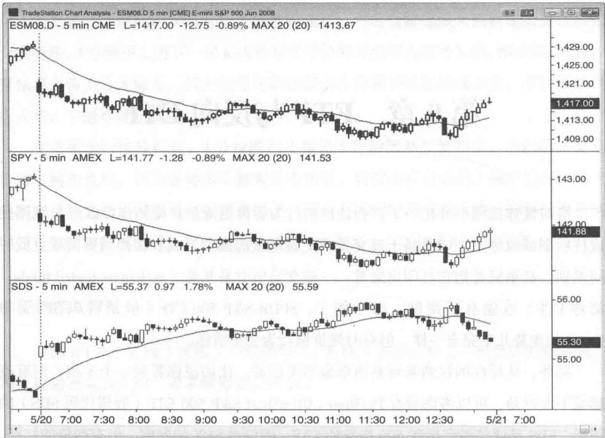
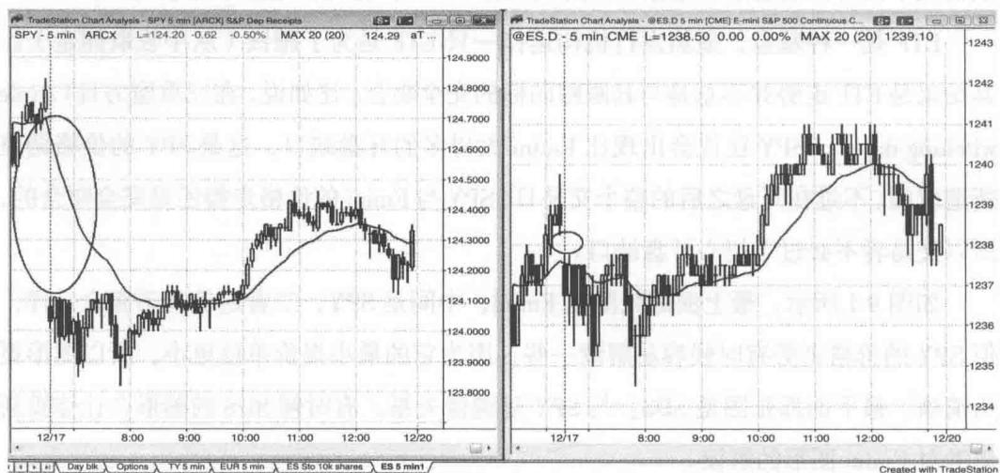

# 第9章 ETF与反向ETF

有时候你把图形变化一下，会让价格行为看得更清楚。比如你可以把 K 线图换成柱状图或线形图，或者基于成交量或交易笔数的图形，或者切换到更高或更低时间级别，甚至只是把它打印出来看。一些交易所交易基金（exchange-traded funds，简称 ETF）也能有所帮助。举个例子，SPDR S&P 500 ETF（股票代码 SPY）与Emini 的走势几乎完全一样，但有时候价格行为会更清晰。

另外，从反向的视角来观察图形也不无助益。比如说你看到一个牛旗，但有点感觉不太对劲，可以考虑看看 ProShares UltraShort S&P 500 ETF（股票代码 SDS）的图形。SDS 是两倍做空标普 500 指数的 ETF，刚好是 SPY 的颠倒，但有两倍的杠杆。如果你去看 SDS 的图，可能会发现你在 Emini 或 SPY 上看到的牛旗在 SDS 上对应一个弧形底的样子。如果真是这样，明智的做法是不要做多 Emini 的牛旗，而是等待价格行为进一步展开（比如等待它突破，然后在突破失败的情况下做空）。有时候其他指数的期货形态更为清晰，比如纳斯达克 100 指数期货迷你合约（或者 ETF 中跟踪纳斯达克 100 指数的 QQQ、双倍反向跟踪纳斯达克 100 指数的 QID），不过一般情况下没有必要看这些指数，最好只关注 Emini，有时候也可以看看 SDS。

ETF 是一种基金，显然发行机构运作一只 ETF 是为了赚钱（从中收取佣金）。其结果是 ETF 走势并不总是与其跟踪的标的完全吻合。比如说，在三重魔力日（triple witching day），SPY 往往会出现比 Emini 大得多的开盘缺口，这是 SPY 的价格调整所造成的。不过在开盘之后的整个交易日，SPY 与 Emini 的价格走势还是完全吻合的，所以交易者不必过于担心开盘缺口。

如图 9.1 所示，最上面那张图是 Emini，中间是 SPY，二者走势几乎完全一样，但 SPY 的价格走势有时候容易解读一些，因为它的最小报价单位更小，所以图形更为清晰。最下面那张图是 SDS，与 SPY 呈镜像关系。有时候 SDS 的图形会让你重新思考对 Emini 图形的解读。

图9.1Emini与SPY大致吻合
Created with TradeStation

如图 9.2 所示，在三重魔力日，SPY 的价格有所调整，通常导致开盘缺口可能远远大于 Emini（左边是 SPY，右边是 Emini）。不过接下来它们的走势几乎亦步亦趋，与其他交易日并无分别，所以不用纠结于缺口问题，随着行情展开根据价格行为进行交易就是了。

Day blk Options TY 5 min EUR 5 min ES Sto 10k shares ES 5 min1
Created with TradeStation

图 9.2 SPY 在三重魔力日的调整