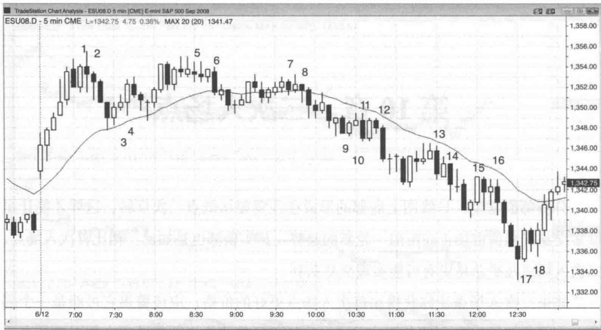
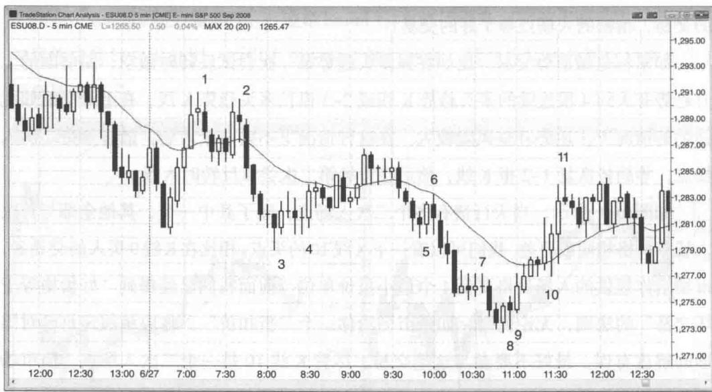

# 第10章 二次入场点

析师们常说，日线图上底部的形成往往需要从低点二次反转，这样才能让足够多交易者相信市场正在酝酿一轮新的趋势。其实顶部也是如此。相比首次入场点，二次入场点几乎总是更有可能实现交易获利。

如果二次入场点让你获得比首次入场点更好的价格，应该警惕它可能是一个陷阱。大部分好的二次入场点都处于同一价位或更差的价格。交易者之所以选择在二次入场点进场，是为了让风险最小化，所以市场往往会让他为这额外的信息付出一点“费用”。如果“收费”反而更低，那么它很可能是一个假信号，是来骗你的钱的。

寻找二次入场点的交易者往往更激进、更有信心，并且通常根据较小时间级别图形入场。这就使得那些使用5分钟图的交易者入场点在许多其他交易者之后，获得的入场价格更差一些。如果市场给了一个更好的入场价格，你应该要怀疑自己是不是哪里搞错了，应该考虑放弃这笔交易。在大部分情况下，好的入场点等于糟糕的交易，糟糕的入场点等于好的交易！

如果你是做逆势交易，比如在强多头趋势第一次尝试反转时做空，而前面的上升趋势有大约4根连续的多头趋势K线或2\~3根长多头趋势K线，在上升动能如此强劲的情况下，逆势开空风险较大。在这种情况下不要急于入场，最好等待二次入场点，等趋势恢复1\~2根K线，然后在市场第二次尝试反转时入场。

如图 10.1 所示，当天行情有多个二次入场点，除了其中一个，其他全部与首次入场点价格相同或更差。我们可以看一下 K 线 10 的买点。相比在 K 线 9 买入的交易者，市场给你提供的入场价格要低 1 个最小报价单位。前面我们已经提到“好价格等于坏交易”的法则，无论何时，如果市场给你一个“折扣价”，你应该假定自己对图形的解读有误，最好不要参与这笔交易。尽管 K 线 10 是一个二次入场点，但市场下跌动能非常强劲（从始于 K 线 8 的窄幅下跌通道可见）。一般情况下，逆势开仓的时候，最好前面几根 K 线已经有多头活跃的迹象，比如能够站上前一根 K 线高点

图10.1 二次入场点
Created with TradeStation

# 2

 单位以上。

我们在第三本书将会谈到，大部分顶部都是由某种类型的微型双顶构成，比如K线1与两根K线前的空头反转K线；同理，大部分底部都是由某种类型的微型双底构成，比如K线18与K线17的前一根K线。

Created with TradeStation

图 10.2 在强趋势中应等待第二次反转如果市场动能强劲，应该等出现二次反转形态再考虑逆势开仓。

如图 10.2 所示，K 线 1 前面是连续 5 根阳线，说明上升动能非常之强，不宜在第一次下跌尝试中做空。聪明的交易者在开空前会耐心等待，看看多头的第二次上攻尝试是否会失败（发生在二次做空入场点 K 线 2）。

K 线 3 是当天新低位置的一个首次做多入场点，但前面连续 6 根 K 线没有一根阳线，等待出现二次做多入场点更为稳妥（发生在 K 线 4）。

K 线 5 出现在 4 根空头趋势 K 线之后，说明下跌动能过强，不宜买入。二次入场点一直没有出现，聪明的交易者因为等待而避免了损失。

K 线 10 前面 6 根 K 线均形成低点抬升，只有两根 K 线形成很小的阴线实体，说明上升动能强劲，不宜做空。二次入场点出现在 K 线 11 空头反转 K 线。

# 本图的深入探讨

在图 10.2 中，市场开盘突破了前一天收盘前的下降通道，但突破走势在均线处失败，构成一个卖点。接下来市场跌破前一天的低点，但这一突破同样失败，并在当天第 4 根 K 线向上反转。这一反转可以视为第一根 K 线突破小型下降通道之后以低点下降方式出现的突破回踩。

然而全天市场一直未能形成高点抬升，而是延续了趋势性的下跌通道。交易者应该会在 K 线 6 双顶下方做空，因为市场没有突破前期下降高点，说明形成“始于开盘的上升趋势”的尝试已经失败，高点下降、低点下降的格局仍在持续。

截至 K 线 3 前一根 K 线是一轮急速下跌行情，随后的回撤走势出现一个低 4 做空形态，上午 9 点 35 分那根阴线触发了入场点。这一空头突破演变成持续 4 根 K 线的急速下跌行情。

K 线 5 是一个高 2 买点，但前面有 4 根空头趋势 K 线，所以不应该买入。

K 线 6 是一波持续 4 根 K 线的急速下跌行情的起点。

K 线 7 双内包（ii）形态是一个潜在的末端旗形。

K 线 7 带来一波两根 K 线的急速下跌。从那个低 4 卖点开始，整个下跌通道内的 3 波急速下跌构成连续的卖出高潮，而一旦出现第 3 波下跌，市场很有可能走出至少两段式反弹。

在形成 K 线 8 反转 K 线之后，交易者可能会在 K 线 9 做多，由于市场出现末端旗形和持续的下跌趋势，可以预期至少有两波上涨。K线8与两根K线前的那根阴线构成一个微型双底买入形态。

K 线 10 是一个低 1，但由于市场上升动能过于强劲，不宜做空。更明智的做法是准备在低点抬升位做多，甚至在前一根 K 线低点下方挂限价单买入。在上升动能这么强的情况下，市场很有可能至少测试这一波上涨走势的高点。

K 线 11 是出现在大阳线之后的一根十字星反转 K 线。当市场走出 5\~10 根多头趋势 K 线之后，此时形成的长阳属于买入高潮，接下来多半要出现 10 根或以上 K 线的横盘或下跌，然后才能恢复多头趋势。K 线 11 还处于下跌趋势最后一个下降高点的区域，因此构成一个潜在的双顶熊旗。由于多头力量如此强大，大部分交易者都假定市场将形成低点抬升，但他们会利用双顶熊旗作为锁定多单利润的区域。部分刮头皮交易者会在这里做空，预期市场至少将向下测试均线。由于前面的上涨行情包含如此多的多头趋势 K 线，说明多头毫不掩饰自己的激进立场，因此市场有可能形成低点抬升。