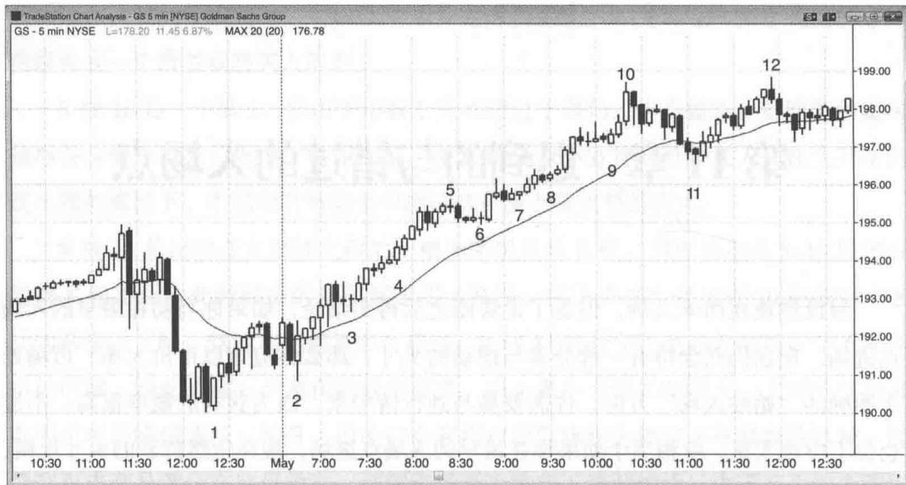

# 第 11 章 迟到的与错过的人场点

设你现在尚未入场，但看了走势图之后得出结论，如果你当初在最早的入场点进场，现在仍然会持有一部分参与摆动的头寸，那么你应该以市价入场。市场处于明确的“始终入场”方向，你需要参与到行情中来，因为获利的概率很高。不过仓位不应该太重，应相当于如果你在最早的入场点进场，现在依然持有的头寸规模，而且应该使用同样的跟踪止损。相比刮头皮交易，你的止损肯定要大一些，所以需要适当降低仓位，让你的资金风险保持在同一水平。举例来说，如果你看到高盛（股票代码GS）股价处于强劲的上升趋势，而如果你在最早的入场点买入300股的话，现在可能仅持有100股，保护性止损为1.5美元，那么你现在进场应该买入的股数就是100股，止损也是1.5美元。从逻辑上来讲，你现在建立一个摆动规模的头寸，与持有早期入场后剩下的摆动头寸，性质是完全一样的。虽然从情感上来讲，我们很容易认为那笔有浮盈的交易已经没有风险，似乎是拿别人的钱在冒险。但事实并非如此。那也是你的钱，你所冒的风险与现在买入是完全一样的，同样是那1.5美元止损。成熟的交易者了解这一点，所以会毫不犹豫地进场。相反，不成熟的交易者可能根本就不相信自己如果早入场的话现在还会持有一部分头寸，或者需要先解决自己的心理问题。

一般来讲，一旦市场开始连续出现4根或以上的多头趋势K线，而且K线不是太长（因此不属于高潮走势），那么交易者应该考虑至少先少量建仓，而不要等待回调。

图 11.1 是高盛（股票代码 GS）股价的 5 分钟图，前一天收盘前市场出现剧烈的两段式下跌，但 K 线 2 形成一根强多头反转 K 线，与前一天低点构成低点抬升，开启一个上升趋势交易日。

如果交易者大概在 K 线 4 的位置看到这张图, 他们所见的是一系列多头趋势 K 线, 市场处于强劲上升趋势。他们可能会想, 如果自己早一点入场, 现在至少继续持有部

Created with TradeStation

图 11.1 趋势中连续出现的趋势 K 线分摆动头寸，让利润奔跑，那该多好！假设他们在K线3上方的入场点建仓，总共买入300股的话，此时可能还剩下100股继续持有。如果这一假设成立，那么他们此时应该以市价买入100股。而且，他们应该使用与在K线3上方入场情况下同样的止损。在上述假设的情况下，由于他们将只剩下参与摆动部分的头寸，止损应该放在盈亏平衡点或者在K线3高点下方10美分左右。他们还应该寻找盘整或回调的机会加仓。如果在K线6高点上方加仓，可以将整体仓位的止损上移至K线6信号K线下方1个最小报价单位处，然后继续跟踪止损。

晚入场并使用初始止损，与持有初始头寸的摆动部分使用同样止损，绝对是等同的。

# 本图的深入探讨

在图 11.1 中，市场当天开盘第一根 K 线突破了前一天收盘前的摆动高点，在均线处形成一个小双顶熊旗卖点。然而这一第二次突破始于 K 线 1 熊旗的尝试以失败告终。K 线 2 强势向上反转，并形成双 K 线多头反转。下一根 K 线是内包阳线，对于 “始于开盘的上升趋势” 是一根很好的信号 K 线。同时，它还是对市场向下突破前一天收盘前最后 4 根 K 线所形成小双底的多头反转。

持续到 K 线 11 均线缺口 K 线的下跌突破了上升趋势线，有可能引发对上升行情高点的测试，可能形成高点抬升也可能形成高点下降。通常情况下，在此之后市场可能进入幅度更大或更复杂的调整。然而持续到K线10的上涨行情处于如此窄的上升通道，说明多头力量异常强劲。本轮上升行情在较高时间级别图形上可能对应一波急速拉升，接下来可能在该时间级别上进入通道性上涨。在此之后，我们才可能在5分钟图上看到像样的回调。而且，K线11均线缺口K线还是一个20根均线缺口K线回撤。当市场在20根均线缺口K线回撤之后出现第一个新高，往往会进入回调，然后再次测试高点。所以这根均线缺口K线并非一般的均线缺口K线形态，而是更接近于20根均线缺口K线形态。