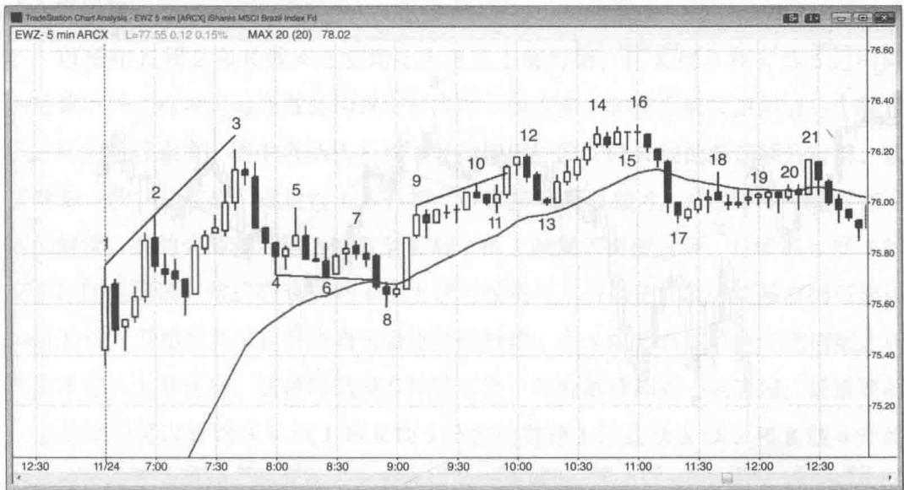
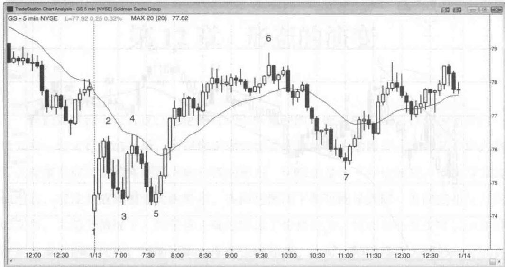
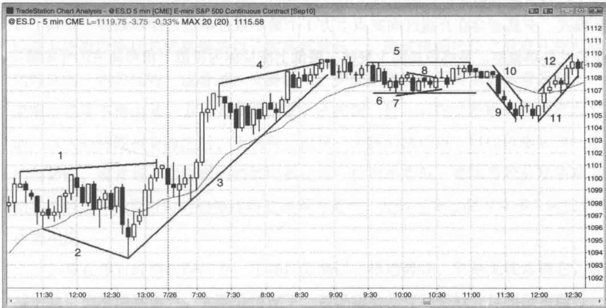

# 第 12 章 形态的演变

无论何时，你所看到的当前这根 K 线可以成为朝任何一个方向一轮大行情的开始，所以你必须密切关注价格行为的展开，看看某个形态是否正在演变成可能带来相反方向行情的形态。形态总是在不停地演化，或演变成其他形态，或发展成规模更大的形态，在两种情况下都可能导致同一方向或相反方向的交易。大部分情况下，如果你正确地解读了价格行为，初始形态至少可以给你带来刮头皮利润。同样，规模更大的形态也是如此。你可以把规模更大的形态看成初始形态的扩展版本，但这无关宏旨，因为叫法从来都不重要。你只需确保对眼前的走势图做出正确的解读，并据之下单交易，对于那些在数根 K 线前已经完成的形态，一概忽略之。

形态演化最常见的例子就是失败，即一个形态未能产生刮头皮利润即发生反转、发出相反方向的交易信号。形态失败将交易者套在错误的市场方向，随着这些交易者被迫止损，市场将获得反方向的运行动能，至少可以带来刮头皮利润。这一点可以发生在任何形态上，因为所有形态都可能失败。如果形态失败后市场并未作反向运动，而是横盘数根K线，然后形成一个新的形态，我们应当将这个新形态视为独立于第一个形态。这里之所以要忽略第一个形态，是因为现在已经没有多少被套的交易者（他们被迫止损出局将对市场产生推动）。

现在我们还没必要马上熟悉书中的所有形态，不过你将会在后面的章节中看到一些形态演化的常见例子。比如说，一个扩散三角形有时候会从5波行情扩充到7波；对微型趋势线的突破通常会失败，然后出现突破回踩；如果一个末端熊旗未能造成市场反转，往往会演化成突破回踩做空建仓形态，然后通常会扩大成一个楔形反转形态，或者进入更大的交易区间，并通常形成一个更大的末端旗形；一个“急速与通道”上涨形态通常会进入交易区间，然后形成双底牛旗；在交易日第一个小时行情中，双顶熊旗往往会演化成双底牛旗（反之亦然），如果你风格比较激进，可以抓住两个入场机会，部分头寸刮头皮，部分头寸参与摆动，因为两个形态往往都会导致价格大幅运动。

Created with TradeStation

图 12.1 建仓形态可能演化成更复杂的形态可靠的形态有大约 40% 的概率失败，通常演化成一个更大的形态并可能构成做多或做空入场点。图 12.1 是跟踪巴西股市的交易所交易基金 iShares MSCI Brazil Index Fund（股票代码 EWZ）的 5 分钟图。图中，K 线 2 下方的低 2 做空形态失败，但形态演化成一个更大的楔形顶部，入场点在 K 线 3 后一根 K 线低点下方。

K 线 19 低 2 熊旗演化成了一个更复杂的低 2 做空形态，入场点在 K 线 21 双 K 线反转下方。K 线 18 是第一波向上推动。

# 本图的深入探讨

在图 12.1 中，K 线 6 后面的高 2 演变成了一个楔形牛旗，入场点在均线处的 K 线 8 上方。它还是一轮 “急速与通道” 下跌行情，K 线 8 是通道内第 3 波向下推动，而通道往往在第 3 波推动结束。

K 线 10 的低 2 有可能失败，因为截至 K 线 9 的拉升走势力度很强。低 1 入场点在 K 线 10 前面两根 K 线处。该形态在 K 线 11 变成了一个低 2 失败买入形态，在 K 线 12 进一步演变成一个 “急速与通道” 顶部，与通常情况下一样，通道在第 3 波向上推动结束。

K 线 15 的高 2 失败，市场在当天新高位置第二次尝试向下反转。入场点在 K 线 15 后面那根高 2 入场 K 线下方。

Created with TradeStation

图12.2 第一个小时的突破模式在交易日第一个小时，双顶和双底都极为常见，使得市场处于突破模式。在图12.2中，高盛（股票代码GS）股价的双顶演化成了一个双底牛旗。这是一种常见形态，你在两个入场点都应该进场（在K线4下方做空，然后在K线5上方做多）并让部分头寸参与摆动，因为无论第一个形态还是第二个形态都可能带来较大行情。记住，交易日的最高点或最低点往往在第一个小时出现，也就是说，接下来几个小时中大部分时间市场都会远离这一价位，如果当天成为趋势交易日的话，甚至全天都可能如此。图中高盛当天大幅跳空低开，向下突破了前一天行情所形成的趋势通道线，然后在当天第一根K线向上反转。在K线4，市场在下行均线处形成了一个低2和双顶熊旗，然而在K线5又反转为双底牛旗。接下来市场大涨3美元，在K线6创出日内高点。

# 本图的深入探讨

开盘大幅跳空往往会带来朝任何一个方向的趋势交易日。在图 12.2 中，由于前 3 根 K 线强劲上涨，市场形成多头趋势交易日的可能性更大，尤其是市场开盘对前一天尾盘所形成的下降趋势通道线过靶后向上反转。空头试图在均线处重新夺回控制权，但跌至 K 线 5 之后，市场在 K 线 3 低点区域再次迎来强劲买盘。空头在 K 线 4 第二次尝试制造下跌趋势交易日的努力失败，市场在 K 线 5 二次筑底成功之后进入上升通道。

市场在 K 线 2 和 K 线 4 之前均走出急速上涨行情，在 K 线 3 和 K 线 5 之前则为急速下跌。这种走势通常会构成交易区间，因为多头和空头都试图制造一个朝自己方向的运行通道。图中市场从 K 线 5 开始走出一段 5 根 K 线的急速飙升行情，紧接着是一波“三连推”通道性上涨行情，一直持续到 K 线 6。对这张图可能存在不同的解读。有的交易者可能认为截至 K 线 2 的上涨属于突破过程，持续到 K 线 5 的交易区间是回调，然后截至 K 线 6 的上涨行情属于上升通道；其他交易者则可能认为从 K 线 5 开始的急速拉升为当天最重要的行情，在 5 根 K 线的急速上涨结束之后市场才进入上升通道。这种问题没有标准答案，两种解读都有一定道理。最重要的一点是我们可以看到从 K 线 1 和 K 线 5 开始的急速上涨比从 K 线 2 和 K 线 4 开始的急速下跌更为强劲，因此进入上升通道的概率更大。

当天本来有望成为“始于开盘的上升趋势日”，但最终形成了一个趋势性交易区间日。K线7向下测试下方的交易区间，然后反转走高直至收盘，接近上方交易区间的高点。

# 趋势线与通道虽然许多交易者把所有线都看成趋势线，但我们有必要把它们细分一下。趋势线和趋势通道线都是涵括一部分市场价格行为的斜线，但二者处于相反的方向，共同构成运行通道。在上升趋势中，趋势线位于多个低点下方，而趋势通道线位于多个高点上方；在下降趋势中，趋势线在高点上方，趋势通道线在低点下方。构成通道的一组线通常是平行或大致平行的，但也可能收敛成楔形或各种三角形，或发散成扩散三角形。趋势线往往用来做顺势交易，而趋势通道线主要用于发现逆势交易机会。相比趋势线，弧线和包络线过于主观，思考时间比较长，很难保证及时快速下单进场。

通道可以走升、走跌或走平（交易区间即为横向通道）。当通道走平，通道线处于水平位置，上方的线为压力线，下方为支撑线。部分交易者把压力位视为派筹区域（交易者平多），把支撑位视为吸筹区域（交易者加多）。不过，现在大量机构做空与做多规模不相上下，压力位不但是派发多头头寸的区域，同样也是开立空头头寸的区域。同理，支撑位不但是开立多头头寸的区域，也是退出或回补空头头寸的区域。

图 PII.1 通过画线界定趋势
Created with TradeStation

我们可以通过画线来突出价格行为的特征，让开仓和头寸管理更为容易。

在图 PII.1 中，线 1 是一个扩散三角形上方的趋势通道线，线 2 是其下方的趋势通道线。由于这个通道呈发散状，处于无趋势状态，因此没有趋势线。

线 3 是一轮上升趋势中位于 K 线下方的趋势线，是一根支撑线。线 10 是下降趋势中位于高点上方的趋势线，是一根阻力线。

线 4 是上升趋势中的趋势通道线，位于高点上方。线 9 是下降趋势中的趋势通道线，位于低点下方。

线 5 和线 6 是交易区间(即水平通道)中的水平线。线 5 在高点上方, 构成阻力位; 线 6 在低点下方, 构成支撑位。

线 3 和线 4 构成一个收敛的上升通道，也就是楔形。

线 7 和线 8 两根趋势线构成一个小型对称三角形，属于收敛通道。由于对称三角形内同时有一段小型下降趋势和一段小型上升趋势，所以通道是由两根趋势线所构成，没有趋势通道线。收敛三角形可以细分成对称三角形、上升三角形和下降三角形，但它们的交易方法都一样，所以没必要用这么多术语把事情搞得更复杂。

# 本图的深入探讨

在图 PII.1 中，市场开盘第一根 K 线突破了前一天的高点，但突破失败。由于前一天最后 6 根 K 线均为多头趋势 K 线，因此只有在二次入场点才可考虑做空，但并未出现合理的信号。开盘后前 6 根 K 线构成一个小型交易区间，故而市场处于突破模式。交易者会在开盘区间高点上方 1 个最小报价单位处挂单做多，在其下方 1 单位处挂单做空。最终市场向上突破，最低上涨目标为扩散三角形高度的等距幅度。