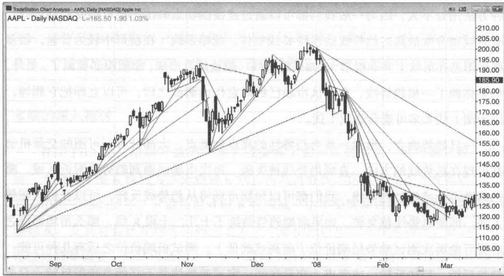
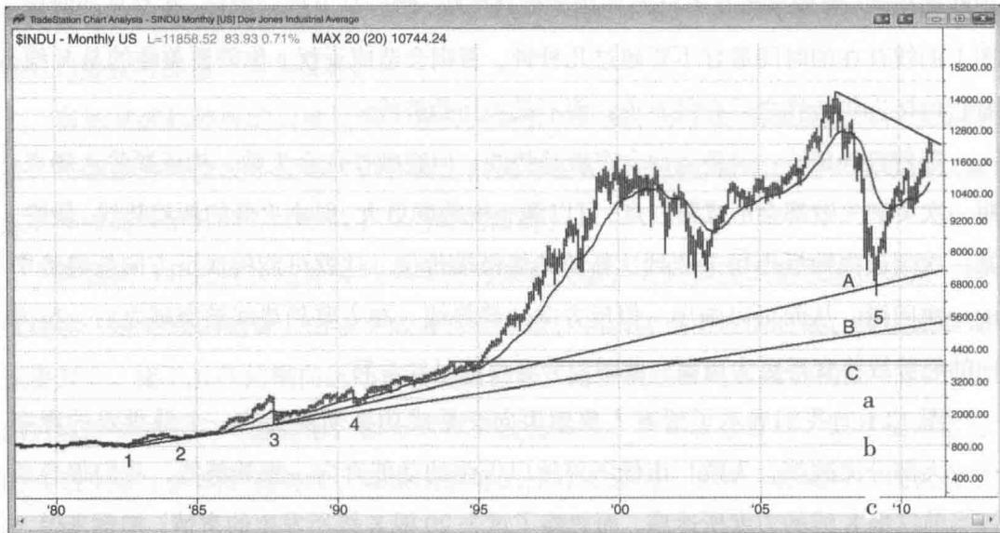
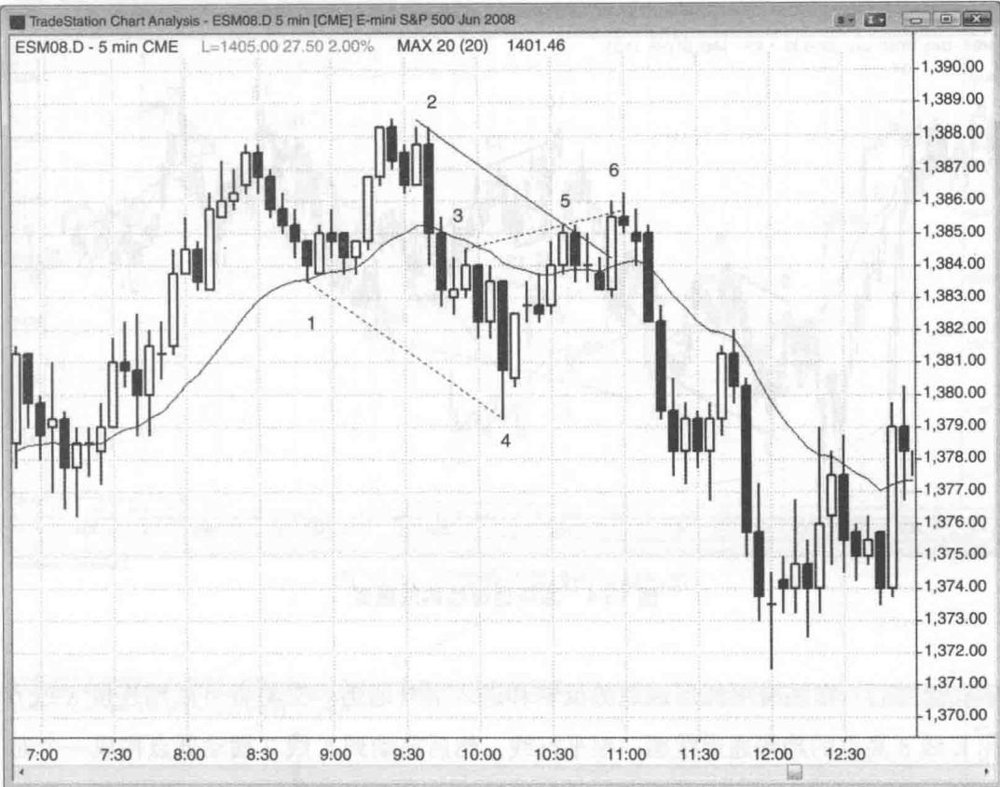
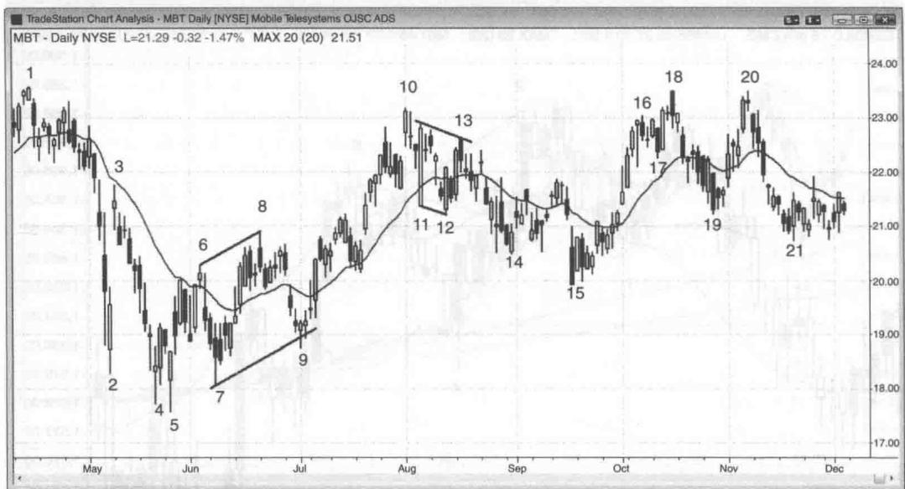
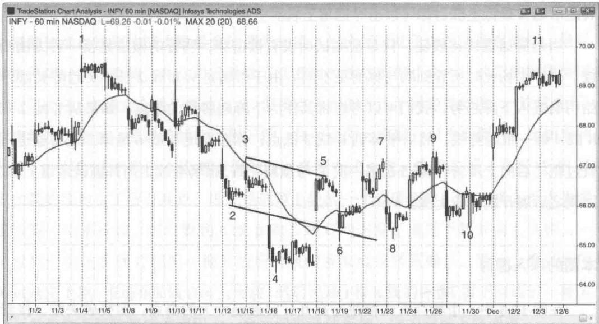
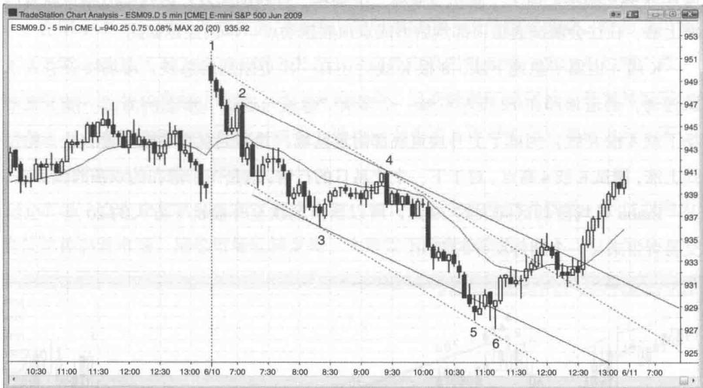
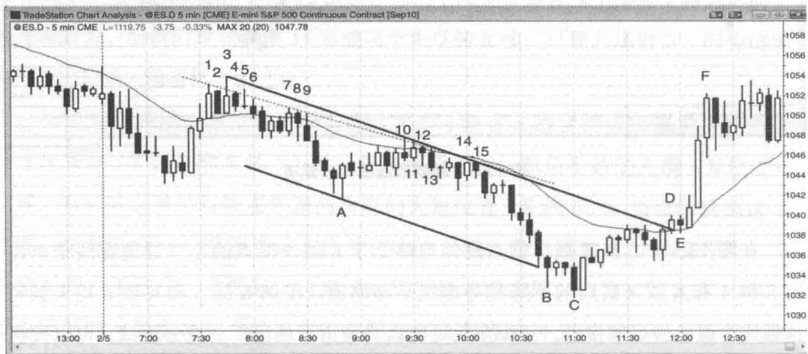

# 第13章 趋势线

升趋势线是沿着上升趋势低点画出来的线，下降趋势线是沿着下降趋势高点所画的线。趋势线的作用主要有两个，一是在回调中寻找顺势入场机会，二是在趋势线被突破之后寻找逆势入场机会。趋势线的画法有很多种，可以连接摆动点，也可以采用线性回归等最佳适配法，或者用目测法快速画线。趋势线还可以通过画趋势通道线的平行线的方法来画。先画一根平行线，然后拽动到K线另一侧。不过这种方法用处不大，因为一般我们都可以通过连接摆动点画出一根可接受的趋势线。有时候吻合度最高的趋势线是连接K线实体，忽略影线（在楔形中较为普遍，很多楔形形态在形状上并非楔形）。如果趋势线一眼就能看出来，那就没必要画了。另外，如果你画了一根趋势线，在确认市场已经对它作出测试之后，可以立即把它删掉，因为图上线太多可能会造成干扰。

一旦趋势确立，形成一系列趋势性的高点和低点，大部分有利可图的交易机会都出现在趋势线的方向，直到趋势线被突破。每次市场回撤到趋势线附近区域，哪怕略微不及或超过趋势线，我们都可以预期市场将从趋势线反转，可以找机会顺势入场。即便趋势线被突破，如果前期趋势持续了十几二十根K线，那么市场回调之后很可能再次测试趋势极端价位（前高或前低）。测试极端价位之后有几种可能：趋势延续、趋势反转，或者进入交易区间。突破趋势线并不必然意味着反转，只是说明市场将不再由某一方（买家或卖家）所控制，进入双向交易模式的概率大大增加。每次趋势线被突破之后，市场将会出现一个新的摆动点，可以依据它画一根新的趋势线。通常每一根新画的趋势线都比前一根斜率更低，意味着趋势动能减退。到某个时点，相反方向的趋势线将变得更为重要，此时市场控制权从多头转向空头，或者相反。

如果在相对较短的时间里，市场反复测试一根趋势线，就是无法远离它，那么接下来可能有两种走势。大部分情况下，市场将会击穿趋势线并试图反转趋势。但有时候也会出现相反的情况，交易者放弃攻陷趋势线的努力，市场迅速远离趋势线。然后趋势获得加速，而非反转。

市场突破趋势线的力度反映了逆势交易者的能量。逆势运动幅度越大、速度越快，市场越有可能发生反转，但在此之前通常会先测试趋势极端价位（比如说以高点下降或高点抬升的方式测试上升趋势的前高）。

开盘缺口和任何长趋势 K 线都可视为某种突破，而且都应该被当成仿佛是一段仅持续一根 K 线的趋势。由于突破通常会失败，当入场点出现的时候，你应该准备逆势开仓。接下来任何横向运动都会突破趋势。通常这些横向 K 线会构成一个旗形，然后以顺势的方向突破旗形，但有时候突破会失败，市场将会反转。既然横向运行的 K 线突破了陡峭的趋势线，如果出现好的反转交易信号 K 线，你就可以找机会逆势入场。

Created with TradeStation

图13.1 所有趋势线都很重要图上哪些趋势线是有效的？你所看到的每根趋势线都有可能带来交易机会。找出你所看到的所有摆动点，看看前面是否有某个摆动点能够与它连成一根趋势线，然后将其向右延伸，观察价格击穿或碰到这根线之后有什么表现。我们注意到每一根后画的趋势线都倾向于比前一根斜率更低，直到某个时点反方向的趋势线变得更为重要。

在实盘分析中，当你看到可能存在某根趋势线，但不确定距离当前K线有多远，把线画出来,看看市场是否已经到达这根趋势线,然后马上把它删掉。在交易的时候,图上的线存在的时间最好不要超过几秒钟,否则会造成干扰。你需要关注的是K线,看它们接近趋势线之后有何表现,而不是关注趋势线。

随着趋势延续，逆势运动会突破趋势线，但突破往往会失败，构成顺势入场点。每一次突破失败都会形成第二点，可以画一根跨度更大、斜率更低的新趋势线。最终，某一次突破失败后市场未能到达新的趋势极端价位。这就可能构成反方向新趋势中的一次回撤，从而可以画出一根反方向的趋势线。在主要趋势线被突破之后，反方向的趋势线将变得更为重要，此时趋势有可能已经反转。

图 13.1 向我们展示了所有人要想迈向交易成功必须接受的一个最重要的现实——大部分突破都会失败！市场不停地以极强的动能奔向一根趋势线，我们很容易被当前这根 K 线的力度所迷惑，而忽略了过去 20 根 K 线所发生的事情。举例来说，当市场处于上升趋势，中间会有多次非常强劲的下跌，迅速跌至上升趋势线。新手以为市场已经反转，于是在趋势线附近做空。市场下跌动能如此之强，他们以为自己应该可以抓住一轮大跌行情，大赚一笔，而且自己几乎是在趋势刚开始的时候就已入场。他们盘算，最糟糕的情况也不过是小幅反弹之后二次下探，至少可以在盈亏平衡点出场。他们所犯的错误在于，当他们抱着新趋势已开始的希望决定逆势开仓的时候，只想到了自己能赚多少钱，而忽略了每笔交易必须考虑的另外两个因素：风险与成功率。我们下单交易时必须同时考虑到这三个因素。

市场快速下探后，当新手在上升趋势线附近做空，老练的交易者却反其道而行之。他们会在趋势线附近或其下方挂单买入，或者在那个位置以市价买入。在剧烈回调中，市场通常会至少小幅跌破趋势线，以获得更多信息——看看这里卖家更多还是买家更多。大部分情况下，买家都多于卖家，上升趋势将会恢复，但前提是市场强力突破趋势线，然后以高点更高（如本例）或低点更高的形式测试前期高点。

趋势线在所有时间级别都很重要，包括道琼斯工业平均指数（代码INDU）的月线图。从图13.2可以看到，1987年崩盘（K线3）刚好跌到连接K线1和K线2的趋势线b。2009年的熊市刚好从连接1987年低点和1990年低点的趋势线a反转。由于2009年的下跌趋势如此强劲，市场存在再次测试趋势线b的可能性。一路跌回水平线c的突破位应该是不可能的（这一位置刚好对应1994年共和党同时掌控众议院和参议院）。一般情况下，当市场突破之后进入一段持久的趋势，突破位就不可

Created with TradeStation

图 13.2 月线图趋势线能再被触碰，但往往会遭到测试。由于这一位置一直没有被有效测试，它可能仍具有某种磁力，把市场拉下来。只不过它距离现在时间已经过长，可能已经失去部分或全部磁力。

顺便提一下，市场的方向通常只有大约50%的确定性，因为大部分时候多头和空头都处于均衡状态。然而在强劲趋势中，交易者对市场方向通常有60%或更高的把握。由于2009年的暴跌如此之强，市场可能有60%的概率在突破历史高点之前先测试2009年的低点。空头可能会把当前的熊市反弹看成一个潜在头肩顶的右肩，或者与2007年高点构成双顶，或者一个三角形扩散顶（如果市场创出历史新高）。价格行为交易者把所有这几种情况都仅仅看成是对长达12年交易区间顶部的测试。

趋势线可以通过画趋势通道线的平行线的方法画出来，但一般不能单独依据这种线来操作，除非运用其他更普通的价格行为分析方法也发现明显的交易机会。

在图 13.3 中，连接 K 线 1 和 K 线 4 低点是一根下降趋势通道线，画一根它的平行线，将其平移到另一端并固定在 K 线 2 的高点，就可以画出一根趋势线。

K 线 6 是第二次尝试反转对此线的突破，所以是一个很好的做空形态。

而且，根据连接K线1和K线4的趋势通道线所画出来的平行线与连接K线

Created with TradeStation

图 13.3 平行线构成的趋势线

2 和 K 线 5 高点的趋势线（未显示）几乎完全重合，所以对于寻求做空的交易者并未提供更多帮助。

# 本图的深入探讨

在图 13.3 中，K 线 6 还是对连接 K 线 3 和 K 线 5 高点的趋势通道线的假突破，使 K 线 6 卖点成为一个交叉线交易的例子。所谓交叉线交易，是指回撤走势的趋势通道线或通道的一波走势与通道的趋势线交叉。在这里，朝向趋势线的回撤是以楔形熊旗的方式发生的，由 K 线 3、K 线 5 和 K 线 6 构成。

市场出现头两波推动行情之后，它们形成的趋势通道线有时候可以用来构成通道。图 13.4 是俄罗斯通讯公司 Mobile TeleSystems（股票代码 MBT）的日线图。

市场在 K 线 6 之前和 K 线 8 之前出现两波强劲的向上推动行情。在 K 线 4 楔

Created with TradeStation

图 13.4 趋势通道线构成通道形底部之后，市场有可能形成趋势反转和进入上升通道。交易者可以用连接K线6和K线8高点的趋势通道线画一根平行线，然后拖动到K线7摆动低点构成一个通道。接下来交易者可以观察从K线8开始的下跌走势，看是否会在通道下轨向上反转。K线9多头反转K线是一个买入形态。

类似地，K线10处于K线1高点区域，因此交易者应该提防市场形成双顶。市场在K线11向下跳空，然后出现第二轮下跌，持续到K线12低点。交易者可以连接它们的低点画一根趋势通道线，然后拽到两根K线之间的高点，恰好是K线11的高点。接下来就看从K线12低点开始的上涨是否会在这个潜在下降通道的上轨遭遇阻力。当他们看到K线13形成强空头反转K线，可能入场做空，因为市场有可能已经进入通道性下跌过程。

如图 13.5 所示，当市场走出头肩底雏形（底在 K 线 4 附近区域），我们可以连接颈线（K 线 3 和 K 线 5）画一根趋势通道线，然后平移到左肩（K 线 2）位置。有时候这根平行线能够预测右肩的大致位置（K 线 6）。当市场跌到这一位置，交易者将会开始寻找买入信号，比如 K 线 6 卖出高潮之后形成的强多头内包 K 线。不过话又说回来，这根线的重要性非常有限，因为最近数根 K 线对于决定何时入场永远要重要得多。此图是印度领先软件公司 Infosys（股票代码 INFY）的 60 分钟图。

图 13.5 用趋势通道线画头肩形态
Created with TradeStation

图 13.6 趋势通道线构成通道
Created with TradeStation

在图 13.6 中，从 K 线 3 低点延伸至略低于 K 线 5 低点的趋势通道虚线是由连接 K 线 1 和 K 线 4 高点的下降趋势虚线平移而成。虽然 K 线 5 和 K 线 6 均未触到这根线，但已经足够接近，不少多头可能认为通道下轨已得到充分测试，可以找机会买入。不过，许多交易者在做反转交易时更希望看到价格能够刺穿通道。这样反转之后通常最低上涨目标可以击穿通道上轨。

当趋势通道线比较陡，只是被测试而没有被击穿，明智的做法是换一种方法画线。也许市场此时所看到的与你所见不同。由于市场是从K线2长空头趋势K线开始明确进入下降趋势，我们可以考虑将其作为下降趋势线的起点。如果从K线2和K线4画一根趋势线，然后平移到K线3低点，你会发现K线6是第二次对通道下轨过靶之后向上反转（K线5是第一次）。与预期一致，市场继续走高并虚破通道上轨，回调之后展开新一轮上涨。

# 本图的深入探讨

在图 13.6 中，市场当天大幅跳空高开、突破前一天的高点，但突破失败。接着市场连续走出 4 根阴线，构成“始于开盘的下跌趋势”。K 线 2 是第一次回撤，往往是可靠的做空入场点。市场向下突破后跟随一段通道性下跌，以“三连推”的形态在 K 线 3 结束。由于“急速与通道”形态是一种高潮走势，反转之后通常会有两波上涨，往往会测试通道顶部然后形成双顶熊旗卖点。本例正是如此。

K 线 4 也属于急速下跌，8 根 K 线后还有一次更剧烈的急跌。市场接着进入下跌通道，通道顶部在 12 点左右被一个多头 “急速与通道” 形态所测试。接下来市场下跌 4 根 K 线，测试了上升通道底部附近区域，并形成双底牛旗。随后是一轮强劲上涨，测试 K 线 4 高点。对于下一个交易日的行情，这是一个潜在的双顶熊旗形态。

Emini 日均波动区间大约 20 点，所以当市场跌至开盘价下方大约 20 点，也给交易者带来又一个期待反弹的理由。

图13.7 趋势线被反复测试
Created with TradeStation

如图 13.7 所示, 那根虚线下降趋势线被反复测试大约 15 次, 最终多头被迫放弃。这根趋势线是根据连接点数最多的原则画成, 包含了对此压力线的所有测试。最后多头投降、平多离场, 并在市场继续下跌多根 K 线之前停止买入。他们的抛售增加了市场卖压, 市场完全处于单边模式, 使得空头有能力让下降趋势加速。一般情况下, 当市场反复测试一根趋势线而不愿下跌, 往往会向上突破。但也有例外, 比如本例当中, 市场加速下跌并在通道下轨附近以高潮方式止跌。连接 K 线 3 和 K 线 15 高点的趋势线包含了所有高点, 因此是通道上轨的一个合理选择。以 K 线 A 低点为固定点画一根平行线, 可以看到 K 线 B 和 K 线 C 均击穿了通道下轨并向上反转。一旦反转走势被 K 线 C 和后一根 K 线所构成的双 K 线反转所确认, 第一上涨目标即测试通道上轨。市场在 K 线 D 向上突破, 然后出现 1 根 K 线的休整(属于回调的一种)。市场并未在下降趋势线遭遇阻力, 反而迎来强劲买盘, 强力突破下降通道。

# 本图的深入探讨

在图 13.7 中，市场开盘先测试均线，然后跌破前一天的摆动低点。交易者可能在当天第一根 K 线下方做空（低 2 卖点），或者在第四根 K 线下方。不过第二根、第三根和第四根 K 线都比较长，而且大致重叠。这意味着不确定性，是交易区间的标志之一。这就使得在第四根 K 线下方做空不太合适，很可能市场突破之后走不了多远就被窄幅区间的磁力拉回来。

市场一直在交易区间运行了几个小时，然后向下突破至当天新低。不过双向力量依然控制着市场，尾盘市场反转走高，大致收于开盘价附近。