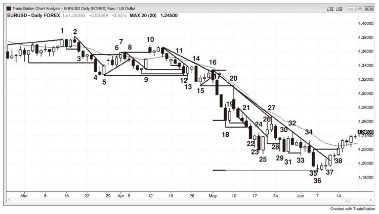
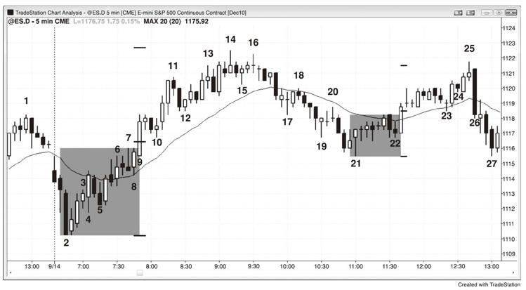
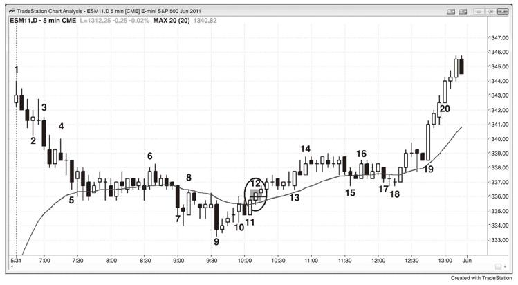

# 第2章　突破力度的表现
突破成功的最低标准是，交易者可以在突破时入场，至少赚到刮头皮的盈利。最强的突破将引发强劲趋势，可以持续数十根K线。有一些早期迹象会提高突破足够强劲而实现一段或多段等距行情的概率。举例而言，上行突破具有的下列特点越多，其突破力度就越强：

●　突破K线具有大型的上涨趋势实体，其影线小或没有影线。K线越大，突破越可能成功。

●　如果其交易量为近期K线的平均交易量的10至20倍，出现后续买盘和等距上涨的机会提高。

●　急速拉升前行足够远，持续多根K线，突破数个阻力位，如移动平均线、前期波段高点和趋势线，每一次都突破很多跳点。

●　在突破的第一根K线的形成过程中，其大多数时间都处于高位附近，回调的幅度小（小于正在形成的K线长度的四分之一）。

●　有一种急迫感。你感觉你需要买入，但是你想要回调，而其从未出现。

●　接下来的两三根K线也有上涨实体，其至少为近期上涨或下跌实体的平均大小。即便该实体相对较小且影线突出，但是只要后续K线（最初突破K线的下一根K线）较长，趋势持续的几率就较大。

●　急速拉升扩大到5至10根K线，期间不出现超过1根K线的回调。

●　当上行突破越过一个重要的前期波段高点后，市场在高点之上的行情足够远，刮头皮者可以在波段高点上方一个跳点处停损买入而获利。

●　急速拉升中有一根或多根K线的低点处于前一根K线的收盘价或其下方一个跳点处。

●　急速拉升中有一根或多根K线的开盘价高于前一根K线的收盘价。

●　急速拉升中有一根或多根K线收于其高点或高点下方一个跳点处。

●　上涨趋势K线后一根K线的低点处于或高于上涨趋势K线前一根K线的高点，形成一个微型缺口，这是强势的表现。这些缺口有时候成为测量缺口。尽管这对交易的意义不大，但是它们很可能代表了较小时间框架下的艾略特波浪一浪高点和四浪回调之间的间距，其可以碰触但不可交叠。

●　大环境决定突破很可能成功，如回调后的趋势恢复，或者是市场强势突破下降趋势线后对下跌低点进行更高低点或更低低点的测试。

●　市场近期出现多个强势上涨趋势日。

●　交易区间中的买压加强，表现为很多大型上涨趋势K线，并且区间内的上涨趋势K线明显比下跌趋势K线更为显著。

●　首次回调发生在突破后的三根或更多K线之后。

●　首次回调仅持续一两根K线，并且其下一根K线不是强势下跌反转K线。

●　首次回调并不触及突破点，也不触发盈亏平衡处的止损（入场价）。

●　突破反转了最近很多根K线的收盘价和高点。举例而言，当一个下行通道中出现一根大型上涨趋势K线时，该突破K线的高点和收盘价高于最近5至20根或更多K线的高点和收盘价。大量K线被上涨K线的收盘价反转要比相同数量的K线被上涨K线的高点反转更为强势。

上行突破具有的下列特点越多，其就越可能失败并导致交易区间或趋势反转：

●　突破K线具有较短或平均长度的上涨趋势实体，在顶部有长影线。

●　下一根K线有下跌实体，其或者是一根下跌反转K线，或者是一根下跌孕线。该K线收于低点或低点附近，其实体约为突破前K线实体的平均大小（并非只有一个跳点的下跌实体）。

●　大环境决定不太可能突破，如测试交易区间日高点的一轮上涨，该上涨行情中出现下跌K线，很多K线交叠，K线的影线突出，以及沿途出现数次回调。

●　市场已经多日处于交易区间。

●　突破后一根K线是强势下跌反转K线或下跌孕线。

●　上涨趋势K线后一根K线的低点低于上涨趋势K线前一根K线的高点。

●　首次回调出现在反转后两根K线。

●　回调持续多根K线。

●　回调后的趋势恢复停顿，市场以下跌信号K线形成更低的高点。

●　急速拉升向上突破阻力位，如波段高点、下降趋势线或上行趋势通道线，但仅仅突破一个跳点左右就反转下跌。

●　急速拉升勉强突破一个单独的阻力位，但是在向上突破较高一点的其他阻力位之前就回调。

●　在前期波段高点上方停损买入的交易者无法在回调出现之前刮头皮获利。

●　在突破K线的形成过程中，其回撤幅度超过该K线的三分之二。

●　在突破K线的形成过程中，其回撤幅度至少超过该K线三分之一的情况发生两次或更多。

●　回调跌破突破点。任何一根K线的低点和两根K线之前的K线的高点之间都没有缺口。

●　回调跌破急速拉升中的第一根K线的低点。

●　回调触发盈亏平衡处的止损。

●　有一种疑惑感。你不确定突破将成功与否。

对于下行突破，上述过程完全相反。下行突破具有的下列特点越多，突破的力度就越强：

●　突破K线具有大型的下跌趋势实体，其影线小或没有影线。K线越大，突破越可能成功。

●　如果其交易量为近期K线的平均交易量的10至20倍，出现后续卖盘和等距下跌的机会提高。

●　急速下挫前行足够远，持续多根K线，突破数个支撑位，如移动平均线、前期波段低点和趋势线，每一次都突破很多跳点。

●　在突破的第一根K线的形成过程中，其大多数时间都处于低点附近，回调的幅度小（小于正在形成的K线长度的四分之一）。

●　有一种急迫感。你感觉你需要卖出，但是你想要回调，而其从未出现。

●　接下来的两三根K线也有下跌实体，其至少为近期上涨或下跌实体的平均大小。即便该实体相对较小且影线突出，但是只要后续K线（最初突破K线的下一根K线）较长，趋势持续的几率就较大。

●　急速下挫扩大到5至10根K线，期间不出现超过1根K线的回调。

●　当下行突破跌破一个重要的前期波段低点后，市场在低点之下的行情足够远，刮头皮者可以在波段低点下方一个跳点处停损卖空而获利。

●　急速下挫中有一根或多根K线的高点处于前一根K线的收盘价或其上方一个跳点处。

●　急速下挫中有一根或多根K线的开盘价低于前一根K线的收盘价。

●　急速下挫中有一根或多根K线收于其低点或低点上方一个跳点处。

●　下跌趋势K线后一根K线的高点处于或低于下跌趋势K线前一根K线的低点，形成一个微型缺口，这是强势的表现。这些缺口有时候成为测量缺口。尽管这对交易的意义不大，但是它们很可能代表了较小时间框架下的艾略特波浪一浪高点和四浪回调之间的间距，其可以碰触但不可交叠。

●　大环境决定突破很可能成功，如回调后的趋势恢复，或者是市场强势突破上升趋势线后对上涨低点进行更低高点或更高高点的测试。

●　市场近期出现多个强势下跌趋势日。

●　交易区间中的卖压加强，表现为很多大型下跌趋势K线，并且区间内的下跌趋势K线明显比上涨趋势K线更为显著。

●　首次回调发生在突破后的三根或更多K线之后。

●　首次回调仅持续一两根K线，并且其下一根K线不是强势上涨反转K线。

●　首次回调并不触及突破点，也不触发盈亏平衡处的止损（入场价）。

●　突破反转了最近很多根K线的收盘价和低点。举例而言，当一个上行通道中出现一根大型下跌趋势K线时，该突破K线的低点和收盘价低于最近5至20根或更多K线的低点和收盘价。大量K线被下跌K线的收盘价反转要比相同数量的K线被下跌K线的低点反转更为强势。

下行突破具有的下列特点越多，其就越可能失败并导致交易区间或趋势反转：

●　突破K线具有较短或平均长度的下跌趋势实体，在底部有长影线。

●　下一根K线有上涨实体，或者是一根上涨反转K线，或者是一根上涨孕线。该K线收于高点或高点附近，其实体约为突破前K线实体的平均大小（并非只有一个跳点的上涨实体）。

●　大环境决定不太可能突破，如测试交易区间日低点的一轮下跌，该下跌行情中出现上涨K线，很多K线交叠，K线的影线突出，以及沿途出现数次回调。

●　市场已经多日处于交易区间。

●　突破后一根K线是强势上涨反转K线或上涨孕线。

●　下跌趋势K线后一根K线的高点高于下跌趋势K线前一根K线的低点。

●　首次回调出现在反转后两根K线。

●　回调持续多根K线。

●　回调后的趋势恢复停顿，市场以上涨信号K线形成更高的低点。

●　急速下挫向下突破支撑位，如波段低点、上升趋势线或上行趋势通道线，但仅仅突破一个跳点左右就反转上涨。

●　急速下挫勉强突破一个单独的支撑位，但是在向下突破较低一点的其他支撑位之前就回调。

●　在前期波段低点下方停损卖出的交易者无法在回调出现之前刮头皮获利。

●　在突破K线的形成过程中，其回撤幅度超过该K线的三分之二。

●　在突破K线的形成过程中，其回撤幅度至少超过该K线三分之一的情况发生两次或更多。

●　回调上涨越过突破点。任何一根K线的高点和两根K线之前的K线的低点之间都没有缺口。

●　回调上涨越过急速下挫中的第一根K线的高点。

●　回调触发盈亏平衡处的止损。

●　有一种疑惑感。你不确定突破将成功与否。

对交易者而言，突破意味着强势和新趋势可能开启。其发生在一段时期的双边市之后，那时候多头和空头均认为市场存在价值并愿意建立仓位。在突破期间，双方都认为市场应该在另一个价位找到价值，突破就是寻找这个新价位的快速行情。市场偏好不确定性，并为此而快速运动。突破是一段确定时期。多头和空头都认为，下行突破中的市场价格太高，或者上行突破中的市场价格太低，并且行情延续的几率通常为60%至70%左右。市场快速运动，寻找一个多空双方均认为有价值发起交易的点位。这意味着不确定性再次出现，没有人知道哪一方将获胜，并成功制造下一个突破。不确定性是交易区间的特征，因此突破是寻找交易区间，寻找不确定性，以及方向概率为50%的等距行情。急速拉升后的通道通常形成后面出现的交易区间的大体顶部和底部。随着市场在通道内上行，等距行情的方向概率降低，当市场运行到通道终点时，反转的概率实际上更大。这是因为交易区间的突破通常会失败，市场回归区间中点是大概率，这里的方向概率为中性。区间的中点是突破的目标位，其位置在区间形成之前无法得知。

突破以一根趋势K线开启，其可大可小，但是通常相对于近期K线来说较大一些。记住，所有的趋势K线均应被看作是突破、急速、缺口和高潮。当其较小时，很容易忽视其重要性，但是如果其后跟随着一些横向盘整的价格行为，然后出现一轮稳定的趋势行情，那么突破就在进行之中。最容易识别的突破是，一根非同寻常的大型趋势K线让市场快速冲出交易区间，并且在同一方向上很快有其他趋势K线跟随出现。不管突破是单根趋势K线还是一系列趋势K线，其总是一轮急速行情。如前所述，几乎所有的趋势都可以被认为是某种形式的急速与通道趋势（Spike
and Channel
Trend）。举例而言，如果有一根上涨趋势K线强势收盘，其后面的数根K线同样也强势收盘，其影线很小或不存在，高点和低点依次抬高（无回调K线），并且连续上涨趋势K线的实体之间很少重叠，那么在市场反转跌破突破行情的起点之前，其很可能会在某一时刻高于现价。如果趋势持续，最终其动能将放缓，通常会形成某种类型的通道。

交易中的最重要概念之一是大多数突破都会失败。鉴于此，在每一次突破时都追突破是一个输钱策略。不过经常会有一些价格行为事件提高突破的成功率。举例而言，在一轮强劲的下跌趋势中，市场以两腿行情上涨至移动平均线，在这个熊旗向下突破时卖空就是一个明智选择。然而，如果市场没有趋势，很多K线重叠，还有很多K线具有长影线，市场就处于平衡。多头和空头均有意建仓，交易区间就此形成。如果市场出现一根强劲的上涨趋势K线，其延伸至交易区间的顶部，甚至冲到交易区间的上方，乐意在区间中点卖空的空头在这个更好的价位将更加激进地卖空。同时，在交易区间中点乐意买入的多头对追高开始变得犹豫，反而会在区间的顶部快速平仓。多空双方的这种行为将在区间中点形成磁场引力，其结果是大多数交易将发生在区间中点。即便市场成功突破并完成基于区间高度的等距行情，磁场引力依然倾向于将市场拉回区间。这就是最终旗形反转如此可靠的原因。

查看任何一张图表，你将发现很多上涨和下跌的趋势K线具有相对较大的实体和较短的影线。其每一根K线都在试图突破，但是几乎所有的尝试都未能引发趋势，而交易区间则持续。在5分钟的Emini图表上，这很可能代表买卖程序试图推动市场。有一些算法被设计为淡出（fade）此类趋势K线，预期其大多数将失败。如果交易老手认为突破很可能会失败，他们也会这样做。举例而言，如果出现一个大型上涨趋势K线形式的突破，这些程序可能会在该K线的收盘价、高点上方、后面一两根K线的收盘价或其低点下方卖空。如果足够多的实盘程序加入淡出阵营（卖方），它们将压过那些试图发起上涨趋势的程序，交易区间将持续。最终会有一个突破将成功。突破K线将很长，K线形成过程中的回调将很小，突破在接下来的多根K线中会有良好的后续。试图淡出的程序失败，它们将回补空头，进一步推动趋势。强势行情将吸引其他趋势交易者，其中很多人是动能交易者，他们看到动能就会迅速介入。

一旦所有人都确信市场现在处于上涨趋势，其在回调出现之前可能会前行很远。为什么会这样？考虑这样一个案例：由三根强势上涨趋势K线构成的急速拉升让市场突破进入强劲的上涨趋势。交易者相信市场很快就会走高，但他们并不确定市场能否在接下来几根K线中走低。这导致空头回补，进一步推高市场。仓位不足的多头相信市场将在短期内走高，他们认为相对于等待8至10个跳点的回调或在市场回调至移动平均线时买入，现在直接以市价买入或在两三个跳点的回调中买入将赚更多的钱。这也推高市场。既然多头和空头实际上都在市场走高中买入，回调从未出现，至少在市场远远高于现价之前不会出现5根K线以上的回调。

在第八章中有详尽探讨。在突破中，交易者愿意在任一时刻以市价买入，因为他们相信赚取至少与其风险一样大的盈利的概率高于50%。当突破强劲的时候，其成功概率往往有60%至70%，甚至可能更高。在Emini的5分钟图上，当急速拉升的顶部比底部高4个点时，如果他们在高位买入，那是因为他们相信市场有60%或更高的概率在触及其4个点的止损之前先上涨4个点。你怎么能确定？因为如果你的风险与回报等同，而成功率却低于60%，那么其在数学上就是不明智的选择，机构也就不会做这笔交易。既然市场依然在上涨，那就说明机构在做这个交易。鉴于只要市场维持在急速拉升的底部上方，这笔交易就依然有效，因此他们承担市场跌至急速拉升底部的风险。他们知道急速拉升通常完成一段等距行情，因此其盈利目标，即他们的回报，与其风险相等。如果急速拉升在停顿之前又扩大两个点，那么其长度就是6个点。如果急速拉升就此结束，他们会假设市场有约60%的概率在下跌6个点之前先上涨6个点。这意味着所有在低位买入的多头有60%的几率看到市场在触及其4个点的止损之前再上涨6个点。举例而言，在急速拉升的长度为4个点时买入的多头，现在在一笔胜率为60%的赌注上承担4个点的损失风险来博取8个点的盈利，这在数学上是个好机会。他们预期市场有60%的几率测试急速拉升至终点的上方6个点处，即他们入场价的上方两个点处，为他们提供8个点的盈利目标。

当突破成功并引发趋势的时候，其动能在最初的快速行情之后放缓，双边交易的迹象开始显现，如K线重叠，影线越来越长，反方向的趋势K线和回调K线。尽管趋势可能持续很长时间，但是这一段趋势通常会被回撤，成为交易区间的一部分。举例而言，在一个急速与通道的上涨趋势形态中，急速拉升是突破，通道通常成为交易区间的第一腿，因此经常被回撤。一般情况下，市场最终会一路回调至通道起点，完成正在形成的交易区间的第二腿。在那个上行突破的案例中，市场通常会试图在支撑位反弹。这产生一个双重底牛旗，有时候会引发市场向上突破新的区间，另一些时候则演变成一个持久的交易区间，如窄幅交易区间或三角形。少数时候引发反转。

在Emini的5分钟图上，通常每天都会有多次试图突破，但是其大多数在一两根趋势K线后失败。他们很可能代表一些机构的程序交易启动，但是被其他机构的反向程序压过。当足够多的机构程序在同一时间交易相同方向时，他们的程序将把市场推至一个新的价位，突破就会成功。不过事无绝对，即便是最强势的突破也在约30%的时候失败。

当突破非常强势的时候，会出现三根或更多的趋势K线，其影线小且很少交叠。这意味着交易者并没有等待重大回调。他们担心市场在前行很远之前不会出现回调，而他们想要确定至少抓住一部分趋势。他们会以市价买入，或者在一两个跳点的微幅回调中买入，他们的持续买盘会加强趋势，阻碍重大回调的形成。

突破K线通常具有高成交量，有时候其成交量将是普通K线的10至20倍。成交量越高，以及急速拉升的K线越多，出现重大后续行情的几率就越高。在突破之前，多头和空头均在分批建仓，争夺市场的控制权，双方均试图在各自方向成功突破。一旦出现明确的突破，输的一方会很快斩仓止损，而赢的一方甚至会更为激进地加仓。结果是一根或多根趋势K线，通常伴有高成交量。成交量并非总是特别高，但是当其为近期K线平均水平的10倍或更高时，成功突破的概率就更高。成功突破指的是拥有多根后续K线。此外，在几根K线之内失败的突破也可能伴有非比寻常的高成交量，但是这种情况较不常见。成交量的可靠性不足以指导决策，而构成急速拉升的大型趋势K线已经告诉你突破是否很可能会成功。试图将成交量纳入考虑，更多时候会让你分心，妨碍你发挥最佳水平。

所有的成功突破都应被看作是急速行情，因为通常其后是通道，形成一个急速与通道的趋势形态。然而，突破也可能会失败，如果其之前的交易区间是趋势中的旗形，那么它就成为最终旗形。实际上大多数突破确实都失败，只是突破K线太过平凡，以至于大多数交易者甚至都没意识到市场曾经试图突破。较不常见的情况是，市场在突破后进入一个窄幅交易区间，通常之后是趋势恢复，但有时候窄幅交易区间也可能向另一方向突破，导致趋势反转。

突破可以是单独一根大型趋势K线或一系列的大小趋势K线，突破通常会成为我们之前所探讨过的趋势形态中的一部分。举例而言，如果有一轮开盘下跌趋势，其很可能是市场向下突破前一天的某个形态。如果趋势有序，其后很可能出现一个持续数个小时的窄幅交易区间，然后这一天可能在收盘时恢复下跌趋势。如果突破加速下行，每一根K线都形成更加陡峭的斜率，走势图呈抛物线状而形似抛售高潮，那么之后很可能出现回调，然后形成一个通道。这一天可能变成一个急剧与通道的下跌趋势日。

有时候，当市场在强劲趋势中持续了很多根K线之后，其在趋势的方向形成一根非比寻常的大型趋势K线。一般来说，这根大型K线或者是突破进入更陡峭也更强劲的趋势，或者至少成为趋势中的另一腿，另外还可能预示着趋势的高潮性终结。如果市场回调几根K线，并且对突破K线的回撤幅度不大，突破成功的几率较高。如果其为上行突破，交易者会在高1突破回调中入场（或者在下行突破的低1卖空）。

即便回调跌至突破点的下方，趋势依然可能持续。不过回调越深，突破失败和市场反转的概率就越高。在这一案例中，大型K线将代表趋势的高潮性终结而非突破。如果回调幅度的很深，交易者可能在短期内（1个小时左右）犹豫是否再次入场。举例而言，如果有一根大型上涨趋势K线向上突破一个波段高点或交易区间，但是回调的幅度很深，可能跌至波段高点的顶部略下方，交易者将无法确定这是突破失败还是上涨过度。这种情况下的多头通常不会在10根K线左右之内买入，市场经常会进入一个小型交易区间。相对于在高1买入，他们很可能会选择等待高2，尤其是当其在1个小时后形成时。如果交易区间保持在移动平均线之上并持续约1个小时，多头将会在两腿式的盘整下跌回调中买入。有时候盘整行情后出现第二腿下跌。那第二腿可能引发市场创下新高，或者趋势反转和更多抛盘。

一旦出现回调，即小型交易区间，交易者就希望趋势恢复。回调中的突破的最初目标是基于交易区间长度的等距行情。很多交易者会在那个区域部分止盈或全部止盈，激进的逆势交易者将建立新仓位。

最容易识别的突破失败是这种情况：市场迅速反转而没有试图延续突破的方向。其更可能发生在有其他证明表明可能出现反转的时候，如市场向上突破趋势通道线后以一根强势信号K线反转下跌。

突破可以是任何事情，如一根趋势线，一个交易区间，以及当日或昨日的高点或低点。是什么无所谓，因为交易方法都一样。如果突破失败，那就淡出交易；如果反转失败并成为突破回调，那就在突破的方向再次交易。只有突破非常强劲时才在突破中入场。一个案例是，强劲上涨趋势中出现一轮双K回调，形成一个高1买入的建仓形态。交易者可以在前一根K线的高点上方一个跳点处买入，他们还可以在前高点上方一个跳点处设置停损买入订单，在市场突破创下新高的过程中加仓。不过，通常在回调中买入好于在突破失败时卖空。

大多数时候，交易者将新的波段高点和低点作为潜在的淡出建仓形态。不过在强劲的趋势日，突破通常带有巨量，其回调幅度非常小，即便是在1分钟图上。很明显趋势交易者掌控市场。举例而言，如果一轮上涨趋势如此强劲，价格行为交易者会在高1和高2回调买入，而不是等待市场向上突破趋势中的前一个高点。他们总是试图将交易的风险最小化。然而，一旦强劲的趋势出现，以任何理由参与趋势都是好的交易。在强劲趋势中，每一个跳点都是顺势入场点，因此你可以在任意点位以市价入场，并使用合理的止损。

如果出现一个大型趋势K线的突破，且该K线尚未结束，你需要做一个决策。如果你刚刚刮头皮平掉部分仓位，而现在想要将剩余仓位做波段交易，总是要考虑一下你承担多少风险。有一个方法可以帮助你决定是否应该继续拿住波段仓位，那就是问一下你自己，如果你现在空仓的话会怎么做。如果你愿意按照波段交易的仓位和保护性止损以市价入场，那么你就应该保留现在的波段仓位。反之，如果你认为现在以市价入场的风险过大，那么你就应该以市价平掉波段仓位。

当出现突破的时候，多空双方均将其看作机遇。举例而言，如果市场创下一个波段高点后回调，多空双方均会在市场上涨越过这个前期波段高点时入场。多头会买突破，因为他们将其看作是强势的表现，他们相信市场会在其入场点上方前行足够远，让他们可以获利离场。空头也会将突破看作赚钱的机会。举例而言，空头可能会用限价订单在前期高点或其上方几个跳点处卖空。如果市场反转并下行，他们会找机会获利离场。然而，如果市场持续上涨，而他们认为市场可能回调并测试突破点，那么他们就会找机会加仓做空。由于大多数回调都会一路跌至前期的波段高点位置，他们可以在突破测试中平仓，在第一个仓位上盈亏平衡，在第二个从较高点位入场的仓位上盈利。

当交易者想到突破的时候，通常立即出现交易区间的画面。然而，突破可以是任何事情。很多交易者经常会忽视的一种突破是，旗形向意料之外的方向突破，如熊旗向上突破顶部或者牛旗向下突破底部。举例而言，在一轮较为强劲的下跌趋势中，交易者不知道是否有一个可交易的低点，他们看到一个熊旗正在形成，他们可能开始在前一根K线的低点下方买入，预计低1和低2甚至低3会失败。有时候熊旗的形状标准，触发低2卖空或楔形熊旗卖空，但是市场立即反转形成一两根上涨趋势K线。这种突破通常会形成一个测量缺口，引发一段等距上涨。交易者会在突破中和任何小幅回调中入场。由于空头被套（Trapped），在市场出现至少两腿上涨之前，他们不太可能急于再次卖空。上涨趋势中的牛旗与此相反。

有一种特别类型的突破偶尔发生在趋势日的最后一个小时。举例而言，如果市场趋势下行，且没有回调迹象，可能会出现一两根大型下跌趋势K线向下突破下行通道的底部。或许会有一轮小幅回调，然后第二次突破创下新低。其他时候，市场在收盘之际只是不断下跌，而不出现大型下跌趋势K线。在这两个案例中可能发生的情况是，交易公司的风险管理官告诉其交易员抄底做错了方向，他们需要以市价平仓。这种下挫通常没有很多后续行情，因为其大多数是被迫卖出所致。很可能有一些聪明的程序员预料到了这一点，他们设计了短暂做空的程序来把握机会，其加剧了抛售高潮的规模。动能程序也参与强劲趋势。在一两轮抛售高潮之后，当日收盘之前可能会有反弹，也可能没有。以强势急速拉升或通道而结束的交易日的情况与此相反。风险管理官正在告诉其交易员在收盘前买回亏损的空仓，随着市场快速上涨，动能程序检测到信号，只要动能持续其就不断买入。

交易者的一个目标是追随机构。很多突破由大型趋势K线构成，其拥有当日最高的成交量。这是机构交易最多的时候，他们这样做是因为他们预期行情会长久持续。尽管交易者在大型突破中容易胆怯和冲动，但机构将其看作好机会。正如交易量所展示的，你也应该如此。尝试学会交易突破，因为它们具有优异的交易者等式。如果有必要，可以交易四分之一仓位（不在意的规模），仅为积累经验。行情通常足够大，你可以赚到跟平时全仓交易时一样大的盈利。

在任何一张走势图上，每隔几根K线就会出某种形式的突破，如图2.1的欧元/美元日线图所示。严格来说，如果一根K线的高点高于之前任何一根K线的高点，或者低点低于之前任何一根K线的低点，其就是对那根K线的突破。同时，所有的趋势K线都是突破。图上标示了很多不同类型的突破和失败。

图2.1　每天都有很多突破发生

K线1向上突破趋势通道线，但是其下一根K线向下突破其低点，形成一个双K线反转，由K线3的入场K线触发。K线2是市场第二次试图向上突破上行通道，并且其向上突破了另一个双K线的反转，但是突破通道失败，市场反转下行。

K线4向下突破波段低点，它是一轮始于K线2的抛售高潮中的第六根K线。由于该K线的区间较大且影线很小，其可能代表抛售高潮需要调整后才会出现后续抛售。结果确实如此，因为K线5是一根强势上涨反转K线，将K线4变成失败的突破。

市场以两腿行情回调至移动平均线，K线8突破熊旗。

K线9向上突破下降趋势线。

K线10向上突破波段高点，但是当下一根K线跌破其低点时，突破失败。

K线12跌破K线9入场K线及其前一根信号K线。

K线13试图反转上涨并形成失败的（下行）突破，但是K线14的反转下跌让其失败。K线14也是市场向上突破微型趋势线和上涨反转K线失败后的反转下跌。当失败的突破未能反转市场时，其成为突破回调。

K线16向上突破下降趋势线失败，该K线反转下跌成为一个外吞下跌反转（Outside
Down Reversal），跌破前三根K线的熊旗趋势线。

K线16至18形成一个四K线突破，其由实体大、影线小且很少交叠的强势下跌趋势K线构成。在交易区间内分批建仓的多头最终投降，他们不仅停止买入，还要尽快出清其庞大的多仓，而非等待反弹。他们不确定短期内是否会出现反弹，但是他们确定市场将在几根K线内走低。这意味着以市价平仓或者在K线内的小幅回调中平仓是其最佳选择。他们清空多仓，在多根K线内都不会买入，这加剧了抛售行情的强度。当突破如此强劲的时候，其后通常形成一个通道，产生一段等距行情，其长度为急速下挫的第一根K线开盘价至其最后一根K线收盘价的距离。K线36的低点刚刚越过等距行情的目标位，通道以此结束。然后市场通常转为上涨，测试急速下挫后的第一个合理的买入信号，即K线19的上涨孕线高点。如果市场达到那里，其下一步会测试下行通道的起点，即K线20的高点。

K线20试图让四K线突破失败，但是当突破如此强劲的时候，其通常会有后续，让其失败的试图一般也会失败，从而成为突破回调，正如本案例。市场在刚要触及K线15的突破点和移动平均线时就反转下跌。当市场尚未触及阻力位就反转下跌的时候，表明空头非常强势，因为他们并没有等待阻力位被触及。空头担心多头无法将市场推到阻力位，因此将限价订单设在其略下方。这是空头迫切的表现。突破点（K线15下方）和突破回调（K线20高点）之间的缺口通常成为测量缺口，其经常是行情的大体中点。下跌趋势的起点是K线2的高点，市场最终在缺口下方的跌幅超过K线2高点与测量缺口中点之间的距离。突破和突破测试时的强势反转下跌确立了下跌趋势非常强劲，交易者在当日剩下的时间里只能寻机做空。或许会有一两次刮头皮做多的机会，但是当市场跌破前一根K线的低点、显示小幅回调可能正在结束时，交易者需要能够立即转手做空。顺便说一下，艾略特波浪交易者将回调看作4浪顶部，将突破点看作1浪底部。如果其中间的下跌行情是3浪，那么这两者之间不能交叠。3浪通常是趋势中的最强一浪。

K线22是一根大型区间下跌K线，向下突破了四K线通道的底部。其可以被认为是第三轮连续抛售高潮（第一轮是K线14，第二轮是下跌至K线18的四K线急速下挫）。在经历两三轮连续的高潮行情后，市场通常会出现至少10根K线的两腿式调整。然而这里的情况是，那一轮四K线急速下挫是当日的主导特征，是一个强劲突破的起点。是的，它是一轮急速下挫，因此也是一轮抛售高潮，但是其规模如此之大，市场的特点因此而改变，任何数线都要重新开始。一旦其形成，交易者就会认为市场将出现一轮强势下跌，而通道是强势急速行情后的最常见形态。通道在调整之前通常有三段行情（Three
Pushes），这一次也不例外。三段行情为K线18、25和36，之后市场以弱势上涨收盘。

K线22是一轮抛售高潮，其过靶（Overshoot）三K线下行通道的底部。其后面的K线23试图反转市场。然而，在大图景如此空头的情况下，仅仅根据这几根K线而做多是一个错误。市场总是试图反转趋势，当筑底形态实时发生时，很容易受到情绪影响；但是永远都不要忽视大图景。四K线的急速下挫非常强劲，始终入场头寸依然是空头。此时底部的任何试图几乎都会形成熊旗，正如本例。市场总是具有惯性，当其处于趋势时，预期所有的反转试图都会失败。

在市场向下突破K线20至21的通道之后，K线25是第二次试图反转上涨。鉴于两次反转试图的信号K线均有强劲的上涨实体，市场可能会测试移动平均线。大多数交易者都不应该做这笔交易，反而应该保持做空。因为有太多时候，交易者逆势刮头皮而赚取一个点，但是没有及时反手做空，从而错过在顺势交易中赚取四个点或更多的机会。如果你刚刚才做多，现在要迅速改变思维而反手做空会很难，如果对此不能做到轻车熟路，那就不要逆势刮头皮，从而错过波段下跌。

K线26向上突破通道顶部，符合预期。

K线27向上突破下降趋势线和K线18的突破点，但是其未能成功而在下一根K线反转下跌。

K线28突破一个三K线熊旗。

K线29向下突破K线26的多头入场K线，但是出现买盘，表现为长影线。

K线32再一次测试下降趋势线，因此是一次突破尝试，但是以失败告终。

K线35是另一根大型下跌趋势K线，因此也可能是另一轮抛售高潮。如果市场在短期内出现第二次和第三次抛售高潮，其很可能出现至少两腿调整的反转。

K线36向下突破等距行情的目标位，但是并未出现抛盘，反而交投淡静，可能显示K线22至34的熊旗突破失败。长期下跌趋势后的水平熊旗经常成为最终旗形，后面一般至少出现两腿行情的盘整上涨（Sidewaysto
Up）。K线36也是下行通道中的第三段下跌，其通常引发至少一次反转试图。

K线36后的K线向上突破K线36的高点，成为多头的入场K线。

K线37向上突破下降趋势线。

K线38向上突破K线35的强势下跌趋势K线，这根K线的上方必定有空头的大量止损买入订单，因为其大型下跌实体代表了强势抛售。一旦市场上涨越过其高点，很多空头会判定市场不再有足够的力量继续做空，他们在收盘前买回空仓（空头回补）。

有时候旗形可以向意料之外的方向突破，并引发等距行情。在图2.2中，一个失败的楔形熊旗在K线9向上突破。K线7突破点和K线10突破测试之间的测量缺口引发一段近乎完美的等距上涨。

图2.2　旗形可以向概率较小的方向突破

K线3是一个低1卖空建仓形态，但是在三个强势上涨实体和K线2的抛售高潮之后，其很可能会失败。激进的交易者会在K线3的低点或其下方用限价买入订单做多。K线5是低2卖空的入场K线，但是在强劲的K线4外吞上涨K线之后，市场可能正在确立当日低点。同样，激进的交易者会在低2信号K线的低点或其下方做多。K线7是楔形熊旗卖空的信号K线，但是市场处于上行通道，并且K线4的外吞上涨K线使得始终入场头寸做多。空头不应在K线7的下方卖空，而是应该先等待观察市场是否形成更低的高点。多头在K线8的上方做多，预计会出现一段失败的楔形熊旗的等距上涨。

然后在K线22的上方出现一个失败的低2熊旗买入建仓形态，入场K线是一根上涨趋势K线。该突破同样引发一段等距上涨。K线21是上涨日中的下行通道底部，K线22是通道突破后的突破回调，因此敏锐的交易者认为低2失败并引发市场测试当日高点的概率非常高。

K线26的低点反转了过去12根K线的低点（其低于这些低点）和过去13根K线的收盘价。其收盘价同样反转了这些K线的低点，这一点很重要，因为收盘价低于前低比低点低于前低更为强势（空头趋势）。被反转的低点和收盘价越多，反转的力量就越强。在之前12根K线买入的所有交易者现在都持有亏损的仓位，他们会寻找任何小幅反弹而出清多仓。很多人在下一根K线卖出，导致了该K线顶部的影线。同时，至少在多根K线之内，这些多头也不太可能想要再次买入。

如图2.3所示，尽管像K线3和19这样的大型突破K线经常引发大趋势，但是有时候像K线12这样的小型突破K线也可以是一段持久行情的起点。在K线9的急速下挫后，交易者好奇涨至K线11的行情是否会成为在移动平均线处的低2熊旗（K线10和11是两段上涨）。然而，市场并没有向下突破，而是向上突破了K线10和11的双重顶（这使得上涨行情成为最终旗形，因为它是下跌趋势中的最后一个旗形，尽管其从未向下突破）。虽然K线12的突破K线较小，但是足以让交易抛弃涨至K线11的行情是熊旗的概念，他们开始猜测K线9是否是一轮抛售高潮，其可能调整10根或更多K线。K线12后的K线同样很小，但是有两个强势的信号：上涨的实体和高于K线11高点（突破点）的低点。尽管涨到K线14的行情并没有覆盖很多点数，但是其持续上涨，成为两腿上涨中的第一腿（第二腿从K线18和15构成的双重底及由K线13、15和18的低点构成的三角形开始）。

图2.3　小型突破K线