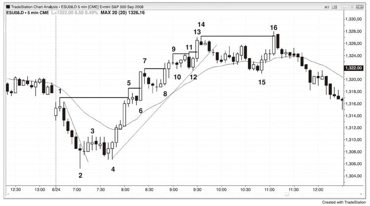
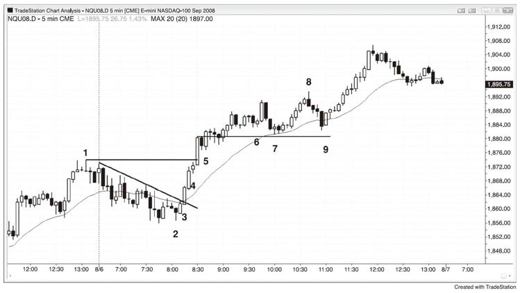

# 第4章　现行强劲趋势中的突破入场
当趋势强劲并出现回调时，每一次突破前期极点（高点或低点）都是有效的顺势入场点。突破通常伴有高成交量，大型突破K线（强劲趋势K线），以及持续数根K线的后续行情。聪明的资金显然正在介入突破。然而这一般不是交易突破的最佳方法，价格行为交易者几乎总是找到更早的价格行为入场点，如上涨趋势中的高1或高2。认识到这一点很重要：当一轮趋势强劲的时候，如果你使用恰当的止损，你可以在任何时候入场而获利。当交易者看到一轮趋势强劲的时候，一些交易者并不会在第一个入场点入场，因为他们期待更深幅度的回调，如市场以两腿行情回调至移动平均线。举例而言，如果市场刚刚转变为多头，最初的急速拉升中有三根短影线的大型上涨趋势K线，交易者可能担心行情进入高潮，从而决定等待高2建仓形态。然而当趋势如此强劲的时候，最初的几个入场点通常只是高1买入建仓形态。激进的交易者将在前一根K线的低点下方设置限价买入订单，预计任何反转试图都将失败。一旦市场跌破前一根K线的低点，他们会预期高1建仓形态将至少导致市场创出新高并很可能实现等距上涨，其长度为急速拉升的高度。如果交易者未能把握这两个早期入场点的任意一个，他们应该加强训练，以确保能够介入这种强劲趋势。当他们看到回调开始的时候，他们应该在急速拉升的高点上方一个跳点处设置停损买入订单，以防止回调只持续一根K线而快速反转。如果他们未能把握住早期回调入场点的任何一个，市场开始离他们远去，他们也将被动入场而不被落下。在最强势的交易中，你通常会看到向上突破急速拉升的K线通常是一根大型趋势K线，这告诉你有很多强势多头认为买新高有价值。如果对他们来说这是一个好的入场，对你来说也是如此。

一个快速检验趋势强度的方法是，看一下它在突破前期趋势极点时如何反应。举例而言，如果一轮上涨趋势出现回调，然后向上突破当日高点，突破时有更多买家还是卖家？如果市场上行足够远，至少可以让突破的买家刮头皮获利，那么突破时的买家多于卖家。这是强劲趋势的标志之一。相反的，如果市场创下一个新的波段高点，然后在一两根K线之内反转下跌，那么突破时的卖家就多于买家，这更像是交易区间的特点，市场可能正在进入交易区间。观察市场在新高的表现，这是强劲趋势是否依然有效的线索。如果为否，尽管趋势可能依然有效，但是其强度削弱，多头应该在新的极点止盈，甚至寻求做空，而不是在突破创下新高时买入，或者准备在小幅回调中买入。下跌趋势中的情况如此相反。

总体而言，如果你在新的极点处以停损订单入场，你的大多数或全部交易都应该是刮头皮，除非趋势尤为强劲。如果确实如此，你可以用大部分或全部仓位做波段交易。举例而言，如果市场处于强劲的上涨趋势，多头将在最近高点的上方用停损订单买入，但是大多数会刮头皮离场。如果市场极为强势，他们可能将大部分仓位做波段交易。如果不是，空头将在每一个新的波段高点处卖空，将限价订单设在前期波段高点或其略上方，并且他们会在更高处加仓。如果市场在其第一次入场后下跌，他们会获利离场。如果市场继续上涨，他们预计市场将在数根K线之内回调测试前高，这给他们在第一个入场上以盈亏平衡离场的机会，并在较高价位的入场上获利离场。

如图4.1所示，从K线4的更高低点开始的上涨成为一轮强劲的上涨趋势（趋势线突破后的更高低点），市场以连续7根强劲的上涨趋势K线越过K线1的当日高点。在如此强劲的动能之下，所有人都认同，在市场抛售跌破K线4的上涨趋势起点之前，将首先上涨越过K线5。市场处于始终入场模式，很可能会出现一段等距上涨，其长度为K线4至K线5的急速拉升，或K线1至K线2的开盘区间，因此多头可以以市价买入，在任何回调中买入，在任何K线的低点或其下方买入，在任何回调的高点上方买入，在任何K线的收盘价买入，以及在最近一个波段高点的上方用停损订单买入。

图4.1　强势突破有很多连续的强趋势K线

突破交易者会在每一个前期波段高点的上方买入，如K线5、6、8、11、13和16。到K线5的时候，市场明显处于强劲的多头趋势。激进的多头使用限价订单在前一根K线的低点买入，预期最初回调只持续1根K线左右，市场将在高1反转上涨。在前一根K线的低点下方买入通常要比在高1上方买入获得更低的入场价。如果交易者倾向于使用停损订单入场，并且未在K线5的后一根K线的低点买入，他们会在K线6上涨越过前一根K线时的高1入场买入。如果他们希望市场出现更深幅度的回调，如跌至移动平均线而形成高2，并且他们未能把握住上述两个入场点中的任何一个，他们需要避免错过强劲趋势，永远不应让自己踏空一轮大趋势。解决办法是在K线5急速拉升的高点上方设置最坏情形的停损买入订单。这个入场点较差，但是至少可以让他们介入趋势，其很可能会持续一段基于急速拉升长度的等距上涨。K线6是一根没有影线的大型上涨趋势K线，显示很多多头在同一根K线买入。一旦交易者看到强势多头在突破创下新高时买入，他们应该放心这是一笔好交易。其最初保护性止损位于最近的小型波段低点下方，即K线6前的高1信号K线下方。

在突破回调中（即牛旗），回调交易者在每一种情况下均会提早入场------举例而言，在K线6的高1，K线8的高2，K线10的失败楔形反转，K线12的高2和失败趋势线突破（未显示），K线15的高2测试均线下方（第一个均线缺口K线的买入建仓形态）以及与K线12构成的双重底（此高2基于从K线14开始的更加清晰且幅度更大的两腿下跌）。突破交易者建立多仓的位置恰好是价格行为交易者清空多仓而止盈的位置。总体而言，在很多聪明的交易者卖出的时候买入并不明智。然而当市场强势的时候，你可以在任何价位买入而获利，包括在那个高点上方。不过，买回调的风险/回报比要远胜于买突破。

盲目买突破很愚蠢，聪明的资金不会在K线11的突破买入，因为其有可能是尤其强劲的K线6突破K线导致数线重置并形成第一段上涨后的第三段上涨。同样他们也不会在K线16的突破买入，因为它是市场在趋势线突破后对K线14前高的更高高点测试，趋势反转的风险太大。在突破失败时淡出或在回调后追突破要好得多。当交易者认为一个突破看上去太过疲弱而不能买入的时候，他们经常会在前期高点及其上方做空。

空头可以在市场突破前高时做空并在更高处加仓而赚钱。然后，当市场回测突破的时候，他们可以平掉空仓，在第二个仓位上获利，并在第一个仓位上大体盈亏平衡。如果空头在市场向上突破K线5、7、9和14的时候做空，该策略就会有效。举例而言，当市场从K线7的波段高点回调时，空头可以在此高点或其略上方下单卖空。他们的空单将在K线8成交。在他们认为市场可能再次开始回调时或上方几个点处加仓。他们会尝试用限价订单在其最初入场点（即K线7高点）平掉全部空仓。因为空头在突破测试中买回空仓，而多头在同一区域加仓做多，回调通常会在该价位结束，而市场再次上涨。

K线4的反转上涨是对下跌趋势的最终旗形的突破。有时候最终旗形反转来自更高低点而非更低低点。对前期极点的测试可能过靶也可能不及靶。K线15是上涨趋势的最终旗形终点，K线16的反转始于新的极点（更高高点）。

如图4.2所示，昨日（只显示最后一个小时）是开盘上涨趋势中的一段强劲上涨趋势，因此今日会有足够的后续行情，收盘价高于开盘价的概率较高。即便今日开盘后出现回调，上涨趋势也很可能会至少创下名义新高。交易者都在关注买入建仓形态。

图4.2　强劲趋势通常在第二天有后续

K线2是高4买入建仓形态后的小型更高低点，并与昨日的最终回调构成双重底。信号K线以下跌收盘，但是至少其收盘价高于中点。错过那个入场点的交易者看到市场在接下来两三根K线里形成一轮强势急速拉升，从而判定市场现在处于多头。聪明的交易者至少以市价买入一个小仓位，以防止市场在上涨很多之前都不出现回调。

突破中有两根大型上涨趋势K线，两者均已以强势收盘且影线很小。如果你在K线3收盘时做多，现在你会用部分仓位做波段交易。这意味着如果你空仓，你可以以市价买入同样的仓位，与较早时候买入使用同样的止损。止损位现在应该位于K线3的强势上涨趋势K线下方。

K线4是昨日高点略下方的停顿K线，在其高点上方一个跳点处买入也是一个好的入场。停顿K线是一个可能的反转建仓形态，因此在其高点上方买入就是在先行空头回补空仓的价位做多，这也是在早期平仓的多头买回多仓的位置。

此时，趋势明确且强劲，每一次回调均应买入。

K线6后之后是一个双K线反转，也是第三段上涨。这是一个可以接受的卖空建仓形态，预计市场将回调至移动平均线。

K线8是一个合理的逆势刮头皮交易（突破趋势线后的突破创下新高失败），因为它是一根强势下跌反转K线，也是一个扩散三角形顶部，但是趋势依然向上。注意目前尚未有一根K线收于均线之下，而市场在均线之上已运行20多根K线，这两者都是强势的表现。如果你在考虑做一笔逆势刮头皮交易，只有在趋势反转上涨时你能迅速转身的情况下才做。你不希望平掉多仓，刮头皮卖空，然后错过趋势恢复时的波段上涨。如果你无法从容应对方向转变，那就不要逆势交易，拿稳多仓就好。

K线9是第一次有K线收于均线之下后的上涨孕线，也是一个双K线反转中的第二根K线，因此预计建仓形态向上突破后至少会测试上涨高点。