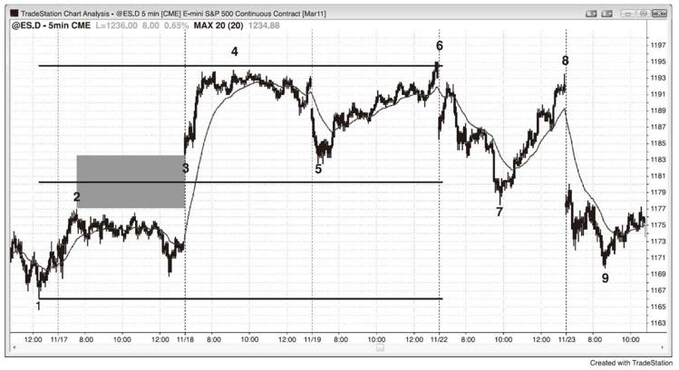
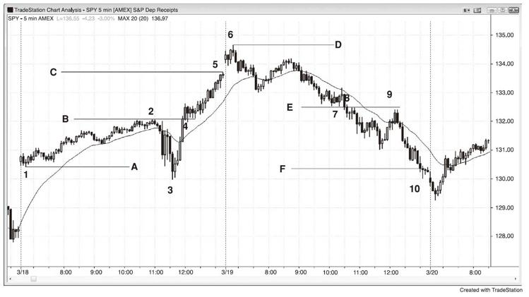
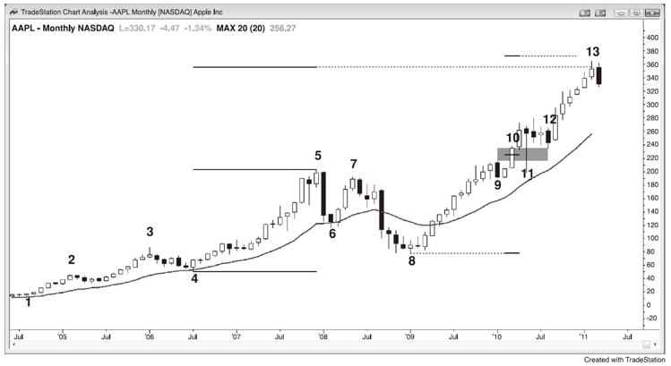
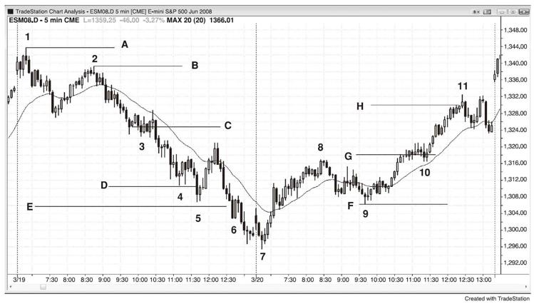
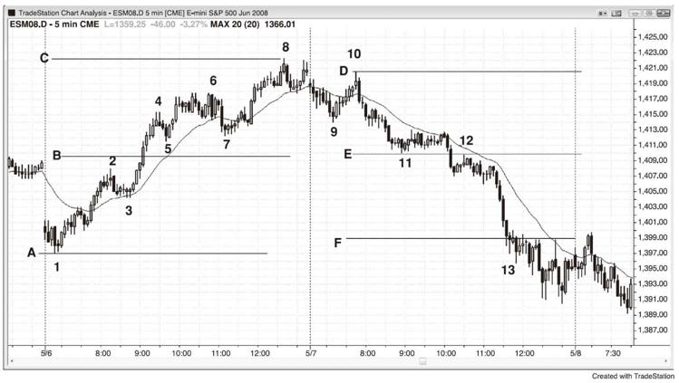

# 第8章　基于缺口和交易区间的等距行情
缺口在日线图上很常见，即一根K线的低点高于前一根K线的高点，或者一根K线的高点低于前一根K线的低点，如果市场的方向确定，缺口的中点通常会成为趋势的中点。随着市场接近最近的等距行情目标，交易者将密切关注确切的目标位，并且经常会在该区域对部分仓位或全部仓位止盈，还有一些交易者将开始建立反向仓位。这通常导致市场停顿、回调或反转。

当突破发生在日内图上时，只有少数时候才会出现这种类型的缺口。不过经常会出现一些东西与其一样可靠，也就是突破点和第一次停顿或回调之间的缺口。举例而言，如果市场向上突破一个波段高点，并且突破的K线是一根相对较大的上涨趋势K线，而下一根K线的低点位于突破点之上，那么其低点和突破点之间就有一个缺口，此缺口经常成为测量缺口。如果突破后的下一根K线也是一根大型上涨趋势K线，那么等待第一根小型上涨趋势K线、下跌趋势K线或十字线，其低点就是缺口的顶部。如果突破点或突破回调不明确，市场则经常会将突破K线的中点作为缺口中点。在这种情况下，等距行情将基于上涨行情的起点至突破K线的中点，然后预计市场将上涨同样距离。

如果市场在突破后的几根K线之内就回调，而回调的低点位于缺口之中，那么缺口现在变小，但其中点依然可以用来寻找等距行情目标。即便市场进一步回调，甚至略微跌破缺口，突破点和回调之间的中点依然可以用于预测。鉴于此时突破回调和突破点之间的差额为负数，因此称之为负值缺口，当等距行情基于负值缺口时，其可靠性降低。

在市场轮廓图中，这些市场运动迅速的日内测量缺口是两个分散区（distribution）之间的清淡区，代表单边市。分散区是"肥"区域，即双边市的交易区间。交易区间是价格认同区，其中点是多空双方所认同的合理价位的中点。缺口同样也是一个认同区，它是多空双方均认为不应该发生交易的区域，其中点就是该区域的中点。在这两个案例中，简单来说，如果这些价位是多空双方认同的价格中点，那么它们大体指出其所处的腿行情的中点。一旦其形成，会将你顺势交易的部分或全部仓位做波段交易。达到目标后，如果有好的建仓形态，考虑逆势交易。大多数交易者以之前的交易区间高度为标准，这样做也可以，因为不论你怎么做，其距离只是近似值（除非你是一名斐波那契或艾略特波浪交易者，拥有不可思议的能力让自己确信市场总是形成完美形态，尽管有压倒性的证据反驳这一点）。要点是只做顺势交易，但是一旦市场抵达等距行情的目标区域，你可以开始逆市交易。然而，只有当前面有一轮逆势行情强到突破趋势线时，才会形成最好的逆势交易。

如果市场在完成等距行情后停顿，那两段强趋势的腿行情可能只是更高时间框架上的一轮调整的终点，如果看起来像是这种情况，那就用部分逆势仓位做波段交易。两腿通常完成一轮行情，该行情之后通常至少是一轮持久的逆势行情，其至少拥有两腿，并且有时候成为一轮新的反向趋势，逆势行情经常会回测突破点。

有时候等距行情分毫不差，但是大多数时候市场过靶或不及靶，这种方法只是帮助你交易市场正确的一边。

缺口中点经常引发等距行情。在图8.1中，Emini在K线3跳空上涨，升至昨日高点K线2上方，并且该缺口中点是上涨行情的潜在中点。交易者计算K线1的上涨底部至缺口中点的距离，然后向上投射。K线4处于目标位的几个跳点之内，但是很多交易者认为，除非市场达到目标位的一个跳点之内，否则Emini上的目标就不算被充分测试，这让交易者有信心在第二天市场开盘后急跌至K线5时买入，当日的高点超过等距行情的目标位两个跳点。市场在下一个交易日抛售至K线7，但是再次上涨测试了等距行情目标的略下方。多头在下一个交易日放弃，形成一个向下的大型缺口，然后又是一轮抛售。一定是有新闻公布，电视上的专家用其解释所有行情，但实际上行情基于数学，新闻只是市场用来做其本来就要做的事情的借口。

图8.1　测量缺口

图8.2中的两个交易日出现了基于交易清淡区（Thin
Area）的等距行情。交易清淡区是突破区域，其K线之间很少交叠。

图8.2　测量缺口

在太平洋标准时间上午11：15，联邦公开市场委员会（FOMC）的报告让市场从K线3大幅上涨，并突破K线2的当日高点。K线4处的旗形以两腿式横盘调整测试了突破，并且在K线2的顶部和K线4的突破测试底部之间形成一个小型负值缺口，用K线4回调的低点减去K线2突破的高点，得出的缺口高度为负数。尽管负值缺口的中点有时候形成完美的等距行情，但是更为常见的情况是，等距行情的终点将等于突破点的顶点（这里是K线2高点）减去最初交易区间的底部（这里是K线1的低点）。你也可以使用K线3的低点来计算等距行情，但是最好是先寻找最近的目标，只有当市场越过较低目标时再考虑更远的目标。市场恰好在当日最后一根K线触及A线（K线1）至B线的等距上涨目标C线，并在下一日开盘时刺破K线3至B线的等距上涨目标D线。尽管K线1高于K线3，但是如果将抛售至K线3的行情看作对K线1的实际行情低点的过靶，其依然可以认为是等距行情的底部。

第二天，在K线7的下方和K线8的上方有一个缺口，其目标线F在收盘前被穿过。另外，在K线8和9处还有一个双重顶熊旗。

如图8.3所示，苹果（APPL）的月线图处于强劲的上涨趋势。每当有一轮趋势，交易者就会寻找可以止盈部分仓位或全部仓位的合理价位，他们通常会关注等距行情。K线13刚好越过基于K线4至K线5的强势上涨的等距上涨目标位。

图8.3　在等距行情的目标位止盈

K线10是一根上涨趋势K线，其向上突破K线9，K线9是市场试图向上突破K线5的回调。每一根趋势K线都是突破K线和缺口K线，这里的K线10起到突破缺口和测量缺口的作用。尽管K线11急速下挫至K线10下方，但是作为一根失败的突破K线，下跌行情不太可能有很多后续，因为信号K线是连续第三根强势上涨趋势K线，其动能太强，所以这不是一个可靠的做空机会。市场在K线12再次测试K线9上方的缺口，这次回调形成一个潜在的测量缺口。市场在K线13反转下跌，而K线13比基于K线8的低点至缺口中点的上涨行情的等距上涨目标约低3%，它可能正在形成一个双K线反转，能引发更深的调整，可以拥有多腿行情并持续10根或更多K线。鉴于K线13是第六根连续上涨的趋势K线，上行动能依然强劲。在一轮持久的上涨趋势后出现这么大的动能，有时候其代表趋势的高潮性衰竭，之后便出现大幅调整。这是多头止盈部分或全部仓位的合理区域，但是尚不足以让交易者根据这张月线图卖空。然而，由于尚未出现明确顶部，市场可能再次上涨，升至基于K线10缺口的等距上涨目标。

尽管为时尚早，但是交易者可能用K线8的低点至K线9的高点来测算等距行情的目标。虽然未显示，但其目标位于基于K线4至K线9（译注：应为K线5）的急速拉升的目标位的略下方，市场已经越过该价位。交易者需要看到更多K线后才能知道其高点是否出现，或者市场是否将触及基于K线10缺口的等距上涨目标，如果是，市场可能出现获利回吐者和卖空者，也可能不出现，但是既然它是一个明显的等距行情磁体，两者在此出现均合理。

如图8.4所示，至K线3附近的突破回调熊旗的下跌迅猛，从行情顶点（K线2）至旗形的大体中点（C线）是一个合理的等距行情标准，向下投射得到D线，市场越过该线，引发一轮均线测试。你也可以从K线1的高点开始测量，但是通常你应该从当前波段中寻找首个目标。在D线目标被触及之后，以K线1为起点的E线目标很快也被触及。注意从K线2跌至K线4是一轮强劲的下跌趋势，期间没有重大趋势线的突破，因此最好保持顺势交易。

图8.4　等距行情

K线4附近的小型楔形熊旗多为水平运动，因此它可能是一个最终熊旗，但是既然尚未出现大幅拉升（如加权移动平均线上方出现缺口K线），逆势交易只能刮头皮（如果非要做的话）。除非你足够优秀，能够在顺势交易出现时立即反手，否则你不应该逆势交易，而是应该尽力顺势交易。完成等距行情并不是逆势交易的充分理由，你需要看到市场在其之前表现出逆势力量。

第二天，当市场向上突破K线8之后，在K线10附近形成一个旗形，对双重底牛旗的突破向上投射出H线。第一个底部是从K线7开始的急速拉升中的单K线回调。如果你使用K线7的当日低点，其目标在下一个交易日的开盘跳空上涨中很快被触及。

一旦出现一个突破旗形，明智的做法是用你的部分顺势仓位做波段交易，直到完成等距行情，那个时候，如果有好的建仓形态，可考虑逆势交易。

如图8.5所示，B线是突破点（K线2高点）与第一次回调低点（K线5低点）之间的交易清淡区的中点，市场在K线8恰好完成等距上涨。

图8.5　测量缺口

E线是交易清淡区的中点，而市场大幅过靶其目标位的F线。市场突破K线12的熊旗后下跌至K线13，形成一个巨大的交易清淡区，但是当日已经很晚，从其中点开始的等距下跌不太可能完成。然而，现在这一天已经明显是一个下跌趋势日，交易者只应做空，除非出现明显且强势的多头刮头皮机会（在最后一个小时里出现过几次）。至K线13的五K线急速下挫引发了一轮等距下跌，而当日低点与其目标位仅差一个跳点。

顺便说一下，至K线7的行情突破一条趋势线，显示空头正在壮大，而至K线9的行情突破一条重大趋势线，是为K线10对趋势极点（K线8）的更低高点测试及其后的下跌趋势做铺垫。