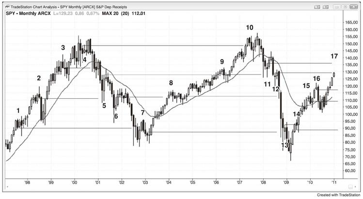

# 第9章　反转经常结束于前期失败反转的信号K线
前面失败反转的入场价经常是后面成功反转的磁体。举例而言，有一轮下跌趋势，途中出现数个多头入场点，但是它们随着市场的继续抛售而失败，然而一旦市场最终反转成功，其每一个入场点和每一根信号K线的高点都将成为目标。在出现重大回调之前，市场经常会一路上涨至最高的信号K线高点。很可能有一些在高位入场的交易者在市场下跌的过程中分批建仓，他们可以将其最初入场点作为最后的止盈目标，在入场最差的交易上以盈亏平衡离场，而在其他低位入场的交易上获利。可能是因为聪明的交易者相信这一点，所以他们在这些目标位清空多仓，或许这也可能是所有伟大交易者都知道的诸多暗号之一，他们在此平仓只是因为他们知道回调在前面的入场点附近结束是一个重复出现的可靠模式。对交易者而言，这也可能是一个"感谢上帝，我再也不会这样做了！"的价格。他们没有平掉亏损的交易，在期待回本的过程中，亏损在不断扩大，当最终如愿时，他们平仓并发誓绝不再犯。

交易中发生的几乎所有事情都有数学基础，尤其是在大量成交由基于统计分析的软件算法所创造的情况下。在那个下跌趋势反转上涨的案例中，最早的买入信号经常出现在下行通道的起点。当下行通道开启时，等距行情的方向概率至少为60%。这意味着市场在上涨10个跳点之前先下跌10个跳点的概率约为60%。行情可以是任意大小，只要处于近期波动的合理范围之内，要点是市场有下跌的偏向。随着市场的下跌和动能的缓和，当下跌行情完成近半时，方向概率降至50%左右，但是通常在市场形成交易区间之间，这个中性区域的价格无法得知。随着市场继续下跌至一些重要的磁体位置，其方向概率过靶中性区域，实际上变为偏向多头。交易区间中点存在不确定性，但是一旦市场触及底部，参与者就会一致认为市场走得太远。这时候方向概率偏向于多头，然后市场将会上涨并形成一个交易区间。在交易区间的底部，方向概率总是偏向于多头，而其底部将处于某个重要的技术位。在市场下跌的过程中，有很多价位可供选择，但是大多数不会产生明显的买入建仓形态，一些公司会编写基于一个或多个技术支撑位的程序，另一些公司则会使用其他数据。当足够多的重要技术位在同一区域聚集时，就会有足够多的交易量押注市场反转，从而改变其方向。这时候数学对你有利，因为你是在即将形成的交易区间的底部买入。反转点永远无法在事先明确知道，但是其将伴随某种反转形态而出现。当市场处于重要的技术位时，关注这些形态十分重要，如等距行情的目标位，趋势线，甚至还有更高时间框架下的移动平均线和趋势线。通常不需要查看很多图表来寻找建仓形态，因为如果你耐心、敏锐并熟悉形态，每一张图上都会出现合理的建仓形态。

一旦市场反转上涨，通常将试图形成一个交易区间，即将形成的交易区间的顶部最有可能是之前的多头入场点，市场将试图涨至那些上涨信号K线的顶部。随着市场的上涨，其方向概率回落至50%，并且随着市场进一步接近区间顶部，其概率会继续下降。由于顶部无法事先预知，方向概率为中性的交易区间中点也无法事先预知，因此市场将过度反应，直到其触及某个技术位，让交易者相信市场已明显过靶。这经常发生在前面的那些买入信号处。记住，市场上一次位于该价位时，其方向概率偏向于空头，当其再次抵达这里时，通常还是会偏向空头，这就是市场经常在此反转下跌的原因，也是卖家掌控市场的价位。这一轮上涨经常会与之前的一根入场K线形成双重顶，然后随着交易区间的进行而反转下跌，至少是暂时的。市场经常会寻找不确定性而上下波动，不确定性的意思是50%的中性方向概率。到某一时刻，市场会认为该区域不再为多空双方同时提供价值，而是成为其中一方的糟糕价位，然后市场将再次启动趋势，直到其找到一个多空双方均认为适合建仓的好价位。

SPY（一个与Emini对应的交易所交易型基金）的月线图上有一轮强劲的上涨趋势于2000年结束，但是在市场的上涨过程中，其多次试图反转为下跌趋势（见图9.1），每一个下跌信号K线的低点（K线1、2和3）都是下跌途中的调整目标。

图9.1　早期入场点是回调目标

与此类似，于2003年结束的下跌趋势途中出现多次失败的上涨反转试图（K线4、5和6），每一个上涨信号K线的高点都是之后上涨行情的目标。

同时，从2003年开始的上涨中有多个失败的下跌试图（K线7、8、9和10），每一个都是在2009年年初结束的下跌趋势中的目标。那轮抛售中有多次筑底企图，其每一根买入信号K线（K线11、12和13）的高点都是当前上涨行情的目标。最后，上涨至K线17的行情中有多次试图筑顶（K线14、15和16），每一根卖出信号K线的底部都是抛售行情的磁体。

这些目标都不需要被触及，但是每一个都是强力磁体，经常将市场向其拉回。