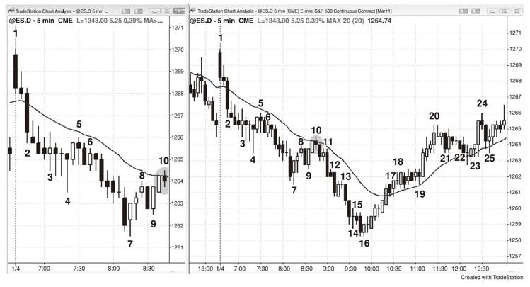
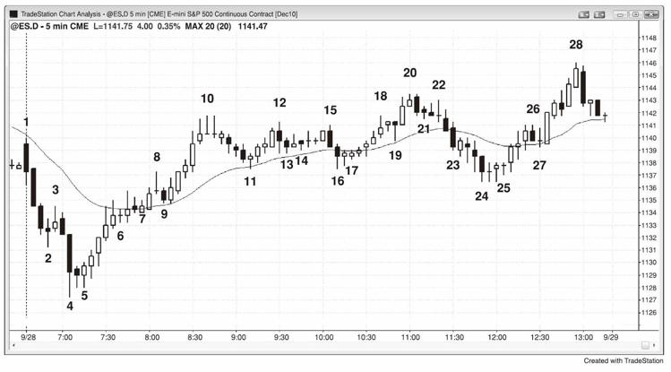
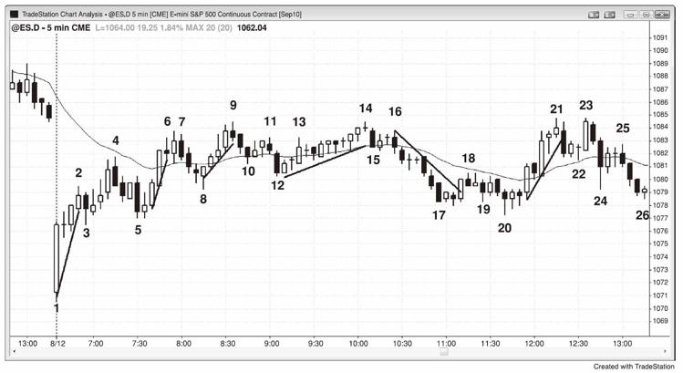
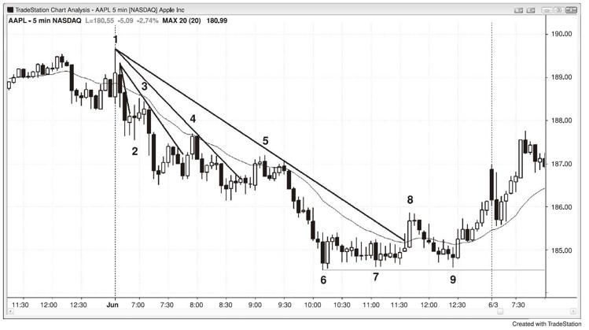
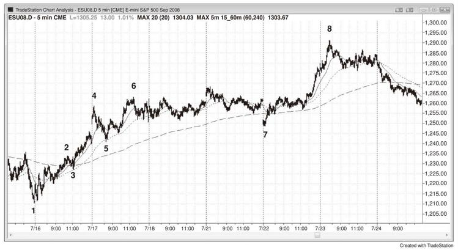

# 第11章　首次回调序列：K线、小型趋势线、移动平均线、移动平均线缺口、重大趋势线## 第三篇 · 回调：趋势转入交易区间即便图表处于强劲趋势，它也会有双边市的时候，但是只要交易者相信趋势将会恢复，这些就只是回调。这些交易区间足够小，交易者将其看作趋势的短暂停顿，而并非图表的主要特征。在你正在查看的图表上，所有的回调都是小型交易区间；而在更高时间框架图上，所有的交易区间都是回调。不过在你面前的图上，大多数交易区间突破的试图都失败了，但是大多数回调突破的试图都会成功。在更高时间框架图上，该交易区间只是一轮回调，如果你交易那张图表，你可以将其看作普通回调。由于更高时间框架图上的K线更大，你的风险也更大，因此你需要减小仓位。大多数交易者倾向于在单个时间框架下交易，而不是根据时间框架来回切换不同的仓位，并使用不同的止损大小和止盈目标。

如果市场正处于强劲趋势，所有人都预期趋势持续，为什么回调还会发生？要想知道原因，考虑一个上涨趋势的例子。反转下跌进入回调是由多头止盈所致，空头的刮头皮也起到部分作用，多头会在某一时刻止盈，这是因为他们知道这在数学上最优。如果他们一直持仓，市场几乎总是会跌回其入场价，并且最终还会大幅走低，造成大幅亏损。他们永远都无法确定最优的止盈点在哪，所以他们用阻力位作为其最佳评估。对你来说，这些价位可能明显也可能不明显，但是它们可以为交易者提供机遇，因此需要不断寻找它们。趋势刮头皮者、波段交易者和逆势刮头皮者预期回调会出现，并据此交易。当市场达到一个目标位，有足够多的多头认为应该止盈时，新买盘的缺乏和他们的清仓将导致市场停顿。这个目标位可以是任何阻力位（在本书第二部分中的支撑和阻力章节中探讨），或者是一根重要的信号K线上方的一定距离（如Emini上的6、10或18个跳点）。该K线的实体可能比其前一根K线的实体小，其顶部可能有上影线，或者其下一根K线可能是一根具有下跌实体的小型K线。这些都是多头在波段顶部的买入意愿下降、部分多头止盈和空头开始刮头皮卖空的迹象。如果足够多的多头和空头抛售，回调就会扩大，当前K线可能跌破前一根K线的低点。在强势急速拉升中，交易者预期上涨趋势会立即恢复，因此多空双方均会在前一根K线的低点附近买入，这形成一个高1买入信号，通常后面市场创出新高。随着一轮上涨趋势的成熟并弱化，会出现更多的双边市，并且多空双方均会预期回调的幅度加深并持续更久。市场可能会形成一个高2买入信号、三角形或楔形牛旗，这会形成一轮小型下跌趋势，当其触及某个数学目标时，多头会再次买入，而空头将会止盈并买回空仓。在市场上涨足够高而再次重复该过程之前，双方都不会再次卖出。

随着多头变得不愿继续在1至3个跳点的回调中买入，部分买盘也开始枯竭。他们变得谨慎，怀疑更深幅度的调整即将出现。由于他们相信可以在高点下方6至10个跳点或更低处买入，因此他们就没有动机以高价买入。同时，他们有动机止盈部分或全部仓位，因为他们相信市场很快会走低，而他们可以再次买入，并在市场上涨测试最近高点的过程中赚到额外利润。动能程序检测到动能损失，它们也将止盈，并在任意方向的动能回归之前不会再次入场。空头也发现趋势削弱，他们开始在K线高点和波段高点上方卖出而刮头皮，并在更高价位加仓（scale
in）。一旦他们看到更多抛压，他们还会在K线的低点下方卖空，预期市场出现更大回调。

对于大多数多头而言，平仓所需要的信号可以弱于卖空所需要的信号。他们最初希望在强势中止盈，如波段高点和前一根K线高点的上方，或者是在一根大型上涨趋势K线的收盘价。当其在强势中止盈后，他们就会准备在弱势中止盈剩余仓位，并开始在下跌反转K线的下方清空多仓，他们怀疑回调将会扩大。大多数交易者不会加入卖空阵营，因为他们无法熟练反手（Reverse）。他们一直认为市场在上涨，通常需要在平仓几分钟后才能说服自己应该反手。如果他们认为市场只是回调而非反转，那么一旦他们认为回调结束，他们就应该买回多仓。由于大多数人无法或不会反手，他们不想要在准备买入的时候持有空仓。如果他们刮头皮卖空，他们很可能无法反手做多，最后发现自己为了蝇头小利而踏空上涨波段。为了在一笔低概率的卖空交易中赚取一个点而错过在一笔高概率的做多交易中赚取两至四个点，这在数学上不划算。

在上涨趋势中，有一系列更高高点和更高低点。当趋势强劲时，多头会以任何理由而买入，很多人会使用追踪止损。如果市场创下新高，他们会将止损位提高至最近的更高低点下方。如果有足够多的空头卖空和足够多的多头止盈，反转可能强于交易者的最初预期，这经常发生在趋势后期，在市场出现过多次回调而又创出新高之后。然而，多空双方均相信市场将在最近的波段低点上方反转上涨，通常双方均会在该低点或其上方买入，结果是形成一个双重底牛旗或另一个更高低点。抛售可能很激烈，但是只要有足够多的交易者相信上涨趋势依然完整，交易者就会买入，而市场就会测试前高，多头会在那里止盈部分或全部仓位，空头则会再次卖空。

随着上涨趋势的成熟，交易者只会在更深调整中买入。他们预期市场出现两腿式调整，并且第二腿会跌破第一腿的低点。价格行为告诉交易者这种更深调整很可能在何时发生，当他们信服时，他们不会再将止损移至最近的波段低点下方，他们会在更高价位止盈，如最近波段高点的上方，然后在最近低点附近再次买入，从而重新建立多仓。既然他们相信市场很可能出现一轮两腿调整，那就不能将止损设在最近的更高低点下方，因为市场将跌破该低点，他们会在其发生之前平掉大部分或全部仓位，但是依然看多。上涨趋势不再形成更高高点和更高低点。然而在更高时间框架图上，这个更低低点通常依然高于最近的更高低点，因此更大的上涨趋势依然完整。这一轮两腿调整是一个大型的高2买入建仓形态。随着趋势成熟，回调变大并有细分结构。如果趋势真的已经反转，会出现一系列更低的高点和低点，但是通常会有一个明确的反转形态。如果没有明确反转，两腿下跌就只是一种牛旗，通常后面还会创出新高。举例而言，第一腿下跌可能是一轮小型急速下挫，而第二腿下跌是一个小型下行通道。如果下跌行情强劲，即便其处于一个复杂的窄幅通道而并非急速下挫，交易者依然会预计其为至少两腿下跌中的第一腿。在回调中买入的多头会在趋势高点下方止盈，而空头则会在前期高点下方激进卖空，预计形成更低的高点和第二腿下跌。

下跌趋势中的情况与此相反。回调最初是由空头在新低止盈所致，但总是有一些激进的多头买入，他们认为市场将上涨足够高而让其刮头皮获利。一旦市场涨至某个阻力位，通常是在低2或低3形态中，多头会清空多仓止盈，空头则会再次卖空。空头希望市场继续形成更低的高点和低点。每当他们看到一轮急剧上涨，他们就会在市场接近最近的更低高点时激进卖空。有时候直到市场触及最近的波段高点后他们才大力做空，这就是双重顶熊旗如此普遍的原因。只要市场继续形成更低的高点，他们就知道大多数交易者会认为下跌趋势完整，因此其后很可能形成另一个更低低点，他们可以在那里止盈部分或全部空仓。最终有一轮回调演变成一个交易区间，一些反弹将越过最近的更低高点。在更高时间框架图上，依然有更低的高点和低点，但是在你交易的图上，这个更高高点是下跌趋势丧失部分力量的迹象。随着下跌趋势的成熟和削弱，其经常形成两腿上涨，其中会有一个更高的高点和一个更高的低点，但是下跌趋势依然完整，这是低2卖空建仓形态的基础，也就是一轮两腿上涨。区间内会有一些形态告诉多空双方下跌趋势很可能会恢复，而其总是出现在某个阻力位，如等距行情目标或趋势线，这使得多头在区间顶部附近买入的意愿降低，而空头则更加愿意一路持续抛售至区间底部，然后市场向下突破，多头刮头皮者停止买入，多头波段交易者清空多仓，然后市场大体完成一轮等距下跌，空头将在那里开始止盈，而激进的多头则会再次开始买入。如果多空双方的买盘足够强劲，市场会出现回调、交易区间或趋势反转。

回调的最后一腿经常是一个逆势微型通道（牛旗尾部的下行微型通道或熊旗尾部的上行微型通道），对微型通道的突破通常只持续一两根K线就出现回调，尤其是当微型通道拥有四根或更多K线时。如果趋势强劲，经常不出现回调，因此在突破微型通道时入场是一笔合理的交易。当趋势并非很强时，对微型通道的突破通常在一两根K线内失败。与所有的突破一样，交易者需要评估突破的力度与突破失败的信号K线的力度。如果突破强劲很多，尤其是当大趋势强劲时，反转试图很可能会失败，并形成一个突破回调的建仓形态，给交易者第二次顺势入场的机会。如果突破相对疲弱，如具有长影线的小型趋势K线，且反转K线强劲，尤其是当大环境很可能导致反转时（如交易区间顶部略下方的牛旗），反转试图极有可能会成功，而交易者应该做反转交易。如果突破和反转的强度不相上下，也没有强劲的大趋势，交易者则需要评估下一根K线的强度。举例而言，如果在一个交易区间中间出现一个牛旗，突破旗形的那根上涨趋势K线后是一根同样强劲的下跌反转K线，且市场跌破该K线的低点，那么交易者将评估那根下跌入场K线的形态；如果其变成一根上涨反转K线，他们会假设市场只是形成牛旗突破后的回调，并且会在该K线的高点上方买入。反之，如果它是一根强势下跌趋势K线，尤其是当其收于低点且位于上行突破K线的低点下方时，交易者会将此形态看作下行突破并伺机做空，或者他们早已在下跌反转K线的下方卖空。

从最严格的定义来说，回调是一根K线逆势运动而越过前一根K线的极点。在上涨趋势中，回调至少跌破前一根K线的低点一个跳点。然而，一个更为广泛的定义更加有用------趋势动能的任何停顿（包括孕线、反向趋势K线或十字线）都应被看作是回调，即便市场只有盘整行为而并没有实际后退。就算是最强劲的趋势，在其运行中的某一时刻也会给出回调将有多深的线索。最常见的是一个双边市区域，举例而言，在一个急速与通道形态的上涨趋势中，急速行情过后，市场停顿或回调，形成通道的起点。一旦趋势通道结束而抛售（回调）开始，其总是会下测通道的底部。这是空头开始卖空的地方，随着上行通道越过其卖空入场价，他们开始害怕。随着上涨趋势的进行，他们和其他空头卖出更多，但是一旦趋势反转下行进入回调，这些空头将非常乐意在其最早和最低的卖空入场价平掉所有仓位，也就是通道的起点处。一旦他们空仓，他们就不会在该区域再次卖空，因为他们看到市场在其最初卖空后涨至多高，不过如果他们依然看空，他们会在反弹中再次卖空。如果反弹在前高的下方结束，其会形成一个更低的高点，通常会引发第二腿下跌。如果空头尤为强势，那个更低的高点可能成为一轮新下跌趋势的起点，而不仅仅是一个正在形成的交易区间中的第二轮回调。

趋势末期的楔形也是如此。如果下跌趋势形成一个向下倾斜的楔形，那么市场会尝试调整至楔形的顶部，最早的多头在这里开始买入。如果市场能够触及其最早的入场价，他们就可以在这笔交易上盈亏平衡，而在其他更低价位入场的交易上获利，并且直到市场再次下跌之前，他们不太可能想要买入。他们从其第一笔交易中认识到其买入价过高，他们不喜欢在市场持续下跌的过程中忍受浮亏的感觉，不想要再次经历。这一次他们会等待回调，希望市场形成一个更高的低点，或者更低的低点。他们预计楔形的最初低点将是任何后续回调的支撑，在该价位附近买入并在其略下方设置止损让他们以确定且有限的风险入场，他们喜欢这一点。

市场在趋势中有测试最早的双向市区域的倾向，这让富有洞察力的交易者能够预测回调将在何时出现及其幅度会有多大。他们不想要在首次出现双边市的迹象时逆势入场，但是这告诉他们逆势交易者开始建仓，市场很可能在不久之后回调至该价位。在趋势通道、楔形或阶梯形态开始出现反转迹象之后，他们将逆势交易，并准备在双边市开启的区域（通道起点）止盈。

由于回调是一轮趋势，尽管相对于其要回撤的大趋势而言只是小趋势，但是和所有趋势一样，其通常至少有两腿。一条腿和三条腿的回调也很常见，就像小型通道和三角形一样，但是所有的回调都相对较为短暂，交易者预期趋势很快会恢复。有时候只能在较小的时间框架图上看到腿形态，还有些时候腿较大，每一腿都可细分为两条小腿。由于交易者预计主趋势很快会恢复，他们会在回调中淡出突破，举例而言，如果一轮强劲的下跌趋势最终出现一轮两腿上涨的回调，随着市场向上突破第一腿上涨的高点，通常此时的空头远远多于多头。尽管市场在一轮上涨趋势中向上突破波段高点，但是买突破的多头通常会被卖空的空头压过，因为他们预期突破会失败，而下跌趋势将很快恢复。他们会在波段高点及其上方用限价订单和市价订单卖空。他们将此突破看作是一个以更高价格重新建立空仓的短暂良机。由于80%的反转试图都会失败，因此概率严重偏向于空头，强劲趋势中的首次两腿回调尤为如此。

任何拥有两腿结构的行情都被当作回调来交易，即便是顺势行情。有时候一轮趋势的最后一腿将是一轮两条腿的顺势行情，在上涨趋势中创下更高或更低的高点，或者在下跌趋势中创下更低或更高的低点。举例而言，如果一轮上涨趋势出现一轮抛售，其跌破上升趋势线，然后出现两条腿的回调，该回调只是测试前期极点，甚至也可以越过旧的极点。这意味着趋势线突破后的回调可以形成更低的高点，甚至更高的高点，但是其依然处于向新的下跌趋势的转变过程。严格来说，在最终高点出现之前下跌趋势并未开始，但是那个最终高点经常是向下突破上升趋势线后的更高高点回调。

怎样算是两腿？你可以绘制一个基于收盘价的线图，经常能够清晰看到两腿行情。如果你使用棒线图或蜡烛图，最容易发现的两腿行情是一段逆势行情之后出现一轮较小的顺势行情，然后又出现第二段逆势行情（教科书般的ABC回调）。为什么行情经常在第二腿后反转？参考上涨趋势中的两腿回调案例，多头将在新低（C腿）买入，认为第二腿调整将是趋势的终点。同时，期待两腿调整的空头刮头皮者将买回其空仓。最后，在第一腿下跌（A浪）的低点买入的激进多头将在市场创下更低低点时加仓。如果这些买家压过在市场向下突破第一腿下跌时卖空的新空头，市场将会上涨，通常至少测试旧的高点。

然而，很多时候两腿行情仅在较小时间框架图上明显，而在你正在查看的图上则需要推断。由于交易单张图表要比整日翻看多张图表轻松得多，因此如果仅凭推断就可以发现图上的两腿结构，交易者将获得优势。

在上涨行情中，有一系列的上涨趋势K线，如果出现一根下跌趋势K线，则可以将其看作回调的第一腿（A腿），即便该K线的低点高于前一根K线的低点。如果你查看较小时间框架图，逆势行情可能会很明显。如果下一根K线顺势收盘，但是其高点低于终结上涨行情的K线的高点，那么这就是B腿。如果再出现一根下跌K线或一根低点低于前一根K线低点的K线，这将形成第二腿下跌（C腿）。

需要推断的越多，形态就越不可靠，因为很少交易者能识别，或者对其有信心。交易者很可能会投入更少的资本并更快地平仓。

有一点很明确，如果正在回调的趋势已经在一轮高潮行情或一个重大的趋势反转形态中结束，那么趋势已转向，你不应该在旧趋势的回调中入场，其已经结束，至少在接下来的10根或更多K线中，或许当日剩下的时间都是如此。因此在一轮强劲上涨之后，如果市场跌破上升趋势线后形成一个楔形顶或一个更低的低点，你应该寻找卖空建仓形态，而不是在旧的上涨趋势中买回调。当趋势反转并不明确时，两个方向的建仓形态都可能有效，至少是对于刮头皮交易。趋势反转已经发生的可能性越大，避免交易旧趋势的重要性就越高，因为现在很可能在新方向上出现至少两腿行情。同时，这一段行情的时间和点数通常会与反转的清晰度大体呈正比。当你获得一个出色的反转建仓形态时，你应该用部分仓位做波段交易，少数情况下甚至应该动用全部仓位。

所有的回调均以某种类型的反转开始。其通常足够强劲来诱使逆势交易者建立逆势仓位，但不足以成为一个可靠的逆势建仓形态。由于建仓形态和回调不足以改变始终入场交易的方向，因此交易者不应逆势交易。相反，他们应该寻找预示回调或已结束的建仓形态，然后顺势交易。然而，由于回调始于反转，很多交易者会过度谨慎，说服自己放弃了一笔绝佳交易。你永远无法对一笔交易100%确定，但是当你对一笔看似不错的交易比较有信心时，你需要相信数学，做这笔交易，接受有时候你会输的现实，这只是这项生意的特点，除非你愿意承受损失，否则你将无法交易为生。记住，一位失败率高达70%的大联盟棒球击球手就被认为是天皇巨星，只凭借30%的成功率赚取数百万美元。

当市场处于一轮弱趋势或从交易区间向趋势转变的早期阶段时，经常会形成一个旗形，然后旗形突破，再然后回调，回调变成另一个旗形，有时候在强势突破出现之前，市场会多次重复此过程。

一两根K线的停顿要比持续多根K线并真正从极点回撤的回调更难交易。举例而言，如果有一轮强势上涨行情，其最后一根K线是一根小型K线，高点只比其前一根K线的高点低一两个跳点，而这根K线是一根大型上涨趋势K线，前面还有一两根大型上涨趋势K线，如果你在这根K线的高点上方一个跳点处买入，你就买在当日的高点。由于很多机构淡出每一个新高，行情反转并在触及你的盈利目标之前先触发你的止损的风险很大。然而，如果趋势非常强劲，那么这就是一笔重要的交易。这笔交易如此难做的原因之一是，你只有很少的时间来分析趋势的强度、寻找趋势通道线过靶或其他可能导致交易失败的原因。

更难交易的停顿是一根小型十字线，其高点高于前一根大型上涨趋势K线的高点一个跳点。在十字线的高点上方买入有时候也是一笔好交易，但是对于大多数交易者而言，快速评估风险的难度过大，最好还是等待更为清晰的建仓形态。反对在停顿K线突破时买入的一个原因是，如果最后一根或两根趋势K线有较长的影线，其显示逆势交易者能够施加一些影响，同时，如果之前的顺势入场点出现在较大回调之后，如一个高2，那么你应该三思而后行，因为每一轮回调的幅度通常越来越大而非变小。不过，如果市场刚刚突破，出现三根上涨趋势K线，并且均收于高点附近，那么你在这些K线之后的停顿K线上方买入而刮头皮成功的几率较高。总而言之，这些强劲上涨趋势的早期阶段的高1多头（或下跌趋势中的低1空头）是大多数交易者所应该考虑的唯一停顿K线入场点。同时，记住单K线突破后的停顿K线也可能是反向入场点，因为单K线突破经常失败，尤其是当其逆势时。

如果回调相对于趋势较小，通常在其结束时入场就是安全的。如果它是一轮足够大而可以交易的强劲逆势行情，那么最好等待第二信号。举例而言，如果在一轮强劲的上涨趋势中有一个持久的下行通道，相对于在市场首次反转上涨时买入，等待突破后的回调并在突破回调中买入更加安全。

所有上涨回调的结束都有原因，而其原因总是市场触及某种支撑。有时候它们平静结束，但是还有时候会形成与主趋势相反的强劲趋势K线并差点扭转趋势。大型回调和小型旗形突破的一两根K线回调均是如此。即便是1987年和2009年的股市崩盘，也在月线图上的上升趋势线结束，因此也只是上涨趋势中的回调，并且大多在支撑汇聚区结束，尽管很多交易者可能并未看出其中一些或全部。一些交易者在上涨趋势中买回调是因为他们关注某一个支撑位，不管是上升趋势线，牛旗底部的通道线，前期高点或低点，一些移动平均线，还是任何其他类型的支撑，而其他人买入则因为他们在同一区域看到了不同的支撑。一旦有足够多的多头入场而压过空头，趋势将会恢复。下跌回调也是如此，它们总是在阻力汇聚区结束，尽管很容易与市场看到不同的阻力。一旦市场接近重要价位，真空效应经常成为主导。举例而言，如果买家相信市场正接近一个重要的支撑位，他们经常会在袖手旁观而等待市场到位，这可能形成一轮非常强劲的急速下挫，但是一旦支撑位被触及，多头就会入场并不断激进买入。制造回调的空头也是如此，他们也看到支撑位，市场离其越近，他们就越加确信市场将抵达那里，结果是他们不停地激进卖空，直到该价位被触及，然后他们瞬间停止卖空，并迅速买回空仓。回调可能以一根大型下跌趋势K线结束，看上去像是要将始终入场交易反转为空头，但是在接下来的K线中没有出现后续抛售，反而上涨趋势恢复，有时候缓慢开始，多空双方都在买入，反转可能急剧并持久。真空效应总是存在，即便是在最剧烈的反转中，如1987年和2009年的股市崩盘。在这两个案例中，市场均呈自由落体状态，但是一旦市场跌至月趋势线的略下方，就会开始强势反转上涨，不管这两次崩盘有多激烈，其只是真空效应发挥作用的案例。

一两根K线的旗形突破回调也出现同样的行为。举例而言，如果在一轮强劲的下跌趋势中，移动平均线上出现一个低2熊旗并触发卖空，其入场K线后可能有一根上涨趋势K线，这代表突破失败，可能是一轮上涨趋势或一轮较大的熊市反弹的起点。然而其经常会失败，当一个失败形态失败时，便成为更大趋势的回调，这里它成为一个突破回调卖空的建仓形态。交易者会预期其失败，而激进的空头会在其收盘价和高点附近卖空。更为保守的交易者会等待市场确认这根下跌趋势K线仅仅是熊旗突破的回调。如果回调持续更久一点，他们会在下跌K线或其后面一两根K线的低点下方用停损卖出订单做空。

既然回调只是趋势的停顿而非反转，一旦你认为一段行情是回调，你就会相信趋势会恢复，市场将测试趋势的极点。举例而言，如果有一轮上涨趋势，然后市场抛售多根K线，如果你将抛售看作买入机会，那就是你相信它只是上涨趋势中的回调，你在预期市场测试上涨趋势的高点，需要注意的是，测试并不需要创出新高。确实，其经常是更高的高点，但是也可以是双重顶或更低的高点。测试之后，你将判断上涨趋势完整还是已经转为交易区间，甚至进入下跌趋势。

回调经常是强劲的急速行情，让交易者开始怀疑趋势是否已经转向。举例而言，在一轮上涨趋势中，或许会出现一根或两根大型下跌趋势K线，其向下突破移动平均线，并可能跌破交易区间数个跳点，交易者就会猜测始终入场方向是否正在转为空头，他们所需要看到的是后续抛售，或许只是另一根下跌趋势K线，所有人都将密切关注下一根K线。如果是一根大型下跌趋势K线，大多数交易者会相信反转被证实，他们将会市价卖空或在回调中卖空。反之，如果该K线以上涨结束，他们会怀疑反转试图已经失败，而抛售行情只是一轮短暂而剧烈的降价，因此是买入良机。交易新手看到强势急速下挫，但是却忽视强劲上涨趋势的背景，他们在这根下跌趋势K线的收盘价卖出，在其低点下方卖出，在接下来的数根K线中的小幅反弹中卖出，以及在任何低1和低2的卖空建仓形态中卖出。聪明的多头是这些交易的对手方，因为他们明白正在发生什么。

市场总是试图反转，但是其中80%的反转试图失败而成为牛旗。当反转试图发生时，那两三根下跌K线可能非常有说服力，但是没有后续抛售，多头会将抛售行情看作在一轮短暂的抛售高潮的低点附近再次买入的良机。经验丰富的多头和空头等待这些强劲的趋势K线出现，有时候在其形成之前就袖手旁观，然后他们入场买入，因为它们将其看作抛售行情的高潮性终结。空头买回空仓，而多头重新建立多仓，这与趋势末期的情况相反，那时候强势交易者在等待一根大型趋势K线。举例而言，当一轮强劲的下跌趋势处于支撑位附近时，经常会出现一个后期突破，其形式为一根非同寻常的大型下跌趋势K线。这个时候，双方均在抛售高潮中买入，因为空头将其看作止盈空仓的好价位，而多头将其看作低价买入的好机会。

如果交易者认为其看到的只是回调，那就是他们相信趋势依然完整。当他们评估交易者等式时，概率永远无法确知，但是既然他们顺势交易，他们可以假设等距行情的方向概率为60%。可能还会更高，但是却不太可能低很多。否则他们会认为回调持续太久，已经丧失预测价值而成为一个普通的交易区间，其最终向上和向下突破的概率大体相等。一旦他们决定其风险水平，他们就可以设置一个至少与其风险一样大的盈利目标，并合理假设其将有60%或更高的成功概率。举例而言，如果他们在高盛（GS）突破牛旗时买入，其保护性止损位于牛旗的下方，比其入场价约低50美分，他们可以假设有至少60%的概率在多仓上赚取至少50美分。他们的止盈目标可能是对上涨高点的测试，如果是，而那个高点比其入场价高2美元，那么他们很可能依然有约60%的成功概率，但是现在的潜在回报达到风险的四倍，从交易者等式而言，这是一个非常有利的结果。

一旦你相信市场已经反转，那么在新趋势展开之前，其通常会回测之前趋势的极点。举例而言，假设有一轮下跌趋势，之前的回调足够强劲而向上突破下降趋势线，市场对下跌趋势的底部进行了更低低点测试后反转上涨，这有可能是趋势反转进入上涨趋势。如果第一腿上涨是以强势急速拉升的形式，你就会相信反转的几率甚至更大。第一腿强劲上涨的回调通常会形成一个更高的低点，但是也可以和下跌低点构成一个双重底，甚至也可以形成一个更低的低点。市场已经跌至更低低点，为什么你还能相信趋势已经反转为上涨？更低的低点是下跌趋势的标志，绝不是上涨趋势的一部分。是的，这是传统观点，但是作为一名交易者，使用更为广泛的定义才能赚更多的钱。如果市场跌破旧的下跌低点，你的多仓可能被止损出局，但是你可能依然相信多头真正掌控市场。那一轮急速拉升是对旧的下跌趋势的突破，并将市场转为上涨趋势。突破回调跌破下跌低点并不重要，假设市场恰好在旧低处止步而不是跌破一个跳点，你认为这很重要吗？有时候确实是，但是通常差不多足以。如果两样东西相似，那么它们将会表现一样，急速拉升的底部与回调的更低低点哪一个是上涨趋势的起点也并不重要。严格来说，急速拉升是第一次试图反转，但是一旦市场跌破急速拉升的底部，其已宣告失败。然而，它依然是显示多头掌控市场的突破，而回调跌至更低低点和空头暂时重获掌控并不是很重要，重要的是现在多头获得掌控，并且很可能会持续很多根K线，因此你要买回调，即便第一次回调跌至更低的低点。

上涨趋势中回调至更低低点或下跌趋势中回调至更高高点，这种现象在每一张图上的小型腿中都很常见。举例而言，假设有一轮下跌趋势，然后形成一个窄幅通道上涨至移动平均线，其持续约八根K线。由于通道紧凑并强势，意味着第一次下跌突破很可能会失败，即便其与趋势方向一致。交易者在做空之前通常会等待回调，不过其回调经常是以更高高点的形式，在下跌趋势中形成ABC回调。他们会在前一根K线的低点下方卖空，确信均线处的低2卖空是强劲下跌趋势中的好交易。很多交易者并不认为这个ABC形态是下跌突破（B腿向下突破构成A腿的通道），然后突破回调至更高高点（C腿），但是如果你想一下，实际上就是如此。

有一种特殊类型的更高高点或更低低点，在重大的趋势反转中常见。举例而言，如果一轮上涨趋势中出现一轮强劲下跌，跌破上升趋势线，然后以一轮弱势上涨（如楔形）创下新高，这个更高高点有时候就是新的下跌趋势的起点。如果趋势就此反转下跌，那么这一轮弱势上涨至更高高点的行情就只是那一轮突破上升趋势线的急速下挫的回调，那一轮急速下挫是下跌趋势的真正起点，尽管其回调涨至急速下挫的上方，并在上涨趋势中创出了新高。在下跌趋势持续20根或更多K线之后，大多数交易者会回顾这个更高高点，将其看作下跌趋势的起点，这是一个合理的结论。然而在趋势的形成过程中，敏锐的交易者会猜测市场是否已经反转为下跌趋势，他们并不关心急速下挫后的上涨是否以更低高点、双重顶或更高高点的形式测试上涨高点。从严格的技术角度来说，一旦空头在急速下挫中掌控市场，趋势就已经开启，而并非在测试上涨高点时。一旦市场从更高高点处剧烈抛售，趋势反转就得到确认。尽管更高高点实际上只是急速下挫的回调，而且你认为哪个高点才是下跌趋势的起点并不重要，因为你将以同样的方式交易市场，在更高高点的下方卖空。当一轮下跌趋势在强劲上涨而突破下降趋势线后从更低低点开始转为上涨趋势时，情况也是如此。多头在向上突破下降趋势线的那一轮急速拉升中掌控市场，但是大多数交易者会说新的上涨趋势始于更低的低点。然而，那个更低低点只是强势急速拉升的回调。

如果一轮趋势在很少几根K线之内覆盖大量点数，说明其有大型K线以及K线之间很少交叠，最终都会出现回调。这些趋势的动能如此强劲，大概率是回调之后趋势恢复，然后测试趋势的极点。只要回调并没有将市场转为反方向的新趋势并越过原趋势的起点，通常极点就会被越过。总体而言，如果回调的幅度达到75%或更高，回调回到之前趋势极点的概率就会大幅降低。对于下跌趋势中的回调，这个时候交易者最好将其看作新的上涨趋势，而不是旧的下跌趋势的回调。

等待回调是最让人受挫的事情，有时候它似乎永远都不会到来。举例而言，在一轮上涨中，你确信买回调很明智，但是市场一根K线接一根K线地上涨也不回调，直到其涨至太高，现在你认为可能是反转而不是回调了。为什么会这样？每一轮上涨趋势都是买入程序而形成，它们使用任何可以想象的算法，强劲趋势就发生在众多公司运行同一方向的程序时。一旦你确信上涨趋势强劲，那么所有人都是如此。交易老手明白正在发生什么，他们意识到任何回调几乎肯定会被买入，然后市场将创出新高。鉴于此，与其等待回调，不如追随机构。他们以市价买入，并在当前图表上并不明显的微小回调中买入，或许他们在买一两个跳点的回调。程序将一直买入，因为大概率在触及某个技术位之前不会停止，那时候数学将偏向于反转。换句话说，数学过靶中性区，现在偏向于反转，因此这些公司将激进交易相反方向，而新趋势将一直持续，直到其再一次过靶中性区，概率再次偏向于相反方向。

举例而言，如果苹果从280美元上涨4美元，并且在五分钟图上连续上涨7根K线，那么其极有可能会上涨8根K线，甚至更多。交易者愿意在280美元买入，因为他们懂得等距行情的方向概率的逻辑。由于他们确信市场将在不久后走高，但他们并不确定其将很快走低，因此他们以市价买入或者在小幅回调中买入。尽管他们可能并不以方向概率的角度思考，但是所有的趋势交易均以此为基础。当苹果处于强劲的上涨趋势时，他们宁愿在280美元买入，因为他们相信市场在跌回279美元之前将先达到281美元。他们很可能也相信市场在下跌1美元之前会先达到282美元或283美元。他们可能不会以数学的角度思考，并且相信概率从不确定，但是在这种情况下，苹果很可能有约70%的概率在下跌一美元之前先上涨两三美元。这意味着如果次这笔交易你做10次，你将7次赚到两美元共盈利14美元，3次输掉1美元，你的净利为11美元，或平均每笔交易盈利超过1美元。

如果他们等待1美元的回调，这在苹果达到283美元之前可能不会出现，然后他们可以在282美元买入，但是如果他们早一点以市价买入，就会比现在低2美元。

如果在他们以280美元买入之后，苹果跌至279美元，很多交易者会买入更多，因为他们相信有70%以上的概率其将上涨至新高，而他们可以以盈亏平衡平掉第一个多仓，而在以更低价格入场的仓位上赚取1美元。

对于等待在回调中入场的交易者而言这很重要，当趋势强劲时，以市价入场经常会好于等待回调。

所有的回调均以反转开启，而且经常足够强劲，以至于在最终形成时，交易者不敢采纳顺势的信号。如图PIII.1所示，左图显示了移动平均线处的K线10低2卖空建仓形态在五分钟图上的样子，右图则显示了整日行情。K线7是一根强劲的上涨反转K线，后面是一个强劲的双K线反转形态和K线9的更高低点。然而，市场已经超过20根K线没有碰触到移动平均线，显示下跌趋势强劲，空头很可能想要在至均线的两腿上涨中卖空，尤其是在出现一根下跌信号K线的情况下。当完美的建仓形态最终形成时，很多新手执迷于K线7和K线9而忽视了前面的下跌趋势，忘记了拥有下跌信号的均线低2卖空是可靠的建仓形态的事实。上涨行情由空头止盈和多头刮头皮所致，双方均计划在市场以两腿行情回调至均线附近的过程中卖出，多头止盈而空头重新建立空仓。没有什么东西可以100%确定，但是当下跌趋势中的均线低2有一根下跌信号K线时，对于在K线10下方1个跳点处以停损订单卖空的空头而言，通常成功的可能性至少有60%。在这个特定案例中，信号K线的高度仅有3个跳点，因此空头将承担5个跳点的风险来追求市场测试下跌低点，其在下方约2个点处。很多空头用限价订单在均线下方一个跳点处卖空这一轮至均线的回调。其他空头将其看作下跌趋势中的第一轮两腿上涨，因此预计将失败。当他们看到K线9的反转上涨时，他们在K线8的高点或其上方设置限价订单卖空，订单在市场上涨至K线10的过程中成交。他们预计任何反转都将成为熊旗的起点，认为任何上行突破都是在更高价位重建空仓的短暂良机，他们激进地把握机会，压过在市场向上突破K线8时买入的多头。

图PIII.1　回调始于反转

K线10低2熊旗以一根强劲的下跌趋势K线突破，但是下一根K线拥有一个上涨的实体，这是让突破失败的试图。多头希望市场形成一个失败的低2，然后上涨，并转为多头行情。然而，交易者知道大多数反转试图失败，很多人在上涨K线结束时卖空，并在其高点上方设置限价订单卖空。因为多头并不知道市场是否会涨至该上涨K线的高点上方，如果他们希望在此K线或其上方卖空，但是又想确保能够建立空仓，即使其在上方的限价订单并未成交，很多人还会在其低点下方一个跳点处设置停损订单。如果他们在该K线上方的限价订单成交，很多人会撤销其停损入场订单。如果限价订单未能成交，该K线下方的停损订单将确保其建立空仓。大多数人在低2突破时已经做空，但是一些人会在市场向其方向运动时加仓，计算机化的程序交易犹如为此，随着市场的持续下跌，很多程序会持续卖空。

顺便说一下，交易反转的一个基本原则是在市场第二次试图恢复趋势的时候离场。在本例中，期待K线7成为一个持久的底部还为时尚早。一旦市场在移动平均线处形成低2，尤其是当K线10信号K线有一个下跌实体时，所有的多头必须离场。很少有人能够反手卖空，缺乏这种能力的人会平掉其刮头皮做多的小仓位，却错过卖空的大机会。在一轮下跌趋势中，耐心等待在市场反弹至均线时卖空要比刮头皮做多好得多。

一旦上涨趋势明确，交易者预期第一轮两腿回调会失败。当他们看到K线21后的上涨趋势K线，他们就在K线21的低点处设置限价买入订单，因为他们预期市场向下突破K线21会失败，其将是强劲上涨趋势中的首轮两腿下跌，而强劲趋势中的第一轮大多会失败。他们还相信移动平均线将是支撑位，那里会有激进的买家。随着市场跌向均线，其限价买入订单成交。其他多头在K线23上方以停损买入订单入场，因为它是上涨趋势中的高2买入建仓形态，并且均线处有一个上涨的信号K线，这是一个非常强劲的买入建仓形态。

K线24的下跌反转K线的底部有长影线，相对于K线20至K线23前一根K线的微型下行通道的上行突破而言，其强度较弱一些。突破K线是一根大型上涨趋势K线，其前面有两根上涨K线。一些交易者在K线24的下方卖空，预期上行突破失败。其他人则等待观察接下来数根K线如何表现。空头入场K线是一根强劲的下跌趋势K线，但是其处于上涨趋势K线的低点上方，因此市场尚未反转为始终入场空头。下一根K线有一个上涨实体，因此并未确认抛售，多头在其高点上方买入，相信它是上涨趋势或正在形成的交易区间中的牛腿中的均线处的突破回调买入建仓形态。

所有回调均始于某种反转形态。很多顺势交易者需要看到反转形态而开始止盈，逆势交易者需要反转形态来建立交易。是的，随着顺势机构的止盈和逆势机构开始分批建立反转交易，机构制造了反转形态。然而，还有很多机构和交易者在等待反转的早期信号出现后才交易，所有交易者的累积效应形成回调。如果趋势强劲而反转形态疲弱，回调有时候只持续一两根K线，如图PIII.2中的K线3、9和19。有时候其只是停顿并形成一轮盘整回调，如K线7。

图PIII.2　所有回调均始于反转

市场以一轮四K线急速下挫而跌至K线2，但是其第三根和第四根K线的下跌实体缩小，显示动能损耗。K线2上的影线是双边市的迹象，一些交易者认为其可能预示开盘反转和当日低点，因此他们在K线2的上方买入。

从K线5开始的五K线急速拉升足以让大多数交易者相信始终入场交易已经转为多头。他们预期市场将走高，相信任何回调都会被激进买入，从而形成更高的低点。然而，至K线8的行情有三段上涨（Three
Pushes
Up），而这个楔形顶可能引发两腿下跌，这导致一轮单K线的回调，然后又一轮强势上涨。由于从K线5开始的上涨如此强劲，很多交易者相信任何回调都将被买入。

一旦所有人都相信下面有强势买家，他们就会以市价买入，他们不知道市场是否很快会出现回调，但是他们确信不管其是否回调，市场都将很快走高。为了避免错过太多趋势行情，他们开始以市价买入，而且他们将持续买入，直到他们认为市场可能最终开始回调时。

在一轮急速与高潮的上涨趋势中的抛物线行情之后，K线10后面出现多根十字线，K线5后的五根K线形成急速拉升，也是当日新高。一些交易者认为其可能是当日高点，他们在这里卖空，但只是引发另一轮回调。

一些交易者认为K线18可能与K线10形成双重顶，他们在那根孕线信号K线的下方卖空。由于有连续七个上涨实体，大多数交易者预期上涨趋势持续，因此他们在该信号K线的低点下方买入而不是卖空。

K线26是一根下跌反转K线，可能是市场反转下跌穿过K线16的交易区间底部后的更低高点。然而，大多数交易者相信当日是一个强劲的上涨趋势日，他们在K线26的低点或其低点下方买入。

当通道陡峭时，最好不要在突破趋势线时进入反转交易，而是等待观察是否会出现突破回调而形成第二个信号。如图PIII.3所示，至K线2的急速拉升太过陡峭，不能在其第一次跌破趋势线时卖空。反之，只有出现突破回调测试了急速拉升的高点之后，交易者才能考虑卖空。测试可以是更低高点、双重顶或更高高点，这里是均线略下方的K线4下跌反转K线的更高高点。

图PIII.3　突破回调

至K线6的急速拉升同样太过强劲，因此不能在市场向下突破K线6时卖空。空头希望市场成功向下突破上升趋势线，并有大量后续下跌，但是交易者在考虑做空之前应该先等待突破回调。这里K线6的下一根K线成为一根外包上涨K线，它是对K线5至K线6的窄幅上行通道高点的更高高点测试，后面是一根下跌孕线，形成一个内外内（IOI）的更高高点卖空建仓形态。

K线8至K线9的上行通道中有连续四根上涨趋势K线，因此市场太过强势而不能在其第一次向下突破通道时卖空。相反，交易者应该等待观察突破回调如何表现。其在K线11形成一个更低的高点，他们可以在其低点下方一个跳点处卖空。

从K线12至K线14的上行通道非常紧凑，因此交易者不应该在市场向下突破趋势线时卖空。反之，他们应该等待观察市场是否出现好的突破回调卖空建仓形态。K线16形成对通道高点的更低高点测试，交易者可以在K线16跌破其前一根K线的低点而成为一根外包下跌K线时卖空，他们也可以等待该K线收盘。一旦他们看到有一个下跌实体并收于前一根K线的低点之下，他们就可以在K线16的外包下跌K线的低点下方卖空。在这里做空的赢率更高，因为K线以下跌收盘，会让他们进一步确认空头强势。

至K线17的抛售处于一个窄幅通道，七根K线中没有一根以上涨收盘。趋势太强而不能在市场第一次试图向上突破时买入。突破回调是K线20处的更低低点，买入建仓形态是一个内内（II）形态。

至K线21的上涨处于一个陡峭的上行通道，七根K线均创下更高的高点和低点，这太过强势而不能在市场第一次向下突破上行通道时卖空。至K线23的突破回调与K线21的通道高点形成一个双重顶，下一根K线是一根强势下跌孕线，也是一个出色的突破回调卖空信号K线。

跌至K线5的行情是一个牛旗，后面市场突破，然后回调至K线8，它是另一个牛旗的底部。然后市场向上突破至K线9，形成另一轮回调至K线12，这是另一个牛旗的买入建仓形态。市场经常突破引发回调又变成旗形，这通常发生在较弱的趋势和交易区间中，正如此例。

尽管K线5和12是强劲的下跌趋势K线，试图将始终入场头寸反转为空头，但是它们的结果和大多数此类试图一样------以失败告终。为了能够说服交易者短期趋势为下而市场很可能在接下来的数根K线内走低，空头需要市场再出现一根强劲的下跌趋势K线。当形势明朗，多头不断买入而空头无法打压市场时，他们就买回空仓。空头的买盘和将强劲下跌趋势K线看作低价买入良机的多头的持续买盘导致上涨趋势恢复。多头希望看到强劲的下跌趋势K线跌至支撑区，他们知道其代表空头试图扭转趋势，但大多数转瞬即逝，他们经常袖手旁观而坐等其成，他们将其看作回调的可能终点，这给他们一个低价买入的短暂机会。交易老手可以在下跌趋势K线收盘时买入，在其低点或其下方买入，或者在接下来的多根K线收盘时买入。不过大多数交易应该等待上涨反转K线出现并在其高点上方买入，或者等待反转上涨，然后在牛旗突破后的回调上方买入（如在K线13突破K线12的高2牛旗后的双K线盘整回调的上方）。趋势中可能出现多种类型的回调，一些幅度小而另一些幅度大，可以根据其幅度进行划分和排序。其中任何类型回调的第一次出现都是该类型的首次回调，每一次后续回调都将是较大类别回调的第一次，通常每一次回调后市场都会测试趋势的极点，因为强势行情通常至少有两腿，因此每一种回调的首次逆势行情后都很可能出现趋势的第二腿。回调不一定要完全按照一样的顺序发生。举例而言，如果趋势在高2之后加速，有时候高1可能会发生在高2之后。随着一轮上涨趋势的进行，其最终会丧失动能，变得更为双边波动，并开始出现回调。回调变大并演变成交易区间，最终交易区间会转为下跌趋势。在最终反转之前，市场在每一轮逆势行情后通常都会创下趋势新高。因此，每一个弱势信号在理论上都是一个买入建仓形态，其可以在清单上的其他信号出现之前发生数次。同时，一个信号出现之后，在其他信号出现后还可以再次出现。这是上涨趋势中的疲弱信号的一般发生顺序：（1）上涨实体变小。（2）影线开始出现在K线顶部，并且后续K线的影线变长。（3）K线与其前一根K线的重叠程度加大。（4）K线拥有很小的实体或十字线实体。（5）K线有下跌实体。（6）当前K线的高点处于或低于前一根K线的高点。（7）当前K线的低点处于或略高于前一根K线的低点。（8）当前K线的低点低于前一根K线的低点。（9）出现一条腿的回调（高1买入建仓形态），其K线的高点低于前一根K线的高点。（10）出现两条腿的回调（高2买入建仓形态），持续约五至十根K线。（11）出现三条腿的回调（楔形牛旗或三角形），持续约五至十五根K线。（12）市场突破小型上升趋势线。（13）K线触及均线（一个20缺口K线买入建仓形态）。（14）下一轮上涨至新高的行情有一根或多根下跌趋势K线和一两轮回调。（15）一根K线收于均线之下。（16）一根K线的高点位于均线之下。（均线缺口K线）（17）市场突破大型上升趋势线。（18）一旦有一根K线的高点位于均线之下，在市场回到均线上方之前，就还会有第二腿下跌。（19）上涨至新高的行情有两轮或更多回调，每一轮回调持续两三根K线，并有更为突出的下跌实体。（20）出现一轮幅度更大的两腿回调，持续超过10根K线，其第二腿跌破一个显著的更高低点，形成一个更低低点。（21）市场进入交易区间，多空双方势均力敌。（22）市场向上突破交易区间并回到交易区间，形成一个更大的交易区间。以下这是下跌趋势走弱的顺序：（1）下跌实体变小。（2）影线开始出现在K线底部，并且后续K线的影线变长。（3）K线与其前一根K线的重叠程度加大。（4）K线拥有很小的实体或十字线实体。（5）K线有上涨实体。（6）当前K线的低点处于或高于前一根K线的低点。（7）当前K线的高点处于或略低于前一根K线的高点。（8）当前K线的高点高于前一根K线的高点。（9）出现一条腿的回调（低1卖出建仓形态），K线的低点高于前一根K线的低点。（10）出现两条腿的回调（低2卖出建仓形态），持续约五至十根K线。（11）出现三条腿的回调（楔形熊旗或三角形），持续约五至十五根K线。（12）市场突破小型下降趋势线。（13）一根K线触及均线（一个20缺口K线卖出建仓形态）。（14）下一轮跌至新低的行情有一根或多根上涨趋势K线和一两轮回调。（15）一根K线收于均线之上。（16）一根K线的低点位于均线之上。（均线缺口K线）（17）市场突破大型下降趋势线。（18）一旦有一根K线的低点位于均线之上，在市场回到均线下方之前，就会有第二腿上涨。（19）抛售至新低的行情有两轮或更多回调，每一轮回调持续两三根K线，并有更为显著的上涨实体。（20）出现一轮幅度更大的两腿回调，持续超过10根K线，第二腿上涨至一个显著的更低高点之上，形成一个更高高点。（21）市场进入交易区间，多空双方势均力敌。（22）市场向下突破交易区间并回到交易区间，形成一个更大的交易区间。大多数首次回调都是小行情，依然属于更大趋势的第一腿。然而，随着逆势交易者变得更加愿意建仓而顺势交易者会更加迅速地止盈，每一轮回调都倾向于扩大，逆势交易者开始在新的极点处取得掌控。举例而言，在一轮上涨趋势中，逆势交易者开始在新高反转时卖空而获利，而顺势交易者开始在突破新高时买入而亏损，到某一时刻，逆势交易者将压过顺势交易者，趋势就会反转。强劲趋势中的第一轮小型回调由一两根K线构成，市场总是在其后创出新的极点。举例而言，如果有一轮急速拉升持续四根K线，K线之间很少交叠，并且其影线很小，这说明趋势强劲。如果下一根K线的低点低于前一根K线的低点，此低点就是这一轮上涨趋势中的首次回调。交易者会在其上方一个跳点处设置停损买入订单，因为他们预计市场至少还有一段上涨。如果他们的订单成交，这就是一个高1多头入场点（这在本书的第17章中有详尽探讨）。激进的交易者会在前一根K线的低点下方设置限价买入订单，预期回调将转瞬即逝，他们希望其入场价低于那些等待在回调K线上方用停损订单买入的交易者。下一轮回调可能有三至五根K线，很可能会突破一根小型趋势线，然后市场创出新的极点。如果这一轮回调有两小腿，那么买点就是一个高2多头（一轮两腿回调，通常称为ABC回调）。尽管这第二轮回调可以是一个高2建仓形态，但是如果趋势非常强劲，其可以是另一个高1（一条腿的回调）。如果市场从一个或两个高1入场点开始，然后出现一个高2入场点，并且看上去其正在形成另一个高1，那么明智的做法是等待观望。在一连串的盈利交易之后，你应该对市场没有出现较大回调就恢复强势的情况而感到怀疑，这种强势可能是一个陷阱，如最终旗形。等待更多的价格行为而错过一个可能的陷阱，这要好于自我欺骗而感觉所向披靡和无所畏惧，如果你执意交易，很可能会输钱。强劲下跌趋势中的情况与此相反，其第一轮回调通常是一个一两根K线的低1卖空入场点，而后期回调则有更多K线和更多腿。举例而言，一轮ABC回调有两条腿，形成一个低2卖空入场点。如果趋势强劲，市场可能远离均线长达两个小时或更久，但是一旦其触及均线，则很可能会形成另一个顺势建仓形态，导致市场再次创下新的极点，或者至少测试旧的极点。在上涨趋势中，当市场回调至均线时，很多交易者认为价格已经足够便宜而买入，在上方卖空的空头将会买回空仓止盈，在高处止盈的多头则会再次买入，一直观望等待更低价格的交易者会认为均线是支撑，价格也足够便宜，可以重新建立多仓。如果市场在10～20根K线之内无法升至均线之上，很可能是因为交易者希望看到更大折扣后才会激进买入，目前的价格不够低，无法吸引足够的交易者来拉升市场。结果是市场需要进一步下跌才会有足够多的买家回归，拉升市场测试旧高，所有的支撑位都发生同样的过程。如果回调远离均线，则将形成第一个均线缺口建仓形态，举例而言，在一轮强劲的上涨趋势中，最终会出现一轮回调，其有一根K线的高点位于加权移动平均线下方。之后市场通常会测试极点，并很可能创下新的极点。最终会有一轮逆势行情突破重大趋势线，其经常是回调至第一根均线缺口K线的行情。之后市场将测试极点，且可能不及靶（下跌趋势中的更高低点或上涨趋势中的更低高点）或过靶（下跌趋势中的更低低点和上涨趋势中的更高高点）旧的极点，然后即便趋势没有反转，至少也会出现一轮两条腿的逆势行情。反转之前的每一轮回调都是顺势入场点，因为每一次都是某种回调类型（K线、小型趋势线、均线、均线缺口或重大趋势线）的第一次出现，而在任何类型的回调首次出现之后，市场通常至少会测试极点，并且通常会创下新的极点，直到重大趋势线突破。尽管在五分钟图上交易时不值得查看更高时间框架图，但是五分钟图上的较大回调很可能在15、30或60分钟图甚至日线、周线或月线图上的重要点位结束，如加权移动平均线（EMAs）、突破点和趋势线。同时，市场通常有一种倾向，即回调至15分钟图均线后测试趋势的极点，然后回调至30分钟或60分钟图上的均线，之后很可能再次测试趋势极点。由于更高时间框架图上的重要点位相对稀少，所以花费时间等待市场测试这些点位会让交易者分心，从而错过太多五分钟图上的信号。如果趋势强劲，你已经多次交易获利，但是现在出现多根盘整K线，对下面的入场点要谨慎，因为实际上这是一个交易区间。在上涨趋势中，你可以在区间底部附近出现的建仓形态中买入，但是在突破交易区间的高点时买入要慎重，因为空头可能愿意在新高卖空，而多头可能在高点开始止盈。持久下跌后的熊旗也是如此，盘整K线意味着多空双方均很活跃，因此你不想要在市场突破旗形底部时卖空。然而，如果在旗形顶部附近出现卖空建仓形态，你的风险就会很小，值得交易。趋势中总会有回调，趋势持续越久，回调就倾向于越大。然而，直到反抓出现之前，每一轮回调都应该至少测试前期极点（如图11.1所示，在一轮下跌趋势中，当日的前期低点），而测试通常会形成一个新的极点。图11.1　后续回调倾向于扩大K线1是上升趋势线突破之后的一轮两腿行情创下的更高高点。它在一个双K线反转中转为下跌。这个时候，聪明的交易者在潜在的下跌趋势中寻找卖空入场点，而不是在之前的上涨趋势中寻找做多入场点。K线3是双K线回调至均线后的卖空点，它是从昨日高点上方反转下跌的双K线急速下挫后的首次回调，它是市场向下突破昨日的波段高点后的突破回调。K线4是市场第一次突破下降趋势线和移动平均线，尽管只突破约一个跳点，后面又创出新低，其向上越过一个小型波段高点，因此是一个小型的更高高点，但是其未能站上移动平均线、K线3后的急速下挫顶部或K线3之前的波段高点。大多数交易者将其做看作一个简单的双K线反转和均线上的低2卖空建仓形态。这个ABC形态中的每一腿都只有两三根K线，很难让交易者将这一轮小幅上涨看作趋势反转。K线5是另一次均线测试，这一次有两根K线收于均线上方，但是比较勉强，并且回调之后市场又创出新低。市场并未向上越过K线4后的小型波段高点，而是以一个跳点与其失之交臂，并形成了一个双重顶。交易者将K线4看作一个重要的更低高点，因为后面市场已创下新的下跌低点。一旦市场在K线5后跌至新低，K线5就成为最近的一个重要的更低高点，空头将保护性止损从K线4上方移至K线5上方。K线8突破一条重大趋势线，并形成第一根均线缺口K线（一根K线的低点高于加权移动平均线）。第一根缺口K线后市场通常会测试低点，但是有时候会出现第二个入场点。突破重大趋势线的行情可能是新趋势的第一腿，但是之后市场通常会测试低点，可能会过靶或不及靶，然后出现一轮至少两腿的逆势行情（在下跌趋势中为上涨）。此时交易者需要寻机买入，而不是继续交易之前的下跌趋势。K线8后的停顿K线形成一个卖空点，因其导致向上突破下降趋势线失败。至K线8的上涨也向上突破K线6和K线7之间的小型高点，在K线8形成一个小型的更高高点，不过K线8依然是较大的下跌趋势中的更低高点。市场下跌多根K线至K线9，在这里测试了K线6的下跌低点，不过K线9并未创下新的下跌低点，而是形成一个更高的低点。大多数空头会将其保护性止损移至K线8的略上方。他们很可能很快就会离场，因为当市场从K线9的更高低点以双K线急速拉升时，或者当市场越过两根K线之后的双K线牛旗时，他们就判定市场已经反转为多头行情。一旦市场向上越过K线8并形成一个更高的高点，他们预期市场将进一步走高。市场在K线7和K线9形成一个双重底牛旗，K线9跌破K线7一个跳点，清扫止损，但是未能创下新低。多头在保护其多仓，在下跌中激进买入（收集），第二腿上涨在下一个交易日完成。对比K线4、5和8的均线测试，注意K线5的穿越程度高于K线4，而K线8的穿越程度高于K线5，这在预期之中，但是当其发生时，需谨慎做空，因为会有很多聪明的空头只会在更高价位卖空，有很多多头会对买下跌而充满信心，这减少了抛压，会让你的卖空交易充满风险。如图11.2所示，市场在K线1的更低低点反转，在上涨至K线4的过程中，市场多次回调至20根K线的加权移动平均线，但是之后又创出新高。图11.2　均线回调K线4是趋势通道线过靶，引发市场急剧调整至K线5，测试了15分钟图的20根K线EMA（点线），然后市场测试趋势高点（K线6是一个更高高点）。市场跳空下跌至K线7，尽管市场最初表现为空头，但是这一轮下跌是第一次回调至60分钟图的20根K线EMA（虚线），之后市场在K线8创出新高。