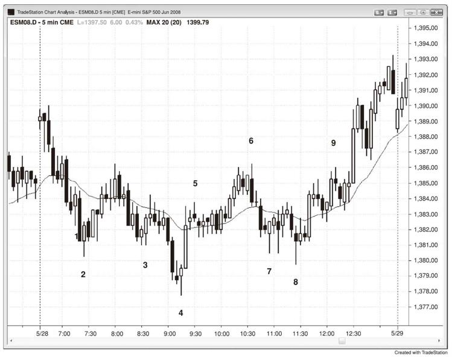
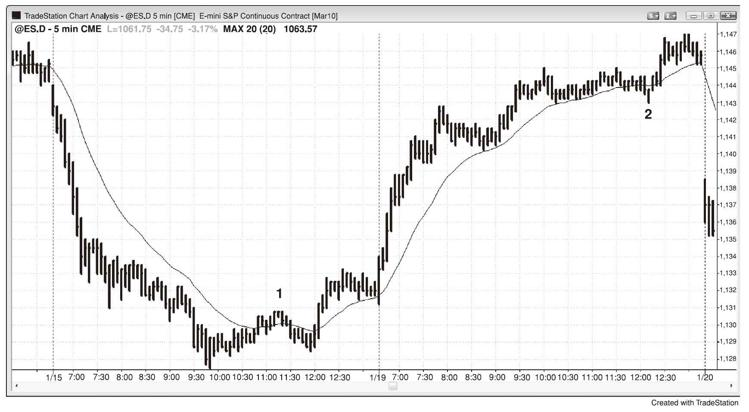

# 第14章　第一根均线缺口K线
通常市场在形成二十缺口K线的建仓形态后测试极点，而下一轮均线测试的穿越程度会更大。一根K线可能完全在均线的另一侧形成，这是一根均线缺口K线，有时候也可能是一个二十缺口K线回调的建仓形态。缺口是一个总体概念，简单来说就是图上的两个点之间的间隙。举例而言，如果今日的开盘价高于昨日的收盘价，这就是一个跳空缺口。如果开盘价高于昨日的高点，日线图上就会显示缺口。使用广义定义可以发掘更多交易机遇。举例而言，如果有一根K线的高点位于均线下方，那么在K线与均线之间就有一个缺口。在牛市或盘整市中，市场填补缺口的概率很高。有时候一根K线会越过前一根K线的高点，然后在一两根K线之内，该回调恢复下跌。如果市场再一次越过前一根K线的高点，这就是第二个均线缺口K线的建仓形态，或者是上涨趋势中第二次试图填补均线缺口，有很高的概率从该建仓形态开启一轮可供交易的上涨行情。与之类似，均线上方的缺口倾向于在下跌趋势或盘整行情中被填补。

如果有一轮强劲趋势，而这是趋势中第一根均线缺口K线，后面市场通常会测试趋势极点。这种至缺口K线的回调通常足够强而突破趋势线，在市场测试趋势极点之后，通常会形成一轮两条腿的调整，甚至重大趋势反转。举例而言，如果有一轮强劲的上涨趋势，最终出现一根K线的高点低于均线，然后下一根线越过该K线高点，那么市场将会试图形成对上涨趋势极点的更高高点或更低高点测试。交易者将买入做波段交易，预期市场将接近或越过旧高。如果均线下的回调继续下跌，一些交易者会分批加仓（这在第31章的分批建仓和离场中探讨）。如果市场上涨测试旧的高点，然后反转下跌，通常会形成一轮更为持久的调整，一般至少有两条腿，经常引发趋势反转。

大多数图上的大多数K线都是均线缺口K线，因为大多数K线都不碰触均线。然而，如果没有强劲趋势，交易者做淡出交易（如在均线上方的K线低点下方一个跳点处卖空），他们通常只是想要刮头皮，会在市场运行至均线时止盈。只有在市场与均线之间有足够的空间获利并在当前的价格行为下合理的时候，交易者才会做这笔交易。因此，如果有一轮强劲趋势，第一根均线缺口K线倾向于提供波段交易的机会，如果没有强劲的趋势，而交易者做了均线缺口K线的交易，他更可能是在刮头皮。

如图14.1所示，K线2是市场第二次试图填补盘整市中的均线下方的缺口。下跌动能较强，也可以说市场在今日并非盘整，但是由于昨日的强势收盘，移动平均线基本平行。同时，有多根K线与其前面一根或两根K线交叠，并且K线2是由当日第三根和第四根K线构成的双K线急速下挫后的第三段下跌。多头在K线2高点上方一个跳点处设置停损买单做多，准备在市场测试均线时刮头皮止盈。

图14.1　均线缺口，第二信号

K线3、4和8也是第二次尝试（第一次可以只是一根上涨趋势K线），或第二个均线缺口K线入场点。

K线5是一根均线缺口K线，但是交易者不会预计其跌至均线而刮头皮卖空，一方面是因为没有足够的刮头皮空间，另一方面是因为其跟随在一根强劲的反转上涨K线和一个更高的低点之后，在K线4的更低低点反转上涨之后，很可能出现第二腿上涨。

K线6和K线9是第二个均线缺口K线的卖空建仓形态。一旦市场向上突破K线9，就形成了一轮上涨趋势，因为两次下跌试图均失败（K线9是第二个均线缺口K线的建仓形态，意味着它是第二次试图关闭其与均线之间的缺口）。

K线7是一个均线缺口K线的建仓形态，但是由于其至均线的空间太小，交易者不太可能单凭其为线缺口K线而刮头皮做多。

**本图的深入探讨**

市场在图14.1中向上突破，但是当日第一根K线是一根小型K线，因此并非是一个突破失败做空的可靠信号。第三根K线是一根强劲K线，因此是潜在的开盘下跌趋势的更好建仓形态。

K线6是一轮急速与通道的上涨趋势中的一根外包下跌反转K线，这一轮上涨始于K线4之后的急速拉升。

K线8是始于K线7低点的小型扩展三角形的信号K线，也可以被看作是一个楔形，因为市场向下突破小型双重底并失败。K线8还是K线4底部之后的楔形牛旗，三段下跌分别是K线5后一根K线、K线7和K线8。最后，K线8是K线4的更低低点后的急速拉升至K线5之后的更高低点。

K线9上方的突破对象是一个失败的楔形熊旗，因此很可能出现一轮等距上涨。三段上涨分别是K线8的两根K线之前，K线9之前的波段高点和K线9。

第一根均线缺口K线可以引发市场测试趋势极点。如图14.2所示，K线1和K线2均为强势趋势中的第一根均线缺口K线，之后市场测试了趋势极点。K线1是下跌趋势中的第一根低点位于均线上方的K线（K线与均线之间存在缺口），之后市场以更高低点测试了下跌低点，K线2后市场创出新的趋势极点。

图14.2　均线缺口和极点测试