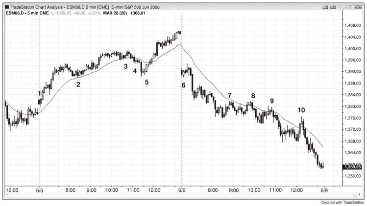
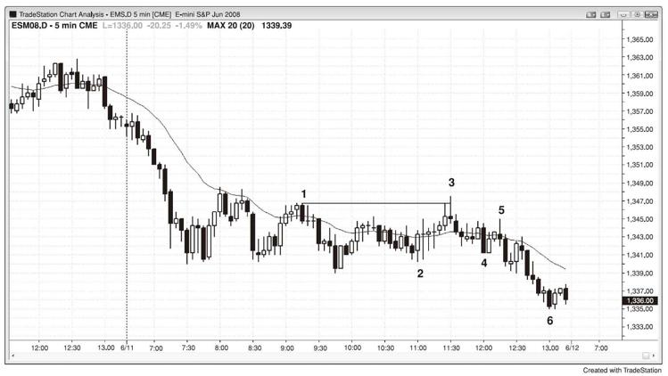
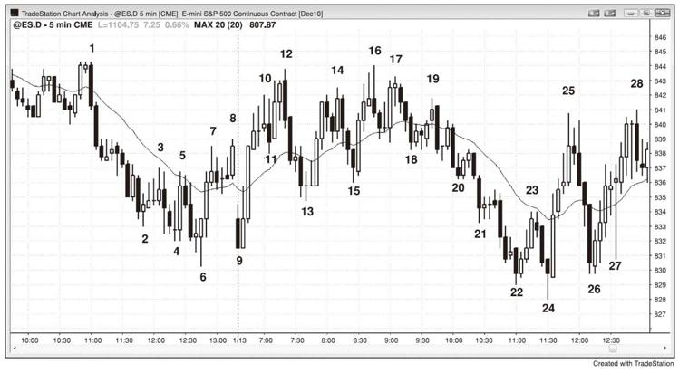

# 第15章　形成突破和反转的当日关键转折时点
市场经常在太平洋标准时间早上7：00和7：30前后一根K线之内的经济报告时间和早上11：30时突破或反转，发生在早上11点和中午的时候较少。在强劲的趋势日中，经常会有一轮强劲的逆势恐慌行情吓跑很多人，这通常发生在早上11：00～11：30，不过也可以早一些或晚一些。一旦形势明朗，你被强劲的逆势行情所愚弄，趋势通常已经回到原先的极点，你和其他踏空的贪婪交易者将会追逐市场而推波助澜。什么导致了这种行情？机构受益于急剧的逆势行情，因为他们可以在更好的价位加仓，预期趋势在收盘前恢复。如果你是一名机构交易者，想要在收盘前建仓，你希望以好价格入场，你会去制造或助长能够导致短暂恐慌的传言，其可以清扫止损并导致市场刺破一些重要价位。传言和新闻是什么并不重要，是否有机构散播谣言牟利也不重要，重要的是，清扫止损行情让知道正在发生什么的交易者有机会搭上机构的便车，并从失败的趋势反转中获利。

清扫止损的回调通常突破一根重大趋势线，因此至新极点的行情（趋势线突破后的更高高点或更低低点测试）促使聪明的交易者在第二天的第一个小时内寻找反向交易。

这种类型的陷阱在交易区间日也很常见，市场在一个极点附近徘徊数个小时，看似即将突破，但是却急剧反转而突破另一个极点，而这一次反向突破经常在美太平洋时间早上11：30左右失败，这让之前做好突破准备的交易者踏空，又套住了在市场向另一个方向突破时入场的新交易者，大多数交易区间日收盘于中点附近。

如图15.1所示，尾盘的清扫止损行情中有两个二十缺口K线的建仓形态。K线5是美太平洋时间早上11：25之后的入场点，也是均线缺口建仓形态的第二入场点（第二个均线缺口K线做多建仓形态，K线4急速下挫的后一根K线上方是第一个入场点）。注意有大型实体并收于低点附近的下跌趋势K线有多强劲，这根下跌突破K线让弱势交易者认为市场已经转为下跌趋势。聪明的交易者则将其看作绝佳的买入机会，预计将是一轮衰竭性的抛售高潮和一次失败的突破。这种清扫止损行情通常突破重大的趋势线，并且由于后面通常创出新的趋势极点，因此其经常为下一日第一个小时内的反向交易奠定基础（这里是突破上行趋势线后创下更高的高点），并与上行通道的起点K线2形成一个双重底牛旗。在这两个交易日中，在市场两次或多次测试均线之后，均线缺口K线的淡出交易出现。在逆势交易者多次成功将市场拉回均线之后，他们建立了大力下注的信心，在均线远处形成一根缺口K线。然而，第一次远离均线的突破通常会失败，为预计的趋势恢复提供了一个绝好的淡出机会。

图15.1　尾盘扫止损

第一天，市场试图在早上7点反转下跌，猜测是因为报告。由于那个时候当日处于开盘上涨趋势中，而单K线的抛售是趋势中第一次回调，因此是一个买入建仓形态。反转失败之后出现一轮三K线的急速拉升，然后是一个通道。

第二天，早上7点的反转成功，成为一轮三K线的急速下挫，之后是一个下行通道。

第三天，市场试图从中午的最终熊旗反转上涨，但是反转在K线10的均线缺口卖空建仓形态中失败。

如图15.2所示，市场开盘进入下跌趋势，无法行至均线上方，交易者在期待美太平洋时间早上11：30出现多头陷阱，结果今日准时发生。K线3也是下跌趋势中的首根均线缺口K线。通常陷阱是一轮强劲的逆势行情，让满怀希望的多头激进买入，结果却是随着市场迅速反转下跌而被迫清仓，然而，始于K线2的上涨由重叠的大型十字线构成，显示交易者对两个方向均感到紧张。如果没有明确方向，交易者为何被套？K线3的前一根K线试图形成一个双重顶熊旗，却被K线3越过K线1的高点而破坏，这使得很多交易者放弃空头观点，迫使空头清仓，并且在突破时套住了一些多头。突破前的动能疲弱，因此很可能并没有太多的多头被套。然而，未与K线1形成完美的双重顶而让空头踏空。由于它是一个陷阱，随着踏空的空头需要在更低处卖空并追逐市场，以及被套的多头需要清仓，市场有下跌的理由。始于K线3的下跌行情的疲弱与始于K线2的上涨行情的疲弱相符，不过结果符合预期------收于当日低点，这是一个下跌趋势恢复日，但是由于趋势恢复如此之晚，之前又是一个窄幅交易区间并有强势的双边交易（相互交叠并具有长影线的大型K线），导致现在的下跌弱于开盘时的抛售。

图15.2　尾盘多头陷阱

交易区间日的美太平洋时间早上11：30也经常出现陷阱（如图15.3所示）。这里，市场在当日区间的上半部分运行数个小时之后，跌破当日低点，让多头踏空并套住新空头。市场于早上11：35在K线24上方给出一个二次入场的高2做多点。市场两次试图向下突破K线9的当日低点，但是均以失败告终，因此很可能会尝试反向运动。大多数交易区间日收于其中间的某个价位。

图15.3　交易区间日的尾盘陷阱

当日从第一根K线开启上涨趋势，在早上7：00回调至K线10信号K线下方，很可能是因为某种报告。由于有三根大型盘整K线，且影线突出，因此其代表小型交易区间，在其上方买入充满风险。市场因报告而暂时下破，套住空头，然后上破K线11，套住多头并让空头踏空，然后又在K线12第二次反转下跌。当有多空双方被套或踏空时，下一个信号通常至少可以刮头皮。

**本图的深入探讨**

在图15.3中，昨日收盘前的上涨是从一个楔形底开始的反转上涨，很可能至少有两腿。K线9的更高低点反转上涨足够接近于双重底，而美太平洋时间早上7：40的K线13更高低点是一轮双重底回调。由于从开盘时开始的上涨是一轮强势急速拉升，因此市场很可能试图在回调后形成一个通道，但是因K线12和K线1形成双重顶而失败。在接下来几个小时内出现多次急速下挫，最终形成一个下行通道，在早上11：30的K线24处反转上涨。早上11：00的K线22的反转试图失败。市场处于一个非常陡峭的下行通道，因此第一次通道突破后很可能是突破回调，并形成一个胜率更高的做多点，K线24就是信号K线，也是第二次试图从当日新低反转上涨。

拉升至K线12的行情形成一个楔形熊旗，K线5和K线8是前两段上涨。市场的涨势太猛，因此不能在K线11突破始于K线9的窄幅上行通道时卖空，但是在突破回调至K线12的更高高点时卖空合理。更安全的做法是等待K线12的外包下跌K线收盘，看下空头是否能够掌控该K线。收盘于低点附近确认了空头强势，因此在其下方的后续行情开始时卖空是一个好的入场。