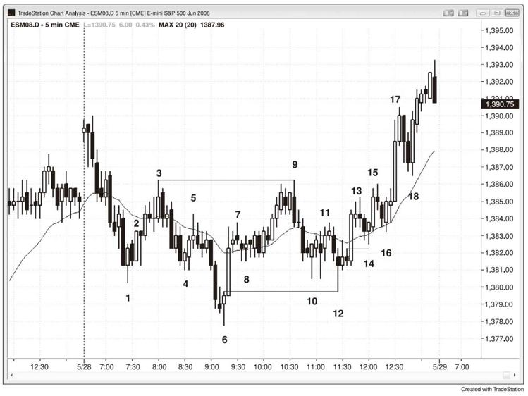
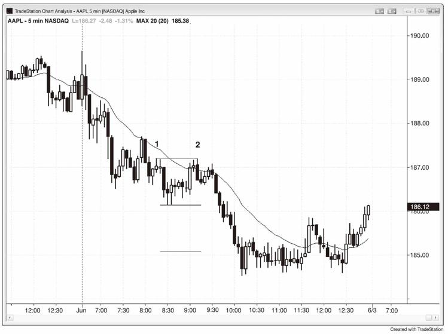
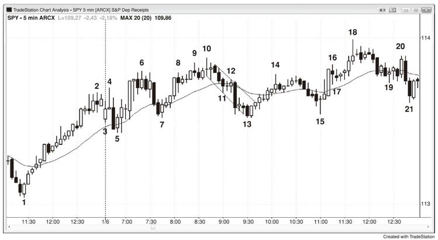

# 第16章　趋势和交易区间数腿
趋势通常有两腿。如果反转之后的第一腿动能强劲，多空双方都会猜测其是否能够形成一轮新趋势的多条腿中的一条。鉴于此，多空双方均会预期对旧的趋势极点的测试将失败，而顺势（旧趋势）交易者将很快离场。举例而言，如果在一轮持久的下跌趋势后出现一轮强劲上涨，这一轮上涨行情至行均线上方和下跌趋势的最后一个更低高点的上方，并且拥有多根上涨趋势K线，那么多空双方均会假设会有一轮低点测试，其维持在低点上方。一旦这第一腿上涨的动能削弱，多头会部分或全部止盈，空头则会卖空，以防空头能够维持对市场的掌控。空头不确定其趋势是否结束，因此他们愿意建立新的空仓。市场将会走低，因为在出现更多看涨的价格行为之前，多头不愿买入。随着多头在测试低点的回调中回归，新的空头将迅速离场，因为他们不想要在交易中亏损。空头回补的买盘将会助涨，然后市场会形成一个更高的低点。空头不会考虑再次卖空，除非这一腿行情在第一个腿上涨的高点附近削弱（潜在的双重顶熊旗）。如果应验，新的多头将迅速离场，因为他们不想亏损，而空头则会变得更加激进，因为他们会意识到第二腿上涨已经失败，最终有一方会胜出。每天这样的交易都在所有市场中上演，形成大量两条腿的行情。

实际上，在市场向一个方向运行一段时间之后，其最终会试图反转那一段行情，并且经常会尝试两次。这意味着每一轮趋势和逆势行情都很可能分为两条腿，而每一条腿都会试图再分成两条更小的腿。

在你寻找两条腿的行情时，你发现两条腿处于一个较为紧凑的通道之中（如楔形），它们实际上可能是第一腿的细分，而通道实际上可能只是两腿行情中的第一腿。如果这两条腿中的K线数目相对于其所调整的形态不足，那么这种情况就尤为可能。举例而言，如果有一个楔形顶持续两个小时，然后出现一轮三K线的急速下挫，再然后是一个三K线的通道，那么急速下挫和通道很可能只是第一腿下跌，在看到至少另一腿下跌之前，交易者将不愿重仓买入。

如图16.1所示，至K线6的下跌趋势以两条腿的形式出现，而第二腿又细分为两条更小的腿。至K线9的上涨也有两条腿，与至K线12的下跌一样。根据定义，所有的急速与通道形态均是两腿行情，因为先是一个高动能的急速阶段，然后是一个较低动能的通道阶段。

图16.1　两条腿的行情

K线12是对上涨行情起点的完美突破测试，其低点恰好等于K线6信号K线的高点，以一个跳点清扫K线6多头的平保。每当出现一轮完美或近乎完美的突破测试，市场将有很高概率出现一轮等距行情（预计始于K线12低点的上涨行情和K线6至K线9的上涨行情点数相同）。

市场以一轮两条腿的行情上涨至K线15，但是当其高点被越过之时，随着新的空头回补其在K线15处的失败低2建立的空仓，市场以急速拉升的形式快速上涨。K线9与K线3形成一个双重顶熊旗，其在始于K线16中失败，也助涨了上行突破。

如图16.2所示，苹果在五分钟图上表现规范，其在K线2形成一个双重顶熊旗（低于K线1的高点1美分），而下跌行情超过了交易区间两倍长度的大体目标。K线2还是下跌趋势中一轮至均线的两条腿行情，在均线处形成一个低2卖空，这是趋势中的可靠入场点。很多股票中的趋势都很尊重均线，意味着均线一直提供以有限的风险顺势入场的机会。K线2后的第四根K线形成一个双重顶回调卖空。

图16.2　双重顶看跌旗形

如图16.3所示，SPY由K线4、6和10形成一个楔形顶，后面通常会有一轮两条腿的横盘下跌调整，有一条三K线的熊腿在K线11结束，第二腿下跌则在K线13结束。这一段行情处于一个通道之内，其仅是更高时间框架下的单独一腿，规模与从K线7至K线10的牛腿相近，因此大多数交易者无法确定其是否包含足够多的K线来调整大型楔形。市场出现第二轮横盘调整至K线15，略高于K线13的低点，形成一个双重底，然后市场以急速和通道上涨至新的趋势高点。

图16.3　楔形顶