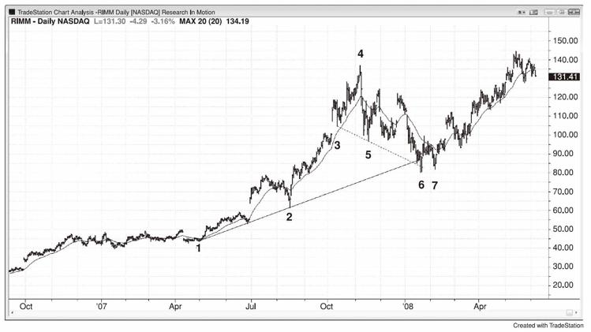
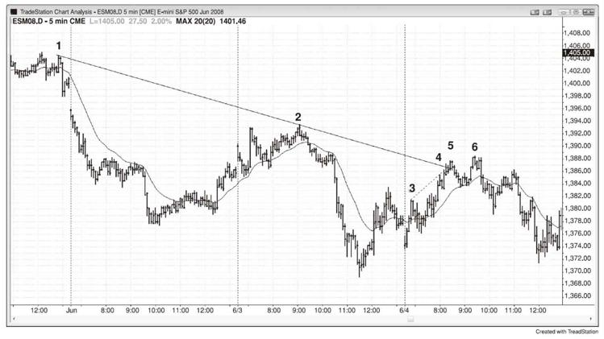
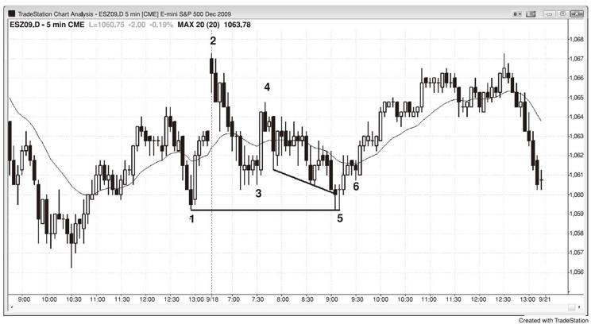

# 第19章　对决线：楔形回调至趋势线
当一轮回调受限于趋势通道线并在更高时间框架的支撑或阻力线处结束时，这就是一个对决线形态，经常形成较大趋势方向的可靠交易。它是一轮短期趋势（回调）在一轮长期趋势的支撑（上涨趋势中）或阻力（下跌趋势）处结束。所有的回调均以对决线形态结束，尽管支撑或阻力线并非总是明显。任何类型的支撑或阻力都可以是强手入场并终结回调的区域。每当交易者看到回调接近趋势线、趋势通道线、移动平均线、前期波段高低点或其他重要价位，他们就应该注意能够结束调整并恢复趋势的建仓形态。当他们看到这个建仓形态，他们就有机会做一笔好交易。记住，交易日渐被数学控制，因此回调的结束都事出有因。上涨趋势中的回调总是在支撑位结束，而下跌趋势中的回调总是在阻力位结束，因此所有的回调均是对决线形态。不过我将此术语留给那些交易者看到支撑或阻力，这样交易者可以预测可能的趋势恢复并下单交易。最可靠的形式是回调处于通道，有楔形形状或三段行情，回调结束的信号K线刺破趋势线并反转。举例而言，如果有一轮上涨趋势，出现一轮楔形回调，其在上涨趋势线处结束，而楔形牛旗下方的趋势通道线则下降，并且与正与上涨的上升趋势线相交，这时回调正形成一个买入信号。支撑线可以是一根水平线，如横穿一个前期的波段低点，其可能在楔形结束的过程中形成一个双重底买入信号，支撑也可以是移动平均线的形式。当这种情况发生时，如果有一个充分的建仓形态，寻找机会介入趋势方向。

作为另一个案例，观察下行通道中是否有一腿上涨。如果有，则看一下其是否为三段。如果熊市上涨在测试从其高点画出的趋势通道线时也在测试下降趋势线，那么上涨行情结束而市场将反转下跌测试通道下边界的概率很高。如果市场此时确实下跌，那是因为其同时测试两根阻力线，尽管其中一根上涨而另一根下跌。两种类型的阻力同时影响市场，提高了交易胜率。

所有的回调均在对决线形态结束，即便长期支撑并非显而易见。回调是较大趋势中的反向小趋势。所有的回调结束都事出有因，牛市回调总是在一些长期支撑位结束，如趋势线、等距行情目标或前期波段高低点。如图19.1所示，从K线3至K线5画出的下行通道趋势线形成K线6的支撑，在画趋势线和趋势通道线时，所有的波段点位都应该考虑，即便出现前一轮趋势。K线3是上涨趋势中的一个波段低点，K线5是一轮可能的新下跌趋势调整的波段低点，下跌至K线6的行情成为牛市中的一轮大型两腿调整。在K线6处有一个对决线形态（相反方向的上涨趋势线和下跌趋势线），市场在交汇处反转，这很常见。由于下跌至K线6的行情急剧，因此有理由等待K线7更高低点处的第二入场，在其高点上方一个跳点处停损买入。

图19.1　对决线回调

下降趋势通道线还可以基于K线4高点后的两个波段高点的趋势线，然后将其平移锚定K线5。目标是观察整体形状，然后选择能够容纳价格行为的趋势通道线，之后，观察市场穿过通道线后如何反应。

图19.1中的K线6是一个楔形牛旗。在市场下跌至K线6之前，还有一个双重顶熊旗，而上涨顶点后的双重顶熊旗可以被认为是一个更低的高点，其拥有两个极点。

如图19.2所示，K线5测试了下降趋势线，并在那里穿过了一根较小的趋势通道线（K线3至K线4），在对决线形态形成一个卖空刮头皮的机会。K线6的名义更高高点处有第二入场。由于上涨至K线5的行情如此强劲，在市场向下突破陡峭的上行通道并测试均线后突破回调至K线6的更高高点并不意外，通道并未显示，其在急速拉升至K线3之后。

图19.2　对决线

图19.3是一个对决线的变体，其长期支撑以前期波段低点处的水平线的形式出现，结果是一个双重底，其在该交易区间日的当日新低处引发反转上涨，开盘抛售是急速下挫，K线4至K线6的行情是通道。

图19.3　对决线变体

**本图的深入探讨**

市场在图19.3中向上突破一个波段高点，但是今日第一根K线是一根下跌趋势K线，形成一个失败的突破卖空。这也是一个扩张三角形顶部，不管使用昨日美太平洋时间11：05还是11：55的K线作为第一段上涨。有一轮急速拉升至K线4，之后是更低低点回调至K线5，其与K线1形成双重底牛旗，这引发了一轮持续三个小时的上涨（K线4急速拉升后，从K线5开始的通道上涨），然后在收盘前抛售。尽管这是一个交易区间日，但是其在日线图上显示为下跌趋势日，因为它开盘于高点附近并收盘于低点附近。