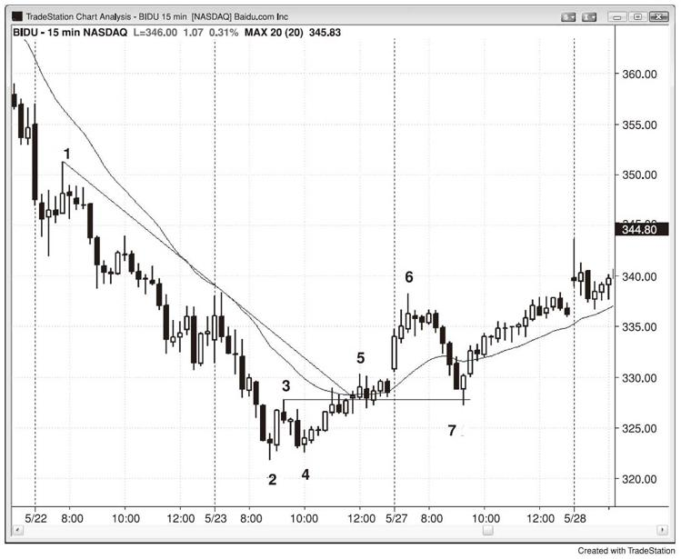
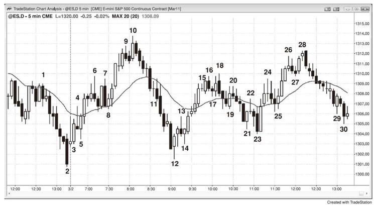

# 第24章　刮头皮、波段、交易和投资## 第五篇 · 订单和交易管理只知道如何读图并不意味着你可以以交易为生。你需要有一个出入场的计划，并不断对持有的仓位做出决策。投资者根据基本面购买股票并计划持股六个月至多年，通过时间让有利的基本面反应到股价上。如果股票走势对其不利，投资者经常加仓，因为他们相信该股票在当前价位具有价值。交易者使用日线图，对收益报告和产品发布等短期基本面事件进行交易，目的是抓住一轮快速行情，持续一天至多天。交易者会在市场第一次停顿时止盈部分仓位，然后将止损移至盈亏平衡位，他们不愿意让盈利变为亏损。交易者有时候被称为刮头皮者，但是该术语通常指的是日内交易者的一种类型。顺便提及，坚持你的时间框架很重要。造成亏损的一个常见原因是，执行一笔交易，看着它变为亏损，未在计划的止损位离场，而是说服自己可以将交易变为投资。如果你做的是交易，那就将其作为交易而离场并承担损失。否则你将不可避免地持仓过久，其损失将比你最初设想的最坏情形高很多倍。更重要的是，这将不断让你分心，干扰你执行和管理其他交易的能力。在使用日线至月线时间框架的交易者和投资者眼中，所有的日内交易都是刮头皮。然而在日内交易者的眼中，刮头皮是持仓1至15分钟左右，通常以限价订单在止盈目标离场，试图把握其交易的时间框架上的一小腿行情。总体而言，其潜在回报（至盈利目标的跳点数）与风险（至保护性止损的跳点数）的规模大体相等。刮头皮者不想要任何回调，如果其交易在触及目标之前就折返，他们会迅速以盈亏平衡离场，因此刮头皮者与日线图的交易者类似。日内波段交易者会持仓熬过回调。他们试图捕捉当日的两至四个较大的波段，每个仓位持有15分钟至一整天。他们的潜在回报通常至少为风险的两倍。他们与日线图上的投资者类似，他们原意持仓熬过回调。在90年代，媒体和机构投资者嘲笑日内交易者，认为他们是赌徒而不创造任何价值。当时的日内交易者大多为刮头皮者。批评者完全忽视了所有交易者都提供的一个重要功能，即提高流动性从而降低买卖价差，让所有人的交易都更便宜。大量批评很可能出自华尔街上的成名机构投资者。他们认为掌控了游戏，自己就是国王，任何不按照其方式参与游戏的人都不放在眼里。他们努力获得MBA学位。一个高中辍学生在理论上只要花几个月学习简单的交易技巧就可以发财，他们认为这不公平。他们享受被万众敬仰的感觉，并在某种程度上憎恨这些学历不高的新贵所获得的关注。一旦高频交易公司成为华尔街上交易量最高的交易者，并创造了远远好于传统机构交易者的业绩记录，媒体给与他们的关注和尊重超过那些自华尔街创立以来就开始统治的恐龙。CNBC的FASTMONEY节目每天都有经常刮头皮的交易者，他们被描绘为令人敬重的成功交易者。现在的整体感觉是，作为交易者赚钱非常困难，如果你能做到，你就应该得到大量尊重，尤其是来自于其他交易者，而不管你怎样交易。重要的只是业绩，这也是资本主义社会所应有的样子。成功的投资者、交易者、日内波段交易者和刮头皮者都应该得到同样的尊重和敬畏，因为他们都在做特别的事情，需要非凡才华和大量努力才能做到。正如第25章关于交易者方程的内容中所探讨的，波段交易者是所有刮头皮者的对手方，但是他们也是反方向的波段交易的对手方。刮头皮者的回报与风险接近，但是有高胜率。不可能有一个反方向的刮头皮交易具有同样的风险、回报和胜率。举例而言，市场不可能同时具有60%的概率在下跌两个点之前先上涨两个点和60%的概率在上涨两个点之前先下跌两个点。看一下上涨趋势，如果一位多头交易者在Emini上的可靠回调中的一根强劲信号K线上方一个跳点处买入，他的入场价是1254，那么他的两个点止损就是1252，而他的盈利目标是1256。多头只有在认为其很可能会成功的时候才会做这笔交易，暗示他需要至少有60%的把握，意味着市场跌至1252而触发他的止损的概率为40%或更低。如果一位空头刮头皮者是这笔交易的对手方，他在1254卖空，他的止损在1256，盈利目标在1252。由于市场跌至1252的概率为40%或更低，该空头有40%或更低的概率达成盈利目标。实际赢率总是会更低，因为要让其止盈限价订单成交，市场通常需要越过目标一个跳点，其可能性甚至更低，因为这是更大的行情。由于这种数学，刮头皮交易的对手方会有更低的胜率。由于在非常有效的市场中，机构掌控价格行为，发生的每一笔交易中都有一家或多家机构愿意做一个方向而一家或多家机构愿意做另一个方向（没有什么事情是绝对的，但是这非常接近）。这意味着对于一笔合理的刮头皮交易的对手方，如果他要获得有利的交易者方程，他需要回报大于风险（你需要假设他能，因为他是机构，或者在追随机构）。这使得他成为一名波段交易者。由于波段交易的胜率经常为40%或更低，波段交易者可以做刮头皮的对手方并依然有正的交易者方程。如果市场下跌两个点的概率为40%，试图赚取两个点以上的波段空头有不到40%的概率成功。然而如果他正确管理交易，他依然可以使用该策略稳定盈利。举例而言，在分批建仓章节后的讨论中，你将看到他可以使用比两个点大很多的止损，他可能愿意在市场走高时分批加仓多次。如果这样，他的胜率可能达到60%或更高。一旦市场最终下跌，他可以在最初入场位1254平掉全部仓位。如果他在最初的卖空入场价位平掉全部仓位，他将在第一笔入场中盈亏平衡，而在从更高价位卖空的交易中获利。要在5分钟Emini图上有效刮头皮，在目前日均区间为8至15点的情况下，你需要承担约两个点的风险，你的盈利目标通常在一至三个点之间。在一个点的刮头皮中，你需要胜率超过67%才能盈亏平衡。尽管部分交易者可以做到，但是对于大多数人并不现实。作为一条整体规则，只有在潜在回报至少与风险一样大并且你对这笔交易有信心时才做。如果你有信心，你要相信胜率至少为60%。在Emini中，两个点的止损目前是大多数基于5分钟图的交易的最可靠止损（日均区间为10至15点），这意味着你的盈利目标至少也应该为两个点。如果你认为两个点的目标不现实，那就不要交易。顺便提及，我在多年前有一位朋友习惯一次交易100张Emini合约，每天约做25笔交易，每一笔交易刮头皮赚取两个跳点。鉴于他住在一栋12000平方英尺的房子里，我想他做得不错。不过这属于高频交易领域，大多数交易者难以成功。我的另一个朋友曾经告诉我，一位我们都认识的人曾在华尔街上做律师赚了数百万美金，而做交易几乎全部输光。他很可能认为自己比那些做交易赚取数百万的客户都要聪明，自己也应该至少做到同样水平。在刚开始几年，他刮头皮交易100张Emini合约，输掉200万美金。他可能很聪明，但是却并不明智。看起来简单并不意味真的简单。所有人都想过精挑细选（CherryPicking）的问题。与其担心每天做20笔交易并试图每次赚1个点，为什么不只做当日最好的三笔刮头皮交易并试图每次赚1个点呢？理论上可行，但现实是如果你等待完美的交易如此之久，如此努力地研究长期学习识别这种出色交易的必要技能，你需要确保你获得足够的回报，一个点不够。举例而言，如果你相信你正要买入当日最好的一两个建仓形态之一，你应该假设市场认同该建仓形态强势。这意味着行情很可能明确转为多头，市场很可能会出现至少两腿上涨，抵达某个等距上涨目标或磁体区域，并且这一轮行情应该至少持续10根K线。不要在承担两个点的风险时刮头皮赚取一个点，而是要至少赚取两个点甚至四个点，这样要有意义的多。如果你的情绪应付不了，你发现自己总是在第一轮回调时的盈亏平衡位离场，你或许可以尝试在入场后设置一个OCO环订单，你的保护性止损为两个点，止盈目标也是两个点。一旦其中一个订单成交，另一个订单就会自动撤销。然后出去散步，一个小时后再回来。重复几次之后，你可能会尝试使用三四个点的盈利目标而不是两个点，你可能很快就会发现自己每天在这些交易上平均赚取四个点。一些刮头皮者只做刮头皮交易，但是很多交易者会根据情况而决定刮头皮还是做波段。第二组刮头皮者的刮头皮概念是他们并非交易明显的始终入场情况。如果他们在刮头皮，他们一定是认为没有明显的趋势，或者是他们在逆势交易，否则他们会做波段交易。即便市场处于趋势中且交易者在回调入场，如果他们刮头皮，他们就是认为趋势即将结束，至少是短期内。举例而言，如果他们在一个牛旗中买入，但是却刮头皮离场，他们是怀疑市场正要进入交易区间。如果他们不这么认为，他们会持仓追求更大利润。每当交易者看到市场在信号K线后回调三至四个跳点，这是大型交易者相信市场不会走很远的表现。鉴于此，交易者只会考虑区间交易或逆势交易，而不是趋势交易。这意味着市场很可能处于交易区间，交易老手会倾向于刮头皮而非波段交易，准备低买高卖。当交易者逆势交易时，他们经常会交易较小仓位，如半仓，因为他们愿意在市场走势对其不利时加仓。如果他们这样做，他们可能会在市场回到其第一次入场的价位时离场。这样他们在第一笔入场中盈亏平衡而在第二笔交易上刮头皮获利。每当交易者刮头皮，其盈利目标经常只有波段交易的最小目标的一半左右，但是其风险通常一样。这意味着其回报和风险大体相等，因此他们需要至少70%的成功率，否则这种方法就是一种输钱策略。分批建仓可以提高胜率，但是权衡是风险增大，因为你的仓位变大。尽管刮头皮看上去简单诱人，但是很难交易获利。如果你在盈利几个点后部分止盈，然后使用盈亏平衡的止损将部分仓位做波段交易，这降低了所需的赢率。如果你在入场K线收盘后将止损从信号K线的极点移至入场K线的极点（两者下方一个跳点处），然后在五个跳点的行情之后将其移至盈亏平衡位，这进一步降低了当日盈利所需的赢率。还有一些刮头皮者使用三至五个点的较宽止损，在市场向对其不利方向运动时加仓，然后使用较宽的盈利目标，这也进一步降低了所需的赢率。总而言之，如果你看到一个建仓形态，认为它是一笔胜率很高的交易，该交易很可能是刮头皮而非大型波段。这是因为每当出现这种明显的失衡时，市场就会快速修正，因此非常高胜率而相对低风险的情况不会持续超过一两根K线。波段交易者与刮头皮者使用同样的建仓形态和止损，但是每天专注于几笔交易，其很可能有至少两腿。他们通常可以在每笔交易的部分仓位上净赚四点或更多，然后将止损移至盈亏平衡位。多数交易者允许交易向对其不利的方向运动，并且会在更好的价位加仓。然而，他们总是至少会有一个心理止损，如果市场达到那个点，他们会认为其思路不再有效，他们将止损离场。总是寻找刮头皮者的止损所在，如果形态依然有效，准备在该点位加仓。如果你在你认为的反转中买入，考虑允许市场创下更低的低点，然后在第二个入场点加仓。举例而言，在苹果（AAPL）这种可靠的股票上，如果你在你认为的行情低点附近买入，并且整体市场不处于下跌趋势日，那么考虑在这笔交易中承担两三美元的风险，在浮亏一两美元的时候加仓。不过，只有对自己解读价格走势图的能力十分自信并在解读错误时能够接受大额亏损的交易老手才能尝试。在大多数交易日，市场应该立即向你的方向运动，因此这不是问题。波段交易者可以在建仓获得合理盈利后在每一个后续信号中加仓同样大小。整体仓位的止损就是最近一次加仓的止损，通常意味着他们将在之前的入场中获利，即便在最后一次入场中亏损。如果市场产生一个反方向的信号，他们也会在其追踪止损被触及之前离场。所有人都想要非常高的赢率，但是极少数人获得持续在70%或更多的交易上盈利的能力。这就是为什么能够在Emini上刮头皮一两个点为生的人如此之少，尽管几乎所有人在出道时都尝试过一段时间。大多数交易者要想成功，需要学会接受更低的赢率，并培养耐心做波段交易，允许中途出现回调。即便是非常成功的刮头皮者，除非他们愿意偶尔做波段交易，否则他们通常无法把握一些持久趋势，其成功率经常为60%或更低。很多非常出色的交易者在这些时候安静观望，只是等待高胜率的刮头皮，经常错过大行情。这是一种可以接受的交易方式，因为交易的目标是赚钱，而不是不停地交易。当Emini的日均区间为10至15点时，通常每天至少有一笔交易，交易者可以市价入场并用限价订单以四个点盈利离场。由于99%的交易日有至少为五个点的区间，理论上交易者可以用限价订单入场并赚取四个点，但是小型区间日里几乎没有人能持续做到。总体而言，交易者更容易发现用停损订单入场并用限价订单或追踪止损离场的建仓形态。90%的交易日至少有一轮四个点的波段，在大约10%的交易日里有约5轮四个点的波段。大多数交易日都有一到三个交易者可以用停损入场赚取四个点的波段。如果交易者每天做10至15笔交易，那么大多数交易都是刮头皮。然而，强势刮头皮者知道一个建仓形态是否有足够的几率成为一个四至十个点的波段，并在这种情况下用四分之一至一半的仓位做波段交易。一旦他们平掉刮头皮仓位，如果在市场在向其波段方向前进的过程中出现另外的入场点，他们通常会在建仓形态形成时再次建立刮头皮仓位。波段交易要比交易者在当日结束后看图的感觉难多了。波段的建仓形态或者不明确，或者明确但惊悚。大多数波段的建仓形态有40%至50%的几率引发一个波段触及交易者的盈利目标。在其他50%至60%的交易中，或者是因为交易者认为盈利目标不再合理而在其被触及之前离场，或者是其保护性止损被触发。大多数波段交易者在反转中入场，因为如果他们想要赚取四个点或更多就需要尽早入场。当一轮趋势尤为强劲时，他们可以在回调中入场，或者在强劲急速拉升中的一根K线收盘时入场，赚取四个点，但是这种情况一个星期只有几次。大多数波段交易者试图在某种双重底买入，在某种双重顶卖空，或者在当日最初几个小时内的一些可靠的开盘反转建仓形态中入场。他们经常需要多次在反转中入场才能遇到一个大波段，但是他们依然可以赚钱，在余额上，在未能达到四个点目标的交易上。这些交易成为刮头皮。举例而言，如果一位交易者在第一个小时内的双重底买入，然后六根K线之后市场形成一个合理的双重顶，交易者可能反水卖空，可能在多头交易上赚到一两个点。正如刮头皮者有时候做波段一样，大多数波段交易者都做很多刮头皮。一旦波段交易者认为其假设不再成立，他们就会离场，通常是以刮头皮的形式。当波段交易者看到一个合理的建仓形态之后，他们需要做这笔交易。波段交易的建仓形态几乎总是看上去不如刮头皮的建仓形态确定，这种较低的胜率容易让交易者等待。当出现一根强劲的信号K线时，其通常是作为一个情绪高涨的反转的一部分，而交易新手依然认为旧趋势有效。交易新手通常对此没有准备。他们或许认为旧趋势依然有效，或许是在今日早期的几笔逆势交易中亏损而不想要继续输钱。其拒绝导致他们错过早期入场。在突破中入场或在突破K线收盘后入场很难，因为突破的急速行情经常很大，交易者需要快速决定承担比其平时高很多的风险。这就是为什么他们最后经常选择等待回调。即便他们降低仓位，使其风险与平时一样，亏损两至三倍跳点的想法依然吓到他们。在回调中入场很难，因为每一轮回调都始于一轮小型反转，他们担心回调或为深幅调整的开始。结果是他们等到当天几乎快结束，然后最终判定趋势明确，但是现在已经没有足够的时间来交易。趋势会尽其所能来让交易者踏空，这是让交易者整日追逐市场的唯一方法。当建仓形态简单明确时，行情通常是小而快的刮头皮。如果行情会持续很久，其需要模糊且难做，让交易者观望踏空，迫使他们追逐市场。波段交易者总是好奇，是否应该早一点离场，在盈利目标被触及之前？一个有助于决策的方法是，想象一下你空仓，考虑是否应该用波段交易的仓位以市价入场并使用与波段交易者完全一样的保护性止损。如果你不会做这笔交易，那么你应该立即平掉你的波段仓位。这是因为持有你当前的波段交易在金钱上与在当前价位用同样仓位和止损发起新交易等同。如果交易并不如预期般发展，大多数波段交易者会刮头皮离场，而大多数刮头皮者会在其最好的交易中用部分仓位做波段交易，因此两者的行为有很多交集。其根本不同在于，刮头皮者做很多交易，而大多数的交易的盈利不高，波段交易者则只做很可能至少有两腿的交易。没有哪一种方法优于另一种，交易者选择最适合自己个性的方法。如在第25章的交易者方程内容中所探讨的，波段交易通常不如刮头皮确定。这意味着胜率较低。然而，做波段的交易者追求大额盈利，其盈利通常至少为风险的两倍。这种较大的潜在盈利补偿了较低的胜率，可以形成有利的交易者方程。最大的波段来自于区间突破和反转，而大多数反转形态是交易区间。这是不确定性最高的地方，其胜率经常为50%或更低。波段交易者需要寻找回报远远高于风险的建仓形态，以此来补偿其较低的胜率。刮头皮的确定性高很多，但是高水平的确定性意味着市场明显严重失衡，而严重的失衡很快就会让交易者发现并纠正。结果是市场很快回归混沌（交易区间）。刮头皮者需要快速决定下单和止盈，因为行情通常会在几根K线之内回到入场价。波段因为不确定性而持续很长时间，这通常是任何持续多根K线并覆盖很多点数的交易的重要成分。这是经常在强劲的上涨趋势中所提及的忧虑之墙，其在强劲的下跌趋势中以相反的形式起作用。趋势始于小型或大型的急速行情，然后演变成小型或大型的通道。当突破较小的时候，交易者不确定其是否有后续。当其又大又强时，不确定性以一种不同的形式存在。交易者不确定留在交易中所需要承担的风险有多少，高风险下的交易者方程是否有利。他们看到大型的急速行情，意识到他们可能需要承担市场跌至急速行情另一边的风险。这种风险的提高导致仓位要小的多。然后他们在市场进入通道时追逐市场，因为他们的最初仓位小与其所想要的。然后通道有成为双边市场的不确定性。在交易日结束时，初学者将在图上看到一轮强劲的趋势，好奇自己为何错过。原因是所有的大行情在开展时不确定，这让交易者踏空最强劲的趋势。其经常还会让交易者陷入逆势交易之中，导致不断亏损。即便是一个初学者知道一点概率，感觉趋势是一个低概率的事件，其就是如此。最强劲的趋势一个月只出现几次，因此初学者知道一个交易日成为这些强劲趋势日的一天的概率很小。结果是他们拒不承认，或者踏空，或者对其对抗并不断亏损。他们应该学会接受并跟随市场。如果市场不停上涨，即便其看上去疲弱，他们也需要至少买入一个小仓位，用它做波段交易。波段交易的交易管理与始终入场交易一样，不同之处是波段交易者倾向于在市场对其不利时分批离场。真正的始终入场交易者坚定持仓，直到出现反方向的信号，然后反手。对于大多数交易者，波段交易的入场和止损与趋势交易相同。一个重要的不同是，大多数波段交易者对待交易区间内的离场与趋势中不同。在趋势中，他们更有可能让部分仓位奔跑，直到出现反方向的信号，但是在交易区间中，他们更有可能在交易区间的极点附近平掉剩余仓位。那个时候，他们判断行情是足够疲弱和反转形态是否足够强劲，从而应该寻找反方向的波段，还是说波段足够强劲而应该等待回调并在最初反向的第二腿再次入场。当Emini的日均区间为10至15点时，交易者通常可以使用两个点的保护性止损，大多数好的交易都不会被清扫出局，很多波段交易者会在盈利两至四个点的时候根据情况部分止盈。如果交易者认为市场处于交易区间，他们正在底部的反转上涨中买入，等距上涨的概率通常为60%或更高。由于他们承担两个点的风险，他们有60%的机率在止损被触及之前赚取两个点。这形成一个刚好可以接受的交易者方程，因此交易者可以在两个点时部分止盈。如果交易者相信交易区间足够高而能够让他们赚取三四个点，他们可能在那个价位部分或全部止盈。其他交易者会在阻力位对多仓部分止盈，如等距行情目标位处的小型反转，前期波段高点的上方，以及下降趋势线和上涨趋势通道线的过靶和反转（失败的突破）。他们将在类似的支撑位对空仓部分止盈。只要出现强劲的反转信号，所有的交易者都会平掉最后的仓位。记住，他们会在疲弱的反转信号前部分或全部平仓，但是通常不会反手。这是因为交易者离场与入场使用的标准不同。他们在入场前要求一个更加强劲的信号，但是会在与其仓位相反方向的较弱信号中部分或全部止盈。有很多方法可以波段交易获利，唯一的重大问题是交易者方程。只要数学合理，该方法就有利可图，因此也合理。交易老手可能在交易Emini时主要刮头皮，追求两至四个点的盈利（日均区间约为10至15个点时），而在交易股票时则是波段交易者。如果你是这些能够在80%或以上的交易中盈利的极少数交易者之一，那么你可以在Emini上做一个点的刮头皮。在四个跳点的盈利之后用限价订单平掉部分或全部仓位，这通常要求行情在信号K线之外延伸六个跳点（入场点在信号K线外一个跳点处，然后你需要盈利四个跳点，你的限价平仓订单通常在市场越过你的目标一个跳点之前不会成交）。Emini上的四个跳点等于一个点，相当于SPY（ETF合约）上的10美分（10个跳点）行情。那么初学者应该怎么做？如果刮头皮的盈利目标低于其风险，大多数交易者都会输钱，即便他们在60%的交易中盈利。初学者对他们认为的60%胜率建仓形态也经常判断错误。很多交易实际上最高只有50%的确定性，尽管交易时其胜率看上去要高很多。他们很可能会认为只需要多点经验将胜率提高至70%至80%，这样就能在数学上获得优势。现实是他们永远都不可能变得那么厉害，因为只有极少数最厉害的交易者能够做到。这就是简单的现实。另一个极端是波段交易的盈利至少为风险的两倍。此类建仓形态大多数只有40%至50%的确定性，但是这足以产生有利的交易者方程。在大多数交易日，一天内会有多个建仓形态，有时候甚至有五个或更多，并且大多数通常为重大趋势反转。如果交易者愿意做低胜率的交易（其回报需要至少为风险的两倍，如在第25章中所探讨的），他需要把握每一个合理的建仓形态，因为如果他精挑细选，数学将对其不利。一篮子此类交易的交易者方程为正，但是单笔交易大概率亏损，因为其胜率低于50%。胜率低是因为建仓形态看起来糟糕，入场之后依然弱势，通常在强劲趋势最终启动之前会有数轮回调。于是很多交易者选择等待趋势启动，这样胜率将达到60%或更高，尽管盈利降低。很多波段交易的建仓形态强劲，胜率为60%或更高。在这种情况下，每一笔交易都有正的交易者方程，精挑细选在数学上就可以接受。同时，数学对波段交易和刮头皮都有利。大多数交易者在出道时会实验波段交易和刮头皮交易，以及任何其他事情，如不同的时间框架和指标，看一下他们是否可以成功，以及一种特定风格是否更加适合其个性。没有一种最佳的方法，任何拥有正的交易者方程的方法都很好。很多交易者试图每天抓住5至10个可交易的波段，赚取至少与其风险一样大的盈利的概率为60%或更高。当他们这样做的时候，他们通常寻找微型双重顶卖空和微型双重底买入。如果交易者认为一个建仓形态强劲并很可能产生与其风险至少一样大的回报，那么其胜率至少为60%（第25章探讨等距行情的趋势概率的数学）。这使得交易者的止损可以和其盈利目标一样大，并依然有正的交易者方程。尽管这是大多数成功交易者所采用的风格，但是大多数初学者应该首先寻找强劲的波段交易建仓形态，即便其成功率通常只有50%至60%。这是因为当回报为风险的两至三倍时，交易者方程甚至更强，尽管其胜率更小。在Emini上，当日均区间约为10至15点时，寻找有很大机率有四个点（两倍于最初风险）或更多的波段，在盈利四个点的时候平掉部分或全部仓位。随着经验的丰富，交易者可以在两至四个点时平掉部分仓位，然后用剩余仓位做波段交易。如果他专注于这些建仓形态，他有不错的机会交易获利。如果交易者发现自己经常过早离场，他应该考虑设置OCO订单（一个订单在两至四个点时止盈，另一个订单在两个点或更少时止损），离开一个小时之后再回来。他可能会惊讶于自己瞬间成为一名成功的交易者。一旦趋势确立，在趋势方向加仓，大多数的交易是刮头皮，承担约两个点风险而赚取两个点，如果趋势非常强劲，则用部分仓位做波段。虽然听起来如此简单，但是交易从不简单，因为你是在零和游戏中与非常聪明的人竞争，收盘后看起来如此明显的形态通常在当时并不明显。需要很长时间才能学会交易获利，而且即便你做到了，你也需要保持敏锐，每天都遵守纪律。这充满挑战，但这是其魅力的一部分。如果你成功，财务回报可能巨大。在股票上，盈利目标的弹性很大。对于一只500美元的股票，其日均区间为10美元，刮头皮赚取10美分将是愚蠢的做法，因为你很可能会承担约两美元的风险，而你的胜率需要超过95%。然而，刮头皮赚取10美分或许在QQQ上值得，尤其是当你交易10000股时。对于平均区间为数美元的高成交量股票（每天至少交易300万股，但是最好为700万或更高），寻找波段相对较为容易。你想要最低的滑点，可靠的形态，以及至少每笔1美元的盈利。尝试刮头皮赚取1美元，然后在剩余仓位上使用盈亏平衡的止损，持仓至收盘，或者直到出现一个明确强劲的反向建仓形态。你或许能够每天关注约五只股票，有时候还能在一天的不同时间查看一下另外五只股票，但是你将很少会交易它们。Emini的刮头皮者很可能每天只能做几笔股票交易，因为Emini的日内交易耗费大量精力。同时，如果你在股票上只用线图，你可以在一个屏幕上查看六张图。选一只趋势最好的股票，然后在移动平均线附近寻找回调。如果之前出现强势趋势线突破，你看到趋势通道线过靶并反转，你也可以交易反转。如果Emini市场活跃，考虑只交易15分钟股票图，其要求的注意力较少。当你预期一轮重大行情或新趋势时，或者当你在一轮强劲趋势中的回调中入场时，在获得相当于最初风险一两倍的刮头皮盈利时，平掉25%至75%的合约，然后在市场继续向你的方向运动的过程中分批平掉剩余合约。在你平掉刮头皮仓位后将保护性止损移至盈亏平衡附近。有时候，如果你强烈感觉交易依然良好，平仓再入场的价格会更差，你会想要在Emini上承担多达四至六个跳点的风险。好的交易不应该回到原地而让后知后觉者与在完美时机入场的聪明交易者拥有同样的成本。如果这笔交易出色，所有错过最初入场点的交易者现在都非常渴望介入，他们会愿意以更差的价格入场，并在比最初入场价差一两个跳点的价位设置现价入场订单，这使得最初交易者的盈亏平衡止损不会被触及。然而，有时候最好的交易回撤越过盈亏平衡止损位而让交易者踏空一轮大而快的趋势。当这种情况看起来有可能发生时，多承担几个跳点的风险。同时，如果市场拉回扫掉这些止损，然后立即恢复新趋势，那就在前一根K线外一个跳点处再次入场或对波段仓位进行加仓（在一轮新的上涨趋势，就是前一根K线的高点上方一个跳点处）。如果市场触及盈利目标的限价订单但并未越过，而订单依然成交，这意味着趋势压力可能比图上所显示的更加强劲，市场将在接下来几根K线之内越过盈利目标的可能性提高。如果你做多，而市场愿意在行情的最高点处买回你的仓位（你用限价订单卖出止盈），说明买家激进，很可能会在回调中再现。寻机再次做多。与之类似，如果市场触及你的盈利目标（举例而言，越过信号K线9个跳点），但是你的订单并未成交，这可能是失败。如果你做多，市场触及信号K线上方9个跳点而你并未成交，考虑将你的止损移至盈亏平衡处。一旦该K线收盘，如果大环境决定市场很可能反转，考虑在该K线下方一个跳点处设置订单卖空，因为这很可能是大多数剩余的多头刮头皮者的离场位置，这将提供抛压。同时，在更多价格行为展开之前，他们不会想要再次买入，导致市场缺失买家，提高了卖家推动市场下跌而让你刮头皮卖空获利的机会。五至九跳点的失败突破在一轮持久的趋势末端很常见，经常是反转的第一信号。尽管所有的股票基本都是同样的交易方式，但是其中有一些细微的个性不同。举例而言，苹果（AAPL）在测试突破时非常尊重市场，而高盛（GS）倾向于扫止损，要求更宽的止损。尽管从理论上说，在Emini上做一个点的刮头皮交易，承担4至8个跳点的风险，使用较小的时间框架图，如1分钟图或1000跳点图，交易为生是有可能的，但是这就像试图淘金为生，尝试收集谷物而不是淘金。这是非常难的工作，即便你做得很好，也只能获得最低程度的盈利，而且并不好玩。如果你追求更大的盈利并使用不高于盈利目标的止损，你获得成功并能够在多年里快乐交易的机会要高的多。如图24.1所示，百度（BIDU）于昨日晚期向上突破15分钟的趋势线，因此很可能至少出现两腿上涨。第二腿上涨有可能在K线5结束，但是市场今日开盘如此强劲，很可能在回调之后试图越过K线5。跌至K线7的行情急剧，但是K线7是一根强劲的上涨反转K线，其反转了均线缺口、开盘跳空上涨和对K线3的高点测试（扫了其高点下方的止损并急剧上涨）。对于一只300美元的股票，你需要使用更宽的止损，因此交易更少股数来保持风险一致，但是在刮头皮交易上使用更大的盈利目标。两美元是一个合理的初始目标，然后将止损移至盈亏平衡处，并在收盘前离场。由于这是急速下挫与通道形态的上涨反转，因此市场甚至可能会测试下行通道的顶点K线1。图24.1　一轮强劲上涨回调后波段做多对于非常成功的刮头皮者，如果他们认为胜率低于70%，他们可能不会在至K线7的四K线急速下挫中卖空。对于专注于刮头皮的交易者，如果他们认为胜率不足以刮头皮，他们经常会在弱势急速行情中安静等待。结果是他们有时错过相对较大的波段行情。不过对于能够在70%或以上的交易中盈利的少数交易者而言，这依然是一种可以接受的交易方法。今天（如图24.2所示）在两个方向上为波段交易者提供了众多机会。市场昨日下跌近2%，但是处于一轮强劲的上涨趋势已有数月。这一轮抛售只是刺破日线图的移动平均线，是对60分钟图上的急速与通道形态的通道底部的回调测试。这意味着交易者将此看作支撑区域，认为昨日的急剧抛售可能只是一轮卖盘真空而非下跌趋势的开启。K线3和K线5都是强劲的上涨趋势K线，两者都出现在市场试图测试昨日低点之后。今日的第一根K线顶部有长影线，意味着市场在K线收盘前抛售。然而，没有足够多的空头将市场压至昨日的强势下跌收盘下方，而多头如此强劲，他们并不允许低1卖空触发。K线4的低2（一些人将其看作低1）触发，但是被K线5强势反转。交易者认为这可能是当日的低点，并在K线5的上方用停损订单买入来把握波段上涨。K线7的双重顶从未触发，因为这是一个双K线反转，触发点在双K线的较低K线下方（K线7前的上涨K线），而不是在下跌K线下方。一些多头在K线6和7的形成过程中部分止盈（两至三点，取决于其买入价格），多头清仓在K线顶部形成影线。双重顶之后是K线8上涨趋势K线，在上涨趋势中的均线上方形成一个高2买入信号，这是一个可靠的买入建仓形态。一些多头从此处入场后在上涨二、三或四点的时候部分止盈，其他人在三四个点的时候全部止盈。在市场于K线10处的双K线反转给出卖出信号之前，很多人不会离场。与很多波段交易一样，卖空建仓形态并不理想，因为从K线8开始的上涨动能强劲。这降低了波段卖空成功的概率。然而，如果这是一个交易区间日，空头有至少50%的机会看到市场测试当日区间的中点，其位于入场价下方5个点处。在承担约两个点风险的情况下，这是一个不错的交易者方程。图24.2　波段上涨和下跌这是一个强劲下跌日之后的第二腿上涨，因此有可能是当日的高点。一些空头在此卖空，但是另一些交易者好奇在如此强劲的拉升之后是否还有一轮上涨。一旦市场在K线11前的下跌K线强势向下突破，交易者不再认为市场可能正在形成一轮至均线的牛旗形回调。很多交易者在这根大型下跌K线卖空，这就是其成为大型下跌突破K线的原因。其他人在K线11收盘卖空。它并没有以上涨收盘，确认了下行突破。依然有人追逐市场下跌并在其后面的下跌K线卖空。由于交易者知道市场可能在昨日的低点附近形成一个双重底，因此这一轮抛售可能是一轮卖盘真空而非下跌趋势。这使得很多交易者犹豫是否在今日和昨日的低点的支撑附近卖空。K线12是一根强劲的上涨反转K线，其低点略高于昨日的低点，因此是双重底做多的信号K线。其前面那根K线有当日最大的下跌实体，它是一轮衰竭性的抛售高潮和卖盘真空，而不是下跌趋势的开启。聪明的交易者在此止盈，但是很多人在入场后的二、三或四个点时部分止盈，料到市场形成双重底，预计当日成为一个交易区间日。其预期基于正确假设------80%的上行或下行突破试图会失败，不管急速行情看上去如何强劲。强势多头也在卖盘真空中买入，建立新的多仓。想一下多头在至K线10的上涨有多强势，但事后来看这只是一轮买盘真空，而非新的上涨趋势。在正在发展中的交易区间底部，K线13的失败低1卖空之后出现了第二个多头入场，然后在K线14处形成一个上涨反转K线的更高低点。很多多头在此处再次做多来把握波段上涨。至K线15的急速拉升强劲，因此交易者预期市场在回调之后再次试图上涨。只要市场维持在急速拉升的底部上方，大多数交易者就会认为该假设依然有效。一些交易者将保护性止损设在K线14的下方，另一些人则使用K线12的低点。如果他们在急速拉升的顶部附近买入，因为风险大而需要使用小仓位。交易新手很难在K线12或K线14的上方买入，因为抛售如此剧烈。然而，当日似乎是一个交易区间日。因此，交易老手愿意在可能只有40%至50%成功率的建仓形态中买入，如K线12处，他们相信其有潜力赚取约5个点而承担约2个的风险。K线14很可能有60%的成功率，但是那时候的回报略少一些。两个建仓形态均有正的交易者方程，尽管初学者很难把握。激进的空头在K线18的双K线反转下方卖空，它是一个双重顶，也是当日的更低高点。其他交易者则等待买回调。K线19似乎是一个高2买入建仓形态，但是其前一根K线并不是好的买入信号K线，因此大多数交易者不会在K线19外包上涨的过程中买入。大多数人会等待回调后买入。一些人会在K线19的上方买入，因为它有一个强劲的上涨实体，向上突破其高点将是市场对其前一根K线的上行突破的确认信号。市场并未出现突破回调，而是向下突破。K线21是一根强劲的上涨反转K线和一个高3买入建仓形态。然而，由于市场依然处于始于K线18的下行通道，因此很多多头选择等待第二入场，其在K线23的高4双K线反转出现。一些人在高4买入，另一些人在K线23后的上涨K线的上方买入。他们将其看作K线12至K线16的急速拉升后的牛旗，预计市场出现第二腿上涨，或许是腿1等于腿2的等距上涨。一些在K线21上方买入的交易者知道市场可能在向上突破该K线顶部后形成更低低点回调，事实确实如此。正是因为有这种可能，很多人交易较小仓位并使用宽幅止损，可能将其设在K线14或K线12的下方，或者可能为三至五个点。然后这些交易者在K线23的双K线反转上方的第二入场点建立剩余多仓。一些多头在固定间距部分止盈，如二、三或四个点时，而其他人等待价格行为的盈利目标，如K线26的第二腿上涨下方或K线28的楔形（K线24、26和28是三段上拉）上涨下方。激进的空头在K线28的下方或其后面的下跌K线下方卖空，预计市场测试始于K线23的急速拉升后的K线25上行通道。他们在二、三或四个点时止盈，或者在K线25上行通道的低点及其上方和下方止盈，或者在当日收盘前一刻止盈。