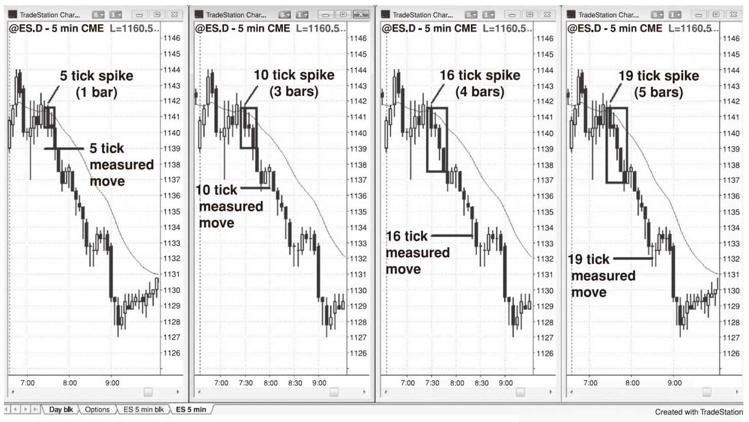
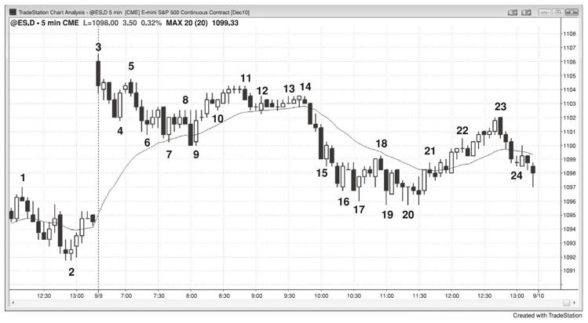
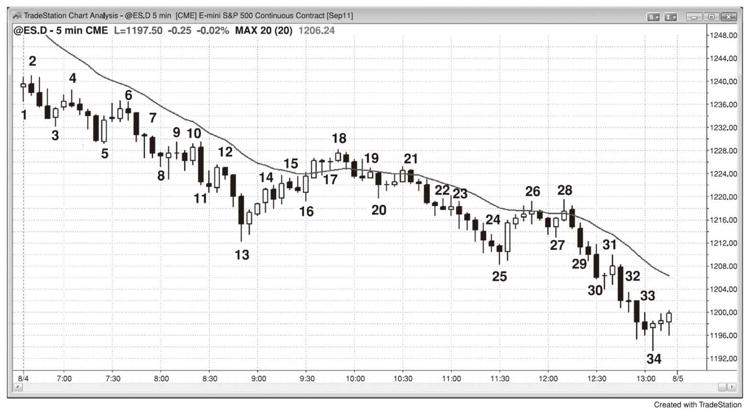

# 第25章　交易的数学：我是否应该做这笔交易？我做这笔交易能否赚钱？
我有一位朋友交易超过30年，我认为他基本上每天都在Emini上赚取10个点或更多。他曾经告诉我，他相信一般新手应该能够每天至少赚6个点。我告诉他我不同意------大多数初学者能够持续每天赚到两个点就很高兴。交谈结束后我意识到，有些交易者长期极为成功，他们完全忘记了输家是什么样子。不过这次交谈也让我意识到，有了足够的经验，交易者的好习惯可以与其融为一体，交易实际上变得轻而易举。但是不管什么情况，数学依然是他们的行为基础。实际上，交易完全是数学，所有的成功交易者都精通概率和交易者方程。数学随市场的每一次跳动而改变，对不知道的人造成障碍，对知道的人形成巨大优势。

交易新手不断寻找完美的交易------清晰的建仓形态、高胜率、低风险和高回报。在一天结束后，他们好奇为什么找不到一个。这些交易当然存在，要不然大交易者如何致富？他们没有意识赚钱非常困难，因为市场中充满聪明人，他们都试图从彼此手中赢钱。这使得任何人都无法获得巨大优势。一旦完美的建仓形态开始形成，所有人都交易，其迅速消失，因为没有人愿意做对手方。错过完美建仓形态的交易者不想追逐市场，他只会在回调中入场。一旦市场未能前行很远就开始回调，认为自己完美入场的交易者现在都浮亏。他们快速清仓，完美交易反向运动。

作为交易者赚钱，你需要优势（Edge），它是一种数学优势（Advantage），基于风险和回报的规模，以及市场触及你的保护性止损之前先触及盈利目标的概率。优势通常不大，因此每当其中一个变量非常优异时，通常会被另外一个或两个变量的糟糕而抵消。举例而言，如果潜在回报远高于风险，意味着风险相对较小，胜率通常就较小。如果胜率高，回报小，风险经常很高。传统公司的优势在于，他们的交易量足够大，可以影响市场方向，并且他们同时运行很多交易系统，很多交易者独立交易，这平滑了净值曲线。他们的目标是小额回报，通常是每年盈利10%至20%，风险相对较小，因此成功率较高（他们预计年末盈利的概率超过70%）。高频交易（HFT）公司的优势是，他们有一个高度可靠的统计优势（Advantage），其可能只有5%或更低（55%的赢率对50/50的纯运气系统就是5%的优势），但是他们每周应用数百万次。这赋予他们赌场优势。如果赌场只有一位顾客，他在单独一局下注10亿美元，赌场有47%的概率破产。然而，如果拥有巨量普通大小的下注，其优势导致持续盈利的概率就很高。高频交易公司也是如此。由于很多公司试图在每一笔交易上只赚一两个跳点，他们的回报微小，而其在每笔交易上的风险相对较大，但是他们的成功可靠性很高。其大多数很每天都赚钱的概率很可能超过90%，意味着胜率很高。日内交易者可以获得的优势是出色的读图能力，形成高胜率，可以达到70%或更高。在盈利目标至少与风险一样大的情况下，他们可以赚取非常高的回报率。世界上最出色的交易者大多为主观交易者，他们使用主观评估决策。一个可以发起对冲基金而自立门户的天皇巨星为什么要继续为高盛打工而分享业绩？很少人会，这就是为什么世界上最伟大的交易者都独立门户，这也深深吸引我们所有人。华尔街上的知名交易者通过主观交易每年赚取数十亿美元的案例多不胜数。一些人一次持仓数月或数年之久，如沃伦巴菲特；另一些人则是日内交易者，如"欧洲快手（Eurex
flipper）"Paul
Rotter。日内交易者在风险、回报和胜率的权衡中有多种选择，一些人愿意接受更低的胜率，如40%，来换取三倍于风险或更高的回报。

这里是一些交易者拥有优势的情形：

（1）胜率70%或更高（回报需要至少与风险的一半一样大才能盈亏平衡）：

刮头皮，但是由于大多数交易者无法持续选出具有70%胜率的交易，因此他们应该只在回报至少和风险一样大的时候才做刮头皮。举例而言，如果你相信在Emini上需要两个点的止损，那么只有在回报至少两个点时才做这笔交易。

（2）胜率60%或更高（回报需要至少与风险一样大才能盈亏平衡）：

1）在上涨趋势中的至均线的高2回调买入。

2）在下跌趋势中的至均线的低2回调卖空。

3）在上涨趋势中的楔形牛旗回调买入。

4）在下跌趋势中的楔形熊旗回调卖空。

5）在上涨趋势中的牛旗突破的突破回调买入。

6）在下跌趋势中的熊旗突破的突破回调卖空。

7）在上涨趋势中的强劲急速拉升中的高1回调买入，但是不能在买入高潮之后。

8）在下跌趋势中的强劲急速下挫中的低1回调卖空，但是不能在抛售高潮之后。

9）在交易区间的顶部卖空，尤其是当其为第二入场时。

10）在交易区间的底部买入，尤其是当其为第二入场时。

11）趋势反转：

在市场强劲突破趋势线后，在其测试趋势极点而形成一根良好的反转信号K线后寻找反转。交易者想要在底部的更高低点或更低低点买入，或者在顶部的更高高点或更低高点卖空。

强劲的最终旗形反转。

在一个下跌阶梯形态的第三轮或第四轮下跌中买入，预计市场测试前一轮下跌的低点。

在一个上涨阶梯形态的第三轮或第四轮上涨中卖空，预计市场测试前一轮上涨的高点。

用限价订单入场，这要求交易者拥有更加丰富的读图经验，因为交易者在逆市入场。不过，交易老手可以在下列建仓形态中熟练运用限价或市价订单：

1）在强劲上行突破的急速拉升中以市价买入或在K线收盘买入，或者用限价订单在前一根K线的低点或其下方买入（在急速行情中入场需要较宽的止损且行情迅猛，这种组合让很多交易者难以应付）。

2）在强劲下行突破中的急速下挫中以市价卖空或在K线收盘卖空，或者用限价订单在前一根K线的高点或其上方卖空（在急速下挫中入场需要较宽的止损且行情迅猛，这种组合让很多交易者难以应付）。

3）如果突破不是很强，在等距行情目标位附近的下行突破中买入------举例而言，如果Emini上的区间高约为4个点，在区间下方4个点处用限价订单买入，承担4个点的风险，预期市场测试突破点。只有交易老手才能考虑。

4）如果突破不是很强，在等距行情目标位附近的上行突破中卖空------举例而言，如果Emini上的区间高约为4个点，在区间上方4个点处用限价订单卖空，承担4个点的风险，预期市场测试突破点。只有交易老手才能考虑。

5）在强劲反转之后或在交易区间底部，用限价订单在一轮可能的新上涨趋势中的低1或2弱势信号K线中或其下方买入。

6）在强劲反转之后或在交易区间顶部，用限价订单在一轮可能的新下跌趋势中的高1或2弱势信号K线中或其上方买入。

7）在均线上的清淡牛旗中用限价订单在前一根K线的下方买入。

8）在均线上的清淡熊旗中用现价订单在前一根K线的上方卖空。

9）在向上突破牛旗的上涨K线下方买入，预计突破回调。

10）在向下突破熊旗的下跌K线上方卖空，预计突破回调。

（3）胜率约为50%（回报必须至少比风险高50%才能盈亏平衡）：

1）在交易区间中分批建仓时的首次入场。

2）在窄幅交易区间中买入或卖空，预计突破将创造数倍于风险的盈利。

3）当趋势可能正在反转下跌时，在交易区间中的更低高点卖空；或者当趋势可能正在反转上涨时，在更高的低点买入。由于入场点位于交易区间的中间，其概率为50%，但是回报通常是风险的两倍。

（4）胜率为40%或更低（回报需要至少为风险的两倍）：

在下跌趋势的底部买入，或者在上涨趋势的顶部卖空，反转交易可以用小额风险赚取非常大的回报------举例而言，在市场上涨至明显的阻力位时卖空，在阻力位下方一个跳点处用限价订单入场，将保护性止损设在其上放一两个跳点处。在"以限价订单入场"一章中有多个案例。

根据情况不同，胜率介于40%至60%（当胜率只有40%时，回报需要至少为风险的两倍才能盈亏平衡）：

1）上涨趋势中，在突破测试的跌势中用限价订单买入；下跌趋势中，在突破测试的涨势中用限价订单卖空。

2）在一轮新的上涨趋势或交易区间底部时，用限价订单在低1或2信号K线的下方买入（潜在的更高低点），即便其并不弱；或者在一轮新的下跌趋势或交易区间顶部时，用限价订单在高1和或2信号K线的上方卖空（潜在的更低高点），即便其并不弱。举例而言，如果市场可能正在完成上涨趋势的楔形反转顶，并回撤了一根或几根K线，在高1和高2信号K线的上方卖空就是在你希望的新下跌波段中卖空。

3）淡出磁体，如在上涨趋势中的等距上涨目标位卖空，或在下跌趋势中的等距下跌目标位买入。

4）在一轮超卖的下跌趋势中，在支撑区域处的一根非同寻常的大型下跌K线收盘价附近的抛售高潮买入。

5）在一轮超买的上涨趋势中，在阻力区域处的一根非同寻常的大型上涨K线收盘价附近的买入高潮卖空。

交易新手很快发现交易趋势似乎是赚钱的绝佳方法。然而他们很快会发现交易趋势实际上与其他类型的交易一样难。他们要赚钱，就得有人要输钱。市场是一个零和游戏，参与双方有无数聪明人。这确保了交易者方程中的三个变量总是会让优势微小且难以评估。一个交易者要想赚钱，他需要持续好于一半的交易者。由于大多数对手都是盈利的机构，因此交易者需要非常优秀才行。在趋势中，概率经常低于新手想要的，并且风险较大。在交易区间中，风险不大，但是胜率和回报也是。在反转中，尽管回报可以很大，但是风险经常也很大，并且胜率较小。在刮头皮中，胜率很高，但是回报相对于风险较小。

**交易者方程**

尽管大多数交易者不用数学术语来思考交易，但是所有的成功交易者都使用交易者方程，至少是在潜意识。你经常会听到电视上的专家在决定是否做一笔交易时讨论风险/回报比率。很不幸，这忽略了一个同样重要的变量------胜率。要做一笔交易，你必须相信其交易者方程有利，成功概率乘以回报需要大于失败概率乘以风险。当一位专家说一笔交易有好的风险/回报比率时，他的意思是如果你正确管理交易，其将有优势或数学优势。他的建议中的隐藏含义是这笔交易"很可能"会赢，意味着他相信有50%以上的概率你将赚钱。尽管他们并不这样看待自己的评论，但是如果他们是成功的交易者，这一定就是他们所认为的，因为不考虑这三个变量不可能成功。

在任何交易中，你设置回报和风险，因为潜在回报是与你的盈利目标之间的距离，风险是与你的止损位之间的距离。解这个方程的难处在于为其概率赋值，而其永远无法确知。总而言之，如果你不确定就假设自己有50%的概率赢或输，如果你确信信号看似不错，那就假设你有60%的概率赢和40%的概率输。甚至不要担心行情会走多远。只要评估建仓形态是否看似不错，如果是，假设上涨任意幅度的概率为60%或更高，下跌同等幅度的概率则为40%或更低。这是等距行情的概率（或方向性概率），在本章后面探讨。如果潜在回报是风险的很多倍，很多交易者也会考虑做不太可能会成功的交易。在这种情况下，他们应该假设其概率为40%。如果成功率比这低很多，极少数会考虑做这笔交易，不管其潜在回报有多大。

理解这些概率的影响很重要。否则对于交易新手来说，当市场出现其认为小概率或者不可能发生的情形时，他很容易难过。不管你感觉多么自信，市场经常会出现与你所想完全相反的情形。如果你有60%的把握认为市场将上涨，这意味着40%的时候其将下跌，你做这笔交易就会亏损。你不能无视这40%的概率，就像是有人拿枪在30尺外向你射击，但是只有40%的概率命中。40%非常现实且危险，因此总是要尊重与你持相反看法的交易者。

如果你拒绝你认为只有50%概率的交易，只做你认为有60%概率的交易，那么你将在一半的时候错过好的交易。这只是交易的一部分，是优势过小的结果，在零和游戏中有大量非常聪明的人，其中一半与另一半的观点完全相反。不要对市场的任何表现感到难过或困惑。万事皆有可能，即便你不知道其为何发生。没有人真正知道为什么，原因也从不重要。你用数学赚钱而不是用理由，因此如果有人只在交易者方程极为有利时才做交易，他很可能会稳定盈利。

如果你想要在多年交易获利，你需要呆在舒适区域。一些交易者喜欢做回报数倍于风险的交易，他们愿意只在30%至40%的交易上盈利。这种方法的交易者方程有利，但是大多数交易的回报只能达到与风险差不多大的水平。这意味着这些交易者会选择错过每天发生的大部分交易，因为他们不相信其回报足够大而弥补其低胜率。其他交易者只交易高胜率的建仓形态，愿意接受回报与风险一样大。然而，很多时候市场处于趋势，回调幅度小，其建仓形态的胜率经常低于50%。举例而言，如果有一个疲弱的下行通道，其影线突出，在通道底部或许有卖空信号。市场看似很可能形成交易区间，但是愿意在底部卖空的空头寻求幅度为其风险两三倍的波段，他们会做得很好。只想要高胜率交易的交易者会观望，他们等待高胜率的反转建仓形态买入，或者在回调卖空，他们看着空头市场继续10或20根K线。这也是一种可以接受的交易方法。一些交易者对各种环境均游刃有余，根据市况而调整风格。这让他们整日交易获利，这也是所有交易者的目标。现实是大多数优秀的交易者都有其独特风格，他们等待符合其风格的建仓形态。

刮头皮者追求找相对于风险而较小的盈利（他们应该追求至少与其风险一样大的回报），需要高胜率来形成正的交易者方程。不要假设这意味着他们只交易旗形，因为很多人也交易强势突破。在强势突破中，止损理论上应该设在急速行情之外，可能离市价很远（举例而言，在一个四K线的急速拉升突破中，最初止损理论上应该设在第一根K线的低点下方，尽管大多数交易者不会承担如此高的风险）。然而，由于突破强劲，实现等距行情的概率为60%或更高。这意味着他们可以做高风险的交易，因为其回报同样高，并且胜率也高。为了保持其风险金额与其他交易相同，他们需要交易更小仓位。

交易者整日所做的最重要决策之一是，在前一根K线的高点或低点处多空双方谁将获胜。举例而言，如果有一根强劲的上涨趋势K线，在K线的收盘价和高点附近，会有更多空头卖空建仓和多头清仓止盈（大多使用市价和限价订单），还是有更多多头建仓和空头回补（大多使用停损订单）。与之类似，在低点处有更多买盘还是卖盘？交易者试图评估赚取足够利润弥补其所承担风险的概率。他们的目标长期赚钱，他们知道他们经常会输。然而，他们要想在长期盈利，他们需要做交易者方程有利（正）的交易。

一旦你看到一个可行的建仓形态，你要做的第一件事就是判断你的保护性止损有多远。一旦你知道风险，你就可以判断可以交易的股票或合约数量，将总风险保持在通常范围之内。举例而言，如果你平时买股时承担500美元的风险，你认为你需要将保护性止损设在入场价下方约1美元处，那么你就可以交易500股。然后你判断交易的胜率为多少。如果你不知道，那就假设其为50%。如果其为50%，那么你的潜在回报至少应该是风险的两倍，这样才值得交易。如果不能指望赚到两美元，那就不要交易。如果胜率为60%，那么你的回报需要至少与风险相等，如果1美元的盈利目标不现实，那就不要交易。如果你要做，确保使用至少1美元的盈利目标，因为这是在胜率为60%的情况下，承担1美元风险而获得正交易者方程所需要的最低目标。

每一笔交易都需要数学基础。假设你需要在Emini中承担两个点的风险，你现在正考虑一个卖空建仓形态。你是否有60%的把握在亏损两个点之前先赚取两个点？你是否有70%的几率赚取一个点，或40%的几率赚取四个点？如果以上问题的任意一个回答为是，那么做交易至少有数学依据。如果所有回答均为否，那么考虑做多的三个问题。如果三个问题有一个的回答为是，那就考虑做这笔交易。如果多空双方的回答均为否，那么现在以市价入场就不是好办法，市场状态未明。这意味着市场处于交易区间，交易老手可以用限价订单在K线上方卖空和K线下方买入。

交易者方程有三个变量，交易者可能会因其个性而关注其中一个多于其他两个。举例而言，需要高胜率才能在全天维持注意力的交易者倾向于寻找这种机会，因此他们会愿意接受相对较小的回报和更高的风险。当胜率高时，失衡明显，市场将快速中合。结果是行情通常只持续几根K线，因此其回报通常较小。因为好的刮头皮建仓形态通常胜率高且风险小，因此交易者做强势刮头皮时经常会使用最大仓位。另一个极端的交易者希望其回报远大于风险，为了达到目标，他们需要满足于只在约40%的交易上盈利。当胜率较低时，交易者经常交易较小仓位，一些人会在市场朝其方向运动时加仓。因此波段交易者经常比刮头皮交易者使用更小的初始仓位。还有人可能风险规避，希望在每笔交易上承担最小风险。为了达到目的，交易者需要接受更低回报和更低胜率的某种组合。还有一些交易者把握所有机会，并根据情况而合理交易。当胜率较高时，他们会更早止盈。当一笔交易的最重要特性是其提供的回报时，他们接受其胜率可能较低的现实，并且愿意将更大比例的仓位做波段交易，让该策略随时间而生效。很多交易介于两个极端之间，有约50%的成功率。每当交易者做这种交易时，他总是应该试图让回报达到风险的两倍，确保交易者方程为正。

即便低胜率交易的回报可以远高于风险，从而成为出色的交易，但是大多数交易者面临一个固有问题。由于波段交易有较大的回报，因此它们必然伴随相相对低胜率或高风险。具有高胜率和高盈亏比的交易不存在。为什么？记住你的交易需要有对手方，由于机构掌控市场，那么你需要相信有机构交易者愿意做你的对手方。如果你的胜率为80%，他的胜率就是20%。如果你的回报是6个点，那么他的风险就是6个点。如果你的风险是2个点，那么他的回报就是2个点。因此如果你相信你有80%的机率在承担两个点风险的情况下赚取6个点，那么你就是相信有机构交易者愿意做你的交易对手方，他们有20%的机率在承担6个点风险的情况下只赚取2个点。由于这在大型市场中几乎不可能存在，因此你需要假设你对变量的评估错误，这笔交易并不像你所认为的那样出色。没有一家机构必须要做你的对手方，但是包含所有机构的市场基本上就是一家大型机构，它必须这样做。因此某种机构组合一定会愿意做你的对手方，如果你的交易出色，他们的交易就糟糕，市场绝不会让其发展。确实会有很多天真的人愿意做你的对手方，因为他们读错了市场，但是被机构掌控的市场非常有效，他们绝不会让优势变得如此之大。你应该假设任何交易的双方实际上都是机构，或者是散户不做的话机构也会做。散户下很多单，但是他们无法影响市场，不管他们的订单有多蠢。他们的订单只有在机构愿意同样下单时才会成交。举例而言，如果Emini报价为1264，你持有多仓，保护性止损的卖单在1262，你的订单不会触发，除非有机构也愿意在1262卖空。几乎所有交易都是如此。如果市场正在强劲上涨，为什么还有机构愿意在市价之下卖空？因为很多机构在低很多的价位买入，他们找理由止盈。如果他们认为市场跌至1262是部分止盈的理由，他们就会在那里卖出。如果市场触及你的止损，并不是因为市场清扫小人物的止损，而是因为有机构认为在1262卖出在数学上明智。

在任何交易开始向高胜率、高回报和低风险的方向运动时，机构会迅速反应来把握机会，阻止了优势变为很大。同时，处于劣势的公司会迅速反应来提高其优势。市场会向盈利目标的方向以一根或多根大型趋势K线（急速行情）的形式快速运动并前行很远，在建仓形态变强之前大大提高风险（所需的止损幅度）。弱势信号或低胜率让大多数波段交易难以把握。没有人会送钱给你，交易总是会很难。如果你看到捡钱机会，那是你错误解读市场，很快就会发现自己给别人送钱。

大型市场中的90%或更多交易都是机构所做，意味着市场实际上是机构的集合。几乎所有的机构在长期都盈利，少数不盈利的很快就会破产。由于机构盈利并且他们是市场，你所做的每一笔交易都有一个盈利的交易者（机构集合的一部分）做你的对手方。如果没有一家机构愿意做交易的一方而另一家机构做另一方，没有交易会发生。70%的成交量由计算机算法创造，散户交易者的小额成交量不足以妨碍程序交易。散户的小额交易只有在机构愿意做同一笔交易时才能实现。如果你想要在某一个价位买入，市场不会达到该价位，除非有一家或多家机构也愿意在该价位买入。你无法在某一价位卖空，除非有一家或多家机构愿意在那卖空，因为市场只会走向机构愿意买卖的价位。如果你交易200张Emini合约，那么你就是在交易机构的量，实际上相当于机构，有时候你能影响市场一两个跳点。然而大多数交易者无法影响市场，不管他们有多愿意鲁莽交易。市场不会扫你的止损。市场可能会测试你的保护性止损所在的价位，但是这跟你的止损完全无关。测试该价位只是因为有一家或多家机构相信在这里卖出有利可图而另一家机构相信在这里买入有钱可赚。每一个跳点，都有机构买卖，他们都有经过验证的系统，通过做这些交易赚钱。

每当交易者做刮头皮时，交易的对手方很可能是波段交易者。不过很多波段交易者也会做另一些波段交易者的对手方。优秀的刮头皮者无法做另一些优秀的刮头皮者的对手方，因为两个方向的风险和回报接近，只有一方可以获得高胜率。刮头皮者有高胜率，因此对手方为低胜率。由于他是机构交易者，因此你需要假设其方法有效并且能在长期盈利。如果你在零和游戏中与他对着干怎么可能还赚钱？因为你不是。你们的入场相反，但交易管理不是。假设你在Emini上使用两个点的盈利目标和两个点的止损，你在交易区间顶部的弱势高1买入信号K线上方卖空，正确地认为你有60%以上的胜率。机构交易者在你卖空的同时买入，他的风险可能也是两个点，即你的回报的反面（当你止盈时他被止损），但是他的回报远高于你的风险。你的保护性止损是两个点。这是你空头回补而止损的价位。然而这并非他卖出多仓的价位。他的目标很可能数倍于此，因此尽管他的胜率低，但是依然可以有正的交易者方程。他还可能使用非常宽的止损并分批建仓，两者均可以将其胜率提升至60%或更高，即便其最初入场的胜率仅为40%。你想一下，低胜率的交易如果无法通过管理获得正的交易者方程就不会存在，因为没有机构会做这笔交易，它们根本就不会发生。只有在机构愿意做的时候其才可能发生，而除非有办法交易获利，否则机构就不会做。机构有多种方法管理交易来确保其拥有正的交易者方程，包括分批建仓和分批离场，使用宽幅止损，对冲以及波段交易追求远大于风险的回报，从而弥补其低胜率。

市场活动的范围从剧烈单边（如强劲趋势中的急速行情阶段）到极度双边（如极为紧凑的交易区间）。大多数时候介于两者之间，有时候更多为单边交易，有时候双边交易为主。这在交易区间中显而易见，趋势K线代表单边交易，反转K线和影线代表双边交易。当市场处于上涨趋势并向上越过前一根K线的高点时，其在突破，当其向下跌破前一根K线的低点时，其在回调。下跌趋势中的情况与之相反，突破是市场向下跌破前一根K线的低点，而回调是市场上涨越过前一根K线的高点。当市场处于极度单边时，如在强劲趋势中的急速行情阶段，回调大多数是因为获利回吐。举例而言，如果市场处于一轮由五根上涨趋势K线构成的强劲急速拉升中，然后其跌破第五根K线的低点，这是因为在较低价位买入的多头正卖出部分仓位来实现部分盈利。记住，每一笔交易都有一家机构做对手方，他这样做只是因为这是盈利策略的一部分。还有一轮卖盘真空将市场拉至K线下方。这是由所有渴望建仓或加仓的多头所致，他们一直在前一根K线的低点及其下方设置限价订单，希望以小幅折价介入市场。这些多头渴望入场，但是只想以更好的价位入场。如果前一根K线高为6个跳点，很多多头只会在该K线的高点下方6个跳点或更低处开始买入（换句话说，在K线的低点或低点下方）。这意味着在下面一至五个跳点处的买家相对缺乏，市场可能迅速被压低而寻找买家，其将在K线的低点附近成功找到。记住，止盈的多头卖出部分多仓，他们需要买家来做对手方。一旦获利回吐者决定部分止盈，他们需要愿意在有足够多的交易者愿意买入的价位卖出。一旦市场涨的足够高，唯一愿意买入的交易者将是那些等待市场跌破前一根K线低点的人。如果足够多的多头想要止盈，市场需要跌破前一根K线才能让其平掉部分多仓。其他多头只会在市场跌破前一根K线的低点时才会开始止盈，因此他们会在该K线下方一个跳点处用停损订单卖出。渴望买入的多头将是另一些止盈多头的对手方。

很少有空头在会该K线的低点下方卖空，因此下跌行情并非由准备波段做空的空头所致。尽管一些公司可能通过在前一根K线的下方用停损订单卖空来分批建仓，但是认为这是强劲急速拉升中的第一次回调的重大因素并不符合逻辑。当市场处于极度单边时，准备卖空的公司知道他们可能有80%或更高的概率可以在不久之后以更高价位卖空，因此现在卖空对他们来说没有意义。

由于强劲趋势中的小幅回调大多数是由获利回吐所致，通常没有好的方法让空头在强劲上涨趋势中的第一轮回调的形成过程中在前一根K线的低点下方卖空而获利，或者让多头在强劲下跌趋势中的第一轮回调中在前一根K线的高点上方买入而获利。然而，当市场在上涨趋势中向上突破前一根K线的高点时，或者在下跌趋势中向下突破前一根K线的低点时，有一种有利可图的方法来管理多头和空头交易。如果没有办法同时让多头和空头在强劲上涨趋势中的前一根K线的上方都获利，市场将不会在此处交易，因为只有在一家机构可以在这里买入而获利同时另一家机构卖空而获利时市场才会抵达此处。上方的卖盘是多头止盈和空头卖空的共同作用，随着市场越来越趋向于双边交易，空头的卖空占据更大部分的交易量。如果没有方法同时让多头和空头在市场跌破强劲下跌趋势中的前一根K线的低点时获利，市场将不会跌破该K线。为什么有机构会做输钱策略的交易？他们从不会。不管是买入的公司还是卖出的公司都不需要在每一笔交易上都盈利，但是每一笔交易都必须是盈利策略的一部分，否则他们不会做这些交易。

如果说机构聪明并盈利，对每一个跳点负责，为什么他们还会在上涨趋势中的最高跳点买入（或者在下跌趋势中的最低跳点卖空）？因为这就是他们的算法在一路上涨的过程中的获利方法，其中一些被设计为直到上涨趋势明确不再有效之前会一直做下去。他们在最后一次买入中亏损，但是在之前的交易中获利足够多而弥补亏损。记住，他们所有的系统都在30%至70%的时候亏损，而这就是其中之一。还有高频公司在上涨趋势的最高跳点之前都会刮头皮赚取一个跳点。高点总是出现在某个阻力位，对于很多高频交易公司而言，如果其系统显示这是一个盈利策略，他们就会在阻力下方一两个跳点处买入，试图捕捉最后一个跳点。其他机构的买入是作为其他市场对冲的一部分（股票、期权、债券、货币等），因为他们认为对冲后的风险/回报比率更好。成交量并非源于小散户，其在重大转折点时只占据低于5%的成交量。

市场越是双边，就越有可能在每一个突破和每一轮回调中多空双方的机构都在发起交易（而不仅仅是一方止盈，如在强劲急速拉升中的首次回调）。他们这样做是基于他们在长期测试并证明有利可图的策略。事关上亿美元的资金，因此所有事情都必须严格审查并需要有效。那些资金的所有人会要求其交易具有合理的数学基础，否则他们会把资金转到具备条件的公司。当市场主要为双边交易时，也就是大多数时候，每一个突破和每一轮回调都有买卖双方的入场。由于机构盈利，他们都在使用盈利策略，即便很多策略的胜率仅为40%或更低。

在强劲急速拉升中的单K线回调案例中，如果市场向上突破该K线的高点，其主要是因为急切的多头在加仓或建仓时的追涨。他们从愿意卖出的人手中买入，而这些卖家是低价买入而止盈的多头和开始卖空的激进空头的组合。最初，空头只是刮头皮者，只期待小幅回调。一些高频交易公司会刮头皮只赚取一两个跳点，经常会有高胜率的建仓形态允许他们这样做，甚至是在强劲趋势中的高1买入信号K线上方。很多机构使用基于跳点图的算法，其可以显示5分钟图上看不到的微小形态。随着市场变得更加双边，交易区间开始形成，空头将开始在上涨中卖空（一些人会在市场走高时分批入场），如在区间或通道顶部的弱势高1或高2买入信号K线的上方，准备持仓把握波段下跌。市场愈加双边，就有越多的空头开始波段交易，更多的多头停止波段交易并开始刮头皮。最终大多数波段多头都已获利了结，这时候大多数多头都将是刮头皮者。当买入信号变弱之后，刮头皮者丧失买入兴趣，因为胜率下降，而他们只做高胜率的交易。一旦刮头皮多头和大多数波段多头停止买入，而卖空主要由波段空头而非刮头皮空头所做，趋势就会反转。

即便当市场正进入交易区间时，依然有一些多头在低胜率（40%左右）的建仓形态买入，如区间顶部的弱势高1和高2信号K线。他们是运行算法的波段交易者，其算法已被证明可以做这些低胜率的波段交易而长期盈利。他们知道随着市场越加进入交易区间，胜率越在下降。然而，他们也知道其系统可以盈利，即便胜率为40%或更低。一些交易的盈利将是其止损的很多倍，弥补其在60%的交易上的亏损且有盈余。他们的程序还可以在市场走低时分批建仓，在较低位入场的交易仓位可以更大。如果他们认为其最初假设不再有效而想要退出交易，这能够让他们以盈亏平衡甚至小幅盈利离场。大多数时候，你通过在交易区间或弱势上行通道顶部的糟糕高1买入信号K线的高点卖空而获利。然而，每个月都会有这么几天，市场强劲趋势上涨，形成一系列低胜率的买入信号K线（如十字线或下跌趋势K线作为信号K线），每一个信号之后都是一轮大幅上涨，其回报为风险的很多倍。在这些交易日里，那些在低胜率建仓形态中买入的交易程序可以发财，远远超过其所有的小额亏损；另一方面，刮头皮者经常错过这些趋势的大部分，因为他们不愿意交易低胜率的建仓形态。当市场以强劲趋势上涨时，大多数刮头皮者看到其强势，避免在弱势买入信号K线的上方卖空。他们知道在上涨趋势的顶部卖空为高风险。"高风险"就是指交易者方程糟糕，逆势交易的风险在于，任何低胜率的顺势建仓形态都可能导致大行情。低胜率通常是高回报的硬币反面，正如高胜率通常意味着低回报（刮头皮）一样。因为他们看到上涨趋势，他们想要买入。然而，由于买入信号看上去疲弱，因此它们是相对低胜率的建仓形态。然后刮头皮者最终就没有买入，错过一段可以持续数个小时并覆盖很多点数的趋势。刮头皮者会等待更深幅度的回调买入，并且偶尔会在他认为将有一根后续K线的强劲突破中买入，但是在这种趋势日中，他所赚的钱要远少于波段交易者。优秀的刮头皮者在其他大多数交易日比波段交易者赚更多。记住，由于刮头皮者做高胜率交易，并且可以选择的建仓形态众多，因为他的盈利目标较小，理论上他的盈利交易要远远多于波段交易者，这意味着更为平滑的权益曲线和更多的盈利日。

每当你交易一个低胜率的系统时，该系统有正的交易者方程，但是任何单笔交易获胜的概率小。每一笔单独的交易都是低胜率，但是如果你做了所有的建仓形态，整体交易者方程就为正。这意味着你无法在低胜率的交易中精挑细选，不管其回报比风险大多少。人有一种选择不可思议的能力，选中所有的糟糕交易，经常错过弥补前期亏损所需的那一笔绝佳交易。最终他们说服自己放弃那些能够创造高额盈利的低胜率交易，而做了所有的亏损交易，其看上去总是更加容易，结果是他们输钱。交易低胜率的系统，你需要把握每一个强劲信号，因为如果你吹毛求疵，你将不可避免地选择错误的交易，经常会错过弥补前期亏损所需的那一笔绝佳交易。大多数交易者通常无法把握所有的交易。这将他们暴露在这种风险之下，使得低胜率的交易难以获利。

另一个极端是高胜率交易，交易者为了在每一笔交易上获得高胜率而牺牲回报。如果一个系统有60%或更高的胜率，回报至少与风险一样大，那么每一笔交易都有正的交易者方程。交易者并不需要用很多交易分摊而获利。每一笔交易都有正的交易者方程，因此交易者可以自由挑选而依然赚钱，连续错过10笔好交易也无所谓。如果交易者错过很多交易，但是成功把握少数高胜率交易，他盈利的几率依然不错。由于有这种无法每笔交易都做的自然倾向，如果交易者发现自己在波段交易中精挑细选，他们应该考虑大多数交易者应该专注于高胜率交易。实际上我有一位交易10年期美国债券期货的朋友，他想要在每一笔交易上承担尽可能小的风险。为了达到目的，他交易50跳点图，上面很多K线只有两个跳点高，他准备在每一笔交易上只承担三或四个跳点的风险。他试图在交易中赚取8个跳点或更多，由于他是一名出色的读图者，他在90%的交易中盈利，这是他告诉我的。我估计这意味着他并不一定在所有的交易中都盈利8个跳点，很多交易可能只有一两个跳点的利润。如果他认为在10%的交易中亏损就是在90%的交易中盈利的话，他甚至可能会将盈亏平衡的交易放在盈利一栏。不管哪一种情况，他强调的是风险，他假设如果精心选择交易，胜率和回报会水到渠成。

高频交易公司可能在数千支的股票上每天交易几十万次，其交易基于统计而非基本面。举例而言，如果一家公司发现，当一支股票连续下跌六个跳点时，在其反弹一个跳点时卖空赚取一个跳点并承担三个跳点的风险有利可图，他们或许会将其作为其程序之一。你认为他们的程序有多有效？他们有最聪明的数学家设计并测试程序，因此你会认为他们一定有70%或更高的胜率。不过我对此表示怀疑，因为他们的程序在与其他公司的算法竞争，如此大的优势只能持续很短的时间，然后其他公司会发现并消灭它。任何事情都有权衡，而他们的目标是拥有一个极为可靠的系统，几乎每天都赚钱。如果一家公司每天做50万笔交易，试图在每一笔交易上赚取一两个跳点，我怀疑其能否达到70%的交易胜率。我怀疑是因为优势弱小且转瞬即逝，他们能够每天发现50万笔胜率为70%的交易的可能性极小。我怀疑其胜率为55%或更低。记住，赌场的优势约为3%，而赌场每天都赚钱。为什么能这样？如果你99%确定你的优势为真，而游戏每天进行数千次，那么数学对你极为有利。高频交易公司也是如此。它们接受小优势和相对较大的风险，换取持续盈利。高频交易公司交易具有70%胜算的建仓形态不是会赚更多吗？显然会，如果其能在数学上证明这些建仓形态具有70%的胜算。这意味它们做不到，但是并不意味这种建仓形态不存在。它们确实存在，但是依靠主观判断，显然很难编程。这种主观特性赋予个人交易者优势。如果他们开发了主观判断和少犯错误的能力，他们就有优势。有如此多的聪明人在交易，优势总是会很小并依赖主观判断，持续把握优势总是会很难，但是可以做到，这也是每一个交易者的目标。

你入场越早，你能赚到的利润就越高，但是你的胜率也越低。一些交易者倾向于选择更高的胜率，如果可以更加确定其交易会盈利，他们愿意晚一点入场。举例而言，如果市场可能正在反转上涨，交易者或许会买入。还有交易者可能会在买入之前先等待市场出现几根强劲的上涨趋势K线和明显的多头买入信号。交易更加确定，但是错过部分行情，能赚到的利润更少。交易者为了更高的胜率而支付了部分潜在盈利，他们认为这是一个不错的权衡。一些交易者更喜欢非常高的胜率，即便这意味着他们在交易中的盈利降低。其他交易者喜欢回报比风险高很多倍，即便这意味着他们可能只在40%的时候盈利。胜率越高，建仓形态就越明显。当一个建仓形态尤为明显时，很多聪明的交易者就会把握，失衡状态只能持续一两根K线。市场很快会达到预期目标，然后反转或进入交易区间。这就是为什么最好的刮头皮的盈利潜力有限但胜率很高。然而，由于大多数交易者无法持续选出高胜率的刮头皮，他们应该坚持做潜在盈利至少和风险一样大且胜率约为60%的交易。

任何时候，回报、风险和胜率都有无数种可能的组合，交易者需要有一个明确的计划。如果他们其实计划在一个点盈利时平仓，他们就不能使用承担两个点风险而赚取两个点的概率。这两笔交易在数学上所要求的最低胜率不一样，而交易者如果迫不及待想要交易，有时候会将这两种情形混淆。这是刚出道的交易者的一个常见问题，但是这确实是爆仓之路。你需要在好的交易中尽可能赚到最多，因为你总是会在糟糕的交易中亏损最大，你需要大额盈利来弥补这些亏损。

是否有胜率为90%或更高的情况？每一笔交易都有，这是盈利策略的一部分。举例而言，如果你做多，市场触及你的止盈限价订单但未成交，你依然会持有多仓，至少暂时的，因为你认为你的订单很快就会成交的机会很大。你的止损可能在前一根K线的低点下方，大约在六个跳点之外。你为了那一个跳点的额外盈利而继续持有多仓，同时承担六个跳点的风险，意味着你相信至少那个时候你有90%的胜率。如果你一直持仓，那就是你相信你的订单在止损被触发之前成交的机会更大。尽管大多数交易者从不考虑具体数学，但是除非成功率约为90%，否则他们无法继续认为这笔交易有效。他们是对的，至少在那种情况下。如果市场迅速拉回三个跳点，你就是试图在限价订单上赚取三个跳点而承担三个跳点的风险，你不再是90%确定。

还有另一种情况交易者可以对行情有90%或更高的把握，但这并非明智的交易。举例而言，在一天的任意时间，市场很可能有95%的确定性在下跌200跳点之前先上涨1个跳点，有95%的确定性在上涨200个跳点之前先下跌1个跳点。然而，你永远不会承担200跳点的风险去赚取1个跳点，不论其胜率有多高。一次亏损就清光200次盈利，意味着你需要99.5%的胜率才能盈亏平衡，而你需要连续完美执行200次。

与之类似，是否有一种胜率只有10%但在数学上优异的策略？是的。举例而言，如果市场处于强劲的下跌趋势，并从一个更高低点处反弹上涨，现在又再次下跌，交易者可能会设置限价订单在前期低点上方一个跳点处买入，并在其下方一个跳点处设置保护性止损。胜率可能只有10%，但是如果市场强劲反转上涨，他们可能在承担半个点风险的情况下赚取10个点。这意味着如果他们做10次交易，他们可能在9次失败交易中亏损18个跳点，而在一次成功交易中赚取40点，平均每一笔交易赚2.2个跳点。

记住，关于是否做一笔交易，你需要同时考虑胜率、风险和回报，而不仅仅是一两个变量。总体而言，每当一笔交易的胜率非常高时，你应该将大部分或全部交易都当作刮头皮。这是因为极高胜率的情形持续不超过一两根K线就会被市场纠正。如果什么事情看上去非常确定，你可以非常确定其不会持续很久而完成波段交易。胜率越低，回报相对于风险就要越大。最好的交易的胜率为60%或更高，回报至少和风险一样大，最好是其两倍。这类交易在大多数市场中每天都会出现，但是你需要在其形成之前预测它们，并且在其形成后把握并管理好。

一旦你发现一个建仓形态，下一步你必须决定是否做这笔交易。该决策基于数学计算，需要三个数据：风险、回报和胜率。不幸的是，人的天性是只考虑胜率。很多初学交易者看到一个建仓形态，认为其有60%的可能是一笔成功的刮头皮，他们或许正确，但是依然输钱。为什么会这样？因为决策不能仅仅基于胜率。你需要考虑你能赚多少，以及要承担多少风险才能赚这么多。记住，你需要成功概率乘以回报大于失败概率乘以风险。举例而言，如果你今天正在关注Emini，在强劲熊市中的一条下降均线的略下方看到一个低2，你根据经验判断，卖空有约70%的概率在两个点的止损被触及之前先触发两个点的止盈限价订单，那么你有70%的概率赚取两个点和30%的概率输掉两个点。如果这样的交易你做10次，你将赚7\*2=14点，亏3\*2=6点。10笔交易的净盈利是14-6=8点，因此你的平均盈利是每笔0.8个点，或40美元。如果你有低佣金，一笔交易来回5美元，那么你的实际平均盈利约为每笔35美元。听上去可能没那么多，但是如果你每天能做两次并交易25张合约，这就是约1700美元每天，约35万美元每年。

反之，如果你使用两个点的止损和四个点的止盈，做一笔你认为胜率为50/50的交易，我们依然用50%胜率来计算。如果你做10笔交易，你将在5笔交易中每笔赚4点，共赚20个点。你将在其他5笔交易中每笔亏2点，共亏10个点。这样你的净盈利是10笔交易赚10个点，平均每笔交易赚1个点。如果你去掉0.1个点的佣金，你每笔交易约赚45美元。显然会有很多交易在止盈或止损被触及之前就离场，但是可以假设这些交易大体互相抵消，因此在交易选择中该公式依然有用。如果你对建仓形态非常挑剔，只做胜率为70%的交易，做10次将赚7\*4=28点，亏3\*2=6点。扣除佣金后的平均盈利约为每笔赚2.1个点。

尽管你可以尝试用市价订单离场，但是大多数交易者用限价订单在盈利目标离场，会在确切价格上成交。你可以通过选择保护性止损和盈利目标来控制风险和回报。如果你选择使用10个跳点的止损，那就是你在大多数时候的风险。有时候你会遭遇严重的滑点，尤其是在交投清淡的市场，你也需要考虑到这一点。举例而言，如果你在交易一支小市值股票，其通常在停损订单上有10美分的滑点，而你使用50美分的保护性止损，那么你的风险约为60美分加上佣金。如果你交易Emini，并非在报告前入场，你通常不会遭受滑点，但是你依然有约0.1个点的佣金。

方程中最困难的部分是评估你的止盈限价订单在保护性止损被触及之前先成交的概率。尽管你知道风险和潜在回报，因为你选择的它们，但是概率永远无法确知。不过你经常可以做出合理猜测。如果你对猜测缺乏信心，那就使用50%，因为不确定性意味着市场处于交易区间，上涨的概率与下跌的概率接近。

然而，如果你在强劲上涨趋势中的一轮至均线的两腿回调的顶部买入，你的胜率可能有70%。反之，如果你在强劲下跌趋势中的均线略下方的交易区间顶部买入，你的胜率可能只有30%。这意味着如果你做10笔交易，你将损失7\*2=14点。由于你只有三笔交易盈利，这些交易需要平均盈利5点才能盈亏平衡，可能性非常小，你很少应该考虑这笔交易。

如果你做一笔交易是因为你相信自己有60%的机率在输掉10个跳点之前先赚取10个跳点，但是在接下来的几根K线里，市场进入窄幅交易区间，你的胜率现在降至50%左右。由于你现在承担10个跳点的风险赚取10个跳点，而胜率仅为50%，因此是一种输钱策略，你应该尽可能以盈亏平衡离场。如果你走运，甚至还能赚到一两个跳点。这是交易管理的一部分。市场每一个跳点都在变化，如果一种成功策略突然变成一种输钱策略，那就离场而不要依赖希望。一旦你的假设不再有效，干脆离场而寻找另一笔交易。你需要交易现在的市场，而不是几分钟前的市场，也不是你希望在未来几分钟内形成的市场。希望在交易中没有一席之地。你在与计算机交易，它没有情绪且冷酷客观，这也是你要做的。

那么在Emini用停损订单入场刮头皮赚取一个点是什么情况？如果你承担两个点的风险赚取一个点，那么你需要盈利的时候比亏损时候多一倍才能盈亏平衡。如果你加入佣金，你需要在70%的时候盈利才能盈亏平衡。为了盈利，你需要在80%或更高的时候正确，即便是经验丰富的盈利交易者也无法在长期做到。然后你可以推断这不是一种盈利策略。如果你这样做，你几乎一定会在长期输钱，而你需要按照持续盈利的目标来交易，所以你就不能这样做。确实每天可能都有几笔交易在输掉两个点之前先赚取一个点的概率为80%，如果你是一名非常优秀的读图者，非常遵守纪律，可以及时发现最好的建仓形态，将半个点的刮头皮交易严格限制在少数此类建仓形态中，那么理论上你可以赚很多钱。这可以是一种盈利策略，但是这么多的"如果"对大多数交易来说不可逾越。寻找只需要在50%至60%的时候正确就能赚钱的交易要好的多。其中一个问题是，在一个点的刮头皮中很容易做到60%的胜率，这种高胜率强化你的行为，使你相信你离成功如此接近。然而，80%的要求对大多数交易者而言就是不可逾越的鸿沟，不管其有多接近。

胜率、风险和回报在每一个时间框架下的每一笔交易中的每一个跳点中都在变化。举例而言，如果交易者在Emini上的高2牛旗买入，认为其有60%的机会在输掉两个点之前赚取两个点，三个变量随着每一个跳点都变化。如果市场上冲六个跳点，所有回调都只有一两个跳点，其最初假设为正确的概率现在可能有80%。由于他们只需要再刮头皮赚取4个跳点就能获得两个点的盈利，其回报现在为4个跳点。他们可能会将保护性止损提高至当前K线的低点下方，甚至在当前K线收盘之前，这可能只比其入场价低3个跳点。这将最初交易的风险降至3个跳点。他们现在可能有80%的机率在承担3个跳点风险的情况下赚取剩下的两个跳点，这是很好的交易者方程。然而，如果他们现在空仓而看到这种情况，他们不应该以市价买入，承担3个跳点的风险来赚取两个跳点。交易动能而支付微乎其微的佣金的机构可以做这笔交易而获利，但是个人交易者几乎一定会输钱，因为他们无法足够快速并准确地执行交易而让其有效。同时，佣金大大削弱了几乎所有回报低于一个点的交易的盈利性。任何时候都有持有多仓和空仓的交易者，他们的风险、回报和胜率组合应有尽有。尽管日内交易者关注每一个跳点，但是交易日线图或周线图的交易者会忽略小的行情，因为它们太小而不会对交易者方程产生任何重大影响。如果市场在你入场后没有立即上涨，而是下跌4个跳点，那么刮头皮者还剩下4个跳点的风险和12个跳点的回报，这是出色的风险/回报比率，但是胜率可能会大幅降至35%。这依然是一个不错的策略，但是在长期盈利一般。因为其依然有正的交易者方程，因此交易者不应该过早离场，除非最初假设变化，其胜率变为30%或更低。

另一方面，如果交易者方程开始变得边缘，他应该尝试尽早以最大盈利离场。如果交易者方程变为负值，他应该立即离场，即便形成亏损。如果市场并未像预期一样表现，交易者时常会以较小盈利提早离场，这是正确的做法。然而，如果你发现自己在大多数交易上都过早离场，你很可能会输钱。为什么会这样？因为你用一个盈利目标解交易者方程，但它并不是你实际计划使用的盈利目标，如果你对自己诚实的话要承认。更小的盈利目标很可能导致交易者方程不太有利，很可能为负，这意味着你的方法会输钱。确实，以更小的盈利目标离场会有更高的胜率，但是当你开始使用小于风险的盈利目标时，你的胜率需要高到不切实际的水平。实际上你几乎一定无法维持，这意味着你将输钱。

每当交易者考虑做一笔交易时，他们需要找到一种胜率、风险和回报组合，形成正的交易者方程。举例而言，如果他们在Emini的上涨趋势中的回调买入，需要承担两个点的风险，那么他们需要考虑市场触及其盈利目标的概率。如果目标为一个点，他们需要80%的胜算，否则这笔交易将会长期输钱。如果他们认为两个点的盈利目标合理，他们需要有60%的胜算才能有正的交易者方程。如果他们认为上涨趋势非常强劲，他们可以赚到四个点，那么他们只需要40%的胜率就可以盈利。如果以上可能至少有一种有数学意义，他们就可以做这笔交易。一旦他们入场，每一个跳点都会改变三个变量。如果他们在入场时只有40%的把握市场将达到四个点，而不是有60%的把握赚取两个点或80%的把握赚取一个点，但是入场K线非常强劲，他们可以重新评估所有的潜在盈利目标。一旦入场K线收盘，如果它是一根强劲的上涨趋势K线，他们可以收紧止损，现在可能只比其入场价低四个跳点。他们现在或许会认为有60%的机会在承担4个跳点风险的情况下赚到两个点，这意味着在两个点盈利时刮头皮离场成为一个合理选择。如果他们认为现在赚取四个点的概率为50%，这也是强劲的交易者方程，尤其是在其风险只有四个跳点的情况下，并且他们可以继续持仓追求四个点盈利。

尽管只做回报至少与风险一样大的交易很重要，但是成功的交易者实际上每天都会多次承担五倍于其潜在获利或更高的风险。所有试图用止盈限价订单离场的交易者在市场距离其订单几个跳点时都是刮头皮者，正如之前所讨论的。举例而言，如果交易者在Emini的多仓上设置限价订单在盈利8个跳点（两个点）时止盈，市场达到6或7个跳点，他们认为其订单会成交，他们会多持仓一会儿。然而他们很可能在下方4至6个跳点处设置保护性止损（或者是在最近K线的低点下方，或者是在盈亏平衡处），因此在市场差一个跳点成交其订单时，他们在承担约5个跳点的风险来赚取最后一个跳点。这实际上是一种极端的刮头皮，其是否优异？除非他们有约90%的胜率。如果没有，他们应该离场，至少在理论上。实践中，如果市场正在上涨，还差一个跳点成交其限价订单，此时该交易或许有90%的胜率，尤其是当动能强劲时。交易者通常会持仓看一下下一个跳点是上涨成交其订单还是下跌。持仓表明他们相信其胜率为90%。他们很可能不会以数学术语来考虑，但是如果他们认为值得持仓，那这一定是他们所相信的。只有当其在数学上有意义时才会值得，其数学一定包括90%的胜率，因为这是当风险约为回报的5倍时保持交易者方程为正所需要的。如果市场下跌几个跳点，他们就是试图赚取3个跳点而承担市场跌至前一根K线低点或盈亏平衡处的风险，那时候约为3或4个跳点。此时的胜率很可能依然为70%或更高，让交易者方程依然为正，尽管并非很强。

程序员知道这一点，因此有算法会在市场进入符合逻辑的目标的一两个跳点范围之内后跌回几个跳点时买入。在这些情况下，他们很可能需要承担约3个点的风险来赚取3个跳点。他们的佣金非常低，以至于在决策中无需考虑。高频交易公司的算法很可能在明显的目标下方一两个跳点处买入，但是如果市场跌回几个跳点，他们很可能会离场。程序员知道如果风险为潜在回报的数倍，数学就很糟糕，他们不会让这种情况发生（除非他们分批入场）。所有这些程序形成买压，并提高了目标被触及的机率。

持有多仓的个人交易者在几分之一秒内承担5个跳点的风险去赚一个跳点，在那短暂的时间里他们押注他们有90%的概率在承担5个跳点风险的情况下赚取1个或更多跳点，他们很可能是对的，否则他们会离场。如果他们试图在盈利7个跳点时离场而不是8个跳点，市场距离新的止盈限价订单成交只差1个跳点，那一刻他们承担约4个点的风险来赚取一个点。他们需要约80%的胜率，否则他们应该离场。为什么不在盈利6个跳点时离场？其风险总是市场跌破前一根K线的低点，因此他们总是会承担约4至6个跳点的风险来赚取最后一个跳点。这种极度糟糕的交易者方程，风险数倍于回报的情况，只存在几分之一秒的时间。大多数交易者愿意承担这种短暂的风险，因为他们知道几秒钟后的交易者方程会好得多。或者是交易者获利而不再有风险，或者是市场跌回几个跳点，届时他们将承担约3个跳点的风险来赚取3个跳点，其胜率通常为60%或更高。

当市场差一个跳点完成信号K线上方的10跳点行情时，散户是否应该用限价订单在一两个跳点的回调中买入，承担市场跌破最近一根K线的低点的风险（大多数时候，市场需要从信号K线上涨10个跳点，交易者才能以8个跳点的盈利离场）？逻辑没有问题，但是这很可能是交易者所能获得的最小正交易者方程了，更明智的做法是寻找更好的交易。同时，佣金对微小刮头皮变得十分重要，使其几乎不可能让散户因此获利。这是否意味着在信号K线上方用停损订单入场的交易者应该在市场回调一两个跳点时立即离场？在数学上可能是明智的，但是大多数交易者会持有多仓，承担最高回到盈亏平衡的风险，给市场更多一点时间来成交其止盈限价订单。计算机不用面对情绪问题也不需要花费时间考虑，但是大多数算法很可能依然会持仓，短暂承担五个点左右的风险而试图赚取最后一两个跳点。

记住，一旦市场回调两个跳点，交易者试图从那开始赚3个跳点，可能只承担3个跳点的风险，其成功率很可能为60%或更高。那时候他们有正的交易者方程。此时空仓的交易者可能考虑买入，承担3个点的风险而赚取3个点，但是佣金占比很高。举例而言，他们可能支付5美元的双向佣金来赚取37.50美元（3个跳点），将其净盈利降低至32.50美元，而同时承担42.50美元（3个跳点加佣金）的风险，或者说比其潜在盈利高约30%。极端情况下，如果交易者试图刮头皮赚取1个跳点，风险与回报一样大，即便其胜率为80%，他们也会输钱。这是因为5美元的双向佣金使其风险（12.50美元为一个跳点，加上5美元的佣金，总风险为17.5美元）远大于回报（12.50美元为一个跳点，减去5美元的佣金，净盈利为7.5美元）。从现实角度来说，交易者应该坚持其最初计划并依靠止损。如果上涨至其限价订单的行情衰竭，他们或许会改变计划并试图以一个点盈利离场，但是大多数交易者无法如此迅速的解读市场，他们最好是依靠包围单（Bracket
Order）。

当交易者方程显示一笔交易糟糕时，对于淡出该行情的交易者而言经常会是好事。举例而言，如果在低1卖空建仓形态用停损订单入场会导致输钱的交易者方程，那么交易者应该考虑在那根卖空信号K线的低点买入。如果在该低1信号K线下方卖空的交易者有约50%的概率在承担8个跳点风险的情况下赚到4个跳点，那么其策略将在长期输钱。如果另一位交易者在低1的低点买入，他们也会有约50%的概率看到市场在下跌6个跳点触及卖空交易者的止盈目标之前先上涨7个跳点触及其止损。如果他们承担6个跳点的风险，使用6个跳点的盈利目标，他们将有一个盈亏平衡的策略。如果他们选择一个看上去特别疲弱的低1建仓形态，如交易区间底部的一根十字线信号K线，其成功率可能为70%，其策略将有利可图。这在第28章的限价订单中进一步探讨。

新手经常犯下的错误是，只考虑方程中的一个或两个变量，而拒绝考虑胜率，甚至欺骗自己，认为其风险比实际更小或回报比实际更大。举例而言，如果在5分钟的Emini图上有一轮强劲的上涨趋势，所有的买入建仓形态均在当前行情高点的几个跳点之内有入场点，交易者或许担心屏幕上方没有足够的空间让其在多仓上获利，因此他们不买入。他们看到图表下方有那么大的空间，认为卖空有更高的成功率。为了将风险最小化，他们在1分钟图上卖空。卖空之后，他们将保护性止损设在信号K线上方一个跳点处，承担约6跳点的风险来刮头皮赚取4个跳点，但是他们却持续输钱。风险这么小的情况下为什么还会这样？他们输钱是因为他们不理解市场的惯性和趋势反转失败的倾向，他们错误地假设其逆势交易的成功率高于50%。实际上，当趋势存在时，大多数反转试图会失败，其成功率很可能更接近于30%。有70%胜算的交易是做多，在上涨趋势的顶部附近买入。

这些交易者认为他们承担6个跳点的风险，而回报是市场跌至图表底部的40个跳点，因此即便其成功率只有30%，他们依然能赚钱。现实是，如果市场开始下跌，他们会在盈利4个跳点的时候刮头皮离场，永远不会持仓赢取40跳点。他们会在本能上感觉侥幸逃脱，会迅速了解其小额盈利，尤其是当刚刚在前三笔交易中亏损时。这意味着他们还错误地使用40跳点作为其方程中的回报，而实际上他们计划只赚取4个跳点的回报。同时，如果市场上涨而非下跌，他们可能会取消止损，并在最初入场点上方6个个跳点处再次卖空而加仓，认为在回调理应出现的情况下，第二入场更加可靠。其风险则为第一次入场的12个跳点和第二次入场的6个跳点。这意味着他们最初的6个跳点风险的假设也是错误的。其平均风险涨至9个跳点。他们现在想要在其最初入场价平掉两笔卖空交易。当市场开始下跌时，他们开始认为其不会触及目标，因此他们在其目标价上方两个跳点处平仓，在第二次入场中赚到2个跳点，而在第一次入场中亏损2个跳点。其净盈利为零，因此其平均盈利为零，意味着方程中的回报变量为零。因此并不是承担6个跳点的风险来赚取40个跳点，同时拥有30%的成功率，这可能是盈利策略，实际上他们承担9个跳点的风险来赚取零个跳点，且其成功率只有30%。这就是为什么其账户在缓慢消失。

交易者经常会欺骗自己做低胜率交易，告诉自己会使用远大于风险的回报，而这正是低胜率交易所需的，但实际上却会在小很多的盈利目标离场。举例而言，如果交易者在铁丝网的中间买入，需要承担市场跌破信号K线两个点的风险，他们有约50%的机会在止损被触发之前先赚取两个点。这是一种输钱策略。然而，他们知道如果持仓追求4个点盈利，其胜率可能会降至40%，但是这样他们会得到正的交易者方程。然后他们就做这笔交易，为自己对数学的深思熟虑而感到骄傲。然而，一旦他们获得一两个点的盈利，他们就会离场，担心大多数铁丝网的突破都不会走很远。他们乐意获得小额盈利，但是并未意识到如果他们交易这种策略10次，他们会输钱。他们可能会在下个月做10笔此类交易，以及一百笔其他交易，最终发现那个月竟然输钱。他们在回顾时会充满疑惑，记得所做过的所有聪明事，却忘记虽然做了很多正交易者方程的交易，但是并未正确管理，而将其变为负交易者方程的交易。交易者必须对自己诚实，这并不是做梦。钱很真实，当你输的时候，其就永远没了。如果你做一笔交易者方程为正的交易，你必须正确管理，让数学对你有利而非有害。

任何时候，买盘和卖盘都有某种数学优势，即便是在最强劲的急速行情中。为何如此？推理而知。大多数交易由机构的计算机完成，他们使用被证明能在长期盈利的算法。因此即便当市场处于自由落体运动时，依然有计算机在市场的崩溃中买入。每一笔卖空，不管有多大，都要有一个买家做交易的对手方。当成交量巨大时，买家需要是机构，因为没有足够的小型交易者能抵消如此巨量的卖空。一些程序买入是因为，程序员有统计证据表明有足够多的大型突破失败并急剧反转，因此他们在最强劲的下行突破中买入能盈利。其他程序则在买回其在高位的卖空。这些程序将快速下跌看作是在市场反转之前以出色价格锁定盈利的短暂机会。高频交易公司也在买入做小型刮头皮，还有公司买入来对冲其在其他市场的卖空。当市场并不处于一轮特别强劲的急速拉升或急速下挫时，每一个跳点都有机构买家和卖家，只有当其策略被证明有效时才可能出现这种情况。每一家公司在每一笔交易上都有其各自的风险、回报、胜率和预期时间的组合，很多公司会分批建仓和分批离场。除非有大量的大型参与者，否则市场不会存在，而其大多数需要在长期盈利。否则它们会破产，大型市场也将不复存在。这意味着其大多数都在交易符合逻辑的好策略，并且他们在赚钱，即便他们有时候在下跌趋势中买入或在上涨趋势中卖空。个人交易者没有深厚的钱包来运行复杂策略，但是交易老手有很多简单有效的策略能长期赚钱。

强势（即机构）多头要想成交，他们需要对手方有足够的交易量，其只能来自于强势空头。可以合理假设强势多头和空头均在长期赚钱，否则他们就不会有足够多的钱而被认为强势。有无数种可行策略，包括对冲和分批出入场，不同的强势多头和空头将使用任何可以想象的方法来赚钱。然而，即便没有复杂策略，数学优异的多空建仓形态同时存在也很常见。举例而言，如果有一轮强劲的上涨趋势持续过久而很可能回调，强势多头可以用市价买入并持仓熬过回调，然后在市场恢复上涨趋势并创下新高时止盈。在强势多头买入的同时，强势空头可能会卖空，在市场抛售至均线时赚钱。另一个案例是当市场处于窄幅交易区间时。假设Emini处于一个高仅为5个跳点的区间。上行突破和下行突破的概率均为50%左右。如果一个多头在区间中点买入或一个空头在区间中点卖空，双方只需要在小型突破中承担3个跳点的风险就能赚取4个跳点或更多。由于双方的回报均高于风险，且成功率约为50%，其交易的数学优异，即便他们同时交易且互为对手。

数学可以骗人，单凭数学交易充满风险，除非你充分理解概率分布。举例而言，假设你测试过去10年的每一个交易日，看下任何给定日期的收盘价是否大概率高于开盘价。如果你发现在不远的未来的某一天，如3月21日，在过去10年里有9年收盘于开盘价之上，你或许会认为有一些市场力量在起作用，或许与当前季度的结束有关，使得这一天以上涨收盘如此频繁。不过这种结论是错的，因为你不知道其分布。如果你将一副牌抛向空中10次，然后记录哪些牌落地后正面向上，你会发现有一些牌在10次中有9次落地正面向上，或许红心8就是其中一个。你是否有90%的把握其将在第11次抛掷中以正面向上落地，还是怀疑其概率实际上为50/50，一些牌在10次抛掷中有8次正面向上，而其他一些牌则只有一次、两次或三次向上，而这一切只是出于运气？如果你抛硬币10次，其有8次正面向上，你是否愿意给下一次抛掷的正面向上赋予一个概率，还是认为其只是运气？结论很明显。如果你在任何系统中测试足够多的思路或输入，你将发现有一些会在10次中8次灵验，而另一些则在10次中8次失败。这只是钟形曲线下的结果分布，与实际的可能性无关，这就是为什么有如此多的交易者设计了出色的回溯测试系统，但是在实际交易的时候输钱。他们所相信的80%可能性实际上只有50/50，由于这是现实，他们需要比风险大很多的回报才能有机会赚钱。但是在50/50的市场，盈利目标几乎总是与风险相等，因此其最好情况就是亏损佣金而不赚钱。

大多数交易者应该寻找可以赚到波段利润的交易。当Emini的日均区间约为10至15点时，交易者通常可以在一笔交易中承担两个点的风险，波段交易赚取4个点或更高。尽管大部分此类交易的成功率通常仅有40%至50%，但是这种类型的交易是大多数交易者交易为生的最大机会。通常每天有约5个建仓形态，交易者很可能每天要做三笔交易来确保至少抓住一次大盈利。如果他们耐心并遵守纪律，他们可以在无法获得4个点或更高盈利的交易上做到基本盈亏平衡。这些交易中一些将是一至三个点的盈利，其他的将是一至两个点的亏损。不过他们需要4个点的盈利来让整个系统盈利。想要在每天做更多交易的交易者需要接受更小的盈利目标，如两个点，因为一天内很少会出现5至10笔可以赚到4个点的交易。不过技术纯熟的交易者承担两个点风险而赚取两个点的交易通常有这么多。这些交易者则需要至少在60%的时候正确才能盈利。这更加困难，但是对于尤为擅长解读价格行为的交易者而言是一个合理目标。

在实际交易中，大多数成功的交易者都有流程，不需要在下单交易时考虑数学。举例而言，如果你每天只寻找几轮四个点的波段，总是使用两个点的止损，而你使用这种方法盈利数年，你很可能只会看一下建仓形态，问自己其是否看上去不错，而不会考虑概率。从经验中你知道，用两个点的止损和四个点的盈利目标来把握这些特定的建仓形态会让你的账户在月末增长，你不需要考虑其他东西。作为一条整体原则，新手应该使用至少与其保护性止损一样大的盈利目标，因为这样他们只需要50%的胜率就可以盈亏平衡。没有人应该以在长期盈亏平衡的目标来做交易。然而，这是交易者盈利之前的必经之路。一旦达到这一点，他们就可以通过对建仓形态进一步选择来提高胜率，同时使用更大的盈利目标。这可能就是其稳定盈利所需的一切。

反转信号还有另一个要点。如果一个信号不明确，你不应该据此入场，但是你可以因此而平掉你目前持有的部分或全部仓位。举例而言，如果你做多，市场正试图反转，但是近期势头太强而不能考虑反手卖空，你可以考虑平掉部分或全部仓位。弱势反转信号是获利了结的好理由，但不是发起逆势交易的好理由。

在交易中，你需要考虑的越少，你就越有可能成功，因此有一些指导原则可以让交易更轻松一些。如果你相信一轮与其所需风险一样大或更大的行情的方向性概率至少为60%，你可以使用你的风险或回报作为着手点。在一个你相信会成功且有后续的突破中，你通常需要至少有60%的胜算才能下此结论，因此如果你承担与你的预期回报相同或更低的风险，你就有一个盈利策略。举例而言，如果你在苹果（APPL）上的一轮2美元的强劲急速拉升顶部买入，合理的风险是至急速拉升的底部。由于你承担2美元的风险，急速拉升经常等距上涨，你可以在总盈利2美元或更高时部分或全部止盈。如果这超过你承担风险的舒适区域，那就交易更少的股数。你也可以等待在50美分的回调中买入，从而将风险降至1.5美元，而将潜在回报提高至2.5美元。

如果苹果（AAPL）上的3美元交易区间向上突破，而你认为突破将会成功，那么你可以承担市场跌至交易区间底部的风险，其可能是下方4美元，或者是突破的急速拉升底部下方，其可能为2美元。由于很可能出现基于交易区间高度的等距上涨，你可以在区间顶部上方的3美元处部分或全部止盈。

如果苹果（AAPL）向下突破一个高3美元的交易区间，而下方3美元处附近有一个支撑位，其也是基于交易区间高度的等距下跌目标，那么你可以在突破下方的3美元处买入，预计市场将上涨3美元而测试突破。如果下跌行情是2美元或3美元的强势急速下挫，并且其很可能形成下行通道形式的后续行情，你就不应该用限价订单买入，而是应该等待第二入场做多或回调卖空。然而，如果交易区间下方的抛售有两三根强劲的上涨趋势K线，很多重叠且具有影线的K线，以及两三条清晰的熊腿，你可以考虑在下方3美元处用限价订单买入并承担3美元的风险，因为测试上方3美元的突破的概率很可能至少为60%。如果有第二入场的买入建仓形态，而信号K线只有30美分高，其低点在突破点下方3美元处，那么你只承担32美分的风险，你有约60%的机会在市场回涨至交易区间底部中赚取2.7美元。

**趋势概率**

交易者总是想要找到很可能会赚钱的交易。然而，有另一种概率可以帮助交易者选择交易。在任意时刻，下一个跳点的方向都有一个概率。其将升高还是降低？大多数时候，概率将在50%附近徘徊，意味着下一个跳点走高与走低的概率相等。这是一段等距行情的当前趋势概率，该行情的大小为一个跳点。实际上，在一天里的大多数时候，任何规模的向上或向下的等距行情的趋势概率都在50%附近。因此市场通常有约50%的概率在下跌10个跳点之前先上涨10个跳点，有约50%的概率在上涨10个跳点之前先下跌10个跳点。20个跳点或30个跳点也一样。这并不重要，只要行情的规模相对于当前走势图不太大。同时，行情规模相对于最近5至10根K线的区间越小，概率就越准确。显然，如果你查看的股票报价10美元，下跌20美元的趋势概率就没有意义，因为你输掉20美元的概率为零。不过，对于处于合理区间的行情，所有的交易者在所有交易上都使用趋势概率，尽管大多数人从不用这些术语思考交易。交易者或许会在IBM回调至日线图上的均线时买入，因为他们相信其在下跌3美元之前先上涨5美元的概率更高。"概率更高"是指他们相信有远高于50%的机会达到目标，否则他们就不会做这笔交易。他们很有可能相信其概率为60%或更高。如果交易者极度看多，他们可能会相信IBM有70%的几率在下跌3美元之前先上涨10美元，如果他们判断正确，他们就做了一笔出色的交易。

最后一个观察重要且准确。如果IBM处于均线处的楔形牛旗回调，并且位于5分钟图上的强劲上涨趋势的上涨趋势线上，市场在出现50美分的抛售之前先出现50美分的上涨的趋势概率可能为60%，但是在50美分之前的抛售之前先上涨1美元的概率可能仅仅略小一点，如57%，这给交易者巨大优势，解释了为什么在回调中入场的策略如此之好。

与之类似，如果有人交易Emini，在一个下跌波段的最终熊旗之后，在一条长期（或许50至200根K线）上涨趋势线处的强劲反转上涨中买入，这位交易者或许会相信市场在下跌两个点触及其保护性止损之前先上涨四个点而触及其止盈限价订单的概率为60/40。如果交易者做10次这种交易，他有六次赚四个点共24点，有四次输两个点共8点，总体盈利为16点，或1.6点每笔。对于承担两个点风险的日内交易者来说，平均数据不错。输钱的最常见原因之一是未能充分考虑交易的数学基础。

几乎所有的交易者都应该只做回报至少与风险一样大的交易，在做任何交易之前，考虑等距行情（回报与风险相等的行情）的趋势概率是好事。我是否能赚取和我的风险一样大的盈利？换句话说，是否有60%或更高的概率在Emini上的买入建仓形态中使用两个点的保护性止损而赚取两个点？是否有60%的概率使用1美元的保护性止损卖空苹果（AAPL）而赚取1美元？如果是，那么这笔交易有正的交易者方程，因此是一笔合理的交易。如果不是，那就不要做这笔交易。尽管有很多种风险、回报和胜率的组合可以形成正的交易者方程，但是从等距行情的趋势概率的角度思考有助于你快速准确地判断是否应该交易。在交易时，事情发生迅速且经常不明，因此有一个逻辑框架帮助你在有限时间里决策很有用。如果你可以对问题回答"是"，你就可以做这笔交易。你可能会希望等待回报大于风险时再行动，但是最低起点总是回报与风险相等。如果你看到任何建仓形态并迅速判断其出色，那么你很可能相信其赚取至少与风险一样大的盈利的概率为60%，因此这笔交易有正的交易者方程，是一笔合理的交易。

当一段等距行情的趋势概率在50%左右时，这意味着如果IBM报价为100美元，你不用看图并全然无视其基本面和大市状况，只是买入100股IBM，然后设置一个OCO订单在101美元以限价卖出订单离场，或者在99美元以停损卖出订单离场，看哪一个先触发，你将有约50%的概率赚1美元和50%的概率输1美元。反之，如果你最初卖空100股，也使用OCO1美元的包围单（在下方1美元处以限价订单买入或在上方1美元处以停损订单买入），你依然有约50%的概率赚取1美元和50%的概率输掉1美元。上涨的概率略高一点，因为IBM是一家成长中的公司。如果其每年上涨约8%，这相当于每天约3.5美分，只能略微提升上涨的概率，因此依然是约50/50的押注。

即便一段等距行情的趋势概率为50%，通过分批入场或分批离场（在第31章中探讨），你依然可以通过买入或卖空赚钱。当一轮对你有利的大行情的趋势概率约为50%时，如果行情比风险大足够多，你同样可以赚钱。如果你能赚到的利润足够大，即便等距行情的趋势概率低于50%，你依然可以赚钱。举例而言，如果你在交易区间的顶部买入，市场在下跌10个跳点之前先上涨10个跳点的趋势概率可能仅为30%（记住，大多数突破交易区间的试图失败）。假设成功突破会让市场上涨至上方60个跳点处的磁体位置，而你只承担10个跳点的风险，成功率只有30%。如果你做这笔交易10次，预计你会在3笔交易中赚到60跳点，共盈利180跳点；在7笔交易中亏损10跳点，共亏损70跳点。你的净盈利将是110跳点，或11跳点每笔。

对大多数交易者而言，最简单的是寻找等距行情的趋势概率高于50%的建仓形态，大多数交易者都应该专注于寻找这些转瞬即逝的建仓形态。转瞬即逝是因为市场会很快识别失衡，价格将快速运动让市场回归中性。失衡存在于趋势中的每一时刻，以及当市场处于交易区间的顶部或底部之时，这些时候有优势存在，大多数交易者都能看到并利用它交易获利。举例而言，假设你在一轮强劲的下跌趋势中的一轮均线回调中的低2卖空，在你入场之前，市场位于一个小型交易区间（所有回调均是小型交易区间）的顶部附近，有60%的趋势概率上涨而非下跌一段等距行情。假设信号K线高6个跳点，你在其低点下方一个跳点处以停损订单入场，而你的保护性止损在其上方一个跳点处，因此你的总风险为8个跳点。在突破期间，市场在触及你的保护性止损之前先下跌8个跳点触及你的盈利目标（如果这就是你的目标）的趋势概率可能为70%或更高。这意味着你有70%的几率在输掉8个跳点之前赚到8个跳点。如果在10笔交易中这样做，预计你将赚取56个跳点并输掉24个跳点，净盈利32个跳点，或者每笔交易赚3.2跳点，对于刮头皮者来说可以接受。

这如何帮助刚出道的交易者？这给他们一个逻辑基础来决定做哪一笔交易。他们总是应该从评估风险开始。如果苹果（AAPL）的信号K线为48美分，那么如果他们在该K线上方一个跳点处以停损订单入场并在其下方一个跳点处设置止损，那么其风险就是50美分。如果他们在交易Emini，K线高6个跳点，止损将设在入场价之外的8个跳点处，他们应该使用至少8个跳点的盈利目标。新手永远都不应该在预期盈利小于风险的情况下介入交易，因为他们会假设其在苹果（AAPL）交易上的盈利目标至少为50美分（Emini交易中为8个跳点）。他们在寻找等距行情（止损和盈利目标均为入场价外50美分）。最后，他们观看建仓形态。如果他们认为其出色，不管哪一种出色，他们都应该假设市场在触及其保护性止损之前先上涨而成交其止盈限价订单的概率至少为60%。只要他们在读图上比较擅长，建仓形态不错的观点就意味着他们认为其更可能盈利。如果其好到足以让他们坚持这种信念，其需要有50%以上的确定性。如果其只有55%的确定性，他们很可能不会有信心。如果他们自信，那么他们很可能会相信其有60%的确定性。他们有时候可能有58%的确定性，其他时候则有80%的确定性，但是平均至少为60%，因此他们可以在评估交易者方程时使用60%的确定性。由于其胜率至少为60%，并且其潜在回报至少与其风险一样大，因此交易者方程为正，他们可以做这笔交易。他们知道可能在多达40%的交易中输掉最高50美分（他们会在一些交易中使用追踪止损，在亏损达到50美分之前离场），但是其平均盈利将大于零。因为他们使用60%而非50%的确定性，所以他们依然很可能获利，即便在考虑滑点和佣金之后。

尽管交易区间以不确定性而著称，意味着多空双方都在积极交易，因为他们均相信在其入场价处存在价值，但是在市场测试极点时，等距行情的趋势概率可能在短期内远高于50%。举例而言，如果IBM处于5分钟图上的1美元交易区间，区间的顶部和底部经过反复测试，因此区间很明确，如果你在区间底部的小型上涨反转K线上方买入，市场在下跌50美元之前先上涨50美分的趋势概率很可能为60%或更高，如果在你入场之后市场急剧上涨，其概率可能短暂升高至70%。上涨至区间中部时，趋势概率迅速跌回50%，但是中部具体在哪无法事先得知。通常市场需要过靶才能让交易者判断其前行过远。市场花费长时间来确定那个50%的价位，但是当一个波段前行太远时，其很快就会识别。这个价格将是某个阻力区域，将成为交易区间的顶部。一旦交易者判定现在趋势概率明显偏向于空头，市场很可能处于该交易区间的顶部。随着IBM接近区间顶部，在回调50美分之前先上涨50美分的概率可能降至40%，意味着下跌50美分的可能性更大（实际上如果先上涨的概率为40%，其将是60%）。然后IBM会下跌，其经常会过靶中性区域，达到明显超卖的程度，并在上下波动中寻找不确定性和中性趋势概率。这种上下波动的行情持续，直到多空双方对某一价值区域取得认同。这时候波动变小，窄幅交易区间或者三角形的顶点形成，这最终将位于交易区间的中部。一旦多空双方认为一方的价值糟糕，市场将会突破并再次形成趋势，直到其找到一个新的价值区域。

当一个交易区间非常窄时，如IBM上的20美分区间，如果你在承担10美分风险时只能获利10美分，那么趋势概率短暂跳升至70%也没有用，因为滑点和佣金成为重要因素。这是糟糕的刮头皮。如果滑点和佣金共占4美分，那么你的10美分盈利实际上就只有6美分。即便你有60%的优势，如果你做这笔交易10次，你将赚到36美分而输掉40美分。由于你永远无法确切知道概率，并且高胜率的机会转瞬即逝，因此你做这笔交易会输钱。只有高频交易公司可以在这种情况下稳定盈利，因为其基础设施让他们可以迅速下单，其盈利目标仅为一个跳点。

如果突破很可能会引发大行情，那么窄幅交易区间有时候可以提供基于数学的出色波段交易机会。窄幅交易区间是一种突破模式，其突破通常会引发一轮数倍于区间高度的行情。由于向任意方向突破的概率约为50/50，如果你在区间底部的几个跳点之内买入而承担约5个跳点的风险，或者在区间顶部的几个跳点之内卖空而承担约5个跳点的风险，会出现什么情况？如果你持仓等待突破，使用15至20跳点的盈利目标，你就是承担5个跳点的风险来赚取20跳点，并且有50%的成功率。理论上是一笔好交易，因为如果你做10次，你将在5笔交易中赚取20跳点，在5笔交易中输掉5跳点，净盈利75跳点，或每笔交易7.5跳点。然而，大多数交易者无法应对长期持有50/50交易的压力，看着市场不断向对其有利方向前进，但是却反转回到对其不利的方向。

如果你查看一个交易区间的市场轮廓（Market
Profile），你会发现市场在区间的顶部和底部的逗留时间很短，这正是高胜率交易的所在之处，意味着你需要长期密切关注，然后在市场测试区间顶部和底部时迅速出手，这做起来要比听上去难多了。当市场测试区间顶部时，其通常是以一根或多根强劲上涨趋势K线的形式，它们有足够强的动能而让你考虑突破成功的可能性。同时，反转下跌通常伴随着一根大型信号K线，因此你的入场点接近于区间中部，其趋势概率接近于50%。

当市场测试交易区间的顶部或底部并威胁突破时，反转的概率可能为60%或更高，但是如果突破发生，上涨或下跌X跳点的行情的趋势概率在接下来的数根K线里急剧变化。如果突破K线并非很大，其在趋势通道线或其他阻力区停顿，那么突破失败和反转的趋势概率可能短暂升至65%。如果下一根K线是一根强劲的反转K线，其概率可能变为70%。这意味着交易者有优势，但是优势总是转瞬即逝，通常也很小。一旦交易者相信对短期方向有60%或更高的胜算，所有人都会入场，市场迅速回到不确定区域，优势就会消失。当你相信有优势时，就有机会，你需要在其消失之前快速入场。

然而，如果突破K线看上去强劲，反转的概率可能降至50%。如果在接下来的多根K线中有强劲后续，那么反转的趋势概率可能降至30%，意味着向急速行情的方向运动X跳点的趋势概率将是70%。因此，如果苹果（AAPL）上出现一轮三K线的急速拉升向上突破牛旗，急速拉升的当前高度为两美元，那么苹果（AAPL）有70%的几率在下跌两美元至急速拉升的底部之前再上涨两美元。如果急速拉升扩大至4美元，那么在急速拉升的底部被触及之前再上涨4美元的概率依然至少为60%。在急速拉升为两美元时买入的交易者现在有两美元的盈利，承担市场跌至急速拉升底部的两美元风险，有60%的机会再赚取4美元。一旦你确信趋势概率对你非常有利（换句话说，一旦出现明显始终入场头寸），并且你相信其将在接下来的数根K线将继续对你有利，你应该立即入场。

这是作为交易者赚钱的最重要方法之一。当你看到图表上的过去五次突破试图均失败，而现在你又面临一个看似会成功的突破，实时决策充满压力。同时，你可能感到自满，袖手旁观形成惰性，很难转变心态而快速激进地行动。然而，如果你能训练自己做到这一点，你将掌握盈利最高的交易类型之一。记住，优势转瞬即逝。所有人都看到它们，市场快速消灭它们，因此你需要快速行动。如果你发现很难把握这些交易，那就使用非常小的仓位。举例而言，如果你平时喜欢交易500股SPY并承担20美分的风险，但是这一轮突破急速行情要求你承担40美分的风险，那就以市价买入100股并设置40美分的保护性止损。这就像高台跳水。刚开始几秒钟你感到害怕，你绷紧身上的每一块肌肉，紧闭双眼，屏住呼吸并捏紧鼻子。但是数秒之内，动作完成，你感觉安全。当你做这些情绪化的突破交易时，情况与其类似，但是你必须学会起跳，相信很快就会完事，你将可以收紧止损。几根K线之内，你可能获得40美分的浮盈并设置平保，你完成了成当日的最佳交易。

你如何能相信一轮强劲急速行情中的等距行情的趋势概率实际上为60%或更高？回到那个苹果（AAPL）的上涨突破案例。一旦苹果（AAPL）在强劲的买入信号之后强劲急速拉升2美元，机构就会在急速拉升扩大的过程中买入。在K线的形成过程中，你能看到回调幅度很小。如果其收于高点，并且市场接二连三的形成上涨趋势K线，说明买方的机构比卖方的机构强大很多，市场很可能有更多后续行情。如果最初那轮2美元的急速拉升看上去足够强劲而让你认定始终入场头寸正在做多，那么你应该认定一轮等距行情的趋势概率至少为60%。这是因为机构相信最初止损位于急速拉升的下方，而大多数急速行情至少持续一轮等距行情。如果急速拉升为2美元，他们承担2美元的风险来赚取2美元，如果其概率为50/50，他们将无法获利。如果没有一定的容错空间，他们几乎一定不会做这笔交易，这意味着他们赚取2美元而非输掉2美元的概率至少为60%。如果其概率低于60%，你会做这笔交易吗？很可能不会，你应该认为他们也这么想。

在趋势中及早入场的一个优势是，一旦趋势向你的方向发展，你的交易的数学将大幅改善。如果急速行情扩大至3美元，你的风险依然是2美元，但是在急速行情底部被测试之前先完成等距上涨的概率依然为60/40。如果急速拉升扩大至4美元，苹果（AAPL）依然有至少60%的概率在跌破急速拉升的底部之前先上涨4美元。这时候你有2美元的盈利，并且依然只承担2美元的风险，但是市场再上涨4美元的概率至少为60%。这意味着你现在有60%的几率赚到总共6美元而只承担2美元的风险。此时，你很可能已经获利了结部分仓位，并可能将保护性止损移至盈亏平衡。这就是为什么在趋势中及早入场如此重要，即便其意味着在急速行情阶段入场而不是等待回调。这是机构所做的，你也应该如此。

尽管数学在每一天、每一个市场和每一个时间框架下都不同，并且其不可能事先得知，但是在大多数图上，大多数交易者将有40%至60%的成功率。"大多数"这个词同样模糊，其指的是大约90%的时候。这可能让人迷惑，但是对你的成功至关重要。如果你在任何时候以任何理由买入或卖出，你会有90%的把握赚取一定点数的几率与输掉同样点数的几率差不多。然而，另外10%的时候至关重要，因为如果你确信市场并不处于40%至60%的区间，那么你就有优势。举例而言，如果苹果（AAPL）处于5分钟图上的强劲急速下挫，卖空在输掉1美元之前先赚取1美元的几率可能为70%或更高。你对价格行为的理解越好，你识别这种短暂失衡的能力就越强。它们在每一天、每一张图和每一个时间框架上都出现，但是关键在于学会识别并耐心等待。一旦你熟练掌握，你就能交易赚钱。

趋势概率无法长期维持在50%之上，因为需要有一家机构做对手方，而它很快就会意识到自己的交易者方程为负并改变仓位。在强劲的急速行情中，趋势高度确定。举例而言，如果苹果（AAPL）在5分钟图上有一轮3美元的三K线强劲急速拉升，那么市场在下跌3美元之前再上涨3美元的概率可能为60%或更高。一旦急速拉升结束而通道开启，随着市场接近等距行情的目标位或者其他任何牵引市场的阻力位，其概率就会缓慢下降。在其前往目标的途中，其趋势概率降至50%左右，但是一旦其抵达目标，其趋势概率跌破50%，现在实际上偏于下跌。为什么会这样？因为市场通常只有在前行过远之后，交易者才会意识到其已过靶中性区域。很容易知道市场是否过度反应，但是不容易知道市场是否反应到位。当市场实际上处于正在形成的交易区间的中间时，交易者并不确定，并且只有在形式非常明朗时，交易者才确定其处于区间顶部。通道顶部是下跌行情的起点和即将形成的交易区间的顶部。每当市场处于交易区间的顶部时，等距行情的趋势概率偏向于抛售，因为大多数突破试图失败并反转回到交易区间。因此，下跌行情的概率可能为60%，一旦市场跌至正在形成的交易区间的中间，等距行情的趋势概率再次回到50%附近。如果向上的趋势非常强劲，市场在交易区间中点时的概率很可能略偏向于上涨，而如果市场滑落至区间底部，那么上涨的概率则进一步提升，因为此时市场处于一个不太可能向下突破的交易区间的底部。

在市场试图找到中性和不确定性区域的过程中，其经常在区间的中点上下震荡。这里是多空双方均认为有价值开新仓的地方。然而，到某一时刻，其中一方会判定这里不再有价值，这一方在此处建仓的交易者将大幅减少。然后市场将进入趋势，直到其找到一个多空双方均认为有价值的新价位，其将位于另一个交易区间。

一旦市场初次触及通道的顶部，如果其位于底部上方3美元处，市场现在有约60%的概率在上涨3美元之前先下跌3美元至通道底部。你可以选择任意数字，如两美元或一美元，这没有关系，只要其相对于屏幕上的图表不太大。市场有约60%的概率在上涨1美元之前先下跌1美元，反之亦然。通道底部是磁体，其通常会被测试，而其位于下方3美元处。由于测试通道底部的回调的动能通常比通道之前的急速行情小很多，因此测试通道底部后的上涨行情的趋势概率将低于市场处于急速行情时，其可能与上行通道中接近。如果调整下跌的斜率较小，回调底部（因此也是正在形成的交易区间的底部）的等距行情的趋势概率有利于多头，可能为60%。你永远无法确知，但是熊腿是某种趋势，正如通道上涨是一种弱趋势。每当有趋势，其持续的趋势概率高于50%，直到其前行太远。一旦回调抵达支撑位，反方向（上涨）的趋势概率再次升至约60%。如果支撑看似疲弱，其概率较低，但是反弹的概率依然高于50%。举例而言，苹果（AAPL）可能有56%的几率在下跌1美元之前再上涨1美元。

在任何情况下，当概率接近于50%时，你的回报需要大于风险才能交易。当你的风险与回报一样大时，如果你能完美执行并忽略佣金，这笔交易在理论上会盈亏平衡。由于这两者你都无法做到，因此该系统会输钱。举例而言，如果你的盈利目标是1美元，你将止损提高至任意大小，如2美元，如果上涨1美元的概率与下跌1美元相等，你将输钱。为什么会这样？假设你这样做了四次。有两次你的止盈限价订单将被成交。然而在另外两次中，市场将在触及你的1美元盈利目标之前先下跌1美元。现在市场跌了1美元，在继续下跌1美元并触及2美元的止损之前先上涨1美元的概率依然为50%。这意味着在四笔交易中有一笔亏损2美元，有两笔赚1美元。剩下的那笔交易是市场下跌约1美元后又涨至盈亏平衡。这个时候，该过程再次开始，你有50%的概率赚取1美元，有25%的概率输掉2美元。你可以重复无数次而得到同样的结果，就是你赚取1美元的概率为输掉2美元的两倍。这意味着期望净盈利为零。一旦你减去佣金和人为失误造成的一些亏损，你会得出这是输钱策略的结论。你甚至可以使用更大的止损并再次计算，但是结果都是一样的。

为什么等距行情的目标如此精准？因为这是机构获得正交易者方程所需的最低限度，否则他们就不会做这笔交易。由于他们盈利，因此其所有交易在整体上有正的交易者方程，意味着对于他们所交易的每一美元，最小行情至少也是等距行情。否则其胜率就需要远高于60%，而这不太可能。结果是很多交易准确触及目标，因为很多公司在此止盈，他们知道这是让其一篮子交易盈利的最低要求。大多数目标失败，因为它们只是最低目标，而当市场强劲时，公司在止盈之前会拿稳仓位，直到市场越过目标很远。

关于交易的数学还有最后一点，我将引用数学家查尔斯·路特维奇·道奇（Charles
Lutwidge
Dodgson）------生活中很多东西并非其看上去那样。实际上道奇并非其看上去那样，他更以刘易斯·卡罗尔（Lewis
Carroll）而为人所知。我们在爱丽丝梦游仙境的世界工作，那里没有东西是其表面那样。上并非总是上，下也并非总是下。看一下交易区间的最强劲突破------它们通常会失败，上实际上是下的开始，而下实际上只是上的一部分。同时，60%只是90%时候的60%，其他时候其可以是90%和10%。如果一个好的建仓形态是60%概率，你如何能在80%或更多时候获胜？市场在强劲趋势中回调至支撑位略上方，建仓形态可能在60%的时候有效，但是如果你使用更宽的止损，或者如果你能在市场下跌的过程中分批入场，尤其是当你的后续入场仓位更大时，你可能会发现你在这些60%概率的建仓形态中获胜80%或更多。由于80%的趋势反转试图失败并成为回调，这些回调经常有80%的概率在趋势方向的交易获利。同时，如果你使用非常宽的止损并愿意持仓熬过持续几个小时的大幅回撤，在Emini上输掉两个点之前赚取两个点的60%概率可能成为90%的概率在输掉8个点之前先赚到4个点。如果你能灵活运用，并且能够轻松应对不断变化的概率和多种概率共存的情况，那么你的成功机会将大幅提高。

随着急速行情的扩大，盈利潜力也提高。尽管有一些交易者认为急速行情从第一根K线的高点开始到最后一根K线的低点结束，但是只看实体而不是影线通常更为可靠。如果一轮等距下跌跌破基于第一根K线开盘价至最后一根K线收盘价的目标，那么交易者应该看一下市场在基于第一根K线的高点至最后一根K线的低点的目标时如何表现。

在图25.1中的左边，当急速行情仅为一根实体高为5个跳点的下跌趋势K线时，下跌行情的投射目标为该K线收盘价下方5个跳点处。在图的右边，急速行情已经扩大至四根K线，第一根K线的开盘价比最后一根K线的收盘价高19个跳点。那么投射目标就是最后一根K线的收盘价下方19个跳点处。如果你在急速下挫刚开始时卖空，即便你的风险保持不变，因为你的止损维持在急速下挫的第一根K线的高点上方一个跳点处，你的潜在回报随着等距下跌目标的继续下降而提高。在市场出现一两根大型下跌趋势K线之后，你可以将你的风险降至盈亏平衡，甚至也可以将你的保护性止损移至其中一根K线的高点略上方。如果你这样做，你将至少锁定小部分盈利，同时依然有很机会赚取大额盈利。

图25.1　随着急速拉升的扩大，盈利目标也扩大

尽管一轮等距上涨或下跌行情的趋势概率通常在50%左右，但是其在一天中会有多次短暂升高，交易者应该寻找这种情况下的交易。如图25.2所示，在强劲急速下挫至K线15的三根K线中的任意时刻卖空，市场可能有70%的概率在上涨X点之前先下跌同样点数。较不明显的是K线20处的底部。当天是一个趋势交易区间日，K线9低点与K线11高点之间的上区间高约4个点。由于下区间通常会测试K线9的突破点，并且下区间很可能会和上区间一样高，因此在K线9下方四个点或更低的价位买入很可能有60%的机会在触及下方四个点处的止损之前先上涨四个点。在K线15、16、17、K线19后一根K线和K线20的上涨反转K线反复出现之后，其概率或已高达70%。空头不断尝试将市场压至昨日收盘价之下，但是正在失败。每一次打压失败都代表买盘压力，其不断积聚。一旦其达到临界质量，多头将取得掌控。在市场三番四次试图筑底之后，你可以在K线9下方4个点处以限价订单买入，承担4个点的风险，设置OCO限价订单在上方4个点处止盈。

图25.2　寻找更高概率的短暂时机

在K线14下方卖空只有约50%的概率成为一笔出色的波段交易，因为其位于窄幅交易区间之内，这里出现任意方向的波段行情的概率仅为50%。该建仓形态是K线11处的双K线急速下挫之后的小型楔形熊旗和更低高点。当日早期出现过强劲抛售，因此下行突破的概率或许略高于50%。风险低于两个点，而回报是某种等距下跌行情，如基于K线3至K线9的腿1=腿2行情，或者是K线5至K线9的交易区间的高度。不管哪一种情况，交易者有50%的几率赚取约4个点而只承担约2个点的风险，有出色的交易者方程。一旦市场在强劲急速下挫至K线15中突破，交易者拿稳部分仓位，把握基于K线14至K线15的急速下挫高度的等距下跌。

这是一个趋势交易区间日，这个案例很好地说明了为什么要注意当天是什么类型的交易日。当日上半天的交易区间约为日均区间的一半大小。当市场在开盘一两个小时后突破时，其通常会完成一轮等距下跌，然后在形成下区间的过程中反弹。理解这一点的交易者更有信心在K线16和20之间买入，并且有很多交易者在最近的波段低点及其下方用限价订单买入。这就是为什么那里会有如此多具有下影线的K线。举例而言，在K线19反弹之后，激进的交易者在K线19的低点及其略上方和略下方设置限价订单或市价订单买入。很多人的保护性止损与最近K线的平均大小差不多。

一旦市场开始在K线16与K线18前一根K线之间形成强劲的上涨K线，买盘压力已经足够强大，交易者可以预期市场测试K线9下方的突破。他们将最近价位和K线9低点之间的间隙看作缺口，预计其将被填补。市场在K线18时与其仅差3个跳点，但是交易者通常预期测试将进入其两个跳点之内。在市场拥有今日这样多的买压的情况下，多数交易者相信市场将向上越过K线9的低点。一些人用限价订单在始于K线9低点的等距下跌的目标位买入，等距下跌的高度为K线9低点至K线11高点之间的交易区间高度（约为4个点）。还有人开始在前一根K线的低点下方或前期低点下方买入，如当市场跌破K线19的低点时。这些交易者可能使用了与其回报同样大的风险，预计有约60%的成功率。

如果下行突破强劲，交易者会做相反的事情。他们会在急速下挫的底部区域卖空，承担市场涨至急速下挫上方的风险，相信市场有60%的几率提供与其风险相等的回报。举例而言，一些人在K线14收盘时卖空，预计有60%的机会赚到与其风险一样大的回报（K线14高点上方一个跳点至其入场价，或者约为4个点）。一旦市场开始在其止盈限价订单上方数个跳点处形成买压，他们就不再认为其假设有效。尽管他们收紧了保护性止损，但是他们不愿意在买压面前承担两至三个点的风险来赚取剩下的一个点，于是他们开始买回空仓，这加剧了买压。由于空头刚刚在一笔弱于预期的卖空交易中离场，因此直到市场继续形成多根上涨K线之前，他们不愿意再次卖空。他们只考虑在更高价位卖空，如K线9的低点，在有合理的卖空建仓形态出现的情况下。那时候市场处于窄幅上行通道，并且很可能继续走高，因此没有足够多的空头在此卖空而扭转市场，这导致市场以窄幅通道上涨至K线23，在这里市场被真空拉升测试K线12的低点。

刮头皮者需要高胜率的交易来获得正的交易者方程，因为他的回报经常与风险差不多大。然而，一些趋势会在上行通道顶部形成一些弱势买入建仓形态（或下行通道底部处的弱势卖空建仓形态），因此为低胜率。很多波段交易者依然会做这些交易，并且经常赚到数倍于风险的盈利，但是大多数刮头皮者会错过可以持续10根K线或更多并覆盖很多点数的趋势。举例而言，刮头皮者可能不会在K线21后的下跌十字线或K线22后的下跌反转K线上方买入，最后发现自己错过至K线23的上涨行情。看着趋势上涨而不出现高概率回调的交易新手可能会感到受挫，但这是出色的决策。有了经验之后，他将看到有一些可以把握的高胜率建仓形态，如在K线21与22之间的上涨趋势K线收盘时买入，或者在K线22的低点买入，因为这一轮回调是一个强劲的上涨微型通道中的第一次。每个月都会有几天在上行通道的顶部出现一个低胜率的买入建仓形态或下行通道的底部出现一个弱势卖空建仓形态，其能引发大型趋势，波段交易者赚到足够多的利润来弥补其在大多数此类交易中的亏损。他们也做很多其他交易，其中一些也有高胜率。

如果刮头皮者的止损大于盈利目标，其是否还能赚钱？可以，但是这要求交易管理，大多数交易者都不应该尝试。举例而言，如果他使用一个点的盈利目标和两个点的止损，市场迅速成交其止盈限价订单而没有任何回调，那么他实际上只承担了几个跳点的风险来赚取4个跳点。如果市场在向其方向前进之前先回撤7个跳点，那么他就需要承担8个跳点的风险，然后他要将盈利目标至少提升至8个跳点，这是他获得正的交易者方程所需要的，因为其胜率很可能依然为60%左右。

图25.3　当建仓形态并非高胜率时，刮头皮者经常错过趋势

刮头皮者的回报通常其风险大体相等，这要求建仓形态有至少60%的胜率。在一些趋势日中，很多建仓形态看上去不够可靠，结果是刮头皮者经常错过可以持续10根或更多K线并覆盖很多点数的趋势；另一方面，如果回报数倍于风险，波段交易者可以接受成功率只有40%或更低的建仓形态。

在刮头皮者看来，始于K线18的下跌行情中有多个建仓形态很可能并没有60%的成功率，这些刮头皮者会错过其大多数大型下跌K线。很多人在K线18至K线25之间的两个小时中会选择很少交易或不交易。波段交易者可以在K线18的均线缺口K线，K线21的双K线反转和更低高点，或K线28的双重顶更低高点和熊旗的下方卖空，赚取足够多的点数来弥补其相对较低的胜率。他们可以在K线31的下方加仓，尽管它有上涨的实体，并且是一个楔形多头的入场K线（K线13、25和K线31前的小型十字K线是三段下跌）。它是下跌趋势中的一个六K线的微型下行通道中的第一次回调，其在顶部有突出的影线，提高了市场下跌的几率。波段行情的概率依然相对较低，但是潜在回报非常大，因为市场可能正在向下突破楔形底，有望实现等距下跌，结果确实如此。

大多数刮头皮者不会在K线18的下方卖空，因为它有上涨的实体，并处于窄幅上行通道。尽管下一根K线有下跌实体，从而形成一个双K线反转，但是它有突出的影线，使其成为较低胜率的信号，尤其是在窄幅上行通道中的强劲上涨之后。

尽管K线21是一个更低的高点，但是在当日那个时候，大多数交易者在寻找K线13的强劲抛售高潮后的第二腿上涨，因此很多刮头皮者会犹豫是否在三角形（K线16和K线20是前两段下跌，K线21后的十字线可能成为第三段）或交易区间底部下方卖空，这总是一笔胜率相对较低的交易。

K线22是一个突破回调卖空，但是它出现在一根小型十字线之后，而这可能是第二腿上涨的起点，很多交易者不会在这里卖空，因此它可能是第二腿上涨的底部。

K线23至25之间的下跌K线都具有突出的影线，意味着交易者在这些K线的低点处买入，因此通道疲弱。刮头皮者不喜欢在弱势下行通道的底部卖空。

从K线25的潜在更低低点和抛物线通道底部（在至K线13的三K线急速下跌，K线20的较小急速行情和K线21的两根K线后K线之后）至K线26的上涨中有四个上涨实体，包括一根大型上涨趋势K线。其足够强劲，很多交易者会认为市场已经反转为多头行情，并且倾向于寻找做多建仓形态而非卖空。K线27是一根强劲的上涨反转K线和一个两条腿的更高低点。市场盘整或上涨的概率较大。K线28有上涨实体，因此并非强劲的卖空信号K线。下一根K线有下跌实体，因此形成一个双K线反转，但是其低点距离K线28的低点太远，刮头皮者不愿意卖空，因为其与K线27的低点形成双重底的风险太大。

一旦市场强劲突破而跌至K线29，刮头皮者可能在其收盘卖空，或者在下一根K线收盘卖空，其证实始终入场头寸转为空头。

K线31是突破回调，但是其有上涨实体和突出的影线，这让刮头皮者怀疑市场是否正在进入小型交易区间。这种可能性够大，很多人不会在其低点下方卖空，但是有一些人会。一旦他们看到顶部的大型影线显示卖压，他们还可能在市场上涨至十字线K线上方和收盘时卖空。尽管有那么多对刮头皮者来说难做的建仓形态，尤其是在K线18的高点之后的卖空，但是依然有大量高胜率机会可以赚钱。他们可以在K线2、4、6、12和21（一些人不会做这笔交易）的下方卖空，可以在K线12后一根K线、K线29、K线31及其后一根卖空，用限价订单在K线1、K线17、K线20后一根K线、K线22前一根K线和K线30后一根K线的上方卖空。他们可以在K线3、K线5、K线13后一根K线、K线25后一根K线的收盘价或其后一根K线，以及K线27的上方买入。