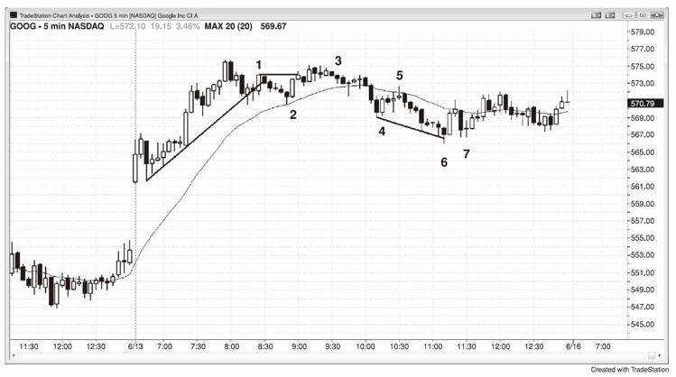
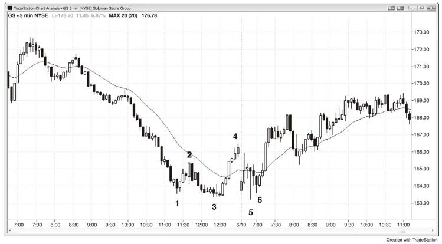
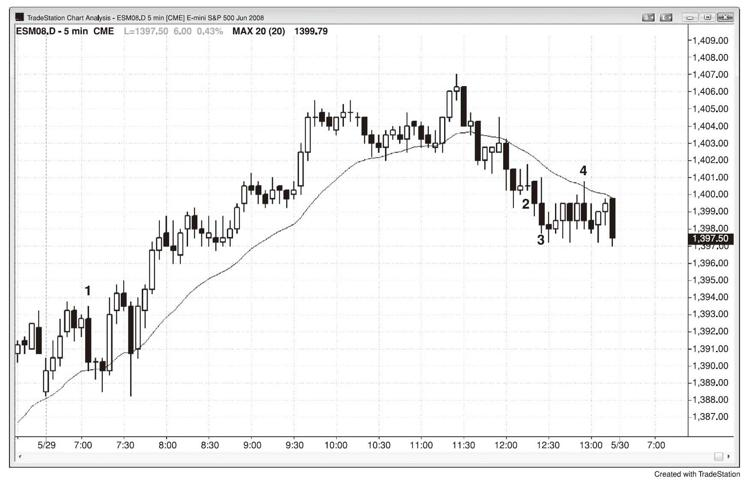
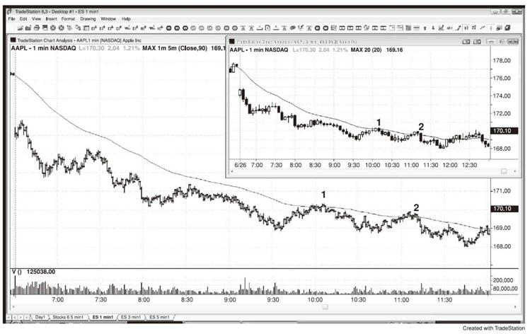
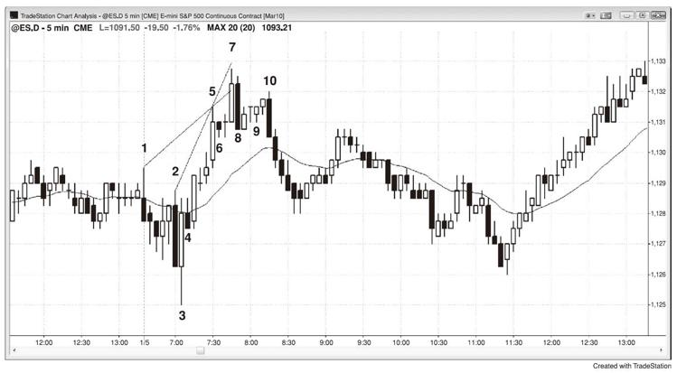
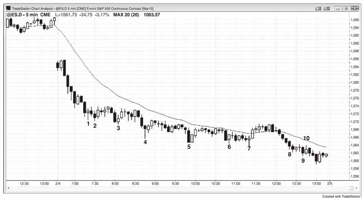

# 第26章　做一笔交易需要两个理由
一些基本规则让交易更为简单，因为一旦满足规则，你可以毫不犹豫地行动。最重要的规则之一是：你需要两个理由来做一笔交易，任何两个理由都行。一旦有理由，那就下单入场，而一旦入场，那就遵循基本的盈利目标和保护性止损的规则，相信你将在当日收盘前盈利。需要重点注意的一点是，如果趋势陡峭，绝不要逆势交易，即便出现高/低2或4，除非之前有重大趋势线突破或趋势通道过靶并反转。同时，如果趋势线突破带有强劲动能而并不只是盘整游荡，那会好的多。记住数K线的建仓形态并非趋势反转形态。举例而言，高2是上涨趋势或交易区间底部的入场而不是在下跌趋势，因此如果有一轮陡峭的下跌趋势，你不应该寻找高2、高3或高4的买入建仓形态。

学会预测交易，这样你就可以随时下单。举例而言，如果市场向下突破一个重要的波段低点，然后形成两腿下跌，或者向下过靶趋势通道线，寻找反转上涨；如果一轮持续过久的行情中出现II突破，寻找反转。一旦你看到一根外包K线或铁丝网形态，在其极点位置寻找小型K线，把握可能的淡出交易。如果有一轮强劲趋势，准备迎接第一轮均线回调，任何至均线的两腿回调，以及第一个均线缺口回调。

只有少数情况下你只需要一个理由介入交易。首先，有强劲趋势时，你必须在每一轮回调中入场，只要其不是在高潮行情或最终旗形反转之后，即便回调只是强劲急速拉升中的高1或强劲急速下跌中的低1。同时，如果市场过靶趋势线并形成一根不错的反转K线，那么你可以淡出行情，预期趋势恢复。不管是在交易区间还是趋势中，其他只需要一个理由介入交易的时候就只有在出现第二入场时。根据定义，之前就有第一入场，因此第二入场是第二个理由。

这里是一些介入交易的可能理由（记住，你需要两个或更多）：

（1）好的信号K线形态，如好的反转K线、双K线反转或II。

（2）趋势中的均线回调，尤其当其为两条腿时（上涨趋势中的高2或下跌趋势中的低2）。

（3）突破回调。

（4）明显始终入场市场中（强劲趋势）的回调。

（5）对任何形式的阻力或支撑的测试，但是尤以趋势线、趋势通道线、突破测试和等距目标为甚。

（6）对决线。

（7）上涨趋势或交易区间底部的高2买入建仓形态（每当你看到一个双重底，它是一个高2买入建仓形态）。

（8）下跌趋势或交易区间顶部的低2卖空建仓形态（每一个双重顶都是低2卖空建仓形态）。

（9）大多数上涨反转（底部）来自于微型双重底、双重底或最终熊旗反转。

（10）大多数下跌反转（顶部）来自于微型双重顶、双重顶或最终牛旗反转。

（11）上涨趋势中的盘整下跌高3回调，它是一个楔形牛旗。

（12）下跌趋势中的盘整上涨低3回调，其是一个楔形熊旗。

（13）高4牛旗。

（14）低4熊旗。

（15）当你在寻求卖空时，交易区间顶部的弱势高1或高2信号K线。

（16）当你在寻求买入时，交易区间底部的弱势低1或低2信号K线。

（17）任何失败（市场运动未达预期就反转）：

（18）突破前高或前低。

（19）旗形突破。

（20）过靶趋势线或趋势通道线后的反转。

（21）未能触及盈利目标，如市场在Emini刮头皮交易中的5或9个跳点时反转。

如图26.1所示，K线2强劲趋势中一轮至均线的两腿调整（双底都是高2买入建仓形态），这个理由足以做多。另一个理由是，市场大幅跳空高开形成开盘上涨趋势，它是20多根K线以来首次碰触均线。它也是第一次趋势线突破，因此回测高点在预期之内。

图26.1　至少要有两个理由来做一笔交易

K线3出现在市场第二次试图向上突破K线1而失败之后。第二根K线以下跌收盘而形成II建仓形态。它也是正在形成中的交易区间中的低2，上涨至K线1的行情是第一腿上涨。

K线5是一轮强劲的三K线急速下挫后的下跌波段中的均线低2。市场很可能会在强势急速下挫之后形成下行通道。

K线6过靶下行趋势通道线并反转，是对第一个小时的窄幅交易区间（一个三角形）的突破测试。然而，它位于一个三小时的下行通道的底部，而通道可以前行非常远，途中出现多次回调。逆势交易之前最好先等待通道的突破回调。第二入场出现在K线7的更高低点，它是市场向上突破从K线5开始的下降趋势线（未显示）后的回调。

尽管K线6是一根反转K线，但是其仅收于中点略上方，因此是一根弱势信号K线。

如图26.2所示，昨日以市场上冲至K线4收盘，完成了正在形成中的扩展三角形中的四腿，三角形还需要一个新低来完成。如果你知道这种可能性，你会在市场跌破K线3时寻找做多入场。K线5跌破K线3，完成扩展三角形的底部，你只需要等待一个入场建仓形态，其出现在K线6的双K线反转和小型更高低点的上方一个跳点处。

图26.2　扩展三角形

如图26.3所示，K线1是市场测试昨日高点后的第二次卖空入场。上涨行情强劲，因此最好等待第二次入场。交易者可以在该K线跌破前一根K线的低点并成为一根外包下跌K线时卖空，或者他们可以在两根K线之前的下跌K线的低点下方卖空。总而言之，在强劲下跌K线的下方卖空总是更加可靠。

图26.3　两个理由做一笔交易

K线2是一根大型十字孕线后的高2，但是下跌的动能强劲。当一轮强劲的急速下挫之后形成一个窄幅下行通道时，最好是等待趋势线突破后再买入。正因为如此，K线3是一个糟糕的二次做多入场点，因为它出现在一根强劲的下跌趋势K线之后，而你依然应该等待下跌趋势线突破后再买入。

K线4是均线处的低2，但是其前面有四根K线几乎完全重叠。在这样的窄幅交易区间中，在下列事件发生之前你不应该介入任何方向：一根大型趋势K线突破形态至少3个跳点，而你在等待该K线失败；或者在交易区间顶部或底部附近出现一根小型K线，你可以淡出。这是一个双K线反转，与至少另外一根K线交叠，而信号K线巨大，迫使交易者在交易区间的底部卖空。如在第一本书的第五章中所探讨的，这很可能是一个空头陷阱而非顺势建仓形态。交易老手不会在那里卖空，而激进地交易者会在其低点处设置限价订单买入。

像K线2和3的这种一个跳点的假突破，很多出现在5分钟图上的逆势入场K线的前一两分钟。发生在K线的最后一分钟的突破更加可靠，因为这样你正好在该K线收盘时拥有动能。相对于发生在四分钟之前并在此后回调的情况，其持续到下一根K线的机率更大。

做低胜率的交易会让你入不敷出。

当一只股票处于强劲趋势时，你可以用限价订单在最初几次均线测试中入场，或者你也可以在1分钟图上根据价格行为在均线处用停损订单入场。在图26.4中，5分钟图是那张小图，1分钟图上的均线是5分钟均线，但是画在1分钟图上。在苹果（AAPL）走势图的K线1和K线2处，1分钟图上位于5分钟均线处的第二入场的风险约为25美分，5分钟图（内嵌图）上的价格行为入场的风险约为45美分。你也可以在第一根收盘于均线上方的5分钟K线收盘时以市价卖空，使用约20美分的止损。这里，在5分钟图上的K线1和K线2处，市场在反转下跌之前仅仅从收盘价上涨4美分。总而言之，更好的选择是，等待1分钟图上的第二入场，或者在5分钟图上使用传统的价格行为入场（在测试加权移动平均线的那根K线下方使用停损订单入场），因为使用其他方法的收效甚微，仅仅是涉及更多思考，可能让你在更高时间框架图（如5分钟图）上的主要交易上分心。

图26.4　均线回调卖空

如图26.5所示，Emini中的K线1、5和7形成一个楔形。由K线2、5和7形成的楔形是一个可靠性较低的反转建仓形态，因为通道太过陡峭。当出现窄幅通道时，最好是等待在更低高点卖空，如K线10处。

图26.5　通道紧凑时，等待第二入场

K线8是一个双K线反转，因此入场点位于两根K线中较低的那根下方，即K线8的下方而不是K线7的下方。大多数交易者会等待在K线10的更高低点卖空，而不是在K线8跌破K线7时卖空。反转下跌也是始于K线6的小型最终旗形。楔形和最终旗形的顶部之后通常有至少两腿的盘整下跌调整，而楔形的高点通常在调整完成之前不会被越过。知道了这一点，在K线9的III形态上方一两个跳点处设置限价订单卖空就合理。保护性止损将位于K线7的高点上方，产生6个跳点的风险。当顶部出现一根强劲的下跌趋势K线时，在其下方卖空通常是一个好主意，即便入场出现在数根K线之后。因为K线10是一根如此强劲的下跌趋势K线，并且收盘于K线8的低点之下，这就是所发生的。

尽管图26.6所显示的价格行为是一轮强劲的急速下挫与通道下跌趋势，也是开盘下跌日的趋势，卖空可以赚到更多的钱，但是交易老手在每一个新低处买入，直到强劲趋势收盘。这不适合新手，因为在情绪上非常难做，除非你有足够的经验而对当前所发生的事情有信心。新手在这中明显的下跌趋势中只能卖空。

一种逆势交易的手法是用限价订单在前期波段低点半仓买入，在其下方两个点处用第二个限价订单加仓（你在尝试分批建立多仓）。如果你的一个点盈利目标在第二个买入订单成交之前就被触及，你就获利了结，取消另一个订单，寻找一个新的波段低点。举例而言，你将在K线2中恰好以K线1的低点价格成交，你可以以一个点的盈利刮头皮离场。你的第二个订单不会被成交，这时候你会取消它并准备在下一个波段低点买入。如果你在K线4中以限价订单在K线3的低点价格入场，你可以将你的第二个订单放在其下方两个点处，把整体仓位的止损设置在第二个入场的下方两点处。一旦市场上涨至你的最初入场点，你可以平掉整个仓位，在较低的入场中赚到两个点盈利，在第一次买入中盈亏平衡。

这种手法即便是在当日结束而市场进入强势下行趋势通道中时也有效。如果交易者在K线8中的K线7低点价位做多，然后在K线9中的下方两个点处加仓，他们可以在K线10中离场。K线10的高点比K线7的低点高一个跳点，因此他们将在第二个入场中赚到两个点盈利，并在第一个入场中盈亏平衡。

图26.6　在下跌趋势中的新低买入