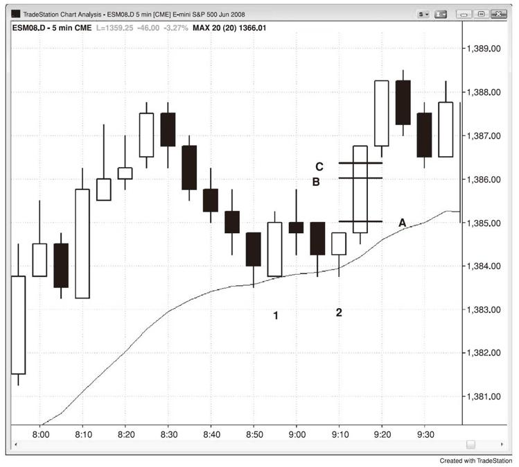

# 第27章　以停损订单入场
价格行为为交易者找理由入场，而完成建仓形态的那根K线叫做信号K线。你实际入场的那根K线叫做入场K线。使用价格行为交易的最佳方法之一是用停损订单入场，因为你被市场动能带入交易，因此至少是在微小趋势（至少持续一个跳点）的方向顺势交易。这是最可靠的入场手法，新手在持续盈利之前应该严格恪守这种方法。举例而言，如果你在一轮下跌趋势中卖空，你可以设置订单在前一根K线的低点下方一个跳点处卖空，在你的订单成交之后其就成为你的信号K线。一个设置保护性止损的合理位置是信号K线的高点上方一个跳点处。在入场K线收盘之后，如果它有一个强劲的下跌实体，那就将止损收紧至入场K线上方一个跳点处。否则就将止损保留在信号K线的上方，直到市场开始向你的方向强劲运动之后。

图27.1　需要六跳点的行情赚取四跳点

在Emini上，通常需要在信号K线之外有6个跳点的行情才能刮头皮净赚4个跳点，需要10个跳点的行情才能刮头皮净赚8个跳点。在图27.1中，停损买入的入场点位于K线2信号K线的高点上方1个跳点处的A线，你的订单将在这里成交。你刮头皮获利4跳点的限价卖出订单在其上方4个跳点的B线。除非市场越过其一个跳点，否则你的限价订单通常不会成交。这就是C线，其位于信号K线的高点上方6个跳点处。