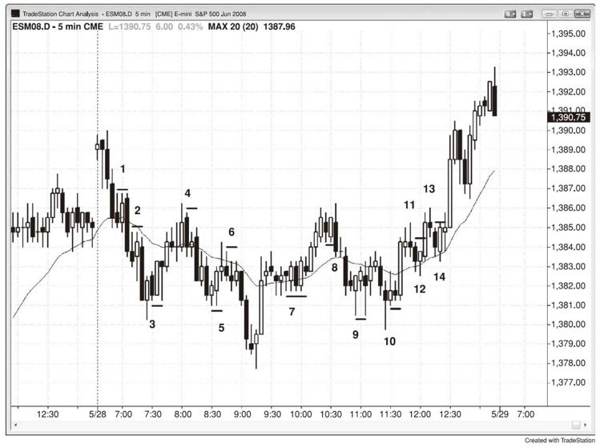
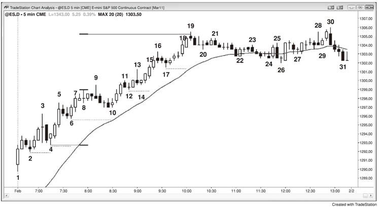
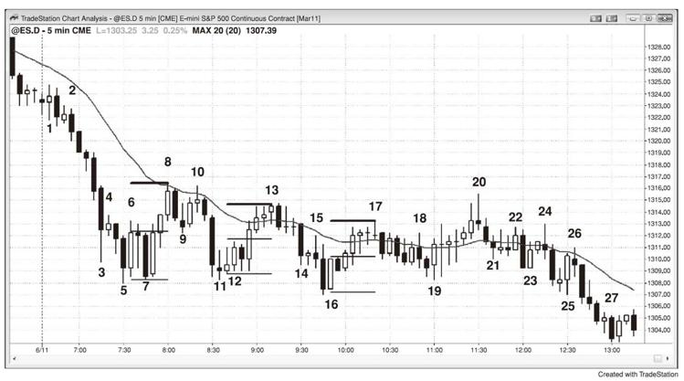
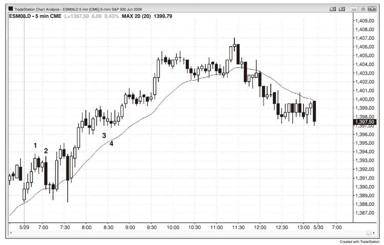
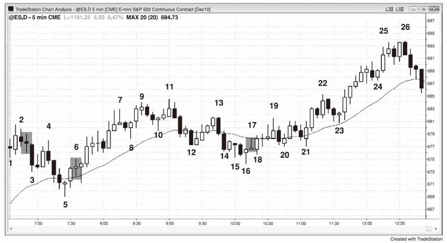

# 第29章　保护性止损和追踪止损
由于大多数交易最多只有60%的确定性，对于其他40%不如预期的交易，你总是要有一个计划。你不应该忽视那40%的时候，就像如果有人在30码之外向你射击而只有40%的概率命中，你不能熟视无睹。40%的概率非常现实也十分危险，因此总是要尊重与你观点相反的交易者。计划中最重要的部分是有保护性止损，防止市场向对你不利的方向发展。最好是在市场中设置止损，因为很多使用心理止损的交易者在其最需要止损的时候却找到太多理由来忽视它，他们不可以避免地让小额亏损不断扩大。有多种方法来设置止损，任何一种都可以。最重要的是你在市场中设置止损订单，而不仅是在脑子里。

保护性止损的两种主要类型是资金管理止损和价格行为止损。在资金管理止损中，你需承担一定跳点数或金额的风险；在价格行为止损中，如果市场越过一个特定的价格K线或价格水平时你就离场。根据情况不同，很多交易者使用这两种止损或其中一种。举例而言，对于一个在Emini上的大多数交易中使用两个点止损的交易者，如果K线大，他可能使用三个点的止损。刚刚做多的价格行为交易者最初可能在信号K线的低点下方一个跳点处设置保护性止损。然而，如果K线非同寻常的大，如六个跳点高，她可能交易较少合约，或转为使用约三个点的资金管理止损。总体而言，在大部分或全部时候使用一种方法最好，因为这样它就成为你的习惯，在你入场交易时总是设置保护性止损。这样当你需要专注于是否交易时，你就不会因为考虑在不同情况下使用哪种类型和大小的止损而分心。

对于大多数小额刮头皮，交易者不想要看到任何回调，他们经常会在其出现时离场。不过，如果他们相信市场进入趋势通道，他们通常会允许小幅回调。举例而言，如果当日是一个交易区间日，而市场刚从区间低点急速拉升，现在可能正在形成一个小型上行通道，市场可能测试区间的顶部，做多的交易者的盈利目标将有限，因此这笔交易将是刮头皮。由于市场处于上行通道，因此很可能会出现回调，这意味着一根K线可能跌破前一根K线的低点几个跳点，但是不会跌破通道内的最近波段低点。既然交易者怀疑市场进入通道而依然做多，他一定是愿意持仓熬过这些回调，将其保护性止损设在通道内的最近波段低点下方。激进的交易老手甚至可能会在前一根K线的低点买入加仓，因为他们知道通道中通常会出现一两根K线的回调，但是市场会继续走高。

如果交易者在买波段，那么他们是预期上涨趋势。由于上涨趋势是一系列的更高高点和更低高点，因此在市场创下新高后，有理由将保护性止损移至最近的波段低点下方，这叫追踪止损。如果市场上涨五或十根K线，回调至入场价下方，然后上涨至新的波段高点，交易者不想要市场跌破那一轮回调的低点，他们会将保护性止损移至其低点下方一个跳点处。很多交易者不想要其止损被第二次测试，他们直接将止损移至盈亏平衡位。

一旦交易者看到市场突破进入其认为的趋势交易区间日，在市场形成第二个交易区间时，他们需要做好准备改变风格。举例而言，如果有一个上行突破持续数根K线，之后是一轮单K线的回调，然后是较为疲弱的上涨，那么该回调的低点很可能会成为上交易区间的低点。由于市场通常回测进入突破缺口，经常行至下交易区间的顶部，因此跌破那根回调K线的低点的概率较大。所以多头不应该将止损移至该低点下方，因为他们会被止损出局。如果他们考虑在此设置保护性止损，还不如在接下来的数根K线里的一根上涨K线收盘时平仓，这样他们会在正在形成中的交易区间的顶部附近止盈而不是在其底部下方。一旦市场进入交易区间，交易者不应该继续像在强劲趋势中一样交易。

一些交易者会允许回调越过信号K线，只要他们相信其波段交易的假设依然有效。举例而言，如果他们在一轮上涨趋势中的高2回调买入，而信号K线约为两个点高，即便市场跌破信号K线的低点，他们可能也愿意继续持仓，认为市场将演变为高3，也就是楔形牛旗的买入建仓形态。其他交易者会在市场跌破信号K线时离场，然后在强劲的高3买入建仓形态形成时重新买入。一些交易者甚至可能双倍买入，因为它们认为强劲的第二信号更加可靠，这些交易者如果认为第一个信号看上去并非特别好，很多人只会在高2买入信号中半仓买入。他们允许高2失败然后演变成一个楔形牛旗，其看上去可能更加强劲。如果这种情况发生，他们将更有信心交易平时的仓位大小。

其他交易者在看到有争议的信号时半仓交易，如果保护性止损被触发就离场，然后如果第二信号强劲就满仓交易。在市场对其不利时分批入场的交易者显然不会使用信号K线的极点作为最初的保护性止损，而且很多人恰恰准备在其他交易者的保护性止损触发时分批入场。一些人直接使用宽幅止损，举例而言，当Emini的日均区间约为15点时，趋势中的回调很少会超过7个点。一些交易者会认为趋势依然有效，除非市场下跌超过日均区间的50%～75%。只要回调在其忍受范围之内，他们就会拿稳仓位并认为其假设正确。如果他们在上涨趋势的回调中买入，而其入场点位于当日高点下方三个点处，那么他们可能会承担5个点的风险。由于他们相信趋势依然有效，他们认为有60%或更高的机会形成等距行情。这意味着他们至少有60%的把握认为市场会在下跌5个点触发其保护性止损之前先上涨至少5个点，这形成一个有利可图的交易者方程。如果上涨回调中的最初买入信号出现在高点下方5个点处，那么他们可能只承担3个点的风险，并且他们会在市场测试高点时平仓。由于回调相对较大，趋势或许有一点疲弱，这可能让他们在市场测试趋势高点时止盈。他们会试图赚取至少与其所需要承担的风险一样大的盈利，但是如果他们担心市场可能正在转入交易区间或反转进入下跌趋势，他们或许愿意在前期高点的略下方离场。

一旦市场最终开始进入交易区间，交易者应该至少在区间高点附近部分止盈，而不是依赖其追踪止损。这是因为市场很可能会开始出现跌破前期波段低点的回调。一旦交易者相信其止损很可能会被触及，在其发生之前离场很明智，尤其是当其已经完成大部分盈利目标时。

大多数交易的最初价格行为止损位于信号K线外一个跳点处，直到入场K线收盘，如果其强势，止损收紧至入场K线外一两个跳点处。如果入场K线是一根十字线，那么就依靠你最初的止损位。记住十字线是单K线交易区间，如果你刚刚买入，你不想要在你认为的上涨趋势中的交易区间下方离场（卖出），或者如果你刚刚卖空，你不想要在一轮新下跌趋势中的交易区间上方买入。

实际上，交易老手可以考虑在一轮可能的新上涨趋势中的小型十字入场K线下方一两个跳点处加仓（或在一轮新下跌趋势中的十字入场K线上方），依靠最初的止损点设置加仓合约的止损。他们是在低1卖空信号K线下方买入，因为他们认为市场在上涨而非下跌。低1是下跌趋势中的强劲急速下跌底部或交易区间顶部附近的卖空建仓形态（在交易区间中，最好等待在低2卖空），而不是在交易区间的底部或新上涨趋势的底部。由于那里的卖空很可能会失败，两个点的保护性买入止损比设置在低1信号K线下方的六个跳点止盈限价订单更容易触及。这意味着在低1信号K线下方买入后，市场很可能会在下跌六个跳点之前先上涨至少两个点。由于交易者认为这是一轮新的上涨趋势，或者至少是一个交易区间，他们认为市场将至少上涨三至四个点，因此这是一笔符合逻辑的做多交易。

如果它是相反方向的K线，那么你需要做一个决策。举例而言，假设你刚在一轮强劲上涨趋势中的回调中买入，而信号K线是一轮至均线的两腿回调终点处的强劲上涨趋势K线。如果入场K线成为一根下跌反转K线，那么你通常应该将保护性止损维持在信号K线的下方。然而，如果你是在一轮强劲下跌趋势中的反转上涨中买入，如果市场跌破下跌入场K线，你通常应该离场。在某些情况下，如果条件合适，你甚至应该反手做空。总而言之，如果你相信失败的做多形态将是卖空建仓形态，你就不应该在强劲下跌趋势中买入。极少数交易者能够在这种情况下反手，如果下跌趋势依然足够强劲而在低1建仓形态中卖空合理，那么很可能不应该寻求做多。反之，多头应该等待市场出现一轮强劲上涨，然后在一个更高低点的回调中买入。在出现多头可以掌控市场的证据之前，在下跌趋势中买入是一种输钱策略。由于大多数上涨反转成为熊旗，卖空要比买入好得多，除非反转的建仓形态尤为强劲。

如果入场时的K线过大，更明智的做法是使用资金管理止损，如在Emini的5分钟图上使用8个跳点，或约70%回调（斐波那契62%回调外几个跳点）。举例而言，在一笔始于一根大型上涨信号K线的多头交易中，你会将保护性止损设在从信号K线底部至入场价之间的约30%距离处，资金管理止损的大小与K线大小成正比。在市场抵达首个盈利目标并锁定部分盈利之后，将保护性止损移至大体盈亏平衡处（入场价，位于信号K线极点外一个跳点处）。最好的交易不会触发盈亏平衡止损，在5分钟Emini图上也很少会越过入场点超过四个跳点（举例而言，做多之后达到信号K线高点下方三个跳点处）。

如果因为大型的强势反转K线和其他因素的综合作用，你对反转充满信心，你可以将止损设在该大型信号K线外，并允许在入场后出现回调，只要市场并不触及你的止损。你甚至可以将止损设在信号K线之外几个点处，但是如果你这样做，你要计算风险并降低仓位，将风险控制在平时水平。同时，如果你确信反转足够强劲而很可能出现两条腿的调整，如果市场在你刮头皮平掉部分仓位后回撤到你的最初入场价下方几个跳点，你可以持仓熬过回调并依赖你最初的止损，尽管会回撤数个跳点。否则（例如，在一笔新多头中），你将在盈亏平衡位平掉波段仓位，然后在扫你止损的K线的高点上方再次买入，放弃你认为是非常高概率的第二腿行情中的几个跳点或更多。

如果你在一轮你相信即将结束且K线较小的平静回调中入场，你可能会考虑使用通常的资金管理止损，即便这意味着你承担市场越过信号K线数个跳点的风险。举例而言，如果当日是一个下跌趋势日，以低动能的上行通道涨至均线，形成一个低4卖空建仓形态，而信号K线是一根三跳点高的十字K线，那么相信回调即将结束的交易者可能会承担其通常的8个跳点风险，即便此时止损将位于信号K线的上方四个跳点处。低4建仓形态经常在窄幅通道中形成，其入场就是向下突破窄幅通道。窄幅通道的突破通常有回调，有时候它们还越过信号K线。这里出现更高高点的突破回调并不会让人意外，只要交易者相信其假设依然有效，他们就可以允许交易有一定空间。另一种选择是，他们也可以在市场越过入场K线或信号K线时离场，然后在市场再次转跌时再次卖空，但是如果他们确信自己的分析，他们可以依靠最初的八跳点止损，忍受更高高点的回调。总而言之，如果你处于一笔亏损的交易，问一下自己如果空仓现在是否还会做这笔交易。如果回答为否，那就离场。如果你的假设不再有效，那就离场，即便亏损。

当你担心市场可能大幅波动并形成大型K线时，你应该只交易平时仓位的一小部分，把仓位降至一半或四分之一。如果你在买入，确信低点将会守住，但是做多交易需要比你平时使用的大很多的止损，你可以使用更大的止损，然后等待。如果市场在没有出现多少回调的情况下就触及你的盈利目标，那就获利了结。然而，如果市场只越过你的入场价一个跳点，几乎回调至你的止损位，然后再次涨至你的入场价上方，那就提高你的盈利目标。作为一条整体原则，市场将会上涨足够高，与你留在交易中所需要的止损大小相等。因此，如果市场在反转上涨之前先跌破你的入场价11个跳点，那么12个跳点的止损就有效，因此市场很可能会涨至你的入场价上方约12个跳点或更远。设置限价订单在该价位下方一两个跳点处止盈很明智，当市场接近目标时，将你的止损移至盈亏平衡处，等待观察你的止盈目标订单是否成交。举例而言，假设回调为11个跳点，你在信号K线外的止损未被触及（其可能是12个跳点或18个跳点），现在市场再次向你的方向前进，计算一下为了避免被止损出局而需要承担的风险的总跳点数。这时候，你需要承担12个跳点的风险（回调外一个跳点）。现在将你的盈利目标提高至比风险少一两个跳点，或11个跳点。这时候你也应该将保护性止损调整至回调外一个跳点处，因此你现在承担12个跳点的风险。

在你赚到刮头皮盈利之前保护性止损就被触发时，你陷入了一笔糟糕的交易，因此在止损位反手有时候是一个好策略，这取决于环境。举例而言，当你认为市场正在反转进入上涨趋势时，失败的低2卖空就是反手做多的好机会。然而，窄幅交易区间中的扫止损并非反转。在考虑做反方向的交易之前，花时间确保你正确解读图表。如果你没时间立即入场，等待下一个建仓形态，其总是不会很久。

在研究一个市场之后，你将知道合理的止损是多少。对于Emini的5分钟图，当日均区间为10～15点时，8个跳点的止损在大多数交易日都有效。不过要密切关注第一个小时所需要的最大止损额，因为这通常成为当日剩余时间的最佳止损。如果止损大于8个跳点，你很可能可以将盈利目标也提高。不过，除非K线尤为巨大，否则最多只能提供一点优势。

有两种建仓形态通常要求大止损，这意味着交易较小仓位。两者均涉及在趋势中的强劲急速行情终点附近入场，但是这两笔交易是相反方向。当趋势初期出现强劲急速行情时，有多根连续的趋势K线，交易者会在K线的形成过程中及其收盘时按趋势方向入场。举例而言，如果一个强劲的上行突破中有两根大型上涨趋势K线，多头会在第二根K线的收盘价及其高点上方买入。如果其后出现第三根、第四根和第五根连续的上涨趋势K线，多头会在急速拉升扩大的过程中不断买入。其所有入场的理论止损均位于急速拉升的底部下方，距离很远。如果交易者使用该价位做止损，他们需要交易非常小的仓位来将风险保持在舒适范围之内。现实中，大多数交易者在急速拉升晚期入场时考虑使用较大仓位刮头皮并使用较小止损，这是因为回调变得更有可能，他们有机会在更低价位以较小止损建立波段仓位，如在信号K线下方。

交易者在大型趋势K线中入场并需要大止损的第二种情况是在其逆市入场时。举例而言，如果出现第三轮连续抛售高潮而没有重大回调，而第三轮抛售高潮中出现了当日最大的下跌K线并收盘于低点附近，那么激进的多头会在该K线收盘时买入，预计其为波段低点或附近，他们还会预期之后出现强劲上涨。可靠的保护性止损在这种情况下永远无法确定，但是作为一条准则，由于交易者预计市场至少会涨至大型下跌K线的高点，他们对这笔交易有60%的把握，他们应该承担至少和下跌趋势K线一样大的风险。如果他们是经验非常丰富的交易者，这可以是一笔可靠的交易，这类情况下的成交量通常巨大，意味着机构也在大力买入。空头在对其空仓止盈，多头正在激进买入。双方经常会等待一根大型下跌趋势K线进入支撑位，将其作为衰竭迹象，然后激进买入。因为他们预计底部很快会形成，于是他们袖手旁观，停止在支撑位略上方买入，这形成了大型下跌趋势K线形式的卖盘真空。

还有很多其他的特殊情况，交易者可能会使用非同寻常的宽幅保护性止损。我有一位朋友，他寻找弱势通道并逆势分批入场，预期市场反转。举例而言，如果市场处于急速拉升后的上行通道，并且通道并非特别强势，他就设置限价订单在通道内的前一个波段高点卖空，使用平时四分之一大小的仓位，如果通道持续，在接下来的两至三个波段高点上方加仓。当Emini的日均区间约为10～15点时，他的最终止损大约在其首次入场的上方8个点处，他的目标是市场测试他的第一次入场。一旦反转形成，如果他认为其强劲，他经常会在其最初入场位下方用部分仓位做波段交易。

交易者可以在阶梯形态或趋势交易区间日的突破淡出中使用宽幅止损。如果Emini的日均区间为10至15个点，有一个突破运行约5个点，交易者可以淡出该突破，承担约5个点的风险来赚取5个点，预期市场测试突破。通常这笔交易有超过60%的成功率，因此有正的交易者方程。

交易者有时候在大型趋势终点的单K线最终旗形的大型趋势K线突破中淡出，预期这根趋势K线是衰竭性高潮。举例而言，如果有一轮上涨趋势已经持续30多根K线，期间只出现过小幅回调，然后形成一根大型上涨趋势K线，之后是一两根K线的回调，如果下一根K线又是一根大型上涨趋势K线，多空双方会在其收盘时卖出。多头卖出止盈，空头卖空建仓。空头将会承担市场涨至该K线高点的风险（如果该K线为10个跳点高，他们会使用10个跳点的止损），他们的最初盈利目标将是测试该K线的底部，下一个目标等距下跌。

我有另一位朋友在Emini的回调中入场时习惯使用5个点的止损。他认为自己无法持续预测回调的终点，而是在他认为趋势正在恢复时入场。他承认有时候过早入场，趋势恢复之前回调可能进一步扩大，而宽幅止损让他留在交易中。他的盈利目标是测试趋势的极点，其可能在三至五个点之外。如果趋势恢复强劲，他会用部分仓位做波段交易，准备再赚5个点或更多。尽管该手法有多种变体，但是其平均风险一般和平均回报一样大，由于这是一种顺势策略，其胜率至少为60%。这意味着该策略有正的交易者方程。

每当交易者使用宽幅止损，一旦市场开始向其方向前进，他们通常能够收紧止损，大大降低风险。一旦一笔波段交易达到盈利目标的一半，很多交易者会将保护性止损移至盈亏平衡处。如果市场向其方向强势推进，其成功率提高，潜在回报可以保持不变，或者他们也可以将其提高，并降低风险。这加强了交易者方程，也是很多交易者选择等待市场能够走到这一步时再入场的原因。然而，如果反转非常疲弱，尽管交易者可以收紧止损并降低风险，但其成功率会降低，他们还可能会降低回报（收紧止盈现价订单）。如果交易者方程足够疲弱，他们或许会试图以小额盈利离场并等待另一笔交易。

你的目标是赚钱，这需要正的交易者方程。如果K线的大小要求宽止损，你就必须使用，但是你也必须调整盈利目标来保持正的交易者方程，你还应该降低仓位。

在大型市场，或许有100家机构在积极交易，每一家贡献约1%的总交易量。在其他99%的交易量中，只有5%来自散户。机构试图从其他机构的身上赚钱，而不是散户。因为机构占94%的市场，而散户只占5%。机构对我们毫不在意，并没有扫我们的止损，试图吞噬小人物。如果你的止损被触发，其与你毫无关联。举例而言，如果你做多，保护性卖出止损被触发，你应该假设这是因为至少有一家机构也想要在那个价位卖出。极少数情况下会有足够多的小交易者同时做一件事情而提供足够高的交易量而吸引机构，因此最好是假设只有当机构愿意卖在那个价位买卖的时候，市场才会抵达那里。

如图29.1所示，最初止损位于信号K线外一个跳点处。一旦入场K线收盘，如果该K线强劲，将止损移至其外面一个跳点处。如果风险太大，使用资金管理止损，或者承担信号K线60%高度的风险。

图29.1　最初止损位于信号K线外一点

如果你在K线1中市场向下突破下跌孕线时卖空，最初止损将位于信号K线的上方。K线1入场K线在入场后立即反转上涨，但是并未越过信号K线的高点，因此这最终会是一笔盈利的卖空刮头皮。一旦入场K线收盘，如果它是上涨或下跌趋势K线而非十字线，将止损移至其高点上方一个跳点处。在本案例中，信号K线和入场K线有同样的高点，因此止损无须收紧。

K线3后一根K线是开盘的三段下跌后的一根上涨反转K线。尽管在市场第一次突破窄幅下跌通道时买入并非一笔好交易，但是第一个小时内的反转通常可靠，尤其是在前一日强势收盘时（看一下昨日收盘前的陡峭均线）。K线3入场K线立即被抛售，但是并未跌破信号K线的低点，或跌破其高度的70%（如果你使用资金管理止损，认为该信号K线太大而不能在其低点下方使用价格行为止损）。一旦入场K线收盘，保护性止损应该移至其低点下方一个跳点处。如果市场跌破其低点，很多交易者会卖空，因为这是一个突破回调的卖空建仓形态。然而，由于这并非一轮强势急速下挫，因此它不是可靠的低1卖空。另外，交易者可以将止损保持在信号K线下方，但是在一轮强劲的下跌趋势底部抄底时，当市场跌破低1卖空信号K线这样的强劲下跌趋势K线时，持有多仓的风险很大。

两根K线之后，出现一根回调K线，但是其并未触及止损，其精确测试了入场K线的低点，形成一个双重底。由于这个楔形底很可能出现两腿上涨，因此交易老手可以持仓熬过入场后的两根K线后发生的回调并依赖入场K线下方的止损。否则，你将在7个点时被止损出局，然后你会在回调K线的高点上方买入来捕捉第二腿行情，这样你的入场价差了三个跳点，因此总体上你少赚10个跳点。

至均线的回调在K线4与K线1区域形成一个双重顶，并且它是一个小型楔形熊旗。其他交易者会将其看作均线处的低2。K线4低2卖空的最初保护性止损并未触发，尽管在入场后的两根K线之后出现一根回调K线。止损位于信号K线上方，在市场向你的方向运动至少四个跳点或出现一根强劲的下跌实体之前，你不应该将止损收紧至最近K线的高点上方，给这笔交易一些时间。同时，当入场K线为十字线时，允许一两个调点的回调通常是安全的。十字线是一个单K线的交易区间，在交易区间上方买入的风险很大，因此不要在那里回补空仓，依赖你的最初止损，直到市场向你的方向运动至少数个跳点。

K线5的多头立即抛售测试信号K线的低点（这在1分钟图上明显，并未显示），形成一个微型双重底，然后是一笔成功的多头刮头皮，依赖你的止损而无视1分钟图。在使用5分钟图入场时，依赖5分钟图的止损，否则你将亏损太过频繁，当你试图减少每笔交易的风险时，会在太多好交易中被扫止损。

K线7是一个强劲急速拉升后的高2多头。市场测试了信号K线下方的止损，但是与其相差一个跳点，然后测试了入场K线下方收紧后的止损，但是两个止损均未被触发。入场前的十字线提高了交易的风险，但是当市场从当日新低大涨后有六根K线收盘于均线上方时，这是一个可以接受的多头建仓形态，因为你需要预期第二腿上涨。

K线8的II形态是一个高1买入建仓形态，但是它并非位于强劲上涨趋势中的强劲急速拉升顶部，因此并不是一笔好交易。实际上，它处于始于当日低点的急速拉升后的上行通道的顶部，它位于一个等距行情目标位附近，并且它可能正在与K线4形成双重顶。由于大多数交易区间的突破试图会失败，因此有60%的可能市场下跌，只有40%的可能突破会成功。无法确知具体概率，但是对于交易区间的突破试图，60/40是一个不错的起点。激进的交易者会用限价订单在II形态的高点卖空，预期其为多头陷阱。如果交易者在K线8的II形态上方买入，其保护性止损将在入场K线被触发，这将是一个出色的反转，正如大多数失败的II形态一样。

如果在这个交易区间日顶部附近的K线11波段高点卖空，你可以在测试均线的K线12反转K线处反手，或者在K线11卖空后的入场K线上方一个跳点处以停损订单买入。

从K线13的波段高点低2开始的卖空成为一个五跳点失败和失败低2。你应该在K线14中的入场K线（K线13信号K线后一根K线）上方一个跳点处反手做多，因为有空头被套，你应该预期至少还有两腿上涨。如果你没有在那里买入，你应该在K线14的后一根K线买入，因为K线14是双K线反转上涨，是一轮可能的上涨趋势中的均线上方的高2买入信号。每当交易者在摸顶时看到均线处有一个具有上涨信号K线的高2买入信号时，他们总是应该平掉空仓并反手做多。如果他们没有卖空，他们则应该做多，这不是一个好的建仓形态，因为它可能正在形成大型楔形牛旗突破的回调。两根K线之前的强劲上涨趋势K线是突破，三段下跌始于K线7附近的K线（三根K线之前是一个好选择），然后是K线9和K线10前一根K线。至K线8的上涨向上突破了前几个小时的下行通道，而K线10是向上突破下跌趋势线后的更高低点的第二入场。一些交易者在K线10买入，因为他们将其看作头肩底，其他交易者用限价订单在K线13的低2下方买入，因为他们认为这是上涨趋势而非交易区间，而上涨趋势中的低2是一个买入建仓形态。低2只有在交易区间或下跌趋势中才是卖空建仓形态。当市场处于上涨阶段时，交易者将低2看作空头陷阱，会在其下方买入来把握反转上涨。一些交易者会在低2入场K线的上方一个跳点处用停损订单买入，等待其将失败的确认。

从K线12开始波段做多的交易者会在市场创下新高后将止损追踪至最近波段低点下方一个跳点处。因此一旦市场升至K线13的波段高点上方，交易者会将保护性止损移至K线14的更高低点略下方。

在一轮强劲的上涨趋势中，交易者经常会在市场创下新的波段高点后将保护性止损移至最近的波段低点下方。一旦市场看起来像是要进入交易区间，交易者应该止盈部分仓位，并考虑刮头皮赚取较小的盈利。

如图29.2所示，今日开盘大幅跳空上涨，第一根K线是一根强劲的上涨趋势K线，因此今天有很大机会成为一个开盘上涨趋势日。如果交易者在K线2或K线4的上方买入，一旦K线5涨至K线3处的最近波段高点上方，交易者可以开始使用追踪止损。至K线5的三K线急速拉升让大多数交易者确信始终入场方向为多头且强势，因此很多交易者想要让利润奔跑。一旦K线7上涨至K线5的上方，他们可以将其保护性止损收紧至K线6的下方一个跳点处，而当市场上涨至K线9的上方时，他们可以将其收紧至K线10的下方一个跳点处。

图29.2　强劲上涨趋势中的追踪止损

交易者知道趋势通常会在某一时点出现较大的回调，当交易者相信一轮更为复杂的回调即将出现时，他们会止盈部分或全部仓位。等距行情目标经常是机构可能止盈的地方，意味着回调可以从那里开始。由于最初的强劲急速拉升始于K线4并结束于K线8附近，因此其等距行情的目标位很可能会是止盈目标。从K线10至K线19的上涨行情有三腿，而三腿行情是楔形的变体（即便其处于这样的陡峭通道中），后面可能出现较大回调。最初目标是移动平均线。K线18是一根强劲的上涨趋势K线，后面是另一根大型上涨趋势K线，这一轮双K线的买入高潮出现在一轮持久的趋势之后。当这种情况发生时，市场经常调整至少10根K线和两条腿，尤其是当其远离均线时，正如本例。当K线19成为一根下跌反转K线时，很多交易者获利了结，其他交易者认为第一轮回调之后至少还会出现一个新高，因此他们持仓熬过回调。然而，当市场上涨越过当日收盘价附近的K线19时，K线30出现了激进的获利了结，因此很多交易者在新高处和市场反转下跌时获利了结。

今天是一个非常强劲的上涨趋势日，在回调至均线之后，很可能测试高点。至K线24的下行通道是低动能并有小K线。在K线24上方买入的交易者可以考虑依赖通常的8跳点止损，以防突破下行通道（所有的下行通道均是牛旗）后出现更低低点的突破回调。市场强势向上突破，但是立即形成一个大型的双K线反转，这在一轮正回调至均线的强劲上涨趋势中并非一个可靠的卖空建仓形态。交易老手会依赖其止损，尽管其位于信号K线的下方七个跳点处。止损将不会被触及，交易者可以在当日高点附近平掉其多仓。另一种选择是，交易者可以在K线25的双K线反转下方离场，然后在K线26的微型通道突破回调上方再次买入。

在上涨至K线19的买盘高潮前的强劲上涨趋势中的任一时刻买入的交易者，理想的情况是将保护性止损设在最近波段低点的下方，这意味着承担超过两个点的风险并使用宽幅止损。一旦K线19的买盘高潮形成，市场很可能进入交易区间，交易者则需要转换为交易区间的交易风格，这意味着刮头皮而非波段交易。由于市场正在进入交易区间，其很可能跌破前期波段的低点，因此将保护性止损放在那里就不再有意义。一旦一个止损很可能因为交易区间正在形成而被触发，交易者应该在其发生之前就平掉多仓。敏锐的交易者会在可能正在形成交易区间的顶部的强势行情中离场，如在K线19下方。激进的交易者此时会开始卖空，准备在市场回调至均线的过程中刮头皮。

大多数交易者会将其保护性止损追踪至最近波段低点的下方。相对于让波段交易奔跑直到趋势结束，一些交易者倾向于使用盈利目标。一旦市场抵达其盈利目标的一半，这些交易者会将其保护性止损移至不小于盈亏平衡的价位。

市场赏赐给交易者的回报通常与其迫使交易者承担的风险一样大。总体而言，在下跌趋势日中的大型信号K线上方买入的风险大，图29.3中的交易至少也是有所争议，但是它们阐述了一个观点。

图29.3　回报经常与风险相等

如果交易者在K线5的上方买入，并认为它是第二轮连续的抛售高潮，也是一轮抛物线行情的底部，因此后面很可能出现一轮两腿上涨，他们的最初止损应该设在K线5的低点下方。K线7测试了其低点，但是并非触发止损。不过一旦市场上涨越过K线7，交易者会将其止损移至K线7的低点下方一个跳点处，其为入场价下方16个跳点处。然后市场恰好涨至K线8的高点，其位于入场价上方16个跳点处（并测试了均线，空头在此入场）。明白这种倾向的交易者会在其入场价上方15个跳点处设置止盈限价订单。由于他们在其认为将成为小型交易区间底部的地方买入，他们相信至少有60%的机会形成等距上涨，这是一笔勉强可以接受的交易。

同样的事情在K线12和K线16的强劲上涨趋势K线上方的多头交易中再次发生。一旦市场回调后再次回涨，交易者就看到市场迫使其承担多大的风险，他们可以在比其风险少一个跳点的位置设置止盈限价订单。

在K线2至K线3的急速下挫中的任一时刻卖空的交易者，以及计划做波段交易的交易者，他们会使用宽幅保护性止损，可能设在急速下挫的顶部上方。大多数交易者所承担的风险会小一些，但是他们也会承担两三倍于刮头皮交易的风险。

在K线16，假设一位多头在第三段下跌的反转上涨中买入，期待最终旗形的趋势反转。由于从K线13开始的下行通道紧凑，如果交易者等待观察突破是否强劲，然后在后面的强劲急速拉升或回调中做多，成功的概率会更高。不过，为了方便阐述，假设交易者直接在K线16的上方买入，他可能假设市场有50%的概率向上突破K线13的高点并抵达等距上涨目标，使其回报远大于风险，即市场跌破K线16的买入信号K线。不过，他可能对至K线17十字线的上涨行情中的多头缺乏紧急感而担忧，并决定其假设已经改变。他可能会确信市场只是在下行通道中创下另一个更低低点而非趋势反转，然后就刮头皮平掉他的多仓。如果他认为市场正在筑顶，继续持有多仓就没有意义。如果他认为可能有第二腿上涨但并不触发盈亏平衡的止损，他可能会将其保护性止损移至盈亏平衡位。如果他认为市场可能跌破他的入场价但维持在信号K线的低点上方，并形成一个更高的低点，他可以保持其原始止损，或者可以离场，在突破回调至更高低点时买入。交易者不断做出这类决策，他们在这方面做得越好，他们就越能赚钱。如果他们总是坚持最初假设，甚至当市场并非像其预期一样发展时，他们会很难赚钱。他们的工作是跟随市场，如果市场并未向其所认为的方向发展，他们应该离场并寻找另一笔交易。

波段交易者允许回调，在趋势发展起来之前，他们耐心等待而不急于收紧止损。在K线20下方卖空的波段交易者，预计这将是市场对交易区间顶部的测试，导致从开盘开始的下跌趋势恢复，他们可能在寻找至少为其风险两倍大的回报。一旦他看到那根强劲的下跌入场K线，他可能会将止损收紧至其高点上方，或者他可能将其留在K线20信号K线的上方，直到市场从K线24的双重顶反转下跌。信号K线为三个点（12跳点）高，因此他的最初止损是14个跳点。如果他的盈利目标为风险的两倍，他想要在其入场价下方28个跳点处止盈，或1305.25，而他的止盈限价订单将在K线27的两根K线之前成交。K线24上涨至K线23前一根强劲下跌趋势K线的上方一个跳点处，让缺乏耐心的空头踏空，但是其并未达到入场K线或信号K线上方。

如图29.4所示，市场上涨至昨日高点上方，然后反转下跌。在K线1下方卖空的交易者会将最初的保护性止损设置在K线1的上方。在市场于K线2下跌之后，他们可以计算出市场在向其方向前进之前向对其不利的方向前进了8个跳点。这意味着他们留在交易中所需要的最小初始保护性止损将是9个跳点，在当日剩下的时间里要记住这一点。

图29.4　止损大小通常由当日第一笔交易决定

如果你在K线3的失败低2买入，并将最初止损设置在信号K线低点下方一个跳点处，你将承担8个跳点的风险。一个点的止损很普遍，在今天的早些时候你就知道需要9个跳点的止损，因此多承担一个跳点的风险是明智的。这并非一笔出色的买入，因为它在一个小型突破之后，并且最后七根K线主要为盘整，第二入场会更好。K线4是一个高2买入建仓形态，两根K线之后的上涨孕线是一个突破回调的买入建仓形态（孕线是高2多头突破后的回调），两者均为较强的建仓形态。

一旦K线变小，你可以将止损调整为适合当前情况的大小。不过，在当日后期，市场经常会出现一笔要求较大止损的交易。不要担心你的止损被触及并实现亏损。通常这比整日调整止损、止盈和仓位并最终错过交易或犯错要好得多。

图29.5　不要过早收紧止损

不要在入场后几根K线之内形成的小型十字K线后收紧保护性止损。它们是单K线的交易区间，市场经常在其外部一两个跳点处反转。在你的假设依然有效的情况下，你不希望被止损出局。

如果交易者在K线2下方卖空并看到其入场K线收为十字线，他们应该将其保护性止损维持在信号K线的高点上方，直到市场在其方向形成大行情。他们可以在K线3的暴跌中刮头皮平掉部分仓位，并且如果他们认为均线陡峭而存在上涨风险，他们可以将止损收紧至盈亏平衡处或K线3上方一根K线处。如果他们这样做，他们将在K线4被止损出局，但是这依然是一个明智的决策。然而，在一个大幅向上跳空的交易日中，当在均线附近出现回调时，通常会有第二腿下跌进一步测试均线，这通常形成当日低点，正如在K线5这里发生的一样。

如果交易者在K线5均线缺口K线的上方和高2及楔形牛旗测试中买入，一旦入场K线收盘并成为一根明显的强劲上涨趋势K线，他们可以将波段交易仓位的保护性止损移至盈亏平衡处，他们将不会在K线6十字线的低点下方离场。

如果他们在K线16上涨反转K线的上方买入，认为它是一个高2多头或楔形牛旗（K线8或K线10形成第一段下跌），他们将不会在入场K线成为十字线后收紧止损。不过，一旦K线18成为一根强劲上涨趋势K线，他们应该将止损移至其低点下方。