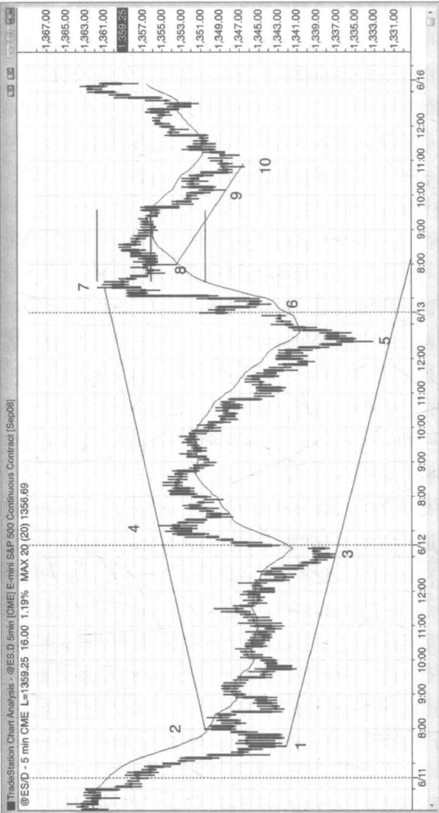
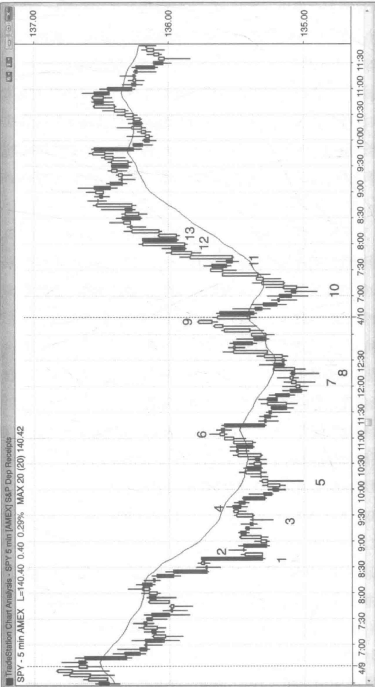
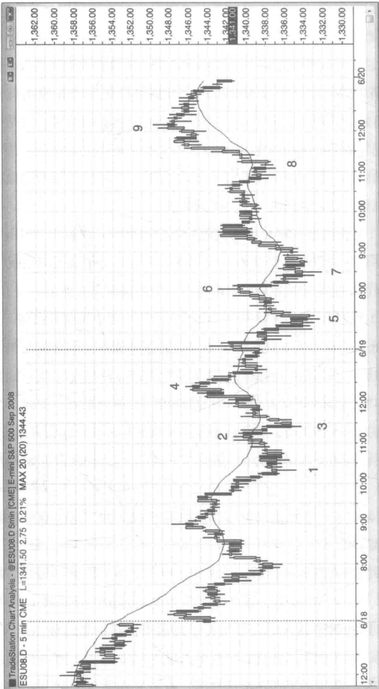

# 第6章 · 扩张三角形

扩张三角形可以是一种反转形态，也可以是一种持续整理形态，至少由五个波段构成（有时候是七个波段，极少情况下是九个波段），每个波段比前一个波段更大规模。三角形是一种震荡形态，大部分突破震荡区间的尝试都无功而返。这种行情的倾向性就形成了扩张三角形。在多头反转（扩张三角形底）过程中，市场有足够的力量反弹至最近一个更高的高点上方，并把跟进的多头套住；然后暴跌至第三个低点，在更低的低点处，迫使被套的多头止损出局，诱导新的空头入场，然后再反转上行，导致市场双方在三角形中追涨杀跌。这个新低是行情在三角形中的第三次下推，我们可以把它看作是某种类型的三浪推进模式，或看作是一次突破后的回调——市场向上突破了前一波段的高点，然后回调至一个更低的低点。在空头反转（扩张三角形顶）过程中，情况正好相反。空头在更低的低点处入场后被套，然后强制止损出局，多头在更高的高点处入场后被套，双方不得不在市场最后一次反转下行时追跌杀涨。三角形行情的最初目标是突破三角形对边，而一旦到达另一边，市场往往在这里开始尝试再次反转。如果真的成功突破三角形对边，则表示反转失败，该形态变成一个在原趋势方向上的持续整理形态。

举例而言，如果牛市中价格处于一个扩张三角形顶（反转形态），第

一个目标则是向下突破该形态；大部分情况下，这是价格所能达到的最远位置。如果成功向下突破，第二个目标则是走出一波可测量的下跌行情，下跌幅度接近三角形中最后一个上升小波段的高度。如果向下突破失败，市场反转上行，那么三角形就变成一个持续整理形态，由于当前处于牛市之中，这种情况下的三角形就是一个扩张三角形上升旗形。其首个目标便是创出新高，且通常情况下行情走势恰恰如此。如果成功向上突破，下一个目标便是走出一波可测量的上涨行情，上涨幅度接近三角形中最后一个下跌小波段的高度。如果向上突破失败，市场反转下行，便形成了七个小波段的更大级别的扩张三角形顶，一开始只有五个小波段。在某个点位上，扩张三角形要么被成功突破，市场走出一波可测量的行情，要么突破失败，并演变成一个大型的震荡区间。

“三角形”这一术语很容易造成误导，因为这种形态一般看起来并不像一个三角形。最突出的特点是它逐步形成一系列更高的高点和更低的低点，不断诱导突破型的交易员入场，并令他们在某些价位上投降认输，然后所有交易员都站在交易的同一边时，市场趋势就此形成。三角形中有三次向上或向下的推进运动，所以也可以被视为三浪推进的反转形态的一种变形，只是每一次推进之后都伴随深度的回调。例如，在一轮熊市的底部发生牛市反转，两次回调都形成更高的高点；但是，在传统的三浪推进形态如楔形底（向下收敛的三角形）中，两次回调都形成更低的高点（即不是扩张三角形）。

所有扩张三角形都是主要趋势反转形态的变形，因为最终反转形态都出现在一个强烈的小波段之后。例如，价格处于扩张三角形底，从最后一个低点处启动的反弹跟随在第二个反弹之后，而第二个反弹足够强势向上突破前一个波段高点，并总是突破一些关键的下跌趋势线。如果我们画一条包含三角形中第二个下降小波段的下跌趋势线，从第二次下推开始的这第二个反弹最低程度可以向上突破这条下跌趋势线，因此第三次下推是一个更低低点的主要趋势反转做多入场形态。涨至第一个或第二个小波段的反弹通常也能突破另外一些主要的下跌趋势线。

熊市中的扩张三角形底，后来往往演变成扩张三角形下降旗形。在图6.1中，电子迷你期货跳空高开，并在K线6处回调测试移动平均线以及昨天收盘价，形成开盘反转的态势，然后价格一路快速上行。昨日低点在K线5处与K线1、2、3、4构成一个扩张三角形底。这是一个反转形态，三角形之前的趋势是向下的。扩张三角形的首个目标如K线7所示是到达一个波段高点。然后市场通常试着形成一个扩张三角形下降旗形，由于该扩张三角形处于熊市的震荡区间里，因此是一个持续整理形态。行情在K线7处击穿上涨趋势通道线，完成了这个下降旗形（该三角形由K线2、3、4、5和7构成）。在趋势通道线突破失败后，尤其当前处于扩张三角形时，行情通常走出两个回合的下降小波段。顺便提一句，扩张三角形不一定拥有完美的形状，价格也不一定会触及三角形两边的趋势通道线（如K线5未跌到位）。

涨至 K 线 7 这波反弹非常强势，但在这种情况下，其形成的震荡区间顶部的低点 2 做空信号值得我们入场一试。K 线 8 是连续两天出现的第二个十字星，十字星代表着多空双方势均力敌。由于双方处于均衡状态，这个平衡点常常是下跌行情的中点，根据这一点我们可以大概估算出市场还能下跌多大的空间，直至碰到足够的多头力量使价格重新上扬。市场在 K 线 9 处达到目标价位，并在 K 线 10 处击穿下跌趋势通道线然后反转上行，K 线 10 为楔形上升旗形信号 K 线。K 线 6 是一根做多的信号 K 线，K 线 10 也是对在 K 线 6 上方入场的一次精准的测试（一次完美的突破测试）。

在扩张三角形反转形态中，低点越来越低，高点越来越高。一般来

Created with Trade Station

  
图6.1 电子迷你期货中的扩张三角形底部

第6章扩张三角形  
  
图6.2 扩张三角形底部反转

说，市场在反转前会发生五次转向，有时候是七次，如图6.2所示SPY的5分钟图。这期间我们有理由在每一个小波段上都做一次刮头皮交易（例如每一个小波段都在震荡区间中产生一个波段高点或低点），可是一旦第五个小波段结束，一波更大规模的趋势即将启动，我们应该从刮头皮交易转向波段化交易。另外，一旦形态完成，行情通常都会形成一个反向的扩张三角形。如果第一个三角形是反转形态，那么该形态的下一个阶段（将与第一个三角形反向）发展下去则是一个持续整理形态，反之亦然。

K线5为第五个小波段（K线1是第一个小波段），是一个做多入场形态，预期行情至少走出两个回合的上升小波段。然而，K线6是一个突破失败的做空入场形态，一个小级别楔形（它是上升通道内以K线5上升尖形为起点的小型三浪推进模式中的第三推）。这里构成了扩张三角形下降旗形，以K线2为五个波段中的第一段。

在 K 线 8 处的第七个小波段为二次入场机会。K 线 7 走出新低，是第一个入场条件，但以失败告终，这也是意料之中的事，因为这期间行情处于一个铁丝网形态，大多数交易员会等待二次信号。K 线 8 也是以 K 线 6 急速下跌为起点的小型下降通道内的高点 3 做多入场形态，第三次下推往往预示着尖形通道下跌趋势形态的完结。

K线10试探了K线8的低点，但K线10的低点比K线8的低点高了一个价位。它近似于扩张三角形的第九个小波段（近似形态就足够用于我们的交易中）。作为试探昨日低点的双重底，以及震荡区间底部高点2的做多入场形态，K线10是一个不错的开盘反转做多入场形态。

K线11是价格超越开盘高点后的一次突破回调，不过它并没有向上突破三角形中K线9的高点。由五根K线组成的强势飙升展现了一轮可能的上涨趋势，在这之后K线11成为高点1买入点，因此是一个可靠的

做多入场形态。

K线12是扩张三角形顶部的一个低点2（扩张三角形也是一种震荡区间），在这张SPY图表上是一次仅向下突破一个价位的失败突破。但是电子迷你期货的价格（图表未给出）一直都保持在反转K线的低点之上，并没有触发该形态。电子迷你期货会给出少数虚假信号，这是因为电子迷你期货的第一跳相当于SPY现货的2.5个最小变动价位。由于此时上涨势头强劲，新的一轮牛市正在成型之中，交易员们在考虑做空之前会继续观望，看是否出现一个更低的高点。

K线13是在向上突破K线9失败后第二次做空入场机会，但由于在早前的反弹过程中并没有突破趋势线，因此在空头力量缺失的情况下做空是不明智的。空头应该在做空之前等待一个更低高点的到来。

K线12和13并不是突破失败，而是新一轮牛市中的突破回调。

如图 6.3 所示，从 K 线 1 到 K 线 5 走出了扩张三角形底的五个小波段。入场点比 K 线 5 这一更低低点高了一个价位。价格在 K 线 6 处尝试突破 K 线 4 的高点，却以失败告终，并跌出一个新的低点。K 线 7 为扩张三角形的二次入场机会，但行情经过了 K 线 5 到 K 线 7 这么多根 K 线，扩张三角形已经失去其影响力，并形成了一个从当天新低点开始反转的双重底。

K线8形成了一个更高的低点，这也是K线5和7这一双重底之后的反扑做多信号。

到达新波段高点的目标后，K线9处形成了一个扩张三角形下降旗形（K线2、3、4、7和9），这一做空信号的目标价位是跌破K线7低点。然而，这些越来越大的三角形将最终破产，新一轮趋势由此开始。顺便提一句，市场在次日开盘后跳空低开至K线7下方，直接到达目标价位。该扩张三角形的形态不大成比例，因为K线4与K线9之间的距

图6.3 扩张三角形反转的二次入场机会  

离远大于K线2与K线4之间的距离。当三角形形状那么不规范时，只有很少的交易员会采用它，而这也削弱了形态本身的影响力。然后，交易员们依然会把K线9看作是熊市震荡区间的顶部，与昨天的高点组成一个双重顶下降旗形，并对昨天高点上方的缺口进行测试，这些都提供了足够的理由让交易员们在此处做空。

## 第7章最终旗形
