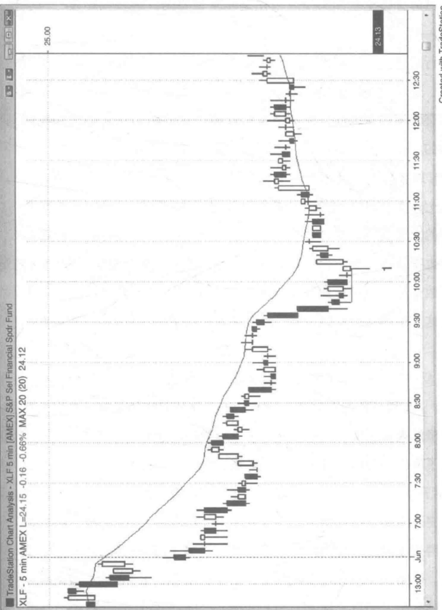
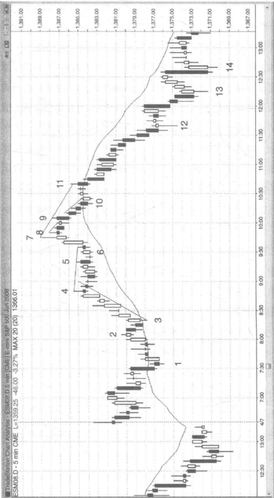
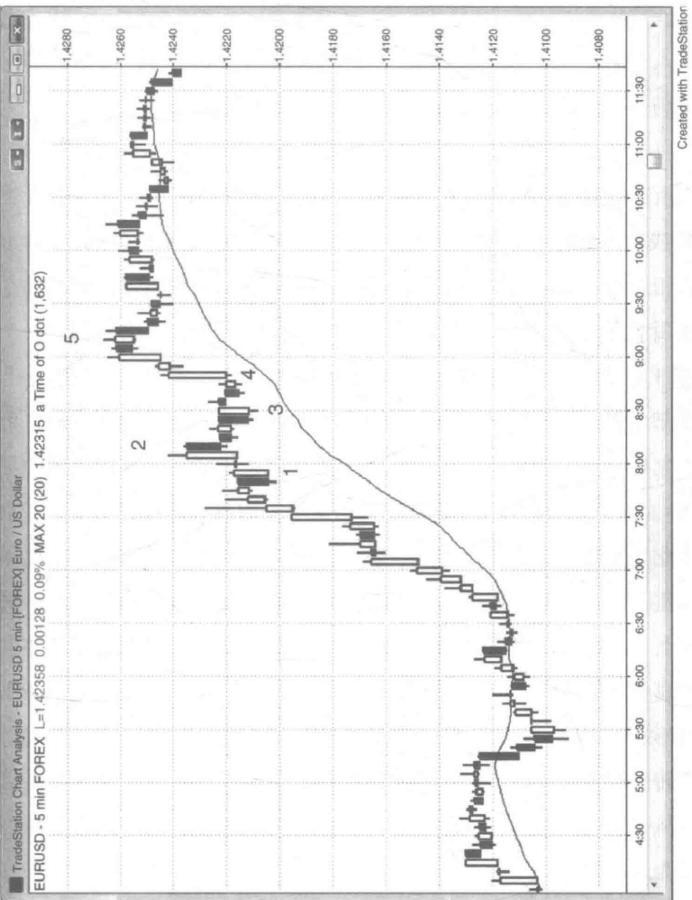
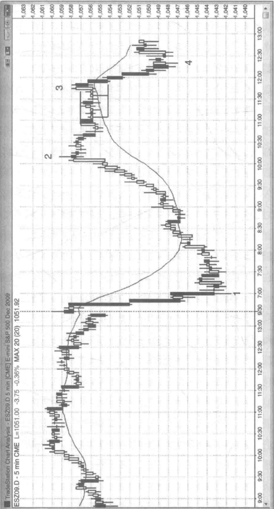
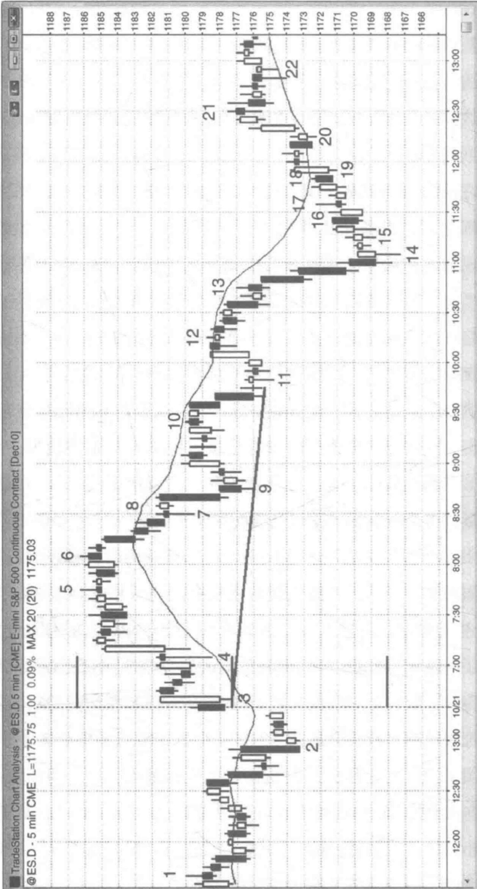
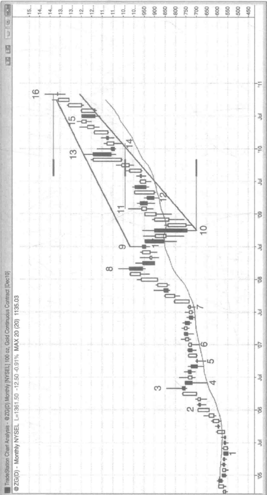
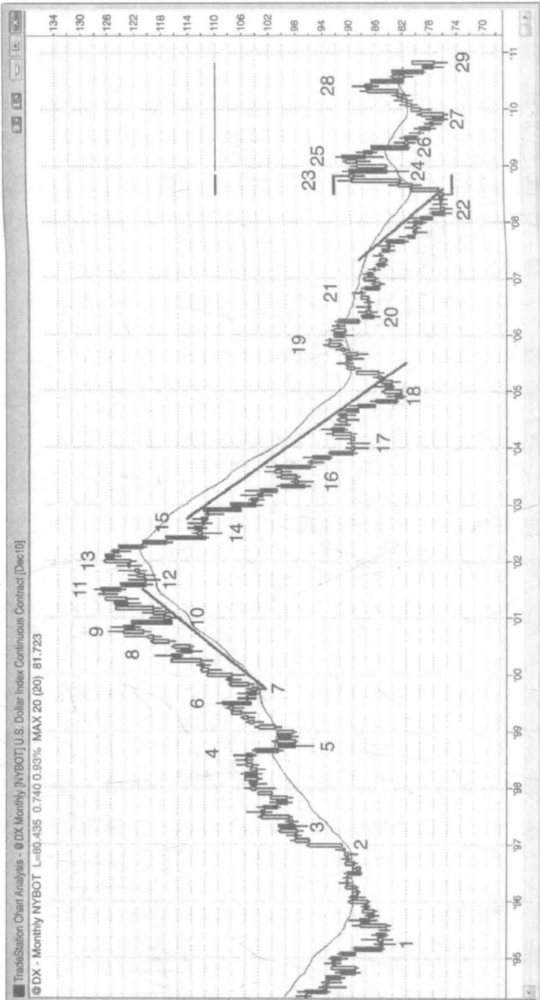
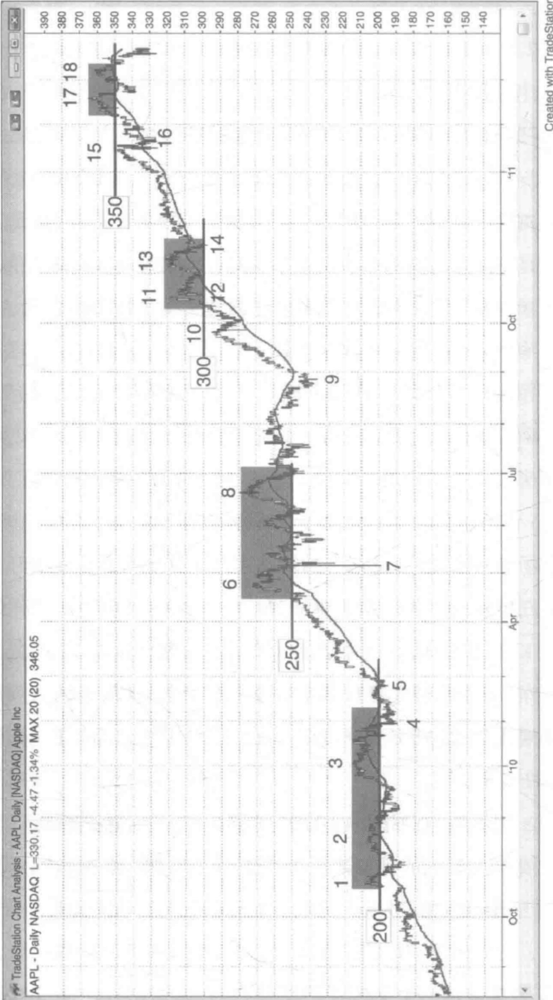
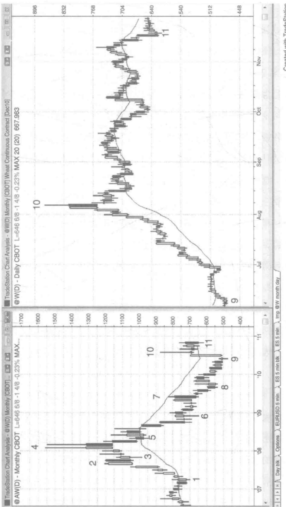
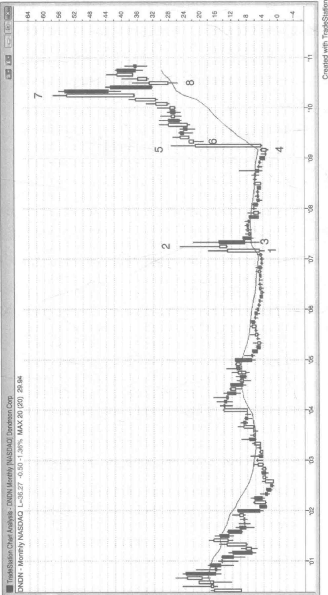

# 第7章 · 最终旗形

一旦趋势结束，交易员们在观察图表时便可以看到趋势中的最终旗形。最终旗形的反转形态比较常见，因为在每个反转之前都是以某种旗形的形式出现，因而也算是一种最终旗形反转。在趋势反转之前，如果交易员能弄明白是什么原因使某个旗形很可能成为最终旗形，那么他就能提前预判到趋势的反转并入场交易。

以下是最终旗形一些常见的特征：

\- 当旗形出现时，趋势已经推进了几十根K线；所以趋势型交易员可能开始获利了结，而逆势型交易员则可能变得较为积极。两方都认为趋势已经走到头，行情更倾向于进入包含两次较大波段的调整期，并演变为一个更大的震荡区间甚至产生趋势反转。

\- 绝大部分的旗形都是水平推进的，并表现出强烈的双边交锋的迹象，比如几根反向的趋势K线，带有显著影线的K线，几次反转，以及至少与前一根K线重叠 $50\%$ 的K线等。第二本书关于区间震荡的第四部分给出了更多多空对峙的特征。

\- 微型趋势线突破回调就是单K线或微型最终旗形。例如，当行情向上突破一条微型下跌趋势线，然后反转下行时，那一两根突破K线就

形成了微型下跌趋势中的最终下降旗形。如果抛售的力量在一两根K线中失败了，市场从深度或浅度回踩的低点处或双重底处反转上行，那么这最后的一次抛盘便是一次突破后的回调，而原来的小规模突破则成为微型下跌趋势中的一个最终旗形。如果突破最终旗形后出现了反转，但只反扑了几根K线趋势便恢复，那么这次反扑就只是一次行进趋势中的突破回调，而非反转，最终旗形也没能让市场的趋势反转。

\- 最终旗形有时出现短暂的反转，但只是为了之后形成一个更大级别的旗形，接下来的行情有可能突破也有可能反转。在最终旗形演变成其他形态之前，我们通常可以利用最终旗形反转形态获取刮头皮的交易利润，而演变后的形态一般能发出另一些方向性的信号。

\- 有时行情会形成两个连续的水平推进的旗形，第二个旗形规模较小，突破第二个旗形可能引起一次楔形反转。

\- 如果最终旗形在行情高潮之后出现，那么接下来失败的突破可能不会超越先前趋势极值。例如，如果行情经历一波抛售高潮后在低点上方走出一段水平的震荡区间，那这段震荡区间可能形成一个最终旗形，并从回踩的低点处突破反转上行。

\- 有时最终旗形可能只有一两根K线，并形成于一波强劲的涨跌高潮之后，而这波高潮由几根异常大型的趋势K线构成（一个潜在的衰竭型高潮）。从这个小旗形处突破的行情往往在一两根K线后就开始反转，并引出一段持续十几根K线的双波段回调。这是一个可交易的逆势入场形态，但还不足以引发趋势反转。这些大型的趋势K线频繁展示了行情的强劲势头，紧接着便在10到20根K线内测试趋势极值。单K线最终旗形可以是任意类型的暂停K线。例如，如果市场已经经历两次连续的下跌高潮，而且下一根K线又是一个阳线十字星，即使这个十字星的低点低于下跌高潮的低点，它也可能成为下跌趋势中的最终旗形。如果随

第7章最终旗形

后的一两根K线是一个大级别的暴跌形态，然后市场反转上行，那么这根暂停K线就是一个单K线最终旗形。

\- 狭窄的震荡区间往往变成最终旗形。任何横盘整理的行情都拥有磁性回拉的效应。由于这段时间的突破一般都以失败告终，市场通常都被拽回多空双方所认可的价格区间里。

\- 有时行情并未突破，最终旗形只是延伸出一段新的趋势。这往往发生在连续高潮后的反转行情当中。

\- 交易员们认为市场处于过热状态，并预期行情即将进入休整期，但又觉得突破的幅度仍可再做一次刮头皮交易。因此他们在潜在最终旗形的突破位入场，但随时准备着入场后快速离场，而不是持有波段性头寸。由于每个人都打算小幅获利后马上离场，因此突破很快反转。

观察任意一张带有趋势反转的图表，你都会看到趋势行情反复震荡，由一系列的飙升、暴跌以及回调构成，这就是我们所说的旗形。如果你仔细研究这轮趋势中的最终旗形，就会发现行情给出很多趋势即将完结的线索，要么进入区间震荡，要么进入一轮反向趋势。震荡区间里会出现一些延伸至区间外的波段，看起来像是要趋势反转，但这些通常只是更高时间周期里更大规模的回调而已。然而，这些波段的幅度足以做一笔盈利可观的波段交易。交易员们并不确定此次反转会成为一轮新的趋势抑或一次大规模调整，不管哪种可能，他们的交易手法都是一致的。他们在第一个或第二个波段处部分或全部获利了结，并伺机在回调时加仓。如果在原来的趋势方向上形成了一波强势的行情，那么他们可能就会继续持有头寸，并预期价格二次到达并测试趋势极值。

每一次回调都有双向交易的机会，但当回调的价格区间大体上呈水平走向，很多K线相互重叠，区间内发生若干次反转，或者包含若干根

反向的趋势K线时，市场进入横盘整理的特征就尤其明显。最终旗形可以是任意大小的震荡区间，甚至包括单根K线的情形，但通常都是指至少包含五到十根K线的情况。横盘整理的状态意味着多空双方都达成共识，当前的价格水平处于合理区间内。空头积极卖出，他们认为价格将突破下行，而多头积极买入，他们认为价格将突破上行。每当价格触及区间顶部甚至发生短暂突破，空头觉得在当前的高位卖出更有利可图，他们便更加激进地做空。而多头则认为追涨风险较大，只会少量买入。结果空头力量就把价格拉回原来的区间水平。每当价格触及区间底部甚至向下突破，情况恰好相反，多头觉得在当前的低位买入更划算，而空头则认为此处杀跌价位过低，不宜重仓做空。这也让市场价格回到原来的运行区间。所有的区间震荡行情都存在这种现象，包括上升旗形和下降旗形，这些震荡区间中部的磁石效应使得大部分的突破尝试都没来得及走太远，就被市场拉回原来的区间里。

当一轮趋势维持了十几根K线以上后行情发生突破，这种突破往往就演变成趋势中的一个最终旗形。突破之后，顺势交易员更乐于平仓获利，并在再次入场之前等待市场的深度调整，而逆势交易员则预期市场至少会出现双波段调整，更倾向于在趋势恢复的时候反手一搏。举例来说，如果上涨趋势已经持续了数十根K线的时间，行情有可能进入深度调整甚至发生反转，交易员们就会观察是否形成一个大体水平的上升旗形。由于上涨趋势依然有效，交易员们会在旗形突破时买入，做一笔刮头皮交易，而非波段交易。在旗形期间已经拥有空头持仓的交易员则会平仓了结。他们买入平仓的动作助长价格上扬，但他们非常渴望能够在市场触及某个压力位的时候再次做空，而这个压力位，可以是固定幅度的价格区间，他们认为多头会在这里结束早前做多的刮头皮头寸，也可以是一些经测量可得的目标价位。多头入场后不久，便在压力位快速卖出平仓获取小额利润。激进的空头也看到同样的情况，并在几乎与多头同样的点位上卖出。随着多空双方都预期价格将进一步走低，市场上再没有人参与买入，行情也就随之反转向下了，而下行的幅度至少足够交易员们做一次刮头皮交易。如果下行动能足够强大，多头不会愿意买入，空头也不急于了结获利，直到市场出现行情调整即将结束的信号。价格反转可以引出一波回调，一次大规模的调整（如震荡区间），甚至一轮趋势的反转。

正如我们在第3章中讨论关于双重底和双重底的内容一样，最终旗形也是由同样的基本行为所导致。例如，如果在牛市中有一个潜在的最终旗形，那么在旗形成型前会有一波上推。而后旗形的向上突破则对这个牛市高点发起冲击。如果在冲击过程中卖方比买方多，市场就会在第二次上推时反转下行。尽管潜在的力量是相同的，但最终旗形看起来与其他形态有显著区别，其独特的特性使它能够与其他形态区分开来。最终旗形在熊市中亦是如此，整个过程包括两次下推和一次向上反转。最终旗形的空头突破是第二次下推，并对开始减弱并休整的熊市动能进行测试。

很多多头和空头都会在上升旗形多头突破后不久就卖出，如果抛售力量足够大的话，市场就会开始反转。如果空头反转入场形态继续发展，交易员们就会越来越坚信接下来将出现更大规模的调整；更多的多头将卖出他们的多仓，更多的空头也将开始做空。如果价格跌破下跌反转K线一个价位，并导致行情反转向下，那么市场将会被重新拉回最终旗形之中。价格有可能停在那儿，但通常会走出一波至少包含两个小波段的横向至下跌行情，并最终引发趋势反转。如果在旗形中有一波强势的下跌运动（抛压的迹象），或者在此之前价格已经向下大幅突破上涨趋势线，这些情况下市场更可能形成趋势反转。如果原来的趋势已经持续了

50 到 100 根 K 线，那么反转更有可能演变成一个大级别的旗形而非一轮反向趋势。请记住，趋势本身巨大的惯性总是企图抵抗所有的反转尝试。然而，每一次反转都趋于愈演愈烈的状态，每一次反转的规模总比上一次的更大，最终会有一次反转尝试脱颖而出，成功将局面扭转过来。

市场过热的高潮一般在短暂的最终旗形突破后结束。举个例子，如果有一个由四根K线组成的上升高潮，K线主体都比较长，而且第四根K线特别巨大，行情往往会引发一波短暂的抛售，因为交易员们都把这个高潮看作一次潜在的买入高潮。多空双方都在等待这种大型K线的出现。多头趁着这波能量取得非常高位平仓获利，激进的空头则卖出开仓建立刮头皮头寸。随之而来的常常是一波回调。不过，由于上升高潮太过强势，在前一根K线低点下方通常都存在强力的买压。多头试图重新满仓操作，而空头则买回他们的刮头皮头寸。结果导致这次回调仅仅持续了数根K线，并形成一个高点1或2的做多入场形态。多头将在前一根K线的高点上方买入，如果市场向上突破原来的高潮顶部，还会有更多人跟风做多。

一轮牛市行进了很长一段时间后出现了一波抛售高潮，随之而来的通常都是一个最终旗形反转形态，并包含至少双波段反弹。在图7.1中，开盘时启动的两个下降小波段止于K线1处，这里可能是当天的一个低点。行情进一步下探后，便突破了横盘整理的下降旗形，因此有可能成为一个最终旗形并导致价格反转上行。K线1就是一个不错的反转K线，触发了最终旗形做多入场形态，使交易员们开始预期接下来会走出一波至少含两个上升小波段的行情。当反转后第一回合的上升小波段越过最终旗形时，这种情况被认为是最佳反转之一，如图所示。接下来行情往往在原来的下降旗形上方形成横盘整理态势，然后继续新一轮牛市上涨。在上升波段中，价格有时会短暂回调至原来的下降旗形，有时并未进行
  
图7.1 最终旗形反转

休整就在一系列阳线中展开迅猛的飞涨态势。当你遇见这种类型的反转，把自己部分甚至全部头寸波段化是非常重要的，这时候你很有机会借此大赚一把。

行情从太平洋标准时间 7:30 左右到 9:30 左右横向震荡了近两个小时，这段时间的价格波动可以看作一个大级别的最终旗形。如果之后价格突破该震荡区间，先前横盘整理所产生的磁力总能把市场拉回到突破前的水平。

K线1之后的那根入场K线收在前面六根K线的高点上方，并高于前面七根K线的收盘价，从而收复了很多高点和收盘价。在这些K线上做空的交易员要么平仓止损，要么忍受账面浮亏继续持有，但很可能不久后也得认赔离场。而且他们也不会在几根K线的时间内选择再次做空，大多数交易员会等行情至少再经历两个小波段的反弹后才会考虑再次入场。这时市场形成单边走势，通常能走一段10根K线以上的双波段反弹行情。

反弹之后所形成的狭窄震荡区间一般会成为最终上升旗形。在图7.2中，K线4向上突破收盘价的这波反弹显得非常坚挺，并引出后面一段狭窄的震荡区间。在这个例子中，对旗形的强势突破在K线7处结束，形成了两个回合的上升小波段（K线5为第一个小波段），和一个楔形顶（当天开盘的第一根K线为第一次上推，K线4为第二次上推）。双波段运动突破旗形，往往构造出一个主要反转形态，这种反转一般都能走出至少两个小波段的反向行情。虽然跌至K线10的过程已经经历了两个小波段，但第一个小波段只包含了一根逆势K线（K线9），因此很可能这波下跌只是未来更大级别双波段的第一回合。当双波段运动在一个狭窄的通道中运行，整条通道通常成为更大级别双波段行情的第一个波段。在任何情况下，如果空头交易员对行情判断不太确定，那么当价格在K
第7章最终旗形  
  
图7.2 狭窄震荡区间型的最终旗形

线 10 处跌到移动平均线时，他们就会把自己的止损价放在损益平衡点。

K线9越过了前面小十字星阳线的高点，触发了高点1的买入条件，有经验的交易员就会预期价格在买入高潮之后回落，并形成一个最终旗形顶。K线8和后面两根K线一起构成了一个小级别的最终旗形，K线9则是一个尝试突破三K线最终旗形而失败的次高点。这里的微型买入真空将市场拉至高点1信号K线上方一两个价位。强势的空头预期高点1将会回落，等待着机会在信号K线的高点处或高点上方做空。当市场跌破K线高点一两个价位时，很多人就会停止做空，看跌情绪缺失导致价格在寻找空头的过程中一路走高。一旦市场触及目标价位（高点1信号K线或其上方），空头就开始激进地做空，并大举压倒多头，驱使市场下行。在高点1信号K线高点处或上方买入的多头，马上意识到市场已经停滞不前，并且开始反转，他们就会卖出所有多仓，为市场进一步下跌推波助澜。他们开始确信空头形态的顶部已经成型，几根K线的行情内不会再考虑买入。市场在没有买盘的情况下快速下探至移动平均线或最终旗形中部这些支撑位，只有在这些支撑位上，空头才会止盈平仓，多头才会考虑再次做多。由于看跌情绪高涨，市场缺乏买盘，无力反弹。买方也很快成了卖方（多头卖掉他们新进的多仓，空头也在此时再次进场），导致市场进一步走低，在更有吸引力的价位寻找做多力量。

当市场看涨情绪特别浓厚时，伺机寻找做多入场形态才是明智之举，除非空头力量逐渐显现，有足够的理由支持做空。

如图 7.3 所示，欧元/美元外汇的 K 线图在 K 线 2 处出现一个最终旗形做空入场形态，但上行动能非常强劲，旗形也只维持了四根 K 线的时间；价格也因此没能突破主要的上涨趋势线。这样一根阴线并不足以抑制过度的上涨热情，市场随后很可能横盘整理，然后反弹创出新高。这里反转尝试未能成功，很可能成为价格向上突破 K 线 1 双 K 线反转后的

第7章最终旗形

图7.3 三角形最终旗形

一次回调。每当最终旗形反转行情的计划落空，就是一次突破回调的入场形态。在这个例子中亦是如此。K线1这一潜在最终旗形在K线2双K线反转形态上发出反转信号。反转入场条件被触发，但市场并没有大跌。

相反，价格休整后又形成了另外一个做多入场形态，这使得在K线3上方的买入动作成为一个入场时机，一个从失败的最终旗形获得的入场时机。市场向上突破K线1旗形，回调，然后继续突破上行。

K线3双K线反转确立了高点2做多形态，并于K线1构成双重底，这些理由足以支持我们在一轮强牛市中买入。保守的交易员把K线3看作从K线2开始的小型下降通道的一部分，与K线3双K线多头反转形态前后相邻的K线一起构成了一个小级别的双重顶下降旗形，他们会在该双重顶上方买入。对K线3向上突破的力量很薄弱，价格回调到一个比K线3略高的低点。这是一个突破回调入场形态，此时一个楔形上升旗形逐渐浮现，其中K线1和K线3为该楔形的头两次下推，我们也可以认为它是一个三角形（一旦第三次下推出现，该形态便以三角形的形状呈现）。这个三角形呈水平状态，并形成于一波较大的反弹之后。多空力量在此处交锋，让它足以产生一股强大的磁力将任意形式的突破拉回到这个震荡区间中来。有些交易员把K线4看作在K线3阳线和下一根K线高点2入场的一次突破回调。这个上升旗形就是一个潜在的最终旗形，K线5就是一个反转入场形态。它是行情的第三次上推，也是对单K线回调形态的突破，并成为单K线最终旗形。不过，上涨动能依然高涨，比起反转，接下来的行情更可能横向盘整。市场进入一段狭窄的震荡区间，并从该区间突破上行或反转下行。如果突破上行，这一狭窄通道有可能成为最终旗形。

有时候最终旗形的突破反转会形成一个更低的高点，而非更高的高点。图7.4中，行情以抛物线的强劲势头反弹至K线2，然后一波包含至少双波段的回调走势很可能随之而来（牛市中的回调可以是横盘整理，也可以是下跌），这次回调至少维持在10根K线以上。从图中可以看到，这波回调在移动平均线上方形成了一个水平的震荡区间，并在K线3处

第7章最终旗形

  
图7.4 最终旗形后形成更低的高点

突破。然而，突破失败而回，市场在一个双K线反转形态中开始下行。K线3这次突破形成了一个更低的高点，而非更高的高点，但它依然算是牛市中的最终旗形。交易员会在双K线反转形态下方开始做空。K线3也与K线2后面那个小型次高点一起，组成了双重顶下降旗形。K线2没能超越开盘时段的高点，K线3二次摸顶并尝试突破，同样以失败告终。当市场两次努力实现目标都无功而返时，价格通常开始背道而驰。

开盘出现巨型的双K线跳水行情，然后是一根阳线。任何一根或多根K线都形成一次突破，一个尖形，一种跳空，和一波高潮。最初的下跌高潮结束后，紧接着在K线1处马上发生第二波高潮。连续的暴跌往往引发更持久的休整行情，有时出现反转，比如这个例子。在这波急跌至K线1的过程中，K线1前面的那根阳线便是最终旗形，它使行情进入一种单K线的休整状态。这根K线成为抛售期中的单K线最终旗形；尽管它是一根阳线反转K线，它的低点也低于它前面巨型双K线抛售高潮的底部，但它使下跌趋势进入休整，因此它是一个下降旗形。像这种在自由落体的市场中形成的连续跳水行情，往往会出现单K线或双K线最终旗形，然后市场开始走向一波大型调整甚至趋势反转。连续的抛售高潮通常带来大型的回调行情，明白这个道理的交易员们看到这根暂停K线后，会愿意在当天的低点反转上行时买入。没人愿意在这个低位做空。剩下的空头只会在市场回调时卖出，而且会等到反转行情持续10根K线之后。K线1前面的那根阳线打乱了下跌节奏，将这波行情一分为二。如果没有这根K线，价格很可能在K线1之后继续下探一到两根K线的深度。很多空头会在K线1的收盘价处了结他们的空仓，预期市场将会反弹到他们愿意再次做空的高度。激进的多头则在K线1的收盘价处做多，预期价格将冲击K线1高点，然后走出一波基于K线1高度的上涨行情，但由于K线1振幅较大，他们面临的潜在风险也同步增加。K线1
第7章最终旗形

上成交了93000张合约，将近过去两天普通K线平均成交量的10倍，因此这是一个暴跌高潮后的向上反转形态。在我同系列的第一本书中，已经讨论过高潮的各种变化形态，和趋势通道。这里先产生一个下降高潮，一次休整，然后另一波抛售高潮（K线1），它的作用就像高潮和通道形态下的单K线通道。

K线1之后的水平震荡区间也是一个最终旗形，尽管它从未突破下行。抛售高潮之后，市场往往形成一个下降旗形，有可能呈水平走势，也有可能表现为上升通道，有时候会出现如例子所示的低点1或低点2的做空入场形态，但后续行情并未实现空头突破。相反，下降旗形突破上行，这是趋势反转常见的方式。在连续的下跌高潮之后，十字星信号K线是相对疲弱的做空信号，激进的交易员会在它们的低点或其下方介入多头。既然十字星是最后一个下降旗形，也可以算是一种最终旗形。K线1大型抛售高潮前面的那根反转阳线也是一种单K线最终旗形，十字星从这个单K线最终旗形开始反转。价格于太平洋时间上午8：05向上突破下降旗形，由当时的那根阳线完成此次反转。

有时最终旗形并没有首先发生突破，而是继续回调，最终成为一轮反向趋势。如图7.5所示，一波暴跌的抛售高潮将价格推向K线14，K线14是一个强势的多头反转K线。有些交易员把这次跳水的起点定为K线6，终点为K线9，而其他一些交易员则认为K线9和它前面的阴线组成了一个关键的下降尖形，或由K线10后面那两根K线组成的双K线尖形。所有的长阴线跳水行情都是抛压的显著标志，对于下探至K线14的这波抛售高潮来说，究竟哪根K线所做出的贡献最大，这个问题并不影响大局。跌向K线14的这波抛物线行情中有三次下推（K线9和11为头两次下降小波段）。这往往导致一个持久的反弹，反弹通常从上升通道开始，如图所示。上升通道正是一个下降旗形。

  
图7.5 最终旗形有时没有首先发生突破行情就直接引起反转

第 22 章日线、周线和月线图

部（K线13、14和16）。这个底部刚刚好超过了基于上面的震荡区间的高度的移动可测量距离。

上升至K线17的上升浪有12个牛市主体，微型尾巴，对于大部分的交易来说，几个牛市主体就足够使得他们相信市场的趋势了。在市场经过了三波在K线16的低点处形成的下跌高潮和这波上升浪后，交易者认为市场至少会出现第二波上升浪，并且可能会在K线16的低点以及K线15的高点或K线17的高点处形成一波可以测量距离的上升浪。

K线23只比可移动的测量目标以及趋势通道线的顶部要高出一点点，在上面震荡区间的底部区域，K线6、8、10处，它也是一个两根K线的向下反转。市场第一个目标就是向下突破通道，这个目标的实现发生在K线24处。在K线27两根K线的反转处第二波下跌浪结束了。自K线28向下突破了从K线23处形成的两浪牛市旗形后，K线29形成了一个更高的低点的突破回调。K线28也是头肩顶形态的右肩，它是一个牛市旗形的底部肩形态，而左肩是在K线24和K线25之间形成的。在K线21和K线28之间的震荡区间也是一个头肩顶形态，其中K线21是左肩，K线23是头部，K线26和K线28形成的双重顶部是右肩。在 $80\%$ 的顶部模式中，市场会进一步突破顶部，而空头会再一次知道大部分的顶部都不过是牛市旗形。

从 K 线 29 至 K 线 32 的市场移动处于一个非常狭窄的牛市通道中，之后很容易会出现更高的价位。然而，因为整个图表都是处于大的震荡区间，大的反弹浪之后经常会跟随着大的下跌浪，所以市场很可能会修正到扩展的三角形底部 K 线 27 处，甚至会到达 K 线 16 这根熊市 K 线的低点。

K线16是一波可以测量的下跌浪。大部分机构交易者会用他们认

为有效的策略进行交易，这意味着交易成功的概率至少有 $60\%$ 。他们因此需要市场一段可以测量的移动距离来获得一个正收益的交易者方程（可以测量的移动距离意味着收益和风险一样大，而交易者的交易方程则开始变得有可能获利）。结果就是交易往往会达到目标，之后市场会出现反转或者至少暂停，因为许多公司会在此处收获小部分或者全部的收益。大部分的目标，就像所有的支撑区和阻力位一样，都很快会失败，因为要达到目标的最低要求是市场移动一段可测量的距离，大部分的公司都相信市场会足够强劲以至于超越这个距离。

如图22.4，在K线7和K线8形成的上升浪后，黄金的月线图表处于一个楔形通道中。许多交易者会把市场最近的移动看作是第三波上升浪，而K线11和K线13是最初的两波。而有些其他的交易者会把K线8或者9看成是第一波上升浪。

当市场上有5至10根K线靠近趋势线时，市场很快会跌落趋势线的概率就很大。这使得从K线10开始的牛市趋势线倾向于下滑。因为市场刚好高于趋势通道线和可以测量的移动目标，出现两浪的下跌潮的概率将会很大。至少，市场会修正到K线8的高点下方，也有可能会修正到楔形的底部K线10处。但是不太可能会出现的是，市场会向上突破楔形顶部，并向上升一段可以测量的距离。

如图 22.5 所示，美元期货的月线图上有一些交易时机看起来是最佳交易机会。美元、瑞士法郎和日元都是避险货币，当交易者认为股市会下跌的时候他们往往会买入这些避险资产。

当市场向上突破熊市旗形的顶部K线2时，美元有一波牛市行情，这将市场反转为始终做多的境地。之后市场形成了一个通道，之后K线5测试了从K线3开始形成的这波通道的底部。这在K线5处形成了

第 22 章日线、周线和月线图  
  
图22.4 黄金月K线楔形通道

  
图22.5 美元指数期货月K线

一个双重底部牛市旗形，之后在K线7处形成了一个突破回调的买入入场时机。市场在K线11的更高的高点处到达了顶部。有一些交易者会把市场从K线3至K线11的移动看作是一个更广阔的通道，而其他的交易者则认为这个通道开始于K线5或者K线7。所有的交易者都怀疑K线11或者K线13可以成为市场向下调整到通道底部的开始，因为市场上出现了一些反转和突出的熊市主体，市场开始变得震荡了。这代表了积累的卖方压力。

K线10之前的下跌潮是一根强劲的熊市趋势K线，它向下突破了从K线7（图中未显示）开始形成的陡峭的牛市趋势线。它是如此强劲，以至于很多多头在市场到达K线11这个新高点时开始获利。空头在更高的高点处开始卖空，并且在K线13这个更低的高点的主要趋势的反转处变得更加激进。下跌至K线12的下跌潮有两根强劲的熊市趋势K线，向下突破了牛市趋势线。市场应该至少有两波下跌浪，但是市场在下跌至K线14之后，出现了下跌至K线18的通道。K线14之前的下跌浪使得大部分的交易者相信市场已经变成始终做空的境地了，因此之后会出现更多的卖出潮。

熊市通道继续下跌至K线18，这是大熊市趋势结束处的卖空潮中出现的第五根K线。交易者期待市场会出现反弹，至少会反弹至移动平均线。K线18同K线1也一起形成了一个双重底部。

移动平均线上至少有20个缺口K线卖空机遇，但是因为上升的势头如此强劲，交易者最好还是等待市场出现第二个信号。第二个信号在K线19这个移动平均缺口K线处形成了，这同K线17之后的小型反弹浪的高点一起形成了双重顶部熊市旗形。

下跌至K线20的下跌潮之后跟随着市场的抛物下跌，因此市场出

现了至 K 线 22 的下跌高潮，在此处市场形成了一个更低的低点的主要趋势反转。也是在此处，市场形成了一个 iii 模式的变体。市场从一个微型的双重底部开始反转，形成了一个失败的低点 1 的卖空机遇，而上升至 K 线 23 的上升潮也是预料之中的非常强劲。这可能使得市场进入了始终做多的境地，这使得多头会极力维持市场在这个趋势的底部之上。他们在低点附近积极买入，也在 K 线 27 和 29 处积极买入，创造了一个双重底部的牛市旗形。K 线 27 也是一个双重底部的主要趋势反转，K 线 29 是在三角形的第三波下推浪之后形成的向上反转潮，最终市场可能会向上或者向下突破。

楔形牛市旗形（K线24、26、27）之后市场又出现了一波反弹，之后在K线29处形成了一个双重底部。这是一个非常好的风险/盈利设置，因为交易者会在震荡区间的底部买入。因为市场处于震荡区间的底部，所以市场出现等距上涨的概率大约是 $60\%$ 。在市场有 $60\%$ 的机会测试K线28这个震荡区间的顶部时，风险大概是5美元。交易者冒着损失5美元的风险，但是有 $60\%$ 的机会盈利10美元，这是非常好的机会。每次交易的平均收益大概是4美元。因为这同样也是一个双重底部牛市旗形，所以盈利的概率可能会大于 $60\%$ 。交易者的目标是市场出现一段相当于震荡区间的向上的等距离移动，而它很可能会测试这个熊市通道的顶部K线15。

最重要的是要意识到，市场还是有 $40\%$ 的机会跌落到K线22的低点下方，所以一旦这些发生时交易者需要离开。如果它这样做了，市场下一个目标就是向下进行等距离的移动，基于K线27和28或者K线22到23这两波下跌浪的高度。

即使市场真的会上涨，它也有很大的概率无法超越K线11的高点，
第 22 章日线、周线和月线图

而形成一个大型的震荡区间。

如图 22.6 所示，这张日线图表很明确地显示了苹果的股价，处于一个强劲的牛市趋势中，但是在一些显著的整数关口下方停留了，这也通常也是市场的磁性驱使的。一旦市场上有足够的交易者相信这些整数关口像磁铁一样会被触及时，空头将会停止做空，买入真空中市场向上反弹最终超越这个目标。举个例子，空头相信市场至少会有 5% 至 10% 的概率会超过 300 美元，因为通常在市场的一些整数关口的磁铁推动效应之下，市场通常是会出现这些现象的。因为空头预计市场会到达 315 美元附近（有 5% 的可能会超过这个数字），所以他们暂时不会进行交易。当他们相信市场会在接下来的 K 线中走得更高时，市场没有到达这个数字之前，他们进行做空没有意义。他们的离场使得市场迅速上涨，因为多头不得不将市场推得更高来找到更多的交易者做他们的对手方。

一旦市场确实通过 $5\%$ 至 $10\%$ 的概率超越了这个目标，多头开始获利，空头会在市场的下跌回调测试中做空，至少会出现一次这样的机会。回调至K线12的低点错过了300美元一分钱（K线12的低点是300.01美元），之后市场急剧反弹至收盘。在K线13附近的双重顶部的卖空成功地将苹果的股价拉下300美元，但是买方又回来了，并形成了K线14的双重底部。

如图22.7所示，在右侧的小麦的日线图有一个剧烈的反弹，但是在左边的月线图上显示的仅仅是一个熊市市场反弹，在熊市趋势中K线10形成了一个移动平均缺口K线，并且同K线7一起形成了双重顶部熊市旗形，之后市场突破测试了K线3和K线5一起形成的上方震荡区间的底部（也是一个头肩顶的顶部）。在两张图表上序号都是一

  
图22.6 整数关口容易形成支撑位和阻力位

第 22 章日线、周线和月线图  
  
图22.7 日线图和月线图可以是不同的趋势方向

样的。

在日线图表上，在K线10这根熊市反转K线之前，一个电视专家说，小麦的价格正在走高，他正在市场回调时买入。在一个很长的牛市趋势（10至20根K线）之后，市场趋势中形成了大型牛市趋势K线，那么市场上会有很大的风险形成两浪回调，因为大部分强劲的多头只会在市场出现显著的回调时买入，而大部分强劲的空头会在市场上做空，并且在价格更高时进行刮头皮交易。电视专家对于小麦要走高的评价可能是对的，但是由于他的资本太多，所以他在抛物线和高潮的顶部买入了。不过，他应该是做了很多机构应该做的工作。空头正在卖空，而多头正在整带一个两浪的回调机会买入。

在这一天中，K线10之前，关于小麦的消息无疑是利多的，但是这都无关紧要。图表的信息告诉交易者强劲的空头和多头正在期待市场出现大型回调。市场上出现的高潮和抛物线高潮正在告诉交易者，弱势的多头和空头正在做错误的事情，而强劲的多头和空头正在市场回调时博弈。用交易赚钱最好的方式就是赚取聪明的钱，而不是听信电视上的专家。但是聪明的钱是如此明显以至于聪明的交易者不能够隐藏他们的交易手段。然而你必须有足够的能力来阅读图表，并且明白接下来会发生什么。

如图22.8所示，Dendreon公司（DNDN）由于其前列腺癌药物的新闻发布导致其股票剧烈的波动。在过去的两个月里，它的股票在K线2的结束处上涨了 $800\%$ ，然后在接下来的几个月里又在这个基础上回调了 $90\%$ 的幅度。之后它又上涨了 $2000\%$ 至K线7处，在接下来的3个月里在此基础上又回调了 $50\%$ 。由于剧烈波动的风险，交易者只能交易较少的头寸，而头寸的减少也抵消了他们从剧烈波动中获得的收
第 22 章日线、周线和月线图  
  
图22.8 新闻可以影响股价

益。当大家因为这种不可预测性而感到压力时，大多数交易者都很难在这样的市场赚钱。而对他们来说，避免这种特殊的情况能赚到更多的钱。尽管这些行情看起来很过瘾，但是你的目标是赚取很多钱，而不是在市场经历了一次罕见的大移动后，仅仅获得一次情绪上的冲击，或者只用一点小仓位赚了一点钱。

## 第23章期权
