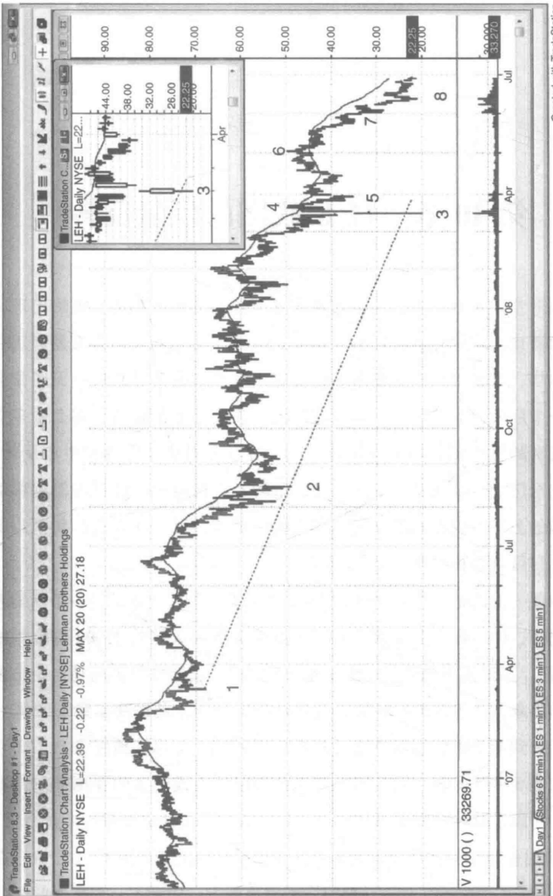
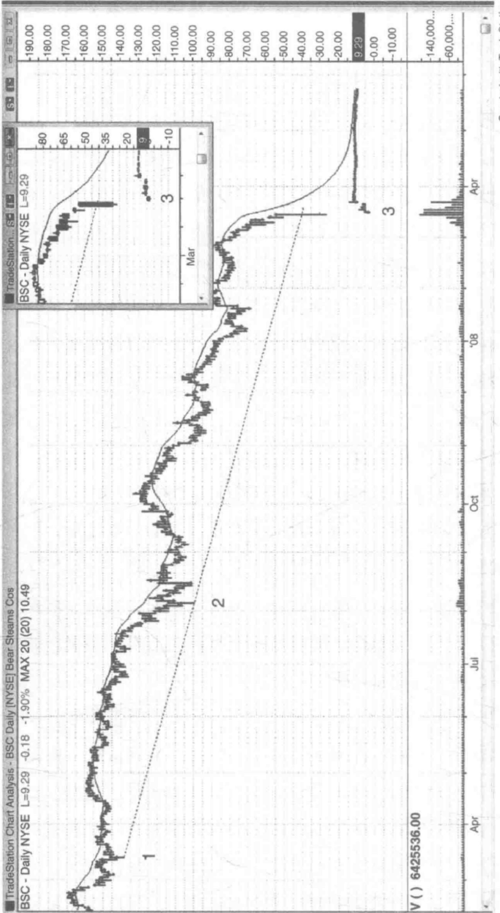
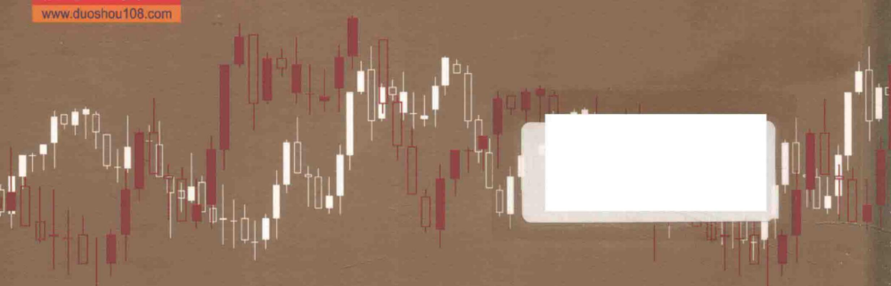

# 第10章 · 日K线图的巨量反转

当一个日K线图中，股票市场正处于陡峭的熊市趋势，突然出现了一个有着比之前的交易量大5到10倍的K线，那意味着做多交易者正在加速入场，市场很有可能正在形成底部。有着大成交量的那一天通常会带来一个巨大的下跌缺口，如果这一天以强劲的牛市收盘，那么做多交易者盈利的机遇则会增加。市场上的交易者并不总是在寻找牛市反转，但是在经历了一波剧烈的下跌浪后，市场上出现至少两波可以超越移动平均线的上升浪的机遇增加了，而这将使得他们可以在几天，甚至几周之内进行可以盈利的做多交易。

顺便一提的是，在1分钟的Emini图表上，如果出现的是一个强劲的熊市趋势，同时有一根K线有着巨大的成交量（大约是25000份合约的成交量），虽然熊市趋势不可能就此结束，但是这通常是市场马上会出现回调的迹象，一般在市场的交易量开始平复（与之前的交易量有差异），出现了一到两个更低的低点之后就会出现回调了。你应该经常用来交易的图表是5分钟图表，但是因为在5分钟图表上成交量的预测作用并不可信，所以在这种日内K线图中你不应该太过于关注成交量的变化。

有时候市场会在成交量大的日子发生反转向上。如图10.1所示，在雷曼兄弟（Lehman Brothers，LEH）的交易图上，出现了一根巨大的低开

  
图10.1 大成交量逆转

第 10 章日 K 线图的巨量反转

跳空缺口 K 线——K 线 3，之后这根 K 线迅速向下突破了熊市趋势通道线（从 K 线 1 至 K 线 2 处连接的线），但是在收盘处出现了较为强劲的反弹。这条 K 线的成交量是前一日的 3 倍，同时是过去一个月的平均交易量的 10 倍。在出现了这样一根强劲的牛市趋势 K 线的情况下（在蜡烛缩略图上可以更清晰地看到），在收盘处买入是相对安全的，但是一个更为谨慎的交易者会等待市场测试这根可能的信号 K 线的高点。市场在下一个交易日马上出现了高开跳空缺口。交易者可以在这根 K 线的开盘处买入，等待市场的测试性下跌，之后又在一个新的日内高点买入，或者你也可以在 5 分钟的 K 线图上寻找一次卖出潮，在市场没有成功地结束低开跳空缺口，所以出现了反转向上的情况时买入。这种情况通常会伴随着至少两波上升浪的出现（第一波上升浪发生在 K 线 5 的缺口测试了更高的低点之后，第二波上升浪是上升至 K 线 6 的上升浪），并且他们很可能会向上突破移动平均线。

K线4和K线6一起形成了一个双重顶部的熊市旗形。

K线7试图与K线5一起形成一个双重底部的牛市旗形，但是最终却在三根K线后出现了突破性的回调带来了卖空机遇。

在图表中出现的最后一根K线处，市场正在测试K线3的低点，并且试图捍卫其下方的止损位，并形成双重底部。但是事实上，并没有成功，几个月之后，雷曼兄弟就破产了。

在一个猛烈的下跌日，成交量巨大也不一定会带来反弹。如图10.2所示，贝尔斯登（BSC）在周五迎来了一个猛烈的熊市日，同时交易量是一般熊市日的15倍。这只股票在过去的两周内下跌了 $70\%$ ，但是，成交量却只有之前一日的1倍至1.5倍，同时它还只有一根微型的牛市尾部。市场上的价格行为并不支持做多，因为没有出现任何突破熊市趋势通道的反转。事实上，图中K线3之前那根巨大的熊市趋势K线已经完

  
10.2 成交量巨大却没有出现逆转

第 10 章日 K 线图的巨量反转

美地突破了熊市趋势通道线，这进一步确认了趋势通道线已经无法进一步加剧熊市趋势，而市场可能会出现反转。该股在周一开盘时（K线3）已经下跌了80%，但是成交量依然略有减少。交易者在周五的收盘处买入时，就认为市场已经到达底部了，他们不敢相信作为国家的第五大投资银行和经纪商的股票，还可以进一步下跌，但是市场在周一进一步摧毁了他们的想法。在没有做多价格行为的支撑下，成交量巨大无法反转强劲的熊市趋势。

这张图表与之前的雷曼兄弟的图表涵盖了相同的时间期间。但是，在雷曼兄弟的图表上，市场在周一（K线3）才突破了熊市趋势通道线，并且在当日它又以巨大的成交量反转向上。在这张贝尔斯登的图表上，市场以巨大的成交量突破熊市趋势通道线的时间要早一天，但是却在最低点附近收盘，没有任何做多价格行为的支持。它也是在K线3处出现了低开跳空缺口，如同雷曼兄弟一样（对于这两只股票来说，K线3都是周一），但是雷曼兄弟的股票出现了强劲的反弹，而在贝尔斯登的股票上并没有出现。在贝尔斯登的图表上，市场在突破了熊市趋势通道线后，K线3依然也是一根牛市反转K线。但是任何在那一天在雷曼兄弟和贝尔斯登这两只股票进行选择的交易者，显然更愿意选择购买贝尔斯登的股票，因为它出现了一根强劲的牛市反转K线。即使交易者以高于K线3一个价位的价格买入贝尔斯登的股票，他们也会在未来的三天内获得超过 $100\%$ 的利润，看起来买贝尔斯登的股票是更加可靠的。

在这张图表发生之前的几个月，贝尔斯登被 JP 摩根（JPM）以非常低的市值价格收购了。

本书是运用价格行为技术分析进行趋势反转交易的详细指导手册。

交易员成功的关键，是找到一套有效的交易系统并坚持使用。阿尔·布鲁克斯做到了这一点，他找到了一种能够穿越市场牛熊和经济周期实现稳定盈利的交易方法。在高级价格行为技术分析三部曲中，阿尔一步步介绍了如何运用价格行为理论在市场中谋生的整个过程。

阿尔将他的交易系统分解成若干简单的部分：跟随机构搭便车或者趋势跟踪、震荡区间交易、趋势切换和反转，层层深入解剖了交易成功的方法论。其中，《高级反转技术分析》揭示了当前市场上各类反转的类型，详细讨论每一种类型的特点，便于读者能够在日常交易中进行运用。虽然价格行为能在各种周期中有效，但对于日间和日内、周线和月线还是有不同的运用方法。本书对这些运用方法逐一进行了详细介绍。

如果你希望尽可能地利用你的时间来学习如何交易，那么本书将会帮助你更快地达到目标。

理性思考

正确行动

上架建议：股票·投资

