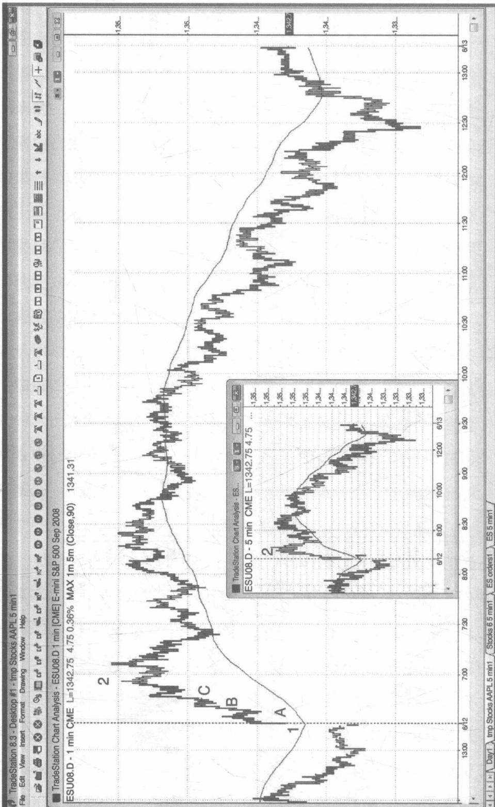
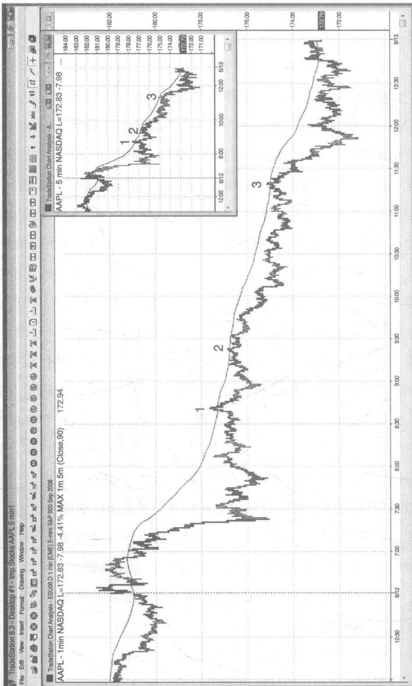
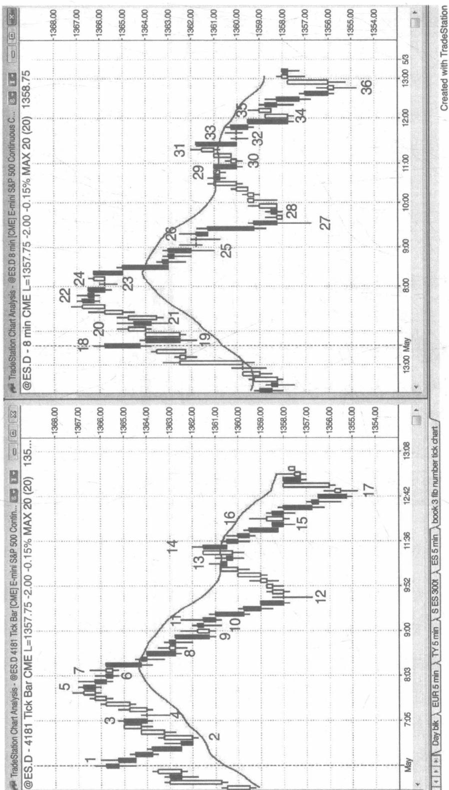
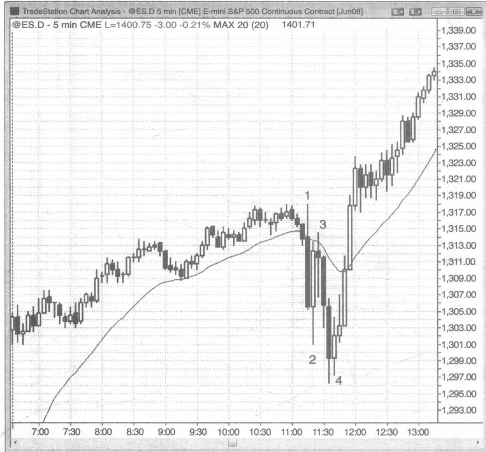
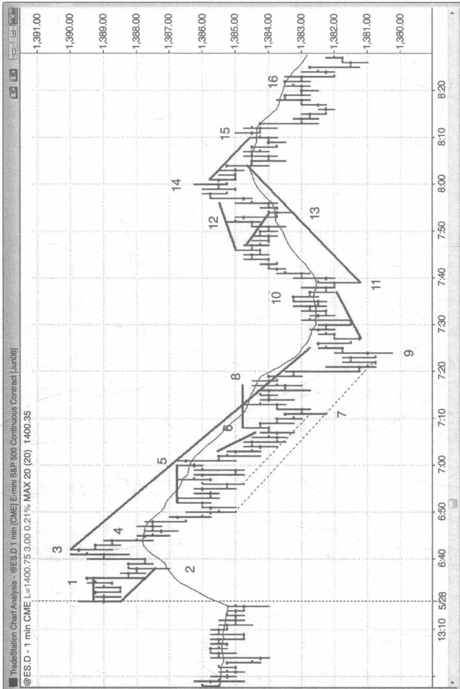

# 第 13 章时间周期和图表类型

对于短线刮头皮交易者来说，在交易标普500电子迷你期货合约（Emini）时，最简单的方法就是使用5分钟的蜡烛图。然而，对于跨日的中线波段交易者来说，5分钟的条形图则是更好的选择。这是因为，在笔记本电脑或者单独的显示器上的屏幕上，刚好可以显示6个完整的条形图，每一个图表都代表一个不同的股票，并且每一个图表都包含了一天所有的K线。如果你使用的是蜡烛图，因为它比条形要宽，所以你的图表上只能呈现半天的价格行为。提及这一点的重要原因是想提醒交易者，用简单的条形图表就可以做好交易，特别是当你想在震荡区间中寻找最好的波段交易入场价位时。对于想在Emini合约中通过刮头皮交易获利的交易者来说，使用蜡烛图表是更有利的，因为使用蜡烛图表可以更快地看到哪一方力量控制了K线，特别是有利于发现入场信号K线。同时，在条形图表上并不太容易发现更多的高点2和低点2的变体形态。

在所有的市场和时间图表中，价格行为的交易技术都是有用的，所以交易者必须做出最基本的判断，也就是他们将会在哪个市场，使用哪种时间图表进行交易。对于大部分的交易者来说，他们的目标都是在长期交易中使得利润最大化，所以每一个交易者都需要找到适合他自己个

性特征的交易方法。

如果 5 分钟的 Emini 合约 K 线图平均每天会提供十几次比较合适的入场机会，3 分钟的图表平均每天会提供 20 个，而 1 分钟的图表会提供 30 个，在 5 分钟的图表上，风险（保护性止损位的大小）一般是 8 个价位，在 3 分钟的图表上是 6 个价位，在 1 分钟的图表上是 4 个价位，所以为什么不在更短的时间图表上进行交易？那样就可以交易得更多，却风险更小，同时赚取更多的钱，不是吗？没错，是这样的，但是这建立在你能够正确快速地阅读图表，并且能够准确地入场，止损，确定目标订单的准确价位，并且每天连续 7 个小时，一年又一年的重复交易。对于大部分交易者来说，时间越短，他们可能错过的交易就越好，同时他们赚钱的概率就会降低。他们在 5 分钟图表上可以很好地快进快出，但这个方法在 1 分钟和 3 分钟的图表上反应不够快，很难盈利，那么这个时候，他们就应该专注于 5 分钟图表的交易机会，并且他们应该持续地增加他们的头寸。最好的交易往往是出乎意料的，并且入场时机的信号经常令人怀疑。大部分的交易者都不能快速处理信息。所以，他们总是无法抓住最好的入场时机，但这对于他们的底线来说是非常重要的一环。最好的交易时机通常稍纵即逝，所以他们很容易错过，而剩下一些性价比不高的交易机会甚至包括可能带来损失的交易时机。

在较长周期的价格图上，市场的平均移动幅度要大于较短周期的价格图。然而，较短周期价格图表的价格启动更早一些，较长周期的价格图上的一个波段，开始于例如1分钟和3分钟之类的图表上的反转。很难知道哪一个图表会更有效，但为了一次较大的机会博取，一天需要进行30次或者更多次的交易，让人精疲力竭。在1分钟和3分钟的图表上出现的最好的交易可以带来5分钟和15分钟的图表上的强劲的通道，对于大部分的交易者来说，他们会更加关注于最好的5分钟交易，并且继续增加他们的头寸。一旦这笔交易成功了，他们将很大概率赚取出乎意料多的金钱，而且有比较高的胜率，这将导致他们承担更少的压力，并且在接下来的时间里延续较好的状态，维持佳绩。

另外，随着你的头寸的增加，在某些时间，这些成交量将会影响到市场在1分钟的图表上的很多交易。举一个极端的例子，如果你有一个在市价之上两个最小变动价位卖出5000份标普500期货合约的限价指令的止盈单，那么任何一个观察盘口价差交易者都会看到这个差异，所以你将很难在一天内进行10至15个交易或者代价巨大。同时，如果止盈单的单量如此巨大，可能会导致一两个价位的滑点，这将破坏刮头皮交易的风险报酬比。一个交易者可以利用市场的价格行为特征每次交易5000份合约，但是这个单量并不适用于大部分市场的刮头皮交易技术的出入场。如果有一天你因为你的交易量影响了成交，需要重新思考交易方法时，这也是一件值得恭喜的事情。

在两种情况下，一分钟的图表是非常有用的。第一种情况是，比如说现在5分钟的图表上市场正处于一个疯狂的趋势中，你没有持仓但想进入这个市场，但又担心市场回调不敢随意追随趋势时，你可以在1分钟的图表中寻找一个高点或低点2的回调来进入这个趋势。第二种情况是，对于有经验的交易者来说，当5分钟的图表上出现的股票趋势是震荡的情况时，利用1分钟的图表来进行交易将会更有利。当股价形成趋势时，市场通常非常尊重平均移动线所处的位置，一般在这里形成阻力位或支撑位，并且他们希望通过在移动平均线上找到高点1，2或者低点1，2形态的入场机遇来进行顺趋势交易，止损幅度为一根K线的高度。在1分钟的交易图表上，交易者可以通过在触及移动平均线的第一次市场反转处入场来降低这个风险，在5分钟的图表上，交易者可以通过在市场越过移动平均线的第一次反转处入场来降低风险。如果你在1分钟的图表上，画出5分钟图表中的20根K线组成的移动平均线，你将可以快速地看到市场触及移动平均线的位置，并且准确地下单。但是实际上，你需要在1分钟的K线图上画出90根K线组成的移动平均线，作为5分图表上的20根K线组成的移动平均线的替代。为什么在1分钟的图表上，你需要画出的是90根K线而非100根K线的移动平均线呢？因为在1分钟的图表上，移动平均值是在每一个1分钟的K线的收盘时重新计算，而非在第5根K线的收盘处重新计算，因为在计算加权平均值时融入了更多的新的K线，所以如果使用100根K线的加权平均线的话将会更加平滑。此外，在1分钟的K线图上，每五根K线的前四根K线的收盘价其实并没有体现在5分钟K线图的移动平均线上。为了纠正这些误差，我们在1分钟的K线图上使用的是90根K线的移动平均线（我一般使用的是指数移动平均线，但其实任何移动平均线都是可以的），因为它更贴近5分钟K线图上的20根K线移动平均线。在实际操作中，在专注于标普500期货合约的交易时，你很少有时间查看1分钟的股票图表。然而，当股票的趋势增强时，你很可能会快速通过1分钟的股票图表入场。

在以上的讨论中，其实我们隐约已经发现，在不同的时间图表中，我们可能会发现不同方向的趋势。例如，市场已经连续上涨了几周了，但是在过去的两天里，市场的趋势其实是一个熊市趋势通道，但是在过去的15分钟里，市场的趋势是一个下降至5分钟的移动平均线处的回调，那么在5分钟的图表上，它可能出现的是一个熊市趋势，在1分钟的图表上又是一个牛市趋势，而在60分钟的图表上，这两日的下降趋势很可能形成的是一个牛市旗形。还有其他的可能，比如说在同一时间，你在日线图上是看跌的，但是在月线图上是看涨的。如果你同时看所有的时间图将会产生混乱，而且等待所有的时间图表都向同一个方向发展实在是浪费时间，不仅这种现象很少发生，而且就算是它发生了，也不能保证你的交易就是盈利的。所以你只要选择一种时间图表就好了，并且使用这张图表进行交易。如果你能够做到准确阅读并且执行交易，你根本就不需要再浪费时间看其他的图表。

许多交易者会使用这样一种图表，这种图表中的 K 线是基于成交量画出来的，而不是基于时间。比如说，我们可以构建一个这种标普 500 期货合约的图表，这个图表上的 K 线只要成交次数达到 5000 或者更多时就收盘，或者只要交易量达到 25000 份合约就收盘。只要你可以适应需要阅读这种图表的速度并且按时下单，你可以使用任何你喜欢的类型的图表。因为任何图表上的形态都是基于人类的行为，所以都是一样的。在图表上基于时间的趋势线要比基于成交量的更精确些，但是很多交易者并不在乎趋势线是否精确，反而他们喜欢使用近似的趋势线。

我有一些朋友会使用基于斐波纳契数字的成交次数图表，还有一些朋友使用的是基于特定间隔时间的时间图表，比如说8分钟或者13分钟。每一种图表都会在某些时间非常有效，但是其实最有效的方式是你选定一种图表，并且坚定地使用它。不管它是成交次数图表，成交量图表或者是时间图表都没有关系，甚至在每条K线中包含了多少成交次数，多少交易量，或者多少时间，都不重要。因为在所有类型的图表上都会有明显的价格型号。真正重要的是，一个交易者是否有能力正确实时地阅读图表并且进行正确的交易。你也可以试试每一根K线包含的成交次数，成交量或者时间都是非常随机的图表，你会发现这种图表其实也很不错，并且可以提供很多可信的价格信号。我个人非常喜欢使用5分钟的图表，因为趋势线和趋势通道线都非常精确，每一天也会出现很多的入场时机，同时我也可以看到K线什么时候会收盘，这可以让我预测接下来的交易。如果是成交次数或者成交量的图表，很可能会在几秒钟的时间内产生过多的交易使得这根K线出乎意料的收盘，我将会在这一天结束时打印的图表上发现其实我错过了很多交易信号。同样，在这些图表上的趋势线也会不太准确。经常使用成交次数图表或者成交量图表的交易者有时候也会使用小一些的时间图表。他们这样做的目的是为了减少他们的止损头寸，希望通过降低风险获得更多盈利。但是他们通常会忽略这样做获胜的概率也会降低，从而他们最终还是会亏损。

如图 13.1 所示，在波段交易中仅仅只需要使用简单的 K 线图就可以知道价格行为了。当市场上形成了趋势的时候，你可以尝试在市场回调的时候进入趋势，比如说在牛市趋势的高点 2 或者熊市趋势的低点 2 处入场。此外，在一根强劲的趋势线被突破之后，你可以在市场测试的时候进入反趋势交易，比如说市场出现了强劲的反转 K 线后，你可以在一个可能出现的新的牛市趋势中的更高的低点或者更低的低点入场。

如果你在 5 分钟的图表上没有发现回调，但是你又很想做多，你不妨试试在 1 分钟的图表上寻找机会（看图 13.2）。在图中 5 分钟的标普 500 期货合约的缩略图中我们可以看到市场自开盘以后上升了 11.75 个点位，中间并没有回调。如果交易者在开盘的时候没有做多，那么他们将错过整个区域，因为中间没有回调。然而，如果他们转而去看 1 分钟的图表，他们将会发现中间其实有 3 个高点 1 的入场时机（K 线 A，B 和 C）。在 1 分钟的图表上，激进的做多交易者将会把限价指令设置在之前一根 K 线的低点处，期望市场上的每次反转尝试都会迅速失败。一旦他

<table><tr><td></td><td></td><td></td></tr><tr><td></td><td></td><td></td></tr></table>

图13.1 在K线图中的波段交易

  
图13.2 在1分钟图表上出现的回调

们成功地做多了，他们就会继续在 5 分钟的图表上交易，并且不再看 1 分钟的图表，他们会突然意识到其实在 1 分钟图表上出现的反转是可以做空的。你看 1 分钟的图表只有一个原因——当 5 分钟的图表上没有出现回调，你想寻找高点 1 和 2 的做多入场时机。在 1 分钟的图表上进行反趋势交易将会使你受损。实际上，在 1 分钟图表上出现的 3 个买入时机的价位也正好是用 1 分钟图表进行卖空交易的价位，一旦卖空交易者也利用这个价位，他们将会变成额外的买方，并且推动市场向上发展。

如图 13.3 所示，在 1 分钟的 AAPL 的 K 线图上，今天是一个强劲的熊市趋势日，在 90 根 K 线组成的指数移动平均线上出现了 3 个时机好、风险低（风险低是指这根 K 线的主体较小）的卖空时会（相当于 5 分钟的图上的 20 根 K 线的指数移动平均线）。在 5 分钟的缩略图中，我们看到了强劲的熊市趋势和熊市通道。大部分的交易者应该只选择一张图表，并且尽量不去看 1 分钟的图表。在 1 分钟的图表上，你可能抓住很多微小的市场移动机遇入场，但是却会错失在 5 分钟的图表上出现的更大的入场时机，最终获利甚微。经验不足、刚开始学习交易的人很容易过度交易，同时又过早地退出市场，从而白白错失了赚钱的机遇，以损失收场，即使他们在市场下跌的时候正确地采用了做空这个方法。

在图 13.4 中的 3 个图表反映的是同一日的标普 500 期货合约交易。最上方的是一个 5 分钟的 K 线图，在中间的图表中，每条 K 线包含了 1500 次成交数（每条 K 线都有 1500 次交易），在最下方的图表中每条 K 线包含了 20000 份合约（只要交易的合约数量等于或者大于 20000 份，K 线就会收盘）。他们都有相似的价格行为，并且都是可以交易的，但是一般来说在最早的一个小时中成交量往往是最大的，所以在成交次数和成交量的 K 线图标中移动平均线是更加倾斜的，这是因为在一天中开始和

  
图13.3 在1分钟的图表上的移动平均线回调

<table><tr><td colspan="10">ESM08.D - 1500 Tick Bars CME L=1374.00 -19.25 -1.38% MAX 20 (20) 1376.63</td></tr><tr><td rowspan="5"></td><td colspan="9">1,393.00</td></tr><tr><td colspan="9">1,387.00</td></tr><tr><td colspan="9">1,381.00</td></tr><tr><td colspan="9">1,374.00</td></tr><tr><td colspan="9">1,374.00</td></tr></table>

TradeStation Chart Analysis - ESM08.D 5 min [CME] E-mini S&P 500 Jun 2008
ESM08.D - 5 min CME L=1374.00 -19.25 -1.38% MAX 20 (20) 1376.72图13.4 在最初的一个小时里成交量和价位图表会有更多的K线

结束的一个小时中出现的 K 线更多。

在图 13.5 中，左边的图表显示的是一个每根 K 线都有按照斐波纳契数列排列的 4181 次成交量，而右边的图表则是一个 8 分钟的 K 线图表。两个图表都有非常可信的入场时机。每一种类型的图表都在某些时间点给予交易者很好的入场信号，所以如果你只选择一种图表进行交易的话将会发现更容易交易。不论你选择的是时间图表、成交量图表，还是成交次数图表，也不论这些图表的每一根 K 线中包含的是多少时间，多少成交量，多少成交次数，这些都不会影响你进行交易。你的选择可以非常任意，但是真正重要的是你要有能力阅读图表，发现正确的交易时机，并且正确地做出交易。所有图表反映的都是基于我们人类基因所产生的行为，所以你使用哪种方式去理解并不重要。因为所有的图表都显示的是相同的行为。

报告往往可以带来市场的情绪化移动，从而产生大 K 线，外包线，和一些反转。在新闻报道出现的几秒钟至几分钟的时间内，采用量化交易的机构交易者在分析行情和下单的速度上往往独具优势。当你的竞争对手的优势已经如此明显的时候，就不要再同他们竞争了。你可以等待他们的优势渐渐消失，并且速度已经不再重要时再进行交易，通常这样的时机会出现在 1 至 3 根 K 线之后。虽然市场的情绪会影响到所有的交易者，并带来剧烈的市场移动和大 K 线，但是基于价格行为产生的入场时机还是非常可靠的。总的来说，你需要根据盈亏平衡止损位的设置经常移动一些你的头寸，因为有的时候市场的震荡要比你想象的更加剧烈。

如图 13.6 所示，联邦公开市场委员会（FOMC）的报告是在太平洋时间上午 11 点 15 发布的（有时候会晚几分钟），这通常会导致情绪化交易，比如出现大 K 线，外包线以及在接下来的 30 分钟里面出现几次反图13.6 伴随着报告出现的大K线和大逆转

  
图13.5 在任何时间图表或者其他类型的图表上价格行为都是有效的

  

转。但是，知道这些基本规则的交易者将会表现良好。K线2是一根大的牛市反转K线，但是当市场上出现了很多重叠的K线时，市场上可能正在形成震荡区间，所以你不应该在这个区间的顶部买入。相反，你应该寻找被困住的交易者，小型的K线以及第二次入场通道。

K线3是一个非常好的做空的刮头皮交易时机，因为过于激进的做多交易者因为急于寻找做多的入场时机错过了这根大反转K线，从而被

困住。

K 线 4 是市场第二次尝试反转突破开盘低点的下跌。第二次入场通道通常都是值得尝试的，并且当你体验到市场的情绪时出现了一根牛市趋势内含线是很好的。因为这很可能会带来至少两波上升浪，所以你需要转移你部分的头寸。一开始的止损位是设置在信号 K 线的中部，之后的止损位是设置在 K 线 4 这根入场 K 线收盘价的下方。之后，你可以将止损位设置在之前的 K 线的低点下方，最终将止损位移到你的盈亏平衡点上。

在受情绪干扰的市场上，通常市场趋势会比你预期的走得更远，同时会让你获得比进行许多次刮头皮交易的盈利更大的利润。在这里，这个牛市趋势持续了大概30个点位，或者说每份合约值1500美元。

如图 13.7 所示，在这张标普 500 合约的 1 分钟图表上，出现了很多可以盈利的刮头皮交易时机，可以读懂这些价格行为的交易者可以迅速采取行动。但是在现实中却很难做到，对于很多交易者来说，正确的下单压力太多，所以最终他们往往会以损失收场。

\- K线1是一个对于iii形态的失败向上突破，同时也是一个在缺口向上的日子里形成的更低的高点。

\- K线2在移动平均线上产生了一个高点2，一个楔形的牛市旗形，和一个趋势通道线的反转。

\- 在一个缺口向上的日子里，K线3是一个没有创造新高点的一个失败的突破，同时也是一个卖空时机可以带来市场对于缺口的测试（市场通常会尽力测试缺口，所以交易者应该寻找这个方向的交易时机）。

\- K线5是在移动平均线上的低点3。低点3是一种形态的楔形或者

高级反转技术分析
价格行为交易系统之反转分析（下册）  
  
图13.7 在1分钟的图表上最初的1个小时出现的抢帽子交易

三角形，同时也是三重顶部的熊市旗形。

\- K线6是一个失败的微型趋势线突破，同时也是一个从K线5熊市旗形的突破处开始的突破回调。

\- K线7反转了两条熊市趋势通道线，但是它并不是一个可靠的做多时机，这使得交易者相信做空交易者现在很强势。因为通道非常陡峭，所以这是一个楔形反转而非一个楔形牛市旗形，所以你最好在趋势通道线被突破后出现的更高的低点处买入，或者在市场向上超越移动平均线时买入。

\- K线8是一个失败的趋势线的突破，一个双重顶部的回调，一个低点2的卖出入场时机，以及是自K线7以来出现的5个价位的买入失败。因为有这么多的因素影响你做空，所以市场下跌得如此迅速也不足为奇。

\- K线9是市场自越过熊市趋势通道线后第二次尝试反转，同时也是在试图反转熊市通道结尾处的卖出潮。当一个熊市通道向下突破后反转而上，它通常会带来至少两波反弹浪，并且可能会触及这个通道的顶部。

\- K线10不是一个很好的做空时机，因为交易者都在期待市场出现更高的低点以及第二次上升浪。它在K线11处变成了一个5个价位的失败，这也是一种反转形态。不出意外的话，交易者很可能会在K线10的下方买入，并且期待市场上出现第二波反弹浪。

\- K线11是一个双重底部的牛市旗形，同时也是一个带来第二波上升浪的更高的低点。

\- K线12是一个失败的牛市旗形突破，但是从K线11开始的上升浪是如此强劲以至于交易者只会在市场出现更低的高点时才开始做空。

\- K线13是在移动平均线上出现的高点2，同时也是测试了突破K线10的高点。

\- K线14是在一个扩展的三角形顶部出现的二次卖空入场时机，同时也是在这个熊市趋势中出现的第三波反弹浪，因为它是一个卖空的楔形。它同时也是一个趋势通道线反转，与K线5一起形成了双重顶部的熊市旗形。

\- K线15是在移动平均线上形成的低点2，也是一个失败的趋势线突破（从K线14的高点算起），也是自K线11至K线13的趋势线突破之后形成的一个更低的高点。

\- K线16是在移动平均线上形成的另一个低点2的卖空时机，同时也是一个双重顶部的熊市旗形。
