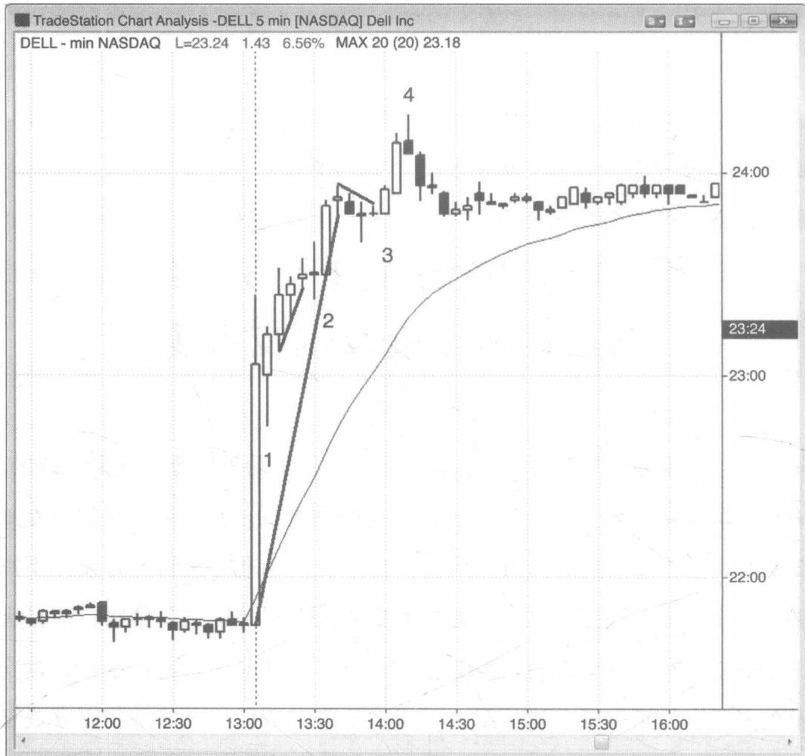
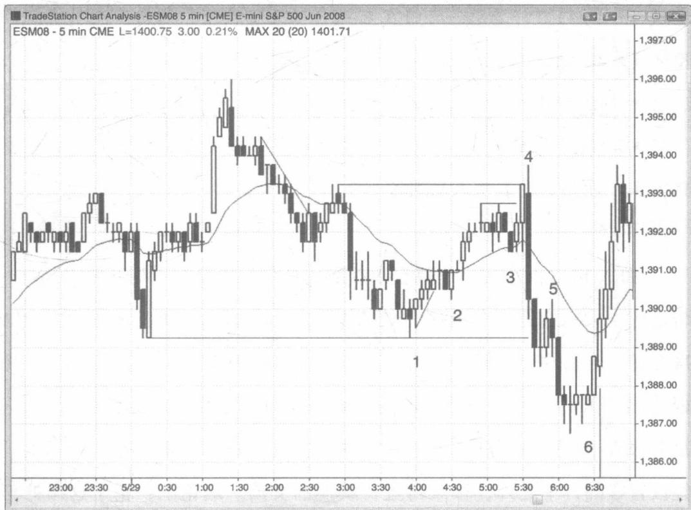
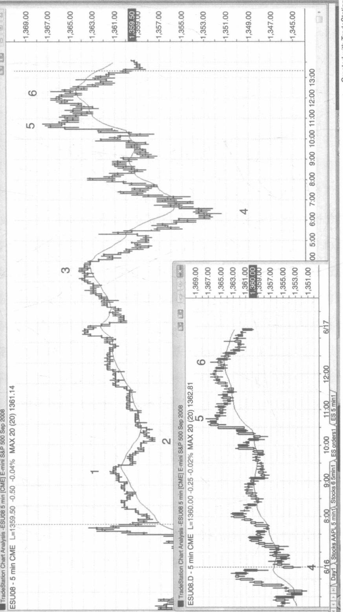

# 第 14 章全球电子交易系统、前市、后市以及隔夜市场

在任何市场的任何时间内，相同的价格行为的技术分析都是一致的。有许多国际交易商，会一天进行24个小时的交易。在前市产生的高点或低点往往会在后面的时间得到检验，当你在日盘进行交易的时候并不需要参考全球电子交易系统的价格，因为你能得到的信息非常少，而且大部分的信号在日盘交易的图表上已经给出了。许多交易者在进行日盘交易的时候会使用全球市场的图表，这也是非常合理的。但是我更喜欢日盘图表，因为当趋势线和趋势通道线连续超越两天以上的交易日时，在日盘图表上看起来非常明显，而这对我来说非常重要。

当股票在日盘收盘后出现了收益报告时，许多交易者会试图在后市抓住机会交易股票，因为如果市场产生了较大的波动，将产生潜在的巨大盈利机会，但是这些波动的机会非常难以抓住，所以大部分的交易者都不应该尝试去交易。市场的波动往往在短时间内迅速完成，以至于你还来不及阅读图表和下单，这些波动往往会在止损位产生较大的滑点，也会有较大的回调，有时候也会出现反转，而当你刚刚反应过来市场上发生了什么的时候，这些波动也正好停止了。如图14.1所示，戴尔在前市

  

图14.1 收盘后的交易结果

收盘后出了一份收益报告，看起来确实给后市交易带来了很多交易机会，但是对于大部分的交易者来说，还是很难抓住市场的波动机会获利的。

\- 在市场向上突破之后，K线1是一个高点1的牛市内含K线，在高于K线1的高点1美分的位置，你可以做多入场。

\- K线2是一个高于外包K线1美分的做多入场K线，K线2向下突破了牛市微型趋势线，并且开始反转向上。

\- K线3是在主要趋势线被突破之后，产生的一个突破高点1的做多时机。

\- K线4是一根熊市反转K线，同时也是形成了一个最后旗形的卖空机遇，随后市场在向上突破牛市通道后形成了新的买入高潮。

此外，因为 K 线 3 突破了主要的牛市趋势线，所以这意味着做空交易者的力量正在加强。只有在趋势线第一次被突破的时候，趋势才会变强劲。而且，在一个强劲的趋势中进行趋势交易需要看到 5 分钟的反转 K 线（3 分钟或者 1 分钟的都不可以）。在后市后面的时间段里，市场形成了一个狭窄的震荡区间。

  
图14.2 在前市进行交易  

前市也是可以进行交易的，但是在纽约证券交易开始交易之前的一两个小时内（上午6：30之前），并没有太多的入场通道（看图14.2）。通常在5：30市场会出现报告，然后会出现趋势和反转。

\- K线1是一个楔形的做多时机，同时也是一个双重底部，交易者至少应该将头寸持有至K线2的回调时，才能获利。一个楔形底部（或者说是三浪推动向下，或者其他名字）通常会带来两次向上推动的浪潮。

\- K线2是一个更高的低点，同时也是一个小型的趋势线反转。

\- K线3是在移动平均线上出现的高点2。

\- 一份报告导致市场错误地向上突破后，又出现了向下突破的外包K线（K线4）。许多交易者将在K线3的下方卖空，而做多交易者将在K线3处设置他们的止损位。

\- K线5是一次突破性的回调。

\- K线6是市场第二次尝试反转新的震荡低点（K线5是第一个震荡低点）所形成的二次入场通道。

如图 14.3 所示，上午标普 500 期货合约市场对 5:30 出来的失业报告反应不大。这是一个 100 次交易的图表，在图表上每条 K 线代表 100 次交易，与这些交易的交易量和交易时机都是独立的。请注意，在这 30 根 K 线中 K 线 1 和 K 线 5 之间的 K 线都是在 1 分钟之内发生的，因为这是对报告的快速反应。这些 K 线形成的如此迅速，以至于除了市场上已经设置好的订单之外，很难再进行其他的交易。理论上，基于这样的价格行为是可以进行盈利颇厚的刮头皮交易的，但是大部分的交易者是不会轻易尝试去做的。我们之所以向你说明这个，只是为了证明标准的交易模式是存在的，但是不一定大家都有能力做到。

<table><tr><td colspan="11">V() 65.0000</td></tr><tr><td colspan="11">ESM08 - 100 Tick Bars CME L=1359.25 -46.00 -3.27% MAX 20 (20) 1359.58</td></tr><tr><td>1</td><td>2</td><td>3</td><td>4</td><td>5</td><td>6</td><td>7</td><td>8</td><td>9</td><td>10</td><td>11</td></tr><tr><td>10</td><td>11</td><td>12</td><td>13</td><td>14</td><td>15</td><td>16</td><td></td><td></td><td></td><td></td></tr></table>

图14.3 在快速交易的市场上交易次数表会有更多的K线

缩表图显示的是同样的 30 分钟的交易的 1 分钟和 5 分钟的 K 线图。

如图 14.4 所示，在全球 24 小时交易的 K 线交易图表上，出现了一个扩展的三角形，并且在 K 线 5 处结束（K 线 1 和 3 是最初的两波上升浪），同时缩略图显示了在相同的交易时间内的日内交易图表。如果你只是用日内图表进行交易，你就不需要再在全球市场图表上看到这个扩展的三角形，并且进行做空交易。K 线 5 突破了昨天的高点，并且回到了移动平均线。之后市场反弹到了一个更低的高点，并且在 K 线 6 的双重顶部熊市旗形处出现了一个卖空时机（之前的顶部在 6 根 K 线之前出现）。

  
图14.4 全球交易市场和日内交易图表通常会有不同的交易时机

