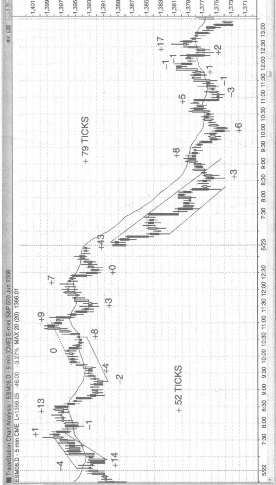
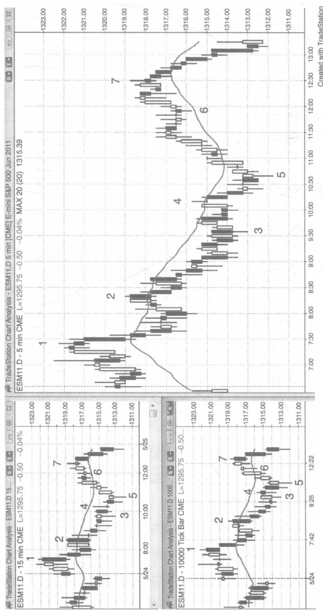
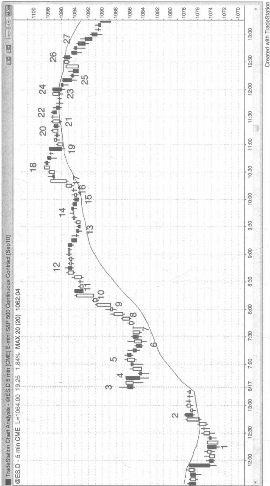
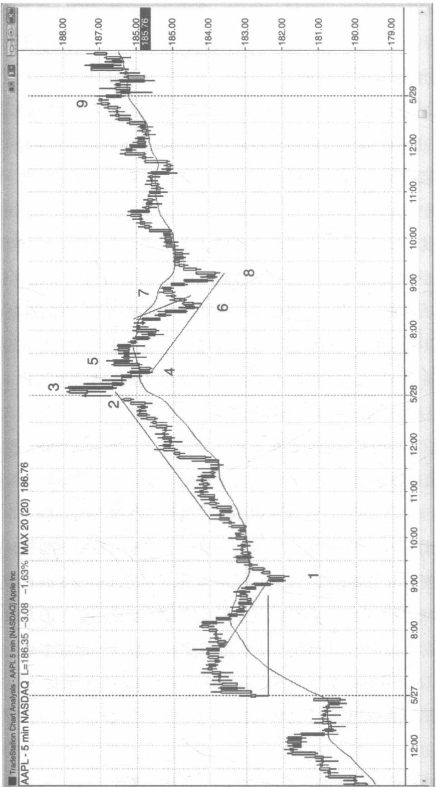
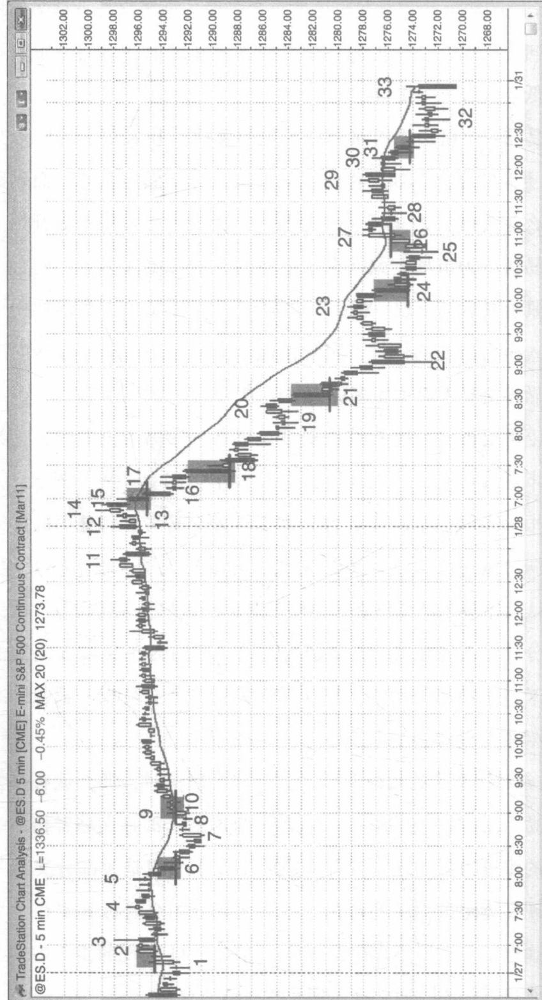
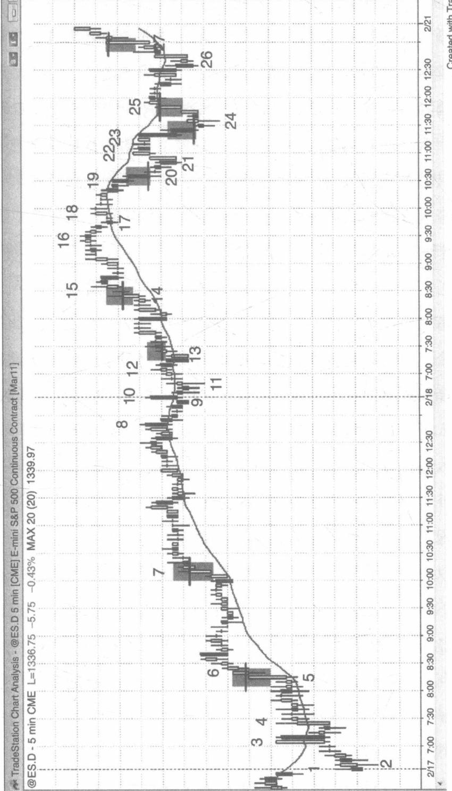

# 第 15 章始终在场

“始终在场”一词可能是在交易中唯一重要的概念。作为交易者，你必须不停地判断市场的方向，而一直保持这种交易方式可以帮助你判断市场的趋势。假设你必须一直在市场上交易，那么不论是做多还是做空，始终在场策略的方向就是你持有头寸的方向。这一策略通过多种形式被许多交易者（包括机构交易者）运用。举个例子，许多共同基金都是一直保持做多的方向，并且大多数对冲基金是接近完全投资的，但他们也经常在某些市场一直做多，某些市场一直做空。如果作为个人交易者的你经常会错过市场的大幅移动，那么你就应该考虑始终在场这种交易方式了。

始终在场策略的方向判断与趋势交易策略的方向判断并不完全一样，因为当市场形势很模糊的时候，大部分的趋势交易者是不参与交易的。然而市场在任何时候都是可以交易的，不论是做多还是做空，而对于价格走势的方向市场参与者大部分时候是有共识的。每天进行20次交易及以上的交易者可以视为始终在场策略的交易方向在一天内反复变动，但是很少有交易者可以日复一日地捕捉到不断变化的交易方向。然而，对于只想找到最好的3到10次的波段交易机会，也允许市场出现适当的回调，而不需要改变他们最近的交易方向的交易者来说，他们已经掌握了进行始终在场交易策略的心态。他们可以在市场每次出现新的趋势信号时改变交易方向，在市场的波段走势减弱时获利平仓，然后再寻找新的交易方向。然而，很少会有交易者在市场上始终保持交易，而且在每次反转信号出现的时候迅速改变他们的交易方向。大部分的交易者都需要中场休息，所以他们有一段时间很难进行反转交易。虽然交易者们能够把握住很多始终在场交易策略中的反手入场时机，但是一般会把每次的这种机会都看作是一次波段交易，在反手交易之前先平仓离场。他们关注的是每笔交易是否能够获得与承担的风险较为匹配的预期收益，而不只是用始终在场策略的思维，根据每次的入场信号去操作。通常来说，如果市场的信号已经非常明确，足以进行始终在场策略下的反转交易，且交易者认为有60%的概率可以达到他们的风险收益相匹配的目标。一个始终在场的交易信号的最低标准就是市场朝新的方向发展的可能性要大于旧的方向，也就是说市场有至少51%的可能性会朝新的方向发展，当然大部分的信号是有60%及以上的可能。例如，在标普500期货合约的交易市场上，如果交易者需要一个两个点位的止损位才能交易，那么他们应该从他们的入场点开始设置两个点位以上的盈利目标，如果他们可以正确地解读价格行为，则他们有60%的可能性会成功。

如果交易者此刻正在看交易图表，并且需要马上做出操作方向的判断，不管是选择做多还是做空，只要他们在多空两个方向上稍有偏向，就能得到始终在场策略的交易方向。这至少是短期的市场趋势。如果他们还是不能做出决定，他们应该看看移动平均线和导致他们不能确定的情况出现的市场价格变化过程（记住，市场上不确定的情况是指市场处于震荡区间）。如果近期大部分的K线都在移动平均线之下，则始终在场的交易方向可能就是做空。如果近期大部分的 K 线在移动平均线之上，则很可能是做多。如果在市场的震荡区间出现之前是一波反弹浪，则始终在场策略的方向可能是做多。如果在市场的震荡区间出现之前是一波下跌浪，则始终在场策略的方向可能是做空。如果你希望在市场回调的时候买入，则始终在场策略的方向可能是做多。如果你希望在市场反弹的时候卖出，则始终在场策略的方向可能是做空。如果你还是无法决定交易方向，而市场又处于震荡区间，那么你就保持低买高卖就好了。你的目标就是你的操作要与市场的方向同步，节奏要踩对。这种感觉就像是孩童时与朋友一起跳绳的感觉，你的两个朋友会摇摆绳子，而你必须快速地跑进来，根据绳子的晃动跳跃。你必须认真地观察绳子晃动的节奏，一旦你可以确定绳子的节奏，你才开始跳跃。同理，在市场上进行交易时，一旦你可以确定市场的方向，你就可以开始操作了。

有一些交易者会用更长周期的时间图表来决定他短周期始终在场策略的持仓方向。举个例子，如果他们在5分钟的时间图上交易，同时会在60分钟的图表上观察市场，如果市场处于牛市且K线均高于移动平均线，则他们在5分钟的图表上只会寻找买入的入场时机。其他交易者也会用同样的方式用更长周期的K线图上的指标来运用到更短周期的交易决策中。举个例子，如果在60分钟的图表上市场是随机上涨的，那么他们就会在5分钟的图表上寻找回调买入时机。对于5分钟的图表来说，每天需要去评估10到20次市场的反转，很多交易者并不喜欢这样的交易方式，所以他们宁愿选择在更长周期的K线图表上交易，因为在那里他们只需要做3到5次交易决定。这也是一个非常有效的方式，不过，因为在更高的图表上K线更大，所以需要的止损价位也更大，所以这也意味着交易的头寸应该更小。

在市场开盘之前，许多交易者经常会有一种偏见，认为昨天最后的始终在场策略的交易方向还是会主导今天的市场方向。然而，一旦开盘后就出现两根连续的强劲的趋势K线，则市场很可能会根据这一新的方向发展。当然直到后续市场上出现了突破以及后续的力量跟进，这个新的方向才能被确定，但是这并不妨碍我们认为这是一个起点。如果市场上前后力量可以衔接，那么将带来新的交易机会，我们可以等待第一次回调时进入市场。如果你在市场上的经验足够丰富的话，理论上你可以一整天都可以在市场上交易，并且抓住每一次合理的入场信号。

市场总是在尝试反转，而且每次反转的力量几乎就要成功，但是通常会缺乏最后一点的跟进力量支持，这导致很多交易者没办法对反转的成功概率有足够的信心。对于顺趋势交易者来说，这些几乎成功的反转是非常好的交易机会。举个例子，如果在一个牛市趋势中形成了一根强劲的熊市突破K线，那么许多交易者将会在这根K线的收盘处买入，期待市场不会继续下跌。他们的想法也是比较正确的，因为大部分时候，反转是会失败的，所以我们逢回调买入的机会非常难得。其他的做多交易者会等待，他们想知道下一根K线的收盘价会是怎样。如果下一根K线并没有以下跌收盘，则他们会在下一根K线的收盘处买入，还有一些做多交易者将会在下一根K线的高点以及之前强劲的熊市K线的高点上方买入，这是因为这些位置很可能是空头的保护性止损价位。而做空交易者如果没有看到市场后续的跟进下跌来支持他们做空，他们将会回补他们的做空头寸。当作空交易者和做多交易者同时买入时，市场又会上涨好几根K线。在另一个合理的卖空时机出现之前，做空交易者不会再次做空，而这个新的卖空时机往往会在市场到达新高之后出现。当市场上的新手看到前面提到的强劲的熊市K线时，他们会感到恐慌。他们认为市场正在突破，他们需要马上做空。在他们的眼里只能看到那根非常强劲的熊市K线，而忽略了之前出现的强劲的牛市趋势。在这根失败的熊市K线的低点下方1到2个点位处，他们做空，但之后因为市场又开始上涨，他们的止损位被触及。而一般来说，这时候的反弹还是比较微弱的，所以他们暂时还不会买入。他们还在寻找市场上出现低点1或者低点2的卖空时机，期待市场在这根强劲的熊市K线之后还会出现下跌浪，但是低点1失败了，所以他们的止损位再次被触发了。之后低点2也失败了，所以他们连续三次的操作都失败了。他们之所以会这样连续失误，是因为他们还没能理解始终在场策略的持仓为做多代表着什么。当始终在场策略选择做多时，这意味着牛市趋势还是有效的，多头总体依然控制着市场。虽然有时候差一点点就可能反转到始终做空的方向，但是最终并没有。只要牛市趋势是有效的，那么始终在场策略的方向就应该始终是做多。另外，将市场的赌注下在反转会获胜这个筹码上是非常错误的，因为80%的反转都是失败的。

始终在场策略也是一种波段交易的策略。为了使得这个策略持续有效，交易者应该寻找最重要的三次，或者最多10次转换方向的机会，并不需要在每一次小的反转信号处转变方向（大部分日子一天内会有20次以上的反转，但是有些反转太小了很难进行交易）。此外，一旦市场符合他们的交易方向预期，持仓利润已经超出初始风险的2至3倍的距离时，大部分的交易者会部分或全部获利平仓，这时他们使用始终在场策略也没什么压力。当机构交易者开始获利时，市场会经历一波回调从而这些机构交易者可以重新进入市场趋势的方向，结果就是趋势也会复苏，继续推进。当市场由趋势进入震荡区间时，始终在场策略的持仓方向还是不会改变。如果交易者准备在震荡区间交易，他们应该大部分或者全部采用刮头皮交易的方式。但是，如果他们并没有改变他们始终在场的交易方向，那么他们应该只进行同方向的刮头皮交易。举个例子，如果市场经历了一波强劲的熊市趋势之后，价格开始有所反弹，但是还没有出现足够强劲的牛市K线，并且价格始终是在移动平均线的下方，那么始终在场策略还是保持做空的方向。即使市场现在已经进入了震荡区间，交易者也应该寻找的是做空方向的刮头皮短线交易时机。但是如果市场上出现了一个非常强劲的做多入场时机，就很可能会将始终在场策略的方向反转为做多，或者至少会有足够多的K线提供做多的刮头皮交易时机。然而，任何不能够将始终在场方向反转为做多的买入入场时机都是不值得交易的。

因为始终在场策略是需要调整交易方向的，所以当市场处于狭窄的震荡区间时最好不要使用这种策略。事实上，在这种情况下最好不要进行交易，安心等待市场出现突破或者失败的突破，因为这两种情况都可以带来始终在场策略方向的改变。如果经验丰富，经常盈利的交易者希望在这种狭窄的震荡区间交易，他们可以采取两种方式，一种就是保持在震荡交易之前采取的始终在场策略的方向，获得同方向的波段收益，另一种就是使用限价指令采取刮头皮短线交易的方式，在震荡区间每次出现的高点或低点，或者对前一根K线向上或者向下突破高点或低点处进行反向交易，即高抛低吸。

在震荡区间日，在市场接近这个区间的上限或者下限之前，始终在场策略的反转方向通常都是不清晰的。举个例子来说，在一个震荡区间，在出现一个可以触及区间顶部的上升浪之前，始终在场策略的方向很难明确做多，同理，在出现可以触及区间底部的下跌浪之前，始终在场策略的方向也很难明确做空。然而，在顶部区间做多和在底部区间做空实际上与交易者应该做的完全相反。始终在场策略一般来说在市场有趋势的时候会用得更好，在震荡区间用这个策略是非常危险的，在震荡区间你最好用刮头皮交易策略，保持低买高卖。举个例子，当市场正在向区间顶部移动时，会有一些不断突破震荡高点的突破在区间内出现，这可能会使得交易者认为市场上的始终在场策略可以开始做多了，但是通常来说，震荡区间的上沿的突破并没有如此重要，以及后续的突破和跟进力量并不能使得所有的人相信可以做多。如果你看到了市场的向上移动，并且正在怀疑市场是否已经进入了始终做多，那么你就产生了不确定的情绪。而不确定性正是震荡区间的标志，你会有你自己的答案。随着趋势上涨市场上出现了很多的紧迫情绪。你很确定市场将会上涨，但是又很迫切地希望市场出现回调，从而你可以以更低的价格买入。交易者都知道，如果市场向上的移动会带来新的牛市趋势而非仅仅只是震荡区间的上调，那么这次移动就会有很多强劲的牛市K线，并且会不断超越震荡高点。除非市场突破整个震荡区间，并且还有后续的跟进趋势时，而非仅仅只是区间内的触顶或触底时，市场上才会形成共识。市场上的新手可能会担心市场在突破区间后不会有太大的移动，但是经验丰富的交易者都知道，一次震荡区间的成功突破通常至少会达到一个最小的可测量的移动目标，同时会带来非常丰厚的盈利机会。

在震荡区间日，因为卖出真空的存在，在一天的最低点处通常会形成最强劲的下跌潮。因为强大的做多交易者希望市场会去测试震荡区间的低点，所以他们会在市场接近最低点的时候停止买入。这进一步加剧了双方力量的不平衡，导致市场进一步快速下跌。同时，基于动量的程序化交易也会感知到市场下跌的加剧，所以在市场上的动能下降或者出现反转之前，他们会迅速做空。如果交易者仅仅只关注最近时期的市场趋势，在他们的眼中就只有一波强劲的下跌浪，所以他们就会认为始终在场策略已经开始转为强烈做空了。然而，如果他们愿意回头看整张图表，他们将会对这波卖出真空感到怀疑。相对于做空，可能他们会更愿意在这个失败的突破尝试处买入做多。

所以，那就有一个疑问了，到底交易者应该基于怎样的基础去判断始终在场策略的方向？在交易者有信心做出方向选择之前，他们需要市场有明确的趋势。他们希望可以看到市场上会出现强劲的突破，让他们可以更好地判断后市。关于突破力量的信号我们将在第二本书详细解释。当市场上出现了至少两根连续的强劲的牛市趋势K线时，大部分的交易者才会相信始终在场策略的方向是做多。同样，当市场上出现了至少两根连续的强劲的熊市趋势K线时，大部分的交易者才会相信始终在场策略的方向是做空。在开盘最初的一个小时，明显的趋势还没有形成，如果出现了两根连续的牛市趋势K线将会让交易者寻找买入的刮头皮交易时机，如果出现的是两根连续的熊市趋势K线将会让交易者寻找卖出的刮头皮交易时机。这些都会在19章开盘交易中详细解释。

如果整个市场的氛围足够支持，即使是只出现了一根平均主体大小的趋势K线也足以让交易者相信始终在场策略已经转变到了相反的方向。然而，一般情况下，则至少需要两根或者更多根连续的趋势K线才能让交易者相信市场上的方向将会在接下来发生显著的改变。与反趋势交易者在市场回调中采取的措施相同，当市场出现一次回调时，他们还是会保持原有的头寸，只有第二次回调出现时，他们才有可能采取措施（比如，当作多交易者在底部买入之后，他们会暂时离开市场，直到市场触发了低点2，他们才会转而做空），始终在场策略的交易者也是如此，在他们看到第二根连续的强劲趋势K线之前，他们并不认为始终在场策略

的方向已经改变了。

因为第二根趋势 K 线通常会使得交易者相信始终在场策略的方向发生了反转，所以这根趋势 K 线的收盘非常地重要。举个例子，如果市场上出现了一根熊市突破 K 线，则交易者会仔细观察下一根 K 线的收盘处。做空交易者会希望看到一个熊市的收盘，而做多交易者会希望看到牛市的主体。因为市场有惯性，所以大部分企图反转市场趋势的尝试都会失败。这意味着许多交易者将会在熊市突破 K 线的收盘处买入，并且期待市场上接下来出现的 K 线会有一个牛市的收盘，这样做空交易者将会放弃。如果突破并不是太强，并且市场上有充足的理由相信突破会失败（就像在牛市旗形底部出现的突破尝试），那么这将是一个很好的交易机会，但是因为做出交易的决定非常困难，所以只有经验丰富的交易者才应该考虑这个交易机会。做多交易者想要在市场回调处买入，所以他们会寻找市场上出现的下跌浪。他们把下跌浪看作是做空交易者错误地判断了市场方向从而造成的后果，因此这些做空交易者将不得不带着损失买回他们的头寸。此外，这些做空交易者不会在至少一根或者两根 K 线之后再次卖出，所以在接下来的市场中做空交易者将会变少。这就增加了做多交易者在下跌浪中买入头寸获得利润的机会。同理，当市场处于做空的始终在场策略时，做空交易者认为在一些小波浪中出现的上升浪是卖空的绝好机会，他们认为做多交易者会被困住，并且会通过卖出手中的头寸失败离场。

如果接下来的 K 线非常强劲，交易者可以在这根 K 线的收盘处或者市场的小型回调处入场。举个例子，如果市场上出现了一个非常强劲的牛市突破，并且接下来的一根 K 线也是一根强劲的牛市趋势线，许多交易者将会在接下来的 K 线的收盘处或者 1 至 2 个点位的回调处买入。如果接下来的K线比较弱，比如说是一个十字星，那么相较于在K线的收盘处买入，在市场的回调处买入更好。如果接下来的K线只比突破的K线高或低几个点位，那么这个突破失败的可能性将会很大。如果接下来的K线比突破的K线高或低很多个点位，那么这根K线收盘后会成为一根强劲的趋势K线的可能性会很大。大部分的交易者都认为市场会有明确的始终在场策略方向。有时候，市场会在突破K线之后沿着突破的方向继续走几根K线，然后悄无声息地形成一个与突破方向相反的趋势通道，但是又没有明确表现出突破已经失败的迹象，投资者甚至不知道始终在场策略的持仓方向已经悄然发生改变。这时，对于大部分交易者来说，始终在场策略的方向很可能是没有改变的，但是他们会设置保护性止损位以防市场上的回调走得太远。市场也很有可能进入震荡区间，所以交易者很可能会选择震荡区间的交易模式，这意味着他们将进入刮头皮交易，避免此前通过趋势获得的利润被震荡行情吞噬掉。举个例子，如果在一个牛市突破后紧随了几根弱势的K线，之后市场并没有形成下跌浪，而是形成了一个较弱的下跌通道，市场仍处于始终在场策略的做多状态。然而，做多交易者还是应该设置保护性止损位，以防下跌通道在没有出现明显的熊市反转迹象前就下跌得太远。如果做多交易者在早期买入，并且在开盘就赢得了较为丰厚的利润，他们也可以将他们的止损位设置在盈亏平衡点上。如果他们是在较晚的时间买入，他们应该在信号K线的下方离开市场。如果后市走弱，他们就不应该在市场的高点附近买入，而是应该等待市场出现了一个回调时再买入。如果他们真的是在市场的顶部买入，那应该只会发生在他们感受到了市场的紧迫情绪的情况下。如果后面的市场反应并没有证实紧迫情绪的存在，他们就应该离开市场并且寻找市场回调的机遇买入。

有一个指导性的原则，当你选择始终在场策略的做空方向时，你至少需要看到接下来的一根K线并没有以上涨收盘。如果接下来碰巧是一根小的熊市K线或者一根十字星K线，那么可以确信的是做空交易者已经控制了大部分的交易者，但是这也是新的熊市趋势并不强劲的迹象。相较于在这些K线的收盘处卖空，我们最好是在市场反弹以及低点1和低点2的入场时机处卖出。如果接下来的K线有一个非常强劲的牛市主体，或者是一根牛市反转K线，那么这将是一个失败的突破的买入信号。如果这根K线拥有一个较小的牛市主体，大部分的交易者将会等待一个更有利的卖出时机，但是他们也相信出现一个新趋势的机会已经不大了。反之亦然。当市场处于始终在场策略的做多方向时，也是同样的道理。当你采取一个始终在场的做多策略时，在趋势K线之后你至少需要看到一个以下跌收盘的K线。如果接下来的K线并不是非常强劲，那么相较于在这根K线的收盘处买入，你更应该在市场回调的时候买入。如果接下来的K线有一个熊市收盘，那么这个突破可能是一个牛市陷阱，而且这可能是一个失败的突破信号K线，提示我们做空的机会。然而，市场也很可能会突然变成一个牛市趋势，但是在得到这个结论之前交易者需要市场给出更多的证据。

一旦交易者确信市场在突破之后有持续的跟进力量，那么接下来价格将会向突破的方向继续移动一段可预期的距离。举个例子，如果市场上有一个持续了三根K线的强劲的上升浪，且向上突破了震荡区间，那么许多交易者会相信市场接下来会出现一个与该上升浪或者震荡区间的高度相当的另一上升浪，所以他们会立即在市场上买入一小部分头寸。因为他们是非常自信的，所以他们至少会有百分之六十的把握市场会进行等距离的定向移动，不论这种情况是否发生，但在数学概率上还是会支持进行交易。当趋势持续时，风险还是保持恒定，而且定向等距离的价格移动还是会有百分之六十或者更多的概率，但是随着利润增长回报会更多，所以从数学角度来说进行这笔交易更为划算。举个例子，如果在高盛的股票中出现了一波强劲的三根K线的上升浪，而交易者在这波上升浪的顶部买入，这波上升浪大概有1美元的高度，而在这波上升浪向下跌1美元到达震荡区间底部之前，市场很可能会再次出现向上移动一美元的距离。如果市场在接下来的几根K线中上升了1.5美元，市场依然面临着跌入底部的风险（交易者很可能会在这个时候提高了他们的止损价位），这个时候市场可测量的移动距离大约是比之前的K线高出1.5美元的距离，或者是比他们入场时的价格高出2美元。所以他们现在有百分之六十的概率会在不超过1美元损失的情况下获利2美元，这意味着趋势的趋势是非常强劲的。如果市场的趋势持续上升，那么他们还会在保持比较大的获利概率下，获得更大的利润。当交易者开始提高他们的止损位时，风险将会降低，所以这次交易将会在数学概率上更加划算。一般来说，只要市场趋势非常明确那么就应该采取始终在场交易策略，交易者在使用交易者的等式来评估交易时，就应该假设获利的概率至少是百分之六十。

市场通常会在开盘之初的一个小时内进入始终在场策略的模式，而交易者也往往会在那个时点进入始终在场交易。当市场向他们预期方向移动的距离超过他们承受的风险的一至两倍时，一些交易者就可以获利平仓了。举个例子，如果交易者在苹果（AAPL）的股票市场上采取始终做多的方向，同时将他们的保护性止损位设置在他们的入场价位的一美元之下，一些交易者将会在获利1美元或2美元之后离开市场。而另外一些交易者则会当市场出现明显的反转，且开始采取相反方向的始终在场策略时，才会考虑采取其他操作。之后他们将会采取相反方向的始终在场策略。因为大部分的交易者并没有能力在每一次市场出现微型反转时就调整操作的方向，所以他们只会寻找一天中的2至5次强劲的反转时机。有时候市场会出现一波持续的回调，但是并没有带来始终在场策略的反转。举个例子，如果市场上出现了一波强劲的上升浪，那么始终在场策略的方向就是做多，之后市场上又出现了一股动能较低的回调并持续了数个小时，那么此时交易者需要重新评估他们的策略。此时他们应该设置最坏情景下的保护性止损位，以防市场的回调持续下调以至于跌破了他们的买入价位。有时候市场会在没有明显的下跌浪和卖出信号的情况下，跌破他们的买入价位。如果他们在标普500期货合约的开盘时已经获利，他们当然不愿意市场跌破他们的入场价，所以他们可能会使用一个盈亏平衡的止损位。如果他们的止损位被触发了，他们将继续等待寻找市场上的始终在场策略采取的方向。如果在他们获利之前，市场在他们入场后很快就出现回调，那么他们应该将保护性止损位设置在上升浪的下方，即使它可能会离这波浪潮较远。如果距离较远，他们的头寸也应该足够小从而使得他们的风险在正常的范围之内。

一旦你相信市场已经变成了可以采取始终在场策略的状态时，你最好至少在市场上先买入或卖出一小部分头寸，或者你也可以在市场进入小幅回调的时候再操作。当然如果市场上始终在场策略的方向比较明显和强劲，那么以上的操作原则将更加适用。如果市场上的动能较低，且没有较为紧迫的情绪，许多交易者会选择在市场出现大型回调的时候入场。然而，这些交易者也有可能会错过市场随趋势移动的时机，因为许多非常好的采用始终在场策略的交易一开始的时候动能非常小，市场一直在许多根K线和点位之后才出现回调。通常情况下，当市场上的交易者处于始终做多的情况下，交易者会寻找每一次因做空交易者努力反转市场而带来的回调时机买入，因为他们早已深刻的认识到大部分反转市场趋势的尝试都会失败。他们会在任何熊市趋势K线的收盘处或附近买入，或者在低于前一根K线的低点或者之前的震荡低点，在所有的支撑位处比如牛市趋势线的下方买入。当市场处于始终做空的情况时，交易者会将每一次做多交易者企图反转市场带来的小幅上升看作是卖出时机，因为他们知道大部分的尝试会失败。他们会在任何牛市趋势K线的高点、前一根K线的高点，或者任何震荡高点处，或者在支撑位比如熊市趋势线处卖出。

当你在始终在场策略中不断转换方向时，你必须能够容忍市场出现回调，因为这是不可避免的。因为大部分的回调都不会演变成反转，所以你不用每一次都担心市场的移动会导致你的策略的方向的改变。通常来说，如果市场上出现了一次回调差一点触发了你的盈亏平衡止损位，之后市场又沿着你的策略采取的方向复苏了好几根K线，一般这时市场很难再回到你当初的入场价位。因此，在大部分的情况下，你可以将你的止损位上移到你的盈亏平衡点上。如果市场遭遇到了第二波回调，触及了你的止损，而你对市场的方向又不确定，当出现另外一个方向的入场机遇之前，你可以一直空仓而不必感到焦虑。记住，不确定性是震荡区间的标志，而始终在场是判断趋势的一种方式。

如果你相信市场上有始终在场策略的方向，你就不应该采取反趋势的交易。这是因为在这种时候采取反趋势交易肯定是为了进行刮头皮交易，这意味着这种时候风险会是回报的两倍多，且成功的概率不太可能会等于或超过70%。如果你认为市场上会出现回调，那么相较于你仅仅只是下赌注似的认为回调会比较大而去反趋势交易，在回调结束之后进入趋势的方向会更好，而且你会有更大的概率取得短线刮头皮交易的成功。

我有一个朋友在每天开盘的前几个小时都非常耐心地等待始终在场策略的入场时机，当他发现一个时机时，他就会希望这个趋势持续至少几个小时，且覆盖一天中大概三分之一的交易区间。一旦他发现了入场时机，他就会进入市场，然后在信号K线的上方设置一个止损订单，在止损位的两倍距离之外的可测量的移动距离或支撑区域设置盈利限价订单。因为他等待的是始终在场策略的入场时机，所以市场移动相等的距离的概率是百分之六十或者更多。如果他在标普500期货合约市场上承受了两个点位的风险时，那么在他设置的保护性止损位被触及之前，他至少会有百分之六十的概率获利两个点位。然而，当他承受了两个点位的风险时，他的盈利目标往往是四个点位或者更多，所以在始终在场策略的入场时机中，他盈利的概率至少有百分之五十。虽然这个概率从来都不是确定的，但是在他采取的这些入场时机中大部分还是超过百分之六十的。然而，像其他的交易者一样，我的朋友不愿意在一天的微型反转非常普遍的中间时段进行交易。所以当他不进行交易的时候，他在干什么呢？他一般会去干别的工作或者外出锻炼。当几个小时过后，他再次回到交易时，正好可以在一天的收盘处寻找始终在场策略的交易时机。

怎样在市场上有效地采取始终在场策略？因为当市场上有趋势或者至少存在潜在的趋势时，始终在场策略才有效，所以你应该在市场上寻找趋势较强或反转的信号。在本书的开头我们已经介绍过这些信号了（在介绍中）。他们出现的次数越多，你获利的概率就越大。最明显的信号就是出现了一波强劲的浪潮，特别是当它持续了好几根K线时最为明显。举个例子，如果市场在开盘时出现了一股强劲的反转上升浪，且在这个时点这波浪潮是由三根主体明显的牛市趋势K线组成，那么交易者就会在此处或在市场出现小幅回调时买入。他们不再等待市场出现回调，因为他们确信在接下来的几根K线处市场上涨到更高位置的概率要大于市场出现回调的概率。市场上的这种紧迫情绪是一个比较完美的实行始终在场策略的情况，如果你在此时还没有成为做多的一方，你也应该考虑至少以市价买入一小部分头寸，或者在这根K线的高点下方的几个点位处设置限价订单。你应该在这次入场信号K线的下方设置止损位。这假设意味着你必须冒8个点位的风险，而在平时你一般只冒2个点位的风险，那么你这次追涨交易的单量就只应该是你平时交易量的四分之一。在此时你必须考虑的是你要做多，即使只是做多一小部分头寸，因为你很确信市场会走得更高，如果你已经相信这一天是一个强劲的牛市趋势日，那么在市场没有出现明显或强劲的熊市反转信号之前，你应该至少保留一部分的头寸至收盘处。

对于股票，盈亏平衡点被触及的概率更小，所以在波段交易中更有利可图。通常来说，你可以在市场超你预期方向移动0.5%至1%的幅度时或者你的利润比你的初始风险高出两倍时，用三分之一至二分之一的仓位去采取刮头皮交易策略，来不断高抛低吸提高你的盈亏平衡点。如果市场看起来与你的持仓方向相反，但又尚未发生反转，比如看起来像是对一天中的高点的测试，此时你可以增加剩下的四分之一至三分之一的头寸去进行刮头皮交易，但是在你的盈亏平衡止损位被触及，或者有很明显且强劲的反转信号，或者在收盘之前，你都应该保留至少四分之一的头寸，因为市场的趋势往往比你想象中要更远。

在市场反复出现的回调中，你应该有足够的定力持有你的头寸，直到市场到达了你的目标价位，或者市场出现了明显的反转情况，或者你设置的保护性止损位被触及，你才应该离开市场。虽然有时候市场上的回调是比较剧烈的，但是也还是不足以触发始终在场策略的反转，所以你还是应该坚持原来的计划，不要因为一根与你的交易方向相反的大趋势K线的出现而感到恐慌。如果你的止损位被触发了，你应该及时离开市场，当市场再次出现相反方向的明显而强劲的入场时机时你才应该再次入场。如果市场上真的出现了这样的入场时机，那么你就应该重复前面所提到的操作。如果你的正常交易仓位是两手合约，那么当你正在买入一手合约时市场的反转模式触发了，你应该卖出三手合约。一手合约的卖出将让你离开你之前的做多仓位，而另外两手合约的卖出将使你进入新的相反方向的策略。你可以用第一手合约进行刮头皮交易，并将目标盈利位设置在目标止损位的两倍，然后你可以再用第二手合约进行波段交易。

使用这种方式的关键就在于，只有当市场出现了明显而强劲的入场信号时，你才采取入场或者反手的操作。如果没有出现这样强烈的信号时，那么你可以仅仅关注你的盈亏平衡点止损位是否被触及而不采取措施，虽然这可能会使得你在市场的震荡中失去曾经在波段交易中获得的收益。但如果你认真观察一篮子的股票，那么每一天都至少会有一只股票中产生可靠的入场时机让你进行波段交易。

在一天中的任何时刻，你都可以判断市场是否有明显的趋势，或者是否有明显的反转。在进行始终在场策略的交易时，你至少需要看到其中的一点或者两点。当市场上某一方向的力量占主导地位，则市场很可能会向那个方向发展。当你正好要进入那个市场时，你应该考虑一下你的保护性止损位应该设置在哪里，并且计算出你能承受几个价位的风险。按照一般的规律来说，市场的趋势很可能会持续前一波段相同幅度的价位，同时因为你相信市场上有趋势，所以成功的可能性会大于 $50\%$ 。如果你确信市场已经处于始终在场策略的情况中，那么成功的概率可能会大于 $60\%$ 。当市场的趋势还在持续时，你可以浮动设置你的保护性止损位，降低你的风险。同样，当市场已经按照趋势在你的入场价位上前进了好长一段距离，那么你也应该提高你最初的盈利目标，同时相对于这个盈利目标设置新的保护性止损位。这将导致你的盈利和风险重新被评估，此时你潜在的盈利概率要大于你的风险，且成功的概率大于 $50\%$ 。

正是因为在趋势中的顺势波段交易中从数学角度来说，交易的盈利风险比越来越高，所以这是一种非常好的交易模式，特别是对初学者来说。

经验丰富的交易者可以利用始终在场策略的方法在这个方向的趋势上进行刮头皮短线交易，但这需要你能够对趋势的强度判断有足够的信心。举个例子，如果交易者认为市场上出现了一股强劲的牛市趋势，那么基于最近的平均每日交易范围，那么他们可能会利用限价订单来进行做多的刮头皮交易。如果他们在交易标普500期货合约，而最近的平均每日交易范围是12至15个点位，在过去的几个小时里市场价格出现的最大回调只有2个点位，他们就可能会在市场出现1个点位的回调时买入一小部分头寸，在更低的1到2个点位买入更多头寸（是平均每日交易范围的 $10\%$ 至 $20\%$ ），之后可能会在更下方的几个点位处设置止损位。那如果过去的几个小时中出现的最大的回调是3个点位，那么他们可能会在市场下调3个点位时设置限价订单买入一部分头寸，在更下方的2至3个点位处买入更多的头寸，并在更下方的两个点位处设置止损位。如果市场突然进入了始终在场策略的做空方向，那么他们将会离场，然后寻找机会做空。入场方式我们在第二本中详细介绍了。

  
图 15.1 始终在场策略中的波段交易

始终在场策略的交易也可以在趋势日或者震荡区间日变成可以盈利的波段交易方法，只要这个震荡日终有很多足够大的波段。如图 15.1 所示，第一天是一个震荡日，始终在场策略可以净赚 52 个点位，或者大约是每合约 600 美元。第二天，市场经历了熊市开盘后演变成了趋势，然后进入了震荡区间。一个采取始终在场策略的交易者可以净赚 79 个点位，或者说每合约 950 美元。如果一个交易者有两手交易，一手用来做刮头皮交易，一手用来做波段交易，那么他每天可以成功地进行 10 次刮头皮交易，且每一份合约可以额外再赚取 450 美元。这听起来、看起来都很容易，但是操作起来却非常困难。

如图 15.2 的右方是一张 5 分钟的 K 线图，这张图上有 81 根 K 线，在大部分的交易者中会有超过 20 次的反转。对于不喜欢一直去判断始终在场策略的交易方向的交易者来说，他们可以通过在图表上减少 K 线的数量来减少他们做出判断的次数。在上面的三张图中，K 线的数量都是一样的。在左上方的是 15 分钟的 K 线图，在左下方的图中每根 K 线包含了 10000 个最小成交价位。在这些时间跨度更大的图表中，市场反转的次数更少，但也有一些非常好的反转信号，也足够交易者进行交易了。因为这些 K 线更大，所以为了交易的更加顺利，相对来说止损位也应该设置的更大。为了使得暴露在风险中的美元数与在 5 分钟 K 线图中一样，交易的头寸应该更少一些。

如图 15.3 所示，市场上出现了一个较大的向上的缺口，紧随其后出现了一个强劲的熊市反转 K 线，所以那一天很有可能成为熊市趋势日。这是一个非常可靠的始终在场策略的做空入场时机。然而，交易者们都知道一旦市场上出现了一个较大的向上的缺口，那么在市场出现牛市突破之前，市场通常还是会下行一个小时左右。基于此，即使他们在现在的时刻做空了，他们依然希望接下来会找机会反转做多。K线4是一根熊市趋势K线，但是它却有一个巨大的尾部，且之后出现的几根K线并没有延续熊市的走势。同样，在这一天中出现的第二根K线也是一根强劲的牛市K线而非熊市K线，在这里交易者会希望从这里开始寻找入场时机。市场的趋势看起来并不像出现了强劲的熊市趋势。许多交易者会在K线4之后出现的内含线的上方退出市场，然后等待第二个信号，但是从技术上看，市场还是处于始终在场策略的做空方向，因为市场上并没有出现明显的买入信号。之后市场上出现了两波非常小的上升浪，一直上升至K线5处，市场很可能正在努力与这一天中的第一根或者第二根K线一起形成一个双重顶部。你选择哪一根K线作为这个双重顶部的第一个顶部都可以，因为最终形成的双重顶部是一样的。有一些交易者会认为第一根K线是顶部，还有一些交易者会更倾向于第二根K线是顶部。在K线5之后的那根K线是一根熊市内含K线，同时也是市场上出现的第二个卖出信号，但是市场同样没有在这根K线之后形成强劲的熊市趋势。同样，做空交易者也会认识到这个问题。在这个点上，市场已经在狭窄的区间里运行了超过30分钟，特别是当市场同时遭遇了一个非常巨大的跳空开盘，那么市场现在已经在进入突破的模式了。

  
图15.2 更长周期的时间图表

高级反转技术分析
价格行为交易系统之反转分析（下册）  
  
图15.3 向上跳空缺口，然后回调

在市场进入突破模式时，交易者可以在这个区间的顶部上方一个点位处设置买入止损位，然后在这个区间的底部下方一个点位处设置卖出止损位。

K 线 7 是在 K 线 5 形成的双重顶部和 K 线 4 和 K 线 6 形成的双重底部之后形成的牛市 ii 模式。这种模式代表了市场的暂停，其实也是一种形式的市场回调，因为市场也正在形成双重顶部和双重底部的回调入场形态，所以这也可以看作是一个微型的突破模式。虽然也有交易者会在这个 ii 模式的突破中入场，但是大部分还是会等到这个开盘区间被突破后再入场。

在 K 线 8 之前的 K 线是一根强劲的牛市趋势 K 线，且其收盘价高于 K 线 5 的高点，许多交易者会在这个震荡高点的上方做多。K 线 8 是一根更强劲的牛市趋势 K 线，同时也突破了开盘的震荡区间。在这个时点上，交易者看到在这个跳空开盘日的突破模式中出现了一个强劲的牛市突破，所以他们现在开始相信市场进入牛市趋势了。因为他们并不知道之后市场是否在短期会出现回调，而在此时他们又非常确信市场在长期很可能是上涨，所以他们很可能会在此时的市场买入，当然这也是正确的。市场上行的区间突破最近的平均日区间的可能性很大，而区间的突破主要是因为价格上涨得更高。刚入市场的新手通常会被市场突破的速度，以及需要的止损位的大小所惊吓，但是他们需要学会的是，先以一个较小的头寸进入市场，然后持有至市场上出现了一个强劲的卖出时机，比如说类似 K 线 18 这种最终旗形反转 K 线。如果他们在 K 线 8 的收盘价附近买入，理论上他们的保护性止损位应该设置在 K 线 7 的下方，这也是最近的一个更高的低点。如果这个止损位比他们经常使用的止损位要大出三倍，那么他们买入的头寸就应该是以前的三分之一。或者，如果他们愿意冒点风险，他们应该刚好在 K 线 8 的低点下方设置止损位，因为一个强劲的牛市突破很可能会接踵而来。他们的止损位也很有可能被触及，一旦市场触及止损位后立刻反弹，他们可以在市场波动时再次买入。

K 线 9 和 K 线 10 同样也是非常强劲的牛市趋势 K 线，所以他们也是买入高潮，连续的买入高潮之后通常会跟随一波较大的下跌浪。在接下来的几个小时中，K 线变得越来越小，市场进入到一个狭窄的震荡区间，但是市场并没有回调至移动平均线上。K 线 13 和 15 是市场的两波回调浪，但是做多交易者太激进了以至于他们将买入限价订单设置在移动平均线上方的几个价位处。他们很害怕市场不会回到移动平均线上，从而他们的买入限价订单不会被触及。这也是一个强劲的牛市市场信号。然而，只要在一个强劲的牛市趋势中出现了向下的市场调整浪，那么它就会突破牛市趋势线，并演变成一个最终旗形，正如这里所示。这使得做多交易者快速获利。K线11，13，15是在一个狭窄的震荡区间中出现的三波下推浪，所以这可以被看成是一个三角形或者一个楔形牛市旗形。

在市场上出现了向下突破震荡区间的连续的熊市趋势 K 线还不足以使得交易者确信始终在场策略的方向已经变成做空方向了。在 K 线 12 后面出现的两根较小的熊市趋势 K 线突破了这个狭窄的震荡区间，而在这之前并没有出现支撑熊市的力量。交易者并没有做空，反而他们在寻找一波能够回到移动平均线的有 20 根缺口 K 线的回调买入时机。向下突破了 K 线 14 的较低的高点的 3 根熊市趋势 K 线并没有带来显著的熊市下跌浪，所以做多交易者依然会在市场出现的第一波回到移动平均线的回调浪中寻找买入时机。因为市场上没有显著的卖出压力和强劲的熊市趋势带来这波回调浪，所以交易者依然相信此时市场上的始终在场策略的方向还是做多，所以他们在 K 线 15 处出现的两浪模式的横向盘整中买入。

K 线 17 是另外一个强劲的牛市突破，因此也是一波上升浪以及高潮，但是因为它可能会成为一个最终旗形的突破，所以它很可能会失败，并紧随趋势反转。做多交易者和做空交易者都在这个持续了 20 根 K 线以上的趋势中寻找强劲的牛市趋势 K 线，特别是如图中发生的那样，这波上升浪已经超过了一个潜在的最终旗形的时候，他们更是如此。交易者把这根强劲的牛市趋势 K 线看作是一个高潮，并且怀疑市场上可能很快就会出现调整。基于此，交易者开始卖出头寸。做多交易者卖出他们的做多头寸开始获利，而做空交易者则开始卖出获得新的卖出头寸。他们在这根K线的收盘或收盘处的高点上方，或者在紧随其后的小型K线上（特别是当这根K线有一个熊市收盘），或者在前一根K线的低点下方卖出。不论是做多交易者还是做空交易者都希望市场上会出现一波至少持续10根K线的两浪下跌，也许这波下跌浪可以测试潜在的最后旗形形成的底部，也就是K线15的底部。如果市场下跌得很厉害，那么做多交易者和做空交易者都会等待时机买入。如果市场上出现的只是一个简单的两浪调整，并且很有可能反弹，那么做多交易者和做空交易者都会买入，此时做多交易者将会买入新的做多头寸，而做空交易者将会通过做多获利。此时，K线14后面出现的一系列熊市K线可能会带来更低的买入价格，但是已经没有必要再买入了。

K 线 18 是那一天中出现的第三波上推浪（K 线 3 和 K 线 12 是最初的两波上推浪），同时也是一个潜在的最后旗形反转，在这之前先是 K 线 11 和 K 线 16 形成了一个震荡区间，同时也与 K 线 17 买入高潮后出现的两根小 K 线形成了一个三角形。当然 K 线 18 也可以看作是由 K 线 14 和 K 线 17 作为前两波上推浪的第三次上推浪。市场通常会在太平洋标准时间上午 10:30 和 11:00 之间产生回调，这波回调一般会在上午 11:30 结束。此外，市场在这一天中都没有触及移动平均线，虽然在 K 线 15 处差一点触及了。下一波回调可能会更大，通常来说在上午 11:00 之后出现的第二波回调会更大，而如果这波回调如此接近移动平均线，不得不让人觉得这次回调肯定会穿过移动平均线，至少会稍微穿过一点。种种迹象都让经验丰富的交易者不得不怀疑市场上强劲的牛市趋势是不是要转变为震荡区间了。因为在 K 线 15 处产生的三角形打破了在 K 线 6 至 K 线 12 的牛市趋势中形成的陡峭的趋势线，同时 K 线 18 又是一个潜在的更高的高点趋势反转，所以这波回调很有可能会走得更远更深，甚至转变为熊市趋势。很多交易者会在 K 线 18 的高点处形成的两根 K 线的反转下方平仓获利，然后他们如果在市场收盘前看到一个至少两浪，持续 10 根 K 线且能触及移动平均线的市场反弹，他们将会再次这个时点再次买入。

K 线 19 是一根强劲的下跌 K 线，它警告交易者市场在出现回调后很可能会进入一个熊市通道。许多交易者会在这个最后旗形的顶部转而做空，但是因为市场在这一整天都没有触及移动平均线，所以在移动平均线上很可能会出现 20 根可以做多的跳空阳线。正因为如此，目前为止始终在场策略的方向还是做多。做多交易者认为下一根 K 线不太可能再出现熊市 K 线，所以他们在这根 K 线的收盘处买入。许多尝试反转始终在场策略的方向的努力都失败了，特别是在这样一个强劲的趋势中更容易失败。

在移动平均线上，K线23是一个双重顶部的做多入场时机，但是之后却变成了一个反转向下的两根K线的反转形态中的第一根K线。一旦市场突破了K线24的下方，那么对于大部分交易者来说，始终在场策略的方向立刻转为做空。这是一个牛市陷阱以及是一个微型的最终旗形顶部（一个最终旗形的突破可以是一个更低的高点）。在K线25之后的那根K线是第一个移动平均线的向上跳空缺口K线做多入场时机，但是现在的趋势已经开始转而向下了。市场上出现了一个强劲的牛市趋势K线，但是这根K线的失败并不在于没有突破这个震荡区域的顶部，而是在于这根K线之后缺乏后续的跟进力量，在这根K线后面出现了一个在移动平均线上的回调，这也是一次卖空入场时机，当市场继续下跌时，这个卖空时机会出现在K线26或者其低点的下方（在熊市K线的下方卖空也就是在移动平均线的下方测试移动平均线，这是一个非常可靠的交易策略）。

一直到 K 线 27，市场都显然一直是处于始终在场策略的做空方向，所以市场上的交易者直到收盘也一直都保持着做空的方向。风险控制经理也一直走在这条路上并不断地警告他们手下的交易者要抛售手中的多头头寸。交易者非常痛恨这一点，因为他们一直抱有牛市趋势会恢复、从而从困境解脱出来的希望，但是他们的上司却不允许他们再等待了。他们和风险控制经理都会从业绩中得到回报，但是作为交易者，他们对于失去的做多头寸是有感情的，而作为风险控制经理是无法感知的，且他们的职责就是当止损有意义的时候就要接受损失。当然上司一般也是正确的，我们可以看到结果是直到收盘市场上依然是一个熊市趋势。当感知市场上的动能而进行卖出的程序化交易已经察觉到市场上强劲的趋势从而加入卖空时，随着市场上下跌的动能的持续，市场下跌的趋势就会被进一步加强。

在 K 线 6 和 K 线 12 的反弹浪中出现的最大的回调也不过就是几个点位而已。经验丰富的交易者很可能会在把限价订单设置在一到两个点位的回调处，然后再在更低的一到两个点位处追加限价订单，他们的止损位设置在入场价位下方两到三个点的位置。如果市场已经转变成始终在场策略的做空方向，他们就将离开他们的做多方向，并寻找做空的时机。如果交易者在市场出现了一个点位的回调时买入了一个合约，之后在市场继续下跌一个点位时又新买入了一个合约，他们将会在 K 线 13 处拥有两个合约的头寸。他们可以将他们的保护性止损位设置在更低的两到三个点位处，或者在移动平均线下方的几个点位处。因为市场正处于牛市趋势中，所以他们希望至少出现一次测试市场高点的机会，这样当市场走向新高的时候他们可以在第一个合约处获得一个点位的盈利，之后他们可以选择在四个点位之上设置一个退出第二个合约头寸的限价订单（这大概是他们入场时最初的风险的两倍），也可以选择在K线18附近退出第二个合约头寸，因为在K线18附近市场可能会在K线12和K线16形成的潜在的最终旗形之后再次形成一个最终旗形反转。

交易者应该在一天较早的时候寻找始终在场策略的交易时机，因为这些时机通常会演变为波段交易时机。而且，有时候一根单独的强劲的趋势K线就足以让大部分的交易者相信，市场已经开始建立起始终在场策略的方向了。在图15.4中，K线3这根强劲的熊市外包K线，在牛市通道的上方反转了趋势，这使得大部分的交易者相信还会有后续的支撑力量，所以始终在场策略的方向目前是做空。在一根强劲的牛市趋势K线后面出现了一根强劲的熊市K线，这足以证明市场已经到达了一天的高点，并且趋势已经开始转为熊市趋势了。

在图中苹果的股票图中，在 K 线 1 处出现了一次缺口测试，在向下突破了熊市趋势通道线并触及了一天中的新低之后，K 线 1 是一根强劲的反转而上的反转 K 线。这是在一个非常好的波段做多的时机，并且在收盘时可以净盈利大概 4 美元。向上的缺口也带来了强劲的趋势，市场回调至 K 线 1 后立刻形成了上升的趋势通道，一直到 K 线 3 处触顶。许多交易者认为始终在场策略在 K 线 1 的上方已经变成了做多的方向，还有一些交易者是在之后出现了两根牛市趋势 K 线后才得出这个结论。这 5 根 K 线组成的牛市趋势抵消了之前下跌至 K 线 1 的低点处的 5 根 K 线组成的熊市趋势。这是一个高潮反转，同时也有很大的概率会出现第二波上升浪。

持续至 K 线 7 处的 4 根 K 线的牛市趋势非常强劲，但是下跌至 K 线

价格行为交易系统之反转分析（下册）

  
图15.4 寻找早期的波段入场时机

6 处的 4 根 K 线的熊市趋势看起来还要更强劲些。许多交易者认为始终在场策略的方向还是做空，在他们转变方向为做多之前，他们会希望看到一个更高的低点或者一个更低的低点的回调。

K 线 8 是在一个楔形牛市旗形中出现的反转上升 K 线，同时也是高于 K 线 1 的更高的高点。如果你仅仅只是退出你的做空头寸，而不是转而做多，那么你会得到 2.40 美元的净盈利。当市场在 K 线 8 处开始上升时，许多交易者认为市场上始终在场策略的方向开始做多了，而更多的交易者确信紧随其后会出现一根牛市趋势 K 线。在 K 线 7 之前的牛市上升浪就是买入压力出现的信号，同时在这个市场第二次尝试反转向上的时点，使得做多交易者对于做多更为自信了。

当市场上需要再多一根 K 线来转变始终在场策略的方向时，交易者通常会忽略市场的移动，并且希望那根 K 线不会出现。举个例子，如果 K 线 5 是一根强劲的牛市趋势 K 线，那么许多交易者会将他们的始终在场策略的方向由做空转向做多（在 K 线 3 开始出现了 5 根下跌 K 线后，许多交易者认为市场上的始终在场策略的方向已经转为做空了）。因为他们知道大部分反转市场方向的尝试都会失败，他们会在 K 线 5 之前的那根牛市趋势 K 线的收盘处卖空，并且期待 K 线 5 不会变成一根强劲的牛市 K 线，然后熊市趋势会复苏。

当交易者对接下来的几根 K 线的方向非常确信时，那么就有很大的机会进行交易。图 15.5 中的每一个灰色的矩形格子都是交易者相信市场会出现后续的跟进力量的地方。箱体中的小段水平线是大部分交易者相信市场会出现后续跟进力量的价位，虽然大部分的交易者其实在更早的时段就已经确定了。当趋势非常强劲时，如 K 线 14 出现的卖空潮，当交易者重新需要建立信心时通常会出现几波连续的突破。

图15.5 市场可能会出现跟进的力量

许多交易者严格执行始终在场策略，整体都待在市场上做多或者做空，大部分交易者会通过执行这些策略获利，一旦他们认为市场已经没有方向时，他们就会退出市场。交易者通常会当市场上出现了相反方向的信号时离开交易，即使这个信号并不足以使得他们反转交易方向。请记住，对于交易者来说让他们信服市场可以停止做多比让他们开始做空要简单。在K线1的收盘处或在K线1的高点的一个价位上方买入的做多交易者关注到了K线3这根强劲的熊市反转K线，一般来说开盘反转会有较为持久的跟进力量。单独一根K线3还不足以使得交易者认为市场上的始终在场策略的方向已经转为做空了，但是许多交易者已经开始离开他们的做多头寸，或者在K线4这个微型的熊市旗形中出现的更低的高点下方开始做空。还有一些交易者会离开他们的做多头寸，在K线5这个第二次突破回调的下方做空。

在熊市 K 线向下突破 K 线 5，或者在它的低点下方一个价位处，或在 K 线 6 的收盘处，许多交易者认为市场还是处于始终在场策略的做空方向。

对于做空交易者来说他们也很关注 K 线 7，因为这是在一天中的新低点，且之后发生了强劲的向上反转，因为这是另外一个开盘反转，所以 K 线 7 很可能是一天中的低点。在 K 线 3 处有一波两根 K 线的下跌浪，而 K 线 7 很可能是在一个潜在的楔形通道中的第三波下跌浪，而在 K 线 3 之后的 K 线是第一波下跌浪，K 线 6 是第二波下跌浪。许多做空交易者会在 K 线 7 的上方离开市场，而大部分会在 K 线 8 这个更高的低点上方离开市场。K 线 7 突破了从 K 线 5 开始形成的微型通道的上方，而 K 线 8 则是突破回调买入信号。许多交易者认为市场会在 K 线 8 的上方进入始终在场策略的做多方向，但是大部分交易者认为市场会在 K 线 10 这个牛市 ii 模式的上方转变方向，而在此处也是一个失败的低点 2 的卖空时机。他们认为熊市旗形已经失败了，所以市场将会上升一段相当于 K 线 7 至 K 线 9 这个熊市旗形的等距离的高度。

从 K 线 14 市场开始急速下跌，除此之外，还有几个区域交易者也重新确认了市场会继续下跌的信心，比如说在 K 线 18 的收盘处，随后出现的内含 K 线的一个点位的下方，或者低于 K 线 18 的低点的一个点位处。即使在 K 线 18 的后面那根内含 K 线有一个牛市主体，交易者依然认为市场的趋势还是向下，并且这根 K 线看起来像是一个低点 1 的卖空时机。在 K 线 21 和 24 同样出现了这种情况。所以对于交易者来说目前最好就是采用做空的交易方式，即使下跌的概率看起来只有 50%。实际上，概率是要大于 60%，但是交易者通常比较胆小且谨慎，所以我们认为市场等距离下跌的概率只有 50%。这给了他们一个看似合理但却不正确的理由去拒绝交易。他们应该以不太在意的头寸去进行做空，然后用适当的保护性止损头寸，比如说在大部分的最近的强劲的熊市趋势 K 线的高点上方设置止损位，然后在市场回调时也保持持有，直到市场上出现了明显的买入信号，比如说在 K 线 25 处出现的更低的低点的主要趋势的反转买入。如果风险头寸是正常情况下的四倍，那么交易量就不要超过正常交易量的四分之一。如果他们还是很害怕，那么就只交易 10% 的正常头寸。当机构交易者非常激进地做空时，你也应该做空，因为最强大的交易者往往会影响到趋势的走势。

如图 15.6 所示，在有一些区域中交易者对于接下来的几根 K 线的走势非常确信，所以他们可以合理地确定始终在场策略的方向。激进的交易者会早点入场，然后进行更多的反转交易，但是在图中标识的区域是大部分的交易者能够确认始终在场策略方向的区域。

在 K 线 14 的收盘处买入或者在紧随其后出现的十字星 K 线的高点 1 的上方买入的交易者都会关注到在 K 线 16 的更高的高点处出现的第二次卖空入场通道。这也是 K 线 14 后出现的趋势通道的潜在的顶部，同时也是自 K 线 7 至 K 线 12 出现的潜在的最后旗形后，从 K 线 11 至 K 线 16 形成的上升浪可能会带来一个更高的高点。大部分做多交易者会在 K 线 16 的下方离开市场，而更为激进的交易者将会做空，因为他们认为这是一个可靠的反转始终在场策略的方向的时机。一些更为保守的交易者一般一天只寻找三到五次的反转时机，所以他们会等到市场上出现了 K 线 19 和 K 线 20 这种强劲的熊市收盘时才开始认为市场已经转变成始终做空的方向。

当交易者已经比较确信时，他们一般已经有 $60\%$ 的把握了。如果他们承担了两个点位的风险，那么他们至少需要获利两个点位才能满足他们的盈亏平衡等式。这意味着他们可以在这些区域的附近寻找入场时机，一旦他们进入了市场，就要设置一个价位出场。他们的止损订单可以设置在他们的入场价位的两个点位之外，而他们的盈利限价订单也可以是两个点位之外。如果市场在触及他们的盈利目标后反转，正如在K线7的收盘处出现了反弹，那么他们就可以收紧他们的止损位。在这种情况下，他们可以在盈亏平衡点附近的2根K线的反转下方离开市场。有一些交易者并不会调整他们的止损位，而是会一直持有他们的头寸直到这个止损位已经失效了，他们会任市场回调而不再采取措施。还有一些交易者会将盈利目标调整为3或4个点位，当他们认为市场的信号已经足够强劲的时候，他们会采取措施，比如说在K线5或者K线6的收盘处买入，在K线13的突破回调的上方买入（从K线9至K线11的高点2形成了牛市旗形），在K线16这个微型楔形顶部的下方卖空，在K线20的收盘处卖空，或者在 K 线 22 和 K 线 23 处的微型低点 2 形成的突破回调下方卖出，或者在 K 线 26 的突破回调的上方买入。一些交易者会把这些信号看成是非常强劲的入场时机，因此有 70% 的概率会到达两个价位的盈利目标，在市场触及两个价位的止损目标之前。在市场触及两个价位的止损目标之后他们还是会继续设置两个点位的盈利目标，因为他们知道市场上获利的概率还很大。

由于大部分的交易者认为市场在 K 线 6 之前是处于始终在场策略的做多方向，所以他们期待市场上的反转尝试都会失败。于是他们会在一些强劲的下跌趋势 K 线的收盘附近买入，就像 K 线 6 后的第四根下跌 K 线，和 K 线 7 前两根 K 线出现的测试了移动平均线的 K 线。
