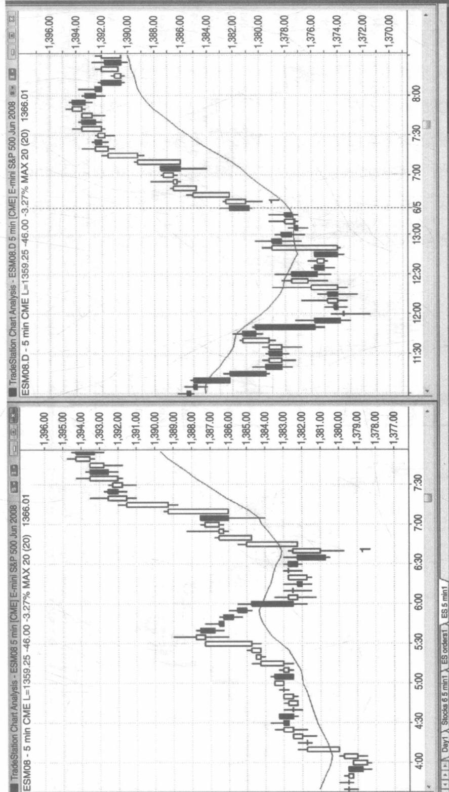
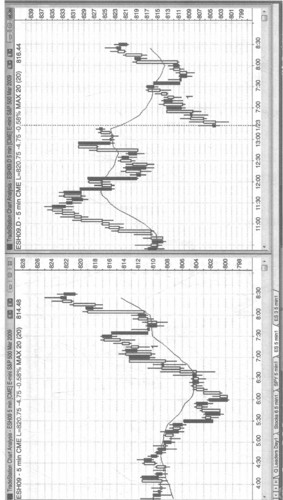

# 第 17 章与盘前相关的形态

当观察Globex电子迷你期货的分时图和成交图时，并不容易确定开盘价，因为它只是24小时交易日的一部分，且看起来与图表的其他部分并无区别。实际上，开盘时段的这根K线几乎总是包含了开盘前的价格波动。Globex的高点和低点倾向于在日盘交易时段被测试，而且Globex的许多形态都是在日盘时段的头一批K线内完成的。开盘后第一个小时左右价格通常变化非常快，仅仅日盘交易就能提供不错的价格行为以供交易员做交易分析。大多数交易员不能同时根据两张图表进行交易，特别是刚开盘时快速动荡的市场，只能在Globex图和日盘时段5分钟图中选择其一。这也是一种个人喜好的问题。一些成功的交易员喜欢盯着Globex看一整天，而我更喜欢运用日盘时段交易图。还有些交易员先观察Globex一个小时左右，然后再切换到日盘时段交易图。对于那些只运用日盘时段交易图的交易员来说，大部分以Globex图为基础的交易，都能为交易员提供价格行为的信息，让他们找到理由选择相同的交易。当你准备入场、止损、止盈时，你可能会更情愿错过一次可盈利的交易机会，也不愿意冒着亏损的风险，因为试图同一时间内快速分析两张图表很容易把自己搞晕。

市场在日盘时段跳空，并在开盘后30分钟左右回补缺口，这时Globex上显示的移动平均线往往与日盘交易图上这个时段的移动平均线的方向是相反的。例如，如果价格跳空低开，日盘时段的移动平均线将会向下走，但如果此时在Globex上形成一个更低的低点，而且市场在开盘前30分钟内一直反弹向上，那么Globex的移动平均线就可能往上走，其价格也会在移动平均线上方运行。如果你只看日盘时段交易图，发现行情出现一个很大的跳空缺口，并且市场开盘后强势回补这一缺口，那么你应该观察市场动能，而非移动平均线，因为动能反映了正在发生的实际价格行为。只观察日盘时段交易图的交易员必须注意，开盘后第一个小时内的移动平均线往往不能反映真实情况。

如图 17.1 所示，Globex 和日盘时段的交易图表通常同时给出相关信号，但在图形上不大相同。左侧 Globex 图和右侧日盘时段图的 K 线 1 的时间都是太平洋标准时间上午 6:35。Globex 出现了一个最终旗形反转买入信号，而日盘时段图则出现了一个阴线反转形态，这是双波段涨至昨日收盘价之上的一次突破回调。记住，如果当天的第一根 K 线是呈趋势性走势，那么它往往是一个可以刮头皮交易的入场形态。如果趋势被破坏，甚至走出反向趋势，那么它则是一个反向交易的入场机会。

在 Globex 图上，K 线 1 位于下降移动平均线下方，但在日盘时段图上，K 线 1 位于移动平均线之上。两张图的移动平均线呈现同一形态可能需要一两个小时的时间，但它们各自能够提供不同但却同样有效的入场形态。然而，同时观察两张图表并不能给大多数交易员带来什么好处，这么做反而不能保证交易员进行快速的交易，而且容易在交易过程中出错。

当市场出现巨大的跳空缺口时，有时日盘交易时段的移动平均线在头 30 分钟内并没有什么帮助。如图 17.2 所示，右侧图中的行情在日盘时间跳空低开，市场在 90 多分钟的时间里都未能向上超越下降的移动平均线。然而，左侧图中 Globex 的反弹（几乎 24 小时全天交易）启动于开盘前 30 分钟，市场从太平洋标准时间上午 6:30 开始向上突破上升的移动平均线，并一直保持在其上方，显现出高涨的看涨情绪。上午 7:20K 线 1 的铁丝网型入场形态位于移动平均线上方，在 Globex 中同样呈现看涨态势，但在日盘时段价格却低于移动平均线。不过，这两张图所表现的上行动能都很强劲，所以交易员们应该积极寻找买入点。

  
图17.1 Globex和日盘交易时段通常给出相关信号

高级反转技术分析
价格行为交易系统之反转分析（下册）  

