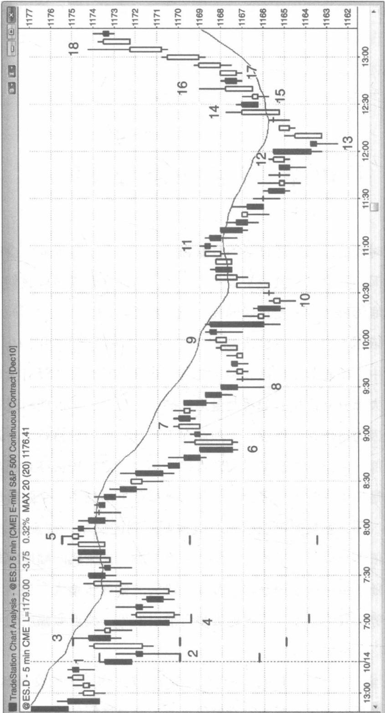
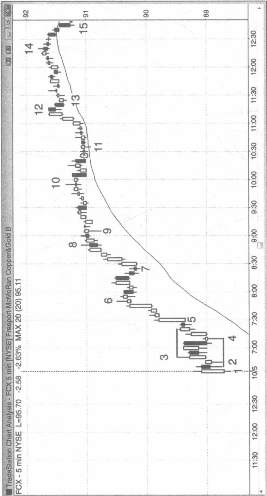
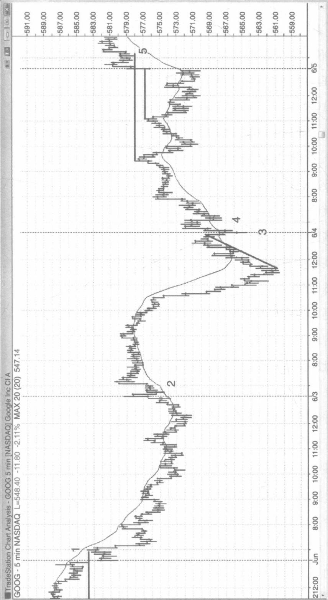
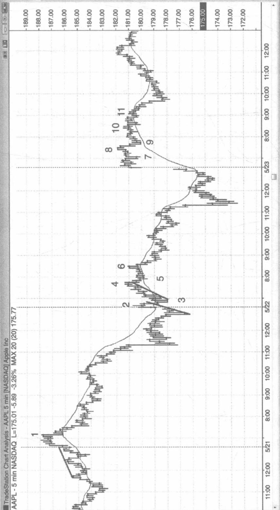
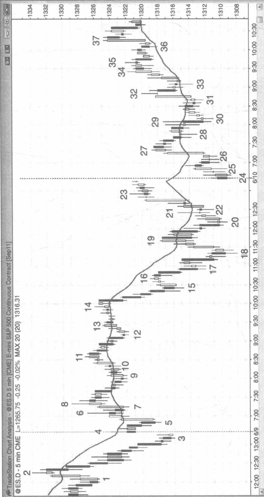
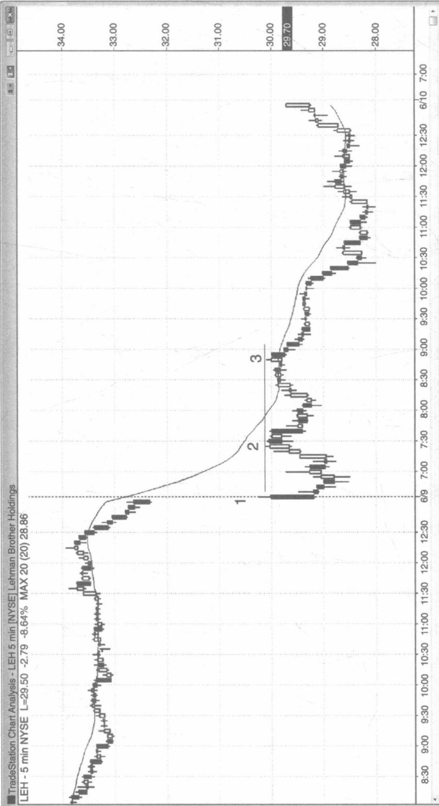
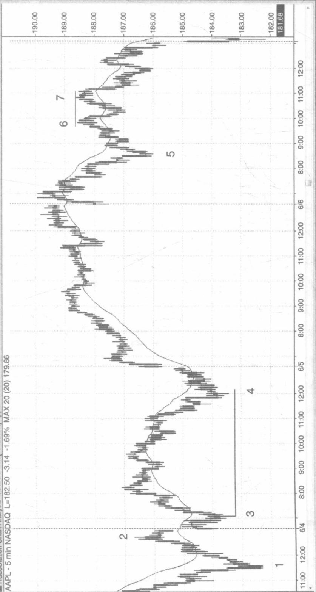
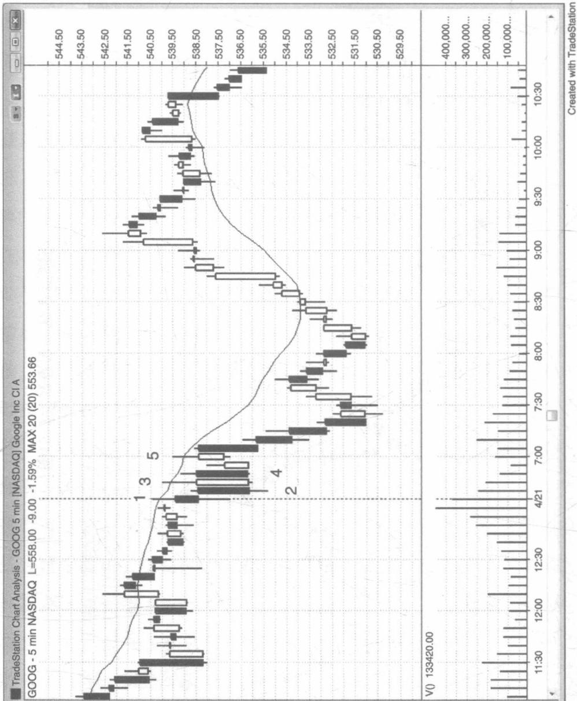
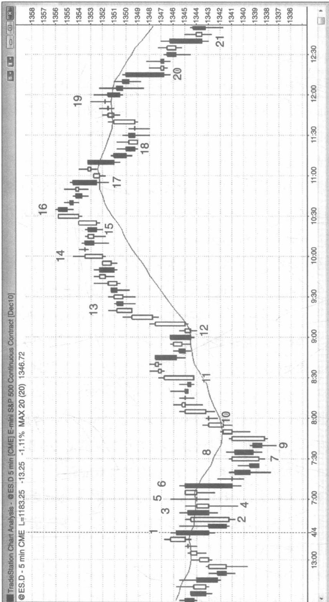

# 第 19 章开盘形态与反转

当开盘时段的波幅为近日平均日振幅的一半左右，市场通常会突破这一开盘区间，并尝试把波幅扩大将近一倍。有时在开盘时段我们有很多选择。到底哪种选择才是正确的呢？他们都是正确的，因为不同类型的交易员会依据不同的开盘情况制定不同的交易决策，但如图19.1所示的交易日中，图表对于应该获利了结甚至应该反转交易并没有给出精确的指导。大部分支撑位，如可测量运动的投影位置，都没能引发行情反转，这是因为市场存在惯性，强烈倾向于延续之前的价格行为。这也就意味着大部分的反转尝试都以失败告终。不过，当市场最终真正出现反转时，总是发生在某个支撑位上。如果支撑位上出现了一个强势的反转入场形态，那么就更有可能引出一笔盈利可观的交易。截至K线5，当天的波幅依然只有近日平均日振幅的一半左右，扩大区间幅度的概率显著提高。随着每一次新的反转，开盘时段的波幅逐步增大，但跌至K线6的抛售势头较为强烈，这次突破很可能引发另一波近似幅度的可测量下跌行情。

当天行情呈趋势型震荡，并在收盘前突破回到上方的交易区间，这种情况很常见。这里，当天收盘价位于上方交易区间的顶部附近，使

  
图19.1 突破小型开盘区间后的测量运动

得当天成为一个反转交易日。大部分反转交易日都以趋势型震荡行情为开端。如果交易员们明白这一点，当价格从下方交易区间的底部反转向上时，他们就可以伺机将他们的部分头寸波段化操作。

开盘后第一个小时内的反转只有25%左右的概率能形成波段，因此最好是先进行刮头皮交易，直到出现双重底或双重顶，或一个清晰的入场形态，使形成波段的可能性增加，才再考虑波段交易。今天是一个普通的交易日，开盘后的很多入场形态只适合用于刮头皮操作。K线3与K线1构成双重顶，有50%的机会成为当天高点。它也是一次移动平均线的突破回调。K线4与K线2构成双重底，有50%的机会成为当天低点。但两者都没能成为当天的最高点或最低点。一天中的最高点或最低点有九成机会出现在当天开盘后头一两个小时内，而且通常来自某种形式的双重顶或双重底。K线5与K线3构成双重顶，一个小型的楔形顶部，一根移动平均线的跳空K线，它最终成为当天高点。

当散户投资者控制了每天较大部分的成交量时，他们会根据日线图在开盘前下单，为开盘的跳空缺口与反转贡献力量。例如，如果出现一根反转阳线，交易员收盘后看到这根K线，并在下一次开盘前在其高点上方挂单买入。他们非常担心错过买入点，以至于愿意在开盘瞬间就立刻买入，即使买在那根K线高点上方也在所不惜。这常常导致市场跳空高开，以寻找足够的卖家愿意成为其交易对手方。一旦这些过于急迫的买家以虚高的价格入场时，市场就会开始下行，直到机构投资者认为当前价格合理。然后他们在此处重仓买入，把市场向上反转至新高，创造了开盘多头反转。日线图上，开盘时小规模的短暂抛售使阳线底部走出下影线，这种情况在上涨趋势的交易日里很常见。相反的情形常常发生在下跌趋势的交易日里，迫切的多头急于在开盘时离场，他们甚至愿意在当天的第一笔交易就卖出。市场常常跳空低开以寻找足够的买家。一旦他们的卖单被执行，市场就会开始上行，直到机构投资者认为当前价格可以合理卖出，这就把市场向下反转至当天新低，而当天常常成为一个下跌趋势的交易日。

如图 19.2 所示，开盘时段的波幅往往能够提供线索，告诉我们当天后续的行情将如何走向。FreeportMcMoRan（FCX）5 分钟图上的开盘时段，波幅为近日平均日振幅的四分之一左右。几根 K 线之后，当看到这段时间的波幅可能很小，大多数交易员将忽略第一根 K 线，寻找新的上升或下降尖形。只要市场跌破 K 线 3，K 线 3 则成为一个上升高潮（价格在 K 线 3 处反转向下）。一旦市场涨破 K 线 4，K 线 4 则成为一个下降尖谷（价格在 K 线 4 处反转向上）。在这种情况下，很多交易员视这两种尖形为突破型的入场形态，并在尖形顶部上方高一个价位的地方挂单买入，在尖形底部下方低一个价位的地方挂单卖出。一旦某边的订单被触发成交，另一边的订单则成为初始的保护性止损条件单。如果入场之后市场反向而行，交易员一般会把另一边的止损条件单仓位加倍，打算如果条件单被触发，则原先的头寸被平掉的同时，反向持仓。

交易员们一般可以在突破前入场。在这里举例说明，开盘大幅跳空高开（陡峭的移动平均线体现了这一点），并以一根阳线为首根K线，当天有很大机会将走出一轮上涨趋势。一旦K线4向下突破K线2双内含线形态一个价位后反转向上，很多交易员就会在K线4这一双重底上升旗形信号K线（要记住，一天中的低点往往来自某种形式的双重底）上方做多。其他交易员则在K线5越过小型内含阴线时买入，还有一些交易员则在价格向上突破K线3时买入。

当开盘时段的波幅像例子中的幅度那么窄时，区间内的回调幅度也会很窄；当当天行情发生突破并呈趋势运动时，其回调幅度依然会很窄，如此例所示。当天最后一两个小时内，通常会有一波回调，其幅度为早些时候回调幅度的两倍，比如从 K 线 14 开始的那波下跌。

  
图19.2 开盘时段的波幅很重要

在开盘后第一个小时内，交易员们常常寻找连续的两根趋势K线，当它们出现时，很多交易员就会得出市场已经形成某方格局的结论。例如，K线2处有两根连续的阳线。这两根阳线实体较短影线较长，大多数交易员在做出市场呈多头态势的判断之前，需要收集更多的判断依据。K线4后面出现了两根阳线。在这种情况下，很多交易员认为市场主要趋势向上，他们开始波段性做多，并把止损单设置在双K线高潮的底部下方。K线5是一根强势突破的阳线，进一步表明当天是一个上涨趋势交易日，随之而来的几根阳线更是为这一结论提供了更多证据。请注意在K线4前面有三根阴线，每根阴线后面都紧跟着一根阳线。空头未能持续不断地卖出，这意味着空头力量相对薄弱。多头把每一根阴线都看作买入机会，而非做空的入场形态，这种现象强有力地表明市场很可能走高，尤其在当天大幅跳空高开的交易日里。

如图 19.3 所示，谷歌（GOOG）在这四天的开盘时段都出现了几次突破回调。K 线 1 是一个低点 2 做空信号，位于陡峭的移动平均线处，它回补了昨天低点下方 6 美分的缺口，构建出一个反转向下的形态，并形成当天高点。

行情向上突破昨天波段高点后，K线2回调至移动平均线。双内含阳线结构构成做多入场形态。K线2后面的那根K线与当天第一根K线组成双重顶，并形成当天高点。

行情反弹至前一天收盘，画出一条上涨趋势线，该上涨趋势线被向下突破，在K线3处又反转向上（形成一次失败的突破）。K线4形成一个更高的低点，并与 K 线 3 组成一个近似的双重底。

图19.3 开盘时段的突破回调  
  
TradeStation Chart Analysis - GOOG 5 min [NASDAQ] Google Inc CIA
GOOG - 5 min NASDAQ L=548.40 -11.80 -2.11% MAX 20 (20) 547.14

K 线 5 是一个高点 2 双重底上升旗形（第一个底部位于两根 K 线之前），也是价格向上突破昨天高点后的首次回调。这种现象可能使当天成为一个开盘时段就启动趋势的交易日。

如图 19.4 所示，苹果（AAPL）在这三天的开盘时段发生了几次失败的突破，并导致开盘反转。行情开盘反转，击穿趋势通道线后，在 K 线 1 形成二次入场机会（低点 2）。

前一天最后一小时，行情反复震荡，临收盘前价格一路向下，形成一波小规模的下跌趋势，当天开盘后行情向上突破（失败的突破）前一天的震荡区间及下跌趋势线（未画出），直到K线2处反转向下。然后市场又在移动平均线处反转向上，形成了K线3更高的低点，这里也是一次突破回调。

当天更高的高点出现后，行情尚未形成一轮新的上涨趋势，K线4在此处反转向下，成为一个不错的做空形态。这里还形成了一个楔形，并且在开盘跳空高开后成为通道顶部。

行情在 K 线 5 处向下突破上升通道后，在 K 线 6 形成一个次高点最终旗形，并反转向下。交易员们预期价格将回踩 K 线 3 的通道底部。

今天行情开盘大幅向上跳空，K线7是一个高点2突破回调形态，随后在K线8形成一个更高的高点，并发生最终旗形突破，但市场又在K线8处反转向下。由于这个点位上新一轮上涨趋势尚未成型，因此这里也是一个不错的做空形态。

K 线 9 走出新低，其势头强劲，很可能引发第二回合的下降波段。开盘跳空向上形成高潮，从 K 线 8 跌至 K 线 9 形成尖谷。这种高潮反转形态，后面往往伴随着一段震荡行情。在这段震荡区间中，多空都纷纷增仓，并尝试在通道成型过程中占据主导地位。结果空头胜出，多头不得不卖掉他们的多仓，同时增大抛压。

图19.4 早期的失败突破  

行情经历两个小波段涨至 K 线 10（K 线 10 是一个低点 2 形态）并形成一个更低的高点。

基于 K 线 10 次高点后失败的高点 2 形态，K 线 11 是一个二次做空入场机会。多头两次试图反转更低高点所体现的看跌势头，但两次都无功而返。每当市场两次尝试均告失败时，通常市场都会反向而行。

如图 19.5 所示，K 线 4 发生强势空头反转，并在一轮强劲的下跌趋势中测试移动平均线，构建出一个突破回调做空形态，并预期向下突破 K 线 1。开盘向上跳空至移动平均线就是一次回调。

从 K 线 2 到 K 线 3 的暴跌是一波尖形通道下跌趋势，K 线 4 对通道顶部附近进行测试。这种测试一般伴随着多空反复拉锯的价格行为。另外，跳空缺口向上突破了昨天最后一小时那根陡峭的下跌趋势线，而多头等待着一次突破回调的做多入场形态。当多空双方的看涨看跌理由都相对充分时，市场就存在不确定性，这种不确定性通常意味着行情将进入一段震荡区间，正如此例所示。

K 线 5 不是一根反转 K 线，而是继向上突破昨天下降通道后的一次突破回调，一个高点 2 形态的变形（K 线 4 阴线后走出一根阳线，然后形成第二个小波段，并跌至 K 线 5）。自昨天的抛售高潮收盘后，这里很可能形成一个更高的低点，并在高潮（收盘前的暴跌几乎没有像样的回调，这种情况很难持久，因此是一波高潮行情）后走出一个双波段的反向运动。K 线 5 后面的阳线，K 线 5，K 线 5 前面的阴线，以及跌至 K 线 4 的运动，一同构成一次双 K 线反转。记住，暴跌之后紧跟着暴涨，比如 K 线 5 后面的这根大阳线，实际上是一种抛售高潮，在更

图19.5 向下跳空和向上跳空都能引发开盘反弹  

大级别的时间周期图表上显示为双 K 线反转甚至单阳线反转。

行情从 K 线 5 这一次高点以双波段形式涨至 K 线 8，并在此处形成楔形顶部。

这天是一个趋势型的震荡交易日，从 K 线 20 启动的向上反弹测试了早前上方震荡区间的底部。

K 线 24 是一个双重底上升旗形。第一个底部位于 K 线 20 或 K 线 18 低点后面的内含信号 K 线。从 K 线 18 到 K 线 23，行情经历了大型的双波段下降旗形，并在 K 线 24 处突破失败，回踩了昨天低点后反转向上。

K 线 25 是当天前 30 分钟里一根强势的外包阳线，交易员们认为当前的格局有可能由空转多。他们希望任何回调都能保持在 K 线 25 低点上方，当 K 线 26 向上翻转时，他们认为当天的低点很可能已经成型。

K 线 26 形成了一个更高的低点，并引出一次对双内含线的突破。双内含线形态的第二根 K 线强势收在最高位，增加了行情的上行概率。它同时也是下降旗形中一个失败的低点 2 形态，看到开盘大幅跳空低开，并在二次入场机会（低点 2 跳空回调）做空的空头，全被套在这里。这里是一个小型的最终下降旗形。它是行情试图跌破昨天低点后的二次反转尝试，这次反转尝试，也回补了开盘跳空低开的缺口，而开盘后的这一缺口，正好跳过了昨天收盘前的双波段下降旗形。

大规模的向下跳空常常会引起回调至移动平均线的双波段回调，然后突破进入一轮下跌趋势，如图 19.6 所示。

这天开盘大幅跳空低开后，K线2和K线3组成了双重顶下降旗形（以跳空缺口为旗杆），并与K线1组成三角形（三个顶部，是一个收敛的三角形形态）。

  
图19.6 开盘跳空后的双波段回调

K 线 3 为双 K 线反转的第一根 K 线，一个低点 2 做空信号。在 K 线 3 后面那根阴线下方做空，要比在 K 线 3 这根阳线下方做空更安全，因为市场有可能开始调整，然后再次尝试向上突破 K 线 1 和 K 线 2 组成的双重顶。在震荡区间顶部的某根阴线下方做空，要比在某根阳线下方做空更可靠。

虽然大多数交易员都认为开盘时段仅维持一两个小时，但市场往往在太平洋标准时间上午8：30左右启动一轮趋势，如图所示。无论我们把K线3双重顶看作开盘反转形态，抑或仅仅是一个普通的双重顶都没有关系。重要的是，新一轮趋势的启动或反转都发生在上午8：30左右。

如图 19.7 所示，双重底上升旗形和双重顶下降旗形都很常见。行情反弹至 K 线 2 后，K 线 3 与 K 线 4 组成了一个大型的双重底上升旗形。行情下滑至 K 线 5 后，K 线 6 与 K 线 7 组成了一个大型的双重顶下降旗形。

当市场尝试两次向上突破都以失败告终时，接下来通常都会尝试向下突破价格底部。如图 19.8 所示，GOOG 在一段小型的震荡区间里进行调整，一直等到太平洋标准时间上午 7:00 报告发布才进入突破模式。这个收敛的震荡区间拥有三个顶部，构成一个三角形。交易员可以在震荡区间底部下方挂条件单，但在 K 线 5 下方这一低点 2 处做空风险更小。由于 K 线 3 和 K 线 5 为两个上升小波段，因此这里是一个低点 2 的入场形态。如图所示，在这个点位上当天的行情呈震荡态势，高点 2 和低点 2 并存。高点 2 做多形态失败，变成低点 2 做空形态。行情在移动平均线下方反复震荡，形成一个下降旗形，并很可能突破下行。

K 线 2 是连续的第二根阴线，两根阴线都很长，而且上下影线较

TradeStation Chart Analysis - AAPL 5 min [NASDAQ] Apple Inc
AAPL - 5 min NASDAQ L=182.50 -3.14 -1.69% MAX 20 (20) 179.86  
  
图19.7 双重底和双重顶旗形

图19.8 两次尝试失败然后开始反转

短。这使得交易员们认为空头格局已现，任何回调都构成一个做空的入场形态，且至少能创造出一个不错的刮头皮交易机会。K线5下方的低点2做空信号就是第一个不错的机会，连续的大阴线表明大多数交易员认为这波下跌的幅度足以做一次波段交易，而非仅仅一次刮头皮操作之后行情就向上反转。K线5与K线3组成一个双重顶，并引出一个做空波段。

无论交易员把这个双重底看作开盘反转形态，还是认为这种形态发生得太晚以至于不应该把它纳入开盘时段的一部分，这些都不重要。不过，交易员需要注意，市场往往在太平洋标准时间上午8：30左右开始反转，在这个时间段应该时刻准备进行交易。

如图 19.9 所示，有些交易日开盘时移动平均线较为平缓，大 K 线反复震荡，没有可靠的入场形态（顶部或底部附近没有小 K 线，不能设置反手交易）。这种铁丝网行情应该以铁丝网行情的方式进行交易，它需要耐心。等待一方被趋势 K 线的突破套住，然后伺机在突破口处反手交易。试图突破铁丝网的尝试通常都以失败告终，铁丝网一般成为一种最终旗形。例子中的突破跌破了昨天低点。市场往往在对前一天高点或低点的突破口处反转。这种倾向增加了铁丝网成为最终旗形的概率。该形态拥有三次上推，并持续整理。有些交易员把它看作三角形，如果只看 K 线的实体而忽略影线部分，则更容易看出来。

突破了铁丝网底部后，行情在 K 线 7 处反转向上，但这之前经历了四根阴线。这种空头力量足以让交易员们耐心等待二次买入信号。尽管有些交易员把它看作高点 2，其中高点 1 为 K 线 6 的高点，但 K 线 6 是一根强势下行外包阴线，大多数交易员把它看作下跌运动的起点。这种 K 线会让交易员们认为市场可能已经突破震荡区间，并进入一轮新的趋

高级反转技术分析
价格行为交易系统之反转分析（下册）  
  
图19.9 开盘时段的铁丝网行情

势，他们预期在这根强势下行套住多头的外包线后，至少将走出第二回合的下降小波段。这使得大多数交易员把K线7看作高点1，毕竟下跌运动启动于K线6顶部，而非K线5顶部。

K 线 7 突破了小级别的下跌趋势线，K 线 9 深度回踩走出一个更低的低点，并形成了突破回调做多入场形态。K 线 9 收于其中点之上，满足了对反转 K 线的最低要求。在这个价位上，价格行为很可能出现双向反复拉锯，行情不断反转，很多显著的影线，因此在当天新低的位置出现二次做多机会，甚至不需要存在反转 K 线。

在 K 线 9 上方的多头第二次尝试反转早前的当天低点以及昨天低点。然后市场趋势往上，穿过开盘区间的另一边，并在 K 线 12 处给出一个高点 2 突破回调的做多入场形态。K 线 12 是一根在移动平均线上的反转阳线，也是一个在上升旗形末端强有力的买入信号。对于很多交易员来说，市场在 K 线 9 后面的那根阳线上已经进入多头格局，当价格强势向上突破 K 线 10，以及 K 线 11 这根强阳线突破高点 2 买入形态时，其他交易员也被市场说服，认为多头态势已经成型。

