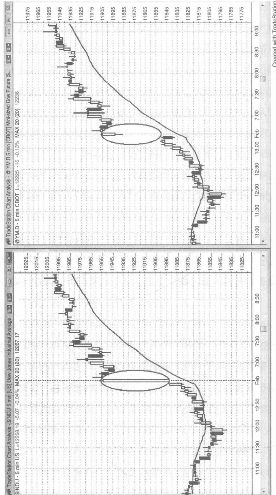
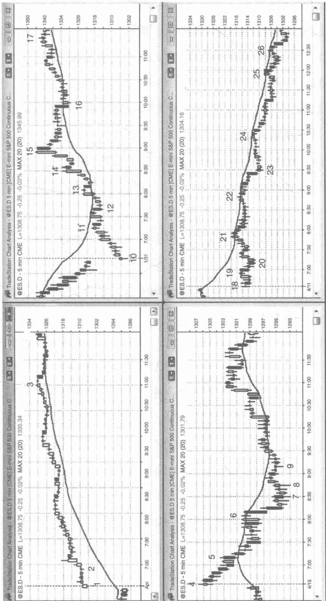

# 第 20 章开盘跳空：反转与持续整理

任何时间周期的开盘跳空都意味着一旦这根K线结束了，它就不会与前一根K线产生重叠。在大部分交易日里，5分钟图上都有开盘跳空的现象。我们可以把它简单看作对前一天最后一根K线的突破。交易员们应该将它与其他突破形态一样对待，除非他们知道这些大型的跳空缺口增加了当天行情呈趋势性波动的概率。跳空缺口越大，当天越有可能成为趋势交易日，跳空缺口所产生的影响就越接近尖形，而且伴随着与跳空同一方向的趋势通道。例如，大幅跳空高开，后续行情可能有 $50\%$ 的机会走出一条上升通道， $20\%$ 为震荡区间，剩下 $30\%$ 的机会走出一波下跌趋势。这些概率只是一个经验之谈，而利用计算机来得出精确的数据，容易受太多变量影响。那么，跳空缺口要多大才能称为大幅或大型呢？跳空高开后多大幅度的反弹才足以构成一条通道，而不仅仅是略微向上倾斜的震荡区间？下跌多大幅度才足以构成一次反转而不只是深度回调？同样来自主观判断的还有另外一个观点，如果该缺口是过去五天中最大的跳空缺口，或者它的幅度大于平均日振幅的一半，我们也可以称之为大型跳空缺口。

5 分钟图上与昨天收盘价之间的开盘跳空缺口代表着市场的极端情绪，且往往预示着当天将是一个任意方向上呈趋势性波动的交易日。日线图上是否也出现跳空缺口并不重要，因为交易模式是一样的。唯一重要的是市场如何响应这种相对极端的行为——市场会接受还是拒绝？跳空缺口越大，就越有可能成为趋势交易日的起点。在当天头几根K线中，趋势K线的规模、方向及数量常常预示着随后很可能形成的趋势方向。有时候市场从开盘时的一两根K线就启动趋势，但更常见的情况是价格先测试相反方向，然后反转步入正轨，沿着正确的趋势方向持续波动一整天。每天你看到开盘出现一个大型跳空缺口时，假定当天行情将呈现强劲的趋势走势才是明智之举。不过，有时趋势的启动需要耗费一个小时的时间，而且往往在一轮双波段反向运动后才开始显现，比如双波段回调至移动平均线或双重底、双重顶。有时行情还会出现第三推，形成一个楔形旗形。即使在好几次交易中你的波段化头寸都被震仓出局，也一定要确保每次交易时都将部分头寸波段化。一笔不错的波段交易，其盈利抵得上10次刮头皮交易，除非有迹象表明行情不再呈现趋势性波动，否则不要放弃波段交易。

跳空缺口可以看作是一根大型的隐形趋势 K 线。举例而言，如果开盘大幅跳空高开，随后小幅回调，当天剩下的时间走出一条反弹通道，那么这很可能是一轮跳空高潮通道上涨趋势，而这个缺口，就是一个高潮。对于电子迷你期货而言，你可以观察一下标普现金指数，当天第一根 K 线是一根大型的趋势 K 线，它就对应着电子迷你期货图表上的一个跳空缺口。

对待跳空的开盘，应该和对待任何其他情形的开盘一样，一视同仁，寻找开盘启动的趋势、失败的突破（即行情反转），或突破回调。唯一和其他情形不一样的是，你应该更加积极地寻求波段交易的机会；

如果当天趋势确立，那么就在行情回调时加仓。在交易过程中，你要一直做好将部分头寸获利平仓的准备，这种情况也可能是刮头皮操作，但只要趋势足够强劲，就应该伺机沿着趋势方向捕捉更多的入场机会。

开盘跳空只是增加了当天呈趋势性波动的概率，但并不意味着当天就真的能走出一轮趋势行情。大部分跳空开盘的交易日在头五到十根K线的时间里，行情都有反复震荡的表现，而多空双方为了引领市场方向在这里一决高下，导致这种情况有时候甚至持续一整天。这时应该发散思维，考虑所有的可能性，不要墨守成规，让自己局限于一种观点之中。你的交易应该跟着市场走。你没有能力去左右市场，当然也不可能依靠意念去推动市场，使之朝着你所希望的方向运动。如果你看错了方向，坚决离场，不要指望市场会发生低概率的变化，并突然顺着你的持仓方向波动。如果行情出现一个大的跳空缺口，但价格行为依然不明晰，就假设市场正形成一个震荡区间，你在其中伺机低买高卖。在出现波段操作的良好入场形态之前，你也许可以捕捉到几次刮头皮的交易机会。

如图 20.1 所示，5 分钟图的开盘跳空，只是另外一种形态的突破和飙升。在右侧图表中，道琼斯指数期货合约开盘跳空高开，但这个缺口在左侧的道琼斯工业平均现金指数图上只是一根大型的阳线。

大规模的开盘跳空增加了当天呈趋势性走势的概率（这种趋势可能向上也可能向下），但它依然有可能成为一个反复振荡的交易日。如图20.2的右下图所示，在开盘大型跳空后，从K线18到K线22的震荡走势就是一个数小时呈现横盘整理态势的例子。

跳空缺口越大，当天就越有可能沿着跳空的方向呈趋势性走势。例如，左上图中的K线1就是一个大型的向上跳空缺口，而当天就成为一

  
图20.2 开盘跳空可能引发一波趋势

个上涨趋势的交易日。

左侧的两幅图展示了开盘大规模向上跳空；左上图为上涨趋势，左下图为下跌趋势。右侧的两幅图为开盘大规模向下跳空；右上图为上涨趋势，右下图为下跌趋势。

开盘大幅跳空高开，K线1是一根阳线。趋势启动于开盘时段，当天成为一个跳空高潮通道上涨趋势交易日。

K 线 4 是一根十字星小阳线。市场在接下来的一两个小时里趋势下跌。一路跌至 K 线 7 这一当天最低点，过程中产生很多显著的上下影线，很多反复振荡的 K 线，几根阳线，这些现象都表明多空双方的胶着态势。多头持续不断地制造买压，以至于在当天后半程占据市场主导地位。

开盘大幅跳空低开，K线10是一根阳线，趋势启动于开盘时段，当天成为一个上涨趋势交易日。

开盘大幅跳空低开，K线18是一根十字星。市场继续横盘整理直到突破下行至K线23这根阴线。开盘十字星是一个双向震荡的信号，震荡行情一直持续了几个小时。经过一轮急跌后，市场呈下跌趋势，行情在K线24、25和26处测试移动平均线，空头以绝对优势压倒了多头。虽然空头在K线21和22处对移动平均线的测试表现较为强势，但却未足以令市场突破震荡区间，并转向趋势下跌。

当开盘出现大幅向上或向下跳空且没有强势反转时，盈亏方程式对于顺势交易的交易员来说较为乐观。例如，当市场在K线1处大幅跳空高开，然后进入横盘整理，当天行情呈趋势上涨的概率大大增加，可能达到60%以上。交易员们预期当天的价格波动区间可能达到最近几天的平时振幅，在20个点左右。在回补缺口之前市场继续走高20个点的概率很可能在 $60\%$ 以上，在前几根K线买入的交易员冒着亏损10个点的风险博取15到20个点的利润，他们有 $60\%$ 的胜率，这是一笔不错的交易。价格波动很可能只回补一半的缺口，因此他们所承担的风险只有6个点而非10个点。不论哪种情况，这种可观的风险回报比有较高的胜率，而这正是开盘大幅跳空行情能够提供良好交易机会的原因。

价格行为本质上是人性的表现，因此是有科学依据的。无论交易员研究的是什么市场、什么时间周期、什么类型的价格图表，都不影响价格行为理论的应用。因为所有这些市场的价格变化都是我们人类这一物种的行为表现。本书的第四部分将用具体的例子对价格行为理论在不同时间周期、不同市场的表现进行阐述，包括期权市场。同时，第四部分还将讨论什么样的交易机会是最值得交易员把握的，尤其是刚刚开始交易还没能实现稳定盈利的新手。最后，本部分还将总结一些重要的交易原则，指导交易员如何决定他们应该采取哪一类交易，以及如何管理他们的交易。

