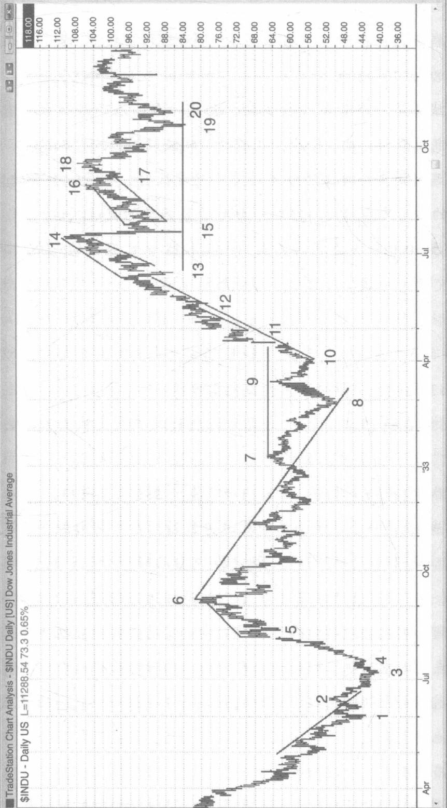
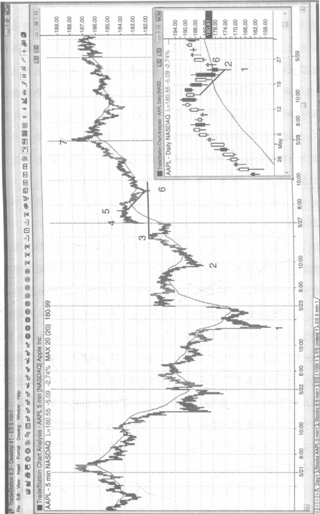
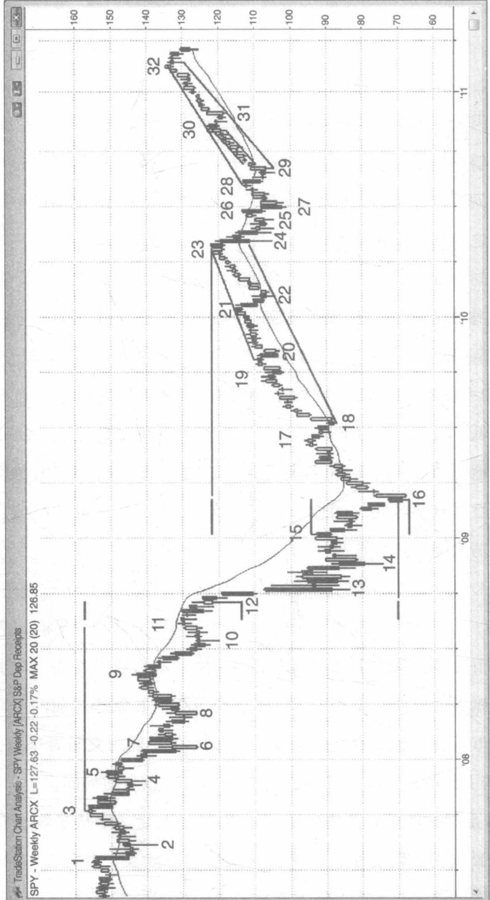
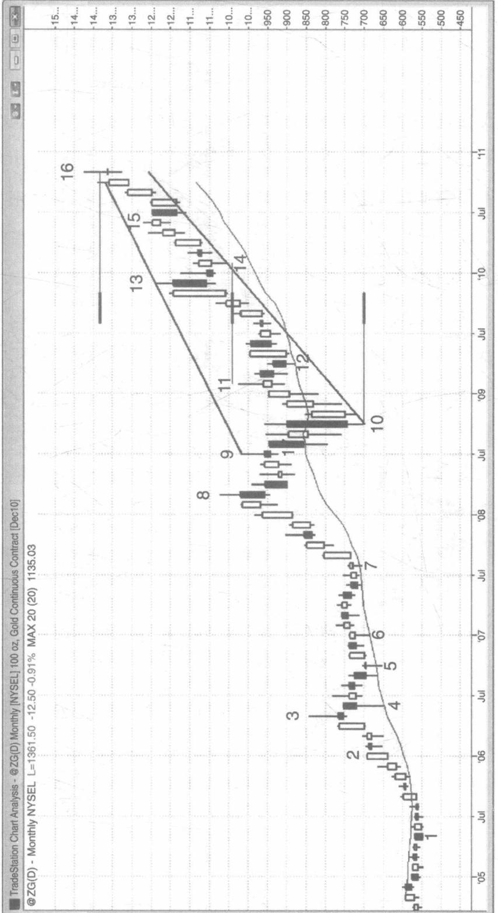
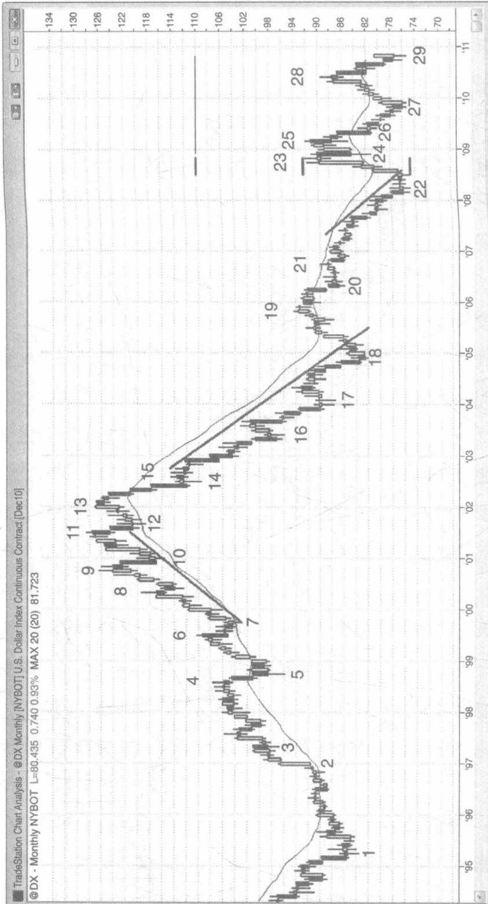
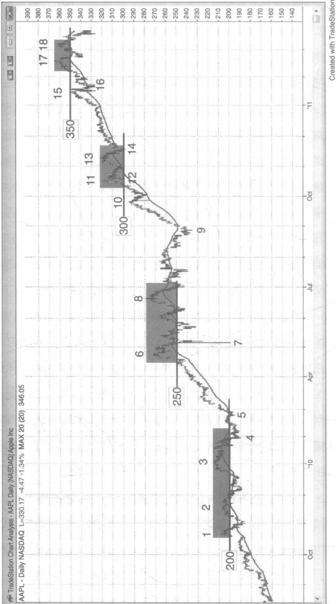
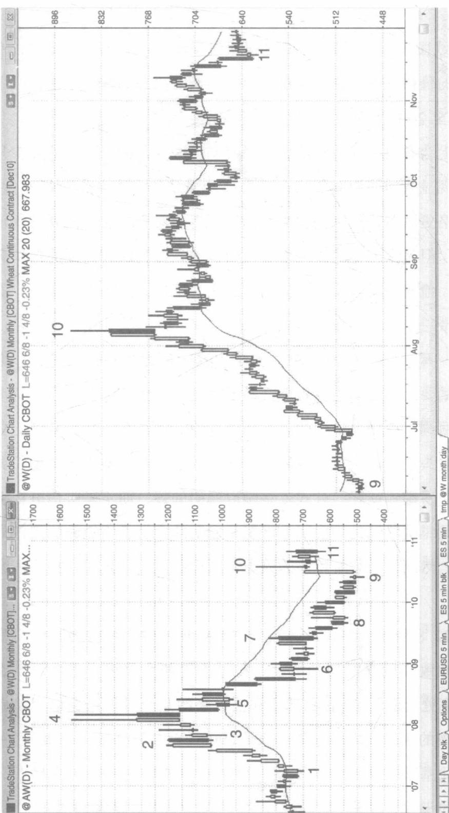
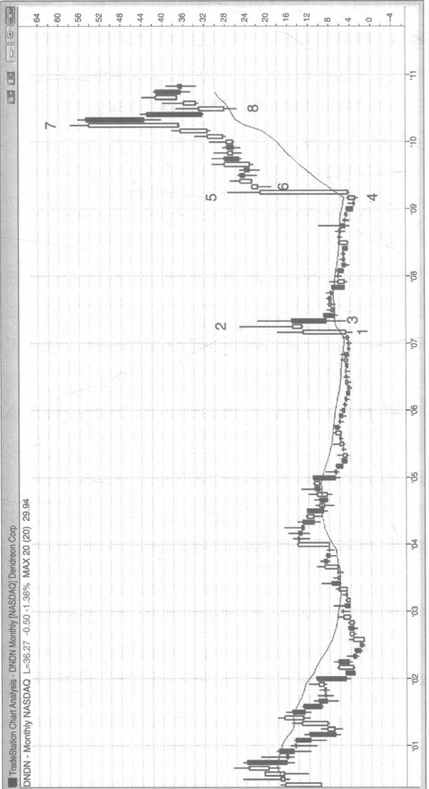

# 第 22 章日线、周线和月线图

虽然日线图、周线图和月线图都可以看到日内的信号，但是这些信号发生的频率非常低，对于做日内交易的交易者来说并不是一个值得被参考的信号。最普通的信号一般是基于昨天的高点和低点得出的，而这些信号可以用5分钟的图表看到。当然，在更长的时间图上会更经常地出现基于价格行为的交易信号，但是因为这些长周期的K线主体都很大，所以如果风险和日内交易相同的话，那么能够交易的合约数将更少。此外，如果隔夜的话，也意味着你应该更大幅度地减少你交易的合约数量，或者考虑风险有限的期权策略，比如说买入期权策略和期权套利策略。日内交易者只有在不进行日内交易的时候才应该使用这些图表，因为通过日线图进行的交易合约和股票更少，所以用这些成交量大的K线很容易错失日内交易时机，而这些错失的时机造成的损失会远远高于他们从日线图上的信号得到的收益。

虽然所有的股票价格走势都能形成标准的价格行为模式，但是机构持仓较少的小型公司的股票往往有很大的极端涨跌风险。他们往往会表现出更大的波动性，在股市的专业术语中，这些股票被称作是高 $\beta$ 的股票。比如，你肯定不会期待沃尔玛的股票在一个月内上涨 1000%，但是当一家小型药物公司的药物获得食品和药物管理局（FDA）批准，或者成为接管候选人时，这种情况是很有可能会发生的。有一些交易者会喜欢市场上出现的大而快的移动，但是大部分交易者还是倾向于避免这种风险，不论市场是朝哪个方向移动，他们尽量避免交易中会出现不能交易的订单。交易这种特殊的股票要求交易者时刻盯盘，这使得他们不能在相同的时间交易其他的股票。因为此类股票的风险很大，他们只能交易他们的投资组合中的一小部分，这一小部分股票因为剧烈波动产生的收益也不足以完全抵消放弃交易其他股票带来的损失。当股市的不确定性增加时，大部分的交易者都不应该去交易这些股票。

当与强劲的市场趋势进行相反的交易时，你交易的目标应该是进行1%或2%的刮头皮交易，因为大部分的趋势反转最终都会失败，演变成趋势通道的回调入场机会。市场上出现的跳空使得入场信号变得更加复杂，一般来说，如果开盘价在昨天的价格波动区间内，且入场之后价格波动范围不会突破这一区间超过一个点，那么入场后整体的风险就比较小。如果你不能在盘中盯盘，并且市场上出现了一个跳空开盘，那么这时你最好平仓。如果你在盘中是可以实时盯盘的，市场出现了一个跳空开盘，那么你可以等待市场出现一个跳空的缺口回补，一旦市场没有能够回补缺口，而是继续朝着跳空的方向发展，那么这是一个很好的入场机会。用更通俗的话说，如果你正在寻找买入时机，但是今天是一个向上跳空开盘，那么你应该在开盘后寻找市场的回调机会，当市场开始出现反转尝试且失败的时候马上买入，并且把你的止损位设置在当时触及的最低点下方。如果这个入场信号失败了，价格触及了你的止损，那么你要寻找别的交易方法了，或者当市场出现第二次入场通道时再尝试一次。不要把太多的时间和精力浪费在那些价格走势没有按照你的预期去发展的股票上，因为太过于执着这些股票你会亏本。在相同的股票上亏损之后，想再用这只股票回本是人的本性，但是你要知道这也是你在情感上天然的弱势。如果你还是想证明你是对的，证明你是一个非常善于读懂图表的人，尽管在这一点上我承认你很有可能是对的，但你不是一个好的交易者。好的交易者会接受他们的损失，然后继续向前看，继续进行交易。

在日线图上的回调很少会有经典的反转 K 线，相比于用 5 分钟 K 线图进行交易的交易者来说，用日线图交易的交易者面临着更多的不确定性。不确定性就意味着风险，当市场上的风险更多时，交易者应该持有更少的头寸，他们可以考虑先持有一部分头寸，当市场上出现的价格行为开始时，再逐步增多头寸。在牛市出现回调的情况下，当市场向下逐步回调时你可以逐步以更低的价格增加买入头寸，此时空头还没有证明自己已经掌握了市场。当然你也可以当市场恢复上涨以后再以更高的价格逐步增加头寸，也可以在市场出现小型的回调，且形成了一个高于你的初始入场价格的更高的低点时再增加头寸。

当你在一天结束时回顾日 K 线图时，可以看到很多第二天可以参考的入场时机。一旦这些入场信号出现，市场通常会出现一个日内趋势，这可以提供给你许多进行 5 分钟的趋势交易时机。如果这只股票不是你经常进行盘中交易的股票，但是它的成交量高于 500 万股，那么你可以考虑暂时将这只股票放入你的交易组合中一两天。有时候，却有例外，即使是流动性非常好的股票，比如原油服务持有人股票（OIH），你的证券经纪商也可能会出现没有存量券可以让你卖空，从而使得你只能买入。但如果你非常想要卖空，你可以买一个卖出期权代替，即使只是短暂地为了进行一天的交易。

由于一些价格整数关口如同磁铁一般具有吸力，所以交易者可以利用这一特点进行交易。举个例子，如果 Freeport-McMoRan（FCX）在过去的几个月里上涨了 20%，现在的成交价格是 93 元，许多交易者将会认为它可以上涨到 100 元。基于此，空头不会积极做空，因为他们相信他们很快就能以一个更好的价格做空，而多头会积极做多因为他们认为基于市场的惯性市场还会上涨。空头暂时的离场使得市场出现了真空效应，这导致股票以更快的速度到达这个磁铁一般的整数关口处。通常在出现回调以前，市场会超过这个数字 5% 或 10%，市场通常会在找到未来的走向之前，在这个数字的基础上至少再回调一次。多头可以在市场反弹进入这个整数关口的区域时买入，之后在这个数字上方卖出获利，而空头则可以等到市场高于这个数字再卖空，当市场下跌时再买入获利。当然，多头有时候也会在市场下跌时再次买入进行短线交易。

价格行为形成主要是因为大量的交易者因为各种原因独立决策交易行为，但是又有着相同的赚钱目的而形成的。基于此，它的指标一直是保持不变的，并且会为那些经常阅读它的人带来可靠的分析工具。图22.1是在1932年和1933年的道琼斯工业平均指数的日图表，在任何时间图上，它都看起来像今天的某些股票的交易图。

\- K线2是一个打破了趋势线的低点2。

\- K线3是一个小型的最终旗形反转，也是在市场的趋势线被突破后对于K线1的一个更低的低点测试（趋势线被突破，然后出现一个测试，市场很可能会出现主要趋势的反转）。

\- K线4是一个突破性回调以及一个小型的更高的低点。

\- K线5是在这波强劲的牛市趋势中出现的第一波回调以及形成

  
图22.1 价格行为一直并没有改变

了一个高点2。

\- K线6是在牛市旗形后出现的一个楔形通道，带来了两波下跌至K线8的大的下跌潮。

\- K线7是一个趋势线的突破，也是一个两浪下跌模式。它是对大型的牛市旗形的突破，K线5之前的下跌浪是第一波下跌浪。

\- K线8是一个更低的低点的主要趋势反转，也是一个突破回调，一个大型的楔形牛市旗形，同时一个对于K线2的突破测试。

\- K线10是一个更高的低点，也是相对于K线9的一个回调，K线9向上突破了K线7与K线8形成的熊市通道。一个熊市通道就是一个牛市旗形。

\- 在市场之前突破了K线7和K线9形成的双重顶部熊市旗形之后，K线11是一个小型的高点2的突破回调。

\- K线12和13是在市场出现了微型的趋势线突破后出现的向上反转。

\- K线14是一个楔形，以及一个小型的最终旗形反转。

\- K线15是一个动能强劲的反趋势移动，在市场通过一波反弹测试了K线14的高点之后，这个点也很有可能会被测试。K线15与K线13形成了一个双重底部的牛市旗形，但是因为它下跌幅度如此之深，以至于市场很可能会跳到始终做空的方向。交易者将会寻找市场上一个更低的高点的做空时机，即使多头在市场上的操作使得这个时机很难出现，他们也不会在此时买入。有时候当交易者寻找一个更高的低点卖空时机时，他们也会进行买入的刮头皮短线交易，但是他们不会因为短时期的操作而改变自己长期的策略。

\- K线16是一个楔形的更低的高点，而K线17是一个相对于这

个楔形的失败的突破。

\- K线18是一个对于K线14这个牛市趋势高点的更低的高点测试，同时也是相对于这个楔形的更高的高点的回调，K线18是一个低点2的卖空入场时机。市场向下突破这个楔形失败了，而随之反弹至K线18的反弹潮是从楔形开始的更高的高点的突破回调。其他交易者仅仅会把这个楔形看作是在K线16处结束的那个楔形更好的楔形。K线18也是一个对于K线14这根低点信号K线的突破测试。

\- K线19测试了K线15的低点，同时也是一个双重底部熊市旗形。

\- K线20是在反转上升浪中出现的更高的低点回调。

如图 22.2 所示，当在日线图上出现了一个买入时机时，市场跳空至昨日的高点上方，在 5 分钟的 K 线图上，交易者将会等待市场出现回调时再买入。在日线图（缩略图）上，苹果的股票处于非常强劲的牛市趋势中，在 K 线 1 处第一次出现了相对于移动平均线的回调，同时也超越了熊市趋势线（在两张图上都是相同的序号）。在日线图上的 K 线 2 是一个非常强劲的日内向上反转，并且在它的高点附近收盘。交易者会比较想在日线图的 K 线 2 的高点上方一个价位处买入，也就是 5 分钟 K 线图的 K 线 3 的高点。然而，接下来的一天的跳空高于第二日的高点。相对于在一个可能的向下反转日冒着风险进行交易，交易者可能在 5 分钟的 K 线对跳空进行了回调测试后，更谨慎地看待市场的向上反转。

在5分钟的K线图表上的K线6在市场的跳空点位附近收盘，同时也是一个相对于移动平均线的跳空K线，一根超越熊市趋势K线的反

  
图22.2 跳空回调

转向上 K 线。通过在 K 线 6 的下方设置保护性止损位，将带来一个非常好的做多入场时机。这 62% 的风险又带来了几美元的收入。

如图 22.3 所示，标普 500ETF 的周 K 线看起来像是处于一个熊市反弹之中，因为从 K 线 16 至 K 线 32 的上升浪的斜率比下跌至 K 线 16 的下跌浪的斜率更平缓。当然，市场并没有超越上方震荡区间底部处 K 线 6、8、10 的低点。然而，这波反弹已经超越了 K 线 16 之前的下跌潮太多，所以之前那波下跌潮的影响已经不大了，因此市场变成了一个巨大的震荡区间。如果它是一个熊市反弹，那么它应该最终测试了 K 线 16 的低点。多头希望市场会继续走高，超越从 K 线 3 处开始的下跌潮中形成的震荡高点，并最终创造新高。空头希望市场会在 K 线 21、22、23、27 和 32 处的扩展三角形处失败，然后向下突破三角形的底部 K 线 27，并形成低于 K 线 16 的新低点。因为市场的反弹如此之大，所以这个图表更多地变成了一个巨大的震荡区间，也失去了趋势方向的确定性。不确定性是震荡区间的标志，一旦市场出现了不确定性，那么它通常会处于震荡区间，正如这里所示。

市场从 K 线 3 开始下跌，并在 K 线 5、9、11 处形成更低的高点，在 K 线 6、8、10 和 12 处形成更低的低点。因为接下来很可能会出现一个强劲的熊市突破，这波下跌潮测试震荡区间的底部或者变成一个可能的大型牛市旗形的可能性比较大。许多交易者相信 K 线 6 之前的下跌潮很可能会将市场转为始终做空的局面，对于还在怀疑的交易者来说，K 线 13 之前的下跌潮进一步证实了市场会转为始终做空的局面。

K 线 14 是第二波卖空潮中的第三根 K 线，也是一个从最终的旗形开始的两根 K 线的反转尝试，但是市场又一次下跌了，并且在 K 线 15 处出现了下跌高潮。这是市场第三次出现卖空高潮，并且形成了楔形底

  
图22.3 标普500ETF的周K线

部（K线13、14和16）。这个底部刚刚好超过了基于上面的震荡区间的高度的移动可测量距离。

上升至 K 线 17 的上升浪有 12 个牛市主体，微型尾巴，对于大部分的交易来说，几个牛市主体就足够使得他们相信市场的趋势了。在市场经过了三波在 K 线 16 的低点处形成的下跌高潮和这波上升浪后，交易者认为市场至少会出现第二波上升浪，并且可能会在 K 线 16 的低点以及 K 线 15 的高点或 K 线 17 的高点处形成一波可以测量距离的上升浪。

K线23只比可移动的测量目标以及趋势通道线的顶部要高出一点点，在上面震荡区间的底部区域，K线6、8、10处，它也是一个两根K线的向下反转。市场第一个目标就是向下突破通道，这个目标的实现发生在K线24处。在K线27两根K线的反转处第二波下跌浪结束了。自K线28向下突破了从K线23处形成的两浪牛市旗形后，K线29形成了一个更高的低点的突破回调。K线28也是头肩顶形态的右肩，它是一个牛市旗形的底部肩形态，而左肩是在K线24和K线25之间形成的。在K线21和K线28之间的震荡区间也是一个头肩顶形态，其中K线21是左肩，K线23是头部，K线26和K线28形成的双重顶部是右肩。在 $80\%$ 的顶部模式中，市场会进一步突破顶部，而空头会再一次知道大部分的顶部都不过是牛市旗形。

从 K 线 29 至 K 线 32 的市场移动处于一个非常狭窄的牛市通道中，之后很容易会出现更高的价位。然而，因为整个图表都是处于大的震荡区间，大的反弹浪之后经常会跟随着大的下跌浪，所以市场很可能会修正到扩展的三角形底部 K 线 27 处，甚至会到达 K 线 16 这根熊市 K 线的低点。

K 线 16 是一波可以测量的下跌浪。大部分机构交易者会用他们认为有效的策略进行交易，这意味着交易成功的概率至少有60%。他们因此需要市场一段可以测量的移动距离来获得一个正收益的交易者方程（可以测量的移动距离意味着收益和风险一样大，而交易者的交易方程则开始变得有可能获利）。结果就是交易往往会达到目标，之后市场会出现反转或者至少暂停，因为许多公司会在此处收获小部分或者全部的收益。大部分的目标，就像所有的支撑区和阻力位一样，都很快会失败，因为要达到目标的最低要求是市场移动一段可测量的距离，大部分的公司都相信市场会足够强劲以至于超越这个距离。

如图 22.4，在 K 线 7 和 K 线 8 形成的上升浪后，黄金的月线图表处于一个楔形通道中。许多交易者会把市场最近的移动看作是第三波上升浪，而 K 线 11 和 K 线 13 是最初的两波。而有些其他的交易者会把 K 线 8 或者 9 看成是第一波上升浪。

当市场上有 5 至 10 根 K 线靠近趋势线时，市场很快会跌落趋势线的概率就很大。这使得从 K 线 10 开始的牛市趋势线倾向于下滑。因为市场刚好高于趋势通道线和可以测量的移动目标，出现两浪的下跌潮的概率将会很大。至少，市场会修正到 K 线 8 的高点下方，也有可能会修正到楔形的底部 K 线 10 处。但是不太可能会出现的是，市场会向上突破楔形顶部，并向上升一段可以测量的距离。

如图 22.5 所示，美元期货的月线图上有一些交易时机看起来是最佳交易机会。美元、瑞士法郎和日元都是避险货币，当交易者认为股市会下跌的时候他们往往会买入这些避险资产。

当市场向上突破熊市旗形的顶部 K 线 2 时，美元有一波牛市行情，这将市场反转为始终做多的境地。之后市场形成了一个通道，之后 K 线 5 测试了从 K 线 3 开始形成的这波通道的底部。这在 K 线 5 处形成了

  
图22.4 黄金月K线楔形通道

图22.5 美元指数期货月K线  

一个双重底部牛市旗形，之后在K线7处形成了一个突破回调的买入入场时机。市场在K线11的更高的高点处到达了顶部。有一些交易者会把市场从K线3至K线11的移动看作是一个更广阔的通道，而其他的交易者则认为这个通道开始于K线5或者K线7。所有的交易者都怀疑K线11或者K线13可以成为市场向下调整到通道底部的开始，因为市场上出现了一些反转和突出的熊市主体，市场开始变得震荡了。这代表了积累的卖方压力。

K线10之前的下跌潮是一根强劲的熊市趋势K线，它向下突破了从K线7（图中未显示）开始形成的陡峭的牛市趋势线。它是如此强劲，以至于很多多头在市场到达K线11这个新高点时开始获利。空头在更高的高点处开始卖空，并且在K线13这个更低的高点的主要趋势的反转处变得更加激进。下跌至K线12的下跌潮有两根强劲的熊市趋势K线，向下突破了牛市趋势线。市场应该至少有两波下跌浪，但是市场在下跌至K线14之后，出现了下跌至K线18的通道。K线14之前的下跌浪使得大部分的交易者相信市场已经变成始终做空的境地了，因此之后会出现更多的卖出潮。

熊市通道继续下跌至 K 线 18，这是大熊市趋势结束处的卖空潮中出现的第五根 K 线。交易者期待市场会出现反弹，至少会反弹至移动平均线。K 线 18 同 K 线 1 也一起形成了一个双重底部。

移动平均线上至少有 20 个缺口 K 线卖空机遇，但是因为上升的势头如此强劲，交易者最好还是等待市场出现第二个信号。第二个信号在 K 线 19 这个移动平均缺口 K 线处形成了，这同 K 线 17 之后的小型反弹浪的高点一起形成了双重顶部熊市旗形。

下跌至 K 线 20 的下跌潮之后跟随着市场的抛物下跌，因此市场出现了至 K 线 22 的下跌高潮，在此处市场形成了一个更低的低点的主要趋势反转。也是在此处，市场形成了一个 iii 模式的变体。市场从一个微型的双重底部开始反转，形成了一个失败的低点 1 的卖空机遇，而上升至 K 线 23 的上升潮也是预料之中的非常强劲。这可能使得市场进入了始终做多的境地，这使得多头会极力维持市场在这个趋势的底部之上。他们在低点附近积极买入，也在 K 线 27 和 29 处积极买入，创造了一个双重底部的牛市旗形。K 线 27 也是一个双重底部的主要趋势反转，K 线 29 是在三角形的第三波下推浪之后形成的向上反转潮，最终市场可能会向上或者向下突破。

楔形牛市旗形（K线24、26、27）之后市场又出现了一波反弹，之后在K线29处形成了一个双重底部。这是一个非常好的风险/盈利设置，因为交易者会在震荡区间的底部买入。因为市场处于震荡区间的底部，所以市场出现等距上涨的概率大约是 $60\%$ 。在市场有 $60\%$ 的机会测试K线28这个震荡区间的顶部时，风险大概是5美元。交易者冒着损失5美元的风险，但是有 $60\%$ 的机会盈利10美元，这是非常好的机会。每次交易的平均收益大概是4美元。因为这同样也是一个双重底部牛市旗形，所以盈利的概率可能会大于 $60\%$ 。交易者的目标是市场出现一段相当于震荡区间的向上的等距离移动，而它很可能会测试这个熊市通道的顶部K线15。

最重要的是要意识到，市场还是有 40% 的机会跌落到 K 线 22 的低点下方，所以一旦这些发生时交易者需要离开。如果它这样做了，市场下一个目标就是向下进行等距离的移动，基于 K 线 27 和 28 或者 K 线 22 到 23 这两波下跌浪的高度。

即使市场真的会上涨，它也有很大的概率无法超越 K 线 11 的高点，

而形成一个大型的震荡区间。

如图 22.6 所示，这张日线图表很明确地显示了苹果的股价，处于一个强劲的牛市趋势中，但是在一些显著的整数关口下方停留了，这也通常也是市场的磁性驱使的。一旦市场上有足够的交易者相信这些整数关口像磁铁一样会被触及时，空头将会停止做空，买入真空中市场向上反弹最终超越这个目标。举个例子，空头相信市场至少会有 5% 至 10% 的概率会超过 300 美元，因为通常在市场的一些整数关口的磁铁推动效应之下，市场通常是会出现这些现象的。因为空头预计市场会到达 315 美元附近（有 5% 的可能会超过这个数字），所以他们暂时不会进行交易。当他们相信市场会在接下来的 K 线中走得更高时，市场没有到达这个数字之前，他们进行做空没有意义。他们的离场使得市场迅速上涨，因为多头不得不将市场推得更高来找到更多的交易者做他们的对手方。

一旦市场确实通过 5% 至 10% 的概率超越了这个目标，多头开始获利，空头会在市场的下跌回调测试中做空，至少会出现一次这样的机会。回调至 K 线 12 的低点错过了 300 美元一分钱（K 线 12 的低点是 300.01 美元），之后市场急剧反弹至收盘。在 K 线 13 附近的双重顶部的卖空成功地将苹果的股价拉下 300 美元，但是买方又回来了，并形成了 K 线 14 的双重底部。

如图 22.7 所示，在右侧的小麦的日线图有一个剧烈的反弹，但是在左边的月线图上显示的仅仅是一个熊市市场反弹，在熊市趋势中 K 线 10 形成了一个移动平均缺口 K 线，并且同 K 线 7 一起形成了双重顶部熊市旗形，之后市场突破测试了 K 线 3 和 K 线 5 一起形成的上方震荡区间的底部（也是一个头肩顶的顶部）。在两张图表上序号都是一

  
图22.6 整数关口容易形成支撑位和阻力位

  
图22.7 日线图和月线图可以是不同的趋势方向

样的。

在日线图表上，在 K 线 10 这根熊市反转 K 线之前，一个电视专家说，小麦的价格正在走高，他正在市场回调时买入。在一个很长的牛市趋势（10 至 20 根 K 线）之后，市场趋势中形成了大型牛市趋势 K 线，那么市场上会有很大的风险形成两浪回调，因为大部分强劲的多头只会在市场出现显著的回调时买入，而大部分强劲的空头会在市场上做空，并且在价格更高时进行刮头皮交易。电视专家对于小麦要走高的评价可能是对的，但是由于他的资本太多，所以他在抛物线和高潮的顶部买入了。不过，他应该是做了很多机构应该做的工作。空头正在卖空，而多头正在整带一个两浪的回调机会买入。

在这一天中，K线10之前，关于小麦的消息无疑是利多的，但是这都无关紧要。图表的信息告诉交易者强劲的空头和多头正在期待市场出现大型回调。市场上出现的高潮和抛物线高潮正在告诉交易者，弱势的多头和空头正在做错误的事情，而强劲的多头和空头正在市场回调时博弈。用交易赚钱最好的方式就是赚取聪明的钱，而不是听信电视上的专家。但是聪明的钱是如此明显以至于聪明的交易者不能够隐藏他们的交易手段。然而你必须有足够的能力来阅读图表，并且明白接下来会发生什么。

如图 22.8 所示，Dendreon 公司（DNDN）由于其前列腺癌药物的新闻发布导致其股票剧烈的波动。在过去的两个月里，它的股票在 K 线 2 的结束处上涨了 800%，然后在接下来的几个月里又在这个基础上回调了 90% 的幅度。之后它又上涨了 2000% 至 K 线 7 处，在接下来的 3 个月里在此基础上又回调了 50%。由于剧烈波动的风险，交易者只能交易较少的头寸，而头寸的减少也抵消了他们从剧烈波动中获得的收

  
图22.8 新闻可以影响股价

益。当大家因为这种不可预测性而感到压力时，大多数交易者都很难在这样的市场赚钱。而对他们来说，避免这种特殊的情况能赚到更多的钱。尽管这些行情看起来很过瘾，但是你的目标是赚取很多钱，而不是在市场经历了一次罕见的大移动后，仅仅获得一次情绪上的冲击，或者只用一点小仓位赚了一点钱。
