# 第24章最佳交易：归纳总结

市场是线性的——它要么上涨，要么下跌。当我们用传统的价格图表来描述市场走势时，我们通常把时间作为另一个维度加入横坐标轴，但市场本身还是只有一个维度，那就是价格。我们还可以把阳线和阴线用不同颜色进行标识，将成交量用K线的宽度来体现，或者加入各种各样的技术指标，来增加我们描述市场走势的维度。然而，市场本身还是只有一个维度，那依然是价格。我这一系列的书籍都是为了告诉大家一个道理，市场本身很简单。价格之所以不停上下波动，是因为它一直在寻找一个与当前基本面最匹配的点位，而当前基本面又是不停在变化的。基本面是指任何交易员认为会影响价格的因素，包括狭义来说每个品种自身的基本面数据，整体市场的情况、政治因素、自然或者人为事件例如地震或者战争，以及众多国际因素等。这就导致市场价格一直在区间震荡（市场对价值区间短暂达成共识）和趋势（需要寻找新的合适价格）之间进行交替。如果市场向上成功突破，则意味着多头成功证明市场价格过低；如果市场向下成功突破，则意味着空头成功证明市场价格过高。同时，每次突破都会遇到反向的阻力，因为也有一批市场参与者持不同意见，并认为突破会失败、市场会反转等等。这一现象在任何时间周期、任何市场的任一 K 线或者某一组 K 线上都存在。区间震荡可以体现为一根 K 线，也可以是一百根 K 线；同样，趋势突破可以是一根 K 线，也可以是很多根 K 线。交易的核心能力就是要学会判断市场上多空哪方力量更加强大。一旦交易者确定市场某一方的优势明显时，他也就占有了先机。这个先机也就是获得盈利相对承受风险的机会更大，价格更大可能会在触及止损位之前先触及止盈位。只有在这种情况下，交易者进行交易才有利可图。

无论我们交易的是哪个市场，盈利都不是一件容易的事情。在市场中交易的人都是身经百战、头脑聪明的人，他们都希望从你的账户上赚钱，就像你希望从他们那里赚钱一样。这种竞争是非常残酷的，所以要盈利是非常不容易的，即便是在一个趋势非常强烈的市场中。当市场在朝着一个方向发展时，出现很多根趋势K线，虽然盈利空间非常可观，但风险也同样巨大，因为往往这时候止损会设置在趋势的起点下方。同时，由于趋势发展太快，很多交易者来不及减少长线仓位而增加一些灵活的短线头寸，或者是扩大止损区间，就只好眼睁睁看着趋势快速发展，一直等不到回调介入的时机。波段交易者一般不愿意参与盈利风险比小于2倍的交易机会，所以在市场趋势快速发展时介入会感到很不安。如果盈利风险比只有1倍左右，他们宁可放弃这次交易机会。

一旦市场进入趋势通道阶段，很容易让人怀疑市场是否很快就要反转。例如，在牛市趋势中，也会有很多反转的尝试，不过一般都会变成牛市旗形。很多牛市通道的买入信号K线并不强劲，迫使部分喜欢设置止损的多头在趋势通道的上方买入。这是一个低胜率的多头交易，即便市场在持续上涨。一些喜欢在较弱的上涨趋势通道上方买入并设置好止损条件、愿意采取这种低胜率交易的波段交易者很喜欢这种价格形态，因为一旦他们成功，就可以赚取比所冒风险的高好几倍的利润。这样，即便胜率较低，一次获胜所赢得的利润也足够覆盖多次失败的成本了。然而，并不是所有的交易者都适合或者愿意参与这种低胜率的交易。很多只愿意选择高胜率交易的交易者，可能会眼睁睁看着价格朝着某一个方向大幅连续跃进几根K线，甚至超过20根以上的K线。毕竟，高胜率的交易机会并不经常发生。结果很可能是，在一场牛市趋势中，他们一直在等待市场的回调入场机会，但却一直没有等到，最后错过整个趋势。这是可以理解的，毕竟交易者一定要找到最适合自己的、舒服的交易方式。如果他们只在做高胜率、止损挂单的时候才感到安全舒适的话，他们的等待是正确的。趋势通道不可能永远持续，他们很快就可以找到合适的入场机会。经验丰富的交易员在前一个波段低点附近挂买单，有时候还在牛市通道中进行一些短线空单交易。这两种交易都可能成为高胜率的交易方式，包括在牛市中的空单，因为如果市场在阻力位附近突然来一个熊市反转，或者趋势过猛后的一些大一点级别的回调，都可能会给空单带来较大获利机会。

一旦趋势通道阶段结束后，市场就进入一个震荡区间。在这种状态下，多头可能会把价格疯狂推升至前一个高点附近，而空头可能很快又会把价格打压到区间底部。这时，如果交易者的逻辑是突破跟进的话，就很可能会买在顶部、卖在底部，追涨杀跌、损失惨重。这与在震荡区间获利的交易者的逻辑正好相反。一般来说，市场价格从顶部向下反转，或者从底部反弹，只有很弱的信号K线，交易者一般会觉得很难做出这一类交易的决定，因为信号太弱了，盈利风险比公式不足以符合他们的入场条件。在区间震荡模式时，大部分交易者的胜率都只在50%左右徘徊，极少情况下能够到60%。这就意味着，高胜率的交易入场机会少之又少。此外，很多低概率的事件会发生，例如很多反转看起来很弱，但紧随其后的却是一波强势的波段走势，又或者明明很强的一个走势后面，却没有跟进的力量。这些在趋势模式中是非常奇怪的事情。

所有这些情况让交易者在市场中赚钱显得非常艰难。但如果你根据当前市场情况去回顾本书中关于各种情况的应对方法时，你就能记得，其实不管市场如何表现，总是能够找到赚钱的方法。你在市场中的优势永远都很小，但如果你是一个仔细的、冷静的、客观的图表阅读者，而且每次都只做最有优势的那些交易机会的话，你就能够将自己训练成以交易为生的人。

有一些交易者，交易非常频繁，他们只要有交易冲动就会发出交易指令，不管什么交易周期、什么市场，他们经常大量交易。在多头趋势中，主观型的交易者，不管是机构还是个人，一般都会采用什么方法呢？多头趋势一般开始于突破，突破可以是一个上涨的高潮，包含一个或者多个多头趋势K线。如果突破失败，那么市场会重新回到原来的震荡交易区间，交易者可以利用这个失败的突破（演变成最终旗形的形态）进行反向交易，并继续进行区间交易。当突破很强，最终能够成功突破时，大部分主观型的交易者会急切地跟进买入。他们可能会以市价或者等待市场小幅回调，或者在一根K线的收盘价，或者前一根K线的上方买入。一旦市场进入牛市趋势通道，有一些回调时，他们就会在前一根K线的低点下方买入，比如低点1和低点2的信号K线的下方，市场尝试反转但失败后（大部分的趋势反转都会失败）。他们还可能会在前一根K线的高点上方买入，比如高点1和高点2，或者是三角形多头形态的上方买入。此外，他们还可能在市场突破一些小型的多头旗形形态之后的回踩时点买入。在一轮强势的多头趋势中，他们可能会在市场出现小型的回调趋势通道被第一次向上突破时就买入，因为他们认为市场在接下来可能会有连续的拉升而不出现回调。当趋势强劲时，他们可能会在市场突破前一波段高点时就买入，但如果市场出现区间震荡时，例如空头趋势K线增加、K线的上影线较长时，他们可能会在前一个波段高点附近卖出。一开始很多只是原来持有多头的投资者卖出多头头寸，获利平仓，但随着上涨的趋势通道变得越来越水平，市场的回调幅度越来越深，将有更多的交易者在前一个波段高点附近卖空，做短线交易。当某个临界点多空双方势均力敌时，市场进入区间震荡阶段。这个时候，交易者不再那么肯定，多头趋势会通过反弹来恢复（他们不再寻找强多头趋势中回调带来的买入机会，一般来说，强多头趋势中的回调过后会迅速突破前期高点）。他们大部分时候会选择低买高卖，或者做一些短线日内交易。在区间顶部，他们会选择寻找高点1和高点2入场，在信号K线上方做空而不是买入。一开始，他们只打算做短线交易，等价格回落到均线附近、交易区间底部或者通道下沿附近后平仓。但如果他们观察到市场卖出压力增大，可能会延长自己的空头持仓时间，做一些波段交易，而且会等到市场出现一个持续多根K线，有两个或者以上的下跌波段的深度回调时才会再次考虑买入。当市场出现一个或者更多的回调，这些回调中卖方力量足够强劲，使得市场价格跌破趋势线或者移动平均线时，有些空头交易者打算等待市场再次反弹测试新高时进行卖空，并期待接下来会有一个主要趋势反转。当市场出现比前一个低点更低的波段高点，或者出现双重顶，或者甚至出现更高的波段高点时，即便他们赌的反转的胜率只有40%甚至更少，他们还是会进行反转交易。只要他们一旦正确，可以获得的盈利空间远远大于他们的亏损空间，或者说风险，而同时他们就拥有了一个积极的交易者方程。对于多头来说，在震荡区间的下沿买入是合理的，就好像在更高的高点2的买入时点、楔形多头旗形、更高时间周期的趋势线，或者是在可以测量的目标价位附近。交易者都能清楚地认识到，区间震荡只不过是更高的时间周期趋势的一个回调。5分钟K线图的一个上涨高潮以及上涨通道最终会一起形成更高时间周期图表上的一个高潮，例如在15分钟和1小时图表上。当多头在5分钟K线的震荡区间买进时，很多人会继续持有这个多头头寸等待一波反弹，或者是市场突破新高，形成一波向上可预测的反弹。这一波向上的反弹其实概率偏低，但因为收益空间比风险大很多，所以还是值得交易者去尝试的。

在震荡交易区间，入场信号常常很不清晰，交易者感受到的不确定性较大。很多信号可能是小型的双重顶或者双重底部形态，或者是小型的最终旗形反转。这种交易的胜率较低，交易者需要非常小心，应该快进快出以控制风险。他们需要坚持低买高卖的逻辑，而不能在市场表现强势但却接近区间顶部时急匆匆买入，又或者是在市场疯狂下跌但接近区间底部的时候大举做空。尽管这些行情可能会非常强劲，但不要忽略了一点，就是之前的市场状态，市场依然处于震荡区间，而在震荡区间内，突破一般都会以失败告终。一旦市场进入震荡区间，如果市场已经出现了一波较强势的走势，并形成了持续几根K线的微型趋势通道，但不要轻易就跟随突破入场。观望一下突破是否足够强劲，如果强劲，等待市场出现回调时再进入。如果在市场在到达震荡区间底部之前出现一波下跌浪，形成了微型下跌趋势通道，那么先观望市场是否会出现一个强劲的反弹突破之前的微型下跌趋势通道，然后等待突破后的回调，看是否会形成一个更高的低点，或者微型的双重底部，或者更低的低点。如果市场在达到震荡区间顶部之前出现一波上涨浪，且形成了微型的上涨趋势通道，那么先不要急于在区间顶部做空，先等待市场出现一个更低的高点，或者小型的双重顶形态，或者更高的高点的整理形态后，再进行做空。做上述交易的时候，一定要等待信号K线出现后再做行动。

如果市场进入了一个窄幅的震荡区间，等待市场的突破。不要轻易在窄幅震荡区间参与任何趋势交易，因为这种震荡会磨损掉所有交易的逻辑。如果你在窄幅震荡区间使用带止损的入场策略，一般这个策略会注定失败。不过，不带止损的策略又是灾难性的。所以，与其费尽心思猜测市场将会往哪个方向发展，不如耐心等待市场出现突破后，观察突破是否会成功。

如果市场成功突破震荡区间的顶部，那么所有的过程又再次启动。交易者将把这个突破看作是一个上涨高潮，他们期待接下来会有一波可测量的上涨空间。如果市场向上突破但最终失败了，市场从牛市转向熊市，那么交易者可以把这个震荡区间看作是牛市的最后旗形反转形态。如果这个时候，市场向下突破震荡区间，交易者可以观察一下突破是否足够强劲，如果是，他们可以同样地跟进，重复上述过程。震荡区间底部的突破并不一定需要以顶部突破失败为前提。突破形态也不一定是最终旗形反转形态，交易区间可以是其他类型的反转形态，例如双重顶，三重顶，或者头肩顶、三角形形态等。最重要的是，市场在出现向下突破后，交易者都期待接下来会出现回调，然后紧接着有一个下降的趋势通道，最后演变成区间震荡形态，之后市场再次选择突破方向。在上述过程中，最佳交易的例子包括：

1. 开盘反转信号较为强烈的情形：

（1）当收益大于风险两倍、胜率在 $50\%$ 到 $60\%$ 时，可以进行波段交易；

（2）当收益等于风险、胜率在 $60\%$ 到 $70\%$ 时，只能进行短线交易。

2. 当市场出现强烈反转，收益是风险的两倍，胜率在 $50\%$ 到 $60\%$ 的情形：

（1）主要趋势反转：当市场价格强势跌破趋势线后，寻找价格再次测试趋势的极值的反弹尝试失败后的入场机会。反转信号K线必须非常强烈。在一个熊市趋势中，要在更高的低点出现后再买入，或者等出现双重底形态、更低的低点的形态中下跌动能枯竭后。在牛市趋势结束时，要在更高的高点卖出，或者在双重顶形态、更低的高点处卖出。

（2）区间震荡或在弱势的通道中，在一波上涨或下跌趋势后，出现了强势的最终旗形反转形态；

（3）在空头阶梯形态的第三或者第四次下推浪测试前一个低点时买入；

（4）在多头阶梯形态的第三或者第四次上推浪测试前一个高点时买入；

（5）当市场价格在趋势通道中移动或者在突破震荡区间之后市场价格变化动能减弱时交易。

3. 当市场在多头趋势中价格从高点 2 回调至移动平均线附近后买入；

4. 当市场在空头趋势中价格从低点 2 反弹至移动平均线附近后卖出；

5. 在牛市中的牛市楔形旗形回调后买入；

6. 在熊市中的熊市楔形旗形反弹后卖出；

7. 在牛市中的牛市旗形突破后回调买入；

8. 在熊市中的熊市旗形突破后反弹卖空；

9. 在牛市中高点 1 之后回调买入，但前一波不能出现高潮式的买入；

10. 在熊市低点 1 之后反弹卖空，但前一波不能出现高潮式的卖空；

11. 在区间震荡形态的顶部卖出，尤其是出现二次入场信号时；

12. 在区间震荡形态的底部买入，尤其是出现二次入场信号时。

如果用限价指令入场，需要我们有很精准的图表阅读技术。因为在上述交易模式中，入场的方向和市场运动的方向相反。因此，只有当我们顺势交易时才用限价指令。例如，交易者希望下一个限价买入指令，买入价格在前一根K线的下方，那么只有当市场处于始终在场的做多状态或者很快就要切换成始终在场的做多状态时，才能用这种方式下单。如果交易者认为目前处于始终在场模式下的做空状态，而且反弹最多持续多一浪，那么就不能用限价模式买入。这种低胜率的交易模式会导致交易者的方程结果为负，一直亏钱，除非你是一个非常有经验的短线交易者。一般来说，在强势趋势行情中，市场往往会顺着趋势继续发展，幅度会出乎你的意料。从大概率来说，市场给你的惊喜都是顺势的，而不会轻易掉头转向。所以如果你认为行情在熊市中的低点1还会继续反弹一波，那么很有可能你会失望。不过，对于经验丰富的交易者来说，下面这些最佳交易机会可以用限价或市价模式进入：

1. 多头强势突破后出现的快速上涨行情，用市价买入，或者在前一根 K 线的最低点或其低点下方用限价指令买入（快速拉升行情中的止损幅度要足够宽，拉升行情一般出现得非常出人意料，所以比较难把

握）；

2. 空头强势突破后出现的快速下跌行情，用市价买入，或者在前一根 K 线的最高点或其高点上方用限价指令买入（快速下跌行情中的止损幅度要足够宽，下跌行情一般出现得非常出人意料，所以比较难把握）；

3. 市场出现强劲的多头反转行情，或者在区间震荡形态的底部出现可能的新的反弹行情中，下跌动能减弱的信号 K 线出现后用限价指令在低点 1 或低点 2 的最低点或其下方买入；

4. 市场出现强劲的空头反转行情，或者在区间震荡形态的顶部出现可能的新的回调行情中，上涨动能减弱的信号 K 线出现后用限价指令在高点 1 或高点 2 的最高点或其上方卖出；

5. 当市场在移动平均线附近出现一个窄幅牛市旗形时，在前一根K线的最低点或其下方用限价指令买入；

6. 当市场在移动平均线附近出现一个窄幅熊市旗形时，在前一根K线的最高点或其上方用限价指令卖空；

7. 当市场出现一根牛市趋势 K 线突破牛市旗形时，在趋势 K 线的下方用限价指令买入，等待市场出现突破后的回调；

8. 当市场出现一根熊市趋势 K 线突破熊市旗形时，在趋势 K 线的上方用限价指令卖空，等待市场出现突破后的反弹；

9. 在牛市趋势的震荡区间做波段交易时，一般在向下突破尝试时买入或加仓，因为一般突破会打破早期多头的盈亏平衡；

10. 在熊市趋势的震荡区间做波段交易时，一般在向上突破尝试时卖出或加仓，因为一般突破会打破早期空头的盈亏平衡；

11. 在强劲的牛市趋势中，当市场回调幅度大概与前期的一些回调

的平均幅度差不多时，逢低买入；

12. 在强劲的熊市趋势中，当市场的反弹幅度大概与前期的一些回调的平均幅度差不多时，逢高卖出；

13. 当熊市趋势即将通过突破转变为牛市趋势，需要一个牛市趋势K线来确认这个总是在场模式下的状态切换，然而突破并不强劲，这时我们可以在这根突破K线的收盘处卖空，预期接下来的K线将无法确认趋势状态的切换，熊市趋势还将持续；

14. 当牛市趋势即将通过突破转变为熊市趋势，需要一个熊市趋势K线来确认这个总是在场模式下的状态切换，然而突破并不强劲，这时我们可以在这根突破K线的收盘处买入，预期接下来的K线将无法确认趋势状态的切换，牛市趋势还将持续。

下面是一些交易新手在还没实现持续稳定盈利（如果已经实现稳定盈利，则可以充分发挥自己的技能）之前，应遵循这些指导方针：

1. 永远只有当某笔交易中你的盈利空间大于亏损风险时，才去做某一笔交易；作为初学者，最好集中精力做一些盈利空间是亏损风险两倍以上的交易；

2. 只做确定性大的交易，不要担心市场会朝着你这笔交易的方向走多远，只需要考虑入场机会是否足够好。如果足够好，那么成功确定性就超过了 $60\%$ （市场朝着一个方向等距离移动的概率已经在我第二本书的第25章讨论过了）。如果潜在的收益大于潜在的亏损，那么交易者的方程式就是正的；

3. 每次入场，都必须设好止损位；

4. 时刻设置好保护性止损，因为单凭信念和希望是不能够阻挡失

败的；

5. 用限价单的形式设好止盈价位，以防你过于贪婪，导致利润最后都回吐了；

6. 仅在多头 K 线上方买入，或者空头 K 线下方卖出；

7. 小单轻仓，如果你认为你能承担交易 300 股的风险，但最好还是只交易 100 股，这样你可以处于 “无所谓” 的状态，能更客观地看待你的交易，不会被情绪左右；

8. 避免频繁交易，一天最好只交易三到五次非常有逻辑的机会，对于存疑的交易机会，保持观望；

9. 尽量保持交易逻辑的简单高效，如果有逻辑不清晰的地方，观望等待；

10. 对于新手来说，最好的交易机会一般是发生在开盘区间里产生的趋势入场机会，强劲的趋势反转后的新趋势入场机会，以及强势趋势中的回调后的顺势交易机会。

很多交易的新手一开始会尝试做一些回报与风险差不多的短线交易机会，或者做回报是风险两倍的波段交易，或者是二者的组合。他们两者都尝试，希望看看哪种更容易成功，或者哪种更适合自己的交易风格。没有一个正确答案，三种方式在运用正确的时候都可以获得成功。当然，最佳交易是高胜率的波段交易。在这种情况下，高胜率可以让短线交易者有机会获得部分或者全部利润，也可以让波段交易者获得很大的利润空间，而不用担心过早止盈或过晚止盈。一般来说，一天能出现两到三次最佳交易就很不错了。很多最佳交易都出现在趋势反转或者强劲趋势的回调中。

如果你愿意选择回报至少是风险的两倍的低胜率交易，那么你需要根据每一个信号入场交易，因为如果你挑挑拣拣，那么数学上来说成功概率对你是很不利的。对于一篮子这种交易来说，交易者的方程是正的，但对于其中的每一笔交易来说，它却很可能失败（胜率不到50%，所以很容易失败。）一天来说，通常只有一到两笔交易信号的回报是风险的若干倍，而信号却不是很强（所以胜率比较低），如果你有耐心，可能能够等到它的出现。记住，这种交易的胜率很低，所以入场信号不是很强烈，如果信号强烈的话，胜率一般超过60%。在胜率很高的交易中，每笔交易都是一个正的交易者方程式。这时候即便你挑选几个信号来做，也可以从数学上站在赢面概率上。在交易者获得稳定盈利能力之前，如果要做一些反转交易，建议大家只做胜率超过60%的交易。这些反转一般能够带来总是在场策略中的多空方向的反转。然而，我们要记住，不是所有的反转最后都能实现，很多只是一个短期的回调。一般来说，真正的反转来得非常强烈，并伴随着突破而且有进一步跟进的力量。

做每一笔交易时，对于胜率和盈利风险比的数学计算是非常关键的，很多人不够重视它，所以赔了很多钱。有些人看到一个大阳线的反弹，就马上在其最高价更高的价位买入，但却忽略了这根大阳线其实是跟前几根大阳线和大阴线K线相互重叠的窄幅震荡区间的第四根K线而已。当他们看到有连续四根大阴线组成的下跌高潮时，他们赶紧在第四根K线收盘时卖空，却忽略了这个下跌浪潮只不过是震荡区间中向下测试区间底部的一浪而已。他们看到一根大阳线后随之而来一根阴线，形成低点2的入场信号，他们就在阴线下方卖空，认为市场将反转下跌，但其实这很可能是强势牛市趋势的起点而已。当交易者还在考虑一笔交易时，市场却变化太快，交易者通常很难有足够的精力去评估入场信号的强弱，入场K线的强弱、入场下单的点位，整体风险暴露如何处理，何时应该止盈止损，以及各种各样其他个人问题。他们很难顾及太多，因此非常可能就忽略了最重要的一个问题的计算，那就是：这笔交易是否具备一个正的交易者方程式？成功的概率乘以回报是否比失败的概率乘以风险的结果更大？人们一般有一种自然倾向，就是如果他们认为正在研究的东西看起来不错，那么这笔交易应该就能成功。他们近似地认为这种感性的逻辑认识就可以取代数学计算，但实际上来说，从数学上去严格计算是更好的、更具有交易的计划性。举例说明，记得我看过一个YouTube上的视频，一个交易员正在仔细讲解他的交易方法。他总是交易两张电子迷你期货合约，第二张一般用来进行短线交易，每次总是去获取一个点的利润，来覆盖两张单子的交易成本。他有一个交易网站，网站上宣称他是一个成功的交易者，赚了很多钱。或许他曾经很成功，但绝不是因为第二张合约的交易方法。因为我知道，他两张合约的止损位都设在八个点之外的位置，而第二张合约的止盈位是一个点，也就意味着第二张合约的交易中，他用八个点的风险在搏一个点的盈利空间。在这种情况下，如果这张合约要盈亏平衡，就需要市场在90%的情况下都是在他入场后先向他有利的方向移动三个点位，才反向变动触及他的止损位。这种市场变动的概率是很低的，我们不可能要求市场按照我们的想法去变化。因此，第二张合约要赚钱很难，平均下来每笔交易是亏钱的，即便胜率可能会比较高，甚至超过80%，也很难实现整体盈利。或许他的第一张合约的交易能覆盖第二张合约的亏损，但如果他明白这个数学公式的道理，就不会去做第二张合约的交易方式，那么他就可以赚更多。任何一个交易员在制定自己的策略时，都必须考虑数学公式。如果市场变化太快来不及做这个数学公式的计算，那么就不要做这一笔交易。或者，交易者应该等待，等他自己弄清楚确定这笔交易的公式结果为正时，才可以做这笔交易。

任何交易策略，只要用在恰当的环境下，都可以成为最佳交易。大部分优秀的交易员都有自己的个人偏好。保罗都铎（Paul Tudor）据说喜欢做反转交易，理查德丹尼斯（Richard Dennis）是一个以突破交易著称的交易员。保罗鲁特（Paul Rotter）是一个刮头皮交易者。约翰亨利（John Henry）使用总是在场的方法交易一篮子市场。还有就是，大部分交易者都喜欢在市场趋势回调时参与市场。我喜欢高胜率的交易，所以我最常见的交易是回调入场，或者在震荡区间的顶部和底部反向入场交易。我特别喜欢突破交易，因为突破较为强烈时，市场大概率上（超过70%）有后续的趋势力量将价格进一步推进。反转交易我参与得比较少，因为大部分反转尝试最终都会失败。但当反转信号非常强烈时，我会入场交易。

对于阅读我三本书的读者来说，读完这么多文字后，我们应该怎么开始我们的交易？第一本书写的是关于趋势，告诉我们什么时候市场会出现单边走势。第二本书写的是区间震荡，告诉我们市场没有明显单边走势时的状态，以及突破的概念，突破是市场从区间震荡状态转变为单边趋势状态的转折。第三本书写的是反转，告诉我们市场如何从一个单边趋势转向为反向趋势，或者至少是转为区间震荡状态。要同时消化这么多的内容确实是不容易，我们可以从一两个交易的逻辑开始。在本章我会举一些例子来进行阐述，但如果读者对某些特定的交易逻辑感兴趣，可以再详细到对应的某本书的对应章节去细细研读。当交易者对他们自己的个性更加了解后，他们可能会发现自己更适合某些特定的形态或者市场环境下的交易。不要与市场和自己的情绪抗争，而是应该保持自己舒适的状态，选择让自己舒适的交易方式，而不是为错过其他很不错的交易而感到可惜和懊恼。如果一个交易者关注的市场和时间框架太多，他就会发现成百上千的交易机会，但不是每个机会都能把握，最终也只能交易那么五到二十次交易机会，而其他都被忽略了。我们知道，主要的市场在5分钟图上一天都有5到10次不错的交易机会，如果交易者只关注主要市场的5分钟图，就能很轻松地把握这些最佳交易的机会。那么，交易者就有更多的精力来下单和管理他们的交易，那么长期来说就有较大机会稳定盈利。然后，他们可以逐步增加他们的交易头寸，之后可以轻松地从一个周期的图表中赚钱。这样想来，交易似乎很简单。不过，虽然交易的本质很简单，但我们在实际交易时还是很难实践，因为我们面临着来自世界上最厉害的一群交易者的残酷竞争，而且这是一个零和游戏。

市场总是处于趋势和震荡两个状态，这两个状态对应的市场心态是：市场参与者认为当前市场的定价是错误的，价格要朝着定价正确的方向进行移动（趋势），直到达成整体一致的定价（区间震荡）或者市场参与者认为目前市场定价是正确的（区间震荡），需要等待市场出现分歧（突破），来将价格推向不同的区域。当趋势形成后，也有可能会出现短暂的休整，以及再次的突破。在某个时候，交易者认为市场趋势已经过头了，他们开始在市场进一步突破时反向操作，期待突破失败，震荡区间形成。在牛市中，这就形成了双重顶或者牛市最后旗形，在熊市中则相反，并形成双重底和熊市最后旗形。牛市最后旗形一般是高点1或高点2的入场信号，或者是三角形形态。熊市最后旗形一般是低点1或低点2的入场信号，或者是三角形形态。随着时间的推移，分歧意见最终在震荡区间内出现，市场再次突破，寻找新的一致意见区域。突破有时候会失败，市场反向寻找一致意见区域，形成反转。在每个市场和每个时间周期，这样的事情重复发生。突破成功的概率和突破失败、市场出现反转的概率各一半。所以交易的核心就是判断哪一个方向能够带来正的交易者方程式。

赚钱必须是交易者的首要目标，长时间的无聊和枯燥，被短暂的紧张和不确定性打断，也是这个工作必不可少的组成部分。如果交易者等待几个小时都没有交易机会，他们就会变得沉迷于现状。一旦交易机会开始形成，他们有时候在精神上没有做好准备。不过，这是他们必须学会克服的挑战。他们做交易是为了赚钱，所以必须学会在恰当的时候出手，而且时刻做好准备。消防员每天都在等待，不知道什么时候警报会响起，但当警报响起时，他们必须立即行动，而且是完美地行动。他们是专业的，而且使命就是正确地完成工作。交易者们也是同样的，要学会为突然出现的交易机会做好准备，当机会来到时。必须快速、准确地做出响应。如果他们已经适应这种工作方式，能够保持舒适的状态，那么他们已经把交易变为本能，能够以此为生。

有个朋友曾经告诉我，他之前一直做逆势的短线交易，而且一直亏钱，直到他停止了这种交易方式。现在，他一年能赚一百多万美元。他明白了选择最佳交易机会的重要意义，这个理念改变了他。除了选择强势反转信号之外，还要学会认清形势、顺势交易做好保护。交易者应该只在市场基本上位于均线上方时买入，在近期大部分K线处于均线下方时卖出。如果市场看起来上下突破都有可能，那么就等待。等待市场出现单边走势，K线明确地在均线的某一侧。交易者应该避开逆势刮头皮交易（因为这类交易风险大于潜在回报）。逆势刮头皮交易看起来很诱人，以至于很多交易者认为他们只是需要更多练习就可以获利。但实际上，这一类交易的方程式是负数，会逐步让交易者损失掉本金。在一个弱势的趋势通道中，逆势刮头皮交易最为诱人，顺势的交易看起来强度不足，在每个新的极点处，都出现一条看起来很不错的反转K线。交易者因为很长时间没有好的交易机会而变得焦躁不安。例如，假设目前市场有个疲软的空头趋势通道，那么通常在每次向新的极点突破之后不久就会出现一根多头反转K线。然而，这是由空头刮头皮交易者获利了结造成的，他们打算在多头K线的上方几个价位继续做空。不耐烦的交易者可能会在这根多头反转K线上方用止损单买进，却一直赔钱，原因是市场反转的概率本来就很低。因此，我们要耐心等待顺势交易的机会，如果没有出现你喜欢的交易机会，那么就不要交易，千万不要选择诱人的逆势刮头皮交易。一旦市场已经明确进入震荡区间，那么交易者们可以在这两个方向进行交易。然而，大部分初学者会在市场仍然处于趋势通道中时就开始逆势交易，那时距离市场演变成区间震荡状态还有一定时间，交易者会承受较大亏损风险。如果交易者不能自信地区分趋势通道和震荡区间，那么他应该只做顺势交易。

另一种常见的错误是观察1分钟图或者更小的时间周期图表，例如Tick跳动图，或者成交量K线图。这些图标一两分钟看那个便会跳动，或者形成一根和多根K线。一天结束后复盘时，交易机会是很容易看出来的，但因为每笔交易的K线太小，每笔交易的风险较低。但实际交易中，最佳交易出现的机会转瞬即逝，极容易错过。交易者大部分选择了那些机会不太好的信号入场。市场总是在反转，而且在1分钟图上每3到10根K线就会出现一次反转。然而，大部分反转的幅度都不足以产生一笔可获利的刮头皮交易，而是成为较大趋势中的旗形而已。在

5 分钟多头趋势中的 1 分钟顶做空的交易者，总是会亏损，而且最终会错过那个失败的 1 分钟顶将会产生的 5 分钟看那个买进信号。如果你的目标是赚钱（理应如此），那么你应该选择只做最佳交易机会。避开 1 分钟图或者类似的太短周期的图表。不过，如果你只是寻找刺激或者追求一种爱好，那么记住爱好是需要花钱的，其实有很多其他的爱好同样有趣，却价格没有这么昂贵。

在考虑选择一笔交易时，交易者必须决定是买还是卖，是用止损单入场还是用限价单入场，做波段还是刮头皮，是正常交易规模还是先用较小的规模，是使用正常的保护性止损和利润目标，还是使用较大的保护性止损和较小的利润目标。这些因素的变化让方程式变化太多，他们在有限的时间内不太可能完全评估。一旦他做出所有决定，接下来就必须正确地设置订单和管理交易。当交易者刚刚入市的时候，这实际上是不可能的，所以他应该想办法减少必须做的决定的数量。

大部分交易者应该保持工作简单，在每笔交易上做相同的四号桥，直到自己能够稳定地获利。对于刚刚开始的交易者来说，设置好止损幅度的入场指令比限价挂单入场要好。举例来说，如果市场处于议论多头趋势中，他正在决定是用止损单在前一根K线上方买进，还是用限价单在前一根K线的低点处买进。这时他应该使用止损单入场。原因是在他入场时，市场正在向他的方向运动，而且继续上涨的概率较大。如果他使用限价单挂单入场，那么市场回调幅度会变得很大，那时候他可能会开始担忧市场趋势是否发生变化，并可能在趋势继续之前就止损离场了。最开始的时候，交易者应该在每笔交易上使用相同的头寸规模，相同幅度的保护性止损，以及相同幅度的利润目标。无论波段交易还是刮头皮，他总是应该制定与保护性止损幅度一样大的利润目标。一旦入场，就不应该改变计划，比如将波段交易转化为刮头皮交易，或者相反，又或者更为恶劣地把刮头皮转变成利润目标小于风险的刮头皮交易。如果他发现自己在入场后改变计划，那么他应该设定好交易的参数，然后走开，一个小时后回来。如果从下单时就开始担心自己资金的风险，那么他需要交易更小的头寸。如果他之前一直交易500股SPY，那么他此时应该只交易100股，以便让他自己处于完全不在乎的状态。对于交易者来说，使用100股在60%的交易中盈利，比使用500股在80%的交易中亏钱要好，主要是因为焦虑会导致他无法遵守自己的计划。他总是急切地希望自己的交易马上得到市场的确认，这样的话可能会经常在市场趋势快要反转时入场。他需要培养自己的耐心，避免在突破时入场，而是在回调时入场。为了培养耐心，他可以限制自己每天只做三笔交易。一旦完成这三笔交易，他就不得不到下一个交易日再设定另一笔交易。耐心的训练需要更长的时间，要能够经受住很多看似很好的交易从眼前溜走。当他对一笔交易入场信号有怀疑时，他应该假定市场已经进入震荡区间，此时他应该低买高卖。正打算做第一笔交易的初学者，应该考虑寻找开盘趋势中开始的趋势中的波段交易，或者当天任意时间出现的强势的反转。潜在回报应该至少是风险的两倍。虽然外汇市场实际上是24小时的市场，没有所谓的开盘时间，但除了这一点以外，其他的行为特征跟股票和期货很像，应该采取一样的交易方式。如果交易者挑选那些信号强烈的交易机会，配合恰当的市场环境，尤其是二次入场的信号，那么胜率可能会超过60%，这时交易者的方程式是强烈的正向结果。没有达到止盈目标的交易一般要么小幅亏损，要么小幅盈利，但一般能够相互抵消，整体的风险可控。一般来说，交易者可以提前预感到某个交易信号的可能出现，因此一般会做好准备。通过练习，他们可以做更多的交易，寻找成功率超过60%，回报和风险至少一样大的交易机会（不一定要寻找回报是风险两倍的波段交易机会）。在5分钟K线图上，通常每天会有5到10次这样的交易机会，由于回报一般不会超过风险的两倍，所以这一类交易属于刮头皮交易。例如，多头趋势中的高点2处的回调，回调至均线附近的交易如果出现多头强势趋势K线，便是一例。空头趋势中低点2的反弹至均线附近如果出现空头趋势K线也是。当交易者获得更多经验之后，便可以尝试在市场高潮时介入。稳定获利后，交易者可以逐步增加任何其他方程式为正的交易模式，包括一些潜在回报小于风险但胜率超过80%的刮头皮交易，又或者是一些潜在回报大于风险的两倍但胜率低于40%的波段交易。他们还可以在震荡区间顶部和底部高抛低吸（尤其是根据二次入场信号进行交易），这时他们更加合理地相信市场将会出现反转。突破入场是一个不错的交易策略，但对于很多新手来说非常难把握，所以一般应该等待市场回调时入场。

在最初决定止损位时，交易者通常犹豫不决。如果市场行情支持，那么在多头趋势中，行情再次向趋势方向等距移动一波的可能性超过60%，只要我们的止损幅度不要设置太宽或者太窄（例如一根K线的波幅是50个点，我们设置2个点的止损，这是不合理的）。所有交易者选择的交易，只要风险不是太大，都有一个正的交易者方程式。如果一根K线的波幅非常大，例如50个点，那么交易者可以用8个点的止盈和止损幅度，或者19个点的止盈和止损，而这些点都会有一个正的交易者方程式。不管交易者怎么选择，只要止盈和止损相当，而且止损不是太大，一般都问题不大。一般的交易者知道怎么样叫作过大的止损，他们会参考目前K线图上最大的那根K线的幅度。他们也知道止损幅度不能太小的标准，也就是当K线较大时，止损幅度明显小于一般的K线的波幅。止损幅度一般设置在你的正常止损的范围，或者比正常范围大50%到100%。明白这一点可以减少你决策时的紧张情绪，快速选择一个合理的止损幅度。如果K线幅度较大，你可以用正常的止损，例如电子迷你期货里面一般是8个点，或者可以高出2-3倍，只要你的预期盈利至少是跟止损差不多大。

交易者方程式结果为正的交易，在数学上都是合理的交易。举例说明，在AAPL股票交易中，如果交易者有50%的可能在亏损1美元之前盈利2美元，那么交易者的方程式就是正的，这是一笔不错的交易。如果交易者有60%的可能在亏损1美元之前赚1美元，或者有40%的可能在亏损1美元之前赚3美元，那么这也是一笔不错的交易。这些交易是经验丰富的交易者每天都在做的，也是赖以为生的利润来源。在这些交易中，有些交易特别好，信号K线非常强烈，后续跟进力量也足够，这时交易者的方程式是非常强烈的正向结果。最佳交易一般要求这些交易的盈利和风险差不多大，而胜率是60-70%，或者盈利是风险的两倍以上，胜率在50-60%。最佳交易是交易的初学者们首先应该掌握的交易方式。因为交易本身是非常困难的，这些交易可以让交易者们拥有最大的余地，提供赚取利润的最佳机会。举例说明，假设有一轮多头趋势，突然出现一波强烈的抛盘，价格跌至均线的下方，然后出现一波楔形的反弹，形成一个略高的更高点；反弹过程中，包含了多根阴线，显示抛盘压力仍然很大，而且有一根空头趋势反转K线向下突破了多头趋势线。这时，如果交易者在这根K线的下方卖出，获得比风险大两到四倍的利润的可能性是非常大的，可能会有70%，每天在更小的周期的K线图上，这样的机会还是非常多的。

对于初学者来说，趋势反转的机会可能比较难把握，因为一般来说反转都很容易失败，趋势一般都会延续。而且初学者较为急切，在反转势头还不是很强烈，信号还比较弱时就急于入场。对于重大的反转来说，必须要有对重要趋势线的强势突破，以第一波反转浪拥有较强的动能，而且有一根强势的反转K线作为标志。然而，聪明的交易者们会等待第二次对趋势极值的测试，在测试失败时入场（等待形成一个双重顶的更低的高点，或者更高的高点，或者双重底部的更低或更高的低点）。他们希望信号K线是一根强势的反转K线。如果上述特征没有表现出来，那么他们不应该进行交易。止损的管理与前面讲过的趋势交易是相同的，重大反转的潜在回报一般是风险的很多倍。那些成功概率大于60%的重要反转很少出现，但胜率为50%到60%、潜在回报是风险的两倍左右的机会却每天都会出现。在市场实现潜在回报之前，可能会有一波盈利的回调，很多交易者面对曾经有过一些微利但目前又再次回到入场价位甚至面临亏损的情况感到很大压力，拿出头寸是非常难的。然而，只要市场状况与之前的判断没有大的变化，坚持到最后就是不错的选择。

在大部分交易日的开盘区间，有一些很强烈的入场信号。例如，如果市场跳空开盘，上冲一段距离后，回调至均线附近，与开盘的K线形成双重底部，之后有一个强势的多头反转K线，那么至少有60%的概率在此处的多头仓位在未来几个小时可以实现超过风险很多倍的利润。超过80%的交易日，在开盘时都会形成一些不错的交易信号。每个信号入场后，可能会出现预期的趋势，也有可能不会，但风险都比较小，而且亏损和盈利大致可以相互抵消。开盘趋势的大部分反转，只有30%可能会产生比风险大两到三倍的回报。不过也会有一些的胜率超过

60%，交易者要学会捕捉这些机会。当他们找到一些这样的机会时，也需要学会承受一定的回调，因为反转在开盘区间是非常常见的，甚至在强烈的反转信号出现后，也需要一定时间市场才会向预期的方向发展。或者交易者可以选择所有的合理的信号入场，只要潜在回报至少与风险一样大。尽管这些机会中赚取超过风险两倍以上的利润的机会不是很大，可能只有50%，但赚取跟风险差不多的回报的概率还是可能超过60%的，可以有正的交易者方程式。在本书的第三部分关于开盘交易的部分讲到过具体的案例，而且关于方程式的具体细节，在我的第二本书中也有讲解。

如果交易者能够适应市场的快速波动，以及风险的增加，那么他们可以在市场趋势处于高潮时入场。例如，他们可以在熊市卖空潮的第二根、第三根或者第四根的K线的收盘做空，设置较宽的止损幅度，甚至设置在下跌潮开始的顶部。不过一般他们不需要冒这么大的风险。如果他们止损较宽，那么他们的头寸就要缩小，但潜在回报与风险至少一样大的概率仍然超过60%。如果下跌浪潮非常强劲，市场背景也非常配合，他们的实际风险可能不到一半，而胜率可能会超过70%。难点在于，市场的下跌潮出现得太快，初学者们通常没办法很快反应，并及时做出调整。他们需要加大自己的头寸、风险和潜在预期的回报，而且需要在情绪上适应快速大幅的市场价格变化。这通常超出了初学者能够处理的范围。把握这些最佳交易的关键点在于在他们还未形成时就能够敏感地发现并做好准备，这需要不断的实践。不过，如果交易者只专注其中某一种，而且加强练习，就能很好地掌握。

还有一个不错的例子出现在强势的价格高潮结束后。举例说明，例如市场刚刚形成一个四根连续空头 K 线的下跌浪潮，并向下大幅突破震荡区间的下沿，而且下跌浪的这几根K线的上影线都比较短，主体也较为适中（也没有大到那种很恐怖的抛售浪潮）。这时候，市场可能在形成一个低点2的回调，而且伴随着一根熊市反转K线作为信号K线，价格向移动平均线靠近。这个入场机会获得至少与风险差不多的潜在回报的概率超过70%。

有些入场信号出现在强势趋势日，大部分的K线都在均线的某一侧，而且日内向移动平均线靠近的回调出现的次数也很少。虽然这样的强势趋势日在一个月内也不会有几天，但就日内来说，还是有很多次可靠的趋势交易机会的。在这些趋势回调时顺势入场，尤其是当价格在多头趋势中形成均线处的高点2、楔形，或者三角形的买入信号，空头趋势中的均线处的低点2、楔形或者三角形的卖出信号，可能是日内交易中最可靠的交易机会。如果交易者跟踪一篮子大约五只的股票，他们的成交量足够大（每天超过500万股），平均日内波动区间为两美元或者更高，那么每天交易者可以做一到两笔交易。刮头皮交易的利润大概是股票平均日波动区间的三分之一，波段交易的利润通常会更高，所承担的风险约为回报的一半。入场后，他们一般会在信号K线当前的最高点或最低点附近设置保护性止损（止损一般在60美分以下，他们很少设置超过1美元的止损幅度），直到入场信号K线收盘后，他们观察到这根K线成为向上的多头趋势K线，他们就会把止损一直设置在略微更高的位置。举例说明，如果一只股票的日平均波动区间为3美元，那么一旦股价向他们有利的方向运动60到80美分左右之后，他们就应该把止损移动至盈亏平衡点或者附近几便士上下的位置。如果他们在120.10美元买进，股价击中120.80美元，那么交易者应该把止损移动至120.07美元。当账面利润达到1美元时，他们会了结一般的仓位，剩下的一半的止损设置在盈亏平衡点附近。在5分钟K线图上，交易者还可以把自己的保护性止损进一步调整至波段低点上方，然后在利润增长至2美元时再了结一小部分仓位。剩下的仓位，交易者应该让它的利润自由奔跑，直至触及止损或者当前趋势已经明确转向。

如果在多头趋势回调时买入是这样一个不错的交易策略的话，那为什么交易者还是那么难实现持续盈利？这是因为任何策略都有其自身的缺陷。只有当策略信号出发后的几根K线之后，你才能发现这是一个不错的策略，但很多时候你并没有跟随信号入场，最终懊悔不已。很多回调都是作为反转开始的，你可能会担忧市场是反转还是回调，而且出现空头反转K线时你还在害怕买入，这就很容易错过多头旗形的买入机会。大部分时候，趋势开始于震荡区间，而震荡区间的策略应该是高抛低吸。所以当市场出现第二波上升浪形成的高点2时，你还在犹豫不决，因为那里是区间的顶部，还未形成突破。不过，如果大背景是好的，而且反弹信号很强烈，那么买入就是正确的。类似地，当市场处于空头趋势时，在交易区间底部的低点2做空就是正确的。如果交易者还不够确定，那么就等待，等待市场给予他足够的信心。但如果交易者方程式的结果对自己是有利的，就必须学着做那笔交易。是的，他们常常会亏损，但数学概率在他们那一方，就不用担心。记住，一位伟大的棒球手70%的时候都没办法击中球，但却可以从另外的30%赚到数百万美元。经验丰富的交易者可以在60%以上的时间内盈利，平均盈利大于平均风险，有些甚至是风险的两倍以上。保持耐心，选择交易者方程式对自己有利的交易，相信数学概率。

回调入场的交易策略的前提是，市场必须在强势的趋势或者波段中。由于一般开盘后一两个小时才能看出当天5分钟K线图上的趋势，所以一般开盘第一个小时很难有趋势交易机会。最容易识别的交易信号是在强趋势或波段中向均线的两浪回调结构。价格朝着均线回调看起来不会引发更多的趋势性的价格变化，但实际上，回调之后一般会有一波新的趋势浪，超越原来的趋势极值，幅度远比你想象得要大。在强势趋势日，可以把部分顺势交易的头寸进行波段交易，这就意味着你的盈亏平衡点可能会在波段交易中触及。不过，大的趋势性走势可以弥补这部分损失。每一次有新的入场信号时，你要么可以把刮头皮交易部分的头寸加回去，要么在当前未平仓的波段交易头寸基础上再加一个完整的头寸。一旦你的刮头皮交易头寸离场后，你的波段交易头寸规模可能是正常波段交易规模的两倍甚至更多（如果你在每次有新信号时不断加仓的话）。对于大部分交易者来说，只是加回刮头皮交易的头寸，或者坚持最终的头寸，在不同的利润目标位逐步退出是更容易操作的，否则，最终会因为持有太多头寸而感到不适，而不适合导致很难遵守自己设定的交易原则。

市场是有惯性的，因此，当它做趋势运动时，大约80%的趋势反转尝试都会失败，最终变成旗形形态（延续趋势的形态）。记住，趋势中的回调，实际上是反转尝试失败的结果。因此，回调入场交易，是大概率上可靠的一种交易策略，也是大多数交易员最常使用的方法。有些回调很大，会延续一两天，入场信号看起来像一个反转信号。但如果你用更高周期的K线图来观察，或者把当前图表上的K线压缩以便看到更长的时间周期，那么你看到的只是一波回调。

毫无例外，所有的强趋势最终会出现较大的回调，演变成震荡区间。很多交易者会等待市场演变成清晰的震荡区间后再开始区间交易方式，但如果交易者很擅长阅读图表的话，那么他们有时候可以在震荡区间形成的早期就开始参与，而一般震荡区间开始于前一波趋势浪的终点。举例来说，市场在一波积累了很多卖盘压力、疲软的多头趋势出现新高时做空，而且市场处于一个或多个阻力区域，并达到了前一波的测量的运动目标。当多头趋势动能耗尽时，交易者做空，并预期接下来有一波较大的回调，或者形成震荡区间。在震荡区间中，交易者一般可以做刮头皮的短线交易，例如在电子迷你期货交易中，当日平均区间是10到15点时，他们在寻找2到3点的利润目标。趋势反转交易者们寻找的是大的调整空间，甚至是趋势的反转，因此将交易波段化，计划寻找至少是4个点以上的空间。

如果眼前的 K 线图表从左下角附近开始，右上角附近结束，而且中间没有任何下跌浪跌破屏幕中点，或者，如果出现几个波段，包含大量多头趋势 K 线，只有小幅的回调，那么交易者应该在趋势信号 K 线触及或者向上突破均线的高点 2 附近买入，尤其是信号 K 线的收盘价高于均线时。一旦入场后，入场 K 线如果是一根趋势 K 线，那么就应该把止损从信号 K 线下方一个跳动处上调到入场 K 线下方的一个跳动处。他们应该考虑在回报等于风险时以刮头皮交易退出一半头寸（可根据经验进行调整），然后把止损移动到盈亏平衡或者附近上下一两个点位，利用每一个新的机会加仓。大部分市场的强趋势的时间都在 20% 以下。

当市场明显看涨时，在高点附近买进（或者在高点附近的回调买进），在更高价位离场一般都是能够盈利的，因为趋势在出现重大回调之前一般会运行一段时间。但当市场处于震荡区间内时，在高点附近买进通常是错误的，应该在区间底部附近买进。当交易者们不知道如何区分趋势和震荡时，他们可以选择在一波强劲上涨或下跌回调到一定程度后介入，这种方法适用于趋势和震荡，所以是一种不错的方法。如果市场在一波上涨趋势后形成多头旗形，那么准备买进。如果它在一波抛盘后正在形成一个空头旗形，那么准备卖出。

在取得一定成功后，交易者一般会获得一定的自信，并开始打算向自己的“武器库”里添加更多的武器工具。另外，当他们看到很多可以获利的刮头皮的机会在眼前时，不愿意再为了最佳交易等待一两个小时甚至更多时间。最糟糕的事情是他们在窄幅震荡区间内交易。窄幅震荡区间一般出现在一天的中间交易时段，此前你已经关注入场机会一两个小时了。他们通常出现在震荡区间的中间位置，在相对水平的均线附近，看起来比较简单。然而，我们需要非常警惕这种形态，它可能会伤害你的账户和心灵。遗憾的是，很多人都觉得自己能够弄明白如何交易窄幅震荡区间，然而却奇怪自己为什么业绩下滑了那么多。

注意，用止损单在震荡区间向上突破时买进，在震荡区间向下突破时卖出，并不在最佳交易之列。实际上，这恰恰与最佳交易的要求相反。初学者不应该使用止损单在震荡区间突破时入场，因为大部分突破都会失败，不管它看起来有多好。记得我的第二本书里面也说过，震荡区间里经常会出现多头上涨浪，快速运动至震荡区间的顶部，看起来肯定会突破；底部也经常会出现空头下跌浪，看起来像一个强势向下突破的起点，但是两种突破都会失败，很快出现反转。在震荡区间内，应该低买高卖，不要追高或者杀跌。如果交易者希望做突破交易，他们应该等到市场出现明确而且强劲的突破后，回调入场。通过一定的练习，如果交易者担心等不到回调，也可以在上涨的K线收盘前或者收盘价入场。

在区间顶部卖出，底部买入，是一个合理的策略，尤其是当二次入场信号出现时。不过对于初学者来说，这种交易比较困难，因为看起来像是逆势交易。市场通常会向区间顶部或者底部加速运动，看起来很快要突破，但大部分都会失败。当入场信号出现在信号头寸方向已经强势发展一段时间后是比较好的。举例说明，如果市场出现一波强势的上涨向区间顶部靠近，然后出现楔形多头旗形的整理形态，那么在旗形向上强势突破反转时买入，是一个不错的交易。不确定性是震荡区间的标志，这也意味着较低的胜率。市场大部分时间在区间中部，大部分的交易的成功概率是50%，有时候会以很强势的走势向区间顶部或底部移动，看起来肯定是一个成功的突破，但经验丰富的交易者明白，这一波上涨或下跌浪只是一个测试，80%都会失败。虽然每一浪都很强势，但市场60%到80%的概率会反转，向区间的另一侧进行测试。对于初学者来说，这些向区间顶部或底部的走势如此强势，以至于很难想象其会突破失败。然而事实情况是，几乎所有的突破尝试都会失败，这些突破的强动能把交易者套入错误的方向，然后向正确的方向进行发展。记住，每一种交易策略都有其难点，但能够理解这些难点的交易者能够看到它给出的机会。

当市场不是在明确的趋势运动中时，如果市场出现低点2，那么我们应该等市场反弹到前一波高点附近时卖空，如果市场出现高点2，那么我们应该等待市场回调到前一波低点附近买进，也就是低买高卖的区间交易法。在这些等待的日子里，市场可能还会有很多持续5到10根K线的波段，然后价格突破趋势线，形成相反的波段。如果价格朝原来的方向的极值移动的动能很强，那么等待二次入场机会，一般都会在5根K线左右出现。

在最佳交易信号中，初学者应该主要选择采取止损单入场的交易，因为这种一般是顺势入场，入场后市场一般还在朝他们头寸有利的方向移动。此外，他们只应该在多头趋势K线上方买进，空头趋势K线下方卖出，也就是只做顺势交易。你知道如何能够让一笔交易的胜率超过 $60\%$ 吗？如果你认为某个交易信号很不错，很可能成功，那么你应该假定你的胜率至少是 $60\%$ 。当你对某个交易信号特别自信时，你可以假定胜率为 $70\%$ ，来计算你的交易者方程式。在我的三本书中介绍的很多交易策略，只要运用在合适的环境中，都能够成为最佳交易，但很多只适用于已经稳定获利并且能够熟练读图的交易者。对于大部分交易者来说，还是应该有所筛选，只做最佳交易机会。记住，即便一个交易机会有 $60\%$ 的胜率，但也还有 $40\%$ 的概率会失败，如果刚好有个 $40\%$ 的概率射中你的枪手在瞄准你，你还是很危险。时刻牢记， $40\%$ 的概率失败是很真实、很危险的一件事，所以总是记得要设置保护性止损。

胜率在 50% 到 60%，回报是风险的两倍以上的交易机会，在大部分市场中一天至少出现一次。另一个好的选择是，胜率在 60% 到 70%，回报和风险对等的交易机会。举例来说，在电子迷你期货的 5 分钟 K 线图上，这样的机会一天至少有几次，但大部分交易者很难说服自己成功率有 60%，所以这些交易机会一般适合经验更丰富的投资者。另外，这类交易信号的频率也不高，不像一天要做 15 次甚至更多交易而感到决策的压力，所以交易者可以更客观、更有可能在最佳状态来阅读图表、发现机会。

交易者一定要寻找一个与自己的个性相符的交易风格，因为如果交易者打算以交易为生，那么就需要在这份赖以生存的工作中感到愉悦和快乐。在一天交易结束后打印出来的图表上，我们一般会看到刮头皮交易是一个不错的交易策略，然而很少交易者能够时时去交易刮头皮的机会。这些机会出现得太快，所以最佳入场信号一般难以把握。所以交易者一般选择这些不太好的交易机会，使得自己最终亏损。这使得他们的交易策略最终变成回报小于风险的糟糕的刮头皮交易。这是所有交易者都应该避免的。刮头皮交易最大的问题在于，在60%的交易中赚钱是容易的。这给交易者带来一个错觉，认为发财离自己不远了。然而，刮头皮交易的胜率应该要达到80%以上，交易者才能赖以为生。虽然他们认为自己已经很接近那个胜率，但永远达不到。小型刮头皮交易的另一个问题是，初学者常常误认为某个交易策略的胜率是80%，但很多交易实际上胜率只有60%，虽然他们认为看起来很确定。而且初学者认为自己只要稍加练习，就可以将胜率提高到接近80%，那样数学概率上来说就对自己有利。然而，事实上他们很难达到那么优秀，即便最优秀的交易者也极少能达到。这就是真相。另外，他们的精力也不足以平均每天交易20到40笔，那需要非常惊人的专注力和超常的快速图表阅读能力。即便有很多时候他们做得非常好，一连十天的小型刮头皮交易都是盈利的，但这很可能是统计偏差造成的，而不是能够持续数年的交易能力带来的。结果往往是，他们在大部分时间是赚钱的，但平均亏损却大于盈利，这样他们的账户会慢慢消失掉。

与刮头皮相比，另一种极端是为了至少是风险两倍以上大的利润而做波段交易。一天只寻找一到两次交易机会，这些机会大部分只有40%到50%的确定性，也就是胜率不高，但这足以产生一个较好的交易者方程。当一个入场的机会看起来有50%到60%的确定性时，它是一个最佳交易机会。在大部分交易日，这样的机会一般只有一两次，个别有五次甚至更多。这是最可靠的策略，但大部分交易者没办法在屏幕前坐几个小时等待一个交易机会。另一种专注于波段的方法就是采取总是在场的策略，一天内可能会反转几次，努力时刻待在市场中。然而，大部分交易者则会都需要休息，而且一般在头寸反转的时候会经历比较痛苦的过程。虽然他们会按照总是在场策略的头寸方向进行反转交易，但因为他们是在做波段交易，所以会把注意力放在赚取与风险差不多大的回报上，而不是在下个信号就马上反转头寸。记住，如果一个信号的强度足以成为总是在场策略的反转信号，那么它至少有60%的胜率，平均来说是这样。这就意味着，如果交易者选择这些信号，而且每次交易的利润目标和止损目标差不多的话，那么他们就会拥有一个正的交易方程。

两个极端之间的部分可能最适合大部分日内交易者，也是很多经验丰富的日内交易者的选择。他们一般一天做5到10次交易，而且每次都在回报至少与风险一样大、确定性在60%以上时才交易。这些交易者们经验丰富而且激进，他们会在一些小周期形态例如双重顶做空，双重底买进。他们不会考虑实际胜率有多高，而是主观决定这个交易是否看起来不错。如果交易者认为某个入场信号很强，回报至少跟风险一样大，那么胜率一般都会超过60%（在第二本书的第25章解释过）。这允许交易者设定和目标利润一样大的止损幅度，但仍然拥有一个正收益的方程式结果。虽然这是大部分成功交易者的风格，但对于初学者来说不应该效仿，而是寻找更强的波段入场信号，尽管成功概率只有50%到60%。一般来说，如果目标利润是风险的两倍以上，尽管胜率不高，但能获得更好的方程式结果。例如，在电子迷你期货交易的平均日波动区间为10到15点左右时，寻找很可能赚到4点（初始风险的2倍）或者更多的波段交易机会，在达到获利目标后部分或者全部离场。通过练习，交易者可以在目标利润达到风险的一到两倍时通过刮头皮交易部分离场，剩余头寸继续追逐波段利润。如果他们专注于这些入场信号的交易策略，他们在给自己的盈利一个合理的空间。如果交易者发现自己经常过早离场，那么他们应该考虑使用双向订单（OCO），即在目前价格的上下设定两个订单，一个是在价格朝有利方向发展、获利2到4点时止盈退出，一个是在价格向不利方向发展、亏损在2个点以内止损退出，任一订单成交后另一个订单就会取消。设定好这种订单后，交易者可以走开，一个小时后回来，可能会神奇地发现自己学会止盈止损了。如果市场的趋势确立，可以继续顺势介入更多头寸，用2个点的止损去刮取2个点的利润，一旦趋势很强，则可以介入部分头寸追逐波段利润。虽然听起来这些方法都很简单，但交易永远不是一件简单的事情，因为你是在一场零和游戏中与市场上最聪明的人在竞争。收盘后复盘时看起来很简单的一个交易机会，却不容易在盯盘的时候发现。要实现持续稳定的盈利很不容易，这需要多年的磨炼，而且即便你连续几年达到了稳定盈利，也还是需要每天保持敏锐度和纪律性。这是非常具有挑战性的，也是交易的部分魅力所在。如果你能挑战成功，金钱的回报是巨大的。

每次交易时，你必须要考虑交易者方程式，只有当你的确定性乘以潜在回报远远大于不确定性乘以潜在亏损时，你才能够入场交易。通过止盈止损单，我们可以规划好我们的利润目标和亏损幅度，尽管有时候极端行情下的滑点可能会让我们损失更多。这个交易这方程式最难确定的部分是胜率，我们永远无法精确知道。一般在交易时，你很难有太多时间去考虑这个，所以我们尽可能地将这个数字简化，给自己两个选择，决策就会快很多。当你不确定这笔交易的胜率时，用50%这个值，那么这就意味着你的止盈目标和止损幅度应该至少差不多。如果你对这笔交易很自信，那么胜率就用 60% 这个值，尽管很多时候胜率可能会更高。

这个数学方程有着很深刻的意义。举个例子，假设你在 AAPL 股票的 5 分钟 K 线图上交易，你的止损位是 1 美元，而止盈目标是 50 美分，胜率是 60%。如果你做 10 笔交易，那么就意味着你有六次能赚钱，假设是赚 50 美分，总共可以赚 3 美元。如果四次亏钱的话，每次亏损 1 美元，就总共亏损 4 美元。那么总的来说，你亏损了 1 美元，还有另外要加上交易佣金。这就是刮头皮交易者的困局，这也是为什么大部分交易者应该避免刮头皮交易，因为风险经常比利润空间大。经验非常丰富的交易者或许能够把胜率提升到 80%，假设设定的止损位是 80 美分，而止盈目标是 40 美分，那么 10 次下来，你还是只能赚 16 美分。这是一个盈利能力很弱的交易策略。何况这还是经验丰富的交易者才能做到的，所以大部分交易者要避免这种交易，而是专注于潜在回报至少比风险大的交易策略。还是回到 AAPL 的交易例子，如果你的止损幅度是 1 美元，那么除非你能够有 60% 的把握这次交易信号可以赚到 1 美元，否则不要入场。当我们使用波段策略交易时，我们要容忍趋势的回调，因为一般波段交易需要耐心等待市场达到我们的目标止盈位，而只要我们等待的时间越多，回调的风险就越大。

趋势通道一般很难交易，而且因为市场很多时候都处于通道内，所以大部分日内的K线都很难产生好的交易机会。如果交易者是以止损单入场的，牛市趋势通道一般都会将入场信号产生在通道顶部。一般在市场出现一波上涨后，随之而来的是通道的形成。此时一般会出现几个高点1、高点2的入场信号。然而如果后续通道走势不是很强，在高点买入是不太好的。牛市趋势通道一般不是很强烈的牛市趋势，尤其是当斜率不陡峭时。如果在这种通道顶部买入，一般交易者的方程式都不太好。在我的第一本书中，我详细探讨了如何交易趋势通道。这种形态一般很难产生最佳交易策略，尤其是当通道很窄的时候。当通道扩大、波幅增加时，一般能够有一些回调入场的机会，且可能带来最佳交易机会。当通道幅度太窄时，交易者一般会等待通道向下突破，然后评估下跌突破的力度是否足够强劲。如果足够，市场下跌趋势将会形成，交易者们便寻找下跌趋势做空的机会。如果市场出现一波强劲的下跌浪，那么此时做空的胜率是超过60%的，能够产生一些最佳交易机会。当价格从这波下跌浪低点反弹时，能够产生一些可靠的低点1或低点2的做空交易机会，尤其是当入场信号K线是在移动平均线下方的一根下跌趋势K线时。这些也是不错的交易信号。当市场反转成熊市趋势通道，且通道宽度较窄、斜率不够陡峭时，交易者很难再次找到合适的入场机会，他们应该等待市场再次突破熊市趋势通道，反转向上，寻找合适时机做多。

当你交易一个5分钟K线图时，一天内出现一次回报是风险的两倍、胜率在 $50\%$ 以上的交易机会的概率超过 $90\%$ 。当我们把一天的图表在收盘后回顾时，很容易发现这类交易机会，但在实时交易时却并不像你希望的那么完美。对于大部分交易者来说，要赚钱的关键在于练习如何能够提早预判和发现这类交易机会，而且将自己的注意力专注在这类交易机会上，除非自己已经很稳定的盈利、拥有非常丰富的经验了，才考虑其他交易机会。要坐在电脑前几个小时不做交易对很多交易者来说是件比较难的事情，但要记住我们的目标是赚钱，而不是交易本身。如果你目前并没有实现盈利，那么要考虑减少你的交易次数，一天只交易1到3次，而且要确保这些交易是最佳交易策略，例如在强势趋势中出现两个下跌浪组成的回调入场机会、强劲的开盘反转入场机会、市场强劲地突破趋势线带来的趋势反转交易机会，或者是跟随强劲的趋势浪顺势入场的机会。做波段交易的话，交易者要设置足够的止损幅度来容忍一定的回调，不要太轻易就止损出局。只要入场时的交易逻辑没有变化，就要坚持拿单。当市场价格在测试入场价位（这里会打掉很多交易者的止损单，因为他们可能会过早把止损移动到盈亏平衡点）之后开始重启趋势，才考虑将止损上移到盈亏平衡点。

当我们看逐根 K 线阅读图表时，就会发现很多交易信号。但这些交易信号并不代表我们就要跟随入场。在每个市场、每个时间周期的每个图表上，每隔几根 K 线都会有一些交易信号出现。例如，在电子迷你期货的 5 分钟 K 线图上，能够出现大概 15 次带止损的入场单获利 2 个点的交易机会，20 到 30 次限价单入场获利 2 个点的交易机会。但这些机会转瞬即逝，在发生的时候并不清晰，不确定性比较高，而且很难有交易员能够全部把握。交易员不应该一天交易 40 次以上，尤其是对于初学者，应该集中精力练习寻找 3 到 5 次最佳交易机会。即便经过练习能够发现这类交易机会，也不一定都要交易。不要因为时候看到某个交易机会很好而自己没有把握到就深感可惜。伟大的交易员对于自己日内看到的大部分交易机会都没有去交易，原因很简单，决定他们盈利的不是交易次数，而是交易者方程式。次数可多可少，关键在于方程式的结果是否让自己满意。

在电子迷你期货或者其他任何市场的 5 分钟 K 线图上，每天都会出现本章的一个或者多个交易信号。如果交易者肯耐心地等待本章的交易信号出现，而且只专注于本章的交易信号的训练，那么他们可能会很成功。不过，学会如何控制自己只做最佳的交易机会，或许是交易中最难的部分。如果他们到现在为止都还没赚钱，那么他们应该认真地考虑下听从我的建议。赚钱的一个要点就是避开那些糟糕的交易。这些交易带来的亏损总是会抹掉好交易产生的利润。在成为稳定获利的成熟交易者之前，最需要要避开的是紧凑交易区间的那些交易信号，尤其是当这类信号出现在交易区间的中间地带，或者伴随着水平的均线，而且当天不是一个明确的强趋势日的时候。

当尝试一种新的交易策略时，交易者应该把这个策略涉及市场的交易周期的K线图表进行复盘，看自己的策略是否能够在过去有效。当最初开始实盘时，应该只用1手期货或者100股股票下单，不论他们拥有多大的实盘账户。当他们认为自己有经验可以加大操作仓位时，他们可以决定一下自己的下单量，但实际下单时，他们只应该下四分之一的单量。例如在电子迷你期货交易中，如果他们希望下单10手，那么实际下单只应该在2到3手。他们需要保持非常轻松的心态，即便未来出现几次连续的亏损，依然对心态没有什么影响。如果他们按照他们能承受的最大单量来下单，连续几次亏损不可能依然保持心态轻松。只有在他们连续几周或者几个月都盈利时，才能加大一些仓位。但实际上，很多人花了很多年的时间都没办法实现稳定盈利。

交易最难的一部分是判断一个交易信号是否值得交易。这一点在实际交易中更加难，因为交易者总是需要市场的下一根K线来验证他们的判断，但一旦这根K线出现，就已经错失了最好的入场机会。要做到一看图表就知道市场正在发生什么，需要很多年的练习。即便是那个时候，也没有办法完全清晰，万事没有绝对。不过，有的机会相对另一些机会比较容易看懂，初学者专注于一些他们看得懂的交易机会，是比较明智的。幸运的是，这个市场上总有那么一些机会是比较容易看懂

的，而且也能带来较大的成功概率。

一旦你可以实现在电子迷你期货中每天保持净赚一两个点左右，或者在 AAPL 股票每天净赚 50 美分或者 1 美元，那么你就应该集中精力去增加自己的交易规模，而不是加入大量新的交易模式，因为你已经可以捕捉最佳交易模式了。如果你交易 25 手电子迷你合约，一天净赚 2 个点，那么一年你就可以赚 50 万美元。如果你交易一百手并且每天净赚 4 个点，那么一年就能赚 400 万美元。很多股票的成交量足够大，大部分时间可以处理 3000 股甚至更多的单子而不产生滑点，如果你只交易一只股票，每次交易 3000 股，平均一天赚 50 美分，那么一年大概是 30 万美元。

对于初学者来说，最难做到的事情就是为一个交易信号等待数几个小时。很多时候，当信号真正形成时，又很容易拒绝承认它。举例说明，如果市场已经趋势性下跌了40根K线，反弹至均线上方，然后再次下跌至一个更低的低点，但这时出现了一个多头强势反转K线，交易者很难相信接下来价格会反弹持续20根K线，但实际上市场会这样发展。如果你没办法下多单，那么将你的交易头寸减少到一个你不太在乎的规模，然后下多单。作为一个交易者，如果你要赚钱，那么你必须交易。如果你认为这笔交易很可能会成功，那么为了简化计算，你把它的胜率当作60%来考虑，尽管实际上可能会达到80%。此时，只要你的风险和收益是对等的，那么就可以下单。如果你不是很确定这笔交易是否会成功，那么可以把胜率计算为50%，但这时你必须要当收益是风险的两倍时才考虑下单。

如果交易者回顾过去一年的所有交易，他可能发现某个交易模式对自己的盈利贡献很大。那么，为什么不简单地只做那一种交易模式呢？

为什么不能耐心地等待这类交易形态的出现？那可能是因为这样的话你一周只能做一次交易，如果能把握各种你能找到的不同的交易模式，那么你可以赚更多的钱。没有哪种交易模式是最好的，当条件恰当时，他们都可能是最好的。只要信号出现时，交易者能有一个正的交易方程，交易者就可以入场，而且要比等待一周只出现一次的完美交易机会赚得更多。你是通过交易赚钱，而不是通过等待赚钱。尽管最佳交易是那些胜率超过60%的波段交易，但你完全可以自由地管理你的交易，通过日内刮头皮、波段交易或者同时进行两种交易而赚钱。

一旦交易者认为当前趋势是总是在场策略下的多头状态，那么最佳交易就是在市场行情出现回调时买入，特别是回调至均线附近而且信号K线是多头K线时。如图24.1所示，前一日以一波反弹结束，收盘时，市场处于总是在场策略的多头行情，且当天开盘时前两根K线足以让市场参与者认为当前仍然处于总是再次的多头行情。一路上涨到K线6都可以显示买盘的强大。K线7是一个双K线反转的买入信号K线，它是在K线6之后出现的高点2，而且与K线5一起形成双重底部的多头旗形，而且K线7比K线5高出了三个最小跳动价位，这代表了多头买入的急迫性。他们非常急于做多，担心市场不会触及前一个低点，所以在低点上方几个跳动价位处就开始买入。同时，K线7也是对K线3高点的一个测试（虽然K线7的低点比K线3的高点低了一个跳动）。从K线7开始出现了四根连续上涨的K线，基本上可以说服市场参与者——当前仍然是总是在场策略下的多头趋势，因此，他们打算在市场出现回调时买入，特别是向均线靠近的两浪模式的回调，而且信号K线是多头趋势K线，例如在K线7、12、20、25和31。K线31是一个更大的高点2入场点，因为它处于K线23开始的回调的第二浪的底部。市场在 K 线 25 结束第一浪的回调，然后从 K 线 24 开始进入一段窄幅震荡区间。这时，很多交易者要么已经根据多头信号入场，要么就是空仓等待入场时机。但此时，市场已经进入窄幅震荡，向上突破的概率降至 55% 甚至更低，尽管此前多头趋势较强。

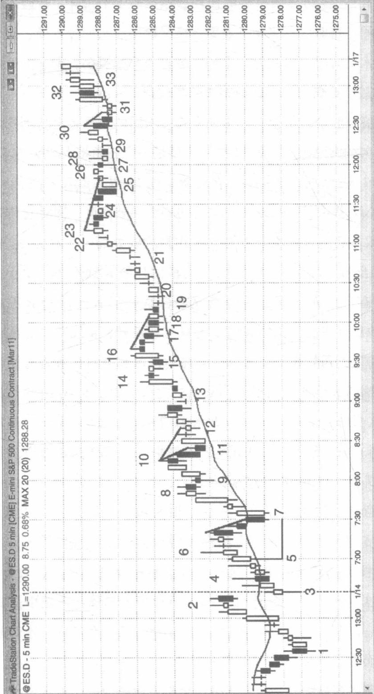  
图24.1 强势牛市趋势的最佳交易

对某个信号的解释常常有很多种方式，不同的交易者会从不同的角度去观察它。举例说明，K线12买入信号是一个三角形突破买进信号，而K线9和11是头两次下推浪。它也是K线11双K线反转高点1（K线11是双K线中的第一根K线）之后的一个突破回调，同时它与K线9形成一个双重底。有些交易者把它看作是均线处的一个高点2。K线11的双K线反转是高点1。K线12与之前的趋势K线形成一个小型的双重底部形态。大部分可交易的底部来自某种形式的微型双重底部（或者简单的双重底部，比如K线7的双K线反转，K线7和K线5形成的双重底部），同样地，大部分可交易的顶部都来自某种形式的微型双重顶部，比如K线6与两根K线之后的空头K线，K线10最终旗形与K线8，K线16与K线14，以及K线23与K线22构成的双重顶（和最终旗形）。在类似这样的强多头趋势中，大部分交易者应该忽略这些逆势刮头皮的信号，只准备买入。

我们注意到，均线下方的唯一的一根 K 线是当天的第一根 K 线，出现在 K 线 5 多头高潮后，只有两根 K 线收盘价是位于均线下方，且下一根 K 线便迅速向上反转。这是一种力量的体现。在当日收盘时，很容易看到这是一个多头趋势日（一轮开盘多头趋势，一轮多头高潮和趋势通道，以及一个趋势延续的区间震荡形态）。在日内，这种趋势并不明显，因为趋势交易日一般都好像在为趋势反转做准备一样。然而，每次的回调都最终只是演变成另一个牛市旗形而已。这个市场情形下，交易者只需要持续关注所有展示市场买方的力量的迹象，只要这些迹象存在，就像这一天一样，那么交易者就应该在市场回调时买入，因为这才是最佳交易。这时，胜率超过 $60\%$ ，盈利至少是风险的一倍。如果交易者做一些波段交易，那么盈利可能会是风险的几倍。

当市场价格在日内反转 K 线 5 上方时，市场处于始终在场的做多状态。如果交易者在 K 线 5 上方买入，那么他的初始止损位是 K 线 5 的最低点下方，这意味着他的风险是 14 个跳动价位。一旦市场超越强劲的 K 线 7 的双 K 线反转，他就可以把自己的止损位上移至 K 线 7 的低点下方，这个离他的入场价位只有 11 个跳动价位了。此时，他的风险只有 11 个跳动价位了。由于他相信目前市场处于总是在场的多头状态，所以市场出现等距运动的概率至少是 60%。当胜率是 60% 时，产生正交易者方程式的条件是，最低的利润必须要比风险的 11 个点大。也就是说，只要他在 K 线 5 的信号 K 线高点上方 12 个跳动处获利了结，他的策略就是盈利的，而这就意味着反弹最少必须达到 K 线 5 上方的 13 个跳动处。在上图中，这发生在 K 线 10 期间（它达到 K 线 5 上方 15 个跳动）。这种获利了结是 K 线 10 拥有空头实体的部分原因。不过，也有一些交易者会将盈利的头寸转化成波段交易头寸，来获得更大的利润。

当市场清晰地处于总是在场策略的某个方向时，如果我们使用带止损的回调入场策略，那么国债期货市场是一个不错的标的选择。如图24.2所示，很多交易者在出现K线1所示的两根K线的反转后，认为市场已经处在了总是在场策略的多头趋势中，也有交易者认为市场直到K线4再次下探低点失败后，尤其是在K线2开始的连续四根多头K线显示了市场多头力量时。当价格从K线4到K线5出现连续多头趋势

高级反转技术分析

价格行为交易系统之反转分析（下册）  
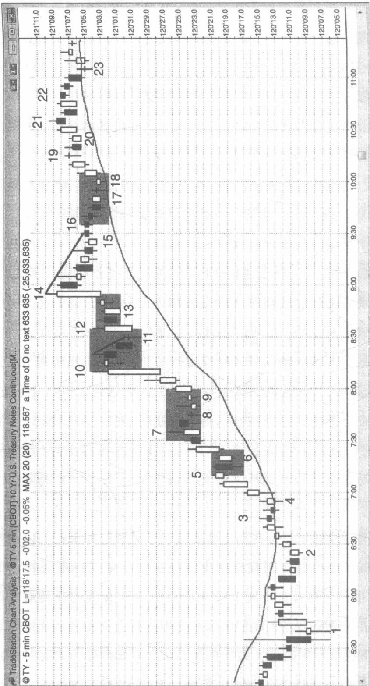  
图24.2 美国十年期国债期货中的最佳交易

突破时，市场就很明显处于多头趋势中了。直到这个时候，交易者们过去的买入行为才被证实是回调买入。K线6是一个高点1的买入信号K线，一般交易者很少在高点1买入，因为一般回调会持续两个波段，到高点2或者形成一个楔形牛市旗形。如果交易者不冒险愿意在高点1回调买入，又不想错过这一波向上的趋势，那么可以考虑在前一个波段高点上方设置限价买入单。这里具体来说，当高点1在K线6形成时，谨慎的交易者可以考虑在K线5上方一个点设置买入限价单，这样当趋势经历了K线6的回调后没有延续复杂的调整，而是当趋势延续时，交易者不会错过上涨趋势。

K 线 9 和 K 线 11 是高点 2 的买入信号 K 线，K 线 9 和 K 线 8 形成了一个微型的双重底，而这个双重底也是 K 线 8 的高点 1 或者说高点 2（很多交易者把 K 线 7 之前的那个阴线回调看成高点 1）的再度回调。三次回调形成一个三角形的突破形态（K 线 7 之前的那根 K 线和 K 线 8、9 一起形成三个下推浪）。K 线 12 是一根带有很小一段上影线但光脚的多头趋势 K 线，它显示了多头趋势的强劲。K 线 13 形成了突破后的回调买入入场信号。

K 线 14 是在一波较长时间震荡以及小型震荡区间（K 线 10 到 K 线 13）后出现的一根多头趋势长阳 K 线，这段小型的震荡区间可能会成为最终旗形。在最终旗形形态之后，交易者们一般期待市场会出现一波持续 10 根 K 线以上、两浪结构的朝着移动平均线方向的回调。K 线 15 之前的一波回调形成了多头楔形旗形，但因为这看起来像一个微型通道，交易者们没有看到两浪回调结构，所以不敢买入。一般来说，牛市微型通道的向上突破都会紧随着一波回调。所以多头都在等待市场在突破后的回踩至均线附近时买入，或者观察 K 线 16 下方的价格变化是否能成为回调的第二浪。后者可能性比较小一些，因为市场多头趋势比较强，市场一直处于移动平均线的上方，处于总是在场策略的多头状态。K线18处的II型形态是一个很好的多头入场信号，因为它是一个微型通道的突破后回调结构，同时又处于移动平均线附近，且有一个多头信号K线与其前面倒数第二根K线形成一个双重底部，而且它是一个20跳空缺口买入信号。

有经验的交易者把 K 线 14 看成第二波，或者第三波、第四波买入高潮，认为之后市场会进入震荡状态。对于大部分交易者来说，这里做空并不是最佳交易，但有经验的交易者会在 K 线 14 收盘处卖空，或者在其之后的空头 K 线收盘处或其下方，或者在随后的十字星 K 线的下方做空，并预期市场会出现一波两主浪结构的回调，向均线附近靠近。这些交易者中有些可能用很小的头寸做空，然后等待市场可能会冲到更高位置时再加仓，又或者他们做好了自己被止损踢出局的准备，只是先小仓位试试，那么在二次信号的时候再用正常的规模进行交易。一旦 K 线 14 收盘时，他们便会在收盘价的位置设置限价单做空，但一般这种单子很难成交，因为随后的空头 K 线的最高价都没有触及 K 线 14 的收盘价那么高的位置，显示出了卖空者的急迫性，这给了短线做空刮头皮交易者更多的信心，于是他们在这跟空头内含 K 线的收盘价或者其下方做空，并预期价格至少会回落到均线附近。果然，下一 K 线的最高价也没能突破 K 线 14 的收盘价，它的上影线与 K 线 14 形成一个小型的双重顶形态。

为什么很多交易者喜欢在回调的时候买入，主要是因为此时风险较低：不需要面临价格回调至上涨趋势底部的风险，而只需要面对价格回调至回调浪的底部的风险。回调买入策略可能会把利润空间压低，但风险更小一些。举个例子来说，交易者可以在 K 线 10 的收盘价附近买入，但这样做的话他的理论止损价应该是在这一波上涨的起点 K 线 8 的下方。如果他能够等待市场回调时买入，例如在 K 线 11 的上方买入，那么他的止损价就应该是 K 线 11 的下方，这样风险小很多。

市场总是在尽力维持多空双方博弈的平衡，所以任何一方的胜率都大约是50%。你的对手方很可能是一个很大型的机构，而这样强大的对手是不会给你60%胜出的机会的。不过，不是所有时候他们都能够很好地控制他们的胜率，所以还是有些时候，你能够拥有60%以上的胜率，以获得一个很好的交易者方程式。

如图 24.3 所示，在欧元/美元外汇图表的 5 分钟 K 线图上，一旦市场明显处于总是在场策略下的多头或者空头趋势时，交易者们便准备在回调时入场。当天开始的两根 K 线是大型的空头趋势 K 线，位于均线下方，使得市场成为总是在场的空头方向。K 线 4 是一个楔形形态（与 K 线 1 和 K 线 3 构成）的更低的高点，是空头趋势中军衔缺口 K 线做空信号的二次入场信号，在这一点处，空头趋势已经演变成了震荡交易区间（K 线 3 是空头趋势中均线上方的第一缺口 K 线）。K 线 5 是一根大型的空头趋势 K 线，它是一根外包下跌 K 线，并试图形成双重底而失败，所以大部分交易者把市场的状态看成总是在场策略的空头。在 K 线 7 低点 1 入场信号下方和 K 线 9 双重顶空头旗形（与 K 线 7 形成双重顶）下方做空，都是合理的交易。K 线 9 也是市场在向下突破 K 线 7 空头旗形后的一个突破回调做空信号。K 线 10 双 K 线反转处的向上反转，是一个大约有 60% 的可能性赚到波段利润的信号案例，所以对于所有交易者（包括初学者）来说，都是一个很不错的交易信号。K 线 4 是空头趋势中的一根缺口 K 线，它常常引出对空头低点（此时是 K 线

图24.3 欧元/美元图表上的最佳交易  
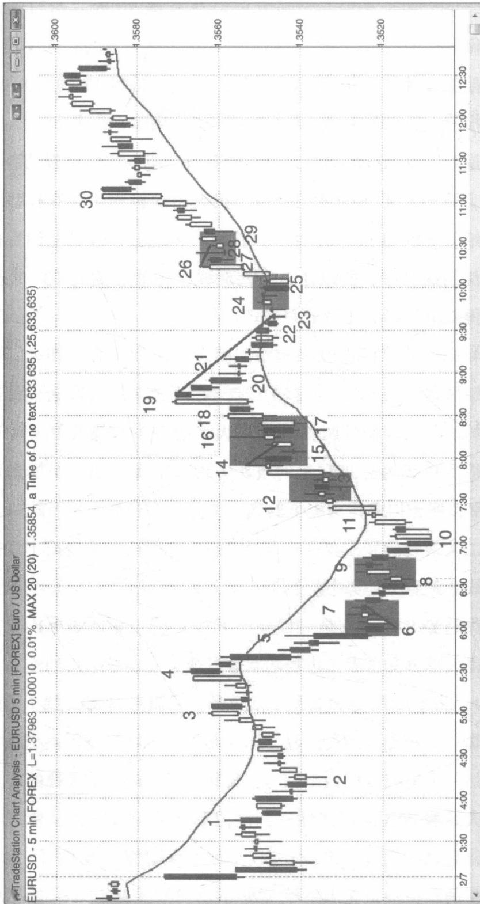

2）的测试，然后形成一波反弹，最少包含10根K线和两浪结构。截至K线6的空头下跌高潮太强，所以交易者们不敢买入。K线8是一个合理的买入位置，因为它是向下突破K线2后的第二次反转尝试，一个扩张三角形底部（当天第三根K线是第一次下推浪，K线2是第二次），K线7空头旗形之后的一个最终旗形反转，还是一条强多头反转K线。扩张三角形底部总是总要趋势反转的信号。然而，由于截至K线4的上涨浪和截至K线6的下跌浪都非常大，所以大部分交易者不会把这个叫作重要趋势反转，而是用其他名称（不过在15分钟图上它几乎肯定是一个外观很棒的重要趋势反转）。K线10是一个已经很强的形态的二次入场信号。交易者们在K线10的高点上方买入，K线10是双K线反转的第二根K线。他们初始的保护性止损在它的低点下方。一旦市场到达两倍风险处，他们就全部或者部分获利了结，剩下的部分头寸跟着波段走势自由奔跑，把跟踪止损调整到最近的更高低点的下方。有些人会在K线19的双重顶（与K线14构成的）和楔形（K线12、14、19，以及K线14、16和19）的下方离场，另外有一些人会继续持有，一直将止损设置在K线17的下方。

截至 K 线 12，市场显然总是处于在场策略下的多头状态，交易者们预期至少再出现一条向上的上涨浪，可能形成一波向上的可测量的运动，测量基准是从 K 线 10 到 12 的强多头上涨高潮的高度。多头可能会在 K 线 13 高点 1 或向上突破 K 线 12 时买入。

K 线 15 是另一个高点 1，但这一点处多头高潮不是很强，因为它已经形成了一个高点 1 回调买入的信号，而且市场可能是在一段交易区间的顶部附近。K 线 17 是一个更加安全的买入机会，因为它是均线处的高点 2 的回调买入信号，而且信号 K 线是一根强多头趋势 K 线（与前

面一根 K 线构成双 K 线反转）。

K 线 22 处向均线回调是一条空头微型通道，所以对通道的第一次向上突破很可能形成突破后的回调，然后再大幅反弹。K 线 25 是突破后回调买入的交易机会。

K 线 25 是一个双 K 线反转，它与 K 线 23 形成一个双重底部。有些交易者可能把它叫作微型双重底，因为它只包含了四五根 K 线。它也是 K 线 24 突破从 K 线 19 到 K 线 23 的空头微型通道后的一波回调，与 K 线 17 形成一个近似的双重底，是较大多头趋势中的第一均线缺口 K 线，也是一个买入信号。由于下降通道比较紧凑，所以等待 K 线 25 双 K 线上方的二次入场机会是一个更高胜率的策略。

截至 K 线 26 的多头高潮由 3 根连续的强多头趋势 K 线构成，所以随后市场很可能上涨。任意多头的最坏情况保护性止损在上涨高潮底部 K 线 25 的下方，但是大部分交易者会提前离场，比如在低点 K 线 26 或者信号 K 线 25 的高点下方。市场在 K 线 27 上方发出了一个高点 1 做多信号，然后在 K 线 28 上方触发一个高点 2 做多信号。市场仍然是明确的总是在场策略的多头状态，所以交易者们不应急于在回调离场。K 线 29 是一个楔形多头旗形买入信号（K 线 27、28、29 是三次下推浪）；它也与 K 线 27 构成一个双重底，是向上突破 K 线 28 高点 2 多头旗形后的突破回调买入信号，也是一个失败的更低的高点（前一根 K 线是一个小型更低的高点和一个失败的高点 2 的买入信号）。

如图 24.4 所示，IBM5 分钟 K 线图上的最佳交易包括：K 线 2 的开盘反转和缺口跳空上涨高潮，以及处于通道底部，K 线 4 均线处的双重底，K 线 6 强空头高潮之后均线处的低点 2，K 线 7 的低点 2 和微型通道失败突破，K 线 9 小三角形或者横向楔形空头旗形，以及 K 线 1 均

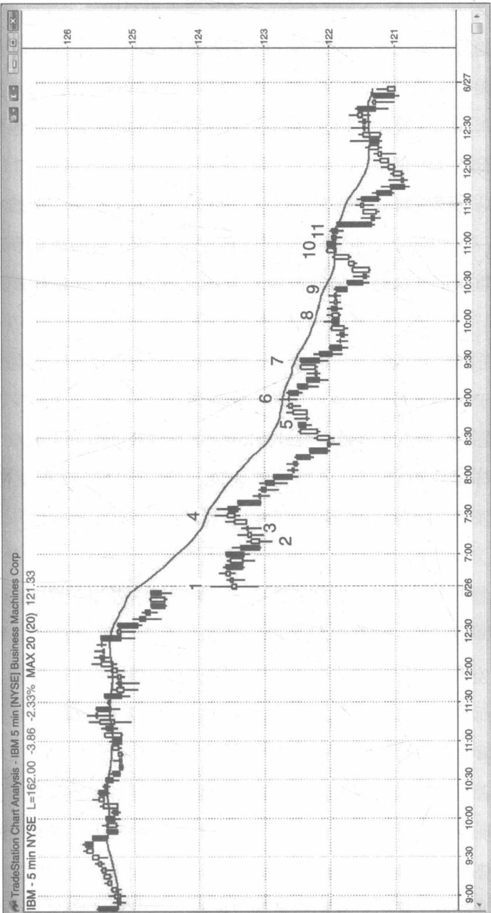  
图24.4 IBM的最佳交易

线处的低点 2。

强空头趋势中有几次均线回调。向下突破 K 线 2 之后，交易者们可能假定今天是一个趋势型的交易区间日，甚至可能是一个较强的开盘趋势日。截至 K 线 6，交易者们正在向均线进行两浪结构的运动和他们所看到的每个低点 2 处做空。

K 线 6 是均线处的一个低点 2 做空信号（K 线 5 是一条小型的空头 K 线，是第一条上涨浪的终点），它与之前一根 K 线之前的高点形成一个微型的双重顶部，这是它前面的内含 K 线之后的一个单 K 线最终旗形反转。

K 线 7 是测试 K 线 6 下方的盈亏平衡止损后的向下反转。它也是向下突破结束于 K 线 6 的空头旗形后的一次回调。

K 线 9 是一个低点 2 的做空信号，K 线 11 是均线处的一个低点 2 做空信号，也与 K 线 10 构成一个微型双重顶。两个信号看起来都不好，但是在一个强空头趋势日内，你必须相信均线处的低点 2 做空信号具有很高的胜率。

K 线 5 之前的双 K 线多头高潮很强，大部分初学者把它看作是一个迅猛多头反转的开始。截至 K 线 6 的上涨运动包含 7 根 K 线，只有一根 K 线拥有空头实体。这时，我们很容易把视线集中在这种强势上涨的势头上，而忽略了市场在此之前的走势。这波迅猛的反弹是 20 多根 K 线以来的第一次向均线的反弹，经验丰富的交易者把它当作一个卖出信号，初学者只看到了反弹的强势，打算在随后的更高的低点买入，预期走势会出现反转或至少出现第二波上涨浪。他们认为从 K 线 6 开始的三根空头趋势 K 线只是对当日低点的探底测试，他们买入，期望接下来还有一波上涨浪。经验丰富的交易者们把这个看作是对强空头趋势的一次反转尝试，因此很可能只是一个空头旗形。他们在 K 线 7 之前的两波横向调整处做空，正确地预期了空头趋势将会恢复。

如图 24.5 所示，今天美国石油基金（United States Oil Fund LP，简称 USO）的日线图上的最佳交易机会包括：K 线 1 楔形多头旗形；K 线 3 对均线的高点 1 测试；K 线 5 大型高点 2 中的二次入场（K 线 3 是第一次下推浪）；K 线 6 扩张三角形和更高高点重要趋势反转；K 线 8 双重底（与 K 线 5 构成）和微型通道突破回调（从 K 线 7 开始的向上反弹突破微型通道）；K 线 10 的失败的微型通道突破；K 线 12 的二次入场均线缺口 K 线；双重底（与 K 线 10 构成）、高点 2、对 K 线 6 的突破测试；K 线 13 双重底和高点 2；K 线 15 均线处的高点 2 和对 K 线 11 的突破测试。

市场显然处于一轮多头趋势中，所以最佳交易很可能是任意高点2，特别是均线附近的高点2，比如在K线1、5和12。K线1是均线处的高点2，有些交易者把它看作一个小型楔形多头旗形。K线5是一个较大的高点2买入信号中的第二波下跌浪，K线3是第一波下跌浪。

激进的交易者们把 K 线 1 前后向均线的小幅横向运动看作是一个平静的多头旗形，而不是一个反转形态。因此，他们会设定限价单在前一根 K 线低点或者下方买入，而不是等待市场恢复多头趋势。

K 线 6 是一个更高高点重要趋势反转和扩张三角形顶，是一个合理的做空信号。然而，大部分重要的趋势反转不会引出反向趋势。相反地，他们更有可能演变成交易区间，但是通常拥有足够的空头趋势，可以做小型的波段交易（需满足回报至少是风险的两倍的条件）。

K 线 8 和 13 是均线下方的两浪回调（缺口 K 线）。

K线8是对交易区间低点K线5的第二次测试；K线13是对交易

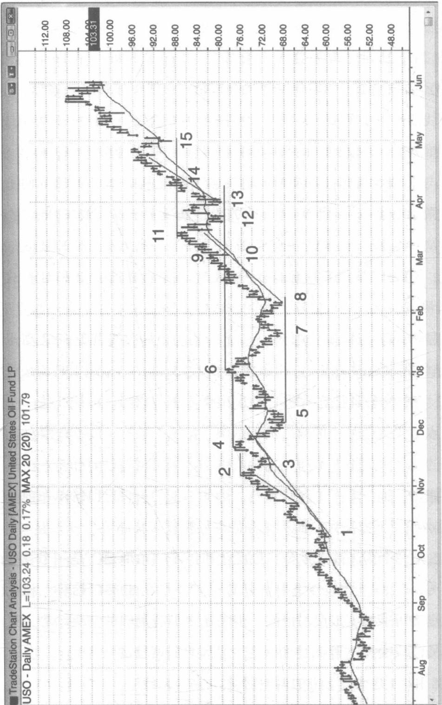  
图24.5 USO中的最佳交易

区间高点突破的第二次测试；两次测试都形成双重底多头旗形。

K 线 10 形成一个突破回调后的二次做多入场（K 线 2、3、4、5、6、8 和 9 之后形成一个失败的扩张三角形顶）。

注意，尽管这是一轮明确的多头趋势，但是K线6是一个不错的做空信号，因为截至K线5，有一个趋势线的突破。K线6是向新的高点的一波两浪结构的楔形反弹，是一个扩张三角形（K线2、3、4、5、和6）的顶部。

K线15是对K线11的突破测试。

在强多头趋势中，你不需要强的入场信号就可以买入。你可以在任意位置上以市价买入并赚钱，但信号允许你使用较为紧凑的止损。

一旦交易的账面利润达到目标利润的一半，有些交易者就会把自己的保护性止损移动至盈亏平衡点。举例说明，如果交易者在K线8上方买进，预期交易区间向上突破，然后形成一波向上的测量运动，那么一旦市场达到K线9区域，他就可能把止损移动至盈亏平衡点。市场达到K线9区域时，已经超过了他目标的一半，而且有几个收盘在韦瑜交易区间顶部上方。如果他的保护性止损被击中，那么他绝不应该变得忐忑不安，因为那刚好是他应该做的，限制了他的亏损，那种情况至少在40%的交易中发生。

如图 24.6 所示，SDS 的 5 分钟图上的最佳交易包括：K 线 2 开盘多头趋势中的首次回调，K 线 5 高点 2，K 线 6 均线处的楔形多头旗形或三角形二次入场。

这是一个开盘的趋势日。结束于 K 线 3 的第一波重要上涨浪，表现出很强的上行动能。当出现强多头趋势时，准备在高点 2 买入。K 线 5 和 K 线 6 是很棒的高点 2 做多入场信号。K 线 6 也是一波均线回调。K线6是前面倒数第二根K线与倒数第四根K线形成的微型底之后的高点2，也是从K线3开始的大型两浪下跌形态中的高点2，其中K线4是高点1买入信号。

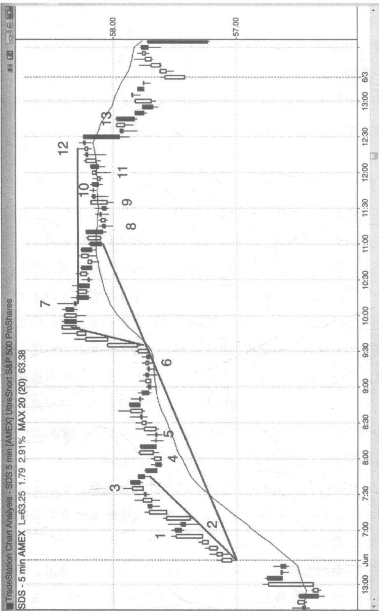  
图24.6 Ultrashort S&P 500 Proshares (SDS) 的最佳交易

K 线 7 是第二波上涨浪和一个失败的旗形突破（一个最终旗形反转），缓慢下滑，突破当日重要趋势线。

当市场进入紧凑交易区间或紧凑通道时，大部分交易者应该停止交易。一些经验丰富的交易者会在前一根 K 线低点买入，在前一根 K 线高点做空，在底部的小型多头 K 线买入，在顶部附近的小型空头 K 线附近做空，比如在 K 线 12 之后。

由于截至 K 线 8 的下跌过程中没有明显的反弹，空头已经控制了一个多小时，所以预期出现第二波下跌浪。K 线 10 是一波小型上涨浪，K 线 12 是第二波上涨浪。从 K 线 11 开始的上涨中，出现了一个低点 2。另外，K 线 12 是一根小型 K 线，在均线上方形成一个缺口。它也是一个小型的、几乎水平的楔形顶，其中 K 线 10 是第一次上推，K 线 11 后面第二根 K 线是第二次上推。它也是一个低点 4 信号，一个更低的高点的重要趋势反转，一次对 K 线 7 的低点的测试。

K线13是K线9突破的一个回调，是一根失败的多头反转K线，套住了多头。

就在 K 线 7 之前，市场进入一段紧凑的交易区间，并且一直持续到 K 线 12 之后。对于止损入场来说，这是最糟糕的环境，因为那正好与机构的做法相反，而你的任务是复制机构的做法。无论什么时候，能复制就复制。作为一名初学者，你不能使用限价单入场并逐步加仓，所以你必须等待。机构正在 K 线下方买入，这也是为什么市场在跌破前一根 K 线低点后上涨的原因。你还知道他们正在前一根 K 线的高点卖空，因为预计市场会在之后一两根K线下跌。由于初学者一般都必须带止损地入场，所以如果市场进入了紧凑交易区间，那么我们应该坚决不要交易，因为止损会带来重复的亏损。如果你是一位初学者，并且决定每天的交易数量不应超过三笔，那么在K线7后面的几根K线期间，你在思考什么呢？你正在告诉自己，这就是你一天等待的行情吗？市场很美好而平静，不再令人恐慌。又或者，你告诉自己当前市场的胜率太低不适合浪费宝贵的交易机会，对吗？由于这是一个止损入场的可怕环境，所以在突破之前实际上不会形成最佳交易。所以，要做那些你认为最后会成功突破的交易，你最终将会赚钱，虽然一开始的5到10根K线中你不一定会。在你能实现稳定盈利之前，绝不要在紧凑的窄幅交易区间内交易。即便是你已经实现了稳定盈利，在这种环境下，你最好的选择是等待。当然，你可以像机构那样，利用限价单入场，当市场反向运动时，在K线上方加仓空头，在K线下方加仓多头，做震荡区间的波段交易，但这会使你精疲力竭。最终，浮亏会大到让你难以承受，最终导致你可能会在市场朝着你的方向发展时，你却以较大的亏损止损离场了。所以，总的来说，最好的做法是使用止损单入场，等待胜率常常达到60%的环境，而不要在窄幅交易区间内交易。

如图 24.7 所示，这张 AAPL 的 5 分钟 K 线图上的最佳交易信号包括 K 线 1 和 K 线 2 双 K 线反转下方的 20 缺口 K 线做空信号，以及 K 线 7 双重底。

AAPL处于一轮开盘的空头趋势中，K线2是一个20缺口K线的做空机会，也是双K线反转信号。K线2的入场价位是169.88美元，入场K线上方的止损位设置在170.38美元。入场K线是一根外包下跌K线，交易者一入场就把止损位设置在这根K线的上方，或者在前一根

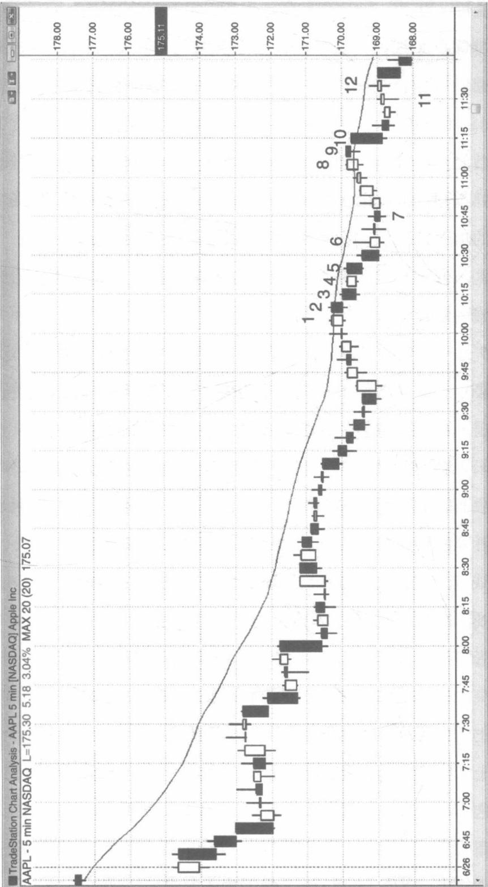  
图24.7 AAPL空头趋势中的最佳交易

K 线的收盘价。这是一种合理的做法，因为它限定了风险，如果市场反转向上超越这根 K 线的高点，那么也不要做空。如果它不是一根外包 K 线，那么他们可能会把止损设在信号 K 线的上方，此处的初始风险是 50 美分。

激进型的交易者们，会把限价单设在 K 线 3 和 4 的高点，预期任何向上的反弹都会失败，因为这是一个 K 线 3 突破空头旗形后的突破后的反弹做空的信号。他们把它看作是一个平静的空头旗形，而不是一个做多的反转，他们预期会出现卖盘压力，所以在任意一根 K 线的上方做空都是不错的选择。

K 线 5 是一个糟糕的高点 1 回调买入信号，因为市场处于一轮强势的空头趋势中，交易者们不会退出空头头寸，不会反转做多。市场下跌超越这一根 K 线 7 美分时，交易者不会马上移动他们的保护性止损，因为最大的未平仓利润只有 38 美分，他们想要给这笔交易更多的时间和空间。一般而言，对于这样一笔交易，直到未平仓利润达到 60 到 80 美分，交易者才能把保护性止损移动到他们的盈亏平衡点。

在 K 线 6，交易者们能够使用限价单以 1 美元的利润了结一半的股票（K 线 6 底部比他们的入场价位低了 1.07 美元）。通过这一根 K 线的外包上涨特点，我们可以看到大量交易者可能在这里部分或者全部平仓。在这一点处，他们会把自己的保护性止损移至盈亏平衡点，或者略差几个便士的位置（170.91 美元是合理的价位，因为 AAPL 很少会以超过 1 便士的幅度来猎杀止损），而不会离场，除非出现明确而强劲的反转。在这样一个强空头趋势日，那种反转不太可能出现。他们预期回调是在恐吓弱势空头离场。举例说明，截至 K 线 9 的反弹，精确击中了盈亏平衡止损点（170.88 美元），然后向下反转。

如果交易者们被止损踢出，那么他们会在 K 线 10 再次做空。可是在 K 线 9 均线测试和突破测试之后。K 线 10 显示出突破测试已经完成了恐吓交易者们离场的目的，因为显然有大量空头入场。如果交易者让自己被止损踢出，那么他们现在不会再次做空，可是现在的价位比之前一下子低了 41 美分！

如图 24.8 所示，高盛集团（GS）5 分钟图上的最佳交易包括：K 线 1 之后第二根 K 线形成的微型通道失败突破；K 线 3 后面一根 K 线下方的突破后的回调入场信号（这里是一个低点 2 反弹后的卖空信号）；从太平洋标准时间上午 11:10 空头高潮开始下跌通道之后，K 线 5 多头反转 K 线上方的二次入场做多机会。

小幅反弹的趋势是下跌趋势中最强的一种趋势。因为市场一直没有表现出多头的力量，所以交易者们在全天只考虑做空，除非出现收盘前反弹的征兆。在出现K线5附近潜在的底部之前，交易者们会在任意小幅反弹的时候做空。在K线1之前，任何此前的小幅反弹幅度都不超过1美元，所以交易者们可以在最新的低点上方一美元附近设置限价订单，来逢反弹做空。他们需要知道自己的止损位，然后定一个最低的止盈目标位。由于这个一般非常难定，所以他们一般会考虑最坏的情况。例如，如果市场在当天第四根K线的上方，那么市场的熊市趋势就没那么强了。因此，他们的止损位可以设置在第四根K线的高点179.50美元附近。鉴于他们可能在177美元附近做空，那么他们的每股的风险就是2.5美元左右。如果他们不会让自己在一笔交易上损失超过500美元，那么他们可以交易200股。既然他们认为目前是熊市趋势，那么他们应该假设市场创新低、或者说利润空间超过1美元的概率至少是60%。不过，他们只应该在利润空间至少跟潜在风险一样大时，才能参

高级反转技术分析
价格行为交易系统之反转分析（下册）  
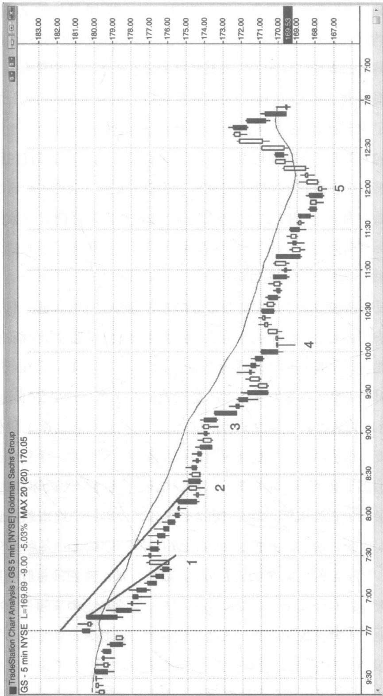  
图24.8 GS强空头趋势中的最佳交易

与这笔交易。也就是说，他们应该努力在他们的入场价位下方2.5美元或者174.50美元价位附近了结一半的头寸（也就是100股）。他们的订单将在K线2前面倒数第二根K线的空头趋势K线中被执行。在那时，他们会把止损位移至盈亏平衡点，继续持有，直到总是在场策略的状态反转为多头策略，直到他们的止损被击中，直到最后一小时左右出现任意合理的向上反转，或者直到当日收盘。如果他们在K线5上方离场，那么他们在第二个100股上便会赚到900美元。如果当市场在向170美元挺进并转为总是在场策略的多头时，他们此时离场能够赚到700美元，如果他们一直坚持到收盘，那么第二个100股也大概赚到700美元。

这是应该避免反转入场的一个完美例子。每天，你都应该随时分析图表，尤其是在开盘后的一两个小时，一边决定当天是否是一个趋势日（趋势日的主要类型在这一系列书的第一本书中已经讨论）。如果当天是一个趋势日，那么就不应该逆势交易。类似这样的开盘趋势日，是最容易看出的趋势日。截至当天第三根K线，你会猜测是否是空头趋势日（一条大型空头趋势K线，大幅跌破开盘价），而当市场向下突破K线1时，你已经非常自信。

K 线 1 反弹是一条大型多头趋势 K 线，它突破了一条微型趋势线，所以很可能失败。心急的交易者可能会在 K 线 2、3、4 等反转 K 线上方买入，认为趋势线突破期间，多头显示出足够的力量。然而，从当天第三根 K 线开始，市场一直处于均线的下方，交易者们应该记得类似这样的小反弹空头趋势日，而向均线的第一次反弹通常失败，然后市场测试低点。不要劝说自己市场已经走得太远，应该出现反弹。根据定义，你正在逆势思考，正在寻找一个强趋势日中的逆势刮头皮。你害怕在低点附近卖出，并希望出现趋势反转，那是一种低胜率的赌注。不妨计算一下，大部分的逆势刮头皮都会失败，你在每笔交易上的损失将完全抵消你在最后一两笔交易上的盈利。

然而，由于 GS 一整天都处在均线处没有可交易的低点 2 反弹做空机会，所以经验丰富的交易者甚至会在最微小的反弹处做空。如果反弹幅度大于预期，那么就依靠典型的回调序列（在这系列书的第二本书讲过）让自己离场。每种类型的第一次反弹，随后通常都会对趋势极点（这里是当天的低点）进一步测试。

如图 24.9 所示，England-based Vodafone Group（世界上最大的通讯服务公司之一，VOD）这张日线图上的最佳交易包括：K 线 3 均线处的高点 1 回调买入机会；K 线 7 楔形多头旗形和一条均线缺口 K 线的二次入场机会；K 线 8 的小型三角形、K 线 11 向均线的楔形多头旗形，K 线 12 高点 2 回调做多机会；K 线 14 的楔形多头旗形，以及 K 线 15 低点处的突破回调做多信号。

当出现一轮强多头趋势和多头旗形突破，而且突破 K 线有一个多头实体时，在它的低点买入是一种可靠的策略。这是因为，回调通常会成为一个突破后回调做多的信号，你可以在较低的价位买入。COD 在日线图上处于一轮强多头趋势中。K 线 15 是一根多头趋势 K 线，它突破了均线处的一个楔形多头旗形，所以任何回调都可能会非常短暂，而且会成为突破回调买入信号的信号 K 线。交易者们会使用限价单在 K 线 15 低点买入。计划在回调 K 线上方买入的交易者们，失望地看到次日形成的大型上涨缺口。如果他们仍然想要做多，那么他们的入场价位就要糟糕很多。

市场从 K 线 5 开始，一路跌到了沿着从 K 线 3 开始的上升通道底部的趋势线（图中未画出）下方，但双 K 线下跌甚至没有触及均线。这使得 K 线 6 并不能成为一个重要趋势反转的更低的高点。市场更加可能只是在制造一波回调。回调结束于 K 线 7 所在的高点 2 回调买入信号点，同时它也是楔形多头旗形和均线缺口 K 线。

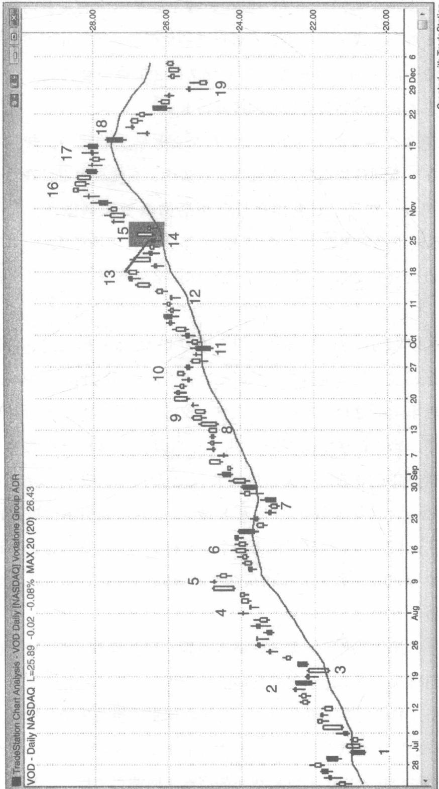  
图24.9 VOD日线图上的最佳交易

一般来说，总要准备低买高卖，但是在强多头趋势中，却是在高点买入，在更高的价位离场；在强空头趋势中，在低点卖空，在更低的点位平仓离场。然而，如果你在自己预期的微型顶部做空，比如图24.10所示电子迷你图表中K线15或16下方，且市场形成一个高点2回调买入机会（比如在K线17），此时你要么就离场，要么甚至反转做多。

当电子迷你期货中的平均日区间大约为10到15点时，交易者们在一笔交易上通常必须承担两个点的风险。他们应该寻找利润至少与风险一样大、胜率至少是60%的交易。大部分交易日，通常会有5个或更多这样的信号，比如在这张图表的K线1开盘做空，在K线3的低点上方买入，或在高点2的回调买入信号K线处买入（K线7、K线14后面的那根K线，以及K线17）以及K线22处的微型通道突破后回调买入机会。记住，如果交易者认为某个交易机会不错，那么他们应该假定胜率至少为60%。如果潜在回报至少和风险一样大，那么将产生一个正的交易者方程。

注意，大部分微型反转来自微型双重顶、双重底和小型最终旗形。刮头皮者们喜欢在下单之前看到这些信号。

最佳交易的成功率最低是 $60\%$ ，且潜在回报至少与风险一样大。如图24.11所示，印度汽车制造商Tata Motors Ltd（TTM）在这张日线图上的最佳交易包括：K线3和K线4的高点2回调买入信号；从K线5

图24.10 大部分时间里都要寻找低买高卖的机会  
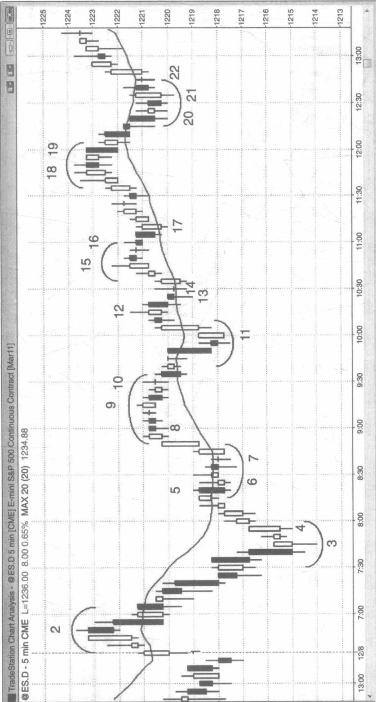

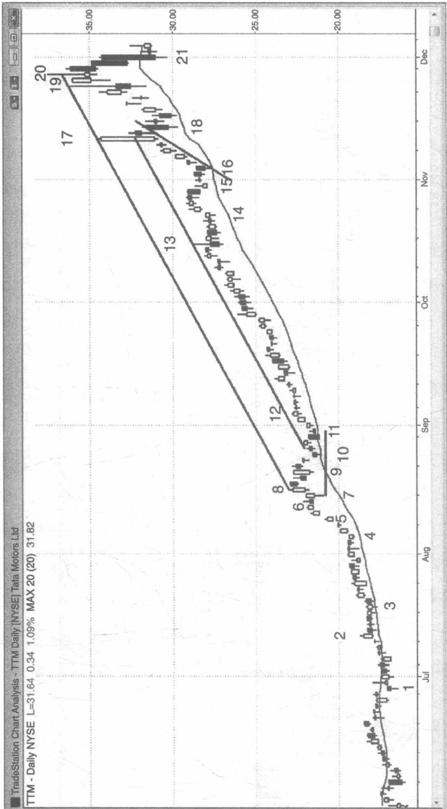  
图24.11 回报应该总是至少和风险一样大

到 K 线 6 的多头趋势高潮的三根 K 线的任何一根；K 线 10 的高点 2 回调买入信号；K 线 11 楔形多头旗形；K 线 12 突破后的高点 1 回调买入信号；K 线 14 突破后回调和它的前一根 K 线的高点 2 回调买入信号；K 线 16 高点 2 回调买入信号；以及 K 线 20 更高的高点的反转信号。

强趋势中向均线的楔形多头旗形回调，是一种可靠的买入信号。从K线1开始，TTM处于一轮强多头趋势中，截至K线8在不到两个月的时间里几乎上涨了40%。在K线10处，市场形成一个向均线的高点2的回调，这是一个合理的买入机会。在K线11内含K线演变成一个多头楔形旗形时，K线在均线附近，形成很好的买入信号。K线11是突破此前形成的多头楔形旗形后的回调，是一个回调买入信号。如果交易者们在K线10上方买入，那么他们会在两根K线之后出现的抛盘中在盈亏平衡点离场，或者他们可以依靠信号K线下方的保护性止损价位离场，但价位没有被触及。他们还可以将止损设置在略低于K线7的低点处。

K 线 7 是多头趋势中一个强多头高潮的第一次回调，且随后没有形成买入高潮。这是一个理想的高点 1 回调买入信号，也是一个微型通道失败突破买入信号。它是一个突破后回调买入信号，因为它是 K 线 5 向上突破此前紧凑的交易区间后的第一次回调。

K 线 17 处巨大的多头趋势 K 线是一波买入高潮。每当出现一轮持续 10 到 20 根 K 线甚至更多的趋势之后，出现一条巨大的多头趋势 K 线时，这一般代表着多头动能的耗竭。它是由部分最后的空头离场和迟到的多头买入造成的。这两群交易者都是弱势交易群体。在这个位置，强势多头只会在回调买入，如果要做空，只会在更高的价位做空。K 线 17 突破向上突破超越了过去一两个月的趋势通道线，我们需要画一条更高的趋势通道线。在 K 线 19 和 20，市场尝试向上突破趋势通道线，两次都遇到了很强的卖盘压力。通过两根 K 线很长的上影线，K 线 19 的空头旗形，以及 K 线 20 收盘远低于中点便可以看出。当市场两次试图做某件事情均告失败后，它通常试着向相反方向运动。从 K 线 18 开始的空头 K 线，以及 K 线 19 和 20 很长的上影线，都表明卖盘压力正在累积。从 K 线 17 开始，K 线的长度大大增加，表明多头正在异常努力地将原来的趋势转变成一轮更强的多头趋势。他们的努力引发了自我的耗尽，卖盘压力逐步将它们挫败。市场很可能至少形成一波两浪结构的调整，趋势很可能反转。

截至 K 线 18 的抛盘向下突破了一条多头趋势线，所有的卖盘压力使得抛售潮很可能出现。所以在 K 线 20 后面的强空头趋势 K 线做空是一笔高胜率交易。它是一条收盘于低点的大型空头趋势 K 线，它与 K 线 20 形成一个很大的双 K 线反转。空头实体的幅度和极小的上影线都表明卖盘压力非常强。

如图 24.12 所示，中国光电池制造商林洋电力控股（SOLF）日线图上的最佳交易包括：市场回调至 K 线 4 且依托均线支撑的高点 2 回调买入信号；K 线 5 处市场第三次上推浪后的巨型向下反转；K 线 7 两次强势下推浪后出现的低点 2 的反弹做空机会；K 线 8 的双重底多头旗形；K 线 9 后面以及 K 线 10 后面的小型高点 2 回调买入机会；K 线 12 更高的高点的做空机会；以及 K 线 14 两浪上涨的更低的高点做空机会。

更高的高点反转之后通常会是一个更低的高点做空信号。SOLF 从 K 线 5 高点开始形成一波很强的下跌运动。K 线 6 之前形成的第二条大型空头趋势 K 线，在 K 线 3 和 4 前后又出现另外几条空头趋势 K 线，这些都代表着卖盘压力正在积累，在某个点可能会引起趋势反转。然而，趋势线突破之后，空头未能将空头趋势 K 线连续在一起，所以总是在场策略的头寸依然是多头。

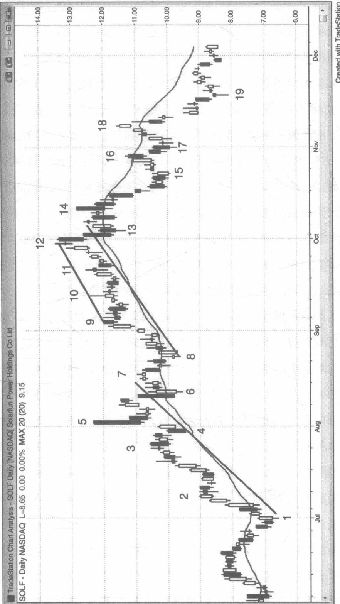  
图24.12 SOLF中的最佳交易

截至 K 线 8 的抛盘强势突破多头趋势线，但是截止 K 线 9 迅猛反弹向上突破 K 线 7（头肩顶的右肩），所以很可能出现坚持到底。在截至 K 线 9 的上涨高潮之后，市场形成一条上升通道，至 K 线 12 结束。在 K 线 12 上方形成一个更高的高点。从 K 线 5 开始的强势抛售潮之后，空头打算做空，多头打算获利了结。有些交易者把 K 线 12 看作是通道内的第三次上推浪，截至 K 线 9 或 K 线 10 是第一浪，截至 K 线 10 或 K 线 11 是第二浪。K 线 12 信号 K 线是一个十字星，所以有些交易者在等待更多空头力量的出现。

K 线 12 之后的强空头趋势 K 线是强卖压的征兆，它带给空头在随后一两根 K 线积极做空的自信。这一波下跌由三根大阴线组成，突破了多头趋势线。交易者们相信很可能出现更多的卖盘，因为市场已经转为了总是在场策略的空头头寸，所以他们打算在市场反弹时做空。

市场在 K 线 14 形成一个两浪结构的更低的高点，测试 K 线 12 的低点，从那一根 K 线的第一个跳动开始，市场就在下跌。交易者们对市场的下跌很有信心。当市场跌破它前一根 K 线的低点，成为一条外包的下跌趋势 K 线时，有些交易者们就开始做空。还有一些交易者在价格向下突破 K 线 13 的低点时才做空，预期市场会出现一波向下至少等距的下跌浪。

截至 K 线 15 的下跌高潮也很强，但有些空头被 K 线 18 之前的几波迅猛反弹套出，因为这一波反弹略高于 K 线 16 的高点，看起来也很强劲。有些交易者在 K 线 15 多头趋势 K 线上方买入，因为它与 K 线 8构成一个双重底多头旗形，还是一个双K线反转，是一个从一根K线之前开始的单K线最终旗形反转。然而，空头在K线18的后一根K线返回市场，制造了一个大阴线。这是一笔很容易被套出的最佳交易，所以我们的重点是要避免被市场套出。不要太早地调紧自己的止损，尝试利用盈亏平衡持有部分头寸，直到市场明显地变为总是在场的策略的多头头寸。截至K线18的反弹并不足以令总是在场头寸翻转，所以波段交易者们应该坚持持有空头。

从K线5到K线8的抛盘非常强劲，足以令交易者们猜测市场是否正在从一轮多头趋势演变成交易区间。截至K线12的反弹包含很多回调、大阴线，以及带有很长上影线的K线。他们都是卖盘压力的征兆，这表明市场正在向震荡市转变。这看起来更像是震荡区间的一波上涨浪，而不是多头趋势的一波上涨浪。交易者们正开始在波段高点上方卖出，比如在K线10向上超越K线9时，或者在K线11向上超越K线10时。K线12是一个更高的高点（K线5的上方）重要趋势反转的信号K线，但是大部分交易者认为更有可能形成震荡区间和对区间底部K线8的测试，而不是空头趋势，几乎总是这样（大部分交易区间突破尝试挫败）。虽然在K线15和17之间的区域内有一些获利了结，但K线16和18形成一个双重顶空头旗形，引出对区间的向下突破。很多交易者在K线15区域内部分获利了结，并把他们的保护性止损移至盈亏平衡点，希望出现一个更大的下跌波段，但是概率不到 $50\%$ 。然而，他们有时候会赚到大笔的利润，比如在这里。

如图 24.13 所示，墨西哥陶瓷生产商 Cemex（CX）这张日线图上的最佳交易包括：K 线 2 最终旗形反转和 K 线 1 构成的微型双重顶，在随后空头高潮三根 K 线的任意一根 K 线做空；K 线 4 向均线的楔形空

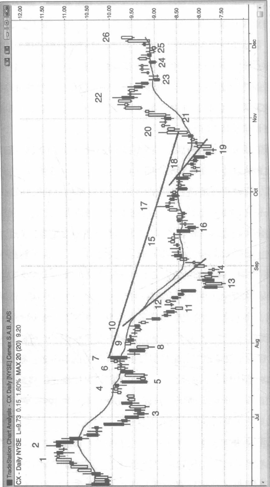  
图24.13 CX的最佳交易

头旗形回调，在K线5卖出高潮（挫败的空头突破）和双重底之后的小型多头内含K线上方买入，在K线低点2和微型双重顶下方做空；或者当它跌破前一根K线低点时做空（因为那是一根低点2反弹卖出信号K线），在K线8三重底和多头反转K线买入，在均线处K线10双重顶空头旗形（与K线9构成）做空（它也是空头趋势中均线处的一个空头反转K线低点2反弹做空信号）；在K线12微型通道突破失败并向下突破三重底后的突破回调做空信号，在K线14的微型双重底多头旗形以及失败的低点2买入信号，那个失败的低点2形成于很强的K线13多头反转K线和大型的两浪下跌之后（一两浪差不多等距的运动，其中第一浪是从K线2到K线3的上涨高潮，第二浪是从K线9到K线13的空头通道，它包含三浪：K线7是一个较小的空头高潮，也在同一空头通道内），在K线15均线缺口K线下方做空；在K线16更高的低点上方买入；在K线17低点2反弹做空（从K线16开始出现两次上推浪，K线15是一个更大的低点2的第一次上推）和楔形空头旗形做空的信号（K线13后的那根K线是第一次上推）；在K线19更高地点重要趋势反转买入；在K线21高点2买入（K线20后面的多头内含K线构成一个微型双重底部）；以及在均线处的K线25的三角形或者楔形多头旗形买入，其中很多K线拥有阳线实体，这也代表了买盘的力量。

当出现一个强空头高潮，而且交易者们预期出现更多卖盘时，市场处于总是在场的空头方向，交易者们会寻找做空的机会。CX 形成一个很强的空头下跌高潮，到 K 线 3 结束。交易者们正预期价格下跌，正准备在反弹做空。在 K 线 4，他们会在向均线的小型两浪结构的反弹处做空。由于交易者会使用限价单在均线处做空，因为这是一个强空头高潮之后第一次向均线反弹。另外一些交易者们会在 K 线 4 的下方用限价单做空。K 线 4 跌破了它前面的一根 K 线，是做空的首次入场，在 K 线 4 下方做空的交易者们正选择二次入场。

K 线 7 处较大的两浪反弹结构是一个低点 2 做空信号。激进型空头使用限价单在前一根 K 线高点和 K 线 4 上方做空，另外一些则是在那一根 K 线跌破前一根 K 线的低点，产生一个二次入场做空信号时做空（K 线 6 是第一个信号）。很多交易者喜欢在强空头趋势 K 线下方做空，于是在 K 线 7 下方做空。因为这么多交易者都希望在那里做空，于是市场在次日向下跳空。

在 K 线 11 之前，市场出现一个强烈的下跌高潮，K 线 12 向上突破下跌的微型通道。空头在 K 线 12 下方做空，并预期第一个微型通道突破尝试将以失败告终。

虽然截至 K 线 17 的横向运动向上突破了一条陡峭的空头趋势线，但是截至 K 线 13 的下跌运动远远低于 K 线 8，于是交易者们重新开始寻找底部的过程。他们需要向上突破空头趋势线的另一波反弹，以及对趋势低点的另一次探底测试，然后他们才愿意相信市场正在反转，而不只是在形成另一波空头趋势下的反弹。截至 K 线 17 的两条腿的上涨非常强劲，向上大幅突破均线，所以是买盘力量的征兆。交易者们在空头反转 K 线 17 下方做空，因为他们把它看作是一波大型两浪结构的反弹的终点，所以是一个低点 2 反弹做空信号。它也是空头趋势中的一个均线缺口 K 线做空信号，但那轮趋势仍然需要明确翻转为总是在场策略的多头方向。

外包十字星 K 线 19 不是一条很强的更高的低点买入信号 K 线，但是有些交易者在它的上方和随后的强多头趋势 K 线（向上突破一条空头趋势线）上方买入。同时，它也是对K线14的向上突破后做多的多头的忍耐力测试，这里猎杀了这些多头的盈亏平衡止损点。通过让一些原有的不坚定的多头在此止损后，市场重新回到上升趋势，形成一个很好的风险收益比的入场信号。这时入场的头寸，风险的做多就是在入场信号K线的底部，而回报是一轮新多头趋势的幅度，是风险的好多倍。

截至 K 线 20 的多头高潮向上强势突破均线和一条很长周期的空头趋势线。有些交易者把这看作是对一个倾斜的头肩底的颈线的向上突破。大部分交易者认为从 K 线 19 到 K 线 20 的多头高潮非常强劲，所以价格随后应该上涨。这就意味着他们把市场看作总是在场状态下的多头。他们在 K 线 21 的上方（高点 2 回调买入信号）买入，接着在 K 线 24 的上方（高点 2 回调买入信号）买入。在 K 线 25 楔形多头旗形向均线回调时的多头 K 线上方买入较为安全。

另外一些交易者认为截至 K 线 23 的下跌是一条空头微型通道，但是由于它仍然是在均线上方，而且仍然是在一轮强多头趋势内，所以他们认为它很可能是多头旗形的一个部分。因此，他们更加合理地假定突破会失败，但失败不会走得太远，而是会成为一个突破回调买入信号，而不是预期突破失败后在它下方做空。记住，当一条空头微型通道的失败突破再次失败时，它就会成为一个突破后回调买入的机会。K 线 24 是突破后的回调，但是它有一个空头实体，所以大部分交易者不会在它的高点上方买入。然而，回调浪成为一波截至 K 线 25 的两浪回调结构，那也是一个双重底多头旗形。

如图 24.14 所示，谷歌（GOOGLE）的这张 5 分钟图上的最佳交易信号包括：K 线 2 和 K 线 3 向均线的低点 2 反弹做空信号；K 线 4 最终旗形和楔形底部反转买入信号；在 K 线 7 均线缺口 K 线、低点 2 和

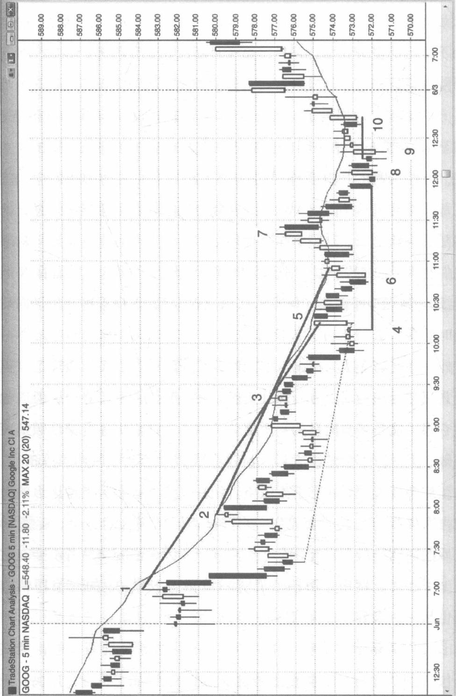  
图24.14 GOOG中的最佳交易

双重顶做空信号；在 K 线 9 重要趋势反转更低的低点买入信号；在 K 线 10 更高低点和止损猎杀突破测试买入信号。

当向上强势突破空头趋势线时，交易者们会准备在对空头低点测试时买入，前提是测试不会跌得太低。GOOG 形成一波截至 K 线 7 的强势反弹，它由尾线短小的多头趋势 K 线构成。它向上突破了空头趋势线和均线，从 K 线 1 开始的空头高潮之后的下跌运动中出现若干强多头趋势 K 线。那些尾线短小的多头趋势 K 线表明多头正心甘情愿地买入。这种买盘正在积累，在某个点处，可能耗尽空头的力量，于是多头可以控制市场。

激进型的交易者会使用限价单在 K 线 5 后面的空头 K 线高点做空。形成三条连续的重叠 K 线，使很多多头都被迫在这段交易区间的顶部买入。考虑到那刚好是在空头趋势日中均线的下方，所以在这里买入是一个特别糟糕的主意。由于在这里买入很可能会失败，所以敏锐的交易者们会在弱势多头买入的位置做空。

从 K 线 7 开始的抛盘包含很多重叠 K 线和几条多头 K 线，那表明存在双向交易的力量。空头并未完全控制市场。因为市场一跌破 K 线 4 的低点，就会有很多买盘在 K 线 8 入场。他们未能令市场反转，市场再次跌破那个低点。K 线 8 是第一次向上突破从 K 线 7 开始的空头通道，所以很可能失败。然而，在 K 线 9 第二次尝试令趋势反转时，多头却能控制接下来的三根 K 线。K 线 9 是 K 线 8 向上突破微型空头通道后的突破后的回调，其中空头通道就是多头旗形。

当空头尝试将从 K 线 9 开始的反弹变成一个三根 K 线组合的空头旗形时，多头在 K 线 10 的更高的低点处将他们战胜。K 线 10 在预期出现 K 线 9 做多信号的信号 K 线上方 8 美分（对于一只 500 美元的股票，

8 美分是微乎其微的）向上回转，这使得交易者们可以在它的高点上方加仓。它还把多头套出，现在他们将追着市场上涨。多头认为 K 线 9 很可能引出至少两条上涨浪，所以在接下来的几根 K 线中，他们设置限价单在前一根 K 线的低点或者其下方买入。他们预期任何低点 1 做空信号失败，并成为一个更高的低点。他们的买入限价单将在 K 线 10 被执行。他们的保护性止损将位于 K 线 9 低点下方。

空头在当天早些时候就拥有不错的做空机会。市场向下跳空，在略低于均线处的 K 线 1 处形成一个低点 2 反弹做空信号。在 K 线 1 后面两条大阴线里，激进型空头会在他们的收盘价以及低点下方 1 个跳动处做空。

下跌高潮非常强劲，很可能出现一波到底的卖出，而且极有可能是以空头通道形式。当天或许成为一个高潮和通道空头趋势日。空头打算在反弹卖出，那将是在正在形成的空头通道的顶部。K线2是均线处的一个低点2反弹做空信号，它是对当天第一根K线被向下突破的测试。

K 线 3 是均线处的一个低点 2 做空信号，尽管这个空头旗形包含很多强势的多头趋势 K 线。

K 线 4 是从空头通道内一个双 K 线最终空头旗形和第三次下推开始的向上反转，它常常至少引起两浪结构的反转。最低限度，这个楔形底部很可能表现得像一个空头台阶形态，测试前一次下推的低点（从 K 线 2 开始的抛盘底部的波段低点）。它也是第二次尝试向上反转，第一次是在一根 K 线之前。虽然十字星信号 K 线不理想，但是下跌过程包含很多多头趋势 K 线，所以并不需要非常多的力量便可令市场向上反转。空头趋势并不都是那样强劲，其中包含大量双向交易。

在一轮空头趋势中的低点买入时，通常最好是至少有部分头寸做短线刮头皮交易，以便在反弹测试均线时部分离场，那也刚好位于前一波段低点上方。然后，他们可以把自己的保护性止损移至盈亏平衡点。一旦市场跌破从K线5开始的两条空头趋势K线，大部分交易者就会离场，但是有些交易者会坚持把止损设在K线4空头低点下方。因为截至K线5的反弹只不过是条刚刚向上突破趋势线，所以这仍然不是一个很强的底部。因此，市场仍然总是在场内的空头。对于多头来说，保持谨慎并提早离场是明智的做法。

K 线 7 是一个可以接受的均线缺口做空信号，它与 K 线 3 形成一个双重顶空头旗形，这是空头趋势中的两条腿的上涨。但是，在一条多头趋势 K 线下方做空是比较冒险的，特别是在一个三根 K 线多头高潮之后。较好的做法是准备在对空头低点的更高低点或更低低点测试时买入。

如图 24.15 所示，苹果（AAPL）的这张 5 分钟 K 线图上的最佳交易是截至 K 线 3 的空头高潮之后 K 线 4 更低的高点重要趋势反转和突破测试。在从 K 线 1 开始的多头高潮中，激进型交易者会在任意多头趋势 K 线期间买入，但是，由于他们的保护性止损会更远，所以交易者们需要交易较小的头寸。

一旦市场跌破一个高潮和通道顶部形成的一条陡峭通道，那么交易者们常常准备在更低的高点做空。截至 K 线 3 的下跌拥有很强的动能，它向下大幅突破多头趋势线。交易者们猜测总是在场内头寸已经向空头翻转，正在寻找更低高点卖出信号。截至 K 线 4 的两浪结构更低高点反弹，是对 K 线 2 双 K 线向下突破点位的测试，它是一个低风险卖出信号，预期至少形成第二浪下跌，且趋势可能反转。

如图 24.16 所示，亚马逊（AMZN）这张日线图上的最佳交易架构是 K 线 10 两浪结构更低高点重要趋势反转，还有其他几个特点支持它成为最佳交易，在后面几段中有描述。另外几个不错的交易信号包括：K 线 2 处的楔形多头旗形、均线缺口 K 线、双重底多头旗形，以及 K 线 3 最终旗形和楔形顶。有些交易者认为第一次上推是 K 线 2 抛盘前多头趋势的高点。另外一些交易者则把它看作是第二次上推，把 6 月高点看作是第一次上推。

高级反转技术分析
价格行为交易系统之反转分析（下册）  
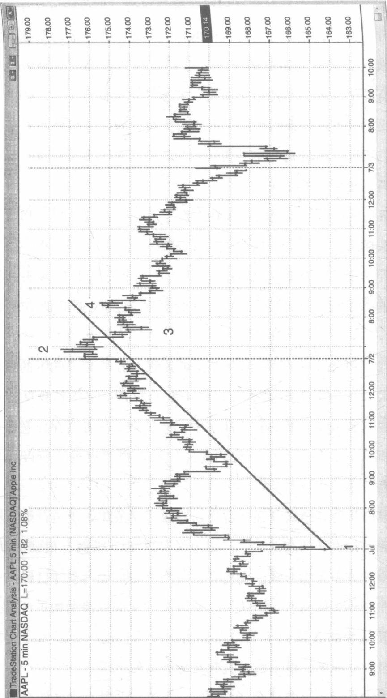  
图24.15 AAPL中的最佳交易

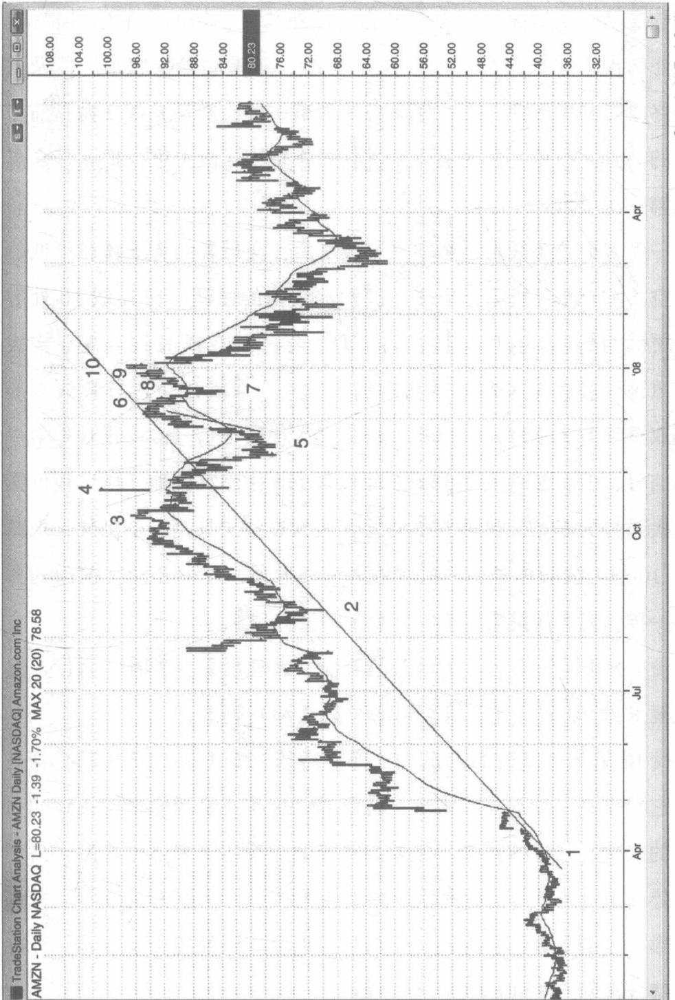  
图24.16 AMZN中的最佳交易

在一条多头趋势线被强势向下突破之后，交易者们将准备在更低的高点做空。AMZN日线图上形成一波两浪结构的回调，在K线10处形成一个更低的高点。有些交易者们认为它与K线3或K线4高点构成一个双重顶，当然与K线6的高点也构成一个双重顶。它与K线6形成一个双重顶空头旗形，所以是一根二次入场做空信号。K线6是第一个入场信号，但在K线6之前的上涨包含了太多多头动能，所以很可能不是空头趋势的起点。另外一些交易者认为K线4只是一个例外，把截至K线10的上涨看作是一种形式的大型楔形顶，其中K线2前面的高点是第一推，K线3是第二推，K线10是第三推。

K 线 7 突破了一条较小的多头趋势线，表现出更多的看空力量，然后在截至 K 线 10 的反弹中再次测试 K 线 3 和 4 的高点。

K 线 10 是 K 线 7 开始的迅猛反弹之后的三次上推，交易者们总是必须把它看作是一种形式的楔形反转形态。这是交易者们希望找到的一个不错的二次入场做空机会。重要趋势突破（截至 K 线 5）之后，出现测试趋势高点（K 线 4）的两浪反弹结构中一个由小楔形构成的双重顶空头旗形，当交易者们在寻找一个信号可以以有限的风险做空时，所有类型的信号在同一时间出现了。

如图 24.17 所示，高盛集团（GS）在这张日线图上的最佳交易包

图24.17 GS日线图中的最佳交易

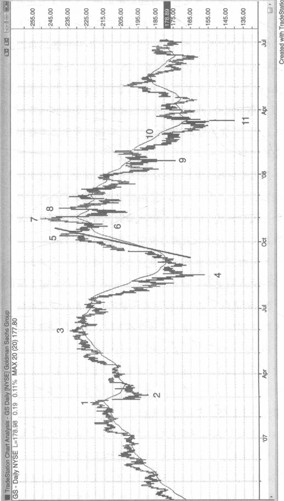

括：K线3更高的高点的重要趋势反转和楔形顶；K线4卖出高潮之后更高的低点和小型双重底多头旗形；K线7更高的高点（高于K线5和3）、最终旗形，以及扩张三角形顶（它是一个小型扩张三角形的第一次入场，其中K线5前面的暂停是第一推，K线5是第二推）；K线8的更低的高点；K线9后面的低点2和楔形空头旗形；均线附近的K线10低点2反弹做空机会；K线11岛形底和扩张三角形多头旗形（K线2是第一次下推，K线4是第二次，记住，扩张三角形多头旗形常常跟在扩张三角形之后）。

虽然一波强势反弹可能是一轮多头趋势的一部分，但它也可能只是对震荡区间顶部的一次冲击测试，是由卖出真空现象产生的反弹。空头预期市场向上超过K线3的高点，所以他们会等待市场到达那里后才会去做空。在从K线4开始的上涨过程中，他们一直是看跌的，但是在市场按他们的预期向上突破K线3的高点之前，做空是不合理的。如果他们认为市场将会涨得更高，那么在到达他们认为不会大幅上涨的价位（那将是一个新的高点）之前就做空是愚蠢的。当K线3之前的反弹浪向上超越K线1的高点时，他们看到市场下跌，他们预期这次也发生相同的现象。由于这是第三次上推，所以他们可能会在延长的抛盘起点做空，抛盘应该至少包含两条腿。由于那是一个扩张三角形顶（K线1、2、3、4和7），所以一个合理的目标是运动至K线4下方，在那里，市场可能形成一个扩张三角形的多头旗形。

K 线 11 是扩张三角形多头旗形中的一个入场做多信号。虽然这是一个合理的交易架构，但它不如这一章所讲的其他反转强。

如图 24.18 所示，微软（MSFT）这张 5 分钟图上的最佳交易包括：K 线 3 楔形空头旗形；K 线 4 更低的低点重要趋势反转和小型楔形底部；K线5小型和大型的低点2反弹做空信号；K线6更高的低点重要趋势反转、楔形多头旗形，以及双重底多头旗形；K线9两浪结构更高的高点重要趋势反转、小型高潮和通道顶部做空机会，以及楔形空头旗形（K线3、7和9）。

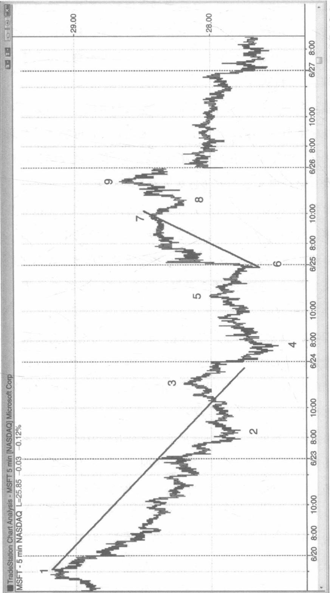  
图24.18 MSFT中的最佳交易

虽然截至 K 线 3 的反弹向上大幅突破空头趋势线，但是 K 线 4 的抛盘又大幅跌破 K 线 2，所以交易者们在认为趋势反转可能进行之前需要一个更高的低点。K 线 6 是一个更高低点和一个双 K 线反转，这提醒交易者们在次日第一根 K 线向上超越双 K 线反转时买入。

截至 K 线 8 的下跌运动向上突破多头趋势线后，截至 K 线 9 的反弹是一个两浪结构的更高的高点。它也是从 K 线 4 低点开始的第三次上推，K 线 5 和 K 线 7 是头两次上推。有些交易者把那波反弹看作是一个大的楔形空头旗形，其中 K 线 3 是第一推的结束，K 线 7 是第二推的结束。

如图 24.19 所示，Oracle（ORCL）的这张 5 分钟图上的最佳交易包括：K 线 1 更低的低点的重要趋势反转（离开前一低点的反弹向上突破一条陡峭的空头趋势线），K 线 4 两浪结构更高的高点重要趋势反转和小型楔形顶。

向震荡区间顶部的迅猛反弹通常是由真空效应引起的，而不是新的趋势。市场具有惯性，当它在交易区间内时，大部分突破尝试失败。空头与其市场会测试 Oracle 过去一两天在 5 分钟 K 线图上形成的交易区间的顶部，所以在市场达到那一区域之前，没有理由做空。这使得市场在截至 K 线 2 的反弹过程中成为单向市场，但是一旦市场到达交易区间顶部，空头便突然出现做空。现在他们预期市场在没有回调的情况下不会大幅上涨，于是他们积极做空。截至 K 线 4 的三次上推是一个在双 K

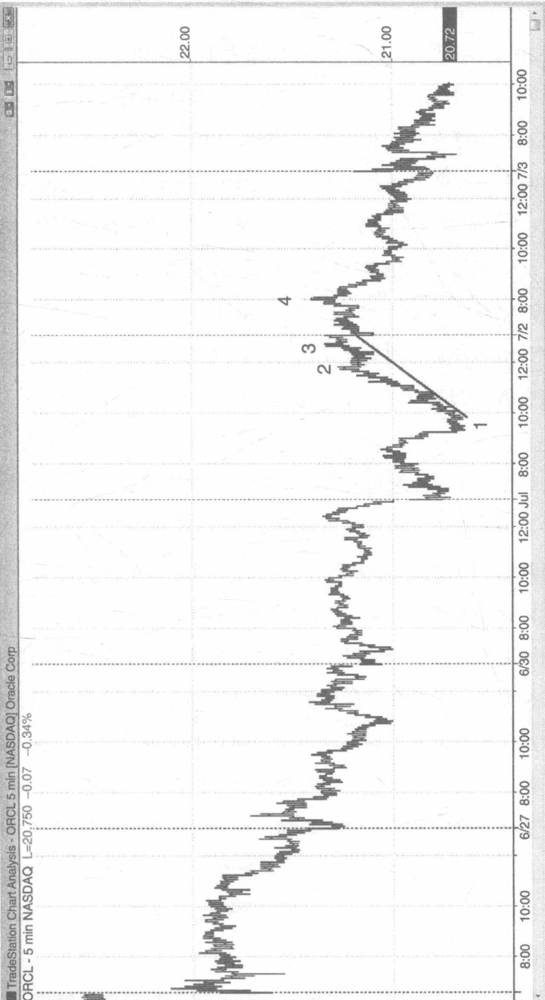  
图24.19 ORCL中的最佳交易

线反转下方做空的极好架构。

图 24.20 中，右侧 5 分钟电子迷你图表上的最佳交易信号包括：K 线 6 开盘反转；K 线 7 最终旗形顶和楔形顶（K 线 6 前一根 K 线高点是第一波上涨浪，尽管它是一根阴线）；K 线 8 楔形多头旗形和更高的低点；K 线 9 向上突破微型空头通道后 K 线 10 是突破后的回调买入机会；K 线 11 低点 2 反弹做空和双重顶（与跌至 K 线 8 的楔形的顶部构成）做空机会；K 线 12 的大型两浪结构（K 线 10 是第一次下推浪）的更高的低点重要趋势反转（K 线 12 是从跌至 K 线 10 的小空头趋势，并从 K 线 6 的大空头趋势开始的向上反转）；K 线 14 更高的低点重要趋势反转和二次入场突破回调买进信号（它也是一个头肩底的右肩，其中 K 线 10 是左肩）。

虽然大部分学术专家和电视权威辩称大盘中的所有运动都是以谷歌的总和基本面为基础的，但政治事件常常会引起巨幅波动。一个明显的例子是共和党在1994年接管国会时引发的不可思议的多头趋势，它常常被称为克林顿超级多头市场。2008年的崩盘是另一个例子。这轮空头趋势和恐慌抛盘是由次贷问题引起的，还是国家认识到奥巴马即将入住白宫的直接结果？虽然你必须根据图表显示的来进行交易，但无论你的政治倾向是什么，试着去理解政治会如何影响市场是非常有意思的。

如此完美的一天！如果你观察右侧的5分钟图，那么会看出外形是一个普通的更高的低点的空头趋势反转，但通过右图的价格标尺可以看到有些K线的高度超过了30个点，而一般交易日内K线的平均高度大约是2个点。这是2008年崩盘中这一周道琼斯工业平均指数下跌 $20\%$ 后，市场尝试至少形成一个临时性的底部。一年多以前我便告诉我的朋友们，道指会在2008年跌破10000点，理由是它看起来已经进入一个多年的震荡交易区间。我们可能已经经过一个顶部，卖盘可能会带来市场更低的价位。不过震荡交易区间是市场更常见的一种情况，所以更容易出现。

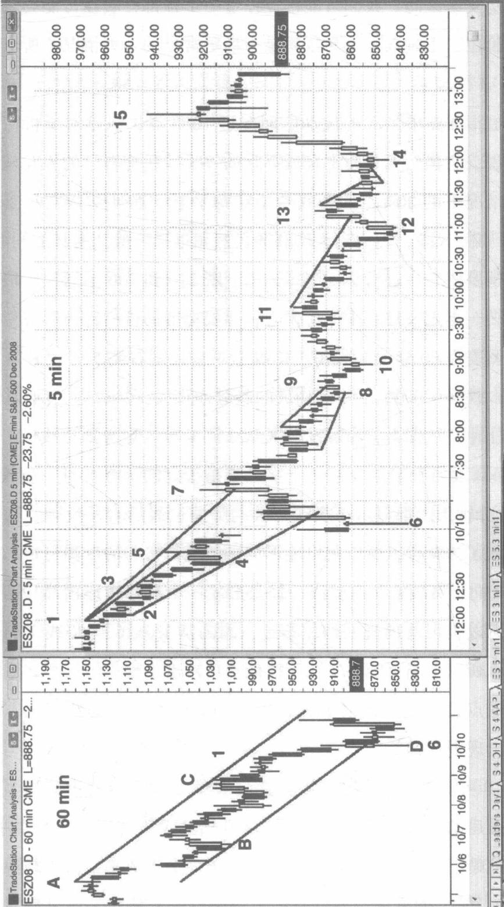  
图24.20 电子迷你开盘反转

虽然道指在图中当天的波动区间接近 1000 点，但是对于价格行为交易者来说，它仍然只是非常普通寻常的一天。我把自己的头寸规模削减至正常情况下的 20%，因为我希望在每手电子迷你期货交易上承担大约 10 个点的风险，然而当天的利润仍然超过了一般交易日的利润。

今天是星期五，道指这一周每天都下跌200到700个点，所以很可能尝试反转。不过，你必须保持耐心，寻找标准的价格行为形态。

左侧图表是60分钟K线图，K线D（它也是右侧5分钟K线图上的K线6）跌穿了K线A和C构成的趋势通道线，然后向上反转。

在 5 分钟 K 线图上，市场跌破 K 线 2 到 K 线 4 趋势通道线后，K 线 6 形成一条巨大的十字星 K 线。十字星不是很好的信号 K 线，但是在 5 分钟和 60 分钟图上都显示市场在突破趋势通道线后有所反弹，而且道指已经下跌了 700 点，所以很可能形成一波值得参与的反弹行情。

K 线 7 向上突破空头趋势线，但是形成一个最终旗形顶部和两浪上涨结构，所以很可能出现回调。不过，因为从 K 线 6 到 K 线 7 的反弹非常强劲，所以市场可能在二次下探低点后再次出现一波反弹。耐心等待更高的低点是比较谨慎的做法（因为考虑到上涨的动能很强，所以不太可能出现更低的低点）。

K 线 10 可能是一个底部，因为它是 K 线 8 楔形突破后的一个更低低点的突破后的回调。然而，从 K 线 7 开始的下跌持续了一个多小时，而且非常陡峭，所以在最后触底之前，很可能会形成第二次下跌浪。

截至 K 线 11 的上涨运动突破了另一条空头趋势线，所以表明多头

力量正在集聚。

与 K 线 10 相比，K 线 12 是一个更低的低点，所以它可能是当天一个底部（相比 K 线 6 来说是更高的低点），不过，考虑到 K 线 12 之前的下跌浪空头力量仍然很强劲，所以市场可能会再次探底。

K线13之前的反弹包含几根大阳线，它突破了另一条空头趋势线（译者注：这里原文是多头趋势线，但应该是笔误）。

K 线 14 是一条尺寸不错的多头反转 K 线，是一个微型趋势线的突破。与 K 线 12 相比，这也是一个更高的低点，所以这里很可能是最终的低点。果然如此。这是 K 线 12 成为 K 线 6 之后的第一个跟高的低点，而且是对当天空头趋势低点的一个很好的测试。这是当天的 yibi 交易，在 K 线 7 之前强势上涨之后，你需要一直等待的一笔交易机会。当天还有其他很多交易信号，但这一个是比较容易预期的，而且它表现得非常完美。在 5 分钟和 60 分钟图上，有过一些趋势通道线的突破，K 线 7 之前的一波反弹使得之后市场很可能会形成一个更高的低点。K 线 12 之前的两浪结构的回调可能形成一个 60 分钟更高的低点，随后在 K 线 14 出现的 5 分钟的更高的低点确认了 K 线 12 就是那个更高的低点。你不需要 60 分钟图也可以做到这笔交易，我当时就没有使用。我在这里加上它的目的是为了说明，较高的时间框架上也有力量在起作用，从成交量上可以清楚地看到机构正在关注它们。

K 线 15 是当天创新高之后的一个回调。

K 线 10 的双 K 线向上反转，是一个大约有 60% 胜率可以赚取波段利润的信号案例，所以对于所有交易者（包括初学者）来说，都是一个很棒的信号。K 线 4 是空头趋势中的一根缺口 K 线，它常常引出对空头低点（此时是 K 线 2）的测试，然后形成一波反弹，最少包含 10 根

K线和两浪结构。K线6之前的下跌势头太强，所以交易者们不敢入场做多。K线8是一个合理的买入位置，因为它是向下突破K线2之后的第二次反转尝试，一个扩张三角形底部（当天第三根K线是第一次下推，K线2是第二次），K线7是空头旗形之后的一个最终旗形反转，还是一根大阳线。扩张三角形底部是一种重要趋势反转的信号。然而，由于K线4附近的上涨浪和K线6之前的下跌浪都非常强烈，所以大部分交易者不会把这个叫作重要趋势反转，而是用其他的名称（不过在15分钟图上它几乎肯定是一个外观很棒的重要趋势反转形态）。K线10是一个已经很强的更高的低点的入场做多形态中的第二次入场信号。交易者们在K线10的上方买入，加上它是双K线反转形态的第二根K线，所以交易者们把他们的初始保护性止损设置在它的低点下方。一旦市场到达两倍风险处，他们就部分或者全部获利了结，让头寸的剩余部分随着向上的波段自由奔跑，把跟踪止损调整至最近的更高的低点下方。有些人会在K线19双重顶（与K线14构成的）和楔形（K线12、14、19以及14、16和19）下方离场，还有一些人则会继续持有，一直将止损设在K线17下方。

如图 24.21 所示，美国 10 年起中期国库券期货 5 分钟图上的最佳交易包括：K 线 4、7 和 10 处的最终旗形反转；K 线 3 处的小型低点 2；K 线 6 处的高点 1；K 线 11 处的楔形空头旗形二次入场信号。

最终旗形常常提供高胜率的反转交易。

K 线 4 是只有一个阴线实体的水平空头旗形之后的双 K 线反转。空头旗形中的阳线实体是买盘力量增强的征兆。

虽然 K 线 5 的大阳线是一波高潮，但 K 线 6 从高点 1 回调后的点位也是一个不错的回调买入机会，预期在如此强劲的动能之后，至少会出现短线的上涨。另外，在K线6之前的那根空头内含线下方做空的空头被套，他们会在K线6的上方平仓止损。

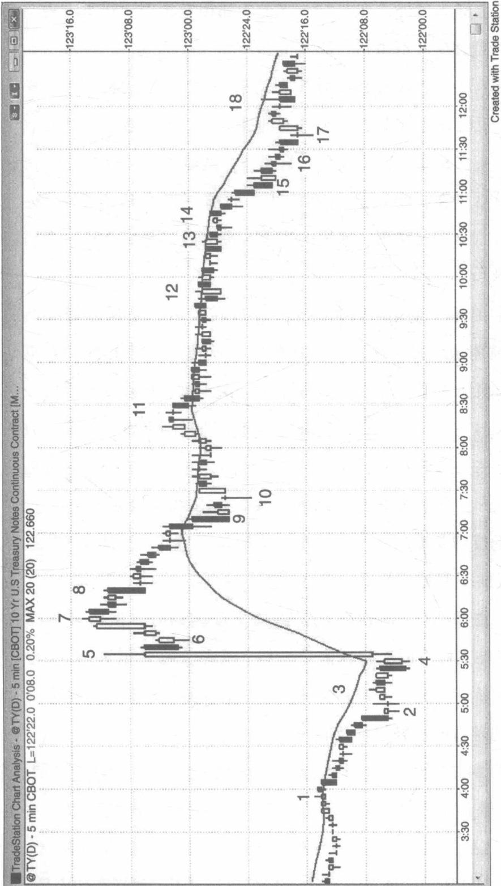  
图24.21 中期国库券中的最终旗形

K 线 7 是一个双 K 线反转形态的第一根 K 线，第二根 K 线是一根大阴线。反转发生在略高于 K 线 5 的高点处，所以多头显然是急于获利了结，空头只是在等待市场超越 K 线 5，然后做空。这是一个很好的最终旗形做空机会，特别是由于 K 线 7 的前一根 K 线也是一条大阳线，所以是第二波买入高潮。连续的买入高潮之后，至少会有一个两浪结构的调整。

K 线 10 是一条相对较大的十字星反转 K 线，是从 ii 最终旗形突破（ii 形态常常成为最终旗形）开始的向上反转的信号 K 线。它也是一个小型楔形多头旗形，其中 K 线 6 是第一次下推，K 线 9 是第二次下推。

K 线 11 是从 K 线 10 为起点的小型上涨高潮之后，市场形成一个水平的最终多头旗形，之后开始向下反转的二次入场信号。它也是一个楔形空头旗形，其中 K 线 9 后面的多头内含 K 线是第一次上推，从 K 线 10 开始的反弹是第二次上推。最后，它是 K 线 10 之前强下跌趋势后的一个均线缺口回补后的做空信号。

K 线 12 和 13 是潜在的双 K 线向上反转信号，但信号并没有被触发。市场一直没有向上超越信号 K 线。有些交易者把 K 线 12 看作是一个最终旗形买入信号，其中 K 线 12 之前的紧凑交易区间可能成为 K 线 12 之后的抛盘的最终旗形反转形态。

如图 24.22 所示，这张 5 分钟电子迷你图表上的最佳交易信号包括：从前一天低点（形成于 K 线 1 后面的第三根 K 线）开始的双 K 线向上反转；K 线 3 处的双重顶；K 线 7 处的楔形空头旗形；以及带有一定趋势性的区间震荡日和台阶形态中形成的 K 线 9 小型最终旗形和向上反转。

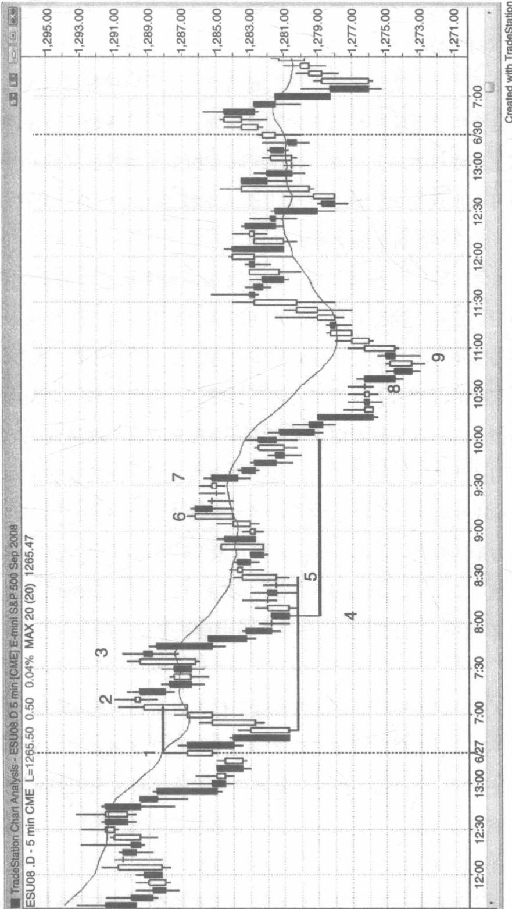  
图24.22 电子迷你震荡区间交易中的最佳交易

当一天不是趋势日时，那么它就是一个区间震荡日，或者至少会包含大量的双向交易。

K 线 2 取代了开盘的高点，所以聪明的交易者们会寻找二次入场做空机会，这个机会出现在 K 线 3 的双重顶处。当天一开始的波段常常是以一个双重顶或双重底开始的。波段区间大约是平均日区间的一半，所以当天很可能出现突破，成为一个上涨或下跌的趋势中的交易区间日，然后回调，测试初始区间的突破价位。

K 线 4 之前的空头高潮使得市场转变为总是在场策略的空头状态，于是交易者们准备在反弹时做空，预期市场会向下突破，然后向下形成一波近似的等距运动。截至 K 线 6 的多头通道是一波三浪推进式的反弹，包含很多重叠的 K 线和几次微型通道反转尝试。它比 K 线 4 之前的抛盘力量要弱很多。一旦交易者们认为市场不会出现对这一通道的强势多头突破，他们就认为这个通道只不过是一个空头旗形，随后会迎来一波空头趋势。K 线 6 离 K 线 3 下方空头的盈亏平衡点还差一个跳动，这也显示了空头力量的强大。他们通过在 K 线 6 积极做空保护了自己的止损。

在 K 线 6 双 K 线反转后的十字星 K 线或者其上方，激进的交易者会设定限价单做空。他们认为这是一个很可能失败的弱高点 1 回调买入信号。

K线9是一根很强的多头反转K线。但是由于它与前一根K线的重叠非常多，所以它的作用就像是双K线反转。由于它的高点与前一根K线的高点处于同一个价位，所以交易者把它看作是双K线反转或者多头反转K线都没有关系。无论哪种情况，它都是趋势性交易区间日内的一个强反转信号，而且是在一波向下探底运动的区域，之前是K线8最终旗形。它也是当天第三次下推。所有这些因素都促使交易者们认为市场至少会形成一波两条腿的反弹，来测试K线4的低点价位。当K线9超越它前面的多头反转K线时买入，因为它是一个大约有 $60\%$ 胜率的波段交易信号，所以对于所有交易者（包括初学者）来说，都是一个很不错的信号。对于在从K线8下方出发的低点2最终旗形开始的反弹，以及大型抛物线楔形底部（第一次下推结束于K线1后面的第三根K线，第二次结束于K线4），多头反转K线是一根强的信号K线。虽然K线9是一根大阴线，但它没有触及多头信号K线下方的保护性止损。另外一些交易者在K线9上方买入，因为它是一个二次入场买入信号，与那条多头信号K线构成一个微型双重底。它很可能继续上涨，形成一波测试运动，测量的基准是微型双重底的高度（大约是从那条多头K线底部到K线9顶部的高度的两倍），由于出现一个大的底部形态，所以上涨的幅度可能大得多，比如至少包含10根K线和两浪结构。

注意，有几个微型反转，而大部分反转来自双重顶和双重底、微型双重顶和双重底，以及最终旗形，几乎总是如此。很多交易者不会选择反转交易信号，除非这些架构中的一个出现。

如图 24.23 所示，这张 5 分钟电子迷你图表上的最佳交易包括：缺口高潮和通道底部之后的双 K 线反转 K 线 1；当日新高以及高潮和通道顶部的反转 K 线 2；微型通道失败突破的 K 线 3（作为低点 1）；当天第三次下推、更低的低点，以及交易区间底部的最终旗形突破和向上反转 K 线 5；双重顶、高潮和通道顶、低点 4 和交易区间顶部 K 线 6。

在一个没有明确趋势的交易日内，交易者们应该准备在新的极点反向入场，尤其是二次入场和楔形。

K 线 1 是一个楔形反转，反转 K 线很强。

K线2是一个双重顶、一个楔形顶和一个二次入场的均线缺口K线

高级反转技术分析
价格行为交易系统之反转分析（下册）  
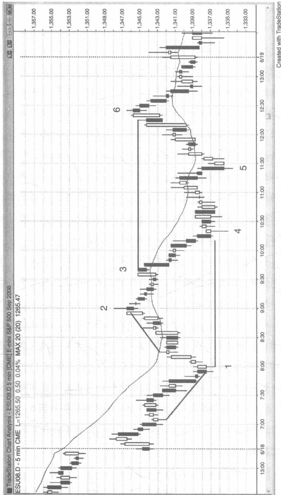  
图24.23 电子迷你期货中没有明确趋势时的几笔最佳交易

做空信号。

K 线 3 是突破测试信号 K 线，它击中了空头设在 K 线 2 下方的盈亏平衡止损。

K 线 4 是陡峭下跌中的一个十字星。由于它可能仅仅转变成一个单 K 线或者双 K 线的空头旗形，所以交易者们等待二次入场买入。激进型交易者可能设定限价单在 K 线 4 后一根 K 线低点或者其下方买入，预期形成第二波上涨浪。他们把这个看作是弱低点 1 的新底突破后的向上反转。构成信号 K 线的内含 K 线以上涨收盘。

K线6是一个低点4的做空信号，是向上突破波段高点K线3后的反转。

虽然在震荡区间的中部做空，胜率只有 $50\%$ ，但如果利润目标也就是回报是风险的两倍，那么可能也是一笔最佳交易。如图24.24所示，5分钟电子迷你期货数周以来处于一轮强多头趋势中，在K线7形成一条均线缺口K线。这常常会引起对多头高点的最后一次测试，然后便会形成至少包含两浪结构、幅度更深的调整。K线10开盘向下小幅跳空，然后立即上涨，刚好超越均线。空头正在寻找第二浪下跌，但不确定K线10的单K线下跌是否足以构成第一浪。当一波运动不清晰时，通常没有足够的交易者认为它会成功，所以没有足够的交易者在它上面押注。结果在运动变成比较清晰之前，市场没有更强的力量推动。K线12之前的两浪结构引发了K线13的两条腿反弹，有些交易者们把它看作是一个小的楔形空头旗形。还有一些交易者们把它看作是一个头肩顶的右肩，K线6是左肩。有些人也认为它与K线11构成一个双重顶空头旗形。它是一个低于K线9高点和K线11前后高点的高点，可能会是一波较大级别的第二浪下跌的起点。

图24.24 胜率只有50%时，利润目标必须是风险的两倍

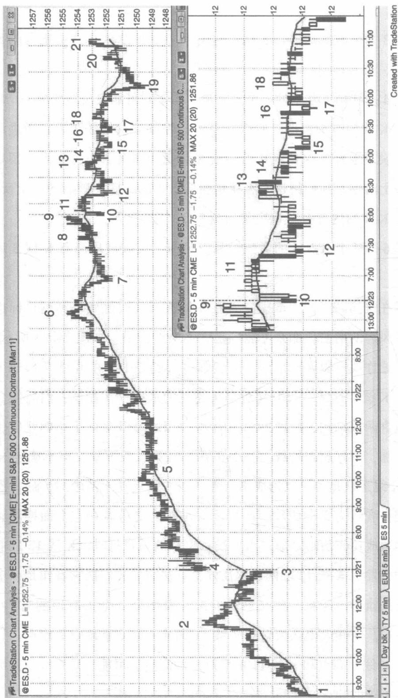

由于 K 线 1 下方做空是在一个两日交易区间的中部做空，所以等距运动的方向概率大约是 50%。下跌 1 点之前上涨 1 点的概率是 50%，上涨 1 点之前下跌 1 点的概率也是 50%。对于幅度为 2、3、4 个点的等距运动也是如此。一般而言，当市场处于震荡交易区间内时，如果市场已经上涨了 5 到 10 根 K 线，那么交易者们应该只寻找做空的信号。K 线 11 是从开盘低点开始的第八根 K 线，而且随后一根 K 线标志着市场第三次跌破前一根 K 线的低点。交易者们在这里做空，甚至是在第一次或者第二次尝试下跌时做空，希望足够多的交易者把这里看作是一个潜在的更低的高点，于是预期出现更多的卖盘。由于它的说服力不足，所以直到出现 K 线 13 这个更清晰的高点，下跌运动才开始。

那么，为什么当胜率为 $50\%$ ，而且位于多头趋势内一段交易区间的中部时，在K线11附近做空是一笔最佳交易呢？记住，交易者方程式有三个变量，除了胜率之外，你还必须考虑回报和风险。由于过去一个月左右电子迷你的平均日区间超过10个点，而今天的区间只有两个点，而且过去一两年中区间在5点或6点之下的交易日屈指可数，所以，今天的区间的收盘前增至两倍或三倍的概率很高。问题是，交易者们不知道突破是向上还是向下，还是既有向上突破又有向下突破。由于市场已经在一段区间交易内上涨了8根K线，所以概率偏向于近期内下跌。交易者们完全可以做空，把保护性止损设置在K线11信号K线的上方，在入场点下方4点处设置一张双向（OCO）限价单，然后耐心等待。由于存在如此多的不确定性，所以仅当他们甘愿经历回调时才会做这笔交易，而回调在交易区间中是不可避免的。实际风险只有4个跳动，所以交易者们正在冒着4个跳动的风险去博取16个跳动的利润，而且拥有大约 $50\%$ 的成功率。尽管当时看起来并不那么好，但这会使得它成为一笔极

价格行为交易系统之反转分析（下册）

好的交易。

一旦出现一条大型的空头突破 K 线，然后立即在 K 线 12 出现后续跟进做空力量，那么对于大部分交易来说，市场就是总是在场策略的空头，他们会假定市场保持空头状态，除非出现总是在场策略的多头买入信号，或者直到市场向上突破从 K 线 11 后面的小型阴线开始的空头下跌高潮的顶部。K 线 13 准确无误地测试了那一根 K 线的高点，市场最终下跌至 K 线 19。K 线 19 的低点比 K 线 11 信号 K 线低了 17 个跳动，而且 K 线 19 拥有一个多头实体。这可能是一个 17 跳动失败。也就是说，很多空头提早在信号 K 线下方 16 个跳动而不是 17 个跳动处获利了结。他们在距离 4 点运动 1 个跳动处离场，那是空头势头减弱的一个征兆。市场触及限价单，让空头以 4 个点的利润离场，那么那根 K 线成为一条多头反转 K 线。由于 17 跳动失败，大部分的空头会在 K 线 19 多头反转 K 线上方离场，获利 11 个跳动，而不是希望市场下跌，给他们原来计划的 16 个跳动的利润。

在圣诞节前的一周，假期前后的平均日波动区间比较小。过去一两周中有几天的区间小于7个点。另外，由于初始风险只有4个跳动，而不是通常的7个或者8个跳动，所以很多交易者认为较小的风险和较小的近期平均日波动区间意味着赚到4个点的可能性也比较低。这些交易者中很多预期17个跳动失败，把限价单设在入场点下方15个跳动处，而不是下方6个跳动处（译者注：这里应该是16个跳动处）。每当一波运动有可能提前结束时，很多交易者会使用小于正常值1个跳动的限价单，因为他们知道市场常常会击中明显的目标价位，但是会在执行获利了结限价单前反转。而另外一些交易者则将获利了结限价单设在入场点位下方3个点处，显然他们都能赚到这3个点的利润。
